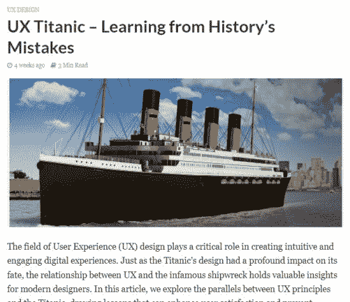
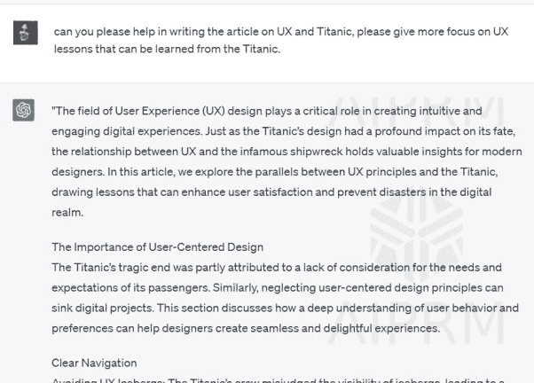
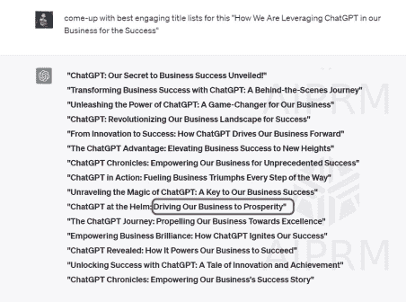
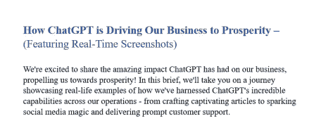

|  |  |  |
| --- | --- | --- |

# 轻松打造引人入胜的文章

示例 1

多亏了 ChatGPT 的自然语言流畅性，我们将内容创作提升到了一个全新的水平！就像有一位熟练的作家在我们身边一样。看一看展示 ChatGPT 如何轻松打造引人入胜文章的实时截图。借助 ChatGPT 的帮助，我们现在有更多时间释放创造力，并添加让我们的内容闪耀的特别之处。对我们来说，这是一个改变游戏规则的工具！

文本内容的 70%至 80%是使用 ChatGPT 生成的。

实时链接：[`easyux.net/ux-titanic-learning-from-historys-mistakes/`](https://easyux.net/ux-titanic-learning-from-historys-mistakes/)

请查看下面的“提示截图”及其输出，这是在创建本文时使用的。

吸引眼球的标题！

一个吸引点击的标题就像魔法一样!!! ChatGPT 施展其魅力，确保我们的内容在数字领域脱颖而出。

下面是由 ChatGPT 生成的几个标题列表选项。虽然我们没有完全使用原样的标题列表，但我们通过添加自己的词语进行了一些修改。红色标记的边框区域表示我们利用了 ChatGPT 分享的选项。请注意，您可以灵活调整标题以符合您的业务偏好和品牌。

下面是本电子书中使用的标题的实际截图。

