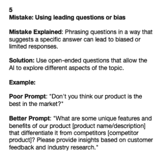
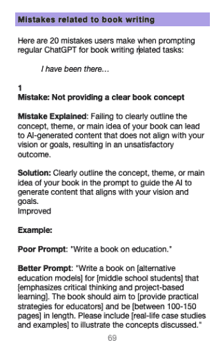
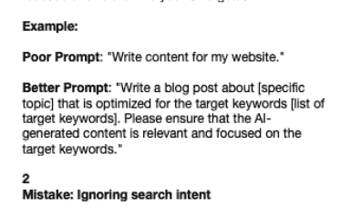

|  |  |  |
| --- | --- | --- |

# 接下来的页面

准备踏上一段激动人心的旅程，了解 ChatGPT 可能会犯的错误。 附有解决方案和示例。 这些与常见用法书写、搜索引擎优化和文案写作有关。

要求：只需要一个开放的头脑和学习的愿望。

我们将探讨定义和塑造 ChatGPT 性能的关键因素。 进入机器学习和自然语言处理领域。

每个伟大的英雄都有其致命弱点，ChatGPT 也不例外。

我们不会回避暴露模型的局限性，例如固有偏见、上下文意识、对提示工程的敏感性和事实错误。

我还会为您提供实用的解决方案，以克服这些挑战，确保您可以自信而熟练地运用 ChatGPT 的力量。

一旦您深入了解了 ChatGPT 的内部机制，我们将解决通用用户常见的错误、解决方案和示例。

掌握了新的知识和洞察力，您将能够理解这些错误背后的原因，并轻松地避开它们。

这将让您节省宝贵的时间，并集中精力提高您的输出质量，因为您将清楚地了解模型的能力和限制。

您将发现 20 个一般用途、搜索引擎优化、文案写作和写书常见陷阱的宝贵见解。

我们将阐明在提示 ChatGPT 时清晰和巧妙的指令的重要性。

你将从本书中获得什么：

+   更好地理解 ChatGPT 的基本机制

+   对限制和偏见的认识

+   增强的引导构建技术

+   克服挑战的策略

+   ChatGPT 能力的整体视角

+   你将发现常见的陷阱和一般用途、搜索引擎优化、文案写作和写书的解决方案。

# 目录

接下来的页面

先从基础开始！

ChatGPT

这个工具

影响你的 ChatGPT 输出的因素

机器学习

变换器架构

自然语言处理（NLP）

注意机制和自我注意力

自监督学习

标记化和标记

神经网络的语义层

训练数据和理解

黑箱

关系

带着新的理解提示

ChatGPT 的局限性

固有偏见

上下文意识

对提示敏感

事实不准确

冗长

不当内容

你犯了这些错误吗？

一般错误

与写书有关的错误

与 SEO 任务相关的错误

与文案任务相关的错误

奖金

我最喜欢的 15 个提示技巧

结束

我们已经涵盖的内容

探索更多
