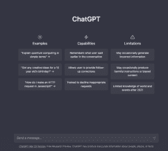
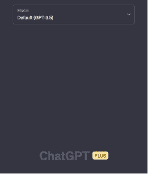

# ChatGPT

ChatGPT 代表 Chat Generative Pre-Trained Transformer。

聊天 - ChatGPT 旨在用于会话设置，例如聊天机器人或虚拟助手。

生成式 - ChatGPT 基于用户提供的提示生成新文本的能力。

预训练 - ChatGPT 已经在大量数据上进行了训练，使其能够生成高质量的文本，只需进行最少的额外训练。

转换器 - ChatGPT 用于处理和生成文本的神经网络架构。

### 如何访问 ChatGPT

要个人或专业使用 ChatGPT，请访问此网站。

[`chat.openai.com/auth/login`](https://chat.openai.com/auth/login)

当您打开链接时，您会看到这个。

ChatGPT 登录/注册页面

登录或注册创建账户。

ChatGPT 用户界面

### ChatGPT 平台布局

成功登录后，您将看到一个类似下面所示的文本框。

这是所有魔术发生的地方，也是您输入提示或输入的地方。

ChatGPT 的输入/提示文本框

ChatGPT：交互窗口布局

当您探索 ChatGPT 平台时，您会注意到在左上方，您将找到您的对话历史记录。

最顶部有一个开始新聊天的选项，我建议为每个话题创建一个新的聊天。

ChatGPT：新聊天菜单和重命名和删除聊天选项

当您处于聊天状态时，仔细观察，您会看到在当前聊天旁边有钢笔和删除图标。

这些选项可以让您重命名或删除您的聊天。我强烈建议为将来参考重命名您的聊天。

ChatGPT 根据第一个提示标签化聊天，这可能会使事情有点混乱。

您的账户菜单位于左下角，而主交互窗口占据中心舞台。

在这里，您将在顶部看到您的输入或提示，下面就是 ChatGPT 的输出。

如果您将鼠标悬停在用户标签上，您会注意到一个钢笔和纸张图标，这个选项可以让您编辑您的提示，保存并提交。

或者，您可以选择重新生成 ChatGPT 的输出。

ChatGPT：编辑提示/输入图标

ChatGPT：编辑、保存和提交提示选项

ChatGPT：重新生成 ChatGPT 输出选项

但是，我建议避免这两个选项，特别是如果您正在生成长篇内容，比如一本书或在线课程。

使用这些选项会创建一个左/右滑动菜单，其中包含所有迭代。这可能会变得混乱和令人困惑，特别是当你试图检索之前生成的内容时。

ChatGPT：ChatGPT 输出迭代

### ChatGPT 3.5 和 ChatGPT 4

OpenAI 最近将 ChatGPT 从 GPT 3.5 升级到 GPT 4。

你可能想知道，“有什么区别？”我会在另一章节中详细介绍所有细节。现在，让我简要介绍一下基本情况。

#### 有什么区别？

GPT 3.5 仅使用基于文本的提示，而 GPT 4 使用文本和图像输入。

不幸的是，图像输入功能尚未对公众开放。

GPT 4 更快，可以随时访问，而 GPT 3.5 仅在需求低时可用。

ChatGPT 3.5 对所有用户免费。你只需创建一个帐户即可。而要访问 ChatGPT 4，你需要升级到 ChatGPT Plus，进行每月 20 美元的订阅。（随时可取消。）

#### 访问 ChatGPT 4

一旦你处于 ChatGPT 3.5 布局，

暗黑模式

左侧有这个菜单，

左侧菜单。

注意“升级到 Plus NEW”。

点击进行升级并访问 ChatGPT 4。

这是随之而来的窗口。价格为每月 20 美元。你可以随时取消计划。

ChatGPT 4 升级页面

升级成功后，这将是你的新布局。

ChatGPT Plus 布局

要访问 GPT-4，点击下拉箭头。

GPT 模型菜单

你将看到一个菜单，选择 GPT-4 选项即可开始。

––––––––

ChatGPT：ChatGPT Plus 布局

在尝试真实的功能之前尝试一下。

Writesonic 免费访问 GPT-4

本书提供的提示模板适用于 GPT3.5 和 GPT4。

如果你刚开始使用 ChatGPT，它足够创建你所有的内容。

现在你已经与你的新助手相处，让我们更好地了解 ChatGPT。

我们便利的助手。
