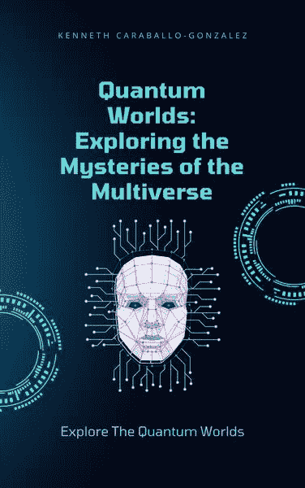

# （一）

简介：ChatGPT 是一种最先进的语言模型，改变了人类与技术互动的方式。在本书中，我们探讨了 ChatGPT 从一个小型项目发展到如今成为全球现象的历史。

通过与 ChatGPT 的创造者和开发者以及受到该技术影响的人们的访谈，我们深入了解了这种语言模型如何革新各个领域。我们了解到 ChatGPT 如何提高了自然语言处理的准确性，使得机器能够以前所未有的水平理解人类语言。

我们探讨了 ChatGPT 如何被用于开发新的应用程序和技术，比如聊天机器人和虚拟助手，使得沟通和信息检索更加高效和便捷。我们还研究了 ChatGPT 在科学研究中的应用，包括新药物的开发和复杂系统的研究。

但是 ChatGPT 并非没有争议。一些人认为其能力对隐私和安全构成威胁，而其他人担心 ChatGPT 可能被恶意使用。我们深入探讨了这些问题，并审视了这一强大技术的伦理影响。

最终，本书深入探讨了 ChatGPT 改变我们所知世界的潜力。在考虑技术的未来及其对社会的影响时，ChatGPT 肯定将发挥关键作用，而本书为这一开创性技术提供了引人入胜的介绍。

## 第一章：介绍 - ChatGPT 的崛起

近年来，世界目睹了人工智能（AI）和机器学习（ML）领域的一场革命。在这一领域最具突破性的发展之一是语言模型的崛起，这些模型使用复杂的算法来分析和理解人类语言，达到了前所未有的准确水平。在这些模型中，ChatGPT 已经成为一种领先技术，改变了人类与机器互动的方式。

ChatGPT 是由 OpenAI 开发的一种最先进的语言模型，OpenAI 是一家致力于创建先进人工智能技术的研究组织。在其核心，ChatGPT 是一个可以处理和分析大量文本数据的深度神经网络。通过机器学习算法，ChatGPT 已经学会了理解人类语言的细微差别，包括语法、句法、上下文和情感。

但是，ChatGPT 与其他语言模型的不同之处在于其能够生成自然听起来的回复。通过分析大量人类语言数据集中的模式，ChatGPT 可以生成对文本输入的回复，听起来非常像是由人类撰写的。这导致 ChatGPT 被广泛应用于各种应用程序，包括聊天机器人、虚拟助手和客户服务软件。

ChatGPT 的崛起简直是一场流星般的崛起。2019 年，OpenAI 发布了第一个版本的 ChatGPT，该版本经过大规模的互联网文本数据集训练。这个版本被称为 GPT-2，很快因其能够对用户查询生成连贯和语法正确的文本回复而引起关注。但真正让 GPT-2 脱颖而出的是其神奇的能力，能够生成听起来像是由人类撰写的文本。

GPT-2 的发布在人工智能社区引发了一波兴奋，研究人员和开发人员急切地探索这项新技术的潜在应用。一些专家预测 ChatGPT 可能会彻底改变自然语言处理领域，而其他人则将其视为改善客户服务和沟通的强大工具。

从那时起，ChatGPT 继续发展和改进。OpenAI 发布了语言模型的新版本，每个版本比上一个更加复杂和强大。如今，ChatGPT 被广泛应用于各种应用程序，从聊天机器人和虚拟助手到科学研究和药物开发。

但是，伴随着巨大的力量而来的是巨大的责任，ChatGPT 的崛起并非没有争议。一些专家对 ChatGPT 可能被恶意使用，比如制造假新闻或宣传活动，表示担忧。其他人担心 ChatGPT 对工作和就业的潜在影响，因为这项技术可能会在某些领域取代人类工作者。

尽管存在这些担忧，ChatGPT 的崛起代表了人工智能和机器学习领域的一个重要里程碑。这项技术有潜力改变我们与机器互动的方式，并彻底改革各行各业。随着我们继续探索 ChatGPT 和其他先进语言模型的能力，我们肯定会在未来几年看到更多令人瞩目的突破。

## 第二章：自然语言处理的历史

自然语言处理（NLP）的发展可以追溯到 20 世纪 50 年代计算机的早期。当时，研究人员正在探索计算机理解和分析人类语言的潜力。然而，进展缓慢，直到 20 世纪 70 年代才取得重大突破。

NLP 中最早的成功之一是麻省理工学院的 Terry Winograd 开发的名为 SHRDLU 的系统。该系统使用一组规则来解释和响应英语中的简单命令，例如“拿起红色的方块”。虽然 SHRDLU 在功能上有限，但它代表了 NLP 的一个重要概念验证，并为未来的进步奠定了基础。

在接下来的几十年里，研究人员继续完善和改进 NLP 技术。1980 年代的一个重大突破是开发了用于 NLP 的统计方法，这使得计算机能够更有效地分析语言数据。这导致了像潜在语义分析（LSA）这样的系统的发展，该系统可以自动识别大量文本数据中的模式。

20 世纪 90 年代，互联网的出现和数字内容的爆炸为 NLP 研究提供了新的机会。研究人员开始开发算法自动分类和总结网络内容，为现代搜索引擎和内容推荐系统铺平了道路。

2000 年代见证了机器学习算法的崛起和更复杂的 NLP 技术的发展。在这段时间内最重要的进展之一是机器翻译算法的发展，这使得计算机能够自动在不同语言之间翻译文本。

在过去的十年中，深度学习算法的发展引领了 NLP 研究的新时代。这些基于神经网络的算法通过允许计算机以前所未有的准确度分析和理解语言数据，彻底改变了这一领域。

深度学习的兴起为 ChatGPT 等语言模型的发展铺平了道路。这些模型能够处理和分析大量文本数据，学习理解人类语言的细微差别，并对用户查询生成自然语言响应。

尽管自然语言处理（NLP）的历史充满了许多成功，但也面临着重大挑战和挫折。一个主要挑战是开发能够理解人类语言细微差别的算法的困难，包括习语、讽刺和语境。另一个挑战是 NLP 技术的伦理影响，包括对隐私、偏见和潜在滥用的担忧。

尽管面临这些挑战，自然语言处理领域仍在不断发展和扩展，每年都会涌现出新的突破和创新。随着我们不断发展更复杂的自然语言处理技术，我们肯定会在未来看到更多令人瞩目的技术应用。

## 第三章：ChatGPT 的起源

ChatGPT 是由 OpenAI 开发的自然语言处理（NLP）模型，OpenAI 是由埃隆·马斯克、萨姆·奥尔特曼、格雷格·布罗克曼、伊利亚·苏茨克维尔等人于 2015 年创立的人工智能研究实验室。该模型首次于 2020 年 6 月推出，因其能够对各种提示生成类似人类回复而迅速引起广泛关注。

ChatGPT 的开发是 OpenAI 团队努力开发能够执行各种任务的先进 AI 模型的一部分。团队首先通过在大量文本数据上训练大规模神经网络来实现这一目标，使用了一种称为无监督学习的技术。这涉及向模型提供大量文本数据，并允许其自行学习单词和短语之间的模式和关系。

第一个版本的 ChatGPT，名为 GPT-1，于 2018 年发布。这个模型拥有 1.17 亿个参数，并能够对各种提示生成连贯的句子。然而，它在功能上仍然相对有限，OpenAI 团队继续努力改进模型。

2019 年，OpenAI 发布了该模型的更新版本，名为 GPT-2。这个版本更加强大，拥有 15 亿个参数，并能够对各种提示生成高度复杂的回复。然而，团队最终决定不发布完整版本的 GPT-2，出于对潜在滥用的担忧。

尽管遇到这些挫折，OpenAI 团队继续完善模型，在 2020 年发布了 ChatGPT 的最新版本，名为 GPT-3。这个模型比其前身更加强大，拥有惊人的 1750 亿个参数，并能够对各种提示生成非常类似人类的回复。

ChatGPT 的开发代表了自然语言处理领域的重大突破。通过在大量文本数据上训练模型，OpenAI 团队成功创建了一个能够理解和生成类似人类回复的模型。这项技术有可能彻底改变我们与机器交互的方式，为自然语言交流和机器辅助决策开辟新的可能性。

ChatGPT 最引人注目的特点之一是其能够随着时间学习和适应的能力。随着模型接触更多数据，它能够提高准确性并生成更复杂的回复。这意味着这项技术有潜力在未来变得更加强大和多功能。

然而，与所有人工智能技术一样，人们也对 ChatGPT 的潜在风险和伦理影响表示担忧。一些专家对技术被恶意使用的潜力提出了担忧，无论是由恶意行为者还是善意但误导的开发者。人们还担心模型中存在偏见和歧视的可能性，以及需要严格测试和监督以确保技术的安全性和有效性。

尽管面临这些挑战，ChatGPT 的发展代表着人工智能历史上的一个重要里程碑。凭借其理解和生成自然语言的能力，这项技术有潜力改变广泛的行业，从客户服务和医疗保健到教育和娱乐。随着我们继续开发和完善这项技术，我们肯定会在未来几年看到更多令人瞩目的应用。

## 第四章：ChatGPT 语言模型的发展

ChatGPT 语言模型基于一种称为变压器的神经网络架构。这种架构最初是由谷歌研究人员在 2017 年的一篇论文中提出的，并且已经成为自然语言处理领域中广泛使用的方法。

变压器架构旨在克服早期神经网络架构的一些限制，例如循环神经网络（RNN）。RNN 的一个关键挑战是它们往往难以处理长期依赖关系，这可能使它们难以捕捉语言数据中的复杂模式。

变压器架构通过使用自注意机制来解决这一挑战，该机制允许模型根据其与手头任务的相关性来关注输入数据的不同部分。这使模型能够捕捉长期依赖关系，并更有效地建模语言数据的结构。

为了开发 ChatGPT 语言模型，OpenAI 团队采用了一种称为无监督学习的技术。这涉及在大量文本数据语料库上训练模型，其中包括来自各种来源的数十亿个单词和短语，包括书籍、文章和网站。

在训练过程中，模型被提供连续的文本数据流，并被要求预测每个句子中的下一个单词。这个任务被称为语言建模，在自然语言处理中是一种常见方法，用于训练模型以理解语言数据的结构和模式。

随着模型接触越来越多的文本数据，它逐渐学会识别单词和短语之间的模式和关系。这使它能够对各种提示生成越来越复杂的响应。

在开发 ChatGPT 语言模型的过程中，一个关键挑战是管理训练所需的大量数据。为了克服这一挑战，OpenAI 团队采用了分布式训练方法，该方法涉及将训练过程分布在多个处理器和计算机上。

这种方法使团队能够扩大训练过程，以处理训练模型所需的大量数据。它还使他们能够尝试不同变体的模型架构和超参数，例如层数、每层神经元的数量和学习率。

由于这些努力，ChatGPT 语言模型已成为世界上最强大和多功能的自然语言处理模型之一。凭借其生成对各种提示的人类化响应的能力，这项技术有潜力彻底改变从客户服务和医疗保健到教育和娱乐等各行各业。

然而，与所有 AI 技术一样，人们也担心 ChatGPT 语言模型存在潜在风险和道德影响。一些专家对技术被恶意使用的可能性，无论是由恶意行为者还是善意但误导的开发者使用，表示担忧。

对于模型中存在的偏见和歧视潜力，以及需要严格测试和监督以确保技术的安全性和有效性也存在担忧。随着我们继续开发和完善这项技术，解决这些挑战并确保 ChatGPT 语言模型的好处以负责任和道德的方式实现将至关重要。

## 第五章：ChatGPT 对自然语言处理领域的影响

自 2019 年首次发布以来，ChatGPT 对自然语言处理（NLP）领域产生了重大影响。这项技术彻底改变了我们处理 NLP 任务的方式，并为该领域的研究和发展开辟了新的途径。

ChatGPT 影响自然语言处理领域的一个关键方式是推动了语言建模的最新技术。在 ChatGPT 发布之前，最先进的语言模型基于变压器架构，但比 ChatGPT 的模型要小得多，也不如其强大。

ChatGPT 的模型基于变压器架构，比以往任何语言模型都更大更强大。它经过大规模文本数据的训练，可以对各种提示生成类似人类的回应，使其成为目前存在的最复杂的 NLP 模型之一。

ChatGPT 的发布也引发了自然语言处理领域的创新和发展浪潮。许多研究人员和开发者现在正在努力改进这项技术，并探索其新的应用和用例。

ChatGPT 在聊天机器人和虚拟助手的发展中产生了重要影响。近年来，聊天机器人和虚拟助手变得越来越受欢迎，而 ChatGPT 的语言模型使得开发这些应用变得更加容易和高效。

借助 ChatGPT，开发者可以训练聊天机器人和虚拟助手理解自然语言查询并生成类似人类的回应。这导致了新型和创新的聊天机器人应用的开发，如客服机器人、个人理财机器人，甚至心理治疗机器人。

ChatGPT 影响的另一个领域是语言翻译和语言理解技术的发展。凭借其生成自然语言回应的能力，ChatGPT 有潜力显著提高语言翻译和理解应用的准确性和效率。

例如，ChatGPT 可用于开发实时语言翻译应用程序，可以准确地将一种语言的语音或文本翻译成另一种语言。它还可以用于开发更复杂的语言理解应用，如问答系统或情感分析工具。

然而，ChatGPT 对自然语言处理领域的影响并非没有挑战。与任何 AI 技术一样，人们担心模型可能存在偏见和歧视的潜在问题，因此需要严格的测试和监督来确保技术的安全性和有效性。

人们还担心这项技术可能被恶意行为者或善意但误导的开发者滥用。随着我们继续开发和完善 ChatGPT 和其他自然语言处理技术，解决这些挑战并确保技术的好处以负责任和道德的方式实现将至关重要。

## 第六章：ChatGPT 在聊天机器人和虚拟助手中的作用

聊天机器人和虚拟助手在我们日常生活中变得越来越普遍。它们可以在消息应用程序、网站甚至智能扬声器和移动设备上找到。这些应用程序使用自然语言处理（NLP）来理解用户查询并生成类似人类的回应。ChatGPT 在聊天机器人和虚拟助手的发展中发挥了重要作用，使创建这些应用程序变得更加容易和高效。

ChatGPT 的语言模型能够对各种提示生成自然语言回应，非常适合用于聊天机器人和虚拟助手。有了 ChatGPT，开发人员可以训练聊天机器人和虚拟助手理解自然语言查询并生成适当的回应，而不是依赖预先编程的回应或关键词匹配算法。

ChatGPT 还使开发人员更容易创建能够处理复杂查询和对话的聊天机器人和虚拟助手。在 ChatGPT 发布之前，聊天机器人和虚拟助手通常在处理开放性问题或后续查询方面能力有限。然而，有了 ChatGPT，开发人员可以训练他们的模型生成更复杂的回应，使用户更容易以更自然和直观的方式与这些应用程序互动。

ChatGPT 在聊天机器人和虚拟助手中的另一个好处是其能够随着时间学习和适应。聊天机器人和虚拟助手可以在大量数据语料库上进行训练，使它们不断改善理解和回应用户查询的能力。这意味着随着时间的推移，聊天机器人和虚拟助手可以变得更加准确和高效，提供更好的用户体验。

然而，ChatGPT 在聊天机器人和虚拟助手中的作用不仅仅是生成回应。它还可以用于开发更复杂的聊天机器人和虚拟助手应用程序。例如，ChatGPT 可以用于开发个性化虚拟助手，能够理解用户的偏好并提供定制的建议或建议。它还可以用于开发能够执行更复杂任务的聊天机器人和虚拟助手，例如预约或购买。

尽管 ChatGPT 在聊天机器人和虚拟助手中具有诸多好处，但也需要考虑一些挑战。一个挑战是语言模型中潜在的偏见。如果模型是在有偏见的数据上训练的，可能会导致聊天机器人或虚拟助手产生有偏见的回应。另一个挑战是确保聊天机器人或虚拟助手能够以安全和保密的方式处理敏感或个人信息。

总的来说，ChatGPT 在聊天机器人和虚拟助手的发展中发挥了重要作用。它生成自然语言回复的能力，随着时间的推移学习和适应，以及处理复杂查询和对话的能力，使得开发这些应用程序变得更加简单和高效。随着技术的不断发展，我们可以预期看到更多创新的聊天机器人和虚拟助手应用程序，使我们的生活变得更加轻松和便利。

## 第七章：ChatGPT 与客户服务的未来

ChatGPT 最有前景的应用之一是在客户服务领域。由 ChatGPT 驱动的聊天机器人和虚拟助手可以帮助公司提供更好更高效的客户服务，改善整体客户体验。

传统的客户服务渠道，如电话和电子邮件，对客户来说可能耗时且令人沮丧。由 ChatGPT 驱动的聊天机器人和虚拟助手可以提供更快速和更个性化的回复，缩短等待时间并提高客户满意度。聊天机器人还可以全天候提供支持，超出正常营业时间。

ChatGPT 可以帮助聊天机器人和虚拟助手与客户提供更自然和更类似人类的互动。通过生成更具对话性和不那么机械化的回复，聊天机器人可以让客户感觉自己在与真实的人交谈。这可以改善整体客户体验并增加客户忠诚度。

由 ChatGPT 驱动的聊天机器人和虚拟助手还可以被训练来处理更复杂的客户服务任务。例如，它们可以协助进行产品推荐，帮助客户浏览网站，甚至处理退货和换货。通过提供这种支持，公司可以减少客户服务团队的工作量，并使他们能够专注于更复杂的问题。

使用 ChatGPT 驱动的聊天机器人和虚拟助手进行客户服务的另一个好处是能够收集有价值的客户数据。聊天机器人可以被训练来识别客户咨询和反馈中的模式，提供关于公司可以改进产品或服务的见解。这些数据可以用来指导产品开发和营销策略，最终提高客户满意度和增加收入。

尽管潜在的好处，使用 ChatGPT 进行客户服务也存在一些挑战需要考虑。一个挑战是确保聊天机器人或虚拟助手能够以安全和保密的方式处理敏感客户信息。另一个挑战是语言模型中存在偏见的可能性，这可能导致偏见回复并对客户满意度产生负面影响。

总的来说，ChatGPT 有潜力通过提供更快速、更个性化和更高效的支持来彻底改变客户服务领域。通过利用自然语言处理和机器学习的力量，公司可以创建聊天机器人和虚拟助手，提供卓越的客户体验。随着技术的不断发展，我们可以预期在客户服务中看到更多 ChatGPT 的创新应用，最终导致客户更加满意，企业更加成功。

## 第八章：ChatGPT 在医疗保健中的应用

医疗保健行业是 ChatGPT 有潜力产生重大影响的领域之一。凭借其理解和生成类人回应的能力，ChatGPT 可用于创建虚拟助手，帮助医疗保健专业人员为患者提供更好的护理。

ChatGPT 在医疗保健领域的另一个潜在应用是开发虚拟护士助手。这些助手可以用于为患者提供基本的医疗建议和支持，例如提醒他们服药、回答有关病情的问题，并安排与医生或专家的预约。这将使患者能够在诊所营业时间之外获得支持，并减轻医疗保健专业人员的工作负担。

ChatGPT 还可以用于提高患者参与度和教育。由 ChatGPT 提供动力的虚拟助手可以用于以患者易于理解的方式解释复杂的医学术语。它们还可以根据患者的病史和症状提供个性化的健康建议。

在医疗保健领域，ChatGPT 的另一个潜在应用是开发虚拟治疗师。这些治疗师可以用于为患有焦虑、抑郁或创伤后应激障碍的患者提供心理健康支持。由 ChatGPT 提供动力的虚拟治疗师可以为患者提供一个安全和保密的空间来讨论他们的担忧，提供应对策略，并在必要时将他们转介给心理健康专业人员。

ChatGPT 在医学研究中也有潜在用途。例如，ChatGPT 可以用于分析大量的患者记录数据集，识别可能指示疾病风险或治疗效果的模式。这可能导致更个性化的治疗方案和患者更好的预后。

尽管在医疗保健中使用 ChatGPT 可能带来潜在好处，但也需要考虑一些挑战。一个挑战是确保虚拟助手能够以安全和保密的方式处理敏感的患者信息。另一个挑战是确保虚拟助手经过适当培训，能够提供准确的医疗建议和支持。

总的来说，ChatGPT 有潜力通过为患者提供个性化支持和提高医疗保健专业人员的效率来改变医疗保健行业。随着技术的不断发展，我们可以期待在医疗保健领域看到更多创新的 ChatGPT 应用，最终实现患者更好的健康结果。

## 第九章：ChatGPT 与药物开发

研发新药是一个复杂而耗时的过程，需要进行广泛的研究和测试。ChatGPT 在药物开发中的一个潜在应用是帮助简化流程，使其更加高效。

ChatGPT 可以用来分析大量科学数据，并识别潜在的药物靶点或治疗干预措施。通过在大量科学文献和临床试验数据上对 ChatGPT 进行训练，研究人员可以利用它来识别可能被忽视的模式和相关性。

ChatGPT 在药物开发中的另一个潜在应用是在临床试验设计中的应用。ChatGPT 可以用来生成逼真的场景，并模拟患者对不同药物治疗的反应。这可以帮助研究人员优化他们的临床试验设计，减少将新药推向市场所需的时间和成本。

ChatGPT 还可以用于开发虚拟药物筛选工具。虚拟药物筛选涉及使用计算机模拟来预测药物与体内不同蛋白质和分子的相互作用。通过在大量药物-蛋白质相互作用数据上对 ChatGPT 进行训练，研究人员可以利用它来生成关于新药在体内行为的预测。这可以通过减少对广泛的实验室测试的需求来加快药物开发过程。

在将 ChatGPT 用于药物开发中的一个挑战是确保模型准确可靠。这需要进行广泛的训练和验证，以确保模型能够准确预测药物在体内的行为。

尽管存在这些挑战，ChatGPT 有潜力通过为研究人员提供强大的工具来分析和解释大量科学数据来彻底改变药物开发过程。随着技术的不断发展，我们可以预期在药物开发中看到更多创新性的 ChatGPT 应用，最终导致开发更加有效和高效的药物疗法。

## 第十章：ChatGPT 与科学研究

ChatGPT 有潜力革新科学家进行研究的方式，为他们提供强大的工具来分析和解释大量数据。以下是 ChatGPT 已经在科学研究中被使用的一些方式：

文献综述：科学研究中最耗时的任务之一是进行文献综述。ChatGPT 可以通过分析大量科学文献，帮助研究人员快速识别关键论文和相关信息。ChatGPT 可以识别相关研究论文并提出新的研究方向。

数据分析：ChatGPT 可以被训练用于分析大型数据集，识别传统统计技术可能忽略的模式和相关性。例如，ChatGPT 已被用于分析蛋白质序列，识别癌症和阿尔茨海默病等疾病的新药物靶点。

实验设计：ChatGPT 也可以用于设计更有可能产生有意义结果的实验。通过分析过去的研究，ChatGPT 可以建议解决知识空白或识别现有实验潜在缺陷的新实验。

合作：ChatGPT 可以用于促进来自不同学科或地点的科学家之间的合作。例如，来自不同国家的科学家可以使用 ChatGPT 实时交流，快速交换信息和想法。

尽管在科学研究中使用 ChatGPT 可能带来潜在的好处，但也有一些需要考虑的挑战。其中一个挑战是确保模型准确可靠。这需要进行广泛的训练和验证，以确保模型能够准确预测所研究系统的行为。

另一个挑战是确保 ChatGPT 被道德地使用。例如，有风险 ChatGPT 可能被用于生成虚假或误导性结果，如果采取行动可能会产生严重后果。因此，确保 ChatGPT 被负责和透明地使用是很重要的。

总的来说，ChatGPT 有潜力通过为科学家提供强大的工具来分析和解释大量数据来改变科学研究。随着技术的不断发展，我们可以期待在科学研究中看到更多创新性使用 ChatGPT 的方式，最终导致新的发现和突破。

## 第十一章：ChatGPT 与复杂系统研究

复杂系统是由许多相互作用的组件组成的系统，表现出新兴行为，这意味着整个系统的行为不能通过观察其各个组件的行为来预测。复杂系统的例子包括大脑、生态系统和全球经济。复杂系统的研究是一个快速增长的领域，ChatGPT 有潜力改变我们处理这些复杂系统的方式。

在研究复杂系统中最大的挑战之一是需要分析的大量数据。例如，人类大脑包含数十亿个神经元，它们不断以复杂的方式相互作用。分析这些相互作用是一项艰巨的任务，但 ChatGPT 可以在大量数据上进行训练，并用于识别传统统计技术可能忽略的模式和相关性。

研究复杂系统的另一个挑战是需要整合来自多个来源的数据。复杂系统通常使用来自多个领域的数据进行研究，如基因数据、成像数据和行为数据。ChatGPT 可以用来整合来自这些不同来源的数据，帮助研究人员识别有意义的模式和相关性。

ChatGPT 还可以用于模拟复杂系统，使研究人员能够测试假设并探索在现实世界中难以或不可能测试的场景。例如，ChatGPT 已被用于模拟传染病的传播，帮助研究人员更好地了解疾病的传播方式以及如何控制疾病。

尽管在研究复杂系统中使用 ChatGPT 具有潜在的好处，但也有一些需要考虑的挑战。一个挑战是确保模型准确可靠。这需要进行广泛的训练和验证，以确保模型能够准确预测正在研究的复杂系统的行为。

另一个挑战是确保 ChatGPT 的道德使用。例如，有风险 ChatGPT 可能被用来生成虚假或误导性的结果，如果采取行动可能会产生严重后果。因此，确保 ChatGPT 被负责任和透明地使用是很重要的。

总的来说，ChatGPT 有潜力通过为研究人员提供强大的工具来分析和解释大量数据、整合来自多个来源的数据以及模拟复杂系统来改变复杂系统的研究。随着技术的不断发展，我们可以预期在复杂系统研究中看到更多创新的 ChatGPT 的用途，最终导致新的见解和发现。

## 第十二章：ChatGPT 在教育中的应用

教育是一个受到技术进步影响巨大的领域，ChatGPT 也不例外。ChatGPT 有潜力通过提供个性化、互动和自适应的学习体验来彻底改变我们对教育的方式。

ChatGPT 在教育中最有前景的应用之一是开发可以用自然语言与学生互动的虚拟助手和聊天机器人。这些助手可以为学生提供即时反馈和支持，帮助他们保持参与和积极性。ChatGPT 还可以用于开发聊天机器人，回答学生的问题，提供个性化建议，甚至帮助做作业。

ChatGPT 在教育中的另一个潜在应用是开发自适应学习系统，根据每个学生的个人需求和偏好个性化学习体验。这些系统可以使用 ChatGPT 分析学生数据，例如他们在作业上的表现和与学习平台的互动，以确定他们需要额外支持的领域，并根据他们的需求量身定制学习体验。

ChatGPT 还可以用于开发虚拟导师，帮助学生学习困难概念或掌握新技能。这些导师可以根据个体学生的需求进行个性化，以符合他们的学习风格和节奏提供反馈和支持。

ChatGPT 在教育中的另一个令人兴奋的应用是开发语言学习工具。ChatGPT 可以用于开发聊天机器人，帮助学生通过进行自然语言对话练习他们的语言技能。这些聊天机器人可以提供关于发音、语法和词汇的反馈，帮助学生提高语言水平。

尽管在教育中使用 ChatGPT 可能带来潜在的好处，但也有一些需要考虑的挑战。其中一个挑战是确保模型准确可靠。这需要进行广泛的培训和验证，以确保模型能够准确理解和回答学生的问题和需求。

另一个挑战是确保 ChatGPT 在教育中的道德使用。例如，有风险 ChatGPT 可能被用来取代人类教师，这可能对学生的社交和情感发展产生负面影响。因此，重要的是确保 ChatGPT 用于辅助而不是取代人类教师。

总的来说，ChatGPT 有潜力通过提供个性化、互动和自适应的学习体验来彻底改变教育。随着技术的不断发展，我们可以期待在教育中看到更多创新的 ChatGPT 应用，最终实现学生的学习成果得到改善。

## 第十三章：ChatGPT 在语言学习中的作用

语言学习是一个领域，在这个领域 ChatGPT 有巨大的潜力改变我们对语言习得方式的看法。ChatGPT 可以用于开发语言学习工具，为学习者提供个性化、互动和引人入胜的体验，最终提高语言能力。

ChatGPT 在语言学习中最令人兴奋的应用之一是开发语言学习聊天机器人。这些聊天机器人可以与学习者进行自然语言对话，在实时提供有关发音、语法和词汇的反馈。ChatGPT 理解和回应自然语言的能力使其成为开发这些聊天机器人的理想技术，因为它们可以提供更真实的语言学习体验。

除了语言学习聊天机器人，ChatGPT 还可以用于开发个性化的语言学习课程。通过分析学习者的语言能力、学习目标和偏好的学习风格，ChatGPT 可以制定一个量身定制的课程，为学习者提供最相关和吸引人的材料和活动。这可以带来更有效的语言学习成果和增加学习者的动力。

ChatGPT 在语言学习中的另一个潜在应用是开发语言学习游戏。ChatGPT 可以用于生成语言学习游戏的问题和提示，使其对学习者更具吸引力和挑战性。这可以帮助学习者以有趣和互动的方式练习和巩固他们的语言技能。

ChatGPT 还可以用于支持语言教师的教学。例如，ChatGPT 可以用于开发自动评分系统，为学习者在书面或口语语言任务上提供即时反馈。这可以帮助语言教师节省时间，并为学习者提供更个性化的反馈。

尽管在语言学习中使用 ChatGPT 具有潜在的好处，但也需要考虑一些挑战。一个挑战是确保模型准确可靠。这需要进行大量的训练和验证，以确保模型能够准确理解和回应学习者的问题和需求。

另一个挑战是确保技术对所有学习者都是可访问的，包括那些残障人士或对技术的访问受限的人。重要的是开发包容和适用于来自不同背景的学习者的语言学习工具。

总的来说，ChatGPT 有巨大的潜力通过为学习者提供个性化、互动和引人入胜的语言学习体验来改变语言学习。随着技术的不断发展，我们可以期待在语言学习中看到更多创新的 ChatGPT 应用，最终将提高全球学习者的语言能力。

## 第十四章：ChatGPT 和翻译的未来

翻译一直是一项具有挑战性的任务，需要对语言和文化细微差别有深入的理解。随着 ChatGPT 的崛起，有朝一日有可能彻底改变翻译，使其比以往任何时候都更加易于访问和准确。

ChatGPT 的语言模型经过大量文本数据的训练，使其成为机器翻译的理想技术。通过分析多种语言的大量文本，ChatGPT 可以学会准确翻译不同语言之间，并提供比传统翻译工具更自然和流畅的翻译。

ChatGPT 在翻译中最令人兴奋的应用之一是开发实时翻译工具。这些工具可以用于翻译说不同语言的人之间的对话，实现跨语言障碍的实时交流。这对国际业务、外交和个人关系都有巨大的影响。

ChatGPT 还可以用于开发更准确和细致的翻译工具。通过在各种文本数据上进行训练，包括文学作品、新闻文章和社交媒体帖子，ChatGPT 可以学习理解不同语言的文化和语境细微差别。这可以导致更准确和自然的翻译，捕捉原文的意思。

ChatGPT 在翻译中的另一个潜在应用是开发针对特定领域的定制翻译工具。例如，ChatGPT 可以在特定行业（如金融或医疗）的文本数据上进行训练，以开发专门针对该行业的翻译工具。这可以导致更准确的翻译，专门针对该行业的特定术语和背景。

尽管使用 ChatGPT 进行翻译具有潜在的好处，但也需要考虑一些挑战。其中一个挑战是确保翻译准确可靠。虽然 ChatGPT 在机器翻译方面表现出有希望的结果，但仍然需要人工验证以确保翻译准确并捕捉原文的意思。

另一个挑战是确保技术对所有用户都是可访问的。这包括那些可能无法接触到最新技术的用户，或者那些因残疾而影响他们使用技术的能力的用户。开发包容和适用于不同背景用户的翻译工具是非常重要的。

总的来说，ChatGPT 有巨大的潜力来彻底改变翻译，使其比以往任何时候都更易于访问和准确。随着技术的不断发展，我们可以期待在翻译中看到更多创新的 ChatGPT 应用，最终实现跨语言和文化之间的改善沟通和理解。

## 第十五章：ChatGPT 在新闻业中的应用

新闻业是现代社会的重要组成部分，为我们提供了必要的信息，使我们能够保持信息和做出重要决策。随着 ChatGPT 的崛起，有着革新新闻业并提高新闻报道准确性和质量的潜力。

ChatGPT 在新闻业中最重要的应用之一是通过开发自动新闻撰写工具。这些工具可以快速高效地生成新闻文章，让记者有更多时间专注于深入报道和分析。ChatGPT 的语言模型可以通过大量来自权威新闻来源的文本数据进行训练，从而能够产生准确而引人入胜的新闻报道。

ChatGPT 在新闻业中的另一种应用方式是开发事实核查工具。随着虚假信息和假新闻的传播日益增多，事实核查已成为现代新闻业的关键方面。ChatGPT 可以用来开发能够快速准确验证新闻报道和消息来源准确性的工具，让记者确保其报道是可信赖和可靠的。

ChatGPT 还可以用来为读者开发更个性化的新闻推荐。通过分析读者的浏览历史和偏好，ChatGPT 可以推荐符合他们兴趣和阅读习惯的新闻故事。这有助于增加对新闻内容的参与度，并提高新闻消费的整体质量。

尽管在新闻业中使用 ChatGPT 可能带来潜在的好处，但也需要考虑一些挑战。其中一个挑战是确保技术的道德和责任使用。这包括确保 ChatGPT 使用的信息来源准确可靠，生成的内容不偏颇或误导。

另一个挑战是确保 ChatGPT 的使用不会取代新闻行业中记者的重要角色。虽然 ChatGPT 可以用来自动化新闻报道的某些方面，但重要的是要记住记者在调查和报道复杂问题方面发挥着关键作用。

总的来说，ChatGPT 有巨大的潜力来革新新闻业，并提高新闻报道的准确性和质量。随着技术的不断发展，我们可以期待在新闻业中看到更多创新性的 ChatGPT 应用，最终导致更加知情和参与的社会。

## 第十六章：ChatGPT 和新闻的未来

新闻行业不断发展，ChatGPT 的崛起有可能改变我们消费和互动新闻内容的方式。凭借其强大的语言模型和分析大量数据的能力，ChatGPT 有望彻底改变新闻的未来。

ChatGPT 最有可能影响新闻未来的一个重要方式是通过个性化新闻体验的发展。通过分析用户的偏好、浏览历史和社交媒体活动，ChatGPT 可以生成符合他们个人兴趣和阅读习惯的新闻故事。这有助于增加与新闻内容的互动，并提高新闻消费的整体质量。

ChatGPT 还有潜力自动化新闻报道的某些方面，如撰写和编辑新闻故事。这有助于减轻记者的工作负担，并使他们能够专注于更深入的报道和分析。ChatGPT 的语言模型可以接受来自权威新闻来源的大量数据训练，使其能够快速高效地生成准确且引人入胜的新闻故事。

ChatGPT 可能影响新闻未来的另一种方式是通过开发更多互动新闻体验。通过分析用户行为和偏好，ChatGPT 可以生成包含视频、图片和投票等互动元素的新闻故事。这有助于增加与新闻内容的互动，并为用户提供更具沉浸感和引人入胜的新闻体验。

尽管在新闻行业使用 ChatGPT 可能带来潜在的好处，但也有一些需要考虑的挑战。一个挑战是确保技术的道德和责任使用。这包括确保 ChatGPT 使用的信息来源准确可靠，生成的内容不偏颇或误导。

另一个挑战是确保使用 ChatGPT 不会导致新闻行业的工作岗位流失。虽然 ChatGPT 可以用于自动化新闻报道的某些方面，但必须记住记者在调查和报道复杂问题方面发挥着关键作用。

总的来说，ChatGPT 有潜力通过为用户提供个性化、互动和引人入胜的新闻体验来改变新闻的未来。随着技术的不断发展，我们可以期待在新闻行业中看到更多 ChatGPT 的创新应用，最终导致更加知情和参与的社会。

## 第十七章：ChatGPT 对营销的影响

ChatGPT 的崛起已经在营销行业带来了重大变革。凭借其强大的语言模型和分析大量数据的能力，ChatGPT 有潜力改变企业与客户互动的方式。

ChatGPT 可能对营销产生重大影响的一种方式是通过个性化营销体验的发展。通过分析客户的浏览历史、社交媒体活动和其他数据点，ChatGPT 可以生成根据他们个人偏好和兴趣定制的营销信息。这可以帮助企业提高营销活动的效果，并增加客户参与度。

ChatGPT 还可以用于自动化营销过程的某些方面，例如撰写广告文案和生成产品描述。这可以帮助减轻营销人员的工作量，并让他们专注于更战略性的营销方面，如制定新的营销活动和分析客户数据。

ChatGPT 可能对营销产生影响的另一种方式是通过聊天机器人和虚拟助手的发展。这些工具可以用于为客户提供个性化的产品推荐，回答常见问题，并为常见问题提供支持。ChatGPT 的语言模型可以在各种客户互动中进行训练，从而能够对各种查询提供准确和有帮助的回应。

尽管在营销中使用 ChatGPT 可能带来潜在的好处，但也有一些需要考虑的挑战。其中一个挑战是确保技术被道德和负责任地使用。这包括确保客户数据得到安全处理，以及营销信息不会误导或欺骗。

另一个挑战是需要在自动化和人性化之间取得平衡。虽然 ChatGPT 可以用于自动化营销的某些方面，但必须记住客户仍然重视人际互动和关系。企业必须在自动化和个性化之间找到合适的平衡，以提供最佳的客户体验。

总的来说，ChatGPT 有潜力通过为客户提供个性化、自动化和引人入胜的营销体验来改变营销行业。随着技术的不断发展，我们可以期待在营销中看到更多创新的 ChatGPT 使用方式，最终为企业带来更有效和引人入胜的营销活动。

## 第十八章：ChatGPT 与广告

ChatGPT 有潜力彻底改变广告行业，为品牌提供与目标受众互动和推动转化的新机会。

使用 ChatGPT 在广告中的一个关键优势是能够创建更引人入胜和个性化的广告体验。ChatGPT 可以分析用户数据和偏好，生成针对个人兴趣的广告，确保它们更有可能与目标受众产生共鸣。这可以导致更高的参与度和更高的转化率，因为用户更有可能与相关和引人入胜的广告进行互动。

在广告中使用 ChatGPT 的另一个好处是能够自动化广告创作过程的某些方面。ChatGPT 可以用于生成广告文案、标题，甚至图片，减少广告商的工作量，为更多战略规划和分析腾出时间。这有助于简化广告流程，并确保广告活动更加有效和高效。

ChatGPT 还可以用于增强广告平台的定位能力。通过分析用户数据，ChatGPT 可以识别可用于优化定位策略和改善广告位置的模式和见解。这可以帮助确保广告显示给最相关的受众，并增加转化的可能性。

ChatGPT 在广告中最令人兴奋的应用之一是开发对话式广告。这涉及使用聊天机器人和虚拟助手以对话方式与用户进行互动，提供个性化推荐并回答有关产品和服务的问题。ChatGPT 的语言模型可以用于训练这些聊天机器人，确保它们能够对用户的查询提供准确和有用的响应。

尽管在广告中使用 ChatGPT 的许多好处，但也有一些需要考虑的挑战。一个挑战是确保广告不被视为具有侵入性或侵扰性。ChatGPT 强大的语言模型可以用于生成高度个性化和引人入胜的广告，但至关重要的是确保用户对个性化水平感到舒适。

另一个挑战是确保广告平台透明地使用 ChatGPT 和用户数据。与任何新技术一样，建立清晰的指导方针和道德原则以确保 ChatGPT 被负责和道德地使用是很重要的。

总的来说，ChatGPT 有潜力通过为品牌提供与目标受众互动的新机会并推动转化来改变广告行业。随着技术的不断发展，我们可以期待在广告中看到更多 ChatGPT 的创新应用，最终实现对用户更有效和引人入胜的广告体验。

## 第十九章：ChatGPT 和社交媒体的未来

社交媒体已成为我们日常生活中不可或缺的一部分，提供了一个用于沟通、信息共享和娱乐的平台。随着 ChatGPT 的出现，社交媒体平台现在可以利用自然语言处理的力量来增强用户体验，并为参与创造新机会。

ChatGPT 在社交媒体中最令人兴奋的应用之一是开发对话界面。ChatGPT 的语言模型可用于创建能够以对话方式与用户交互的聊天机器人和虚拟助手。这可以为用户提供更个性化和引人入胜的体验，并有助于简化社交媒体使用的某些方面。

ChatGPT 还可以用于增强社交媒体平台上的内容发现过程。通过分析用户数据和偏好，ChatGPT 可以生成个性化的内容推荐，更有可能引起个别用户的兴趣。这有助于增加用户参与度并使用户继续回到平台上。

ChatGPT 在社交媒体中的另一个应用是开发情感分析工具。ChatGPT 的语言模型可用于分析用户评论和反馈，提供对用户情感的见解，并帮助识别改进的领域。这有助于社交媒体平台改进其产品和服务，确保它们满足用户的需求和期望。

ChatGPT 还可以用于自动化社交媒体管理的某些方面。通过分析用户评论和消息，ChatGPT 可以识别潜在有害或滥用内容，并将其标记供人类管理员审查。这有助于确保社交媒体平台保持安全和友好的空间，适合所有用户。

尽管在社交媒体中使用 ChatGPT 有许多好处，但也需要考虑一些挑战。一个挑战是确保用户数据受到保护并负责任地使用。ChatGPT 强大的语言模型需要大量用户数据才能有效运行，因此必须确保这些数据的收集、存储和使用符合道德原则和用户期望。

另一个挑战是确保 ChatGPT 的使用方式对用户透明和易理解。ChatGPT 的语言模型可能对非技术用户来说复杂且难以理解，因此确保用户能够理解他们的数据如何被使用以及使用 ChatGPT 的影响是至关重要的。

总的来说，ChatGPT 有潜力通过提供新的参与机会、内容发现和内容管理，从而彻底改变社交媒体格局。随着技术的不断发展，我们可以期待在社交媒体中看到更多创新的 ChatGPT 应用，最终为用户带来更加个性化和引人入胜的社交媒体体验。

## 第二十章：ChatGPT 与法律行业

法律行业是最重要和复杂的领域之一，需要对语言有深刻的理解和高度的沟通精度。随着 ChatGPT 的出现，法律行业有机会利用自然语言处理的力量来改善沟通，简化流程，并增强法律服务的提供。

ChatGPT 在法律行业的关键应用之一是开发虚拟法律助手。ChatGPT 的语言模型可以用于创建能够以对话方式与客户互动的聊天机器人和虚拟助手。这可以为客户提供更高效和个性化的体验，让他们可以轻松提出问题并获得有关法律问题的指导。

ChatGPT 也可以用于自动化法律研究和分析的某些方面。通过分析大量的法律数据，ChatGPT 可以识别相关案例和法律先例，节省律师宝贵的时间，提高法律分析的准确性。这可以帮助律师做出更明智的决策，并为他们的客户提供更有效的法律咨询。

ChatGPT 在法律行业的另一个应用是开发自动化合同审查工具。ChatGPT 的语言模型可以用于分析和解释复杂的法律语言，从而开发能够快速审查合同并识别潜在问题的自动化工具。这可以帮助提高合同审查的效率，减少错误或遗漏的风险。

ChatGPT 也可以用于增强律师和客户之间的沟通。通过分析客户的沟通和反馈，ChatGPT 可以提供关于客户需求和偏好的见解，帮助律师更好地了解他们的客户并相应地调整他们的服务。这可以帮助提高客户满意度，并建立律师和客户之间更紧密的关系。

尽管在法律行业使用 ChatGPT 有许多好处，但也需要考虑一些挑战。一个挑战是确保使用 ChatGPT 不会损害法律服务的质量或准确性。虽然 ChatGPT 可以是法律分析和研究的强大工具，但必须确保它与人类的专业知识和判断力结合使用。

另一个挑战是确保 ChatGPT 在法律行业的使用符合道德和专业标准。法律行业有责任保持客户信息的机密性，并在提供法律服务时遵守最高的道德标准。必须确保使用 ChatGPT 不会损害这些重要原则。

总的来说，ChatGPT 有潜力通过改善沟通、简化流程和提升法律服务的交付来改变法律行业。随着技术的不断发展，我们可以预期在法律行业看到更多创新的 ChatGPT 应用，最终实现一个更高效、更有效、更易接触的法律体系。

## 第二十一章：ChatGPT 与伦理。

随着 ChatGPT 在各个行业和生活领域变得更加普及，重要的是考虑其使用的道德影响。虽然 ChatGPT 有改变世界的潜力，但必须确保其开发和使用受到道德原则的指导。

与 ChatGPT 相关的主要道德关注之一是存在偏见的语言模型的潜力。自然语言处理算法只有在它们所训练的数据是公正的情况下才是公正的，如果数据存在偏见，就会导致存在偏见的语言模型。这种偏见可能导致对某些群体的歧视或者持续传播有害的刻板印象。为了解决这个问题，重要的是确保用于训练 ChatGPT 的数据是多样化的，并代表不同群体。此外，必须制定道德准则，确保 ChatGPT 以公平和无偏见的方式使用。

另一个道德关注是隐私。随着 ChatGPT 变得更加先进，它有潜力收集和存储大量个人数据。这引发了对隐私和可能滥用这些数据的担忧。必须制定健全的数据保护政策，确保 ChatGPT 收集的数据得到安全保护，并且仅用于预期目的。

还有一个担忧是 ChatGPT 可能变得过于类人化，并且可能被用来欺骗人们。随着语言模型变得更加先进，可能会难以区分人类和机器。这引发了对 ChatGPT 可能被用来传播错误信息或欺骗人们的担忧。为了解决这个问题，必须制定指导方针，确保 ChatGPT 以透明和道德的方式使用。

另一个与 ChatGPT 相关的道德关注是工作岗位的替代。随着 ChatGPT 变得更加先进，它有潜力自动化许多目前由人类执行的任务。这可能导致工作岗位的替代和失业。必须考虑 ChatGPT 对劳动力的影响，并制定策略来减轻工作岗位替代的影响。

最后，还有一个责任问题。随着 ChatGPT 变得更加先进，可能会难以确定谁对其行为负责。这引发了对责任和 ChatGPT 可能被用于恶意目的的担忧。为了解决这个问题，必须制定清晰的使用 ChatGPT 的指导方针，并要求那些对其开发和使用负责的人对其行为负责。

总之，ChatGPT 的伦理影响是复杂且多方面的。 确保 ChatGPT 的开发和使用受到伦理原则的指导，以确保其以公平和无偏见的方式使用是至关重要的。 随着 ChatGPT 的不断发展，保持警惕并继续考虑其使用的伦理影响是至关重要的。 通过这样做，我们可以确保 ChatGPT 被用于造福整个社会。

## 第二十二章：ChatGPT 和偏见

作为一个 AI 语言模型，ChatGPT 有潜力彻底改变我们与机器交流以及机器与我们交流的方式。然而，与任何技术一样，ChatGPT 并非没有潜在偏见。AI 模型中的偏见可能对个人和社区产生有害影响，因此了解 ChatGPT 如何延续或减轻这些偏见的方式至关重要。

在本章中，我们将探讨 AI 中偏见的概念，它如何在 ChatGPT 中表现，以及正在采取的措施来解决和减轻这些问题。

在 AI 中定义偏见

AI 中的偏见指的是机器学习模型中可能导致歧视性结果的系统性错误。偏见可以通过多种方式引入，包括偏见的数据选择、偏见的数据标记和偏见的算法设计。如果用于训练 AI 模型的数据不代表其所服务的人群，则可能出现偏见数据。当人类标注者在标记数据时引入自己的偏见时，就会出现偏见数据标记。当算法设计以延续歧视性结果时，就会出现偏见的算法设计。

ChatGPT 中的偏见

作为一个语言模型，ChatGPT 从其训练语言中学习。这意味着如果训练数据包含偏见，这些偏见可能会反映在 ChatGPT 生成的响应中。例如，如果训练数据中男性医生的例子比女性医生多，ChatGPT 可能更有可能生成涉及男性医生的响应。

除了训练数据中的偏见外，ChatGPT 在生成响应的方式上也可能存在偏见。例如，它可能更有可能生成与社会规范一致或强化刻板印象的响应。例如，一项研究发现，当要求完成短语“I am a”时，ChatGPT 更有可能对于“我是感性的”这样的短语生成“一个女人”的响应，对于“我是逻辑的”这样的短语生成“一个男人”的响应。

减轻 ChatGPT 中的偏见

为了解决这些问题，ChatGPT 正在采取几种方法来减轻偏见。一种方法是精心策划训练数据，以确保其具有代表性且没有偏见。这可能涉及使用数据增强和过采样等技术来平衡数据。

另一种方法是开发旨在实时检测和减轻偏见的算法。例如，一些研究人员已经开发出可以检测 ChatGPT 中性别和种族偏见的算法，并生成更具包容性和中立性的响应。

结论

ChatGPT 有潜力改变我们与机器和彼此交流的方式。然而，重要的是要认识到 AI 中的偏见可能对个人和社区产生有害影响。通过了解 ChatGPT 可能存在偏见的方式并采取措施解决这些问题，我们可以确保这项技术以负责任和道德的方式使用。

## 第二十三章：ChatGPT 语言模型中数据的重要性

ChatGPT 使用的语言模型是通过大量数据训练而成的。数据是自然语言处理的生命线，ChatGPT 语言模型的开发也不例外。在本章中，我们将探讨数据在 ChatGPT 语言模型开发中的作用，以及使用如此大型数据集所面临的挑战。

用于训练 ChatGPT 语言模型的数据来自各种来源，包括书籍、文章和网站。该模型是在包含数十亿字的大规模文本语料库上训练的。使用的数据量越大，模型在预测给定上下文中下一个词的概率时就变得更加准确。

然而，使用如此大型数据集也存在挑战。其中一个最大的挑战是确保使用的数据代表人口。这在语言方面尤为重要，因为使用的词汇和短语可能会因一个人的背景、文化和地理位置而大不相同。

为了解决这一挑战，ChatGPT 的开发人员采用了各种技术，确保用于训练模型的数据尽可能具有代表性。这包括使用来自多个来源、不同作者和不同来源的数据。

使用大型数据集的另一个挑战是偏见的风险。当在如此大型数据集上训练模型时，模型可能会学习到数据中存在的偏见。例如，如果用于训练模型的数据包含某种种族或性别的不成比例数量的示例，模型可能会学习将某些词汇或短语与该种族或性别相关联。

为了减轻这一风险，ChatGPT 的开发人员采用了各种技术，确保模型尽可能不带有偏见。这包括精心选择用于训练模型的数据，并使用去偏见算法等技术来消除数据中可能存在的任何偏见。

除了这些挑战之外，还存在与使用如此大型数据集相关的技术挑战。用于训练 ChatGPT 语言模型的数据集之巨大意味着需要大量的计算资源来处理。这导致了专门的硬件和软件的开发，以处理这些模型的处理需求。

尽管存在这些挑战，使用大型数据集对 ChatGPT 语言模型的发展至关重要。通过使用大规模文本语料库，ChatGPT 的开发人员能够创建一个能够生成高度准确和自然的文本的语言模型。

总之，在 ChatGPT 语言模型的发展中，数据的重要性不言而喻。使用大型数据集使 ChatGPT 的开发人员能够创建一个高度准确且能够生成自然文本的语言模型。然而，使用如此大型数据集存在挑战，包括偏见风险和处理如此大量数据的技术要求。尽管存在这些挑战，ChatGPT 语言模型的发展代表了自然语言处理领域的重大突破。

## 第二十四章：ChatGPT 对信息检索的影响

ChatGPT 已经成为自然语言处理的强大工具，使机器能够理解、解释和回应人类语言。ChatGPT 产生重大影响的领域之一是信息检索领域。在本章中，我们将探讨 ChatGPT 如何改变我们搜索和检索信息的方式。

信息检索：概述

信息检索（IR）是从各种来源（如文档、数据库和网络）获取信息的过程。IR 的主要目标是帮助用户找到满足其信息需求的相关信息。信息检索的过程涉及以下步骤：

制定查询：用户通过输入一组关键词或自然语言查询来制定查询。

索引：搜索引擎通过创建将术语映射到包含它们的文档的倒排索引来索引文档。

检索：搜索引擎根据查询检索相关文档。

排名：搜索引擎根据文档与查询的相关性对检索到的文档进行排名。

展示：搜索引擎向用户展示结果。

随着技术的进步，信息检索的过程多年来已经发生了变化。搜索引擎变得更加复杂，现在可以理解自然语言查询，使用户更容易找到他们需要的信息。

ChatGPT 对信息检索的影响

ChatGPT 有潜力彻底改变我们搜索和检索信息的方式。以下是 ChatGPT 改变信息检索方式的一些方法：

自然语言查询：ChatGPT 的语言模型能够理解自然语言查询，使用户更容易找到他们需要的信息。用户不必输入一组关键词，只需用自然语言提问，ChatGPT 将提供相关结果。

上下文理解：ChatGPT 的语言模型能够理解查询的上下文，使检索相关结果更容易。例如，如果用户搜索“苹果”，ChatGPT 可以根据查询的上下文确定用户是指水果还是科技公司。

语义搜索：ChatGPT 的语言模型能够进行语义搜索，这涉及理解查询的含义，并根据概念而不仅仅是关键词检索结果。这可以获得更准确和相关的结果。

个性化：ChatGPT 的语言模型可以从用户的搜索历史中学习，并根据他们的偏好和过去的行为提供个性化结果。

多语言搜索：ChatGPT 的语言模型能够理解和处理多种语言，使用户更容易在不同语言中找到信息。

挑战和限制

尽管 ChatGPT 有革命性改变信息检索的潜力，但也存在一些需要解决的挑战和限制。在信息检索中，ChatGPT 的一些挑战和限制包括：

数据偏见：ChatGPT 的语言模型是在大量文本数据集上训练的，这可能会在结果中引入偏见。例如，如果数据集偏向于特定的观点，就会导致偏见的结果。

可解释性：ChatGPT 的语言模型是一个黑匣子，这使得很难理解它是如何得出结果的。在重视透明度和可解释性的情况下，这可能会成为一个问题。

可扩展性：ChatGPT 的语言模型需要大量的计算资源，这在大规模信息检索系统中可能会成为一个限制。

结论

总的来说，ChatGPT 对信息检索产生了重大影响，为访问和分析大量数据提供了强大的工具。凭借其理解自然语言和上下文的能力，ChatGPT 彻底改变了我们搜索和检索信息的方式。其语言模型为企业、研究人员和个人提供了新的可能性，提供了一种更高效和准确处理数据的方式。然而，与任何技术一样，重要的是要意识到潜在的局限性和偏见，并确保我们以负责任和道德的方式使用 ChatGPT。随着技术的不断发展，保持对其能力和局限性的了解，并以有益于整个社会的方式使用它将变得至关重要。

## 第二十五章：ChatGPT 与搜索引擎的未来

正如我们在本书中所看到的，ChatGPT 已经对自然语言处理领域和从医疗保健到营销等一系列行业产生了重大影响。ChatGPT 有望在搜索引擎领域产生重大影响的一个领域是。传统搜索引擎如 Google 和 Bing 依赖基于关键字的查询和匹配算法来检索相关结果。虽然这些方法在许多情况下已被证明有效，但它们并非没有局限性。

基于关键字的搜索的主要局限性之一是它并不总是考虑用户搜索查询背后的上下文和意图。例如，如果用户输入查询“汽车”，搜索引擎将返回与汽车相关的结果，但它不会知道用户是想购买汽车，研究汽车安全评级，还是仅仅想了解汽车的历史。这种缺乏上下文可能导致无关或不完整的结果，令用户感到沮丧，并限制了搜索引擎的效果。

另一方面，ChatGPT 的语言模型有潜力克服许多这些局限性。通过分析搜索查询中使用的自然语言并理解其背后的上下文和意图，ChatGPT 可以提供更准确和相关的搜索结果。例如，如果用户输入查询“什么是最适合家庭的汽车”，ChatGPT 可以理解用户正在寻找家庭友好型车辆的推荐，并相应返回结果。

除了提供更相关的搜索结果外，ChatGPT 还可以通过实现更自然和对话式的交互来改善搜索引擎的用户体验。用户无需输入特定关键字或短语，而是可以提出问题或提供更详细的描述。ChatGPT 可以分析这些查询中使用的自然语言，并提供更准确和有帮助的结果。

当然，在 ChatGPT 完全颠覆搜索引擎领域之前仍然有挑战需要克服。一个挑战是确保语言模型在各种数据上进行训练，并且没有偏见。另一个挑战是在相关结果和用户隐私安全之间取得平衡。

尽管存在这些挑战，毫无疑问 ChatGPT 有潜力改变我们搜索和检索信息的方式。随着技术的不断发展，我们可以期待与搜索引擎进行更自然和对话式的交互，以及更准确和相关的搜索结果。

## 第二十六章：ChatGPT 与网络安全

在当今数字时代，网络安全已经成为个人、企业和政府的重要关注点。 随着网络攻击的日益复杂和网络威胁的增加，组织正在寻找创新的解决方案来保护其数字资产。 ChatGPT 在网络安全中的使用就是其中之一。

ChatGPT 的语言模型具有理解自然语言和处理大量基于文本的数据的能力，使其成为网络安全专业人员的宝贵工具。 ChatGPT 可以在各种网络安全应用中使用，包括威胁检测、入侵检测和漏洞扫描。

ChatGPT 在网络安全中的主要应用之一是威胁检测。 ChatGPT 可以被训练用于识别数据中的模式和异常，这些异常表明潜在威胁。 例如，ChatGPT 可以用于监视网络流量并识别可能表明网络攻击的异常模式。 ChatGPT 还可以用于监视社交媒体和其他在线平台，以寻找潜在威胁的迹象，例如网络钓鱼诈骗或恶意软件。

ChatGPT 可以在网络安全中的另一个领域中使用是入侵检测。 ChatGPT 可以被训练用于分析网络流量并识别潜在的入侵或利用系统中漏洞的尝试。 ChatGPT 还可以用于检测用户的可疑行为，例如重复登录尝试或异常的访问模式，这可能表明有人试图突破。

ChatGPT 还可以用于漏洞扫描。 漏洞扫描涉及识别系统中的漏洞并评估它们的潜在影响。 ChatGPT 可以用于扫描软件和硬件中的漏洞，以及网站和其他在线平台中的漏洞。 通过及早识别漏洞，组织可以采取积极措施来减轻网络攻击的风险。

尽管 ChatGPT 在网络安全中的能力令人鼓舞，但也存在对其潜在限制的担忧。 例如，ChatGPT 可能无法检测涉及使用高级技术（如社会工程或机器学习）的更复杂的网络攻击。 另外，ChatGPT 本身可能会受到攻击，因为网络犯罪分子可能会试图操纵其语言模型以生成虚假结果。

尽管存在这些限制，但在网络安全中使用 ChatGPT 代表了在打击网络威胁方面迈出的重要一步。 随着技术的不断发展，ChatGPT 很可能会在网络安全中发挥日益重要的作用，帮助组织在安全漏洞变成重大安全漏洞之前识别和减轻潜在风险。

## 第二十七章：ChatGPT 与隐私

与处理个人数据的任何技术一样，当涉及到 ChatGPT 时，隐私问题是一个重要考虑因素。这个语言模型通过处理和分析大量的数据来运作，包括用户生成的内容。这些数据可能包括有关个人的敏感信息，如他们的位置、浏览历史和搜索查询。

对于这些数据被第三方（包括黑客和恶意行为者）潜在滥用的担忧已经被提出。此外，人们还担心在没有用户明确同意的情况下，个人数据被用于定向广告和其他用途。

为了解决这些问题，在使用 ChatGPT 时已经采取了几项措施来保护用户的隐私。例如，许多使用 ChatGPT 的公司已经实施了数据加密和其他安全措施，以保护用户数据免受未经授权的访问。此外，一些公司已经实施了隐私政策，详细说明了如何收集、使用和共享用户数据，并允许用户选择退出某些类型的数据收集或共享。

但是，仅仅依靠这些措施可能不足以完全保护用户在使用 ChatGPT 时的隐私。有必要持续研究和开发增强隐私的技术，以确保用户数据免受潜在的滥用。

一个潜在的解决方案是使用差分隐私，这是一种技术，通过向用户数据添加少量噪音来保护个人隐私，同时仍然允许从数据中得出有用的见解。另一个解决方案是使用联邦学习，它允许在不共享底层数据本身的情况下，从多个源头的数据中对 ChatGPT 的语言模型进行训练。

最终，在使用 ChatGPT 时确保用户隐私将需要技术和政策解决方案的结合，以及持续努力教育用户保护其个人数据的重要性。通过采取这些措施，可能有可能利用 ChatGPT 的力量，同时仍然保护用户隐私。

## 第二十八章：关于 ChatGPT 潜在滥用的辩论

与任何新技术一样，人们对 ChatGPT 被滥用的潜力存在担忧。在本章中，我们将探讨关于 ChatGPT 被用于有害目的的潜力的辩论。

其中一个主要关注点是，ChatGPT 可能被用来传播虚假信息和宣传。由于 ChatGPT 能够生成看起来逼真的文本，存在着它可能被用来制造假新闻故事、误导性广告和其他形式的误导信息的风险。

另一个担忧是，ChatGPT 可能被用来冒充个人并实施身份盗窃。凭借大量个人信息，ChatGPT 可能被用来创建令人信服的虚假身份，潜在地导致金融欺诈和其他形式的网络犯罪。

此外，人们担心 ChatGPT 被用于网络攻击的潜力。黑客可以利用 ChatGPT 生成逼真的钓鱼邮件或冒充合法用户以获取敏感信息。

这些担忧导致一些专家呼吁加强对 ChatGPT 和其他语言生成技术的监管。一些人建议政府要求公司在部署 ChatGPT 或其他类似技术之前必须经过认证过程。其他人呼吁制定 ChatGPT 和其他语言生成技术使用的道德准则。

另一方面，一些人认为 ChatGPT 的好处远远超过潜在风险。ChatGPT 可以用于改善客户服务、医疗保健、教育等领域，潜在地带来全球人们生活质量的显著提高。

此外，支持者们认为滥用的潜力并不是 ChatGPT 独有的。许多其他技术，如社交媒体、电子邮件，甚至电话，都曾被用于有害目的。支持者们认为，与其专注于限制 ChatGPT 的使用，不如将努力集中在开发更好的网络安全措施，并教育用户如何安全和负责任地使用这项技术。

总之，ChatGPT 被滥用的潜力是一个合理的关注点。然而，重要的是要权衡这一点与技术的潜在好处。与其试图限制 ChatGPT 的使用，不如将努力集中在开发更好的网络安全措施，并促进技术的负责任使用。通过这样做，我们可以释放 ChatGPT 的全部潜力，彻底改变我们之间的交流和互动方式。

## 第二十九章：ChatGPT 和物联网

万物互联（IoT）是一个快速增长的连接设备网络，范围从智能手机和智能家居到工业机械和医疗设备。 IoT 有潜力彻底改变我们生活的许多方面，从医疗保健和交通运输到能源和制造业。然而，随着这种增加的连接性，带来了增加的复杂性，需要新技术来管理和理解这些设备产生的大量数据。

进入 ChatGPT。作为一种自然语言处理（NLP）模型，ChatGPT 有潜力充当人类和机器之间的桥梁，使我们能够以更直观和自然的方式与 IoT 设备进行交流和控制。通过使用由 ChatGPT 驱动的聊天机器人或虚拟助手，用户可以通过语音或文本与其设备进行交互，从而更容易地管理和控制多个设备。

ChatGPT 可能会在医疗保健行业产生重大影响的一个领域。随着可穿戴健康追踪器和医疗设备的增长，患者产生大量有关其健康和福祉的数据。 ChatGPT 可以用于帮助医疗保健提供者理解这些数据，并为患者提供个性化建议和建议，改善健康结果，减轻医疗系统的负担。

ChatGPT 也可以用于智能家居和建筑物，它可以充当管理建筑物中所有连接设备的中央枢纽。用户可以通过单个聊天机器人或虚拟助手控制从灯光和恒温器到安全系统和家电的一切。

在工业环境中，ChatGPT 可以用于帮助操作员监控和控制复杂的机器和流程，减少停机时间，提高效率。聊天机器人或虚拟助手可以提供实时更新和警报，使操作员能够迅速应对任何出现的问题。

然而，在 IoT 环境中使用 ChatGPT 也存在潜在的挑战和风险。安全性和隐私性是主要关注点，因为黑客可能潜在地利用聊天机器人来获取敏感数据或控制设备。还存在有关 ChatGPT 语言模型准确性和可靠性的担忧，特别是在处理技术或专业语言时。

尽管存在这些挑战，但在 IoT 环境中使用 ChatGPT 的潜在好处是显著的。随着 IoT 的持续增长和变得更加复杂，对直观和自然界面的需求只会增加。 ChatGPT 有潜力在使 IoT 更易访问和用户友好的同时发挥关键作用，同时提高效率、生产力和安全性。

## 第三十章：ChatGPT 与家庭自动化的未来

随着物联网（IoT）的兴起，家庭变得越来越连接和自动化。智能家居配备了可以通过互联网远程控制的设备，使日常任务更高效和便利。从关灯到设置恒温器，智能家居自动化可以通过智能手机、平板电脑和语音助手来控制。ChatGPT 的语言模型有潜力彻底改变我们与家庭互动的方式，使家庭自动化变得更加易用和用户友好。

在家庭自动化中使用 ChatGPT 的最大优势之一是能够使用自然语言与设备进行通信。在传统智能家居自动化中，用户必须记住特定命令或使用预定义的动作列表。然而，ChatGPT 的语言模型允许用户与设备进行交流，就像在与人交谈一样。例如，用户可以说“可以帮我关掉客厅的灯吗？”而不是说“关掉客厅的灯”。ChatGPT 可以理解请求背后的意图并相应执行动作。

ChatGPT 在家庭自动化中的另一个优势是个性化用户体验。在传统智能家居自动化中，设备可以被编程以响应特定触发器或命令。然而，ChatGPT 的语言模型允许更加细致的互动。例如，用户可以询问有关他们家庭自动化系统的问题，比如“可以展示我家的能源使用情况吗？”ChatGPT 可以访问数据并根据用户的偏好和过去的互动提供个性化的回应。

ChatGPT 还可以用于创建更智能的家庭自动化系统。在传统自动化中，设备可能会对特定触发器做出响应，例如时间或运动传感器。然而，ChatGPT 的语言模型可以分析多个数据点并做出更明智的决策。例如，如果用户询问“可以帮我把卧室的温度调高吗？”ChatGPT 可以访问卧室的温度数据、用户过去的偏好，甚至天气预报，以做出关于最佳温度设置的明智决定。

此外，ChatGPT 的语言模型还可以实现更复杂的自动化场景。例如，用户可以为他们的家庭自动化系统创建个性化的例行程序，比如“当我说晚安时，关闭所有灯光，锁上门，并将恒温器设置为 65 度。”ChatGPT 可以理解命令背后的意图并相应执行动作。

尽管 ChatGPT 有革命性改变家庭自动化的潜力，但也需要考虑潜在风险。与任何收集和处理数据的技术一样，隐私和安全问题必须得到解决。此外，与任何 AI 系统一样，存在偏见和歧视的风险。开发人员和用户有必要考虑这些风险并努力加以缓解。

总的来说，ChatGPT 有潜力使家庭自动化更加易于访问、用户友好和个性化。随着智能家居变得越来越普遍，ChatGPT 的语言模型可以在塑造家庭自动化未来中发挥重要作用。

## 第三十一章：ChatGPT 和交通的未来

近年来，交通运输行业取得了显著进展。随着电动汽车、自动驾驶汽车和智能基础设施的兴起，交通变得更加高效、更安全、更互联。ChatGPT 在这一领域发挥着越来越重要的作用，通过提供强大的工具来分析数据、预测结果，并改善交通系统的整体性能。

交通运输行业面临的最重要挑战之一是减少碳排放。随着人们对气候变化的担忧日益增加，需要新技术和创新来帮助减少交通运输对环境的影响。ChatGPT 可以用来分析来自各种来源的数据，如交通传感器、天气报告和能源使用数据，以优化交通系统的性能，减少碳足迹。

ChatGPT 在自动驾驶汽车的发展中也发挥着至关重要的作用。自动驾驶汽车在我们的道路上变得越来越普遍，而 ChatGPT 可以用来提高它们的性能和安全性。通过分析来自传感器、摄像头和其他来源的数据，ChatGPT 可以帮助这些车辆做出更明智的决策，避免事故。

ChatGPT 也被用于智能交通基础设施的发展。这包括可以与车辆通信以提供实时交通更新、天气警报和其他重要信息的系统。通过使用 ChatGPT 分析这些数据，交通管理部门可以做出更明智的决策，包括交通流量、基础设施升级和其他影响交通系统整体性能的重要因素。

ChatGPT 在物流和供应链管理领域也产生了重大影响。货物运输是全球经济的关键部分，ChatGPT 可以用来优化货物流动，减少浪费。通过分析传感器和其他来源的数据，ChatGPT 可以帮助物流公司做出更明智的决策，包括运输路线、交货时间和其他影响其运营效率和效果的重要因素。

最后，ChatGPT 还被用来改善交通运输中的整体客户体验。这包括从提供实时旅行时间和延误更新到个性化推荐路线和交通方式等方方面面。通过使用 ChatGPT 分析客户反馈数据，交通管理部门可以了解客户的需求和偏好，并提高服务的整体质量。

总之，ChatGPT 在交通运输行业中扮演着越来越重要的角色。通过提供强大的数据分析工具、预测结果，并改善交通系统的整体性能，ChatGPT 帮助打造了一个更安全、更高效、更互联的交通世界。随着行业的不断发展，很明显 ChatGPT 将在塑造交通未来中发挥关键作用。

## 第三十二章：ChatGPT 与制造业的未来

ChatGPT 通过提供自然语言处理能力，革新了各个行业，可以自动化和简化任务。制造业也不例外，因为这项技术有潜力改变工厂和制造厂的运营方式。在本章中，我们将探讨 ChatGPT 在制造业中的应用以及对制造业未来的潜在影响。

制造业中的自动化

自动化并不是制造业中的新概念。几十年来，机器人和其他机器执行以前由人类完成的任务。然而，使用 ChatGPT 将自动化提升到一个新水平，使机器能够以更自然和直观的方式与人类交流。

ChatGPT 可以用于自动化制造中的各种任务，如质量控制、排程和库存管理。通过将 ChatGPT 整合到制造过程中，机器可以以更高效和有效的方式与人类和其他机器进行交流。

质量控制

质量控制是制造过程中至关重要的一部分。确保产品符合期望的规格对于保持客户满意度和满足监管要求至关重要。然而，手动进行质量控制可能会耗时且昂贵。

ChatGPT 可以通过分析数据并向机器提供实时反馈来自动化质量控制过程。这项技术可以识别生产过程中的缺陷和异常，使制造商能够在产品发货给客户之前进行更正。ChatGPT 还可以提供关于缺陷根本原因的见解，使制造商能够改进生产过程。

排程

排程是制造过程中的另一个关键方面。排程确定产品生产的顺序以及生产所需的资源。ChatGPT 可以通过分析数据并提供关于最有效生产产品方式的见解来帮助排程。

ChatGPT 在排程时可以考虑各种因素，如资源可用性、生产能力和客户需求。这项技术还可以根据生产或客户需求的变化实时调整排程。

库存管理

库存管理对于保持顺畅的制造过程至关重要。制造商需要确保他们手头有足够的原材料和成品以满足客户需求。然而，手动管理库存可能会带来挑战。

ChatGPT 可以通过分析数据并提供库存水平见解来自动化库存管理。这项技术可以预测原材料和成品的需求，让制造商提前订购材料并生产产品。ChatGPT 还可以识别生产过程中潜在的瓶颈，让制造商在关键材料用尽之前采取纠正措施。

使用 ChatGPT 的制造业未来

制造业不断发展，ChatGPT 有潜力彻底改变工厂和制造厂的运作方式。通过自动化任务，ChatGPT 可以提高效率和生产力，同时降低成本。这项技术还可以为生产过程提供见解，让制造商不断改进和优化他们的运营。

然而，ChatGPT 并非灵丹妙药。制造商需要投资必要的基础设施和培训，将这项技术整合到他们的运营中。他们还需要考虑自动化之前由人类完成的任务对就业岗位的潜在影响和道德影响。

结论

ChatGPT 有潜力通过自动化任务和提供生产过程见解来彻底改变制造业。这项技术可以提高效率和生产力，同时降低成本，使制造业更具竞争力。然而，制造商必须考虑该技术对就业岗位的潜在影响以及使用该技术的道德影响。最终，ChatGPT 在制造业的成功将取决于它的实施方式以及制造商如何适应这项新技术。

## 第三十三章：ChatGPT 在金融领域的应用

人工智能（AI）正在改变金融行业。借助 AI，金融机构可以分析海量数据，发现以前无法检测到的模式和见解。在金融领域，AI 的最重要进展之一是自然语言处理（NLP），这项技术使计算机能够理解和回应人类语言。

ChatGPT 凭借其先进的 NLP 能力，迅速成为金融行业中的一项有价值的工具。以下是 ChatGPT 在金融领域的一些应用方式：

客户服务：金融机构越来越多地使用聊天机器人提供客户服务。ChatGPT 的语言模型使聊天机器人能够自然而富有对话性地理解和回应客户的查询和投诉。

投资研究：ChatGPT 可以用于分析新闻文章、社交媒体帖子和其他信息来源，以识别金融市场的趋势和机会。投资者可以利用这些信息做出更明智的投资决策。

诈骗检测：ChatGPT 可以通过分析客户行为模式和检测异常交易来识别欺诈活动。这可以帮助金融机构预防欺诈并保护客户。

信用风险评估：ChatGPT 可以用于分析客户的信用历史和财务状况的数据，评估他们的信用价值。这可以帮助金融机构做出更明智的放贷决策。

个人理财：ChatGPT 可以根据客户的财务状况、目标和偏好提供个性化的理财建议。这可以帮助客户更明智地做出关于储蓄、投资和管理资金的决定。

然而，ChatGPT 在金融领域的应用也引发了一些担忧。其中最大的担忧之一是 ChatGPT 可能出现错误或误解信息。这可能导致不正确的财务建议或决策，对客户造成严重后果。

另一个担忧是 ChatGPT 可能被黑客攻击或以其他方式受到损害。金融机构必须采取措施确保他们对 ChatGPT 的使用是安全的，并保护客户数据。

尽管存在这些担忧，但 ChatGPT 在金融领域的应用在未来几年可能会继续增长。随着金融机构寻求改善客户服务、提高效率和发现新机会，它们将越来越多地转向像 ChatGPT 这样的人工智能技术来帮助实现目标。

## 第三十四章：ChatGPT 与银行业的未来

过去几十年，随着技术的出现，如网上银行、手机银行和数字钱包，银行业发生了重大变化。具有先进自然语言处理能力的 ChatGPT 有潜力进一步改革银行业。

在本章中，我们将探讨 ChatGPT 在银行业中的应用案例以及它如何影响行业的未来。

客户服务的聊天机器人：ChatGPT 可以集成到聊天机器人中，提供更具互动性和个性化的客户服务体验。聊天机器人可以处理常规查询和交易，从而释放人工代理人处理更复杂的任务。它们还可以提供全天候服务，提高客户满意度，减轻银行员工的工作负担。

诈骗检测：ChatGPT 也可以用于检测银行交易中的欺诈行为。它可以分析客户行为中的模式，并识别任何异常，如异常大额交易或来自陌生地点的交易。这可以帮助防止欺诈活动，保护银行及其客户。

个性化投资建议：ChatGPT 也可以用于为客户提供个性化的投资建议。通过分析客户的年龄、收入和投资目标等数据，ChatGPT 可以推荐最适合客户需求的投资选项。这可以改善客户的整体投资体验，增加客户对银行的忠诚度。

风险管理：ChatGPT 可以帮助银行通过分析客户数据和预测潜在风险，如贷款违约或欺诈，来管理风险。这可以帮助银行采取积极措施减轻风险，并改善其整体风险管理实践。

合规与监管：ChatGPT 也可以用于确保遵守法规和政策。它可以分析大量的监管文件，并识别可能影响银行运营的任何变化或更新。这可以帮助银行及时了解监管要求，避免任何罚款或法律问题。

自动核保：ChatGPT 可以用于自动核保，即利用算法分析贷款申请并决定是否批准或拒绝贷款。ChatGPT 的自然语言处理能力可以帮助分析核保所需的大量数据，并协助做出更准确的决策。

预测分析：ChatGPT 可以用于为银行提供预测分析，使它们能够分析客户数据并预测趋势和行为。这可以帮助银行制定有针对性的营销活动并提供个性化服务，提高客户满意度并增加收入。

总的来说，将 ChatGPT 整合到银行业务中有潜力显著改善客户体验，降低成本，并增强风险管理实践。随着银行业继续拥抱数字化转型，ChatGPT 在银行业中的作用可能会扩大，为银行及其客户带来新的机遇和挑战。

## 第三十五章：ChatGPT 与投资的未来

投资是一个复杂的领域，需要分析大量数据以做出明智的决策。随着 ChatGPT 的出现，投资行业正在经历一场变革，改变投资者分析数据和做出投资决策的方式。

ChatGPT 正在彻底改变投资者获取和分析财务数据的方式，使投资者更容易做出更明智的投资决策。通过使用自然语言处理，ChatGPT 能够处理来自多个来源的大量数据，包括公司报告、新闻文章和社交媒体，然后为投资者提供相关的见解和建议。

ChatGPT 最显著的好处之一是其自动化投资分析的能力，减少了对人类分析师的需求。这有助于降低成本，提高投资决策的速度和准确性。此外，ChatGPT 从过去的投资决策中学习的能力可以帮助改善未来的投资绩效。

ChatGPT 改变投资行业的另一种方式是通过使投资信息民主化来提供投资者获取信息的途径。通过为投资者提供以他们理解的语言为基础的大量信息，ChatGPT 正在帮助小投资者拉平竞争场地。这有助于改善整体投资结果，并促进更广泛的金融包容性。

此外，ChatGPT 还被用于开发新的投资策略，包括考虑环境、社会和治理（ESG）因素的策略。通过分析与公司环境影响、社会责任和企业治理实践相关的大量数据，ChatGPT 可以帮助投资者做出更负责任和可持续的投资决策。

然而，在使用 ChatGPT 进行投资时也存在潜在风险。其中一个最大的担忧是 ChatGPT 分析的数据可能存在偏见。如果被分析的数据存在偏见，那么 ChatGPT 的建议也可能存在偏见，可能导致糟糕的投资决策。

另一个潜在风险是依赖机器学习算法做出投资决策。虽然机器学习可以帮助改善投资结果，但它并非百分之百可靠，可能存在错误和不准确性。这突显了需要人类监督和输入，以确保投资决策基于明智判断，而不仅仅是机器生成的建议。

总之，ChatGPT 正在彻底改变投资者分析数据和做出投资决策的方式。通过自动化投资分析、使投资信息更加民主化，并帮助开发新的投资策略，ChatGPT 有潜力为投资行业带来积极的转变。然而，重要的是要认识到在投资中使用 ChatGPT 可能存在的潜在风险，并确保采取适当的保障措施来减轻这些风险。

## 第三十六章：ChatGPT 与保险业的未来

保险是一个严重依赖数据处理和分析的行业，因此是实施人工智能和自然语言处理的理想候选者。ChatGPT 凭借其先进的语言模型和生成类人响应的能力，有可能彻底改变保险公司与客户互动和处理理赔的方式。

过去，保险理赔是通过一系列表格、电话和电子邮件处理的，这可能需要数周甚至数月才能完成。通过实施 ChatGPT，保险公司可以大大缩短处理理赔和与客户互动所需的时间。ChatGPT 可以处理各种任务，如回答有关政策的基本问题，引导客户完成理赔流程，甚至分析数据以检测潜在的欺诈行为。

ChatGPT 在保险业最显著的优势之一是其能够快速准确地处理大量数据。通过分析客户数据和反馈，ChatGPT 可以提供关于客户行为和偏好的见解。保险公司可以利用这些信息创建更个性化的政策，定制营销活动，并提高客户满意度。

此外，ChatGPT 还可以用于改进核保流程。保险公司可以使用 ChatGPT 分析关于客户的大量数据，包括他们的医疗史、生活方式选择和其他相关信息。这种分析可以帮助保险公司评估风险，更准确地确定保单定价。

ChatGPT 还可以在防止欺诈方面发挥作用。保险欺诈是一个严重的问题，每年给行业造成数十亿美元的损失。有了 ChatGPT，保险公司可以实时分析数据，识别潜在的欺诈索赔，并采取行动防止其支付。

然而，在保险业实施 ChatGPT 并非没有挑战。其中最大的担忧之一是语言模型存在偏见的可能性。保险公司必须确保语言模型是基于无偏见数据进行训练的，并定期进行测试以识别和纠正任何潜在的偏见。

此外，还有关于客户数据隐私和安全性的担忧。保险公司必须确保 ChatGPT 收集的数据受到保护，并且仅用于收集数据的目的。

总之，ChatGPT 有潜力通过改进理赔流程、创建更个性化的政策和防止欺诈来改变保险业。然而，ChatGPT 的实施必须谨慎和深思熟虑，以确保客户隐私和数据安全得到保护。如果正确实施，ChatGPT 可以帮助保险公司更好地为客户服务，同时改善他们的底线。

## 第三十七章：ChatGPT 与零售的未来

近年来，随着电子商务和数字渠道的增长，零售行业发生了重大变革。在线购物比以往任何时候都更受欢迎，零售商正在寻找创新的方式与客户互动，改善他们的购物体验。其中一种用于实现这一目标的技术是 ChatGPT。

ChatGPT 是一种语言模型，可以理解并生成类似人类的文本查询的回应。这项技术已被应用于各种用例，包括客户服务、医疗保健和教育。在零售行业，ChatGPT 有潜力彻底改变客户与品牌和零售商互动的方式。

改进的客户服务

ChatGPT 在零售行业被广泛应用的一个主要领域是客户服务。由 ChatGPT 驱动的聊天机器人可以处理各种客户查询和投诉，提供快速高效的回应。这在客服团队可能不堪重负的高峰时期尤其有用。

聊天机器人也可以根据客户的购买历史、搜索历史和浏览行为提供个性化推荐。这可以帮助零售商推动销售，增加客户忠诚度。

无缝购物体验

ChatGPT 还可以用于为客户打造无缝的购物体验。例如，客户可以使用聊天机器人搜索产品、下订单并跟踪送货。这对于在外出时没有时间浏览网站的客户特别有用。

此外，零售商可以利用 ChatGPT 向客户提供个性化的产品推荐。通过分析客户的购买历史、搜索历史和浏览行为，聊天机器人可以推荐符合他们兴趣和偏好的产品。

改进的库存管理

ChatGPT 还可以用于改进零售店的库存管理。例如，零售商可以使用聊天机器人跟踪库存水平，并在库存不足时自动重新订购产品。这可以帮助防止缺货，并确保客户始终能找到他们想要的商品。

聊天机器人也可以用于处理退货和退款。通过自动化这些流程，零售商可以提高效率，减轻客服团队的工作量。

挑战与机遇

尽管 ChatGPT 有潜力彻底改变零售行业，但也存在一些需要解决的挑战。其中一个主要挑战是确保聊天机器人对客户查询提供准确和相关的回应。聊天机器人需要在大量客户查询和回应的数据集上进行训练，以确保它们能处理各种查询并提供准确的回应。

另一个挑战是确保聊天机器人能够处理复杂的客户查询。一些客户查询可能需要人工干预，零售商需要建立一个流程来确保这些查询得到适当处理。

尽管存在这些挑战，ChatGPT 为零售商提供了重要的机会，可以改善客户服务，推动销售，并增强客户的购物体验。随着技术的不断发展，我们很可能会在零售行业看到更多 ChatGPT 的创新应用案例。

## 第三十八章：ChatGPT 在电子商务中的应用

近年来，电子商务已成为零售业的主要参与者。越来越多的消费者转向在线购物购买商品和服务，随着需求的增加，人工智能（AI）工具如 ChatGPT 的使用也相应增加，以改善购物体验。

ChatGPT 有潜力通过为客户提供个性化和无缝体验来彻底改变我们在线购物的方式。ChatGPT 可以用来创建虚拟助手，帮助客户浏览网站，回答他们的问题，并根据他们的偏好和过去的行为提供推荐。

在电子商务中使用 ChatGPT 的一个关键好处是它可以帮助企业自动化客户服务。通过利用 ChatGPT，企业可以减少对人类客户服务代表的需求，并为客户提供全天候支持。ChatGPT 可以处理各种查询，从基本的产品问题到复杂的技术问题，从而使人类代表可以专注于更复杂的案例。

ChatGPT 还可以用于改善电子商务网站上的搜索功能。通过分析客户的搜索查询，ChatGPT 可以提供更准确和相关的搜索结果，减少客户在找不到想要的东西时可能遇到的挫折感。ChatGPT 还可以用于分析客户的浏览和购买历史，为客户可能感兴趣的产品提供个性化推荐。

ChatGPT 在电子商务中的另一种应用方式是通过聊天机器人。聊天机器人是设计用来模拟人类对话的计算机程序，它们可以用来为客户提供更个性化的购物体验。聊天机器人可以被编程为提供产品推荐，回答客户问题，甚至处理交易。通过使用聊天机器人，企业可以为客户提供符合其需求和偏好的无缝体验。

ChatGPT 在电子商务中使用的最令人兴奋的可能性之一是它有潜力彻底改变我们在线购物的方式。想象一下未来，客户可以用自然语言描述他们正在寻找的产品，而 ChatGPT 可以立即从庞大的产品库存中找到最佳匹配。这种个性化和便利程度可以彻底改变电子商务行业，并使在线购物对消费者更具吸引力。

然而，在电子商务中使用 ChatGPT 也存在一些挑战。其中最大的挑战之一是确保 AI 工具的准确性和可靠性。ChatGPT 依赖大量数据来学习和改进，如果数据存在偏见或不准确，这可能导致不正确的推荐和糟糕的客户体验。此外，企业必须确保他们使用 ChatGPT 符合隐私法规，并且不会 compromise 客户数据的安全性。

尽管存在这些挑战，但在电子商务中使用 ChatGPT 的潜在好处是显著的。通过自动化客户服务、改进搜索功能和提供个性化推荐，企业可以为客户提供无缝愉快的购物体验。随着 ChatGPT 的不断发展和改进，我们可以期待在电子商务领域看到更多令人兴奋的发展。

## 第三十九章：ChatGPT 与供应链管理的未来

供应链管理是任何企业的重要组成部分，因为它涉及协调采购、生产和交付等各种活动，以确保产品及时、经济地交付给客户。人工智能的出现彻底改变了供应链管理，而 ChatGPT 在这一领域发挥着重要作用。

作为一种语言模型，ChatGPT 可以快速准确地理解和解释大量数据。因此，它被用于自动化供应链管理中的各种流程。供应链管理中的一个重要挑战是准确的需求预测。借助 ChatGPT，企业可以利用自然语言处理的力量来分析数据并对需求模式进行准确预测。

ChatGPT 正在被用于的另一个领域是库存管理。企业可以使用 ChatGPT 分析其库存水平并预测需求，以确保他们始终有适量的库存。这可以帮助企业减少浪费并优化其库存水平，从而实现成本节约和效率提高。

ChatGPT 还被用于自动化供应链管理中的客户服务。由 ChatGPT 驱动的聊天机器人可以提供全天候的客户支持并回答常见问题，如订单状态和交货时间，从而释放员工专注于更复杂的任务。这可以帮助企业提高客户满意度并缩短响应时间。

此外，ChatGPT 被用于改善供应商管理。企业可以使用 ChatGPT 分析供应商数据并识别潜在的风险和机会。例如，如果供应商遇到生产延迟，ChatGPT 可以提供关于交货时间潜在影响的见解，并帮助企业做出关于如何管理其供应链的明智决策。

ChatGPT 正在改变的另一个领域是物流管理。由 ChatGPT 驱动的系统可以分析有关运输路线、天气条件和其他因素的数据，以优化交货时间并降低运输成本。这可以帮助企业改善其底线，同时提高客户满意度。

总之，ChatGPT 通过自动化各种流程并为企业提供有价值的见解，正在改变供应链管理。这些见解可以帮助他们做出明智的决策。随着技术的不断进步，ChatGPT 很可能在未来在供应链管理中发挥更加重要的作用。

## 第四十章：ChatGPT 与物流的未来

物流是规划、执行和控制货物和服务从起点到终点的移动的过程。这是一个涉及多项活动的复杂行业，如运输、仓储、库存管理和订单处理。物流行业对全球经济至关重要，系统中的任何低效都可能导致重大延误和财务损失。随着技术的发展，物流行业正在经历重大变革，而 ChatGPT 在其中发挥着关键作用。

ChatGPT 是一种使用自然语言处理（NLP）来理解和回应人类语言的 AI 驱动语言模型。它在物流行业有多种应用，如订单跟踪、供应链管理和客户服务。由 ChatGPT 驱动的聊天机器人可以实时更新货物状态，帮助客户跟踪订单，并回答与物流相关的任何问题。

ChatGPT 驱动的聊天机器人的最大优势之一是它们能够理解自然语言。传统上，客户必须通过复杂的自动电话系统或网站来获取与他们的货物相关的信息。有了由 ChatGPT 驱动的聊天机器人，客户可以使用他们的自然语言与系统交互，使流程更直观、更简单。

ChatGPT 还可以帮助公司简化其供应链管理流程。供应链管理涉及从起点到终点管理货物和服务的流动。这个过程涉及多项活动，如采购、运输、仓储和库存管理。ChatGPT 可以帮助公司自动化其中一些流程，并使其更高效。例如，由 ChatGPT 驱动的聊天机器人可以根据库存水平自动生成采购订单，跟踪货物在供应链中的运动，并确定系统中潜在的瓶颈。

ChatGPT 还可以帮助公司优化其物流运营。物流是一个复杂的行业，系统中的任何低效都可能导致重大延误和财务损失。ChatGPT 可以帮助公司识别这些低效，并提出优化运营的建议。例如，ChatGPT 可以分析运输数据，找出最具成本效益的路线，优化交付时间以最小化等待时间，并确定自动化的潜在领域。

总之，ChatGPT 在物流行业有多个应用，从订单跟踪到供应链管理。由 ChatGPT 驱动的聊天机器人可以帮助公司实时更新货物状态，简化供应链管理流程，并优化物流运营。随着技术的发展，物流行业正在经历重大变革，而 ChatGPT 在其中发挥着关键作用。随着技术的不断改进，我们可以预期在物流行业看到更多创新应用 ChatGPT。

## 第四十一章：ChatGPT 对业务运营的影响

由 OpenAI 开发的大型语言模型 ChatGPT 在包括业务运营在内的各个领域产生了重大影响。ChatGPT 生成类似人类回复的能力对各种问题和陈述都具有价值，使其成为希望改进运营、提高效率和增强客户体验的企业的宝贵工具。

ChatGPT 对业务运营产生重大影响的最显著方式之一是其在聊天机器人和虚拟助手中的应用。这些对话代理可以处理各种任务，并以自然对话方式与客户互动。ChatGPT 的语言模型使这些聊天机器人能够对客户查询生成类似人类的回复，为企业提供了一种成本效益高的客户服务解决方案。

ChatGPT 在聊天机器人中的应用还使企业能够自动化例行任务，如安排约会和处理客户查询，从而释放员工的时间，专注于更复杂的任务。这种自动化带来了显著的效率提升，降低成本，并提高客户满意度。

除了聊天机器人，ChatGPT 的语言模型还在医疗保健、药物开发和科学研究等领域找到了用武之地。在这些领域，ChatGPT 理解和回复复杂查询的能力使研究人员和医疗专业人员能够获得洞察并做出明智决策。

在法律行业，ChatGPT 的语言模型被用于分析和总结法律文件，为律师和法律专业人员节省了大量时间。ChatGPT 在法律行业的应用还使律师能够快速搜索相关案例和法规，提高了法律研究的准确性。

ChatGPT 的语言模型也对营销行业产生了影响。它使企业能够生成个性化内容，提高营销活动的效果。ChatGPT 的语言模型可以分析大量客户数据，并生成洞察，帮助企业改进营销策略，增加销售额。

此外，ChatGPT 的语言模型在搜索引擎和信息检索系统的发展中发挥了关键作用。其理解和生成类似人类回复的能力使其成为更复杂和准确搜索引擎发展中的重要工具。

随着 ChatGPT 的语言模型不断改进，它对业务运营的影响可能会增长。企业将能够利用 ChatGPT 自动化更复杂的任务，并从大量数据中获得有价值的洞察。ChatGPT 生成类似人类回复的能力和分析大量数据的能力使其成为改进业务运营、提高效率和增强客户体验的强大工具。

然而，与任何技术一样，人们也对 ChatGPT 的潜在滥用问题表示担忧，特别是在隐私和网络安全领域。随着 ChatGPT 不断发展并被更多企业和行业采用，解决这些问题并确保技术被道德和负责任地使用将变得至关重要。

总之，ChatGPT 的语言模型对业务运营产生了重大影响。其生成类人响应和分析大量数据的能力使其成为企业改善效率和提升客户体验的宝贵工具。随着技术的不断发展并被更多行业采用，我们将会看到它如何进一步改变业务运营，这将是令人兴奋的。

## 第四十二章：ChatGPT 与人力资源的未来

人力资源（HR）是任何组织的重要组成部分。它负责管理员工招聘、培训、发展、福利、薪酬和整体参与度。HR 传统上依赖面对面的互动和手动流程来管理这些功能。然而，随着人工智能（AI）的出现，人力资源管理已经向自动化和使用聊天机器人来简化 HR 流程的方向转变。

ChatGPT 是一种有潜力改变 HR 运营的 AI 工具。凭借其自然语言处理能力，ChatGPT 可以帮助自动化各种 HR 功能，如回答员工查询、安排面试、提供反馈和进行绩效评估。

在 HR 中使用 ChatGPT 的主要好处之一是节约时间和成本。聊天机器人可以处理例行查询和任务，让 HR 专业人员专注于更具战略性的倡议。此外，ChatGPT 可以全天候运作，确保员工可以随时访问 HR 支持。

ChatGPT 还可以通过提供个性化的服务来改善员工体验。它可以根据员工的个人需求和偏好提供定制的建议。例如，如果员工想要提升自己的技能，ChatGPT 可以建议相关的培训课程或学习资源。

此外，ChatGPT 可以帮助减少 HR 流程中的偏见。它可以利用数据分析来识别招聘和晋升决策中的模式，并标记任何潜在的偏见。ChatGPT 还可以确保所有员工无论种族、性别或其他个人特征都能获得平等对待和访问 HR 资源。

然而，在 HR 中使用 ChatGPT 也引发了一些担忧。其中一个主要担忧是在 HR 互动中可能失去人性化的问题。一些员工可能更喜欢与人类 HR 代表交流，而不是与聊天机器人交流。此外，ChatGPT 可能无法理解某些 HR 问题的细微差别，如员工之间的纠纷或敏感情况。

另一个问题是 ChatGPT 响应的准确性和可靠性。聊天机器人依赖预先编程的响应，可能无法在所有情况下提供准确的信息。确保 ChatGPT 的响应定期更新并由 HR 专业人员审查，以避免任何误解或错误是至关重要的。

总之，ChatGPT 有潜力通过自动化例行任务、提供个性化建议和减少偏见来彻底改变 HR 运营。然而，关键是要在自动化和人性化之间取得平衡，以确保员工获得最佳体验。在 HR 中使用 ChatGPT 仍处于早期阶段，看到它如何发展和适应组织和员工不断变化的需求将是很有趣的。

## 第四十三章：ChatGPT 与未来工作

随着 ChatGPT 等先进自然语言处理技术的发展，毫无疑问，未来工作将在许多方面受到影响。从客户服务到医疗保健，教育到制造业，ChatGPT 有潜力彻底改变我们工作和与技术互动的方式。

ChatGPT 对未来工作最重要的影响之一是我们沟通的方式。由 ChatGPT 驱动的聊天机器人和虚拟助手将在工作场所变得更加普遍，随着它们的语言模型不断改进，它们将能够处理更复杂的任务。这意味着员工可以将某些任务委托给聊天机器人和虚拟助手，从而节省时间专注于需要人类专业知识的更重要任务。

ChatGPT 对未来工作的另一个重要影响是提高效率和生产力的潜力。聊天机器人和虚拟助手可以全天候工作，无需休息或休息，可以同时处理多个任务。这意味着企业可以通过使用由 ChatGPT 驱动的工具提高产出并降低成本。

ChatGPT 还有改变我们学习和获取新技能方式的潜力。随着技术的不断进步，可能可以使用 ChatGPT 为员工创建个性化的培训计划。这些计划可以根据每位员工的个人需求和学习风格定制，提供获取新技能更高效和有效的方式。

ChatGPT 将影响未来工作的另一种方式是通过其分析大量数据的能力。随着企业可获得的数据量不断增加，要理解这些数据可能会很具挑战性。由 ChatGPT 驱动的工具可以帮助企业快速高效地分析这些数据，提供手动获取不可能的见解。

然而，随着这些好处而来的潜在缺点包括对工作岗位的担忧以及 AI 在工作场所中的道德使用。随着聊天机器人和虚拟助手变得更加先进，存在着它们可能在某些任务中取代人类工作者的风险。企业和决策者共同努力确保工人不会在技术不断进步的过程中被抛在后面至关重要。

此外，在工作场所中谨慎考虑 AI 的道德使用至关重要。由 ChatGPT 驱动的聊天机器人和虚拟助手有潜力收集关于员工的大量数据，包括他们的行为、偏好和表现。这些数据必须小心处理，员工必须控制如何使用这些数据。

总之，ChatGPT 有潜力彻底改变我们工作和与技术互动的方式。从沟通和生产力到学习和数据分析，由 ChatGPT 提供支持的工具可以帮助企业变得更加高效和有效。然而，我们必须认真考虑这项技术的潜在影响，并共同努力确保其在道德和负责任的前提下使用。

## 第四十四章：ChatGPT 和求职面试的未来

随着技术的不断发展，求职面试流程也在不断演变。在这一领域的最新发展之一是在求职面试中使用 ChatGPT。ChatGPT 理解自然语言并生成类似人类的回应的能力使其成为进行求职面试的理想选择。本章将探讨 ChatGPT 在求职面试中的应用以及对未来工作的潜在影响。

传统的求职面试流程通常涉及面试官提出一系列问题，以评估候选人的技能、经验和适应职位的能力。面试通常是面对面或通过电话进行的。然而，随着远程工作的兴起和 COVID-19 疫情的爆发，虚拟求职面试变得更加普遍。公司现在正在探索使用 ChatGPT 进行虚拟求职面试。

ChatGPT 的语言处理能力可以帮助在虚拟面试中创造更自然的对话体验。这使候选人在面试过程中感到更舒适和放松，这可能导致更诚实和详细的回答。此外，ChatGPT 可以被编程为提出针对工作描述和特定角色的问题，提供更有针对性和高效的面试体验。

在面试中使用 ChatGPT 的优势之一是可以帮助减少面试官的偏见。面试官的偏见是指面试官基于自己的个人偏见而不是候选人的资格做出决定。作为人工智能，ChatGPT 没有个人偏见，可以仅基于候选人的资格和经验评估候选人。

ChatGPT 还可以帮助简化求职面试流程。它可以同时进行多个面试，并为所有候选人提供更一致的体验。这可以节省公司的时间和资源，同时增加他们评估更多候选人的能力。

然而，人们也对在求职面试中使用 ChatGPT 存在担忧。一些人担心 ChatGPT 可能无法准确评估候选人的非语言线索或肢体语言，这在传统面试流程中是重要因素。此外，ChatGPT 对数据和算法的依赖引发了对评估过程中公平性和潜在偏见的质疑。

此外，候选人可能会在完全由 ChatGPT 进行的求职面试中感到不舒服或不参与。缺乏人际互动和个人联系可能会使面试过程感到不人性化和机械化。

总之，ChatGPT 理解自然语言并生成类人回复的能力使其成为进行虚拟工作面试的一个吸引人选项。它减少面试官偏见和简化面试流程的潜力是令人期待的。然而，人们也担心它准确评估非语言线索的能力以及评估过程中的潜在偏见。随着公司继续探索在工作面试中使用 ChatGPT，重要的是要考虑潜在的利弊，并确保这项技术的使用是合乎道德和公平的。

## 第四十五章：ChatGPT 与绩效评估的未来

绩效评估是任何组织人才管理策略中不可或缺的一部分。它允许管理者评估员工绩效并提供反馈，帮助员工提高技能并在职业上成长。然而，传统的绩效评估可能耗时、压力大且主观。随着 ChatGPT 的出现，有可能彻底改变绩效评估的方式。

ChatGPT 可以用于创建更个性化和客观的绩效评估流程。语言模型可以分析员工的工作历史、工作绩效和同事的反馈，提供更全面准确的评估。这有助于管理者确定改进的领域，并提供可操作的反馈，帮助员工实现其职业目标。

在绩效评估中使用 ChatGPT 的一个关键优势是可以消除过程中的偏见。传统的绩效评估往往是主观的，可能受到管理者个人偏见的影响。通过使用 ChatGPT 评估员工绩效，管理者可以确保评估是客观的，基于具体数据。这有助于减少偏见，为所有员工创造一个更公平的评估过程。

ChatGPT 还可以提供更简化和高效的绩效评估流程。借助语言模型的自然语言处理能力，管理者可以快速轻松地审查大量数据和来自多个来源的反馈。这有助于节省时间，减少绩效评估的行政负担，使管理者能够专注于为员工提供更有意义的反馈。

ChatGPT 在绩效评估中的另一个潜在应用是提供实时反馈。借助语言模型实时分析数据的能力，管理者可以持续向员工提供反馈，而不是等待年度或半年度的评估过程。这有助于员工保持在正确的轨道上，并在整年内进行改进，而不是等待正式评估。

然而，在绩效评估中使用 ChatGPT 也存在潜在的缺点。其中一个关键问题是语言模型可能出现错误或提供不准确的评估。这在精度至关重要的行业，如金融或医疗保健领域，尤为棘手。管理者需要仔细评估 ChatGPT 生成的结果，并确保它们准确可靠。

另一个问题是 ChatGPT 可能被用作替代人际互动的工具。虽然这种语言模型可以提供有价值的见解和数据，但管理者与员工保持人际关系并提供个性化反馈和支持是很重要的。

总之，ChatGPT 有可能彻底改变绩效评估的方式。通过提供更客观、个性化和高效的评估，ChatGPT 可以帮助管理者找出改进的领域，并向员工提供可操作的反馈。然而，管理者需要仔细评估 ChatGPT 生成的结果，并与员工保持人际关系，以确保绩效评估过程保持公平和有效。

## 第四十六章：ChatGPT 和对话式人工智能的未来

由于自然语言处理（NLP）和机器学习（ML）等技术的发展，对话式人工智能已经迅速发展。聊天机器人已经在客户服务行业产生了重大影响，但对话式人工智能的能力远远超出了这一范围。

由 OpenAI 训练的大型语言模型 ChatGPT 处于对话的前沿。它能够对各种问题和主题生成类似人类的回应，使其成为许多行业中的有价值工具。

ChatGPT 可能会在虚拟助手领域产生重大影响。谷歌、亚马逊和苹果等公司已经大力投资于虚拟助手技术，但 ChatGPT 可能将其推向新的高度。ChatGPT 可以生成独特和个性化的回应，而不是依赖预先编程的回应，以应对各种查询。

这可能会对我们与技术互动的方式产生深远影响。虚拟助手可能会变得更加直观，更能理解我们的需求，并提供更全面的回应。这可能会导致技术的更高效和有效使用，甚至在医疗保健和教育等领域有应用。

ChatGPT 可能会在基于聊天的通信领域产生重大影响。诸如 WhatsApp、Facebook Messenger 和微信等消息应用越来越受欢迎，企业开始将它们用作与客户互动的方式。然而，这可能是一个挑战，因为这需要企业全天候提供员工来回应客户的查询。

ChatGPT 可以用于自动化这一过程的大部分。企业可以使用 ChatGPT 生成回应，而不是让人类员工回应每个查询。这可能会导致更快的响应时间，更高的效率和成本节约。

然而，在对话式人工智能中使用 ChatGPT 也存在一些担忧。一个主要担忧是潜在的偏见。ChatGPT 是在大量文本数据集上训练的，其中可能包含偏见和成见。这可能导致 ChatGPT 生成有偏见的回应，从而产生负面后果。

另一个担忧是滥用的可能性。ChatGPT 可能被用来生成误导性或有害的回应，这可能被用来传播虚假信息或从事恶意活动。

为了解决这些问题，继续发展和完善 ChatGPT 的语言模型，并在其使用周围实施保障措施和道德准则将至关重要。

总之，ChatGPT 有潜力彻底改变我们与技术和彼此互动的方式。它能够对各种问题和话题生成类似人类的回应，这可能对虚拟助手、医疗保健和教育等领域产生深远影响。然而，重要的是谨慎对待使用 ChatGPT，并继续完善其语言模型并实施道德准则，以防止偏见和滥用。

## 第四十七章：ChatGPT 的未来及其潜在进展

正如我们在本书中所看到的，ChatGPT 已经成为许多行业和领域中的重要工具，从教育和医疗保健到金融和制造业。它生成自然语言回复的能力彻底改变了我们与机器互动的方式，实现了更加个性化和高效的沟通。

但是 ChatGPT 的未来会是什么样子呢？随着技术的不断进步，ChatGPT 的能力也将不断提升。在本章中，我们将探讨未来几年内 ChatGPT 可能取得的一些潜在进展。

改进的自然语言处理

ChatGPT 可以取得的最重要的进展之一是改进自然语言处理。尽管 ChatGPT 已经能够生成令人印象深刻的回复，但仍有改进的空间。

通过改进自然语言处理，ChatGPT 可以更加擅长理解和生成自然语言回复。这可能会导致在客户服务等行业中出现更高级的应用，ChatGPT 可以处理更复杂的查询和问题。

增强多语言支持

ChatGPT 可能会在其多语言支持方面看到显著的改进。目前，ChatGPT 能够生成多种语言的回复，但其理解和回复非英语语言的能力仍然有限。

通过改进其多语言支持，ChatGPT 可以成为在国际商务和旅行等具有全球影响力的行业中更加有价值的工具。

与其他技术的集成

ChatGPT 的功能可以通过与其他新兴技术集成来进一步增强。例如，ChatGPT 可以与虚拟和增强现实相结合，创造更加沉浸式和个性化的体验。

它还可以与机器学习算法集成，为用户提供更准确和相关的回复。在 ChatGPT 的潜在应用方面，可能性是无限的。

改进的隐私和安全功能

随着 ChatGPT 的广泛应用，确保用户的隐私和安全得到保护将变得越来越重要。这可能包括开发更复杂的身份验证和加密方法，以确保对话保持私密和安全。

更多的定制选项

ChatGPT 可能会在定制化方面取得重大进展。目前，ChatGPT 可以在一定程度上定制，但还有更大的定制选项空间。

通过提供更多的定制选项，用户可以根据自己的特定需求定制 ChatGPT，使其成为他们日常生活中更有价值的工具。

结论

ChatGPT 可能实现的潜在进展是众多且多样的。从改进自然语言处理到增强多语言支持和与其他技术的整合，ChatGPT 的能力在未来几年内可能会得到显著扩展。

随着技术的不断进步，ChatGPT 也将不断发展，我们可以预期它将成为更多行业和领域中更为重要的工具。然而，与任何技术一样，确保适当的隐私和安全措施以保护用户的信息和对话将至关重要。

## 第四十八章：ChatGPT 与机器人未来

随着人工智能和机器学习的发展不断推进，机器人和聊天机器人的交集变得更加明显。ChatGPT 凭借其自然语言处理能力，有潜力彻底改变机器人领域，并使人机交互更加无缝。

目前，大多数机器人被编程执行特定任务，如制造或清洁。然而，随着机器人变得更加智能和适应性，它们需要能够以自然和直观的方式与人类交流。这就是像 ChatGPT 这样的聊天机器人发挥作用的地方。

ChatGPT 可以集成到机器人中，使它们能够理解和回应自然语言命令和问题。这在人类和机器人需要密切合作的情况下特别有用，比如在医疗保健领域，机器人可以用来协助医生和护士进行患者护理。

ChatGPT 在机器人领域的另一个潜在应用是在客户服务领域。通过将 ChatGPT 集成到机器人中，公司可以为他们的客户创造更具吸引力和个性化的体验。客户可以向机器人询问有关产品或服务的问题，并立即获得答案，而无需导航复杂的电话系统或等待接听。

ChatGPT 还可以用于提高机器人的安全性和效率。通过允许机器人用自然语言与人类交流，它们可以提供关于自身运行更详细和准确的反馈。例如，一个在生产线上工作的机器人可以在问题变严重之前提醒人类监督员潜在的故障或问题。

将 ChatGPT 集成到机器人中还可能对社交机器人的发展产生影响，这些机器人旨在以更类似人类的方式与人类互动。通过使社交机器人能够理解和回应自然语言，它们可以成为各种环境中人类更有效的伴侣和助手，如家庭、医院和学校。

然而，与任何技术一样，需要考虑潜在的缺点。一个担忧是机器人可能取代人类工作者，特别是在制造业和客户服务等行业。另一个担忧是机器人可能被黑客攻击或操纵，导致意想不到的后果。

为了解决这些问题，制定 ChatGPT 在机器人领域使用的法规和指导方针将至关重要。公司需要确保机器人在设计和编程时考虑到安全和道德因素。他们还需要考虑对人类工作者可能产生的影响，并努力减少任何负面影响。

总的来说，将 ChatGPT 集成到机器人中有可能彻底改变人类和机器人互动的方式。凭借其自然语言处理能力，ChatGPT 可以帮助创造一个更直观和引人入胜的体验，让人类与机器人共同工作。然而，随着这项技术的不断发展，认真考虑其伦理和安全影响将至关重要。

## 第四十九章：ChatGPT 持续发展的社会影响

随着 ChatGPT 和其他类似语言模型的不断发展，它们的社会影响变得越来越复杂和多方面化。虽然这些模型有潜力彻底改变行业并在许多方面改善我们的日常生活，但它们也带来了重大挑战和潜在风险，必须仔细考虑。

其中一个主要关注点是这些模型可能会延续甚至放大现有的偏见和不平等。像 ChatGPT 这样的语言模型是在大型数据集上训练的，其中可能包含有偏见或歧视性的语言和内容。这可能导致模型在其输出中复制甚至放大这些偏见，对个人和社区造成有害后果。

例如，想象一下，有一个语言模型用于评估求职者，该模型是根据历史招聘数据进行训练的。如果这些数据包含针对某些群体的偏见，比如针对妇女或有色人种的偏见，模型可能会在其推荐中复制这些偏见，导致不公平的招聘实践。类似地，一个用于预测刑事司法系统中累犯率的语言模型可能会放大针对某些群体的偏见，导致不公正的结果。

另一个关注点是这些模型被恶意使用的潜力，比如用于制作深度伪造视频或传播虚假信息。ChatGPT 和其他语言模型可以生成很难与人类生成的文本区分的文本，这可以用于在线传播虚假或误导性信息。此外，这些模型还可以生成令人信服的深度伪造视频，这可能对个人和机构产生严重后果。

随着语言模型的不断改进，它们也可能开始模糊人类生成内容与机器生成内容之间的界限，引发关于真实性和信任的重要问题。随着越来越多的文本由机器生成，真假内容之间的区别可能变得越来越困难，这可能对新闻和信息传播以及在线安全和信任等问题产生严重影响。

此外，像 ChatGPT 这样的语言模型的持续发展引发了关于未来工作和在一个越来越被人工智能主导的世界中人类角色的问题。随着机器越来越能够生成高质量的文本并执行其他复杂任务，工作的性质和在职场成功所需的技能可能会发生显著变化。

在语言模型不断进步的同时，还有一些重要的伦理问题必须被考虑到。例如，随着这些模型越来越能够生成类似人类的文本，关于那些创建和使用它们的人的责任的问题就出现了。语言模型应该被视为与人类沟通者一样的伦理标准吗？监管在这些模型的开发和部署中应该扮演什么角色？

最终，ChatGPT 和其他语言模型的持续发展引发了关于人工智能发展方向及其对社会影响的重要问题。虽然这些模型有潜力彻底改变我们生活的许多方面，但我们必须仔细考虑它们潜在的风险和影响，并努力确保它们以安全、合乎伦理和有益于所有人的方式开发和使用。

## 第五十章 结论：ChatGPT 的遗产及其在未来技术中的作用。

随着我们结束对 ChatGPT 的全面探索，很明显这种语言模型已经在各个行业产生了重大影响，并且有望在未来的技术发展中扮演更重要的角色。

从其在自然语言对话中生成类似人类回复的能力到其在医疗保健、教育和金融等领域革新的潜力，ChatGPT 已经证明在人工智能领域是一场改变者。

然而，伴随着巨大的力量而来的是巨大的责任。随着我们不断发展和完善 ChatGPT，我们必须考虑其社会影响和潜在偏见。我们必须确保这项技术在伦理上被使用，并专注于更大的利益。

ChatGPT 有潜力在各个领域带来积极变革，但我们需要引导其发展，并确保其被用于造福整个社会。

总之，ChatGPT 的遗产将由其对技术世界的影响和塑造各行业未来能力来定义。随着我们继续探索其潜力，很明显 ChatGPT 将成为推动人工智能持续发展和在我们社会中扮演角色的重要力量。

## 推荐

感谢您阅读本书，了解了 ChatGPT 对各行业和社会各个方面的影响。我希望您觉得这本书富有信息量，引发了您的思考。

如果您喜欢了解语言处理和技术交叉点，我建议阅读以下书籍：

《奇点临近》Ray Kurzweil 著 - 探索了人工智能的潜力以及它可能如何改变社会。

《超级智能：路径、危险、策略》Nick Bostrom 著 - 探讨了开发超级智能机器的潜在风险和好处。

《第二次机器时代：辉煌技术时代的工作、进步和繁荣》Erik Brynjolfsson 和 Andrew McAfee 著 - 着眼于技术进步对经济和社会的影响。

《大师算法：追求终极学习机器的全球化》Pedro Domingos 著 - 讨论了一种可以学习任何东西的单一算法的概念，以及这种发明的影响。

《生命 3.0：在人工智能时代做人类》Max Tegmark 著 - 探讨了人工智能的潜力以及人类未来的可能性。

再次感谢您阅读本书。我希望它能激发您对语言处理技术潜力及其对未来的影响的思考。

## 不要错过！

点击下面的按钮，您可以注册以接收 Kenneth Caraballo 发布新书时的电子邮件。没有费用，也没有义务。

[`books2read.com/r/B-I-FXMW-JITGC`](https://books2read.com/r/B-I-FXMW-JITGC)

[`books2read.com/r/B-I-FXMW-JITGC`](https://books2read.com/r/B-I-FXMW-JITGC)

连接独立读者与独立作家。

你是否喜欢《ChatGPT：改变世界的革命性语言模型》？那么你应该阅读肯尼斯·卡拉巴洛（Kenneth Caraballo）的《量子世界：探索多元宇宙的奥秘》！

量子物理长期以来一直引起科学家和公众的兴趣，因为它的令人费解的理论和悖论现象。在《量子世界》中，读者将踏上探索量子力学迷人世界的旅程，并探索正在改变我们对宇宙理解的前沿研究。

本书将向读者介绍量子物理的基本原理，包括波粒二象性、不确定性和纠缠等。从那里开始，它将深入探讨该领域的最新发现，如多元宇宙理论、量子传输和量子计算。

读者还将发现量子物理如何在从密码学到生物学等各个领域引发革命，并探讨这种新技术的伦理影响。

在整本书中，作者将运用现实世界的例子和生动的比喻，使复杂的概念易于理解普通读者。无论你是科学爱好者还是对宇宙奥秘感到好奇，"量子世界"都将带你踏上一场激动人心的旅程，探索奇妙的量子力学世界。

Kenneth Caraballo 的其他作品

[新手的 Dropshipping](https://www.draft2digital.com/catalog/993201?distributor=scribd)

[创业者：终极指南](https://www.draft2digital.com/catalog/993174?distributor=scribd)

新手投资

百万富翁的思维：25 个关键

停止过度思考，开始生活：平静心灵的简单策略

[感觉良好：新的情绪疗法](https://www.draft2digital.com/catalog/995254?distributor=scribd)

[财务稳定：实现短期和长期资金管理的指南](https://www.draft2digital.com/catalog/1005181?distributor=scribd)

[释放品牌魔力的力量：改变您的营销策略指南](https://www.draft2digital.com/catalog/1006324?distributor=scribd)

[专注：与 ADHD 一起航行](https://www.draft2digital.com/catalog/1006990?distributor=scribd)

[心理超越：认知行为疗法实用指南](https://www.draft2digital.com/catalog/1007682?distributor=scribd)

[失落的传家宝](https://www.draft2digital.com/catalog/1008294?distributor=scribd)

[一见钟情](https://www.draft2digital.com/catalog/1009384?distributor=scribd)

[简单投资：建立财富的初学者指南](https://www.draft2digital.com/catalog/1014248?distributor=scribd)

[狂躁情绪：航行双相情感世界](https://www.draft2digital.com/catalog/1014621?distributor=scribd)

[从想法到推出：创办自己业务的逐步指南](https://www.draft2digital.com/catalog/1015087?distributor=scribd)

[心灵-身体之谜：探索心灵哲学](https://www.draft2digital.com/catalog/1015395?distributor=scribd)

[寻找真相：探索科学哲学](https://www.draft2digital.com/catalog/1016628?distributor=scribd)

[量子世界：探索多元宇宙的奥秘](https://www.draft2digital.com/catalog/1017896?distributor=scribd)

[生命的秘密：生物学之旅](https://www.draft2digital.com/catalog/1020583?distributor=scribd)

[人体内部：解剖和生理学探索](https://www.draft2digital.com/catalog/1022119?distributor=scribd)

[量子回声](https://www.draft2digital.com/catalog/1025546?distributor=scribd)

[成功艺术的掌握：来自世界上最成功人士的教训](https://www.draft2digital.com/catalog/1027626?distributor=scribd)

[生命的分子：生物化学探索](https://www.draft2digital.com/catalog/1028144?distributor=scribd)

[宇宙奥德赛：穿越天文奇观之旅](https://www.draft2digital.com/catalog/1028689?distributor=scribd)

ChatGPT：改变世界的革命性语言模型

[化学奇迹：学生理解周围世界的指南](https://www.draft2digital.com/catalog/1030144?distributor=scribd)
