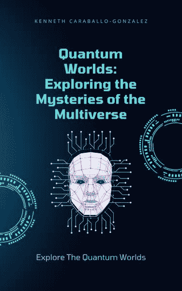

你是否喜欢《ChatGPT：改变世界的革命性语言模型》？那么你应该阅读肯尼斯·卡拉巴洛（Kenneth Caraballo）的《量子世界：探索多元宇宙的奥秘》！

量子物理长期以来一直引起科学家和公众的兴趣，因为它的令人费解的理论和悖论现象。在《量子世界》中，读者将踏上探索量子力学迷人世界的旅程，并探索正在改变我们对宇宙理解的前沿研究。

本书将向读者介绍量子物理的基本原理，包括波粒二象性、不确定性和纠缠等。从那里开始，它将深入探讨该领域的最新发现，如多元宇宙理论、量子传输和量子计算。

读者还将发现量子物理如何在从密码学到生物学等各个领域引发革命，并探讨这种新技术的伦理影响。

在整本书中，作者将运用现实世界的例子和生动的比喻，使复杂的概念易于理解普通读者。无论你是科学爱好者还是对宇宙奥秘感到好奇，"量子世界"都将带你踏上一场激动人心的旅程，探索奇妙的量子力学世界。
