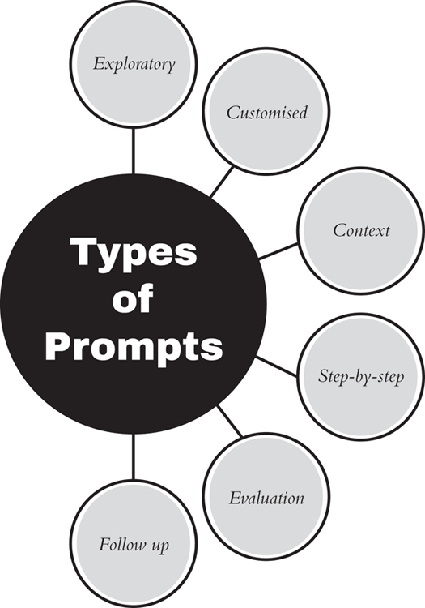

# ChatGPT 革命：如何使用 AI 简化你的工作和生活管理（一）

> 原文：[The ChatGPT Revolution](https://annas-archive.org/md5/225e7efbe2f28f1c7e9c75c868d3816a)
> 
> 译者：[飞龙](https://github.com/wizardforcel)
> 
> 协议：[CC BY-NC-SA 4.0](https://creativecommons.org/licenses/by-nc-sa/4.0/)

# 介绍

我写关于生产力的书，因为我致力于为人们挤出时间做他们世界中最重要的事情。我在与组织中的人交谈时得到书的灵感，了解他们所面临的阻碍他们成为最好的自己或做最好的工作的事情。

因此我的书是关于会议、安排你的一天，以及创造思考和呼吸空间等事情。

因此，当我的出版商找到我，要求我写一本关于人工智能（AI）或更具体地说，ChatGPT 如何帮助我们提高生产力的书时，我立刻回到了人们与我分享的问题。

除了上面提到的三件事情之外，我经常听到的问题（可能会成为未来的书）包括：

+   委派

+   决策

+   电子邮件

+   信息过载

+   管理任务

+   生活管理。

我相信这个清单还在不断增加。这些事情阻止我们做我们的‘真正’工作。我们会把它描述为平凡、乏味，而且价值不大，特别是如果这些是我们很少做的任务。例如，你上一次需要做这些任务是什么时候：

+   为一个组织的新员工写一个工作描述和广告

+   为一个组织的新员工制定政策或程序？

+   从头开始制作演示文稿或提案

+   处理客户投诉

+   计划一个活动？

所有这些不经常发生的任务在你很少做它们的时候会占用大量时间，特别是如果你是从零开始。它们很难委派，因为（a）你很少做它们，所以（b）自己做更容易更快。

ChatGPT 为我们提供了一个工具来完成平凡的任务。一个清理我们重复、无趣和令人泄气的工作的工具，尽管这些工作必须完成。这些事情阻止我们做更有价值的工作，或者让我们远离我们的家人或我们为之努力的事情。

无论你在组织中的位置如何，你现在都有一个虚拟助手、实习生或支持人员，可以帮助你比以前快 50%的速度完成这些平凡的任务。

通过将 ChatGPT 与人类输入结合，麻省理工学院的一项研究发现，生产力提高了 35%至 50%，质量提高了 25%。

这一点的问题是：*你是否需要一些帮助来简化你的生活和工作，为你的一天腾出更多时间？* 如果是这样，请继续阅读。## 你会用这些空闲时间做什么？

> **劳动的终结是为了获得休闲。**
>
> **— 亚里士多德**
>
> **因此，自他创造以来，人类将首次面临他真正的、永恒的问题——如何利用他从紧迫的经济烦恼中获得的自由，如何度过科学和复利为他赢得的休闲时间，明智、愉快和美好地生活。**
>
> **— 约翰·梅纳德·凯恩斯**

几个世纪以来，从印刷机到吸尘器的技术进步都是为了给我们更多的休闲时间。然而，它们所做的只是给我们更多的工作时间。

根据奥利弗·伯克曼的说法，我们注定要在这个星球上度过大约 4000 周。我觉得这很令人警醒，它让我意识到我的有限生命，这引发了更进一步、略微不太哲学的想法，‘我时间不多了，所以最好明智地利用这段时间。’

现在是利用技术进步的时候，比如人工智能和 ChatGPT，让增加休闲时间的承诺成为现实。

ChatGPT 和人工智能已经引起了很多关注，虽然你可能已经听说过一些，但你可能因为不理解它的作用以及它如何对你有用而选择阅读这本书。

这本书是关于超越噪音，让你获得生产力的提升。

现在，人们已经在使用 ChatGPT 生成：

+   困难的电子邮件

+   流程图

+   指导手册

+   演示大纲

+   职位描述

+   求职申请

+   行政任务

+   大量信息的摘要和分析

+   产品描述

+   内容、文章和博客。

而且，如果你在想，是的，有些人正在用它来帮助写书（我以后会谈到）。

ChatGPT 和人工智能代表了计算机理解和回应人类语言能力的重大进步。它有潜力改变人们与技术互动的方式，提供更自然和直观的体验。

但是，就像任何新技术或节省时间的应用程序一样，总会有可能它最终会带来比节省的更多工作的危险。电子邮件本来应该让我们的生活更轻松，但它最终成为了很多人的噩梦。我想起了德语词语*Verschlimmbesserung*，意思是“本意是改进却使情况变得更糟”。

如果有效利用，ChatGPT 有潜力为其他活动节省宝贵的时间，所以我认为真正的问题是：*你会用那些时间做什么？*随着技术的不断进步，使任务变得更加简单和高效，我们需要决定如何利用我们新获得的空闲时间。

免责声明：在继续之前，您需要知道这些技术发展非常迅速，并且充满错误。即使在撰写本书时，事情也在发生变化，关于下一个版本和新应用程序会提供什么的传言四起。对于这样一种爆炸性的技术来说，有可能本书涵盖的一些想法在上市之前就已经过时了。尽管如此，本书涵盖的基本原理提供了利用人工智能和 ChatGPT 的核心策略。

你没有时间可浪费。

是时候加入革命了。

# 如何使用本书

这本书反映了我举办网络研讨会、讲习班、企业项目和实践课程的方式。它实用且易于阅读和导航，因此你可以快速实施真实而简单的变化方式。

它不是一本你会难以携带的厚重著作，也不是你会把它留在床头柜上积满咖啡杯印的书。相反，它提供了快速提示、真实故事、大量切实可行的建议、鼓励你反思你目前的工作方式以及如何利用 ChatGPT 更简单、更聪明地工作的问题，以及帮助你入门的实用练习。

我建议你阅读本书时保持简单和可行。从小处着手，逐渐深入更大的概念。阅读本书，选择一两件与你产生强烈共鸣的事情，并立即开始采取行动。（当你看到它实际上是多么简单时，你会感谢我的。）

第一部分讲述了 ChatGPT 是什么，以及人工智能（AI）和机器学习（ML）的悠久历史。你可能没有意识到你在日常生活中已经在使用多少 AI 和 ML。我们还将讨论为什么好奇心很重要，并抓住机会了解 ChatGPT 和其他 AI/ML 技术。它们已经到来了。是时候跟上了。

第二部分介绍了使用 ChatGPT 的实用策略，帮助你在工作和家庭中都能高效。想象一下，有一个永久的实习生或虚拟助手在你身边帮你处理一些单调的工作。这就是本书提供的内容！

在阅读本书时，我想让你听从我已故的导师和朋友罗杰·迪纳的建议，他告诉我“什么都不要相信，测试或尝试一切”。这帮助我在面对消极、自吹自擂和“解释”时保持好奇心。

所以，这可能看起来有些违反直觉……但我鼓励你不要相信我在这本书中说的一切。相反，我希望你对 ChatGPT 感到好奇，并为自己探索它。这将让你亲身体验它的能力和局限性，并让你探索它的潜在应用。

在阅读时，你会发现我有时可能有点不敬​​—因为生活和工作太重要了，不能太认真对待。读书应该是一种愉悦，而不是一种痛苦！

所以请阅读、实施、尝试并享受沉浸在人工智能、机器学习和 ChatGPT 世界中的乐趣！

# 第一部分：保持好奇

阿尔伯特·爱因斯坦、你的汽车和非洲角马有什么共同之处？

不，这不是一个陈词滥调的笑话的开始，答案是全球定位系统（GPS）。

由于爱因斯坦的相对论理论，GPS 系统可以帮助我们在汽车中从 A 到 B，并跟踪地球上动物的迁徙模式，包括角马、北极燕鸥和座头鲸。

爱因斯坦在面对四块黑板上的计算时，是否考虑过鸟类迁徙模式的跟踪，然后将其简化为 E=MC²？这似乎不太可能，但事实上却是如此。

阿尔伯特·爱因斯坦被广泛认为是历史上最杰出的科学家之一。在他的一生中，他被无尽的好奇心驱使，这使他质疑了我们对宇宙的理解的基础。

正是他的好奇心，以及那些站在他肩膀上的人的好奇心，使我们能够接触到这种非凡的技术，不仅在我们的汽车上，而且在我们口袋里携带的智能手机上。

你可能没有意识到，但大众自 2010 年以来才开始使用 GPS，看看它已经如何融入我们的生活。没有它，我们无法搭乘共享汽车，知道时间或计划一个美好的野餐。

就像 GPS、人工智能（AI）和 ChatGPT 这样的应用一样，它们已经成为我们生活中不可或缺的一部分，它们的使用程度以及随后融入我们生活的程度还不清楚。即使在写这本书的时候，每天都在发生变化，人们也在分享他们如何使用 AI，以至于我无法跟上。

让我继续前行，并让这本书到达你手中的是保持开放的心态和好奇心。

> **好奇心在推动进步和塑造我们对新技术的理解方面起着至关重要的作用。**

面对现实吧，在当今世界，技术突破的速度前所未有，保持时下的和了解信息可能是具有挑战性的。你几乎没有时间跟上你的电子邮件和日历，更别提新的发现了！

你需要花时间对 ChatGPT 和 AI 的优点感到好奇，并了解它如何简化你的生活和工作，最终节省你的时间。尝试以下一些方法。

抽出一些时间来了解它的全部内容。你可能只需要一个小时。

阅读不同角度的文章，并与同事讨论。

想想你可能如何使用它，并更清楚地了解它如何帮助你。

有自己的观点。现在关于这个工具有很多信息，而且这些信息来自不同的角度。自己决定它对你有多有用（或无用）。

与此同时，让我们更深入地了解如何使用这个工具来使你的工作和生活更轻松。

# 第一章

ChatGPT 是什么？

我的朋友山姆一直是社交媒体的忠实用户，他很早就开始使用 Facebook 和 Instagram 这样的应用程序，而且总是很快地接受其他技术。实际上，她是第一个问我关于 ChatGPT 的人。

当涉及到她的社交媒体时，她喜欢与朋友和家人分享她的想法、照片和更新。然而，有一天她浏览她的动态时，感觉有些不对劲。

虽然广告和赞助帖子已经出现在她的动态中一段时间了，但突然间感觉每个赞助帖子或广告都很完美，她想要购买的欲望有点失控了。

> **就好像社交媒体平台比她自己更了解她一样。**

山姆不知道的是，大约在 2013 年，Facebook 开始对推送给用户的内容变得非常智能。

数字力量，一家数字营销公司，写道：2013 年：

> **最新的算法推动了品牌的更多有机内容，以便用户只看到可能对他们特别感兴趣的帖子。该算法分析了 1000 多种不同的因素，旨在推送高质量的内容。**

您是否曾经发现自己在社交媒体上滚动，突然间出现了一个似乎完全适合您的广告？也许是您一直在考虑的产品，或者是您一直想尝试的服务。

这就是许多社交媒体人工智能和机器学习（ML）算法的工作原理。根据您的活动以及与您有关联的人的活动，为您提供内容、产品和服务，使其对您来说感觉完美。

如今，人工智能和机器学习无处不在，从我们手机上的个人助手到推荐引擎建议我们观看的电影或购买的产品。以下是一些人工智能和机器学习在日常生活中的例子。

+   像亚马逊这样的在线零售商使用机器学习算法根据您的购买历史和浏览行为进行推荐。例如，如果您在亚马逊上购买一本书，该网站可能会建议其他主题或风格相似的书籍：“如果您喜欢《ChatGPT 革命》，那么您可能也会喜欢唐娜·麦克乔治的其他书籍。”

+   虚拟助手，如 Siri、Amazon Alexa 和 Google 助手，使用自然语言处理（NLP）来理解和回应口头或书面命令。它们还可以执行简单的任务，如设置提醒或播放音乐。

+   聊天机器人越来越受到在线客户服务的欢迎，它们使用人工智能来模拟人类对话并为用户提供帮助。例如，如果您需要在网上购物时需要帮助，聊天机器人可能能够回答您的问题并指导您完成购物过程。

+   自动驾驶汽车等自动驾驶汽车使用传感器、摄像头和机器学习算法的组合来导航道路并避开障碍物。这些算法是在大量数据的基础上进行训练的，包括道路标志的图像、交通模式和天气条件。

+   医学研究人员正在使用机器学习算法来分析大量的患者信息数据，以识别模式并做出更准确的诊断。在某些情况下，机器学习算法已经能够比人类医生更准确地诊断某些疾病。

> **然后 ChatGPT 出现了。**

但等等……ChatGPT 是什么？

让我们直接从马嘴里得到一个定义。

> **示例提示：**描述 ChatGPT 是什么。
>
> **ChatGPT：**ChatGPT 是一个复杂的计算机程序，它使用一种称为自然语言处理的人工智能类型来理解和回应人类语言。它已经接受了大量的文本数据培训，并利用这些知识来对各种问题和话题生成回应。
> 
> **这有点像一个虚拟图书管理员，它已经阅读了世界上最大的图书馆中的每一本书，并可以为您提供您所问任何主题的信息。**

其名称中的 GPT 代表“生成式预训练变压器”，这是它的神经网络架构的名称。

这就像一个可以与人交谈并回答他们问题的智能机器人。

您知道您可以要求 Siri 或 Alexa 给您讲笑话或为您播放一首歌吗？ChatGPT 使用类似的技术，只是它可以做更多的事情。作为一种语言模型，ChatGPT 已经接受了大量数据的培训，以便能够理解和生成类似人类的（自然）语言。

这意味着它可以接收自然语言的问题或提示，并生成一个类似于人类回答的自然语言的回应。

ChatGPT 已经接受了广泛的培训，从简单的琐事问题到更复杂的科学、历史和政治等话题。它庞大的信息数据库使其能够对各种问题提供详细和（不总是）准确的答案。我们将在[第二章]中更多地讨论准确性。

您可以用它来解释困难的概念，获得个人或专业事务的建议，甚至只是就感兴趣的话题进行对话。

它很快！我第一次使用它时，我对信息如何迅速地流入页面感到震惊。##简史

尽管 ChatGPT 应用程序感觉很新，但其基本原则和技术已经存在了相当长的时间。

自 20 世纪中叶以来，AI 和 ML 已经取得了长足的进步。尽管“人工智能”一词是在 1956 年首次被创造出来的，但其背后的思想可以追溯到更早的先驱的工作，比如：

+   **查尔斯·巴贝奇**在 19 世纪 20 年代设计了差分机（一种计算器）和一种早期计算机称为分析机。被认为是现代计算机的曾祖父，但它们实际上从未被建造出来；然而，它们激发了整整一代计算机科学家和工程师。巴贝奇相信机器可以执行超出简单计算的任务——他一直在推动极限。

+   **阿达·洛夫莱斯**早在 19 世纪 40 年代就被认为是想出了第一个计算机算法的人。她与查尔斯·巴贝奇一起工作在他的分析机上。洛夫莱斯是一个有远见的人，她看到了机器超越其编程学习和发展智能的潜力。基本上，她是最早的 AI 思想家！

+   **艾伦·图灵**被认为是 AI 之父。他提出了通用图灵机的概念，这是一种可以执行任何人类计算的机器。他还创造了图灵测试，评估机器表现出类似人类的智能的能力。他的工作是非常开创性的，并为现代 AI 和 ML 的发展奠定了基础。

快进到 21 世纪，ChatGPT 由 OpenAI 创建，这是一个由科技界一些最重要的人物创立的研究组织，包括埃隆·马斯克（他于 2018 年离开了该组织）和萨姆·奥尔特曼（现任 CEO）。

OpenAI 团队希望创建一个能够理解人类语言并以听起来像是来自真实人的方式生成回应的程序。

他们的语言模型的第一个版本被称为 GPT-2，于 2019 年发布。它能够对各种提示、问题或陈述生成相当好的回应。人们对技术如何可能被用来传播假新闻和宣传存在一些担忧，因此 OpenAI 并没有立即发布程序的完整版本。

该模型的下一个版本 GPT-3 于 2020 年发布，比 GPT-2 更好。它更加复杂和强大，不仅可以生成连贯的文本，还可以生成创意写作和计算机编程代码。这是在节省时间方面的巨大进步。

ChatGPT 于 2022 年 11 月 30 日向公众发布，并使用 GPT-3.5 作为其操作模型。在发布时，GPT-3.5 是当时最大的 AI 语言模型，拥有惊人的 1750 亿个参数。这使它能够执行一系列任务，从翻译语言到总结文本到回答问题，而且调整很少。而且很快！

在 2023 年 3 月中旬，ChatGPT 进行了升级，GPT-4 提供了更多的火力。它使用大约 100 万亿个参数，这意味着它不仅可以写文章和文章，还可以创作艺术和音乐。

为了让人们了解 GPT-3.5 和 GPT-4 之间的差异，就像比较海滩上的沙粒数量和世界上的沙粒数量一样。这意味着有很多新的方式将其纳入工作和家庭中，以解除我们的繁琐工作，让我们继续享受生活。

> **我认为它是一个可以帮助你工作、提供建议或只是与你进行随意对话的虚拟助手、同事或朋友。**

ChatGPT 已经在大量文本数据集上进行了训练，使其具有理解和回答自然语言问题的能力，就像需要不断阅读新书来更新知识的图书管理员一样，ChatGPT 定期更新和微调以确保其回答准确和及时。

凭借其处理大量信息和生成类人文本的能力，应用无穷无尽。

我曾和一些人谈过，他们不确定 ChatGPT 与搜索引擎有何不同。最好的解释是举个例子。如果我去搜索引擎并输入“包括土豆、奶酪和香料的素食食谱”，我会得到 53100000 个结果和页面来寻找我想要的东西。耗时，对吧？

另一方面，如果我提示 ChatGPT 说，“给我一些包括土豆、奶酪和香料的素食食谱”，它会回答食材、说明，如果你要求的话，还会给出一个购物清单。如果你不喜欢第一个回答（在这种情况下是奶酪土豆条），就继续要求更多，直到找到你喜欢的东西。

暂停一下，想象一下，如果你有一个可以快速为你提供所需信息的个人图书管理员，而不必查阅多本书或搜索引擎结果，你的生活会是什么样子。

这就是 ChatGPT 的力量——你自己的虚拟图书管理员，拥有丰富的知识等待探索。## 这只是另一种时尚吗？

ChatGPT 在 2022 年 11 月推出后仅用了五天就获得了一百万用户。

这是一个令人印象深刻的壮举，特别是当你考虑到其他流行的在线服务通常需要更长的时间才能达到一百万用户的标志（见图 1.1，见下文）。

为了对比，之前的纪录保持者 Instagram 仅用了 2.5 个月就获得了一百万用户，而 Spotify 和 Dropbox 分别只用了五个月和七个月。

大多数在线服务获得一百万用户所花的时间比 ChatGPT 长，但值得注意的是，图 1.1（见下文）中一些公司成立时间超过 15 年。可以说，随着互联网的普及，在线服务获得用户的速度更快了。

这种快速的接受速度是我看来 ChatGPT 将以某种方式留下来的第一个证据。

第二个证据是它的易用性。不需要编程，不需要计算机学位，只需要打字——即使不需要，如果你使用语音转文本工具。

第三个证据表明它会留下来的是，它将为人们节省时间，使他们的工作和生活更加轻松。

最后，它只会随着时间的推移而改进。自 ChatGPT 于 2022 年末推出以来，已经有了改进，声称更好的竞争产品，以及其他令用户惊叹的人工智能应用。

有些人觉得他们可能不够精通技术来理解它，而其他人担心它可能对他们的生活产生影响。也许它太复杂了，或者你没有足够的技术技能来有效地使用它，或者你担心会犯错导致出现问题。

**图 1.1**：获得一百万用户所需时间

来源：Statista，[www.statista.com/chart/29174/time-to-one-million-users/](http://www.statista.com/chart/29174/time-to-one-million-users/)

你无法击败 ChatGPT。

这些新兴技术变得越来越用户友好。它们变得更容易和更直观，而 ChatGPT 就是一个很好的例子。对于一个使用人工智能和自然语言处理为用户提供答案的复杂模型来说，它非常易于使用。

你只需输入你的问题或提示，ChatGPT 将为您提供清晰简洁的答案。您不需要成为人工智能或机器学习专家来使用这项技术——它旨在让每个人都能够访问。而且，如果您不理解答案，可以要求它以七岁孩子的方式重复回答。

这是一个例子：

> **Prompt:**  解释核裂变的工作原理
>
> **ChatGPT:**  核裂变是一种过程，其中原子核分裂成两个或更多较小的核，释放大量能量。核裂变过程通常是通过用中子轰击原子核来引发的。
>
> 当中子击中原子核时，它可能被吸收，导致核不稳定并分裂成两个或更多较小的核，同时释放出更多的中子和大量能量。这些释放的中子随后可以继续击中其他核，引发连锁反应并释放更多能量。

[我已经被搞糊涂了……啦啦啦]

> **Prompt:**  现在以七岁孩子的方式重新解释一下。
>
> **ChatGPT:**  你玩过搭积木吗？想象一下，一个原子就像一块积木，它由更小的部分组成。当我们用微小的粒子击中原子时，它会分裂成更小的部分，并释放大量能量，有点像你拆开积木塔，它会发出巨大的响声。
>
> 科学家可以利用这种能量来发电，我们在家里使用的电就是这样产生的，但他们必须非常小心，因为如果不正确处理，它也可能是危险的。这就像玩火，它可能有用，但我们必须小心不要被烧伤！

好的。明白了！  ## 这是一个有益的工具

一些人担心技术对他们生活的影响。他们觉得技术正在接管，他们失去了对时间和注意力的控制。

这可能对于沉迷社交媒体的人来说是真的；然而，我们许多人每天花费数小时进行研究，无论是工作、学校还是个人兴趣。现在我们可以简化这个过程，节省宝贵的时间。ChatGPT 可以快速找到我们需要的信息，并以清晰简洁的方式呈现，让我们能够专注于其他任务和活动。

当然，重要的是要记住，技术并非是解决生活所有问题的灵丹妙药。它不能取代人际互动，当然也不能解决*所有*我们的问题。然而，通过明智地使用它，我们可以使生活更轻松、更有成效，而不会牺牲生活中让人愉悦的事物。  ## 重新找回你的工作与生活平衡

现代生活中最大的挑战之一是实现一定程度的工作与生活平衡。我们许多人工作的时间比应该更长，牺牲了与亲人在一起的时间，忽视了给我们带来快乐的活动。但是像 ChatGPT 这样的技术可以帮助我们重新获得时间。

我们已经习惯了帮助我们简化生活的技术。例如：

+   预算应用程序帮助我们跟踪开支，更有效地管理财务

+   健身应用程序帮助我们保持身材，保持健康的生活方式。

+   视频会议工具帮助我们与同事和客户合作，无论我们在哪里。

> **通过拥抱技术并以这些方式使用它，我们为最重要的事情创造了更多的时间和空间。**

在 2020 年至 2023 年之间，远程工作和在家工作使我们达到了前所未有的灵活性，并且对许多人来说，工作与生活更加平衡。多亏了视频会议和基于云的协作软件等工具，现在更容易在世界任何地方工作。在家工作可以消除长途通勤带来的压力和疲劳。

我们可以利用在线订购服务来代替购物，让食物送到我们家门口，从而节省宝贵的时间，可以用来追求我们的爱好和兴趣，与所爱的人共度时光，或者简单地放松和充电。

健身应用和可穿戴科技帮助我们保持健康和活跃，即使在工作和其他责任繁忙时也是如此。通过跟踪我们的日常活动并设定目标，我们可以创造一个更平衡和更健康的生活方式，支持我们的身心健康。然而，有时我会告诉我的智能手表闭嘴，因为它再次提醒我该走 250 步了。

社交媒体平台、消息应用和视频会议工具都可以帮助我们与家人和朋友保持联系，无论我们身在何处。通过为这些联系留出时间，我们可以保持强大和支持性的人际关系，这对我们的幸福和健康至关重要。

这些技术都不能替代人际互动，我相信 ChatGPT 和其他人工智能工具将为我们节省时间，用于我们最关心的事情：面对面的互动和有意义的体验，比如与朋友计划周末出游，参加家庭聚会，或者简单地在公园散步。这些事情似乎我们总是找不到时间去做。

更重要的是，通过减少我们的工作和生活琐事，它是对抗倦怠的一种真正武器。## 跟上变化是值得的

科技（以及世界）不断发展，每天都有新的工具和应用程序被开发出来。这意味着保持与时俱进对于在当今快节奏的世界中保持高效和竞争力至关重要。如果我们不跟上时代，就有落后和错失这些新工具带来的好处的风险。

跟上科技发展有助于我们更高效地工作；例如，微软 Windows 不断发展，不断增加新功能——期望我们仍在使用 Windows 95 是疯狂的。

无论我们的工作或角色如何，保持与所选择领域的相关性和竞争力都很重要。例如，如果你在营销领域工作，你需要与最新趋势和工具保持同步，以创建能引起目标受众共鸣的有效营销活动。同样，如果你在金融领域工作，你需要及时了解最新的预算工具和软件，以更有效地管理客户的财务。

这可能是具有挑战性的。有太多工具和应用程序可供选择，很难知道从何处开始。## 克服科技过载

科技可以是实现工作与生活平衡的强大工具，但也可能是压力和分心的源头。我不知道你怎么想，但有些日子感觉自己不断被通知、消息和警报轰炸，很难保持专注和高效。

我们还需要承认过度使用科技对我们的心理和身体健康、我们的工作效率和人际关系可能产生的负面影响。

再次强调，界限变得重要。这可能包括设定每天检查电子邮件或社交媒体的特定时间，在需要专注于特定任务时关闭通知，或尽力减少科技使用带来的不断干扰，创造更专注和高效的工作时段。

> **让我们利用科技的优势。**

像 ChatGPT 这样的工具可以快速高效地为我们提供所需的信息和结果，而不会迷失在传统搜索引擎和信息来源带来的海量干扰和通知中。

询问 ChatGPT，它说可以帮助我们克服科技过载的三种方式：

1.  提供管理技术和如何在技术使用周围建立明确界限的建议，减少技术过载带来的不断干扰。

1.  提供正念练习和减轻压力和焦虑，创造更加专注和平静心态的建议。

1.  提出增加人际关系的方式，比如和亲人在一起，加入社交团体，或参加社区活动。

作为一个在生产力领域工作了一段时间的人，当这些建议出现在屏幕上时，我确实发现自己点头表示同意。

通过克服恐惧，拥有成长或学习的心态，并保持更新，我们可以以节省时间、简化生活并为最重要的事情节省时间的方式使用技术。通过设定界限，我们可以避免在技术中迷失，而是利用它丰富我们的生活。所以，不要害怕 ChatGPT、人工智能或任何其他技术——拥抱它，并用它来创造你想要的生活。

虽然 ChatGPT 可以处理复杂的话题，但重要的是要记住它仍然是一台机器，只能提供基于其被编程知道的信息。许多人批评 ChatGPT 不够准确或“像人类一样”。我们需要记住它不是人类，对它有这样的期望是不现实的。

我知道你在想什么，“我听说了一些关于 ChatGPT 和人工智能的令人不安的事情。它安全吗？”第二章将帮助回答这个问题。

# 第二章

利弊

我的朋友约翰看了太多关于未来的末日电影，他确信人工智能和“机器”最终会导致人类的毁灭。显然，他花了太多时间看《2001 太空漫游》、《终结者》、《黑客帝国》或《复仇者联盟：奥创纪元》等电影。

在我观察到的关于 ChatGPT 的负面反馈中，批评者似乎分为两大主要群体：

1.  第一组人就像约翰一样。他们确信人工智能和机器学习会变得更加强大和普遍，这只能导致我们所知的生活的结束。

1.  第二组人看到了人工智能被恶意使用的更实际的缺点。我们知道，如果你随便问它，它可以立即生成恶意代码，它还可以通过医学考试，写出令人信服的学术论文，为你做家庭作业。在这个群体中，还有一些人担心 ChatGPT 会取代工作。

我倾向于更加乐观，对未来的预测更加看好，“星际迷航”是我的未来预测的参考。叫我天真或乐观，但“星际迷航”未来描绘的乌托邦画面对我来说感觉更好——那部剧中的许多虚构设备已经成为现实。如果你正在用 iPad 或其他手持阅读器阅读这篇文章，那就要感谢“星际迷航”了。

我也同意美国哲学家格雷·斯科特的观点，他更关注人工智能或机器将如何扰乱我们的生活，而不是它们是否会变得暴力。

> **机器人将收割、烹饪和为我们服务食物。它们将在我们的工厂工作，驾驶我们的汽车，遛我们的狗。不管你喜欢与否，工作时代即将结束。**

对于新技术感到有些不安是很自然的，有时我们的恐惧可能会有些失控，特别是如果我们真的不了解技术是如何运作的，或者它可能会产生什么影响。这时我们可能会过早地陷入恐慌，担心一些并非真实存在的事情。

更糟糕的是，并不奇怪，有些人利用我们对技术的不了解来谋取私利。他们可能散布虚假信息，或者试图用世界末日的场景来吓唬我们，一切都是为了谋取利润或推动他们自己的议程。天啊！## ChatGPT 可以被用于邪恶吗？

您可能听说过一些关于 ChatGPT 是否可能被滥用或产生负面后果的担忧。虽然我们需要认真思考开发先进人工智能系统的影响，但值得记住的是，这些担忧并不是 ChatGPT 独有的。它们是关于人工智能研究和发展未来的更大对话的一部分。

因此，让我们不要忘记，虽然新技术可能令人恐惧，但它也可能给社会带来积极的变化。也许有一天我们会回首，想知道我们一开始为什么如此担心它。

根据我的经验，表 2.1 显示了我如何对优缺点进行分类。

**表 2.1**：ChatGPT 的优缺点

| 优点 | 缺点 |
| --- | --- |
| 可以为您生成内容 | 捏造东西 |
| 可以被教导 | 可以用于欺诈 |
| 可以访问大量信息库 | 有偏见 |
| 快速 | 可能会夺走人们的工作 |
| 可以总结任何内容 | 您的内容被添加到其非常公开的库中 |

让我们依次看看这些缺点。

### 它捏造东西

当我开始使用 ChatGPT 时，我立刻就看到了可以提高生产力的好处。所以，我的第一个问题就是：

> **示例提示：** ChatGPT 如何帮助我提高生产力？

其中一个回应（还有其他许多有用的回应）是：

> **ChatGPT：** 它还可以帮助您安排日程和组织。如果您的家庭日程很忙，您可以使用 ChatGPT 创建一个所有人都可以访问的共享日历。这意味着您可以在一个地方跟踪约会、学校活动等等。如果您需要重新安排或取消事件，只需要求 ChatGPT 为您完成。

这太令人兴奋了！

> **提示：** 给我关于如何在 ChatGPT 上进行日程安排的逐步说明。
>
> **ChatGPT：** 第 1 步：注册 ChatGPT 账户。如果您还没有 ChatGPT 账户，第一步是注册。访问 ChatGPT 网站并按照说明创建一个账户。一旦登录，您将可以使用各种功能，包括日程安排和日历共享。
>
> 第 2 步：连接您的日历。下一步是将您的日历连接到 ChatGPT。这将允许 ChatGPT 访问您的日历并代表您安排事件。要做到这一点，转到 ChatGPT 中的“设置”选项卡，然后选择“日历集成”。从这里，您将被提示连接您的日历。按照说明连接您的日历，然后就可以了。

还有许多更详细的步骤，总之，它继续告诉我如何：

+   使用 ChatGPT 创建事件

+   与他人分享您的日历

+   接收事件提醒

+   委托日程安排任务。

我几乎从椅子上摔下来！这有多好？非凡的功能和无限的可能性，*再加上*一套全面的说明，甚至恐龙都能够遵循，但等等……在花费了几分钟试图找到“设置”选项卡之后，我问 ChatGPT：

> **提示：** 在 ChatGPT 中如何找到设置选项卡？
>
> **ChatGPT：** 对于任何混淆，我表示歉意。作为一种由人工智能驱动的语言模型，ChatGPT 没有带有“设置选项卡”的图形用户界面。在我的先前回应中，我错误地提到了 ChatGPT 中的“设置”选项卡，但实际上并不存在。

总之，您目前无法将您的日历或日程安排连接到 ChatGPT。巨大的肩膀耷拉。

“这怎么可能？”您可能会问。嗯，就像许多人工智能应用一样，ChatGPT 每次写一句话都是一个词，根据这些词在其数据库中一起出现的概率和频率来确定系列中的下一个词。

我不想在这里变得太技术化，但了解工具的辉煌和局限性是很重要的。

OpenAI 系统地从互联网上抓取了约 3000 亿个单词的数据：书籍、文章、网站和维基。在访问所有这些数据时，ChatGPT 使用以下策略来考虑对您的提示的回应（也在图 2.1 中有说明）。

+   **下一个标记预测：**给定一系列单词，ChatGPT 将预测系列中的下一个单词。例如，如果您输入“猫坐在……”，您的人类大脑自然会想到“垫子”，ChatGPT 也是如此。事实上，像地毯、毯子、椅子和桌子这样的选项都可能是正确的，但概率会导致“垫子”。

+   **掩码语言建模：**这是上述的一个轻微变体，其中一些单词被替换为一个称为“掩码”的特殊标记。ChatGPT 预测将替换掩码的正确单词。例如，“the [*mask*] sat on the …”，它可能会预测“cat”（就像你的大脑一样），但它也可能是“dog”或“rabbit”。

所以，它很聪明……但不是太聪明。例如，“The Roman Empire [*mask*] with the reign of Augustus”，“began”或“ended”可能被预测为在发生可能性上得分很高的单词，虽然这两个句子都可以被认为在结构上是正确的，但它们有着非常不同的含义（只有一个是事实上正确的）。

**图 2.1**：ChatGPT 的工作原理

在 ChatGPT 指引我到“设置”选项卡的先前示例中，我猜测它是从一个调度网站（如 Calendly）中获取的内容，该网站具有其他软件集成，您可以使用设置选项卡将日历连接到其功能。

危险的部分是 ChatGPT 似乎对自己的答案非常有信心。它断言一些显然不真实的事情。我问它“关于技术如何增加我们的休闲时间的名人名言”，它自信地从温斯顿·丘吉尔那里吐出了一句，甚至引用了演讲的日期。

太棒了！除了这根本没有发生过，他也从未说过。这是其他演讲或评论与温斯顿被添加到末尾的混合体。这是下一个标记预测和掩码语言建模出现严重错误的一个很好的例子。

> **要求支持其提供的材料的来源或参考也可能有时会命中或失误。**

学者们还指出，它可以从现有来源中大规模地发明引文，混合名称、标题、期刊、书籍等，形成一些无稽之谈的引文。

如果利害关系重大，我的建议是回到谷歌再次检查准确性。###它可以用于欺诈

ChatGPT 快速生成文本的能力使其成为网络犯罪分子传播虚假信息或进行欺诈的有吸引力的工具。

我们已经看到了使用人工智能技术将一个人的脸替换为另一个人的深度伪造视频的出现。再加上 ChatGPT 快速准确地生成文本的能力，并以特定人的风格生成文本，它可以用于生成听起来真实可信的深度伪造视频的剧本。

> **我们世界上难道不是已经有足够的假新闻了吗？**

虽然网络钓鱼诈骗已经存在一段时间（我们都收到过来自遥远非洲国家的王子想要向我们发送数百万美元的消息，只要我们提供我们的银行账户详细信息），但是像 ChatGPT 这样的工具使骗子们变得更加复杂。看起来像是由可信来源发送的真实消息，比如银行或社交媒体平台发送的消息，使人们更难区分合法和虚假消息，从而导致潜在的危害。

总会有人试图想出法子赚钱或利用新技术欺骗他人。世界上几乎所有事物都可以被用于善良或邪恶。让我们把这种力量用于善良，好吗？###它是有偏见的

正如第一章中提到的，人工智能和机器学习如今几乎无处不在，从医疗保健到金融，从交通运输到娱乐。随着这些技术的不断发展和融入我们的生活，我们无法摆脱与其使用相关的社会和伦理问题。

人工智能和机器学习只有在它们接受训练的数据是无偏见的时候才是无偏见的，所以如果数据是有偏见或不完整的，那么算法可能会反映这些偏见并使其持续下去。

> **ChatGPT 可能会受到偏见或冒犯性数据的影响。**

前几天我在玩，输入了提示：“我很孤独。告诉我一些我不知道的事情。”

> **ChatGPT:** 你知道在日本有一种叫做“Ossan Rental”的租赁服务，允许人们租用中年男性一起出去玩吗？这些男人可以被租用进行各种活动，比如看电影、玩游戏，甚至只是聊天。这项服务在寻找陪伴或倾听的女性中特别受欢迎。所以即使你感到孤独，知道有独特的方式与他人联系，你并不是一个人。**

它是不是假设我是一个女人？我的孤独是否意味着我想要一个中年男人的陪伴？

我觉得这很奇怪，也是偏见的一个例子。

如果它是在包含偏见或冒犯性语言的数据集上进行训练，ChatGPT 可能会生成带有偏见或冒犯性的响应。幸运的是，开发人员已经意识到了这个问题，并正在努力减少算法的偏见或无关响应的风险，通过完善算法并分析数据集以消除任何偏见或冒犯性内容。

我们已经看到了这种情况，面部识别软件对肤色较深的人的识别准确性较低，或者招聘算法对妇女和少数族裔存在歧视。###它会夺走我们的工作

虽然人工智能和机器学习可以创造新的工作岗位并提高生产力，但它们也可以自动化现有的工作，并使人类劳动在某些行业中变得过时。这在制造业已经成为事实，机器人已经取代了人类，据预测，到 2030 年全球范围内将有多达 2000 万个制造业工作岗位被机器人取代。很明显，随着人工智能和机器学习在我们的生活中变得更加融入，它们对工作岗位将产生影响，并可能带来负面影响。

自 19 世纪英国的卢德派以来，人们一直担心技术和自动化会夺走我们的工作，事实上，历史表明，技术的进步有时会导致某项工作不再需要。你上次看到电梯里的电梯员是什么时候，除了出于新奇？或者联系过接线员？这些工作因技术和自动化的变化而不复存在。

我们也知道技术和自动化会创造工作岗位并改变工作。世界经济论坛估计，到 2025 年，技术将创造至少 1200 万个比它摧毁的工作更多的工作岗位，对社会是一个净正面影响。

我最近听说了“提示工程师”这个词。这个全新的职称是指设计、创建或优化 ChatGPT 和其他人工智能快速、准确和无偏见响应的人。在今年结束之前，大多数组织通信团队都会有提示工程师，这个预测还为时过早吗？

我完全可以想象未来会有这样的对话：

A：你今天都做了些什么？

B：早上开会，然后下午花时间为即将推出的产品发布通信策略工程提示。

我的侄女转述了她办公室关于人工智能和 ChatGPT 的有趣对话。大意是：

A: 你不担心人工智能夺走我们的工作吗？

B: 这不是你应该担心的事情。你应该担心的是有人拥抱了人工智能夺走你的工作。

现在我们已经上了一堂历史课，并且对人工智能的好坏丑有了更多了解，是时候卷起袖子，深入了解 ChatGPT 的要点了。在下一节中，我们将看看提示，这是释放 ChatGPT 生产力潜力的关键。

# 第三章

一切都关乎提示

我的同事 Sophie 一直对法语着迷。当我和她一起工作时，她不仅流利，而且听起来就像是在法国出生和长大的。

她告诉我她在高中上了几节课，但从未坚持下来。在大学里，她决定主修法语，但发现自己仍然在努力掌握这门语言。无论她学习和练习多少，似乎都无法取得进展，这让她感到沮丧，几乎导致她放弃。

直到她的第二年，她才发现了解法语的关键。她一直在努力理解一部小说中特别困难的段落，并且一直在逐字逐句地翻译。受挫的她休息了一下，决定大声朗读这段文字，而不是试图逐字逐句地翻译。

令她惊讶的是，她发现当她停止专注于单词，而是专注于整体意义时，她能更容易地理解这段文字。她意识到，要真正理解一种语言，她必须学会用那种语言思考，而不是不断地将一切都翻译回她的母语。

如果您希望充分利用 ChatGPT，您必须了解它所使用的语言。您还必须学会以与与谷歌等搜索引擎不同的方式来思考。

与使用谷歌相比，使用 ChatGPT 有点像 Sophie 所做的那样，费力地逐字逐句地翻译。ChatGPT 是一个了不起的工具，可以生成各种回应，但为了获得最佳结果，您需要知道如何要求您想要的东西。

而您可以通过提示来做到这一点。

提示是释放 ChatGPT 潜力的关键，将为您节省数百小时，否则将花在搜索引擎结果、经历错误的开始和苦苦思索从何开始上。## 什么是提示？

提示基本上是您给 ChatGPT 以获得回应的信息。这有点像当您问谷歌一个问题：您的查询越具体和详细，您将获得的结果就越好。对于 ChatGPT 来说，您的提示越好，结果就越好。## 什么样的提示才算好？

一个好的提示是清晰、具体和引人入胜的。如果您给 ChatGPT 一个很好的提示，它可以准确理解您想要什么，这意味着您将获得更个性化和有用的回应，为您节省时间、精力和努力。

根据我的经验，我能给它的越多，它就会变得越好。正如图 3.1（下一页）所示，我试图包括诸如：

+   **观点：** 您所处的情况或环境；例如，告诉 ChatGPT 一些关于您正在做什么以及为什么的事情。

+   **目的：** 对话的具体目标。例如，与 ChatGPT 的对话目的可能是要求信息、获得建议，或者只是进行一次随意的对话。或者您可以要求它写一些积极的或批评性的东西，或者从一个平衡的角度来看待。

+   **个性：** 对话的语气和风格。这可能包括使用幽默、同情或其他情感元素，使对话更引人入胜和更像人类。例如，您可以告诉它您希望它如何回应，比如健谈的、随意的、正式的，甚至是模仿奥普拉或荷马·辛普森之类的人。

想象一下，就好像你在说 ChatGPT 能理解的语言，这里的要点就是语法。这是一个令人难以置信的工具，但它不能读懂你的思想（至少现在还不能）——它需要具体的信息才能提供最佳的回应。所以，给它一个清晰简洁的提示，它会为你发挥魔力。

**图 3.1**：什么样的提示才算好？

例如，如果你想要一些健康的早餐想法，像“我们是一个有三个 12 岁以下孩子的五口之家，早上总是匆忙。给我一些我可以在十分钟内做的简单健康早餐食谱”，这样的提示比“健康早餐想法”更好，后者更适合谷歌搜索。

> **你的提示越具体和详细，ChatGPT 提供你想要的结果的可能性就越大。**

我的一个同事用 ChatGPT 来纠正她的拼写、语法和风格，这是她在写邮件或文章时一直担心的事情。

> **示例提示：**  修正以下段落的风格、拼写和语法，这段段落打算发送给一家零售连锁店的 CEO，目的是与他们安排一次会议。

聪明，对吧？

你的提示越好，结果就越完整和适用。不要忘记那句老话，“垃圾进，垃圾出”。这里也适用。

有些人对我说，“我试过 ChatGPT，结果很糟糕！我自己写的可能会更好！”

针对第一个观点，制作提示需要练习。如果你做了一次，得到了一个糟糕的回应，然后举起双手放弃，那当然你不会得到很好的结果。这和学习任何新技能都没什么不同。我记得第一次尝试使用 PowerPoint 时。作为一个文字处理背景的人（我在这里显得有点老），我搞不懂它。但我没有放弃，现在我是 PowerPoint 专家了。

在创建提示时，我特意使用“craft”这个词，因为构建提示有点像艺术，你越擅长，节省的时间就越多，而且说实话，你会更开心。

至于第二个反对意见：如果你自己能写得更好，那就去写得更好吧。

> 不要给 ChatGPT 带来不必要的细节负担。

你想要给它足够的信息来理解你想要的东西，但你不想用太多信息来混淆它。一个太复杂的提示可能导致效果不佳的回应，而一个太模糊的提示可能导致通用且无用的回应。找到合适的平衡是关键。

例如，以下是一个太复杂的提示：鉴于当前世界各地的政治气候和社会动荡，包括经济不稳定、气候变化和侵犯人权等问题，政府和国际组织如何共同解决这些复杂而相互关联的问题，同时平衡各种利益和价值观，如主权、安全、民主和人的尊严？

以下是一个太模糊的提示：你对当前世界局势有什么看法？

话虽如此，我已经能够复制并粘贴大段文本到 ChatGPT 中，以获得我想要的结果。例如：

> **示例提示：**  我要在董事会会议上做一个演讲[视角]，我需要积极影响董事会关于这个主题的看法[目的]。用专业但引人入胜的风格将以下内容总结成不超过四个要点[个性]。[然后粘贴你想要总结的内容。]  ## 不同类型的提示会导致不同类型的回应

开放式提示可能会导致更有创意和想象力的回答，而更具体的提示则可以为您提供更具体的信息或数据。因此，请尝试不同类型的提示，以发现适合您和您需求的最佳方式。

您可以使用 ChatGPT（或任何其他人工智能工具）的潜在数百种不同类型的提示。现在，人们在互联网上以 47 美元的价格出售“面向营销人员的 50 个 ChatGPT 提示”，虽然我对他们的创意表示赞赏，但你根本不需要那么多来开始。

以下是一些不同类型的提示，可帮助您入门（见图 3.2，后文）。

**图 3.2**：不同类型的提示

### 探索性提示

这些就像是提出广泛的开放性问题，非常适合探索各种想法和观点。回答可能会富有洞察力、创造力和发人深省。例如：

+   你对人工智能在应对气候变化中的作用有什么看法？

+   如何最好地利用 ChatGPT 提出创意？

+   我可以和 ChatGPT 一起玩的一些有趣的游戏是什么？### 定制提示

这些有点像“填空题”，它们允许你在句子或问题中输入具体信息，使回答符合你的特定需求。例如：

+   你能给我提供一些有助于改善心理健康的[*书籍、电影、歌曲*]清单吗？

+   你能推荐一些适合植物性饮食的[*食谱、食材、菜肴*]吗？

+   有哪些可以帮助缓解腰部疼痛的[*练习、伸展、瑜伽姿势*]？### 上下文提示

这些提供了情境描述，当你面临困难或复杂的情况并需要一些指导时非常有用。回答通常以实用建议和解决方案的形式呈现。例如：

+   我需要就一个我不太了解的话题做一个演讲。我该如何准备？

+   我即将与老板进行一次艰难的对话。有什么有效的策略可以应对吗？

+   我想要开始一家新的生意，但我不确定该朝哪个方向发展。你能提供一些想法和建议吗？### 逐步提示

这些非常适合提供清晰简洁的指导，以执行特定任务或实现特定目标。例如：

+   为新的液体肥皂创建成功的社交媒体营销活动的步骤是什么？

+   如何制作一份自制意大利辣香肠披萨的步骤是什么？

+   如何排除无法开机的计算机的故障步骤是什么？### 评估提示

这些在你想要客观和数据驱动的观点时非常有用。通常，回答会提供建设性的反馈和改进建议。例如：

+   我需要写一封因为敏感性质而需要有同理心的电子邮件。你能就风格和方法给我提供反馈吗？

+   我一直在努力提高我的写作技能。你能就我的语法和句子结构给我提供反馈吗？

+   我在我的网站上推出了一个新产品。你能就产品描述给我反馈吗？### 后续提示

这些是你在回应 ChatGPT 的初始答案时提出的问题，以获取更多信息、深入挖掘或澄清某些事情。这可能是从 ChatGPT 那里获得更有用回答的一种有帮助的方式。例如：

> **示例提示：** 请给我一些健康早餐的想法
>
> **ChatGPT:** 你觉得加一些新鲜水果和坚果的燕麦怎么样？
>
> **后续提示：** 你能给我一些更具体的燕麦配料的想法吗？
>
> **示例提示：** 我可以得到一些虚构故事的写作提示吗？
>
> **ChatGPT:** 你觉得写一个侦探解决谜案的故事怎么样？
>
> **后续提示：** 你有关于创造一个引人入胜的侦探角色的建议吗？
>
> **示例提示：** 我可以得到一些旅行推荐的想法吗？
>
> **ChatGPT：**巴黎游怎么样？
>
> **后续提示：**巴黎有哪些必看景点？

一位同事在这里使用了确切的旅行示例，要求它为巴黎的三天行程提供建议，包括糕点店、博物馆和公园。然后（因为它的建议散落在整个城市），他们又要求它重新安排行程，使每天的活动在物理上更加接近。

“有趣的是，它给了我一个完全符合我之前去巴黎旅行时活动的一天，”她告诉我。

然后她开始问一些非常具体的细节；例如，“销售三十多岁女性时尚服装的商店”，接着是“一些更实惠的选择”，然后是“我可以在巴黎购物的可持续品牌”。

语音转文本应用程序使用语音识别技术将口语转录成书面文本。您可能以前使用过语音转文本应用程序来免提发送短信或写电子邮件。

那么，你如何使用语音转文本应用程序来为 ChatGPT 创建提示呢？以下是一种方法：

1.  打开您最喜欢的语音转文本应用程序并开始录音。如果您没有最喜欢的应用程序，我在 iPhone 上使用 Notes，而 Otter.ai 是同事中的另一个喜爱。您可以通过搜索相关的应用商店找到众多选项。

1.  说出您想用于 ChatGPT 的提示；例如，您可以说，“我希望 ChatGPT 为筹划即将到来的社交俱乐部活动[描述活动]生成一封电子邮件”。

1.  停止录音，让应用程序将您的话语转录成文本。

1.  复制文本并将其粘贴为 ChatGPT 的提示。

需要记住的一件事是，语音转文本应用程序并不总是 100%准确。根据您的口音、说话风格和背景噪音，转录可能会包含错误或误解。当您使用语音转文本应用程序为 ChatGPT 创建提示时，请务必阅读文本并在使用之前进行必要的更正。

语音转文本应用程序可以是一种方便高效的生成新文本的方式，特别是如果您发现对某个主题进行即兴演奏比打字更容易的话。我有一个朋友不信任自己的拼写或词汇量，所以她一直使用语音转文本来起草任何东西，包括提示，让她的想法迅速转化为文字。

作家的障碍不仅发生在专业作家身上。对于任何必须开始演示、提案、电子邮件或文章的人来说，这可能是一个真正的障碍，让他们感到沮丧和缺乏动力。但是有了 ChatGPT，我们现在有了一个强大的工具，可以帮助我们克服这一挑战。

2014 年，杰森·福克斯博士写了一本名为《改变游戏规则》的书，在书中他将进步描述为人类推动事情完成的关键动力。因此，被卡住或没有取得进展可能会让人感到非常没有动力。

使用 ChatGPT，您只需提供一个提示，它就可以帮助您生成想法，启动创造过程。

它还有助于写作过程本身，从提供同义词和反义词到帮助您处理句子结构和语法。

对于我们许多人来说，只需要一点点推动就能让文字流畅，而 ChatGPT 就在这里提供这一点。

例如，假设您正在为一篇博客文章想不出主意。您可以向 ChatGPT 寻求建议，它将为您提供一系列可供选择的主题，基于其广泛的知识库。从那里，它可以提供关于如何处理主题、采取什么角度甚至提供一些研究来支持您的写作的指导。（正如我在第二章中提到的，我们仍然需要仔细检查任何参考资料、引用或来源的准确性。）

当我做了这件事时发生了什么：

> **示例提示：** 给我三个关于利用技术帮助您拥有更多增值活动或休闲时间的博客主题的想法。（顺便说一句，我喜欢您不总是必须语法正确，甚至拼写正确。）
>
> **ChatGPT：**
>
> 1.  `5 种技术工具自动化您的日常任务，释放更多时间`
> 1.  `如何使用时间跟踪应用程序提高您的生产力`
> 1.  `数字时代的正念：如何保持专注和高效`
>
> **后续提示：** 写一篇关于上述第 3 点的 150 字博客。
>
> **ChatGPT：** 数字时代的正念：如何保持专注和高效
>
> 在数字时代，持续的干扰可能会妨碍专注和生产力。正念有助于在数字刺激中保持专注。以下是一些在数字时代练习正念的建议：
>
> +   `休息以断开连接 - 每天抽出时间断开与您的设备和数字世界的连接。`
> +   `练习深呼吸 - 在回复电子邮件或开始新任务之前，以及一天中的其他时间进行几次深呼吸。`
> +   `使用正念应用程序 - 有许多应用程序可帮助您培养正念技能。`
> +   `练习正念多任务处理 - 全神贯注地参与每项任务。`
> +   `休息一下 - 尝试在休息时间内散步、做一些伸展运动或练习瑜伽。`
>
> 通过在数字时代练习正念，您可以在持续干扰的情况下保持专注和高效。

好吧，实际上是 138 个字，肯定需要改进，但工作已经完成了 80%。

就像我转向我的实习生或助手说，“给我十个关于利用技术帮助您拥有更多增值活动或休闲时间的博客主题的想法。然后挑选一个并为我做一些研究来审查。”

过去，这可能需要一个人几个小时；现在，只需要几分钟。

到目前为止，ChatGPT 还没有能够产生我可以直接复制粘贴到博客、文章或书籍章节中的任何东西。一切都需要人类干预，从微调到完全重写。但制作列表和第一篇博客所需的时间已经大大缩短，让我可以做其他事情，甚至可以休息一下。##调整您的 ChatGPT 雷达

我已经开始注意到一些线索，表明某人是否使用 AI 来撰写博客或文章，并在没有人类干预的情况下发布。

+   使用“关键”一词。有一段时间，每个段落都以“在提高生产力方面，关键是…”开始。最后我告诉它停止使用“关键”这个词，所以它用“关键”替换了它。

+   在每个段落的开头过度使用原始提示。例如，如果提示是“给我五个提高生产力的建议”，每个段落都会以“提高生产力的另一种方法是…”开始。

其他需要注意的事项：

+   缺乏人情味：文本经常缺乏与生活经验、情感和创造性思维相伴随的人情味。就像，“只是事实，谢谢，夫人”。

+   缺乏共鸣和理解：AI（尚）无法完全把握有效沟通所需的语境、情感和文化细微差别。这可能导致缺乏同情心、敏感性或对人类经验的理解的写作。

+   创造力有限：AI 生成的文本基于现有的模式和数据，因此并不总能产生真正有创意或原创的想法。响应往往缺乏人类创造力的自发和偶然性。

+   技术故障：重复的单词或奇怪的句子结构可能会让人怀疑这篇文章是由 AI 生成的。

+   没有故事或轶事。

以下是 ChatGPT 关于大城市交通警察好处的直接未经编辑的引用。

> **示例提示：** 大城市交通警察的三个好处是什么？
>
> “**ChatGPT:**  在大城市中有交通警察的好处很多，包括：”
>
> 1.  “促进道路安全：交通警察通过执行交通法律和法规，在繁忙的道路上确保驾驶员、乘客和行人的安全。他们监控交通流量，通过引导交通和识别潜在危险来帮助防止事故。”
> 1.  “管理交通流量：交通警察通过引导车辆穿过繁忙的十字路口，在交通高峰或交通高峰时段管理交通流量，确保交通平稳和安全。”
> 1.  “提供帮助：交通警察为可能需要帮助的驾驶员和行人提供帮助，比如提供方向、换轮胎或帮助受困的汽车司机。”
>
> “总的来说，大城市中有交通警察的存在可以帮助促进道路安全，管理交通流量，并为有需要的人提供帮助。”

首先，我完全支持在大城市设立交通警察。我分享这个例子是为了说明，虽然这是一个节省时间的方法，但毫无疑问，我们仍然需要人类干预来撰写引人入胜、富有思想和鼓舞人心的内容。我相信你可以通过注意到以下几点来发现机械化的 AI：

+   每个以“交通警察”开头的项目描述。

+   最后的总结只是重复了三个关键点。

+   我不确定第 3 点的准确性。

+   而且感觉好像缺了点什么。

你是怎么发现的？## 对 ChatGPT 说话时要有礼貌呢？

我发现自己经常对 ChatGPT 说“请”和“谢谢”。例如：

> “**示例提示：**  请提供北欧地区的美食示例。”

然后当它回答时，我需要更多信息，我会输入：

> “跟进提示：”  谢谢。现在你能把它限制在德国、挪威和丹麦吗？

事实证明，我并不是唯一一个这样做的人。我的女儿建议她这样做是因为“当机器人接管世界时，我希望他们记得我对他们很友好”。

Reddit 和 Twitter 上的多次讨论发现，ChatGPT 的用户也在问这些有些哲学性的问题：“有没有人觉得在向 ChatGPT 提问时感到有义务礼貌？”一个用户问道。“也许是我的老派教养，但如果我不使用“请”和“谢谢”或其他礼貌的方式来提问/提示，我就会感到内疚。”

这篇帖子最终得到了 350 个用户的回复，其中大多数人说他们对 ChatGPT 很有礼貌。

“我真的对它说过，‘嗨，我需要一些微积分的帮助，拜托’”，另一个用户回答道。

一项 Twitter 调查发现，超过 65%的用户发现很难对 ChatGPT 这样的机器人表现粗鲁。

最后，似乎礼貌更多地反映了使用机器人的人，而不是机器人本身，而且可能是我的想象，但我发现当我礼貌地问时，ChatGPT 也会礼貌地回答我，用“当然！”或“没问题！”开始回答。

所以，你知道了。提示是有效使用 ChatGPT 的关键部分。通过提供清晰、具体和引人入胜的提示，你可以释放 ChatGPT 的惊人潜力，并充分利用这个非凡的工具。

哦，还有这个提示的事情？对于任何 AI 或 ML 应用都是真的。输出总是基于提示的质量。

# 第二部分：提高生产力

2010 年，苹果推出了 iPad。它被宣传为一种革命性的设备，用于浏览网页、玩游戏、阅读电子书和观看视频。我不知道你怎么想，但我迫不及待地想要拥有一个，尽管我不知道我会用它做什么！

如今，iPad 已经成为一个多功能工具，彻底改变了我们工作、玩耍和交流的方式。它已经成为一个强大的教学和学习工具，不仅仅是在课堂上，还可以用于远程学习。

在医疗保健行业的影响是不容置疑的，医生和护士使用这个设备来访问电子健康记录，显示医学图像和视频，以及跟踪患者数据。这使得患者护理变得更加高效和准确。

摄影师、数字艺术家和音乐家已经找到了创新使用这个工具的方法，这要归功于看到潜力并创建了令人惊叹的应用程序的开发人员，这些应用程序彻底改变了我们使用 iPad 的方式。Evernote、Proloquo2Go、GarageBand 和 Office365 等应用程序使得创建和组织信息、沟通以及远程工作成为可能，这些都不是最初的意图。

iPad 的所有这些意想不到的用途展示了技术改变我们生活的力量，这是我们从未想象过的。iPad 已经不仅仅是一个用于浏览网页和玩游戏的设备，它已经成为一个改变我们工作、学习、创造和交流方式的工具。

就像 iPad、人工智能和机器学习技术（如 ChatGPT）一样，它们将继续发展并以无法想象的方式改变我们的生活。可能性是无限的，我们只受想象力的限制。

虽然 ChatGPT 目前是领先的人工智能工具，但其他语言模型已经开始出现，将与它竞争。而且还会有更多的出现。

iPad 曾经是主导的平板设备，但现在有许多竞争对手。Siri 曾经是唯一的语音助手，但现在有亚马逊的 Alexa 和谷歌助手等竞争对手。

然而，仅仅因为 ChatGPT 将来可能面临竞争，并不意味着本书中概述的技能和工具将会过时。事实上，随着人工智能的不断发展，这些技能和工具将变得更加有价值和适用。

例如，本书中概述的一个关键技能是使用精心设计的提示与 ChatGPT 进行有效沟通。这种技能不仅仅适用于 ChatGPT，对于与任何人工智能系统或应用程序进行有效沟通来说都是一种有价值的技能。随着人工智能继续融入我们的日常生活，与这些系统有效沟通的能力将变得越来越重要。

这可能会让人不知所措，通过探索新想法或技术的适用性，我们可以就它们是否与您的需求或背景相关做出明智的决定。这就像在购买新鞋之前试穿一下一样——你希望确保它们合适并满足你的需求。

> **没有人希望在不会对他们有益的想法或技术上浪费时间和资源。通过了解它们对您特定情况的相关性，您可以更有效地决定要投资于什么。**

当然，任何时候我们尝试新事物，都会激发创造力和创新。当你了解一个新想法或技术如何在不同的背景下应用时，你可能会想出新的令人兴奋的使用方式。

你会听到很多关于 ChatGPT 是好是坏的说法。自己尝试一下，做出自己的明智决定。

现在让我们对 ChatGPT 进行测试，以便更加高效地使用它。

# 第四章

在工作中

“我的脑袋被彻底震惊了”，我的朋友 Mei 在我们喝咖啡时说。“你听说过 ChatGPT 吗？”

Mei 在一家销售美容产品的快速消费品组织中领导着一个营销和客户体验团队。她向我讲述了她在 2023 年 3 月初与团队开会的故事。

> **就在我们即将开始时，我的一个团队成员 Kim 问是否可以录制会议，因为他想向我展示如何使用 ChatGPT 让会议更加高效。**
>
> **老实说，我只是分心地点了点头，但我确认了每个人都同意录制会议。像往常一样，有很多事情要讨论，每个人都想发表自己的意见。**
>
> **我疯狂地做笔记，其他人也是如此，我能看到我们所有的笔记本都在填满。通常，在会议结束后，我们整理思绪，找出需要做的事情，然后把它们放在我们的团队频道里。在一个好的日子里，这可能需要几个小时，因为我们通常有接连不断的会议，然后还有来回的讨论，因为我们很少在谁说了什么上达成一致。**
>
> **在我们即将结束前的五分钟，Kim 打断说：“让我们结束吧。” 我们并不知道，Kim 不仅仅在录制会议，他还在使用一个转录应用，所以当我们都看着的时候，Kim 把转录从手机复制到了笔记本电脑上。接下来发生的事情就像魔术一样。**
>
> **Kim 打开了 ChatGPT，输入了以下提示：“将以下笔记总结为可行的要点”，然后他粘贴了转录内容。在我们眼前，转录变成了有组织和全面的笔记，捕捉到每个要点并确定了行动项目。**
>
> **然后他输入：“我们的优先事项是改善客户体验。列出原始转录中提到的任何约定日期或任务所有者相关的具体行动。”**
>
> **砰！我们有了五个优先行动，其中三个有我们讨论过的截止日期，两个有名字。所有这些只花了不到两分钟。最后我们需要做的就是给剩下的行动添加日期和负责人。**
>
> **我们现在所有的会议都在使用 ChatGPT。它彻底改变了我们的工作方式。我们进行了更高质量的对话，专注于彼此而不是匆匆记笔记，可以全神贯注地关注手头的话题。**
>
> **随着我们的熟练程度提高，我们开始说“行动！约翰将在 6 月 31 日前完成 XX”，这样 ChatGPT 就更容易捕捉到具体的行动。**

我认为梅的想法是合理的。你不觉得吗？

另外，再次提醒大家要谨慎，不要与 ChatGPT 分享任何商业、机密或受版权保护的内容。

这只是 ChatGPT 可以帮助我们处理一些耗时、单调和乏味的工作任务的一种方式。现在这个团队能够专注于完成他们分配的任务，或者继续进行下一个会议，而不必花费数小时来解读笔记或试图弄清楚谁应该做什么。

如果你和我以及许多其他人一样，可能正在努力平衡工作和个人生活。随着工作需求的不断增加，很容易在日常忙碌中迷失，忘记生活中重要的事情。借助 ChatGPT 的帮助，我们可以找到更有效率的方法，在更短的时间内完成更多的工作。

“不可能”，我听到你说。让我们看看人们是如何在工作中使用这个神奇的工具来用更少的资源做更多的事情的（总结在图 4.1 中）。

你的工作需要什么样的行政支持？

**图 4.1**：你的虚拟团队  ## 虚拟人力资源管理员

我的商业主朋友正在寻找一位新的执行助理（EA），而且已经有一段时间没有经历这个过程了——确切地说，大约三年了。但他很快发现，在这三年里发生了很多变化。随着虚拟和混合工作条件、新技术以及他们业务的不断发展，更新工作描述并找到合适的候选人是具有挑战性的。

更糟糕的是，我的朋友意识到他们目前的员工手册已经完全过时了。过去，他非常依赖这个工具，以尽快让新员工适应工作。

当他努力更新工作描述并向他正在使用的就业机构提供简报时，他感到沮丧和不知所措，因为这需要大量的时间和精力。

这时，我建议他使用 ChatGPT 来帮助这个过程。我的朋友起初持怀疑态度——他从未听说过 ChatGPT，也不知道从哪里开始。在我解释了 ChatGPT 的工作原理以及它如何快速生成新的工作描述、撰写简介、设计面试问题，甚至更新员工手册之后，他感到很感兴趣。他也没有什么可失去的。

当我说，“你可以在几分钟内完成所有这些工作”，他几乎把咖啡喷了出来。

以下是我建议他尝试的提示：

+   更新以下工作描述，将自 2019 年以来的工作变化纳入其中，包括虚拟、混合和其他与成为小企业主办公室助理相关的技术。

+   使用上述工作描述为招聘机构撰写简介。

+   为这个角色提供面试问题的建议。

+   鉴于这份工作描述的变化，更新员工手册，重点突出需要我的输入的领域。##虚拟个人助理

我一直希望有一个助手来帮我处理日常的行政工作，让我有更多的时间从事管理客户关系、赢得新业务和与利益相关者互动等高价值活动。

我会让他们做一些事情，比如：

+   **起草电子邮件：**撰写有效的电子邮件可能是具有挑战性和耗时的，特别是当你需要传达重要信息或留下良好印象时。ChatGPT 可以帮助你提出电子邮件的措辞建议，电子邮件的结构以及如何结束电子邮件。

`示例提示：“给我的老板写一封专业的电子邮件，请求开会讨论我的表现。”`

+   **校对：**无论是像这样的书，演示文稿还是提案，我们的文件都需要尽可能没有错误。ChatGPT 可以审查和纠正文本中的语法和拼写错误。

`示例提示：“校对这份报告，确保它没有拼写和语法错误。”`

+   **开始：**当涉及到开始几乎任何事情时，只是把前几个字写进文档、提案或演示文稿可能是具有挑战性的。告诉 ChatGPT 你需要什么（即使模糊地），看看它会提出什么建议。这可能会给你启发，让你开始动笔。

`示例提示：“我需要给一个新客户写一个提案。你会建议我如何构建它？”`##虚拟头脑风暴者

这是技术的一个很好的特性，当你感到困惑或不确定从哪里开始一项工作时，它可以真正帮助你。

假设你的老板给你分配了一个项目，但你不太确定该朝哪个方向发展。你可以花费数小时独自进行研究和头脑风暴，试图提出能够给老板留下深刻印象并使任务成功的想法。或者你可以召开几次会议，让多人参与，花费大量时间“头脑风暴想法”。在屈服于这种情况之前，试试问问 ChatGPT。

只需输入一个问题、一个陈述，甚至是描述手头任务的几个关键词。例如，你可以使用提示“我们的新产品发布有哪些创新的想法？”或“我们如何使公司的网站更加用户友好？”

一旦你输入了你的提示，ChatGPT 将为你生成一个想法清单。这些想法可以是从简单的建议到更复杂的策略。最好的部分是你可以生成尽可能多的想法，直到找到一个真正 resonates with you 的。

> **与其花费数小时自己想出主意，不如使用 ChatGPT 在几分钟内生成潜在的想法清单。**

这可以帮助您更快地开始工作，并避免浪费时间在可能不可行或不相关的想法上。

一旦您缩小了一些想法，您就可以与同事开会，充分评估它们并制定计划。繁重和乏味的工作已经完成了。

当然，重要的是要记住，并非 ChatGPT 生成的所有想法都会成功（就像人们进行头脑风暴时一样）。一些想法可能与您的项目无关，或者可能无法实施。这就是为什么使用您自己的判断力和批判性思维技能来评估这些想法，并决定哪些值得追求是很重要的。

还有一点：我们仍然需要人类。您的工作是安全的。

> **示例提示：** 我们有什么方法可以改善我们工作场所的员工参与度和士气？
>
> 你能建议一些我们可以在虚拟环境中做的团队建设活动吗？
>
> 我们最大的客户之一对我们的服务表示不满。我们如何解决他们的担忧并改善与他们的关系？

## 虚拟摘要生成器

还记得那些你堆积如山的报告或文章作为会议的预读材料，但你没有时间详细阅读每份报告，所以你匆匆忙忙地浏览，试图吸收所有信息和要点吗？然后还记得你如何出席会议，有点虚张声势地度过了会议吗？

不再虚张声势。现在您可以使用 ChatGPT 为您总结文本。

您需要做的就是将文本复制粘贴到提示框中（注意工作的商业性和机密性），并要求它为您总结内容。这可以是一篇文章、一份报告，甚至是一本书的章节。ChatGPT 将生成文本的摘要，包括最重要的要点和关键信息，让您能够快速了解主要观点，而不必花费数小时阅读整篇文档。

当然，重要的是要记住，ChatGPT 生成的摘要可能无法捕捉文本的每一个细节。如果这是关键数据，并且您需要对信息有详细的了解，最好是全文阅读原始文本。然而，使用 ChatGPT 总结文本可以是快速了解文档要点并决定是否值得全文阅读的好方法。

> **示例提示：** 你能用三到四句话总结这篇文章吗？
>
> 这份报告的关键要点是什么？
>
> 你能提供这篇论文的简要摘要吗？  ## 虚拟写手

这就是我认为 ChatGPT 真正有用的地方。作为一名作家，我个人认为这是最有用的方面，特别是在开始工作时。

这不仅节省时间，而且有可能产生高质量的内容。然而，要记住一句话：“垃圾进，垃圾出”。您提供的提示将直接影响您内容的质量（参见第三章）。

例如，您正在撰写一份商业提案，却苦于找不到合适的词语有效地传达您的信息。您可以花费数小时苦苦思索正确的结构、风格和开头，或者您可以使用 ChatGPT 为您生成内容。在使用这些提示之前，不要忘记给它一些具体的背景。

> **示例提示：** 写一份我们新产品的摘要。
>
> 起草一封关于我们即将举办的活动的邮件。
>
> 起草一份关于我们服务的好处的演示文稿。

生成的内容可以是简要摘要，也可以是完整的演示文稿或报告。最好的部分是，您可以不断生成响应，直到您得到所需的内容。

这是一个网站开发朋友 Adjani 的提示示例，他用它来创建一封电子邮件，说服他的客户在他们的新网站上采用一个特定的功能。

> **示例提示：**  为我们想让客户采用的新功能撰写一个特性简介：一个魔术链接登录，这样用户就不必记住密码了。
>
> `**ChatGPT：**  有了魔术链接登录，用户不再需要记住密码来登录应用程序。相反，他们可以通过电子邮件或短信请求一个魔术链接并使用它来登录。这个功能使用起来快捷方便，并提供了额外的安全层，因为魔术链接只能使用一次，并在一定时间后失效。
>
> 好处在于它简化了用户的登录过程，提高了安全性，增加了用户的便利和满意度。
>
> 这意味着不再会忘记密码。魔术链接登录使得登录应用程序变得容易。

Adjani 在发送之前稍微调整了一下这个内容；然而，客户立即回信同意增加这个功能。Adjani 说，通常情况下，他会花几个小时来尝试写出正确的电子邮件，带有正确的语气等。“特性简介通常是如此技术性，以至于很难解释，更不用说销售了，”他说。  ## 虚拟思维伙伴

你是否花了很多时间研究工作中的问题？或者有时候你是一个人工作，希望有人可以给你一些想法？这是我认为 ChatGPT 最好的方面之一。它已经成为我的“在家办公的伙伴”，帮助我思考问题，并在我卡住时提供建议和想法。

问题可以是从一个简单的查询到一个复杂的研究问题。例如，你可以使用提示，“人工智能的历史是什么？”或“区块链技术是如何工作的？”或“项目管理的最佳软件是什么？”

答案可以是从摘要到详细解释，取决于问题的复杂程度。最好的部分是，你可以生成尽可能多的答案，直到找到一个真正回答你的问题的答案。

对我来说，这回答了“它不就像谷歌吗？”的问题。谷歌当然仍然有它的用处；然而，任何问题通常都会导致一长串的文章和网站，然后你需要挖掘出其中的精华。ChatGPT 会为你做所有这些，并且通常会生成一个快速和（大多数）准确的答案。当准确性受到影响时，要双重检查结果。  ## 虚拟研究员

如果你正在进行一个研究项目，需要找到特定主题的信息，你可以使用 ChatGPT 生成相关来源和要点的列表。这可以帮助你建立研究基础，节省大量时间和精力。然而，根据我的经验，这个标签上有一个很大的警告，不是所有建议的参考文献和引用都存在，甚至准确。你仍然需要检查和审查它们（见第二章）。

让它生成你行业最新趋势和发展的快速摘要或解释。这是保持信息和为工作做出更好决策的好方法，在会议上引用竞争对手信息时，看起来非常聪明。

> **示例提示：**  研究远程工作对员工生产力和工作满意度的影响，并向我提供调查结果摘要。
>
> 我对了解电子商务的最新趋势很感兴趣。研究这个话题，并向我提供你的调查结果报告。
>
> 研究我有的一个新产品想法的市场潜力，包括潜在需求、目标受众和竞争。  ## 虚拟战术家

你擅长说“不”吗？我知道我不擅长。当你需要给别人传达一个困难的信息时，你会说错话吗？

我一直在使用 ChatGPT 给我提建议：

+   如何礼貌地说“不”，例如，拒绝喝咖啡或拒绝一项我没有能力完成的工作

+   如何表达慰问，而不说“对你的损失感到抱歉”

+   如何写一封专业的电子邮件，请求与繁忙的高管会面

+   如何写一封 LinkedIn 消息，请求与潜在的商业伙伴建立联系

+   如何写一封体贴的感谢便条，表达对同事或商业伙伴的感激之情

+   在我的生产力书中写签名和个性化消息的 15 种不同方式。

> **示例提示：**我即将面试一份重要的工作。帮我练习回答常见的面试问题，并对我的答案提供反馈。
>
> 我必须与老板谈判加薪，但我不确定如何提出令人信服的理由。帮我提出一个令人信服的论点，然后提供反对理由及其可能使用的原因。
>
> 我正在处理一个不守时、导致项目延误的团队成员。给我指导，如何用辅导方法与他们进行对话。##虚拟商业顾问或战略家

也许你有一个新业务、副业或产品/服务的想法，你想知道它是否可行。你可以使用 ChatGPT 在几分钟内从想法到战略计划，只需几个精心设计的提示。

### 测试你的想法

**提示的结构：**谁会从中受益，需求有多大？[描述你的产品想法]。包括对统计数据或数据来源的引用。

> **示例提示：**谁会从中受益，需求有多大？家庭健身器材租赁服务：一项允许个人租用健身器材进行家庭锻炼的服务，而不是购买和存放设备。包括对统计数据或数据来源的引用。### 使用你最喜欢的框架制定一个策略

**提示的结构：**使用[你喜欢的框架]创建一个计划，解决[产品描述和你想解决的关键挑战或假设]。

> **示例提示：** 使用精益创业框架创建一个计划，解决在竞争激烈的市场中推出新的家庭健身器材租赁服务的挑战。### 创造愿景、使命和战略

**提示的结构：**帮我为[插入你的产品/创业描述]撰写一个清晰简洁的愿景、使命和战略。使用以下示例作为模板。

> **示例提示：**为允许个人租用家庭健身器材进行家庭锻炼的服务，构建一个清晰简洁的愿景、使命和战略。使用以下示例作为模板。

这是一个例子：

> **商业愿景：**通过提供方便且价格合理的餐饮服务，使个人和家庭更健康，提供新鲜营养的餐食。
>
> **商业使命：**通过提供多样化的餐饮选择，满足不同饮食需求和偏好，并将其送到客户家中，简化健康饮食。
>
> **商业策略：**与当地厨师合作，创建一份满足多种饮食需求的健康美味菜单
>
> 从可信赖的供应商获取食材。
>
> 提供灵活的餐饮计划。
>
> 利用技术来简化订购和交付流程。
>
> 提供卓越的客户服务和支持。
>
> 持续收集客户反馈并使用数据分析来改进我们的服务。

甚至扮演魔鬼的辩护人。

**提示的结构：**给我三个令人信服的论点，挑战以下可能不切实际或不有效的理由：[概述你的想法、策略、计划]

> **示例提示：** 给我三个令人信服的理由，挑战以下可能不切实际或不有效的理由：一个家庭健身器材租赁服务，允许个人租用家庭健身器材进行锻炼，而不是购买和存放器材。  ## 天空就是极限

因为 ChatGPT 是在大量文本的基础上进行训练的，它通常可以生成不仅语法正确，而且结构良好、连贯的内容，这在你需要写专业邮件、提案或演示时非常有用。

对于那些写作困难的人来说，ChatGPT 是他们祈祷的答案。想象一下再也不用担心你的语气，是否显得太简洁或者不够有同情心。ChatGPT 就像是你身边全天候的校对员。

2022 年 12 月《华盛顿邮报》的一篇文章描述了其他一些人如何使用这个工具进行创造性和改变生活的方式：

+   历史学家 Anton Howes 求助于 ChatGPT 找到完美的词。他需要一个意思是“视觉上吸引人，但对所有感官都有效”的词，很快，他得到了“感官丰富的”，“多感官的”，“引人入胜的”和“沉浸式”的词。他感到非常惊讶，甚至发推文说，“这就是灭绝了词典的彗星”。

+   迈阿密房地产经纪人 Andres Asion 有一个客户无法打开窗户，尽管多次尝试，也没有得到负责的开发商的回应。他让 ChatGPT 处理她的疑虑，并指示 AI 写一封威胁法律行动的信。Asion 说，“突然之间”，开发商出现在她家门口。

+   另一位用户 Cynthia Savard Saucier 使用 ChatGPT 帮助她告诉她六岁的儿子圣诞老人并不真实。她让 AI 以圣诞老人的声音写一封信，回应是非常神奇的。这封信解释说这些故事是为了给童年带来快乐和魔力，但父母的爱和关怀是真实的。Cynthia 说她对此感到惊讶，但这正是她需要听到的。

现在，我知道你在想什么。使用 ChatGPT 会让我变懒吗？它会夺走我的工作吗？答案是（再次）不会。ChatGPT 不是来取代你的，它是来帮助你的。它可以帮助你处理那些耗时又繁琐的任务，这样你就可以专注于需要你的专业知识和创造力的任务。

我已经使用 ChatGPT 有一段时间了，我并不感到懒惰或愚蠢；我感到从平凡中解放出来。通过外包繁琐的任务，你可以释放出时间和精力来专注于重要的任务。这可以帮助你在更短的时间内完成更多的工作，甚至在合理的时间离开工作。

让我提醒你：我们使用 ChatGPT 是为了为重要的事情创造更多的时间和空间。你不应该用 ChatGPT 来工作更长的时间或为工作牺牲个人生活。像 ChatGPT 这样的技术应该让我们回到我们的家庭、人们、事物和活动中，这些事物让我们充满快乐，而不是为更多的工作腾出空间。

用它来更聪明地工作，而不是更辛苦地工作。

# 第五章

在家里

当我的朋友和她的丈夫离婚后，她成为了两个青少年的单身母亲，她面临的挑战是现在所有的事情都只能靠她自己。过去分享的所有重大决定、支持和行政任务现在完全由她负责。

不仅是面对离婚和独自抚养两个青少年的变化让我的朋友感到沉重；永无止境的生活管理任务清单似乎每天都在增加。从支付账单和管理财务到安排约会和跟踪重要文件，感觉一天的时间永远不够用。

而她在一家大银行担任要求高、高级行政职务的同时做到了这一切。

作为她的朋友，我看着她努力平衡工作、育儿和生活管理。她大多能够应对一切，但有时感到不知所措、孤立和似乎永远没有足够的时间和精力来做这一切。

她并不是唯一有这种感觉的人。

伊丽莎白·埃门斯在她的书《生活管理的艺术》中解释说，管理我们的个人生活和家庭意味着要完成一系列永无止境的任务，从与朋友和家人建立关系到照顾孩子和维护我们的家园和身体。然而，就像与工作相关的管理任务一样，“生活管理”任务通常是我们最不喜欢和最拖延的任务。尽管如此，完成这些任务对于保持我们的生活有序、功能正常且在轨道上是必要的。

如果你是一个忙碌的家长，你会知道要同时处理家务中的所有事情是多么令人不知所措。从管理日程安排到准备餐食，以及其中的一切，感觉好像一天的时间永远不够用。

即使你不是家长，生活管理和家务仍然会占用本来可以用来充电的时间和空间。

ChatGPT 就是你的个人家庭组织者。我们已经知道 ChatGPT 在工作中很有帮助，现在是时候探索它如何帮助你简化繁忙的家庭生活了（总结如图 5.1 所示）。也许你想在家里有一个私人助理或贴身管家？

**图 5.1**：你的虚拟助手  ## 虚拟助理

你是否曾经收到过不公平的交通罚单（比如停车）或者家里出了问题需要修理，无论是邻居（比如狗叫）还是房东（比如漏水管道）？有时我们容忍这些事情是因为我们不想惹麻烦，或者不想处理冲突。

2023 年 3 月，英国一名大学生请求 ChatGPT 帮助她写一封信，以免受到不公平的停车罚单（她有许可证）——而且奏效了。她说，通常情况下，她可能不会因为忙于学习而烦恼地争辩罚款，但这次她觉得应该这样做。

她提交了 ChatGPT 生成的信件，罚款被撤销，为她省下了 60 英镑。

我知道过去我常常容忍一些事情，要么是因为我不想引起麻烦，要么是因为我不知道该怎么做。ChatGPT 可以帮我减轻很多烦恼。

> **示例提示：**  我的邻居的狗在他们上班时整天叫。我在家工作，这很分散注意力。我喜欢我的邻居，不想和他们有任何问题。给我写一封简短、友好、愉快的便条，让他们注意到这种情况。
>
> 我们的小庭院有一个似乎是从洗衣机排水口冒出来的漏水。给我的房东写一封礼貌的电子邮件，要求他们修理。
>
> 我购买的产品带有一个损坏的部分。我一直无法通过电话联系到商店。给我写一封礼貌但坚定的电子邮件，要求他们就这种情况与我联系。  ## 虚拟菜单规划师（或饮食策略师）

你有没有在工作中度过那种糟糕的一天，然后回到家，有人问你，“晚饭吃什么？”你感觉自己要对他们大喊，“我不知道！你为什么不自己想想？”

好了，不用再这样了！让我向你介绍“ChatGPT 轻松制定餐饮计划”，也就是“如何不对家人提出简单问题而大喊大叫”。

快速坦白一下，尽管我是一个“生产力专家”，但餐饮计划并不是我传统上擅长的事情。直到现在。

对我来说，餐饮计划一直是一项艰巨的任务，尤其是在努力保持健康生活方式时。有很多因素需要考虑，比如饮食要求、餐前准备、购物和家庭成员的挑剔，这可能会让人感到不知所措。

但是 ChatGPT 可以让餐饮计划变得轻而易举。它不仅可以帮助您生成餐饮创意，还可以根据您的饮食需求和喜好制定定制的购物清单。

首先，让我们谈谈饮食限制。无论您是素食主义者、素食主义者还是有食物过敏，ChatGPT 都可以为您提供帮助。您只需要求素食或生酮友好的餐饮创意，ChatGPT 将为您提供一系列可供选择的选项，如素食辣酱或生酮友好的比萨饼。

> **示例提示：** 我对面筋不耐受，很难找到符合我的饮食限制的餐饮。建议一些易于制作的无面筋食谱。
>
> 我是素食主义者，正在寻找增加蛋白质摄入的方法。推荐一些植物蛋白来源和食谱创意。
>
> 我对坚果过敏，担心找不到安全和营养的零食。建议一些不含坚果且不会引发我的过敏的零食选择。

### 试图节省金钱？

ChatGPT 可以通过根据您的餐饮计划生成购物清单来帮助您控制预算。这将帮助您避免购买不必要的物品，并确保您拥有一周所需的一切。比如您计划做烤鸡配蔬菜、意大利面配那不勒斯酱和炒蔬菜。ChatGPT 将生成一个购物清单，上面有鸡肉、蔬菜、意大利面、马里纳拉酱和其他您需要的食材。

> **示例提示：** 我的杂货预算有限，但我想吃健康美味的餐饮。建议一些经济实惠且营养丰富的餐饮创意。
>
> 我经常在杂货上花费过多，超出预算。建议一些餐饮计划和杂货购物的策略，可以帮助我控制预算。
>
> 我试图减少食物浪费和节省金钱，但我不确定如何充分利用我的食材。建议一些食谱和烹饪技巧，可以帮助我利用[输入您冰箱或橱柜中的食材]。  ### 寻找灵感？

如果您想利用冰箱或食品储藏室里的食材，ChatGPT 也可以帮助。只需询问它根据您手头的食材建议餐饮创意。也许您有一些藜麦和罐装黑豆——ChatGPT 可以建议藜麦和黑豆碗、素食辣酱或黑豆藜麦沙拉等餐饮创意。如果您有剩菜，这尤其有用。它不仅可以帮助您避免浪费食物，还可以帮您节省杂货费。

> **示例提示：** 我冰箱里有鸡肉、大米和西兰花，但我不确定晚餐做什么。建议一个融入这些食材的食谱想法。
>
> 我冰箱和食品储藏室里有鸡蛋、奶酪和面包，但我厌倦了做同样的早餐。建议使用这些食材提供一些创意早餐的想法。
>
> 我冰箱和食品储藏室里的食材选择有限，但我想确保摄入所需的所有营养。建议一些使用日常食材并仍提供均衡饮食的餐饮和零食创意。  ### 赶时间？

ChatGPT 可以帮助您节省时间，生成快捷简便的餐饮创意。如果您时间紧张，不想在厨房花费数小时，只需询问 ChatGPT 建议需要 30 分钟或更少时间准备的餐饮创意。您可能会得到像烤盘鸡肉法希塔、一锅意大利面或炒蔬菜的食谱。这在您匆忙的工作日晚上特别有用。

> **示例提示：** 我总是时间不够，很难找到快捷简便的餐饮创意。建议一些易于准备且不需要花费很多时间或精力的食谱。
>
> 我想开始进行餐饮预制，以节省工作日的时间，但我不确定从何开始。建议一些易于准备和储存的简单餐饮预制创意。
>
> 我时间紧张，没有太多时间在厨房里，但我仍然想吃健康美味的食物。建议一些可以在 30 分钟内做好的简单快捷食谱。

但等等，还不止这些。现在是牛排刀…

如果您不喜欢它建议的内容，可以要求更多。我发现明确要求三个选项而不是一个选项会给我更多的选择。通过告诉它删除或添加成分，缩短时间或给你三个更多的想法来进行对话。记住，这不是谷歌。进行对话，直到找到合适的东西。

当我向它询问一些非常具体的餐饮规划建议时发生了什么（#问朋友）：

> **示例提示：** 建议接下来三个晚上的餐点。我有轻度 2 型糖尿病，所以糖分要尽量少，准备时间应在 30 分钟左右。
>
> **ChatGPT:**  第 1 晚：烤三文鱼配烤蔬菜
>
> 用橄榄油刷三文鱼，撒上盐、胡椒和大蒜粉。烤 10-12 分钟。
>
> 在烤箱中用橄榄油、盐和胡椒烤蔬菜（如西葫芦、甜椒和洋葱）20-25 分钟。
>
> 第二晚：火鸡蔬菜炒
>
> 在平底锅中用芝麻油、生姜和大蒜炒火鸡肉。
>
> 加入切碎的蔬菜（如西兰花、胡萝卜和荷兰豆），烹饪 5-7 分钟。
>
> 用低钠酱油和一小撮红糖调味。配糙米食用。
>
> 第三晚：烤鸡沙拉
>
> 用香醋、橄榄油和干香草腌制鸡胸肉 30 分钟。
>
> 烤鸡烤 10-12 分钟。
>
> 将混合生菜与樱桃番茄、黄瓜和切片鳄梨拌匀。撒上橄榄油和香醋。
>
> **后续提示：**根据超市部门为上述内容生成购物清单。
> 生产：
>
> 1.  `三文鱼`
>
>
>
>     `西葫芦`
>
>
>
>     `甜椒`
>
>
>
>     `洋葱`
>
>
>
>     `西兰花`
>
>
>
>     `胡萝卜`
>
>
>
>     `荷兰豆`
>
>
>
>     `混合生菜`
>
>
>
>     `樱桃番茄`
>
>
>
>     `黄瓜`
>
>
>
>     `鳄梨`
>
>
>
> 肉类/熟食：
>
> 1.  `火鸡肉末`
>
>
>
>     `鸡胸肉`
>
>
>
> 食品储藏室：
>
> 1.  `橄榄油`
>
>
>
>     `盐`
>
>
>
>     `胡椒`
>
>
>
>     `大蒜粉`
>
>
>
>     `芝麻油`
>
>
>
>     `生姜`
>
>
>
>     `大蒜`
>
>
>
>     `低钠酱油`
>
>
>
>     `红糖`
>
>
>
>     `香醋`
>
>
>
>     `干香草`
>
>
>
>     `糙米`

我口水都要流下来了！

如果我不想亲自去超市，我可以使用这个结构良好的购物清单来预订在线的送货上门订单。如果我决定出去，清单组织得很有效，所以我可以在商店里迅速地转一圈。##虚拟旅行代理

很容易陷入日常的忙碌中，但重视休闲时间以保持健康的工作与生活平衡是很重要的。在我们忙碌的生活中，有时甚至安排一些休息时间都是一个挑战。使用 ChatGPT，您可以安排您的休闲时间并充分利用它。

作为一个生活在澳大利亚并热爱旅行和探索新地方的人，巨大的距离和我通常拥有的短暂时间使得有一个精心策划和组织良好的假期非常重要。我也知道有些人不喜欢严格安排的假期。您告诉 ChatGPT 您想要什么风格的假期或度假，它会给您一个坚实的计划，或者如果您愿意，会给您一个更简单的指南。

要开始，只需向 ChatGPT 询问根据您的兴趣和偏好推荐旅行目的地、酒店或活动。在本书印刷时，Open AI 发布了一个适用于 Expedia 的插件（一种添加特定功能到现有平台的软件组件）。这将使 ChatGPT 能够帮助您找到航班、酒店和活动，以及选项和价格。

ChatGPT 甚至可以帮助您制定旅行行程，包括交通选择的详细信息，如何预订以及可用的活动。在 ChatGPT 的帮助下，规划假期变得轻而易举。

我给了它以下（而且我觉得相当模糊的）提示，对回答感到惊讶：

> `**示例提示：**  我五月份要去法国三周。我想大部分时间使用铁路在国家各地旅行。我想在巴黎待三天，然后在法国南部的一个小村庄住一段时间。我们喜欢外出就餐，尽可能多地食用当地产品。我们还想尝试并在此行中前往马赛，也许待几天。你能建议一个行程吗？
>
> **ChatGPT:**
>
> **第 1-3 天：** 巴黎 在巴黎度过您的前几天，欣赏这座美丽城市的风景和声音。参观埃菲尔铁塔、卢浮宫和巴黎圣母院，漫步在香榭丽舍大街上。在传统的法国小酒馆或小酒馆享用一顿饭，并品尝一些当地的葡萄酒。
>
> **第 4-7 天：** 阿维尼翁 从巴黎乘火车到阿维尼翁，这是法国南部著名的美丽城市，以其中世纪建筑和美丽乡村而闻名。花几天时间探索这座城市，并前往附近的小镇 L'Isle-sur-la-Sorgue，以其古董市场和当地产品而闻名。尝试一些美味的地区菜肴，比如蔬菜煮、鱼汤和焦糖布丁。

我会快进一下，因为这太冗长了。

> **第 15-21 天：** 法国南部的小村庄在您的旅行的最后一周，留在法国南部的一个小村庄，比如圣保罗德旺斯或戈尔德。享受乡村的宁静，品尝一些美味的当地产品，比如橄榄、山羊奶酪和松露。参加烹饪课程或葡萄酒之旅，享受法国南部悠闲的生活节奏。

等等：我需要更具体的关于第 15 到 21 天的行程。

> **后续提示：**  你能推荐另一个小村庄，符合第 15-21 天的行程吗？
>
> **ChatGPT:**  Bonnieux：位于卢贝隆地区中心，Bonnieux 是一个坐落在山顶上的风景如画的村庄。以其狭窄、蜿蜒的街道、古老的石房子和俯瞰下面山谷的壮丽景色而闻名。该村有几家出色的餐馆和咖啡馆，供应传统的普罗旺斯美食，以及每周一次的市场出售当地产品。

等等：乘火车旅行怎么样……我最好检查一下。

> **后续提示：**  我可以乘火车到那里吗？
>
> **ChatGPT:**  是的，您可以乘火车到那里，尽管可能需要从最近的火车站乘坐短途公交车或出租车。
>
> 要去 Bonnieux，您可以乘火车到阿维尼翁，然后换乘当地的公交车直接到 Bonnieux。整个旅程大约需要 1.5 小时。

说实话，我只是为了把这个例子放到这本书里才做了这个提示，但现在我真的在认真考虑五月份去法国旅行。

但等等……再次……ChatGPT 说我*可以*乘火车或公交车，但这是否意味着我*应该*？

假设我留在 Gordes 村，因为它推荐的。对于到 Bonnieux 的一日游，它告诉我要坐火车到阿维尼翁，然后坐公交车到 Bonnieux，建议需要 1.5 小时。这是为了去一个小村庄的一日游要花三个小时乘坐公共交通！听起来好像很多，对吧？

我的常识告诉我，ChatGPT 可能没有给我最好的建议，我可能需要做一些自己的研究来制定这个行程。

所以，我查了一下谷歌地图，结果发现 Bonnieux 和 Gordes 只有大约 20 分钟的车程……！而且，事实证明，Gordes 到阿维尼翁没有火车。（请注意，ChatGPT 没有说我应该从哪里乘火车。）

ChatGPT 给了我一些建议，适合我在当地地区观光的好建议，而且这个行程原则上仍然是一个不错的行程。ChatGPT 为我找到了我想去的地方的常见旅行建议，并告诉我为什么我可能会喜欢在假期中访问每个地点。

所以它为我节省了很多时间。我本可以花费数小时浏览旅行网站，发现像这样有趣的旅行地点。然而，它在回答我的问题时完全是字面意思，即我*可以*通过公共交通前往这些地方。它没有进一步（人类）推理的步骤，询问我是否*应该*选择这个选项。

这里的教训是什么？ChatGPT 确实可以节省你在研究上的时间，但你仍应该使用常识并仔细检查重要的旅行细节，比如如何从 A 到 B！

因此，虽然看起来我要租一辆车，如果我想按照法国的行程，但我还不想放弃 ChatGPT 作为我的度假助手。

> **示例提示：**帮我为一个四口之家，两个孩子分别为八岁和十岁，基于澳大利亚东海岸，规划一个预算友好的两周长的房车度假。
>
> 澳大利亚一月份的学校假期期间，哪些是最适合家庭度假的目的地？
>
> 在澳大利亚，我可以去哪里度过一个支持可持续旅游的两周生态友好假期，适合一个包括一个六个月大婴儿在内的五口之家？

也许餐饮或度假规划不是你的事情，所以这里有一些其他使用 ChatGPT 可以给你一些建议并节省时间的方法。##虚拟个人教练

有点宅在家不知道如何开始健身？不愿花费数小时研究可能不适合你的健身水平或时间表的锻炼计划和运动常规？

让 ChatGPT 告诉你你的健身目标、偏好的锻炼风格和时间表，它将为你推荐定制的锻炼计划。

**提示结构：**我今年[插入年龄]岁，我的健身水平是[插入水平]。我想要[锻炼意图]，但我不知道从哪里开始。你能推荐一些[限定描述]吗？

> **示例提示：**我今年 45 岁，我的健身水平较低或初学者水平。我想要开始定期锻炼，但我不知道从哪里开始。你能推荐一些不需要去健身房或购买设备的初学者友好的锻炼计划吗？##虚拟财务控制器

在忙碌的日程安排中难以跟踪你的开支和预算？ChatGPT 可以通过提供追踪你的开支、设定预算或找到适合你的生活方式和目标的省钱方法来简化你的个人财务管理。再次警告在全球公共论坛上过度分享个人财务信息。

**提示结构：**我的财务目标是[插入目标]。我有一些财务挑战，比如[插入挑战]，我想要一些建议和资源来帮助我实现我的目标。

> **示例提示：**我的财务目标是在未来 10 年内无贷款。我有一些财务挑战，比如让我的孩子完成学校和大学，我想要一些建议和资源来帮助我实现我的目标。##虚拟娱乐策划师

厌倦了花费数小时寻找与家人或朋友一起观看的完美电影或电视节目，以及当你没有选对时产生的争论？

ChatGPT 可以通过推荐适合你兴趣和喜好的电影、电视节目或播客，为你提供最佳的娱乐建议，使你的家庭电影之夜或长途车程更加愉快和无压力。

**提示结构：**我即将[插入情境]，我想要一些建议，根据我们过去喜欢的以下例子，推荐一些[特定娱乐]。

> **示例提示：** 我即将进行一次公路旅行，我想根据我们以前喜欢的‘哈利·波特’、‘纳尼亚传奇’和‘你应该知道的东西’播客的例子，听书或播客的建议。  ## 虚拟个人购物助手

为他人挑选礼物可能是具有挑战性的。我们总是有可能购买我们自己喜欢的东西，而不是从接收者的角度考虑。让 ChatGPT 成为你的个人购物助手。

它可以帮助你找到任何场合的完美礼物，或根据你朋友的兴趣和偏好提出新产品的建议，节省时间，避免无休止的在线浏览所带来的挫败感。

**提示结构：** 我需要给[人]，年龄[年龄]岁的人买个礼物。他们喜欢[输入标准]，不喜欢[输入标准]。他们以前喜欢的礼物包括[以前的礼物-如果你知道的话，否则跳过这一项]。请给我 10 个礼物的建议。

> **示例提示：** 我需要给 36 岁的嫂子买个礼物。她喜欢烹饪、烹饪书籍和小工具，不喜欢花太多时间准备饭菜。她以前喜欢的礼物包括著名厨师的烹饪书籍、日本刀具套装和无绳电器。请给我 10 个礼物的建议。  ## 虚拟家庭组织者

你需要的时候找不到东西吗？感觉杂乱无序？

让 ChatGPT 成为你自己的玛丽·康多。它可以为你的杂乱提供储物解决方案，或者提供改善工作空间的建议，让你有更多时间专注于爱好、工作和让你快乐的事情。

**提示结构：** 我的【空间】真的很乱，很无序，这对我的【方面】产生了负面影响。你能提供一些【例子】或其他建议吗？

> **示例提示：** 我的卧室真的很乱，很无序，这影响了我的休息和睡眠能力。你能提供一些储物解决方案或其他建议吗？  ## 虚拟家庭作业辅导员

关于是否应该允许学龄儿童使用 ChatGPT 等人工智能工具来做家庭作业，有两种不同的观点（双关语）。

2023 年学年初，西澳大利亚和维多利亚的公立学校加入了新南威尔士、昆士兰和塔斯马尼亚，禁止学生在学校使用 ChatGPT。这是对美国、法国和印度学区类似禁令的回应。

并不是每个人都认为这是一个好举措。

澳大利亚教育研究委员会副首席执行官凯瑟琳·麦克莱伦博士表示，对教育技术的技术威胁感到恐慌并不新鲜。她提醒我们，学习技术的每一次进步都被认为是对传统学习方法的威胁，包括纸张、石板和互联网。麦克莱伦建议，我们不要禁止人工智能，而是应该专注于如何利用它来改善教育。

南澳大利亚大学的人工智能和教育国际专家乔治·西蒙斯教授同意，并表示，与其回避或禁止人工智能，老师更有益的是去探索和尝试，以了解可能性。

例如，ChatGPT 可以制定示范课程计划并提出教授编程的想法。这样老师就有更多时间与学生联系和交流，创造更个性化和有意义的学习机会。

另一方面，一些学校已经开始教学生如何使用它。

在美国肯塔基州的一所教室里，唐尼·皮尔西挑战他的五年级学生，看谁能比 ChatGPT 更聪明。尽管一些学区已经禁止使用这个工具，皮尔西却把它看作是为学生们在一个越来越依赖人工智能的世界中做好准备的机会。

“作为教育工作者，我们还没有找到最佳的使用人工智能的方式”，皮尔西说。“但它正在到来，不管我们是否愿意。” 他认为人工智能只是一系列技术进步中的最新一环，从计算器到谷歌，都引发了对作弊的担忧。

皮尔西将这个练习变成了一个有趣的互动写作游戏。学生们必须辨别哪个文本摘要是由 ChatGPT 编写的。这种方法有助于教育学生了解人工智能的能力和局限性，同时使其成为一个引人入胜的学习体验。

我们中年纪足够大并且居住在澳大利亚的人会记得 2005 年电信广告中的一个标志性场景，一个父亲和儿子在开车。年幼的男孩问他的父亲，“爸爸，他们为什么修长城？”

他的父亲曾经告诉他的儿子，中国的长城是在“……那斯高仁皇帝时期修建的，是为了把兔子挡在外面。中国的兔子太多了。”

然后画面切换到教室，一位老师宣布，“丹尼尔现在要做关于中国的演讲。”

虽然这则广告最初是关于获取互联网进行研究，但 ChatGPT 为全世界的父母提供了一个帮助孩子做作业的工具。虽然我们已经在第二章中讨论了准确性，但你可能会比电信广告中的丹尼尔有更多的工作要做。

我并不是建议你替孩子做作业，但指导他们朝正确的方向发展是有帮助的。

通过直接询问 ChatGPT 来获取特定作业问题的帮助。例如，如果你的孩子在数学问题上遇到困难，你可以将问题复制到 ChatGPT 中，并要求它解释解决问题所涉及的步骤，而不是提供答案。你也可以要求它提供额外的练习问题或提供提示和建议，以帮助你的孩子自己解决数学问题。

向 ChatGPT 询问有关当前或历史事件或科学概念的问题，并与它就该主题进行对话。或者更好的是，鼓励你的孩子进行对话，这将帮助他们培养批判性思维能力，考虑不同的观点，并根据证据形成观点。

例如，我最近听说有一名学生正在使用 ChatGPT 作为学习伙伴来帮助他们学习。

> **示例提示：** 我正在学习俄国革命。问我一系列问题来测试我的知识。

此外，你可以要求它提供特定概念的例子，或者挑战你的孩子进行创造性思考和解决问题。

以下是 ChatGPT 可以帮助作业的十种方式。它可以：

1.  为困难术语和概念提供定义

1.  回答与特定学科相关的具体问题

1.  解释数学公式并解决问题

1.  提供额外的例子来帮助理解概念

1.  提供写作作业的建议和提示

1.  通过提供信息和来源来协助研究项目。

1.  提供额外的练习问题以帮助理解和记忆

1.  为创意项目提供想法和灵感

1.  解释历史事件并提供有关不同文化的信息

1.  为考试提供学习提示和应试策略。

在许多方面，这就像是有一个个人导师来帮助你的孩子更深入地理解概念并培养他们的解决问题的能力。但让我们真实一点：ChatGPT 并不是教师或导师的替代品，也不应该作为培养批判性思维能力的唯一来源。  ## 总结

如果你是一个工作繁忙的家长，在忙碌的一天后回家，需要考虑家庭需求可能是具有挑战性的。这被称为“决策疲劳”。如今的世界性质是，我们每天需要做出很多选择和决定，以至于到了一天结束时，我们已经筋疲力尽。

虽然人工智能和 ChatGPT（目前）不能替你支付账单，但它们确实可以帮你做许多日常决策，防止你做出糟糕的选择或根本不做选择！

# 第六章

超越基础

第一辆汽车是由卡尔·本茨于 1886 年发明的。当时，大多数人都是通过马车来出行，马车夫通过缰绳驾驭马匹，向左或向右拉动缰绳。

这种传统延续到了早期的汽车设计中，方向装置更像是舵柄，对于以前驾驭马车的驾驶员来说更加熟悉。

直到八年后，阿尔弗雷德·瓦谢龙才参加了一场装有方向盘的汽车参加了巴黎-鲁昂汽车比赛。这辆汽车不仅更容易操纵，而且更快。

就像方向盘是一种新的、陌生的技术，最终被证明是对舵柄的巨大改进一样，人工智能和 ChatGPT 也是需要我们以不同的方式看待信息和创造力的新技术。寻找缰绳或应用现有的思维方式只会束缚我们。

如果你已经读到这本书的这一部分，那么很可能你和我有些相似，一直在寻求 ChatGPT 的一些创意、建议或技巧。你可能对自己的技能感到自信，因为你已经掌握了基础知识，并且已经能够产生一些非常出色的内容。

现在你正在寻找一个方向盘，使得操纵更容易更快，这很棒，因为 ChatGPT 不仅仅是基础知识，还有很多其他你可以尝试的东西，来提高你的生产力。

现在，我知道你可能会想，“但我已经学到了这么多！难道还有更多吗？”答案是一个坚定的“是”。ChatGPT 是一个非常强大的工具，还有很多功能和技巧，你可能还没有探索过。通过尝试一些其他技巧，你将能够更快地创建更具吸引力、发人深省的内容，从而为更重要的事情腾出时间。

因此，话不多说，让我们深入了解一些你可以使用 ChatGPT 做的其他事情，以提高你的提示水平，从而提高你的结果（总结在图 6.1 中）。

**图 6.1**：超越基础  ## 虚拟乘数

当我们将“搜索引擎思维”应用到 ChatGPT 时，我们可能会使用要求一个想法的提示。例如：

> **示例提示：** 给我一个适合我 40 岁的喜欢上世纪 80 年代音乐的姐夫的生日礼物的主意。预算是 100 美元。

当 ChatGPT 有能力给出三个、五个、十个或更多的想法时，为什么要只要求一个想法呢？要求它在特定主题上给出多个想法，可以让你在一系列回答中进行选择、概括或澄清。

> **示例提示：** 给我提供十个可以和我八岁侄女一起做的创意艺术和手工活动的想法。
>
> 给我写五篇关于改善睡眠如何提高生产力的博客文章主题。
>
> 给我七个使用番茄、土豆、牛排和米饭的快速易做的餐点主意。  ## 虚拟共情者

使用 ChatGPT 最酷的事情之一就是模拟专家的声音。无论你是在写关于特定行业、趋势或主题，ChatGPT 都可以帮助你写出像行业内部人士一样的内容，为你的读者提供有价值的见解和建议。

例如，你可以要求 ChatGPT 给出你目标客户或受众的希望和恐惧。

> **示例提示：** 描述那些有志于加入高管层的女性领导人的希望和恐惧。
>
> 从另一个政党的政治家的角度起草一篇演讲。
>
> 以一个倡导植物性饮食的素食主义者的视角撰写一篇博客文章。  ## 虚拟颠覆者

通过挑战常规叙事来创作真正脱颖而出的内容。与其重复相同的想法和观点，不如尝试提出违背预期并打破常规的新角度和方法。

例如，如果您正在写关于一个有争议的话题，请要求 ChatGPT 提供与主流叙事相矛盾的例子。这将帮助您创作引人深思的内容，挑战读者的假设，并让他们以新的意想不到的方式思考。

> **示例提示：** 写一篇正面看待通常负面话题的新闻文章，比如“为什么失败是成功的关键”。
>
> 写一篇挑战普遍观念的博客文章，比如“为什么忙碌并不等于高效”。
>
> 写一篇有说服力的文章，反驳一个流行观点，比如“为什么社交媒体对我们的心理健康有益”。  ## 虚拟怪人

通过使用非常规提示，您可以释放 ChatGPT 的创造潜力，并提出真正独特和意想不到的回应。尝试使用更开放或抽象的提示，看看 ChatGPT 会生成什么样的内容。

例如，要求 ChatGPT 用非传统的食材写一份食谱，比如培根和冰淇淋。您也可以要求 ChatGPT 撰写一个融入双关语和文字游戏的幽默食谱。

> **示例提示：** 写一个发生在有两个太阳的行星上的短篇故事。
>
> 创作一首融合多种语言词汇的诗歌。
>
> 写一篇关于世界各地人们吃的最奇怪食物的文章。  ## 虚拟创意者

如果您正在寻找涵盖熟悉话题的新想法或角度，请尝试将 ChatGPT 用作头脑风暴工具。与其只生成潜在话题想法的列表，不如要求 ChatGPT 提出意想不到和新颖的角度或方法。

例如，如果您正在写关于特定产品或服务的内容，请要求 ChatGPT 提出推广它的新方法，或者针对不同的受众群体。通过这样做，您将能够创作更具创意和吸引力的内容，并真正 resonates 您的目标受众。

> **示例提示：** 制定一些有趣独特的家庭夜间活动方式，而且不花很多钱。
>
> 为现有应用程序提出新功能或改进，比如一个融合虚拟现实的语言学习应用程序。
>
> 提出团队建设活动的独特创意。  ## 虚拟记者

通过从不同的角度写作，您可以为您的内容增添深度和复杂性。如果您正在写关于一个有争议的话题，请要求 ChatGPT 从不同群体或具有不同观点的个人的视角撰写。这将帮助您创作更加细致全面的内容，并真正反映出所讨论问题的复杂性。

例如，要求 ChatGPT 以当地人的视角撰写一份旅行指南。您可以要求 ChatGPT 写关于最好的当地餐馆、游客经常错过的隐藏宝藏或者如何充分利用您的访问的内幕贴士。

> **示例提示：** 从曾经是宅男的人的视角撰写一篇关于定期锻炼好处的文章。
>
> 帮我理解斋月对穆斯林的文化意义，而不是宗教意义。
>
> 旅游业对巴厘岛人民产生了什么影响，它如何改变/塑造了他们的当地文化？  ## 虚拟内容创作者

通过尝试不同的写作风格或语调，您可以创作更具动态和多样性的内容。例如，您可以要求 ChatGPT 以讽刺或幽默的语调写作，或者为特定内容采用更严肃或学术的语调。

要求 ChatGPT 撰写一个关于严肃话题的喜剧小品，比如气候变化或政治。您还可以要求 ChatGPT 撰写一个讽刺作品，取笑当前事件或趋势。

> **示例提示：**撰写一篇关于时间旅行者一天生活的严肃学术论文。
>
> 为什么这款吸尘器改变了我的生活，写一篇轻松幽默的产品评论。
>
> 撰写一个幽默的指南，教人如何在僵尸末日中生存。  ## 虚拟社交媒体经理

通过要求 ChatGPT 以不同的格式撰写，您可以创建更加多样化和引人入胜的内容。不仅如此，您还可以重复使用一篇内容，生成许多不同风格的帖子。例如，如果您已经写了一篇长篇文章或博客（并且您愿意与 ChatGPT 分享），您可以要求它创建一个表格，生成项目符号或将其分成少于 280 个字符的文本块，以用于短的社交媒体帖子。

> **示例提示：**将以下文章拆分为短的 280 个字符的语句，以便在社交媒体上使用[粘贴文章]
>
> 将这篇文章转换成一个表格，其中关键点在一列中，短描述在第二列中[复制文章]
>
> 这篇内容可以在社交媒体上以多少种不同的方式重新利用？[复制内容]

所以，现在您已经是 ChatGPT 专家了，准备将自己的工作效率提升到一个新的水平。您的工作数量和质量将会大幅提高，为休闲和其他有价值的追求提供更多的时间、精力和注意力。

# 接下来怎么办？

随着新版本的人工智能推出，数据存储库更大，功能更复杂，利用 ChatGPT 帮助我们节省时间，提高生产力的可能性是无限的。

ChatGPT 并不是目前世界上唯一引起轰动的人工智能。你听说过 DALL-E 吗？

DALL-E 是一种可以根据文本描述生成图像的人工智能工具。我发现这特别有用，因为过去我一直依赖于并不总是完全符合要求的库存图像。使用 DALL-E，你可以描述一个场景或概念，让人工智能模型为你生成所需的图像。

例如：试试 DALL-E。你用于 ChatGPT 的 OpenAI 登录也可以使用。

前往：[`openai.com/dall-e-2/`](https://openai.com/dall-e-2/)

使用你现有的 OpenAI 登录和密码

开始尝试不同的提示。试着让它创建一个：

+   海滩上的树屋

+   完全由巧克力制成的茶壶

+   熊猫弹吉他

+   用果冻豆制成的热气球

+   巨龙飞越城市天际线

+   巨型章鱼打篮球

+   海滩上有棕榈树，完全由铅笔制成

+   飞船降落在彩虹上

+   丑角在玩弄行星

+   咖啡杯里有一个景观场景。

这些提示应该给你一个开始尝试 DALL-E 和探索生成独特和创意图像的可能性。玩得开心！

等等：一旦创建了图像，谁拥有它？

根据你打开 OpenAI 账户时同意的使用条款，OpenAI 拥有你创建的任何图像（使用条款称之为“生成”）。OpenAI 授予你出售你的 DALL-E 图像的权利，假设你能说服某人为他们可以免费获得的图像付费。

目前，你可以在商业上对你的 DALL-E 图像做任何你想做的事情，但缺点是你无法阻止其他人对你的图像做同样的事情。

这是法律需要赶上技术的情况。## 还有什么？

涉及分享可能性和其他技术时，很难知道何时停止。找出适合你世界的正确应用的最佳方法是亲自探索。

除了 ChatGPT 之外，还有一些其他应用正在使用人工智能来帮助人们完成一些更乏味的任务，为他们创造更多愉快的追求空间和时间。

### 实时照片编辑

ClipDrop 是一个实时图像和视频编辑应用程序，允许用户使用他们的智能手机摄像头实时从照片或视频中提取物体。这项技术有潜力改变我们编辑和操纵视觉媒体的方式，让我们能够快速、随时随地地创建新的独特内容。

也许你是一名美食博主，你在餐厅拍摄你的餐点。使用 ClipDrop，你可以轻松地从照片中提取食物，并将其放在不同的背景中，为你的博客或社交媒体创建一个引人注目的图像。你还可以添加文本或其他元素到图像中，使其对你的观众更具吸引力。### 重新利用旧内容

Lumen5 是一款由人工智能驱动的视频创作工具，允许用户从现有内容（如博客文章、文章和社交媒体帖子）中创建视频。这使得企业和内容创作者可以轻松地将他们的书面内容转化为引人入胜的视频内容。

多年来，我一直在生成内容和撰写博客文章。使用 Lumen5，我可以将现有的博客或文章转化为引人入胜的视频内容，添加图片、动画和其他效果，以在几分钟内创建引人入胜和专业的输出。

似乎应用程序是无限的。以下是另外五个应用程序，其中人工智能被用于不同的方式，所有这些都具有节省时间的潜力。

1.  AI 平台 Symrise 正在根据对消费者偏好的数据分析创建定制香水。

1.  IMG Flip 使用 AI 算法生成以前从未见过的定制迷因。

1.  像 IBM 和 McCormick 这样的公司正在使用 AI 算法根据用户偏好生成新颖独特的食谱创意。

1.  像 Interior Flow 这样的平台使用 AI 算法根据用户偏好和空间限制生成定制的室内设计建议。它可以生成虚拟模型和虚拟分期，对于房屋销售和装饰来说是一个改变游戏规则的工具。

1.  Prefarabli 使用 AI 算法根据用户口味偏好生成个性化的葡萄酒推荐。（我个人的最爱之一。）

总的来说，这些 AI 工具为创意表达和个性化提供了令人兴奋的可能性。随着 AI 技术的不断发展，我们可以期待看到更多创新和令人兴奋的工具，这些工具将帮助我们释放创造力和潜力。从视觉媒体和标志到语音效果和视频创作，这些工具为增强我们的生活和实现我们的想法提供了无限的可能性。

即使在我完成这本书的手稿时，Google Chrome 中的 ChatGPT 扩展也变得很受欢迎。诸如：

+   WebChatGPT - 允许 ChatGPT 搜索最新信息并将其与常规响应一起呈现。您甚至可以使用过滤器获得特定的结果。

+   ChatGPT for Google - 在 Google 搜索结果旁显示 ChatGPT 的响应，这样您就不必在标签之间切换。

+   YouTube Summary with ChatGPT - 使用 ChatGPT 快速总结 YouTube 视频的转录，为您节省时间。

+   tweetGPT - 将 ChatGPT 集成到 Twitter 中，并根据您选择的心情生成推文。

就在我们即将付印时，我们有了一个“停止出版”的时刻，因为 Open AI 宣布了 ChatGPT 插件（使用 GPT4），以实现对互联网的实时访问，并利用现有应用程序的功能，例如 OpenTable（用于餐厅）和 Expedia（用于旅行）。这通过询问诸如以下内容来改善您的结果的质量、准确性和实用性：

> “示例提示：我住在墨尔本的 XXX 酒店。找到附近有 2 人桌的高档餐厅，周五晚上 7 点有空位。”

在印刷时，有超过 120 种不同的插件，包括：

+   Instacart - 询问食谱、餐食计划等。

+   Expedia - 让您的旅行计划变得生动起来。

+   OpenTable - 搜索餐厅和可用性。

+   Speak - 学习如何用另一种语言说任何事情。

+   Playlist - 为任何提示创建 Spotify 播放列表。

但等等，还有一个 ChatGPT 手机应用程序，它集成了语音转文字。这是一个改变游戏规则的工具，因为这意味着您可以直接在应用程序中说出您的提示，从而节省更多时间！

现在您已经了解了基础知识，研究这些可能是您 AI/ChatGPT 生产力之旅的下一步，因为所有这些都旨在减少步骤，快速帮助您找到正确答案。

所有这些扩展和应用程序都很容易安装和使用，它们将使您的 ChatGPT 体验达到一个新的水平。

因此，当您在创意发现之旅中前进时，请将 ChatGPT 放入您的工具箱中。跟上变化和新的应用方式。尝试其各种功能，看看它如何帮助您释放新的创造力和生产力水平。谁知道呢？

ChatGPT 意味着您不再需要每天长时间地被锁在办公桌上，感到压力和疲惫。相反，您已经找到了一种平衡工作和个人生活的方式，给自己更多时间的礼物，并且真正享受生活的简单乐趣。

在某种程度上，它将消除您所有的“我太忙了”的借口。您终于有时间优先考虑您的健康和幸福，为自我关怀腾出时间，并追求自己的梦想，而不会牺牲您的工作承诺。

那么为什么等呢？如果你还没有，就开始使用 ChatGPT，迈出第一步，减少工作时间，为真正重要的事情腾出空间。

# 一些建议

多年前，我曾在一家电信公司工作。当时，我们是一家领先的电子商务组织，这是一个相当令人兴奋的高科技环境。

每天早晨我到办公室时，我会打开电脑的开关然后去泡杯茶。通常情况下，我会及时回到桌子前看到启动序列完成。然后我会输入密码，在查看语音邮件并和同事打个招呼之前有时间查看我的电子邮件。

我估计这一切大约花了 10 分钟。你能想象现在等待计算机启动那么长时间吗？我用来写这本书的 Mac 不到一分钟就能启动并准备好使用，有时我仍然会不耐烦地在桌子上敲打指甲。

我们与时间的关系在最近几年发生了 drast 的变化。随着技术的发展和生活节奏的加快，我们变得越来越不耐烦，对延迟变得越来越不能容忍。曾经被认为是合理等待时间的事情现在已经缩短到几分钟，甚至几秒钟的事情了。

过去，在餐厅排队等餐或等电影票是司空见惯的。我们乐意在队伍中等上半个小时甚至更长时间，进行交谈或者简单地享受氛围。

今天的快餐连锁店和在线购票意味着等待甚至几分钟都会显得像是一生。我们已经习惯了即时满足，任何不及此的都显得不可接受。

我相信 ChatGPT 和人工智能将提高我们对速度的期望。现在，不再需要花一两个小时来撰写一封措辞得当的电子邮件，只需要几分钟就能完成。

甚至写这本书所花的时间都比我以前的书少得多，这可能会让我的出版商感到不耐烦，并在未来缩短截止日期。

这仍然引出了我在本书开头提出的问题：“你会用这段时间做什么呢？”

你会不会只是用更多的工作、活动和意义不大的事情来填满它——尽管以前需要几个小时的任务现在只需要几分钟——你的日子会更加充实吗？

后疫情时代已经向我们展示了工作的替代模式：在家工作，海外工作以及两者之间的所有混合模式。现在让我们再加上缩短工作周，比如九天工作两天休或四天工作周，我们真的有了一个可以帮助我们更快完成工作的工具，让我们多出一天休闲时间。

这就是为什么我们需要把这看作是我们工作方式的一场革命。不要错过重新节省时间以更明智地利用的机会。不要让这成为又一个帮助你填满一天甚至更多会议的工具。

利用它来帮助你为最重要的人、事物和活动腾出时间。

# 房间里的大象

我相信当你阅读这本书时，你一直在问自己：她是否使用 ChatGPT 来写一本关于 ChatGPT 的书？

答案是肯定的……有点。

在你得出任何结论之前，让我解释一些事情。

首先，ChatGPT 并没有为我写这本书。虽然它确实在整个写作过程中是一个有用的工具，但它只是其中之一。事实上，大部分工作涉及大量的编辑、修订和重新修改 ChatGPT 帮助我生成的文本。

当我开始这个项目时，我被给予了四周的截止期限。以前，我的书需要 12 周才能生成这样的数量和质量，所以我知道我需要帮助来生成想法和内容。使用我自己制定的提示，我能够生成大量内容，构成了书的框架。

但就像一座房子一样，你不能住在框架里！直到墙壁、地板、天花板和最后的点缀完成，你才能得到最终的产品。

这并不像按下按钮，看着文字流向页面那样简单，我花了很多时间调整和完善生成的建议内容，确保我的声音和风格完全呈现。我不得不替换一些不太合适的词语和短语，并添加自己的个人风格，以确保最终成品真正属于我自己。

当然，还有编辑和修订的工作。无论像 ChatGPT 这样的工具有多好，当涉及到打造一本真正引人入胜和可读的书时，人类的干预是无可替代的。

我倾注（有时也在煎熬）在手稿上，完善语言，加快节奏，并确保叙述从一个章节流畅地过渡到下一个。

所有这些努力结合在一起，产生了一本我非常自豪的书，我可以完全诚实地说，如果没有 ChatGPT 的帮助，我是无法完成它的。但重要的是要记住，虽然 ChatGPT 是一个强大的工具，但它只是一个工具。

在许多方面，与 ChatGPT 合作就像与一个非常有才华的写作伙伴合作。它为我提供了丰富的想法和灵感，并让我以全新的方式来对待写作过程。但就像任何良好的合作伙伴关系一样，这是一种互惠关系。虽然 ChatGPT 为我提供了大量支持，但我也不得不付出很多努力来塑造和完善它生成的内容。

归根结底，这是一个由整个人类团队的创造力、愿景和辛勤工作带来的项目。从一个人类的构思到另一个人类的结构，再到一些人类的编辑，再到审查的人类法律专家，再到设计封面的人类，以及为其制定营销计划的人类。

所以，如果你想使用像 ChatGPT 这样的工具来帮助你写作，我的建议是去尝试一下，但不要过分依赖它。记住，无论写作工具有多好，它都无法取代你带来的创造力、激情和努力。

希望我能帮到你。

干杯。

唐娜

# 参考文献

### 介绍

1.  Noy S, Zhang W 2023, *生成人工智能的生产力影响的实验证据*，麻省理工学院。

1.  Burkeman O 2022，“四千周：拥抱你的极限。改变你的生活。让你的四千周有所作为”，Vintage Publishing。###第 I 部分介绍

1.  美国自然历史博物馆 n.d.，关于科学研讨会：阿尔伯特·爱因斯坦，美国自然历史博物馆，<[`www.amnh.org/learn-teach/seminars-on-science/about/faculty/albert-einstein`](https://www.amnh.org/learn-teach/seminars-on-science/about/faculty/albert-einstein)>。

1.  Ngo D 2010，“庆祝 GPS 为大众提供 10 年”，CNet，<[`www.cnet.com/culture/celebrating-10-years-of-gps-for-the-masses/`](https://www.cnet.com/culture/celebrating-10-years-of-gps-for-the-masses/)>。###第一章

1.  Power Digital 2018，“Facebook 广告和新闻动态算法历史”，Power Digital，<[`powerdigitalmarketing.com/blog/facebook-advertising-and-news-feed-algorithm-history/`](https://powerdigitalmarketing.com/blog/facebook-advertising-and-news-feed-algorithm-history/)>。

1.  Copeland BJ 2023，“人工智能”，大英百科全书，<[`www.britannica.com/technology/artificial-intelligence`](https://www.britannica.com/technology/artificial-intelligence)>。

1.  OpenAI n.d.，“关于”，<[`openai.com/about/`](https://openai.com/about/)>。

1.  Truly A 2023，“GPT-4：如何使用，新功能，可用性等”，Digital Trends，[`www.digitaltrends.com/computing/chatgpt-4-everything-we-know-so-far/`](https://www.digitaltrends.com/computing/chatgpt-4-everything-we-know-so-far/)。

1.  Project Pro 2023，“GPT3 vs GPT4-人工智能语言模型的圣杯之战”，Project Pro.io，<[`www.projectpro.io/article/gpt3-vs-gpt4/816`](https://www.projectpro.io/article/gpt3-vs-gpt4/816)>。

1.  OpenAI n.d.，“通过无监督学习改进语言理解”，<[`openai.com/blog/language-unsupervised/`](https://openai.com/blog/language-unsupervised/)>。

1.  Buchholz K 2023，“ChatGPT 冲向一百万用户”，Statista，<[`www.statista.com/chart/29174/time-to-one-million-users/`](https://www.statista.com/chart/29174/time-to-one-million-users/)>。

1.  Harwell D, Tiku N, Oremus W 2022，“有些人让 AI 代替他们说话时结巴不已”，*华盛顿邮报*，<[`www.washingtonpost.com/technology/2022/12/10/chatgpt-ai-helps-written-communication/`](https://www.washingtonpost.com/technology/2022/12/10/chatgpt-ai-helps-written-communication/)>。

1.  Marcelline M 2023，“网络犯罪分子使用 ChatGPT 构建黑客工具，编写代码”，*PC Magazine*，<[`au.pcmag.com/security/98174/cybercriminals-using-chatgpt-to-build-hacking-tools-write-code`](https://au.pcmag.com/security/98174/cybercriminals-using-chatgpt-to-build-hacking-tools-write-code)>。

1.  Kung TH, Cheatham M, Medenilla A, Sillos C, De Leon L, Elepaño C 等人。2023，“ChatGPT 在 USMLE 上的表现：利用大型语言模型进行人工智能辅助医学教育的潜力”，PLOS Digit Health，vol. 2, no. 2, p. e0000198。

1.  Paul M 2023，“当 ChatGPT 撰写科学摘要时，它能愚弄研究评审员吗？”西北大学现在，<[`news.northwestern.edu/stories/2023/01/chatgpt-writes-convincing-fake-scientific-abstracts-that-fool-reviewers-in-study/#:~:text=Yes%2C%20scientists%20can%20be%20fooled,abstracts%20as%20being%20AI%20generated`](https://news.northwestern.edu/stories/2023/01/chatgpt-writes-convincing-fake-scientific-abstracts-that-fool-reviewers-in-study/#:~:text=Yes%2C%20scientists%20can%20be%20fooled)>。

1.  Somoye FL 2023，“ChatGPT 能帮我做作业吗？”PC 指南，<[`www.pcguide.com/apps/chat-gpt-do-homework/`](https://www.pcguide.com/apps/chat-gpt-do-homework/)>。###第二章

1.  Brainy Quote n.d.，Gray Scott quotes，Brainy Quote，<[`www.brainyquote.com/authors/gray-scott-quotes`](https://www.brainyquote.com/authors/gray-scott-quotes)>。

1.  Wolfram S 2023, ChatGPT 在做什么…以及为什么有效？, Stephen Wolfram Writings，<[`writings.stephenwolfram.com/2023/02/what-is-chatgpt-doing-and-why-does-it-work/`](https://writings.stephenwolfram.com/2023/02/what-is-chatgpt-doing-and-why-does-it-work/)>。

1.  Msravi 2022, ‘ChatGPT 制作了虚构的不存在的参考资料’, Hacker News，<[`news.ycombinator.com/item?id=33841672`](https://news.ycombinator.com/item?id=33841672)>。

1.  Haggart B 2023, ‘与学者和记者不同，你无法核实 ChatGPT 何时在说真话’, The Conversation，<[`theconversation.com/unlike-with-academics-and-reporters-you-cant-check-when-chatgpts-telling-the-truth-198463`](https://theconversation.com/unlike-with-academics-and-reporters-you-cant-check-when-chatgpts-telling-the-truth-198463)>。

1.  Ramponi M 2022, ‘ChatGPT 实际上是如何工作的’, AssemblyAI，<[`www.assemblyai.com/blog/how-chatgpt-actually-works/`](https://www.assemblyai.com/blog/how-chatgpt-actually-works/)>。

1.  Hughes A 2023, ‘ChatGPT：关于 OpenAI 的 GPT-4 工具，你需要了解的一切’, BBC Science Focus，<[`www.sciencefocus.com/future-technology/gpt-3/`](https://www.sciencefocus.com/future-technology/gpt-3/)>。

1.  Wikipedia, n.d., ‘奥古斯都’, <[`en.wikipedia.org/wiki/Augustus`](https://en.wikipedia.org/wiki/Augustus)>。

1.  Foley J 2023, ‘互联网上恐吓和娱乐的 20 个最佳深度伪造例子’, Creative Bloq，<[`www.creativebloq.com/features/deepfake-examples`](https://www.creativebloq.com/features/deepfake-examples)>。

1.  Webb M 2023, ‘探索 ChatGPT 中偏见的潜力’, 国家人工智能中心，<[`nationalcentreforai.jiscinvolve.org/wp/2023/01/26/exploring-the-potential-for-bias-in-chatgpt/`](https://nationalcentreforai.jiscinvolve.org/wp/2023/01/26/exploring-the-potential-for-bias-in-chatgpt/)>。

1.  Heikkilä M 2023, ‘OpenAI 如何努力使 ChatGPT 更安全、更少偏见’, MIT Technology Review，<[`www.technologyreview.com/2023/02/21/1068893/how-openai-is-trying-to-make-chatgpt-safer-and-less-biased/`](https://www.technologyreview.com/2023/02/21/1068893/how-openai-is-trying-to-make-chatgpt-safer-and-less-biased/)>。

1.  Buolamwini J, Gebru T 2018, ‘性别色调：商业性别分类中的交叉准确性差异’, 第一届公平、问责和透明度会议，机器学习研究成果，<[`proceedings.mlr.press/v81/buolamwini18a.html`](https://proceedings.mlr.press/v81/buolamwini18a.html)>。

1.  Obermeyer Z, Powers B, Vogeli C, Mullainathan S 2019, ‘剖析用于管理人群健康的算法中的种族偏见’,《科学》，第 366 卷，第 6464 期，页码 447-53。

1.  Mehrabi N, Morstatter F, Saxena N, Lerman K, Galstyan A 2019, ‘机器学习中的偏见调查’, arXiv 预印本，<[`arxiv.org/abs/1908.09635`](https://arxiv.org/abs/1908.09635)>。

1.  Chui M, Manyika J, Miremadi M 2018, ‘AI 对你的业务能做什么和不能做什么（但）’, McKinsey Quarterly，<[`www.mckinsey.com/capabilities/quantumblack/our-insights/what-ai-can-and-cant-do-yet-for-your-business`](https://www.mckinsey.com/capabilities/quantumblack/our-insights/what-ai-can-and-cant-do-yet-for-your-business)>。

1.  Frey CB, Osborne MA 2017, ‘就业的未来：工作对计算机化的敏感程度如何？’《技术预测与社会变革》，第 114 卷，页码 254-80。

1.  Clellan-Jones R 2019, ‘机器人到 2030 年将“取代多达 2000 万工厂工作”’, BBC News，<[`www.bbc.com/news/business-48760799`](https://www.bbc.com/news/business-48760799)>。

1.  Wikipedia n.d., ‘卢德派’, 维基百科，<[`en.wikipedia.org/wiki/Luddite`](https://en.wikipedia.org/wiki/Luddite)>。

1.  Nunes A 2021, ‘自动化不仅创造或销毁工作-它改变了它们’,《哈佛商业评论》，<[`hbr.org/2021/11/automation-doesnt-just-create-or-destroy-jobs-it-transforms-them`](https://hbr.org/2021/11/automation-doesnt-just-create-or-destroy-jobs-it-transforms-them)>。

1.  坎德 M，索尔梅兹 M 2020 年，《不要害怕人工智能。它将带来长期的就业增长》，世界经济论坛，<[`www.weforum.org/agenda/2020/10/dont-fear-ai-it-will-lead-to-long-term-job-growth/`](https://www.weforum.org/agenda/2020/10/dont-fear-ai-it-will-lead-to-long-term-job-growth/)>。

1.  文森特 J 2023 年，《谷歌的 AI 聊天机器人巴德在首次演示中出现事实错误》，《The Verge》，<[`www.theverge.com/2023/2/8/23590864/google-ai-chatbot-bard-mistake-error-exoplanet-demo`](https://www.theverge.com/2023/2/8/23590864/google-ai-chatbot-bard-mistake-error-exoplanet-demo)>。###第三章

1.  福克斯 J 2014 年，《改变游戏规则：如何利用动机科学和游戏设计的力量改变行为，塑造文化并实现智慧》，约翰威利和儿子。

1.  Capulouto JD 2023 年，《我们应该对 ChatGPT 礼貌吗？》，Semafor，<[`www.semafor.com/article/03/10/2023/should-we-be-polite-to-chatgpt`](https://www.semafor.com/article/03/10/2023/should-we-be-polite-to-chatgpt)>。

1.  @wtirabys 2023 年，《你觉得对 ChatGPT 这样的机器人表现粗鲁很困难吗？》，Twitter，<[`twitter.com/etirabys/status/1627523326003363840?s=20`](https://twitter.com/etirabys/status/1627523326003363840?s=20)>。###第 II 部分介绍

1.  沃伦 T 2020 年，《苹果的 iPad 在 10 年前改变了平板电脑游戏》，《The Verge》，<[`www.theverge.com/2020/1/27/21083369/apple-ipad-10-years-launch-steve-jobs-tablet-market`](https://www.theverge.com/2020/1/27/21083369/apple-ipad-10-years-launch-steve-jobs-tablet-market)>。

1.  Venture Beat Staff 2012，《5 个意想不到的行业特定 iOS 应用程序》，《VentureBeat》，<[`venturebeat.com/mobile/speciality-industry-ipad-apps/`](https://venturebeat.com/mobile/speciality-industry-ipad-apps/)>。###第四章

1.  阿尔贝迪 R 2021 年，《精益创业方法论：零风险成功的 4 个步骤》，The Power Business School Blog，<[`www.thepowermba.com/en/blog/lean-startup-methodology`](https://www.thepowermba.com/en/blog/lean-startup-methodology)>。

1.  哈威尔 D，蒂库 N，奥雷姆斯 W 2022 年，《有些人结巴地说话，让人工智能代为发言》，《华盛顿邮报》，<[`www.washingtonpost.com/technology/2022/12/10/chatgpt-ai-helps-written-communication/`](https://www.washingtonpost.com/technology/2022/12/10/chatgpt-ai-helps-written-communication/)>。

1.  山田 A，德罗兹 K 2023 年，《在线教练的 ChatGPT 终极指南》，ChatGPT for coaches，<[`amyyamada.com/chat-gpt-for-coaches/`](https://amyyamada.com/chat-gpt-for-coaches/)>。###第五章

1.  奥凯恩 C，（2023），《一名大学生要求 ChatGPT 写一封信以摆脱停车罚单-并且成功了》，《CBS 新闻》，<[`www.cbsnews.com/news/chat-gpt-write-letter-to-get-out-of-parking-ticket-college-student-uk-ai-technology-millie-houlton/`](https://www.cbsnews.com/news/chat-gpt-write-letter-to-get-out-of-parking-ticket-college-student-uk-ai-technology-millie-houlton/)>。

1.  哈里斯 C，汤姆森 A 2023 年，《你能分辨出六年级学生和人工智能吗？老师们说他们能》，《悉尼先驱晨报》，<[`www.smh.com.au/national/nsw/can-you-tell-between-a-year-6-student-and-ai-teachers-say-they-can-20230120-p5ce5s.html`](https://www.smh.com.au/national/nsw/can-you-tell-between-a-year-6-student-and-ai-teachers-say-they-can-20230120-p5ce5s.html)>。

1.  西门子 G 2023 年，《ChatGPT：改变教学的人工智能技术》，南澳大学，<[`www.unisa.edu.au/media-centre/Releases/2023/chatgpt-the-ai-tech-thats-revolutionising-teaching/`](https://www.unisa.edu.au/media-centre/Releases/2023/chatgpt-the-ai-tech-thats-revolutionising-teaching/)>。

1.  盖克尔 J 2023 年，《在 ChatGPT 的强烈抗议声中，一些老师邀请人工智能上课》，《美联社新闻》，<[`apnews.com/article/chatgpt-ai-use-school-essay-7bc171932ff9b994e04f6eaefc09319f`](https://apnews.com/article/chatgpt-ai-use-school-essay-7bc171932ff9b994e04f6eaefc09319f)>。

1.  电信 2005 年，电信广告：中国长城[视频]，电信，<[`www.youtube.com/watch?v=2yckqyg75oE`](https://www.youtube.com/watch?v=2yckqyg75oE)>。###第六章

White MJ 2022，“ChatGPT 本周最疯狂的 10 件事”，Springboard，<[`www.springboard.com/blog/news/chatgpt-revolution/`](https://www.springboard.com/blog/news/chatgpt-revolution/)>。###下一步去哪里？

Sharma U 2023，“您需要查看的 10 个最佳 ChatGPT Chrome 扩展”，Beebom，<[`beebom.com/best-chatgpt-chrome-extensions/`](https://beebom.com/best-chatgpt-chrome-extensions/)>。
