# （一）

# 介绍

# 你的企业准备好参与这场新游戏了吗？

“我们来玩个游戏吧？”

——超级计算机乔舒亚

来自 1983 年电影《战争游戏》

ChatGPT 的发布——就在写作时间的短短六个月前——引领了一个重大的范式转变。在过去的十年里，人工智能在数据分析、文本和图像识别等领域取得了重大进展。然而，语言模型在这些其他智能领域落后，至少直到 2022 年底 ChatGPT 的重大发布。从那时起，许多其他生成式人工智能大型语言模型（LLMs）出现了，像谷歌和微软这样的巨头现在在这个新技术时代争夺主导地位。

诸如 ChatGPT 之类的语言模型的出现代表了一项前所未有的技术进步，值得关注。虽然每一代人都必须适应和管理新技术的影响，但 LLMs 代表了一种不同的东西。在短短六个月的时间里，这些模型使你公司的员工能够提升他们的能力和生产力，达到了以前难以想象的程度。然而，考虑到这些新工具的进步和潜力，传统中小型企业对这些变革性工具的反应却令人失望。尽管在新闻媒体中广泛报道，包括新闻、论文和播客，但企业对这些语言模型的实施和利用却极为稀缺。很少有公司采取任何有意义的步骤来利用这些工具。甚至更少的公司似乎意识到他们的旧流程、方法、手册和工具包现在需要进行相当大的改革。

令人鼓舞的消息是，这种范式转变为聪明、大胆的公司创造了大量机会，可以迅速获得显著的竞争优势。那些认识到这些改变的重要性并采取一些明智步骤来采用它们的公司，可以超越那些采用滞后的竞争对手。

请花一点时间反思这些工具取得的惊人进步，并真正领会它们所产生的深远影响：

仅仅六个月前，你公司只有少数几个人可能有能力写一部十万字的小说。如今，由于这些开创性的技术，你公司的每个员工都有这种能力，令人惊讶的是，他们现在甚至可以在一两天内完成这一壮举。

您的每一位员工现在也拥有解决复杂物理问题、通过律师资格考试并提供与经验丰富的律师不相上下的专业建议、通过医学委员会考试、编程计算机等能力。这个列表并非言过其实，我并没有夸大其词。仅仅半年前，我们无法想象这样非凡的能力。然而，随着 ChatGPT 的出现，一转眼间，您的每一位员工都被赋予了真正的超能力。

难道不合乎逻辑地假设它们为您的企业带来的能力也发生了巨大的转变吗？

如果您组织中的每个人——以及其他人——现在都能变得非常有能力和超级高效，那么那些未能迅速采用这些技术的企业不可避免地会被抛在后面，对吗？

此外，难道不合理地认为仅仅六个月前使用的旧策略、流程、工具和方法现在基本上已经过时，必须进行调整以适应拥有全新能力的员工群体吗？

这些进步带来的颠覆是巨大的。任何关于数字转型的最新书籍都已经过时，可以直接扔进垃圾桶。考虑将许多现在过时的销售和营销书籍也放在同一个圆形文件夹中。现在拥有这些超能力的团队需要的是与克拉克·肯特和吉米·奥尔森团队不同的策略。当一个人可以轻松“一跃而过高楼”，梯子就变得过时了。当一个人现在“比子弹飞得更快”时，即使是最快的汽车现在也只会拖慢他们的速度。使用像 ChatGPT 这样的工具，以前提供的速度和生产力的过时工具和策略实际上可能会阻碍今天的进步。是时候接受新的思维方式了。

大多数企业领导者简单地没有意识到 ChatGPT 已经如何以及多快地改变了游戏规则。他们必须看到并接受这样一个事实，即世界已经发生了重大转变，他们的公司和员工必须适应以保持相关性。此外，随着这些工具不断发展、变得更加强大和进一步整合，缺乏充分利用它们并将其纳入整个企业适应业务流程的知识和技能的企业和个人将不可避免地落后。迅速行动并利用它们提供的巨大潜力至关重要。

对于企业来说，制定正确的适应策略并快速执行至关重要的几个要素：

+   **有远见的领导力和紧迫感。** 企业领导者必须把像 ChatGPT 这样的技术的革命潜力掌握在手中，并急切地推动其采用。然而，许多领导者，特别是那些来自老一代人群，如婴儿潮一代或 X 一代的人，尚未亲身体验过 ChatGPT 的能力，并理解组织内部变革的紧迫需要。

+   **融入工作流程和流程重新设计。** 仅仅使用 ChatGPT 是不够的；它必须成为日常工作流程的一个组成部分，并且需要对组织流程进行彻底改革。这意味着重新定义期望，重设规范，并适应 ChatGPT 所提供的新能力和生产力水平。

+   **战略对齐。** 有效的 ChatGPT 采用不仅限于孤立的使用；它需要与整体业务战略进行战略对齐，包括其他数字转型举措和对新数字时代挑战的普遍适应。组织必须识别和解决与将 ChatGPT 纳入其运营中相关的独特考虑和挑战，确保支持更广泛的组织目标的整体方法。

+   **推动执行。** 执行变革性举措需要一种有纪律的方法，防止紧急的日常任务掩盖长期的优先事项。公司需要方法和框架来确保 ChatGPT 的实施和其他战略举措保持在正确的轨道上。

+   **变革管理和创新文化。** 领导者创造一种培育创新并赋予员工产生想法和推动 ChatGPT 实施的文化至关重要。仅仅采用自上而下的方法将阻碍进展；相反，企业必须鼓励自下而上的贡献，并拥抱伴随这种技术颠覆而来的大规模变革。此外，领导者激励和鼓励员工积极采纳和拥抱这些新兴技术至关重要。考虑到 ChatGPT 必然会打破已经形成的习惯和常规，可以理解许多人可能会发现适应有挑战性。

+   **持续演进和敏捷性。** 领导者必须认识到变革的速度现在已经急剧加快。组织必须为持续演进做好准备，因为 ChatGPT 和类似技术继续迅速发展。敏捷性和适应性对于在不断变化的市场中保持领先地位至关重要。

大多数公司不会采用这些工具的原因，至少不会足够快地实现竞争优势，以及为什么许多公司将被抛在后面，这是我们称之为“复杂系统问题”的原因。这六个因素中的每一个在其自身的权利上都是至关重要的，但有效的转型需要*所有*这些因素都得到落实。就像其他具有许多相互依赖组件和部分的复杂系统一样，公司实现任何*一个*这些因素的概率可能是合理的，但拥有*所有*这些因素的概率可能非常低（因为分数概率*相乘*在一起）。有效的 ChatGPT 采用需要全面协调的努力，所有因素都齐备，否则企业将无法充分利用这些工具的全部潜力。

我们这本书的目标不是概述 ChatGPT 的所有用途；即使是最厚的书也会显得太多，你需要让你的团队为你的业务生成那些具体的想法。我们也不打算提供有关询问或提示 ChatGPT 的指南；通用指南已经变得丰富且免费提供。相反，我们的目标是解决这个“复杂系统问题”——我们的目标是解决这些 ChatGPT 采用挑战的总体，以便读者能够调动他们的运营和人员，并推动在这个新时代取得成功所必需的所有因素。

*复杂系统问题* 的例子：如果成功转变需要满足所有先决条件，那么它们的分数概率将相乘。

关于这些工具的一点背景

ChatGPT、Bard 和其他 LLMs 代表了人类与机器交互的方式，因此也代表了我们将来如何访问人工智能和计算的所有其他能力。它们代表了技术的巨大飞跃和加速，指数级地扩展了计算能力和人们如何利用它。尽管主流知识分子和政治家终于公开讨论他们对未来的担忧，但这支牙膏已经挤不回去了。

理解为什么这些技术如此不同可能很重要，以充分欣赏这些工具取得了如此巨大的进步，而且未来还会有更多进展。人工智能的语言能力落后于其他能力，现在终于在迎头赶上。此外，最近语言能力的指数级进步将许多“狭义”人工智能能力（聊天机器人、语音识别等）和其他计算能力汇集到更“通用”类型的智能之下。这些能力的叠加产生了非凡的力量，而且速度非常快。

语言不仅使人类能够彼此交流，还能够思考——组织、构架和整理思想和观念。心理学家知道，说话或写作的行为带来的效用远远超出了简单的交流；这些行为在许多方面与思考本身紧密相关。虽然 LLMs 不像我们一样“思考”，但它们的输出具有惊人的效用。

从经验上看，它们的引入效果在随后迅速出现的范式转变中显而易见。全球最大的公司现在正参与激烈竞争，力争获得语言模型的主导地位，努力维护自己公司的持续相关性。随着这种程度的变化，您的业务受到的影响肯定会很大吧？如果这项技术如此颠覆性，以至于让谷歌和微软都感到恐惧和兴奋，那么它肯定会对您的业务产生根本性影响！考虑到其他当前威胁中小企业在 B2B 领域的力量，包括行业整合和其他市场扰动，这是一个关键时刻。

顺便说一句，这些新工具也必定会对您的客户产生巨大影响。

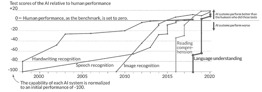

人工智能语言能力落后于其他“狭义”智能，但迅速赶上了。^(1)

这些工具在即时性上有所不同。其他新技术——你知道那些时髦词汇，比如*物联网*、*区块链*，以及所有其他大公司一直在推广的东西——通常带有巨大的价格标签，评估和实施可能会很困难。然而，关键的区别在于这些人工智能现在就可以使用，而且任何人都可以免费使用。实施的速度完全取决于您。您能多快行动起来推动业务发展呢？

ChatGPT 刚刚按下了游戏的重置按钮，事情将会发生非常快速的变化。新的竞赛现在是关于谁能将这些工具应用到他们的业务中。企业领导者必须开始推动这些技术的采用，不仅是为了即时生产力和竞争力，也是为了它们的学习和适应性所产生的复利效应。对于大多数公司来说，这些工具的采用将是一个更重要的成功因素，胜过任何其他考虑。您自己的投资、经济的发展，甚至您将做出的其他好坏商业决策，都无法与在这场新竞赛中取得领先地位的重要性相提并论。

以前——我是说从来没有——我们见证过如此巨大的飞跃，其中颠覆的速度就像翻开开关一样迅速。虽然以前的颠覆，比如计算机、互联网或智能手机最终都变得巨大，但没有一个是瞬间发生的。ChatGPT 的颠覆速度超过了我们一生中见过的任何事情，简直没有任何先例可以与如此巨大的转变相提并论。此外，这些工具不仅是免费的；它们还有能力取代目前大公司和顾问销售的许多产品和服务。重要的是要认识到，机构和思想领袖可能不会立即接受这些新工具，因为他们没有太多可获得的，但却有很多可失去的。

在许多方面，ChatGPT 的颠覆潜力类似于核武器，而过时的应对手册只能提供“躲避和掩护”的应对方式。领导者们被迫自行摸索和适应这一全新现象。然而，现在不是成为旋律的时候。现在是通过一些简单的方法，比其他人更聪明、更大胆、更不同来脱颖而出的时候。

在开始之前的最后一点说明：ChatGPT 是当今公共领域中众多生成式 AI 和大型语言模型之一。它已经成为这些工具中的“Kleenex”，在撰写本文时，它是最强大和功能最强大的 LLM。尽管我们在本书的其余部分将提到*ChatGPT*，但实际上我们指的是这一广泛且快速扩展的工具集合。

连接到视频和其他内容

企业领导者必须亲自看到这些技术的运作并亲身体验，仅仅通过阅读很难真正领会它们的巨大威力。为了促进这一点，我们在我们的网站上放置了几个视频，展示了 ChatGPT 的运作方式，并说明了本书中概述的示例。此外，读者还可以在本书中探讨的生成式 AI 和其他相关主题上找到更多信息，例如敏捷战略框架。

访问[www.digitalmoneyball.com/chatgpt](http://www.digitalmoneyball.com/chatgpt)，或使用下面的二维码访问这些内容。

**1** *来源：© The Economist Newspaper Limited, London, June 11, 2022\. 保留所有权利。*

# 本书的路线图

# 重新思考您的销售和营销“机器”

在本书中，我将要求您将销售和营销运营视为一台机器。尽管有许多重要的人类考虑因素（我们也会探讨），但您的业务前端很像一台机器，因为它将组件（如人员、流程和工具）组合在一起，将输入（如资本和 OPEX）转化为输出（如新客户）。在机器内部，有许多复杂的子组件，就像汽车中的发动机一样，它们本身也是机器，具有自己的组件、输入和输出。

创新一台机器通常依赖于其部件的能力；机器必须考虑到其组件以及它们如何最佳地配合在一起以实现预期目的。有时，部件变化如此之大，以至于整体机器的设计必须发生根本性变化。例如，马车连接到福特 T 型车上毫无用处，即使是强大的内燃机也不适合现代特斯拉。干扰通常会促使对现有设计进行全面重新评估，并要求重新构想可能实现的新设计。

对于销售和营销，旧的前端操作手册可能曾经规定了一些使机器在短时间内运作良好的事物，但今天已不再相关。随着开关的翻转，机器的部件已经发生了根本性的进步。如果您的员工现在比一年前更有能力和更有生产力，那些旧工具现在可能实际上会束缚您。为了充分利用 ChatGPT 的优势，领导者不仅必须推动其采用，还必须彻底改革组织流程和工具，以适应人员现在非常不同的能力。

目录和路线图

在第一章中，我们将建立一个框架，以适应您的业务对 ChatGPT 提供的新能力。大多数领导者可能会低估组织流程和工具现在必须发生多大变化以优化生产力，特别是考虑到其他一些源自其他同时发生的干扰因素。我们将描述几个前端用例，介绍 ChatGPT 在业务中的力量，并开始概述 ChatGPT 的巨大效用。我们将开发一些关于如何重新构想前端机器设计的初步战略考虑。

在第二章中，我们将深入思考 ChatGPT 的连锁影响，并概述一些战略原则和考虑因素，包括基本采用考虑因素、创新前端机器的原则以及在业务中快速引入变革的一些重要考虑因素。

在第三章，我们将描述通用数字时代考虑因素如何影响 ChatGPT 的适应策略。不仅前端机器的部件发生了变化，而且考虑到后 COVID 数字时代的干扰，机器的输入和输出也需要重新考虑。我们将为机器建立修订后的设计要求。

在第四章，我们将根据新的设计要求和其组件的增强功能重新构想这台机器。尽管公司无疑会有符合自身需求的独特设计，但我们的目标是展示如何重新考虑流程、工具和结构，以充分实现 ChatGPT 的影响，并解释为什么战略考虑需要远远超出简单的采用。我们将提供许多公司可以立即投入使用的战略杠杆。

在第五章，我们将为规划和执行以 ChatGPT 为重点的转型策略提供一个合适的实用手册。当你无法将机器停机时，重建机器就会变得更加困难。虽然“机器”这个比喻为讨论策略提供了有用的背景，但转型中的人员方面至关重要。

在第六章，我们将总结一些结论和最终建议。在尾声中，领导者可能会发现作者撰写本书的经验对许多领导者和员工将面对的挑战具有说明性，因为他们应对这项新的、极具威力的技术。

# 第一章

# 采用 ≠ 改编

“在创造性破坏的过程中出现了一些情况，许多公司可能不得不消亡，但如果它们能度过特定的风暴，它们本来可以活得更有活力和用处。”

—约瑟夫·熊彼特

ChatGPT 的适应性

考虑三种部署 ChatGPT 或类似工具的方法：

+   **公共。** 员工可以通过简单的网络浏览器执行大量强大的功能，并与其他软件和工具相结合，从而提高生产力。

+   **嵌入式。** 许多常见的软件工具将嵌入 LLMs 以改善用户界面并增强软件的功能。可以指望来自 CRM 和 ERP 系统到微软办公软件的工具在不久的将来嵌入这些新工具，因为许多已经开始了。

+   **本地。** 通过 API 接口和其他方式，公司可以采用这些工具的特定、本地化、经过训练的变体。

这些方法在成本、功能、数据安全性和定制化等方面存在权衡。然而，在本书中，我们将专注于使用公共版本，只需通过网络浏览器即可访问。在这个初级阶段，企业可以立即采用这个简单版本，同时也考虑将来可能整合不同版本的可能性。

像所有工具一样，这些工具也有它们的局限性。它们在输出方面也容易出现几个缺陷，包括产生看似可信的答案但实际上是错误的“幻觉”。此外，虽然 ChatGPT 在许多方面的能力令人着迷，但在简单数学方面却出奇地糟糕，计算容易出错。企业可以找到解决这些问题的方法来利用其巨大的能力，并指望这些问题很快得到解决——可能在接下来的十二到二十四个月内——使用多源验证和实施改进的计算协议等方法。随着真相和计算可靠性的提高，ChatGPT 将有能力在企业各个领域大部分取代许多销售、运营、财务和其他任务。与此同时，不要让这些真实的局限性掩盖这些工具目前可以提供的巨大效用。

ChatGPT 如何可以提升企业的能力？虽然使用案例几乎是无穷无尽的，但某些功能提供了更大的效用潜力。公共变体可能对客户关系管理（CRM，即销售和营销）和客户服务等功能最有益处，这两者的日常任务往往（1）更加以沟通为中心，（2）使用更广泛的技能和知识，以及（3）涉及更多非重复和创造性的努力，而不是习惯性、重复性的任务。特别是 CRM 将比高度专业化、不太以沟通为中心和/或更重复性的功能如供应链管理（SCM）或产品生命周期管理（PLM）等提供更大的初始采用机会。

尽管这些工具在提高当前任务效率方面具有强大潜力，但要认识到这些工具现在将使企业能够执行以前不可行或不经济的新任务。这意味着标准不仅仅会在生产力方面提高，还会在与客户的服务和互动水平、生产的产品和服务质量等方面提高。不要只考虑效率和替代当前任务。考虑这些工具如何促进创新，并为客户提供更高水平的价值。

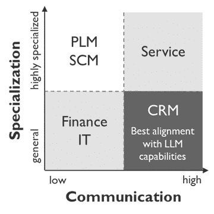

ChatGPT 最初的应用最适合于销售和营销以及客户服务中的任务。

如果领导者能够意识到这些工具已经如何改变了游戏规则，他们也将意识到需要从根本上改变许多他们为了在市场上竞争和取胜而做的事情。适应这些新技术不仅仅是让员工尝试它们。领导者必须推动端到端的采用，同时重新调整规则和工具包，以利用新的能力来竞争和在新游戏中取胜。我们提倡的方法是一种全面的方法，不仅包括采用这些技术，还包括重新调整组织流程、工具和方法，以利用现在高效生产力员工的新能力。正如我们将展示的，ChatGPT 的采用和适应是两个完全不同的概念。

要充分利用这些新技术的力量并适应这种新范式，企业必须（1）采用这些新技术，（2）重新设计流程和工作流程，（3）重新设定生产力期望，以及（4）重构层级和组织结构。

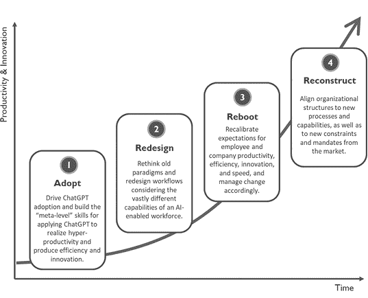

适应的指南

1.  **采纳。** 在采纳的早期阶段，领导者将在启动过程中发挥至关重要的作用。采纳远非自然，公司需要一个强有力的动力来动员和快速行动。领导者需要计划自上而下和自下而上的手段来鼓励和推动采纳，这不仅是为了效率，也是为了学习和创新新的 ChatGPT 应用案例。许多旧习惯必须改变。此外，团队将开始培养“应用 ChatGPT”的元技能，这一技能已迅速超越几乎所有其他个人技能，以提高生产力。领导者必须点燃一个能够自我维持的采纳良性循环的势头。

1.  **重新设计。** 尽管许多领导者不可避免地意识到采纳的重要性，但他们可能不会意识到组织流程必须如何不同地定制以适应快速变化的新能力。领导者必须认识到，鉴于 ChatGPT 对员工能力和生产力的巨大影响，需要重新设计流程以实现 ChatGPT 的巨大潜力。传统流程将远远不足以发挥现在可以实现的效率和创新的全部潜力。

1.  **重启。** 以前需要几天完成的活动现在可能只需要几个小时，甚至几分钟。这将需要领导者和受影响员工对生产力期望进行严格的重新校准。领导者必须管理业务中的变化，同时使用推动和拉动、胡萝卜和棍子。虽然变革管理项目必须富有同理心，但也必须认识到对更紧迫的截止日期、更大的产出、拉长的关键绩效指标等的需求，这些都是生产力期望已经发生变化的信号。

1.  **重建。** 在较长的周期内，企业必须调整新的整体战略和战术。团队将如何利用他们新获得的大量额外时间进行业务中的其他重要活动？领导者是否期望团队有更高水平的产出？他们是否会将资源投入到其他创新的方式来提供客户价值？或者他们会调整团队规模，并利用这个机会削减成本？

    在短时间内实现大规模变革通常需要至少一个重大的步变和变革性举措。组织结构的变化和人员的转移可能是必要的。团队的活动和目标将发生相当大的变化，旧结构可能不再适应 ChatGPT 的干扰。结构调整还可以帮助促进这些必要的步变，并加快采纳和进展的持续速度。

正如您将在后面看到的，我们将使用敏捷方法来驱动较短的采纳-重新设计-重启周期的持续重复，制定每个大约持续一个财季的冲刺计划。"重建"步骤较少发生，需要更长的周期。

技术的发展速度及其对您的业务的影响对于传统的战略规划来说太快了，但企业仍然需要规划和管理变革。我们的敏捷战略框架将为领导者提供一种快速调整组织的方式，每个季度都会制定新策略并推动其紧急实施，并从以往活动中汲取经验，根据需要调整方向。这种规划和执行模式是根据新数字时代所需的变革速度量身定制的。

销售和营销的三个初始示例使用案例

要开始并了解一些 ChatGPT 令人惊叹的功能，我们将看看三个使用案例，这将揭示其转变销售和营销潜力的一部分。通过这些使用案例，读者无疑会建立联系并为企业的许多其他机会生成想法。ChatGPT 的应用范围广泛，涵盖所有功能。

当我们逐步解决以下三个使用案例时，我们将列出每个案例的几个更广泛的战略影响。领导者必须认识到破坏的程度，并开始在象棋游戏中考虑几步棋。如果您能通过利用 ChatGPT 来增强“销售和营销机器”的效率，超越更大的竞争对手，胜过他们更昂贵的系统和软件，会怎样？如果您能将作为中小企业的限制转化为优势呢？在我们继续进行时，请记住这些考虑。

我们强烈鼓励业务领导者在 ChatGPT 中应用这些使用案例。我们发现没有什么能替代创造令人瞠目结舌的体验和随后的紧迫感。

示例 #1：通过 ChatGPT 加速销售潜在客户

在销售领域，潜在客户开发是一项至关重要但耗时的活动。销售团队经常面临着在开发新业务机会上投入足够时间和精力的挑战。然而，随着 ChatGPT 的出现，销售人员现在有能力简化其潜在客户开发工作并提升新客户获取。通过利用 ChatGPT 的能力，销售团队可以以显著的效率提升创建、执行和监控潜在客户活动。这项技术有潜力将工作时间缩短 90% 或更多，使销售人员能够将宝贵的时间分配给其他重要任务和倡议。ChatGPT 的出现确实赋予销售团队加速增长并在获取新客户方面取得更大成功的能力。

作为我们对 ChatGPT 能力的第一个简单示例，我们将探讨如何利用它来创建、修改并发送量身定制的销售潜在客户邮件，从零开始并在不到一个小时内完成工作。

**开发内容（在十分钟内完成）。** 简化潜在客户过程的第一步是开发引人注目的电子邮件信息。销售人员可以通过向 ChatGPT 提供初始信息（如相关在线研究或从宣传册或其他宣传品中复制并粘贴的文本）来启动此过程。利用这些输入，ChatGPT 生成了初步的潜在客户电子邮件，可以进一步完善。

销售人员随后可以与 ChatGPT 合作修改电子邮件，并确保其侧重于特定的投资组合要素、价值驱动因素或其他相关方面。通过将电子邮件定位于特定公司或行业细分的目标，消息变得更加个性化和有影响力。为了迎合不同类型的公司或买家人设，销售人员可以创建几种核心消息变体，甚至可以独特定制每一条消息，利用 ChatGPT 的多功能性能。

**自动化内容创建和电子邮件（也在十分钟内完成）。** 一旦电子邮件内容得到完善，就是自动化潜在客户过程的时候了。从 Excel 中的潜在客户清单开始，ChatGPT 可以构建 VBA（Visual Basic for Applications）形式的代码，从指定的潜在客户清单中为每个潜在客户自动生成个性化电子邮件。ChatGPT 可以仅通过简单描述（大约五十个字）所需执行的功能来创建此代码。

有了代码的支持，新系统根据潜在客户清单中的特定指定或标准选择适当的电子邮件变体。它记录了诸如电子邮件日期之类的重要信息，并设置了下一步的跟踪目的，这些可以方便地在主要潜在客户清单中进行管理。这种自动化消除了销售人员创建和手动发送个别电子邮件的需要，节省了大量时间和精力。

**战略影响。** 在销售潜在客户中引入 ChatGPT 为企业带来了变革性的战略影响。最明显的优势是通过加快撰写文案、电子邮件、信函和其他形式的沟通过程而提供的巨大节省时间。以前需要数小时的工作现在可以在几分钟内完成，使销售团队能够更有效地分配时间。

此外，销售团队利用 Excel 等程序甚至编写自己的代码的能力使他们能够扩大自己的市场推广。每个销售人员都可以成为一个强大、可扩展和高效的资源，用于招揽和开发新客户。这有可能重新塑造销售和营销团队的期望，并需要新的整体策略以充分利用这些新发现的生产力杠杆。

**结论。** 销售前景是任何成功销售团队的关键方面，通过利用 ChatGPT 的能力，可以显著增强。通过简化创建、修订和自动化定制前景邮件的过程，销售人员可以实现无与伦比的效率提升，为其他创收活动腾出时间。这项技术的战略影响不仅仅局限于前景，还使企业能够充分利用销售团队的潜力，并推动客户获取的加速增长。在今天充满活力的商业环境中，拥抱这个新的销售前景效率时代对于寻求竞争优势的组织至关重要。

例子＃2：用 ChatGPT 革新面向账户的营销

在数字时代，客户不断受到来自销售商的电子邮件、电话和社交媒体请求的轰炸，突破他们的屏障并吸引他们的注意力变得越来越具有挑战性。为了在市场中脱颖而出，公司必须超越传统流程，找到创新的方式来吸引客户。随着 ChatGPT 的出现，企业不仅可以实现巨大的效率提升，还可以开发新的面向账户的营销（ABM）策略。ABM 是一种专注于通过个性化和定制营销内容和努力来吸引特定高价值账户的营销战略。ChatGPT 可以革新和扩展面向账户的营销（ABM）倡议，使公司能够大规模生成个性化内容，克服垃圾邮件过滤器，并与潜在客户建立更深入的联系。

**饱和时代。** 今天的客户已经被数字营销人员和广告商竞相争夺他们的注意力所饱和，这使得公司难以突破噪音并接触到他们的目标受众。客户保持警惕，传统技术可能不再有效地获取点击并确保销售会议。在这个后 COVID 时代，采用能够与客户 resonant 的创新方法至关重要。如果 ChatGPT 可以使公司轻松根据常见模板、客户特定数据和其他可用信息为特定客户定制内容呢？以前，实现这种个性化可能是耗时或昂贵的，但通过 ChatGPT，这变得很容易实现。通过为个体客户量身定制内容，公司可以克服垃圾邮件过滤器，并用独特而引人入胜的信息吸引潜在客户。

**基于账户的营销（ABM）和 ChatGPT。** ChatGPT 的能力不仅限于简单的写作和内容生成。它可以浏览大量在线数据，如年度报告和行业出版物，并确定特定行业、人物甚至个别客户的关键驱动因素。这些宝贵信息可以整理并存储在简单的 Excel 电子表格中，以便轻松查阅。

利用现有的营销资产，ChatGPT 可以将收集到的见解转化为基于账户的营销资产，使用可定制的模板，直接或通过宏。销售团队可以将这些内容纳入他们的潜在客户开发工作中（例如，作为个性化电子邮件的附件）。与昂贵的软件或系统不同，ChatGPT 可以使销售人员的个人风格得以包含，培养所有权感并增强参与度。

**战略意义。** 在个性化基于账户的营销中使用 ChatGPT 为企业带来了几个战略意义。首先，它引发了一个关键问题：个性化信息是否能超越自动化系统与标准内容的有效性？如果改进后的命中率和与潜在客户的互动显著，它可以成为当今广告饱和时代的一种更优解决方案。

营销团队还必须重新考虑其领导生成和新账户获取活动的方法。在 ChatGPT 有效创建和交付个性化内容的能力下，外包领导生成服务和 CRM 软件的成本效益比需要重新评估。

此外，ChatGPT 可以整合 PowerPoint 和 Excel 等通用软件的全部功能，自动化功能并替代其他昂贵的专业软件。这为简化操作和降低成本开辟了新途径。ChatGPT 使即使是经验不足的用户也能利用这一强大软件的全部功能，超越大多数用户通常利用的有限功能。此外，它允许用户*结合*这些通用软件的功能，这可能会更加强大。

**结论。** ChatGPT 的能力与基于账户的营销的融合彻底改变了公司在饱和的数字市场中与潜在客户互动的方式。通过根据客户特定数据、兴趣和决策驱动因素个性化内容，企业可以克服垃圾邮件过滤器，脱颖而出，吸引潜在客户的注意。战略意义重大，迫使公司重新思考其营销方法，重新评估现有系统和服务的有效性，并探索 ChatGPT 在利用通用软件功能方面的未开发潜力。拥抱 ChatGPT 赋予企业与目标受众建立更深层次连接的能力，最终推动更高的转化率，并在当今竞争激烈的市场中实现可持续增长。

示例 #3：释放 ChatGPT 在客户保留中的力量

虽然 ChatGPT 在通过增强潜在客户开发和个性化的基于账户的营销（ABM）工作中显示出显著潜力，但其在客户保留中的应用同样令人期待。公司必须超越其现有流程，并挑战自己找到在市场上脱颖而出的创新方式。随着 ChatGPT 的出现，曾被认为耗时或成本过高的概念现在已经变得可行，使企业能够利用数据和定制的力量来增强客户参与度和保留率。

**超越传统方法的思考。** 为了利用 ChatGPT 来提高客户保留率，公司可以将 ABM 中采用的技术与从 CRM、ERP 和服务记录中获取的内部客户数据相结合。通过将 ChatGPT 与这些数据源集成，企业可以轻松为个别客户创建定制内容包，包括常见模板、客户特定数据、关键绩效指标（KPI）、运营数据和其他易获得的内部信息。这些资产的目标是促进与战略客户的关键利益相关者进行销售讨论，每年每个账户达到一到两次互动。目标是提醒客户公司的表现，并强化他们最初选择该业务的原因。通过通过个性化内容建立更深层次的亲密关系，公司可以促进无与伦比的销售对话，并巩固其作为首选供应商的地位。

**释放潜力。** 现代 ERP 系统、服务系统和其他数据库包含大量有价值的信息，通常由于所需的复杂性和投资而被销售和营销组织忽视。然而，通过 ChatGPT，这些内容可以转化为客户特定的数据包，赋予销售团队进行定期讨论的能力，重点关注公司表现、KPI 和其他相关主题。通过采用有针对性的消息传递、playbooks 和推动这些讨论的节奏，公司可以发现隐藏的见解并解决可能会被忽视的问题。在保留计划中利用 ChatGPT 使企业能够利用宝贵资源并加强与客户的关系。

**战略影响。** 将 ChatGPT 作为客户保留工具引入对企业带来几个战略影响。首先，充分利用这项技术需要组织以非传统方式利用它——产生目前尚未产生的客户价值。通过培养创新文化并探索 ChatGPT 的全部潜力，领导者可以发现隐藏的能力并打开新的可能性。

此外，公司可能考虑其他方式，将他们的数据从“记录系统”转变为与客户“互动系统”。通过利用 ChatGPT，企业可以从销售、服务和其他系统中提取和利用埋藏的数据。在这种特定情况下，后端信息被更好地用于前端目标。

此外，利用 ChatGPT 进行创新将需要各部门之间的跨职能协作，例如前端销售和营销以及后端供应链管理，甚至可能需要 IT 的帮助。领导者必须认识到并拥抱 ChatGPT 带来的创新机会，通过超越界限并促进各种功能之间的沟通和协作。

表面下的冰山

效率和创新在整个企业中都是可用的，而这些前端示例仅仅是冰山一角。考虑一个培训部门，现在可以利用 ChatGPT 将 O&M 手册轻松转化为培训演示文稿，将这些演示文稿转化为测验，并将其汇总为移动应用程序和其他用于进一步吸引客户的内容。考虑一个财务团队，现在可以在短时间内构建电子表格和演示文稿，ChatGPT 在未来一年内的预期进展将在估值、财务报告分析等方面产生巨大的效率。考虑 HR 团队，现在可以轻松起草政策、新闻通讯等文件，或者提出复杂的法律问题并获得令人惊讶的准确答案。列举不胜枚举。

以下表格提供了一个简短的可能性列表，客户面向操作可以利用 ChatGPT 的强大功能。

| 销售 | 营销 | 服务 |
| --- | --- | --- |

|

+   编写和编辑电子邮件、信函等。

+   铅矿开采

+   客户研究

+   管道管理

+   创建报告

+   资产和内容的定制和个性化

+   分析导出的 CRM 数据

+   社交媒体帖子

+   组织任务、设定优先级和创建日程安排

|

+   内容创作：撰写文案，社交媒体等。

+   人物角色塑造

+   电子邮件模板和脚本

+   潜在客户开发

+   市场研究

+   竞争对手研究

+   强制执行和实施品牌准则

+   各种创意和构思努力

+   个性化和 ABM

|

+   呼叫中心培训和辅导

+   服务说明、纠正措施的制定

+   培训材料、测试和测验、语言翻译等的开发

+   从数据库和其他来源提取服务知识

+   创建现场服务和其他报告

+   各种新工具和服务的内容，例如移动应用程序，物联网等。

|

我们将提供 ChatGPT 在企业中的广泛应用的简短十二项通用列表：

+   **将**信息压缩成更短的易消化文本、表格或其他格式

+   **总结**大量信息并将其简化到适当的水平

+   **推荐**产品、服务等，基于评估的用户偏好

+   **计算和操作** 数据，包括执行 Excel 等程序的许多复杂功能

+   **分析** 数据并提取发现和建议

+   **抓取** 各种公共来源的数据（请注意，ChatGPT 数据目前仅追溯到 2021 年 9 月。）

+   **编程** 使用各种语言编写代码、宏等，从而使微软办公软件等软件更加强大

+   **撰写和编辑** 文案、电子邮件、信函、社交媒体帖子等

+   **翻译** 成不同语言或不同写作风格

+   **创建和构思** 在各种机会领域

+   **为** 非关键性请求提供专业建议（例如财务、法律、人力资源政策等）

+   **教育** 用户，回答问题，解释概念，提供示例，并提供更多资源以供进一步学习

主要要点

让我们盘点这些初始用例并得出一些初步的发现和原则：

财务影响

前一页上列出的应用程序扩展列表很长，但即使我们仅列出三个示例用例，也能实现一些严肃的效率。公司发现通过 ChatGPT 替代任务和传统执行许多活动的方式，至少在理论上通过价值流程映射和端到端分析，他们可以将 SG&A 费用降低 50%甚至更多，这并不罕见。

ChatGPT 的采用提供了效率和创新影响，远远超出其他更受欢迎的投资（例如，CRM 软件，它确实需要重大的初始投资和年度成本）。那么为什么公司如此愿意投资于昂贵的软件，但不愿意同样投资于实现 ChatGPT 广泛采用的巨大影响？传统智慧需要多长时间才能赶上，与此同时会有多少人盲目跟风？财务影响可能是巨大的，这是另一个强烈的信号，游戏规则已经完全改变。

重新利用销售和营销活动

鉴于 ChatGPT 对前端生产力的重大影响，您的销售和营销人员现在将如何利用他们腾出的时间开展业务中的其他重要活动？

你是否期望团队有更高水平的产出？他们是否会增加拓展活动以寻找新客户并发展业务？他们是否会使用 ChatGPT 从现有资产创建定期社交媒体帖子或扩大在社交媒体上的存在以增加对品牌的认知？

或者您会利用这个机会重建和/或减少 SG&A 以改善利润率或提供更低的价格并变得更具竞争力吗？

当这些影响可以立即实现时，您如何快速在您的业务中进行这些调整？

随着竞争环境趋于平衡，越来越多的公司采用 ChatGPT，竞争压力将使这些决定变得紧迫。我们建议现在就采取行动，提前做出这些决定将带来巨大优势。

重新设计和重启您的“销售与营销机器”

大多数六个月前的新客户获取 playbook 通常会推荐像营销自动化或潜在客户生成活动这样的大众市场技术，这两者通常是外包的，并且都使用技术来“拉动”，培养和确认新潜在客户。这些 playbook 还会推荐 CRM 系统用于数据结构化，吸引客户，运行分析，创建管理报告以及一长串其他承诺的好处。然而，这些工具的价值主张本质上包含了除了财务成本之外的责任。例如，CRM 系统在某些领域可能提供强大的效用，但它可能对销售文化有害，通常会将销售人员变成数据文员，并施加大公司风格的非增值工作。营销自动化在突破数字化为保护客户免受广告商饱和而创建的“屏障”方面存在困难（具有讽刺意味的是，数字化首先创造了这种情况）。

随着 ChatGPT 现在使销售人员超级高效，并且像 Excel 这样的工具变得越来越强大，旧有的假设需要更新。意识到游戏已经改变的聪明公司可以重新设计自己的机器，并调整它们以获得新的巨大能力收益。例如，公司可以构建一套直接推动流程，与更昂贵的方法、服务和软件相媲美，成本仅为一小部分，同时更好地吸引前端人员并克服许多与现代销售和营销相关的固有障碍。（我们稍后将回顾其中一些想法。）ChatGPT 现在使您的每位销售人员变得极其强大，而无需额外的软件，并且解锁了以前对中小企业不可用的营销能力。凭借创新的思维方式和对采用这些工具的一点投资，聪明的公司可以利用这一机会，只要他们愿意稍微改变思维方式。

此外，这一认识对您在服务、制造或产品开发方面的其他“机器”意味着什么？通过对这些机器的“系统”——即总体业务——进行一些战略性的系统设计变更，这些机器可能会更好地运作？领导者必须超越简单的采用，并意识到端到端的组织流程，playbook 和期望需要为新时代的能力和生产力重新设计和重启。

# 第二章

# 适应原则

“在动荡时期最大的危险不是动荡本身，而是用昨天的逻辑行事。”

—彼得·德鲁克

ChatGPT 的适应原则：评估机器的新潜在组件

要想构想我们机器的新版本，我们必须首先探索由 ChatGPT 提供的广泛设计可能性。此外，除了新机器的设计，我们还需要考虑业务的转型过程，这本身就涉及重要的考虑因素。

商业领袖需要采取战略思维，提前思考短期和长期的未来。这些工具将如何持续演变和改进？您的客户和竞争对手将如何接受它们？这对您的业务有什么影响？

为了深入探讨这一探索，我们将在适应-重新设计-重启-重建框架内审视各种战略考虑因素。我们将最初将话题简化并专注于采用。然而，我们将迅速深入探讨一些复杂的话题和思考，许多企业可能会忽视。

许多这些考虑因素之间存在相互关联，一个因素会导致另一个因素的级联方式。我们的意图是让这些初步考虑引发商业领袖的深思。许多商业领袖尚未获得这些工具的经验，因此无法真正理解它们在业务中的深远和即时影响以及它们在整个业务中的巨大潜力。然而，这种真空为那些愿意进行批判性和战略性思考的领导者提供了一个显著的机会。

基本采用原则

**“首先考虑 ChatGPT。”** 领导者必须积极激励员工克服固有的抵抗和借口，鼓励他们养成新习惯。必须认识到错误，包括偶尔的“幻觉”，以及其他挑战可能成为避免采用和改变的借口。 “自己做会更容易” 的错觉或合理化可能是一种常见心态。然而，重要的是要承认，即使对输出准确性存在担忧，许多任务仍然可以实现小幅效率提升。随着时间的推移，小的效率提升将累积起来。

“首先考虑 ChatGPT”可以作为组织建立新习惯的宝贵原则。员工应被鼓励将 ChatGPT 作为各种活动的起点，无论是涉及创意努力、编写初始代码、理解数据还是克服障碍。ChatGPT 应得到利用的机会，期望是使用 ChatGPT，只有在它未能提供效用时才予以忽略。

随着 ChatGPT 拥有强大的能力，对企业来说培养“使用 ChatGPT”的元技能变得越来越重要。这种技能比许多——如果不是大多数——其他商业技能和能力更为重要。类似于获得其他技能，熟练运用 ChatGPT 只能通过实践和重复来培养。建立这些技能和习惯的最有效方式是将 ChatGPT 整合到日常运营中的各种任务中。

**“信任但验证。”** “信任但验证”原则，冷战时期由罗纳德·里根著名采用，在 ChatGPT 的背景下具有相关性。虽然 ChatGPT 是一个能够生成令人印象深刻输出的强大工具，但它并非无懈可击。像所有先进的语言模型一样，ChatGPT 偶尔可能会产生错误，提供过时信息，甚至生成荒谬的回应。要有效利用 ChatGPT，用户必须运用自己的判断力，并以批判性的心态对待其输出。虽然 ChatGPT 可以是一个宝贵的资源，但不应仅仅依赖它而不经过验证或确认。

不同的背景可能需要不同程度的审查。例如，用于年度股东报告的信息显然应比内部市场研究经受更严格的审查。为高价广告生成的文案需要比非正式电子邮件文本进行更彻底的审查。平衡质量、成本和速度等因素至关重要，关键在于在每个领域做出适当的妥协。

各种技巧可以帮助用户辨别事实和虚构。重复查询和比较答案可以提供合理程度的确认，与已知可靠来源的输出样本进行交叉检查也可以。请求引用可以促进快速交叉检查，而且 ChatGPT 本身通常可以帮助识别自身的错误。记住，看起来*真实*的幻觉会伤害你。

最后，重要的是要注意，在这个阶段，像 ChatGPT 这样的语言模型还没有达到百科全书和其他经过验证的内容来源的同等事实准确性水平。如果事实准确性是主要要求，建议利用专门设计用于此目的的其他工具，同时利用 ChatGPT 提供的创造性、建设性和其他有利能力。

**优先考虑 ChatGPT 技能。** 随着 ChatGPT 的能力不断发展，组织保持与指导其最佳利用的最新操作手册和最佳实践同步是至关重要的。幸运的是，有大量信息和资源可供使用，以确保您的企业始终跟上当前 ChatGPT 询问技术的最新动态。来自多个来源的每周新发布提供了有关各个方面的宝贵见解，包括提示策略、语调和风格考虑以及输出定义。通过利用这些资源，您的公司可以有效而高效地应对 ChatGPT 的复杂性。

然而，仅仅获得这些知识是不够的；它必须在整个组织中共享和整合。建立知识传播和协作机制是解锁 ChatGPT 在您的员工中发挥全部潜力的关键。通过培养重视最佳实践交流的文化，您的员工可以利用 ChatGPT 的能力推动生产力和创新。

为了实现这一目标，考虑实施一种结构化方法，确保员工可以获取最新的操作手册。这可能涉及创建一个集中的知识库或定期进行培训课程，以在整个组织中传播知识。此外，鼓励跨职能协作，促进见解和经验的共享，使您的团队共同利用 ChatGPT 的力量。

要及时了解 ChatGPT 的提示、询问和最佳实践，中小企业可以参与一系列活动，包括关注行业出版物和博客、参加网络研讨会和虚拟活动、参与在线社区和论坛，并利用开源资源。此外，热情的“超级用户”可以被邀请为其他员工进行内部培训和研讨会，无论是由他们自己领导还是由外部顾问领导。这些方法可以实现持续学习和适应，以最大化 ChatGPT 在组织内的好处。

**选择正确的突破口。** 销售和营销提供了利用 ChatGPT 提高效率和创新的最广泛机会。 （注：客户服务运营通常是紧随其后的。）但正如我们将讨论的那样，大多数中小企业也急需升级其销售和营销能力，以适应整体数字时代的挑战。基于威胁和机会的这种趋势，前端运营是大多数公司初期推动 ChatGPT 采用的正确突破口的程序、策略和战术。公司可以在这里进行重点关注，然后将这些初期努力扩展到整个企业。

**推动效率和创新。** 尽管公司重视效率和创新同样重要，但效率杠杆往往对企业来说更直观和本能。另一方面，创新杠杆可能不会立即显现，需要更多的努力和自上而下的支持才能有效利用。为了解决这个问题，业务领导者可以启动和优先考虑一些最初的“灯塔”项目，展示 ChatGPT 如何使公司能够完成以前不可能、不切实际或财务上不可行的任务。

ChatGPT 使企业能够探索新的客户群体，增强与现有客户的互动，并创建创新的产品和服务。这代表了可以借助 ChatGPT 实现的不同创新类别。为了领先于竞争，业务领导者必须积极推动创新倡议，并拥抱新的可能性。

**明智的 IT 安全政策。** 随着人工智能的最新进展，建议公司积极重新评估其现有的数据和信息安全政策，并将其调整以纳入 ChatGPT 提出的新考虑因素。对于公司来说，建立明确的指导方针区分 ChatGPT 中可以和不可以输入和查询的信息至关重要。公司可以加强关于信息保密性的培训，确保对保密级别和考虑使用这些新工具的政策有清晰的指定。

公司应该努力在谨慎和实用主义之间取得平衡，避免当今普遍存在的过度保守。相反，他们应该制定基于现实风险和潜在回报的政策。重要的是要认识到 ChatGPT 提供了相当安全的数据保护措施，并提供了显著的效率和创新影响。因此，公司应鼓励广泛使用 ChatGPT，同时*管理*相关风险，而不是完全避免它们。

通过积极主动地处理数据和信息安全问题，公司可以在保护敏感信息的同时利用 ChatGPT 的好处，最大限度地发挥其推动效率和创新的潜力。

创新原则

**“从零到一。”** 想象一下，如果每个员工都能充分利用像 Microsoft Office 或其他通用应用程序这样的工具的巨大力量，甚至可以编写代码，你的公司可以实现什么样的能力和效率。有了 ChatGPT，这种可能性变成了现实。

将 ChatGPT 视为一种放大器，可以将您当前的软件和编程能力乘以数量级。但需要注意的是，任何数乘以零都是零。当涉及到编程和软件能力时，ChatGPT 提出了一个“从零到一”的命题。要利用这项技术的巨大力量，员工需要掌握软件和编程的基础知识，并了解计算机的“思维”（例如，能够编写伪代码或知道在哪里插入和执行 Excel 宏）。通过 ChatGPT，提升技能更注重广度而非深度——即个人更有价值的是了解软件能做什么，而不是如何精确地做。例如，在 Excel 中，更重要的是了解数据透视表是什么，而不是如何构建一个。通过对从零到一的人进行适度投资，ChatGPT 的放大效果将使他们达到百分之百。然后将这个数字乘以您组织中的人数。

在大数据变得越来越重要和强大的世界中，为人们提供有效利用这些数据的工具是有意义的。尽管这个原则不仅限于 Excel，但单单利用 ChatGPT 结合 Excel 的影响就是显著的，因为它具有新发现的功能，可以被任何人用来熟练地分析和操作数据。这些进步已经将 Excel 转变为一个更加强大的工具，可以被非程序员使用 ChatGPT 轻松定制。现在每个人都可以成为办公室以前求助的那位“Excel 巫师”。

超越 Excel，ChatGPT 已经解锁了 Microsoft Office 和其他常见软件应用程序的卓越功能。大多数使用 Word、PowerPoint 或其他类似软件的员工只是触及了其功能的表面。即使是您组织内的软件专家可能也没有充分利用多年来开发的许多广泛功能和工具。大多数人只是利用了软件真正潜力的一小部分。如果人们能够利用软件的全部功能范围，而不是目前仅使用的有限部分呢？

此外，最有效地使用 ChatGPT 的方法涉及在 ChatGPT 和不同软件组合之间交替的迭代过程。ChatGPT 可以作为这些元素之间的链接，放大它们的能力。例如，通过在 ChatGPT、Excel、PowerPoint 之间无缝过渡，并编写简单的宏和代码，即使是经验不足的用户也可以创建个性化资产，吸引潜在客户，管理潜在客户名单，合并多个非结构化的潜在客户名单，并对数据进行良好的分析。正如我们展示 Excel 可以在 Outlook 中撰写电子邮件一样，ChatGPT 使用户可以轻松地在软件之间切换并结合它们的功能。当用户充分利用这个软件生态系统的潜力时，生产力不仅仅是累加的，而是指数级增强的。

在许多方面，ChatGPT 已经将像 Microsoft Office 这样的通用软件转变为执行以前需要专门和昂贵软件的功能。通过释放所有用户都具备专家能力的充分利用的通用软件的综合能力，这种通用且廉价的软件现在提供了类似的——也许在许多方面更优越的能力，与罐头、专门的软件相比。鉴于这些新的能力，需要一种新的思维方式。

**数字化 DIY（自助）。** 这些“从零到一”的实现为中小型企业提供了重新考虑其当前前端软件、系统和服务价值的引人注目的理由。通过利用 ChatGPT 和通用工具，中小型企业可以以更低的成本实现可比的结果，同时避免与昂贵专业软件相关的一些缺点。

让我们以 CRM 软件为例，许多公司使用它来管理前端操作。许多传统上由这些昂贵工具执行的功能现在可以通过 ChatGPT 轻松地结构化非结构化数据来有效替代，比如分散在多个 Excel 电子表格中的信息。此外，CRM 系统推广的人工智能功能通常可以通过 ChatGPT 或其他独立应用以更低的成本实现。当销售人员和经理，现在都是 ChatGPT 增强软件专家，可以充分利用标准的、通用的软件如 Microsoft Office 的巨大功能时，这些其他工具的“资产负债表”可能需要重新评估。

考虑一下 CRM 系统的普遍认可的好处，可能包括以下内容^(2)：

| 好处 | 特点 |
| --- | --- |

|

+   集中的客户数据

+   能够识别并转化更多潜在客户

+   提高留存率

+   智能、数据驱动的决策

+   自动化繁琐的事务

+   赚更多钱

|

+   信息集中在一个地方

+   所有利益相关者都可以访问信息；即使在不同地点，也能使利益相关者保持一致

+   帮助协调活动

+   监控客户与营销计划的互动

+   运行营销自动化

+   安排销售人员定期与现有客户联系，或进行自动连接

+   数据分析功能，以及搜索和机会性发现数据趋势的能力

+   仪表板和改进的预测

|

让我们挑战这种传统思维。在评估这类软件的整体影响时，关键是要审查不仅仅是它们的好处，还包括相关的整体成本，包括货币和其他成本。CRM 工具提供了一定的好处，但可能伴随着集成成本、高年度费用、维护义务、对生产力的干扰以及销售人员的脱节。这些系统经常会将高绩效的销售专业人员转变为简单的数据文员，而它们广泛的管理报告功能经常被低估利用。

此外，必须评估和比较替代选项。通过利用 ChatGPT 的能力——以及诸如 Excel、PowerPoint 和电子邮件等工具——许多昂贵系统提供的许多功能可以在不带来常见负担的情况下有效替代。在本书的后面部分，我们将看到 ChatGPT 的更多能力。

对于销售人员较少、营销计划不如大公司复杂的中小企业来说，CRM 工具提供的集成和定制功能通常是不必要的，也不值得支出或相关成本。有趣的是，即使在大型跨国企业中，一些最成功的前端运营也是使用 Excel 电子表格进行管理的。这种成功部分归因于较小的团队、适当的业务分割、扁平结构以及通常在大型自上而下的结构和系统及其附带工具中被侵蚀的整体所有权文化。文化带来的好处是否比软件提供商宣传的报告能力和所谓的效率更重要？显然，许��大公司采用的实践和今天流行的管理智慧中融入的实践与中小企业的需求和文化不符。

另一个值得重新考虑的话题是严重依赖营销自动化的外包潜在客户生成服务。除了成本之外，这些服务还存在诸如符合 CAN-SPAM 法案等法规的限制，这些限制通常导致电子邮件被标记为垃圾邮件，因此很少被阅读。通过 ChatGPT 提高销售人员的效率，个性化的销售前景为许多公司提供了一种成本更低、更有效的潜在客户开发和培育方法。

对于中小企业来说，重要的是以不同的方式思考各种可用工具和服务的真正价值主张——考虑到他们独特的需求和文化，并审查 ChatGPT 现在提供的替代选项。在考虑到其组成部分（人员、软件和工具）的转变能力的情况下重新评估前端机器是至关重要的。虽然旧机器旨在最大化推广和销量，通常需要集中的自上而下的方法，但数字时代的新挑战需要更加个性化、有针对性的方法。借助 ChatGPT 增强的销售团队和通用软件的能力，聪明的中小企业可以创建与大公司使用的系统相匹配甚至超越其能力的 DIY 解决方案，利用一些自然优势，同时成本大大降低。

大型企业与中小企业的工具选择

不要低估资本市场对大公司决策和流程的影响。股东们重视*可预测性*，这导致了许多大公司管理实践的出现，这些实践反映了这一优先级。例如，尽管一些销售预测对于健康的商业规划（通过 S&OP 等流程）当然是必要的，但如今过度的预测往往是为了*可预测地达到数字*的一种自上而下的体现。其他例子包括数据报告、演示文稿以及其他旨在避免预测失误的非增值活动。这些实践已经深入到许多大公司，并在商业手册中被制度化。管理教科书强化了这些实践，然后软件工具被设计来支持它们。

然而，越来越多的人意识到这些以及许多其他大公司的实践可能产生的负面影响比积极影响更大，即使对于大型企业也是如此。在涉及 CRM 软件和工具时，拥有许多报告的诱惑可能看起来吸引人，但实际上，生成的数据中有相当大一部分是未被使用的，并未能提供营销人员承诺的可操作见解。此外，生成和管理这些数据会产生超出财务开支的成本，包括潜在的负面文化影响。

管理者可能会被新软件的广泛功能所吸引，陷入其营销炒作中，而忽视了与其实施相关的潜在缺点和责任。我们并不是在暗示专门软件（如 CRM 系统）在企业中已经没有位置了。相反，关键点在于中小企业需要采用不同的软件思维，考虑到数字化领域的变化，如 ChatGPT 等技术的出现。此外，普遍的信念是，中小企业必须遵循大公司的实践，并依赖它们的“大型解决方案”来满足软件需求，这种信念需要被抛弃。在选择软件时，建议定义所需功能，并对实际将被利用的内容保持务实。将软件和工具与特定需求匹配将使中小企业能够专注于增值活动，并避免陷入传统大公司思维中。

**参与系统。** 随着公司开始提取和自动化企业知识，领导者应该考虑构建和扩展“客户参与系统”，以及如何更好地利用当前的“记录系统”（即当前的文档和数据）来产生与客户互动的新方式，更频繁的互动，客户可以消费的新信息和内容，以及提供客户价值的不同方式。

由 ChatGPT 实现的几个例子：

+   现有的宣传资料可以轻松转化为定期和频繁的社交媒体帖子和其他引人入胜的内容。

+   现在开发内部通讯简报变得更加容易，甚至可以使用和整合内部绩效数据。

+   运维手册可以成为互动文档，包括用于客户培训和技能评估或服务支持。

+   服务和呼叫中心数据可以被提取并转化为指导视频和/或营销内容。

+   客户数据（购买、交付、服务、物联网）可以定期处理，并轻松转化为销售团队用于引人入胜的对话和客户喜悦的内容或报告。

在每一步，公司都应该利用这些新能力从他们的数据中产生更大的价值，包括利用这些数据改善客户参与度。

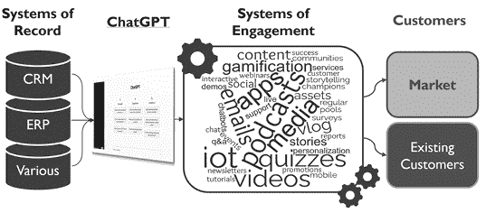

ChatGPT 可以帮助公司将“记录系统”转化为“参与系统”。

**新的优惠和服务。** 当公司积极探索创新方法来利用他们的内部数据进行客户参与时，一个有前途的途径是通过开发新的服务和优惠。在这方面，ChatGPT 可以发挥重要作用。随着数据被比作“新石油”，利用像 ChatGPT 这样的工具来提取、应用和潜在变现这一宝贵资源变得至关重要。可能性很多，从优惠客户计划和移动应用程序到新的物联网服务。

**个性化。** 在数字时代，客户被广告、电子邮件和社交媒体请求淹没，这使得公司必须找到创新的方式在市场中区分自己变得至关重要。一个有效的方法是通过个性化。借助 ChatGPT 的帮助，任何资产现在都可以轻松定制或个性化，就像我们之前的示例所展示的那样。正如所示，通过利用简单的 Excel 电子表格或数据库中的数据，这些数据现在更容易收集和创建，公司可以使用宏、文本字段或 ChatGPT 本身来操纵内容并生成具有不同个性化水平的资产。这些资产可以针对行业、特定账户、买家人设或甚至个别收件人（例如使用 LinkedIn 个人资料）进行定制。过去可能耗时或昂贵的基于账户的营销（ABM）现在完全在中小企业的能力范围之内。

传统上，这些资产将由一个中央营销团队创建，与客户有些脱节，销售团队充当中间人。然而，公司现在可以意识到将一些定制资产的创建从营销转移到销售的潜力。即使销售人员的软件专业知识有限，也可以使用 ChatGPT 修改和个性化现有资产，以满足个别客户的独特需求。有各种功能和组织方法可以用来实现这一点。

这一认识的更广泛含义是，市场营销活动现在可以更接近客户。与其相距一步，面向客户的人员现在可以创建针对独特客户驱动因素的有影响力的资产。优势在于这些面向客户的人员可以对特定客户及其决策驱动因素有更好和更深入的了解。除了在销售人员“节点”上个性化资产的能力之外，我们还可以认识到每个销售人员现在都有成为小型市场营销人员的能力。

此外，这种视角的转变可以促使重新构想组织内市场营销的整体角色。市场营销的角色可以从有限的培训、资产和潜在客户转化为销售的传递，转变为在潜在客户和前景培育的各个阶段与销售部门进行持续互动。市场营销和销售可以更紧密地联系在一起，共同努力实现共同的客户获取目标，甚至具体的目标。通过这样做，企业可以消除通常在市场营销和销售团队之间的交叉点和典型交接处遇到的低效率和官僚主义障碍。

正如我们将进一步探讨的， 在当今数字广告饱和的世界中，销售和市场营销需要重新塑造，个性化可以显著有助于帮助企业脱颖而出，吸引点击量，并确保会议的成功。

**预测新的客户行为。**虽然公司通常会专注于提高生产率的内部因素，如效率和创新，但关键是不要忽视客户的视角。客户无疑很快将开始利用 ChatGPT 以各种方式与卖家和市场进行互动。客户行为的这种转变有可能显著影响企业与客户互动和服务的方式。企业应该开始预期 B2B 中客户使用的一些近期模式，包括

+   在采购过程中编写工程规范、评估投标等;

+   评估条款和条件，并与存量内部模板进行比较；

+   开发供应商和产品绩效评估的评论，并与公众分享;

+   评估产品选项，比较产品评论，将产品与应用程序匹配等。

ChatGPT 有潜力揭示关于您公司和产品的“互联网看法”，这对许多公司来说可能会令人惊讶。作为一项练习，您可以使用 ChatGPT 查询您自己的公司（假设在其训练之前您已经有了互联网存在），并询问您的优势和劣势。对于劣势，您甚至可以要求引用。您可能会发现来自互联网各地的客户反馈示例，这些反馈以前可能是您的销售和市场营销团队不知情的。这可能会对即将使用这些工具提出类似问题的新客户构成障碍。

想想嵌入 ChatGPT 变体如何可能与您当前的客户建立新的“联系”，从而提高您作为供应商的地位价值。例如，随着这些工具嵌入到 ERP 系统中，客户可能会期望您的 ERP 系统“与他们的 ERP 系统交谈”（即集成）。作为另一个更简单的例子，考虑更频繁地主动征求客户反馈，因为当他们不必花时间写专业评论，而只需通过语音提供几个要点时，他们可能更愿意提供反馈，让 ChatGPT 处理其余部分。

与预测其他客户行为同样重要的是，领导者还应该开始预测这些工具将带来的客户互动的转变。也许不久之后，客户就会期望他们的本地“GPT”与您的“GPT”进行通信以完成各种任务。为这些变化做好准备，并了解客户互动的不断发展的动态将对保持竞争优势至关重要。

适应原则

**持续改进。** 持续改进是为数字时代转型做好准备的文化基石。数字世界变化迅速，公司必须调整文化以与其相似的速度前进。对于公司来说，(1) 精益和(2) 敏捷提供了组织人员持续改进的总体指南。这些方法可以帮助公司为了效率和绩效或创新（如新产品、新技术和新商业模式）而改进。这两者都在促进 ChatGPT 的采用方面非常有用。

持续改进的指南提供了推动和鼓励 ChatGPT 采用的绝佳方式。从根本上说，像精益这样的方法专注于建立员工参与持续改进和解决问题的文化。如果做得当，精益会建立一个每个人都觉得自己有话语权和责任去发现改进业务方法的文化。没有充分动员你的人力资本，企业如何能够开发 ChatGPT 在企业中的数百甚至数千种用途？精益文化有助于使人们参与持续改进和解决问题，在当今的数字世界中，其中大部分手段和解决方案不可避免地将是数字化的，包括 ChatGPT。精益的工具包，包括诸如改善这样的技术，也提供了推动活动和采用的指南。

数字化是最大规模的颠覆，它影响着每个行业、业务的每个方面和生活的每个层面。可以想象，它对您的业务的影响将是巨大而普遍的。企业能够适应这种规模的变化的唯一方法是，如果他们实施工具和技术，并建立人们有效共同工作以识别改进机会并实施解决方案的能力。

持续改进并不一定意味着“渐进式”。为了启动 ChatGPT 的采用，领导者应推动一次初始的重大变革，并传达一个新的生产力时代和相应期望的信号。持续改进方法可以帮助推动这一重大变革。尽管具体的方法可能会根据组织文化和其他因素而有所不同，但领导者设定清晰的期望并传达规则已经改变是至关重要的。各个层级的员工必须明白，接受这些工具并改变他们的习惯对公司的前瞻竞争力至关重要。

2 秒改善法

对于目前没有精益/六西格或持续改进流程或资源的小型公司，我们推荐保罗·阿克斯的*2 秒改善法*。这是一种简单而有效的持续改进方法。这种方法基于这样的信念，即随着时间的推移，小而持续的改进可以导致重大的积极转变。

*2 秒改善法*方法涉及创建一种文化，使每个员工都有权利识别和消除他们工作流程中的浪费。它强调简单性、视觉沟通和标准化的重要性，以推动效率。此外，通过积极记录和分享改进，阿克斯旨在在组织内部创建一种学习和协作的文化。这种做法使员工能够相互激励和学习，将知识和最佳实践传播到整个公司。通过公开分享改进，个人可以放大他们变革的积极影响，并激励其他人参与持续改进工作，包括采用 ChatGPT。

**增加委派。** 如果使用 ChatGPT 现在已经让员工能够写五百页的小说或通过医学考试，那么可以期待其他一些挑战性任务也会被引入。ChatGPT 具有指导员工完成可能比他们目前能力水平高出几个步骤的任务的令人难以置信的能力，因此领导者必须重新评估他们的委派方式。在 ChatGPT 的支持和指导下，员工可以被委托完成推动其边界并要求他们扩展能力的任务。除了直接的生产力增益外，这种方法还可以培养一种持续学习、适应性和员工参与的文化。

ChatGPT 可以作为一个宝贵的资源，在复杂的事务中提供协助和指导。举个例子来说明这种能力，考虑公司估值，这是一个被选中的任务，因为它涵盖了 MBA 教育的许多方面。ChatGPT 可以引导非 MBA 人士完成估值的每个阶段，包括资本成本、贴现现金流分析等。用户可以寻求解释，提出问题，甚至在设置电子表格方面获得帮助。尽管目前存在一些限制，未来的进步可能会增强 ChatGPT 从年度报告中提取数字并自主执行计算的能力。这使得没有 MBA 教育背景的员工能够处理以前只有高技能专业人士才能处理的复杂任务。

公司可以利用跟踪和学徒制作为加速采用 ChatGPT 的机制，其中跟踪者还有任务识别 ChatGPT 的潜力，以帮助或自动化被跟踪经理的任务。这些机会使员工能够获得特定工作所需的技能，同时也加速了 ChatGPT 的采用。这样的举措无疑会吸引热心的参与者。

随着组织见证 ChatGPT 对员工能力的影响，他们将需要重新评估其员工组成。可能会发生转变，较少的高级人员和更多的低级员工利用 ChatGPT。在这个新的格局中，一个配备了 ChatGPT 的初级员工可以在某些领域取代一名高级员工，而现有的高级员工可以承担不同的角色，成为同事们工作的顾问和评估者。

此外，随着劳动力通过利用 ChatGPT 获得了显著更广泛但日益同质化的技能和能力，与传统技能和传统效率相比，创造力和判断力等属性变得更加重要和有价值。与过去不同，个人的技能和其他限制不再限制员工的潜力，现在大多数人共享一个集体的上限，假设他们现在能够有效地利用 ChatGPT。因此，公司和社会必须适应这种能力长期演变的分层。

**端到端以及中间。** 不要期望 ChatGPT 的所有改进机会都整齐地落在您企业的功能性组织内。业务领导者需要查看功能之间和团队之间的空间，以利用 ChatGPT。

考虑一个培训部门，现在可以利用 ChatGPT 轻松地将操作和维护手册转化为培训演示文稿，将这些演示文稿转化为测验，并将其汇总为用于进一步吸引客户的新内容。那么利用这些新内容进行营销所能带来的收益如何呢，比如将其用于游戏化和客户参与？如果没有营销部门的人充分利用这些新的、现在可能的内容，这些新的“记录系统”会被转化为“参与系统”吗？

这只是在这个被这项新技术如此颠覆的环境中即将发生的许多工作流程示例中的一个。企业领导者必须全面评估整个企业的机会，并连接机会之间的关联。他们还必须邀请跨职能团队参与持续改进项目，共同合作并发现由 ChatGPT 开启的新机会。许多公司继续在家办公，缺少那些定期的“咖啡机”讨论，领导者必须补充方式促进在这些快速变化时期适应所需的关键协作。

**企业知识。** 多年前，Bridgewater（业界领先的对冲基金）创始人雷·达里奥意识到计算机超越人类能力并促进更好决策的潜力。达里奥创建并不断改进中央计算机算法，这些算法可以分析数据并在减少偏见的情况下指导更好的决策。他的“激进透明”文化经常导致对决策及其原则的定期评估，总结经验教训，并利用这些发现不断改进算法。达里奥早期的投资和愿景产生了不断增长成功的良性循环，并为今天考虑 ChatGPT 新能力的公司提供了一个精彩的类比案例研究。

在当今时代，利用 ChatGPT 自动化企业知识的价值比以往任何时候都高出许多数量级。那些能够定期归档企业知识的公司将能够以许多新的不同方式提取、应用和放大这些知识。可以指望那些采用达里奥方法的公司在人工智能能力不断提升时进一步脱颖而出。除了提取经验教训的能力外，现在使用 ChatGPT 开始记录和记录它们变得更加容易。

**早期采用者优势。** 尽管等待并让早期采用者承担与新技术学习曲线相关的初始成本往往是明智的，但在这种全面的范式转变中落后的组织面临竞争上的被抛在后面的风险。如果他们不能像更加主动的竞争对手那样有效地利用这些工具，他们注定会落后或失败。

就像许多学生因为从未真正学会代数而苦于微积分一样，未能建立使用人工智能的坚实元技能集的公司将发现赶上变得困难。学习的“良性循环”概念适用于组织和个人。使用人工智能的这些元技能很快变得比大多数其他技能更重要。

中小企业有机会通过迅速拥抱新技术获得与更大竞争对手的显著优势。早期采用的“成本”不仅很小，而且学会利用这些工具的公司还将释放潜力，提高生产力，并以意想不到的方式利用它们。这创造了不断改进的良性循环。在采用 ChatGPT 的情况下，领先一步是明智之举。

主要要点

对许多领导者来说，很难欣赏到公司在这个全新且不同的游戏中取胜的策略将是多么非同寻常地不同。然而，聪明、大胆的领导者可以利用这种自然滞后，并通过迅速和深入的批判性思维领先于群体。

我们的兔子洞之旅展示了新能力的相互关系和级联影响，并产生了一些有用的新原则：

+   鼓励“ChatGPT 优先”处理所有任务，除非有禁止。建立使用 ChatGPT 的关键元技能。

+   信任但要验证。接受 ChatGPT 当前的局限性，并意识到尽管存在一些障碍，但这些工具仍代表着巨大的效率杠杆。

+   从前端开始转型，也许从客户服务开始，因为这些以沟通为中心和一般功能代表了 ChatGPT 采用的最低果实。

+   推动效率和创新杠杆，但要意识到创新杠杆将不那么明显，并且需要更多自上而下的推动。

+   修订当前的信息安全政策，并适当管理风险。

+   提升技能以利用 ChatGPT 的能力。从“零到一”的一点投资将带来可观的回报。

+   重新考虑使用通用软件进行 DIY 数字解决方案，现在 ChatGPT 已经改变了其能力。

+   思考所有您的数据、信息和文件，以及您如何将这些“记录系统”转化为“参与系统”。并考虑为您的客户创建新的提供和服务。

+   利用基于账户的营销的个性化能力，并将一些营销活动转移到更接近客户的节点。

+   承认客户现在将在很大程度上使用 ChatGPT，并开始为（或利用）这种转变做准备。

+   专注于在业务中产生初步的突破性变化，然后持续改进，都要使用变革管理技术。

+   调整领导习惯，并委派更艰巨的任务，因为人们现在使用 ChatGPT 的能力更强。制定人员战略，使组织与现在大不相同的能力相匹配。

+   在创新和效率机会的端到端搜索中寻找机会，并寻找功能之间的机会，这些机会现在已经打开，但由于僵化的功能边界和思维和/或远程工作，可能仍然隐藏着。

+   使用 ChatGPT 来记录企业知识，并用它来提取目前埋藏在大量非结构化数据中的信息。为一个行为成为重要的竞争优势的世界做准备。

+   成为早期采用者。应用人工智能的元技能比大多数传统业务技能更重要和更强大。早期投资将在未来多年内带来回报。

**2** *来源：[`www.forbes.com/advisor/business/software/six-key-benefits-a-crm-brings-your-business`](http://www.forbes.com/advisor/business/software/six-key-benefits-a-crm-brings-your-business)*

# 第三章

# 新设计要求

“如果外部的变化速度超过内部的变化速度，终结就在眼前。”

—杰克·韦尔奇，前 GE 首席执行官

数字时代的挑战：重新定义前端机器的设计要求

在第一章中，我们展示了为什么一个公司的销售和营销“机器”必须根据其新的、更强大的组件重新设计。然而，在我们将机器重新设计为 ChatGPT 的新功能之前，我们需要考虑可能影响机器整体设计要求的其他因素，包括其输入和输出。

销售和营销为 ChatGPT 提供了丰富的应用潜力。但更重要的是，大多数 B2B 公司在适应市场快速变化和不同客户行为（主要是由疫情后数字时代的变化引发）方面也远远落后。正是这种机遇和威胁的融合使得前端运营（通常）成为最适合首次专注于推动 ChatGPT 采用的突破口。

如今，许多公司根本没有意识到市场和客户行为在疫情后发生了多大变化，并且继续变化。领导者必须了解并考虑必须解决的众多主题，以在数字时代的新游戏中取得成功。为了描绘 ChatGPT 的全部机会范围，我们需要审视大多数 B2B 中小型企业今天面临的整体前端挑战。然后，我们需要评估 ChatGPT 在公司整体战略议程中的适应性：ChatGPT 如何融入整体数字转型战略？这一数字战略如何融入整体销售和营销战略？以及这一销售和营销战略如何融入公司整体战略？

在我们为销售和营销机器生成新的设计要求之后，我们可以看看它的新的、更强大的、ChatGPT-enabled 组件如何共同工作，以实现其更新的、数字时代的目标。

疫情后的销售

在疫情后的数字时代，销售游戏正在迅速变化，需要新的规则和新的策略才能取胜。中小型企业面临着长期存在的挑战和更为严峻的短期挑战，其中许多构成了严重威胁。

首先，数字时代是赢家通吃的时代，数字时代的长期成功完全取决于规模。这种现象远非理论，这就是为什么市场整合在许多 B2B 领域如此普遍。就像我们在无数 B2C 领域（如零售、汽车等）已经看到的那样，大型 B2B 参与者继续变得更大，而较小的参与者被挤压出局。要在赢家通吃的数字时代竞争，中小企业必须产生自己的规模。增长至关重要，这不是一两年后才能开始的事情。规模是关于复利的，就像早早为退休存钱是明智的一样，公司现在需要开始产生规模。

短期内，COVID 大大改变了公司必须使用的手段来接触客户，特别是新客户。后 COVID 时代看到了许多变化，比如继续拥抱远程办公的公司，因此确保销售会议变得更加困难。然而，最大的问题是数字时代是一个“饱和”时代。在过去几年里，主要是由于数字化，客户现在每天都被试图向他们销售东西的人用电子邮件、电话和社交媒体请求饱和。客户现在随时都保持警惕，数字化甚至帮助他们阻止了它所创造的相同力量。如果电话被识别为垃圾电话，大多数人不会接听电话。我们不查看垃圾邮件。我们不喜欢透露我们的电子邮件地址。我们通常不回答通过 LinkedIn 等社交媒体平台接触我们的销售人员。这些因素显著改变了销售人员现在必须如何接触和影响购买过程中的决策者。

要补充这些问题清单，许多公司的销售和营销在上一场战争中已经准备不足，更不用说随后更具挑战性的战争了。考虑一些在 B2B 营销中常见的挑战：

+   B2B 工业领域的大多数公司实际上并不做营销；他们根本不投资或优先考虑营销。预算主要倾向于销售团队。

+   大多数 B2B 营销还停留在一代或多代之后，有限的营销预算仍然投向展会、媒体广告、宣传册等。许多 B2B 营销手册甚至还没有适应前 COVID 的挑战，更不用说后 COVID 的挑战了。

+   今天的 B2B 营销已经因为太多 B2C 元素而变得无效，在截然不同的 B2B 世界中，这些元素是无效的，而且通常是有害的。

+   尽管 COVID 后发生了许多变化，许多公司甚至没有将最小量的 SG&A 费用（销售、一般和行政费用）或其他投资转移到适应新局面。

进一步考虑在 B2B 销售中常见的挑战：

+   优秀的销售人员价值连城。不幸的是，B2B 领域中太多人已经迷失了方向。令人惊讶的是，超过 90％的 B2B 销售人员从未读过销售书籍。大多数人不会“疯狂地寻找潜在客户”或者努力寻找和开发新客户。相反，如今太多的销售人员已经陷入成为接单员的陷阱；他们继续拜访同样的客户，丧失了专注于开展新业务的重点。

+   许多公司还没有适应新的销售游戏，其中获胜现在需要有效的虚拟销售，利用现代社交平台和产生网络效应，以及使用其他数字手段。那些技能不足且不善于使用技术的人必然会失去竞争力。

如果一个公司的销售与营销职能无法适应迅速变化的商业环境，并且在开拓新业务方面效果不佳，那么该公司将难以实现增长和可扩展性。在许多情况下，这最终可能导致公司的倒闭。关键是要认识到，在过去取得成功的过时工具和技术在今天这个动态市场中已经不再够用。

虽然数字化运营、客户服务和产品开发最终对公司是必要的，但通常销售和营销是最不为未来市场做好准备的部门。公司必须重新评估他们的销售和营销策略，并立即开始适应的过程。这要求转型从业务前端开始，因为市场推广策略是需要立即关注的最紧迫问题。

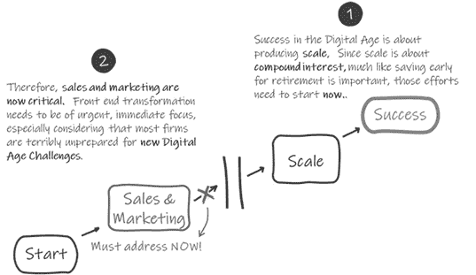

在制定战略时，通常有利于看一下起点和期望的终点，并逐渐接近中间。

今天的销售与营销挑战

简而言之，今天更新的销售与营销机制必须被设计成能够克服今天的信息饱和，突破客户屏障，并开展新业务以实现规模化。正如我们将看到的，ChatGPT 可以帮助实现甚至推动这些目标，前提是公司正确定位他们的转型倡议。

虽然这是一个复杂而深入的话题，让我们简化一下。当大多数 B2B 企业考虑获取新客户和早期销售活动时，目标通常非常简单：（1）产生优质潜在客户，（2）建立联系，和（3）获得初步销售会议。过去，这些事情比今天容易得多。如今，你需要克服一些严峻的挑战，并且需要使用一些不同的策略来适应新的局面。在今天这个信息饱和的时代，你如何脱颖而出？即使考虑到营销和销售数字能力的所有进步，这个问题并不一定是关于数字化的。

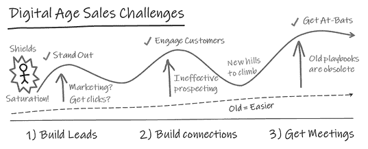

**(1) 建立潜在客户。** 假设一家公司实际上在市场营销方面进行投资，如何在今天这个饱和时代获得点击量？他们如何产生良好、高质量的潜在客户和销售机会？大多数 B2B 市场营销仍停留在一到两代人之前。

错误的技术使得在今天的饱和市场中无法脱颖而出。太多的 B2B 手册没有得到更新，仍然规定了在面对今天的挑战时与客户互动的无效手段，将重点放在大众市场技术上。今天的潜在客户生成和营销自动化工作在很大程度上受到客户屏蔽的阻碍。对于少数合格的潜在客户，让销售人员采取行动可能是一项徒劳的任务。流程已经高度依赖软件，并变得非常不人性化。

**(2) 建立联系。** 如今，大多数 B2B 销售人员不再充分勘探，许多人甚至根本不勘探。杰布·布朗��，畅销书《狂热勘探》的大师和作者，声称顶尖销售专业人员可以将 80%的时间用于勘探。你的团队是否能够做到这一点？

勘探本质上是一项艰苦的工作。此外，历史上销售勘探并不能产生在数字时代取胜所需的新客户机会数量。许多销售人员和公司接受了失败，以前一代人有效勘探的习惯和技能在今天的一代人中基本上已经丧失。

**(3) 获取会议。** 如今，获取销售会议变得异常困难。在 COVID 之前，销售人员可以在周三带目标客户吃午餐。然而，那位采购代理现在可能在周三在家工作……还有周二和周四。而在以前，你是在与“与同事共进午餐”竞争，而今天你是在与他们与孩子相处的时间竞争。

今天，潜在客户的时间更加宝贵。你如何能够说服潜在客户花费三十分钟宝贵的时间与你共度？更重要的是，你的公司如何在电子邮件、电话或社交媒体请求中脱颖而出，不被像其他数百家试图向他们销售东西的公司所忽视？

***

为实现这些早期销售漏斗目标的手册逐渐漂移到了大众市场方法，即使是对于 B2B 也是如此。重点放在了诸如印象、潜在客户数量等指标上。然而，大多数公司仍无法通过玩这种低概率游戏实现显著增长，销售通常被限制在与那些——凭借一点点机会——实际上愿意与他们见面的人进行非常有限的数量的机会性面对面会议。中小企业被降低到了两个同样不受欢迎的选择：（1）遵循旧的手册并接受与传统销售勘探相关的不足数量的机会，但更高的击球率；（2）应用新的数字中心、大众市场相关的手册；承担更高的成本；并接受一个悲惨的击球率。

幸运的是，正如我们将在后面看到的，ChatGPT 已经开辟了一些新的选择。

移除 B2C 的成分

作为一个重要的旁注，这将与我们最终的 ChatGPT 策略相关，有效的企业对企业（B2B）和企业对消费者（B2C）在营销世界中的实践之间存在明显差异。然而，太多无关紧要和无效的 B2C 成分不知何故地进入了 B2B 的播放手册。这些已经深入到我们甚至发现聪明、有才华的营销人员也在宣扬这些错误信念。为了提高营销的效果，我们需要将这些不良成分从配方中剔除。

作为一些关键的基本前提，B2B 营销需要考虑到通常不像在 B2C 中那样相关的力量，包括以下内容。

**“别人的钱。”** 在 B2B 中，支出动态与 B2C 不同。虽然消费者通常为自己花钱，但 B2B 涉及“为别人花别人的钱”，借用著名经济学家弥尔顿·弗里德曼的概念。这导致了购买标准的转变，其中质量和价值等因素往往被更个人的因素所取代。决策者往往面临额外的工作、变革管理挑战、达成共识的需要以及糟糕决策的个人后果的风险，所有这些都可能阻止他们采纳新的解决方案。个人成本与企业利益之间的脱节为寻求取代现有供应商的公司设置了难以逾越的障碍。

**损失厌恶。** 损失厌恶是行为经济学和前景理论中的一个概念，它在 B2B 决策中起着重要作用。人们往往对损失感到恐惧，而不是看重相当的收益。这种对损失的厌恶导致了不愿偏离现状。转向新的供应商或方法会带来个人风险，如声誉受损或工作不稳定，这些风险通常超过潜在的个人利益。对损失和相关个人风险的恐惧通常阻碍了 B2B 领域新行为或解决方案的采纳。损失厌恶和风险厌恶在 B2B 中都是比在 B2C 中更强大的力量。这种现实的后果是 B2B 中做出的决策不够理想，其中“不输”远比赢的可能性更具影响力。例如，我们中许多超过四十岁的人听过这样的说法：“没有人因为购买 IBM 而被解雇”，这个观念完美地捕捉了这种普遍的力量。

**底线影响。** B2B 决策者戴着两顶帽子：（1）个人的自身利益和（2）公司利益的代表。这两种观点通常有不同的决策驱动因素。虽然个人驱动因素通常优先考虑，但由后者视角主导的决策也必须得到解决。这些由逻辑、可量化的影响和底线驱动的决策。成功的 B2B 方法需要逻辑和情感的结合，吸引公司和个人的驱动因素。

公司经常将他们的销售和营销信息与 B2B 决策的真正驱动因素不匹配。以 B2C 的心态，他们经常将他们的产品和服务营销，就好像决策者对他们的产品或服务像对新车、手袋或高尔夫球杆一样在意。品牌营销在 B2C 中更为重要和有效，消费者更关心他们购买的产品。然而，虽然 B2C 营销在很大程度上依赖于情感联系和品牌认知，B2B 决策主要受个人损失规避和基于公司绩效的理由驱动。B2B 客户实际上更少关心产品本身，更关心它如何对他们个人产生影响和/或对公司有益。由于这些关键差异，潜在客户的引导和拜访在 B2B 中比品牌营销更为重要，尤其是对于中小型企业。

***

总的来说，这些重要的细微差别在销售和营销手册中变得不太被认可，而且在实践中经常被忽略。需要注意的是，这种趋势在工程主导型公司中尤为常见。有效的 B2B 销售和营销需要与 B2C 有着明显不同的方法。对于 B2B 决策过程，抵制变化、损失规避的主导地位以及关注底线影响塑造了决策过程。作为一个重要的结论，B2B 营销人员应该优先考虑潜在客户的引导和拜访，尤其是在中小型企业中。在现代化和重新调整他们的销售和营销过程中，企业必须理解这些关键差异，并确保这些原则成为他们战略的基础。正如读者将在下一章中了解到的，这个结论最终将影响 ChatGPT 的适应策略。

**数字时代的颠覆。** 在制定整体战略时，企业必须考虑到在数字时代变得更加威胁的许多新风险。就像我们在无数 B2C 领域看到的那样，B2B 的颠覆变得更加可能。

为什么任何理性的人会认为导致 B2C 世界完全颠覆的力量不会与 B2B 发生冲突，准备将其颠倒和横向翻转呢？以汽车市场为例。如今的汽车经销商与二十年前完全不同的商业模式，而 Autotrader、Carvana、CarMax 和 CarFax 等公司已经极大地改变了消费者购买汽车的方式，并给传统经销商模式带来了巨大压力。

正如其他行业所展示的，数字时代可以颠覆先前被认为不可触及的商业模式。福特预计到 2030 年，全球销量的 40%将是电动汽车，福特首席执行官设想了类似特斯拉（即“被颠覆”的）的 G2M 模式。“我们必须采取非议价价格。我们必须实现 100%在线化”，首席执行官吉姆·法利说。“经销商没有库存，产品直接送到客户手中。100%远程取货和送货。”

经销商曾经在汽车价值链中扮演着一个看似不可替代的角色，现在他们已经完全退出。为什么一个 B2B 中间商，比如一个工业分销商，不会担心遭受类似的命运呢？为什么一个产品 OEM 不会担心价值链被扰乱导致销售和利润率下降呢？

领导者们会受益于倾听来自汽车市场或其他许多市场的警告，这些市场如今正被技术完全颠覆（想想航空旅行、出租车、酒店客房服务、餐厅、实体零售商等）。“人们向人们销售”的时代已经在 B2C 领域被取代；如今我们大部分的商品都是从机器那里购买的（想想亚马逊）。为什么有人会认为 B2B 工业领域免疫于走同样的道路呢？

考虑一下今天对许多 B2B 行业构成威胁的常见主要力量，以及这些力量可能如何影响你自己的公司。

**市场整合。** 正如讨论的那样，整合力量正在将权力集中在新的、赢者通吃的游戏中越来越少的参与者手中——这种现象在数字时代的许多行业中越来越普遍。大公司正在以快速的速度收购公司，巨头之间的激烈竞争正在扰乱较小的独立销售商。数据显示，中小企业已经在许多领域受到挤压。

**在线零售颠覆。** 多年来，许多人一直在想，亚马逊是否会在其他传统的 B2B 领域发起进攻。在线零售部门的优势已经开始与许多传统 B2B 领域的客户期望重叠。数字商店、工具和技术已经成为更重要的购买标准，而在线零售部门的能力正在越来越符合为许多 B2B 市场提供服务所需的能力。在线销售商扰乱传统行业的威胁继续加剧。知名的数字玩家迅速在其整个企业中采用这些新技术，放大其回报并赋予他们转向在不久的将来扰乱其他行业的能力。再次，复利的力量显然在这里发挥作用，使得早期采用颠覆性技术的人在竞赛中走得更远。

**去中介化。** 数字化逐渐削弱传统经销商增值的相关性。物流的进步减少了对本地库存的需求，而数字工具自动化了复杂产品选择和技术支持。远程支持和自助选项变得更加可行，现代 ERP 系统降低了在少数供应商下集中采购的价值。此外，数字已经促进了各种 B2C 市场的直接面向消费者的转变，从经验上表明在 B2B 市场中也越来越可能实现相同的情况。总的来说，随着行业数字化转型，B2B 分销商和经销商面临着重大挑战，因为他们的历史角色在相关性上逐渐减弱。

**持续的供应链危机和其他余波。** COVID 带来了许多中断，其中许多仍在持续。例如，后 COVID 供应链危机导致某些行业的客户积极多样化其供应链以降低风险。卖家面临着客户多样化带来的威胁和机会。同时，创纪录的通货膨胀导致许多公司采取供给和需求方面的杠杆以减轻影响。随着对白领和蓝领劳动力的需求空前增加和流失风险，员工参与和人才留存已成为许多公司面临的主要挑战。这些问题，虽然目前正在稳定，但并非一时之间。

**增加的“fat tail”风险。** 在如此快速变化的世界中，“fat tail”风险大幅增加——即，不太可能发生的事件和与平均值的大偏差，有些人可能称之为“黑天鹅”和“灰犀牛”。除了数字化带来的混乱外，全球地缘政治力量正在迅速转变，迫使许多公司重新思考其当前的全球供应链战略。金融冲击的风险增加，企业活跃主义和其他商业趋势变得更加突出，国内冲突更加明显……列举不胜。尽管以前的冲击已经减轻了干扰，但下一次冲击的可能性仍在迅速增加。像供应链这样的系统的优化和紧缩，在正常时期提高了效率，但使现代系统在处理扰动方面的能力减弱，即使是较小的冲击现在也可能导致重大的破坏性影响。

***

中小企业必须诚实地评估这些力量，并预测它们最终可能如何影响自己的业务。在数字时代不断整合和混乱的市场中，大多数中小企业将属于以下三类之一：

+   **适配器。** 这些公司将启动一系列变革性举措，以适应并保持相关性，甚至在日益竞争激烈的市场中实现增长。

+   **被收购者。** 这些公司最终将被一个整合市场中的大玩家收购并吸收。

+   **收割者。** 这些公司将无法适应（或选择不适应），最终将逐渐消亡，最终被削减至当前业务的一小部分，或者最终被清算。

一个有效的战略家必须承认未来以及公司在其中的位置是不确定的。因此，在动态变化的商业环境中，选择是一个人的朋友。重要的是，公司采用能够考虑到这些数字时代力量的战略，并且允许根据市场演变、公司演变以及沿途学到的东西进行转向和适应。同样重要的是要意识到，无论你是哪种类型的公司，数字转型投资，特别是那些旨在利用 ChatGPT 的投资，提供了增强竞争优势、建立企业价值并确保未来持续相关性的最佳机会。

数字转型

数字杠杆，包括 ChatGPT 的采用，当然是产生规模和接触今天客户的关键。然而，根据麦肯锡和波士顿咨询集团的说法，数字转型倡议的失败率令人震惊，超过 80%。中小企业简直无法承受低于 20%的转型成功率，并必须避免常见的陷阱。

太多的公司认为今天的成功取决于成功的数字转型。我们鼓励读者以稍微不同的方式思考。在许多方面，*数字转型* 已经成为简单地“为未来做好准备”的委婉说法。在这方面，*数字转型* 意味着公司为了适应我们日益数字化的未来而定向的广泛、无穷无尽的杠杆。在其他方面，*数字转型* 的含义变得过于具体，暗示着一个局限于仅仅采用新数字技术，如软件和人工智能，包括 ChatGPT 的范围。这两种定义都不符合公司真正适应竞争所需的杠杆。

就像我们已经展示的 ChatGPT 一样，有效的转型要求企业做出超越仅仅使用技术本身的调整。这个原则适用于 ChatGPT 之外，并贯穿于所有数字转型努力。能够全面推动业务前进的领导者，考虑数字转型本身以及关键传统功能中的基础元素，将创造最具竞争力的组织。所有这些因素对于维持竞争优势和适应快速变化的游戏至关重要：数字时代的新游戏。为了取得成功，公司必须超越数字转型，将他们的整个业务目标对准面对数字时代挑战。领导者必须制定能够同时解决数字和基础元素的战略，并意识到仅仅添加数字杠杆很可能导致其中四分之四失败。

**基础元素。** 许多新的基础杠杆将需要适应新的数字时代挑战，就像在前一节中讨论的那样。其他被视为成功数字转型的先决条件的基础杠杆可以被看作是必要的。为了有效转型，关键是以全面的方式处理这些基础元素以及数字倡议。有趣的是，一个专注于数字转型的精心设计的战略计划，同时考虑基础先决条件，可以同时推动传统和数字转型。虽然为组织设立坚实基础的概念对许多组织来说似乎是合乎逻辑的，但在数字转型规划中见证其实施是非常罕见的。

这里我们开始意识到在 ChatGPT 策略中这一章的必要性。数字转型的普遍失败率使得全面的方法至关重要，这要求考虑之前在本章中概述的许多因素。只有将这些考虑因素排列起来，企业才能充分利用 ChatGPT 和数字转型的力量。

我们倾向于在许多类型的公司中识别一些常见的基础性差距，这些差距的解决方案可以包含在一个整体转型计划中。尽管细节可能超出了本书的范围，但一个例子可能会让这个概念更清晰。

**消息传递：有效前端数字转型的关键先决条件。** 许多 B2B 公司在消息传递方面遇到困难，这往往是由于缺乏对营销的重视或采用了无效的、受到 B2C 腐化的方法。一个有效的消息已经成为在当今饱和市场中吸引注意力、脱颖而出的关键基础。一个好的消息作为一个强大的工具，可以突破客户的屏障，吸引潜在客户，并推动期望的行动，比如安排初次销售会议。

B2B 与 B2C 营销的讨论与数字转型战略有什么关系，包括 ChatGPT？没有一个精心设计的消息，数字前端策略和战术可能会失败。数字工具——比如营销自动化甚至 ChatGPT——作为您消息的放大器。它们使您能够触及更广泛的受众并扩大您的推广努力。然而，如果消息不好，应用数字就像通过更大的放大器演奏糟糕的吉他独奏一样。这是一种垃圾进，垃圾出的情况。因此，您消息的内容和质量对成功利用数字渠道至关重要。这是许多（80%以上）数字杠杆失败的一个例子，也是失败的最常见原因之一：缺少基础先决条件。

无论您的目标是吸引注意力、建立联系、安排会议还是应对虚拟互动的挑战，今天您说的话比以往任何时候都更重要。一个引人注目的信息可以让您的公司与众不同，吸引注意力，并与潜在客户进行有意义的互动。它在数字转型倡议中发挥着重要作用，通过促进有效的潜在客户生成、销售拓展和客户互动策略。重要的是要认识到，在讨论消息时，它特指潜在客户生成和销售拓展，强调这些方面在 B2B 营销中的重要性，而不是品牌消息。这提供了一个例子，说明为了有效的数字转型，需要一种全面的方法。

**今天软件的无限选择。** 在人工智能时代，软件和应用程序的快速发展让企业面临着庞大的技术选择。每周发布数百款新应用程序，组织面临着选择、整合和有效利用这些工具的挑战。

技术领域中的*奇点*概念，即发展速度超过人类跟上的能力，对企业越来越具有重要意义。企业内部传统的决策过程往往比技术进步的速度慢得多，导致许多组织感到不堪重负，无法跟上步伐。诸如数据安全、IT 实施和共识需求等因素进一步复杂化了跟上软件市场快速变化的过程。

就像布里丹的驴一样，许多企业发现自己陷入了徘徊不决的循环中，不确定如何应对众多的技术选择。其他企业选择单一来源的方法，依赖于中央供应商，比如 CRM 软件提供商，来管理和整合各种软件工具。虽然这种方法可能带来一些好处，但往往代价高昂。其他公司已经落后太多，似乎不可能赶上，导致完全停滞和失败感。

ChatGPT 的出现有可能重新定义游戏规则。它挑战了复杂和定制软件堆栈是唯一解决方案的观念。相反，简单工具如 Microsoft Office 与 ChatGPT 的结合可以实现以前需要大量定制和/或专门软件才能实现的结果。这种范式转变为企业开辟了新的可能性，使它们能够通过更易传递、易获取和用户友好的技术实现目标。此外，所有权和文化考虑等因素可以进一步增强这种简化方法的价值。

旧规则认为自制软件不利，并需要专门的数据库来构建数据和获取洞见的规则不再绝对。此外，通过熟练运用 ChatGPT 以及多功能通用软件，并利用它们的综合能力，员工可以培养高度可转移和适用于各种任务和业务领域的元技能。这使企业能够利用超越专门软件限制的非凡力量，从而实现卓越的成果。

这些新规则使组织能够利用 ChatGPT 和其他通用应用程序的力量来简化流程，做出明智决策，并以更大的灵活性适应快速变化的技术能力。

**更新数字教科书。** ChatGPT 已经彻底改变了数字转型的概念，使许多现有的教科书变得过时。这为落后的企业提供了重要的机会。这就好像游戏的重置按钮被按下，为这些企业提供了一个重新开始的机会。通过抓住利用 ChatGPT 的能力和认识到其变革性影响的机会，落后的企业不仅可以赶上竞争对手，甚至可以超越他们。然而，要实现这一点，需要智慧的战略规划，专注和高效的转型和投资方法，并确保他们的大部分努力不会以失败告终。

不幸的是，对于许多企业来说，前端数字化转型仅限于表面性倡议，如实施 CRM 系统或从事数字营销。一些企业可能过早地转向使用某些具有非常复杂技术的应用程序，比如使用 AI 来识别可能的目标客户。然而，如果不考虑业务内部的基本要素，这些努力注定会失败。此外，忽视关键方面，如变革管理、组织文化和所有权，往往会导致员工的幻灭和脱离。此外，中小企业需要摆脱为大型企业设计的教科书和庞大解决方案，以及与之相关的浪费努力和投资。这些教科书变得太慢以适应。某些软件功能的价值迅速下降，许多功能从一开始就并不真正适用于中小企业。

长期塑造 B2B 思维的知名顾问们现在发现自己在面对这一巨大飞跃时正陷入自己的官僚挑战中。对于他们来说，越来越难承认他们最近发布的内容已经完全过时，甚至是在 2022 年。这一认识造成了一种空白，可能会持续一个不确定的时期，甚至可能延续数月甚至数年。在此期间，企业必须主动地独立导航适应这些技术的过程。传统策略将难以跟上这个快速发展的范式，因为这一变革性技术的后果以前所未有的速度展现出来。

请记住，与其他技术不同，ChatGPT 没有任何东西可以卖给你！ ChatGPT 是免费的，而且很可能会一直保持这种状态。像埃隆·马斯克这样的人公开表示，这些人工智能工具太强大了，不应该只由大公司和强大的人掌握，他是对的。还要记住，ChatGPT 实际上取代了许多强大公司今天向你销售的东西，例如 CRM 软件、营销自动化，或者来自大型顾问的书籍和服务。当这种零成本的新技术严重干扰他们强大的控制利益时，不要指望机构以任何速度适应。

调整前端机器

在第一章中，我们断言公司的“机器”必须重新设计，考虑到其新的、更强大的 ChatGPT 增强组件。现在我们知道了以前和新的后 COVID 数字时代条件、客户和市场之间的关键差异，机器的整体设计要求，包括其输入和输出，可以进行修订。

今天的挑战与昨天不同，公司将需要应对一些冲突：

+   规模至关重要，但大多数 B2B 销售和营销功能今天都不适应产生足够的规模。

+   营销变得更加重要以产生规模，但必须适应新的数字时代挑战，并克服当今的饱和。

+   销售需要产生新业务，但很少有人再进行充分的开发，也很少有人自己产生任何规模的推广。

+   数字投资在直觉上是关键的，但五分之四将无法产生足够的回报。

如果 ChatGPT 增强组件为机器的设计和输出开辟了新的可能性，会怎样？

+   如果公司能够将一些旧事物的优点，如个人关怀和人际关系，与新事物的优点，如通过数字化实现规模，结合起来，会怎样？

+   如果一家公司能够通过创造与独特客户需求和决策驱动因素相一致的独特、引人注目的信息，在当今的饱和市场中脱颖而出会怎样？

+   如果公司不再需要依赖垃圾邮件营销自动化和外包的潜在客户生成计划来产生足够数量的机会，会怎样？

+   如果，与其进行交接，营销和销售可以积极参与并通过每一个与每一个潜在客户和客户进行接触的步骤进行合作呢？

+   如果公司的 ChatGPT 采用策略能够全面地使他们的业务适应新的数字时代挑战，并满足那些经常导致数字转型倡议失败的基本先决条件，会怎样呢？

创新通常是通过以不同方式将类似的要素组合在一起实现的。几个世纪以来，手提箱和轮子一直作为独立的概念存在，但直到相对最近才有人巧妙地将两者结合起来。这提醒我们，创新常常在于重新构想现有的想法，并以新的视角创造新设计。那些能够拥抱智慧的远见，适应当前现实，并探索新可能性的公司有机会超越那些仍然受制于过时范式的竞争对手。

总的来说，我们可以更好地看到我们在“复杂系统问题”（引言中提到）中所面临的挑战，在数字转型的 80%以上失败案例中得到体现。公司如何避免与 ChatGPT 采用类似的失败率？公司如何采用全面的策略来应对这些新挑战——这些机器的新输入和输出，并利用 ChatGPT 来解决这些挑战？

**点燃变革。** 在我们谈论机器的所有内容时，也很重要关注人的因素。公司需要一个点燃的火花来启动变革，动员业务，动员人员。人们需要看到和感受到一些重大的事情——一些激励他们改变和适应的事情；一些让他们做一些不同的事情，比如获得新技能，改变行为，以及适应新的不同的游戏。领导者需要产生能够引发变革良性循环的快速成功案例，一系列努力的临界质量，迫使人们*行动*。

许多公司不知道如何在任何重要或有影响力的层面实现这一点。许多公司实施错误的、无影响力的杠杆。通常公司会看大公司在做什么或者麦肯锡等公司在推荐什么，然后他们会选择大规模的解决方案。看到公司认为是增量或递增的，而不是乘法或指数级增长（例如，他们经常会认为“增加一两个业务开发人员”来实现增长）。这些策略在数字时代中无法使业务发展得足够远或足够快。

其他公司做了一些正确的事情，但他们似乎无法将这些部分联系起来。因此，他们永远无法达到可以激励和推动人们的临界质量。人们需要一些重大而不同的东西，一些让他们“上车”的东西。这是变革管理所需的重要部分。很少有公司能够规划和执行正确的杠杆——简单、务实且可实现的杠杆。更难得的是，很少有公司能够将这些杠杆组合起来，达到一个可以诱发变革和转型的临界质量。

**战略线索。** 在制定他们的转型战略时，企业将受益于寻找能够以积极方向影响多个方面的杠杆。企业一次只能专注于那么多事情，对于战略家来说，选择正确的目标和举措以实现最大影响至关重要。

战略家应该寻求创建*战略线索*，这是我们用来指代能够一次或连续地连接和推动多个事物的杠杆的术语，就像一排多米诺骨牌。

寻找保罗·奥尼尔（1986 年至 2000 年担任阿尔科公司首席执行官）的一个很好的例子，展示了这种*战略线索*概念。在他任职初期，奥尼尔意识到阻碍公司发展的核心问题是缺乏标准化的工作和流程遵循。然而，为了确立重点并激励改进，奥尼尔并没有谈论流程。相反，他谈论了人员安全。奥尼尔通过对安全的不懈和坚定关注，成功地进行了变革管理，因为他知道流程遵循将是实现这一愿景的必要前提。值得一提的是，在 1986 年接任阿尔科公司领导职务至 2000 年离职期间，阿尔科公司的市值（所有股票的总价值）从 30 亿美元上升至 270 亿美元，主要是通过开发标准流程实现的效率提升。

就像奥尼尔利用安全来推动更广泛的良性变革循环一样，中小企业可以构建一系列战略举措来重新设计他们的销售和营销机器，并通过这样做来影响和激励组织中的人员采取不同的行为，并适应数字时代的新游戏。这种战略线索概念和人的因素在接下来的章节的理念和操作手册中都是核心。正如我们将继续展示的那样，ChatGPT 可以成为一个出色的线索，用来连接和推动多个杠杆。

修订后的设计要求

现在我们可以重新设计这台机器，考虑到这些新的设计要求，以及新组件的力量，可能还有一些特定于独特公司的其他因素。

考虑到今天的新治理规则，以下是针对中小企业的，考虑到客户、市场和技术的：

+   数字时代需要专注于产生规模。竞争激烈。增长至关重要。

+   因此，新客户获取至关重要，大多数公司将需要立即紧急重启其销售和营销。

+   需要新的销售和营销方法来克服当今的饱和状态。

+   旧的大众市场策略书和其他有害的 B2C 方法已经过时，至少对于以目标市场为重点的公司来说。

+   除了这些因素，公司必须考虑其他颠覆性因素和数字时代的力量，并将它们整合到自己的具体战略中。战略应该在不同情景下得到适当的对冲和灵活性。

+   数字化对于产生规模至关重要，但不仅仅是数字化。中小企业需要避免导致 80%以上数字化努力失败的陷阱。需要采取一种全面的方法，结合基础和数字元素。

+   大公司的解决方案已经过时。中小企业需要聪明、务实，有时甚至要有些粗糙。一般性文本将很难适应考虑到 ChatGPT 的新和非常不同的现实。公司将需要在很大程度上自行导航并打破现有规范。

+   公司需要将简单、可管理的杠杆机制结合起来，以激发变革并促使人们行动。

以及前端机器的新高级设计要求：

+   该机器将产生来自公司和个人的推广规模。

+   该机器将使用旨在生成和转化新潜在客户的拉和推技术。

+   该机器将优先考虑潜在客户生成和拓展，而不是品牌营销，并避免无关的 B2C 要素。

+   该机器将采用引人入胜且个性化的方式对客户和市场进行沟通，通过吸引独特需求和决策驱动因素的有影响力信息传达。

+   该机器将定期部署引人入胜、增值内容，以拉动并建立品牌知名度，为客户提供真正的增值，以抓住并通过销售漏斗培养潜在客户。

+   该机器将充分利用通用软件与 ChatGPT 的结合能力，从而构建高度可转移的元技能，适用于企业各个领域。

+   该机器将应用特定软件填补特定空白，而不是将“大型解决方案”铺设在整个功能上。

+   …同时，该机器必须在中小企业的实际限制内运作。

这些规则和要求通常适用于各种类型的企业或一般的营销和销售策略——广泛和狭窄的市场、推/拉和直接/间接营销、透明或不透明的市场、自愿或必需的产品和/或服务等。随着越来越多的企业采用 ChatGPT，可以预计这些要求将继续变化，因为饱和度可能只会增加甚至改变形式。然而，在此期间，愿意打破常规智慧的公司可以利用 ChatGPT 做一些不同的、非常有影响力的事情。

在下一章中，我们将定义这些新设计要求与 ChatGPT 打开的可能性之间的收敛，以便对如何安排部件、使用不同输入、生成所需输出以及重新设计机器以完成手头的新任务进行非常不同的思考。讽刺的是，随着新颖的数字能力变得明显更加重要，基础知识变得越来越重要？对我们来说，前端转型的基础从这里开始。

# 第四章

# 重新设计

“如果我问人们他们想要什么，

他们本来会说更快的马。”

—亨利·福特

重新设计机器：优化前端机器的设计

随着新的设计要求和新的组件能力的定义，我们现在可以着手重新设计机器的过程。这项努力涉及我们为机器的修订设计要求和进化的组件能力之间的三角关系，以便发现创新的新机会。通过评估不同的组合方式，我们最终可以为机器的新设计创新出一种成功的方法。

B2B 公司各种各样，几乎没有一个理想的前端运营标准处方。我们的例子将深入探讨适用于各种 B2B 公司的领域。然而，重要的是要注意，它们只代表可能性的一小部分。虽然我们旨在提供一些公司可以投入使用的真实见解，但至关重要的是要认识到，您自己的机器必须根据您独特业务的特定动态进行定制。通过类似的探索和应用创新思维，公司可以建立起新机会之间的联系，并找到利用它们的创新方式。

我们还试图展示更新前端竞争 playbook 的一般理念。在数字时代的成功中，一些古老的基本原则确实可以产生巨大影响。数字化越发展，像个人化关怀这样的经典元素就越能帮助公司脱颖而出并取得胜利。然而，公司仍需要利用新的数字能力来产生规模化的推广并高效、具有成本效益地执行。如今的成功方法是将新旧元素结合起来，将个性化关怀的优势与在数字时代有效性所必需的规模相结合。这代表了从以往 playbook 的非个人化、大众市场方法的根本转变。

上一代的前端 B2B playbook、结构和工具可以描述为集中化。中央营销工作负责产生和培养新的潜在客户。中央 CRM 系统管理着各种活动，并表面上将它们联系在一起。从那里，销售团队只是中央机器的本地执行部门，根据机器提供的潜在客户行动，并将信息反馈给整体监控和协调。中央销售经理确保这些人符合期望。

有趣的是，B2B 销售和营销是从一个更为分散的模式演变到这一点的。几代人以前，潜在客户开发是销售手册的一个重要部分，通常是通过冷调或甚至敲门来进行。销售人员会自行管理潜在客户和潜在信息，并具备从中筛选出好的潜在客户和坏的、好的潜在客户和失败者的技能。公司之所以演变到现代集中模式，很大程度上是由于技术及其实现必要规模的能力。换句话说，正是对规模的需求在很大程度上推动了围绕技术的流程、工具和等级结构的集中化。

考虑这样一种可能性，即来自直接前 ChatGPT 一代的自上而下流程、分工以及中央指挥和控制工具和结构现在可能成为绩效的障碍。就像昔日的大型机让位于更强大、更有能力的个人电脑和软件的分散网络一样，公司现在必须重新考虑其前端机器的设计。公司可能应该考虑更为分散、创业的方法，释放他们现在超高产的销售人员，并将他们变成最大的资产。要意识到现在销售人员可以自行产生规模，不再需要中央系统、技术或结构。此外，分散模式所实现的个性化——在使用集中方法时远不那么可行——已成为在当今饱和市场中脱颖而出的更大差异化因素。只有通过分散化，这些努力才能足够接近客户，对大多数公司而言才变得可行。

使用 ChatGPT 并充分利用本地、通用软件的销售人员现在拥有更强大、更有能力，流程现在必须承认这一新现实。此外，必须设定销售人员转变的期望，因为在这个新时代竞争将需要不同的能力和绩效水平，如果销售人员要赚取他们的报酬。组织结构必须促进在数字时代竞争所需的所有权文化和创业行为。能够将这些要素放置到位的公司可以开发出远远优于其过时对手的新机器。

我们将使用的工具来支持这种方法是我们讨论过的基本通用工具。像 ChatGPT、Excel、PowerPoint 和电子邮件，以及现代社交网络，出于许多原因，这些工具对这种方法都是有益的。我们将从中央 Excel 列表中驱动自动化和跟踪，这在销售人员使用中央专门系统时根本不可能实现。与在专门软件和系统中建立技能不同，我们将在工具中建立一些元级别的技能，这些技能将在许多其他领域提供效用，极大简化我们的数字和软件路线图。我们的分散式销售人员将像过去的几代人一样管理和执行，从而脱颖而出，但也实现了前几代人无法想象的生产力和结果规模。

作为一种说明，许多中小企业可能仍然落后于旧的分散流程，缺乏任何规模程度。对于这些公司来说，转型和适应显然至关重要。

我们将研究四个代表性例子，展示这些新原则和要求如何融合：（1）个人潜在客户推动，（2）社交媒体吸引，（3）增值营销，以及（4）自助式 CRM。将这些视为我们机器的新子组件。尽管公司可以单独使用这些示例，但实际上它们可以和谐地协同工作，通过采用个性化规模化方法，显著加速新客户获取和前端生产力和绩效。我们的目标是说明 ChatGPT 不仅可以增强现有活动和结构的效率和绩效，还可以作为一个催化剂，从根本上重塑销售和营销。

1\. 通过“个人潜在客户”推动提升。

经过提升技能的销售团队，现在配备了 ChatGPT 的巨大力量和通用软件的解锁功能，可以在没有旧的大众市场手册的固有限制和严格的自上而下、中央指挥和控制流程和工具的情况下更加有效。通过一点技能提升，销售人员可以成为个人潜在客户开发机器，甚至为他们的新目标潜在客户创建自己的个性化内容，以突破饱和。

我们将结合我们最初的两个用例（1）销售前景和（2）基于账户的营销。这些杠杆一起将使公司能够采用更个性化的方法来开发新客户，并且他们将使用 ChatGPT 来实现规模化。摆脱官僚主义流程和工具的束缚，销售人员将使用 ChatGPT 和通用软件如 Excel 和 PowerPoint 以各种方式吸引数百个潜在客户，并通过漏斗跟踪和监控他们的进展。通过分散这些努力，我们将活动移到更接近客户的地方，从而获得更优异的结果。

**推送与拉动营销。** 对于大多数公司来说，推送和拉动营销策略的某种组合将是正确的方法。推送营销技术——如冷邮件、直邮和广告——旨在积极接触客户并吸引他们的注意。另一方面，拉动营销技术——包括搜索引擎优化（SEO）、口碑和社交媒体——旨在吸引客户到品牌并发展和培养潜在客户。公司可以结合推送和拉动，例如通过拉动生成潜在客户并通过推送转化他们。

一家公司的理想营销方法受到各种因素的影响，包括市场规模和客户集中度、市场透明度、产品或服务的性质、客户购买频率、决策复杂性、市场渠道、相对规模、增长愿望和相对成本。这些因素都可以影响公司采用的推送和拉动技术的组合。

**旧范式。** 在先前范式的指导下，推动主导了，企业被告知要依赖潜在客户生成和营销自动化作为为销售团队开发潜在客户的主要手段。这种方法是基于自动化将简化营销工作并带来成本节约的信念驱动的。公司经常外包这些任务，认为外部提供者拥有更强大的能力，能够取得更好的结果。

我们需要认识到这种方法的局限性。营销自动化导致了通用和不够个性化的推广，其直接影响包括被忽视的电话或邮件被标记为垃圾邮件，最终导致潜在客户的整体低参与度。内容通常不足以克服饱和和屏障。销售团队接手，他们经常无法对潜在客户采取行动，很多时候是由于之前类似努力产生的贫乏和无果的潜在客户。此外，自上而下的流程和中心化的工具和系统通常导致文化问题，如低参与度和缺乏所有权。

与此同时，更为陈旧的公司仅依赖推送而不利用自动化的公司通常只能获得极少的机会，因为销售无法在不利用技术力量的情况下创造足够的规模。

**范式转变。** 新技术的出现，如 ChatGPT，在重塑新范式中发挥着关键作用。企业可以采用更为分散、个性化的方法。在新范式中，企业可以再次优先考虑人情味和个人互动。ChatGPT 可以使销售团队与潜在客户进行更深入的互动。然而，与旧的个性化方法不同，ChatGPT 使得今天这种方法可以规模化推动。

策略手册可能会发生显著变化，即使是对销售和营销角色进行全面重新考虑。与其仅仅依赖于集中式营销团队不同，即使是缺乏广泛软件专业知识的销售专业人员也可以定制和个性化资产，创造与客户独特驱动因素 resonates 的定制材料，主要使用 ChatGPT 的能力。这种思维转变允许营销和销售之间更紧密地对齐，定制资产的创建成为一种协作努力。营销的角色从一次性资产和线索的交付转变为与销售的持续参与，共同培养潜在客户和前景。在某些方面，销售可以承担一些营销职能。

总体而言，营销和销售将再次偏向推动式方法。销售人员可以利用新发现的能力来寻找并开发新客户，以个性化的方式超越传统广告、营销自动化或其他吸引技术的能力，同时也可以实现数字系统先前仅在经济上能够实现的规模性接触。

Excel 可以管理各种活动，包括线索列表和通过销售漏斗的进展。此外，这些 Excel 电子表格还可以存储有关各自线索的检索信息，以便个性化使用。关键是要意识到，通过利用 ChatGPT 的编程能力从 Excel 电子表格驱动自动化，销售人员可以以一种以前使用中心工具无法实现的方式将信息转化为内容和通信。

尽管这种方法的策略手册对各种企业来说可能会有所不同，但以下是一些公司可以采取的一般高层次步骤来完成这一过渡。

**提升销售团队的技能和能力。** 在开始这一转型之前，关键是要为销售团队提供利用 ChatGPT 的必要技能。加强对微软办公应用程序的熟练程度，强调对功能广度的了解而不是如何学习（例如，语法）。提供 ChatGPT 和有效提示技术的培训，包括 ChatGPT 和一般软件之间转换的技巧。教授编程的基础知识（“从零到一”），以便可以开发和在各种应用中使用宏。此外，通常还需要重新学习寻找前景的基本基础技能，以及在虚拟空间中进行销售的技能（例如，进行有效的在线会议），这应该为提高前景效率而发展。

培养一种激励销售人员寻找新客户并对绩效设定清晰期望的文化。销售人员必须意识到，他们需要变得更有能力来创建内容，有效地寻找新业务，跟踪和报告进展和结果。

**重新思考销售-营销动态。** 摆脱传统的销售和营销职能分离，并认识到每个销售人员现在都具备使用 ChatGPT 个性化核心资产的能力。通过重新评估销售和营销的角色和期望，企业可以利用每个团队的独特优势推动新客户获取工作。将内容开发更贴近客户，以增强相关性和影响力。

**结合个性化和传统的潜在客户开发。** 将个性化技术（如基于账户的营销）与传统的潜在客户开发方法相结合。这种组合可以创建高度针对性的潜在客户开发计划，在饱和市场中脱颖而出。

建立核心资产库。建立与特定行业、公司和/或买家人物属性相一致的个性化“维度”流程。利用 ChatGPT 通过将现有模板与独特的客户和行业驱动因素合并生成个性化的潜在客户开发内容。可以通过映射到潜在客户或潜在客户信息的标准宏轻松实现这一点。

**简化潜在客户开发机制。** 从各种来源获取成本效益的潜在客户名单，包括提供电子邮件联系方式的来源。无论好坏，今天几乎每个人的信息都是公开的，而好的潜在客户名单相对便宜。企业不再需要自己生成潜在客户名单，尤其是那些在目标市场中运营且已知客户数量有限的 B2B 企业的大部分。

根据销售人员的分配责任（如行业或地理位置），将这些列表分段，以优化目标努力。考虑修订销售责任和分段，以更好地促进对新定义领域的责任。

利用 Excel 管理潜在客户和维护潜在客户名单，存储个性化数据和维度，并自动化任务如电子邮件创建。与 Excel 的协同方法打开了这些可能性，这可能无法从中央数据存储库中实现。利用 ChatGPT 的帮助后续将数据整合到主列表和报告中，并愿意牺牲管理效率以换取由此产生的销售创业精神及其与客户的美妙影响。

**增强内容创建和个性化。** 销售可以利用 ChatGPT 的能力进行基础潜在客户研究，并从 LinkedIn（以及 LinkedIn 销售导航器）等平台中提炼相关信息。利用 ChatGPT 定义特定行业的更广泛驱动因素或结合各种信息领域，如个人和行业见解。使用低成本方式为每个潜在客户开发特定档案。销售人员能够个性化内容并定期培养联系，结果将更好。不要满足于偶然找到偶尔成功的低概率游戏。相反，通过认真准备，大大提高获得联系和最终销售会议的成功率。

通过将 ChatGPT 生成的见解与现有模板集成，构建新的潜在客户内容。利用 ChatGPT 和预定义模板构建有效的电子邮件和其他沟通信函。遵循最佳实践以避免垃圾邮件过滤器。

利用简单的 PowerPoint 而不是更复杂的图形编辑程序来创建定制和个性化的 PDF 资产。在 Excel、PowerPoint 和 ChatGPT 之间进行切换，使用宏和/或其他手段自动化潜在客户数据，将其转化为个性化内容。

**跟踪进展。** 更新每个潜在客户记录下的主列表，以跟踪互动。利用 ChatGPT 开发分析主 Excel 数据的宏，实现监控进展，获取宝贵见解，并相应调整潜在客户开发策略。在销售团队内分享宏和许多其他最佳实践，并通过文化而非必要工具促进协作。

强调对结果的责任，而不仅仅专注于推动绩效的活动。适当调整定期的个人报告要求。

**影响。** 将 ChatGPT 集成到销售潜在客户开发中引入了销售和营销团队的新操作模式，强调主动参与、个性化互动和定制内容。这种方法使企业能够区别于他人，加速潜在客户开发，并利用传统和可扩展元素。将 ChatGPT 与通用软件结合使用可以释放多样性，推动企业创新。它作为一种变革性工具，使企业能够克服市场饱和，脱颖而出，获得新客户，并在数字时代的前端运营中产生重大变革。

要以这种方法取得效果，销售人员需要付出努力。虽然顶尖销售人员已经经常进行潜在客户开发，但许多人将很难接受一个新的范式，其中潜在客户开发是他们角色的如此重要组成部分。然而，为了保持竞争力，企业的销售人员必须提升自己的水平。

许多领导人会选择采用当前人员和结构来实施这种方法，而有些人会选择通过结构性变化和相应的人员变动来实施（例如，缩减外部销售团队并扩大内部销售活动以处理早期销售漏斗活动）。我们稍后将在本章中讨论一些考虑这种结构性变化的因素。

目标市场与大众市场

对于那些怀疑这一概念的可行性的人，因为它与 ChatGPT 之前的 playbook 有所不同，可以考虑许多 B2B 公司在有限数量的已知（或容易找到）客户中运作。这使得有效的推动方法主要是动员销售团队，让他们意识到 ChatGPT 已经可能实现的潜在超高生产力，然后让他们利用这种生产力进行拓展和新客户开发。大众市场 playbook 是另一种已经腐化了许多 B2B 配方的 B2C 成分。

想象一下：假设一家中等规模的公司占有 1%的市场份额——无论他们的总可寻址市场（TAM）如何定义——并且假设他们当前业务的 80%来自他们前 50 名客户。市场很可能由类似的比例组成，这意味着可寻址市场的 80%来自大约 50 名客户 × 100% TAM ÷ 1%份额 = 5,000 名客户。如果公司有二十名销售人员，那么每名销售人员就有 250 名客户。当然，这些客户及其决策可能涉及 B2B 中的多个人或多个影响实体，但这仍然是每名销售人员可以管理的目标数量。为什么要投资于广告、营销自动化和其他拉动，当 ChatGPT 技术可以使销售人员利用当前工具有效地与这些有限客户进行拓展，使用大多数其他 playbook 无法实现的个人化接触呢？

记住，与让销售人员和经理了解市场和客户相比，拥有由软件生成的 CRM 系统中的市场数据更为重要。太多销售人员甚至销售领导人都满足于被数据包围，忘记了最成功的企业拥有了解企业当前和潜在客户以及做出决策的人员的人。如果一个销售组织变得如此官僚化以至于忘记了这一基本点，那么该组织很可能需要重新启动。

2\. 通过“社交媒体规模”提升拉动

除了以前的推动方法，许多公司可能寻求创新的方式来增强吸引力，包括提高品牌知名度和产生内部引导。然而，传统方法，如搜索引擎优化（SEO），往往无法产生预期的回报，考虑到显著的成本。社交媒体为建立品牌存在和吸引力提供了一个相对低成本、低投入的解决方案。对于 B2B 销售人员，利用个人社交媒体的互动已经变得对于扩大个人和公司整体可见性非常有价值。ChatGPT 的出现进一步简化了这一过程，并再次鼓励公司挑战销售和营销中的传统角色和责任。

在旧的范式下，社交媒体内容生成集中在营销部门，销售团队对社交媒体的使用方式各不相同。然而，现在明显地表明，个人社交媒体的互动比公司活动产生了更大的参与度。销售部门现在有了一个新的期望，通过他们自己的网络生成规模。

**增强社交媒体互动。** 通过将 ChatGPT 整合到他们的社交媒体战略中，企业为销售团队提供了许多机会，以扩大互动规模。销售团队可以利用 ChatGPT 轻松地重新利用现有的文章和材料，使内容生成变得轻松。这释放了时间和资源，以便专注于创建提供内在价值给潜在客户的吸引人主题，超越简单的推广。在 ChatGPT 的帮助下，销售人员可以在几分钟内生成引人注目的社交媒体帖子和文章，确保有一致的有价值的内容流。

销售团队可以接受关于首选平台的培训，比如 LinkedIn Sales Navigator，使他们能够充分利用平台的功能。通过启动围绕激励销售人员与客户互动的主题的吸引人的计划，企业可以启动这一过程并促进有意义的连接。利用 ChatGPT，销售团队可以轻松部署培训、技术材料和应用见解，使他们能够有效地与客户互动，提供有价值的内容。

**为客户为中心的内容合作。** 为了创建提供真正价值的客户为中心的内容，企业可以与其他关键职能部门合作，如技术支持和应用专家。ChatGPT 在重新利用现有的培训、应用、技术和其他材料方面非常有价值。通过利用他们的专业知识和见解，企业可以丰富他们的内容，提供有价值的行业知识、实用技巧和发人深省的见解。ChatGPT 在这种合作中充当了一个促进者的角色，实现了信息的低成本提取、脚本编写和内容创作。其结果是一个引人入胜的社交媒体存在，将企业确立为信息可信赖的来源，并加强与目标受众的联系。

**初始实施。** 为了创建一个有影响力的社交媒体活动并产生初步的平台吸引力，公司可以采用引人入胜的主题，强调他们为客户提供的价值以及使他们独特的地方。例如，一个本地经销商可以强调“家乡价值观”来展示他们的本地支持。一个原始设备制造商可以庆祝独特的产品特点，并以创意的方式展示产品功能，比如举办比赛或挑战。通过让员工、渠道合作伙伴和满意的客户作为倡导者参与，活动就会获得真实性，并在个人和企业社交媒体平台上获得更广泛的曝光。

例如，一个工业产品制造商最近开展了一项成功的社交媒体活动，主题是他们的产品如何在不到六十秒内与任何工业控制系统无缝集成。为了强调他们作为“易于使用”的竞争优势，他们组织了一个挑战参与者连接产品的比赛，最快的时间获胜。员工和渠道合作伙伴积极参与，制作了在社交媒体上分享的视频。这项活动不仅提高了品牌知名度，还直接吸引了客户，传播了产品广泛的集成能力和用户友好性。没有比展示真实客户更强烈支持你所销售的产品的更好方式了。这种经济高效的拉动策略被证明是实现多个目标的绝佳方式。

**将拉动与有效的推动结合起来。** 传统的潜在客户开发手册通常涉及向新潜在客户发送冷邮件或进行冷呼叫。即使在社交媒体上，卖家的最初互动也往往围绕直接销售推销或会议请求。虽然这些努力可能比没有好一些，并且可能会产生一些成果，但 ChatGPT 提供了一种“热身”这些联系并使潜在客户更愿意安排最终的销售会议的方法。

有了 ChatGPT，销售人员可以找到与潜在客户更好地发展他们的连接请求的共同点。例如，ChatGPT 可以使用 LinkedIn 个人资料（例如，从 LinkedIn Sales Navigator 复制并粘贴）来检测与潜在客户的共同点或共同兴趣，然后根据这些重叠来定制连接请求。通过监控潜在客户的公司和个人活动，后续消息可以集中在评论他们的帖子或参与他们公司的活动。通过保持最初的互动个人化和非销售导向，可以建立温暖和熟悉感，为最终的销售会议创造更有利的环境。这种方法超越了传统冷呼叫、电子邮件或连接请求的局限性。

ChatGPT 通过高效地扫描社交媒体活动并生成个性化消息，使销售人员能够以规模维持这种持续的通信。通过一些勤奋的潜在客户挖掘和利用 ChatGPT，一个销售人员可以以这种个性化方式与数百个潜在客户互动。与每个潜在客户建立几次初步联系可以营造温暖氛围，摆脱偶然相遇的低概率游戏，并通过有意义的个人联系积极创造机会。在当今虚拟世界中，这是销售新艺术的重要组成部分。

此外，创造增值内容为销售人员提供了另一种与潜在客户互动的途径，而不是直接“销售”给他们——即除了内容产生的吸引力外，它还使销售人员能够在推动努力中建立温暖。这种方法使企业能够结合技术，在规模上培养个人联系，ChatGPT 在很大程度上促进了这一点。

**影响。** 这种新方法产生了重要的影响，包括创造引人入胜的话题，超越传统广告，实现真实客户和产品/服务用户的个人和真实支持。它提供了一种低成本但有效的方法来增强市场拉动和推动。此外，企业可以利用社交媒体平台来借助潜在客户挖掘和其他努力，最大限度地提高可见性和参与度。

通过接受这种新范式，企业可以获得多重好处，包括提高品牌知名度，增强与现有客户的互动，获取新客户，并持续为新业务发展创造机会。销售人员可以再次以超强的推广规模建立人际关系。通过采用这种变革性方法，企业可以利用社交媒体的力量，释放网络效应，实现增长。

3\. 增值营销内容

价值增值内容不仅仅是广告，还提供给客户实用性、见解和教育。例如实用技巧、操作指南、案例研究、专家访谈和发人深省的文章。这种类型的内容直接解决客户痛点，赋予他们宝贵的知识和技能。通过超越表面层次，价值增值内容将品牌确立为可信赖的专业和指导来源。它建立信任，促进互动，并将品牌定位为行业中的宝贵资源。最终，价值增值内容还旨在增强客户体验，解决问题，并激发明智的决策。

要开发这样的内容，利用我们之前讨论过的两个指导原则：记录企业知识和记录/互动系统。认识到使用 ChatGPT 的新能力，既可以收集信息，又可以将其从后端操作转化为引人入胜的面向客户的内容。尽管这些内容以前需要更多的时间、金钱和资源投入，但 ChatGPT 使其变得更加容易和可行。

例如，企业通常设有提供技术支持信息的呼叫中心。然而，许多企业未能充分记录这一宝贵的见解来源。现代技术简化了目录编制过程，允许口头信息转化为书面形式，并通过 ChatGPT 进行润色。通过使用 ChatGPT，企业可以轻松地将这些信息组织成文章、视频脚本或其他形式。进一步利用 ChatGPT 的效率，这些宝贵资源可以通过博客、社交媒体帖子、视频和其他渠道定期积极地吸引客户。

考虑将焦点放在行业相关主题上，而不仅仅是产品本身。涉及到在您的行业中突出的相邻或相关主题，或者提供您领域的见解和专业知识。考虑技术主题，比如解决常见用户挑战或技术障碍，或者考虑可以使商业买家或决策者受益的商业主题，比如成本节约或风险缓解。将您的内容与目标受众的需求和兴趣保持一致是关键。

技术，包括 ChatGPT，使制作引人入胜的视频变得更加容易和可行。ChatGPT 简化了脚本编写过程，视频软件的进步以及社交媒体视频的放松标准使各种人员更容易创建简短而引人入胜的视频。视频已成为消费信息的首选媒介，社交媒体使公司能够与更广泛的受众分享这些信息。通过始终采用这些策略，企业可以增强客户与其品牌、产品和人员的互动，促进员工更大程度的参与。正如前面提到的，这些内容可以通过新的推拉手册进一步吸引客户。

实施这些实践可能需要自上而下的指令。领导者需要引入新流程，要求记录服务支持、销售和应用支持或其他业务方面的文档。通过研讨会或跨职能协作，公司可以探索利用现有和易于检索的信息的创新方式。

在当今世界，将粗糙概念精炼为完善内容的过程得以革新，这要归功于 ChatGPT 卓越的能力。凭借其先进的能力，即使是混乱和错误的文本也能轻松转化为精炼的散文。无论是将服务数据库中的笔记转化为专业客户报告，还是将音频录音转化为精炼的书面文本，ChatGPT 都是轻松精炼内容的关键。它具有将粗糙想法转化为引人入胜的文章、引人入胜的脚本、迷人的帖子以及许多其他吸引客户的方式的能力。

4\. 自助式 CRM

随着销售和营销的重新定义，现在采用更个性化的方法来发展业务规模，这需要重新考虑用于组织和支持团队活动的工具。此外，中小型企业没有较大组织的官僚主义和拖累，也不需要与大公司常见的 CRM 工具中突出的报告管理需求或其他功能相同。ChatGPT 可以重新定义旧范式，并使企业能够利用简单软件的力量推动成本效益的转型。

**旧范式：复杂工具和分层报告。** 传统上，企业依赖于复杂的、专门的软件来进行全面的客户关系管理（CRM）活动。这些工具以自上而下的分层方式管理活动、销售活动和报告。然而，这些工具的复杂性经常阻碍了有效的实施，许多中小型企业由于其巨大的成本和集成的破坏性特性而无法或不愿利用这些系统。

**挑战：CRM 工具的成本和价值。** 对于那些实施了这些系统的公司来说，高昂的价格标签、巨大的实施成本，甚至有害的文化影响往往超过了实现的任何真正好处。这些系统宣传了一系列可能乍看起来吸引人和有用的功能。然而，对于中小型企业来说，现实往往大不相同。他们经常发现自己为一大堆功能支付昂贵的费用，其中大多数功能很少被使用，甚至从未被使用。用户留下了一个臃肿的工具集，其中大多数功能未被使用，无法有效地满足他们的特定业务需求。

对于中小型企业，CRM 系统可能类似于一个杂乱的瑞士军刀，其中有许多在日常运营中没有多大用处的工具。虽然全面软件解决方案的诱惑可能很诱人，但往往会导致不必要的开支和资源浪费。中小型企业最终为整套功能付费，却发现他们主要依赖一小部分基本功能，而其余功能则闲置。换句话说，由于人们现在已经接受了这些工具的培训，成本已经沉没，声誉岌岌可危等等，公司最终继续使用这把钝剪刀的瑞士军刀。

**新范式：拥抱简单和个性化。** 随着 ChatGPT 的出现，CRM 软件的规则已经改变。企业现在可以探索一个充分利用通用软件巨大力量的新范式。通过 ChatGPT 的增强，像 Microsoft Office 和其他通用应用程序这样的广泛使用的工具组合可以实现以前需要大量定制软件的结果。重要的是要了解，大多数中小型企业不需要管理庞大的销售团队或大量的活动。即使是较大的公司也可以通过适当地将业务细分为较小的团队，并更加关注个性化来开启新的可能性。在这些设置中，简化的软件解决方案可以在很大程度上取代复杂和专业化的工具。

**实施：释放 ChatGPT 和通用工具的力量。** 为了有效利用 ChatGPT 和通用工具的能力，企业需要采用以结果为导向的销售报告和跟踪方法。可以使用 Excel 跟踪潜在客户活动，实现个性化方法，并培养对结果的责任感。通过详细的笔记（可以通过语音笔记和转换捕获），以及对本周计划和潜在客户分析的提示，可以提供有价值的见解，帮助规划和指导销售活动。对于定期报告，可以结合常用模板使用 ChatGPT 来生成所需格式的报告和图表。

**影响。** ChatGPT 和通用工具的整合使企业能够替换专门软件，实现成本节约。此外，这种方法促进了可以应用于各个领域的非专业化元技能的发展。最重要的是，一种以结果为导向的负责任文化得以形成，赋予员工任务的所有权。通过消除非增值工作，企业可以简化其运营并提高效率。

拥抱 ChatGPT 和通用工具的力量为中小型企业带来了显著的好处。成本节约、培养多才多艺的技能以及建立一种负责任的文化只是其中一些积极的结果。在快速技术进步的时代，企业必须重新评估他们对软件利用的方法，并考虑复杂工具的价值主张。通过充分利用 Excel、PowerPoint 和电子邮件等工具的力量，ChatGPT 提供了一种变革性的解决方案，使企业能够以更简单和更具成本效益的方式实现类似的结果。

拥抱全新的前端机器设计

通过 ChatGPT 实现的这四个新的“子组件”，我们机器的设计现在可以清晰地遵循其他机器和系统中清晰表现出的趋势，以提高效率和生产力，其新的外观和功能不应让我们感到惊讶。现在，就像计算和发电一样，我们的机器以去中心化的方式运作更好。就像您口袋里的单一电话取代了许多其他专门工具一样，一组功能强大的通用软件—现在可以充分利用的能力—可以取代许多专门应用程序。正如颠覆性创新让创新者重新想象其他类型的机器和系统一样，ChatGPT 的颠覆性让我们重新想象 B2B 销售和营销。

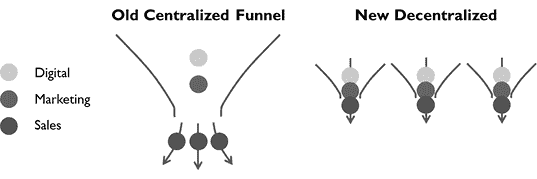

一种由 ChatGPT 实现的 B2B 销售和营销的去中心化方法

尽管领导者现在应该认识到 ChatGPT 在任何现代前端播放手册中扮演关键角色的能力，但这四个设计杠杆是互补的，展示了充分实现 ChatGPT 潜力所需的互联思维。尽管它们可以独立实施，但它们可以共同努力引入销售和营销的新范式。它们消除了现在过时播放手册中的一些限制和负面折衷：

+   集中化的方法和命令与控制的流程可能会导致机械化、参与度较低、能力较弱的销售人员，他们可能无法利用 ChatGPT 强大的力量来扩展自己。

+   像 CRM 系统这样的中心化工具可能会扼杀企业家精神，同时又几乎没有真正的价值回报。堆叠层层工具会带来复杂性，锁定软件供应商，并带来巨大的成本。

+   集中化的方法使个性化变得困难，因为中央团队和软件有限的能力无法真正理解和个性化内容以满足大量可用潜在客户，这妨碍了您在当今饱和环境中穿透客户屏障的能力。

+   由于大多数 B2B 公司的销售、一般和行政支出预算主要是销售权重的，这导致这笔钱的使用非常低效和无效。销售是一场低概率的游戏，依赖于偶然相遇而不是积极创造机会。

摆脱这种被动的方法。主动出击，创造机会。采用一种分散化的方法——在销售和营销之间重新分工，充分利用通用工具的全部功能——可以显著加速绩效。

+   使用 ChatGPT 使超高效的销售人员具备扩展能力，以规模化进行潜在客户开发，使用定制资产来克服饱和，将这些资产创建在更接近客户的节点上。

+   创建像顶级销售人员一样行事的团队。认识到明天成功的销售组织将需要符合这一不同期望集合以谋求生存并保持相关性。

+   拥抱一种新的工作分工模式，其中营销和销售进行协作，而不仅仅是简单地交接。

+   培养使用由 ChatGPT 增强的通用软件的习惯和元技能。拥抱它们在内容创作、潜在客户管理和跟踪以及其他功能方面的潜力，以增强您的销售工作。意识到它们的综合能力远远超出专门软件的功能。

+   简化您的数字转型路线图，超越无尽的软件选择，放弃典型的“拼凑”数字战略，并将工具量身定制给人（而不是相反）。

+   推动有效的前端数字转型，并调整前端运营以应对数字时代的新挑战。

这种转变不需要立即发生，尽管立即的步变是完全可能的。就技能提升而言，存在一种良性循环的方面——初次尝试应用这些概念可以创造一些初始的新技能，这些新技能有助于培养不同的行为，这些行为创造新技能、新行为等等。

尽管对许多销售人员来说，这可能看起来是一个艰巨的转变，但要放弃对 ChatGPT 之前能力的旧视角。记住销售人员现在拥有的新能力，并记住以前一代非技术增强的销售人员在潜在客户开发和潜在客户管理方面基本上是自给自足的。在过去的几年里，这基本上就是*销售所做的事情*，只是规模较小。设定期望，并使这些可能性变为现实。从纯粹的技能提升的角度来看，仅仅投资几天的培训和销售增能——比如在年度销售会议上——可以为销售和营销的长期重塑奠定基础。

**大公司，灵活流程。** 尽管新的机器设计可能是新旧结合，也可能是一些更好的大企业实践与中小企业实践的结合——即大企业传统上追求的规模和中小企业经常采用的个人化方法。

一般来说，传统的大型企业意识到，在数字时代竞争，他们需要去中心化。例如，在数字时代，传统的企业集团已经灭绝，他们的首席执行官经常将较大的公司分拆为较小的独立实体。在 COVID 后，GE 的拉里·卡普尔将这个曾经不可阻挡的巨人分拆为多个较小的运营公司，而西门子的乔·凯瑟尔在几年前执行了类似的策略，将这家德国工业集团分拆为他所称的“一群较小的船只”。除了资本市场的操作，这两位首席执行官的目标都是使他们的公司更快速、更灵活，以应对不断逼近的数字玩家和低成本竞争。

将这个概念深入组织，并考虑即使是较大公司的业务部门也可能去中心化运营以变得更加灵活是合理的。我们认为，业务部门将受益于采用这种个性化方法，甚至以类似的方式部署它。通过正确的业务细分，他们也可以建立拥有参与度高和创业精神的销售文化。与大公司中央指挥和控制流程和系统相比，ChatGPT 提供了实现卓越效率和绩效的能力。尽管这些企业中的固执领导者可能认为打破传统接受的方法和规则是异端邪说，但具有批判性思维的人可以通过新的去中心化工作流程和新的配套组织结构的正确组合实现卓越的结果。

**定制你的方法。** 我们概述的方法远非一刀切。虽然许多公司会发现，如我们所述的方法与他们自身的需求很好地契合，但有些公司可能希望采用不同的方法。然而，无论公司的方向如何，它们可能会发现我们的建议仍然具有一定的实用性。例如，即使一家公司仍然希望利用大规模营销（也许他们的可寻址市场广泛且未知），增强内容生产或销售能力仍然是 ChatGPT 可以显著加速生产力的方式。这些技术可以应用于产品或服务业务，产品或项目为中心的业务，以及直接或间接的市场渠道。 “规模化的个性化”是一种普世的方法。

此外，这些真实的例子展示了公司必须超越简单的采用，而是考虑 ChatGPT 如何影响流程、工具和结构。希望采用另类市场进入方式的公司可以从他们自己的“设计要求”出发，制定自己的策略。

**增加额外的杠杆。** 随着企业认识到 ChatGPT 作为全面转型的催化剂的潜力，他们还可以整合其他对数字化转型至关重要的互补元素。正如之前讨论的，成功的数字化转型需要一种整体方法。将基础和数字组件视为分开的是一个常见且有害的错误。请记住，数字化倡议通常依赖于或至少与业务基础方面的转型相连接。相应地制定策略。

重构前端组织

前端协议的持续变化促使重新考虑现有的组织结构。随着期望值的变化，一些人可能会被抛在后面，无法适应。流程将需要进行重大修订。支持团队执行的工作可能会更加自动化。领导者很可能会发现，旧的结构调整到旧规则和旧做事方式的结构现在必须被重新塑造。企业领导者最终将达到一个拐点，他们必须改变组织结构以释放生产力和创新收益。

随着传统的营销和销售之间的界限发生变化，期望值改变，以及旧的技能集与新的功能要求不匹配，领导者必须以不同的方式调整组织结构，以促进适应性、提升技能、新的功能协作模式以及整体转型。公司将面临升级技能和改组现有团队和人员的角色和责任，或者采用新的结构以促进优化工作流程、对齐团队目标和降低成本的选择，也许伴随着人员变动。对于大多数企业来说，很可能需要两者结合起来。

考虑一些可能促使需要不同组织结构的因素。

**业务细分。** 正如讨论的那样，一个正确细分的业务可以为规模化的更个性化的客户接触铺平道路。团队文化可以调整到一个新的范式，销售人员采用分散的、创业的方式进行新客户获取。为了促进这一点，领导者可以采用更为分散的组织结构，让较小的团队负责解决市场的特定地理和/或定义的垂直细分。此外，这些团队现在可能会更加垂直整合支持团队，甚至产品和/或运营团队，以促进更多客户价值的生产和提取，主要使用之前讨论过的许多新的可用杠杆。

**虚拟销售。** 随着后疫情时代的销售越来越多地发生在虚拟空间中，外部销售团队将发现自己花更多时间在办公室（或家中）进行远程客户呼叫和虚拟会议。在后疫情时代，转向虚拟销售对于效率和可扩展性至关重要。即使在早期拓客阶段，擅长虚拟空间的销售人员也可以实现显著的效率提升。然而，重要的是要认识到，在虚拟空间中，旧的销售策略很大程度上是无效的。客户的注意力较少，传统方法如建立关系或讨论痛点已不再奏效。吸引潜在客户需要在短时间内抓住他们的注意力，并以不同的方式保持。

这种更高效的虚拟销售方法转向早期销售活动可能会为替代结构打开可能性，例如真正配备了在这一领域有效性所需技能集和更高量级拓客和初步资格认定期望的内部销售团队。对于一些企业来说，这些团队可能是一个有效的补充，因为他们现有的外部销售团队可能无法从旧的销售方式过渡过来。此外，针对潜在客户生成、资格认定和培育活动以及其他预算项目的市场内外决策可能需要重新审视，因为策略转变。

**支持功能的自动化。** 与此同时，ChatGPT 和其他努力将进一步自动化支持功能，并创造大量效率。例如，非自动化的提案活动现在将需要远少于以往的人力，因为提案文本的创建和工具（例如，技术产品的应用或配置工具）提高了效率，甚至可以为销售创建自助服务模式。整体支持结构和人员角色和责任可能需要重新审视。

**数字时代营销的重要性。** 总体前端策略应纳入对更大营销关注、增强内部销售以及从传统营销杠杆（例如广告和展会）转向更有效吸引潜在客户的方法的长期考虑。一般来说，市场投资将开始赶上甚至优先于传统销售。预算必须脱离历史上的 SG&A 和 OPEX 分配，并开始更大程度地优先考虑营销，因为在数字时代中，简单没有比这更好的扩展方式。如果预算保持完全相同，就不要期望行为会改变。

**企业内的其他结构考虑。** 领导必须仔细评估变化对组织影响的潜力，包括负面和正面影响，并计划转型以最小化不利影响。这些战略决策必须及时，妥善策划，并严格执行。偶尔快速决断往往优于渐进式的组织变革。

随着 ChatGPT 的熟练程度不断提高，专业知识较少的个人将获得处理以前专家专属的任务的能力。这将对平均员工资历水平产生广泛影响，因为更年轻的员工将能够执行更高级别的职责。事实上，较大组织的领导者和人力资源专业人员可能将此视为长期关键绩效指标（KPI）。

为了打破现有障碍，发现贯穿各功能的端到端（E2E）优化和机会，跨职能线的领导运动至关重要。例如，市场营销和销售的融合需要重新组织层级，使具有跨多个功能领域广泛控制范围的领导者能够更快地产生结果，并对紧密交织的目标承担单一责任。

一般来说，促进人员流动可以加速新实践的采纳，特别是在涉及变革推动者时。这些变革推动者可以被战略性地嵌入不同功能中，甚至跨越到较大组织中的不同团队，以加速采纳并克服以往的障碍。

利用 ChatGPT 的能力，公司可以考虑雇佣成本效益高且精通 ChatGPT 的实习生。指派实习生跟随指定人员并使用 ChatGPT 和其他技术模仿他们的输出，以自动化工作流程。实习生还可以协助企业利用 ChatGPT 捕获和自动化企业知识。

很可能需要更加不同和更加密集的 IT 参与。将 IT 人员纳入与软件相关的持续改进工作中，并使用敏捷概念来管理项目执行。随着工作流程整合 ChatGPT，核心业务系统也将需要调整以适应。

作为可能是最基本的考虑，领导者可以选择优化其员工规模，重新分配个人，和/或重新分配时间到更具生产力和效率的事务上。与所有效率改进一样，答案很大程度上取决于业务绩效。策略必须相应调整。

将努力扩展至前端之外：将倡议延伸至端到端。

业务前端为领导者提供了一个正确的立足点，让他们了解这些技术并应用初步的程序和努力来鼓励和推动采用。这些努力随后可以扩展到整个企业。较大组织的领导者应考虑过程卓越项目，以在业务中端到端地映射 ChatGPT 的影响。这些项目可以影响较大的组织，并使领导者能够构建未来的战略项目并推动采用和适应。

立即关注的机会可能包括以下内容：

+   SCM（SCOR 模型为构建适应性项目和机会提供了一个起点）：

    +   *采购*：供应商研究；供应商函件等

    +   *制造*：ISO 过程开发和修订；质量过程文件；制造和装配说明

    +   *交付*：存储和处理程序；许多各种项目管理任务

    +   *工程师*：供应商规格开发；装配和工作说明；技术公告创建

    +   *回报*：服务恢复管理，沟通；维修活动文档

+   PLM：市场研究，竞争对手研究；产品需求规格；O&M 手册开发

+   财务：估值；电子表格的创建和操作

+   IT：基本编程；数据聚合

+   服务：呼叫中心辅导和监控；客户自助服务；培训计划和内容开发；维修文档；服务报告

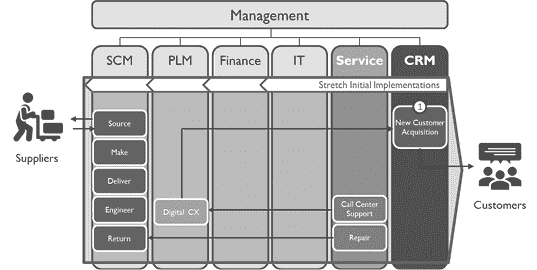

对于较大的公司，端到端价值流映射是评估 ChatGPT 潜力的一个有用框架。

要转向新的和扩展的关注领域，考虑与销售和营销等重复性任务较少，更多关于问题解决、创造力和沟通的相邻功能。在这方面，客户服务、项目管理和产品管理代表着低 hanging fruits 和潜在的下一个关注领域的机会。

实现关键变革的临界质量

实现关键变革的临界质量需要一种深思熟虑的方法，将可实现和务实的杠杆机制串联在一起。许多企业难以理解如何有效推动变革。关键在于认识到正确杠杆之间存在的巨大协同效应，但往往被忽视。组织内部隔离、缺乏必要的要素或缺乏整体战略等挑战可能阻碍进展。为了催化变革，中小企业需要一个连接的正确杠杆集合，经过编排以实现临界质量，并以程序化方式推动变革和转型。随意的采用努力不太可能产生与更连贯和重要的方法相比可能实现的成功的一小部分。

人们和组织都对变革持抵制态度，领导者需要在内部管理变革。这始于产生快速成功，激发转型的良性循环。领导者需要一定数量的努力，迫使人们行动，并激励前线人员采取不同的行为和不同的心态，获得新技能，并朝着在新局势中取得成功的方向发展。

一个精心策划的战略计划可以产生重大影响，启动增长，产生快速成功，并点燃变革的良性循环。该计划必须传达一个引人注目的愿景，激励销售、营销和其他人员采取新的和不同的行为。

为了有效管理能够引发转型的综合、交织在一起的努力，我们的敏捷战略框架提供了一种强大的方法论。使用诸如战略地图之类的工具，领导者可以将多个杠杆和目标结合在一起，以可管理的方式执行，并保持紧迫感和责任感，推动倡议向前发展。

在下一章中，我们将展示企业如何利用战略计划推动转型，并避免诱发数字时代变革所带来的常见陷阱。

# 第五章

# 转型手册

“一个好计划，立即强力执行，

比下周的完美计划更好。”

—乔治·S·巴顿将军

重建机器：优化前端机器的设计

改造企业类似于在其继续运作的同时重建一台机器的挑战。现有企业必须在我们进行设计更改的同时维持其运营，确保过渡无缝。成功地引导这样的转型需要一个微妙的平衡。我们必须引入新的成分和组件，同时保留推动企业取得当前成功的核心元素。像熟练的技工一样，领导者必须巧妙地协调这些变化，知道错误的举动或干扰可能产生深远的后果。在本章中，我们深入探讨伴随这样一项努力的复杂性和考虑因素。

要引发有意义的变革，关键的活动临界质量至关重要。这涉及战略性地调整正确的成分，并在正确的时间和速度上协调它们的整合。然而，对于中小企业的领导者来说，日常混乱和不懈的紧迫性往往掩盖了对长期目标的追求。日常运营的紧迫需求可能阻碍关键转型计划的进展。要克服这一挑战，结构化的程序化方法是不可或缺的。

企业领导者必须首先充分准备转型，制定机器新设计的蓝图，详细规划重建的路线图，并组建一个核心团队来协助完成这一艰巨任务。一个精心策划的战略计划提供了蓝图和必要的框架，以推动变革同时最大限度地减少对正在进行的运营的不利影响。它为执行战略活动和相关策略建立了一个节奏，确保在即时需求的喧嚣中，对长期转型的追求始终坚定不移。

就像前端机器需要被设计和调整以适应数字时代的新挑战一样，它的实施也必须如此。传统的转型手册提供了一些在企业推动变革方面经过验证的公式。然而，这些手册需要根据两个关键因素进行不同的定制和调整：（1）数字时代前所未有的速度和（2）中小企业面临的真实限制和约束。为了实现这些目标，我们开发了敏捷战略框架。

**通过敏捷战略采纳。** 中小企业领导者生活在一个混乱的世界中，看到重要的长期优先事项让位于紧急的日常任务和问题是太常见了。没有推动新的战略活动和相关策略的节奏，这些“重要”必然会让位于“紧急”。你有多少次看到自己的企业有很好的想法，但几个月甚至几年都没有采取任何行动？

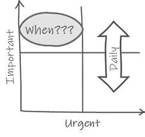

公司有许多不断变化的部分和要素，而人的因素更增加了复杂性。领导者需要一个规划、组织和协调一系列繁重倡议的指南，这些倡议已经在一个繁忙的企业中进行，并管理相关的变革。你如何驱动一个复杂的组织来采用这些技术，重新设计机器，并以维持竞争力所需的速度重新启动机器，这一切都在一个快速变化的游戏中？将数字加基础的转型要素整合在一起，并以一种全面、综合的方式进行转型，是一项艰巨的任务。

出于这些原因，我们认为战略和战略规划是数字时代企业成功的基础和必不可少的。我们的敏捷战略框架，一个全面的转型指南，使用传统战略规划和敏捷开发方法的原则。它的指南和工具包专为今天数字时代的挑战而设计，产生了实现有效中小企业转型所需的速度和敏捷性。尽管传统方法对于较小企业可能过于复杂或官僚，但战略和敏捷方法的正确结合可以提供一个不那么繁重、非常可管理且高附加值的工具包。

此外，敏捷战略计划使领导者能够有效地管理他们的企业变革。随着 ChatGPT 的广泛和深远应用，业务领导者需要一种方法来利用组织内的人力资本，产生创意并推动采纳。

敏捷战略计划的额外好处

敏捷战略计划提供了超越转型的额外好处：

+   **员工参与。** 在“大规模辞职”或“悄悄离职”的背景下，战略计划可以促进员工忠诚度和参与度。让员工参与战略倡议为顶尖人才和领导人才提供机会，通过挑战性任务获得可见度和发展。它还提醒员工公司的目的和价值，对抗脱节和流失。

+   **远程工作。** 随着 COVID 后继续进行远程工作，战略计划作为领导者远程管理企业的工具包。它保持了责任制；将重要任务分配给小团队；在缺乏旧常态办公室互动的情况下，促进协作、创造力和构思。

+   **增强企业价值。** 敏捷战略计划甚至可以增加公司的企业价值，为未来的收购做准备。通过展示对业务的清晰愿景，并展示有条不紊地规划和执行这一愿景的能力，公司减少了潜在收购者的感知风险和波动性，从而导致更高的估值和 EBITDA 倍数。此外，对现代化、营销和数字能力的投资还可以进一步提高企业价值。正确的并购咨询公司可以帮助业主确定最佳的战略投资，最大程度地增加他们在未来退出业务时的吸引力。数字化转型通常是一个高优先级。

敏捷战略框架

敏捷战略计划是将公司领导团队聚集在一起、集思广益、制定共同愿景的绝佳方式。然而，好的想法是无用的，除非企业能够真正将它们变为现实。敏捷执行为中小型企业灌输了一种专注于真正重要的业务成功要素，并对这些倡议进行强有力执行的有效方式。

令人钦佩的是，中小型企业往往将注意力集中在为客户提供服务和创造客户价值上，让业务结果随之而来。然而，在一个快速变化的世界中，在充满重大干扰的时代，领导者需要保持对业务、市场、竞争对手以及影响公司当前和未来的力量的强烈意识。然后，他们必须以敏锐的远见规划他们的转型，了解这些力量将如何影响他们自己的前进道路。

领导者需要在部署一个仅仅面向 ChatGPT 采用的计划和一个涵盖更全面目标和倡议的计划之间做出选择。我们鼓励选择后者。正如所示，有效的转型需要企业内部发生更广泛的变化，而不仅仅是采用 ChatGPT。此外，许多中小型企业今天面临严峻挑战，包括之前提到的市场被大型玩家整合、持续的 COVID 余波、摇摇欲坠的经济，以及许多其他未涵盖的干扰。明智的战略和计划设计可以使您的公司在各种前景场景中取得成功。也就是说，敏捷战略计划也可以是推动简单 ChatGPT 采用的一种有效和可管理的方式。在 ChatGPT 的情况下，有总比没有好得多。

毫无疑问，ChatGPT 和其他数字技术应该成为任何现代商业战略和战术的基石。首先，作为领导团队，要熟悉这些 AI 工具，然后挑战团队深入思考这些技术将如何改变范式以及如何定位你的公司迎接成功的未来。调整策略和内容以适应自己的机会。计划并执行将产生价值的举措，同时还展示使用 ChatGPT 在业务的其他领域中的强大力量。然后利用该程序及其节奏来促进变革，从努力中获得定期的学习，并相应地调整战略和战术。

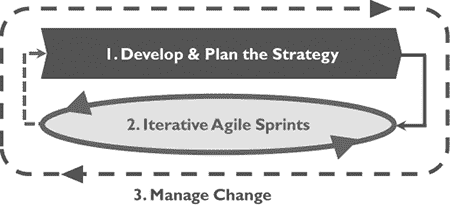

我们的敏捷战略框架用于有效转型

敏捷战略框架有三个主要组成部分，我们将在本章详细说明：

**第一个要素：制定战略。** 要制定有效的战略，公司可以借鉴各种战略规划方法和手册。虽然这些方法可能有些许差异，但它们共享共同的基础元素。一种著名的方法是由罗伯特·卡普兰和大卫·诺顿引入的平衡计分卡，提供了宝贵的见解和方法。我们借鉴了这个工具包的关键要素，例如用于可视化战略的战略地图和用于监测实施和有效性的记分卡。通过利用这些工具，企业可以制定、计划、调整和执行他们的战略。平衡计分卡的四个视角——财务、客户、流程和员工——为组织目标、建立联系和确保全面关注业务的不同方面提供了一个有用的框架。有趣的是，当以相反的顺序查看这些视角时，这些视角反映了业务的本质——优秀的员工驱动有效的流程来服务客户并产生积极的财务结果。

**第二个要素：采用敏捷执行。** 敏捷开发最初是为软件开发设计的，以其迭代和快节奏的方法而闻名，为快速变化的数字时代的战略执行提供了宝贵的方法。拥抱创业精神，敏捷强调客户关注、快速学习、避免非增值活动，并每天交付增量价值。

敏捷团队在“待办事项清单”中创建并优先考虑举措，并在定义的时间段内（称为“冲刺”）实施它们。待办事项清单作为可能举措的动态存储库，并指导敏捷团队根据客户需求和市场需求选择和实施正确的举措。定期的“Scrum”会议确保同步、责任和稳定的进展。

与可能导致进展缓慢的传统长期战略规划不同，敏捷冲刺创造了一种每周都很重要的思维方式。通过实施定期的 Scrum 会议，团队和领导者建立了审查进展和及时解决障碍的节奏。敏捷的迭代性质使团队能够朝着未来状态愿景迈出渐进的步伐，沿途获取宝贵的经验教训。这种灵活性使企业能够根据成功和失败调整其战略和策略。

在快速发展的数字领域——特别是考虑到生成式人工智能预期的进步——传统的、僵化的战略规划是不匹配的，其执行速度必然会不足。敏捷提供了跟上技术进步、客户行为变化和竞争动态所需的速度。敏捷的逐步构建方法，类似于组装乐高积木，可以实现更快的进展和更好的结果。此外，敏捷执行最小化了官僚障碍，并与中小型企业面临的挑战更好地契合，相比较于大型企业。通过结合精心制定的战略和敏捷执行方法，企业可以有效地应对数字化的持续影响，适应不断变化的环境，并实现他们期望的结果。

**第三要素：管理变革。** 约翰·科特的八步变革模型被广泛认可为公司有效变革管理的首选框架。与科特原则完美契合，敏捷战略框架提供了一套强大的工具组合，既补充又增强了变革过程。战略计划和变革管理在很大程度上是相互关联的，对于公司成功转型而言，两者都是必要且互补的。在这个 ChatGPT 的新时代，这个要素变得尤为重要，因为将会产生巨大的变革。

在本章中，我们只会提供敏捷战略框架的高层概述，因为完整指南超出了本书的范围。欲了解更多信息和更详细内容，请查看我们关于敏捷战略的课程以及本书网站上的其他材料。（见第 XIX 页）

流程概述

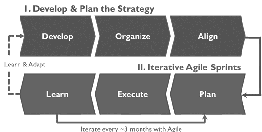

敏捷战略框架由六个关键步骤组成。实质上，我们首先将通过评估业务、使用一些经过验证的工具开发和调整战略，并创建一份初始的倡议清单来构建战略。然后，我们将运行顺序迭代的敏捷冲刺——每个冲刺大约持续一个财季——通过从倡议清单中选择合适的项目，将它们组织成约六个关键倡议围绕业务展开，执行这些倡议，并根据需要从冲刺中获取经验教训来修订倡议清单和战略。

1\. 制定和规划战略

游戏规则的初始阶段侧重于战略规划方法。其目的是深入考虑影响企业的因素，建立总体战略和战略计划，获得组织内的一致性，解决财务限制，并为随后的敏捷冲刺提供路线图。

**制定。** 为了制定一个稳固的商业战略，公司采用各种工具来评估其内部能力和外部环境，包括市场和竞争对手。关键问题得到解答，以确定在市场上取得成功的路径。最终，制定了一个愿景，概述了期望的未来状态和实现它的一般方法。战略地图可以作为一个有用的工具，突出并连接公司将优先考虑的关键目标，强调有限的目标集而不是广泛的愿望清单。该地图随后将使公司员工了解战略。

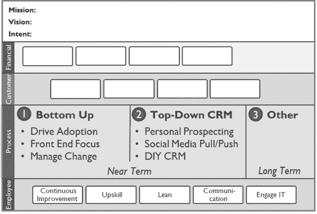

基本敏捷战略地图示例

**组织。** 战略计划详细阐述了在市场上取胜的路径。为在随后的冲刺中执行而创建了一份初始的倡议清单。分配责任，并制定顺序执行计划。记分卡允许衡量进展，制定或修订财务计划以分配资源和资助战略倡议。

**对齐。** 对齐在组织的各个层面至关重要，包括向上、横向和向下的对齐。独立公司寻求领导团队的支持和批准，而公司内的业务部门从部门或高管管理层获得必要的批准。资源被分配，预算被分配，障碍被解决。与领导层达成共识，并做出必要的程序修订。一旦准备就绪，公司向更广泛的受众传达其战略，以促使其执行。

这个战略规划过程为推动企业朝着期望的结果迈出一致和专注的步伐奠定了基础。

“杠铃模型”用于变革性改变。

尽管制定商业战略的许多考虑因素超出了本书的范围，但我们将提供一些关于内容的一般思考。虽然我们在前几章中已经讨论了许多可能的战略要素、倡议和杠杆，但公司无疑需要考虑他们自己独特的机遇和挑战。我们的“杠铃模型”可以为领导者提供一个有效的思考数字时代战略的方式，并将正确的组合要素放在适当的位置：

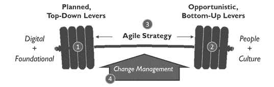

“杠铃模型”用于 ChatGPT 采用和整体数字时代转型

1.  **自上而下的变革。** 领导者必须推动变革。一些杠杆需要紧密协调和谨慎规划，整体转型需要解决基础元素和像 ChatGPT 这样的新数字元素。因此，领导者需要计划和监控一系列举措的执行，并确保这些重要举措不会被紧急的日常问题所取代。这种自上而下的计划、协调的一系列举措由杠铃的左侧代表。

1.  **自下而上的变革。** 领导者也不能成为进展的瓶颈。数字化转型，包括 ChatGPT 的采用，对领导者来说过于复杂和广泛。他们必须征集员工的想法和才能，并使他们能够不断改进业务。他们需要一种支持这一点的文化，鼓励人们采取主动，并在诸如问责制和容忍失败之类的事项之间取得适当的平衡。这种自下而上的一系列未计划的、机会主义的举措由杠铃的右侧代表。

1.  **该计划。** 杠铃本身——连接这些杠杆的纽带——代表敏捷战略计划。该计划确保领导团队保持一致，并帮助他们朝着共同的未来愿景定位和动员人员，并以协同、连接和同步的方式系统地规划和执行战略举措。

1.  **管理变革。** 领导者可以通过变革管理努力提供动力，从而“举起”杠铃，推动转型。

就像实际的杠铃帮助增强力量一样，这个杠铃也是如此。企业将在每个敏捷冲刺中变得更加强大。最初的计划努力将鼓舞企业，并使领导者能够让更多人“上车”迈向变革。数字化是关于行动、实验和学习的。即使失败也可能产生让企业未来表现更好的经验教训。领导者可以启动一个良性循环，在最初的胜利基础上建立更多胜利，并吸引更多人做更多有益的事情推动企业前进。

2\. 迭代式敏捷冲刺

手册的第二部分利用敏捷方法和迭代式计划-执行-学习方法。公司将以敏捷方式执行战略举措：培养紧迫感；吸引团队、个人和想法；并利用经验教训增强后续冲刺的规划和执行。对于大多数公司来说，冲刺通常会持续一个财季左右。

**规划。** 一个较小的核心团队或业务的功能领导人聚集在一起规划每个 Sprint。在参与 Sprint 之前，他们评估举措积压和选择或分组要在指定时间内执行的举措，与战略目标和优先事项保持一致，同时在分配的预算范围内。选择了有限、可管理的一组举措，小心不要把计划变成一个庞大的愿望清单。详细的举措计划与核心团队最终确定，并获得领导层的批准。对于每个 Sprint，ChatGPT 采用、重新设计和重新启动的杠杆很可能是必要的。

**执行。** 在大部分时间内，团队积极执行各项举措，由举措负责人提供进展更新，并强调任何需要管理支持的障碍或约束。定期（通常每周）的 Scrum 会议保持团队在正确的轨道上，而定期（通常每月）的高层审查则保持责任和执行优先事项的关注，并促进举措进展的校准、调整和识别需要管理注意的问题和障碍。团队们在整个 Sprint 周期内每周都努力实现渐进性的进展。

**学习。** 在每个 Sprint 结束时，业务评估已实施的变更、完成的工作以及在举措成果和衡量的业务绩效方面的实际结果。团队进行总结会，捕捉到宝贵的经验教训，而业务领导评估了举措的成本和影响。尽管对整体战略的变更可能是次要的，但它们是基于这些评估而引入的。关键的见解和对后续 Sprint 的“规划”阶段的输入被记录和编目。

这种迭代式方法允许对战略举措进行灵活的执行，融入持续学习和改进，以敏捷和灵活的方式推动业务向前发展。

**事件与促进。** 虽然业务领导或战略家可以自行制定战略，但一个合作和良好促进的研讨会可以极大地增强战略规划工作的效果。它能够收集多元化的见解，并促进团队内更强的参与。为了最大程度地提高研讨会的效果，建议企业要么（1）指定内部的促进者，比如一名顶尖人才，要么（2）聘请外部的促进者。使用专门的促进者可以更好地进行规划和准备，增强参与度，并使业务领导能够积极倾听和提问。

**战略项目。** 在转型过程的早期阶段，建立一个强大的引导联盟至关重要。这包括组建一个负责制定战略、管理其初步执行并监督随后敏捷冲刺的核心项目团队。该项目涵盖战略本身、敏捷冲刺以及相关的变革管理活动。团队利用研讨会和会议的节奏共同创建内容并计划活动。他们作为业务其他领域的联络人，促进相关利益相关者的参与。

理想情况下，核心项目团队应由高层领导团队以及来自业务各个领域的精选个人组成，包括那些在未来领导职位继任计划中被确定的人员。这些个人，无论是经理还是个人贡献者，都可以为特定倡议做出贡献，共同定义冲刺优先事项，并推动执行。需要找到团队规模和灵活性的正确折衷。团队成员应来自对焦点倡议成功至关重要的相关职能。

在某些情况下，指定一个战略项目负责人可能是有利的，选择业务内具有才能的个人担任该角色。这位项目经理将促进会议，处理后勤事务，协调和管理项目活动，并保持适当的审查节奏和其他活动。

**管理敏捷战略项目。** 敏捷战略项目的典型会议节奏可能如下所示。

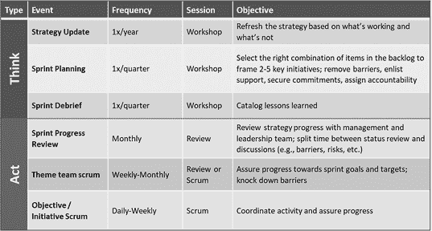

**进行项目管理。** 有效的规划和促进对于项目内的成功研讨会和会议至关重要。项目负责人应具备必要的促进技能，并确保每个会议都组织良好并得以执行。团队应进行准备工作，以最大化共同度过的时间。必须建立清晰的期望和规则，包括准时开始，避免分心，做好准备工作，并遵循议程。公司领导的积极参与尤为重要，因为这展示了他们对项目及其倡议的支持和优先级。

公司应采取“思考缓慢但行动迅速”的平衡方法，认识到深思熟虑的规划和迅速执行的重要性。领导者应在规划阶段鼓励创造性、头脑风暴和超越传统的思维方式。然而，一旦项目进入执行阶段，领导者必须确保组织在心态上转变，并强调兑现承诺和满足期望。这两种心态之间的明显转变有助于产生成功的结果和可持续的进展。

**确定所需变革的程度。** 确定公司所需变化的程度和项目重点需要进行仔细的校准和与高层领导的协调。这种校准应考虑当前业务面临的阻力、风险和机遇，以及组织处理变化的能力和最有效的投药。

考虑两个在构建这一评估中起着关键作用的维度。首先，需要评估 ChatGPT 对整体战略的核心性。请记住，一个表面上专注于 ChatGPT 采用的项目可以将其他更大的目标联系在一起。该项目是关于 ChatGPT 还是表面上关于 ChatGPT 但推动其他更大的目标？或者该项目是围绕其他目标中心展开，但将 ChatGPT 作为一个杠杆？以及在何种程度上？领导者必须确定 ChatGPT 对其战略愿景的重要性程度，以及它能够推动变革性成果的程度。

第二，应考虑企业范围内的转型范围。这包括决定转型努力的深度——是仅针对销售和营销以及前端转型，其中存在大量机会，还是同时涵盖供应链和/或制造业务、服务、产品开发、财务、IT 等。此外，企业必须确定其是否打算实现更具过渡性质的变化，还是真正具有变革性质的变化。这一意图应在领导团队内得到良好的校准。

在转型光谱的较低端，主要关注于利用 ChatGPT 进行前端转型。这包括利用 ChatGPT 的能力来增强客户互动，改善用户体验，并优化业务运营的特定方面。在更高层次上，目标是为数字时代提出的各种挑战准备整个企业。这种全面的方法涉及将转型努力延伸到整个企业，涉及各种职能和部门。虽然 ChatGPT 仍然是更广泛的转型战略中的关键因素，但它并不是唯一的焦点，而是一个重要的推动因素。

领导者可以将 ChatGPT 作为项目的明显目标，就像保罗·奥尼尔在阿尔科亚公司对安全的强调一样。通过围绕 ChatGPT 策划一个战略性项目，领导者可以推动组织中的变革，并同时影响其他方面，就像多米诺骨牌的连锁效应一样。通过仔细考虑这些维度，并利用 ChatGPT 作为催化剂，领导者可以塑造他们的转型努力，以应对数字时代的挑战，并在整个组织中推动有意义的变革。

3\. 管理变革

在引领这一新范式时，企业领导者将面临并平衡一些辩证法：

+   破坏正在迅速发生。业务领导者如何能够实施这些非常具有颠覆性的技术，而不破坏使他们公司成功的因素？

+   ChatGPT 代表了人们与计算机交互的一种新主要方式。尽管 ChatGPT 的采用表面上要求关注该声明中的“计算机”部分，但有效的变革将要求领导者强调“人员”。

+   尽管领导者需要施加强有力的自上而下的动力来推动快速采用，但 ChatGPT 的潜力对领导者来说太广泛了，无法自行制定战略；他们只会成为努力的瓶颈，扼杀进展。领导者如何能够以自下而上的方式激励、激发人们开发和实施他们自己的想法，从而在企业中产生必要的变革规模？

+   最后，ChatGPT 的发展将需要业务中持续不断的改进，但领导者需要意识到可能的即时效率飞跃。领导者如何能够启动转型，快速重新调整当前的期望，并为更广泛的变革提供初始点火的火花？

**不要低估采用障碍。** 即使那些了解 ChatGPT 巨大能力的人，使用它仍然不直观。很难信任它，它经常让人感觉像作弊，而且可能具有威胁性。虽然一些人可能会热情地采用它，但许多中后期职业人员将难以将其投入实际工作中。对于经验丰富的文案撰写人员来说，很难*不*写点什么，让 AI 来代替写作是不自然的。对于经验丰富的分析师来说，很难相信 AI 可以在几分钟内完成以前花费他们数小时的工作。

然而，很快，由于竞争压力，领导者将需要要求一种被认为是超高效率的产出水平。人们必须校准对生产力的新期望。为了业务出类拔萃，ChatGPT 需要成为一种习惯，旧习惯和“感觉”需要被摒弃。ChatGPT 必须在每个工作日的许多任务中使用，并且优化生产力需要几乎不间断地使用它。

领导者需要同情这些采用挑战，并首先并且首要地充分使用 ChatGPT。这不是可以委派的事情。沉浸在这些工具中对于真正理解组织和人员的挑战和机遇至关重要。

**积极管理变革。** 基于组织文化和风格以及员工当前的技能，领导者可以确定他们需要以多快的速度推动业务发展。考虑两种可能的变革管理方法：

+   **培育和促进（“胡萝卜”）。** 领导者可以通过教育计划、培训课程、嵌入式变革代理人、活动或其他方式温和地鼓励采用。

+   **强制生产力（“棍子”）。** 领导者可以通过强加更紧的截止日期来快速重新校准某些任务的效率预期，以强制采用。例如，如果市场部门编写新宣传册的截止日期和预算没有改变，他们可能仍需要几天的时间，很可能没有 ChatGPT 的帮助。在更紧的截止日期下，可能会在不到一个小时内完成，出于必要性使用 ChatGPT。

针对可能倾向于支持更自然采用速度的领导者，请记住，其他人可能在一两个小时内撰写那份宣传册，现在的 SG&A 投资减少了 90%。考虑到竞争压力，不要指望组织在没有强有力的动力推动下能够足够快速地做出反应。

通过战略计划管理变革

人们需要学习新的行为、新的习惯，并与新的期望保持一致，因此变革管理将至关重要。领导者可以应用约翰·科特的八步变革模型，包括建立紧迫感、形成强大的引导联盟、创建和传达愿景以及授权人们行动愿景等基本变革管理步骤。我们的敏捷战略框架将八步变革模型整合到管理转型的整体手册中。

整合科特的八步变革模型

如果采用“杠铃”方法构建战略，该项目将专注于自上而下的倡议和促进自下而上的变革。在许多方面（虽然不是绝对），步骤一至六主要集中在自上而下的方面，而步骤七和八主要将焦点转向自下而上的方面。对于公司来说，通过该项目推动计划的战略变化，并接受源自组织内部个人的增量式、机会主义和非计划变化倡议至关重要。

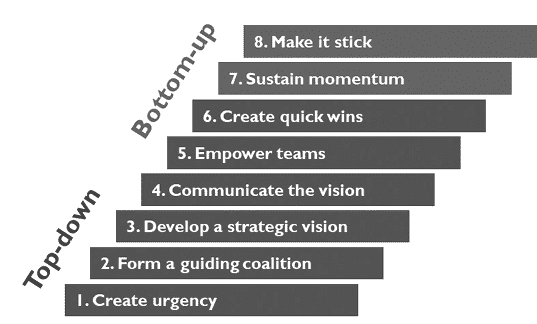

1.  **建立紧迫感。** 数字时代持续的颠覆性变化使企业必须进行转型。领导者必须创建一个“燃烧的平台”，迫使团队认识到变革的必要性。随着持续的市场力量带来如此强大的威胁和机遇，变革的理由应该是显而易见的。然而，领导者必须有力地向组织阐明这一理由，并提供理性和动力推动变革。

1.  **形成强大的引导联盟。** 敏捷战略项目团队最初应由关键领导者和具有灵活心态的个人组成。在挑战现状和支持现状之间保持平衡至关重要。然而，领导者还必须确保破坏者为团队增加价值，而不是阻碍集体努力。 ChatGPT 的知识和见解将至关重要，团队应定期投入时间以熟悉和使用工具。对 ChatGPT 潜力充满激情的变革者也可以被征召。

1.  **制定愿景。** 程序团队将制定愿景和战略，作为企业未来方向的路线图。

1.  **传达愿景。** 领导者应该利用多种沟通渠道确保愿景与员工共鸣。频繁的沟通强化了紧迫性，建立了参与度，并鼓励员工积极参与变革努力。

1.  **激励他人践行愿景。** 核心程序团队树立了新行为的榜样，领导者分配资源并消除支持战略举措的障碍。包括培训和发展计划在内的文化举措，可以促使基层想法并将问题解决与数字未来愿景保持一致。

1.  **规划并创造短期胜利。** 利用短期机会和协同举措，领导者可以产生动力，并围绕愿景建立信誉。通过分阶段运行举措，可以在不失焦点或动力的情况下实现短期目标。庆祝成就并公开认可贡献进一步激励员工加入变革努力。

1.  **巩固改进并产生更多变革。** 随着更多人的贡献，进一步的成果被产生并受到庆祝。文化逐渐转变，在组织内部形成一个日益壮大的“俱乐部”，员工自愿接受变革，包括采用 ChatGPT。来自项目内部和整个企业产生的新想法，都为项目积压清单做出贡献，获得更多的投资和资源。

1.  **制度化新方法。** 成功的技术和方法被纳入企业的流程中。新的行为和工具与未来愿景保持一致，大多数员工朝着这个方向努力。企业培养了一种变革的元技能，使其能够在数字时代适应和茁壮成长。

确保变革持久并成为组织 DNA 的固有部分至关重要。通过敏捷战略计划和科特模型的结合，企业可以有效地应对变革管理的复杂性，并拥抱持续变革。

ChatGPT 杠杆

以下是一些关于如何进一步推动 ChatGPT 采用并管理相关变革的具体想法：

+   与公司领导团队一起启动活动，再加上一些初步培训和促进，可以让团队开始使用 ChatGPT，并增加对其能力的认识。仅仅让团队创建一个登录并使用该工具，就可以为战略讨论和随后的行动提供一个初始火花。

+   一个员工启动活动，带有一些仪式感，可以帮助点燃变革，并传达期望已经改变的信号。考虑进行为期半天甚至多天的培训或协作会议，再加上宣布初始敏捷冲刺的消息。

+   用各种方式吸引员工的创造力。使用竞赛和奖励计划；每周选择最有影响力的 ChatGPT 使用。每周指定半天时间来发现应用 ChatGPT 的方法，并分享最佳实践、新想法和用例。在团队内进一步开发想法。使用 ChatGPT 运行比赛，在记录时间内完成任务。

+   使用不断的重复不断强调游戏已经改变，人们需要改变行为的事实。领导者往往低估了所需的沟通量和频率。作为校准点，每周至少提及 ChatGPT 的某种形式的沟通并不过分。利用团队会议、城镇大厅、简报（利用 ChatGPT 更容易创建）、电子邮件、与领导者的午餐/咖啡时间等来与更广泛的团队进行沟通。

+   在办公室张贴海报和其他视觉材料。

+   在会议中积极使用 ChatGPT，包括起草实时会议记录和激发创造力等各种目的。

+   奖励建立效率和减少工作时间的团队和个人。此外，根据结果而不是投入时间管理人员。

+   将变革代理人置于企业各个部门，并将早期采用者纳入一个更大的团队，推动和使其他人采用这些技术。考虑导师计划，让早期职业员工跟随资深专业人士学习，模仿他们许多任务使用 ChatGPT。还要考虑“反向辅导”计划，让资深员工跟随高级 ChatGPT 用户学习新技能。

+   考虑招聘一些实习生作为“AI 审讯员”，并要求职能领导每季度为他们提供几个项目。我们的打赌是，这些项目一开始流动缓慢，然后随着人们发现 ChatGPT 的潜力而加速。

+   促进跨职能部门的事件和研讨会，定义新的用例和如何最好地调整工作流程的想法。寻找 ChatGPT 开启的功能之间的新可能性。

+   设定期望值，分配挑战性任务，并表示必须使用团队和个人目标实现新的生产力水平。

+   促进与业务更紧密联系和更注重业务驱动的 IT 方法。将 IT 纳入更大比例的职能会议和讨论中。寻求他们的帮助来建立组织中的 ChatGPT 专业知识和吸引力，并相应地调整企业软件。

+   找到与关键客户合作的方法，围绕 ChatGPT 的话题，包括领导层讨论、共享挑战、业务机会等。

# 第六章

# 结论

“复利是世界第八大奇迹。懂得它的人，赚取它……不懂的人……付出代价。”

—阿尔伯特·爱因斯坦

结论

这本书是在 ChatGPT 发布供公众使用约六个月后完成的。仅仅六个月前，没有人听说过 ChatGPT、谷歌的巴德或其他许多生成式人工智能工具。那时，技术看起来可能会取代工厂工人（自动化和机器人技术）、呼叫中心操作员（搬迁和外包）甚至卡车司机（自动驾驶车辆）。如今，看起来更像是会计师、律师、医生和程序员，这都是由于语言模型带来的重大进步。如今，*数字化转型*的含义和策略与仅仅六个月前完全不同。游戏已经重置和改变，未来几个月或几年会是什么样子，任何人都无法预测。

如果有一件事我们希望领导者从这本书中获得，那就是他们需要亲自动手并*使用 ChatGPT*来充分了解其能力以及它对他们业务的影响。你的眼睛会打开，你会意识到事情已经发生了多大变化。通过使用它，你会意识到人们的习惯必须改变，领导者必须设定期望并提供强大的采用动力。

当今商业中最有用和多才多艺的技能可能现在是“使用 ChatGPT”。未来的成功将更少地取决于你有多聪明或者你有多努力工作，而更多地取决于你如何使用这项技术。随着现在比我们自己更聪明的技术，现在可以像人一样交流，使用这些技术将是未来几年的关键成功因素。较早将这些工具投入使用的公司将获得懒汉永远无法追赶的复利利益。除了公共领域中可用的工具外，将这些技术本地化、培训和构建接口的公司将获得更进一步的优势。

大多数企业尚未迈出一步释放 ChatGPT 真正力量的步伐。他们停滞不前，对增长和生产力的潜力一无所知，并且还没有准备好参加他们现在所处的新竞赛，其中许多人甚至还没有走到起跑线。太多人满足于随波逐流。但是现在你有了推动业务前进所需的工具和技术。

**你自己的机器。** 你的销售和营销机器现在有不同的组成部分，具有不同的能力，甚至有不同的设计要求。这台机器现在必须调整到数字时代新的前端需求，比如克服饱和，这将需要完全不同的技术。企业将需要在新组件和新设计要求之间进行三角定位，并开始重新设计和重建他们的机器。

深思 ChatGPT 可能带来的变革程度。能力从未如此迅速地发生如此大的变化，就像翻开一个开关一样。机器设计的每个方面——以及端到端的系统设计——都需要重新考虑。关于组件如何排列的每个先前的假设都可以质疑。必须制定新策略，并计划在飞行中重建机器。

**实战手册。** 准备好面对有效转型的“复杂系统问题”，以及需要解决所有必要因素的需求，以便迅速调动业务适应这一新范式。

+   **有远见的领导和紧迫感。** 建立采用像 ChatGPT 这样的技术所需的战略愿景和紧迫感。不要犹豫。设想一下等待在您组织内部的变革潜力，并意识到采用和真正适应是两个非常不同的概念。使用 ChatGPT，亲眼看看业务将需要如何适应。

+   **融入工作流程和流程重新设计。** 超越仅仅使用 ChatGPT；将其作为您日常操作的一个重要组成部分。重新定义期望，重设规范，并接受 ChatGPT 可能带来的新水平的生产力和效率。准备并执行（较少频繁的）层次结构重建，解决与这一重大范式转变相关的组织和人员挑战。

+   **战略对齐。** 确保您对 ChatGPT 的采用在战略上与您的整体业务战略和其他数字转型倡议保持一致。采用平衡的“哑铃”方法，同时使用自上而下和关键的自下而上杠杆。意识到 ChatGPT 可以成为将多个必要元素紧密结合在一起，以适应您的业务迎接数字时代新挑战的战略纽带。了解穿透市场饱和的迫切需要一个引人注目的销售和营销方法，并利用 ChatGPT 在整个组织的前端点燃转型的火花。

+   **推动执行。** 使用敏捷冲刺方法来采用技术，重新设计流程，并每季度重新设置生产力期望。防止紧急的日常任务掩盖将推动您的业务向前发展的长期重点。建立必要的方法和框架，以确保 ChatGPT 实施按计划进行。使用持续改进和敏捷方法来与技术变化的快速步伐保持一致，简化并更好地推动重要目标和目标，并根据定期的学习调整方向。

+   **变革管理和创新文化。** 培养一个重视创新的文化，赋予员工创造想法和推动 ChatGPT 实施的权力。拥抱和推广自下而上的贡献，这些贡献推动组织中的大规模变革。重新设定期望，并推动必要的步变，以实现 ChatGPT 带来的巨大生产力增益。

+   **持续演进和敏捷性。** 拥抱不断变化的旅程。保持准备好随着 ChatGPT 和类似技术的进步而适应。培养敏捷性和适应性，以在不断变化的市场中保持领先。

这些因素对于有效的转型至关重要。不要陷入与大多数公司相同的陷阱中，这些公司的数字转型努力成功率仅为 20%，这在很大程度上是由于这个复杂的系统问题造成的。要明白，拥有所有关键的成功因素并不是偶然的事情——这是你对成功坚定不移的承诺的问题。

**拥抱中小企业的优势。** 在快速整合的市场和全面胜出的数字时代，中小企业在劣势方面已经足够多了，因此他们需要利用他们拥有的少数优势。这意味着不要陷入大公司的策略手册中，也不要让自己受制于大公司被编程产生的低效和拖累。

以不同的方式思考你自己的市场推广策略，并利用新工具和强大的能力，在规模上与客户产生真实、个性化的互动。摆脱以前的策略手册，这些手册更新速度太慢，受制于大公司的官僚主义。现在就用更聪明、更有效的方法来攻击市场——这种方法根植于古老的经验丰富的基础，但现在结合了新技术，以产生数字时代所需的规模。

忘记大公司的数字转型，他们的策略手册现在已经完全过时了。忘记那些试图向你推销昂贵软件的营销学家的炒作，一个软件叠加在另一个软件之上。意识到 ChatGPT 也改变了这些规则，使每个员工都成为专家级的软件用户，甚至是程序员，使得像微软办公软件这样的通用程序变得更加强大和功能丰富。结合中小企业的宝贵文化元素——比如参与度、所有权和客户意识——现在这些工具通常可以提供更好的数字转型选择。根据定义的需求用专门软件填补空白。简化你的数字路线图。

中小企业有一个独特的机会，通过迅速采用 ChatGPT 等新技术，超越其更大的对手。采用的初始成本很低，回报却很可观，可能产生比任何其他可能的投资更高的回报。当您学会有效利用 ChatGPT 时，您将释放组织内的潜在潜力，提高生产力，并发现应用这种变革性工具的创新方式。这开启了一个良性循环，每一次成功都建立在前一次成功的基础上，使您能够优化您的运营并获得竞争优势。

**认识并计划正确的权衡。** 我们提出的前端机器设计对许多类型的 B2B 企业来说是正确的，但它存在权衡。优势包括简化您的数字战略、培养高度可转移的元技能、培养企业家精神和创造力文化、促使最佳实践出现和蓬勃发展，甚至建立您自己的系统，可以独特地利用您公司的企业知识。相反，集中式的指挥和控制方法可能会产生更多机械化的统一性和一些初始效率。虽然这可能最初对一些经理有吸引力，但统一性会阻碍创造性思想和新方法的产生，这些思想和方法可以在您的业务中出现并扩展。最终可能导致一个恶性循环，外部数字软件实际上侵蚀了您自己的权力，软件变得越来越强大，而您对其依赖性也越来越强，同时您的能力却越来越弱。具有讽刺意味的是，也许 ChatGPT 将重新强调我们工作中的人类体验的优先级。

将 ChatGPT 集成到您的组织中无疑需要进一步的妥协，并需要解决新的权衡。当您拥抱这种变革性技术时，关键在于应对这些挑战并找到合适的平衡。关键在于利用 ChatGPT 的力量，同时保留推动创新、协作和创造性问题解决的基本人类元素。通过 ChatGPT，业务领导者需要做出深思熟虑的决策，以优化其利用，同时保持批判性思维的文化，并赋予员工贡献其独特见解的能力。这是一个不断寻找 ChatGPT 提供的效率和自动化与人类创造力、适应性以及超越预定义算法范围的思考能力之间平衡的过程。

构建您自己的前端机器，并使其真正属于您自己。不要外包它；它太重要和个人化，不能把其设计交给通用软件提供商。通过拥有并不断完善您的机器，您可以存储并建立公司的集体知识和见解，发展和适应快速变化的范式，同时创新方法以比竞争对手更好、更不同的方式做事。

通过直面这些权衡并加以解决，您可以应对复杂性，释放 ChatGPT 的全部潜力，同时培养持续改进、协作和以人为中心的创新文化。前进的道路可能并不总是一帆风顺，但通过深思熟虑地权衡取舍，您可以发挥 ChatGPT 的真正力量，创造一个技术和人类智慧和谐共存的未来。

**未来。** 展望未来，我们可以清楚地看到 ChatGPT 的使用将变得无处不在的时代即将到来。公司无疑将利用其力量填充社交媒体和其他平台，创造一波内容和参与度。随着这一切的发生，新的防御措施将出现以抵制 ChatGPT 的影响，数字领域将继续发展，产生新的挑战和机遇。然而，所有这些潜在障碍都不应阻止您立即实施 ChatGPT。

在这个新游戏中，公司将主要基于技术采用的不同而分道扬镳，造成那些适应的人和那些落后的人之间存在巨大差距。对于你的公司来说，逐步取得进展，拥抱 ChatGPT 并保持领先地位至关重要，立即开始。虽然下一个技术突破最终可能会再次重置游戏，但这并不足以成为自满的理由。

ChatGPT 和其他人工智能将继续嵌入到每一个工具中，如搜索引擎、各种应用程序和各种商业工具。它将成为人们与计算机交互的主要手段。每周将涌现出数百种新应用程序。我们正在接近“奇点”，公司及其员工将需要更加重视和投资于提升技能、评估新技术选择，并定期磨练以跟上步伐。决策制定和其他文化元素需要适应保持相关性所需的速度。

人工智能很可能成为新的点子网泡沫。投资将涌入人工智能公司，其发展将在很大程度上受到新的治理和监管的限制。政治家和科技社区将继续探讨人工智能的长期影响，社会将面临新的失业和技能转变的世界，所有这些都发生在一个充满许多新的地缘政治策略和其他破坏性威胁的世界中。下一代将面临远远超出以往任何一代的挑战。

然而，对于人工智能而言，尽管长期影响尚不明确，甚至可能令人不安，但是无法将精灵重新装进瓶子。社会，包括企业，将不得不适应。

**复利。** 尽管 ChatGPT 是一个复杂的系统*问题*，但也是一个复利*机会*。通过采用 ChatGPT，您的组织将启动复利的强大力量。早期采用的好处远不止于即时收益。对于 ChatGPT，立即采用并引领 ChatGPT 的使用至关重要，以及收获复利的回报。您越早采用，就越快获得动力，充分利用 ChatGPT 的潜力，为未来的技术进步奠定坚实基础，并使您的组织处于长期成功的位置。

我希望您允许我与您分享一个最后的小故事。我忍不住要将 ChatGPT 的复利与我与十二岁侄女的最近经历进行类比。

最近，我们家庭在我妻子这边决定在当地的 Topgolf 度过一个晚上。如果你还没有去过 Topgolf，那是一个独特的游戏，你要击中目标并得分。那天晚上，我的侄女成为了众人关注的焦点，收到了周围每个人的建议——如何握杆，如何挥杆等等（令人惊讶的是，建议来自其他人而不是我）。然而，她对不断涌来的建议感到沮丧。

她走过来坐在我旁边，明显很烦。我觉得有必要向她解释为什么每个人都急于帮助她改进高尔夫球技。“伊茨，”我说，“这有点像我在学校推动你在数学或科学方面取得进步的时候。我们意识到了你没有意识到的东西，那就是复利的价值。”她勉强听我解释。我开始描绘一个画面。“一个高尔夫球场有多少个洞？”我问。

“十八，”她回答。

我继续讲述了一个改编自古老“麦粒与棋盘”故事的版本。“想象一下：在我们开始打高尔夫之前，我拿出一个袋子装满便士，然后在第一个发球台上放一枚便士。然后，每个发球台上，便士的数量都会翻倍。所以，第二个发球台上两枚便士，第三个上四枚，第四个上八枚，依此类推。”

我看到她努力理解这个概念。“现在，”我说，“想象一下，在我们打球的过程中，你可以带一个袋子并收集所有这些便士。你觉得打完九洞后你会有多少钱？”

她的直觉相当不错。“也许几美元？”

我微笑着说：“是的，你会有五美元多一点。”我稍微改变了问题的框架：“所以，如果我提议以十美元的价格卖给你所有那些便士，你不会同意，因为你会亏损大约五美元，对吧？”

她点头表示同意。

我继续说。“现在，如果我提议以二十美元的价格卖给你整整十八个洞的所有便士，你会接受这个交易吗？”

她毫不犹豫地回答：“不会”，很可能将九洞的总数翻倍，然后与二十美元的提议进行比较。

我微笑着继续说：“如果我试图以 100 美元的价格向你出售两轮高尔夫、三十六洞的所有便士，你会怎么想？”

想了一会儿后，她摇了摇头说：“还是不要。”

“好了，这里是有趣的部分，”我说着，用手机的计算器。“尽管你在打完九洞后只剩下五美元，但打完十八洞后，那些便士将价值超过$2,500。而在二十七洞时，你将成为百万富翁。两轮高尔夫将价值超过 6 亿美元。而那堆便士将如此之高，以至于可以绕地球两个半圈。”

她的眼睛睁大了。

在我们继续玩 Topgolf 游戏的过程中，我补充了一些东西：“打三轮高尔夫将价值是世界上所有金钱的四倍半。那堆便士将延伸至太阳系之外。伊齐，现在，无论是在高尔夫、学校还是其他领域，你只是在打前九洞。但这前九洞至关重要，因为在生活中，事情不只是简单相加——而是相乘。这就是为什么每个人都希望你现在学习事物并擅长事物。”我向她讲了一点关于阿尔伯特·爱因斯坦的事情，据说他称复利为宇宙中最强大的力量。“我们有时可能会对你施加过多压力，但这是有充分理由的。”

公司现在面临着一个即时而巨大的机会，因为重置按钮已经按下。这些最初的几个月将关乎他们自己的复利，关乎在他们的业务中启动生产力和增长的良性循环。尽管起初可能看起来像是便士，但这些便士最终将开始倍增并迅速累积起来。

波动市场——那些有大幅度干扰和快速变化的市场，无论是向下还是向上，就像今天一样——总是为聪明、大胆的公司提供最好的机会。现在是到第一发球台的时候了。

# 结语

# 我的个人经历

“习惯的枷锁太弱而感觉不到

直到它们变得太强大而无法被打破。”

—沃伦·巴菲特

我自己的 ChatGPT 经历和撰写这本书

我于 2023 年 4 月开始撰写这本书，在不到两个月的时间里将我的思想倾注到页面上。这是一个密集的时期，我完全沉浸在 ChatGPT 的世界中，不知疲倦地尝试其能力并探索其潜在用途。我的目标是利用这项技术的力量，并为商业领袖揭示其广阔的可能性。仅仅几天的沉浸后，就清楚地看到中小企业有一个前所未有的机会利用 ChatGPT，并与更大的竞争对手平起平坐。

最初，我写这本书的初衷是要找出 ChatGPT 在 B2B 领域的许多应用。然而，随着我进一步深入了解这项技术，我意识到它不仅仅是一种特定用例的工具，它是一个完全改变游戏规则的存在。我很快意识到它有多么强大，可以彻底改变前端运营和结构，以及为什么，如果没有这种转变，公司只能实现其总潜力的一小部分。

在整个过程中最让我印象深刻的是，多少商业领袖，特别是我们这些超过四十岁的人（即大多数商业领袖），真正理解 ChatGPT 的深远影响和潜力有多少。与我这个年龄段的人的交谈揭示了他们与这些变革性工具互动的明显不足。年龄与愿意接受这些新兴技术之间似乎存在着一种反比关系。虽然年轻一代轻松接受 ChatGPT 及其能力，但许多经验丰富的领导者对其颠覆性力量视而不见。

读者应该意识到，没有任何书籍或视频能够完全传达 ChatGPT 的变革性质，没有亲身体验。当个人第一次与这个工具互动时，可能会让人惊叹不已。这或许可以与宇航员从太空看到地球时经历的深刻视角转变相媲美，这种现象被称为“总览效应”。使用 ChatGPT 时，我被吸引，着迷，有时甚至感到不堪重负到身体恶心的程度。这清楚地表明我正在处理一些深刻而有影响力的东西。

我主要使用 ChatGPT，因为当时很明显它具有比其他语言模型更强大的能力。我不断挑战 ChatGPT 的边界，测试它在各种任务中的能力。我想确保我不仅了解它的能力，还了解它的局限性。即使在它失败的任务中，我也忍不住想象这些局限性在技术进步的快速步伐下能够多快地得到解决。（而且不管别人告诉你什么，这些局限性将会被迅速解决。）ChatGPT 很少让我失望，而当它失望时，这对我来说是一个信号，让我退后一步，重新审视！

我广泛使用 ChatGPT 使我能够扩展我对这个工具的专业知识和熟练程度。然而，尽管我越来越熟悉，我发现使用 ChatGPT 对我来说仍然是一个不寻常的，有时是不自然的过程。这需要培养新的习惯和思维方式。具有讽刺意味的是，即使在写一本关于 ChatGPT 的书时，我发现自己多次手动执行 ChatGPT 可以轻松完成的任务。这种经历让我意识到，在组织中采用 ChatGPT 时，变革管理的重要性。作为业务领导者，我们必须意识到，整合这项技术不仅仅是获取一个新工具；它需要一种基本的思维和行为转变。我们需要推动采用，但也要保持同理心和同情心。

当我反思这本书中的内容时，我承认我的观点可能会发展，甚至我可能会在以后笑自己的一些想法、结论，甚至是书名。 （在写这篇文章的一年后，*ChatGPT*还会是 LLM 的*Kleenex*吗，还是我应该给书取个不同的标题？）现在还只是游戏的早期阶段。然而，我坚信更重要的是迅速将这些想法公之于众，让它们自行发展并接受批评。虽然在具体涉及 ChatGPT 的细节时，我可能会形成不同的观点，但我确信所提出的想法可以提供实用性，或者至少引发思考。我希望这本书能挑战业务领导者，敦促他们认识到迫切需要迅速而果断地接受和采用这些工具，并激发深层次的思考，以真正理解即将到来的深远影响。坦率地说，我发现真正的批判性思维正变得令人失望地罕见。

我的写作过程采用了一种有点独特的方法：我使用 PowerPoint 来写作，以便组织我的思想并通过视觉表达我的想法。我将图片、图表、图表等与书面文字并列。视觉辅助工具确实帮助我理解、结构化和传达复杂的概念，即使它们最终被简化为文字。心理学家知道，说话和写作的效用不仅仅限于沟通的行为；这些行为迫使作者具体化抽象思想并凝结思想。我发现，对我来说，特别是使用图片写作，是增强创造力和批判性思维的强大机制。我想知道现在我可以使用 ChatGPT 的“简便按钮”后，这将如何发展。总的来说，随着 ChatGPT 承担更多任务，潜在地承担更多思考，我们会失去自己的能力吗？

沿着这个思路继续深入，ChatGPT 的出现引发了关于创造力和智能的本质以及未来如何发展的问题。今天的主流知识分子现在思考的问题，包括 AI 的危险以及 ChatGPT 是否具有感知能力或真正思考的能力，这些问题以前只存在于科幻小说中。根据我作为作家的经验，我可以自信地说，ChatGPT 确实会思考，尽管它的思考方式与我们不同。我们可能需要一个新词来捕捉这个过程中真正的差异。从使用它的经验来看，我不认为它具有感知能力，但我确信 AI 将继续深入洞察我们自身的本质以及真正驱使我们的因素。此外，这些技术甚至可能更多地揭示我们作为个人和社会的最深层价值观。

关于力学，我经常在写作过程中记录语音笔记，然后使用语音转文字应用程序将它们转录出来。结果文本经常充满错误、遗漏和频繁的“嗯”或“啊”。然后，我会将这些杂乱无章的文本复制粘贴到 ChatGPT 中，只是为了见证它惊人的能力，能够理解其中的一切。看到 ChatGPT 如何填补空白，甚至提供激发我的创造力的新想法，真是令人震惊。此外，反思这个写作过程，我现在意识到这本书有点像一本日记，记录了我在工作中的个人经历和见解。

此外，我利用 ChatGPT 进行编辑，随着时间的推移，它甚至学会了模仿我的写作风格。尽管这本书的内容和写作是我自己创作的，但 ChatGPT 也应该得到一些功劳。

写这本书的决定的核心是我相信我有幸处于独特的位置，可以分享我的见解。我在传统和数字业务领域的多样背景，加上我在所有核心业务功能上的端到端经验，为我提供了经验和战略眼光，使我能够很好地应对 ChatGPT 的复杂性。对于学习和对各种主题的兴趣——技术、心理学、经济学、哲学等等——让我能够得出我否则不会意识到的见解。我最近进入咨询领域，为我提供了时间和带宽，让我沉浸其中，学习这些工具及其能力，并深入思考它们在 B2B 领域的影响。

此外，关于 ChatGPT 的现有书籍和资源主要集中在简单提示和用例等主题上，大型咨询公司发布的任何内容都是如此高层次和泛泛，以至于中小型企业很难找到任何可操作的结论，甚至弄清楚从何处开始。似乎没有人愿意承认数字转型手册需要做出多大改变，以及 2022 年的书籍已经过时。几乎没有任何指南涉及 ChatGPT 在公司中的真正变革潜力，也没有规定任何实现这些可能性的务实步骤。在这方面，我希望这本书与众不同。

尽管我对人工智能有浓厚兴趣并进行了相当多的研究，但我并不认为自己是技术专家。我的妻子甚至曾指责我是一个老灵魂。我是守旧的；我让报纸递送，杂志通过邮件寄送。我喜欢老音乐和电影。我读纸质书籍。天哪，我打高尔夫。然而，现在离开大学已经二十多年，技术的快速发展让我意识到，我许多技能已经过时。当我们承认我们多年来磨练和发展的许多技能现在可以被计算机复制时，这种认识可能是令人不安的。然而，我选择拥抱 ChatGPT 及其所代表的一切，而不是屈服于这种过时的感觉，并鼓励你也这样做。这是一个有潜力赋予我们作为企业领导者和内容创作者的工具。我希望更多的企业领导者意识到，他们也可以轻松掌握这些新技术，只需一些意愿和少许时间投资。考虑到利害关系，我认为几乎没有比这更好的利用时间的方式。

我们作为婴儿潮一代和 X 一代，在这场技术革命中扮演着至关重要的角色。我们通过生活中的成功、错误、挑战和总体经验获得了宝贵的知识。我们提供了大量的想法和见解，可以塑造未来。虽然年轻一代在推动这些技术的发展方面起着主导作用，但他们仍然需要我们的指导、智慧和真实世界的专业知识，以确保这些工具被用于造福人类。现在不是领导者放弃或视而不见的时候；现在是积极参与和引导世界走向前进的变革时刻。

商业领导者必须应对 ChatGPT 等技术的出现以及它们对他们的企业、员工、市场和客户的影响。现在有了 ChatGPT，后 COVID 数字时代带来了多个世代性的颠覆，规模宏大，同时发生。我写这本书的意图是唤起一种紧迫感和动力，督促领导者适应、学习并抓住 ChatGPT 带来的巨大潜力。领导者必须成为金字塔顶端的普罗维登斯之眼——美国一美元纸币背面的象征——时刻保持对企业和影响其前进道路的所有因素的意识。沉浸于这些新技术中，了解它们的影响，并运用所需的远见指导您的企业度过这一几十年一遇的现象。这是一次进入未知领域的旅程，旧的范式让位于新的可能性，人类和机器智能的交汇点是解锁前所未有的增长和成功的关键。

我真诚地希望这本书能帮到你。市场——以及一般的事情——与兴盛的中小企业部门更为契合。我支持你！

# 致谢

虽然我必须感谢 ChatGPT 在一些编辑、润色甚至偶尔的想法上的帮助，但内容和写作都是我自己的。然而，真正应该得到这本书中想法认可的是我在教育和职业生涯中拥有的优秀同事和导师。我感谢他们，也感谢那些在写作这本书过程中继续与我合作的人。我特别感激一些人投入的时间，挑战和完善这些想法，激发创造力。

我们在 2022 年 12 月失去了我父亲，大约是在 ChatGPT 发布后的一周。我相信作为一名技术专家和教育家，他一定会感到惊讶。他经常帮助我写作，可以肯定的是，如果他还在我们身边，这本书会更加出色。我每天都对自己从他的爱、关怀和支持中获得的“复利”感到感激。这本书是献给他的记忆。

# 连接到视频和其他内容

对于企业领导者来说，看到这些技术在实践中并亲身体验它们是至关重要的，仅仅通过阅读很难真正欣赏到它们巨大的力量。为了促进这一点，我们在我们的网站上放置了几个视频，展示了 ChatGPT 的运作方式，并说明了本书中概述的例子。此外，读者还可以在本书中探讨的生成式人工智能和其他相关主题上找到更多信息，比如敏捷战略框架。

访问[www.digitalmoneyball.com/chatgpt](http://www.digitalmoneyball.com/chatgpt)，或使用下面的二维码访问这些内容。

