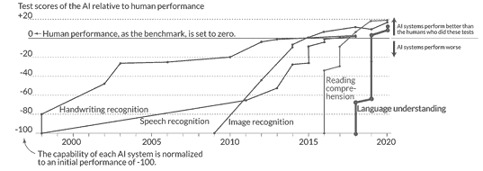

# 介绍

# 你的企业准备好参与这场新游戏了吗？

“我们来玩个游戏吧？”

——超级计算机乔舒亚

来自 1983 年电影《战争游戏》

ChatGPT 的发布——就在写作时间的短短六个月前——引领了一个重大的范式转变。在过去的十年里，人工智能在数据分析、文本和图像识别等领域取得了重大进展。然而，语言模型在这些其他智能领域落后，至少直到 2022 年底 ChatGPT 的重大发布。从那时起，许多其他生成式人工智能大型语言模型（LLMs）出现了，像谷歌和微软这样的巨头现在在这个新技术时代争夺主导地位。

诸如 ChatGPT 之类的语言模型的出现代表了一项前所未有的技术进步，值得关注。虽然每一代人都必须适应和管理新技术的影响，但 LLMs 代表了一种不同的东西。在短短六个月的时间里，这些模型使你公司的员工能够提升他们的能力和生产力，达到了以前难以想象的程度。然而，考虑到这些新工具的进步和潜力，传统中小型企业对这些变革性工具的反应却令人失望。尽管在新闻媒体中广泛报道，包括新闻、论文和播客，但企业对这些语言模型的实施和利用却极为稀缺。很少有公司采取任何有意义的步骤来利用这些工具。甚至更少的公司似乎意识到他们的旧流程、方法、手册和工具包现在需要进行相当大的改革。

令人鼓舞的消息是，这种范式转变为聪明、大胆的公司创造了大量机会，可以迅速获得显著的竞争优势。那些认识到这些改变的重要性并采取一些明智步骤来采用它们的公司，可以超越那些采用滞后的竞争对手。

请花一点时间反思这些工具取得的惊人进步，并真正领会它们所产生的深远影响：

仅仅六个月前，你公司只有少数几个人可能有能力写一部十万字的小说。如今，由于这些开创性的技术，你公司的每个员工都有这种能力，令人惊讶的是，他们现在甚至可以在一两天内完成这一壮举。

您的每一位员工现在也拥有解决复杂物理问题、通过律师资格考试并提供与经验丰富的律师不相上下的专业建议、通过医学委员会考试、编程计算机等能力。这个列表并非言过其实，我并没有夸大其词。仅仅半年前，我们无法想象这样非凡的能力。然而，随着 ChatGPT 的出现，一转眼间，您的每一位员工都被赋予了真正的超能力。

难道不合乎逻辑地假设它们为您的企业带来的能力也发生了巨大的转变吗？

如果您组织中的每个人——以及其他人——现在都能变得非常有能力和超级高效，那么那些未能迅速采用这些技术的企业不可避免地会被抛在后面，对吗？

此外，难道不合理地认为仅仅六个月前使用的旧策略、流程、工具和方法现在基本上已经过时，必须进行调整以适应拥有全新能力的员工群体吗？

这些进步带来的颠覆是巨大的。任何关于数字转型的最新书籍都已经过时，可以直接扔进垃圾桶。考虑将许多现在过时的销售和营销书籍也放在同一个圆形文件夹中。现在拥有这些超能力的团队需要的是与克拉克·肯特和吉米·奥尔森团队不同的策略。当一个人可以轻松“一跃而过高楼”，梯子就变得过时了。当一个人现在“比子弹飞得更快”时，即使是最快的汽车现在也只会拖慢他们的速度。使用像 ChatGPT 这样的工具，以前提供的速度和生产力的过时工具和策略实际上可能会阻碍今天的进步。是时候接受新的思维方式了。

大多数企业领导者简单地没有意识到 ChatGPT 已经如何以及多快地改变了游戏规则。他们必须看到并接受这样一个事实，即世界已经发生了重大转变，他们的公司和员工必须适应以保持相关性。此外，随着这些工具不断发展、变得更加强大和进一步整合，缺乏充分利用它们并将其纳入整个企业适应业务流程的知识和技能的企业和个人将不可避免地落后。迅速行动并利用它们提供的巨大潜力至关重要。

对于企业来说，制定正确的适应策略并快速执行至关重要的几个要素：

+   **有远见的领导力和紧迫感。** 企业领导者必须把像 ChatGPT 这样的技术的革命潜力掌握在手中，并急切地推动其采用。然而，许多领导者，特别是那些来自老一代人群，如婴儿潮一代或 X 一代的人，尚未亲身体验过 ChatGPT 的能力，并理解组织内部变革的紧迫需要。

+   **融入工作流程和流程重新设计。** 仅仅使用 ChatGPT 是不够的；它必须成为日常工作流程的一个组成部分，并且需要对组织流程进行彻底改革。这意味着重新定义期望，重设规范，并适应 ChatGPT 所提供的新能力和生产力水平。

+   **战略对齐。** 有效的 ChatGPT 采用不仅限于孤立的使用；它需要与整体业务战略进行战略对齐，包括其他数字转型举措和对新数字时代挑战的普遍适应。组织必须识别和解决与将 ChatGPT 纳入其运营中相关的独特考虑和挑战，确保支持更广泛的组织目标的整体方法。

+   **推动执行。** 执行变革性举措需要一种有纪律的方法，防止紧急的日常任务掩盖长期的优先事项。公司需要方法和框架来确保 ChatGPT 的实施和其他战略举措保持在正确的轨道上。

+   **变革管理和创新文化。** 领导者创造一种培育创新并赋予员工产生想法和推动 ChatGPT 实施的文化至关重要。仅仅采用自上而下的方法将阻碍进展；相反，企业必须鼓励自下而上的贡献，并拥抱伴随这种技术颠覆而来的大规模变革。此外，领导者激励和鼓励员工积极采纳和拥抱这些新兴技术至关重要。考虑到 ChatGPT 必然会打破已经形成的习惯和常规，可以理解许多人可能会发现适应有挑战性。

+   **持续演进和敏捷性。** 领导者必须认识到变革的速度现在已经急剧加快。组织必须为持续演进做好准备，因为 ChatGPT 和类似技术继续迅速发展。敏捷性和适应性对于在不断变化的市场中保持领先地位至关重要。

大多数公司不会采用这些工具的原因，至少不会足够快地实现竞争优势，以及为什么许多公司将被抛在后面，这是我们称之为“复杂系统问题”的原因。这六个因素中的每一个在其自身的权利上都是至关重要的，但有效的转型需要*所有*这些因素都得到落实。就像其他具有许多相互依赖组件和部分的复杂系统一样，公司实现任何*一个*这些因素的概率可能是合理的，但拥有*所有*这些因素的概率可能非常低（因为分数概率*相乘*在一起）。有效的 ChatGPT 采用需要全面协调的努力，所有因素都齐备，否则企业将无法充分利用这些工具的全部潜力。

我们这本书的目标不是概述 ChatGPT 的所有用途；即使是最厚的书也会显得太多，你需要让你的团队为你的业务生成那些具体的想法。我们也不打算提供有关询问或提示 ChatGPT 的指南；通用指南已经变得丰富且免费提供。相反，我们的目标是解决这个“复杂系统问题”——我们的目标是解决这些 ChatGPT 采用挑战的总体，以便读者能够调动他们的运营和人员，并推动在这个新时代取得成功所必需的所有因素。

*复杂系统问题* 的例子：如果成功转变需要满足所有先决条件，那么它们的分数概率将相乘。

关于这些工具的一点背景

ChatGPT、Bard 和其他 LLMs 代表了人类与机器交互的方式，因此也代表了我们将来如何访问人工智能和计算的所有其他能力。它们代表了技术的巨大飞跃和加速，指数级地扩展了计算能力和人们如何利用它。尽管主流知识分子和政治家终于公开讨论他们对未来的担忧，但这支牙膏已经挤不回去了。

理解为什么这些技术如此不同可能很重要，以充分欣赏这些工具取得了如此巨大的进步，而且未来还会有更多进展。人工智能的语言能力落后于其他能力，现在终于在迎头赶上。此外，最近语言能力的指数级进步将许多“狭义”人工智能能力（聊天机器人、语音识别等）和其他计算能力汇集到更“通用”类型的智能之下。这些能力的叠加产生了非凡的力量，而且速度非常快。

语言不仅使人类能够彼此交流，还能够思考——组织、构架和整理思想和观念。心理学家知道，说话或写作的行为带来的效用远远超出了简单的交流；这些行为在许多方面与思考本身紧密相关。虽然 LLMs 不像我们一样“思考”，但它们的输出具有惊人的效用。

从经验上看，它们的引入效果在随后迅速出现的范式转变中显而易见。全球最大的公司现在正参与激烈竞争，力争获得语言模型的主导地位，努力维护自己公司的持续相关性。随着这种程度的变化，您的业务受到的影响肯定会很大吧？如果这项技术如此颠覆性，以至于让谷歌和微软都感到恐惧和兴奋，那么它肯定会对您的业务产生根本性影响！考虑到其他当前威胁中小企业在 B2B 领域的力量，包括行业整合和其他市场扰动，这是一个关键时刻。

顺便说一句，这些新工具也必定会对您的客户产生巨大影响。

人工智能语言能力落后于其他“狭义”智能，但迅速赶上了。^(1)

这些工具在即时性上有所不同。其他新技术——你知道那些时髦词汇，比如*物联网*、*区块链*，以及所有其他大公司一直在推广的东西——通常带有巨大的价格标签，评估和实施可能会很困难。然而，关键的区别在于这些人工智能现在就可以使用，而且任何人都可以免费使用。实施的速度完全取决于您。您能多快行动起来推动业务发展呢？

ChatGPT 刚刚按下了游戏的重置按钮，事情将会发生非常快速的变化。新的竞赛现在是关于谁能将这些工具应用到他们的业务中。企业领导者必须开始推动这些技术的采用，不仅是为了即时生产力和竞争力，也是为了它们的学习和适应性所产生的复利效应。对于大多数公司来说，这些工具的采用将是一个更重要的成功因素，胜过任何其他考虑。您自己的投资、经济的发展，甚至您将做出的其他好坏商业决策，都无法与在这场新竞赛中取得领先地位的重要性相提并论。

以前——我是说从来没有——我们见证过如此巨大的飞跃，其中颠覆的速度就像翻开开关一样迅速。虽然以前的颠覆，比如计算机、互联网或智能手机最终都变得巨大，但没有一个是瞬间发生的。ChatGPT 的颠覆速度超过了我们一生中见过的任何事情，简直没有任何先例可以与如此巨大的转变相提并论。此外，这些工具不仅是免费的；它们还有能力取代目前大公司和顾问销售的许多产品和服务。重要的是要认识到，机构和思想领袖可能不会立即接受这些新工具，因为他们没有太多可获得的，但却有很多可失去的。

在许多方面，ChatGPT 的颠覆潜力类似于核武器，而过时的应对手册只能提供“躲避和掩护”的应对方式。领导者们被迫自行摸索和适应这一全新现象。然而，现在不是成为旋律的时候。现在是通过一些简单的方法，比其他人更聪明、更大胆、更不同来脱颖而出的时候。

在开始之前的最后一点说明：ChatGPT 是当今公共领域中众多生成式 AI 和大型语言模型之一。它已经成为这些工具中的“Kleenex”，在撰写本文时，它是最强大和功能最强大的 LLM。尽管我们在本书的其余部分将提到*ChatGPT*，但实际上我们指的是这一广泛且快速扩展的工具集合。

连接到视频和其他内容

企业领导者必须亲自看到这些技术的运作并亲身体验，仅仅通过阅读很难真正领会它们的巨大威力。为了促进这一点，我们在我们的网站上放置了几个视频，展示了 ChatGPT 的运作方式，并说明了本书中概述的示例。此外，读者还可以在本书中探讨的生成式 AI 和其他相关主题上找到更多信息，例如敏捷战略框架。

访问[www.digitalmoneyball.com/chatgpt](http://www.digitalmoneyball.com/chatgpt)，或使用下面的二维码访问这些内容。

**1** *来源：© The Economist Newspaper Limited, London, June 11, 2022\. 保留所有权利。*
