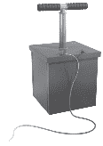

# 本书的路线图

# 重新思考您的销售和营销“机器”

在本书中，我将要求您将销售和营销运营视为一台机器。尽管有许多重要的人类考虑因素（我们也会探讨），但您的业务前端很像一台机器，因为它将组件（如人员、流程和工具）组合在一起，将输入（如资本和 OPEX）转化为输出（如新客户）。在机器内部，有许多复杂的子组件，就像汽车中的发动机一样，它们本身也是机器，具有自己的组件、输入和输出。

创新一台机器通常依赖于其部件的能力；机器必须考虑到其组件以及它们如何最佳地配合在一起以实现预期目的。有时，部件变化如此之大，以至于整体机器的设计必须发生根本性变化。例如，马车连接到福特 T 型车上毫无用处，即使是强大的内燃机也不适合现代特斯拉。干扰通常会促使对现有设计进行全面重新评估，并要求重新构想可能实现的新设计。

对于销售和营销，旧的前端操作手册可能曾经规定了一些使机器在短时间内运作良好的事物，但今天已不再相关。随着开关的翻转，机器的部件已经发生了根本性的进步。如果您的员工现在比一年前更有能力和更有生产力，那些旧工具现在可能实际上会束缚您。为了充分利用 ChatGPT 的优势，领导者不仅必须推动其采用，还必须彻底改革组织流程和工具，以适应人员现在非常不同的能力。

目录和路线图

在第一章中，我们将建立一个框架，以适应您的业务对 ChatGPT 提供的新能力。大多数领导者可能会低估组织流程和工具现在必须发生多大变化以优化生产力，特别是考虑到其他一些源自其他同时发生的干扰因素。我们将描述几个前端用例，介绍 ChatGPT 在业务中的力量，并开始概述 ChatGPT 的巨大效用。我们将开发一些关于如何重新构想前端机器设计的初步战略考虑。

在第二章中，我们将深入思考 ChatGPT 的连锁影响，并概述一些战略原则和考虑因素，包括基本采用考虑因素、创新前端机器的原则以及在业务中快速引入变革的一些重要考虑因素。

在第三章，我们将描述通用数字时代考虑因素如何影响 ChatGPT 的适应策略。不仅前端机器的部件发生了变化，而且考虑到后 COVID 数字时代的干扰，机器的输入和输出也需要重新考虑。我们将为机器建立修订后的设计要求。

在第四章，我们将根据新的设计要求和其组件的增强功能重新构想这台机器。尽管公司无疑会有符合自身需求的独特设计，但我们的目标是展示如何重新考虑流程、工具和结构，以充分实现 ChatGPT 的影响，并解释为什么战略考虑需要远远超出简单的采用。我们将提供许多公司可以立即投入使用的战略杠杆。

在第五章，我们将为规划和执行以 ChatGPT 为重点的转型策略提供一个合适的实用手册。当你无法将机器停机时，重建机器就会变得更加困难。虽然“机器”这个比喻为讨论策略提供了有用的背景，但转型中的人员方面至关重要。

在第六章，我们将总结一些结论和最终建议。在尾声中，领导者可能会发现作者撰写本书的经验对许多领导者和员工将面对的挑战具有说明性，因为他们应对这项新的、极具威力的技术。
