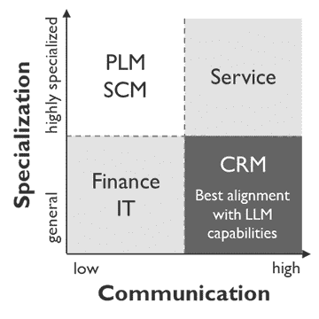

# 第一章

# 采用 ≠ 改编

“在创造性破坏的过程中出现了一些情况，许多公司可能不得不消亡，但如果它们能度过特定的风暴，它们本来可以活得更有活力和用处。”

—约瑟夫·熊彼特

ChatGPT 的适应性

考虑三种部署 ChatGPT 或类似工具的方法：

+   **公共。** 员工可以通过简单的网络浏览器执行大量强大的功能，并与其他软件和工具相结合，从而提高生产力。

+   **嵌入式。** 许多常见的软件工具将嵌入 LLMs 以改善用户界面并增强软件的功能。可以指望来自 CRM 和 ERP 系统到微软办公软件的工具在不久的将来嵌入这些新工具，因为许多已经开始了。

+   **本地。** 通过 API 接口和其他方式，公司可以采用这些工具的特定、本地化、经过训练的变体。

这些方法在成本、功能、数据安全性和定制化等方面存在权衡。然而，在本书中，我们将专注于使用公共版本，只需通过网络浏览器即可访问。在这个初级阶段，企业可以立即采用这个简单版本，同时也考虑将来可能整合不同版本的可能性。

像所有工具一样，这些工具也有它们的局限性。它们在输出方面也容易出现几个缺陷，包括产生看似可信的答案但实际上是错误的“幻觉”。此外，虽然 ChatGPT 在许多方面的能力令人着迷，但在简单数学方面却出奇地糟糕，计算容易出错。企业可以找到解决这些问题的方法来利用其巨大的能力，并指望这些问题很快得到解决——可能在接下来的十二到二十四个月内——使用多源验证和实施改进的计算协议等方法。随着真相和计算可靠性的提高，ChatGPT 将有能力在企业各个领域大部分取代许多销售、运营、财务和其他任务。与此同时，不要让这些真实的局限性掩盖这些工具目前可以提供的巨大效用。

ChatGPT 如何可以提升企业的能力？虽然使用案例几乎是无穷无尽的，但某些功能提供了更大的效用潜力。公共变体可能对客户关系管理（CRM，即销售和营销）和客户服务等功能最有益处，这两者的日常任务往往（1）更加以沟通为中心，（2）使用更广泛的技能和知识，以及（3）涉及更多非重复和创造性的努力，而不是习惯性、重复性的任务。特别是 CRM 将比高度专业化、不太以沟通为中心和/或更重复性的功能如供应链管理（SCM）或产品生命周期管理（PLM）等提供更大的初始采用机会。

尽管这些工具在提高当前任务效率方面具有强大潜力，但要认识到这些工具现在将使企业能够执行以前不可行或不经济的新任务。这意味着标准不仅仅会在生产力方面提高，还会在与客户的服务和互动水平、生产的产品和服务质量等方面提高。不要只考虑效率和替代当前任务。考虑这些工具如何促进创新，并为客户提供更高水平的价值。

ChatGPT 最初的应用最适合于销售和营销以及客户服务中的任务。

如果领导者能够意识到这些工具已经如何改变了游戏规则，他们也将意识到需要从根本上改变许多他们为了在市场上竞争和取胜而做的事情。适应这些新技术不仅仅是让员工尝试它们。领导者必须推动端到端的采用，同时重新调整规则和工具包，以利用新的能力来竞争和在新游戏中取胜。我们提倡的方法是一种全面的方法，不仅包括采用这些技术，还包括重新调整组织流程、工具和方法，以利用现在高效生产力员工的新能力。正如我们将展示的，ChatGPT 的采用和适应是两个完全不同的概念。

要充分利用这些新技术的力量并适应这种新范式，企业必须（1）采用这些新技术，（2）重新设计流程和工作流程，（3）重新设定生产力期望，以及（4）重构层级和组织结构。

适应的指南

1.  **采纳。** 在采纳的早期阶段，领导者将在启动过程中发挥至关重要的作用。采纳远非自然，公司需要一个强有力的动力来动员和快速行动。领导者需要计划自上而下和自下而上的手段来鼓励和推动采纳，这不仅是为了效率，也是为了学习和创新新的 ChatGPT 应用案例。许多旧习惯必须改变。此外，团队将开始培养“应用 ChatGPT”的元技能，这一技能已迅速超越几乎所有其他个人技能，以提高生产力。领导者必须点燃一个能够自我维持的采纳良性循环的势头。

1.  **重新设计。** 尽管许多领导者不可避免地意识到采纳的重要性，但他们可能不会意识到组织流程必须如何不同地定制以适应快速变化的新能力。领导者必须认识到，鉴于 ChatGPT 对员工能力和生产力的巨大影响，需要重新设计流程以实现 ChatGPT 的巨大潜力。传统流程将远远不足以发挥现在可以实现的效率和创新的全部潜力。

1.  **重启。** 以前需要几天完成的活动现在可能只需要几个小时，甚至几分钟。这将需要领导者和受影响员工对生产力期望进行严格的重新校准。领导者必须管理业务中的变化，同时使用推动和拉动、胡萝卜和棍子。虽然变革管理项目必须富有同理心，但也必须认识到对更紧迫的截止日期、更大的产出、拉长的关键绩效指标等的需求，这些都是生产力期望已经发生变化的信号。

1.  **重建。** 在较长的周期内，企业必须调整新的整体战略和战术。团队将如何利用他们新获得的大量额外时间进行业务中的其他重要活动？领导者是否期望团队有更高水平的产出？他们是否会将资源投入到其他创新的方式来提供客户价值？或者他们会调整团队规模，并利用这个机会削减成本？

    在短时间内实现大规模变革通常需要至少一个重大的步变和变革性举措。组织结构的变化和人员的转移可能是必要的。团队的活动和目标将发生相当大的变化，旧结构可能不再适应 ChatGPT 的干扰。结构调整还可以帮助促进这些必要的步变，并加快采纳和进展的持续速度。

正如您将在后面看到的，我们将使用敏捷方法来驱动较短的采纳-重新设计-重启周期的持续重复，制定每个大约持续一个财季的冲刺计划。"重建"步骤较少发生，需要更长的周期。

技术的发展速度及其对您的业务的影响对于传统的战略规划来说太快了，但企业仍然需要规划和管理变革。我们的敏捷战略框架将为领导者提供一种快速调整组织的方式，每个季度都会制定新策略并推动其紧急实施，并从以往活动中汲取经验，根据需要调整方向。这种规划和执行模式是根据新数字时代所需的变革速度量身定制的。

销售和营销的三个初始示例使用案例

要开始并了解一些 ChatGPT 令人惊叹的功能，我们将看看三个使用案例，这将揭示其转变销售和营销潜力的一部分。通过这些使用案例，读者无疑会建立联系并为企业的许多其他机会生成想法。ChatGPT 的应用范围广泛，涵盖所有功能。

当我们逐步解决以下三个使用案例时，我们将列出每个案例的几个更广泛的战略影响。领导者必须认识到破坏的程度，并开始在象棋游戏中考虑几步棋。如果您能通过利用 ChatGPT 来增强“销售和营销机器”的效率，超越更大的竞争对手，胜过他们更昂贵的系统和软件，会怎样？如果您能将作为中小企业的限制转化为优势呢？在我们继续进行时，请记住这些考虑。

我们强烈鼓励业务领导者在 ChatGPT 中应用这些使用案例。我们发现没有什么能替代创造令人瞠目结舌的体验和随后的紧迫感。

示例 #1：通过 ChatGPT 加速销售潜在客户

在销售领域，潜在客户开发是一项至关重要但耗时的活动。销售团队经常面临着在开发新业务机会上投入足够时间和精力的挑战。然而，随着 ChatGPT 的出现，销售人员现在有能力简化其潜在客户开发工作并提升新客户获取。通过利用 ChatGPT 的能力，销售团队可以以显著的效率提升创建、执行和监控潜在客户活动。这项技术有潜力将工作时间缩短 90% 或更多，使销售人员能够将宝贵的时间分配给其他重要任务和倡议。ChatGPT 的出现确实赋予销售团队加速增长并在获取新客户方面取得更大成功的能力。

作为我们对 ChatGPT 能力的第一个简单示例，我们将探讨如何利用它来创建、修改并发送量身定制的销售潜在客户邮件，从零开始并在不到一个小时内完成工作。

**开发内容（在十分钟内完成）。** 简化潜在客户过程的第一步是开发引人注目的电子邮件信息。销售人员可以通过向 ChatGPT 提供初始信息（如相关在线研究或从宣传册或其他宣传品中复制并粘贴的文本）来启动此过程。利用这些输入，ChatGPT 生成了初步的潜在客户电子邮件，可以进一步完善。

销售人员随后可以与 ChatGPT 合作修改电子邮件，并确保其侧重于特定的投资组合要素、价值驱动因素或其他相关方面。通过将电子邮件定位于特定公司或行业细分的目标，消息变得更加个性化和有影响力。为了迎合不同类型的公司或买家人设，销售人员可以创建几种核心消息变体，甚至可以独特定制每一条消息，利用 ChatGPT 的多功能性能。

**自动化内容创建和电子邮件（也在十分钟内完成）。** 一旦电子邮件内容得到完善，就是自动化潜在客户过程的时候了。从 Excel 中的潜在客户清单开始，ChatGPT 可以构建 VBA（Visual Basic for Applications）形式的代码，从指定的潜在客户清单中为每个潜在客户自动生成个性化电子邮件。ChatGPT 可以仅通过简单描述（大约五十个字）所需执行的功能来创建此代码。

有了代码的支持，新系统根据潜在客户清单中的特定指定或标准选择适当的电子邮件变体。它记录了诸如电子邮件日期之类的重要信息，并设置了下一步的跟踪目的，这些可以方便地在主要潜在客户清单中进行管理。这种自动化消除了销售人员创建和手动发送个别电子邮件的需要，节省了大量时间和精力。

**战略影响。** 在销售潜在客户中引入 ChatGPT 为企业带来了变革性的战略影响。最明显的优势是通过加快撰写文案、电子邮件、信函和其他形式的沟通过程而提供的巨大节省时间。以前需要数小时的工作现在可以在几分钟内完成，使销售团队能够更有效地分配时间。

此外，销售团队利用 Excel 等程序甚至编写自己的代码的能力使他们能够扩大自己的市场推广。每个销售人员都可以成为一个强大、可扩展和高效的资源，用于招揽和开发新客户。这有可能重新塑造销售和营销团队的期望，并需要新的整体策略以充分利用这些新发现的生产力杠杆。

**结论。** 销售前景是任何成功销售团队的关键方面，通过利用 ChatGPT 的能力，可以显著增强。通过简化创建、修订和自动化定制前景邮件的过程，销售人员可以实现无与伦比的效率提升，为其他创收活动腾出时间。这项技术的战略影响不仅仅局限于前景，还使企业能够充分利用销售团队的潜力，并推动客户获取的加速增长。在今天充满活力的商业环境中，拥抱这个新的销售前景效率时代对于寻求竞争优势的组织至关重要。

例子＃2：用 ChatGPT 革新面向账户的营销

在数字时代，客户不断受到来自销售商的电子邮件、电话和社交媒体请求的轰炸，突破他们的屏障并吸引他们的注意力变得越来越具有挑战性。为了在市场中脱颖而出，公司必须超越传统流程，找到创新的方式来吸引客户。随着 ChatGPT 的出现，企业不仅可以实现巨大的效率提升，还可以开发新的面向账户的营销（ABM）策略。ABM 是一种专注于通过个性化和定制营销内容和努力来吸引特定高价值账户的营销战略。ChatGPT 可以革新和扩展面向账户的营销（ABM）倡议，使公司能够大规模生成个性化内容，克服垃圾邮件过滤器，并与潜在客户建立更深入的联系。

**饱和时代。** 今天的客户已经被数字营销人员和广告商竞相争夺他们的注意力所饱和，这使得公司难以突破噪音并接触到他们的目标受众。客户保持警惕，传统技术可能不再有效地获取点击并确保销售会议。在这个后 COVID 时代，采用能够与客户 resonant 的创新方法至关重要。如果 ChatGPT 可以使公司轻松根据常见模板、客户特定数据和其他可用信息为特定客户定制内容呢？以前，实现这种个性化可能是耗时或昂贵的，但通过 ChatGPT，这变得很容易实现。通过为个体客户量身定制内容，公司可以克服垃圾邮件过滤器，并用独特而引人入胜的信息吸引潜在客户。

**基于账户的营销（ABM）和 ChatGPT。** ChatGPT 的能力不仅限于简单的写作和内容生成。它可以浏览大量在线数据，如年度报告和行业出版物，并确定特定行业、人物甚至个别客户的关键驱动因素。这些宝贵信息可以整理并存储在简单的 Excel 电子表格中，以便轻松查阅。

利用现有的营销资产，ChatGPT 可以将收集到的见解转化为基于账户的营销资产，使用可定制的模板，直接或通过宏。销售团队可以将这些内容纳入他们的潜在客户开发工作中（例如，作为个性化电子邮件的附件）。与昂贵的软件或系统不同，ChatGPT 可以使销售人员的个人风格得以包含，培养所有权感并增强参与度。

**战略意义。** 在个性化基于账户的营销中使用 ChatGPT 为企业带来了几个战略意义。首先，它引发了一个关键问题：个性化信息是否能超越自动化系统与标准内容的有效性？如果改进后的命中率和与潜在客户的互动显著，它可以成为当今广告饱和时代的一种更优解决方案。

营销团队还必须重新考虑其领导生成和新账户获取活动的方法。在 ChatGPT 有效创建和交付个性化内容的能力下，外包领导生成服务和 CRM 软件的成本效益比需要重新评估。

此外，ChatGPT 可以整合 PowerPoint 和 Excel 等通用软件的全部功能，自动化功能并替代其他昂贵的专业软件。这为简化操作和降低成本开辟了新途径。ChatGPT 使即使是经验不足的用户也能利用这一强大软件的全部功能，超越大多数用户通常利用的有限功能。此外，它允许用户*结合*这些通用软件的功能，这可能会更加强大。

**结论。** ChatGPT 的能力与基于账户的营销的融合彻底改变了公司在饱和的数字市场中与潜在客户互动的方式。通过根据客户特定数据、兴趣和决策驱动因素个性化内容，企业可以克服垃圾邮件过滤器，脱颖而出，吸引潜在客户的注意。战略意义重大，迫使公司重新思考其营销方法，重新评估现有系统和服务的有效性，并探索 ChatGPT 在利用通用软件功能方面的未开发潜力。拥抱 ChatGPT 赋予企业与目标受众建立更深层次连接的能力，最终推动更高的转化率，并在当今竞争激烈的市场中实现可持续增长。

示例 #3：释放 ChatGPT 在客户保留中的力量

虽然 ChatGPT 在通过增强潜在客户开发和个性化的基于账户的营销（ABM）工作中显示出显著潜力，但其在客户保留中的应用同样令人期待。公司必须超越其现有流程，并挑战自己找到在市场上脱颖而出的创新方式。随着 ChatGPT 的出现，曾被认为耗时或成本过高的概念现在已经变得可行，使企业能够利用数据和定制的力量来增强客户参与度和保留率。

**超越传统方法的思考。** 为了利用 ChatGPT 来提高客户保留率，公司可以将 ABM 中采用的技术与从 CRM、ERP 和服务记录中获取的内部客户数据相结合。通过将 ChatGPT 与这些数据源集成，企业可以轻松为个别客户创建定制内容包，包括常见模板、客户特定数据、关键绩效指标（KPI）、运营数据和其他易获得的内部信息。这些资产的目标是促进与战略客户的关键利益相关者进行销售讨论，每年每个账户达到一到两次互动。目标是提醒客户公司的表现，并强化他们最初选择该业务的原因。通过通过个性化内容建立更深层次的亲密关系，公司可以促进无与伦比的销售对话，并巩固其作为首选供应商的地位。

**释放潜力。** 现代 ERP 系统、服务系统和其他数据库包含大量有价值的信息，通常由于所需的复杂性和投资而被销售和营销组织忽视。然而，通过 ChatGPT，这些内容可以转化为客户特定的数据包，赋予销售团队进行定期讨论的能力，重点关注公司表现、KPI 和其他相关主题。通过采用有针对性的消息传递、playbooks 和推动这些讨论的节奏，公司可以发现隐藏的见解并解决可能会被忽视的问题。在保留计划中利用 ChatGPT 使企业能够利用宝贵资源并加强与客户的关系。

**战略影响。** 将 ChatGPT 作为客户保留工具引入对企业带来几个战略影响。首先，充分利用这项技术需要组织以非传统方式利用它——产生目前尚未产生的客户价值。通过培养创新文化并探索 ChatGPT 的全部潜力，领导者可以发现隐藏的能力并打开新的可能性。

此外，公司可能考虑其他方式，将他们的数据从“记录系统”转变为与客户“互动系统”。通过利用 ChatGPT，企业可以从销售、服务和其他系统中提取和利用埋藏的数据。在这种特定情况下，后端信息被更好地用于前端目标。

此外，利用 ChatGPT 进行创新将需要各部门之间的跨职能协作，例如前端销售和营销以及后端供应链管理，甚至可能需要 IT 的帮助。领导者必须认识到并拥抱 ChatGPT 带来的创新机会，通过超越界限并促进各种功能之间的沟通和协作。

表面下的冰山

效率和创新在整个企业中都是可用的，而这些前端示例仅仅是冰山一角。考虑一个培训部门，现在可以利用 ChatGPT 将 O&M 手册轻松转化为培训演示文稿，将这些演示文稿转化为测验，并将其汇总为移动应用程序和其他用于进一步吸引客户的内容。考虑一个财务团队，现在可以在短时间内构建电子表格和演示文稿，ChatGPT 在未来一年内的预期进展将在估值、财务报告分析等方面产生巨大的效率。考虑 HR 团队，现在可以轻松起草政策、新闻通讯等文件，或者提出复杂的法律问题并获得令人惊讶的准确答案。列举不胜枚举。

以下表格提供了一个简短的可能性列表，客户面向操作可以利用 ChatGPT 的强大功能。

| 销售 | 营销 | 服务 |
| --- | --- | --- |

|

+   编写和编辑电子邮件、信函等。

+   铅矿开采

+   客户研究

+   管道管理

+   创建报告

+   资产和内容的定制和个性化

+   分析导出的 CRM 数据

+   社交媒体帖子

+   组织任务、设定优先级和创建日程安排

|

+   内容创作：撰写文案，社交媒体等。

+   人物角色塑造

+   电子邮件模板和脚本

+   潜在客户开发

+   市场研究

+   竞争对手研究

+   强制执行和实施品牌准则

+   各种创意和构思努力

+   个性化和 ABM

|

+   呼叫中心培训和辅导

+   服务说明、纠正措施的制定

+   培训材料、测试和测验、语言翻译等的开发

+   从数据库和其他来源提取服务知识

+   创建现场服务和其他报告

+   各种新工具和服务的内容，例如移动应用程序，物联网等。

|

我们将提供 ChatGPT 在企业中的广泛应用的简短十二项通用列表：

+   **将**信息压缩成更短的易消化文本、表格或其他格式

+   **总结**大量信息并将其简化到适当的水平

+   **推荐**产品、服务等，基于评估的用户偏好

+   **计算和操作** 数据，包括执行 Excel 等程序的许多复杂功能

+   **分析** 数据并提取发现和建议

+   **抓取** 各种公共来源的数据（请注意，ChatGPT 数据目前仅追溯到 2021 年 9 月。）

+   **编程** 使用各种语言编写代码、宏等，从而使微软办公软件等软件更加强大

+   **撰写和编辑** 文案、电子邮件、信函、社交媒体帖子等

+   **翻译** 成不同语言或不同写作风格

+   **创建和构思** 在各种机会领域

+   **为** 非关键性请求提供专业建议（例如财务、法律、人力资源政策等）

+   **教育** 用户，回答问题，解释概念，提供示例，并提供更多资源以供进一步学习

主要要点

让我们盘点这些初始用例并得出一些初步的发现和原则：

财务影响

前一页上列出的应用程序扩展列表很长，但即使我们仅列出三个示例用例，也能实现一些严肃的效率。公司发现通过 ChatGPT 替代任务和传统执行许多活动的方式，至少在理论上通过价值流程映射和端到端分析，他们可以将 SG&A 费用降低 50%甚至更多，这并不罕见。

ChatGPT 的采用提供了效率和创新影响，远远超出其他更受欢迎的投资（例如，CRM 软件，它确实需要重大的初始投资和年度成本）。那么为什么公司如此愿意投资于昂贵的软件，但不愿意同样投资于实现 ChatGPT 广泛采用的巨大影响？传统智慧需要多长时间才能赶上，与此同时会有多少人盲目跟风？财务影响可能是巨大的，这是另一个强烈的信号，游戏规则已经完全改变。

重新利用销售和营销活动

鉴于 ChatGPT 对前端生产力的重大影响，您的销售和营销人员现在将如何利用他们腾出的时间开展业务中的其他重要活动？

你是否期望团队有更高水平的产出？他们是否会增加拓展活动以寻找新客户并发展业务？他们是否会使用 ChatGPT 从现有资产创建定期社交媒体帖子或扩大在社交媒体上的存在以增加对品牌的认知？

或者您会利用这个机会重建和/或减少 SG&A 以改善利润率或提供更低的价格并变得更具竞争力吗？

当这些影响可以立即实现时，您如何快速在您的业务中进行这些调整？

随着竞争环境趋于平衡，越来越多的公司采用 ChatGPT，竞争压力将使这些决定变得紧迫。我们建议现在就采取行动，提前做出这些决定将带来巨大优势。

重新设计和重启您的“销售与营销机器”

大多数六个月前的新客户获取 playbook 通常会推荐像营销自动化或潜在客户生成活动这样的大众市场技术，这两者通常是外包的，并且都使用技术来“拉动”，培养和确认新潜在客户。这些 playbook 还会推荐 CRM 系统用于数据结构化，吸引客户，运行分析，创建管理报告以及一长串其他承诺的好处。然而，这些工具的价值主张本质上包含了除了财务成本之外的责任。例如，CRM 系统在某些领域可能提供强大的效用，但它可能对销售文化有害，通常会将销售人员变成数据文员，并施加大公司风格的非增值工作。营销自动化在突破数字化为保护客户免受广告商饱和而创建的“屏障”方面存在困难（具有讽刺意味的是，数字化首先创造了这种情况）。

随着 ChatGPT 现在使销售人员超级高效，并且像 Excel 这样的工具变得越来越强大，旧有的假设需要更新。意识到游戏已经改变的聪明公司可以重新设计自己的机器，并调整它们以获得新的巨大能力收益。例如，公司可以构建一套直接推动流程，与更昂贵的方法、服务和软件相媲美，成本仅为一小部分，同时更好地吸引前端人员并克服许多与现代销售和营销相关的固有障碍。（我们稍后将回顾其中一些想法。）ChatGPT 现在使您的每位销售人员变得极其强大，而无需额外的软件，并且解锁了以前对中小企业不可用的营销能力。凭借创新的思维方式和对采用这些工具的一点投资，聪明的公司可以利用这一机会，只要他们愿意稍微改变思维方式。

此外，这一认识对您在服务、制造或产品开发方面的其他“机器”意味着什么？通过对这些机器的“系统”——即总体业务——进行一些战略性的系统设计变更，这些机器可能会更好地运作？领导者必须超越简单的采用，并意识到端到端的组织流程，playbook 和期望需要为新时代的能力和生产力重新设计和重启。
