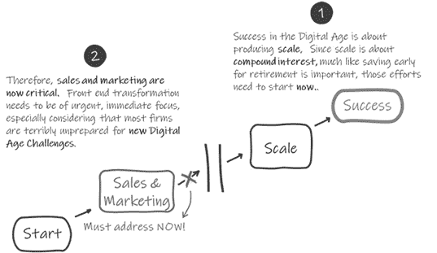
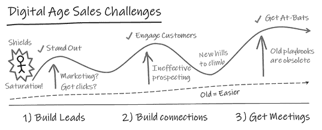

# 第三章

# 新设计要求

“如果外部的变化速度超过内部的变化速度，终结就在眼前。”

—杰克·韦尔奇，前 GE 首席执行官

数字时代的挑战：重新定义前端机器的设计要求

在第一章中，我们展示了为什么一个公司的销售和营销“机器”必须根据其新的、更强大的组件重新设计。然而，在我们将机器重新设计为 ChatGPT 的新功能之前，我们需要考虑可能影响机器整体设计要求的其他因素，包括其输入和输出。

销售和营销为 ChatGPT 提供了丰富的应用潜力。但更重要的是，大多数 B2B 公司在适应市场快速变化和不同客户行为（主要是由疫情后数字时代的变化引发）方面也远远落后。正是这种机遇和威胁的融合使得前端运营（通常）成为最适合首次专注于推动 ChatGPT 采用的突破口。

如今，许多公司根本没有意识到市场和客户行为在疫情后发生了多大变化，并且继续变化。领导者必须了解并考虑必须解决的众多主题，以在数字时代的新游戏中取得成功。为了描绘 ChatGPT 的全部机会范围，我们需要审视大多数 B2B 中小型企业今天面临的整体前端挑战。然后，我们需要评估 ChatGPT 在公司整体战略议程中的适应性：ChatGPT 如何融入整体数字转型战略？这一数字战略如何融入整体销售和营销战略？以及这一销售和营销战略如何融入公司整体战略？

在我们为销售和营销机器生成新的设计要求之后，我们可以看看它的新的、更强大的、ChatGPT-enabled 组件如何共同工作，以实现其更新的、数字时代的目标。

疫情后的销售

在疫情后的数字时代，销售游戏正在迅速变化，需要新的规则和新的策略才能取胜。中小型企业面临着长期存在的挑战和更为严峻的短期挑战，其中许多构成了严重威胁。

首先，数字时代是赢家通吃的时代，数字时代的长期成功完全取决于规模。这种现象远非理论，这就是为什么市场整合在许多 B2B 领域如此普遍。就像我们在无数 B2C 领域（如零售、汽车等）已经看到的那样，大型 B2B 参与者继续变得更大，而较小的参与者被挤压出局。要在赢家通吃的数字时代竞争，中小企业必须产生自己的规模。增长至关重要，这不是一两年后才能开始的事情。规模是关于复利的，就像早早为退休存钱是明智的一样，公司现在需要开始产生规模。

短期内，COVID 大大改变了公司必须使用的手段来接触客户，特别是新客户。后 COVID 时代看到了许多变化，比如继续拥抱远程办公的公司，因此确保销售会议变得更加困难。然而，最大的问题是数字时代是一个“饱和”时代。在过去几年里，主要是由于数字化，客户现在每天都被试图向他们销售东西的人用电子邮件、电话和社交媒体请求饱和。客户现在随时都保持警惕，数字化甚至帮助他们阻止了它所创造的相同力量。如果电话被识别为垃圾电话，大多数人不会接听电话。我们不查看垃圾邮件。我们不喜欢透露我们的电子邮件地址。我们通常不回答通过 LinkedIn 等社交媒体平台接触我们的销售人员。这些因素显著改变了销售人员现在必须如何接触和影响购买过程中的决策者。

要补充这些问题清单，许多公司的销售和营销在上一场战争中已经准备不足，更不用说随后更具挑战性的战争了。考虑一些在 B2B 营销中常见的挑战：

+   B2B 工业领域的大多数公司实际上并不做营销；他们根本不投资或优先考虑营销。预算主要倾向于销售团队。

+   大多数 B2B 营销还停留在一代或多代之后，有限的营销预算仍然投向展会、媒体广告、宣传册等。许多 B2B 营销手册甚至还没有适应前 COVID 的挑战，更不用说后 COVID 的挑战了。

+   今天的 B2B 营销已经因为太多 B2C 元素而变得无效，在截然不同的 B2B 世界中，这些元素是无效的，而且通常是有害的。

+   尽管 COVID 后发生了许多变化，许多公司甚至没有将最小量的 SG&A 费用（销售、一般和行政费用）或其他投资转移到适应新局面。

进一步考虑在 B2B 销售中常见的挑战：

+   优秀的销售人员价值连城。不幸的是，B2B 领域中太多人已经迷失了方向。令人惊讶的是，超过 90％的 B2B 销售人员从未读过销售书籍。大多数人不会“疯狂地寻找潜在客户”或者努力寻找和开发新客户。相反，如今太多的销售人员已经陷入成为接单员的陷阱；他们继续拜访同样的客户，丧失了专注于开展新业务的重点。

+   许多公司还没有适应新的销售游戏，其中获胜现在需要有效的虚拟销售，利用现代社交平台和产生网络效应，以及使用其他数字手段。那些技能不足且不善于使用技术的人必然会失去竞争力。

如果一个公司的销售与营销职能无法适应迅速变化的商业环境，并且在开拓新业务方面效果不佳，那么该公司将难以实现增长和可扩展性。在许多情况下，这最终可能导致公司的倒闭。关键是要认识到，在过去取得成功的过时工具和技术在今天这个动态市场中已经不再够用。

虽然数字化运营、客户服务和产品开发最终对公司是必要的，但通常销售和营销是最不为未来市场做好准备的部门。公司必须重新评估他们的销售和营销策略，并立即开始适应的过程。这要求转型从业务前端开始，因为市场推广策略是需要立即关注的最紧迫问题。

在制定战略时，通常有利于看一下起点和期望的终点，并逐渐接近中间。

今天的销售与营销挑战

简而言之，今天更新的销售与营销机制必须被设计成能够克服今天的信息饱和，突破客户屏障，并开展新业务以实现规模化。正如我们将看到的，ChatGPT 可以帮助实现甚至推动这些目标，前提是公司正确定位他们的转型倡议。

虽然这是一个复杂而深入的话题，让我们简化一下。当大多数 B2B 企业考虑获取新客户和早期销售活动时，目标通常非常简单：（1）产生优质潜在客户，（2）建立联系，和（3）获得初步销售会议。过去，这些事情比今天容易得多。如今，你需要克服一些严峻的挑战，并且需要使用一些不同的策略来适应新的局面。在今天这个信息饱和的时代，你如何脱颖而出？即使考虑到营销和销售数字能力的所有进步，这个问题并不一定是关于数字化的。

**(1) 建立潜在客户。** 假设一家公司实际上在市场营销方面进行投资，如何在今天这个饱和时代获得点击量？他们如何产生良好、高质量的潜在客户和销售机会？大多数 B2B 市场营销仍停留在一到两代人之前。

错误的技术使得在今天的饱和市场中无法脱颖而出。太多的 B2B 手册没有得到更新，仍然规定了在面对今天的挑战时与客户互动的无效手段，将重点放在大众市场技术上。今天的潜在客户生成和营销自动化工作在很大程度上受到客户屏蔽的阻碍。对于少数合格的潜在客户，让销售人员采取行动可能是一项徒劳的任务。流程已经高度依赖软件，并变得非常不人性化。

**(2) 建立联系。** 如今，大多数 B2B 销售人员不再充分勘探，许多人甚至根本不勘探。杰布·布朗��，畅销书《狂热勘探》的大师和作者，声称顶尖销售专业人员可以将 80%的时间用于勘探。你的团队是否能够做到这一点？

勘探本质上是一项艰苦的工作。此外，历史上销售勘探并不能产生在数字时代取胜所需的新客户机会数量。许多销售人员和公司接受了失败，以前一代人有效勘探的习惯和技能在今天的一代人中基本上已经丧失。

**(3) 获取会议。** 如今，获取销售会议变得异常困难。在 COVID 之前，销售人员可以在周三带目标客户吃午餐。然而，那位采购代理现在可能在周三在家工作……还有周二和周四。而在以前，你是在与“与同事共进午餐”竞争，而今天你是在与他们与孩子相处的时间竞争。

今天，潜在客户的时间更加宝贵。你如何能够说服潜在客户花费三十分钟宝贵的时间与你共度？更重要的是，你的公司如何在电子邮件、电话或社交媒体请求中脱颖而出，不被像其他数百家试图向他们销售东西的公司所忽视？

***

为实现这些早期销售漏斗目标的手册逐渐漂移到了大众市场方法，即使是对于 B2B 也是如此。重点放在了诸如印象、潜在客户数量等指标上。然而，大多数公司仍无法通过玩这种低概率游戏实现显著增长，销售通常被限制在与那些——凭借一点点机会——实际上愿意与他们见面的人进行非常有限的数量的机会性面对面会议。中小企业被降低到了两个同样不受欢迎的选择：（1）遵循旧的手册并接受与传统销售勘探相关的不足数量的机会，但更高的击球率；（2）应用新的数字中心、大众市场相关的手册；承担更高的成本；并接受一个悲惨的击球率。

幸运的是，正如我们将在后面看到的，ChatGPT 已经开辟了一些新的选择。

移除 B2C 的成分

作为一个重要的旁注，这将与我们最终的 ChatGPT 策略相关，有效的企业对企业（B2B）和企业对消费者（B2C）在营销世界中的实践之间存在明显差异。然而，太多无关紧要和无效的 B2C 成分不知何故地进入了 B2B 的播放手册。这些已经深入到我们甚至发现聪明、有才华的营销人员也在宣扬这些错误信念。为了提高营销的效果，我们需要将这些不良成分从配方中剔除。

作为一些关键的基本前提，B2B 营销需要考虑到通常不像在 B2C 中那样相关的力量，包括以下内容。

**“别人的钱。”** 在 B2B 中，支出动态与 B2C 不同。虽然消费者通常为自己花钱，但 B2B 涉及“为别人花别人的钱”，借用著名经济学家弥尔顿·弗里德曼的概念。这导致了购买标准的转变，其中质量和价值等因素往往被更个人的因素所取代。决策者往往面临额外的工作、变革管理挑战、达成共识的需要以及糟糕决策的个人后果的风险，所有这些都可能阻止他们采纳新的解决方案。个人成本与企业利益之间的脱节为寻求取代现有供应商的公司设置了难以逾越的障碍。

**损失厌恶。** 损失厌恶是行为经济学和前景理论中的一个概念，它在 B2B 决策中起着重要作用。人们往往对损失感到恐惧，而不是看重相当的收益。这种对损失的厌恶导致了不愿偏离现状。转向新的供应商或方法会带来个人风险，如声誉受损或工作不稳定，这些风险通常超过潜在的个人利益。对损失和相关个人风险的恐惧通常阻碍了 B2B 领域新行为或解决方案的采纳。损失厌恶和风险厌恶在 B2B 中都是比在 B2C 中更强大的力量。这种现实的后果是 B2B 中做出的决策不够理想，其中“不输”远比赢的可能性更具影响力。例如，我们中许多超过四十岁的人听过这样的说法：“没有人因为购买 IBM 而被解雇”，这个观念完美地捕捉了这种普遍的力量。

**底线影响。** B2B 决策者戴着两顶帽子：（1）个人的自身利益和（2）公司利益的代表。这两种观点通常有不同的决策驱动因素。虽然个人驱动因素通常优先考虑，但由后者视角主导的决策也必须得到解决。这些由逻辑、可量化的影响和底线驱动的决策。成功的 B2B 方法需要逻辑和情感的结合，吸引公司和个人的驱动因素。

公司经常将他们的销售和营销信息与 B2B 决策的真正驱动因素不匹配。以 B2C 的心态，他们经常将他们的产品和服务营销，就好像决策者对他们的产品或服务像对新车、手袋或高尔夫球杆一样在意。品牌营销在 B2C 中更为重要和有效，消费者更关心他们购买的产品。然而，虽然 B2C 营销在很大程度上依赖于情感联系和品牌认知，B2B 决策主要受个人损失规避和基于公司绩效的理由驱动。B2B 客户实际上更少关心产品本身，更关心它如何对他们个人产生影响和/或对公司有益。由于这些关键差异，潜在客户的引导和拜访在 B2B 中比品牌营销更为重要，尤其是对于中小型企业。

***

总的来说，这些重要的细微差别在销售和营销手册中变得不太被认可，而且在实践中经常被忽略。需要注意的是，这种趋势在工程主导型公司中尤为常见。有效的 B2B 销售和营销需要与 B2C 有着明显不同的方法。对于 B2B 决策过程，抵制变化、损失规避的主导地位以及关注底线影响塑造了决策过程。作为一个重要的结论，B2B 营销人员应该优先考虑潜在客户的引导和拜访，尤其是在中小型企业中。在现代化和重新调整他们的销售和营销过程中，企业必须理解这些关键差异，并确保这些原则成为他们战略的基础。正如读者将在下一章中了解到的，这个结论最终将影响 ChatGPT 的适应策略。

**数字时代的颠覆。** 在制定整体战略时，企业必须考虑到在数字时代变得更加威胁的许多新风险。就像我们在无数 B2C 领域看到的那样，B2B 的颠覆变得更加可能。

为什么任何理性的人会认为导致 B2C 世界完全颠覆的力量不会与 B2B 发生冲突，准备将其颠倒和横向翻转呢？以汽车市场为例。如今的汽车经销商与二十年前完全不同的商业模式，而 Autotrader、Carvana、CarMax 和 CarFax 等公司已经极大地改变了消费者购买汽车的方式，并给传统经销商模式带来了巨大压力。

正如其他行业所展示的，数字时代可以颠覆先前被认为不可触及的商业模式。福特预计到 2030 年，全球销量的 40%将是电动汽车，福特首席执行官设想了类似特斯拉（即“被颠覆”的）的 G2M 模式。“我们必须采取非议价价格。我们必须实现 100%在线化”，首席执行官吉姆·法利说。“经销商没有库存，产品直接送到客户手中。100%远程取货和送货。”

经销商曾经在汽车价值链中扮演着一个看似不可替代的角色，现在他们已经完全退出。为什么一个 B2B 中间商，比如一个工业分销商，不会担心遭受类似的命运呢？为什么一个产品 OEM 不会担心价值链被扰乱导致销售和利润率下降呢？

领导者们会受益于倾听来自汽车市场或其他许多市场的警告，这些市场如今正被技术完全颠覆（想想航空旅行、出租车、酒店客房服务、餐厅、实体零售商等）。“人们向人们销售”的时代已经在 B2C 领域被取代；如今我们大部分的商品都是从机器那里购买的（想想亚马逊）。为什么有人会认为 B2B 工业领域免疫于走同样的道路呢？

考虑一下今天对许多 B2B 行业构成威胁的常见主要力量，以及这些力量可能如何影响你自己的公司。

**市场整合。** 正如讨论的那样，整合力量正在将权力集中在新的、赢者通吃的游戏中越来越少的参与者手中——这种现象在数字时代的许多行业中越来越普遍。大公司正在以快速的速度收购公司，巨头之间的激烈竞争正在扰乱较小的独立销售商。数据显示，中小企业已经在许多领域受到挤压。

**在线零售颠覆。** 多年来，许多人一直在想，亚马逊是否会在其他传统的 B2B 领域发起进攻。在线零售部门的优势已经开始与许多传统 B2B 领域的客户期望重叠。数字商店、工具和技术已经成为更重要的购买标准，而在线零售部门的能力正在越来越符合为许多 B2B 市场提供服务所需的能力。在线销售商扰乱传统行业的威胁继续加剧。知名的数字玩家迅速在其整个企业中采用这些新技术，放大其回报并赋予他们转向在不久的将来扰乱其他行业的能力。再次，复利的力量显然在这里发挥作用，使得早期采用颠覆性技术的人在竞赛中走得更远。

**去中介化。** 数字化逐渐削弱传统经销商增值的相关性。物流的进步减少了对本地库存的需求，而数字工具自动化了复杂产品选择和技术支持。远程支持和自助选项变得更加可行，现代 ERP 系统降低了在少数供应商下集中采购的价值。此外，数字已经促进了各种 B2C 市场的直接面向消费者的转变，从经验上表明在 B2B 市场中也越来越可能实现相同的情况。总的来说，随着行业数字化转型，B2B 分销商和经销商面临着重大挑战，因为他们的历史角色在相关性上逐渐减弱。

**持续的供应链危机和其他余波。** COVID 带来了许多中断，其中许多仍在持续。例如，后 COVID 供应链危机导致某些行业的客户积极多样化其供应链以降低风险。卖家面临着客户多样化带来的威胁和机会。同时，创纪录的通货膨胀导致许多公司采取供给和需求方面的杠杆以减轻影响。随着对白领和蓝领劳动力的需求空前增加和流失风险，员工参与和人才留存已成为许多公司面临的主要挑战。这些问题，虽然目前正在稳定，但并非一时之间。

**增加的“fat tail”风险。** 在如此快速变化的世界中，“fat tail”风险大幅增加——即，不太可能发生的事件和与平均值的大偏差，有些人可能称之为“黑天鹅”和“灰犀牛”。除了数字化带来的混乱外，全球地缘政治力量正在迅速转变，迫使许多公司重新思考其当前的全球供应链战略。金融冲击的风险增加，企业活跃主义和其他商业趋势变得更加突出，国内冲突更加明显……列举不胜。尽管以前的冲击已经减轻了干扰，但下一次冲击的可能性仍在迅速增加。像供应链这样的系统的优化和紧缩，在正常时期提高了效率，但使现代系统在处理扰动方面的能力减弱，即使是较小的冲击现在也可能导致重大的破坏性影响。

***

中小企业必须诚实地评估这些力量，并预测它们最终可能如何影响自己的业务。在数字时代不断整合和混乱的市场中，大多数中小企业将属于以下三类之一：

+   **适配器。** 这些公司将启动一系列变革性举措，以适应并保持相关性，甚至在日益竞争激烈的市场中实现增长。

+   **被收购者。** 这些公司最终将被一个整合市场中的大玩家收购并吸收。

+   **收割者。** 这些公司将无法适应（或选择不适应），最终将逐渐消亡，最终被削减至当前业务的一小部分，或者最终被清算。

一个有效的战略家必须承认未来以及公司在其中的位置是不确定的。因此，在动态变化的商业环境中，选择是一个人的朋友。重要的是，公司采用能够考虑到这些数字时代力量的战略，并且允许根据市场演变、公司演变以及沿途学到的东西进行转向和适应。同样重要的是要意识到，无论你是哪种类型的公司，数字转型投资，特别是那些旨在利用 ChatGPT 的投资，提供了增强竞争优势、建立企业价值并确保未来持续相关性的最佳机会。

数字转型

数字杠杆，包括 ChatGPT 的采用，当然是产生规模和接触今天客户的关键。然而，根据麦肯锡和波士顿咨询集团的说法，数字转型倡议的失败率令人震惊，超过 80%。中小企业简直无法承受低于 20%的转型成功率，并必须避免常见的陷阱。

太多的公司认为今天的成功取决于成功的数字转型。我们鼓励读者以稍微不同的方式思考。在许多方面，*数字转型* 已经成为简单地“为未来做好准备”的委婉说法。在这方面，*数字转型* 意味着公司为了适应我们日益数字化的未来而定向的广泛、无穷无尽的杠杆。在其他方面，*数字转型* 的含义变得过于具体，暗示着一个局限于仅仅采用新数字技术，如软件和人工智能，包括 ChatGPT 的范围。这两种定义都不符合公司真正适应竞争所需的杠杆。

就像我们已经展示的 ChatGPT 一样，有效的转型要求企业做出超越仅仅使用技术本身的调整。这个原则适用于 ChatGPT 之外，并贯穿于所有数字转型努力。能够全面推动业务前进的领导者，考虑数字转型本身以及关键传统功能中的基础元素，将创造最具竞争力的组织。所有这些因素对于维持竞争优势和适应快速变化的游戏至关重要：数字时代的新游戏。为了取得成功，公司必须超越数字转型，将他们的整个业务目标对准面对数字时代挑战。领导者必须制定能够同时解决数字和基础元素的战略，并意识到仅仅添加数字杠杆很可能导致其中四分之四失败。

**基础元素。** 许多新的基础杠杆将需要适应新的数字时代挑战，就像在前一节中讨论的那样。其他被视为成功数字转型的先决条件的基础杠杆可以被看作是必要的。为了有效转型，关键是以全面的方式处理这些基础元素以及数字倡议。有趣的是，一个专注于数字转型的精心设计的战略计划，同时考虑基础先决条件，可以同时推动传统和数字转型。虽然为组织设立坚实基础的概念对许多组织来说似乎是合乎逻辑的，但在数字转型规划中见证其实施是非常罕见的。

这里我们开始意识到在 ChatGPT 策略中这一章的必要性。数字转型的普遍失败率使得全面的方法至关重要，这要求考虑之前在本章中概述的许多因素。只有将这些考虑因素排列起来，企业才能充分利用 ChatGPT 和数字转型的力量。

我们倾向于在许多类型的公司中识别一些常见的基础性差距，这些差距的解决方案可以包含在一个整体转型计划中。尽管细节可能超出了本书的范围，但一个例子可能会让这个概念更清晰。

**消息传递：有效前端数字转型的关键先决条件。** 许多 B2B 公司在消息传递方面遇到困难，这往往是由于缺乏对营销的重视或采用了无效的、受到 B2C 腐化的方法。一个有效的消息已经成为在当今饱和市场中吸引注意力、脱颖而出的关键基础。一个好的消息作为一个强大的工具，可以突破客户的屏障，吸引潜在客户，并推动期望的行动，比如安排初次销售会议。

B2B 与 B2C 营销的讨论与数字转型战略有什么关系，包括 ChatGPT？没有一个精心设计的消息，数字前端策略和战术可能会失败。数字工具——比如营销自动化甚至 ChatGPT——作为您消息的放大器。它们使您能够触及更广泛的受众并扩大您的推广努力。然而，如果消息不好，应用数字就像通过更大的放大器演奏糟糕的吉他独奏一样。这是一种垃圾进，垃圾出的情况。因此，您消息的内容和质量对成功利用数字渠道至关重要。这是许多（80%以上）数字杠杆失败的一个例子，也是失败的最常见原因之一：缺少基础先决条件。

无论您的目标是吸引注意力、建立联系、安排会议还是应对虚拟互动的挑战，今天您说的话比以往任何时候都更重要。一个引人注目的信息可以让您的公司与众不同，吸引注意力，并与潜在客户进行有意义的互动。它在数字转型倡议中发挥着重要作用，通过促进有效的潜在客户生成、销售拓展和客户互动策略。重要的是要认识到，在讨论消息时，它特指潜在客户生成和销售拓展，强调这些方面在 B2B 营销中的重要性，而不是品牌消息。这提供了一个例子，说明为了有效的数字转型，需要一种全面的方法。

**今天软件的无限选择。** 在人工智能时代，软件和应用程序的快速发展让企业面临着庞大的技术选择。每周发布数百款新应用程序，组织面临着选择、整合和有效利用这些工具的挑战。

技术领域中的*奇点*概念，即发展速度超过人类跟上的能力，对企业越来越具有重要意义。企业内部传统的决策过程往往比技术进步的速度慢得多，导致许多组织感到不堪重负，无法跟上步伐。诸如数据安全、IT 实施和共识需求等因素进一步复杂化了跟上软件市场快速变化的过程。

就像布里丹的驴一样，许多企业发现自己陷入了徘徊不决的循环中，不确定如何应对众多的技术选择。其他企业选择单一来源的方法，依赖于中央供应商，比如 CRM 软件提供商，来管理和整合各种软件工具。虽然这种方法可能带来一些好处，但往往代价高昂。其他公司已经落后太多，似乎不可能赶上，导致完全停滞和失败感。

ChatGPT 的出现有可能重新定义游戏规则。它挑战了复杂和定制软件堆栈是唯一解决方案的观念。相反，简单工具如 Microsoft Office 与 ChatGPT 的结合可以实现以前需要大量定制和/或专门软件才能实现的结果。这种范式转变为企业开辟了新的可能性，使它们能够通过更易传递、易获取和用户友好的技术实现目标。此外，所有权和文化考虑等因素可以进一步增强这种简化方法的价值。

旧规则认为自制软件不利，并需要专门的数据库来构建数据和获取洞见的规则不再绝对。此外，通过熟练运用 ChatGPT 以及多功能通用软件，并利用它们的综合能力，员工可以培养高度可转移和适用于各种任务和业务领域的元技能。这使企业能够利用超越专门软件限制的非凡力量，从而实现卓越的成果。

这些新规则使组织能够利用 ChatGPT 和其他通用应用程序的力量来简化流程，做出明智决策，并以更大的灵活性适应快速变化的技术能力。

**更新数字教科书。** ChatGPT 已经彻底改变了数字转型的概念，使许多现有的教科书变得过时。这为落后的企业提供了重要的机会。这就好像游戏的重置按钮被按下，为这些企业提供了一个重新开始的机会。通过抓住利用 ChatGPT 的能力和认识到其变革性影响的机会，落后的企业不仅可以赶上竞争对手，甚至可以超越他们。然而，要实现这一点，需要智慧的战略规划，专注和高效的转型和投资方法，并确保他们的大部分努力不会以失败告终。

不幸的是，对于许多企业来说，前端数字化转型仅限于表面性倡议，如实施 CRM 系统或从事数字营销。一些企业可能过早地转向使用某些具有非常复杂技术的应用程序，比如使用 AI 来识别可能的目标客户。然而，如果不考虑业务内部的基本要素，这些努力注定会失败。此外，忽视关键方面，如变革管理、组织文化和所有权，往往会导致员工的幻灭和脱离。此外，中小企业需要摆脱为大型企业设计的教科书和庞大解决方案，以及与之相关的浪费努力和投资。这些教科书变得太慢以适应。某些软件功能的价值迅速下降，许多功能从一开始就并不真正适用于中小企业。

长期塑造 B2B 思维的知名顾问们现在发现自己在面对这一巨大飞跃时正陷入自己的官僚挑战中。对于他们来说，越来越难承认他们最近发布的内容已经完全过时，甚至是在 2022 年。这一认识造成了一种空白，可能会持续一个不确定的时期，甚至可能延续数月甚至数年。在此期间，企业必须主动地独立导航适应这些技术的过程。传统策略将难以跟上这个快速发展的范式，因为这一变革性技术的后果以前所未有的速度展现出来。

请记住，与其他技术不同，ChatGPT 没有任何东西可以卖给你！ ChatGPT 是免费的，而且很可能会一直保持这种状态。像埃隆·马斯克这样的人公开表示，这些人工智能工具太强大了，不应该只由大公司和强大的人掌握，他是对的。还要记住，ChatGPT 实际上取代了许多强大公司今天向你销售的东西，例如 CRM 软件、营销自动化，或者来自大型顾问的书籍和服务。当这种零成本的新技术严重干扰他们强大的控制利益时，不要指望机构以任何速度适应。

调整前端机器

在第一章中，我们断言公司的“机器”必须重新设计，考虑到其新的、更强大的 ChatGPT 增强组件。现在我们知道了以前和新的后 COVID 数字时代条件、客户和市场之间的关键差异，机器的整体设计要求，包括其输入和输出，可以进行修订。

今天的挑战与昨天不同，公司将需要应对一些冲突：

+   规模至关重要，但大多数 B2B 销售和营销功能今天都不适应产生足够的规模。

+   营销变得更加重要以产生规模，但必须适应新的数字时代挑战，并克服当今的饱和。

+   销售需要产生新业务，但很少有人再进行充分的开发，也很少有人自己产生任何规模的推广。

+   数字投资在直觉上是关键的，但五分之四将无法产生足够的回报。

如果 ChatGPT 增强组件为机器的设计和输出开辟了新的可能性，会怎样？

+   如果公司能够将一些旧事物的优点，如个人关怀和人际关系，与新事物的优点，如通过数字化实现规模，结合起来，会怎样？

+   如果一家公司能够通过创造与独特客户需求和决策驱动因素相一致的独特、引人注目的信息，在当今的饱和市场中脱颖而出会怎样？

+   如果公司不再需要依赖垃圾邮件营销自动化和外包的潜在客户生成计划来产生足够数量的机会，会怎样？

+   如果，与其进行交接，营销和销售可以积极参与并通过每一个与每一个潜在客户和客户进行接触的步骤进行合作呢？

+   如果公司的 ChatGPT 采用策略能够全面地使他们的业务适应新的数字时代挑战，并满足那些经常导致数字转型倡议失败的基本先决条件，会怎样呢？

创新通常是通过以不同方式将类似的要素组合在一起实现的。几个世纪以来，手提箱和轮子一直作为独立的概念存在，但直到相对最近才有人巧妙地将两者结合起来。这提醒我们，创新常常在于重新构想现有的想法，并以新的视角创造新设计。那些能够拥抱智慧的远见，适应当前现实，并探索新可能性的公司有机会超越那些仍然受制于过时范式的竞争对手。

总的来说，我们可以更好地看到我们在“复杂系统问题”（引言中提到）中所面临的挑战，在数字转型的 80%以上失败案例中得到体现。公司如何避免与 ChatGPT 采用类似的失败率？公司如何采用全面的策略来应对这些新挑战——这些机器的新输入和输出，并利用 ChatGPT 来解决这些挑战？

**点燃变革。** 在我们谈论机器的所有内容时，也很重要关注人的因素。公司需要一个点燃的火花来启动变革，动员业务，动员人员。人们需要看到和感受到一些重大的事情——一些激励他们改变和适应的事情；一些让他们做一些不同的事情，比如获得新技能，改变行为，以及适应新的不同的游戏。领导者需要产生能够引发变革良性循环的快速成功案例，一系列努力的临界质量，迫使人们*行动*。

许多公司不知道如何在任何重要或有影响力的层面实现这一点。许多公司实施错误的、无影响力的杠杆。通常公司会看大公司在做什么或者麦肯锡等公司在推荐什么，然后他们会选择大规模的解决方案。看到公司认为是增量或递增的，而不是乘法或指数级增长（例如，他们经常会认为“增加一两个业务开发人员”来实现增长）。这些策略在数字时代中无法使业务发展得足够远或足够快。

其他公司做了一些正确的事情，但他们似乎无法将这些部分联系起来。因此，他们永远无法达到可以激励和推动人们的临界质量。人们需要一些重大而不同的东西，一些让他们“上车”的东西。这是变革管理所需的重要部分。很少有公司能够规划和执行正确的杠杆——简单、务实且可实现的杠杆。更难得的是，很少有公司能够将这些杠杆组合起来，达到一个可以诱发变革和转型的临界质量。

**战略线索。** 在制定他们的转型战略时，企业将受益于寻找能够以积极方向影响多个方面的杠杆。企业一次只能专注于那么多事情，对于战略家来说，选择正确的目标和举措以实现最大影响至关重要。

战略家应该寻求创建*战略线索*，这是我们用来指代能够一次或连续地连接和推动多个事物的杠杆的术语，就像一排多米诺骨牌。

寻找保罗·奥尼尔（1986 年至 2000 年担任阿尔科公司首席执行官）的一个很好的例子，展示了这种*战略线索*概念。在他任职初期，奥尼尔意识到阻碍公司发展的核心问题是缺乏标准化的工作和流程遵循。然而，为了确立重点并激励改进，奥尼尔并没有谈论流程。相反，他谈论了人员安全。奥尼尔通过对安全的不懈和坚定关注，成功地进行了变革管理，因为他知道流程遵循将是实现这一愿景的必要前提。值得一提的是，在 1986 年接任阿尔科公司领导职务至 2000 年离职期间，阿尔科公司的市值（所有股票的总价值）从 30 亿美元上升至 270 亿美元，主要是通过开发标准流程实现的效率提升。

就像奥尼尔利用安全来推动更广泛的良性变革循环一样，中小企业可以构建一系列战略举措来重新设计他们的销售和营销机器，并通过这样做来影响和激励组织中的人员采取不同的行为，并适应数字时代的新游戏。这种战略线索概念和人的因素在接下来的章节的理念和操作手册中都是核心。正如我们将继续展示的那样，ChatGPT 可以成为一个出色的线索，用来连接和推动多个杠杆。

修订后的设计要求

现在我们可以重新设计这台机器，考虑到这些新的设计要求，以及新组件的力量，可能还有一些特定于独特公司的其他因素。

考虑到今天的新治理规则，以下是针对中小企业的，考虑到客户、市场和技术的：

+   数字时代需要专注于产生规模。竞争激烈。增长至关重要。

+   因此，新客户获取至关重要，大多数公司将需要立即紧急重启其销售和营销。

+   需要新的销售和营销方法来克服当今的饱和状态。

+   旧的大众市场策略书和其他有害的 B2C 方法已经过时，至少对于以目标市场为重点的公司来说。

+   除了这些因素，公司必须考虑其他颠覆性因素和数字时代的力量，并将它们整合到自己的具体战略中。战略应该在不同情景下得到适当的对冲和灵活性。

+   数字化对于产生规模至关重要，但不仅仅是数字化。中小企业需要避免导致 80%以上数字化努力失败的陷阱。需要采取一种全面的方法，结合基础和数字元素。

+   大公司的解决方案已经过时。中小企业需要聪明、务实，有时甚至要有些粗糙。一般性文本将很难适应考虑到 ChatGPT 的新和非常不同的现实。公司将需要在很大程度上自行导航并打破现有规范。

+   公司需要将简单、可管理的杠杆机制结合起来，以激发变革并促使人们行动。

以及前端机器的新高级设计要求：

+   该机器将产生来自公司和个人的推广规模。

+   该机器将使用旨在生成和转化新潜在客户的拉和推技术。

+   该机器将优先考虑潜在客户生成和拓展，而不是品牌营销，并避免无关的 B2C 要素。

+   该机器将采用引人入胜且个性化的方式对客户和市场进行沟通，通过吸引独特需求和决策驱动因素的有影响力信息传达。

+   该机器将定期部署引人入胜、增值内容，以拉动并建立品牌知名度，为客户提供真正的增值，以抓住并通过销售漏斗培养潜在客户。

+   该机器将充分利用通用软件与 ChatGPT 的结合能力，从而构建高度可转移的元技能，适用于企业各个领域。

+   该机器将应用特定软件填补特定空白，而不是将“大型解决方案”铺设在整个功能上。

+   …同时，该机器必须在中小企业的实际限制内运作。

这些规则和要求通常适用于各种类型的企业或一般的营销和销售策略——广泛和狭窄的市场、推/拉和直接/间接营销、透明或不透明的市场、自愿或必需的产品和/或服务等。随着越来越多的企业采用 ChatGPT，可以预计这些要求将继续变化，因为饱和度可能只会增加甚至改变形式。然而，在此期间，愿意打破常规智慧的公司可以利用 ChatGPT 做一些不同的、非常有影响力的事情。

在下一章中，我们将定义这些新设计要求与 ChatGPT 打开的可能性之间的收敛，以便对如何安排部件、使用不同输入、生成所需输出以及重新设计机器以完成手头的新任务进行非常不同的思考。讽刺的是，随着新颖的数字能力变得明显更加重要，基础知识变得越来越重要？对我们来说，前端转型的基础从这里开始。
