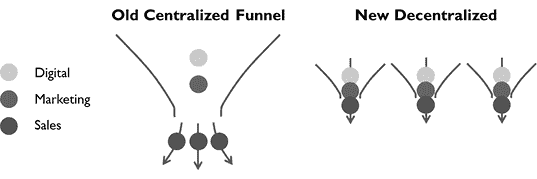
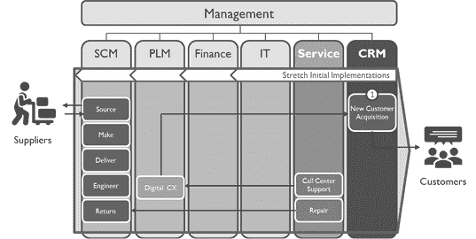

# 第四章

# 重新设计

“如果我问人们他们想要什么，

他们本来会说更快的马。”

—亨利·福特

重新设计机器：优化前端机器的设计

随着新的设计要求和新的组件能力的定义，我们现在可以着手重新设计机器的过程。这项努力涉及我们为机器的修订设计要求和进化的组件能力之间的三角关系，以便发现创新的新机会。通过评估不同的组合方式，我们最终可以为机器的新设计创新出一种成功的方法。

B2B 公司各种各样，几乎没有一个理想的前端运营标准处方。我们的例子将深入探讨适用于各种 B2B 公司的领域。然而，重要的是要注意，它们只代表可能性的一小部分。虽然我们旨在提供一些公司可以投入使用的真实见解，但至关重要的是要认识到，您自己的机器必须根据您独特业务的特定动态进行定制。通过类似的探索和应用创新思维，公司可以建立起新机会之间的联系，并找到利用它们的创新方式。

我们还试图展示更新前端竞争 playbook 的一般理念。在数字时代的成功中，一些古老的基本原则确实可以产生巨大影响。数字化越发展，像个人化关怀这样的经典元素就越能帮助公司脱颖而出并取得胜利。然而，公司仍需要利用新的数字能力来产生规模化的推广并高效、具有成本效益地执行。如今的成功方法是将新旧元素结合起来，将个性化关怀的优势与在数字时代有效性所必需的规模相结合。这代表了从以往 playbook 的非个人化、大众市场方法的根本转变。

上一代的前端 B2B playbook、结构和工具可以描述为集中化。中央营销工作负责产生和培养新的潜在客户。中央 CRM 系统管理着各种活动，并表面上将它们联系在一起。从那里，销售团队只是中央机器的本地执行部门，根据机器提供的潜在客户行动，并将信息反馈给整体监控和协调。中央销售经理确保这些人符合期望。

有趣的是，B2B 销售和营销是从一个更为分散的模式演变到这一点的。几代人以前，潜在客户开发是销售手册的一个重要部分，通常是通过冷调或甚至敲门来进行。销售人员会自行管理潜在客户和潜在信息，并具备从中筛选出好的潜在客户和坏的、好的潜在客户和失败者的技能。公司之所以演变到现代集中模式，很大程度上是由于技术及其实现必要规模的能力。换句话说，正是对规模的需求在很大程度上推动了围绕技术的流程、工具和等级结构的集中化。

考虑这样一种可能性，即来自直接前 ChatGPT 一代的自上而下流程、分工以及中央指挥和控制工具和结构现在可能成为绩效的障碍。就像昔日的大型机让位于更强大、更有能力的个人电脑和软件的分散网络一样，公司现在必须重新考虑其前端机器的设计。公司可能应该考虑更为分散、创业的方法，释放他们现在超高产的销售人员，并将他们变成最大的资产。要意识到现在销售人员可以自行产生规模，不再需要中央系统、技术或结构。此外，分散模式所实现的个性化——在使用集中方法时远不那么可行——已成为在当今饱和市场中脱颖而出的更大差异化因素。只有通过分散化，这些努力才能足够接近客户，对大多数公司而言才变得可行。

使用 ChatGPT 并充分利用本地、通用软件的销售人员现在拥有更强大、更有能力，流程现在必须承认这一新现实。此外，必须设定销售人员转变的期望，因为在这个新时代竞争将需要不同的能力和绩效水平，如果销售人员要赚取他们的报酬。组织结构必须促进在数字时代竞争所需的所有权文化和创业行为。能够将这些要素放置到位的公司可以开发出远远优于其过时对手的新机器。

我们将使用的工具来支持这种方法是我们讨论过的基本通用工具。像 ChatGPT、Excel、PowerPoint 和电子邮件，以及现代社交网络，出于许多原因，这些工具对这种方法都是有益的。我们将从中央 Excel 列表中驱动自动化和跟踪，这在销售人员使用中央专门系统时根本不可能实现。与在专门软件和系统中建立技能不同，我们将在工具中建立一些元级别的技能，这些技能将在许多其他领域提供效用，极大简化我们的数字和软件路线图。我们的分散式销售人员将像过去的几代人一样管理和执行，从而脱颖而出，但也实现了前几代人无法想象的生产力和结果规模。

作为一种说明，许多中小企业可能仍然落后于旧的分散流程，缺乏任何规模程度。对于这些公司来说，转型和适应显然至关重要。

我们将研究四个代表性例子，展示这些新原则和要求如何融合：（1）个人潜在客户推动，（2）社交媒体吸引，（3）增值营销，以及（4）自助式 CRM。将这些视为我们机器的新子组件。尽管公司可以单独使用这些示例，但实际上它们可以和谐地协同工作，通过采用个性化规模化方法，显著加速新客户获取和前端生产力和绩效。我们的目标是说明 ChatGPT 不仅可以增强现有活动和结构的效率和绩效，还可以作为一个催化剂，从根本上重塑销售和营销。

1\. 通过“个人潜在客户”推动提升。

经过提升技能的销售团队，现在配备了 ChatGPT 的巨大力量和通用软件的解锁功能，可以在没有旧的大众市场手册的固有限制和严格的自上而下、中央指挥和控制流程和工具的情况下更加有效。通过一点技能提升，销售人员可以成为个人潜在客户开发机器，甚至为他们的新目标潜在客户创建自己的个性化内容，以突破饱和。

我们将结合我们最初的两个用例（1）销售前景和（2）基于账户的营销。这些杠杆一起将使公司能够采用更个性化的方法来开发新客户，并且他们将使用 ChatGPT 来实现规模化。摆脱官僚主义流程和工具的束缚，销售人员将使用 ChatGPT 和通用软件如 Excel 和 PowerPoint 以各种方式吸引数百个潜在客户，并通过漏斗跟踪和监控他们的进展。通过分散这些努力，我们将活动移到更接近客户的地方，从而获得更优异的结果。

**推送与拉动营销。** 对于大多数公司来说，推送和拉动营销策略的某种组合将是正确的方法。推送营销技术——如冷邮件、直邮和广告——旨在积极接触客户并吸引他们的注意。另一方面，拉动营销技术——包括搜索引擎优化（SEO）、口碑和社交媒体——旨在吸引客户到品牌并发展和培养潜在客户。公司可以结合推送和拉动，例如通过拉动生成潜在客户并通过推送转化他们。

一家公司的理想营销方法受到各种因素的影响，包括市场规模和客户集中度、市场透明度、产品或服务的性质、客户购买频率、决策复杂性、市场渠道、相对规模、增长愿望和相对成本。这些因素都可以影响公司采用的推送和拉动技术的组合。

**旧范式。** 在先前范式的指导下，推动主导了，企业被告知要依赖潜在客户生成和营销自动化作为为销售团队开发潜在客户的主要手段。这种方法是基于自动化将简化营销工作并带来成本节约的信念驱动的。公司经常外包这些任务，认为外部提供者拥有更强大的能力，能够取得更好的结果。

我们需要认识到这种方法的局限性。营销自动化导致了通用和不够个性化的推广，其直接影响包括被忽视的电话或邮件被标记为垃圾邮件，最终导致潜在客户的整体低参与度。内容通常不足以克服饱和和屏障。销售团队接手，他们经常无法对潜在客户采取行动，很多时候是由于之前类似努力产生的贫乏和无果的潜在客户。此外，自上而下的流程和中心化的工具和系统通常导致文化问题，如低参与度和缺乏所有权。

与此同时，更为陈旧的公司仅依赖推送而不利用自动化的公司通常只能获得极少的机会，因为销售无法在不利用技术力量的情况下创造足够的规模。

**范式转变。** 新技术的出现，如 ChatGPT，在重塑新范式中发挥着关键作用。企业可以采用更为分散、个性化的方法。在新范式中，企业可以再次优先考虑人情味和个人互动。ChatGPT 可以使销售团队与潜在客户进行更深入的互动。然而，与旧的个性化方法不同，ChatGPT 使得今天这种方法可以规模化推动。

策略手册可能会发生显著变化，即使是对销售和营销角色进行全面重新考虑。与其仅仅依赖于集中式营销团队不同，即使是缺乏广泛软件专业知识的销售专业人员也可以定制和个性化资产，创造与客户独特驱动因素 resonates 的定制材料，主要使用 ChatGPT 的能力。这种思维转变允许营销和销售之间更紧密地对齐，定制资产的创建成为一种协作努力。营销的角色从一次性资产和线索的交付转变为与销售的持续参与，共同培养潜在客户和前景。在某些方面，销售可以承担一些营销职能。

总体而言，营销和销售将再次偏向推动式方法。销售人员可以利用新发现的能力来寻找并开发新客户，以个性化的方式超越传统广告、营销自动化或其他吸引技术的能力，同时也可以实现数字系统先前仅在经济上能够实现的规模性接触。

Excel 可以管理各种活动，包括线索列表和通过销售漏斗的进展。此外，这些 Excel 电子表格还可以存储有关各自线索的检索信息，以便个性化使用。关键是要意识到，通过利用 ChatGPT 的编程能力从 Excel 电子表格驱动自动化，销售人员可以以一种以前使用中心工具无法实现的方式将信息转化为内容和通信。

尽管这种方法的策略手册对各种企业来说可能会有所不同，但以下是一些公司可以采取的一般高层次步骤来完成这一过渡。

**提升销售团队的技能和能力。** 在开始这一转型之前，关键是要为销售团队提供利用 ChatGPT 的必要技能。加强对微软办公应用程序的熟练程度，强调对功能广度的了解而不是如何学习（例如，语法）。提供 ChatGPT 和有效提示技术的培训，包括 ChatGPT 和一般软件之间转换的技巧。教授编程的基础知识（“从零到一”），以便可以开发和在各种应用中使用宏。此外，通常还需要重新学习寻找前景的基本基础技能，以及在虚拟空间中进行销售的技能（例如，进行有效的在线会议），这应该为提高前景效率而发展。

培养一种激励销售人员寻找新客户并对绩效设定清晰期望的文化。销售人员必须意识到，他们需要变得更有能力来创建内容，有效地寻找新业务，跟踪和报告进展和结果。

**重新思考销售-营销动态。** 摆脱传统的销售和营销职能分离，并认识到每个销售人员现在都具备使用 ChatGPT 个性化核心资产的能力。通过重新评估销售和营销的角色和期望，企业可以利用每个团队的独特优势推动新客户获取工作。将内容开发更贴近客户，以增强相关性和影响力。

**结合个性化和传统的潜在客户开发。** 将个性化技术（如基于账户的营销）与传统的潜在客户开发方法相结合。这种组合可以创建高度针对性的潜在客户开发计划，在饱和市场中脱颖而出。

建立核心资产库。建立与特定行业、公司和/或买家人物属性相一致的个性化“维度”流程。利用 ChatGPT 通过将现有模板与独特的客户和行业驱动因素合并生成个性化的潜在客户开发内容。可以通过映射到潜在客户或潜在客户信息的标准宏轻松实现这一点。

**简化潜在客户开发机制。** 从各种来源获取成本效益的潜在客户名单，包括提供电子邮件联系方式的来源。无论好坏，今天几乎每个人的信息都是公开的，而好的潜在客户名单相对便宜。企业不再需要自己生成潜在客户名单，尤其是那些在目标市场中运营且已知客户数量有限的 B2B 企业的大部分。

根据销售人员的分配责任（如行业或地理位置），将这些列表分段，以优化目标努力。考虑修订销售责任和分段，以更好地促进对新定义领域的责任。

利用 Excel 管理潜在客户和维护潜在客户名单，存储个性化数据和维度，并自动化任务如电子邮件创建。与 Excel 的协同方法打开了这些可能性，这可能无法从中央数据存储库中实现。利用 ChatGPT 的帮助后续将数据整合到主列表和报告中，并愿意牺牲管理效率以换取由此产生的销售创业精神及其与客户的美妙影响。

**增强内容创建和个性化。** 销售可以利用 ChatGPT 的能力进行基础潜在客户研究，并从 LinkedIn（以及 LinkedIn 销售导航器）等平台中提炼相关信息。利用 ChatGPT 定义特定行业的更广泛驱动因素或结合各种信息领域，如个人和行业见解。使用低成本方式为每个潜在客户开发特定档案。销售人员能够个性化内容并定期培养联系，结果将更好。不要满足于偶然找到偶尔成功的低概率游戏。相反，通过认真准备，大大提高获得联系和最终销售会议的成功率。

通过将 ChatGPT 生成的见解与现有模板集成，构建新的潜在客户内容。利用 ChatGPT 和预定义模板构建有效的电子邮件和其他沟通信函。遵循最佳实践以避免垃圾邮件过滤器。

利用简单的 PowerPoint 而不是更复杂的图形编辑程序来创建定制和个性化的 PDF 资产。在 Excel、PowerPoint 和 ChatGPT 之间进行切换，使用宏和/或其他手段自动化潜在客户数据，将其转化为个性化内容。

**跟踪进展。** 更新每个潜在客户记录下的主列表，以跟踪互动。利用 ChatGPT 开发分析主 Excel 数据的宏，实现监控进展，获取宝贵见解，并相应调整潜在客户开发策略。在销售团队内分享宏和许多其他最佳实践，并通过文化而非必要工具促进协作。

强调对结果的责任，而不仅仅专注于推动绩效的活动。适当调整定期的个人报告要求。

**影响。** 将 ChatGPT 集成到销售潜在客户开发中引入了销售和营销团队的新操作模式，强调主动参与、个性化互动和定制内容。这种方法使企业能够区别于他人，加速潜在客户开发，并利用传统和可扩展元素。将 ChatGPT 与通用软件结合使用可以释放多样性，推动企业创新。它作为一种变革性工具，使企业能够克服市场饱和，脱颖而出，获得新客户，并在数字时代的前端运营中产生重大变革。

要以这种方法取得效果，销售人员需要付出努力。虽然顶尖销售人员已经经常进行潜在客户开发，但许多人将很难接受一个新的范式，其中潜在客户开发是他们角色的如此重要组成部分。然而，为了保持竞争力，企业的销售人员必须提升自己的水平。

许多领导人会选择采用当前人员和结构来实施这种方法，而有些人会选择通过结构性变化和相应的人员变动来实施（例如，缩减外部销售团队并扩大内部销售活动以处理早期销售漏斗活动）。我们稍后将在本章中讨论一些考虑这种结构性变化的因素。

目标市场与大众市场

对于那些怀疑这一概念的可行性的人，因为它与 ChatGPT 之前的 playbook 有所不同，可以考虑许多 B2B 公司在有限数量的已知（或容易找到）客户中运作。这使得有效的推动方法主要是动员销售团队，让他们意识到 ChatGPT 已经可能实现的潜在超高生产力，然后让他们利用这种生产力进行拓展和新客户开发。大众市场 playbook 是另一种已经腐化了许多 B2B 配方的 B2C 成分。

想象一下：假设一家中等规模的公司占有 1%的市场份额——无论他们的总可寻址市场（TAM）如何定义——并且假设他们当前业务的 80%来自他们前 50 名客户。市场很可能由类似的比例组成，这意味着可寻址市场的 80%来自大约 50 名客户 × 100% TAM ÷ 1%份额 = 5,000 名客户。如果公司有二十名销售人员，那么每名销售人员就有 250 名客户。当然，这些客户及其决策可能涉及 B2B 中的多个人或多个影响实体，但这仍然是每名销售人员可以管理的目标数量。为什么要投资于广告、营销自动化和其他拉动，当 ChatGPT 技术可以使销售人员利用当前工具有效地与这些有限客户进行拓展，使用大多数其他 playbook 无法实现的个人化接触呢？

记住，与让销售人员和经理了解市场和客户相比，拥有由软件生成的 CRM 系统中的市场数据更为重要。太多销售人员甚至销售领导人都满足于被数据包围，忘记了最成功的企业拥有了解企业当前和潜在客户以及做出决策的人员的人。如果一个销售组织变得如此官僚化以至于忘记了这一基本点，那么该组织很可能需要重新启动。

2\. 通过“社交媒体规模”提升拉动

除了以前的推动方法，许多公司可能寻求创新的方式来增强吸引力，包括提高品牌知名度和产生内部引导。然而，传统方法，如搜索引擎优化（SEO），往往无法产生预期的回报，考虑到显著的成本。社交媒体为建立品牌存在和吸引力提供了一个相对低成本、低投入的解决方案。对于 B2B 销售人员，利用个人社交媒体的互动已经变得对于扩大个人和公司整体可见性非常有价值。ChatGPT 的出现进一步简化了这一过程，并再次鼓励公司挑战销售和营销中的传统角色和责任。

在旧的范式下，社交媒体内容生成集中在营销部门，销售团队对社交媒体的使用方式各不相同。然而，现在明显地表明，个人社交媒体的互动比公司活动产生了更大的参与度。销售部门现在有了一个新的期望，通过他们自己的网络生成规模。

**增强社交媒体互动。** 通过将 ChatGPT 整合到他们的社交媒体战略中，企业为销售团队提供了许多机会，以扩大互动规模。销售团队可以利用 ChatGPT 轻松地重新利用现有的文章和材料，使内容生成变得轻松。这释放了时间和资源，以便专注于创建提供内在价值给潜在客户的吸引人主题，超越简单的推广。在 ChatGPT 的帮助下，销售人员可以在几分钟内生成引人注目的社交媒体帖子和文章，确保有一致的有价值的内容流。

销售团队可以接受关于首选平台的培训，比如 LinkedIn Sales Navigator，使他们能够充分利用平台的功能。通过启动围绕激励销售人员与客户互动的主题的吸引人的计划，企业可以启动这一过程并促进有意义的连接。利用 ChatGPT，销售团队可以轻松部署培训、技术材料和应用见解，使他们能够有效地与客户互动，提供有价值的内容。

**为客户为中心的内容合作。** 为了创建提供真正价值的客户为中心的内容，企业可以与其他关键职能部门合作，如技术支持和应用专家。ChatGPT 在重新利用现有的培训、应用、技术和其他材料方面非常有价值。通过利用他们的专业知识和见解，企业可以丰富他们的内容，提供有价值的行业知识、实用技巧和发人深省的见解。ChatGPT 在这种合作中充当了一个促进者的角色，实现了信息的低成本提取、脚本编写和内容创作。其结果是一个引人入胜的社交媒体存在，将企业确立为信息可信赖的来源，并加强与目标受众的联系。

**初始实施。** 为了创建一个有影响力的社交媒体活动并产生初步的平台吸引力，公司可以采用引人入胜的主题，强调他们为客户提供的价值以及使他们独特的地方。例如，一个本地经销商可以强调“家乡价值观”来展示他们的本地支持。一个原始设备制造商可以庆祝独特的产品特点，并以创意的方式展示产品功能，比如举办比赛或挑战。通过让员工、渠道合作伙伴和满意的客户作为倡导者参与，活动就会获得真实性，并在个人和企业社交媒体平台上获得更广泛的曝光。

例如，一个工业产品制造商最近开展了一项成功的社交媒体活动，主题是他们的产品如何在不到六十秒内与任何工业控制系统无缝集成。为了强调他们作为“易于使用”的竞争优势，他们组织了一个挑战参与者连接产品的比赛，最快的时间获胜。员工和渠道合作伙伴积极参与，制作了在社交媒体上分享的视频。这项活动不仅提高了品牌知名度，还直接吸引了客户，传播了产品广泛的集成能力和用户友好性。没有比展示真实客户更强烈支持你所销售的产品的更好方式了。这种经济高效的拉动策略被证明是实现多个目标的绝佳方式。

**将拉动与有效的推动结合起来。** 传统的潜在客户开发手册通常涉及向新潜在客户发送冷邮件或进行冷呼叫。即使在社交媒体上，卖家的最初互动也往往围绕直接销售推销或会议请求。虽然这些努力可能比没有好一些，并且可能会产生一些成果，但 ChatGPT 提供了一种“热身”这些联系并使潜在客户更愿意安排最终的销售会议的方法。

有了 ChatGPT，销售人员可以找到与潜在客户更好地发展他们的连接请求的共同点。例如，ChatGPT 可以使用 LinkedIn 个人资料（例如，从 LinkedIn Sales Navigator 复制并粘贴）来检测与潜在客户的共同点或共同兴趣，然后根据这些重叠来定制连接请求。通过监控潜在客户的公司和个人活动，后续消息可以集中在评论他们的帖子或参与他们公司的活动。通过保持最初的互动个人化和非销售导向，可以建立温暖和熟悉感，为最终的销售会议创造更有利的环境。这种方法超越了传统冷呼叫、电子邮件或连接请求的局限性。

ChatGPT 通过高效地扫描社交媒体活动并生成个性化消息，使销售人员能够以规模维持这种持续的通信。通过一些勤奋的潜在客户挖掘和利用 ChatGPT，一个销售人员可以以这种个性化方式与数百个潜在客户互动。与每个潜在客户建立几次初步联系可以营造温暖氛围，摆脱偶然相遇的低概率游戏，并通过有意义的个人联系积极创造机会。在当今虚拟世界中，这是销售新艺术的重要组成部分。

此外，创造增值内容为销售人员提供了另一种与潜在客户互动的途径，而不是直接“销售”给他们——即除了内容产生的吸引力外，它还使销售人员能够在推动努力中建立温暖。这种方法使企业能够结合技术，在规模上培养个人联系，ChatGPT 在很大程度上促进了这一点。

**影响。** 这种新方法产生了重要的影响，包括创造引人入胜的话题，超越传统广告，实现真实客户和产品/服务用户的个人和真实支持。它提供了一种低成本但有效的方法来增强市场拉动和推动。此外，企业可以利用社交媒体平台来借助潜在客户挖掘和其他努力，最大限度地提高可见性和参与度。

通过接受这种新范式，企业可以获得多重好处，包括提高品牌知名度，增强与现有客户的互动，获取新客户，并持续为新业务发展创造机会。销售人员可以再次以超强的推广规模建立人际关系。通过采用这种变革性方法，企业可以利用社交媒体的力量，释放网络效应，实现增长。

3\. 增值营销内容

价值增值内容不仅仅是广告，还提供给客户实用性、见解和教育。例如实用技巧、操作指南、案例研究、专家访谈和发人深省的文章。这种类型的内容直接解决客户痛点，赋予他们宝贵的知识和技能。通过超越表面层次，价值增值内容将品牌确立为可信赖的专业和指导来源。它建立信任，促进互动，并将品牌定位为行业中的宝贵资源。最终，价值增值内容还旨在增强客户体验，解决问题，并激发明智的决策。

要开发这样的内容，利用我们之前讨论过的两个指导原则：记录企业知识和记录/互动系统。认识到使用 ChatGPT 的新能力，既可以收集信息，又可以将其从后端操作转化为引人入胜的面向客户的内容。尽管这些内容以前需要更多的时间、金钱和资源投入，但 ChatGPT 使其变得更加容易和可行。

例如，企业通常设有提供技术支持信息的呼叫中心。然而，许多企业未能充分记录这一宝贵的见解来源。现代技术简化了目录编制过程，允许口头信息转化为书面形式，并通过 ChatGPT 进行润色。通过使用 ChatGPT，企业可以轻松地将这些信息组织成文章、视频脚本或其他形式。进一步利用 ChatGPT 的效率，这些宝贵资源可以通过博客、社交媒体帖子、视频和其他渠道定期积极地吸引客户。

考虑将焦点放在行业相关主题上，而不仅仅是产品本身。涉及到在您的行业中突出的相邻或相关主题，或者提供您领域的见解和专业知识。考虑技术主题，比如解决常见用户挑战或技术障碍，或者考虑可以使商业买家或决策者受益的商业主题，比如成本节约或风险缓解。将您的内容与目标受众的需求和兴趣保持一致是关键。

技术，包括 ChatGPT，使制作引人入胜的视频变得更加容易和可行。ChatGPT 简化了脚本编写过程，视频软件的进步以及社交媒体视频的放松标准使各种人员更容易创建简短而引人入胜的视频。视频已成为消费信息的首选媒介，社交媒体使公司能够与更广泛的受众分享这些信息。通过始终采用这些策略，企业可以增强客户与其品牌、产品和人员的互动，促进员工更大程度的参与。正如前面提到的，这些内容可以通过新的推拉手册进一步吸引客户。

实施这些实践可能需要自上而下的指令。领导者需要引入新流程，要求记录服务支持、销售和应用支持或其他业务方面的文档。通过研讨会或跨职能协作，公司可以探索利用现有和易于检索的信息的创新方式。

在当今世界，将粗糙概念精炼为完善内容的过程得以革新，这要归功于 ChatGPT 卓越的能力。凭借其先进的能力，即使是混乱和错误的文本也能轻松转化为精炼的散文。无论是将服务数据库中的笔记转化为专业客户报告，还是将音频录音转化为精炼的书面文本，ChatGPT 都是轻松精炼内容的关键。它具有将粗糙想法转化为引人入胜的文章、引人入胜的脚本、迷人的帖子以及许多其他吸引客户的方式的能力。

4\. 自助式 CRM

随着销售和营销的重新定义，现在采用更个性化的方法来发展业务规模，这需要重新考虑用于组织和支持团队活动的工具。此外，中小型企业没有较大组织的官僚主义和拖累，也不需要与大公司常见的 CRM 工具中突出的报告管理需求或其他功能相同。ChatGPT 可以重新定义旧范式，并使企业能够利用简单软件的力量推动成本效益的转型。

**旧范式：复杂工具和分层报告。** 传统上，企业依赖于复杂的、专门的软件来进行全面的客户关系管理（CRM）活动。这些工具以自上而下的分层方式管理活动、销售活动和报告。然而，这些工具的复杂性经常阻碍了有效的实施，许多中小型企业由于其巨大的成本和集成的破坏性特性而无法或不愿利用这些系统。

**挑战：CRM 工具的成本和价值。** 对于那些实施了这些系统的公司来说，高昂的价格标签、巨大的实施成本，甚至有害的文化影响往往超过了实现的任何真正好处。这些系统宣传了一系列可能乍看起来吸引人和有用的功能。然而，对于中小型企业来说，现实往往大不相同。他们经常发现自己为一大堆功能支付昂贵的费用，其中大多数功能很少被使用，甚至从未被使用。用户留下了一个臃肿的工具集，其中大多数功能未被使用，无法有效地满足他们的特定业务需求。

对于中小型企业，CRM 系统可能类似于一个杂乱的瑞士军刀，其中有许多在日常运营中没有多大用处的工具。虽然全面软件解决方案的诱惑可能很诱人，但往往会导致不必要的开支和资源浪费。中小型企业最终为整套功能付费，却发现他们主要依赖一小部分基本功能，而其余功能则闲置。换句话说，由于人们现在已经接受了这些工具的培训，成本已经沉没，声誉岌岌可危等等，公司最终继续使用这把钝剪刀的瑞士军刀。

**新范式：拥抱简单和个性化。** 随着 ChatGPT 的出现，CRM 软件的规则已经改变。企业现在可以探索一个充分利用通用软件巨大力量的新范式。通过 ChatGPT 的增强，像 Microsoft Office 和其他通用应用程序这样的广泛使用的工具组合可以实现以前需要大量定制软件的结果。重要的是要了解，大多数中小型企业不需要管理庞大的销售团队或大量的活动。即使是较大的公司也可以通过适当地将业务细分为较小的团队，并更加关注个性化来开启新的可能性。在这些设置中，简化的软件解决方案可以在很大程度上取代复杂和专业化的工具。

**实施：释放 ChatGPT 和通用工具的力量。** 为了有效利用 ChatGPT 和通用工具的能力，企业需要采用以结果为导向的销售报告和跟踪方法。可以使用 Excel 跟踪潜在客户活动，实现个性化方法，并培养对结果的责任感。通过详细的笔记（可以通过语音笔记和转换捕获），以及对本周计划和潜在客户分析的提示，可以提供有价值的见解，帮助规划和指导销售活动。对于定期报告，可以结合常用模板使用 ChatGPT 来生成所需格式的报告和图表。

**影响。** ChatGPT 和通用工具的整合使企业能够替换专门软件，实现成本节约。此外，这种方法促进了可以应用于各个领域的非专业化元技能的发展。最重要的是，一种以结果为导向的负责任文化得以形成，赋予员工任务的所有权。通过消除非增值工作，企业可以简化其运营并提高效率。

拥抱 ChatGPT 和通用工具的力量为中小型企业带来了显著的好处。成本节约、培养多才多艺的技能以及建立一种负责任的文化只是其中一些积极的结果。在快速技术进步的时代，企业必须重新评估他们对软件利用的方法，并考虑复杂工具的价值主张。通过充分利用 Excel、PowerPoint 和电子邮件等工具的力量，ChatGPT 提供了一种变革性的解决方案，使企业能够以更简单和更具成本效益的方式实现类似的结果。

拥抱全新的前端机器设计

通过 ChatGPT 实现的这四个新的“子组件”，我们机器的设计现在可以清晰地遵循其他机器和系统中清晰表现出的趋势，以提高效率和生产力，其新的外观和功能不应让我们感到惊讶。现在，就像计算和发电一样，我们的机器以去中心化的方式运作更好。就像您口袋里的单一电话取代了许多其他专门工具一样，一组功能强大的通用软件—现在可以充分利用的能力—可以取代许多专门应用程序。正如颠覆性创新让创新者重新想象其他类型的机器和系统一样，ChatGPT 的颠覆性让我们重新想象 B2B 销售和营销。

一种由 ChatGPT 实现的 B2B 销售和营销的去中心化方法

尽管领导者现在应该认识到 ChatGPT 在任何现代前端播放手册中扮演关键角色的能力，但这四个设计杠杆是互补的，展示了充分实现 ChatGPT 潜力所需的互联思维。尽管它们可以独立实施，但它们可以共同努力引入销售和营销的新范式。它们消除了现在过时播放手册中的一些限制和负面折衷：

+   集中化的方法和命令与控制的流程可能会导致机械化、参与度较低、能力较弱的销售人员，他们可能无法利用 ChatGPT 强大的力量来扩展自己。

+   像 CRM 系统这样的中心化工具可能会扼杀企业家精神，同时又几乎没有真正的价值回报。堆叠层层工具会带来复杂性，锁定软件供应商，并带来巨大的成本。

+   集中化的方法使个性化变得困难，因为中央团队和软件有限的能力无法真正理解和个性化内容以满足大量可用潜在客户，这妨碍了您在当今饱和环境中穿透客户屏障的能力。

+   由于大多数 B2B 公司的销售、一般和行政支出预算主要是销售权重的，这导致这笔钱的使用非常低效和无效。销售是一场低概率的游戏，依赖于偶然相遇而不是积极创造机会。

摆脱这种被动的方法。主动出击，创造机会。采用一种分散化的方法——在销售和营销之间重新分工，充分利用通用工具的全部功能——可以显著加速绩效。

+   使用 ChatGPT 使超高效的销售人员具备扩展能力，以规模化进行潜在客户开发，使用定制资产来克服饱和，将这些资产创建在更接近客户的节点上。

+   创建像顶级销售人员一样行事的团队。认识到明天成功的销售组织将需要符合这一不同期望集合以谋求生存并保持相关性。

+   拥抱一种新的工作分工模式，其中营销和销售进行协作，而不仅仅是简单地交接。

+   培养使用由 ChatGPT 增强的通用软件的习惯和元技能。拥抱它们在内容创作、潜在客户管理和跟踪以及其他功能方面的潜力，以增强您的销售工作。意识到它们的综合能力远远超出专门软件的功能。

+   简化您的数字转型路线图，超越无尽的软件选择，放弃典型的“拼凑”数字战略，并将工具量身定制给人（而不是相反）。

+   推动有效的前端数字转型，并调整前端运营以应对数字时代的新挑战。

这种转变不需要立即发生，尽管立即的步变是完全可能的。就技能提升而言，存在一种良性循环的方面——初次尝试应用这些概念可以创造一些初始的新技能，这些新技能有助于培养不同的行为，这些行为创造新技能、新行为等等。

尽管对许多销售人员来说，这可能看起来是一个艰巨的转变，但要放弃对 ChatGPT 之前能力的旧视角。记住销售人员现在拥有的新能力，并记住以前一代非技术增强的销售人员在潜在客户开发和潜在客户管理方面基本上是自给自足的。在过去的几年里，这基本上就是*销售所做的事情*，只是规模较小。设定期望，并使这些可能性变为现实。从纯粹的技能提升的角度来看，仅仅投资几天的培训和销售增能——比如在年度销售会议上——可以为销售和营销的长期重塑奠定基础。

**大公司，灵活流程。** 尽管新的机器设计可能是新旧结合，也可能是一些更好的大企业实践与中小企业实践的结合——即大企业传统上追求的规模和中小企业经常采用的个人化方法。

一般来说，传统的大型企业意识到，在数字时代竞争，他们需要去中心化。例如，在数字时代，传统的企业集团已经灭绝，他们的首席执行官经常将较大的公司分拆为较小的独立实体。在 COVID 后，GE 的拉里·卡普尔将这个曾经不可阻挡的巨人分拆为多个较小的运营公司，而西门子的乔·凯瑟尔在几年前执行了类似的策略，将这家德国工业集团分拆为他所称的“一群较小的船只”。除了资本市场的操作，这两位首席执行官的目标都是使他们的公司更快速、更灵活，以应对不断逼近的数字玩家和低成本竞争。

将这个概念深入组织，并考虑即使是较大公司的业务部门也可能去中心化运营以变得更加灵活是合理的。我们认为，业务部门将受益于采用这种个性化方法，甚至以类似的方式部署它。通过正确的业务细分，他们也可以建立拥有参与度高和创业精神的销售文化。与大公司中央指挥和控制流程和系统相比，ChatGPT 提供了实现卓越效率和绩效的能力。尽管这些企业中的固执领导者可能认为打破传统接受的方法和规则是异端邪说，但具有批判性思维的人可以通过新的去中心化工作流程和新的配套组织结构的正确组合实现卓越的结果。

**定制你的方法。** 我们概述的方法远非一刀切。虽然许多公司会发现，如我们所述的方法与他们自身的需求很好地契合，但有些公司可能希望采用不同的方法。然而，无论公司的方向如何，它们可能会发现我们的建议仍然具有一定的实用性。例如，即使一家公司仍然希望利用大规模营销（也许他们的可寻址市场广泛且未知），增强内容生产或销售能力仍然是 ChatGPT 可以显著加速生产力的方式。这些技术可以应用于产品或服务业务，产品或项目为中心的业务，以及直接或间接的市场渠道。 “规模化的个性化”是一种普世的方法。

此外，这些真实的例子展示了公司必须超越简单的采用，而是考虑 ChatGPT 如何影响流程、工具和结构。希望采用另类市场进入方式的公司可以从他们自己的“设计要求”出发，制定自己的策略。

**增加额外的杠杆。** 随着企业认识到 ChatGPT 作为全面转型的催化剂的潜力，他们还可以整合其他对数字化转型至关重要的互补元素。正如之前讨论的，成功的数字化转型需要一种整体方法。将基础和数字组件视为分开的是一个常见且有害的错误。请记住，数字化倡议通常依赖于或至少与业务基础方面的转型相连接。相应地制定策略。

重构前端组织

前端协议的持续变化促使重新考虑现有的组织结构。随着期望值的变化，一些人可能会被抛在后面，无法适应。流程将需要进行重大修订。支持团队执行的工作可能会更加自动化。领导者很可能会发现，旧的结构调整到旧规则和旧做事方式的结构现在必须被重新塑造。企业领导者最终将达到一个拐点，他们必须改变组织结构以释放生产力和创新收益。

随着传统的营销和销售之间的界限发生变化，期望值改变，以及旧的技能集与新的功能要求不匹配，领导者必须以不同的方式调整组织结构，以促进适应性、提升技能、新的功能协作模式以及整体转型。公司将面临升级技能和改组现有团队和人员的角色和责任，或者采用新的结构以促进优化工作流程、对齐团队目标和降低成本的选择，也许伴随着人员变动。对于大多数企业来说，很可能需要两者结合起来。

考虑一些可能促使需要不同组织结构的因素。

**业务细分。** 正如讨论的那样，一个正确细分的业务可以为规模化的更个性化的客户接触铺平道路。团队文化可以调整到一个新的范式，销售人员采用分散的、创业的方式进行新客户获取。为了促进这一点，领导者可以采用更为分散的组织结构，让较小的团队负责解决市场的特定地理和/或定义的垂直细分。此外，这些团队现在可能会更加垂直整合支持团队，甚至产品和/或运营团队，以促进更多客户价值的生产和提取，主要使用之前讨论过的许多新的可用杠杆。

**虚拟销售。** 随着后疫情时代的销售越来越多地发生在虚拟空间中，外部销售团队将发现自己花更多时间在办公室（或家中）进行远程客户呼叫和虚拟会议。在后疫情时代，转向虚拟销售对于效率和可扩展性至关重要。即使在早期拓客阶段，擅长虚拟空间的销售人员也可以实现显著的效率提升。然而，重要的是要认识到，在虚拟空间中，旧的销售策略很大程度上是无效的。客户的注意力较少，传统方法如建立关系或讨论痛点已不再奏效。吸引潜在客户需要在短时间内抓住他们的注意力，并以不同的方式保持。

这种更高效的虚拟销售方法转向早期销售活动可能会为替代结构打开可能性，例如真正配备了在这一领域有效性所需技能集和更高量级拓客和初步资格认定期望的内部销售团队。对于一些企业来说，这些团队可能是一个有效的补充，因为他们现有的外部销售团队可能无法从旧的销售方式过渡过来。此外，针对潜在客户生成、资格认定和培育活动以及其他预算项目的市场内外决策可能需要重新审视，因为策略转变。

**支持功能的自动化。** 与此同时，ChatGPT 和其他努力将进一步自动化支持功能，并创造大量效率。例如，非自动化的提案活动现在将需要远少于以往的人力，因为提案文本的创建和工具（例如，技术产品的应用或配置工具）提高了效率，甚至可以为销售创建自助服务模式。整体支持结构和人员角色和责任可能需要重新审视。

**数字时代营销的重要性。** 总体前端策略应纳入对更大营销关注、增强内部销售以及从传统营销杠杆（例如广告和展会）转向更有效吸引潜在客户的方法的长期考虑。一般来说，市场投资将开始赶上甚至优先于传统销售。预算必须脱离历史上的 SG&A 和 OPEX 分配，并开始更大程度地优先考虑营销，因为在数字时代中，简单没有比这更好的扩展方式。如果预算保持完全相同，就不要期望行为会改变。

**企业内的其他结构考虑。** 领导必须仔细评估变化对组织影响的潜力，包括负面和正面影响，并计划转型以最小化不利影响。这些战略决策必须及时，妥善策划，并严格执行。偶尔快速决断往往优于渐进式的组织变革。

随着 ChatGPT 的熟练程度不断提高，专业知识较少的个人将获得处理以前专家专属的任务的能力。这将对平均员工资历水平产生广泛影响，因为更年轻的员工将能够执行更高级别的职责。事实上，较大组织的领导者和人力资源专业人员可能将此视为长期关键绩效指标（KPI）。

为了打破现有障碍，发现贯穿各功能的端到端（E2E）优化和机会，跨职能线的领导运动至关重要。例如，市场营销和销售的融合需要重新组织层级，使具有跨多个功能领域广泛控制范围的领导者能够更快地产生结果，并对紧密交织的目标承担单一责任。

一般来说，促进人员流动可以加速新实践的采纳，特别是在涉及变革推动者时。这些变革推动者可以被战略性地嵌入不同功能中，甚至跨越到较大组织中的不同团队，以加速采纳并克服以往的障碍。

利用 ChatGPT 的能力，公司可以考虑雇佣成本效益高且精通 ChatGPT 的实习生。指派实习生跟随指定人员并使用 ChatGPT 和其他技术模仿他们的输出，以自动化工作流程。实习生还可以协助企业利用 ChatGPT 捕获和自动化企业知识。

很可能需要更加不同和更加密集的 IT 参与。将 IT 人员纳入与软件相关的持续改进工作中，并使用敏捷概念来管理项目执行。随着工作流程整合 ChatGPT，核心业务系统也将需要调整以适应。

作为可能是最基本的考虑，领导者可以选择优化其员工规模，重新分配个人，和/或重新分配时间到更具生产力和效率的事务上。与所有效率改进一样，答案很大程度上取决于业务绩效。策略必须相应调整。

将努力扩展至前端之外：将倡议延伸至端到端。

业务前端为领导者提供了一个正确的立足点，让他们了解这些技术并应用初步的程序和努力来鼓励和推动采用。这些努力随后可以扩展到整个企业。较大组织的领导者应考虑过程卓越项目，以在业务中端到端地映射 ChatGPT 的影响。这些项目可以影响较大的组织，并使领导者能够构建未来的战略项目并推动采用和适应。

立即关注的机会可能包括以下内容：

+   SCM（SCOR 模型为构建适应性项目和机会提供了一个起点）：

    +   *采购*：供应商研究；供应商函件等

    +   *制造*：ISO 过程开发和修订；质量过程文件；制造和装配说明

    +   *交付*：存储和处理程序；许多各种项目管理任务

    +   *工程师*：供应商规格开发；装配和工作说明；技术公告创建

    +   *回报*：服务恢复管理，沟通；维修活动文档

+   PLM：市场研究，竞争对手研究；产品需求规格；O&M 手册开发

+   财务：估值；电子表格的创建和操作

+   IT：基本编程；数据聚合

+   服务：呼叫中心辅导和监控；客户自助服务；培训计划和内容开发；维修文档；服务报告

对于较大的公司，端到端价值流映射是评估 ChatGPT 潜力的一个有用框架。

要转向新的和扩展的关注领域，考虑与销售和营销等重复性任务较少，更多关于问题解决、创造力和沟通的相邻功能。在这方面，客户服务、项目管理和产品管理代表着低 hanging fruits 和潜在的下一个关注领域的机会。

实现关键变革的临界质量

实现关键变革的临界质量需要一种深思熟虑的方法，将可实现和务实的杠杆机制串联在一起。许多企业难以理解如何有效推动变革。关键在于认识到正确杠杆之间存在的巨大协同效应，但往往被忽视。组织内部隔离、缺乏必要的要素或缺乏整体战略等挑战可能阻碍进展。为了催化变革，中小企业需要一个连接的正确杠杆集合，经过编排以实现临界质量，并以程序化方式推动变革和转型。随意的采用努力不太可能产生与更连贯和重要的方法相比可能实现的成功的一小部分。

人们和组织都对变革持抵制态度，领导者需要在内部管理变革。这始于产生快速成功，激发转型的良性循环。领导者需要一定数量的努力，迫使人们行动，并激励前线人员采取不同的行为和不同的心态，获得新技能，并朝着在新局势中取得成功的方向发展。

一个精心策划的战略计划可以产生重大影响，启动增长，产生快速成功，并点燃变革的良性循环。该计划必须传达一个引人注目的愿景，激励销售、营销和其他人员采取新的和不同的行为。

为了有效管理能够引发转型的综合、交织在一起的努力，我们的敏捷战略框架提供了一种强大的方法论。使用诸如战略地图之类的工具，领导者可以将多个杠杆和目标结合在一起，以可管理的方式执行，并保持紧迫感和责任感，推动倡议向前发展。

在下一章中，我们将展示企业如何利用战略计划推动转型，并避免诱发数字时代变革所带来的常见陷阱。
