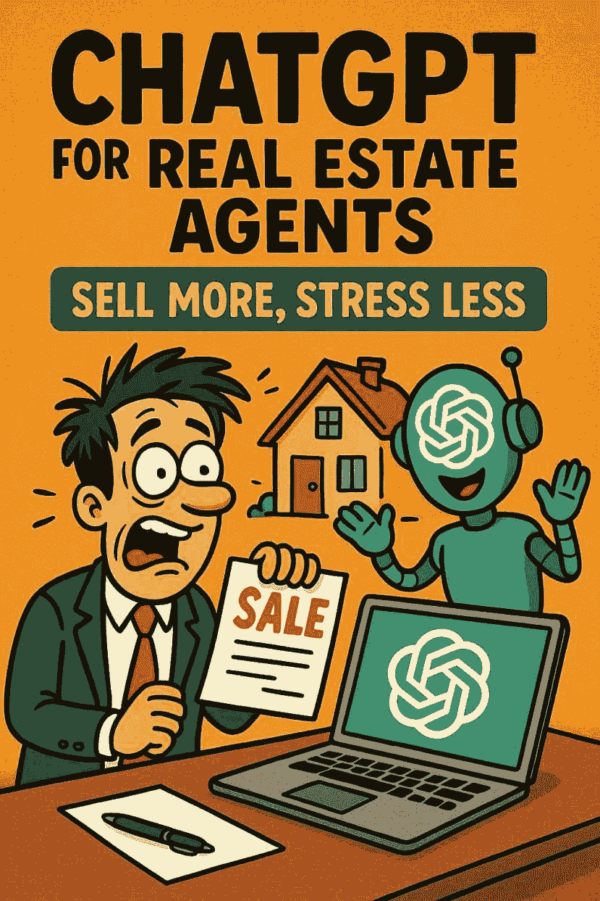

# 房地产经纪人的 ChatGPT：卖出更多，压力更少

> 原文：[ChatGPT Millionaire Agent](https://annas-archive.gl/md5/b9f52bd42937f8ff3f9ad3fe8e20caca)
> 
> 译者：[飞龙](https://github.com/wizardforcel)
> 
> 协议：[CC BY-NC-SA 4.0](https://creativecommons.org/licenses/by-nc-sa/4.0/)

* * *

引言：为什么你即将成为传奇

欢迎来到房地产明星。

如果你正在阅读这篇文章，你很可能属于以下类别之一：

+   你是一位在邮件和潜在客户生成中挣扎的房地产经纪人。

+   你听说过 ChatGPT，但以为它是一只宝可梦。

+   你认为“提示工程”听起来像是 NASA 做的事情。

好消息：你不需要是技术专家。你不需要说 AI。你只需要好奇心——也许还需要一杯大杯咖啡。

这本书是你更聪明工作的作弊码，而不是更辛苦。让我们让 ChatGPT 成为你的新免费实习生（他从不睡觉，不抱怨，也不要求加薪）。

你将学习如何更快地撰写列表，像老板一样跟进，看起来像营销天才——只需几个魔法词。而且我们还会一路欢笑。因为如果你不能在卖房子时感到快乐，我们在这里做什么呢？

系好安全带。你的生产力即将迎来一次提升。而且谁知道呢？你甚至可能有时间小憩一下。

* * *

第一章：ChatGPT 101：不是宝可梦

让我们明确一点：ChatGPT 不是一个巫师、一个机器人，也不是你表哥那个奇怪的加密货币朋友。它是由 OpenAI 创建的人工智能语言模型，这意味着它是一个数字化的文字巫师，训练的文本比普通书虫在十生中看到的还要多。

把 ChatGPT 想象成一个超级聪明的鹦鹉和你的最喜欢的文案撰写者的结合——除了它不需要咖啡休息。它可以写电子邮件、广告、短信、博客、剧本、社交媒体帖子、笑话等等。你只需要告诉它你想要什么，然后嗖！文字就会出现。就像魔法一样，但更酷。

“但 AI 不是要抢我们的饭碗吗？”不。ChatGPT 不是来取代房地产经纪人的——它是来取代那些让房地产经纪人感到疲惫的*忙碌工作*。你知道，那些让你想扔手机进湖里的部分。

你仍然会做网络社交、握手、看房、签订合同——但 ChatGPT 会在沟通方面承担重担。它就像有一个不会打断你的副驾驶。

而且不，你不需要“编码”。你只需要像对待助理一样与之交谈。从：“嘿 ChatGPT，给我写一份描述三卧室小屋的房源描述，它闻起来像新鲜饼干。”看看会发生什么。

让我们深入探讨，好吗？

第二章：你的新全天候助理（不吃午餐）

想象一下拥有一个全天候工作、从不要求请假、不评判你咖啡因上瘾的个人助理。那就是 ChatGPT。它就像 Siri 去读了研究生，现在想要帮助你促成交易。

需要在凌晨 2 点写一份房产描述，因为你的客户“突然想起”他们需要它？完成。忘记回复那个一周前消失然后突然发短信“还感兴趣”的买家？ChatGPT 会为你提供一个友好但不过分急切的跟进，不会让你听起来很绝望。

你可以用它来做：

+   在堵车时起草电子邮件回复（语音转文本是你的朋友）。

+   在微波炉加热剩菜的同时制作精炼的房源展示。

+   写博客文章，不会让你想哭。

一位经纪人告诉我，他们使用 ChatGPT 来为成交日构思礼物想法。另一位则用它来撰写听起来真诚而不是像 Hallmark 卡片一样的生日祝福。

它是你的虚拟瑞士军刀——只是没有开瓶器。

* * *

第三章：提问的艺术：真正有效的提示

事情是这样的：ChatGPT 的效果取决于你提出的问题。垃圾输入，垃圾输出。把提示想象成在餐厅点菜——如果你只说“食物”，你可能会得到冷的燕麦粥。

相反，要具体一点：“写一份有趣、吸引人的房源描述，针对 30 岁左右的首次购房者，描述一个有环绕阳台的 4 卧室 2 浴室的现代农舍。”砰！

想要一条 Facebook 帖子？请提出来。需要某种特定的语气——机智、专业、休闲但时尚？说出来。想要项目符号、表情符号、标签？告诉它。ChatGPT 还不是一个读心者（至少还不是）。

PRO TIP：用“扮演……”开始你的提示。例如：

+   “扮演一名房地产文案撰写者，写一份房源描述……”

+   “扮演社交媒体策略师，创建一周的 Instagram 文案……”

给它背景。给它个性。给它一个击掌。你的提示越好，魔法就越好。

* * *

第四章：开放日？更像是开放对话

开放日仍然存在（感谢 HGTV），但让我们让它们不那么尴尬，更加精彩——借助 ChatGPT。

在开放日之前，使用 ChatGPT：

+   创建一封听起来不像税务研讨会的活动邀请电子邮件。

+   写一个有力的 Facebook 活动描述。

+   使用它帮助你在 Canva 上制作传单。

在活动期间？让它帮助你编写谈话要点或简短导览演讲。你听起来既专业又不会显得机械。

活动结束后，不要让你的客人感到被冷落。ChatGPT 可以生成跟进电子邮件，例如：

“嗨，莎拉！感谢你昨天来到 123 Main St.——希望你喜欢新鲜饼干和风景！如果你有任何问题，或者想要再次看它，请告诉我。”

更少的压力。更多的联系。更多的饼干。

* * *

第五章：写出能自我销售的房源（几乎）

编写房源描述不应该感觉像是在写大学论文。来吧，ChatGPT：你的个人房源诗人。

告诉它房子有什么，适合谁，以及氛围。就这样。

示例：“为带围栏院子和更新厨房的 3 卧室 2 浴室农舍写一个房源描述。非常适合年轻家庭。让它变得温暖和吸引人。”

ChatGPT 的输出：

“欢迎来到你舒适的新家！这个 3 卧室 2 浴室的农舍结合了魅力和功能，现代厨房适合星期天的煎饼日。享受一个完全围栏的后院——非常适合孩子、宠物或史诗般的夏日烧烤。位于一个友好的社区，公园和咖啡馆就在拐角处。你的快乐之地在等待。”

想要更奢华一些？让它变得更加豪华。需要为 MLS 和 Instagram 准备版本？只需提出要求。

你不需要是莎士比亚。你只需要知道你想要什么。ChatGPT 会从那里开始。

第六章：不糟糕的社交媒体帖子

让我们面对现实——一些房地产帖子就像湿漉漉的饼干一样无聊。“新上市！来看看！”这并不是能阻止人们滚动的内容。

进入 ChatGPT，你的新社交媒体伙伴。

想要巧妙的 Instagram 文案？简洁的 TikTok？让人们真正*参与*的 Facebook 帖子？让 ChatGPT 创建符合你品牌声音的帖子。需要幽默？专业润色？激励性的周一氛围？只需说出来。

示例：

提示：“为市中心新上市的 2 卧室公寓写一个有趣的 Instagram 文案。” ChatGPT：“你的未来晚宴将增加 100%的城市天际线。额外奖励：你不需要修剪任何东西。#城市风情 #新上市”

一次性批量制作一周的帖子，然后安排发布。这就像拥有一个内容创作者的电话簿——没有账单。

* * *

第七章：那些被打开并回复的电子邮件！

如果你的电子邮件听起来像纸板，它们被删除的速度比过期酸奶还快。ChatGPT 可以帮助你写人们真正*想读*的电子邮件。

尝试以下提示：

+   “为上周参观房产的买家写一封友好的跟进电子邮件。”

+   “为看房后的新潜在客户写一封介绍邮件。”

想要不同的语气？请要求“友好”、“奢华”、“不啰嗦”或者甚至“俏皮”（是的，这确实是一件事）。

示例：

“嘿，Mike！只是想在你参观 456 Oak Lane 后打个招呼。有什么突出的地方吗——我们还在寻找房子吗？我还有一些可能适合你的选项。让我们聊聊！”

高级技巧：让 ChatGPT 也写主题行。要求 5 个选项并 A/B 测试它们。砰！邮箱魔法。

* * *

第八章：转化短信（而不显得令人讨厌）

短信潜在客户可能会显得尴尬。太短，你会听起来像机器人。太长，你就是那个写绿色泡泡小说的人。

ChatGPT 找到金发碧眼区。

提示：为上周询问但未回复的潜在客户写一条友好、随意的短信。输出：

“嘿，Jordan！只是打个招呼——你还在寻找房子吗？或者你已经找到了‘那个’？如果你这周末想看任何新的房子，请告诉我！”

需要用于确认、提醒或生日祝福的短信？当然。想要听起来高端？试试：“为询问海滨房源的高净值买家制作一个奢华语气的信息。”

简短。甜蜜。不汗湿。

* * *

第九章：感觉不像冰浴的冷电话脚本

冷电话。*颤抖*。

但如果你有一个感觉像温暖握手而不是电话营销突袭的脚本呢？

ChatGPT 可以帮助你制作：

+   不感觉冷的开场白。

+   建立关系的友好问题。

+   处理反对意见的台词，不会让你出汗。

示例：

“嘿，我是 Alex，来自 DreamKey 房地产公司——我看到你在 Brookside 查看房子。只是想打个招呼，看看你有什么问题或者想听听当地人的看法。没有压力！”

你甚至可以说：“为我写 3 个针对 FSBO 业主的冷电话脚本，语气轻松。” 完成。没有 1998 年的脚本。只有现代、听起来像人的对话。

* * *

第十章：感觉不像纠缠的跟进

你知道那种尴尬的阶段吗？潜在客户没有消失，但也没有在 6 天内回复？ChatGPT 来救命。

提示它写一封温暖、有帮助、轻松的跟进邮件。

示例：

“嘿，Taylor！只是想回顾一下我们上周讨论的公寓——有什么想法吗？还在游戏中，还是现在暂停？无论如何，我在这里！”

想要带有幽默感的跟进？加上：“让它轻松愉快。”想要推动一个热门潜在客户？加上：“包含紧迫感但不要有压力。”

同样适用于：

+   游览后跟进。

+   在看房回顾之后。

+   在提交报价后进行跟进。

跟进不应该感觉像骚扰。有了 ChatGPT，它们感觉像是恰到好处的时机和优质的服务。

第十一章：CRM 魔法：让数据为你工作

CRM 系统本应是有帮助的——但有时它们感觉像数字杂货箱。好消息：ChatGPT 可以将 CRM 混乱转变为有组织的卓越 💡。

想要跟进老客户？让 ChatGPT 帮你写个性化的重新参与信息。需要根据兴趣或紧急程度标记联系人？请它帮你创建标签或模板。

示例：

“为我写一封给 8 个月前曾对缩小规模感兴趣的未联系过的人的重新激活邮件。”

嘣：

“嘿，山姆！希望你一切都好。我刚刚在想我们去年那次谈话——你还在考虑搬到更小的房子吗？我看到了一些新的选择，可能值得一看 👀。如果你感兴趣，请告诉我！”

不要再盯着 CRM 中的名字发呆了，不知道该说什么。ChatGPT 给你提供词汇——以及信心——让你真正发送邮件。

* * *

第十二章：让你看起来像天才的市场报告

你知道那些干巴巴、数据繁多的市场报告，让人眼睛发花吗？是的。我们不要再那样做了。

ChatGPT 可以将“库存同比下降 11%”翻译为：

“市场上房屋数量减少意味着竞争加剧——并且可能价格更高。如果你一直在犹豫是否出售，现在是绝佳时机。🏡”

使用以下提示：

+   “用友好的语调总结[城市]最新的市场统计数据。”

+   “为时事通讯写一段关于低库存和价格上涨的短文。”

你的客户实际上会*阅读*你的更新。也许甚至会转发给朋友。现在谁看起来像是市场专家？（提示：就是你 🎓）

* * *

第十三章：MLS 翻译器：将术语转化为爵士乐

让我们玩个游戏。这里是一个典型的 MLS 描述中的句子：

“宽敞的殖民地风格房屋，附带 2 车位车库，EIK，HWFs，LL 娱乐室，更新至 T/O。”

哎。这是什么——摩尔斯电码？

ChatGPT 可以为普通人解码：

“这个宽敞的殖民地风格住宅包括一个双车位车库、更新的餐厅厨房、美丽的硬木地板，以及一个完工的地下室娱乐室。”

使用以下提示：

+   “将这个 MLS 描述重写为适合 Facebook 帖子的普通英语。”

+   “让这个 MLS 列表看起来对首次购房者温暖而吸引人。”

你会听起来聪明、清晰，而且不像房地产机器人 🤖。

* * *

第十四章：60 秒内完成的社区指南

想要听起来像当地专家，又不想写 10 页的论文？ChatGPT 可以帮助你创建真正闪亮的简短社区概述 ✨。

使用以下提示：

+   “为华盛顿特区的 Capitol Hill 社区写一个简短的指南。提及公园、咖啡馆和步行便利性。”

输出：

“Capitol Hill 是一个迷人的、适合步行的社区，街道两旁种满了树木，有历史悠久的联排别墅和舒适的咖啡馆 ☕。去 Eastern Market 享受当地美食或在 Lincoln Park 放松。非常适合想要城市氛围和社区魅力的买家。”

用它来做：

+   博客简介

+   搬迁指南

+   买家邮件

节省时间，听起来很聪明。这是一个双赢的局面。

* * *

第十五章：向拉布拉多解释房地产术语 🐶

你知道那些对每个缩写词都点头但显然不知道你刚刚说了什么的客户吗？是的。让我们解决这个问题。

使用 ChatGPT 简化我们像撒纸屑一样随意处理的事情：

+   “像对我五岁孩子解释‘保证金’一样解释。”

+   “为评估做一个有趣的类比。”

示例：

保证金： “它就像一个买家和卖家都同意使用的存钱罐，直到一切正式完成，没有人能拿到钱。”

评估：“它就像雇佣一个裁判来告诉每个人房子真正值多少钱——这样就没有人付高价或卖低价。”

你将建立信任，减少困惑，甚至可能让你的客户笑出声。教育 = 权力。而获得权力的客户？他们会自信地成交。

第十六章：带来潜在客户的博客文章

博客并没有死去——它们只是通常很无聊 😴。但你的博客不会，多亏了 ChatGPT。

使用它来激发博客想法，例如：

+   “首次购房者常犯的五大错误”

+   “[你的城市]你能用 50 万美元买到什么？”

+   “《带宠物出售房屋的终极指南》🐾”

然后让 ChatGPT 写整个内容……或者只是开头。要求“引人入胜”、“SEO 友好”或“有趣但信息丰富”。

示例提示：

“为‘为什么冬天是购买房屋的好时机’写一篇温馨风格的博客开头。”

结果：

“当其他人都在喝可可和狂热地看 Netflix 时，聪明的买家正在抓住冬天的交易 ❄️。这就是为什么穿毛茸茸的袜子寻找房子可能是你最明智的选择。”

嘭！即时内容。无需作家阻塞。

* * *

第十七章：具有个性的 YouTube 剧本

拍摄视频时不知道该说什么？让 ChatGPT 为你编写剧本吧 🎥。

无论你是在做房屋游览、问答或“购买翻修房屋的 5 个技巧”，只需给 ChatGPT 一个主题、期望的语气和受众。

提示示例：

“为 2 分钟的卖家布置技巧视频写一个 YouTube 剧本。让它轻松活泼。”

输出：

“嘿，朋友们！今天我们要深入探讨 5 个超级简单的布置技巧，让你的房子瞬间准备好 Instagram 📸。从丢弃大号摇椅到添加新鲜的花朵，这些技巧可以帮助买家一见钟情。”

快速要求“点赞和订阅”，然后嘭——视频内容完成。

P.S. 你也可以要求视频描述和标签建议。因为 SEO 很重要。

* * *

第十八章：不会让你感到尴尬的 TikTok 剧本

你不必跳舞（除非你想 🕺）。但 TikTok *确实是*接触买家和卖家的好方法，尤其是千禧一代和 Z 世代。

使用 ChatGPT 编写简短、有力的剧本，这些剧本实际上很有效。

提示示例：

“写一个 15 秒的 TikTok 剧本，解释诚意金存款是什么。让它快速、有趣、休闲。”

输出：

“诚意金 = 你在出价时支付的‘我是认真的’现金 💸。这不是小费。这是你表示‘我不会放弃这所房子’的方式！”

添加一个流行的声音和一点魅力，你就有了正在形成的病毒时刻。

* * *

第十九章：值得双击的 Instagram 标题

你知道什么让你的房产帖子脱颖而出吗？带有*个性* 💁‍♀️的标题。

不要只是“新上市——好位置！”（无聊），试试：

“举手如果你喜欢浴缸、裸露的砖墙和阳台上的酒 🙋‍♀️🍷。这个梦幻的阁楼刚刚上市！”

ChatGPT 可以写出以下这样的标题：

+   与你的品牌声音保持一致

+   使用表情符号和标签

+   包含行动号召（“标记需要这个厨房的人！”）

提示示例：

“为一个大窗户和游泳池的中世纪现代房产写一个有趣的 Instagram 标题。”

输出：

“阳光、风格和活力氛围 ☀️🪟🏊‍♂️。这个中世纪的美女准备好在泳池边派对和晨曦中的中庭喝咖啡了。谁在？”

滚动停止 + 可滑动 = 💥

* * *

第二十章：客户异议：人工智能回归之旅

“如果市场崩溃了怎么办？”“我想等待利率下降。”“我表弟说我应该自己卖房。” 😩

不要惊慌，让 ChatGPT 帮助你制作出冷静、清晰、增强信心的回复。

提示示例：

“写一个安慰但诚实的回复，针对担心在高利率期间购买房产的买家。”

输出：

“完全公平的担忧——你并不孤单。事实是，利率可能会上升……或者下降。最重要的是找到适合你的正确房子和正确时间。记住，稍后重新融资总是个选择。”

无论是对买家犹豫不决还是卖家拖延，ChatGPT 都能帮助你保持冷静、沉着和吸引人 😎。

第二十一章：令人眼前一亮的列表展示

单调的列表展示就像房地产中的米色地毯——没有人会记得它们。但要是你的列表有了魅力、光芒和 ChatGPT 的魔法呢？✨

使用 ChatGPT：

+   生成吸引注意力的标题 📢

+   写出让你听起来像碧昂丝经纪人的简洁个人简介

+   撰写以利益为导向的要点（“这是如何更快、以更多💰卖掉房子的。”）

提示示例：

“为我写一个列表展示的介绍段落，解释为什么我是卖市中心豪华公寓的最佳经纪人。”

ChatGPT 输出：

“在销售豪华房产时，每个细节都很重要——从首次展示到最终签字。凭借经过验证的策略、高端营销和对市中心市场的热情，我把列表变成了成交。”

专业。简洁。有说服力。现在去赢得那笔交易吧！🏆

* * *

第二十二章：买家问卷——但让它们变得有趣

大多数买家问卷都感觉像是房屋寻找的 DMV 版本。让我们改变一下。

使用 ChatGPT 以个性重写你的登记表：

“你的梦想厨房风格是什么？ 🔲 大厨的天堂 🔲 舒适可爱 🔲 ‘又是 DoorDash 吗？’”

请让它创建：

+   打破僵局的提问

+   带有表情符号的复选选项

+   有趣的介绍，比如“让我们找到你的梦想住所！” 🛋️

提示示例：

“为即将搬到郊区的年轻夫妇写一个有趣的买家问卷。”

ChatGPT 可能会提供：

“我们在这里帮助你找到‘那一个’（不，不是约会应用）。告诉我们什么让你梦想中的房子成为滑动右键的材料！”

突然，客户填写你的表格时都带着微笑。多么有创意的想法。

* * *

第二十三章：无需压力的卖家更新

卖家希望感到自己是信息链的一部分——但你又不希望每周都重写《战争与和平》。

使用 ChatGPT 来：

+   创建快速、清晰的每周更新模板 📈

+   总结展示反馈

+   对“目前还没有报价”进行积极的解读

示例提示：

“给一位已经展示了 3 次但还没有收到任何报价的卖家写一封每周更新邮件。保持乐观。”

输出：

“嗨马克！这周我们有 3 次展示——对布局和后院有很多积极的评论 🌿。虽然目前还没有报价，但兴趣依然浓厚，我们还在继续获得大量流量。随着我们继续前进，我会随时向您汇报！”

没有压力。没有过度思考。只有干净、一致的信息，这可以建立信任。

***

第二十四章：用言语赢得房源

那封预售邮件？那个小小的跟进短信？那个在展示前的介绍信息？它们比你想象的更重要。💬

让 ChatGPT 帮助你：

+   制作一封不显得自大的“为什么选择我”邮件

+   写出关于你的策略的杀手级单行句

+   创建一份真正会被阅读的离场手册

提示示例：

“给我刚见面的卖家写一封自信而友好的邮件，感谢他们，并强调为什么我是合适的经纪人。”

输出：

“再次感谢有机会讨论您的房子！我真心相信我们可以使这次销售顺利、成功——并且我很乐意成为您下一章的一部分。如果您有任何问题，无论大小，请告诉我。”

微妙的自信。零自我。最大影响。

***

第二十五章：对“我在考虑购买”的推动

你知道那些随口提到“考虑购买”然后就像袜子在烘干机里消失的潜在客户吗？🧦 让我们温和地将他们拉回来。

ChatGPT 可以帮助你：

+   轻柔触摸的短信

+   价值丰富的邮件

+   “无压力”的跟进

提示示例：

“为提到在接下来 6 个月内购买的前客户写一封友好的邮件，只是为了了解一下。”

输出：

“嗨杰米！只是想了解一下——你还在考虑今年晚些时候搬家吗？不着急，但当我感觉时机合适时，我很乐意帮忙。同时，我很乐意给你发一些房源供你浏览。”

你不是在追逐。你在支持。这就是你建立长期忠诚度的方法 🤝。

第二十六章：自动化而不像机器人

自动化很火 🔥——但不是当它感觉像是 2007 年的机器人轰炸时。好消息是：ChatGPT 可以帮助你听起来像人，同时还能节省时间。

使用它来写：

+   感觉像个人一样发送的邮件漏斗序列 📧

+   听起来温暖友好的自动回复

+   安排不会让人感觉像是机器人的信息

示例提示：

“为刚刚下载了我的购房者指南的新潜在客户写一封友好的自动化邮件。”

输出：

“嗨莎拉！感谢你拿起购房者指南——我希望它能给你一个很好的起点 🏡。我很快会联系你，看看你是否有任何问题，但在此之前，请随时回复！”

你仍然是原来的你——只是多了一点 AI 的帮助。

***

第二十七章：无需乞求生成评论

我们都希望得到好评，但请求它们可能会感觉像是在乞求赞美 😬。这时就请 ChatGPT，这位礼貌而有效的评论小能手出场。

提示它来写：

+   请求评论的后续信息

+   指导快乐的客户说什么的脚本

+   Google 或 Zillow 评论模板

示例提示：

“写一封友好的短信，请快乐的买家留下评论。”

输出：

“嘿，艾玛！我很喜欢和你一起工作——再次感谢你对我的新家🏠的信任。如果你有时间，我非常感激你能在 Google 上给我一个快速评论。这真的对我有所帮助！”

专业、礼貌、无压力。 ⭐⭐⭐⭐⭐

* * *

第二十八章：ChatGPT 作为你的头脑风暴伙伴

卡住了？过度思考？没有想法？ChatGPT 就像你的头脑风暴伙伴，他总是醒着（而且不会评判你的咖啡因摄入量 ☕）。

用它来做：

+   发起内容主题的头脑风暴

+   想出网络研讨会或活动的标题

+   想出巧妙的标语或标签

提示示例：

“给我 10 个针对与首次购房者合作的房地产经纪人的博客文章想法。”

ChatGPT 可能会建议：

“租房与购房：20 多岁的人应该知道的一切” “购买你的第一套房子时避免这 5 个错误” “如何解码抵押贷款利率而不哭泣”

这就像在你的口袋里有一个内容策略师。 💡

* * *

第二十九章：15 分钟内创建一个潜在客户吸引物

你不需要花几天时间制作一本花哨的电子书。有了 ChatGPT，你可以在午餐时迅速制作出一份美味的潜在客户吸引物 🥪。

提示想法：

“写一份名为‘7 个首次购房者寻找房屋前应该问的问题’的 1 页指南。让它既有帮助又易于阅读。”

用它来做：

+   从你的网站上捕获电子邮件

+   在你的 Instagram 个人资料链接中提供奖金

+   在开放日之后发送后续信息

你甚至可以要求一份 Canva 布局建议。现在你就是一个生成潜在客户的机器 🔥。

* * *

第三十章：无需培训的虚拟助手

招聘助理很棒——但也很累。培训、入职、解释你如何喜欢你的电子邮件？呃。

但 ChatGPT？已经训练好。已经迫不及待。已经准备好行动 👨‍💻。

你可以说：

“为明天下午 2 点在 123 Elm St.的展示写一封提醒邮件。” 或者：“为询问 HOA 是否负责景观的买家草拟一份回复。”

没有翻白眼。没有请假请求。没有“意外”删除你的日历。

只需快速、可靠的援助，无论何时你需要。欢迎加入 AI 梦幻团队 💼🤖。

第三十一章：像专业人士一样寻找（即使你很累）

寻找潜在客户可能感觉像是在人字拖里拖着一辆马车上山。但有了 ChatGPT，你可以让它更快——而且痛苦少得多。

让它帮助你：

+   为冷接触写吸引人的开场白 💌

+   个性化跟进

+   想出为新客户破冰的方法

提示示例：

“给我写一封友好的 LinkedIn 信息，给在商会活动中遇到的当地企业主。”

输出：

“嗨，莎拉！很高兴在昨天的商会活动中见到你。我很想与你联系并了解更多关于你在面包店的工作。如果你对市场感兴趣，我也很乐意分享一些房地产见解！”

要记住的名言：

“成功通常降临在那些太忙而无法寻找它的人身上。” —— 亨利·大卫·梭罗

在你的角落里拥有人工智能，你可以保持“太忙”而无法完成交易 🏁。

* * *

第三十二章：自我品牌化——不要自我陶醉

你不需要用大写字母尖叫“顶级生产商”来脱颖而出。你的品牌 = 你的感觉。ChatGPT 可以帮助你找到它并使其更加精致 💅。

使用它来：

+   定义你的语气（“平易近人的专家”，“平静的奢华”，“有趣的朋友”）

+   为 Zillow、LinkedIn 或 Instagram 写你的简介

+   创建一个吸引人的电梯演讲

提示示例：

“为一位技术熟练、友好且专注于市中心公寓的经纪人写一个两句话的简介。”

输出：

“我帮助买家和卖家利用精明的技术工具和微笑😄在快节奏的市中心市场导航。房地产应该感觉令人兴奋——而不是令人压倒。”

要记住的引言：

“你的品牌是当你不在房间里时人们对你说的。” —— 杰夫·贝索斯

确保他们说的话听起来很棒。

* * *

第三十三章：细分市场，但不要缩小范围

担心选择细分市场会吓跑其他业务？不要担心。你并没有关闭门——你正在打开更多有针对性的门 🚪。

让 ChatGPT 帮助你：

+   识别客户画像

+   编写细分市场着陆页

+   根据受众定制接触方式（首次购房者、豪华客户、缩小规模者等）

提示示例：

“为一位与该地区搬迁的军事家庭合作的经纪人写一个关于我的页面。”

输出：

“作为一名自豪的军人家属，我理解 PCS 调动和时间敏感的房屋搜索的独特挑战。我将一次帮助您平滑过渡，一次帮助一栋房子。” 🇺🇸

要记住的引言：

“当你对每个人说话时，你对没有人说话。” —— 梅丽迪斯·希尔

拥有你的细分市场。在其中闪耀。让 ChatGPT 帮助你听起来就像那个专家。

* * *

第三十四章：一次提示构建你的房地产帝国

罗马不是一天建成的。你的房地产帝国也是如此。但有了 ChatGPT，你可以比以往任何时候都更快地建造这些砖块 🧱。

使用提示来：

+   创建商业计划

+   概述你的年度营销策略

+   为供应商或合作伙伴起草电子邮件提案

提示示例：

“为一位使用社交媒体和电子邮件的独立房地产经纪人创建一个简单的季度营销计划。”

输出：

Q1：每周市场更新 + 当地景点 IG 短视频 Q2：买家网络研讨会 + 关于房屋融资的博客文章 Q3：客户感谢活动 + 线索磁铁更新 Q4：年终回顾 + 节日卡片宣传活动 🎄

要记住的引言：

“预测未来的最好方法就是创造它。” —— 彼得·德鲁克

开始创作——有一点人工智能的帮助。

* * *

第三十五章：道德使用 AI（是的，这很重要）

就算你可以让 ChatGPT 为你写整个网站，这并不意味着你应该不加思考地复制粘贴。道德很重要。你的声音很重要。你的*客户*绝对很重要 🧠❤️。

使用 ChatGPT 来：

+   鼓励，而不是模仿

+   检查语气，而不是编造推荐信

+   加快你的工作，而不是取代你的人性

提示示例：

“写一个对因低估而感到不满的客户表示尊重的回复。”

输出：

“我完全理解你的挫折感——这个过程可能会让人泄气。我在这里支持你，我们将一起探索所有选项，以最佳方式前进。”

要记住的名言：

“能力越大，责任越大。” —— 本叔叔（也就是蜘蛛侠的明智叔叔 🕷️）

像专业人士一样使用 ChatGPT。但保持善良，保持人性，保持你自己。

第三十六章：未来保障的代理

房地产格局的变化比你能说的“利率上涨”还要快。但你？你走在曲线的前面 🧠📊。

ChatGPT 帮助你：

+   关注市场趋势

+   创建将你定位为专家的内容

+   快速适应，避免过度劳累

提示示例：

“用不到 100 个字总结最新的国家房地产趋势，语气友好。”

输出：

“市场略有降温，但许多地区的需求仍然强劲——特别是对于即入住的房屋。抵押贷款利率波动，但买家仍然活跃，尤其是在创意融资方面。如果你有合适的向导，现在仍然是买卖的好时机！”

要记住的名言：

“变化是生活中唯一不变的东西。” —— 赫拉克利特

拥抱科技的代理不会灭绝。他们正在变得势不可挡 🚀。

* * *

第三十七章：为团队领导者的 ChatGPT

管理团队？恭喜你，你现在就是队长 🧭。而 ChatGPT？你的首选团队成员，永远不会请假。

用它来：

+   编写入职材料

+   创建培训提示

+   起草团队通讯和更新

提示示例：

“为新加入我们房地产团队的代理写一封欢迎邮件。保持积极和鼓舞人心的语气。”

输出：

“欢迎加入，詹娜！我们很高兴你能加入 Elevate 团队。你的活力和动力正是我们所追求的，我们迫不及待想看到你发光 ✨。让我们一起实现一些目标！”

要记住的名言：

“如果你想走得快，就一个人去。如果你想走得更远，就一起走。” —— 非洲谚语

使用 AI，你可以清晰自信地领导。

* * *

第三十八章：为新代理的 ChatGPT（又称小鲨鱼）

新手？感到不知所措？深呼吸。你行得通——ChatGPT 也在支持你 🦈。

用它来：

+   写你的第一条上市描述

+   起草给你的导师或经纪人的短信

+   练习买家/卖家脚本，直到听起来流畅

提示示例：

“写一封自信的介绍邮件，发送给我的圈子，让他们知道我现在是一名有执照的代理。”

输出：

“激动人心的消息——我正式开始了我的房地产生涯！ 🏡我现在正在帮助朋友、家人和推荐的人有信心地买卖。无论你现在是否准备好，或者只是好奇，我都想与你联系，成为你的首选资源。”

要记住的名言：

“任何领域的专家曾经都是新手。” —— 海伦·海斯

你不仅在学习。你在积累动力。ChatGPT 是你的训练轮，很快你将独自飞翔。

* * *

第三十九章：避免使用 ChatGPT 的错误（是的，它并不完美）

诚实地讲：ChatGPT 很棒——但它并不完美 🤖🚫。

要注意的错误：

+   将输出视为圣经（总是核实事实！）

+   听起来太一般化（个性化一切）

+   过度依赖（你仍然需要你的大脑！）

将 ChatGPT 作为一个工具——而不是拐杖。它在那里协助，而不是取代你的直觉或专业知识。

提示技巧：

总是加入你的声音。将 ChatGPT 的草稿作为起点，然后加入你的风格。

要记住的引言：

“犯错误是人类。编辑是神圣的。” —— （好吧，我们编了这个……但仍然。）

* * *

第四十章：ChatGPT 工具箱：模板、提示和强力动作

这里就是。压轴大戏。你的数字瑞士军刀——AI 驱动的资源 🔧⚡

任何时候都可以尝试这些：

+   “为刚刚上市的工匠小屋写一篇有趣的 Instagram 帖子。”

+   “创建一个 3 封邮件的培育冷买家线索序列。”

+   “用不超过 200 字，用友好的语气总结买家指南。”

+   “为新卖家线索草拟一个语音邮件脚本。”

需要博客想法？帖子？个人资料更新？只需询问。

要记住的引言：

“给我六个小时砍倒一棵树，我会花前四个小时磨斧头。” —— 亚伯拉罕·林肯

ChatGPT 是你的斧头。保持锋利。继续使用它。然后出去，*一鸣惊人* 💥。

现在去卖更多，压力更小——也许甚至可以小憩一下 😴。

* * *

结束（但其实是真正的开始）

你已经完成了 40 章的 AI 驱动力作——并且希望你在旅途中笑过几回 😂。从编写杀手级列表描述到撰写获得回复的文本，闪耀的社交媒体帖子，以及不会立即被删除的电子邮件——你现在拥有了一个顶级生产者经纪人都会羡慕的工具包。

我们介绍了如何：

+   将 ChatGPT 作为你的 24/7 助手，而不会让它变得奇怪 🤖

+   将枯燥的市场数据转化为引人入胜的见解 📈

+   写作就像专业人士一样——即使你自从大学毕业后就没有写过

+   用几个神奇的提示语✍️培养领导力，赢得列表，并让客户惊叹不已

你口袋里有 AI 的力量——以及大多数竞争对手还不理解的作弊码。使用它。发挥创意。实验。

当他们问，“你是如何完成这么多工作的？”时，只需眨眨眼，然后说：

"我从一位名叫 GPT 的朋友那里得到了一点帮助。"

这不仅仅是一本书。这是你的发射台 🚀

现在出去卖一些该死的房子吧。
