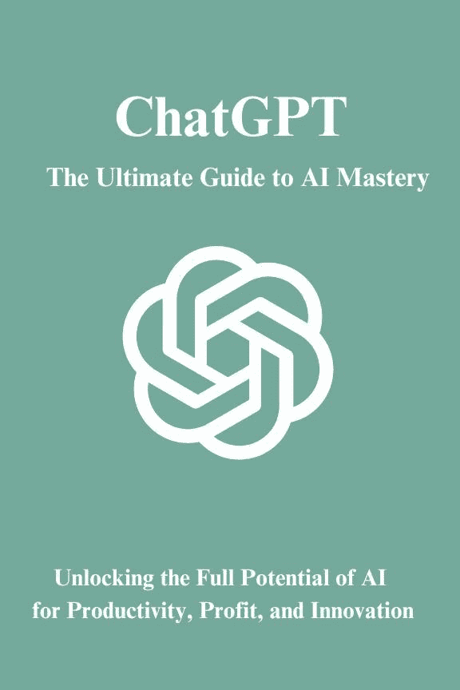
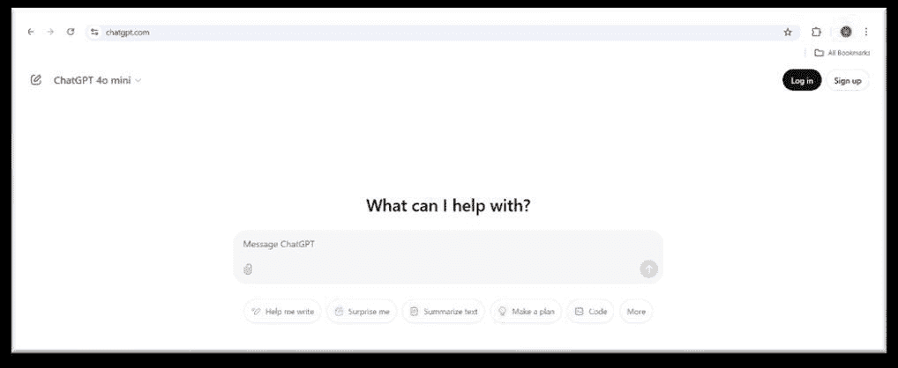

# ChatGPT AI 大师终极指南

> 原文：[ChatGPT : The Ultimate Guide to AI Mastery](https://annas-archive.gl/md5/1a5be362bf83ed7185035ff50aa353d5)
> 
> 译者：[飞龙](https://github.com/wizardforcel)
> 
> 协议：[CC BY-NC-SA 4.0](https://creativecommons.org/licenses/by-nc-sa/4.0/)

前言

在人工智能正在重塑我们工作、创造和创新方式的时代，理解和掌握 ChatGPT 等 AI 工具已经成为一种必需，而非奢侈品。曾经属于科幻领域的领域现在已成为现实——AI 驱动的助手可以生成内容、解决复杂问题、简化业务流程，甚至激发创造力。

《ChatGPT 终极指南 - AI 精通》不仅仅是一本图书；它是探索和利用 AI 全部潜能的路线图。本书旨在为寻求使用 AI 驱动解决方案提高生产力和扩展能力的创业者、学生、教育工作者、内容创作者和各行业专业人士提供帮助。

作为一位密切关注 AI 发展的人，我亲眼见证了 ChatGPT 如何改变行业，使 AI 驱动的解决问题变得触手可及。无论您是想自动化重复性任务、增强客户参与度，还是生成高质量的内容，本书都提供了实用的策略、专家见解和现成的提示，以最大化您的 AI 驱动成功。

拉维·塞卢古精心编制了这本指南，旨在为您提供将 ChatGPT 无缝集成到个人和职业生活中的知识和技能。从基本的 AI 概念到高级的商业应用，本书无所不包。

我邀请您沉浸在这段 AI 精通的旅程中。未来不仅仅关乎人类智慧，还关乎我们如何与人工智能协作，创造突破性的解决方案。

欢迎来到 AI 驱动成功的未来。

您真诚的

拉维·塞卢古

目录

第一部分：ChatGPT 和 AI 的基础...................................................8

1. 引言：AI 革命.........................................................................8

2. 什么是 ChatGPT?...............................................................................................8

3. AI 聊天机器人的演变 .............................................................................9

4. ChatGPT 是如何思考的........................................................................................10

5. 道德与 AI 责任.................................................................................10

第二部分：掌握 ChatGPT 以应对日常生活 ..................................................12

6. ChatGPT 作为您的个人助理 – 邮件、日程安排和生产率 ..12

7. AI 学习 – 使用 ChatGPT 更快地学习..............................................12

8. ChatGPT 为作家服务 – 博客、论文和讲故事................................13

9. AI 驱动的语言学习 – 翻译和语法辅助............14

10. ChatGPT 用于研究 – 事实核查和信息总结.........14

第三部分：ChatGPT 在商业与营销中的应用...............................................16

11. AI 在数字营销中的应用 – SEO、内容策略和自动化 ....................16

12. 使用 AI 进行社交媒体增长 – 创建病毒性内容和互动 .........17

13. 邮件营销自动化 – AI 驱动的拓展 ..................................18

14. 客户支持聊天机器人 – 自动化客户服务.................18

15. 构建 AI 驱动的网站和着陆页 ...........................................19

第四部分：ChatGPT 在线赚钱 ..............................................20

16. 使用 AI 自由职业 – 写作、咨询和编码..................................20

17. 销售 AI 生成数字产品 – 电子书、课程和模板...21

18. 联盟营销与 AI – 使用 AI 推动销售 .........................................22

19. 使用 AI 进行 Dropshipping 和电子商务自动化 ........................................22

20. AI 在股市和加密交易中的应用 .......................................................23

第五部分：高级 AI 与 ChatGPT 技巧 .....................................................24

21. 掌握提示工程 – 构建完美的 AI 查询.................24

22. 使用 AI 进行创意写作和讲故事 ..................................................24

23. 使用 AI 自动化工作流程 – ChatGPT + Zapier、API 集成 ..........25

24. 构建自己的 AI 聊天机器人 – 定制 GPT 和微调.......................26

25. 如何训练 ChatGPT 以用于定制应用 ............................................27

第六部分：ChatGPT 为商业主人和企业家服务...........................28

26. AI 驱动的商业策略 – 通过自动化扩展 .........................28

27. 使用 ChatGPT 进行市场研究和竞争分析 .......................28

28. AI 驱动的销售和潜在客户生成 ............................................................29

29. 在工作中使用 AI 提高生产力..........................................30

30. AI 如何重塑创业的未来 ...................................31

第七节：ChatGPT 与人工智能的未来..........................................................32

31. 人工智能与就业市场 – 哪些职业将蓬勃发展?.........................................32

32. 人工智能将如何改变教育与学习 ....................................................33

33. 人工智能在医疗、法律和金融中的作用.............................................33

34. 人工智能监管与治理的伦理 ....................................................34

35. 人工智能的未来是什么？2030 年及以后的预测......................................35

第八节：实用指南与案例研究....................................................36

现实世界案例研究：企业、作家和创作者如何使用 ChatGPT 36

ChatGPT 之外的顶级人工智能工具：MidJourney, DALL·E, Claude 等............38

第九节：构建生成式人工智能工具.........................................................40

9.1 生成式人工智能简介 ........................................................................40

9.2 构建生成式人工智能工具的步骤................................................................40

9.3 生成式人工智能在现实世界中的应用 .....................................................41

第十节：ChatGPT 提示词的终极指南..............................43

10.1 提示词在人工智能中的力量 .........................................................................43

10.2 最受欢迎的 ChatGPT 询问的提示词 ...................................................43

10.3 适用于所有行业和年龄段的现成提示词...........................44

10.3.1 商业与企业家提示词 ................................................44

10.3.2 教育与学术领域的提示词......................................................44

10.3.3 医疗与健康专业人士提示词.................................44

10.3.4 法律与法律专业人士提示词.................................................45

10.3.5 制造与供应链提示词 .........................................45

10.3.6 办公效率与个人发展提示词...................45

10.3.7 空间与航空航天行业提示词 .............................................45

10.3.8 酒店与旅游业提示词 .........................................45

10.3.9 娱乐与游戏行业的提示 ...................................45

10.4 结论：提示工程的未来...........................................46

www.chatgpt.com

第一部分：ChatGPT 与 AI 的基础

1. 简介：AI 革命 1.1 人工智能的兴起

人工智能（AI）已经从研究的一个细分领域转变为技术演变的驱动力。从自动驾驶汽车到 Siri 和 Alexa 这样的虚拟助手，AI 已经成为我们日常生活中的一个基本部分。AI 中最令人兴奋的发展之一是自然语言处理（NLP），它使机器能够理解、生成和响应人类语言。

ChatGPT 是由 OpenAI 驱动的高级语言模型，代表了 AI 驱动对话的巅峰。与依赖于脚本响应的传统聊天机器人不同，ChatGPT 使用深度学习和生成 AI 在实时生成类似人类的文本。

1.2 AI 对社会的影响

AI 正在重塑全球的各个行业：

• 商业与营销：AI 驱动的自动化提高生产力，自动化客户服务，并优化数字营销。

• 教育：AI 驱动的导师为全球学生提供个性化的学习体验。

• 医疗保健：AI 协助医疗诊断、药物发现和患者护理。

• 娱乐与媒体：AI 生成电影剧本、创作音乐，并增强游戏体验。

ChatGPT 理解并生成文本的能力为从内容创作到 AI 辅助决策等众多领域打开了无限可能。

2. 什么是 ChatGPT？2.1 理解大型语言模型（LLMs）

ChatGPT 是一个基于大量文本数据训练的 LLM（大型语言模型），用于生成类似人类的响应。它基于生成预训练的 Transformer（GPT）架构，这使得它能够理解情境、生成连贯的响应，甚至参与创意写作。

2.2 ChatGPT 的工作原理

ChatGPT 遵循三个步骤的过程：

1. 预训练：它从大量的文本数据中学习，识别模式、语法和情境理解。

2. 微调：它通过特定的数据集进行优化，以提高响应准确性和减少偏差。

3. 用户交互：当被提示时，ChatGPT 分析输入，检索相关模式，并生成一个连贯的响应。

2.3 ChatGPT 的关键特性

• 对话式理解：它模仿具有情境意识的类似人类的对话。

• 多语言能力：它能够处理和响应多种语言。

• 创意文本生成：ChatGPT 可以撰写文章、故事、剧本，甚至诗歌。

• 问题解决能力：它协助编码、研究和数据分析。

3. AI 聊天机器人的演变 3.1 早期 AI 聊天机器人

AI 驱动的聊天机器人之旅始于 20 世纪 60 年代的 ELIZA，这是一个早期的 NLP 程序，使用预编写的响应模拟人类对话。几十年来，机器学习的进步为 IBM 的 Watson、Google Assistant 和 OpenAI 的 ChatGPT 等更复杂的 AI 模型铺平了道路。

3.2 GPT 模型的发展

OpenAI 的 GPT 模型已经发生了显著变化：

• GPT-1（2018）：早期模型，对话深度有限。

• GPT-2（2019）：更高级，能够生成连贯的长篇文本。

• GPT-3（2020）：1750 亿参数，实现深度上下文理解。

• GPT-4（2023）：更高效、更有创造力，能够理解细微的提示。

随着每次迭代，GPT 模型在准确性、流畅性和适应性方面都有所提高，使 ChatGPT 成为各种应用的强大工具。

4. 如何 ChatGPT 思考 4.1 神经网络和深度学习

ChatGPT 使用人工神经网络（ANN）运行，它模仿人类大脑处理信息的方式。这个网络包括：

• 输入层：接收用户查询。

• 隐藏层：使用数学计算处理数据。

• 输出层：根据学习到的模式生成响应。

该模型利用深度学习算法分析数百万个文本样本，使其能够生成自然且上下文适当的响应。

4.2 自然语言处理（NLP）的实际应用

NLP 使 ChatGPT 能够：

• 基于上下文理解解释用户查询。

• 根据输入预测最可能的响应。

• 适应不同应用的各种写作风格。

这使得 ChatGPT 非常灵活，从辅助创意写作到提供技术解决方案。

5. 道德与 AI 责任 5.1 AI 道德的挑战

随着 AI 的持续发展，道德考量变得至关重要。一些关键挑战包括：

• AI 中的偏见：ChatGPT 可能反映了其训练数据中存在的偏见。

• 错误信息和幻觉：AI 生成的内容有时可能包含不准确的信息。

• 隐私问题：数据安全和用户隐私必须优先考虑。

5.2 解决道德问题

组织如 OpenAI 实施保障措施以减轻这些问题：

• 定期模型更新：提高准确性和公平性。

• 用户反馈循环：允许用户报告问题输出。

• AI 开发的透明度：鼓励负责任的 AI 使用。

5.3 负责任 AI 的未来

政府和 AI 开发者正在努力制定 AI 监管框架，以确保 AI 技术的道德使用。随着 AI 继续融入我们的日常生活，负责任的使用将是最大化其益处的关键。

第二部分：掌握 ChatGPT 以应对日常生活

6. ChatGPT 作为您的个人助理 – 邮件、日程安排和生产率 6.1 高效管理邮件

ChatGPT 可以帮助：

• 撰写具有适当语气和结构的专业邮件。

• 自动化常见查询的邮件响应。

• 提供各种场合的电子邮件模板。

示例提示： "为上周提交的求职申请草拟一封礼貌的跟进电子邮件。"

6.2 安排和任务管理

• 为会议和截止日期生成提醒。

• 建议结构化的每日或每周任务列表。

• 与日历工具集成以简化安排。

示例提示： "为平衡学习和兼职工作的大学生创建一个生产力时间表。"

6.3 提高生产力

• 将复杂任务分解为可管理的步骤。

• 提供动力和生产力技巧。

• 自动化重复性工作，例如格式化文档。

7. AI 学习 - 使用 ChatGPT 7.1 提升学习效率

• 概括教科书和研究论文。

• 生成自我评估的练习问题。

• 用简单术语解释困难的概念。

示例提示： "用简单的方式向 10 岁孩子解释勾股定理。"

7.2 个性化学习路径

• 根据学习目标推荐学习计划。

• 提供互动测验以增强记忆。

• 提供多种学习风格（视觉、文本、逐步）的解释。

7.3 语言学习辅助

• 生成语言练习。

• 翻译时保持语境准确性。

• 提供语法解释和纠正。

8. ChatGPT 用于作家 - 博客、论文和讲故事 8.1 博客和内容创作

• 为博客生成主题想法。

• 撰写引人入胜的引言和结论。

• 提出内容结构以增强可读性。

示例提示： "为关于可持续生活建议的博客文章创建一个大纲。"

8.2 学术和论文写作

• 协助撰写论文陈述和论点。

• 生成引文和参考书目。

• 提供校对和编辑建议。

8.3 创意写作和讲故事

• 开发人物档案和故事情节。

• 提出故事创意转折。

• 增强描述和对话。

示例提示： "写一个带有意外转折的短篇神秘故事。"

9. AI 驱动语言学习 - 翻译和语法辅助 9.1 实时翻译

• 在保持语境的同时，在语言之间转换文本。

• 在翻译中理解文化细微差别。

• 提供地道的表达方式以实现自然口语。

9.2 语法和句子结构改进

• 解释并纠正语法错误。

• 提出句子结构调整以提高清晰度。

• 提供同义词和替代表达方式。

示例提示： "纠正这个句子的语法：'She go to market yesterday.'"

9.3 会话练习

• 模拟对话以进行语言练习。

• 提供发音指南和音标。

• 提供互动角色扮演场景。

10. ChatGPT 用于研究 - 检查事实和总结信息 10.1 加快研究速度

• 从多个来源收集关键信息。

• 提供长篇文章的简洁摘要。

• 建议相关的学术论文和参考文献。

示例提示："总结关于可再生能源进步的最新研究。"

10.2 信息核实与验证

• 引用可靠来源的声明。

• 识别错误信息和不可靠的数据。

• 提供引文和基于证据的回应。

10.3 数据分析与洞察

• 总结复杂的统计数据。

• 解释图表、图形和趋势。

• 协助进行定性和定量研究。

第三部分：ChatGPT 在商业与营销中的应用

11. 数字营销中的 AI - SEO、内容策略与自动化 11.1 AI 在数字营销中的演变

人工智能已成为数字营销领域的颠覆者。它使企业能够自动化任务、提高内容效率，并在规模上提供个性化的用户体验。AI 驱动的营销策略增加了参与度、改善了转化率，并为客户行为提供了深入洞察。

11.2 AI 驱动的 SEO 策略

搜索引擎优化（SEO）是数字营销的重要组成部分，AI 可以简化整个流程。ChatGPT 在以下方面提供帮助：

• 关键词研究和主题聚类：AI 可以分析搜索趋势并生成高影响力关键词和长尾搜索查询列表。

• 内容优化：AI 帮助精炼标题、元描述和关键词密度。

• SEO 内容创作：AI 可以撰写 SEO 友好的博客文章、着陆页和产品描述。

• 竞争对手分析：AI 扫描竞争对手网站并识别您 SEO 策略中的差距。

• 自动内部链接：AI 建议内容之间的相关链接，以改善导航和排名。

示例提示："为 2025 年关于可持续时尚的博客生成一组 SEO 关键词。"

11.3 AI 驱动的内容策略与自动化

• 自动生成博客文章：AI 可以在几分钟内创建结构良好、引人入胜的内容。

• 定制化内容创作：AI 根据受众行为定制博客文章、电子邮件和社交媒体帖子。

• 内容再利用：AI 可以将博客文章转换为社交媒体帖子、视频脚本或电子邮件通讯。

• 自动图像和视频建议：如 DALL·E 等 AI 工具帮助创建相关视觉内容。

示例提示："创建一篇关于‘AI 如何改变数字营销’的 SEO 优化博客大纲。"

11.4 案例研究：AI 驱动的内容成功

一家在内容创作方面遇到困难的新创公司使用 AI 每月生成 30 篇博客文章，六个月内有机流量增长了 150%。通过 AI 驱动的 SEO 优化，他们的网站在 Google 的 20+个关键词上排名第一位。

12. 社交媒体增长与 AI - 创造病毒性内容与互动 12.1 AI 在社交媒体中的力量

AI 驱动的社交媒体策略最大化参与度并自动化内容创作：

• AI 生成的病毒性内容想法：AI 识别趋势主题并建议与其相符的内容。

• 自动生成标题和标签：AI 优化标题和标签以获得更好的覆盖范围。

• 安排与分析：AI 预测最佳发布时间并分析参与度指标。

• 社交媒体互动的聊天机器人：AI 聊天机器人处理私信、评论和用户查询。

示例提示：为一家推出基于 AI 的聊天机器人的科技初创公司生成五个病毒性推文想法。

12.2 社交媒体广告的 AI 应用

• 优化广告文案：AI 为 Facebook、Instagram 和 Google Ads 创建吸引人的广告文案。

• 广告的 A/B 测试：AI 测试不同版本的广告以确定最佳表现者。

• 受众细分：AI 识别对广告定位最敏感的受众群体。

12.3 案例研究：AI 驱动的社交增长

一位健身网红利用 AI 驱动的社交媒体分析优化内容发布。通过根据参与度洞察定制帖子，他们的粉丝数量在六个月内增长了 300%。

13. 电子邮件营销自动化 – AI 驱动的拓展 13.1 AI 驱动的电子邮件营销

AI 通过以下方式革新电子邮件营销：

• 个性化电子邮件内容：AI 对受众进行细分并定制电子邮件活动。

• 智能主题行优化：AI 生成提高打开率的主题行。

• 自动跟进：AI 根据用户行为安排和个性化跟进。

示例提示：为新产品发布针对小型企业主撰写电子邮件序列。

13.2 AI 驱动的分析和优化

• 电子邮件的 A/B 测试：AI 分析不同版本的电子邮件内容。

• 预测性电子邮件发送时间：AI 根据打开率确定发送电子邮件的最佳时间。

13.3 案例研究：电子邮件营销中的 AI 应用

一家 SaaS 公司实施了基于 AI 的电子邮件个性化，导致点击率提高了 40%，转化率提升了 25%。

14. 客户支持聊天机器人 – 自动化客户服务 14.1 AI 在客户支持中的作用

AI 驱动的聊天机器人通过以下方式提升客户体验：

• 处理常见查询：聊天机器人即时回答常见问题。

• 减少响应时间：AI 确保即使在非工作时间也能及时响应。

• 个性化推荐：AI 根据用户行为建议相关产品。

14.2 AI 聊天机器人与人工支持对比

• 24/7 可用性：AI 不间断运行。

• 成本效益：减少对大型客户支持团队的需求。

• 升级到人工代理：当需要时，AI 将复杂查询路由到人工代理。

示例提示：为在线商店创建处理退款请求的聊天机器人脚本。

14.3 案例研究：电子商务中的 AI 聊天机器人

一家在线商店使用 AI 聊天机器人将支持工单减少了 60%，提高了响应时间和客户满意度。

15. 构建 AI 驱动的网站和着陆页 15.1 AI 在网站开发中的应用

AI 通过以下方式简化网站开发：

• 生成 SEO 优化内容：AI 创建针对转化的定制着陆页内容。

• 智能网站布局建议：AI 优化 UI/UX 设计。

• 人工智能聊天机器人集成：人工智能驱动的聊天机器人增强用户参与度。

示例提示： "为人工智能驱动的生产力应用程序生成一个高转化率的着陆页文案。”

15.2 人工智能驱动的潜在客户生成

• 捕获潜在客户的聊天机器人：人工智能与访客互动并收集联系信息。

• 个性化用户旅程：人工智能根据用户数据定制网站体验。

15.3 案例研究：人工智能在网页设计中的应用

一家 SaaS 公司使用人工智能自动化着陆页内容，导致注册人数增加了 70%。

第四部分：ChatGPT 用于在线赚钱

16.1 人工智能如何改变自由职业行业

随着人工智能的兴起，自由职业市场发生了显著变化。专业人士现在可以利用 ChatGPT 等人工智能工具来提高效率、生成高质量内容并扩展他们的服务。无论你是作家、顾问还是程序员，人工智能都可以帮助自动化重复性任务、提供数据驱动的见解并优化工作流程以提高收入。

16.2 人工智能用于自由职业写作

• 文章与博客写作：人工智能可以在几分钟内生成结构良好的博客文章、文章和长篇内容。

• SEO 优化：人工智能协助进行关键词研究、元描述和 SEO 丰富内容。

• 代写与电子书：自由职业者可以使用人工智能为客户撰写电子书、自助指南和自传。

• 编辑与校对：人工智能驱动的工具有助于改进语法、拼写和可读性。

示例提示： "撰写一篇关于‘人工智能在数字营销中的未来’的 1500 字博客文章，包含 SEO 优化的关键词。”

16.3 人工智能用于咨询与商业策略

• 市场研究：人工智能从多个来源收集数据并生成有洞察力的报告。

• 商业提案撰写：人工智能帮助构建获胜的提案和提案。

• 客户联系与潜在客户生成：人工智能自动发送个性化的电子邮件联系潜在客户。

案例研究：一位自由职业者使用 ChatGPT 创建了一个自动化的潜在客户生成系统，将他们的月度客户获取率提高了 50%。

16.4 人工智能在编码与软件开发中

• 代码生成：根据描述，人工智能可以编写 Python、JavaScript 和其他编程语言。

• 调试辅助：人工智能可以立即识别和修复代码中的错误。

• 自动化文档：人工智能生成代码说明、API 文档和项目报告。

示例提示： "生成一个用于人工智能聊天机器人的 Python 脚本，该脚本使用 NLP 响应用户查询。”

17.1 为什么人工智能生成的数字产品有利可图

数字产品提供了低运营成本的被动收入机会。人工智能可以加速电子书、课程和设计模板等数字资产的创作，使企业家能够轻松扩展他们的业务。

17.2 创建和销售人工智能生成的电子书

• 使用人工智能撰写电子书：人工智能生成结构化的书籍大纲、章节甚至整本书。

• 在亚马逊 Kindle 和 Gumroad 上自助出版：AI 实现快速内容创作和发布。

• 营销 AI 撰写书籍：AI 建议吸引人的书名、描述和销售策略。

示例提示： "为《AI 与工作未来》一书创建目录和引言。"

17.3 AI 生成在线课程

• 课程大纲与内容生成：AI 可以起草课程计划、脚本和评估。

• 自动化转录与字幕：AI 将视频/音频讲座转换为结构化文本。

• AI 驱动的学习模块：AI 帮助学生个性化课程推荐。

案例研究：一位数字企业家使用 ChatGPT 创建了一个 AI 驱动的在线课程，在六个月内创造了超过 10,000 美元的销售。

17.4 AI 设计模板与数字资产

• 网站 & 落地页模板：AI 为在线业务构建高转化率模板。

• AI 生成标志与图形：MidJourney 和 DALL·E 等工具协助标志和横幅的创建。

• 简历 & 商务提案模板：AI 为求职者和初创公司制作专业简历和商务提案。

示例提示： "生成一个由 AI 驱动的格式化数字营销人员简历模板。"

18. 联盟营销与 AI - 利用 AI 驱动销售 18.1 AI 如何改变联盟营销

联盟营销依赖于生成流量和转化，AI 通过自动化内容创作、受众定位和活动优化来增强这一过程。

18.2 AI 用于联盟内容创作

• 自动化博客文章与评论：AI 撰写吸引人的产品评论和比较文章。

• YouTube 视频脚本生成：AI 为联盟视频推广生成吸引人的脚本。

• AI 优化行动号召：AI 建议具有说服力的 CTA 以最大化转化率。

18.3 AI 驱动的流量与受众定位

• SEO 优化：AI 寻找高排名的关键词以针对细分受众。

• AI 驱动社交媒体增长：AI 自动化 Twitter 帖子、Instagram 标题和 Facebook 广告。

• AI 驱动联盟电子邮件营销：AI 创建高转化率的电子邮件序列。

案例研究：一位联盟营销人员使用 AI 生成的博客内容，在三个月内将被动收入翻倍。

19. 联盟营销与 AI 驱动的电子商务自动化 19.1 AI 在产品研究与趋势分析中的应用

• 寻找盈利产品：AI 扫描市场以识别趋势产品。

• 定价优化：基于需求分析，AI 建议具有竞争力的定价策略。

• 客户行为洞察：AI 帮助预测购买趋势和模式。

19.2 AI 驱动的电子商务店铺自动化

• AI 客户支持聊天机器人：自动化订单跟踪和常见问题解答。

• AI 驱动广告与再营销：AI 优化付费广告以获得更高的投资回报率。

• 自动化库存管理：AI 预测库存水平并自动化补充。

示例提示： "为 AI 驱动的宠物配件商店生成一个 Dropshipping 商业模式。"

20. 股票市场与加密货币交易中的 AI 20.1 用于金融市场分析的 AI

• 预测市场趋势：AI 分析历史数据以预测股票趋势。

• 股票情感分析：AI 扫描新闻和社交媒体以评估市场情绪。

• 使用 AI 进行投资组合管理：AI 自动化股票多元化和投资策略。

20.2 加密货币交易中的 AI

• AI 驱动的加密货币机器人：基于 AI 算法的自动化交易。

• 风险管理策略：AI 通过优化交易模式来降低风险。

• AI 生成的市场洞察：实时警报，针对有利的加密货币机会。

案例研究：一位交易者使用 AI 驱动的机器人，一年内将加密货币收益提高了 75%。

第五部分：高级 AI 与 ChatGPT 技巧

21. 掌握提示工程 - 构建完美的 AI 查询 21.1 理解提示的力量

提示工程是解锁 ChatGPT 全部潜力的关键。提示的结构决定了 AI 生成响应的质量、深度和准确性。一个精心设计的提示提供了清晰性、方向性和具体性。

21.2 有效提示工程的关键原则

• 说话具体：与其问“告诉我关于营销的事情”，不如问“解释三个

为电子商务企业提供的 AI 驱动营销策略。”

• 定义格式：指定你想要的响应类型（例如，列表、步骤指南、故事、比较或表格）。

指南、故事、比较或表格）。

• 提供上下文：你包含的细节越多，AI 的

response。

• 使用迭代优化：如果 AI 的响应不完美，通过添加更多指令来优化提示

by adding more instructions.

21.3 高级提示策略

• 基于角色的提示："扮演一位金融分析师，提供关于投资 AI 股票的见解。"

• 连锁提示："首先，总结最新的 AI 趋势，然后基于这些趋势提出一个商业应用建议。”

• 基于约束的提示："写一篇 300 字的博客文章，采用说服性的语气，并包含行动号召。"

示例提示："扮演一位创业导师，创建一个 5 步指南，用于启动基于 AI 的业务。"

22. 使用 AI 进行创意写作与叙事 22.1 AI 如何增强创造力

ChatGPT 可以通过生成想法、发展角色、构建叙事结构和甚至优化写作风格来帮助作家。它作为一位共同作家，消除写作障碍并加速创作过程。

22.2 AI 在叙事中的应用

• 生成故事想法：AI 可以构思独特的情节线、转折和角色背景故事。

• 角色发展：AI 帮助构建具有独特个性和背景的引人入胜的角色。

• 对话生成：AI 可以创建角色之间真实、引人入胜的对话。

• 构建世界：AI 生成虚构场景和传说的详细描述。

示例提示："写一篇关于一个在未来的社会中获得意识的 AI 的短篇科幻故事。"

22.3 AI 用于诗歌和歌曲创作

• 歌词创作：AI 根据主题生成诗句、副歌和旋律。

• 诗歌创作：AI 创作俳句、十四行诗和自由诗。

• 喜剧和讽刺写作：AI 协助创作笑话和幽默内容。

示例提示：写一首关于 AI 接管日常人类任务的幽默诗。

23. 使用 AI 自动化工作流程– ChatGPT + Zapier，API 集成 23.1 自动化中的 AI 角色

AI 驱动的自动化通过减少手动任务、提高效率和实现跨平台无缝集成来简化工作流程。

23.2 ChatGPT & Zapier：无需编码自动化任务

Zapier 将 ChatGPT 与数千个应用程序连接，以自动化：

• 邮件回复：AI 自动回复客户咨询。

• 内容分发：AI 生成的内容自动发布到博客和社交媒体。

• 领先管理：AI 收集并整理客户互动的数据。

23.3 商业中的 AI 与 API 集成

• 聊天机器人与客户支持：AI 回答常见问题并处理服务请求。

• 数据分析与报告：AI 基于分析生成洞察。

• 任务管理与排程：AI 与项目管理工具集成。

示例提示：创建一个 Zapier 工作流程，其中 AI 根据客户查询自动生成电子邮件回复。

23.4 案例研究：工作流程自动化中的 AI

一家数字营销机构使用 ChatGPT 与 Zapier 自动化内容排期，从而减少了 40%的工作量，并提高了 60%的参与率。

24. 构建自己的 AI 聊天机器人 – 定制 GPT 与微调 24.1 为什么创建定制的 AI 聊天机器人？

定制聊天机器人提供定制的 AI 交互，改善客户服务并增强业务自动化。借助 OpenAI 的微调能力，企业可以创建特定利基的 AI 助手。

24.2 构建基于 GPT 的聊天机器人的步骤

1. 定义目的：确定聊天机器人的功能（例如，客户支持、教育助手、销售自动化）。

2. 训练模型：提供行业特定的数据集进行训练。

3. 设置 API 集成：使用 OpenAI 的 API 将聊天机器人集成到网站或应用程序中。

4. 优化用户交互：实施 NLP 改进以优化响应。

5. 测试与改进：根据用户反馈持续优化。

示例提示：为在线时尚店开发一个 AI 聊天机器人脚本，包括产品推荐和常见问题。

24.3 案例研究：电子商务的 AI 聊天机器人

一家在线时尚零售商开发了一个由 GPT 驱动的聊天机器人，处理客户查询，从而将响应时间减少了 50%，并将销售转化率提高了 30%。

25. 如何为定制应用训练 ChatGPT 25.1 理解 AI 训练与微调

定制 AI 模型提高了准确性和相关性。微调允许 ChatGPT 通过使用专有数据进行训练，以适应行业特定的需求。

25.2 训练 ChatGPT 的步骤

• 收集训练数据：收集行业相关的数据（常见问题、客户互动、商业文件）。

• 微调模型：使用 OpenAI 的微调工具训练 ChatGPT。

• 测试和优化：根据现实世界的用户互动持续改进 AI 响应。

• 部署和扩展：将训练好的模型集成到商业应用中。

示例提示：微调一个 AI 模型作为法律文档助手，帮助用户生成合同和协议。

25.3 案例研究：AI 在法律服务中的应用

一家律师事务所对 ChatGPT 进行了法律合同和案例研究的训练，使 AI 助手能够起草文件并提供法律研究摘要，将研究时间缩短了 70%。

第六部分：ChatGPT 面向商业主和企业家

26. AI 驱动的商业策略 – 通过自动化扩展规模 26.1 AI 在商业增长中的作用

AI 通过自动化重复性任务、提高效率和优化决策，正在改变商业运营。利用 AI 的公司可以更快地扩展规模，降低成本，并提高生产力，同时最小化人工干预。

26.2 使用 AI 自动化商业流程

• AI 驱动的客户支持：聊天机器人处理客户咨询，解决问题，并提供个性化帮助。

• AI 在人力资源和招聘中的应用：自动化简历筛选、面试安排和员工参与度分析。

• 自动化会计和财务：AI 工具协助记账、费用跟踪和财务预测。

案例研究：一家中型电子商务公司实施了 AI 聊天机器人以处理客户查询，将响应时间缩短了 60%，并提高了客户满意度评分。

26.3 AI 在商业决策中的应用

• 预测分析：AI 评估历史数据以预测趋势并指导战略规划。

• 数据驱动营销：AI 分析客户行为，个性化营销活动，并提高潜在客户转化率。

• AI 在供应链管理中的应用：AI 优化库存水平、需求预测和物流效率。

示例提示：创建一个由 AI 驱动的自动化策略，以扩展在线辅导业务。

27. 使用 ChatGPT 进行市场研究和竞争分析 27.1 AI 如何改变市场研究

市场调研对商业成功至关重要。AI 简化了数据收集、情感分析和竞争对手跟踪，节省了企业的时间和资源。

27.2 AI 驱动的竞争对手分析

• 分析市场趋势：AI 扫描在线讨论、报告和行业新闻，以检测新兴趋势。

• 与竞争对手对标：AI 评估竞争对手的定价、品牌策略和客户反馈。

• 客户情感分析：AI 评估评论和社交媒体以了解消费者偏好。

示例提示：分析一家数字营销公司的前三大竞争对手，并提出差异化策略。

27.3 AI 在消费者行为洞察中的应用

• 目标受众画像：AI 根据购买行为、兴趣和参与度水平对受众进行细分。

• 预测客户需求：AI 使用历史数据预测市场需求。

• 实时消费者反馈：人工智能从在线评论和调查中提取洞察。

案例研究：一家时尚零售商使用人工智能分析竞争对手的定价并优化产品定价策略，导致销售额增长 25%。

28. 人工智能驱动的销售与潜在客户生成 28.1 销售自动化的人工智能

人工智能通过自动化推广、个性化沟通和优化转化策略简化销售流程。

28.2 人工智能增强的潜在客户生成

• 人工智能聊天机器人用于潜在客户资格认证：人工智能与潜在客户互动，收集数据，并认证潜在客户。

• 预测性潜在客户评分：人工智能根据转换的可能性优先排序潜在客户。

• 人工智能在冷电子邮件推广中的应用：人工智能自动化个性化的电子邮件序列，用于潜在客户的培育。

示例提示：“为 SaaS 产品发布生成一个高转化率的人工智能驱动的电子邮件序列。”

28.3 销售分析与预测中的人工智能

• 识别销售趋势：人工智能检测客户购买和行为中的模式。

• 人工智能驱动的 CRM 优化：人工智能精炼销售渠道并建议后续行动。

• 人工智能动态定价：人工智能分析竞争对手的定价并动态调整费率。

案例研究：一家 B2B SaaS 公司整合了人工智能驱动的潜在客户评分，将其销售转化率提高了 40%。

29. 使用人工智能提高工作场所效率 29.1 工作场所效率的人工智能

• 人工智能驱动的虚拟助手：人工智能安排会议，管理电子邮件，并组织任务。

• 自动化报告：人工智能为高管生成实时报告和洞察。

• 人工智能文档管理：人工智能协助组织、分类和总结文档。

29.2 人工智能在员工培训与发展中的应用

• 人工智能驱动的学习管理系统：人工智能根据员工绩效个性化培训内容。

• 知识管理的人工智能：人工智能检索并总结关键公司信息。

• 员工情绪分析：人工智能通过调查分析评估员工士气。

示例提示：“为一家以远程工作为主的公司创建一个逐步的人工智能实施策略，以提升工作场所的生产力。”

案例研究：一家全球公司使用人工智能进行文档自动化，减少了 50%的手动工作，并提高了工作流程效率。

30. 人工智能如何重塑创业未来 30.1 人工智能驱动的初创公司繁荣

创业者正在利用人工智能开发创新解决方案，自动化业务运营，并高效地扩展规模。人工智能使初创公司能够以更精简的团队运营，同时最大化产出。

30.2 人工智能在初创公司筹资与投资中的应用

• 人工智能驱动的提案演示文稿：人工智能为投资者生成数据驱动的演示。

• 预测投资机会：人工智能使用预测分析评估商业潜力。

• 人工智能在财务风险评估中的应用：人工智能根据历史成功模式评估初创公司的可行性。

示例提示：“为投资者会议生成一个有说服力的由人工智能驱动的商业提案。”

30.3 人工智能与工作未来

• 以 AI 为先的公司崛起：完全围绕 AI 解决方案构建的业务。

• 人机协作：AI 增强人类创造力、决策力和效率。

• 人工智能创业中的伦理考量：负责任的人工智能发展和偏见减少。

案例研究：一家以 AI 为先的初创公司开发了一个完全自动化的内容营销工具，一年内将其客户群扩大到 50,000 用户。

SECTION 7: ChatGPT 与 AI 的未来

31\. AI 与就业市场——哪些职业将蓬勃发展？31.1 AI 对就业的影响

AI 通过自动化重复性任务、提高效率和创造新的职业机会正在改变就业市场。虽然自动化可能导致一些工作变得过时，但 AI 也在生成全新的行业和就业前景。

31.2 AI 时代将蓬勃发展的职业

• 人工智能与机器学习工程师：专注于开发 AI 模型和算法的专家。

• 数据科学家与分析师：从 AI 驱动的大数据中提取洞察力的专业人士。

• 人工智能伦理与政策专家：确保负责任的人工智能使用和伦理合规的专家。

• 人机交互设计师：专注于使 AI 更用户友好的专业人士。

• 网络安全分析师：AI 驱动的安全专家，用于防范 AI 驱动的网络威胁。

• AI 增强的创意人士：将 AI 工具整合到其创作过程中的作家、艺术家和电影制作人。

31.3 如何使你的职业免受 AI 颠覆的未来保障

• 在 AI 和自动化工具方面的技能提升——学习如何使用 AI 提高工作效率。

• 提升软技能——创造力、情商和解决问题的能力是不可替代的。

• 探索混合职业——将人工智能专业知识与传统领域（例如，AI 驱动的法律、AI 驱动的医学）相结合。

案例研究：一家律师事务所实施了基于 AI 的文档审查，将处理时间减少了 70%，同时增加了对 AI 培训法律专业人士的需求。

示例提示：“从传统金融角色过渡到以 AI 为中心的职业路线图。”

32\. AI 将如何改变教育与学习 32.1 基于 AI 的个性化学习

AI 通过提供定制化学习体验正在改变教育。AI 驱动的平台分析学生表现并相应地调整内容，使学习更高效、更易于获取。

32.2 在线学习和辅导中的 AI

• AI 驱动的辅导聊天机器人：对学生的查询提供实时、个性化的响应。

• 自动评分与反馈：AI 简化评分，使教师能够专注于指导。

• 自适应学习系统：AI 根据学生进度定制课程。

32.3 传统课堂中的 AI

• AI 驱动的课程规划：AI 帮助教师构建引人入胜且有效的课程。

• 学生表现预测：AI 帮助教育者识别需要额外支持的学生。

• 虚拟 AI 讲师：AI 驱动的虚拟形象可以以互动的方式教授科目。

案例研究：新加坡一所学校实施了 AI 辅导老师，导致学生参与度和考试成绩提高了 40%。

示例提示：“为准备 SAT 考试的高中生生成一个 AI 驱动的学习计划。”

33. 医疗保健、法律和金融中 AI 的作用 33.1 医疗保健中的 AI

AI 通过提高诊断、患者护理和医学研究正在改变医疗保健。

• AI 驱动的诊断：AI 在医学影像中检测疾病比人类医生更快。

• 个性化治疗方案：AI 根据患者数据定制治疗建议。

• 药物发现中的 AI：AI 加速了新药化合物的识别。

案例研究：AI 辅助癌症检测提高了准确率 30%，导致早期治疗和更高的生存率。

33.2 法律中的 AI

• 法律文件分析：AI 以人类律师无法达到的速度审查合同和案例法。

• AI 驱动的法律研究：AI 通过检索相关先例帮助律师构建更强大的案例。

• 法庭辅助中的 AI：AI 系统分析法律论点以提供战略见解。

33.3 金融中的 AI

• 欺诈检测：AI 实时识别欺诈交易。

• 算法交易：AI 驱动的交易机器人优化投资策略。

• 信用评分中的 AI：AI 比传统模型更准确地评估信用度。

案例研究：一家主要银行整合了 AI 欺诈检测，欺诈交易减少了 60%。

示例提示：“描述 AI 如何通过真实世界案例革命化医疗诊断。”

34. AI 监管与治理的伦理 34.1 为什么 AI 伦理很重要

随着 AI 在日常生活中的日益嵌入，围绕公平、偏见和责任问题的伦理考量必须得到解决。

34.2 AI 伦理的关键挑战

• 偏见与歧视：AI 模型可能会从训练数据中继承偏见。

• 数据隐私担忧：AI 驱动的数据收集增加了安全风险。

• 自主 AI 决策：AI 在刑事司法或招聘等关键领域应该有多少控制权？

34.3 AI 监管与全球努力

世界各国政府和组织正在制定 AI 法规：

• 欧盟 AI 法案：监管高风险领域的 AI 使用。

• 美国 AI 权利法案：AI 公平和透明度的指南。

• OpenAI 在道德 AI 发展中的作用：领先的 AI 公司如何确保负责任的 AI 部署。

案例研究：一家实施 AI 招聘工具的公司在存在偏见招聘决策导致歧视指控后面临诉讼。

示例提示：“为实施 AI 驱动的人力资源招聘的多国公司起草一份 AI 伦理政策。”

35. AI 的未来：2030 年及以后的预测 35.1 人工智能技术的未来

• 通用 AI（AGI）：能够像人类一样思考和学习的 AI 的兴起。

• AI 驱动的创造力：AI 将为新的科学发现、艺术和文学做出贡献。

• 量子 AI：利用量子计算解决前所未有的问题的 AI。

35.2 AI 在社会中的作用

• 智能城市中的 AI：AI 驱动的基础设施、能源管理和交通控制。

• 人机协作的未来：AI 在各个行业中与人类并肩工作。

• 未来 AI 的伦理考量：AI 治理必须发展以确保人类福祉。

案例研究：一家机器人公司开发了用于老年护理的 AI 驱动人形机器人，提高了老年人的独立性。

示例提示：“预测到 2035 年将塑造社会的最重要的 AI 进步。”

第八部分：实用指南与案例研究

真实案例研究：企业、作家和创作者如何使用 ChatGPT 8.1 AI 在商业中的应用：转型运营和客户体验

案例研究 1：电子商务中的 AI 客户支持

一家领先的电子商务公司将 ChatGPT 集成到其客户服务平台中，将响应时间减少了 70%，并将客户满意度提高了 40%。AI 聊天机器人处理常见查询，处理退款，并根据客户偏好推荐产品，导致销售额增加。

主要收获：

• AI 驱动的聊天机器人通过即时支持增强客户体验。

• 自动化通过最小化人工干预来降低运营成本。

• 定制 AI 推荐提高销售额和客户保留率。

示例提示：“为一家在线时尚店创建一个处理产品咨询和退款的 AI 驱动机器人脚本。” 案例研究 2：科技初创公司的 AI 驱动内容营销

一家 SaaS 初创公司利用 ChatGPT 进行内容营销，自动化博客文章生成、电子邮件营销和社交媒体内容。AI 辅助的 SEO 优化在六个月内使有机流量增加了 150%。

主要收获：

• AI 生成的内容提高效率和搜索引擎排名。

• AI 驱动的电子邮件营销提高参与度和潜在客户转化率。

• 企业可以在不增加团队规模的情况下扩大营销努力。

示例提示：“撰写一篇关于 AI 在商业自动化中未来的引人入胜的 LinkedIn 帖子。”

8.2 AI 在写作中的应用：革命性内容创作

案例研究 3：出版业中的 AI - 编写和销售 AI 生成书籍

一位独立作家使用 ChatGPT 共同撰写了一系列自我帮助书籍，每个手稿的完成时间仅为通常时间的几分之一。通过利用 AI 进行编辑、格式化和营销描述，书籍销售在一年内翻了两番。

主要收获：

• AI 加速写作过程，同时保持高质量的内容。

• AI 生成的摘要和简介优化书籍营销。

• 自我出版的作家可以高效地扩展他们的书籍生产。

示例提示：“概述一本使用 AI 生成洞察力的自我帮助书。” 案例研究 4：AI 在新闻写作与新闻自动化中的应用

一个数字新闻平台采用了 AI 驱动的内容创作，用于实时金融市场更新。ChatGPT 生成的报告增加了内容输出量 300%，使记者能够专注于深入调查报道。

关键要点：

• AI 协助快速生成时间敏感的新闻内容。

• 人工监督确保了可信度和事实核查。

• AI 通过个性化推荐优化新闻分发。

示例提示：撰写一份实时金融市场更新，总结今天的股票趋势。

8.3 AI 在创意中的应用：提升艺术与多媒体项目

案例研究 5：为数字创作者生成的 AI 艺术

一位图形设计师使用 MidJourney 和 DALL·E 等 AI 工具创作独特的数字艺术作品，增加了委托和销售额。AI 生成的图像缩短了项目周期，允许进行更多的创意探索。

关键要点：

• AI 工具扩展了数字艺术家的创意可能性。

• 商业和个人通过 NFT 和在线市场将 AI 生成的艺术作品货币化。

• AI 通过简化设计工作流程提高生产力。

示例提示：创建一个用于未来城市景观的 AI 生成艺术概念。案例研究 6：AI 在视频制作与剧本创作中的应用

一个 YouTube 内容创作者使用 ChatGPT 进行剧本创作，并使用 AI 生成的声音来自动化视频制作。这种策略加倍了内容输出，并显著增加了频道订阅者数量。

关键要点：

• AI 加速视频制作的剧本开发。

• AI 语音和视频生成增强了叙事能力。

• 内容创作者可以在不增加成本的情况下扩大生产规模。

示例提示：撰写一个引人入胜的 YouTube 视频剧本，解释 AI 对自动化就业的影响。

最好的 ChatGPT 之外的 AI 工具：MidJourney、DALL·E、Claude 等，适用于不同用例的 8.4 个 AI 工具

超越 ChatGPT，各种 AI 工具增强了各行业的生产力、创造力和自动化。以下是今天可用的最强大的 AI 驱动工具之一。

8.4.1 文本生成与写作 AI 工具

• Claude AI（Anthropic）- ChatGPT 的竞争对手，提供深度推理能力。

• Jasper AI - 一个专注于博客文章、电子邮件和广告文案的营销 AI 工具。

• Writesonic - 一个针对 SEO 和内容营销优化的 AI 写作助手。

示例提示：比较 Jasper AI 和 ChatGPT 在内容营销方面的优缺点。8.4.2 图像与视频生成的 AI 工具

• MidJourney - 从文本描述创建令人惊叹的 AI 生成艺术。

• DALL·E - OpenAI 用于生成逼真和艺术图像的工具。

• Runway ML - 一个由 AI 驱动的视频编辑和视觉效果工具。

示例提示：使用 MidJourney 生成一个赛博朋克主题大都市的概念艺术图像。8.4.3 商业与自动化 AI 工具

• Zapier AI - 通过集成各种应用程序来自动化业务工作流程。

• Copy.ai - 用于商业文案和营销材料的 AI 驱动内容生成。

• Synthesia– 为企业和教育工作者提供的人工智能视频创作平台。

示例提示： "小型企业如何使用 Zapier 等 AI 自动化工具来提高效率？" 8.4.4 AI 驱动的语音与语音工具

• ElevenLabs– 驱动文本到语音的人工智能，具有类似人类的语音调节。

• Descript– 使用人工智能编辑语音和视频内容的一个工具。

• Replica Studios– 为游戏和电影制作提供人工智能配音。

示例提示： "创建一个关于使用人工智能在日常生活中的益处的 AI 生成解释视频的配音脚本。"

第九部分：构建生成式人工智能工具

9.1 生成式人工智能简介

生成式人工智能指的是能够创建新内容的人工智能模型，包括文本、图像、音乐，甚至代码。随着大型语言模型（LLMs）和神经网络的进步，构建定制人工智能工具现在比以往任何时候都更容易。

9.1.1 理解生成式人工智能的核心组件

• 数据：高质量数据集是 AI 训练的燃料。

• 算法：如 Transformer、GAN 和 VAE 等深度学习模型。

• 计算能力：GPU 和 TPU 优化 AI 性能。

• 部署：基于云的人工智能服务以扩展应用程序。

9.2 构建生成式人工智能工具的步骤 9.2.1 步骤 1：定义 AI 工具的目的

在开发生成式人工智能应用程序之前，确定目标：

• 人工智能驱动的聊天机器人

• 图像生成工具

• 人工智能辅助代码编写

• 音乐作曲人工智能

示例提示： "生成式人工智能工具在数字营销中的主要用例是什么？"

9.2.2 步骤 2：选择合适的 AI 模型

选择合适的模型取决于应用：

• 文本生成：GPT-4、LLaMA、Claude AI

• 图像生成：DALL·E、MidJourney、Stable Diffusion

• 音乐与音频：OpenAI 的 Jukebox，Google 的 Magenta

• 代码生成：Codex、CodeGen、AlphaCode

案例研究：一家初创公司将其 GPT-4 集成到基于人工智能的简历构建软件中，效率提高了 80%。

9.2.3 步骤 3：收集与预处理数据

• 数据来源：来自 Kaggle、Hugging Face 或专有数据的开放数据集。

• 数据清洗：去除噪声、重复数据并确保多样性。

• 标注与标签：对于监督学习模型至关重要。

9.2.4 步骤 4：训练或微调模型

• 预训练与定制训练：使用预训练模型或从头开始训练。

• 微调技术：使用定制数据集调整模型。

• 超参数优化：调整设置以增强 AI 性能。

示例提示： "解释如何为专门的 AI 客户支持助手微调 GPT-4 的过程。"

9.2.5 步骤 5：开发 API 与用户界面

• 后端开发：使用 Python、TensorFlow、PyTorch 或 OpenAI API。

• 前端集成：构建用于交互的 Web 或移动界面。

• 云部署：在 AWS、Google Cloud 或 Azure 上托管以实现可扩展性。

案例研究：一家金融科技公司开发了一个由人工智能驱动的金融聊天机器人，将人工工作量减少了 60%。

9.2.6 步骤 6：测试与优化

• 模型评估：使用 BLEU 分数、困惑度或 FID 分数等指标。

• 用户反馈：基于实际使用的迭代改进。

• 偏见与公平：确保使用平衡数据集的道德 AI。

9.2.7 第 7 步：部署与扩展

• 边缘部署：在本地设备上运行 AI 模型。

• 云扩展：为更大的用户群扩展计算能力。

• 持续学习：用新数据更新模型。

9.3 生成式人工智能的实用应用 9.3.1 人工智能驱动的内容创作

• 人工智能生成的博客、广告文案和视频脚本。

• 类似 Jasper、Copy.ai 和 Sudowrite 的 AI 写作助手。

9.3.2 人工智能个性化客户体验

• 电子商务和支持的 AI 聊天机器人。

• 类似 Netflix 和 Spotify 的 AI 驱动推荐引擎。

9.3.3 软件开发中的 AI

• 人工智能生成的代码片段和调试工具。

• AI 驱动的流程自动化。

示例提示："用实际例子描述 AI 如何改变软件开发。"

第十部分：ChatGPT 提示终极指南

10.1 提示在人工智能中的力量

提示作为指导 AI 模型如 ChatGPT 生成有意义回答的指令。一个结构良好的提示可以产生精确、创造性和有洞察力的答案，使 AI 成为跨行业的强大工具。

10.2 最常询问 ChatGPT 的提示

以下是一些不同领域用户最常询问的提示：

一般提示

• "用简单的话总结这篇文章。"

• "用通俗易懂的话解释量子物理学。"

• "写一篇关于 AI 的引人入胜的社交媒体帖子。"

• "将此文本翻译成多种语言。"

• "为 YouTube 视频提出五个吸引人的主题。"

商业与营销

• "为产品发布生成一个电子邮件营销活动。"

• "为我的新软件创建一个有说服力的销售方案。"

• "分析电子商务行业的市场趋势。"

• "撰写一篇关于数字营销的 SEO 优化博客文章。"

• "提出提高客户保留率的策略。"

教育

• "用例子解释勾股定理。"

• "为竞争性考试制定一个 30 天的学习计划。"

• "为高中生历史学生生成一个测验。"

• "用简单的话总结莎士比亚的《哈姆雷特》中的关键主题。"

• "提供 10 个人工智能研究论文主题。"

医疗与健康

• "总结关于糖尿病治疗的最新研究。"

• "用简单的话解释心脏病症状。"

• "提供高血压患者友好的饮食建议。"

• "列出压力的常见原因以及如何管理它们。"

• "为医院预约生成聊天机器人脚本。"

技术与人工智能

• "解释区块链技术是如何工作的。"

• "生成一个简单的聊天机器人的 Python 脚本。"

• "描述机器学习和深度学习之间的区别。"

• "列出未来十年的顶级人工智能趋势。"

• "创建一个逐步指南，用于微调 GPT 模型。"

娱乐与内容创作

• "写一个带有惊人转折的短篇悬疑故事。"

• "为旅行博客生成一个吸引人的 Instagram 标题。"

• "列出全球供应链管理的五个关键挑战。"

• "建议五个独特的播客主题。"

• "撰写一个引人入胜的电影剧本引言。"

10.3 适用于所有行业和年龄段的现成提示

• "为初创投资起草商业提案。"

• "为小企业制定财务计划。"

• "为新公司制定使命宣言。"

• "为科技初创公司提出品牌策略。"

• "列出制造业的五项成本削减策略。"

10.3.2 教育与学术界提示

• "撰写一篇关于气候变化的学术论文。"

• "生成关于世界历史的多项选择题。"

• "提供大学生的学习技巧。"

• "创建关于牛顿运动定律的课程计划。"

• "总结文艺复兴时期的关键点。"

10.3.3 医疗与健康专业人士提示

• "解释人工智能在医学诊断中的影响。"

• "为老年人提供日常健康小贴士列表。"

• "为心理健康意识网络研讨会创建一个脚本。"

• "总结遗传学在癌症研究中的作用。"

• "描述远程医疗如何改变医疗保健。"

10.3.1 商业与企业家提示

• "解释民法和刑法的区别。"

• "为自由职业协议起草法律合同。"

• "总结关于数据隐私法律的最新法院裁决。"

• "为商业网站撰写法律免责声明。"

• "提供商标注册指南。"

• "描述人工智能在太空研究中的应用。"

10.3.9 娱乐与游戏行业提示

• "描述自动化如何改变制造业。"

• "提出降低生产成本的策略。"

• "为仓库创建一个库存管理计划。"

• "解释人工智能在预测性维护中的作用。"

10.3.6 办公效率与个人发展提示

• "为专业人士提出五种时间管理技巧。"

• "写一个自信和激励的每日肯定语。"

• "为高效的一天生成待办事项清单。"

• "列出星际旅行的潜在挑战。"

• "列出五种减少工作场所压力的方法。"

10.3.7 太空与航空航天工业提示

• "解释火星殖民的重要性。"

• "总结太空探索的历史。"

• "为豪华度假村生成营销活动。"

10.3.4 法律与法律专业人士提示

• "提供 10 个科技评论 YouTube 视频想法。"

10.3.8 酒店与旅游业提示

• "为意大利首次访问者撰写旅行指南。"

• "撰写关于最新太空发现的新闻报道。"

• "列出五种提高酒店客户体验的方法。"

• "解释人工智能对旅游和旅游业的影响。"

• "建议五个独特的蜜月目的地。"

• "提供提高领导技能的技巧。"

• "为奇幻冒险电子游戏编写剧情。"

• "列出五项流行的电子竞技玩家游戏策略。"

• "为科幻动画短片编写剧本。"

• "为角色扮演游戏角色创作对话。"

• "描述虚拟现实游戏的未来。"

10.4 结论：提示工程的未来

随着人工智能技术的持续发展，编写提示的艺术将变成一项必备技能。无论你是企业主、教育工作者、医疗保健专业人士还是内容创作者，掌握提示技巧将使你能够解锁人工智能的全部潜力。
