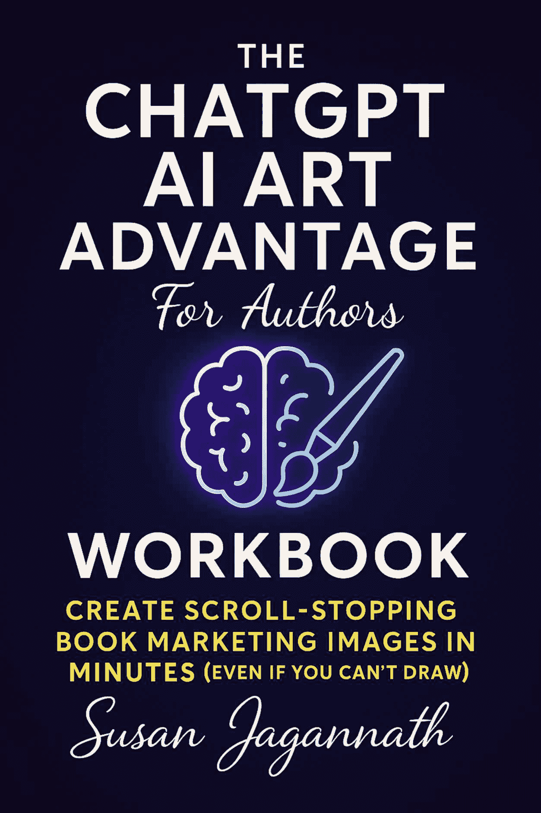
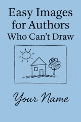
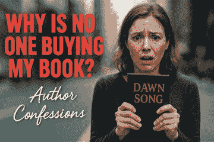
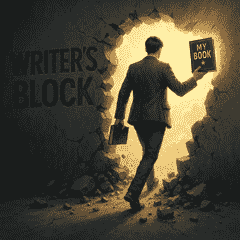

# 伙伴工作手册：作者的 ChatGPT AI 艺术优势

> 原文：[Companion Workbook: The ChatGPT AI Art Advantage for Authors](https://annas-archive.gl/md5/f5592d994f155694507e450dd18c5943)
> 
> 译者：[飞龙](https://github.com/wizardforcel)
> 
> 协议：[CC BY-NC-SA 4.0](https://creativecommons.org/licenses/by-nc-sa/4.0/)

# **引言**

**欢迎，作者！**

如果您已经阅读了《ChatGPT AI 艺术优势作者指南》，您知道为您的书籍营销创建引人注目的视觉元素不必令人畏惧或昂贵，即使您觉得自己在图形设计方面有挑战。那本书奠定了基础，向您展示了使用 ChatGPT 4o 等工具将您的视觉想法变为现实的无穷潜力。

现在，是时候将知识付诸实践了！这本配套工作簿是您的动手指南，逐步引导您通过创建专为您的书籍量身定制的引人注目的营销视觉元素的过程。把它看作是您所学概念的实用应用实验室。

**工作簿目标**

本工作簿的目标简单但强大：

+   **建立信心**：从理解 AI 艺术概念到自信地生成自己的视觉元素。

+   **培养实用技能**：掌握提示技巧、精炼图像以及将 AI 应用于特定的营销需求，如社交媒体图形和封面概念。

+   **创建有形资产**：在本工作簿结束时（尤其是如果您加入现场挑战的话！），您将拥有一套适用于您书籍的可用营销视觉元素。

+   **节省时间和金钱**：学会高效利用 AI，释放资源用于您最擅长的写作。

**如何使用本工作簿**

本工作簿是灵活的。您可以按自己的节奏完成它，将练习直接应用于您当前的书本项目。

它还专门设计来配合书籍，**《ChatGPT AI 艺术优势作者指南》** [The ChatGPT AI Art Advantage for Authors](https://alsoby.me/r/amazon/B0FB1WY5PW?fc=au&ds=1) 。如果您正在参加挑战，每个模块对应一天的重点，练习将是我们的现场会议和活动的主要内容。在练习中寻找“挑战活动准备”的说明！

**与书籍连接**

本工作簿直接基于"[The ChatGPT AI Art Advantage for Authors](https://alsoby.me/r/amazon/B0FB1WY5PW?fc=au&ds=1)"。我们将经常引用书中的概念、示例和章节。手头有原始书籍将丰富您的体验，但这里的核心练习旨在独立行动，前提是您掌握了书中涵盖的基本知识。

**所需工具**

为了最大限度地利用本工作簿，您将需要：

1.  **访问 ChatGPT 4o**：确保您有一个账户（免费或付费）并且熟悉基本界面。

1.  **网络浏览器**：用于访问 ChatGPT。

1.  **本工作簿**：无论是数字版本（您可能可以直接填写）还是印刷版本（有足够的空间记录笔记和想法）。

1.  **（推荐）您的《ChatGPT AI 艺术优势作者指南》副本**：方便查阅。

准备好使用您自己创建的视觉元素来转型您的作者营销吗？让我们开始吧！

[你还可以跟随在线挑战！](https://susanjagannath.gumroad.com/l/TCA-1)

# 1 作者的视觉策略与心态

本模块帮助你完成在 AI 图像创作之前的基本准备工作。我们将把你在《ChatGPT AI 艺术优势作者指南》中讨论的书籍核心信息与视觉概念联系起来，并了解你目标受众的视觉偏好。

在这里获取这份工作簿的印刷版。

## 练习 1.1：为视觉翻译定义你的书籍核心信息

**目标：** 将你的书籍的中心主题或承诺用关键词和概念表达出来，这些可以用来指导你的视觉创作。

**参考：** 回想一下《ChatGPT AI 艺术优势作者指南》的序言和第一章。你为什么写这本书？你希望读者获得的最重要的收获是什么？

**这样做：**

1.  **总结你的书籍核心信息：** 用一句话或两句话概括你的书籍的精髓。它解决了什么问题，或提供了什么转变？*你的答案：*

1.  **识别关键主题/概念：** 列出你在书中探讨的 3 个主要主题、想法或概念。

+   主题 1：

+   主题 2：

+   主题 3：

1.  **头脑风暴视觉关键词：** 对于上述每个主题，头脑风暴 5-10 个代表其视觉意义的词汇或短语。考虑物体、动作、情感、环境和符号。

+   主题 1 关键词：

+   主题 2 关键词：

+   主题 3 关键词：

1.  **识别核心情感：** 你希望你的书籍视觉元素唤起的主要情感是什么（例如，赋权、好奇心、缓解、兴奋、平静、紧迫）？*你的答案：*

**挑战活动准备：** 保留这个清单！这些关键词和核心情感将是你在第 2 模块中第一个 AI 图像提示的起点。

## 练习 1.2：了解你的受众喜好

**目标：** 理解你理想读者的视觉风格和偏好，帮助你创建他们能够产生共鸣的营销材料。

**这样做：**

1.  **描述你的理想读者：** 简要描述你的目标读者（年龄、兴趣、挑战、抱负）。他们是谁？*你的答案：*

1.  **他们在网上哪里活跃？** 列出你的理想读者经常访问的社交媒体平台、网站或在线社区。*你的答案：*

1.  **他们喜欢什么样的视觉元素：** 思考你列出的在线空间中普遍存在的图像类型、颜色和风格。什么似乎吸引了他们的注意？

+   图像类型（例如，照片、插图、表情包、信息图表）：

+   色彩搭配（例如，明亮、柔和、

+   专业）

+   **整体风格（例如，现代、复古、极简、大胆、艺术）：**

1.  **哪些视觉元素是禁忌：** 有哪些视觉风格或图像类型可能会使你的理想读者感到疏远？*你的答案：*

1.  **视觉偏好总结：** 根据上述内容，用几句话总结你目标受众可能的视觉偏好。你的营销视觉应该追求什么样的外观和感觉？*你的答案：*

**挑战活动准备：** 理解受众的视觉语言有助于你为最大影响调整你的 AI 提示。在后续模块中制作提示时，考虑这些偏好。

# 2 精通提示对话

本模块侧重于将你的视觉想法转化为有效的 ChatGPT 4o 提示，基于《作者 ChatGPT AI 艺术优势》第二章和第三章中讨论的技术。

## EXERCISE 2.1：分析书中的提示

**目标：** 通过分解书中提供的示例提示来理解每个组件的功能。

**参考：** 回顾书中第三章的提示示例（例如，资深作者、减肥的行人、电子书封面）。

**说明：** 从第三章中选择一个详细的提示。

使用书中提到的结构（或自己识别关键元素）将其分解为其核心组件。

1.  **书中选择的提示：**

1.  **提示分解：**

+   主题：

+   动作：

+   场景/背景：

+   关键物体：

+   情感/氛围：

+   风格/艺术方向：

+   光照/氛围：

+   摄像机角度/构图（如果指定）：

+   其他细节：

1.  **反思：** 这个提示为什么有效？每个组件是如何贡献到书中描述的最终图像的？

## EXERCISE 2.2：为你的书籍主题制作基本提示

**目标：** 练习根据模块 1 中确定的关键词和核心信息编写初始提示。

**参考：** 使用你在练习 1.1 中的答案（核心信息与关键词）和书中第三章讨论的提示结构。

**说明：**

1.  **选择核心主题：** 从练习 1.1 中为你的书籍确定的一个关键主题中选择一个。*选择的主题：*

1.  **选择关键词：** 从这个主题中挑选 3-5 个相关的视觉关键词。*关键词：*

1.  **起草基本提示：** 将你的关键词与基本元素（主题、动作、场景）结合，为 ChatGPT 4o 创建一个简单、清晰的提示。目标是描述性句子。*初始提示草案：*

1.  **生成图像：** 将你的提示输入到 ChatGPT 4o 中。*(可选：粘贴或描述生成的图像)*

1.  **重复：** 为至少两个其他主题/关键词集从练习 1.1 中起草基本提示。

**挑战活动准备：** 带上你起草的提示和生成的图像（如果有）参加提示制作研讨会。

## EXERCISE 2.3：使用风格关键词进行实验

**目标：** 探索添加风格关键词如何显著改变 AI 生成图像的外观和感觉。

**参考：** 考虑不同的视觉风格可能性（*逼真、插画、水彩、卡通、极简、复古*）。

**说明：**

1.  **选择基本提示：** 从练习 2.2 中选择的提示之一（或使用一个简单的新提示，如“一只猫坐在一堆书上”）。*基础提示：*

1.  **生成基础图像：** 将基础提示输入到 ChatGPT 4o 中。*(可选：注意结果)*

1.  **添加风格关键词：** 通过向基本提示中添加不同的风格关键词来生成新图像。尝试至少 3 种不同的风格。

+   提示 + 风格 1（例如，"..." 以逼真风格呈现）:

+   提示 + 风格 2（例如，"..." 作为水彩插画）:

+   提示 + 风格 3（例如，"..." 以复古卡通风格呈现）:

1.  **观察差异：** 风格关键词如何改变了输出？哪些风格可能适合你的作者品牌和目标受众（参考练习 1.2）？

**挑战活动准备：** 理解风格关键词对于控制你的视觉美学至关重要。

哪些风格对你的提示最有效？

# 3 迭代和细化技术

在本模块中，你将利用 ChatGPT 4o 的对话能力细化 AI 生成的图像，基于《作者用 ChatGPT AI 艺术优势》第三章的示例。

## 练习 3.1：细化提供的图像（引导示例）

**目标：** 通过逐步修改起始图像来练习常见的细化技术。

**参考：** 回忆第三章中展示的迭代过程，其中高级作者图像被修改。

**说明：**

**1. 起始提示：** 使用 ChatGPT 4o 生成以下提示的图像：

*创建一个舒适的阅读角落图像，包括一个舒适的扶手椅、一张小侧桌、一个冒着热气的杯子，以及一个摆满彩色书籍的书架。让它成为晚上，有温暖的灯光。*

生成图像并观察结果

备注：

**细化 1（添加细节）：** 使用以下提示让 ChatGPT 修改图像：

*添加一只蜷缩在扶手椅上的睡猫。*

生成图像并观察结果

备注：它是否自然地融合了猫？

**细化 2（改变风格/情绪）：** 现在，使用以下提示

*将风格改为稍微更富有想象力的插画风格，不太逼真。*

生成图像并观察结果

注意 - 观察风格变化。它是否保留了核心元素？

**细化 3（纠正元素）：** 假设杯子看起来不正确。使用以下提示：

*将侧桌上的杯子改为鲜艳的红色，并确保它看起来是由陶瓷制成的。*

生成图像并观察结果

备注：*具体的纠正是否准确？*

**反思：** 对话提示如何帮助你引导图像生成？如果你遇到任何挑战，请描述一下？

备注：

## 练习 3.2：迭代您自己的生成图像

**目标：** 将迭代细化技术应用于你在第 2 模块中生成的图像之一。

**参考：** 使用从练习 2.2 或 2.3 生成的图像。

**说明：**

1.  **选择您的图像：** 选择你之前生成的图像之一进行改进或修改。*描述起始图像和使用的提示：*

1.  **确定所需的变化：** 你想做出哪些具体的变化？（例如，改变主题的表情，添加一个物体，改变背景，修复错误，改变颜色）。*列出 2-3 个期望的变化：*

1.  **使用+按钮上传起始图片**

1.  **与 ChatGPT 迭代：** 与 ChatGPT 4o 进行对话，每次只要求一个变化。记录你使用的提示并观察结果。

1.  *变化 1 的提示：*

+   *关于结果的说明：*

1.  *变化 2 的提示：*

+   *关于结果的说明：*

1.  *变化 3 的提示：*

+   *关于结果的说明：*

1.  **评估最终图像：** 你离预期的结果有多近？哪些精炼提示最有效或最无效？

**挑战活动准备：** 带上你的前后图像（或只是最终精炼的图像及其迭代的故事）参加现场故障排除会议。

# 4 创建社交媒体和内容视觉

在本模块中，你将专注于生成吸引人的博客、社交媒体和在线内容的图形，这些内容基于《ChatGPT AI 艺术优势作者指南》第三章中讨论的实用应用。

## 练习 4.1：为你的书的话题生成博客标题

**目标：** 为与你书的内容相关的博客文章创建引人注目的标题图片。

**参考：** 回忆书中第三章的博客和社交媒体图像示例。

**说明：**

1.  **确定博客主题：** 列出 3 个有助于推广你的书或分享相关内容的潜在博客文章主题。

+   主题 1：

+   主题 2：

+   主题 3：

1.  **为话题 1 草拟标题图像提示：** 使用模块 2 中的提示技术，为博客标题图像编写详细的提示。请记住指定：

+   主题

    +   背景/环境

    +   情绪/氛围

    +   风格

    +   需要包含的任何文本

    +   尺寸（例如，“一个水平的博客标题图片”）

*你的提示：*

1.  **生成和评估：** 使用 ChatGPT 4o 生成图像。它是否有效地代表了你的博客主题？是否会吸引注意力？有哪些可以改进的地方？

1.  **使用模块 3 技术进行精炼：** 应用至少一个精炼来改进图像。*精炼提示：*

1.  **为其他主题重复：** 为你的其他博客主题创建提示，应用从第一次尝试中学到的知识。

## 练习 4.2：从你的书中创建可分享的引言图形

**目标：** 将你书中的关键引言或洞见转化为可分享的社会媒体图形。

**说明：**

1.  **选择关键引言：** 从你的书中选择 3 个简短、有影响力的引言或洞见，这些内容可以成为良好的可分享内容。

+   引言 1：

+   引言 2：

+   引言 3：

1.  **设计引言图形：** 对于你的第一条引言，创建一个将生成具有文本叠加的吸引人背景的提示。考虑：

+   哪些视觉元素可以补充引言？

    +   什么风格会吸引你的目标受众？

    +   什么颜色能唤起正确的情绪？

    +   文本应该如何定位？

*你的提示：*

1.  **生成和故障排除：** 使用 ChatGPT 4o 创建引言图形。如果文本无法正确渲染（这是一个常见挑战），请尝试以下方法：

+   要求文本“浮动”或“叠加”

    +   请求一个更简单的背景，以免与文本竞争

    +   要求文本更大或使用不同的颜色以增加对比度

*故障排除提示：*

1.  **平台特定变化：** 选择您的一句话，并创建针对不同平台优化的变体：

+   Instagram 的方形格式：

+   Pinterest 的垂直格式：

+   Twitter/X 的水平格式：

## 练习 4.3：为免费章节/吸引用户的诱饵设计促销图形

**目标：** 创建一个引人入胜的图形，推广您书籍的免费样本或吸引用户的诱饵。

**说明：**

1.  **定义您的优惠：** 您将提供哪些免费内容来吸引潜在读者？（例如，免费章节、清单、迷你指南）*您的优惠：*

1.  **识别关键卖点：** 读者从您的免费优惠中将获得哪些 2-3 个好处？

+   优点 1:

+   优点 2:

+   优点 3:

1.  **制定促销图形提示：** 创建一个吸引注意力的促销图像的详细提示。包括：

+   代表您的优惠的视觉元素

    +   要包含的文本（例如，“免费章节”和简短描述）

    +   行动号召（例如，“立即下载”）

    +   与您的作者品牌相匹配的风格（来自第 1 模块）

*您的提示：*

1.  **生成和细化：** 使用 ChatGPT 4o 创建图像，并进行任何必要的细化。*细化提示：*

1.  **反思：** 您的促销图形效果如何？它会吸引您的目标受众索要免费优惠吗？

**挑战活动准备：** 对于迷你活动创建活动，计划创建 3 个相关的社交媒体帖子，这些帖子可以一起推广您的书籍或免费优惠。

# 5 个书籍封面概念化

在本模块中，您将专注于使用 ChatGPT 4o 头脑风暴、概念化和生成草案书籍封面，这些内容基于《ChatGPT AI 艺术优势作者指南》第三章的示例。

## 练习 5.1：为您的书籍头脑风暴封面概念

**目标：** 使用 AI 作为头脑风暴伙伴，为您的书籍封面生成多样化的视觉概念。

**参考：** 考虑第 1 模块中确定的核心信息、主题和关键词，以及第三章的封面生成示例。

**说明：**

1.  **抽象概念提示：** 请 ChatGPT 4o 提出代表您书籍核心信息的 3-5 个抽象视觉概念或隐喻（来自练习 1.1）。现在不要要求图像，只需想法。

+   提示：*为关于[您的书籍核心信息]的书籍提出 3-5 个抽象视觉概念或隐喻。*

+   ChatGPT 建议：

1.  **具体图像提示：** 请 ChatGPT 4o 提出代表您书籍一个关键主题的 3-5 个具体图像或场景（来自练习 1.1）。

+   *提示：* 建议代表[您选择的主题]书籍封面的 3-5 个具体图像或场景。

+   *ChatGPT 建议：*

1.  **选择可能的概念：** 从上述建议中选择 2-3 个（抽象或具体）你认为对潜在的书封面最有吸引力的概念。

+   概念 1：

+   概念 2：

+   概念 3：

**挑战活动准备：** 这些概念将成为你下一个练习中封面样图的基础。

## **练习 5.2：提示书封面样图**

**目标：** 将你选择的概念翻译成用于生成 AI 书封面样式的详细提示。

**参考：** 使用第三章（标题、副标题、图像、风格、作者姓名、布局、宽高比）中详细的书封面提示结构。

**说明：**

1.  **选择一个概念：** 从练习 5.1 中选择的封面概念中选择一个。*所选概念：*

1.  **草拟详细封面提示：** 为 ChatGPT 4o 编写一个全面的提示，以根据你的概念生成 6x9 电子书封面样图。包括：

+   书名：[你的书名]

    +   副标题（可选）：[你的副标题]

    +   图像描述（基于你的概念）：

    +   **期望的风格（例如，现代、摄影、插图、极简主义）：**

    +   字体风格建议（例如，标题使用干净的无衬线字体，姓名使用手写体）：

    +   色彩搭配建议：

    +   作者姓名：[你的姓名]

    +   布局说明（例如，标题顶部，图像居中，姓名底部）：

    +   宽高比：6x9 垂直电子书封面

**你的完整提示：**

**创建一个全 6x9 垂直书封面，标题为：<你的规格>**

**生成和评估：** 使用你创建的提示生成封面样图。

结果：它如何捕捉你的概念？哪些地方做得好？哪些需要改进？（记住，AI 封面通常最好作为人类设计师灵感的来源，正如书中所讨论的）。

1.  **生成变体：** 请 ChatGPT 创建 2 个封面变体。尝试改变：

+   风格（例如，使其更具插图风格）

    +   色彩搭配（例如，使用更温暖的色彩搭配）

    +   主要图像略有变化（例如，从不同的角度展示主题）

+   **变体 1 提示：**

+   **变体 2 提示：**

1.  **为另一个概念重复：** 为练习 5.1 中的第二个封面概念草拟提示并生成样图。

**挑战活动准备：** 带上你最喜欢的 AI 生成的封面样图（或创建它们的提示）参加封面概念展示会。

**模板 5.1：AI 书封面提示构建器**

使用此模板来构建你的 AI 封面生成提示。

+   **行动：** 创建一个全尺寸/格式的封面，标题为：“[你的书名]”

+   **副标题（可选）：** 在标题下方包含一个副标题：“[你的副标题]”

+   **图像：** 主要视觉应该是[场景、主题、物体、动作的详细描述]。

+   **风格：** 整体风格应该是[例如，逼真的摄影、极简主义插图、复古、现代图形]。使用[色彩搭配描述，例如，冷蓝和灰色]的色彩搭配。

+   **字体：** 使用[字体风格，例如，干净的衬线字体]字体用于标题，[字体风格]用于副标题，以及[字体风格，例如，优雅的手写体]字体用于作者姓名。

+   **布局：**放置标题[例如，在顶部、居中对齐]，主要视觉[例如，在中心]，以及作者姓名"[您的姓名]"[例如，在底部]。确保良好的间距和专业布局。

+   **氛围/情绪：**氛围应感觉[例如，鼓舞人心、神秘、实用、激动人心]。

**模板 5.2：简单封面设计简报**

如果使用 AI 模拟来向人类设计师说明，请适应此模板。

+   **书名：**

+   **作者姓名：**

+   **副标题（可选）：**

+   **类型：**

+   **目标受众：**

+   **核心信息/主题：**

+   **整体氛围/感觉：**

+   **关键视觉概念（包括 AI 模拟示例）：**

+   **强制元素（如有）：**

+   **颜色偏好/排除：**

+   **风格偏好（如有可能包括示例）：**

+   **您喜欢的封面示例（属于您的类型）：**

+   **您不喜欢的封面示例：**

# 6 生成广告和促销图形

在本模块中，您将专注于创建专门用于营销活动和广告的视觉内容，基于《ChatGPT AI 艺术优势作者指南》第三章的示例。

## 练习 6.1：为您的书籍制作 Facebook 广告图形

**目标：**创建适合 Facebook 等平台的有效广告图形，以推广您的书籍。

**参考：**回忆第三章的 Facebook 风格广告示例。

**说明：**

1.  **定义广告目标：**此广告的主要目标是什么？（例如，推动书籍销售、通过免费章节生成潜在客户、提高知名度）*您的目标：*

1.  **确定关键信息/钩子：**对您的目标受众来说，最吸引人的单一信息或钩子是什么？*您的钩子：*

1.  **草稿广告图形提示：**创建一个详细的 Facebook 广告图形提示（通常为 1.91:1 或 1:1 比率）。包括：

+   代表钩子或书籍益处的视觉元素

    +   情感基调（例如，紧迫的、鼓舞人心的、相关的）

    +   要叠加的关键文本（保持简短且具有影响力！例如，书名、钩子、行动号召如“了解更多”或“现在购买”）

    +   与您的品牌风格一致

    +   目标受众代表（如适用）

*您的提示：*

1.  **生成和评估：**使用提示。图片是否吸引注意力？文本是否清晰（或可以稍后轻松添加）？它是否传达了预期的信息和情感？

1.  **精炼以提高清晰度/影响力：**使用迭代提示来提高视觉清晰度、情感影响或文本渲染（如果尝试过）。*精炼提示：*

## 练习 6.2：创建简单的视觉清单/提示单

**目标：**将您书中的内容改编成简单、可分享的信息图或视觉清单。

**参考：**思考您书中提出的可操作建议或步骤。

**说明：**

1.  **选择列表内容：**选择 3-5 项来自您书籍的可操作提示、步骤或关键要点。

+   第 1 项：

+   第 2 项：

+   第 3 项：

+   第 4 项：

+   第 5 项：

1.  **选择视觉格式：**决定一个简单的视觉格式（例如，带图标的编号列表、清单风格、简单的流程图）。*格式选择：*

1.  **草稿信息图表提示：** 为 ChatGPT 4o 创建一个生成此视觉的提示。提示：*创建一个简单的信息图表：*

+   每个项目的文本/内容

    +   所需的布局/格式（例如，“创建一个简单的垂直编号列表型信息图表…”）

    +   每个点的相关图标或简单插图

    +   整体风格和色系

    +   图形的标题（例如，“5 个技巧…”）

+   *您的提示：*

1.  **生成和评估：** 创建图形。布局有多清晰？文本是否可读？视觉元素是否有帮助？（注意：AI 可能在复杂布局或精确文本定位方面遇到困难；专注于正确地获取核心元素）。

1.  **如有需要简化：** 如果 ChatGPT 遇到困难，简化请求。分别请求背景和图标，然后计划使用像 Canva 这样的简单工具添加文本，如果需要的话。

+   简化提示示例：

+   *创建一个干净的背景图形，包含 5 个不同的部分，每个部分都包含与[您的主题]相关的简单图标。使用[颜色]色系。*

**挑战活动准备：** 将您生成的广告图形或信息图表概念带到广告图形批评会议。

![Image00007.jpg]

# 7 为爱而爱文字

在这个练习中，让我们使用文字作为图形的来源。

小贴士：您也可以将其用作标志的起点

## 练习 7.1：生成文本视觉

**目标：** 创建图像或文本作为图像来推广您的书籍。

**参考：** 回想第九章中的引言，考虑您的主题和读者可能喜欢的内容。

**说明：**

让我们用 Chat 生成一些引言。在你的主题上，比如旅行、健康或育儿。

提示

*创建<X>个受<主题>启发的励志引言，将字数限制在 6 个字以内*

您的提示

现在您有了引言，选择几个开始。

*提示示例 - 为“山移心志”这句话创建一个现代书法风格的标志。使其为黑白，看起来像是手绘的，包括一些螺旋图案*

*您的提示：*

*结果*

1.  **生成和评估：** 使用提示。图片是否吸引注意力？文本是否清晰（或可以稍后轻松添加）？它是否传达了预期的信息和情感？

1.  **精炼以增强清晰度/影响力：** 使用迭代提示来提高视觉清晰度、情感影响力或文本渲染（如果尝试过）。*精炼提示：*

![Image00008.jpg]

# 8 集成与下一步

本模块帮助您巩固工作簿中的学习，并计划您如何继续使用 AI 创建您的作者营销视觉元素。

## 练习 7.1：回顾您的作者视觉工具包

**目标：** 捕获在整个工作簿中创建的视觉元素和学到的技能。

**说明：**

1.  **收集您的创作：** 回顾模块 2-6 中的练习。列出您成功生成（或接近生成）的不同类型的视觉元素。

    +   创建的视觉元素类型：

1.  **识别你的优势**：你现在对 AI 图像生成过程的哪个部分最有信心？（例如，编写初始提示，细化图像，生成特定风格，创建封面概念）*你的优势：*

1.  **改进领域**：哪些方面仍然感觉具有挑战性或需要更多练习？*练习领域：*

1.  **最喜欢的创作**：在练习中生成的哪个图像让你最自豪或发现最有用？为什么？*最喜欢的创作及原因：*

## **练习 7.2：规划你的视觉内容策略**

**目标**：制定一个简单的计划，将 AI 生成的视觉融入你持续进行的书籍营销活动中。

**说明：**

1.  **优先考虑视觉需求**：根据你的书籍营销目标，你定期需要创建的 2-3 种最重要的视觉类型是什么？（例如，社交媒体帖子、博客标题、广告图形）

+   优先级 1：

+   优先级 2：

+   优先级 3：

1.  **设定创作目标**：你打算多久使用 AI 创建一次新的视觉内容？（例如，每周、两周一次、每月）*创作频率：*

1.  **分配时间**：现实地讲，你每周/每月可以投入多少时间用于 AI 视觉创作？*时间分配：*

1.  **内容日历整合**：你将如何将视觉创作整合到现有的内容规划过程中？（以下使用模板 7.1 开始）。

**模板 7.1：简单的视觉内容日历**

使用此模板来规划你即将到来的视觉内容需求。根据需要调整。

不要让它过于复杂，一个简单的电子表格就足够了。

**周/月**

**营销目标/主题**

**需要的视觉类型**

**关键信息/概念**

**提示想法/关键词**

**状态（计划中、生成中、已发布）**

在这里获取这份工作簿的印刷版。

# 9 个奖励

这里有一些额外的材料可以帮助你在 AI 之旅中。

**清单**

使用 AI 支持你的策略——而不是取代你的判断。这里有一个简单的清单 - [`susanjagannath.com/tcaaaa-bonus/`](https://susanjagannath.com/tcaaaa-bonus/)

**提示列表**

这里列出了原始书籍中使用的所有提示，以及示例图像。 - [`susanjagannath.com/tcaaaa-bonus/`](https://susanjagannath.com/tcaaaa-bonus/)

想要分享处理提示的挑战？还有更多？

[`<wbr> susanjagannath.<wbr> gumroad.<wbr> com/<wbr> l/<wbr> TCA-1`](https://susanjagannath.gumroad.com/l/TCA-1)

视觉日历 - [`<wbr> susanjagannath.<wbr> com/<wbr> tcaaaa-<wbr> bonus/`](https://susanjagannath.com/tcaaaa-bonus/)

[如果你还没有，请获取这本书！](https://alsoby.me/r/amazon/B0FB1WY5PW?fc=au&ds=1)

在这里找到更多帮助

[`<wbr> linktr.<wbr> ee/<wbr> susanjagannath`](https://linktr.ee/susanjagannath)

# **继续前进**

**准备，设置，创作：释放你的 AI 艺术优势**

你现在拥有了将你的想法转化为令人惊叹的视觉现实所需的基本知识和工具。有了 ChatGPT 4o，那些与复杂的图形设计软件作斗争、在自由职业者身上耗尽预算，或者满足于与你的写作不相匹配的视觉的日子已经过去了。

作为一名作者，你的创造力在于讲故事和用词——现在你的视觉元素也能为你的写作增色添彩，无需压力或重大开销。请记住保持一致性，始终在提示中清晰沟通，并尊重道德规范以保护你的品牌。

你的下一步：

+   **创建提示库**：保留你成功提示的列表，以便快速重复使用。

+   **测试和迭代**：不要犹豫去实验。使用反馈循环来完善你的视觉内容。

+   **利用你的新技能**：将这些视觉内容创作技巧应用到你的博客、社交媒体、营销活动、书封面和品牌材料中。

现在，去探索并开始使用 ChatGPT 4o 的全部力量——以前所未有的速度创建引人入胜、专业质量的视觉内容。

你的读者和你的品牌都会感谢你。

[你还可以在线挑战中跟随！](https://susanjagannath.gumroad.com/l/TCA-1)

[如果你还没有这本书，现在就把它买下来！](https://alsoby.me/r/amazon/B0FB1WY5PW?fc=au&ds=1)

# **关于作者**

苏珊·贾甘纳斯成功地将阅读的热情、写作的热爱和对技术的着迷结合起来，在决定转而写她想要写的书之前，她已经在技术写作领域建立了职业生涯。拥有超过 50 本技术手册（不是），是时候做一些不同的事情了，去冒险，帮助他人去冒险，并以自己的名字写书。

作为一名军二代，她的童年包括了七所不同的学校、三所大学，以及从冲突区域进行的几次紧急疏散。旅行和冒险是常态。她相信抓住每一个机会去体验新的冒险。无论是澳大利亚海滩上的露营、喜马拉雅山脉的徒步、昆士兰州的皮划艇、恒河的激流皮划艇，还是西班牙的圣地亚哥之路，她的哲学是将这些经历压缩在一两周内，为一生创造记忆，最好是和家人朋友一起。

苏珊现在正在进行她的下一次冒险；写不像是技术手册的书，帮助他人写作和出版，并计划她的下一次冒险，永远如此。

如果你想了解更多关于苏珊·贾甘纳斯书籍的信息，请通过电子邮件联系她：susan@xpresswords.com

[`linktr.ee/susanjagannath`](https://linktr.ee/susanjagannath)

[Facebook](https://www.facebook.com/susanjagannath)

[Instagram](http://Instagram.com/susanjagannath)

# **苏珊·贾甘纳斯的其它作品**

[`linktr.ee/susanjagannath`](https://linktr.ee/susanjagannath)

# **ChatGPT AI 艺术优势为作者带来**

## **几秒钟内创建令人惊叹的书籍营销图像（即使你不会画画）**

书籍的样本页面。

# 1 为什么 AI 艺术是你书籍的最佳朋友

作者可以写出精彩的书，但要真正卖出它们，作者还需要成为营销人员和插画师，这可能会成为一个问题，因为这些是不同的技能集。

正因如此，许多新作者认为他们需要一个传统的出版协议，其中出版商负责所有市场营销的杂事——听起来不错——我只需要写作，出版商就会负责将你的文字变成有形产品的所有细节——一本可以销售的书籍。不幸的是，由于对于新作者或不太出名的专家来说，获得传统出版商很困难，我们中的许多人已经成功尝试并从自出版中获益。

然而，虽然你可以让朋友帮忙编辑和反馈，但你仍然需要一个能够创作出引人入胜的图形的专家，由于图形对将你的书籍变成产品带来的巨大价值，他们收费很高。直到现在，像我这样的图形挑战者对 AI 提示感到高兴，这使得编写指令并让艺术家遵循它成为可能。虽然人类插图画家一直是最佳选择，但他们往往很贵，对于大多数独立作者来说难以触及，尤其是当我们需要大量视觉元素来营销我们的书籍时。没有营销，我们的书籍将难以找到那些会喜欢这本书的读者。

当 ChatGPT 引入 DALL-E 时，作者和其他人都很兴奋，直到他们遇到了使用这个工具生成图像时遇到的许多障碍。我知道我为此购买了信用额度，这些额度现在还躺在互联网的黑暗深渊中，或者我的硬盘里。提示 DALL-E 并得到你希望得到的东西非常困难。它不仅不能掌握任何类型的文本添加到图像中，而且更令人沮丧的是，你不能迭代和调整图像以使其更好，而不会将其完全改变成全新的图像。

现在，OpenAI 已经从 DALL-E 转变为 ChatGPT 4o 的本地图像生成，不再是碰运气式的功能。这意味着你可以停止为在线营销需求支付额外的 AI 图像工具费用。虽然免费账户每天可以生成的图像数量有限，但你现在可以访问一个响应式图像创建器，它可以与你进行对话，而不是强迫你每次都要从头开始进行每一个修改。

这使得图像处理变得更快，并且更符合你细分市场的需求，无论你计划在哪个平台上发布图形。我们将深入探讨如何利用这个新更新来丰富你内容的相关资料。由于这是一个相对较新的功能，所以你可能会遇到一些小问题。但好消息是，它更容易修正和纠正任何类型的小错误，就像你在其他一些更高级的图像生成 AI 工具中做的那样。

此外，想想你可以节省的时间，而不是学习新的图形工具、测试、重新测试和重新生成，你可以用这些时间来写你的下一本书。

它极大地缩短了你的上市时间。

# 2 在 ChatGPT 4o 中开始图像生成

免费层级的用户每天可以生成三张图像，如果你是 Plus 版本或团队订阅者，则可以生成更多。你还需要有一个与 ChatGPT 兼容的浏览器——或者使用 ChatGPT 移动应用。

## 设置成功：图像生成基础

理想情况下，如果你试图创建图像，使用更大的屏幕，因此你需要一台台式机而不是在移动设备上尝试制作。作为一名作者，我在家时总是使用显示器，而不是笔记本电脑屏幕。后者我保留用于旅行。

要开始使用，请与 ChatGPT 开启一个新的聊天窗口并选择 4o 模型。

就你需要图像进行简单的对话。

例如，如果你是一位与老年人合作撰写书籍的作者，你可能会有这样的提示：

提示：

*“创建一幅画面：一位年长的女性作者在喜马拉雅山脉阳光明媚的办公室里快乐地敲击着她的笔记本电脑。请包括舒适的装饰和放在她<桌子>上的咖啡杯。”*

当你这样做时，你可能会得到以下这样的结果作为起点来工作：

注意它如何正确地处理了一些细节，比如手部和对于喜马拉雅山脉和桌子上咖啡杯的特定要求。

提示：你可以自己尝试，或者和我一起尝试。跟随挑战 - [`<wbr> susanjagannath.<wbr> gumroad.<wbr> com/<wbr> l/<wbr> TCA-1`](https://susanjagannath.gumroad.com/l/TCA-1)
