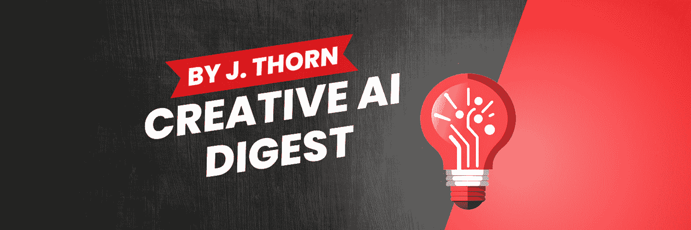

## 获取资源！

不要错过！立即获取所有最新和最棒的创意人工智能资源。

只需点击这里，我将通过电子邮件发送给您完整的列表，包括本指南中提示的模板：

[`theauthorlife.com/aistorytelling/`](https://theauthorlife.com/aistorytelling/)

您将订阅我的每周通讯《创意人工智能摘要》。如果您已经订阅了《创意人工智能摘要》，只需回复任何一封电子邮件，我将回复您并提供资源链接。

## 关键词

此关键词和关键词短语列表旨在帮助机器人和搜索引擎将本书与正确的读者匹配。

个人风格指南

写作风格定制

ChatGPT 写作

非虚构写作风格

创意专业写作

语音和语调指南

语言和措辞指南

语法和标点偏好

句子结构定制

写作中的包容性

写作风格指南模板

人工智能辅助写作

面向专业人士的 ChatGPT

风格指南创建

使用人工智能进行内容个性化

面向营销人员的 ChatGPT

销售写作风格指南

独特的写作风格

写作风格一致性

由人工智能驱动的风格指南

专业品牌和写作

与 ChatGPT 一起进行创意写作

非虚构写作趋势

内容中的个人轶事

ChatGPT 内容主题

一致的团队写作

机器学习写作指南

个人风格指南修订

用于销售和营销的 ChatGPT

个人品牌写作风格

博客文章风格指南

报告写作定制

ChatGPT 白皮书

自定义内容格式

通过人工智能进行风格指南反馈

英式与美式英语指南

人工智能生成的写作风格

个人风格指南更新

ChatGPT 创意技巧

非虚构写作技巧

风格指南见证

面向创意专业人士的 ChatGPT

非虚构内容个性化

写作风格对齐

ChatGPT 风格指南示例

个人风格指南方法论

ChatGPT 写作见解

优化内容创作

人工智能写作中的语音保留

个性化内容策略
