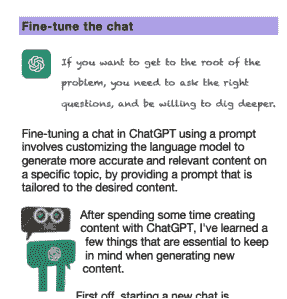
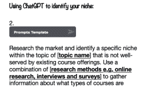
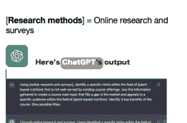
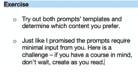
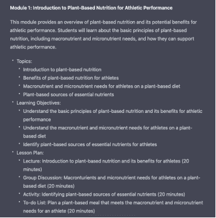

## 即将到来的页面

感谢您的购买并抽出时间阅读我的书。

我知道您已经准备好向世界展示您是一位多么出色的老师。我已经准备好这份指南，让这个过程对您来说变得轻松。

本指南充满了有用的技巧和窍门，可以让您作为教育工作者的生活更轻松、更高效。

我知道为课程准备内容可能令人生畏，但借助 ChatGPT 和我的帮助，您会惊讶于这个过程可以变得多么简单和快速。

主要好处：

ChatGPT 将彻底改变您的课程创建过程

提示模板设计为您提供最少的输入

无忧体验

无缝的课程创建过程

有用的技巧和窍门，让您作为教育工作者的生活更轻松、更高效

更快速、更轻松地创建内容

不再盯着空白屏幕或被大量信息所压倒

在短时间内创建高质量且引人入胜的内容

是时候掌控自己的生活，成为我所知道的最优秀的老师。

## 目录

即将到来的页面

首先了解基础知识！

ChatGPT

如何访问 ChatGPT

ChatGPT 平台布局

ChatGPT 3.5 和 ChatGPT 4

在线课程

在线课程创建中的 3 个关键点

旅程

8 个关键元素

课程创建过程

使用 ChatGPT 创建课程内容

微调聊天

微调提示

1. 确定课程主题：

练习

2. 进行研究：

练习

3. 概述课程大纲

ChatGPT 输出：课程大纲

练习

4. 课程内容

视频脚本

创建待办事项清单

生成测验

反思提示

在线讨论提示

课程演示

课程工作簿

拍摄

5 测试和完善课程：

6 启动课程：

7 支持和学生参与：

8 持续改进课程：

使用 AI 工具从头到尾创建在线课程

AI 工具

AI 的联合努力

无观众销售

在线课程创建清单

结束语

探索更多
