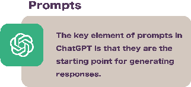
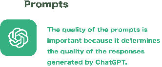
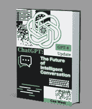
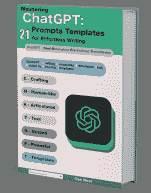

## ChatGPT

ChatGPT（Chat Generative Pre-Trained Transformer）是由 OpenAI 创建的大型语言模型。

它已经在大量文本数据上进行了训练，以生成对各种提示和问题产生类似人类的回应。

提示可以是用来开始对话或请求信息的任何文本片段。

例如，提示可以是一个问题、一个陈述或一个命令。

ChatGPT 使用这些提示生成相关连贯的回应。

高质量的提示具体清晰，并为 ChatGPT 提供足够的上下文，以便理解用户在问或说什么。

相比之下，低质量的提示模糊或含糊不清，可能导致与主题无关或荒谬的回应。

如果您想了解更多关于 ChatGPT 以及它如何通过人工智能改变内容创作领域的信息，请查看我的书籍。

ChatGPT 的工作原理以及您如何从中受益。

生成高质量的提示。

