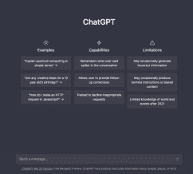
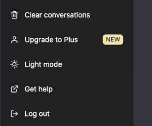
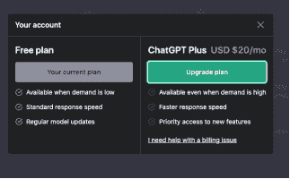
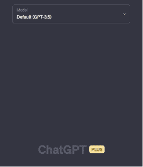
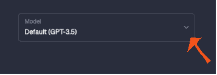
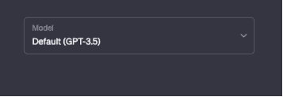
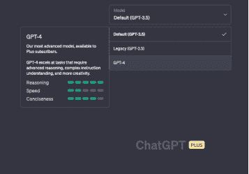

## ChatGPT 3.5 和 ChatGPT 4

OpenAI 最近将 ChatGPT 从 GPT 3.5 升级到 GPT 4。

您可能会想，“有什么不同？”我已经在“ChatGPT：智能对话的未来”中涵盖了所有细节。现在，让我快速介绍一下基础知识。

有什么不同？

GPT 3.5 仅使用基于文本的提示，而 GPT 4 同时使用文本和图像输入。

不幸的是，图像输入功能尚未向公众发布。

GPT 4 更快，您可以随时访问，而 GPT 3.5 仅在需求低时可用。

ChatGPT 3.5 对所有用户免费。您只需创建一个帐户。而要访问 ChatGPT 4，您需要升级到 ChatGPT Plus，每月订阅费为 $20。 （可随时取消。）

访问 ChatGPT 4

一旦您在 ChatGPT 3.5 布局上，

暗模式

在左侧，有这个菜单，

左侧菜单。

注意“升级至 Plus NEW”。

点击那个按钮进行升级并访问 ChatGPT 4。

这是随后出现的窗口。价格为每月 $20。您可以随时取消计划。

ChatGPT 4 升级页面

升级成功后。这将是您的新布局。

ChatGPT Plus 布局

要访问 GPT-4，请点击下拉箭头。

GPT 模型菜单

您将看到一个不同模型的菜单。只需选择 GPT-4 选项即可开始。

––––––––

ChatGPT：ChatGPT Plus 布局

我遇到了这个，试一试再决定是否承诺。

Writesonic 免费访问 GPT-4

本书提供的提示模板适用于 GPT3.5 和 GPT4。

如果您刚开始使用 ChatGPT，它已经足够好来创建您所有的内容。

现在您已经熟悉了您的新助手，让我们继续进行内容创作。

（有了我们的便利助手。
