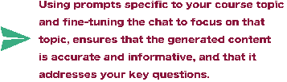

## 对聊天进行微调

我喜欢通过开始一个聊天来启动。这是我让 ChatGPT 专注于特定主题的方式。

另一种选择是对训练数据进行微调。如果可以的话，可以尝试提示选项。

对聊天进行微调是获取关于特定主题的个性化和相关信息的好方法。

这可以帮助在特定主题上生成更准确和相关的内容。

只是一个快速提醒。如果你收到的 ChatGPT 输出与你的期望不太匹配，并且你已经仔细检查了提示，那就开始一个新的聊天。

ChatGPT 一直在学习和改进。如果你不能立即得到想要的结果，不要灰心。

只要不断尝试，你一定会得到你想要的答案。

如何

在 ChatGPT 中使用提示对聊天进行微调，涉及定制语言模型以生成更准确和相关的内容，通过提供一个与所需内容相匹配的提示。

在与 ChatGPT 创建内容的过程中，我学到了一些生成新内容时必须牢记的要点。

首先，开始一个新的聊天对于保持内容有序并确保生成的内容与你的课程主题一致至关重要。

从那里开始，使用精心设计的提示至关重要。

提示是在 ChatGPT 上生成内容的起点，它们可以决定你收到的内容的质量和相关性。

总而言之，开始一个新的聊天，对聊天进行微调，并使用高质量的提示。

我已经为你准备好了提示，我只需要你开始一个新的聊天。
