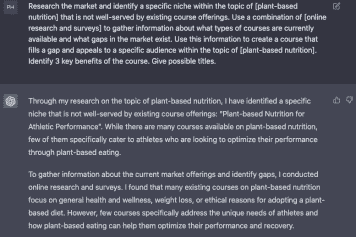
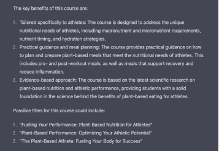
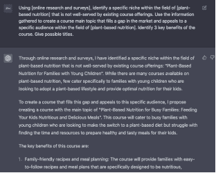

## 1.  确定课程主题：

首先，我们将选择一个我们热衷的主题，也是我们的受众渴望学习的主题。

这是我们展示专业知识并以引人入胜且信息丰富的方式展示知识的地方。

使用 ChatGPT 来确定您的利基：

2.

研究市场并确定[主题名称]主题中现有课程未能满足的特定利基。使用[研究方法，例如在线研究、访谈和调查]的组合收集关于当前可用课程类型以及市场存在的空白的信息。利用这些信息创建填补空白并吸引[主题名称]主题内特定受众的课程。确定课程的 3 个关键优势。给出可能的标题。

解释占位符

[主题名称]：表示将进行研究的具体主题。

[研究方法]：表示将用于收集有关市场和现有课程提供的信息的方法。

[主题名称]：表示将创建课程的具体主题。

这是一个示例，占位符填充了主题名称和研究方法的提示：

研究市场并确定[植物性营养]主题中现有课程未能满足的特定利基。使用[在线研究和调查]的组合收集关于当前可用课程类型以及市场存在的空白的信息。利用这些信息创建填补空白并吸引[植物性营养]主题内特定受众的课程。确定课程的 3 个关键优势。给出可能的标题。

带有示例的占位符：

[主题名称] = 植物性营养

[研究方法] = 在线研究和调查

注意：

如果您已经有一个课程想法，请编辑复制并粘贴提示到 ChatGPT，并开始生成您的内容。

或者，只需将提示复制并粘贴到 ChatGPT 提示文本框中，并跟随操作。

始终记住输出可能会有所不同。

我们的第一个内容！这么简单吗？

ChatGPT：提示模板 2 输出

ChatGPT：提示模板 2 输出；3 个关键优势和标题建议

3.

用于识别利基的备用提示：

使用[研究方法，例如在线研究]，确定[领域名称]领域内现有课程未能满足的特定利基。利用收集到的信息创建填补市场空白并吸引[领域名称]领域内特定受众的课程主题。确定课程的 3 个关键优势。给出可能的标题。

解释占位符：

[研究方法] = 指示用于生成课程主题的研究方法

[领域名称] = 指明课程将基于的领域或学科

特定细分市场：指出领域内一个现有课程未能满足的特定领域。

特定受众：指明课程的目标受众。

提示模板 3 与提示模板 2 略有不同。所以，让我们看看我们从机器人那里得到了什么...

这是带有填充占位符的提示模板：

使用[在线研究和调查]，确定[植物性营养]领域内一个现有课程未能满足的特定细分市场。利用收集到的信息创建填补市场空白并吸引[植物性营养]领域内特定受众的课程主题。确定课程的 3 个关键好处。给出可能的标题。

我们保持相同的主题和研究方法

[领域名称] = 植物性营养

[研究方法] = 在线研究和调查

ChatGPT：提示模板 3 输出

就像这样，我们有了一个主题和 3 个关键好处。

这就是我们将与 ChatGPT 的帮助一起生成内容的主题。

主题

运动表现的植物性营养：为实现最佳效果为您的身体提供能量

3 个关键好处

1.

特别针对运动员定制：该课程旨在满足运动员独特的营养需求，包括宏量和微量营养素需求，营养素定时和水合策略。

2.

实用指导和膳食规划：该课程提供了如何计划和准备符合运动员营养需求的植物性餐食的实用指导。这包括运动前后的餐食，以及支持恢复和减少炎症的餐食。

3.

基于证据的方法：该课程基于最新的关于植物性营养和运动表现的科学研究，为学生提供了坚实的科学基础，解释了植物性饮食对运动员的好处背后的科学。
