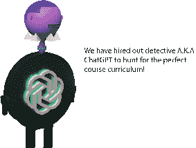
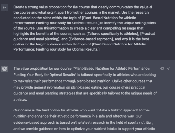
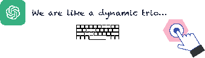
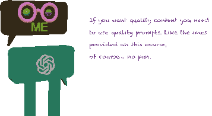

## 2. 进行研究：

接下来，是时候进行一些认真的研究了。我们将深入研究我们的主题，揭示所有有趣的细节，并确定我们可以用课程内容填补的任何空白。

我们都知道谁在做重要的工作。

使用 ChatGPT 进行研究：

4.

为课程创建一个强有力的价值主张，清晰传达课程的价值以及与市场上其他课程的区别。利用在[主题名称]领域进行的研究来确定课程的独特卖点。利用这些信息创建一个清晰而引人注目的信息，突出课程的好处，如[主要优势 1]、[主要优势 2]和[主要优势 3]，以及为什么它是[主题名称]目标受众的最佳选择。

占位符解释：

[主题名称] = 植物性营养在运动表现中的作用：为最佳效果给身体提供能量。

[主要优势 1] = 专门针对运动员

[主要优势 2] = 实用指导和膳食规划

[主要优势 3] = 基于证据的方法

ChatGPT：提示模板 4 输出

创建在线课程从未如此简单！

借助 ChatGPT 的良好结构化提示模板，只需进行一些简单的调整，即可定制您的内容并创建高质量的课程。

我已经为您做好了结构化工作；您需要做的就是微调，ChatGPT 将生成内容。

无需花费数小时来构思想法或担心细节。只需给 ChatGPT 一个提示，看着你的课程内容在你眼前生成。

但请记住，垃圾进=垃圾出！

