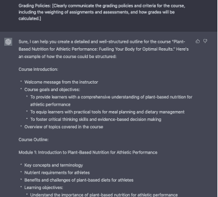

## ChatGPT 输出：课程大纲

第一模块：植物性营养对运动表现的介绍

本模块概述了植物性营养及其对运动表现的潜在好处。学生将了解植物性营养的基本原则，包括宏量营养素和微量营养素需求，以及它们如何支持运动表现。

主题：

植物性营养简介

运动员植物性营养的好处

运动员植物性饮食的宏量营养素和微量营养素需求

植物性食物中的必需营养素来源

学习目标：

了解植物性营养的基本原则及其对运动表现的好处

了解植物性饮食运动员的宏量营养素和微量营养素需求

确定运动员所需的植物性必需营养素来源

课程计划：

讲座：植物性营养及其对运动员的好处介绍（20 分钟）

小组讨论：植物性饮食运动员的宏量营养素和微量营养素需求（20 分钟）

活动：确定植物性必需营养素来源（20 分钟）

待办事项：计划一个符合运动员宏量营养素和微量营养素需求的植物性餐食（20 分钟）

第二模块：运动前加油的植物性营养

本模块涵盖了运动前营养的重要性以及运动员如何在锻炼前用植物性食物为身体加油。学生将了解碳水化合物、蛋白质和其他营养素在运动前营养中的作用，以及餐饮计划和准备策略。

主题：

运动员运动前营养的重要性

运动前加油的营养需求

运动前营养素的植物性来源

餐饮计划和准备策略

学习目标：

了解运动员运动前营养的重要性

确定运动前加油的营养需求

确定运动前加油的植物性营养素来源

制定运动前加油的餐饮计划和准备策略

课程计划：

讲座：运动员运动前营养的重要性（20 分钟）

案例研究：确定运动前加油的营养需求（20 分钟）

活动：确定运动前加油的植物性营养素来源（20 分钟）

小组工作：为运动前加油制定餐饮计划和准备策略（20 分钟）

待办事项：使用植物性营养源计划一个运动前餐食（20 分钟）

第三模块：运动后恢复的植物性营养

6.

这是一个关于课程大纲的替代提示模板。

你能帮我为[植物性营养对运动表现的影响：为获得最佳效果为身体加油]课程大纲创建一个详细和结构良好的大纲吗？

请包括以下元素：

[课程介绍：[提供课程介绍，包括课程目标和目标，以及将涵盖的主题概述。]

课程大纲：[提供一个详细的课程大纲，包括每个模块或单元的主题，子主题和学习目标。]

学习材料：[确定课程中将使用的学习材料，包括教科书，文章，视频和其他资源。]

作业和评估：[提供课程中将使用的作业和评估的信息，包括它们的格式，截止日期和评分标准。]

学习活动：[包括各种学习活动，如讲座，讨论，案例研究，模拟和小组项目，以吸引学习者并增强他们对材料的理解。]

讲师支持：[提供学习者如何联系讲师获取支持的信息，如办公时间，电子邮件或讨论论坛。]

合作和同行评审：[鼓励学习者之间的合作和同行评审，包括小组项目，同行评审作业和讨论论坛。]

反馈和评估：[为学习者提供在课程期间接收反馈和评估的机会，包括课程期间的形成性反馈和最终评估。]

评分政策：[清楚地传达课程的评分政策和标准，包括作业和评估的权重，以及如何计算成绩。]]

占位符：

[主题名称] = 植物性营养对运动表现的影响：为了获得最佳效果为身体提供能量。

注意：

对于这个提示，你只需要改变主题名称。如果你感到有冒险精神，你可以调整其他元素以适应你的课程。

ChatGPT：提示模板 6 输出

ChatGPT 有时可能会生成不完整的内容，只需提示它“请继续”或复制内容的最后一段，用占位符[]括起来，旁边写上“这是不完整的”。

7.

这里是一个用于概述课程课程的替代提示模板。

––––––––

请为一门[课程名称]课程生成一个详细的课程大纲，面向[目标受众]。课程应分为[number]个模块，每个模块应包括[number]个主题，学习目标和内容类型。课程还应包括[number]个评估和测验，互动和反馈的机会，以及内容的清晰和逻辑的进展。
