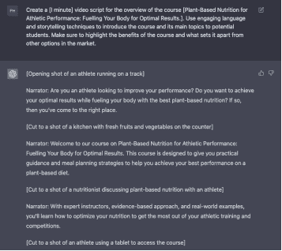
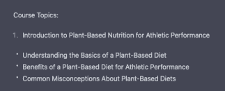
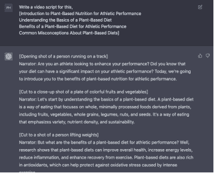

## 视频脚本

我们已经有了概述，那么让我们通过 ChatGPT 深入探讨视频脚本创作的世界吧？

有了提示模板，流程更加顺畅，对吧？

使用 ChatGPT 创建视频脚本：

10.

为课程概述创建一个[时间]视频脚本。使用引人入胜的语言和叙事技巧向潜在学生介绍课程及其主要主题。确保突出课程的好处以及与市场上其他选项的区别。

占位符解释：

[主题名称] = 运动表现的植物性营养：为实现最佳效果为您的身体提供能量。

[时间] = 分钟或秒（10 分钟），（30 秒）

ChatGPT：提示模板 10 输出

11.

这是视频脚本的另一种提示模板：

对于这个提示模板，你只需复制 ChatGPT 生成的元素，放入占位符中，然后只需输入“为此编写一个视频脚本”。

下面的截图是概述的一部分，

ChatGPT：课程概述的一部分

这是我如何格式化提示的方式，

为此编写一个视频脚本，

[植物性营养介绍运动表现

理解植物性饮食的基础知识

运动表现的植物性饮食的好处

关于植物性饮食的常见误解]

ChatGPT：提示模板 11 输出

ChatGPT 可以通过分析脚本内容并识别关键主题和概念来协助提出可能的视频素材。

另外，ChatGPT 的另一个有趣之处在于，它可以建议视觉上吸引人并增强脚本整体叙事的素材。
