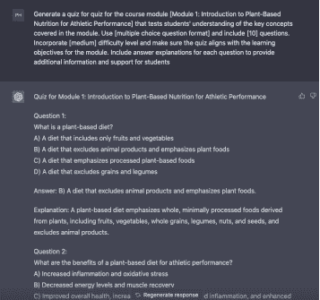

## 生成测验

测验是测试你对材料理解的绝佳方式，也是衡量你在整个课程中进步的重要方式，使其成为在线课程的重要组成部分。

俗话说，

让学生参加测验可以帮助他们找出需要提高理解的领域，最终帮助他们在课程中取得成功。

13.

使用 ChatGPT 生成测验：

为课程模块[主题/模块名称]生成一个测验，测试学生对模块中涵盖的关键概念的理解。使用[多项选择题格式]，包括[10]个问题。结合[中等]难度级别，确保测验与模块的学习目标一致。为每个问题提供答案解释，以提供额外信息和支持给学生。

占位符解释

[模块名称] = 模块 1：植物性营养介绍及运动表现

[问题格式] 多项选择

[问题数量] = 10

[难度级别] = 中等

ChatGPT：提示模板 13 输出
