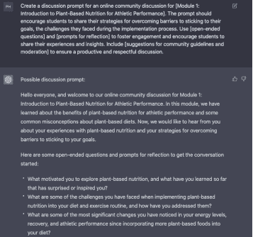

## 在线讨论提示

在线讨论提示是与其他学生互动并加深对课程材料理解的有效方式，同时尊重他人意见并促进协作学习环境。

15.

使用 ChatGPT 生成关于反思提示的视频脚本：

为[模块名称]的在线社区讨论创建一个讨论提示。该提示应鼓励学生分享他们克服目标坚持障碍的策略，以及在实施过程中面临的挑战。使用[开放式问题]和[反思提示]来促进参与，并鼓励学生分享他们的经验和见解。包括[社区准则和管理建议]，以确保进行富有成效和尊重的讨论。

[第 4 模块：补充品和耐力训练特定的营养时机]：指示交互式活动与特定模块相关联，以便生成的内容与该模块涵盖的信息相适应。

[开放式问题] = 例如："在坚持植物性饮食过程中，您面临的最大挑战是什么？您是如何克服的？"

[反思提示] = 例如："坚持植物性饮食如何改变了您的整体健康？您发现哪些策略最有效，以保持在正确的轨道上？"

[社区准则和管理建议] = 例如："请尊重其他成员的经验和观点。任何冒犯性或有害的评论将被删除。"

ChatGPT：提示模板 15 输出
