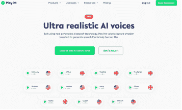
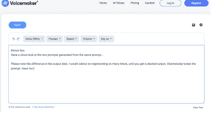
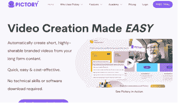
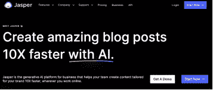

## AI 工具

在创建在线课程时，有各种工具可供选择，以使过程更加高效和有效。

也许你已经使用过其中一些工具，或者听说过它们。但以防万一...

这里有四种这样的工具，以及它们在在线课程创建中的用途：

1.

Play.ht

Play.ht 是一个在线文本转语音转换器，可用于创建课程材料的音频版本。使用 Play.ht，课程创建者可以简单地复制粘贴他们的文本（使用 ChatGPT 或其他方式生成）到平台上，并从各种声音中选择，以创建内容的音频版本。

我尝试过 Play.ht，我必须说，他们的声音选择相当令人印象深刻。他们听起来如此逼真！他们提供标准和逼真声音，但我强烈建议选择后者以获得最真实的体验。

去看看它们，不要只听我的话。

眼见为实。

链接: https://www.play.ht/?via=align

这意味着如果你通过链接购买，我可能会获得佣金，而你不需要额外付费。我只推荐我个人使用过并认为对你有益的产品和服务。感谢您的支持。我非常感激。

2.

Voicemaker

与 Play.ht 类似，Voicemaker 是另一个文本转语音工具，可用于创建课程内容的音频版本。Voicemaker 允许课程创建者将自己的声音添加到音频中，使其成为在线课程创建的多功能工具。

Voicemaker 比 Play.ht 便宜。如果你预算有限，Voicemaker 仍然可以完成任务。

这是链接。这不是一个推广链接。

链接: https://voicemaker.in/

3.

Pictory

Pictory 是一个可以用于创建在线课程视觉内容的 AI 工具。使用 Pictory，课程创建者可以输入文本，平台将自动生成与内容相关的图像和视频等视觉内容。

这可以节省创建课程材料视觉内容的时间和精力，并确保视觉内容与内容紧密对齐。

使用起来很简单，但更便宜的选择是 Canva。

链接: https://pictory.ai?ref=airadi81

4.

Jasper

Jasper 是 ChatGPT 的替代品，ChatGPT 是用于创建内容的 AI 工具。它可以用于创建在线课程。

与 ChatGPT 相比，Jasper 更有结构性

使用 Jasper.ai，你可以快速轻松地使用 AI 生成的文本生成想法、大纲，甚至完整段落。这个工具非常适合那些可能不想花几个小时自己写内容的人。

这是推广链接：

[`jasper.ai?utm_source=partner&fpr=aligned`](https://jasper.ai?utm_source=partner&fpr=aligned)

在考虑这些工具时，重要的是权衡每种工具的优势和局限性与在线课程的预算和目标。
