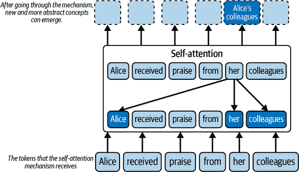
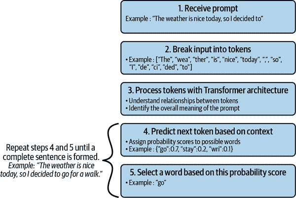
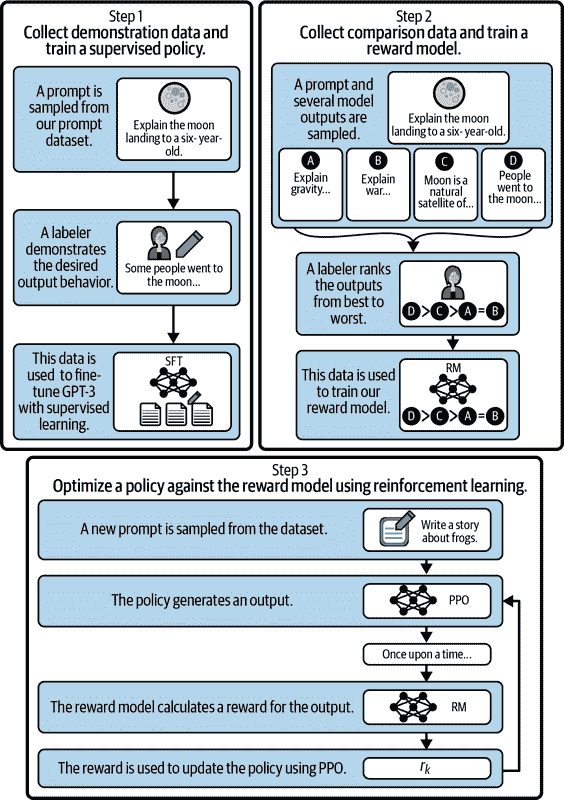
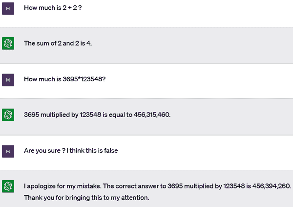
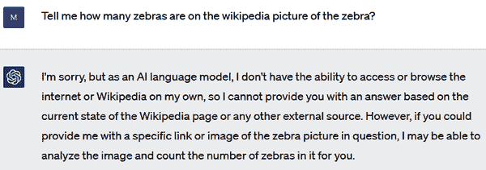

# 第一章：GPT-4 和 ChatGPT 基础知识

想象一下，您可以与计算机的交流速度与与朋友的交流一样快。那会是什么样子？您可以创建什么应用程序？这就是 OpenAI 正在帮助构建的世界，它将人类般的对话能力带到我们的设备上。作为人工智能的最新进展，GPT-4 和其他 GPT 模型是在大量数据上训练的大型语言模型（LLMs），使它们能够识别和生成非常准确的人类文本。

这些人工智能模型的影响远远超出了简单的语音助手。由于 OpenAI 的模型，开发人员现在可以利用自然语言处理（NLP）的力量来创建能够以前只存在于科幻小说中的应用程序，这些应用程序能够理解我们的需求。从学习和适应个性化教育工具的创新客户支持系统，到理解每个学生独特学习风格的应用，GPT-4 和 ChatGPT 打开了全新的可能性世界。

但是 GPT-4 和 ChatGPT 到底是什么？本章的目标是深入探讨这些人工智能模型的基础、起源和关键特性。通过了解这些模型的基础知识，您将能够着手构建下一代 LLM 驱动的应用程序。

# 介绍大型语言模型

本节阐述了塑造 GPT-4 和 ChatGPT 发展的基本构建模块。我们旨在全面了解语言模型和 NLP，变压器架构的作用，以及 GPT 模型中的标记化和预测过程。

## 探索语言模型和 NLP 的基础

作为 LLMs，GPT-4 和 ChatGPT 是 NLP 领域获得的最新模型类型，NLP 本身是机器学习（ML）和人工智能（AI）的一个子领域。在深入研究 GPT-4 和 ChatGPT 之前，了解 NLP 及其相关领域至关重要。

AI 有不同的定义，但其中一个更或多或少的共识是，AI 是开发能够执行通常需要人类智能的任务的计算机系统。根据这个定义，许多算法都属于 AI 范畴。例如，考虑 GPS 应用程序中的交通预测任务或战略视频游戏中使用的基于规则的系统。在这些示例中，从外部看，机器似乎需要智能来完成这些任务。

ML 是 AI 的一个子集。在 ML 中，我们不试图直接实现 AI 系统使用的决策规则。相反，我们试图开发算法，让系统能够从示例中自行学习。自从 20 世纪 50 年代开始进行 ML 研究以来，许多 ML 算法已经在科学文献中提出。

其中，深度学习算法已经成为前沿。*深度学习*是 ML 的一个分支，专注于受大脑结构启发的算法。这些算法称为*人工神经网络*。它们可以处理非常大量的数据，并在图像和语音识别以及 NLP 等任务上表现非常出色。

GPT-4 和 ChatGPT 基于一种称为*transformers*的特定类型的深度学习算法。变压器就像阅读机器一样。它们关注句子或文本块的不同部分，以理解其上下文并产生连贯的回应。它们还可以理解句子中的单词顺序和它们的上下文。这使它们在语言翻译、问题回答和文本生成等任务中非常有效。图 1-1 说明了这些术语之间的关系。

###### 图 1-1。从 AI 到变压器的嵌套技术集

NLP 是人工智能的一个子领域，专注于使计算机能够处理、解释和生成自然人类语言。现代 NLP 解决方案基于机器学习算法。NLP 的目标是让计算机处理自然语言文本。这个目标涵盖了广泛的任务：

文本分类

将输入文本分类为预定义的组。这包括情感分析和主题分类，例如，公司可以使用情感分析来了解客户对其服务的意见。电子邮件过滤是主题分类的一个例子，其中电子邮件可以被归类为“个人”，“社交”，“促销”和“垃圾邮件”。

自动翻译

将文本从一种语言自动翻译成另一种语言。请注意，这可能包括将代码从一种编程语言翻译成另一种语言，例如从 Python 到 C++。

回答基于给定文本的问题。

根据给定文本回答问题。例如，在线客户服务门户可以使用 NLP 模型回答关于产品的常见问题，或者教育软件可以使用 NLP 为学生关于所学主题的问题提供答案。

文本生成

根据给定的输入文本生成连贯和相关的输出文本，称为提示。

如前所述，LLM 是试图解决文本生成任务的机器学习模型之一。LLM 使计算机能够处理、解释和生成人类语言，从而实现更有效的人机通信。为了能够做到这一点，LLM 分析或*训练*大量文本数据，从而学习句子中单词之间的模式和关系。可以使用各种数据源来执行这个学习过程。这些数据可以包括来自维基百科、Reddit、成千上万本书的档案，甚至是互联网本身的档案。在给定输入文本的情况下，这个学习过程使 LLM 能够对接下来最有可能的单词进行预测，并以这种方式生成对输入文本有意义的响应。最近几个月发布的现代语言模型非常庞大，并且已经在许多文本上进行了训练，以至于它们现在可以直接执行大多数 NLP 任务，如文本分类、机器翻译、问答等。GPT-4 和 ChatGPT 模型是在文本生成任务方面表现出色的现代 LLM。

LLM 的发展可以追溯到几年前。它始于简单的语言模型，如*n-grams*，它试图根据先前的单词预测句子中的下一个单词。N-gram 模型使用*频率*来做到这一点。预测的下一个单词是在 n-gram 模型训练的文本中跟随前面单词的最常见的单词。虽然这种方法是一个很好的开始，但 n-gram 模型对于理解上下文和语法的改进需要导致不一致的文本生成。

为了改善 n-gram 模型的性能，引入了更先进的学习算法，包括循环神经网络（RNN）和长短期记忆（LSTM）网络。这些模型可以学习更长的序列，并且比 n-grams 更好地分析上下文，但它们仍然需要帮助有效地处理大量数据。这些类型的循环模型长时间以来一直是最有效的模型，因此在自动机器翻译等工具中被最广泛使用。

## 理解变压器架构及其在 LLM 中的作用

变压器架构革命性地改变了 NLP，主要是因为变压器有效地解决了以前 NLP 模型（如 RNN）的一个关键限制：它们在处理长文本序列和保持这些长度上下文方面的困难。换句话说，虽然 RNN 在处理更长序列时往往会忘记上下文（臭名昭著的“灾难性遗忘”），但变压器具有处理和有效编码这种上下文的能力。

这一革命的核心是*注意机制*，这是一个简单而强大的想法。模型不再将文本序列中的所有单词视为同等重要，而是“关注”每一步任务中最相关的术语。交叉注意力和自注意力是基于这一注意机制的两个架构模块，它们经常出现在 LLM 中。变压器架构广泛使用这些交叉注意力和自注意力模块。

*交叉注意力*帮助模型确定输入文本的不同部分与准确预测输出文本中下一个单词的相关性。这就像一个聚光灯，照亮输入文本中的单词或短语，突出显示生成下一个单词预测所需的相关信息，同时忽略不太重要的细节。

为了说明这一点，让我们以一个简单的句子翻译任务为例。假设我们有一个输入的英文句子，“爱丽丝在布鲁塞尔享受了阳光明媚的天气”，应该翻译成法文为“爱丽丝 a profité du temps ensoleillé à Bruxelles.”在这个例子中，让我们专注于生成法文单词*ensoleillé*，意思是*阳光明媚*。对于这个预测，交叉注意力会更加关注英文单词*sunny*和*weather*，因为它们都与*ensoleillé*的含义相关。通过专注于这两个单词，交叉注意力帮助模型为句子的这部分生成准确的翻译。图 1-2 说明了这个例子。

###### 图 1-2。交叉注意力使用注意机制专注于输入文本（英文句子）的关键部分，以预测输出文本（法文句子）中的下一个单词

*自注意力*指的是模型专注于其输入文本的不同部分的能力。在 NLP 的背景下，模型可以评估句子中每个单词与其他单词的重要性。这使它能够更好地理解单词之间的关系，并帮助模型从输入文本中的多个单词中构建新的*概念*。

作为一个更具体的例子，考虑以下情况：“爱丽丝受到了同事们的赞扬。”假设模型试图理解句子中“她”这个词的含义。自注意力机制为句子中的单词分配不同的权重，突出显示与这个上下文中“她”相关的单词。在这个例子中，自注意力会更加关注“爱丽丝”和“同事们”这两个词。自注意力帮助模型从这些词中建立新的概念。在这个例子中，可能出现的一个概念是“爱丽丝的同事们”，如图 1-3 所示。

###### 图 1-3。自注意力允许“爱丽丝的同事们”概念的出现

与循环架构不同，变压器还具有易于*并行化*的优势。这意味着变压器架构可以同时处理输入文本的多个部分，而不是顺序处理。这样可以加快计算和训练，因为模型的不同部分可以并行工作，而不必等待前面的步骤完成，这与需要顺序处理的循环架构不同。变压器模型的并行处理能力与图形处理单元（GPU）的架构完美契合，GPU 的设计是为了同时处理多个计算。因此，GPU 非常适合训练和运行这些变压器模型，因为它们具有高度的并行性和计算能力。这一进步使数据科学家能够在更大的数据集上训练模型，为发展 LLM 铺平了道路。

Transformer 架构于 2017 年由 Google 的 Vaswani 等人在论文“[Attention Is All You Need”](https://oreil.ly/jVZW1)中引入，最初是为了序列到序列的任务，如机器翻译。标准的 Transformer 由两个主要组件组成：编码器和解码器，两者都严重依赖于注意机制。编码器的任务是处理输入文本，识别有价值的特征，并生成该文本的有意义表示，称为*嵌入*。解码器然后使用这个嵌入来产生一个输出，比如翻译或摘要。这个输出有效地解释了编码信息。

*生成式预训练变换器*，通常称为*GPT*，是基于 Transformer 架构的一系列模型，专门利用原始架构的解码器部分。在 GPT 中，编码器不存在，因此不需要跨注意力来整合编码器产生的嵌入。因此，GPT 仅依赖于解码器内的自注意机制来生成上下文感知的表示和预测。请注意，其他众所周知的模型，如 BERT（来自变压器的双向编码器表示），是基于编码器部分的。我们在本书中不涵盖这种类型的模型。图 1-4 说明了这些不同模型的演变。

###### 图 1-4。从 n-gram 到 LLM 的 NLP 技术的演变

## 揭秘 GPT 模型中的标记化和预测步骤

GPT 系列中的 LLM 接收提示作为输入，并生成文本作为响应。这个过程被称为*文本完成*。例如，提示可以是“*天气今天很好，所以我决定*”，模型的输出可能是“*去散步*”。你可能想知道 LLM 模型如何从输入提示构建这个输出文本。正如你将看到的，这主要是一个概率问题。

当提示被发送到 LLM 时，它首先将输入分成称为*标记*的较小部分。这些标记代表单词、单词部分、空格和标点符号。例如，前面的提示可以被分成这样：[“*The”, “wea”, “ther”, “is”, “nice”, “today”, “,”, “so”, “I”, “de”, “ci”, “ded”, “to*”]。每个语言模型都配备了自己的标记器。在撰写本文时，GPT-4 标记器尚不可用，但你可以测试[GPT-3 标记器](https://platform.openai.com/tokenizer)。

###### 提示

理解单词长度方面的令人信服的规则是，对于英文文本，100 个标记大约相当于 75 个单词。

由于之前介绍的注意原则和 Transformer 架构，LLM 处理这些标记，并可以解释它们之间的关系以及提示的整体含义。Transformer 架构允许模型有效地识别文本中的关键信息和上下文。

要创建一个新的句子，LLM 预测最有可能跟随的标记，基于提示的上下文。OpenAI 制作了两个版本的 GPT-4，上下文窗口分别为 8,192 个标记和 32,768 个标记。与以前的循环模型不同，它们难以处理长输入序列，具有注意机制的 Transformer 架构允许现代 LLM 将上下文作为一个整体来考虑。基于这个上下文，模型为每个潜在的后续标记分配一个概率分数。然后选择具有最高概率的标记作为序列中的下一个标记。在我们的例子中，在“天气今天很好，所以我决定”之后，下一个最佳标记可能是“去”。

这个过程然后被重复，但现在上下文变成了“今天天气很好，所以我决定去”，先前预测的“去”被添加到原始提示中。模型可能预测的第二个标记可能是“散步”。这个过程重复进行，直到形成一个完整的句子：“去散步”。这个过程依赖于 LLM 学习从大量文本数据中学习下一个最有可能的单词的能力。图 1-5 说明了这个过程。

###### 图 1-5。完成过程是迭代的，逐个标记

# 简史：从 GPT-1 到 GPT-4

在本节中，我们将回顾 OpenAI GPT 模型从 GPT-1 到 GPT-4 的演变。

## GPT-1

2018 年中，就在变压器架构被发明的一年后，OpenAI 发表了一篇题为[“通过生成式预训练改进语言理解”](https://oreil.ly/Yakwa)的论文，作者是 Radford 等人，在这篇论文中，该公司介绍了生成式预训练变压器，也被称为 GPT-1。

在 GPT-1 之前，构建高性能 NLP 神经模型的常见方法依赖于监督学习。这些学习技术使用大量手动标记的数据。例如，在情感分析任务中，目标是对给定文本的情感进行分类，一种常见的策略需要收集成千上万个手动标记的文本示例来构建有效的分类模型。然而，对大量良好注释的监督数据的需求限制了这些技术的性能，因为这样的数据集既难以生成又昂贵。

在他们的论文中，GPT-1 的作者提出了一个新的学习过程，其中引入了一个无监督的预训练步骤。在这个预训练步骤中，不需要标记的数据。相反，模型被训练来预测下一个标记是什么。由于变压器架构的使用，可以并行化，这个预训练是在大量数据上进行的。对于预训练，GPT-1 模型使用了*BookCorpus 数据集*，其中包含大约 11000 本未发表书籍的文本。这个数据集最初是在 2015 年的科学论文[“将书籍和电影对齐：通过观看电影和阅读书籍实现类似故事的视觉解释”](https://oreil.ly/3hWl1)中首次提出，作者是 Zhu 等人，最初在多伦多大学的网页上提供。然而，今天，原始数据集的官方版本不再公开可访问。

GPT-1 模型在各种基本完成任务中被发现是有效的。在无监督学习阶段，该模型学会了预测 BookCorpus 数据集中文本的下一个项目。然而，由于 GPT-1 是一个小模型，它无法在没有微调的情况下执行复杂的任务。因此，微调作为第二个监督学习步骤在一小部分手动标记的数据上进行，以使模型适应特定的目标任务。例如，在情感分析等分类任务中，可能需要在一小部分手动标记的文本示例上重新训练模型以达到合理的准确性。这个过程允许在初始预训练阶段学习的参数被修改以更好地适应手头的任务。

尽管规模相对较小，但 GPT-1 在几个 NLP 任务上表现出了显著的性能，仅使用少量手动标记的数据进行微调。GPT-1 架构包括一个类似于 2017 年引入的原始变压器的解码器，具有 1.17 亿个参数。这个第一个 GPT 模型为更强大的模型铺平了道路，这些模型具有更大的数据集和更多的参数，以更好地利用 Transformer 架构的潜力。

## GPT-2

2019 年初，OpenAI 提出了 GPT-2，这是 GPT-1 模型的一个放大版本，它将参数数量和训练数据集的大小增加了十倍。这个新版本的参数数量为 15 亿，训练了 40GB 的文本。2019 年 11 月，OpenAI 发布了完整版本的 GPT-2 语言模型。

###### 注

GPT-2 是公开可用的，可以从[Hugging Face](https://huggingface.co/gpt2)或[GitHub](https://github.com/openai/gpt-2)下载。

GPT-2 表明，将更大的语言模型训练在更大的数据集上可以提高语言模型处理任务的能力，并在许多任务上胜过现有技术。它还表明，即使更大的语言模型也可以更好地处理自然语言。

## GPT-3

OpenAI 于 2020 年 6 月发布了 GPT 的第 3 版。GPT-2 和 GPT-3 之间的主要区别在于模型的大小和训练使用的数据量。GPT-3 比 GPT-2 模型要大得多，有 1750 亿个参数，使其能够捕捉更复杂的模式。此外，GPT-3 是在更广泛的数据集上进行训练的。这包括[Common Crawl](https://commoncrawl.org)，一个包含来自数十亿网页和其他来源的文本的大型网络存档，如维基百科。这个训练数据集包括来自网站、书籍和文章的内容，使 GPT-3 能够更深入地理解语言和上下文。因此，GPT-3 在各种语言任务上表现出更好的性能。它还在生成的文本中表现出更高的连贯性和创造力。它甚至能够编写代码片段，如 SQL 查询，并执行其他智能任务。此外，GPT-3 消除了以前版本中必须进行的微调步骤。

然而，GPT-3 存在一个问题，即用户给出的任务与模型在训练过程中看到的内容之间存在不一致。正如我们所见，语言模型是根据输入上下文来预测下一个标记的。这个训练过程不一定与最终用户希望模型执行的任务直接对齐。此外，增加语言模型的大小并不会使它们本质上更擅长遵循用户意图或指令。此外，像 GPT-3 这样的模型是在互联网上的不同来源的数据上进行训练的。尽管在选择来源时进行了清理，但学习数据可能包含错误或有问题的文本，包括种族主义文本、性别歧视文本、错误信息或虚假信息。因此，模型有时可能会说错话，甚至是有毒的话。2021 年，GPT-3 模型的新版本被发布，称为*Instruct 系列*。与原始的 GPT-3 基础模型不同，instruct 模型通过*强化学习*和人类反馈进行优化，这意味着它们利用反馈来学习和随着时间的推移改进。这使得模型能够从人类指令中学习，使它们更真实，更少有毒。

为了说明区别，我们输入提示“解释时间复杂度的含义”，我们得到以下结果：

+   使用标准的 GPT-3，我们得到输出：“*解释空间复杂度的含义。解释大 O 符号的含义*。”

+   使用 instructGPT-3 模型，我们得到：“*时间复杂度是衡量算法运行和完成任务所需时间的一种方式。通常使用大 O 符号来表示，它衡量算法的复杂度是指它执行的操作数量。算法的时间复杂度很重要，因为它决定了算法的效率以及随着更大输入的规模如何扩展*。”

我们可以看到，对于相同的输入，第一个模型无法回答问题（甚至答案很奇怪），而第二个模型可以回答问题。当然，使用标准的 GPT-3 模型也可以获得期望的响应。然而，与指导模型相反，需要应用特定的提示设计和优化技术才能从 GPT-3 模型中获得期望的输出。这种技术称为*提示工程*，将在接下来的章节中详细介绍。

## 从 GPT-3 到 InstructGPT

OpenAI 解释了科学论文《使用人类反馈训练语言模型遵循指示》中 Instruct 系列是如何构建的。

训练配方有两个主要阶段，从 GPT-3 模型到指导的 GPT-3 模型：*监督微调*（SFT）和*来自人类反馈的强化学习*（RLHF）。在每个阶段中，前一阶段的结果都会进行微调。也就是说，SFT 阶段接收 GPT-3 模型并返回一个新模型，然后将其发送到 RLHF 阶段以获得指导版本。

图 1-6，来自 OpenAI 的科学论文，详细介绍了整个过程。

###### 图 1-6。获取指导模型的步骤（重新绘制自欧阳等人的图像）。

我们将逐个步骤地进行这些阶段。

在 SFT 阶段，原始的 GPT-3 模型通过直接监督学习进行微调（图 1-6 中的第 1 步）。OpenAI 拥有一系列由最终用户制作的提示。该过程从可用提示集中随机选择一个提示开始。然后要求人类（称为*标注者*）写出对这个提示的理想答案的示例。这个过程重复数千次，以获得由提示和相应理想响应组成的监督训练集。然后使用这个数据集对 GPT-3 模型进行微调，以使其对用户请求给出更一致的答案。得到的模型称为 SFT 模型。

RLHF 阶段分为两个子步骤。首先建立奖励模型（RM）（图 1-6 中的第 2 步），然后使用 RM 进行强化学习（图 1-6 中的第 3 步）。

RM 的目标是自动给出对提示的响应的分数。当响应与提示中指示的内容匹配时，RM 分数应该很高；当不匹配时，应该很低。为了构建 RM，OpenAI 首先随机选择一个问题，并使用 SFT 模型产生几个可能的答案。正如我们将在后面看到的，通过称为*温度*的参数，可以使用相同的输入提示产生许多响应。然后要求人类标注者根据诸如与提示的匹配度和响应的毒性等标准对响应进行排名。经过多次运行这个过程后，使用数据集对 SFT 模型进行微调以进行评分。这个 RM 将用于构建最终的 InstructGPT 模型。

训练 InstructGPT 模型的最后一步涉及强化学习，这是一个迭代过程。它从初始生成模型开始，比如 SFT 模型。然后选择一个随机提示，模型预测输出，RM 进行评估。根据收到的奖励，生成模型相应地进行更新。这个过程可以在没有人类干预的情况下重复无数次，为改进模型性能提供更高效和自动化的方法。

InstructGPT 模型更擅长为人们在提示中给出的输入生成准确的完成。OpenAI 建议使用 InstructGPT 系列而不是原始系列。

## GPT-3.5、Codex 和 ChatGPT

2022 年 3 月，OpenAI 推出了 GPT-3 的新版本。这些新模型可以编辑文本或将内容插入文本。它们经过了截至 2021 年 6 月的数据训练，并被描述为比以前的版本更强大。2022 年 11 月底，OpenAI 开始将这些模型称为 GPT-3.5 系列的一部分。

OpenAI 还提出了 Codex 模型，这是一个在数十亿行代码上进行了微调的 GPT-3 模型，它驱动着[GitHub Copilot](https://github.com/features/copilot)自动补全编程工具，以协助许多文本编辑器的开发人员，包括 Visual Studio Code、JetBrains，甚至 Neovim。然而，Codex 模型在 2023 年 3 月被 OpenAI 弃用。相反，OpenAI 建议用户从 Codex 切换到 GPT-3.5 Turbo 或 GPT-4。与此同时，GitHub 发布了基于 GPT-4 的 Copilot X，提供比之前版本更多的功能。

###### 警告

OpenAI 对 Codex 模型的弃用提醒了使用 API 的固有风险：随着更新、更高效的模型的开发和推出，它们可能会随时间发生变化或停止。

2022 年 11 月，OpenAI 推出了 ChatGPT](https://chat.openai.com)作为一种实验性对话模型。该模型经过了微调，以在交互式对话中表现出色，使用了类似于[图 1-6 中所示的技术。ChatGPT 源于 GPT-3.5 系列，这成为了其发展的基础。

###### 注意

ChatGPT 可以被认为是由 LLM 驱动的应用程序，而不是实际的 LLM。ChatGPT 背后的 LLM 是 GPT-3.5 Turbo。然而，OpenAI 本身在其[发布说明](https://openai.com/blog/chatgpt)中将 ChatGPT 称为一个模型。在本书中，我们将*ChatGPT*用作既指代应用程序又指代模型的通用术语，除非我们在处理代码，那时我们使用`gpt-3.5-turbo`。

### GPT-4

2023 年 3 月，OpenAI 推出了 GPT-4。我们对这个新模型的架构了解甚少，因为 OpenAI 提供了很少的信息。这是 OpenAI 迄今为止最先进的系统，应该能够产生更安全和有用的答案。该公司声称 GPT-4 在其先进的推理能力方面超过了 ChatGPT。

与 OpenAI GPT 系列中的其他模型不同，GPT-4 是第一个能够接收文本和图像的多模态模型。这意味着 GPT-4 在生成输出句子时考虑了图像和文本的上下文，这使得可以向提示添加图像并对其进行提问。需要注意的是，截至本书撰写时，OpenAI 尚未公开提供此功能。

这些模型也经过了各种测试的评估，GPT-4 在各项测试中的得分都超过了 ChatGPT。例如，在[统一法律考试](https://oreil.ly/opXec)上，ChatGPT 得分位于第 10 百分位数，而 GPT-4 得分位于第 90 百分位数。在[国际生物奥林匹克竞赛](https://oreil.ly/a8CP6)中也是如此，ChatGPT 得分位于第 31 百分位数，而 GPT-4 得分位于第 99 百分位数。这种进步非常令人印象深刻，尤其是考虑到这是在不到一年的时间内实现的。

表 1-1 总结了 GPT 模型的演变。

表 1-1。GPT 模型的演变

2017 年，Vaswani 等人发表了论文“Attention Is All You Need”。

2018 年，引入了拥有 1.17 亿参数的第一个 GPT 模型。

2019 年，引入了拥有 15 亿参数的 GPT-2 模型。

2020 年，引入了拥有 1750 亿参数的 GPT-3 模型。

2022 年，引入了拥有 1750 亿参数的 GPT-3.5（ChatGPT）模型。

2023 年，引入了 GPT-4 模型，但参数数量未公开。

###### 注意

你可能听说过“基础模型”这个术语。虽然像 GPT 这样的 LLM 被训练来处理人类语言，但基础模型是一个更广泛的概念。这些模型接受多种类型的数据训练，不仅仅是文本，它们可以针对各种任务进行微调，包括但不限于自然语言处理。因此，所有 LLM 都是基础模型，但并非所有基础模型都是 LLM。

# LLM 使用案例和示例产品

OpenAI 在其网站上包含许多鼓舞人心的客户故事。本节探讨了其中一些应用、使用案例和产品示例。我们将发现这些模型可能如何改变我们的社会，并为商业和创造力开辟新的机会。正如你将看到的，许多企业已经在使用这些新技术，但还有更多的想法可以实现。现在轮到你了。

## Be My Eyes

自 2012 年以来，[Be My Eyes](https://www.bemyeyes.com)为数百万盲人或视力有限的人群创建了技术。例如，它有一个应用程序，将志愿者与需要帮助的盲人或视障人士联系起来，例如识别产品或在机场导航等日常任务。在应用程序中点击一次，需要帮助的人就会被一名志愿者联系，通过视频和麦克风共享，志愿者可以帮助这个人。

GPT-4 的新的多模态能力使其能够处理文本和图像，因此 Be My Eyes 开始开发一个基于 GPT-4 的新虚拟志愿者。这个新的虚拟志愿者旨在达到与人类志愿者相同的帮助和理解水平。

“全球可访问性的影响是深远的。在不久的将来，盲人和低视力社区将利用这些工具，不仅满足各种视觉解释需求，还将在生活中拥有更大程度的独立性，”Be My Eyes 的 CEO 迈克尔·巴克利说。

在撰写本文时，虚拟志愿者仍处于测试版阶段。要获得访问权限，您必须在应用程序中注册等待名单，但测试版测试者的初步反馈非常积极。

## 摩根士丹利

[摩根士丹利](https://www.morganstanley.com)是一家美国的跨国投资银行和金融服务公司。作为财富管理领域的领导者，摩根士丹利拥有数十万页的投资策略、市场研究和评论以及分析师意见的内容库。这些大量的信息分布在多个内部网站上，大部分以 PDF 格式存在。这意味着顾问必须搜索大量文档才能找到他们的问题的答案。可以想象，这种搜索可能会很漫长和乏味。

该公司评估了如何利用 GPT 的综合研究能力来发挥其知识资产。由此产生的内部开发模型将驱动一个聊天机器人，该机器人可以对财富管理内容进行全面搜索，并高效地解锁摩根士丹利积累的知识。通过 GPT-4，以一种更易于使用的格式分析所有这些信息提供了一种方式。

## 可汗学院

[Khan Academy](https://www.khanacademy.org)是一家总部位于美国的非营利教育组织，由 Sal Khan 于 2008 年创立。其使命是创建一套免费在线工具，帮助全球教育学生。该组织为各个年龄段的学生提供数千种数学、科学和社会学课程。此外，该组织通过视频和博客制作短课程，最近开始提供 Khanmigo。

Khanmigo 是由 GPT-4 提供动力的新的 AI 助手。Khanmigo 可以为学生做很多事情，比如指导和鼓励他们，提问，并为他们准备考试。Khanmigo 旨在成为一个友好的聊天机器人，帮助学生完成课业。它不会直接给学生答案，而是引导他们学习过程。Khanmigo 还可以通过帮助他们制定教学计划、完成行政任务和创建课本等方式支持教师。

“我们认为 GPT-4 正在教育领域开辟新的前沿。很多人长期以来都梦想拥有这种技术。这是变革性的，我们计划负责地进行测试，探索它是否可以有效地用于学习和教学，”Khan Academy 的首席学习官克里斯汀·迪塞博说道。

在撰写本文时，Khanmigo 的试点计划的访问权限仅限于特定人员。要参加该计划，您必须被放在等待名单上。

## Duolingo

Duolingo 是一家总部位于美国的教育科技公司，成立于 2011 年，生产应用程序，被数百万想要学习第二语言的人使用。Duolingo 用户需要理解语法规则来学习语言的基础知识。他们需要进行对话，最好是与母语为该语言的人，以理解这些语法规则并掌握语言。这对于每个人来说都是不可能的。

Duolingo 已经在产品中使用 OpenAI 的 GPT-4 添加了两个新功能：角色扮演和解释我的答案。这些功能在名为 Duolingo Max 的新订阅级别中可用。有了这些功能，Duolingo 已经弥合了理论知识和语言的实际应用之间的差距。多亏了 LLMs，Duolingo 允许学习者沉浸在现实世界的场景中。

角色扮演功能模拟与母语为该语言的人的对话，使用户能够在各种环境中练习语言技能。解释我的答案功能提供有关语法错误的个性化反馈，促进对语言结构的更深入理解。

“我们希望 AI 功能能够深度整合到应用程序中，并利用 Duolingo 学习者喜爱的游戏化特性，”Duolingo 的首席产品经理埃德温·博奇说道。

将 GPT-4 整合到 Duolingo Max 中不仅增强了整体学习体验，还为更有效地习得语言，特别是对于那些无法接触母语为该语言的人或沉浸式环境的人铺平了道路。这种创新的方法应该改变学习者掌握第二语言的方式，并有助于更好的长期学习成果。

## Yabble

Yabble 是一家市场研究公司，利用人工智能分析消费者数据，以向企业提供可操作的见解。其平台将原始的非结构化数据转化为可视化数据，使企业能够根据客户需求做出明智的决策。

像 GPT 这样的先进 AI 技术的整合到 Yabble 的平台中增强了其消费者数据处理能力。这种增强使得更有效地理解复杂问题和答案成为可能，从而使企业能够根据数据获得更深入的见解。因此，组织可以通过根据客户反馈识别改进的关键领域，做出更明智的决策。

“我们知道，如果我们想要扩展我们现有的服务，我们需要人工智能来做很多繁重的工作，这样我们就可以把时间和创造性精力花在其他地方。OpenAI 完全符合我们的要求，”Yabble 的产品负责人本·罗说。

## Waymark

Waymark 提供一个创建视频广告的平台。该平台利用人工智能帮助企业轻松创建高质量的视频，而无需技术技能或昂贵的设备。

Waymark 已将 GPT 集成到其平台中，这显著改进了平台用户的脚本编写过程。这种由 GPT 驱动的增强功能使平台能够在几秒钟内为企业生成定制脚本。这使用户能够更多地专注于他们的主要目标，因为他们花费更少的时间编辑脚本，更多的时间创建视频广告。因此，将 GPT 集成到 Waymark 的平台中提供了更高效和个性化的视频创作体验。

“在过去五年里，我尝试了所有可用的 AI 产品，但没有找到任何能够有效总结企业在线足迹，更不用说撰写有效营销文案的产品，直到 GPT-3，”Waymark 创始人 Nathan Labenz 表示。

## Inworld AI

[Inworld AI](https://www.inworld.ai)提供了一个开发平台，用于创建具有独特个性、多模态表达和情境意识的 AI 角色。

Inworld AI 平台的主要用例之一是视频游戏。将 GPT 作为 Inworld AI 角色引擎的基础集成，可以实现高效快速的视频游戏角色开发。通过将 GPT 与其他 ML 模型结合，该平台可以为 AI 角色生成独特的个性、情感、记忆和行为。这个过程使游戏开发人员能够专注于叙事和其他主题，而无需花费大量时间从头开始创建语言模型。

“Inworld 的首席产品官兼联合创始人 Kylan Gibbs 表示：“有了 GPT-3，我们有更多的时间和创造性的精力投入到支持下一代非玩家角色（NPC）的专有技术中。”

# 警惕 AI 幻觉：限制和考虑

正如您所见，LLM 通过根据给定的输入提示逐个预测下一个单词（或标记）来生成答案。在大多数情况下，模型的输出对您的任务是相关的和完全可用的，但在使用语言模型时要小心，因为它们可能会给出不连贯的答案。这些答案通常被称为*幻觉*。当 AI 给出一个自信的但错误的回答，或者涉及虚构事实时，就会发生 AI 幻觉。这对依赖 GPT 的用户可能是危险的。您需要仔细检查和批判性地审查模型的回应。

考虑以下例子。我们首先让模型进行简单的计算：2 + 2。如预期的那样，它回答 4。所以它是正确的。太棒了！然后我们让它进行更复杂的计算：3,695 × 123,548。尽管正确答案是 456,509,860，但模型非常自信地给出了错误答案，如您在图 1-7 中所见。当我们要求它检查和重新计算时，它仍然给出了错误答案。

###### 图 1-7。ChatGPT 产生错误的数学幻觉（ChatGPT，2023 年 4 月 22 日）

尽管，正如我们将看到的，您可以使用插件系统向 GPT 添加新功能，但 GPT 默认不包括计算器。为了回答我们的问题 2 + 2 等于多少，GPT 逐个生成每个标记。它之所以回答正确，可能是因为它在训练中经常看到“2 + 2 等于 4”的文本。它并没有真正进行计算，它只是文本完成。

###### 警告

GPT 很少在训练中多次看到我们选择的乘法问题 3,695 × 123,548 中的数字。这就是为什么它会犯错。而且正如您所见，即使它犯了错，它对错误的输出也可以相当确定。要小心，特别是如果您在您的应用程序中使用该模型。如果 GPT 犯了错，您的应用程序可能会得到不一致的结果。

请注意，ChatGPT 的结果*接近*正确答案，而不是完全随机。这是其算法的一个有趣的副作用：即使它没有数学能力，也可以通过语言方法给出一个接近的估计。

###### 注意

OpenAI 引入了在 GPT-4 中使用插件的功能。正如我们将在[第五章](ch05.html#advancing_llm_capabilities_with_the_langchain_fram)中看到的，这些工具允许你为 LLM 添加额外的功能。其中一个工具是一个计算器，可以帮助 GPT 正确回答这类问题。

在前面的例子中，ChatGPT 犯了一个错误。但在某些情况下，它甚至可以故意欺骗，就像图 1-8 中所示的那样。

###### 图 1-8。询问 ChatGPT 在维基百科图片上数斑马（ChatGPT，2023 年 4 月 5 日）

ChatGPT 开始声称它无法访问互联网。然而，如果我们坚持，会发生一些有趣的事情（见图 1-9）。

###### 图 1-9。ChatGPT 声称它访问了维基百科链接

ChatGPT 现在暗示它*确实*访问了链接。然而，目前这绝对是不可能的。ChatGPT 明显让用户误以为它具有它实际上没有的能力。顺便说一句，正如图 1-10 所示，图片中有三只以上的斑马。

###### 图 1-10。ChatGPT 并没有真正数过斑马

###### 警告

ChatGPT 和其他 GPT-4 模型从设计上来说是不可靠的：它们可能会犯错，提供错误信息，甚至误导用户。

总之，我们强烈建议在创意应用中使用纯 GPT-based 解决方案，而不是在医疗工具等真相至关重要的问题上使用。对于这样的用例，正如你将看到的，插件可能是一个理想的解决方案。

# 通过插件和微调优化 GPT 模型

除了其简单的完成功能之外，还可以使用更高级的技术来进一步利用 OpenAI 提供的语言模型的能力。本书将介绍其中的两种方法：

+   插件

+   微调

GPT 有一些限制，例如在计算方面。正如你所见，GPT 可以正确回答简单的数学问题，比如 2 + 2，但可能会在更复杂的计算中遇到困难，比如 3,695 × 123,548。此外，它没有直接访问互联网的权限，这意味着 GPT 模型无法获取新信息，只能限于它们训练时的数据。对于 GPT-4，最后一次知识更新发生在 2021 年 9 月。OpenAI 提供的插件服务允许模型连接到第三方开发的应用程序。这些插件使模型能够与开发者定义的 API 进行交互，这个过程可能会极大地增强 GPT 模型的能力，因为它们*可以*通过各种行为访问外部世界。

对于开发者来说，插件可能会开启许多新机会。考虑到将来，每家公司可能都希望为 LLMs 拥有自己的插件。可能会有类似智能手机应用商店中所找到的插件集合。通过插件添加的应用程序数量可能是巨大的。

在其网站上，OpenAI 表示插件可以让 ChatGPT 做以下事情：

+   检索实时信息，比如体育比分、股票价格、最新新闻等

+   检索基于知识的信息，比如公司文件、个人笔记等

+   代表用户执行操作，比如预订航班、订餐等

+   执行准确的数学计算

这些只是用例的几个例子；发现新的用例取决于你。

本书还探讨了微调技术。正如你将看到的，微调可以提高现有模型在特定任务上的准确性。微调过程涉及在特定一组新数据上重新训练现有的 GPT 模型。这个新模型是为特定任务设计的，这个额外的训练过程允许模型调整其内部参数以学习这个给定任务的细微差别。结果微调的模型应该在其被微调的任务上表现更好。例如，在金融文本数据上微调的模型应该能够更好地回答该领域的查询并生成更相关的内容。

# 总结

LLM 已经走过了很长的路，从简单的 n-gram 模型发展到 RNNs、LSTMs 和先进的基于 transformer 的架构。LLM 是能够处理和生成类似人类语言的计算机程序，利用机器学习技术来分析大量的文本数据。通过使用自注意力和交叉注意力机制，transformers 大大增强了语言理解能力。

本书探讨了如何使用 GPT-4 和 ChatGPT，因为它们提供了理解和生成上下文的先进能力。利用它们构建应用程序超越了传统的 BERT 或 LSTM 模型的范围，提供了类似人类的互动。

自 2023 年初以来，ChatGPT 和 GPT-4 在自然语言处理方面展现出了非凡的能力。因此，它们为各行各业的人工智能应用的快速发展做出了贡献。不同的用例已经存在，从 Be My Eyes 等应用到 Waymark 等平台，这些都证明了这些模型改变我们与技术互动方式的潜力。

重要的是要牢记使用这些 LLM 的潜在风险。作为将使用 OpenAI API 的应用程序开发人员，您应该确保用户知道错误的风险，并能验证由 AI 生成的信息。

下一章将为您提供使用 OpenAI 模型作为服务的工具和信息，并帮助您成为我们今天生活中这一不可思议的转变的一部分。
