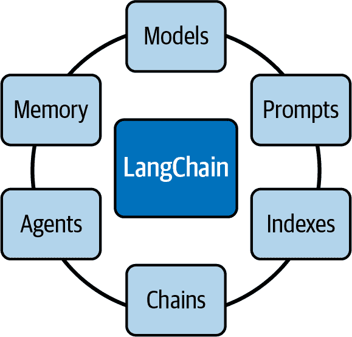
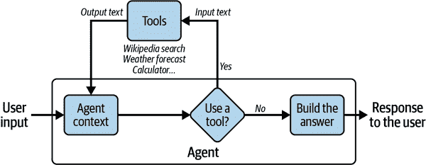
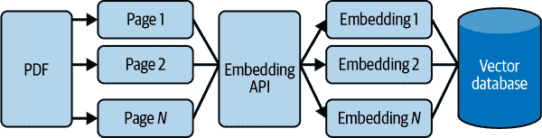
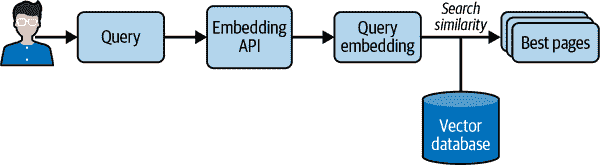
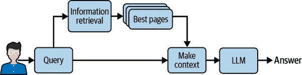

# 第五章：通过 LangChain 框架和插件提升 LLM 功能

本章探讨了 LangChain 框架和 GPT-4 插件的世界。我们将看看 LangChain 如何实现与不同语言模型的交互，以及插件在扩展 GPT-4 功能方面的重要性。这些高级知识将对依赖 LLM 的复杂、尖端应用程序的开发至关重要。

# LangChain 框架

LangChain 是一个专门用于开发 LLM 驱动应用程序的新框架。您会发现，集成 LangChain 的代码比第三章中提供的示例更加优雅。该框架还提供了许多额外的可能性。

使用`pip install langchain`可以快速轻松地安装 LangChain。

###### 警告

在撰写本文时，LangChain 仍处于 beta 版本 0.0.2*XX*，几乎每天都会发布新版本。功能可能会发生变化，因此我们建议在使用该框架时谨慎操作。

LangChain 的关键功能被分为模块，如图 5-1 所示。



###### 图 5-1。LangChain 模块

以下是这些模块的简要描述：

模型

模型模块是 LangChain 提供的标准接口，通过它可以与各种 LLM 进行交互。该框架支持来自各种提供商的不同模型类型集成，包括 OpenAI、Hugging Face、Cohere、GPT4All 等。

提示

提示正在成为编程 LLM 的新标准。提示模块包括许多用于提示管理的工具。

索引

该模块允许您将 LLM 与您的数据结合起来。

链

通过这个模块，LangChain 提供了链接口，允许您创建一个调用序列，结合多个模型或提示。

代理

代理模块介绍了代理接口。代理是一个可以处理用户输入、做出决策并选择适当工具来完成任务的组件。它是迭代工作的，采取行动直到达到解决方案。

内存

内存模块允许您在链或代理调用之间保持状态。默认情况下，链和代理是无状态的，这意味着它们独立处理每个传入请求，就像 LLM 一样。

LangChain 是不同 LLM 的通用接口；您可以在[其文档页面](https://oreil.ly/n5yNV)上查看所有的集成。OpenAI 和许多其他 LLM 提供商都在这个集成列表中。这些集成大多需要它们的 API 密钥来建立连接。对于 OpenAI 模型，您可以像我们在第二章中看到的那样进行设置，将密钥设置在`OPENAI_API_KEY`环境变量中。

## 动态提示

展示 LangChain 工作原理的最简单方法是向您呈现一个简单的脚本。在这个例子中，使用 OpenAI 和 LangChain 来完成一个简单的文本补全：

```py
from langchain.chat_models import ChatOpenAI
from langchain import PromptTemplate, LLMChain
template = """Question: {question} Let's think step by step.
Answer: """
prompt = PromptTemplate(template=template, input_variables=["question"])
llm = ChatOpenAI(model_name="gpt-4")
llm_chain = LLMChain(prompt=prompt, llm=llm)
question = """ What is the population of the capital of the country where the
Olympic Games were held in 2016? """
llm_chain.run(question)
```

输出如下：

```py
Step 1: Identify the country where the Olympic Games were held in 2016.
Answer: The 2016 Olympic Games were held in Brazil.
Step 2: Identify the capital of Brazil.
Answer: The capital of Brazil is Brasília.
Step 3: Find the population of Brasília.
Answer: As of 2021, the estimated population of Brasília is around 3.1 million.
So, the population of the capital of the country where the Olympic Games were 
held in 2016 is around 3.1 million. Note that this is an estimate and may
vary slightly.'
```

`PromptTemplate`负责构建模型的输入。因此，它是生成提示的可重复方式。它包含一个称为*模板*的输入文本字符串，其中的值可以通过`input_variables`指定。在我们的示例中，我们定义的提示自动将“让我们逐步思考”部分添加到问题中。

本例中使用的 LLM 是 GPT-4；目前，默认模型是`gpt-3.5-turbo`。该模型通过`ChatOpenAI()`函数放置在变量`llm`中。该函数假定 OpenAI API 密钥设置在环境变量`OPENAI_API_KEY`中，就像在前几章的示例中一样。

函数`LLMChain()`将提示和模型组合在一起，形成一个包含这两个元素的链。最后，我们需要调用`run()`函数来请求使用输入问题完成。当执行`run()`函数时，`LLMChain`使用提供的输入键值（如果可用，还使用内存键值）格式化提示模板，将格式化的字符串传递给 LLM，最后返回 LLM 输出。我们可以看到，模型通过应用“让我们一步一步地思考”规则自动回答问题。

正如您所看到的，动态提示是复杂应用和更好的提示管理的一个简单但非常有价值的功能。## 代理和工具

代理和工具是 LangChain 框架的关键功能：它们可以使您的应用程序变得非常强大。它们使您能够通过使 LLMs 执行操作并与各种功能集成来解决复杂问题。

*工具*是围绕一个函数的特定抽象，使语言模型更容易与之交互。代理可以使用工具与世界进行交互。具体而言，工具的接口具有单个文本输入和单个文本输出。LangChain 中有许多预定义的工具。这些工具包括 Google 搜索、维基百科搜索、Python REPL、计算器、世界天气预报 API 等。要获取完整的工具列表，请查看 LangChain 提供的[工具页面](https://oreil.ly/iMtOU)的文档。您还可以[构建自定义工具](https://oreil.ly/_dyBW)并将其加载到您正在使用的代理中：这使得代理非常灵活和强大。

正如我们在第四章中所学到的，“让我们一步一步地思考”在提示中，可以在某种程度上增加模型的推理能力。将这个句子添加到提示中，要求模型花更多时间来回答问题。

在本节中，我们介绍了一个适用于需要一系列中间步骤的应用程序的代理。代理安排这些步骤，并可以访问各种工具，决定使用哪个工具以有效地回答用户的查询。在某种程度上，就像“让我们一步一步地思考”一样，代理将有更多的时间来规划其行动，从而能够完成更复杂的任务。

代理的高级伪代码如下：

1.  代理从用户那里接收一些输入。

1.  代理决定使用什么工具（如果有的话）以及输入到该工具的文本。

1.  然后，该工具使用该输入文本进行调用，并从该工具接收一个输出文本。

1.  工具的输出被馈送到代理的上下文中。

1.  步骤 2 到 4 重复进行，直到代理决定不再需要使用工具，然后直接回应用户。

您可能会注意到，这似乎接近我们在第三章中所做的事情，例如可以回答问题并执行操作的个人助理的示例。LangChain 代理允许您开发这种行为……但更加强大。

为了更好地说明代理如何在 LangChain 中使用工具，图 5-2 提供了对交互的视觉演示。



###### 图 5-2. LangChain 中代理和工具的交互

对于这一部分，我们希望能够回答以下问题：2016 年奥运会举办国家的首都人口的平方根是多少？这个问题并没有真正的兴趣，但它很好地演示了 LangChain 代理和工具如何为 LLMs 增加推理能力。

如果我们直接向 GPT-3.5 Turbo 提出这个问题，我们会得到以下回答：

```py
The capital of the country where the Olympic Games were held in 2016 is Rio de
Janeiro, Brazil. The population of Rio de Janeiro is approximately 6.32 million
people as of 2021\. Taking the square root of this population, we get 
approximately 2,513.29\. Therefore, the square root of the population of 
the capital of the country where the Olympic Games were held in 2016 is
approximately 2,513.29.
```

这个答案在两个层面上是错误的：巴西的首都是巴西利亚，而不是里约热内卢，632 万的平方根是 2513.96。通过添加“逐步思考”或使用其他提示工程技术，我们可能能够获得更好的结果，但由于模型在推理和数学运算方面的困难，仍然很难相信结果。使用 LangChain 可以更好地保证准确性。

以下代码给出了一个简单的例子，说明了代理如何在 LangChain 中使用两个工具：维基百科和计算器。在通过`load_tools()`函数创建工具之后，使用`initialize_agent()`函数创建代理。代理的推理需要 LLM；在这里，使用了 GPT-3.5 Turbo。参数`zero-shot-react-description`定义了代理在每一步选择工具的方式。通过将`verbose`值设置为`true`，我们可以查看代理的推理，并理解它是如何得出最终决定的：

```py
from langchain.chat_models import ChatOpenAI
from langchain.agents import load_tools, initialize_agent, AgentType
llm = ChatOpenAI(model_name="gpt-3.5-turbo", temperature=0)
tools = load_tools(["wikipedia", "llm-math"], llm=llm)
agent = initialize_agent(
    tools, llm, agent=AgentType.ZERO_SHOT_REACT_DESCRIPTION, verbose=True
)
question = """What is the square root of the population of the capital of the
Country where the Olympic Games were held in 2016?"""
agent.run(question)
```

###### 注意

要运行维基百科工具，需要安装相应的 Python 包`wikipedia`。可以使用`pip install wikipedia`来完成。

正如你所看到的，代理决定查询维基百科关于 2016 年夏季奥运会的信息：

```py
> Entering new chain...
I need to find the country where the Olympic Games were held in 2016 and then find
the population of its capital city. Then I can take the square root of that population.
Action: Wikipedia
Action Input: "2016 Summer Olympics"
Observation: Page: 2016 Summer Olympics
[...]
```

输出的下几行包含了维基百科关于奥运会的摘录。接下来，代理使用了维基百科工具两次：

```py
Thought:I need to search for the capital city of Brazil.
Action: Wikipedia
Action Input: "Capital of Brazil"
Observation: Page: Capitals of Brazil
Summary: The current capital of Brazil, since its construction in 1960, is
Brasilia. [...]
Thought: I have found the capital city of Brazil, which is Brasilia. Now I need 
to find the population of Brasilia.
Action: Wikipedia
Action Input: "Population of Brasilia"
Observation: Page: Brasilia
[...]
```

作为下一步，代理使用了计算器工具：

```py
Thought: I have found the population of Brasilia, but I need to calculate the
square root of that population.
Action: Calculator
Action Input: Square root of the population of Brasilia (population: found in 
previous observation)
Observation: Answer: 1587.051038876822
```

最后：

```py
Thought:I now know the final answer
Final Answer: The square root of the population of the capital of the country
where the Olympic Games were held in 2016 is approximately 1587.
> Finished chain.
```

正如你所看到的，代理展示了复杂的推理能力：在得出最终答案之前，它完成了四个不同的步骤。LangChain 框架允许开发人员只需几行代码就能实现这种推理能力。

###### 提示

虽然可以使用多个 LLM 作为代理，而 GPT-4 是其中最昂贵的，但我们经验上发现对于复杂问题，使用 GPT-4 可以获得更好的结果；我们观察到当使用较小的模型进行代理推理时，结果可能很快变得不一致。您可能还会因为模型无法以预期格式回答而收到错误。

## 记忆

在某些应用中，记住以前的交互在短期和长期内都是至关重要的。使用 LangChain，您可以轻松地向链和代理添加状态以管理记忆。构建聊天机器人是这种能力最常见的例子。您可以使用`ConversationChain`很快地完成这个过程，基本上只需几行代码就可以将语言模型转化为聊天工具。

以下代码使用`text-ada-001`模型制作了一个聊天机器人。这是一个能够执行基本任务的小型模型。然而，它是 GPT-3 系列中最快的模型，成本最低。这个模型从未被微调成为聊天机器人，但我们可以看到，只需两行代码，我们就可以使用 LangChain 来使用这个简单的完成模型进行聊天：

```py
from langchain import OpenAI, ConversationChain
chatbot_llm = OpenAI(model_name='text-ada-001')
chatbot = ConversationChain(llm=chatbot_llm , verbose=True)
chatbot.predict(input='Hello')
```

在上述代码的最后一行，我们执行了`predict(input='Hello')`。这导致聊天机器人被要求回复我们的`Hello`消息。正如你所看到的，模型的回答是：

```py

> Entering new ConversationChain chain...
Prompt after formatting:
The following is a friendly conversation between a human and an AI. The AI is
talkative and provides lots of specific details from its context. If the AI
does not know the answer to a question, it truthfully says it does not know.
Current conversation:
Human: Hello
AI:
> Finished chain.
' Hello! How can I help you?'
```

由于在`ConversationChain`中使用了`verbose=True`，我们可以查看 LangChain 使用的完整提示。当我们执行`predict(input='Hello')`时，LLM`text-ada-001`接收到的不仅仅是`'Hello'`消息，而是一个完整的提示，位于`> Entering new ConversationChain chain…`和`> Finished chain`标签之间。

如果我们继续对话，你会发现这个函数会在提示中保留对话历史。如果我们问“我可以问你一个问题吗？你是人工智能吗？”对话的历史也会出现在提示中：

```py
> Entering new ConversationChain chain...
Prompt after formatting:
The following [...] does not know.
Current conversation:
Human: Hello
AI:  Hello! How can I help you?
Human: Can I ask you a question? Are you an AI?
AI:
> Finished chain.
'\n\nYes, I am an AI.'
```

`ConversationChain`对象使用提示工程技术和记忆技术，将任何进行文本完成的 LLM 转化为聊天工具。

###### 警告

即使这个 LangChain 功能允许所有语言模型具有聊天功能，但这个解决方案并不像`gpt-3.5-turbo`和`gpt-4`这样强大，后者已经专门针对聊天进行了优化。此外，OpenAI 已宣布废弃`text-ada-001`。

## 嵌入

将语言模型与您自己的文本数据相结合是个性化应用程序中使用的模型知识的强大方式。其原理与第三章中讨论的相同：第一步是*信息检索*，指的是获取用户的查询并返回最相关的文档。然后将文档发送到模型的输入上下文中，要求其回答查询。本节展示了如何使用 LangChain 和嵌入来轻松实现这一点。

LangChain 中一个重要的模块是`document_loaders`。使用这个模块，您可以快速将文本数据从不同的来源加载到您的应用程序中。例如，您的应用程序可以加载 CSV 文件、电子邮件、PowerPoint 文档、Evernote 笔记、Facebook 聊天、HTML 页面、PDF 文档以及许多其他格式。完整的加载器列表可在[官方文档](https://oreil.ly/t7nZx)中找到。每个加载器都非常容易设置。本示例重用了[*探险者指南：塞尔达传说：荒野之息*](https://oreil.ly/ZGu3z)的 PDF。

如果 PDF 文件在当前工作目录中，以下代码加载其内容并按页面进行划分：

```py
from langchain.document_loaders import PyPDFLoader
loader = PyPDFLoader("ExplorersGuide.pdf")
pages = loader.load_and_split()
```

###### 注意

要使用 PDF 加载程序，需要安装 Python 的`pypdf`包。可以使用`pip install pypdf`来完成。

要进行信息检索，需要嵌入每个加载的页面。正如我们在第二章中讨论的那样，*嵌入*是信息检索中使用的一种技术，用于将非数值概念（如单词、标记和句子）转换为数值向量。嵌入使模型能够有效地处理这些概念之间的关系。使用 OpenAI 的嵌入端点，开发人员可以获得输入文本的数值向量表示，而 LangChain 有一个包装器来调用这些嵌入：

```py
from langchain.embeddings import OpenAIEmbeddings
embeddings = OpenAIEmbeddings()
```

###### 注意

要使用`OpenAIEmbeddings`，请使用`pip install tiktoken`安装`tiktoken` Python 包。

索引保存页面的嵌入并使搜索变得容易。LangChain 以向量数据库为中心。可以在许多向量数据库中进行选择；完整的列表可在[官方文档](https://oreil.ly/nJLCI)中找到。以下代码片段使用了[FAISS 向量数据库](https://oreil.ly/7TMdI)，这是 Meta 的[基础 AI 研究小组](https://ai.facebook.com)主要开发的相似性搜索库：

```py
from langchain.vectorstores import FAISS
db = FAISS.from_documents(pages, embeddings)
```

###### 注意

要使用 FAISS，需要使用`pip install faiss-cpu`安装`faiss-cpu` Python 包。

为了更好地说明 PDF 文档的内容是如何转换为嵌入页面并存储在 FAISS 向量数据库中的，图 5-3 以可视化方式总结了这个过程。



###### 图 5-3\. 从 PDF 文档创建和保存嵌入

现在可以轻松搜索相似之处了：

```py
q = "What is Link's traditional outfit color?"
db.similarity_search(q)[0]
```

从前面的代码中，我们得到以下内容：

```py
Document(page_content='While Link’s traditional green tunic is certainly an iconic look, his 
              wardrobe has expanded [...] Dress for Success', metadata={'source': 'ExplorersGuide.pdf', 'page': 35}) 
```

问题的答案是林克的传统服装颜色是绿色，我们可以看到答案在所选内容中。输出显示答案在*ExplorersGuide.pdf*的第 35 页。请记住，Python 从零开始计数；因此，如果返回到*探险者指南：塞尔达传说：荒野之息*的原始 PDF 文件，解决方案在第 36 页（而不是第 35 页）。

图 5-4 显示了信息检索过程如何使用查询的嵌入和向量数据库来识别与查询最相似的页面。



###### 图 5-4。信息检索寻找与查询最相似的页面

您可能希望将您的嵌入式信息集成到您的聊天机器人中，以便在回答您的问题时使用它检索到的信息。同样，在 LangChain 中，这只需要几行代码就可以轻松完成。我们使用`RetrievalQA`，它以 LLM 和向量数据库作为输入。然后我们以通常的方式向获得的对象提问：

```py
from langchain.chains import RetrievalQA
from langchain import OpenAI
llm = OpenAI()
chain = RetrievalQA.from_llm(llm=llm, retriever=db.as_retriever())
q = "What is Link's traditional outfit color?"
chain(q, return_only_outputs=True)
```

我们得到了以下答案：

```py
{'result': " Link's traditional outfit color is green."}
```

图 5-5 展示了`RetrievalQA`如何使用信息检索来回答用户的问题。正如我们在这个图中看到的，“创建上下文”将信息检索系统找到的页面和用户的初始查询组合在一起。然后将这个丰富的上下文发送给语言模型，语言模型可以使用上下文中添加的额外信息来正确回答用户的问题。



###### 图 5-5。为了回答用户的问题，检索到的信息被添加到 LLM 的上下文中

您可能会想知道为什么在将信息从文档发送到语言模型的上下文之前需要进行信息检索。事实上，当前的语言模型无法考虑到具有数百页的大文件。因此，如果输入数据太大，我们会对其进行预过滤。这就是信息检索过程的任务。在不久的将来，随着输入上下文的增加，可能会出现一些情况，使用信息检索技术可能不是技术上必要的。

# GPT-4 插件

虽然语言模型，包括 GPT-4，在各种任务中都证明了其帮助性，但它们也存在固有的局限性。例如，这些模型只能从它们所训练的数据中学习，这些数据通常已经过时或不适用于特定的应用。此外，它们的能力仅限于文本生成。我们也看到 LLMs 无法完成一些任务，比如复杂的计算。

本节重点介绍了 GPT-4 的一个突破性功能：插件（请注意，GPT-3.5 模型无法访问插件功能）。在 AI 的发展过程中，插件已经成为一种重新定义与 LLMs 交互的新型变革工具。插件的目标是为 LLM 提供更广泛的功能，使模型能够访问实时信息，执行复杂的数学计算，并利用第三方服务。

我们在第一章](ch01.html#gpt_4_and_chatgpt_essentials)中看到，该模型无法执行复杂的计算，比如 3,695 × 123,548。在图 5-6 中，我们激活了计算器插件，我们可以看到当模型需要进行计算时，模型会自动调用计算器，从而使其找到正确的解决方案。

通过迭代部署方法，OpenAI 逐步向 GPT-4 添加插件，这使 OpenAI 能够考虑插件的实际用途以及可能引入的安全性和定制化挑战。虽然自 2023 年 5 月以来，所有付费用户都可以使用插件，但在撰写本文时，尚未为所有开发人员提供创建新插件的功能。

![

###### 图 5-6。GPT-4 使用计算器插件

OpenAI 的目标是创建一个生态系统，插件可以帮助塑造人工智能与人类互动的未来动态。今天，一家严肃的企业没有自己的网站是不可想象的，但也许很快，每家公司都需要有自己的插件。事实上，一些早期的插件已经由 Expedia、FiscalNote、Instacart、KAYAK、Klarna、Milo、OpenTable、Shopify 和 Zapier 等公司推出。

除了其主要功能外，插件还以多种方式扩展了 GPT-4 的功能。在某种程度上，插件与“LangChain 框架”中讨论的代理和工具存在一些相似之处。例如，插件可以使 LLM 检索实时信息，如体育比分和股票价格，从知识库中提取数据，如公司文件，并根据用户的需求执行任务，如预订航班或订餐。两者都旨在帮助 AI 访问最新信息并进行计算。然而，GPT-4 中的插件更专注于第三方服务，而不是 LangChain 的工具。

本节通过探索 OpenAI 网站上提供的示例的关键点，介绍了创建插件的基本概念。我们将以待办事项定义插件的示例为例。插件仍处于有限的测试版阶段，因此我们在撰写本书时鼓励读者访问[OpenAI 参考页面](https://platform.openai.com/docs/plugins/introduction)获取最新信息。还要注意，在测试版阶段，用户必须在 ChatGPT 的用户界面中手动启用他们的插件，作为开发者，您最多可以与 100 名用户分享您的插件。

## 概述

作为插件开发者，您必须创建一个 API，并将其与两个描述性文件关联起来：一个插件清单和一个 OpenAPI 规范。当用户开始与 GPT-4 进行交互时，如果安装了您的插件，OpenAI 会向 GPT 发送一个隐藏的消息。这条消息简要介绍了您的插件，包括其描述、端点和示例。

然后，模型变成了一个智能的 API 调用者。当用户询问有关您的插件的问题时，模型可以调用您的插件 API。调用插件的决定是基于 API 规范和自然语言描述您的 API 应该在何种情况下使用。一旦模型决定调用您的插件，它会将 API 结果合并到其上下文中，以向用户提供响应。因此，插件的 API 响应必须返回原始数据，而不是自然语言响应。这使得 GPT 可以根据返回的数据生成自己的自然语言响应。

例如，如果用户问“我应该在纽约住在哪里？”，模型可以使用酒店预订插件，然后将插件的 API 响应与其语言生成能力结合起来，提供既信息丰富又用户友好的答案。

## API

以下是在[OpenAI 的 GitHub](https://oreil.ly/un13K)上提供的待办事项定义插件的简化代码示例：

```py
import json
import quart
import quart_cors
from quart import request
app = quart_cors.cors(
    quart.Quart(__name__), allow_origin="https://chat.openai.com"
)
# Keep track of todo's. Does not persist if Python session is restarted.
_TODOS = {}
@app.post("/todos/<string:username>")
async def add_todo(username):
    request = await quart.request.get_json(force=True)
    if username not in _TODOS:
        _TODOS[username] = []
    _TODOS[username].append(request["todo"])
    return quart.Response(response="OK", status=200)
@app.get("/todos/<string:username>")
async def get_todos(username):
    return quart.Response(
        response=json.dumps(_TODOS.get(username, [])), status=200
    )
@app.get("/.well-known/ai-plugin.json")
async def plugin_manifest():
    host = request.headers["Host"]
    with open("./.well-known/ai-plugin.json") as f:
        text = f.read()
        return quart.Response(text, mimetype="text/json")
@app.get("/openapi.yaml")
async def openapi_spec():
    host = request.headers["Host"]
    with open("openapi.yaml") as f:
        text = f.read()
        return quart.Response(text, mimetype="text/yaml")
def main():
    app.run(debug=True, host="0.0.0.0", port=5003)
if __name__ == "__main__":
    main()
```

这段 Python 代码是一个管理待办事项列表的简单插件的示例。首先，变量`app`使用`quart_cors.cors()`进行初始化。这行代码创建了一个新的 Quart 应用程序，并配置它以允许来自[*https://chat.openai.com*](https://chat.openai.com)的跨域资源共享（CORS）。Quart 是一个 Python Web 微框架，Quart-CORS 是一个允许对 CORS 进行控制的扩展。这个设置允许插件与指定 URL 上托管的 ChatGPT 应用程序进行交互。

然后，代码定义了几个 HTTP 路由，对应于待办事项插件的不同功能：`add_todo`函数，关联一个`POST`请求，以及`get_todos`函数，关联一个`GET`请求。

接下来，定义了两个额外的端点：`plugin_manifest`和`openapi_spec`。这些端点提供了插件的清单文件和 OpenAPI 规范，这对于 GPT-4 和插件之间的交互至关重要。这些文件包含了关于插件及其 API 的详细信息，GPT-4 使用这些信息来了解何时以及如何使用插件。

## 插件清单

每个插件都需要在 API 的域上有一个 *ai-plugin.json* 文件。例如，如果您的公司在 *thecompany.com* 上提供服务，您必须在 *https://thecompany.com/.well-known* 上托管此文件。在安装插件时，OpenAI 将在 */.well-known/ai-plugin.json* 中查找此文件。没有这个文件，插件就无法安装。

以下是所需的 *ai-plugin.json* 文件的最小定义：

```py
{
    "schema_version": "v1",
    "name_for_human": "TODO Plugin",
    "name_for_model": "todo",
    "description_for_human": "Plugin for managing a TODO list. \
        You can add, remove and view your TODOs.",
    "description_for_model": "Plugin for managing a TODO list. \
        You can add, remove and view your TODOs.",
    "auth": {
        "type": "none"
    },
    "api": {
        "type": "openapi",
        "url": "http://localhost:3333/openapi.yaml",
        "is_user_authenticated": false
    },
    "logo_url": "http://localhost:3333/logo.png",
    "contact_email": "support@thecompany.com",
    "legal_info_url": "http://www.thecompany.com/legal"
}      
```

字段在 表 5-1 中详细说明。

表 5-1\. *ai-plugin.json 文件* 中所需字段的描述

| 字段名称 | 类型 | 描述 |
| --- | --- | --- |
| `name_for_model` | String | 模型用于了解您的插件的简称。它只能包含字母和数字，且不得超过 50 个字符。 |
| `name_for_human` | String | 人们看到的名称。它可以是您公司的全名，但必须少于 20 个字符。 |
| `description_for_human` | String | 您的插件功能的简单解释。供人们阅读，应少于 100 个字符。 |
| `description_for_model` | String | 详细的解释，帮助 AI 理解您的插件。因此，向模型解释插件的目的至关重要。描述可以长达 8,000 个字符。 |
| `logo_url` | String | 您的插件标志的 URL。标志理想情况下应为 512 × 512 像素。 |
| `contact_email` | String | 人们可以使用的电子邮件地址，如果他们需要帮助。 |
| `legal_info_url` | String | 一个网址，让用户找到有关您的插件的更多详细信息。 |

## OpenAPI 规范

创建插件的下一步是使用 API 规范创建 *openapi.yaml* 文件。此文件必须遵循 OpenAPI 标准（参见 “理解 OpenAPI 规范”）。GPT 模型只通过此 API 规范文件和清单文件中详细的信息来了解您的 API。

以下是待办事项清单定义插件的 *openapi.yaml* 文件的第一行的示例：

```py
openapi: 3.0.1
info:
  title: TODO Plugin
  description: A plugin that allows the user to create and manage a TODO list
  using ChatGPT. If you do not know the user's username, ask them first before
  making queries to the plugin. Otherwise, use the username "global".
  version: 'v1'
servers:
  - url: http://localhost:5003
paths:
  /todos/{username}:
    get:
      operationId: getTodos
      summary: Get the list of todos
      parameters:
      - in: path
        name: username
        schema:
            type: string
        required: true
        description: The name of the user.
      responses:
        "200":
          description: OK
          content:
            application/json:
              schema:
                $ref: '#/components/schemas/getTodosResponse'
[...]
```

将 OpenAPI 规范视为足够自身理解和使用您的 API 的描述性文档。在 GPT-4 中进行搜索时，信息部分中的描述用于确定插件与用户搜索的相关性。其余的 OpenAPI 规范遵循标准的 OpenAPI 格式。许多工具可以根据您现有的 API 代码或反之自动生成 OpenAPI 规范。

## 描述

当用户的请求可能受益于插件时，模型会启动对 OpenAPI 规范中的端点描述以及清单文件中的 `description_for_model` 属性的扫描。您的目标是创建最合适的响应，这通常涉及测试不同的请求和描述。

OpenAPI 文档应提供有关 API 的广泛信息，例如可用函数及其各自的参数。它还应包含特定于属性的“描述”字段，提供有价值的、自然书写的解释，说明每个函数的作用以及查询字段期望的信息类型。这些描述指导模型最合适地使用 API。

这个过程中的一个关键元素是 `description_for_model` 属性。这为您提供了一种方式来告知模型如何使用插件。创建简洁、清晰和描述性的说明是非常推荐的。

然而，在编写这些描述时遵循某些最佳实践是必不可少的：

+   不要试图影响 GPT 的情绪、个性或确切的响应。

+   避免指示 GPT 使用特定的插件，除非用户明确请求该类别的服务。

+   不要指定 GPT 使用插件的特定触发器，因为它被设计为自主确定何时使用插件是合适的。

简而言之，开发 GPT-4 插件涉及创建 API，指定其在 OpenAPI 规范中的行为，并在清单文件中描述插件及其用法。通过这种设置，GPT-4 可以有效地充当智能 API 调用者，扩展其能力超越文本生成。

# 总结

LangChain 框架和 GPT-4 插件代表了最大程度发挥 LLM 潜力的重大进步。

LangChain 凭借其强大的工具和模块套件，已成为 LLM 领域的中心框架。它在集成不同模型、管理提示、组合数据、排序链、处理代理和使用内存管理方面的多功能性为开发人员和人工智能爱好者打开了新的途径。第三章中的示例证明了使用 ChatGPT 和 GPT-4 模型从头开始编写复杂指令的限制。请记住，LangChain 的真正潜力在于创造性地利用这些功能来解决复杂任务，并将通用语言模型转化为功能强大、细粒度的应用程序。

GPT-4 插件是语言模型和实时可用的上下文信息之间的桥梁。本章表明，开发插件需要一个结构良好的 API 和描述性文件。因此，在这些文件中提供详细和自然的描述是必不可少的。这将帮助 GPT-4 充分利用您的 API。

LangChain 和 GPT-4 插件的激动人心世界证明了人工智能和 LLM 领域迅速发展的景象。本章提供的见解只是这些工具变革潜力的一小部分。

# 结论

本书为您提供了利用 LLM 的力量并将其应用于现实世界应用所需的基础和高级知识。我们涵盖了从基本原理和 API 集成到高级提示工程和微调的一切，引导您朝着使用 OpenAI 的 GPT-4 和 ChatGPT 模型的实际用例。我们以详细介绍 LangChain 框架和插件如何使您能够释放 LLM 的力量并构建真正创新的应用程序来结束了本书。

现在，您拥有了工具，可以在 AI 领域进一步开拓，开发利用这些先进语言模型的强大应用程序。但请记住，AI 领域不断发展，因此必须密切关注进展并相应地进行调整。这次进入 LLM 世界的旅程只是开始，您的探索不应该止步于此。我们鼓励您利用新知识探索人工智能技术的未来。
