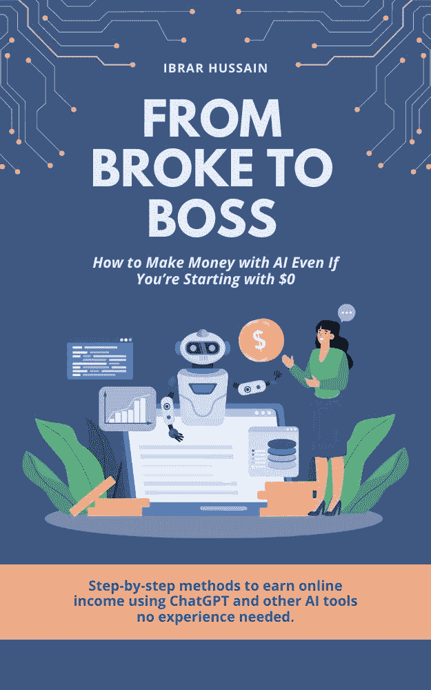

# 从破产到老板：即使从零开始，如何用 AI 赚钱

> 原文：[From Broke to Boss: How to Make Money with AI Even If You’re Starting with $0](https://annas-archive.gl/md5/74dbbbaed0e2837324daedf4782e3953)
> 
> 译者：[飞龙](https://github.com/wizardforcel)
> 
> 协议：[CC BY-NC-SA 4.0](https://creativecommons.org/licenses/by-nc-sa/4.0/)

使用 ChatGPT 和其他 AI 工具赚取在线收入的分步方法——无需经验。

这本书献给你——梦想家、奋斗者、拒绝妥协的人。

也许有人告诉你太晚了，你没有正确的技能，或者在线赚钱只是运气。但你现在在这里，准备证明他们错了。

这是为了深夜的谷歌搜索，副业的磨砺，以及坚定不移的信念，相信有更好的方法。

你不仅仅是在读一本书——你正在解锁一个全新的未来。

让我们开始吧。

# 引言：你的旅程从这里开始

你选择这本书有原因。也许你厌倦了在发薪日前看到你的银行账户归零。也许你厌倦了在一份不能让你满足的工作中用小时换美元。或者也许你深信——深信不疑——必须有一种更好的方式来建立真正的财富，尤其是在 AI 改变一切的世界里。

事实是：你是对的。

旧的钱规则不再适用。你不需要大学学位、富有的叔叔，甚至创业资金来建立一家有利可图的业务。多亏了 ChatGPT、Midjourney 和 Canva 等 AI 工具，你今天就可以开始赚钱——即使你从零开始。

### 为什么这本书与众不同

这不是另一本充满模糊建议的理论指南。没有废话。没有复杂的术语。只有真实、一步一步的方法，这些方法对成千上万曾经处于你完全相同位置的人有效——破产、沮丧，但准备好改变。

我不会对你撒谎：成功需要努力。但有了 AI，努力变得更聪明，而不是更艰难。与其花费数年学习一项技能，你不如利用 AI 来缩短这个过程。与其猜测什么能卖，你不如让数据和自动化来引导你。

### 适合谁

● 如果你曾经想过，“我希望我能在线赚钱，但不知道从哪里开始…”

● 如果你之前尝试过副业但被一些可疑的“大师”压垮或欺骗过…

● 如果你已经准备好采取行动，并最终建立一个金钱不再是持续压力的生活…

…那么这本书就是你的蓝图。

### 如何使用这本书

1. 从第一章开始。你不必一次做所有的事情。选择你最感兴趣的方法。

2. 立即采取行动。仅仅阅读是不会改变你的生活的——应用你所学的才会。

3.    重复、改进和扩展。你的前 10 个将导致 10 0，然后是 1,000。

### 你的未来从现在开始

一年后，你可能会处于完全相同的位置——或者你可以回顾这一刻，将其视为转折点。区别在哪里？你接下来要做什么。

翻到下一页。让我们开始吧。

“唯一阻碍你实现目标的是你不断告诉自己为什么无法实现的故事。” ——乔丹·贝尔福特

# 第一章：心态转变——为什么 AI 是你的金票

"你的收入直接与你对金钱的看法相关。改变你的心态，你就改变了你的财务未来。" ——T. 哈尔·艾克

## 大多数人保持贫穷的第 1 个原因

让我们从一条艰难的真理开始：你的银行账户不是问题——是你的心态。

大多数人停滞不前，因为他们认为赚钱需要：

●    一个昂贵的学位

●    一个富裕的家庭

●    多年的经验

●    或者只是纯粹的运气

但现实是：数字经济已经改变了一切。AI 是伟大的平等主义者——它不在乎你的背景，只在乎你学习和行动的意愿。

从贫穷到老板的第一步不是学习一项技能或找到“完美”的机会。而是重新连接你对可能性的信念。

## 如何像 AI 企业家一样思考

成功的人不会等待许可——他们创造机会。有了 AI，你可以：

●    替换技能（ChatGPT 写作，Midjourney 设计，ElevenLabs 做配音）

●    工作更快（自动化原本需要数小时的任务）

●    免费测试想法（无需像传统企业那样的前期成本）

而不是思考：

❌ "我不知道怎么做到这一点。"

开始提问：

✅ "AI 能如何帮助我做到这一点？"

这个简单的转变价值数百万。

## 将怀疑转化为动力

你将面临怀疑的时刻。你可能认为：

●    "如果我失败了怎么办？"

●    "我没有技术技能。"

●    "其他人已经在做这件事了。"

这里有一个秘密：每个成功的人都是从零开始的。区别在哪里？他们在恐惧中采取了行动。

AI 消除了最大的障碍：

●    没有钱？免费工具存在。

●    没有技能？AI 填补了空白。

●    没有时间？自动化工作。

你唯一的真正障碍？没有开始。

## 你的第一个行动步骤

在进入第二章之前，现在就做这件事：

1.    写下你关于金钱的一个限制性信念（例如，“我永远不会擅长技术”）。

2.    将其转变为 AI 驱动的解决方案（例如，“ChatGPT 可以教我任何东西——我会边走边学”）。

3.    取得一小步（注册一个免费的 AI 工具。谷歌"[你的恐惧] + AI 解决方案"）。

*"种树最好的时间是 20 年前，其次是现在。" —— 中国谚语

明天的成功始于今天的决定。当你准备好解锁第一条收入来源时，翻到下一页。

* * *

关键要点：

✔️ 你的心态决定了你的财务未来

✔️ AI 取代了技能、时间和金钱的障碍

✔️ 每个专家曾经都是初学者

✔️ 行动克服恐惧——在你准备好之前就开始

接下来：第二章——如何使用 AI 在零经验的情况下获得付费客户。

# 第二章：使用 AI 自由职业——为简单技能获得报酬

“取得成功的秘诀是开始。” —— 马克·吐温

## 为什么自由职业是赚取第一笔在线 100 美元的最快方式

让我来猜猜——你认为你需要多年的经验才能获得技能报酬。错了。

自由职业经济正在蓬勃发展，AI 让在没有成为专家的情况下交付专业水平的工作变得比以往任何时候都容易。像 Upwork、Fiverr 和 Freelancer 这样的平台充满了只想看到结果的客户——他们不在乎你是如何完成的。

这里有一个变革者：现在 AI 工具可以为你完成 80% 的工作。无论是写作、设计、编码还是营销，总有人愿意付钱让你管理 AI 生成的输出。你的工作？成为指导技术的那个“人”。

## 5 AI 驱动的服务任何人都可以提供（无需经验）

1. 博客写作与内容创作（ChatGPT 写作，你编辑）

2. 社交媒体图形（Canva + AI 图像工具）

3. 基础视频剪辑（CapCut/Pictory 自动编辑）

4. 产品描述（AI 在几分钟内生成 100 多个）

5. 简单聊天机器人（ManyChat 需要零编码）

这些服务每天都有真实需求。例如：

● 小型企业需要社交媒体帖子

● 博客作者需要 SEO 文章

● 电子商务店铺需要产品描述

你不需要是最好的——只需要可靠和快速。

## 如何设置你的第一个任务（步骤详解）

1. 选择一个平台：从 Fiverr 或 Upwork 开始（对于初学者竞争较低）

2. 选择你的服务：“我将使用 AI 写 SEO 博客文章（人工编辑）”

3. 最初定价低：

4. 5-

5. 每个任务 5-15 美元以获得评价

6. 使用 AI 模板：

○ 写作：*"给我一篇关于 [主题] 的 500 字博客文章，语气友好"*

○ 图形：*"生成一篇关于生产力的极简 Instagram 帖子"*

7. 迅速交付：AI 让你用 1/4 的时间完成工作

专业提示：提供“快速交付”作为增值服务——客户喜欢速度！

## 从第一个任务到每月 1,000 美元（扩展秘诀）

一旦你获得 5-10 个好评：

● 提高价格（从

● 5to

● 5 到 25+ 美元/任务）

● 提供套餐（例如：“100 美元包含 3 篇博客文章”）

● 重复使用 AI 输出（将一篇 AI 生成的文章变成多个社交媒体帖子）

真实案例：Sarah，一位全职妈妈，在 90 天内通过提供以下服务赚了 3,200 美元/月：

● 使用 AI 生成的 Pinterest 图钉

● 使用 ChatGPT 发送电子邮件通讯

● 为小型企业提供简单的视频剪辑

她的秘密？她不是最好的设计师或作家——她只是始终如一地出现。

## 你的行动步骤（现在就做）

1. 打开 Fiverr/Upwork（免费）

2. 为 AI 驱动的服务创建一个任务

3. 使用这个标题公式：

“我将使用 AI 为 [好处] 提供 [服务]”

示例："我将使用 AI（人工编辑）撰写吸引人的博客文章来增加你的流量"

"你错过 100%你没有射出的球。" —— 韦恩·格雷茨基

关键要点：

✔️ AI 让你可以提供服务而不必成为专家

✔️ 从低价开始，获取评论，然后提高价格

✔️ 每次都是一致性胜过完美

接下来：第三章 – 如何在不触碰库存的情况下销售实体产品（按需印刷）。

# 第三章：按需印刷 – 不持有库存销售设计

"睡觉时赚钱？这不是梦想——这是按需印刷。"

## 为什么这是最懒惰（也是最聪明）的在线赚钱方式

想象一下，在不做以下事情的情况下销售 T 恤、杯子、手机壳：

●   购买库存

●   包装订单

●   处理客户服务

这就是按需印刷（POD）的魔力。像 Redbubble、Teespring 和 Printful 这样的公司处理一切——你只需上传设计并收取利润。

正是这里，AI 改变了所有的一切：你不需要是一位艺术家。像 Midjourney 和 DALL·E 这样的工具可以根据简单的文本提示在几秒钟内创建出惊人的、独特的设计。

## 10 分钟内找到病毒式利基市场（无需猜测）

POD 成功的关键？向热情的粉丝群体销售。以下是找到获胜利基市场的方法：

1.   检查趋势（使用 Google Trends 或 Pinterest）

○   示例："Cat dad"去年增长了 220%

2.   浏览畅销书（查看 Redbubble 顶级产品上的亚马逊商品）

3.   思考痴迷（游戏玩家、健身房狂热者、宠物爱好者等）

现在的热门利基示例：

●   复古游戏设计

●   讽刺咖啡杯

●   利基爱好（例如，“植物妈妈”或“钓鱼梗”）

## 从 AI 提示到付费销售（真实案例）

这就是 19 岁的少年上个月赚了 1200 美元的详细过程：

1.   使用的 AI 提示："程序员搞笑 T 恤设计，黑色幽默，简约风格"

2.   工具：Mid Journey + Canva（添加文字）

3.   上传至：Redbubble（在 T 恤、杯子、贴纸上）

4.   每次销售的利润：

5.   3–

6.   3 – 15（自动存入）

每个设计投入的总时间：每设计 27 分钟

## 三倍销售的上传技巧

大多数初学者失败的原因：

❌ 只在 T 恤上放置设计

智能卖家通过以下方式获胜：

✅ 添加每个产品选项：

●   手机壳

●   背包

●   贴纸

●   笔记本

为什么？同样的设计在多个商品上销售时可以多卖 5 倍。

## 你的行动计划（今天开始）

1.   免费注册：Redbubble.com 或 TeePublic.com

2.   创建 3 个 AI 设计：使用以下提示：

○   "[风格]中的时尚[利基]设计，鲜艳的颜色"

○   "[爱好]的搞笑引言，加粗文字"

○   "贴纸[动物/物体]轮廓的简约设计"

3.   每次上传 5+个产品

"不要等到准备好。世界奖励那些开始的人。"

关键要点：

✔️ AI 在几秒钟内生成可售设计

✔️ 热情的市场 = 容易销售

✔️ 更多产品 = 更多被动收入来源

接下来：第四章——博客如何仍然每月赚取 10K 美元（使用人工智能写一切）。

# 第四章：AI 博客——睡梦中获得被动收入

“博客就像种植一棵金钱树。它需要时间来成长，但然后它会让你多年受益。”

## 为什么在 2024 年博客仍然有效（比以往任何时候都好）

你可能认为博客已经死了——毕竟，我们现在有 TikTok 和 YouTube。但事实是：

●               Google 仍然免费向优质文章发送流量（多年来！）

●               人工智能可以写 90%的内容（有正确的策略）

●               博客的前 1%的收入超过每月 50K 美元（许多人从 AI 开始）

这不是关于成为下一个维基百科。这是关于找到渴望的读者，并通过广告、联盟营销和数字产品获得报酬。

## 懒惰写作者的 100 篇文章指南

传统博客需要：

❌ 写作数小时

❌ SEO 研究头痛

❌ 等待数月以获得流量

现在有了 AI：

✅ ChatGPT 在 10 分钟内写出初稿

✅ RankIQ/AHREFS 找到低竞争关键词

✅ Canva 制作特色图片

真实案例研究：

●               细分市场：“适合初学者的最佳露营装备”

●               人工智能在两周内写了 50 篇文章

●               6 个月后：从亚马逊联盟营销中获得每月 3,200 美元

## 选择能赚钱的细分市场

忘记了“激情项目”——这些细分市场可以转化：

1.               “最佳[产品]”评论（联盟佣金）

2.               “如何[解决问题]”指南（广告收入）

3.               行业新闻（赞助）

热门例子：

●               “为小企业的人工智能工具”

●               “预算旅行技巧”

●               “家庭健身器材”

## 流量捷径（无需等待 6 个月）

大多数博客失败的原因是它们：

❌ 随意写主题

❌ 不要推广内容

智能 AI 博主：

✅ 使用 Twitter/Pinterest 来提升早期流量

✅ 将文章改编成 10+篇社交媒体帖子

✅ 交叉链接帖子以保持读者的参与度

专业技巧：给旧帖子添加“更新：[当前年份]”以使其再次排名。

## 你的前三篇文章（今天开始）

1.               寻找关键词：使用免费的 Google 关键词规划师

○               例子：“200 美元以下的最佳预算无人机”

2.               人工智能提示：

*"写一篇关于[主题]的 1,200 字初学者友好指南。包括带有 5 个产品的购买指南。"*

3.               发布在：WordPress（自托管）或 Medium.com

“一年后，你会希望你现在就开始。”

关键要点：

✔️ 人工智能草稿+人工编辑 = 无限内容

✔️ 产品评论 = 最容易的联盟营销收入

✔️ Google 流量随时间累积

接下来：第五章——无需露脸的 YouTube（AI 声音与编辑）。

# 第五章：无脸 YouTube——不上镜也能赚钱

“YouTube 为注意力付费，而不是你的脸。”

## 无脸 YouTube 帝国的崛起

你不需要成为一个有魅力的视频博主才能在 YouTube 上成功。今天一些最赚钱的频道从未展示过任何一张脸：

●               “Reddit 故事”频道（人工智能声音阅读帖子）

●               “十大”列表（库存视频 + 人工智能配音）

●               “励志名言”（文本动画）

这里是为什么这有效的原因：

✅ 不需要拍摄设备

✅ AI 工具自动编辑视频

✅ 算法青睐持续上传

真实案例：一名 21 岁的年轻人通过在频道上发布 AI 配音的商业案例研究（所有素材来自 Canva），每月赚取 8,000 美元。

## 3 个能完成 90%工作的 AI 工具

1. ChatGPT – 以你选择的方式撰写脚本

*"以轻松随意的语调，撰写一个关于[主题]的 5 分钟 YouTube 脚本"*

2. Pictory/InVideo – 自动将文章转换为视频

3. ElevenLabs – 类人 AI 配音（无机器人声音）

成本？起步价不到 30 美元/月。

## 5 分钟内找到病毒性主题

使用这些免费工具：

1. YouTube 搜索建议（输入你的利基+查看自动完成）

2. VidIQ（显示低竞争关键词）

3. Reddit/Quora（查看人们都在询问什么）

示例流程：

1. 找到问题："为什么富人买便宜的手机？"

2. ChatGPT 撰写剧本

3. Pictory 添加库存视频

4. 使用吸引人的缩略图上传（使用 Canva）

## 如何获得你的第一个 1,000 名订阅者

30 天挑战：

● 第 1-2 周：每天发布 3 个短视频（AI 可以重新利用长视频）

● 第 3-4 周：每周上传 2 个长篇视频

● 秘诀：在标题中使用"This trend is going viral"

收益快速通道：

1. YouTube 广告收入（在 1,000 订阅者时）

2. 赞助商（向 5,000 订阅者以上的品牌发送电子邮件）

3. 联盟链接（在视频描述中）

## 你的第一个视频（今天就要这样做）

1. 选择一个主题："3 个感觉像作弊的 AI 工具"

2. AI 工具使用：

○ ChatGPT（剧本）

○ 视频制作（视频）

○ ElevenLabs（配音）

3. 使用以下标题上传到 YouTube：

"[数字] [有争议的声明] – 解释"

"你的第一个视频会很糟糕——这正是它应该的样子。"

关键要点：

✔️ AI 语音+库存视频=即时视频

✔️ 一致性胜过完美

✔️ 短视频能快速提升频道增长

接下来：第六章 - 无网站联盟营销（社交媒体策略）。

# 第六章：AI 联盟营销 - 无网站赚取佣金

"你不需要产品来销售——只需要合适的受众和智能 AI 策略。"

## 0 到 500/月快速通道

联盟营销已经存在了几十年，但 AI 已经彻底改变了游戏规则。现在你可以：

✅ 在几分钟内生成产品评论（ChatGPT）

✅ 创建病毒式社交媒体帖子（Canva + AI）

✅ 自动化接触（AI 聊天机器人）

最好的部分？你甚至不需要一个网站。

真实案例：一名大学生通过在 TikTok 上推广 Notion 模板，使用 AI 生成的视频，每月赚取 1,200 美元。

## 3 个现在就有效的 AI 联盟模型

1. 社交媒体短篇内容

○ TikTok/Instagram 评论（AI 剧本+CapCut 编辑）

2. 电子邮件滑动副本

○ ChatGPT 为 ClickBank 产品撰写电子邮件序列

3. Pinterest 想法图钉

○ AI 为数字产品生成“前后”图形

初学者最佳项目：

●   Amazon Associates（实体产品）

●   Digistore24（数字产品）

●   PartnerStack（SaaS 佣金）

## 懒人内容创作系统

这是在 1 小时内创建 30 篇联盟营销帖子的方法：

1.   寻找一款获胜产品（检查任何联盟市场中的"畅销品"）

2.   AI 提示：

"撰写 10 个推广[产品]的 TikTok 标题，重点关注[痛点]"

3.   批量创建图形

○   Canva Magic Design（AI 建议布局）

○   Remove.bg（自动去除背景）

示例工作流程：

●   上午：使用 ChatGPT 生成 20 个帖子想法

●   下午：使用 Canva AI 创建 10 个 Pinterest 图钉

●   晚上：使用 Buffer 安排所有帖子

## 扩展到每月 500 美元以上（专业策略）

一旦您找到一款获胜产品：

1.   重新利用顶级内容

○   将热门 TikTok 视频转换为 YouTube 短视频、Instagram 短视频和 Pinterest 图钉

2.   建立一个 AI 聊天机器人漏斗

○   使用 ManyChat 自动向积极参与的粉丝发送联盟链接

3.   运行微型付费广告

○   在 Pinterest 或 Facebook 上每天花费 5 美元给经过验证的转换者

案例研究：

●   利基："减肥茶"

●   方法：AI 生成的前后对比帖子

●   平台：Instagram + Pinterest

●   结果：60 天内收入 3,400 美元

## 您的第一个联盟营销活动（今日开始）

1.   注册 Amazon Associates 或 Digistore24

2.   选择 1 个产品（寻找 30%+ 佣金率）

3.   创建 3 篇 AI 驱动的帖子

○   1 个 TikTok 脚本

○   1 个 Pinterest 图钉

○   1 条 Twitter 线程

"毅力之树上长着金钱——AI 只是为你提供了一个更高的梯子。"

关键要点：

✔️ AI 写所有您的促销内容

✔️ 社交媒体 > 网站，快速获得结果

✔️ 一款获胜产品可以资助您的整个业务

接下来：第七章——销售 AI 服务（每小时 100 美元的副业）。

# 第七章：销售 AI 服务——每小时 100 美元的副业

"最好的创业方式是解决别人的头痛问题——AI 给你提供了一个头痛药厂。"

## 为什么企业会为您做他们自己能做的事情付费

关于 AI 革命的这个秘密有点脏：

●   大多数企业主都知道 AI 的存在

●   几乎没有人有时间去学习它

●   他们会乐意付钱给您成为他们的"AI 男孩/女孩"

您不是在销售技术技能——您在销售时间和简单性。

真实案例：一位虚拟助手每月收费 1,200 美元，用于：

●   撰写 30 封电子邮件（ChatGPT）

●   创建 15 条社交媒体帖子（Canva + AI）

●   管理一个基本的聊天机器人（ManyChat）

每周总耗时：4 小时

## 3 种您今天就可以销售的 AI 服务

1.   "一站式"内容创作

○   博客文章、电子邮件、产品描述

○   工具：ChatGPT、Jasper、Copy.ai

2.   AI 自动化设置

○   客户服务聊天机器人

○   Zapier 工作流程用于重复性任务

○   工具：ManyChat、Zapier、Make.com

3.   数据分析与报告

○        将电子表格转换为洞察力

○        自动创建演示文稿

○        工具：ChatGPT 高级数据分析，Beautiful.ai

## 哪里可以找到现在就需要这种服务的客户

1.     领英（B2B 的黄金矿）

○        搜索：“在内容创作方面遇到困难”

○        评论：“我用 AI 将这项工作减少了 80% - 如果你想免费样品，请私信我”*

2.     Facebook 群组

○        加入你所在领域的群组（例如，“电子商务企业家”）

○        文章："谁需要帮助自动化[特定任务]？"

3.     冷邮件（出人意料地有效）

○        AI 提示用于拓展：

*"给[理想客户]写一封 3 句话的电子邮件，提出用 AI 为他们节省 10 小时/周[特定服务]的提议"*

## 在学习的同时吸引客户的定价

启动包：

●        $197 "AI 内容启动包"（5 篇博客文章 + 10 个社交媒体标题）

●        $497 "每月 AI 助手"（每周内容 + 基本自动化）

专业提示：始终包括“为我完成”和“DIY 模板”选项。

## 你的第一笔 100 美元（行动计划）

1.     从上面的列表中选择一项服务

2.     创建一个作品集样本（如果需要，可以使用假品牌）

3.     使用此脚本向 10 位潜在客户发送信息：

*"Hi [Name]，我帮助像你这样的企业使用 AI 节省 10+小时/周[服务]。我很乐意为你做一个免费样品——有兴趣吗？"*

"财富在于跟进。第一个‘不’只是对话的开始。"

关键要点：

✔️ 企业支付的是节省的时间，而不是 AI 专业知识

✔️ 从简单开始（内容创作最容易）

✔️ 第一位客户无处不在——只需询问

接下来：结论 - 你的财务自由路线图。

# 结论：你的财务自由路线图

"你总是离一个完全不同的生活只差一个决定。"

## 你与成功之间唯一的障碍

让我们暂时坦诚一下：

●        你现在有 7 种经过验证的方法可以用 AI 赚钱

●        每种方法都不需要前期投资

●        工具就在你的指尖

剩下的唯一问题是：

你真的会使用它们吗？

大多数人不会这么做。他们会：

●        过度思考“完美”策略

●        等到他们“感觉准备好”

●        被闪亮的新策略分散注意力

但你呢？你与众不同。

## 你的 30 天挑战

第一周：

●        从这本书中选择一种方法

●        创建你的第一个资产（Fiverr 任务，YouTube 视频，博客文章）

●        公开分享（这让它变得真实）

第二周-第三周：

●        根据早期反馈进行改进

●        加倍投入有效的方法

●        自动化/外包重复性部分

第四周：

●        将第一笔利润重新投资于扩展

●        添加第二个收入来源

●        教别人你所学的知识

## 最终行动步骤（现在就做）

1.     拿起你的手机

2.     为明天上午 9 点设置一个提醒，标题为：

"开始我的 AI 业务 - [您选择的方法]"

3.     当它响起时——在思考之前采取行动

"你将工作的最佳项目就是你自己。"

你的下一章从今天开始。

[你的名字]

从新手到导师

P.S. 需要责任感？请通过电子邮件发送你的第一步至[你的邮箱]——我会亲自回复。
