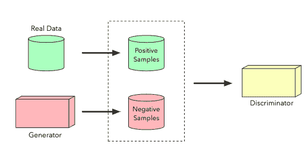

# （一）


# 使用 LangChain 进行生成式人工智能：使用 Python、ChatGPT 和其他模型构建大型语言模型（LLM）应用

**欢迎来到 Packt 早期访问**。在这本书上市之前，我们为您提供了独家预览。写一本书可能需要很多个月的时间，但我们的作者们有最前沿的信息与您分享。早期访问通过提供章节草稿，让您了解最新的发展。目前这些章节可能还有些粗糙，但我们的作者将会随着时间更新它们。您可以随时翻阅本书，或者从头到尾跟随；早期访问旨在灵活设计。我们希望您喜欢了解 Packt 书籍编写的过程。

1.  第一章：什么是生成模型？

1.  第二章：LangChain：核心基础知识

1.  第三章：开始使用 LangChain

1.  第四章：文档问答

1.  第五章：构建类似 ChatGPT/Bard 的聊天机器人

1.  第六章：使用 LangChain Coder 开发软件

1.  第七章：用于数据分析的 LLM

1.  第八章：提示工程

1.  第九章：LLM 在生产中的应用

1.  第十章：生成模型的未来


# 1 生成模型是什么？

## 加入我们的书籍社区 Discord

[`packt.link/EarlyAccessCommunity`](https://packt.link/EarlyAccessCommunity)


**人工智能**（**AI**）取得了重大进展，影响着企业、社会和个人。在过去的十年左右，深度学习已经发展到可以处理和生成文本、图像、视频等非结构化数据。这些基于深度学习的先进 AI 模型在各行各业中备受青睐，包括**大型语言模型**（**LLMs**）。目前，媒体和行业对 AI 存在相当大的炒作。这是由多种因素驱动的，包括技术的进步、知名应用以及在多个领域产生变革性影响的潜力。在本章中，我们将讨论生成模型，特别是 LLMs，以及它们在文本、图像、声音和视频等领域的应用。我们将介绍一些技术背景，解释它们的工作原理以及它们是如何训练的。我们将从介绍开始，澄清我们在技术发展的最前沿所处的位置，以及炒作的原因。

## 为什么会有这样的炒作？

媒体广泛报道了与 AI 相关的突破性进展及其潜在影响。这些进展涵盖了从自然语言处理和计算机视觉的进步到像 GPT-3 这样的复杂语言模型的发展。媒体经常强调 AI 的能力以及其颠覆性潜力，例如在医疗保健、金融、交通等行业的革新。特别是，生成模型因其能够生成文本、图像和其他创意内容（往往难以与人类生成的内容区分开）而受到了广泛关注。这些模型还提供了广泛的功能，包括语义搜索、内容操作和分类。这可以通过自动化实现成本节约，并使人类能够以前所未有的水平发挥创造力。这张图表受到了 Stephen McAleese 在 LessWrong 上关于 GPT-4 预测的博文的启发，展示了 LLMs 在**大规模多任务语言理解**（**MMLU**）基准测试中的改进，该测试旨在量化基本数学、美国历史、计算机科学、法律等领域的知识和问题解决能力。


图 1.1：大型语言模型（LLM）在大规模多任务语言理解（MMLU）基准测试中的平均表现。请注意，大多数基准测试结果来自 5-shot，少数 GPT-2、PaLM 和 PaLM-2 的结果是指微调模型。

近年来在基准测试中可以看到进展。特别值得强调的是 OpenAI 通过公共用户界面提供的模型的进步，特别是从 GTP-2 到 GPT-3 再到 GPT-3.5 再到 GPT-4 的改进。这些模型最近才开始表现优于平均人类评分者，但仍未达到人类专家的水平。这些人类工程的成就令人印象深刻；然而，应该注意到这些模型的表现取决于领域；大多数模型在小学数学单词问题的 GSM8K 基准测试中仍表现不佳。

> **OpenAI**是一个旨在推广和发展友好人工智能的美国人工智能研究实验室。它成立于 2015 年，得到了几位有影响力的人物和公司的支持，他们承诺向这个项目投资超过 10 亿美元。该组织最初致力于非营利性，通过向公众开放其专利和研究成果与其他机构和研究人员合作。2018 年，埃隆·马斯克因担心与特斯拉的角色存在潜在利益冲突而辞去了董事会职务。2019 年，OpenAI 转变为营利性组织，随后微软对 OpenAI 进行了重大投资，导致 OpenAI 系统与微软基于 Azure 的超级计算平台以及必应搜索引擎的整合。该公司最重要的成就包括用于训练强化学习算法的 OpenAI Gym，以及最近推出的 GPT-n 模型和 DALL-E，另一个能够从文本生成图像的深度学习模型。

**生成式预训练变换器**（**GPT**）模型，如最近推出的 OpenAI 的 ChatGPT，是 LLM 领域人工智能进步的典范。ChatGPT 通过在更大规模上训练并比以往模型更大，极大地提升了聊天机器人的能力。这些基于人工智能的聊天机器人可以生成类似人类的实时反馈给客户，并可应用于从软件开发和测试到诗歌和商业沟通等各种用例。在行业内，人们对人工智能的能力和其对业务运营的潜在影响感到越来越兴奋。我们将在*第十章*，*生成模型的未来*中更详细地探讨这一点。随着 OpenAI 的 GPT 等人工智能模型的不断改进，它们可能成为需要多样知识和技能的团队不可或缺的资产。例如，GPT-4 可以被视为一个“博学多才”的人工智能，可以在不要求报酬（除了订阅或 API 费用）的情况下不知疲倦地工作，在数学、语言、统计学、宏观经济学、生物学甚至通过司法考试等学科提供帮助。随着这些人工智能模型变得更加熟练和易于访问，它们可能在塑造未来工作和学习方面发挥重要作用。通过使知识更易获取和适应，这些模型有潜力拉平竞争场地，为来自各行各业的人们创造新机会。这些模型在需要更高层次推理和理解的领域显示出潜力，尽管进展因所涉及任务的复杂性而有所不同。至于具有图像的生成模型，我们可以期待具有更好能力的模型协助创建视觉内容，并可能改进计算机视觉任务，如目标检测、分割、字幕等等。让我们更清晰地澄清术语，并更详细地解释生成模型、人工智能、深度学习和机器学习的含义。

### 生成模型是什么？

在媒体上，当提到这些新模型时，经常使用术语人工智能。值得更清楚地区分一下生成模型这个术语与人工智能、深度学习、机器学习和语言模型的区别：

+   **人工智能**（**AI**）是计算机科学的一个广泛领域，涉及创建智能代理的系统，这些系统可以自主推理、学习和行动。

+   **机器学习**（**ML**）是人工智能的一个子集，涉及开发能够从数据中学习的算法。机器学习算法在一组数据上进行训练，然后可以使用该数据进行预测或决策。

+   **深度学习**（**DL**）是机器学习的一个子集，它使用人工神经网络从数据中学习。神经网络受人脑启发，能够从数据中学习复杂模式。

+   **生成模型**是一种可以生成新数据的 ML 模型。生成模型在一组数据上进行训练，然后它们可以利用该数据创建类似于训练数据的新数据。

+   **语言模型**是预测序列中的标记（通常是单词）的统计模型。其中一些模型，能够执行更复杂的任务，包含许多参数（数量达到数十亿甚至数万亿），因此被称为**大型语言模型**。

生成模型与其他类型的 ML 模型的主要区别在于，生成模型不仅仅是做出预测或决策。它们实际上可以创建新数据。这使得生成模型非常强大，可以用于各种任务，如生成图像，文本，音乐和视频。以下是总结 AI，ML，DL，语言模型和生成模型之间区别的表格：

| **术语** | **定义** |
| --- | --- |
| 人工智能 | 一门涉及智能代理创建的计算机科学广泛领域。 |
| 机器学习 | 处理可以从数据中学习的算法开发的 AI 的一个子集。 |
| 深度学习 | 使用人工神经网络从数据中学习的 ML 的一个子集。 |
| 生成模型 | 一种可以生成新数据的 ML 模型。 |
| 语言模型 | 一种模型，现在主要是深度学习模型，可以预测上下文中的标记。 |

图 1.2：术语 - 人工智能，机器学习，深度学习和生成模型。生成模型是一种强大的 AI 类型，可以生成类似于训练数据的新数据样本。生成 AI 模型已经取得了长足的进步，通过数据中的模式生成新的示例。这些模型可以处理不同类型的数据，并在各个领域中使用，包括文本生成，图像生成，音乐生成和视频生成。对于语言模型，重要的是要注意，其中一些模型，特别是新一代的模型，是生成型的，可以生成语言（文本），而其他模型则不是。这些生成模型有助于创建**合成数据**来训练 AI 模型，当真实数据稀缺或受限时。这种数据生成方式降低了标记成本并提高了训练效率。微软研究采用了这种方法（“只需教科书”，2023 年 6 月）来训练他们的 phi-1 模型，他们使用 GPT-3.5 创建了合成教科书和练习作为他们的训练数据集。在接下来的章节中，我们将探讨生成模型的不同领域，如文本，图像，声音，视频。这些应用主要围绕内容生成，编辑和处理（识别）。让我们从文本开始！

### 文本

文本生成，例如 OpenAI 的 GPT-4，可以生成连贯和语法正确的诗歌，或者用不同语言编写代码并提取关键词和主题等特征。这些模型在内容创作和**自然语言处理**（**NLP**）等领域具有实际应用，其最终目标是创建能够解释人类语言的算法。语言建模旨在根据序列中的前一个词、字符甚至句子来预测下一个词。在这个意义上，语言建模作为一种将语言的规则和结构编码成机器可理解的方式。大型语言模型捕捉了人类语言的语法、句法和语义结构。这些模型很重要，因为它们构成了许多更大的 NLP 任务的基础，如内容创作、翻译、摘要、机器翻译和文本编辑任务，如拼写纠正。在其核心，语言建模，以及更广泛的自然语言处理，严重依赖于表示学习的质量。一个训练良好的语言模型对其训练的文本编码信息，并根据这些学习生成新文本，从而承担文本生成的任务。最近，大型语言模型已经应用于文章生成、代码开发、翻译和理解基因序列等任务。语言模型的更广泛应用涉及多个领域，例如：

+   **问答系统**：AI 聊天机器人和虚拟助手可以提供个性化和高效的帮助，减少客户支持中的响应时间，从而增强客户体验。这些系统可用于解决特定问题，如餐厅预订和购票。

+   **自动摘要**：语言模型可以创建文章、研究论文和其他内容的简洁摘要，使用户能够快速消化和理解信息。

+   **情感分析**：通过分析文本中的意见和情感，语言模型可以帮助企业更有效地理解客户反馈和意见。

+   **主题建模**和**语义搜索**：这些模型可以识别、按主题分类和压缩文档为简洁向量，使组织更容易进行内容管理和发现。

+   **机器翻译**：由人工智能驱动的语言模型可以将一种语言的文本翻译成另一种语言，支持企业在全球扩张努力中。新的生成模型可以与商业产品（例如谷歌翻译）竞争。

尽管取得了显著的成就，语言模型在处理复杂的数学或逻辑推理任务时仍面临限制。目前尚不清楚不断增加语言模型规模是否必然会导致新的推理能力。正如前文所述，我们还必须考虑数据质量和规模的重要性，因为这些因素在改善语言模型在不同任务和领域中的性能方面起着重要作用。生成模型的另一个领域是图像生成，让我们看看这是怎么回事！

### 图像

生成人工智能广泛用于生成 3D 图像、头像、视频、图表、虚拟或增强现实中的插图、视频游戏图形设计、标志创建、图像编辑或增强。这张图展示了从具有稳定扩散的文本提示生成图像（来源：“改进生成过程的重新启动采样”作者为 Yilun Xu 等人，来自麻省理工学院和谷歌研究，2023 年 6 月；https://arxiv.org/pdf/2306.14878.pdf）：


图 1.3：从文本提示“由玻璃制成的透明鸭子雕塑”生成图像。

使用稳定扩散模型，您可以看到仅通过对模型的初始设置进行最小更改或者 - 如本例中 - 数值求解器和采样器，就可以看到各种各样的结果。尽管它们有时会产生引人注目的结果，但这种不稳定性和不一致性是将这些模型更广泛应用的重要挑战。像**MidJourney**、**DALL-E 2**和**Stable Diffusion**这样的服务提供了从文本输入或其他图像派生的创意和逼真图像。像**DreamFusion**、**Magic3D**和**Get3D**这样的服务使用户能够将文本描述转换为 3D 模型和场景，推动设计、游戏和虚拟体验的创新。主要有三个应用场景：

1.  **图像生成**：模型可以生成各种图像，如绘画、照片和草图。这可以用于各种目的，如创作艺术、设计产品和生成逼真的视觉效果。

1.  **图像编辑**：模型可以执行诸如移除对象、更改颜色和添加效果等任务。这可以用于提高图像质量，并使其更具视觉吸引力。

1.  **图像识别**：大型基础模型可用于识别图像，包括场景分类，还有物体检测，例如检测人脸。

像生成对抗网络（GANs）和 DALL-E 这样的模型。GANs 生成逼真的图像，具有许多商业应用，而 DALL-E 则根据文本描述创建图像，对于设计广告、产品和时尚等创意产业非常有帮助。图像编辑涉及通过改变内容或样式属性来修改图像的语义，使用面部属性编辑或图像变形等技术。基于优化和学习的方法通过使用预训练的 GAN 模型（如 StyleGAN）的潜在表示生成具有风格的图像。扩散模型最近被用于高级图像编辑任务，例如通过文本引导无缝连接手动设计的遮罩区域或生成 3D 对象操作。这些技术实现了灵活的图像生成，但面临着有限多样性问题，可以通过将其他文本输入纳入过程中来缓解。图像编辑的范畴还包括图像恢复等任务，这意味着从受损版本中恢复清晰图像，包括图像超分辨率、修补、去噪、去雾和去模糊等任务。基于深度学习的方法使用 CNN 和 transformer 架构，由于与传统方法相比具有更优越的视觉质量。生成模型如 GANs 和扩散模型（DMs）用于恢复，但可能遭受复杂的训练过程和模式崩溃。多扭曲数据集和具有注意力模块或引导子网络的单网络方法提高了处理多种退化类型的效果。接下来我们将看看模型可以如何处理声音和音乐。

### 声音和音乐

生成模型可以根据文本输入开发歌曲和音频剪辑，识别视频中的物体并创建相应的音频，以及创作定制音乐。我们可以粗略地将应用程序再次分类为生成、编辑和识别：

+   **音乐生成**：生成模型可用于生成音乐，如歌曲、节拍和旋律。这可以用于各种目的，如创作新音乐、谱写配乐和生成个性化播放列表。

+   **声音编辑**：生成模型可用于编辑声音，如消除噪音、改变音调和添加效果。这可以用于提高声音质量，并使其在听觉上更具吸引力。

+   **声音识别**：生成模型可用于识别声音，如识别乐器、分类流派和检测语音。这可以用于各种目的，如音乐分析、搜索和推荐系统。

音乐生成算法始于 20 世纪 50 年代的算法作曲，并见证了像谷歌的 WaveNet 和 OpenAI 的 Jukebox 这样的最新创新。这些模型导致了 AI 作曲助手的出现，可以以各种风格生成音乐，并实现新的应用，如语音合成。作��一个特例，语音到文本生成，也称为**自动语音识别**（**ASR**），是将口语转换为文本的过程。它们是在声音和文本上进行训练的。ASR 系统变得越来越准确，现在被广泛应用于各种应用中。然而，仍然存在一些需要解决的挑战，比如处理嘈杂环境和不同口音的能力。随着许多潜在应用，如语音拨号和像 Alexa 和 Siri 这样的计算机辅助个人助手，ASR 背后的技术从马尔可夫模型发展到依赖于 GPT。接下来我们将看到视频。

### 视频

视频生成模型，如**DeepMind**的 Motion to Video 和**NVIDIA**的**Vid2Vid**依赖于**GANs**进行高质量视频合成。它们可以在不同领域之间转换视频，修改现有视频，并使静态图像动画化，展示了视频编辑和媒体制作的巨大潜力。像 Make-a-Video 和 Imagen Video 这样的工具将自然语言提示转换为视频片段，简化了视频制作和内容创作过程。这些应用的广泛类别是：

+   **视频生成**：生成模型可以用于生成视频，如短片、动画和广告。这可以用于创作新内容、广告产品和生成逼真的视觉效果。

+   **视频编辑**：我们可以编辑视频，如移除物体、更改颜色和添加效果。这可以帮助提高视频质量，并使其更具视觉吸引力。

+   **视频识别**：模型可以识别视频，如识别物体、分类场景和检测人脸。这可以帮助应用于安全、搜索和推荐系统等领域。

一些模型可以在多个领域或模态中生成内容。这些被称为多模型。

### 多模

多模生成模型可以生成**文本**、**图像**、**声音**和**视频**。这使它们能够创造更加逼真和沉浸式的体验。多模型仍处于发展的早期阶段，但它们有潜力彻底改变我们与计算机互动和体验世界的方式。例如，这些进展显著提高了图像字幕任务的性能，即通过自然语言描述图像内容的过程。多模型采用融合图像和字幕的生成架构，形成一个共享学习空间的单一模型。这个过程涉及两步编码器-解码器架构：视觉编码和语言解码。我们可以区分这些潜在的用例：

+   **虚拟现实**：这些模型可以用来创建更加逼真和沉浸式的虚拟现实体验。这对于游戏、教育和培训都有帮助。

+   **增强现实**：它们可以创建增强现实体验，将数字内容叠加在现实世界上。这对于导航、购物和娱乐都是有用的。

在接下来的部分，我们将讨论大型语言模型的技术背景。

## 什么是 GPT？

**大型语言模型**（**LLMs**）是深度训练的神经网络，擅长理解和生成人类语言。当前一代的 LLMs，如 ChatGPT，是利用 Transformer 模型的深度神经网络架构，在广泛的文本数据上进行无监督学习的预训练，使其能够学习语言模式和结构。最新一代 LLMs 的显著优势在于作为对话接口（ChatBot）时，能够生成连贯和上下文适当的回应，即使在开放式对话中也是如此。通过基于前面的单词生成下一个单词，该模型经常产生流畅和连贯的文本，往往难以与人类产生的文本区分开。然而，OpenAI 在免责声明中表达了 ChatGPT“有时会写出听起来合理但不正确或荒谬的答案”的观察。这被称为幻觉，这只是围绕 LLMs 的关注之一。**Transformer**是一种深度学习架构，于 2017 年首次由谷歌和多伦多大学的研究人员引入（在一篇名为“注意力机制是你所需要的一切”的文章中），它包括自注意力和前馈神经网络，使其能够有效地捕捉句子中的单词关系。注意机制使模型能够专注于输入序列的不同部分。**生成式预训练变换器**（**GPTs**）是由 OpenAI 的研究人员于 2018 年推出的，与他们的首个同名 GPT 模型 GPT-1 一起发布，并发表为“通过生成式预训练改进语言理解”。预训练过程涉及预测文本序列中的下一个单词，增强模型对语言的理解，这可以通过输出质量来衡量。在预训练之后，模型可以针对特定的语言处理任务进行微调，如情感分析、语言翻译或聊天。无监督和监督学习的结合使 GPT 模型在各种 NLP 任务中表现更好，并减少了训练 LLMs 所面临的挑战。LLMs 的训练语料库规模急剧增加。OpenAI 于 2018 年推出的 GPT-1 是在包含 985 百万个单词的 BookCorpus 上进行训练的。BERT 在同一年发布，是在**BookCorpus**和**英文维基百科**的合并语料库上进行训练的，总计**33 亿个单词**。现在，LLMs 的训练语料库已经扩展到数万亿个标记。这张图说明了 LLMs 的规模一直在不断增长：


图 1.4：从 BERT 到 GPT-4 的大型语言模型 - 大小、训练预算和组织。

数据点的大小表示以 petaFLOP 天为单位的训练成本。对于一些模型，特别是专有和闭源模型，这些信息是未知的 - 在这些情况下，我放了一个叉。例如，对于 XLNet，论文没有提供有关 flops 计算的信息，然而，训练是在 512 个 TPU v3 芯片上进行的，历时 2.5 天。数据点的颜色显示了开发模型的公司或组织 - 由于这些颜色可能在打印版或 Kindle 上不明显（除非您有一款彩色 Kindle），您可以在此 URL 找到此图的彩色版本：GPT 模型的发展取得了显著进展，OpenAI 的 GPT-n 系列引领着创建基础 AI 模型的道路。LLM 的训练语料库规模急剧增加。OpenAI 于 2018 年推出的 GPT-1 是在包含 985 百万个单词的 BookCorpus 上进行训练的。BERT 于同一年发布，是在 BookCorpus 和英文维基百科的合并语料库上进行训练的，总计 33 亿个单词。现在，LLM 的训练语料库已经扩展到数万亿个标记。

> **基础模型**（有时称为基础模型）是一个大型模型，它在规模上经过大量数据的训练，以便可以适应各种下游任务。在 GPT 模型中，这种预训练是通过自监督学习完成的。

经过对 3000 亿标记的训练，**GPT-3**拥有**1750 亿参数**，这是深度学习模型中前所未有的规模。**GPT-4**是该系列中最新的版本，尽管由于竞争和安全问题，其规模和训练细节尚未公布，但不同的估计将其参数放在**200 到 5000 亿之间**。*Sam Altman*，OpenAI 的首席执行官表示，训练**GPT-4**的成本超过了 1 亿美元。ChatGPT 是一个对话模型，由**OpenAI**于 2022 年 11 月发布。基于之前的**GPT**模型（特别是**GPT-3**）并针对对话进行了优化，它使用人类生成的角色扮演对话和人类标记者演示所需模型行为的数据集。该模型展示了出色的能力，如广泛的知识保留和在多轮对话中精确的上下文跟踪。另一个重大进展是**GPT-4**，于 2023 年 3 月推出，它不仅限于文本输入，还包括多模态信号。**GPT-4**在各种评估任务上表现出优越的性能，同时由于训练期间六个月的迭代对齐，对恶意或挑衅性查询的响应避免能力显著提高。除 OpenAI 之外，其他值得注意的基础 GPT 模型还包括谷歌的**PaLM2**。尽管**GPT-4**在性能方面领先大多数基准测试，但这些和其他模型在某些任务中表现出可比较的性能，并促进了基于生成变压器的语言模型的进步。Meta 的**LLaMA**训练了**1.4 万亿标记**，而谷歌聊天机器人**Bard**背后的模型**PaLM2**由**3400 亿参数**组成，比以前的 LLM 规模小，但在至少 100 种语言的训练数据上似乎具有更大的规模。

> 有相当多的**公司和组织正在开发 LLM**，并以不同的条件发布它们。OpenAI 发布了 GPT-2，随后的模型是闭源的，但可以通过他们的网站或 API 使用。Meta 发布了从 RoBERTa、BART 到 LLaMA 的模型，包括模型的参数（权重），尽管在非商业许可下，以及用于设置和训练模型的源代码。Google AI 及其 DeepMind 部门开发了许多大型语言模型，包括 BERT、GPT-2、LaMDA、Chinchilla、Gopher、PaLM 和 PaLM2。他们已经在开源许可下发布了一些模型的代码和权重，尽管最近他们在开发中更趋向于保密。微软开发了许多大型语言模型，包括 Turing NLG 和 Megatron-Turing NLG，但他们已将 OpenAI 模型整合到 Microsoft 365 和必应中。阿布扎比政府资助的科技创新研究所（TII）已经为研究和商业用途开源了 Falcon LLM。

GPT 模型还可以处理文本以外的输入和输出形式，正如 GPT-4 能够处理图像输入和文本一样。此外，它们还为文本到图像技术（如扩散和并行解码）奠定了基础，从而实现了与图像一起工作的**视觉基础模型**（**VFMs**）的发展。总之，GPT 模型发展迅速，为创建适用于各种下游任务和形式的多功能基础人工智能模型奠定了基础，最终推动了各种应用和行业的创新。在接下来的部分中，我们将回顾深度学习和生成模型近年来取得的进展，这些进展导致了明显能力的爆炸性增长以及这些模型所受到的关注。

### 为什么现在？

2022 年生成式人工智能成功进入公众视野的原因可以归因于几个相互关联的推动因素。生成模型的发展和成功依赖于改进的算法、计算能力和硬件设计的显著进步、大规模标记数据集的可用性，以及积极合作的研究社区帮助发展一套工具和技术。更复杂的数学和计算方法的发展在生成模型的进步中发挥了至关重要的作用。上世纪 80 年代由杰弗里·辛顿、大卫·鲁梅尔哈特和罗纳德·威廉姆斯引入的反向传播算法就是一个例子。它提供了一种有效训练多层神经网络的方法。在 21 世纪初，**神经网络**开始重新流行，研究人员开发了更复杂的架构。然而，深度学习的出现，一种具有众多层的神经网络，标志着这些模型性能和能力的重大转折点。有趣的是，尽管深度学习的概念已存在一段时间，但生成模型的发展和扩展与硬件的显著进步相关，特别是**图形处理单元**（**GPU**），这些硬件在推动该领域向前发展方面起到了关键作用。正如前面提到的，更便宜和更强大的硬件的可用性是发展更深层模型的关键因素。这是因为深度学习模型需要大量的计算能力来训练和运行。这涉及到处理能力、内存和磁盘空间的所有方面。这张图显示了随着时间推移，不同介质（如磁盘、固态、闪存和内存）的计算机存储成本，以每 TB 美元的价格计算（来源：Our World in Data；[`ourworldindata.org/moores-law`](https://ourworldindata.org/moores-law)）：


图 1.5：自 1950 年代以来每 TB 的计算机存储成本。

过去，训练深度学习模型的成本非常昂贵，但随着硬件成本的降低，现在可以在更大的数据集上训练更大的模型。模型大小是决定模型能够多好地逼近（以困惑度衡量）训练数据集的因素之一。

> **LLM 中参数数量的重要性**：模型的参数越多，其捕捉单词和短语之间关系的能力就越强。举个简单的例子来说明这些高阶相关性，LLM 可以学习到单词“猫”如果前面是“追逐”这个词，那么后面更可能是“狗”，即使中间有其他词。一般来说，模型的困惑度越低，它的表现就越好，比如在回答问题方面。特别是，在由 20 亿到 70 亿参数组成的模型中，似乎会出现新的能力，比如生成不同的创意文本格式，如诗歌、代码、脚本、音乐作品、电子邮件、信件，并以信息丰富的方式回答问题，即使这些问题是开放性和具有挑战性的。

这种朝着更大模型的趋势始于 2009 年，当 Nvidia 推动了深度学习的“大爆炸”。GPU 特别适合进行训练深度学习神经网络所需的矩阵/向量计算，因此显著提高了这些系统的速度和效率，将运行时间从几周缩短到几天。特别是，Nvidia 的**CUDA**平台允许直接编程 GPU，使研究人员和开发人员可以更轻松地尝试和部署复杂的生成模型。在 2010 年代，不同类型的生成模型开始受到关注。自编码器是一种可以学习将数据从输入层压缩到表示层，然后重构输入的神经网络，为更高级的模型如 2013 年首次提出的**变分自编码器**（**VAEs**）奠定了基础。**VAEs**与传统自编码器不同，它使用变分推断来学习数据的分布，也称为输入数据的潜在空间。与此同时，**生成对抗网络**（**GANs**）在 2014 年由 Ian Goodfellow 等人提出。训练 GANs 的设置如下图所示（摘自“使用生成对抗网络进行文本生成的调查”，G de Rosa 和 J P. Papa，2022 年；[`arxiv.org/pdf/2212.11119.pdf`](https://arxiv.org/pdf/2212.11119.pdf)）：



图 1.6：生成对抗网络（GAN）训练。

GANs 由两个网络组成，在类似游戏的设置中相互对抗 - 生成器生成新数据，通常是图像，鉴别器估计新数据为真实数据的概率。随着它们相互竞争，GANs 在任务中变得更加优秀，能够生成逼真的图像和其他类型的数据。在过去的十年中，深度学习中使用的基本算法取得了重大进展，如更好的优化方法，更复杂的模型架构和改进的正则化技术。Transformer 模型于 2017 年推出，建立在这一进展的基础上，实现了像 GPT-3 这样的大规模模型的创建。Transformers 依赖于注意力机制，并导致生成模型性能的进一步飞跃。这些模型，如谷歌的 BERT 和 OpenAI 的 GPT 系列，可以生成高度连贯和上下文相关的文本。迁移学习技术的发展也是显著的，它允许在一个任务上预训练的模型在另一个类似任务上进行微调，这些技术使训练大型生成模型更加高效和实用。此外，生成模型的崛起部分归因于专门设计用于处理这些人工神经网络的软件库和工具（**TensorFlow**，**PyTorch**，**Keras**），简化了构建、训练和部署它们的过程。为了进一步推动生成模型的发展，研究界定期举办像 ImageNet 这样的图像分类挑战赛，并已开始为生成模型做同样的事情，如生成对抗网络（GAN）竞赛。除了更便宜和更强大的硬件的可用性外，标记数据的大型数据集的可用性也是生成模型发展的关键因素。这是因为深度学习模型，特别是生成模型，需要大量的文本数据进行有效训练。互联网上数据的爆炸性增长，尤其是在过去的十年中，为这些模型蓬勃发展创造了适当的环境。随着互联网的普及，收集大量文本、图像和其他数据集变得更加容易。这使得在比过去可能的更大数据集上训练生成模型成为可能。总之，生成建模是一个迷人且快速发展的领域。它有潜力彻底改变我们与计算机的互动方式以及我们创造新内容的方式。我很期待看到这个领域的未来。让我们深入了解细节 - 这是如何工作的？

### 这是如何工作的？

诸如 BERT 和 GPT 之类的模型得以实现，得益于**Transformer**深度神经网络架构，这对自然语言处理产生了深远影响。Transformer 架构旨在避免递归，以允许并行计算，不同变体的 Transformer 架构不断推动自然语言处理和生成式人工智能领域的可能性边界。Transformer 的一个显著特征是注意力机制。传统的序列到序列模型经常面临处理长依赖性的问题 - 如果序列过长，它们很难记住相关信息。Transformer 模型引入了注意力机制来解决这个问题。自注意力机制，通常被称为 Transformer 模型的核心，为序列中的每个单词分配一个分数，确定应该给予该单词多少关注。Transformer 由可以堆叠的模块组成，从而创建可以学习大规模数据集的非常大的模型。这些在这里的图表中指示出来：


图 1.7：Transformer 架构（来源：Yuening Jia，Wikimedia Commons）

促成 Transformer 成功的架构特征：

+   **编码器-解码器结构**：Transformer 模型遵循编码器-解码器结构。编码器接受输入序列并为每个单词计算一系列表示（上下文嵌入）。这些表示不仅考虑单词的固有含义（语义值），还考虑它们在序列中的上下文。解码器然后使用这些编码信息逐个生成输出序列项，利用先前生成项的上下文。

+   **位置编码**：由于 Transformer 不是按顺序处理单词，而是同时处理所有单词，它缺乏单词顺序的概念。为了弥补这一点，将单词在序列中的位置信息通过位置编码注入模型中。这些编码被添加到表示每个单词的输入嵌入中，从而使模型能够考虑序列中单词的顺序。

+   **层归一化**：为了稳定网络的学习，Transformer 使用一种称为层归一化的技术。这种技术在特征维度上对模型的输入进行归一化（而不是批量维度，如批量归一化），从而提高了学习的整体速度和稳定性。

+   **多头注意力**：Transformer 不是一次应用注意力，而是并行多次应用注意力 - 提高了模型关注不同类型信息的能力，从而捕捉到更丰富的特征组合。

另一个可选的架构特性，不特定于变压器的是跳跃连接（也称为残差连接）。这些被引入以减轻网络变得更深时的退化问题，使用了跳跃连接。这允许梯度在层间不变地流动，通过将输入直接传递给更深的层。变压器在自然语言处理中推动了 NLP 的发展，特别是在翻译和语言理解方面。**神经机器翻译**（**NMT**）是一种使用深度学习捕捉句子中长距离依赖关系的机器翻译主流方法。基于变压器的**NMT**优于以往的方法，如使用循环神经网络，特别是**长短期记忆**（**LSTM**）网络。这可以归因于这种强大的架构，首先是注意力，它允许变压器模型以灵活的方式处理单词顺序，无论它们之间有多远，这对每种特定情况都是最佳的。此外，这些架构特性的组合使其能够成功处理涉及理解和生成人类语言以及其他领域的任务。OpenAI 强大的用于语言生成的 GPT 模型也是一个变压器，同样，DeepMind 的 AlphaFold 2 是一个从基因序列预测蛋白质结构的模型。变压器能够比其他模型更好地在较长序列上保持性能，例如循环神经网络。这一直是它们成功的原因，然而，变压器架构意味着它们只能捕捉固定输入宽度内的依赖关系。早期的注意力机制随着数据点数量的平方级增长，使其在具有大量输入的情况下无法应用。已经提出了许多方法来获得效率提升，例如稀疏的、低秩的自注意力和潜在的瓶颈，仅举几例。其他工作尝试扩展超出固定输入大小的序列，如 Transformer-XL 架构通过存储已编码句子的隐藏状态来重新引入递归，以便在后续编码下一个句子时利用它们。GPT 的特殊之处及其名称的起源在于预训练。让我们看看这些 LLM 是如何训练的！

#### 预训练

训练**大型语言模型**（**LLM**）的第一步是进行标记化。这个过程涉及将单词转换为数字，以便模型可以处理它们，因为**LLMs**是需要数字输入和输出的数学函数。为了进行这种标记化，**LLMs**使用独特的标记器。标记器将文本中的单词映射到相应的整数列表。在训练**LLM**之前，标记器通常会适应整个训练数据集，然后被冻结。常用的标记器类型是字节对编码。需要注意的是，标记器不会产生任意整数。相反，它们输出特定范围内的整数 - 从到，其中表示标记器的词汇量。现在，考虑输出，当 LLM 接收到文本时，主要产生一个落在的向量。然后，将该输出向量通过 softmax 函数传递，产生另一个向量，称为概率向量。由于其条目为非负且总和为，这个向量可以被解释为**LLM**词汇的概率分布。此外，需要指出**LLMs**只能基于不超过其上下文窗口的一系列标记生成标记。这个上下文窗口指的是**LLM**可以使用的最长标记序列的长度。如果提供了比这个窗口更长的序列，**LLM**需要截断序列或使用算法修改来处理它。**LLMs**的典型上下文窗口大小可以在大约 1,000 到 10,000 个标记之间。训练**LLMs**涉及特定的过程，将输入数据标记化，馈送到模型中，并生成一个概率分布，覆盖模型的词汇。这个过程中的具体机制，如 softmax 函数和上下文窗口，有助于促进**LLMs**对输入数据的理解和响应。**负对数似然**（**NLL**）和**困惑度**（**PPL**）是在训练和评估语言模型过程中使用的重要指标。**NLL**是机器学习算法中使用的损失函数，旨在最大化正确预测的概率。较低的**NLL**表示网络已成功从训练集中学习到模式，因此它将能够准确预测训练样本的标签。需要提到**NLL**是一个在正区间内约束的值。另一方面，**困惑度**（**PPL**）是**NLL**的指数，提供了更直观地理解模型性能的方式。较小的**PPL**值表示训练良好的网络可以准确预测，而较高的值表示学习性能差。直观地说，我们可以说低困惑度意味着模型对下一个词不太惊讶。因此，在预训练中的目标是最小化困惑度，这意味着模型的预测更符合实际结果。在比较不同的语言模型时，困惑度通常被用作各种任务的基准指标。它提供了关于语言模型表现如何的想法，较低的困惑度表示模型对其预测更有把握。因此，与困惑度较高的其他模型相比，困惑度较低的模型将被认为表现更好。

#### 缩放

至少简要讨论架构的选择以及为什么这些模型如此庞大是值得的。在 2020 年的一篇来自 OpenAI 的研究人员 Kaplan 等人的论文中，他们讨论了缩放定律和参数选择。有趣的是，他们比较了许多不同的架构选择，并且在其他方面表明，变压器在很大程度上由于更好地利用长上下文而优于**LSTMs**作为语言模型，而这些循环网络在不到 100 个标记后就达到了平稳状态，而变压器则通过整个上下文改进。因此，变压器不仅在训练和推理速度上比变压器更好，而且在查看相关上下文时也表现更好。此外，他们发现数据集大小、模型大小（参数数量）和训练计算量之间存在幂律关系，换句话说，为了将性能提高一定因子，其中一个因素必须按照该因子的幂进行扩展，然而，为了获得最佳性能，这三个因素必须同时扩展，以避免出现瓶颈效应。DeepMind 的研究人员（Hoffmann 等人，2022 年）分析了**LLMs**的训练计算量和数据集大小，并得出结论，根据缩放定律，**LLMs**在计算预算和数据集大小方面训练不足。他们预测，如果大型模型比现在大大缩小并且训练时间更长，大型模型将表现更好，并且事实上，通过将**70 亿参数的 Chinchilla 模型**与他们的 Gopher 模型（包含**2800 亿参数**）在基准测试中进行比较，他们验证了他们的预测。最近，该团队发现，以更多的纪元进行更长时间的训练或以更多的 petaflops 进行更多的计算似乎不再改善性能，而较小的网络和更高质量的数据集可以提供非常有竞争力的性能。

#### 条件化

对大型语言模型进行条件化是指为特定任务调整模型。不同的条件化方法包括微调、提示、指令调整和强化学习：

+   微调涉及通过监督学习在特定任务上训练预训练的语言模型。例如，为了使模型更适合与人类对话，模型会在自然语言指令形式的任务示例上进行训练（指令调整）。

+   提示技术将问题呈现为文本提示，并期望模型完成。

对于微调，通常，强化学习将监督微调与使用人类反馈的强化学习相结合，根据人类偏好训练模型。LLMs 可以在一个由 LLM 生成的示例训练集上进行训练（从一小部分人类生成的初始示例引导），例如 Microsoft Research 的 phi-1 的训练集（"只需教科书"，2023 年 6 月）。通过提示技术，将呈现类似问题及其解决方案的文本示例。零-shot 提示涉及没有解决的示例，而少量-shot 提示包括少量类似（问题，解决方案）对的示例。这些调节方法不断发展，变得更加有效，对各种应用非常有用。*第八章* *提示工程*将进一步探讨提示工程和调节方法。

### 如何尝试一下？

你可以通过他们的网站或 API 访问 OpenAI 的模型。如果你想在笔记本电脑上尝试其他大型语言模型，开源 LLMs 是一个很好的起点。这里有一大堆东西！你可以通过 Hugginface 或其他提供商访问这些模型。你甚至可以下载它们，微调它们，或者 - 如果你感觉很高级 - 完全训练一个模型。我们将在*第九章* *LLM 在生产中的应用*中更详细地讨论如何使用这些模型。在下一节中，我们将看看稳定扩散以及它是如何工作的。

## 什么是稳定扩散模型？

图像生成模型是一种生成模型，可用于生成图像。图像生成模型是一个强大的工具，可用于生成逼真和创意的图像。它们仍处于早期开发阶段，但有潜力彻底改变我们创建和消费图像的方式。最受欢迎的图像生成模型之一是**稳定扩散**，另一个是**Midjourney**。简单来说，这些是一种深度学习模型，根据文本提示创建图像。Google Brain 在 2022 年宣布了两个文本到图像模型的创建，**Imagen**和**Parti**。

### 它是如何工作的？

**稳定扩散**模型是由慕尼黑路德维希·马克西米利安大学的计算机视觉组和 Runway 的研究人员开发的一种深度学习文本到图像模型。它生成根据文本描述条件的详细图像，并利用潜在扩散模型架构。该模型的源代码甚至权重已经在**CreativeML** **OpenRAIL**-**M 许可证**下公开发布，该许可证“不对重用、分发、商业化、适应性施加任何限制”。该模型可以在配备适度 GPU 的消费者硬件上运行（例如**GeForce 40**系列）。**稳定扩散**是一种使用 Gumbel 分布向图像添加噪声的扩散模型。Gumbel 分布是一种连续概率分布，通常在机器学习中使用，因为它易于抽样，并且具有更稳定的特性。稳定性意味着模型不太可能陷入局部最小值，这可能会发生在其他类型的扩散模型中。该模型由**变分自动编码器**（**VAE**）、**U-Net**和**文本编码器**组成。**VAE**有两部分，编码器和解码器，将原始高维图像压缩成较低维的潜在空间，并将其重构回图像空间。潜在空间显著降低了计算复杂性，使扩散过程更快。**VAE**编码器将图像压缩到潜在空间，而**U-Net**通过前向扩散进行去噪以获得潜在表示。然后**VAE**解码器生成最终图像。该模型可以灵活地根据各种形式进行条件化，并利用交叉注意机制来整合条件信息。**U-Net**是一种流行的对称编码器-解码器结构的卷积神经网络（CNN）。它通常用于图像分割任务，但在稳定扩散的背景下，它用于预测图像中的噪声。U-Net 将嘈杂图像作为输入，并通过一系列卷积层处理以提取特征和学习表示。这些卷积层通常组织在一个收缩路径中，减少空间维度同时增加通道数。一旦收缩路径达到 U-Net 的瓶颈，它通过对称扩展路径进行扩展。在扩展路径中，应用转置卷积（也称为上采样或反卷积）逐渐上采样空间维度同时减少通道数。在扩散过程中，U-Net 的扩展路径接受嘈杂图像并从前向扩散中重建潜在表示。通过将重建的潜在表示与真实潜在表示进行比较，U-Net 预测原始图像中的噪声估计。这种噪声的预测有助于在反向扩散过程中恢复原始图像。扩散模型通过类似于物理学中的扩散的过程运作。它通过向图像添加噪声进行**前向扩散过程**，直到图像变得不典型和嘈杂。这个过程类似于一滴墨水落入水杯中逐渐扩散的过程。这里的独特之处在于**反向扩散过程**，模型试图从嘈杂、无意义的图像中恢复原始图像。通过逐步从嘈杂图像中减去估计的噪声，最终恢复类似于原始图像的图像。去噪过程在这个图中展示（来源：维基共享资源用户 Benlisquare）：


图 1.8：在日本创造的欧式城堡，使用稳定扩散 V1-5 AI 扩散模型。仅显示 40 步生成过程中的步骤。

在图中，您可以逐步看到图像生成过程，使用 DDIM 采样方法的 U-Net 去噪过程，该方法重复去除高斯噪声，然后将去噪输出解码为像素空间。稳定扩散是一种利用扩散过程从文本提示生成图像的深度学习模型，通过几个清晰的步骤：

1.  它从在潜在空间中生成一个随机张量（随机图像）开始，这作为我们初始图像的噪声。

1.  一个噪声预测器（**U-Net**）接收潜在嘈杂图像和提供的文本提示，并预测噪声。

1.  模型然后从潜在图像中减去潜在噪声。

1.  步骤 2 和 3 会重复进行一定数量的采样步骤，例如，在图中显示的 40 次。

1.  最后，**VAE**的解码器组件将潜在图像转换回像素空间，提供最终输出图像。

在图像生成模型的训练过程中，使用损失函数来评估生成图像的质量。一个常用的损失函数是**均方误差**（**MSE**）损失，它量化生成图像与目标图像之间的差异。模型被优化以最小化这种损失，鼓励它生成与期望输出密切相似的图像。该模型是在一个名为**LAION-5B**的数据集上训练的，该数据集源自 Common Crawl 数据，包括数十亿的图像-文本对。训练数据集根据语言、分辨率、水印可能性和美学评分进行分类。稳定扩散是在该数据集的子集上进行训练的。该模型的训练数据来源多样，其中有相当大一部分来自**Pinterest**、**WordPress**、**Blogspot**、**Flickr**、**DeviantArt**等网站。总的来说，像稳定扩散和 Midjourney 这样的图像生成模型将文本提示处理成生成的图像，利用正向和反向扩散过程的概念，并在较低维度的潜在空间中运行以提高效率。到目前为止，**稳定扩散**有两个主要版本，**版本 1**和**2**。让我们看看它们有何不同。

#### 模型差异

**稳定扩散 v1** 和 **v2** 在文本处理、训练数据和结果方面有所不同。在文本处理方面，**稳定扩散 v2** 使用 **OpenClip** 进行文本嵌入，而 **v1** 使用 **Open AI** 的 **CLIP ViT-L/14** 进行文本嵌入。**OpenClip** 比 **CLIP** 大五倍，提高了图像质量，也让研究人员在研究和优化模型时更加透明。关于训练数据，**稳定扩散 v1.4** 使用三个不同的数据集进行训练，而 **稳定扩散 v2** 则是在一个经过过滤的 **LAION-5B** 子集上进行训练，该子集过滤了明确的色情材料（**NSFW 过滤器**）和美学评分高于阈值的内容。**LAION 5B** 数据集是一个包含 58.5 亿个 CLIP 过滤的图像文本对的大规模数据集。数据集中超过 23 亿个样本包含英语，而**22 亿个样本**来自其他 100 多种语言。剩下的 10 亿个样本不允许特定语言分配，比如姓名。数据集的获取流程复杂，需要大量处理。它包括对 PB 级 Common Crawl 数据集的分布式处理，图像的分布式下载，以及少量 **GPU** 节点的数据后处理，生成最终数据集。过滤还删除了重复样本，并将数据集从 500 亿个候选样本削减到不到 60 亿个 **CLIP** 过滤的图像文本对。在结果方面，稳定扩散 v2 更难用于控制风格和生成名人。这种差异可能是由于训练数据的不同，因为 Open AI 的专有数据可能包含更多艺术作品和名人照片，这些内容不包含在稳定扩散 v2 的训练数据中。总之，**稳定扩散 v2** 使用了不同的文本嵌入模型，并在不同的数据子集上进行了训练，与 **稳定扩散 v1** 相比产生了不同的结果。虽然 **稳定扩散 v2** 可能更透明，更适合长期发展，但 **稳定扩散 v1** 可能在特定用例中表现更好，比如控制风格或生成名人，这是由于其训练数据的原因。现在我们将看一下文本到图像使用案例中模型的条件。

### 条件化

条件过程允许这些模型受到输入文本提示或其他输入类型（如深度图或轮廓）的影响，以便更精确地创建相关图像。在条件过程中，提示被标记化，每个标记被转换为一个嵌入，一个长度为某个特定值的向量，有时是 768 个值。这些嵌入考虑了单词之间的语义关系，然后由文本变压器处理，并馈送给噪声预测器，引导其生成与文本提示相符的图像。在文本到图像的过程中，模型使用文本提示生成一个全新的图像。文本提示被编码到潜在空间中，扩散过程逐渐添加噪声（由去噪强度控制）以使初始图像演变为输出图像。让我们总结本章！

## 总结

像大型语言模型（LLMs）这样的生成模型因其在革新许多行业和任务方面的潜力而受到广泛关注。特别是它们在文本生成和图像合成方面的应用引起了媒体的极大关注。领先的公司如 OpenAI 正在推动 LLMs 的边界，他们的生成式预训练变压器（GPT）系列因其出色的语言生成能力而受到广泛关注。在本章中，我们讨论了最新突破所吸引的媒体关注，深度学习和人工智能的最近历史，生成模型，LLMs 和预训练生成模型（GPT）以及支撑它们的理论思想，特别是变压器架构。我们还讨论了图像的扩散模型以及文本，图像，声音和视频的应用。下一章将探讨生成和特别是 LLMs 的工具化，重点介绍 Langchain 框架的基础知识，实施和使用这个特定工具来优化和增强 LLMs。我认为在阅读技术书籍时检查自己是否消化了材料是一个好习惯。我为本章创建了一些问题。

## 问题

如果你已经阅读并理解了本章，你应该能够回答这些问题：

1.  什么是生成模型？

1.  生成模型有哪些应用？

1.  什么是大型语言模型（LLM）以及它的作用是什么？

1.  我们如何从 LLMs 中获得更好的性能？

1.  使这些模型成为可能的条件是什么？

1.  哪些公司和组织是开发 LLMs 的主要参与者？

1.  什么是变压器，它由什么组成？

1.  GPT 是什么意思？

1.  稳定扩散是如何工作的？

1.  稳定扩散是如何训练的？

如果你在回答这些问题时遇到困难，请回到本章的相应部分，确保你已经理解了材料。


# 2 介绍 LangChain

## 在 Discord 上加入我们的书籍社区

[`packt.link/EarlyAccessCommunity`](https://packt.link/EarlyAccessCommunity)


在本章中，我们讨论了 LLMs 的限制，以及如何将 LLMs 与工具结合起来以克服这些挑战，从而构建创新的基于语言的应用程序。有一些强大的框架为开发人员提供了强大的工具，用于快速工程、链接、数据检索等。无论您是开发人员、数据科学家还是对自然语言处理（NLP）或生成式人工智能的技术进步感兴趣，您都应该了解这些框架中最强大和流行的 LangChain。LangChain 解决了与使用 LLMs 相关的痛点，并提供了一个直观的框架来创建定制的 NLP 解决方案。在 LangChain 中，像 LLMs、互联网搜索和数据库查找这样的组件可以链接在一起，这意味着根据数据或任务的要求按顺序执行不同的任务。通过利用其功能，开发人员可以构建动态和数据感知的应用程序，利用我们在第一章讨论的最新技术突破。我们将列举一些用例，以说明该框架如何帮助不同领域的企业和组织。LangChain 对代理和内存的支持使得可以构建比仅通过 API 调用语言模型更强大和灵活的各种应用程序。我们将讨论与框架相关的重要概念，如代理、链、行动计划生成和内存。理解这些概念对于了解 LangChain 的工作原理至关重要。主要部分包括：

+   LLMs 的限制是什么？

+   什么是 LLM 应用程序？

+   什么是 LangChain？

+   LangChain 如何工作？

我们将从介绍 LLMs 的限制开始本章。

## LLMs 的限制是什么？

**大型语言模型**（**LLMs**）因其生成类似人类文本和理解自然语言的能力而受到广泛关注和流行，这使它们在围绕内容生成、文本分类和摘要的场景中非常有用。虽然**LLMs**提供了令人印象深刻的功能，但它们存在一些限制，可能会影响其在某些场景中的有效性。了解这些限制在开发应用程序时至关重要。与大型语言模型相关的一些痛点包括：

1.  **过时的知识**：**LLMs**无法提供实时或最新数据，因为它们完全依赖于提供给它们的训练数据。

1.  **无法执行操作**：**LLMs**无法执行操作或与外部系统交互，限制了其功能。例如，它们无法启动网络搜索、实时查询数据库或使用计算器进行数字乘法。

1.  **缺乏上下文和额外信息**：**LLMs**可能难以理解和整合来自先前提示或对话的上下文。它们可能不记得先前提到的细节或未能提供除给定提示之外的额外相关信息。

1.  **复杂性和学习曲线**：使用大型语言模型开发应用程序通常需要对人工智能概念、复杂算法和 API 有深入的理解。这可能对那些在这些领域没有专业知识的开发人员构成挑战。

1.  **幻觉**：**LLMs**在它们的权重中隐含了对世界的许多常识。然而，它们可能对某些主题了解不足，并生成不准确或不连贯的回应。例如，它们可能产生不存在的信息或提供不准确的细节。

1.  **偏见和歧视**：根据它们训练的数据，大型语言模型可能表现出宗教、意识形态、政治等方面的偏见。

LLMs 没有关于当前事件的信息，因为它们与外部世界没有连接，也不会知道它们没有接受过训练的任何事情，比如截止日期之后的任何事情，即训练数据生成的时间。更重要的是，它们在超出训练数据限制的上下文理解方面遇到困难。例如，由于模型无法执行操作或直接与外部系统交互，它们不会知道天气，也无法访问您的文档。这个截止日期问题在 OpenAI ChatGPT 聊天界面中询问**LangChain**时得到了说明：


图 1.1：ChatGPT - 缺乏最新信息。

在这种情况下，模型能够正确地捕捉问题并给出正确的反馈。然而，如果我们在**GPT-3**游乐场问同样的问题，我们会得到这样的回答：


图 1.2：带有 GPT 3.5 的 OpenAI 游乐场 - 幻觉。

在这种情况下，我们可以看到模型虚构了这个术语，并发明了一个名为去中心化平台。这是一种幻觉。需要注意这些问题。这个问题可以通过访问外部数据来解决，比如天气 API、用户偏好或来自网络的相关信息，这对于创建个性化和准确的语言驱动应用程序至关重要。**LLMs**擅长生成文本，但缺乏真正的理解和推理能力。然而，它们可能在逻辑推理方面遇到困难。例如，即使是高级的**LLMs**在高中水平的数学方面表现不佳，无法执行它们之前没有见过的简单数学运算。我们可以通过一个简单的演示来说明这一点：


图 1.3：ChatGPT 数学求解。

因此，该模型对第一个问题提出了正确的回答，但在第二个问题上失败了。以防你想知道真正的结果是什么 - 如果我们使用计算器，我们会得到这个结果：


图 1.4：使用计算器进行乘法（BC）。

LLM 没有存储计算结果或者在训练数据中遇到足够多次以便可靠地记住它作为其权重中的编码。因此，它未能正确提出解决方案。在这种情况下，基于 Transformer 的 LLM 不是合适的工具。在部署应用程序之前，**LLMs**的输出可能需要监控和校正以确保准确性和偏见以及不当语言。在领域如客户服务、教育和营销中部署应用程序之前，需要监控和校正**LLMs**的输出以确保准确性和偏见。在 Chatbot 中找到偏见的例子并不难 - 只需回想一下 Tay Chatbot，因为其中包含种族歧视和其他仇外言论而成为微软的公关灾难。为了解决所有这些问题，**LLMs**需要与外部数据源、内存和能力集成，以便根据提供的数据与其环境动态交互并做出适当的响应。然而，将大型语言模型与不同的数据源和计算连接起来可能会很棘手，需要开发和仔细测试特定的定制工具。因此，使用生成式 AI 构建数据响应型应用程序可能会很复杂，可能需要大量编码和数据处理。最后，直接使用**LLM**模型可能具有挑战性且耗时。这从提示工程开始，但延伸得更远。困难在于导航这些复杂的模型，提供有效的提示，并解析它们的输出。

## 什么是 LLM 应用？

为了解决上述挑战和限制，**LLMs**可以与其他程序或服务的调用结合使用。主要思想是通过连接工具来增强 LLMs 的能力。将**LLMs**与其他工具结合到使用专门工具的应用程序中，**LLM**驱动的应用程序有潜力改变我们的数字世界。通常通过一条或多条提示调用**LLMs**的链来完成这一点，但也可以利用其他外部服务（如 API 或数据源）来完成特定任务。

> 一个**LLM 应用**是一种使用大型语言模型（LLMs）如 ChatGPT 来辅助各种任务的应用程序。它通过向语言模型发送提示来生成响应，并且还可以与其他外部服务（如 API 或数据源）集成，以实现特定目标。

为了说明一个**LLM**应用程序可能是什么样子，这里有一个非常简单的**LLM**应用程序，包括一个提示和一个**LLM**（来源：[`github.com/srush/MiniChain`](https://github.com/srush/MiniChain)）:


图 1.5：一个简单的 LLM 应用，将提示与 LLM 结合在一起。

**LLM**应用对人类有着重要潜力，因为它们增强了我们的能力，简化了流程，并在各个领域提供了有价值的帮助。以下是**LLM**应用重要的几个原因：

+   **效率和生产力**：**LLM**应用自动化任务，实现重复或复杂操作更快、更准确地完成。它们可以处理数据处理、分析、模式识别和决策，速度和准确性超过人类能力。这提高了数据分析、客户服务、内容生成等领域的效率和生产力。

+   **任务简化**：**LLM**应用通过将复杂任务分解为可管理的步骤或为用户提供直观界面来简化复杂任务。这些工具可以自动化复杂工作流程，使其对更广泛范围的用户可访问，而无需专业知识。

+   **增强决策能力**：**LLM**应用提供先进的分析能力，实现数据驱动的决策。它们可以快速分析大量信息，识别人类无法察觉的趋势或模式，并为战略规划或问题解决提供有价值的见解。

+   **个性化**：基于个人偏好和行为模式，AI 驱动的推荐系统个性化用户体验。这些应用考虑用户数据，提供定制建议、推荐和个性化内容，涵盖电子商务、娱乐和在线平台等各个领域。

公司数据，尤其是客户数据，与**LLMs**的使用是增长的一个特定领域。然而，我们必须谨慎考虑隐私和数据保护的影响。我们绝不能将**个人可识别**（**PII**）数据输入公共 API 端点。对于这些用例，部署模型在内部基础设施或私有云中至关重要，细化甚至训练专门模型提供重要改进。这就是我们将在第九章*LLM 应用在生产中*中讨论的内容。让我们比较一些可以帮助构建**LLM**应用的框架。

### 框架比较

**LLM**应用框架已经发展出来，提供专门的工具，可以有效利用**LLMs**的力量来解决复杂问题。一些库已经出现，满足有效结合生成式 AI 模型和其他工具构建**LLM**应用的要求。有几个开源框架可用于**构建**动态**LLM**应用。它们在开发尖端 LLM 应用方面提供价值。这张图显示它们随时间的流行度（数据来源：github 星标历史；[`star-history.com/`](https://star-history.com/)）：


图 1.6：Python 中不同框架受欢迎程度的比较。我们可以看到每个项目随时间在 github 上的星星数量。

我们可以从图表中看到，Haystack 是比较的框架中最古老的，始于 2020 年初（根据 github 提交记录）。在 github 上，它也是最不受欢迎的。Langchain，**LlamaIndex**（之前称为 GPTIndex），以及**SuperAGI**在 2022 年末或 2023 年初开始，它们都在很短的时间内迅速走红，其中**LangChain**增长最为显著。在本书中，我们将看到为什么它的受欢迎程度正在迅速增长。**LlamaIndex**专注于高级检索，而不是**LLM**应用的更广泛方面。同样，Haystack 专注于创建大规模搜索系统，其组件专门设计用于可扩展信息检索，使用检索器、阅读器和其他数据处理程序结合通过预训练模型进行语义索引。**LangChain**擅长使用代理将**LLMs**链接在一起，用于将动作委托给模型。其用例强调及时优化和上下文感知信息检索/生成，但是由于其 Python 式高度模块化界面和庞大的工具集，它是实现复杂业务逻辑的头号工具。**SuperAGI**具有与**LangChain**类似的功能。它甚至配备了一个市场，一个工具和代理的存储库。然而，它不像**LangChain**那样广泛和得到良好支持。我没有包括**AutoGPT**（以及类似的工具如**AutoLlama**），这是一个递归应用，用于分解任务，因为它的推理能力，基于人类和 LLM 反馈，与**LangChain**相比非常有限。因此，它经常陷入逻辑循环，并经常重复步骤。我还省略了一些专注于提示工程的库，例如 Promptify。还有其他语言中的 LLM 应用框架，如 Rust、Javascript、Ruby 和 Java。例如，用 Rust 编写的 Dust 专注于 LLM 应用的设计和部署。让我们更深入地了解一下**LangChain**。

## 什么是 LangChain？

LangChain 是一个基于语言模型的应用程序开发框架，使用户能够更有效地使用**LLMs**构建应用程序。它为连接语言模型到其他数据源提供了标准接口，同时也为构建可以与环境交互的代理提供了支持。LangChain 被设计为模块化和可扩展的，使得构建适用于各种领域的复杂应用程序变得容易。LangChain 是开源的，使用 Python 编写，尽管还存在使用 JavaScript 或者更准确地说是 Typescript（LangChain.js）实现的伴随项目，以及为 Ruby 提供了 Ruby 解释器用于代码执行的新兴项目 Langchain.rb。在本书中，我们专注于该框架的 Python 版本。

> **LangChain** 是一个开源框架，允许 AI 开发人员将像 ChatGPT 这样的 LLMs 与其他计算和信息源结合在一起。

LangChain 由 Harrison Chase 于 2022 年 10 月作为一个开源项目在 github 上启动，采用 MIT 许可证，这是一种常见的许可证，允许商业使用、修改、分发和私人使用，但限制了责任和保证。LangChain 目前仍然很新，但已经拥有数百个集成和工具。在 discord 聊天服务器上有活跃的讨论，有博客，并且定期在旧金山和伦敦举行聚会。甚至有一个名为 ChatLangChain 的聊天机器人，可以回答关于 LangChain 文档的问题，该机器人是使用 LangChain 和 FastAPI 构建的，并且可以通过文档网站在线访问！该项目已经吸引了 Sequoia Capital 和 Benchmark 等公司的数百万美元的风险投资，这些公司曾为苹果、思科、谷歌、WeWork、Dropbox 等许多成功公司提供资金。LangChain 配备了许多扩展和正在围绕它发展的更大生态系统。正如前面提到的，它已经拥有大量的集成，每周还会有许多新的集成。这个截图展示了一些集成（来源：`integrations.langchain.com/trending`）：


图 1.7：LangChain 集成。

例如，LangChainHub 是一个存储库，其中包含对**LangChain**有用的工件，如提示、链和代理，它们结合在一起形成复杂的 LLM 应用程序。受 HuggingFace Hub 的启发，这是一个模型集合，旨在成为一个中央资源，用于共享和发现高质量的**LangChain**基元和应用程序。目前，该存储库仅包含一系列提示，但 - 希望 - 随着社区不断增加到这个集合，您可能很快就能找到链和代理。此外，**LlamaHub**库通过为**Google Docs**、**SQL 数据库**、**PowerPoints**、**Notion**、**Slack**和**Obsidian**等提供更多数据加载器和阅读器，扩展了 LangChain 和 LlamaIndex。**LangFlow**是一个 UI，允许通过将侧边栏组件拖放到画布上并将它们连接在一起来创建您的流水线的可执行流程图。这是一个快速尝试和原型设计流水线的方法。下面是一个基本聊天流水线的屏幕截图，其中包含一个提示模板和一个对话缓冲区作为记忆：


图 1.8：带有基本聊天的 LangFlow UI。

在浏览器界面的侧边栏（此处未显示），您可以看到所有不同的**LangChain**组件，如零-shot 提示、数据加载器和语言模型包装器。这些流程可以直接在**LangChain**中导出和加载，也可以通过 API 调用本地服务器来调用。**LangChain**和**LangFlow**可以在本地部署，例如使用 Chainlit 库，也可以在包括 Google Cloud 在内的不同平台上部署。langchain-serve 库有助于通过单个命令将**LangChain**和**LangFlow**部署在**Jina AI 云**上作为 LLM 应用程序服务。**LangChain**提供了一个直观的框架，使开发人员、数据科学家，甚至对 NLP 技术新手来说更容易使用大型语言模型创建应用程序。值得注意的是**LangChain**既不是模型也不是提供者，而是一个促进与不同模型无缝交互的框架。使用**LangChain**，您不需要成为 AI 或复杂算法的专家 —— 它简化了流程并减少了学习曲线。

> 请注意，尽管 LangChain 的主要重点是 LLMs，这在本书中将是我们主要讨论的内容，但也有用于图像生成的集成。

通过具有数据意识和代理性，**LangChain**可以轻松集成各种数据源，包括**Google Drive**、**Notion**、**Wikipedia**、**Apify Actors**等。这种数据意识使应用程序能够根据用户偏好或来自外部来源的实时信息生成个性化和上下文相关的响应。让我们探讨一下**LangChain**为什么重要，然后它被用来做什么。

### 为什么 LangChain 很重要？

**LangChain**填补了我们在开始时概述的许多需求，包括**LLMs**的限制和**LLM**应用程序的出现。简而言之，它简化和优化了使用**LLMs**构建应用程序的开发过程。它提供了一种构建比通过 API 简单调用语言模型构建的应用程序更强大和灵活的方式。特别是，**LangChain**对代理和内存的支持允许开发人员以更复杂的方式与其环境进行交互，并且可以随时间存储和重复使用信息。**LangChain**可用于改善各种领域的应用程序的性能和可靠性。在医疗保健领域，它可以用于构建能够回答患者问题并提供医疗建议的聊天机器人。在这种情况下，我们必须非常注意信息可靠性和保密性方面的监管和道德约束。在金融领域，该框架可用于构建可以分析财务数据并进行预测的工具。在这里，我们必须考虑这些模型的可解释性。在教育领域，**LangChain**可以用于构建可以帮助学生学习新概念的工具。这可能是最令人兴奋的领域之一，LLMs 可以将完整的教学大纲分解并以定制的互动会话形式传递，个性化地适应个体学习者。**LangChain**的多功能性使其能够以几种动态方式使用，如构建能够回忆先前互动的虚拟个人助手；提取分析结构化数据集；创建提供与提供实时更新的 API 互动的问答应用程序；执行代码理解，从 GitHub 提取交互源代码，从而丰富开发人员体验并增强编码性能。使用**LangChain**有许多好处，包括：

+   **增强的灵活性**：它提供了广泛的工具和功能，用于构建强大的应用程序。此外，其模块化设计使得构建复杂应用程序变得容易，可以适应各种领域。

+   **提高性能**：支持行动计划生成可以帮助提高应用程序的性能。

+   **增强可靠性**：LangChain 对内存的支持可以通过存储和重复使用信息，以及通过访问外部信息来减少幻觉，从而提高应用程序的可靠性。

+   **开源**：开放的商业友好许可证以及庞大的开发者和用户社区意味着您可以根据自己的需求定制它，并依赖广泛的支持。

总之：有许多理由使用**LangChain**。但是，我应该警告说，由于**LangChain**仍然相当新，可能存在一些尚未解决的错误或问题。文档已经相对全面且庞大，但在某些地方还在建设中。

### 我可以用 LangChain 构建什么？

**LangChain**赋予各种 NLP 用例权力，例如虚拟助手、用于摘要或翻译的内容生成模型、问答系统等。它已被用于解决各种现实世界问题。例如，**LangChain**已被用于构建聊天机器人、问答系统和数据分析工具。它还被用于许多不同领域，包括医疗保健、金融和教育。您可以使用**LangChain**构建各种应用程序，包括：

+   **聊天机器人**：可用于构建可以以自然方式与用户交互的聊天机器人。

+   **问答**：**LangChain**可用于构建能够回答各种主题问题的问答系统。

+   **数据分析**：您可以将其用于自动化数据分析和可视化以提取见解。

+   **代码生成**：您可以设置软件对编程助手，帮助解决业务问题。

+   还有更多！

## LangChain 如何工作？

使用**LangChain**，您可以构建利用最新自然语言处理技术突破的动态应用程序。通过连接多个模块的组件（链接），您可以创建围绕大型语言模型定制的独特应用程序。从情感分析到聊天机器人，可能性是巨大的。LangChain 框架的主要价值主张包括以下部分：

+   **组件**：

    +   **模型 I/O**：此组件提供 LLM 包装器，作为连接到语言模型的标准化接口。

    +   **提示模板**：这使您可以管理和优化提示。

    +   **记忆**：索引用于在链/代理的调用之间存储和重复使用信息。

+   **代理**：代理允许 LLMs 与其环境进行交互。它们决定要采取的行动并执行该行动。

+   **链**：这些组件将组件组合在一起以解决任务。它们可以由对语言模型和其他实用程序的调用序列组成。

这里是这些部分的可视化表示：


图 1.9：LangChain 组件。

关于这些部分有很多内容需要解释。让我们稍微详细讨论一下！虽然**LangChain**本身不提供模型，但通过与各种不同语言模型提供者的**LLM**包装器进行集成，支持与聊天模型以及文本嵌入模型提供者进行交互。支持的提供者包括**OpenAI**、HuggingFace、Azure 和 Anthropic。提供标准化接口意味着可以轻松地更换模型以节省金钱和能源，或获得更好的性能。**LangChain**的核心构建块之一是提示类，允许用户通过提供简明的说明或示例与**LLMs**进行交互。提示工程有助于优化提示以获得最佳模型性能。模板在输入和可用提示集合方面提供了灵活性，在各种应用程序中经过了实战测试。当处理大型文档时，向量存储器会发挥作用，其中文档需要被分块以传递给**LLM**。文档的这些部分将被存储为嵌入，这意味着它们是信息的向量表示。所有这些工具增强了**LLMs**的知识，并提高了它们在问答和摘要等应用中的性能。有许多用于向量存储的集成。这些包括阿里巴巴云 OpenSearch、AnalyticDB for PostgreSQL、Meta AI 的 Annoy 库用于**近似最近邻**（**ANN**）**搜索**、**Cassandra**、**Chroma**、**ElasticSearch**、**Facebook** **AI 相似性搜索**（**Faiss**）、**MongoDB** **Atlas** **向量** **搜索**、**PGVector**作为**Postgres**的向量相似性搜索、**Pinecone**、**Scikit-Learn**（用于 k 最近邻搜索的`SKLearnVectorStore`），以及许多其他。还有一些其他模块包括：

+   **数据连接器和加载器**：这些组件提供了连接到外部数据源的接口。

+   **回调**：回调用于记录和流式传输任何链的中间步骤。

数据连接器包括用于存储数据和与外部系统交互的实用程序模块，如网络搜索或数据库，最重要的是数据检索。示例包括 Microsoft Doc（docx）、超文本标记语言（HTML）以及其他常见格式，如 PDF、文本文件、JSON 和 CSV。其他工具将向潜在客户发送电子邮件，向您的关注者发送有趣的双关语，或向您的同事发送 Slack 消息。让我们更详细地看看，代理可以做什么以及它们如何做出决策。

### 什么是代理？

代理在**LangChain**中用于控制应用程序的执行流程，与用户、环境和其他代理进行交互。代理可用于决定采取哪些行动，与外部数据源交互，以及随时间存储和重复使用信息。代理可以转账、预订航班，或与您的客户交谈。

> 一个**代理**是一个软件实体，可以在世界中执行动作和任务，并与其环境进行交互。在**LangChain**中，代理获取工具和链，并将它们组合以执行任务并决定使用哪个。

代理可以与外部世界建立连接。例如，可以利用搜索引擎或向量数据库来查找最新和相关的信息。然后可以将这些信息提供给模型。这被称为**检索增强**。通过整合外部信息源，**LLMs**可以从当前信息和扩展知识中汲取。这是代理如何克服**LLMs**固有弱点并通过将工具与模型结合来增强它们的一个例子。在关于**LLMs**限制的部分，我们已经看到，对于计算，一个简单的计算器胜过由数十亿参数组成的模型。在这种情况下，代理可以决定将计算传递给计算器或 Python 解释器。我们可以在这里看到一个简单的应用程序，将 OpenAI 语言模型输出连接到 Python 函数：

 图 1.10：在 LangFlow 中可视化的带有 Python 函数的简单 LLM 应用程序。

我们将在*第三章*，*开始使用 LangChain*中实际看到这一点。**LangChain**中的代理可用于执行各种任务，例如：

+   搜索信息

+   调用 APIs

+   访问数据库

+   代码执行

每个代理都可以决定何时使用哪个工具。由于这对于理解**LangChain**的工作方式至关重要，让我们稍微详细地看一下这一点。

#### 动作执行

每个代理都配备了这些子组件：

+   工具，这些是功能组件，

+   工具包（这些是工具的集合），以及

+   代理执行器。

**代理执行器**是允许在工具之间进行选择的执行机制。 代理执行器可以被视为代理和执行环境之间的中介。 它接收来自代理的请求或命令，并将其翻译成可以由底层系统或软件执行的操作。 它管理这些操作的执行并向代理提供反馈或结果。 我们将看到不同类型的执行或决策模式。 **ReAct 模式**（由普林斯顿大学和 Google DeepMind 的研究人员于 2023 年 5 月发表的“ReACT：在语言模型中协同推理和行动”），简称为 Reason and Act，其中代理主动将任务分配给适当的工具，为其定制输入，并解析其输出以解决任务。 在论文中，使用了文档存储库，其中将搜索答案 - 这被实现为**ReAct 文档存储模式**。 在**LangChain**中，默认情况下，代理遵循**Zero-shot ReAct 模式**（`ZERO_SHOT_REACT_DESCRIPTION`），其中决策仅基于工具的描述。 可以通过记忆来扩展此机制，以考虑完整的对话历史。 使用**ReAct**，而不是要求**LLM**在您的文本上自动完成，您可以提示它以思考/行动/观察循环回应。 **LLM**的提示是逐步回应并将这些步骤与行动相关联。 这些步骤的结果，例如搜索结果，然后传递回**LLM**以进行下一次思考，因为它朝着目标迭代。 对于 ZeroShot 模式，提示非常重要，它是由连接前缀，描述工具及其用途的字符串，格式说明和后缀组成的：

```
PREFIX = """Answer the following questions as best you can. You have access to the following tools:"""
FORMAT_INSTRUCTIONS = """Use the following format:
Question: the input question you must answer
Thought: you should always think about what to do
Action: the action to take, should be one of [{tool_names}]
Action Input: the input to the action
Observation: the result of the action
... (this Thought/Action/Action Input/Observation can repeat N times)
Thought: I now know the final answer
Final Answer: the final answer to the original input question"""
SUFFIX = """Begin!
Question: {input}
Thought:{agent_scratchpad}"""
```

要看到这一实践，例如，我们可以询问**LangChain**代理执行器和**LangChain**执行计划之间的区别。以下是**LangChain**中的日志 - 首先问题传递给语言模型：

```
I'm not familiar with these terms, so I should search for information about them.
Action: Search
Action Input: "difference between langchain agent executor and langchain execution plan"
Observation: The Concept of Agents in LangChain Action Agents decide an action to take and execute that action one step at a time. They are more conventional and suitable for small tasks. On the other hand, Plan-and-Execute Agents first decide a plan of actions to take, and then execute those actions one at a time.
Thought:Based on the observation, a langchain agent executor is an agent that decides and executes actions one step at a time, while a langchain execution plan is an agent that first decides a plan of actions and then executes them one at a time.
Final Answer: A langchain agent executor executes actions one step at a time, while a langchain execution plan first decides a plan of actions and then executes them.
```

还有一些实施的机制。 华盛顿大学的研究人员，**MosaicAI**，Meta AI 研究和艾伦研究所（2022 年 10 月的论文“测量和缩小语言模型中的组合性差距”中）发现**LLMs**可能经常无法给出需要组合推理的问题的正确和完整答案，其中必须将多个信息片段放在一起。 **自问自答搜索**模式将问题分解为组成部分，并调用搜索引擎方法以检索必要的信息以回答问题。 用户 nkov 在 LangChain 的 github 上讨论了这种强大的机制的示例。 问题是谁活得更久，穆罕默德·阿里还是艾伦·图灵，对话发展如下：

```
Question: Who lived longer, Muhammad Ali or Alan Turing?
Are follow up questions needed here: Yes.
Follow up: How old was Muhammad Ali when he died?
Intermediate answer: Muhammad Ali was 74 years old when he died.
Follow up: How old was Alan Turing when he died?
Intermediate answer: Alan Turing was 41 years old when he died.
```

```
So the final answer is: Muhammad Ali
```

在每一步中，**LLM**决定是否需要后续搜索，并将此信息反馈给**LLM**。最近，OpenAI 模型（gpt-3.5-turbo-0613，gpt-4-0613）已经被微调以检测何时应执行**函数调用**以及应将哪些输入馈送到函数中。为了使其正常工作，函数也可以在 API 调用中描述给这些语言模型。这也在**LangChain**中实现了。在**LangChain**中，还有一些尚未（尚未）实施为执行机制的策略：

+   **递归批评和改进**其输出（**RCI**）方法（“语言模型可以解决计算机任务”；Kim 等人，2023 年 6 月）使用**LLM**作为规划者来构建一个代理，前者在执行动作之前使用**LLM**生成思路，而后者则提示 LLM 为改进后续情节思考出教训。

+   **思维树**（**ToT**）算法（由普林斯顿大学和谷歌 DeepMind 的研究人员于 2023 年 5 月发表的“思维树：使用大型语言模型进行深思熟虑的问题解决”）通过遍历搜索树推进模型推理。基本策略可以是深度优先或广度优先树遍历，然而许多其他策略也可以并且已经被测试，如最佳优先、蒙特卡洛和 A*。这些策略已被发现显著提高了问题解决的成功率。

这些决策可以提前计划或在每一步中进行。创建代理可以采取的一系列行动序列以实现目标的过程称为**行动计划生成**。根据任务所需的动态性，可以选择两种不同类型的代理通过行动计划生成：

+   **行动代理**根据所有先前行动的输出，在每次迭代中决定下一步行动。

+   **计划执行代理**在开始时决定所有行动的完整计划。然后他们执行所有这些行动而不更新顺序。这种在**LangChain**中的实现受到**BabyAGI**的启发。

一般来说，行动代理更加灵活，而计划执行代理更擅长保持长期目标。如果我们希望尽可能灵活，我们可以为我们的代理指定一个零-shot **ReAct**机制，以便在每个转弯时做出决策。现在让我们来看看链条吧！

### 什么是链条？

**LangChain**中的核心思想是**LLMs**和其他组件的组合性共同工作。例如，用户和开发人员可以将多个**LLM**调用和其他组件放在一个序列中，以创建类似聊天机器人的社交互动、数据提取和数据分析等复杂应用。

> 在最通用的术语中，**链**是一系列对组件的调用，其中可以包括其他链。

例如，提示链接是一种可以用来提高 LangChain 应用程序性能的技术。提示链接涉及将多个提示链接在一起以自动完成更复杂的响应。简而言之，链和代理都是组件的包装器。它们都可以通过使它们能够与外部系统交互并收集最新信息来扩展 LLMs 的功能。将应用程序模块化为链和代理等构建块可以使调试和维护变得更容易。链的最无害的例子可能是`PromptTemplate`，它将格式化的响应传递给语言模型。链的更有趣的例子包括用于数学查询的`LLMMath`和用于查询数据库的`SQLDatabaseChain`。这些被称为**实用链**，因为它们将语言模型与特定工具结合在一起。一些链可以做出自主决策。类似于代理，路由链可以根据其描述决定使用哪个工具。`RouterChain`可以动态选择要使用的检索系统，例如提示或索引。**LangChain** 实现链以确保输出内容不会有毒或违反 OpenAI 的管理规则（`OpenAIModerationChain`），或符合道德、法律或自定义原则（`ConstitutionalChain`）。LLMCheckerChain 可以通过验证提供的陈述和问题的基础假设来防止幻觉并减少不准确的响应。在 2023 年 5 月的一篇由卡内基梅隆大学、艾伦研究所、华盛顿大学、英伟达、加州大学圣地亚哥分校和谷歌研究人员撰写的论文（"SELF-REFINE: Iterative Refinement with Self-Feedback"）中，发现这种策略可以使任务性能平均提高约 20%。让我们来看看记忆策略！

### 什么是记忆？

**LLMs** 和工具在某种意义上是无状态的，它们不保留任何关于先前响应和对话的信息。记忆是 LangChain 中的一个关键概念，可以通过存储先前调用语言模型、用户、代理操作环境状态以及代理目标的结果来改善 LangChain 应用程序的性能。这可以帮助减少语言模型需要被调用的次数，并确保即使环境发生变化，代理也能继续运行。

> **记忆** 是一种数据结构，用于在一段时间内存储和重复使用信息。

记忆有助于为应用程序提供上下文，并使 LLM 的输出更连贯和与上下文相关。例如，我们可以存储所有对话（`ConversationBufferMemory`）或使用缓冲区保留对话中最后的消息，使用`ConversationBufferWindowMemory`。记录的消息在每次调用时都包含在模型的历史参数中。然而，我们应该注意，这将增加令牌使用量（因此增加 API 费用）和响应的延迟。这也可能影响模型的令牌限制。还有一种对话摘要记忆策略，其中 LLM 用于总结对话历史 - 这可能会导致额外的 API 调用费用。关于这些记忆选项有一些有趣的细微差别。例如，一个有趣的特性是，与 LLM 的对话可以被编码为知识图（`ConversationKGMemory`），这可以被集成回提示或用于预测响应，而无需访问 LLM。

> **知识图**是使用图结构数据模型表示数据的一种形式，通常以三元组的形式集成数据，主语、谓语和宾语，例如主语=Sam，谓语=loves，宾语=apples。这个图存储了关于实体（如人、地点或事件）及其之间关系的信息。

总之，**LangChain**中的记忆可以用于存储各种信息，包括：

+   先前对语言模型的调用结果

+   代理操作的环境状态

+   代理正在努力实现的目标。

现在，我们将看看我们可以使用的不同工具。

### 有哪些种类的工具？

工具是**LangChain**中的组件，可以与模型结合以扩展其功能。**LangChain**提供了诸如文档加载器、索引和向量存储等工具，这些工具有助于检索和存储数据，以增强**LLMs**中的数据检索。有许多可用的工具，以下只是一些示例，您可以使用工具做什么：

+   **机器翻译器**：语言模型可以使用机器翻译器更好地理解和处理多种语言的文本。这个工具使非翻译专用的语言模型能够理解并回答不同语言的问题。

+   **计算器**：语言模型可以利用简单的计算器工具解决数学问题。计算器支持基本算术运算，使模型能够准确解决专门设计用于数学问题解决的数据集中的数学查询。

+   **地图**：通过连接必应地图 API 或类似服务，语言模型可以检索位置信息，协助路线规划，提供驾驶距离计算，并提供附近景点的详细信息。

+   **天气**：天气 API 为语言模型提供全球城市的实时天气信息。模型可以回答关于当前天气状况或预测特定位置在不同时间范围内的天气的查询。

+   **股票**：连接股票市场 API（如 Alpha Vantage）使语言模型能够查询特定股票市场信息，如开盘价、收盘价、最高价、最低价等。

+   **幻灯片**：配备幻灯片制作工具的语言模型可以利用诸如 python-pptx 库提供的高级语义或根据给定主题从互联网检索图像来创建幻灯片。这些工具有助于在各种专业领域中需要的幻灯片制作任务。

+   **表格处理**：使用 pandas DataFrame 构建的 API 使语言模型能够在表格上执行数据分析和可视化任务。通过连接这些工具，模型可以为用户提供更流畅和自然的处理表格数据体验。

+   **知识图谱**：语言模型可以使用模拟人类查询过程的 API 查询知识图谱，例如查找候选实体或关系、发送 SPARQL 查询并检索结果。这些工具有助于基于知识图谱中存储的事实知识回答问题。

+   **搜索引擎**：通过利用 Bing Search 等搜索引擎 API，语言模型可以与搜索引擎互动，提取信息并回答实时查询。这些工具增强了模型从网络中收集信息并提供准确响应的能力。

+   **维基百科**：配备维基百科搜索工具的语言模型可以在维基百科页面上搜索特定实体，查找页面内的关键词，或消除具有相似名称的实体。这些工具有助于使用从维基百科检索的内容进行问答任务。

+   **在线购物**：将语言模型与在线购物工具连接起来，使其能够执行搜索商品、加载有关产品的详细信息、选择商品特性、浏览购物页面，并根据特定用户指令做出购买决策等操作。

其他工具包括 AI 绘画，允许语言模型使用 AI 图像生成模型生成图像；3D 模型构建，使语言模型能够使用先进的 3D 渲染引擎创建三维（3D）模型；化学性质，利用像 PubChem 这样的 API 解决关于化学性质的科学问题；数据库工具促进对数据库数据的自然语言访问，以执行 SQL 查询并检索结果。这些各种工具为语言模型提供了额外的功能和能力，以执行超出文本处理范围的任务。通过通过 API 连接这些工具，语言模型可以增强其在翻译、数学问题解决、基于位置的查询、天气预测、股市分析、幻灯片制作、表格处理和分析、图像生成、文本转语音转换以及许多其他专业任务领域的能力。所有这些工具都可以为我们提供先进的 AI 功能，工具几乎没有限制。我们可以轻松构建自定义工具来扩展 LLMs 的能力，正如我们将在下一章节 3 中看到的那样。使用不同的工具扩展了语言模型的应用范围，并使其能够更有效地处理各种现实世界任务。让我们总结一下！

## 总结

在当今世界，准确理解和处理语言对于开发智能应用程序以及创建个性化和有效的用户体验至关重要。因此，**大型语言模型**（**LLMs**）理想地适用于为应用程序提供这种能力。然而，正如我们在本章中讨论的那样，独立的**LLMs**存在其局限性。如果我们用工具补充**LLMs**，我们可以克服其中一些限制，并大大增强它们的性能，创建**LLM**应用程序。这就是 LangChain 的作用所在，这是一个旨在为 AI 开发人员建立代理应用程序的框架 - 这些代理由计算实体组成，如 LLMs 和其他可以自主执行某些任务的工具。我们已经讨论了它的重要概念，首先是代理和链条的概念。总之，LangChain 是一个有价值的开源框架，旨在简化使用来自 OpenAI 和 Hugging Face 等提供商和平台的**大型语言模型**（**LLMs**）开发应用程序。这个框架在释放生成式 AI 的力量方面提供了巨大价值。在接下来的章节中，我们将通过构建**LLM**应用程序来进一步发展**LangChain**的核心原则。通过利用**LangChain**的能力，开发人员可以释放**LLMs**的全部潜力。在*第三章*，*开始使用 LangChain*中，我们将使用**Langchain**实现我们的第一个应用程序！让我们看看你是否记得本章的一些关键要点！

## 问题

请看看是否能回答这些问题。如果你对任何问题不确定，我建议你回到本章的相应部分查看：

1.  LLMs 的局限性是什么？

1.  什么是 LLM 应用？

1.  什么是 LangChain，为什么你应该使用它？

1.  LangChain 的主要特点是什么？

1.  LangChain 中的代理是什么？

1.  什么是行动计划生成？

1.  什么是链？

1.  为什么 LangChain 应用需要记忆？

1.  有哪些可用的工具？

1.  LangChain 是如何工作的？


# 3 使用 LangChain 入门

## 在 Discord 上加入我们的书籍社区

[`packt.link/EarlyAccessCommunity`](https://packt.link/EarlyAccessCommunity)


在本章中，我们将首先设置**LangChain**和本书所需的库，提供了关于常见依赖管理工具如**Docker**、**Conda**、**Pip**和**Poetry**的说明。然后我们将介绍可以使用的模型集成，如**OpenAI**的**Chatgpt**，Huggingface 和 Jina AI 上的模型等。我们将依次介绍、设置和使用几个提供商。我们将获取 API 密钥令牌，然后进行一个简短的实际示例。这将为我们提供更多关于如何有效使用**LangChain**的上下文，并介绍使用它的技巧和窍门。作为最后一部分，我们将开发一个**LangChain**应用程序，这是一个实际示例，说明了在客户服务的实际业务用例中如何应用**LangChain**。主要部分包括：

+   如何设置**LangChain**？

+   模型集成

+   客户服务助手

我们将从在您的计算机上设置**LangChain**开始本章。

## 如何设置 LangChain？

在本书中，我们谈论的是 LangChain。我们可以通过在终端中简单地输入`pip install langchain`来安装 LangChain，然而，在本书中，我们还将在几种不同的用例中使用各种其他工具和集成。为了确保所有示例和代码片段按预期工作，并且不仅仅在我的机器上工作，而是对于任何安装此软件的人都能工作，我提供了设置环境的不同方法。设置 Python 环境有各种方法。在这里，我们描述了四种安装相关依赖项的流行方法：Docker、Conda、Pip 和 Poetry。如果在安装过程中遇到问题，请参考各自的文档或在本书的 Github 存储库上提出问题。这些不同的安装在发布本书时已经经过测试，但是事情可能会发生变化，我们将在线更新 Github 自述文件，包括可能出现问题的解决方法。请在本书的存储库中找到一个用于 docker 的`Dockerfile`，一个用于 pip 的`requirements.txt`，一个用于 poetry 的`pyproject.toml`和一个用于**Conda**的`langchain_ai.yml`文件：[`github.com/benman1/generative_ai_with_langchain`](https://github.com/benman1/generative_ai_with_langchain)让我们从 Python 开始设置我们的环境。

### Python 安装

在设置 Python 环境并安装相关依赖项之前，通常应该安装 Python 本身。我假设，大多数购买本书的人都已经安装了 Python，但是，为了确保，让我们来看看。您可以从 python.org 下载最新版本适用于您操作系统的版本，或者使用您平台的软件包管理器。让我们看看在 MacOS 使用 Homebrew 和在 Ubuntu 使用 apt-get。在 MacOS 上，使用 Homebrew，我们可以：

```
brew install python
```

对于 Ubuntu，我们可以使用 apt-get：

```
sudo apt-get updatesudo apt-get install python3.10
```

> **提示**：如果您是编程或 Python 的新手，建议在继续 LangChain 和本书中的应用之前先参考一些初学者级别的教程。

一个重要的工具，用于交互式地尝试数据处理和模型的是 Jupyter 笔记本和 lab。让我们现在来看看这个。

### Jupyter Notebook 和 JupyterLab

Jupyter Notebook 和 JupyterLab 是用于创建、共享和协作计算文档的开源基于 Web 的交互式环境。它们使用户能够在单个称为笔记本的文档中编写代码、显示可视化效果并包含解释性文本。两者之间的主要区别在于它们的界面和功能。

> **Jupyter Notebook** 的目标是支持像 Julia、Python 和 R 这样的各种编程语言 - 实际上，项目名称是对这三种语言的引用。Jupyter Notebook 提供了一个简单的用户界面，允许用户使用线性布局创建、编辑和运行笔记本。它还支持用于额外功能和自定义的扩展。
> 
> > 另一方面，**JupyterLab** 是 Jupyter Notebook 的增强版本。JupyterLab 于 2018 年推出，提供了一个更强大和灵活的环境，用于处理笔记本和其他文件类型。它提供了一个模块化、可扩展和可定制的界面，用户可以在其中并排排列多个窗口（例如笔记本、文本编辑器、终端），从而促进更高效的工作流程。

您可以像这样从终端在计算机上启动笔记本服务器：

```
jupyter notebook
```

您应该看到您的浏览器打开一个新标签页，显示类似这样的 Jupyter 笔记本：


图 3.1：带有 LangChain 代理的 Jupyter Notebook。

或者，我们也可以使用 JupyterLab，这是下一代带来显著改进的笔记本服务器。您可以像这样从终端启动 JupyterLab 笔记本服务器：

```
jupyter lab
```

我们应该看到类似这样的东西：


图 3.2：带有 LangChain 代理的 Jupyter Lab。

`Jupyter notebook`或`JupyterLab`中的任何一个都将为您提供一个**集成开发环境**（**IDE**），用于处理本书中将介绍的一些代码。安装 Python 和笔记本或实验室后，让我们快速探讨依赖管理工具（**Docker**、**Conda**、**Pip**和**Poetry**）之间的区别，并使用它们完全设置我们的环境，以便在 LangChain 项目中进行工作！

### 环境管理

在我们探索为在**LangChain**中使用生成模型设置 Python 环境的各种方法之前，了解主要依赖管理工具之间的区别是至关重要的：**Docker**、**Conda**、**Pip**和**Poetry**。这四个工具在软件开发和部署领域被广泛使用。

> **Docker** 是一个提供操作系统级虚拟化的开源平台，通过容器化自动化应用程序的部署。它在安装了 Docker 的任何系统上都可以一致地运行轻量级、可移植的容器内的应用程序。
> 
> > **Conda** 是一个跨平台的包管理器，擅长安装和管理来自多个渠道的软件包，不仅限于 Python。主要面向数据科学和机器学习项目，它可以强大地处理复杂的依赖关系树，满足具有大量依赖关系的复杂项目的需求。
> > 
> > **Pip** 是 Python 最常用的包管理器，允许用户轻松安装和管理第三方库。然而，Pip 在处理复杂依赖关系时存在局限性，增加了在安装包时出现依赖冲突的风险。
> > 
> > **Poetry** 是一个较新的包管理器，结合了 Pip 和 Conda 的最佳特性。拥有现代直观的界面、强大的依赖解析系统以及支持创建虚拟环境，Poetry 提供了额外的功能，如依赖隔离、锁定文件和版本控制。

诗歌和 Conda 都简化了虚拟环境管理，而使用 Pip 通常涉及使用类似 virtualenv 的单独工具。这里推荐使用 Conda 进行安装。我们也会为 Pip 提供一个 requirements 文件以及 Poetry 的说明，但在某些情况下可能需要进行一些调整。我们将依次使用这些不同的工具进行安装。对于所有的说明，请确保您已经下载了本书的存储库（使用 Github 用户界面）或在您的计算机上克隆，并且已经切换到项目的根目录。以下是您在 Github 上找到下载选项的方法：


图 3.3：Github 用户界面（UI）中的下载选项。

如果您是 git 的新手，您可以按下 **Download ZIP**，然后使用您喜欢的工具解压缩存档。或者，使用 git 克隆存储库并切换到项目目录，您可以输入以下命令：

```
git clone https://github.com/benman1/generative_ai_with_langchain.git
cd generative_ai_with_langchain
```

现在我们在计算机上有了存储库，让我们从 Docker 开始吧！

#### Docker

Docker 是一个平台，使开发人员能够自动化部署、打包和管理应用程序。Docker 使用容器化技术，有助于标准化和隔离环境。使用容器的优势在于它保护您的本地环境免受您在容器内运行的任何 - 可能不安全的 - 代码的影响。缺点是镜像可能需要一些时间来构建，并且可能需要大约 10 千兆字节的存储容量。与其他环境管理工具类似，Docker 很有用，因为您可以为项目创建一个可重现的环境。您可以使用 Docker 创建一个包含您项目所需的所有库和工具的环境，并与他人共享该环境。要开始使用 Docker，请按照以下步骤进行：

1.  在您的计算机上安装 Docker。您可以在您的网络浏览器中转到 Docker 网站，并按照此处的安装说明进行操作：[`docs.docker.com/get-docker/`](https://docs.docker.com/get-docker/)

1.  在终端中运行以下命令构建 Docker 镜像（请注意：您需要在项目根目录中才能正常工作）。

```
docker build -t langchain_ai
```

这将从 Docker Hub 拉取 continuumio/miniconda3 镜像，并构建镜像。

1.  使用创建的镜像交互式地启动 Docker 容器：

```
docker run -it langchain_ai
```

这将在容器内启动我们的笔记本。我们应该能够从浏览器中导航到`Jupyter Notebook`。我们可以在此地址找到它：`http://localhost:8080/`接下来让我们看看 conda。

#### Conda

`Conda` 允许用户为不同项目管理多个环境。它适用于 Python、R 和其他语言，并通过维护与 Python 库相关的库列表来帮助安装系统库。开始使用 conda 的最佳方法是按照此链接中的说明安装 anaconda 或 miniconda：[`docs.continuum.io/anaconda/install/`](https://docs.continuum.io/anaconda/install/)虽然 conda 环境占用的磁盘空间比 Docker 少，但从 anaconda 开始，完整环境仍然需要大约 2.5 千兆字节。miniconda 设置可能会节省一些磁盘空间。还有一个图形界面可以使用 `conda`，Anaconda Navigator，可以安装在 macOS 和 Windows 上，并且可以从终端安装任何依赖项以及 `conda` 工具。让我们继续使用 `conda` 工具并安装本书的依赖项。要创建一个新环境，请执行以下命令：

```
conda env create --file langchain_ai.yml
```

`Conda`允许我们创建具有许多不同库的环境，还可以使用不同版本的 Python。我们在本书中一直使用 Python 3.10。通过运行以下命令激活环境：

```
conda activate langchain_ai
```

这就是全部，我们完成了。我们可以看到这应该是轻松和直接的。您现在可以在环境中启动`jupyter notebook`或`jupyter lab`，例如：

```
jupyter notebook
```

让我们来看一下 pip，这是`conda`的一个替代方案。

#### Pip

`Pip`是 Python 的默认软件包管理器。它允许您轻松安装和管理第三方库。我们可以安装单个库，还可以维护完整的 Python 库列表。如果它尚未包含在您的 Python 发行版中，请按照[`pip.pypa.io/`](https://pip.pypa.io/)上的说明安装 pip。要使用 pip 安装库，请使用以下命令。例如，要安装 NumPy 库，您将使用以下命令：

```
pip install numpy
```

您也可以使用`pip`来安装库的特定版本。例如，要安装 NumPy 库的 1.0 版本，您将使用以下命令：

```
pip install numpy==1.0
```

为了设置一个完整的环境，我们可以从一个要求列表开始 - 按照惯例，这个列表在一个名为`requirements.txt`的文件中。我已经将这个文件包含在项目的根目录中，列出了所有必要的库。您可以使用以下命令安装所有库：

```
pip install -r requirements.txt
```

请注意，正如前面提到的，Pip 不负责环境。Virtualenv 是一个可以帮助维护环境的工具，例如不同版本的库。让我们快速看一下这个：

```
# create a new environment myenv:
virtualenv myenv
# activate the myenv environment:
source myenv/bin/activate
# install dependencies or run python, for example:
python
# leave the environment again:
deactivate
Please note that in Windows, the activation command is slightly different – you'd run a shell script:
# activate the myenv environment:
myenv\Scripts\activate.bat
```

接下来让我们来看一下 Poetry。

#### Poetry

Poetry 是 Python 的依赖管理工具，简化了库的安装和版本控制。安装和使用都很简单，我们将看到。以下是 poetry 的快速概述：

1.  按照[`python-poetry.org/`](https://python-poetry.org/)上的说明安装 poetry

1.  在终端中运行`poetry install`（从之前提到的项目根目录）

该命令将自动创建一个新环境（如果您尚未创建），并安装所有依赖项。这就完成了 Poetry 的设置。现在我们将开始使用模型提供程序。

## 模型集成

在正式开始生成式人工智能之前，我们需要设置访问**大型语言模型**（**LLMs**）或文本到图像模型等模型的访问权限，以便将它们集成到我们的应用程序中。正如在*第一章*中讨论的*生成模型是什么*中所述，各大科技巨头都有各种**LLMs**，如**OpenAI**的**GPT-4**，**Google**的**BERT**和**PaLM-2**，**Meta AI**的**LLaMA**等等。借助**LangChain**的帮助，我们可以与所有这些模型进行交互，例如通过**应用程序编程接口**（**APIs**），或者我们可以调用我们在计算机上下载的开源模型。其中一些集成支持文本生成和嵌入。在本章中，我们将重点讨论文本生成，并在*第五章*中讨论嵌入、向量数据库和神经搜索，构建类似 ChatGPT 的聊天机器人。有许多模型托管提供商。目前，**OpenAI**、**Hugging Face**、**Cohere**、**Anthropic**、**Azure**、**Google Cloud Platform Vertex AI**（**PaLM-2**）和**Jina AI**是**LangChain**支持的众多提供商之一，但这个列表一直在不断增长。您可以在[`integrations.langchain.com/llms`](https://integrations.langchain.com/llms)查看所有支持的**LLMs**的集成。至于图像模型，主要开发者包括**OpenAI**（**DALL-E**）、Midjourney 公司（Midjourney）和 Stability AI（**Stable Diffusion**）。**LangChain**目前没有直接处理非文本模型的功能，但其文档描述了如何与 Replicate 合作，后者也提供了与 Stable Diffusion 模型交互的接口。对于这些提供商中的每一个，要调用他们的应用程序编程接口（API），您首先需要创建一个帐户并获取一个 API 密钥。这对所有人都是免费的。有些提供商甚至不需要您提供信用卡信息。为了在环境中设置 API 密钥，在 Python 中我们可以这样做：

```
import os
os.environ["OPENAI_API_KEY"] = "<your token>"
```

这里`OPENAI_API_KEY`是适用于 OpenAI 的环境密钥。将密钥设置在您的环境中的好处是我们不需要将它们包含在我们的代码中。您也可以像这样从终端暴露这些变量：

```
export OPENAI_API_KEY=<your token>
```

让我们依次介绍一些知名的模型提供商。我们将为每个模型提供一个示例用法。让我们从一个用于测试的 Fake LLM 开始，以便展示基本思想！

### Fake LLM

Fake LM 是用于测试的。LangChain 文档中有一个关于该工具与 LLMs 一起使用的示例。您可以直接在 Python 中执行此示例，也可以在笔记本中执行。

```
from langchain.llms.fake import FakeListLLM
from langchain.agents import load_tools
from langchain.agents import initialize_agent
from langchain.agents import AgentType
tools = load_tools(["python_repl"])
responses = ["Action: Python_REPL\nAction Input: print(2 + 2)", "Final Answer: 4"]
llm = FakeListLLM(responses=responses)
agent = initialize_agent(
    tools, llm, agent=AgentType.ZERO_SHOT_REACT_DESCRIPTION, verbose=True
)
agent.run("whats 2 + 2")
```

我们连接了一个工具，一个名为 Python **Read-Eval-Print Loop**（**REPL**）的工具，根据**LLM**的输出来调用。虚拟列表**LLM**将给出两个响应，`responses`，这些响应不会根据输入而改变。我们设置了一个代理，根据我们在第二章中解释的 ReAct 策略做出决策，这个策略是基于 LangChain 的介绍（`ZERO_SHOT_REACT_DESCRIPTION`）。我们用一个文本运行代理，问题是“2 + 2 等于多少”。我们可以观察到虚拟 LLM 的输出如何导致调用 Python 解释器，后者返回 4。请注意，操作必须与工具的`name`属性匹配，即`PythonREPLTool`，它的启动方式如下：

```
class PythonREPLTool(BaseTool):
    """A tool for running python code in a REPL."""
    name = "Python_REPL"
    description = (
        "A Python shell. Use this to execute python commands. "
        "Input should be a valid python command. "
        "If you want to see the output of a value, you should print it out "
        "with `print(...)`."
    )
```

工具的名称和描述被传递给**LLM**，然后根据提供的信息做出决定。Python 解释器的输出被传递给虚拟**LLM**，后者忽略观察结果并返回 4。显然，如果我们将第二个响应更改为“`最终答案：5`”，代理的输出将不对应问题。在接下来的章节中，我们将通过使用一个真实的**LLM**而不是一个虚假的**LLM**来使这更有意义。目前，任何人首先会想到的提供者之一是 OpenAI。

### OpenAI

如*第一章*中所解释的，*生成模型是什么？*，OpenAI 是一家美国人工智能研究实验室，目前是生成式人工智能模型的市场领导者，尤其是 LLM。他们提供一系列不同功率级别的模型，适用于不同的任务。在本章中，我们将看到如何使用**LangChain**和 OpenAI Python 客户端库与 OpenAI 模型进行交互。OpenAI 还为文本嵌入模型提供了一个 Embedding 类。我们将主要用 OpenAI 进行我们的应用。有几种模型可供选择 - 每个模型都有自己的优点、令牌使用计数和用例。主要的 LLM 模型是 GPT-3.5 和 GPT-4，具有不同的令牌长度。你可以在[`openai.com/pricing`](https://openai.com/pricing)看到不同模型的定价。我们首先需要获取一个 OpenAI API 密钥。要创建 API 密钥，请按照以下步骤操作：

1.  你需要在[`platform.openai.com/`](https://platform.openai.com/)创建一个登录账号。

1.  设置你的账单信息。

1.  你可以在*个人 -> 查看 API 密钥*下看到**API 密钥**。

1.  点击**创建新的秘密密钥**并给它一个**名称**。

这是在 OpenAI 平台上的样子：


图 3.4：OpenAI API 平台 - 创建新的秘密密钥。

点击“**创建秘钥**”后，您应该会看到消息“API 秘钥已生成”。您需要将该秘钥复制到剪贴板并保存。我们可以将该秘钥设置为环境变量（`OPENAI_API_KEY`），或者在每次构建 OpenAI 调用类时作为参数传递。我们可以使用`OpenAI`语言模型类来建立一个**LLM**以进行交互。让我们创建一个使用这个模型进行计算的代理 - 我省略了前一个示例中的导入部分：

```
from langchain.llms import OpenAI
llm = OpenAI(temperature=0., model="text-davinci-003")
agent = initialize_agent(
    tools, llm, agent=AgentType.ZERO_SHOT_REACT_DESCRIPTION, verbose=True
)
agent.run("whats 4 + 4")
```

我们应该看到以下输出：

```
> Entering new  chain...
 I need to add two numbers
Action: Python_REPL
Action Input: print(4 + 4)
Observation: 8
Thought: I now know the final answer
Final Answer: 4 + 4 = 8
> Finished chain.
'4 + 4 = 8'
```

这看起来相当有前途，我认为。让我们继续前往下一个提供商和更多示例！

### Hugging Face

Hugging Face 是自然语言处理领域中非常重要的参与者，在开源和托管解决方案方面具有相当大的影响力。该公司是一家美国公司，开发用于构建机器学习应用程序的工具。其员工开发和维护 Transformers Python 库，用于自然语言处理任务，包括 BERT 和 GPT-2 等最先进和流行的模型的实现，并兼容**PyTorch**、**TensorFlow**和**JAX**。Hugging Face 还提供 Hugging Face Hub，这是一个托管基于 Git 的代码存储库、机器学习模型、数据集和 Web 应用程序的平台，提供超过 12 万个模型、2 万个数据集和 5 万个演示应用程序（Spaces）供机器学习使用。这是一个在线平台，人们可以在此协作并共同构建机器学习。这些工具允许用户加载和使用来自 Hugging Face 的模型、嵌入和数据集。例如，`HuggingFaceHub`集成提供了访问不同模型的功能，如文本生成和文本分类。`HuggingFaceEmbeddings`集成允许用户使用句子转换模型。他们在其生态系统中还提供了其他各种库，包括用于数据集处理的 Datasets，用于模型评估的*Evaluate*，用于模拟的*Simulate*，以及用于机器学习演示的*Gradio*。除了他们的产品，Hugging Face 还参与了一些倡议，如 BigScience 研究研讨会，他们发布了一个名为 BLOOM 的开放大型语言模型，拥有 1760 亿个参数。他们获得了大量资金，包括 4 亿美元的 B 轮融资和最近由 Coatue 和 Sequoia 领投的 C 轮融资，估值 20 亿美元。Hugging Face 还与 Graphcore 和亚马逊网络服务等公司合作，优化其产品并使其面向更广泛的客户群体。要将 Hugging Face 用作您模型的提供商，您可以在[`huggingface.co/settings/profile`](https://huggingface.co/settings/profile)上创建帐户和 API 秘钥。您可以将令牌作为`HUGGINGFACEHUB_API_TOKEN`在您的环境中使用。让我们看一个示例，我们使用了由 Google 开发的开源模型 Flan-T5-XXL：

```
from langchain.llms import HuggingFaceHub
llm = HuggingFaceHub(
    model_kwargs={"temperature": 0.5, "max_length": 64},
    repo_id="google/flan-t5-xxl"
)
prompt = "In which country is Tokyo?"
completion = llm(prompt)
print(completion)
```

我们得到了回应"`japan`"。**LLM**接受文本输入，本例中是一个问题，并返回一个完成。该模型具有大量知识，可以回答知识性问题。我们还可以得到简单的建议：

### Azure

由微软运行的云计算平台 Azure 与 OpenAI 集成，提供强大的语言模型，如 GPT-3、Codex 和 Embeddings。它通过全球数据中心提供访问、管理和开发应用程序和服务，用例包括写作辅助、摘要、代码生成和语义搜索。它提供**软件即服务**（**SaaS**）、**平台即服务**（**PaaS**）和**基础设施即服务**（**IaaS**）等功能。通过 Github 或微软凭据进行身份验证，我们可以在[`azure.microsoft.com/`](https://azure.microsoft.com/)上创建 Azure 账户。然后可以在*Cognitive Services -> Azure OpenAI*下创建新的 API 密钥。这涉及到一些步骤，个人而言，我觉得这个过程很烦人和令人沮丧，所以我放弃了。设置完成后，模型应该可以通过**LangChain**中的`AzureOpenAI()` llm 类访问。

### Google Cloud

通过**Google Cloud Platform**（**GCP**）和其机器学习平台 Vertex 提供许多模型和功能。Google Cloud 提供访问**LLM**，如**LaMDA**、**T5**和**PaLM**。Google 还更新了 Google Cloud **自然语言**（**NL**）API，使用基于 LLM 的新模型进行内容分类。这个更新版本提供了一个广泛的预训练分类分类法，以帮助广告定位和基于内容的过滤。**NL** API 的改进 v2 分类模型增加了超过 1,000 个标签，并支持 11 种语言，具有更高的准确性。对于 GCP 中的模型，您需要安装 gcloud **命令行界面**（**CLI**）。您可以在这里找到说明：[`cloud.google.com/sdk/docs/install`](https://cloud.google.com/sdk/docs/install)然后可以通过终端使用以下命令进行身份验证并打印一个密钥令牌：

```
gcloud auth application-default login
```

您还需要为您的项目启用 Vertex。如果您还没有启用它，您应该会收到一个有用的错误消息，指向正确的网站，在那里您必须点击"启用"。让我们运行一个模型！

```
from langchain.llms import VertexAI
from langchain import PromptTemplate, LLMChain
template = """Question: {question}
Answer: Let's think step by step."""
prompt = PromptTemplate(template=template, input_variables=["question"])
llm = VertexAI()
llm_chain = LLMChain(prompt=prompt, llm=llm, verbose=True)
question = "What NFL team won the Super Bowl in the year Justin Beiber was born?"
llm_chain.run(question)
```

我们应该看到这个回应：

```
[1m> Entering new chain...[0m
Prompt after formatting:
[[Question: What NFL team won the Super Bowl in the year Justin Beiber was born?
Answer: Let's think step by step.[0m
[1m> Finished chain.[0m
Justin Beiber was born on March 1, 1994\. The Super Bowl in 1994 was won by the San Francisco 49ers.
```

我已将 verbose 设置为 True，以便查看模型的推理过程。令人印象深刻的是，即使给出了名字的拼写错误，它也能给出正确的回应。逐步提示指导是得出正确答案的关键。在 Vertex 中有各种模型可用，例如：

| **模型** | **描述** | **属性** |
| --- | --- | --- |
| text-bison | 经过微调以遵循自然语言指令 | 最大输入标记数：8,192 最大输出标记数：1,024 训练数据：截至 2023 年 2 月 |
| chat-bison | 专为多轮对话而调整 | 最大输入标记：4,096 最大输出标记：1,024 训练数据：截至 2023 年 2 月 最大轮数：2,500 |
| code-bison | 专为根据自然语言描述生成代码而调整 | 最大输入标记：4,096 最大输出标记：2,048 |
| codechat-bison | 专为帮助解决与代码相关问题的聊天机器人对话而调整 | 最大输入标记：4,096 最大输出标记：2,048 |
| code-gecko | 专为建议代码完成而调整 | 最大输入标记：2,048 最大输出标记：64 |

表 3.1：Vertex Generative AI 中可用的模型。您可以查看文档[`cloud.google.com/vertex-ai/docs/generative-ai`](https://cloud.google.com/vertex-ai/docs/generative-ai)。我们还可以生成代码。让我们看看**Code-Bison**模型是否能解决 FizzBuzz，这是入门和中级软件开发人员职位常见的面试问题：

```
question = """
Given an integer n, return a string array answer (1-indexed) where:
answer[i] == "FizzBuzz" if i is divisible by 3 and 5.
answer[i] == "Fizz" if i is divisible by 3.
answer[i] == "Buzz" if i is divisible by 5.
answer[i] == i (as a string) if none of the above conditions are true.
"""
llm = VertexAI(model_name="code-bison")
llm_chain = LLMChain(prompt=prompt, llm=llm)
print(llm_chain.run(question))
```

我们得到这个响应：

```
```python

答案 = []

for i in range(1, n + 1)：

    如果 i % 3 == 0 并且 i % 5 == 0：

        答案.append("FizzBuzz")

    否则如果 i % 3 == 0：

        答案.append("Fizz")

    否则如果 i % 5 == 0：

        答案.append("Buzz")

    否则：

        答案.append(str(i))

返回答案

```
```

你会雇用代码-野牛加入你的团队吗？

### Anthropic

Anthropic 是一家总部位于美国的人工智能初创公司和公益公司。它由 OpenAI 的前成员，包括兄弟达尼埃拉·阿莫代和达里奥·阿莫代于 2021 年创立。该公司专注于开发通用人工智能系统和语言模型，重点关注负责任的人工智能使用。截至 2023 年 7 月，Anthropic 已筹集了 15 亿美元的资金。他们还致力于项目，如 Claude，一个类似于 OpenAI 的 ChatGPT 的 AI 聊天机器人，并对机器学习系统的可解释性进行研究，特别是变压器架构。不幸的是，Claude 目前尚不向普通公众开放。您需要申请访问权限以使用 Claude 并设置`ANTHROPIC_API_KEY`环境变量。

### Jina AI

Jina AI 成立于 2020 年 2 月，由韩潇和何选斌创立，是一家总部位于柏林的德国人工智能公司，专注于提供基于云原生的神经搜索解决方案，涵盖文本、图像、音频和视频模型。他们的开源神经搜索生态系统使企业和开发人员能够轻松构建可扩展且高可用的神经搜索解决方案，实现高效的信息检索。最近，**Jina AI**推出了*Finetuner*，这是一款工具，可以对任何深度神经网络进行特定用例和需求的微调。该公司通过三轮融资共筹集了 3750 万美元，最近一轮融资是在 2021 年 11 月的 A 轮融资中获得的。**Jina AI**的知名投资者包括**GGV Capital**和**Canaan Partners**。您可以在[`cloud.jina.ai/`](https://cloud.jina.ai/)上设置登录。在该平台上，我们可以为不同用例设置 API，如图像描述、文本嵌入、图像嵌入、视觉问答、视觉推理、图像放大或中文文本嵌入。在这里，我们正在设置一个视觉问答 API，并使用推荐的模型：


图 3.5：Jina AI 中的视觉问答 API。

我们可以在 Python 和 cURL 中获取客户端调用的示例，以及一个演示，我们可以提出问题。这很酷，不幸的是，这些 API 目前还不能通过**LangChain**使用。我们可以通过在**LangChain**中将`LLM`类子类化为自定义**LLM**接口来实现这些调用。让我们再设置一个聊天机器人，这次由 Jina AI 提供支持。我们可以生成 API 令牌，并将其设置为`JINA_AUTH_TOKEN`，在[`chat.jina.ai/api`](https://chat.jina.ai/api)上设置。让我们在这里将英语翻译成法语：

```
from langchain.chat_models import JinaChat
from langchain.schema import HumanMessage
chat = JinaChat(temperature=0.)
messages = [
    HumanMessage(
        content="Translate this sentence from English to French: I love generative AI!"
    )
]
chat(messages)
```

```
We should be seeing 
```

```
AIMessage(content="J'adore l'IA générative !", additional_kwargs={}, example=False).
```

我们可以设置不同的温度，低温会使响应更可预测。在这种情况下，几乎没有什么区别。我们将以系统消息开始对话，澄清聊天机器人的目的。让我们询问一些食物推荐：

```
chat = JinaChat(temperature=0.)
chat(
    [
        SystemMessage(
            content="You help a user find a nutritious and tasty food to eat in one word."
        ),
        HumanMessage(
            content="I like pasta with cheese, but I need to eat more vegetables, what should I eat?"
        )
    ]
)
```

我在 Jupyter 中看到了这个响应：

```
AIMessage(content='A tasty and nutritious option could be a vegetable pasta dish. Depending on your taste, you can choose a sauce that complements the vegetables. Try adding broccoli, spinach, bell peppers, and zucchini to your pasta with some grated parmesan cheese on top. This way, you get to enjoy your pasta with cheese while incorporating some veggies into your meal.', additional_kwargs={}, example=False)
```

它忽略了单词指令，但我实际上很喜欢阅读这些想法。我想我可以尝试这个给我儿子。在其他聊天机器人中，我得到了 Ratatouille 的建议。了解 LangChain 中 LLMs 和 Chat Models 之间的区别很重要。LLMs 是文本完成模型，接受字符串提示作为输入，并输出字符串完成。Chat Models 类似于 LLMs，但专门设计用于对话。它们接受带有讲话者标签的聊天消息列表作为输入，并返回聊天消息作为输出。LLMs 和 Chat Models 都实现了 Base Language Model 接口，其中包括`predict()`和`predict_messages()`等方法。这种共享接口允许在应用程序中以及 Chat 和 LLM 模型之间实现不同类型模型的互换。

### 复制

成立于 2019 年的 Replicate Inc.是一家总部位于旧金山的初创公司，为人工智能开发者提供了一个简化的流程，他们可以通过利用云技术以最少的代码输入实现和发布人工智能模型。该平台可以与私有模型和公共模型一起工作，并实现模型推理和微调。该公司最近一轮融资来自一笔总额为 1250 万美元的 A 轮融资，由 Andreessen Horowitz 领投，Y Combinator、Sequoia 以及各种独立投资者参与其中。Ben Firshman 曾在 Docker 负责开源产品工作，Andreas Jansson 曾是 Spotify 的前机器学习工程师，他们共同创立了 Replicate Inc.，共同的愿景是消除阻碍人工智能大规模接受的技术障碍。因此，他们创建了 Cog，这是一个开源工具，可以将机器学习模型打包成标准的生产就绪容器，可以在任何当前操作系统上运行，并自动生成 API。这些容器也可以通过 Replicate 平台部署在 GPU 集群上。因此，开发者可以集中精力进行其他重要任务，从而提高他们的生产力。您可以在[`replicate.com/`](https://replicate.com/)上使用您的 Github 凭据进行身份验证。然后，如果您点击左上角的用户图标，您会找到 API 令牌 - 只需复制 API 密钥并在您的环境中提供`REPLICATE_API_TOKEN`。为了运行更大的作业，您需要设置您的信用卡（在账单下）。您可以在[`replicate.com/explore`](https://replicate.com/explore)找到许多可用的模型。这里有一个创建图像的简单示例：

```
from langchain.llms import Replicate
text2image = Replicate(
    model="stability-ai/stable-diffusion:db21e45d3f7023abc2a46ee38a23973f6dce16bb082a930b0c49861f96d1e5bf",
    input={"image_dimensions": "512x512"},
)
image_url = text2image("a book cover for a book about creating generative ai applications in Python")
```

我得到了这张图片：


图 3.7：一本关于使用 Python 进行生成式人工智能的书籍封面 - Stable Diffusion。

我认为这是一幅不错的图像 - 那是一个创作艺术的 AI 芯片吗？让我们快速看看如何在 Huggingface transformers 或 Llama.cpp 中本地运行模型！

### 本地模型

我们也可以从 LangChain 运行本地模型。在此之前，我想先提醒一下：LLM 很大，这意味着它会占用很多空间。如果您有一台旧电脑，您可以尝试托管服务，如 google colabs。这些服务可以让您在具有大量内存和不同硬件（包括 Tensor 处理单元（TPUs）或 GPU）的机器上运行。由于这两种用例可能需要很长时间才能运行或导致 Jupyter 笔记本崩溃，我没有在笔记本中包含此代码或在设置说明中包含依赖项。但我认为在这里讨论它仍然是值得的。本地运行模型的优势是完全控制模型，不会在互联网上传输任何数据。让我们首先看看 Hugging Face 的 transformers 库。

#### Hugging Face transformers

我将快速展示设置和运行流水线的一般步骤：

```
from transformers import pipeline
import torch
generate_text = pipeline(
    model="aisquared/dlite-v1-355m",
    torch_dtype=torch.bfloat16,
    trust_remote_code=True,
    device_map="auto",
    framework="pt"
)
generate_text("In this chapter, we'll discuss first steps with generative AI in Python.")
```

这个模型非常小（3.55 亿个参数），但相对性能良好，并且针对对话进行了调整。请注意，对于本地模型，我们不需要 API 令牌！这将下载模型所需的一切，如分词器和模型权重。然后我们可以运行文本完成以为本章提供一些内容。为了将此流水线插入 LangChain 代理或链中，我们可以像之前看到的那样使用它：

```
from langchain import PromptTemplate, LLMChain
template = """Question: {question}
Answer: Let's think step by step."""
prompt = PromptTemplate(template=template, input_variables=["question"])
llm_chain = LLMChain(prompt=prompt, llm=generate_text)
question = "What is electroencephalography?"
print(llm_chain.run(question))
```

在这个示例中，我们还看到了使用`PromptTemplate`的示例，为任务提供具体的指令。接下来让我们来看看 Llama.cpp。

#### Llama.cpp

Llama.cpp 是一个 C++程序，执行基于 Llama 架构的模型，Llama 是 Meta AI 发布的第一个大型开源模型之一，随后衍生出许多其他模型的开发。请注意，您需要安装 md5 校验工具。这在几个 Linux 发行版中默认包含，如 Ubuntu。在 MacOs 上，您可以像这样使用 brew 安装：

```
brew install md5sha1sum
```

我们需要从 Github 下载 llama.cpp 存储库。您可以在线选择 Github 上的下载选项之一进行此操作，或者您可以从终端使用 git 命令，如下所示：

```
git clone https://github.com/ggerganov/llama.cpp.git
```

然后我们需要安装 python 要求，可以使用 pip 软件包安装程序来完成 - 为了方便起见，让我们也切换到 llama.cpp 项目根目录：

```
cd llama.cpp
pip install -r requirements.txt
```

您可能希望在安装要求之前创建一个 Python 环境 - 但这取决于您。现在我们需要编译 llama.cpp：

```
make -C . -j4 # runs make in subdir with 4 processes
```

我们可以使用 4 个进程并行构建。为了获得 Llama 模型权重，您需要注册并等待来自 Meta 的注册电子邮件。有一些工具，比如 pyllama 项目中的 llama 模型下载器，但请注意它们可能不符合 Meta 的许可规定。您可以从 Hugging Face 下载模型 - 这些模型应与 llama.cpp 兼容，比如 Vicuna 或 Alpaca。假设您已将 7B Llama 模型的模型权重下载到 models/7B 目录中。您可以下载更大尺寸的模型，如 13B、30B、65B，但是这里需要注意一点：这些模型在内存和磁盘空间方面都相当大。我们需要将模型转换为 llama.cpp 格式，称为**ggml**，使用转换脚本。然后我们可以选择对模型进行量化，以节省推理时的内存。量化是指减少用于存储权重的位数。

```
python3 convert.py models/7B/
./quantize ./models/ggml-model-f16.bin ./models/7B/ggml-model-q4_0.bin q4_0
```

这个最后的文件比之前的文件要小得多，在内存中占用的空间也要少得多，这意味着您可以在较小的机器上运行它。一旦我们选择了要运行的模型，我们可以将其集成到代理或链中，例如：

```
llm = LlamaCpp(
    model_path="./ggml-model-q4_0.bin",
    verbose=True
```

)

这结束了模型提供者的介绍。让我们构建一个应用程序！

## 客户服务助手

在本节中，我们将在 LangChain 中为客服代理构建一个文本分类应用程序。给定一个文档，比如一封电子邮件，我们希望将其分类为与意图相关的不同类别，提取情感，并提供摘要。客服代理负责回答客户查询，解决问题和处理投诉。他们的工作对于维护客户满意度和忠诚度至关重要，这直接影响公司的声誉和财务成功。生成式人工智能可以在几个方面帮助客服代理：

+   情感分类：这有助于识别客户情绪，并允许代理个性化回应。

+   摘要：这使代理能够理解冗长客户消息的要点并节省时间。

+   意图分类：类似于摘要，这有助于预测客户的目的，并允许更快地解决问题。

+   答案建议：这为代理提供了对常见查询的建议响应，确保提供准确和一致的消息。

这些方法的结合可以帮助客服代理更准确地并及时地回应，最终提高客户满意度。在这里，我们将集中讨论前三点。我们将记录查找，这可以用于答案建议在*第五章*，*构建类似 ChatGPT 的聊天机器人*。**LangChain**是一个非常灵活的库，具有许多集成，可以使我们解决各种文本问题。我们可以在执行这些任务时选择许多不同的集成。我们可以要求任何 LLM 为我们提供一个开放域（任何类别）分类或在多个类别之间进行选择。特别是由于它们的大训练规模，LLMs 是非常强大的模型，特别是在给定少量提示的情况下，用于情感分析，不需要任何额外的训练。这是由 Zengzhi Wang 等人在他们 2023 年 4 月的研究“ChatGPT 是一个好的情感分析器吗？初步研究”中分析的。对于情感分析的 LLM 的提示可能是这样的：

```
Given this text, what is the sentiment conveyed? Is it positive, neutral, or negative?
Text: {sentence}
Sentiment:
```

LLMs 在摘要方面也非常有效，比以往任何模型都要好。缺点可能是这些模型调用比传统的 ML 模型慢，成本更高。如果我们想尝试更传统或更小的模型。Cohere 和其他提供商将文本分类和情感分析作为其功能的一部分。例如，NLP Cloud 的模型列表包括 spacy 和许多其他模型：[`docs.nlpcloud.com/#models-list`](https://docs.nlpcloud.com/#models-list)许多 Hugging Face 模型支持这些任务，包括：

+   文档问答

+   摘要

+   文本分类

+   文本问答

+   翻译

我们可以在本地执行这些模型，通过在 transformer 中运行`pipeline`，在 Hugging Face Hub 服务器上远程执行（`HuggingFaceHub`），或者作为`load_huggingface_tool()`加载器的工具。Hugging Face 包含了成千上万的模型，许多经过特定领域微调。例如，`ProsusAI/finbert`是一个在 Financial PhraseBank 数据集上训练的 BERT 模型，可以分析金融文本的情感。我们也可以使用任何本地模型。对于文本分类，模型往往要小得多，因此这对资源的消耗会较小。最后，文本分类也可能是嵌入的一个案例，我们将在*第五章*，*构建类似 ChatGPT 的聊天机器人*中讨论。我决定尽可能多地使用我在 Hugging Face 上找到的较小模型来进行这个练习。我们可以通过 huggingface API 列出 Hugging Face Hub 上用于文本分类的下载量最高的 5 个模型：

```
def list_most_popular(task: str):
    for rank, model in enumerate(
        list_models(filter=task, sort="downloads", direction=-1)
):
        if rank == 5:
            break
        print(f"{model.id}, {model.downloads}\n")
list_most_popular("text-classification")
```

让我们看看列表：

| **模型** | **下载量** |
| --- | --- |
| nlptown/bert-base-multilingual-uncased-sentiment | 5805259 |
| SamLowe/roberta-base-go_emotions | 5292490 |
| cardiffnlp/twitter-roberta-base-irony | 4427067 |
| salesken/query_wellformedness_score | 4380505 |
| marieke93/MiniLM-evidence-types | 4370524 |

表 3.2：Hugging Face Hub 上最受欢迎的文本分类模型。我们可以看到这些模型涉及到情感、情绪、讽刺或格式良好等小范围的类别。让我们使用情感模型。

```
I've asked GPT-3.5 to put together a long rambling customer email complaining about a coffee machine. You can find the email on GitHub. Let's see what our sentiment model has to say:
from transformers import pipeline
sentiment_model = pipeline(
    task="sentiment-analysis",
    model="nlptown/bert-base-multilingual-uncased-sentiment"
)
print(sentiment_model(customer_email))
```

我得到了这个结果：

```
[{'label': '2 stars', 'score': 0.28999224305152893}]
```

不是一个开心的露营者。让我们继续！让我们也看看最受欢迎的 5 个摘要模型：

| **模型** | **下载量** |
| --- | --- |
| t5-base | 2710309 |
| t5-small | 1566141 |
| facebook/bart-large-cnn | 1150085 |
| sshleifer/distilbart-cnn-12-6 | 709344 |
| philschmid/bart-large-cnn-samsum | 477902 |

表 3.3：Hugging Face Hub 上最受欢迎的摘要模型。

所有这些模型与大型模型相比具有相对较小的占用空间。让我们在服务器上远程执行摘要模型：

```
from langchain import HuggingFaceHub
summarizer = HuggingFaceHub(
    repo_id="facebook/bart-large-cnn",
    model_kwargs={"temperature":0, "max_length":180}
)
def summarize(llm, text) -> str:
    return llm(f"Summarize this: {text}!")
summarize(summarizer, customer_email)
```

请注意，您需要设置您的`HUGGINGFACEHUB_API_TOKEN`才能使其工作。我看到了这个摘要：一个顾客的咖啡机到达时已经破损，引发了一种深深的不信和绝望感。顾客写道：“这种令人心碎的疏忽行为粉碎了我对每天享受完美咖啡的梦想，让我情感上感到痛苦和无法安慰。”他补充道：“我希望这封邮件能在我写信时内心充满理解的氛围中找到你。”这个摘要还算过得去，但不是很令人信服。摘要中仍然有很多啰嗦的内容。我们可以尝试其他模型，或者直接使用一个带有摘要提示的 LLM。让我们继续。了解客户写的是什么问题可能会很有用。让我们问问**VertexAI**：

```
from langchain.llms import VertexAI
from langchain import PromptTemplate, LLMChain
template = """Given this text, decide what is the issue the customer is concerned about. Valid categories are these:
* product issues
* delivery problems
* missing or late orders
* wrong product
* cancellation request
* refund or exchange
* bad support experience
* no clear reason to be upset
Text: {email}
Category:
"""
prompt = PromptTemplate(template=template, input_variables=["email"])
llm = VertexAI()
llm_chain = LLMChain(prompt=prompt, llm=llm, verbose=True)
print(llm_chain.run(customer_email))
```

我们得到了“产品问题”的反馈，这在我这里使用的长电子邮件示例中是正确的。希望看到我们可以多快地将几个模型和工具组合在一起在 LangChain 中得到实际有用的东西是令人兴奋的。我们可以很容易地将其展示在一个界面中，供客服代理查看。让我们总结一下。

## 总结

在本章中，我们已经介绍了四种不同的安装 LangChain 和本书所需的其他库的方法作为一个环境。然后，我们介绍了几个文本和图像模型的提供者。对于每一个模型，我们解释了如何获取 API 令牌，并演示了如何调用模型。最后，我们为客服的文本分类开发了一个 LLM 应用程序。通过在 LangChain 中链接各种功能，我们可以帮助减少客服的响应时间，并确保答案准确且切题。在第三章和第四章中，我们将更深入地探讨诸如通过增强检索进行问答等用例，使用工具如网络搜索和依赖文档搜索通过索引的聊天机器人。让我们看看您是否记得本章的一些关键要点！

## 问题

请看看是否能够回答这些问题。如果您对其中任何问题不确定，我建议您回到本章的相应部分查看：

1.  如何安装 LangChain？

1.  除了 OpenAI，至少列出 4 家 LLM 的云服务提供商！

1.  什么是 Jina AI 和 Hugging Face？

1.  如何使用 LangChain 生成图像？

1.  如何在本地机器上运行模型，而不是通过服务运行？

1.  如何在 LangChain 中执行文本分类？

1.  如何通过生成式人工智能帮助客服代理工作？


# 使用工具进行查询

## 在 Discord 上加入我们的书籍社区

[`packt.link/EarlyAccessCommunity`](https://packt.link/EarlyAccessCommunity)


在当今快节奏的商业和研究环境中，跟上不断增长的信息量可能是一项艰巨的任务。对于计算机科学和人工智能等领域的工程师和研究人员来说，保持对最新发展的了解至关重要。然而，阅读和理解大量论文可能是耗时且劳动密集的。这就是自动化发挥作用的地方。在本章中，我们将描述一种自动化研究论文摘要和回答问题的方法，使研究人员更容易消化和保持信息。通过利用语言模型和一系列问题，我们将开发的摘要可以以简洁和简化的格式总结论文的核心论点、含义和机制。这不仅可以节省研究主题时的时间和精力，还可以确保我们能有效地应对科学进步的加速步伐。我们还将尝试使用 OpenAI 模型的功能，并将其应用于信息提取。我们将看到它们如何（或尚未）用于解析简历（CVs）的应用。这个函数语法是特定于 OpenAI 的 API，并且有许多应用，然而，LangChain 提供了一个平台，允许创建用于任何大型语言模型（LLMs）的工具，增强它们的功能。这些工具使 LLMs 能够与 API 交互，访问实时信息，并执行各种任务，如检索搜索、数据库查询、撰写电子邮件，甚至打电话。我们将使用检索增强生成（RAG）实现一个问答应用程序。这是一种通过将相关数据注入上下文来更新大型语言模型（LLMs）如 GPT 的技术。最后，我们将讨论代理的不同决策策略。我们将实现两种策略，即计划和执行（或计划和解决）和一次性代理，并将它们集成到一个可视化界面中，作为浏览器中的可视化应用程序（使用 Streamlit）用于问答。主要部分包括：

+   什么是幻觉？

+   如何总结长篇文档？

+   从文档中提取信息

+   使用工具回答问题

+   推理策略

我们将从讨论 LLMs 的可靠性问题开始。

## 什么是幻觉？

生成式语言模型（如 GPT-3、Llama 和 Claude 2）的快速发展引起了人们对其局限性和潜在风险的关注。一个主要关注点是幻觉，即模型生成的输出是荒谬的、不连贯的或与提供的输入不符。幻觉在现实世界的应用中，如医学或机器翻译中，会带来性能和安全风险。幻觉的另一个方面是，LLM 生成包含敏感个人信息的文本，如电子邮件地址、电话号码和物理地址。这引发了重大的隐私问题，因为它表明语言模型可以从其训练语料库中记忆和恢复这些私人数据，尽管这些数据不在源输入中。

> 在 LLM 的背景下，**幻觉**指的是生成的文本与预期内容不忠实或荒谬的现象。这个术语与心理幻觉类似，涉及感知不存在的事物。在自然语言生成中，幻觉文本可能在提供的上下文中看起来流畅自然，但缺乏特定性或可验证性。**忠实性**，即生成的内容保持与源内容一致和真实，被认为是幻觉的反义词。
> 
> > **内在幻觉**发生在生成的输出与源内容相矛盾时，而**外在幻觉**涉及生成无法验证或支持的信息。外在幻觉有时可能包含事实正确的外部信息，但其不可验证性引发了从事实安全角度的担忧。

解决幻觉的努力正在进行中，但需要在不同任务之间全面了解，以开发有效的缓解方法。LLM 中的幻觉可能由各种因素引起：

1.  编码器的不完美表示学习。

1.  错误解码，包括关注源输入的错误部分和解码策略的选择。

1.  曝光偏差，即训练和推理时间之间的差异。

1.  参数化知识偏见，即预训练模型优先考虑自己的知识而不是输入，导致生成过多的信息。

> **幻觉缓解方法**可以分为两组：数据相关方法和建模与推理方法（根据“自然语言生成中的幻觉调查”，季子伟等人，2022 年）：
> 
> > **数据相关方法：**
> > 
> > 构建忠实数据集：从头开始构建具有干净和忠实目标的数据集，或者在确保语义一致性的同时重写真实句子。
> > 
> > 自动清理数据：识别和过滤现有语料库中的不相关或矛盾信息，以减少语义噪音。
> > 
> > 信息增强：通过外部信息（如检索的知识或合成数据）增强输入，以改善语义理解并解决源目标分歧。
> > 
> > **建模和推理方法：**
> > 
> > 架构：修改编码器架构以增强语义解释，注意机制以优先处理源信息，解码器结构以减少虚构并强制隐式或显式约束。
> > 
> > 训练：结合规划、强化学习（RL）、多任务学习和可控生成技术，通过改善对齐、优化奖励函数和平衡忠实度和多样性来减轻虚构。
> > 
> > 后处理：通过生成然后精炼策略或专门用于忠实度的后处理校正方法，纠正输出中的虚构。

虚构的结果是，自动事实核查可以应用，存在传播不正确信息或滥用政治目的的危险。**错误信息**，包括**虚假信息**、欺骗性新闻和谣言，对社会构成重大威胁，尤其是通过社交媒体轻松创作和传播内容。社会面临的威胁包括对科学、公共卫生叙事、社会极化和民主进程的不信任。新闻学和档案学已广泛研究了这个问题，事实核查倡议也在应对中不断增长。致力于事实核查的组织为独立事实核查员和记者提供培训和资源，从而扩大专家事实核查工作的规模。解决错误信息对保持信息的完整性和对抗其对社会的有害影响至关重要。在文献中，这种问题被称为文本蕴涵，其中模型预测文本对之间的方向性真实关系（即“句子 t 蕴含 h”如果，通常，阅读 t 的人会推断 h 最有可能是真实的）。在本章中，我们将重点关注通过信息增强和后处理进行**自动事实核查**。事实可以从 LLMs 或使用外部工具检索。在前一种情况下，预训练语言模型可以取代知识库和检索模块，利用其广泛的知识回答开放域问题，并使用提示检索特定事实。我们可以在这个图表中看到这个一般想法（来源：https://github.com/Cartus/Automated-Fact-Checking-Resources by Zhijiang Guo）：


图 4.1：三个阶段的自动事实核查流程。

我们可以区分三个阶段：

1.  主张检测 - 识别需要验证的主张

1.  检索 - 检索证据���找到支持或反驳主张的来源

1.  主张验证 - 根据证据评估主张的真实性

从 2018 年开始使用 24 层 BERT-Large，语言模型已经在大型知识库（如维基百科）上进行了预训练，因此能够从维基百科或其他来源（因为它们的训练集越来越多地包括其他来源）- 互联网、教科书、arxiv 和 Github 回答知识问题。查询事实的工作与简单提示（如掩码提示）一起进行。例如，为了回答问题“微软的总部在哪里？”，问题将被重写为“微软的总部在[MASK]”，然后输入到语言模型中以获取答案。在这种方法中，最终的激活在条件 LLM 接收到源文本（有条件 LLM）产生目标时的损失比未接收源文本的 LLM（无条件 LLM）产生目标时的损失更小，这表明生成的标记是幻觉的（Fillippova, 2020）。幻觉标记与目标标记总数的比率可以作为生成输出中幻觉程度的度量。在 LangChain 中，我们有一个可用于事实核查的链，其中模型通过提示链式提问对陈述中的假设进行主动质疑。在这个自检链中，`LLMCheckerChain`，模型被依次提示多次，首先明确做出假设 - 看起来像这样：

```
Here’s a statement: {statement}\nMake a bullet point list of the assumptions you made when producing the above statement.\n
```

请注意，这是一个字符串模板，其中花括号中的元素将被变量替换。接下来，这些假设将被反馈给模型，以便逐个用类似这样的提示检查它们：

```
Here is a bullet point list of assertions:
    {assertions}
    For each assertion, determine whether it is true or false. If it is false, explain why.\n\n
```

最后，模型被要求做出最终判断：

```
In light of the above facts, how would you answer the question '{question}'
```

`LLMCheckerChain`就像这个例子展示的那样自动完成所有这些。

```
from langchain.chains import LLMCheckerChain
from langchain.llms import OpenAI
llm = OpenAI(temperature=0.7)
text = "What type of mammal lays the biggest eggs?"
checker_chain = LLMCheckerChain.from_llm(llm, verbose=True)
checker_chain.run(text)
```

这个模型对这个问题可能会返回不同的结果，其中一些是错误的，而一些则会被正确识别为错误。当我尝试时，我得到了蓝鲸、北美海狸或已灭绝的巨型恐鸟等结果。我认为这是正确答案：

```
Monotremes, a type of mammal found in Australia and parts of New Guinea, lay the largest eggs in the mammalian world. The eggs of the American echidna (spiny anteater) can grow as large as 10 cm in length, and dunnarts (mouse-sized marsupials found in Australia) can have eggs that exceed 5 cm in length.
• Monotremes can be found in Australia and New Guinea
• The largest eggs in the mammalian world are laid by monotremes
• The American echidna lays eggs that can grow to 10 cm in length
• Dunnarts lay eggs that can exceed 5 cm in length
• Monotremes can be found in Australia and New Guinea – True
• The largest eggs in the mammalian world are laid by monotremes – True
• The American echidna lays eggs that can grow to 10 cm in length – False, the American echidna lays eggs that are usually between 1 to 4 cm in length. 
• Dunnarts lay eggs that can exceed 5 cm in length – False, dunnarts lay eggs that are typically between 2 to 3 cm in length.
The largest eggs in the mammalian world are laid by monotremes, which can be found in Australia and New Guinea. Monotreme eggs can grow to 10 cm in length.
> Finished chain.
```

因此，虽然这并不能保证正确答案，但它可以阻止一些错误结果。至于增强检索（或 RAG），我们在本章中看到了这种方法，在关于问答的部分。事实核查方法涉及将声明分解为更小的可检查查询，这些查询可以被制定为问答任务。专为搜索领域数据集设计的工具可以帮助事实核查人员有效地找到证据。像谷歌和必应这样的现成搜索引擎也可以检索与主题和证据相关的内容，准确捕捉陈述的真实性。在下一节中，我们将应用这种方法基于网络搜索和其他工具返回结果。在下一节中，我们将实现一个链来总结文档。我们可以从这些文档中提出任何问题。

## 如何总结长篇文档？

在这一部分，我们将讨论自动化长文本和研究论文摘要的过程。在当今快节奏的商业和研究环境中，跟上不断增长的信息量可能是一项艰巨的任务。对于计算机科学和人工智能等领域的工程师和研究人员来说，了解最新发展至关重要。然而，阅读和理解大量论文可能是耗时且劳动密集的。这就是自动化发挥作用的地方。作为工程师，我们受到建设和创新的愿望驱使，通过创建管道和流程来自动化避免重复性任务。这种常被误解为懒惰的方法使工程师能够专注于更复杂的挑战，并更有效地利用他们的技能。在这里，我们将构建一个自动化工具，可以快速以更易消化的格式总结长文本的内容。该工具旨在帮助研究人员跟上每天发表的论文数量，特别是在人工智能等快速发展领域。通过自动化摘要过程，研究人员可以节省时间和精力，同时确保他们了解其领域的最新发展。该工具将基于 LangChain，并利用大型语言模型（LLMs）以更简洁和简化的方式总结论文的核心论点、含义和机制。它还可以回答关于论文的具体问题，使其成为文献综述和加速科学研究的宝贵资源。作者计划进一步开发该工具，以允许自动处理多个文档并针对特定研究领域进行定制。总体而言，该方法旨在通过提供更高效和更易访问的方式帮助研究人员跟上最新研究。LangChain 支持使用 LLMs 处理文档的映射减少方法，这允许对文档进行高效处理和分析。在阅读大文本并将其分割为适合 LLM 令牌上下文长度的文档（块）时，可以将链应用于每个文档，并将输出组合成单个文档。核心论点是映射减少过程涉及两个步骤：

+   映射步骤 - 将 LLM 链应用于每个文档，将输出视为新文档，并

+   减少步骤 - 所有新文档都传递到单独的组合文档链以获得单个输出。

这在这里的图中有所说明：


图 4.2：LangChain 中的映射减少链（来源：LangChain 文档）。

这种方法的影响是它允许对文档进行并行处理，并且使 LLMs 能够用于推理、生成或分析单个文档以及组合它们的输出。该过程的机制涉及压缩或折叠映射文档，以确保它们适合于组合文档链，这可能还涉及利用 LLMs。如果需要，压缩步骤可以递归执行。这里是加载 PDF 文档并对其进行摘要的简单示例：

```
from langchain.chains.summarize import load_summarize_chain
from langchain import OpenAI
from langchain.document_loaders import PyPDFLoader
pdf_loader = PyPDFLoader(pdf_file_path)
docs = pdf_loader.load_and_split()
llm = OpenAI()
chain = load_summarize_chain(llm, chain_type="map_reduce")
chain.run(docs)
```

变量`pdf_file_path`是一个包含 PDF 文件路径的字符串。地图和减少步骤的默认提示是这样的：

```
Write a concise summary of the following:
{text}
CONCISE SUMMARY:
```

我们可以为每个步骤指定任何提示。在为本章开发的文本摘要应用程序中，我们可以看到如何传递其他提示。在 LangChainHub 上，我们可以看到 qa-with sources 提示，它采用了一个类似于这样的减少/组合提示：

```
Given the following extracted parts of a long document and a question, create a final answer with references (\"SOURCES\"). \nIf you don't know the answer, just say that you don't know. Don't try to make up an answer.\nALWAYS return a \"SOURCES\" part in your answer.\n\nQUESTION: {question}\n=========\nContent: {text}
```

在这个提示中，我们会制定一个具体的问题，但同样我们也可以给 LLM 一个更抽象的指令，以提取假设和推论。文本将是地图步骤的摘要。这样的指令可以帮助防止幻觉。其他指令的例子可能是将文档翻译成另一种语言或以某种风格重新表述。一旦我们开始做很多调用，特别是在地图步骤中，我们会看到成本增加。我们正在做很多调用，并总共使用了很多令牌。是时候让这些变得更加可见了！

### 令牌使用

在使用模型时，特别是在长循环中，比如在地图操作中，跟踪令牌使用量并了解你花费了多少钱是很重要的。对于任何严肃的生成式人工智能使用，我们需要了解不同语言模型的能力、定价选项和用例。OpenAI 提供不同的模型，包括 GPT-4、ChatGPT 和 InstructGPT，以满足各种自然语言处理需求。GPT-4 是一个强大的语言模型，适用于解决自然语言处理中的复杂问题。它提供基于使用的令牌大小和数量的灵活定价选项。ChatGPT 模型，如 GPT-3.5-Turbo，专门用于对话应用，如聊天机器人和虚拟助手。它们擅长生成准确流畅的回应。ChatGPT 模型的定价基于使用的令牌数量。InstructGPT 模型专为单轮指令跟随而设计，并针对快速准确的响应生成进行了优化。InstructGPT 系列中的不同模型，如 Ada 和 Davinci，提供不同级别的速度和功率。Ada 是最快的模型，适用于速度至关重要的应用，而 Davinci 是最强大的模型，能够处理复杂的指令。InstructGPT 模型的定价取决于模型的能力，从像 Ada 这样的低成本选项到像 Davinci 这样的更昂贵选项。OpenAI 的 DALL·E、Whisper 和 API 服务用于图像生成、语音转录、翻译和访问语言模型。DALL·E 是一种 AI 驱动的图像生成模型，可以无缝集成到应用程序中，用于生成和编辑新颖的图像和艺术品。OpenAI 提供三个分辨率层次，允许用户选择他们需要的细节级别。更高的分辨率提供更复杂和详细的内容，而较低的分辨率提供更抽象的表示。每张图像的价格根据分辨率而变化。Whisper 是一种可以将语音转录为文本并将多种语言翻译成英语的 AI 工具。它有助于捕捉对话，促进交流，并提高跨语言理解。使用 Whisper 的成本基于每分钟的费率。OpenAI 的 API 提供对强大语言模型如 GPT-3 的访问，使开发人员能够创建高级应用程序。在注册 API 时，用户会获得一个初始令牌使用限制，代表在特定时间范围内与语言模型交互的令牌数量。随着用户的记录和使用增加，OpenAI 可能会增加令牌使用限制，为模型提供更多访问权限。用户还可以请求增加配额，如果他们的应用程序需要更多令牌。我们可以通过连接到 OpenAI 回调来跟踪 OpenAI 模型中的令牌使用：

```
with get_openai_callback() as cb:
    response = llm_chain.predict(text=”Complete this text!”)
    print(f"Total Tokens: {cb.total_tokens}")
    print(f"Prompt Tokens: {cb.prompt_tokens}")
    print(f"Completion Tokens: {cb.completion_tokens}")
    print(f"Total Cost (USD): ${cb.total_cost}")
```

在这个例子中，带有`llm_chain`的行可以是对 OpenAI 模型的任何使用。我们应该看到一个包含成本和令牌的输出。还有另外两种获取令牌使用情况的方法。作为 OpenAI 回调的替代方案，`llm`类的`generate()`方法返回一个`LLMResult`类型的响应，而不是字符串。这包括令牌使用情况和完成原因，例如（来自 LangChain 文档）：

```
input_list = [
    {"product": "socks"},
    {"product": "computer"},
    {"product": "shoes"}
]
llm_chain.generate(input_list)
```

结果看起来像这样：

```
 LLMResult(generations=[[Generation(text='\n\nSocktastic!', generation_info={'finish_reason': 'stop', 'logprobs': None})], [Generation(text='\n\nTechCore Solutions.', generation_info={'finish_reason': 'stop', 'logprobs': None})], [Generation(text='\n\nFootwear Factory.', generation_info={'finish_reason': 'stop', 'logprobs': None})]], llm_output={'token_usage': {'prompt_tokens': 36, 'total_tokens': 55, 'completion_tokens': 19}, 'model_name': 'text-davinci-003'})
```

最后，OpenAI API 中的聊天完成响应格式包括一个带有令牌信息的使用对象，例如它可能看起来像这样（摘录）：

```
 {
  "model": "gpt-3.5-turbo-0613",
  "object": "chat.completion",
  "usage": {
    "completion_tokens": 17,
    "prompt_tokens": 57,
    "total_tokens": 74
  }
}
```

接下来，我们将看看如何使用 LangChain 中的 OpenAI 函数从文档中提取特定信息。

## 从文档中提取信息

2023 年 6 月，OpenAI 宣布了 OpenAI API 的更新，包括对函数调用的新功能，这将开启增强功能。开发人员现在可以描述函数给 gpt-4-0613 和 gpt-3.5-turbo-0613 模型，并让模型智能地生成一个包含调用这些函数参数的 JSON 对象。此功能旨在增强 GPT 模型与外部工具和 API 之间的连接，提供一种可靠的方式从模型中检索结构化数据。函数调用使开发人员能够创建能够使用外部工具或 OpenAI 插件回答问题的聊天机器人。它还允许将自然语言查询转换为 API 调用或数据库查询，并从文本中提取结构化数据。更新的机制涉及使用新的 API 参数，即`functions`，在`/v1/chat/completions`端点中。函数参数通过名称、描述、参数和要调用的函数本身进行定义。开发人员可以使用 JSON Schema 描述模型的函数，并指定要调用的所需函数。在 LangChain 中，我们可以使用这些函数调用在 OpenAI 中进行信息提取或调用插件。对于信息提取，我们可以从文本和文档中的提取链中使用 OpenAI 聊天模型来指定实体及其属性。例如，这可以帮助识别文本中提到的人物。通过使用 OpenAI 函数参数并指定模式，可以确保模型输出所需的实体和属性及其适当的类型。这种方法的影响是它允许通过定义具有所需属性和类型的模式来精确提取实体。它还可以指定哪些属性是必需的，哪些是可选的。模式的默认格式是字典，但我们也可以在 Pydantic 中定义属性及其类型，提供对提取过程的控制和灵活性。这里是一个关于 Curricum Vitae（简历）中信息的所需模式的示例：

```
from typing import Optional
from pydantic import BaseModel
class Experience(BaseModel):
    start_date: Optional[str]
    end_date: Optional[str]
    description: Optional[str]
class Study(Experience):
    degree: Optional[str]
    university: Optional[str]
    country: Optional[str]
    grade: Optional[str]
class WorkExperience(Experience):
    company: str
    job_title: str
class Resume(BaseModel):
    first_name: str
    last_name: str
    linkedin_url: Optional[str]
    email_address: Optional[str]
    nationality: Optional[str]
    skill: Optional[str]
    study: Optional[Study]
    work_experience: Optional[WorkExperience]
    hobby: Optional[str]
```

我们可以利用这个来从简历中提取信息。这里有一个来自[`github.com/xitanggg/open-resume`](https://github.com/xitanggg/open-resume)的示例简历。


图 4.3：示例简历摘录。

我们将尝试从这份简历中解析信息。利用 LangChain 中的`create_extraction_chain_pydantic()`函数，我们可以将我们的模式作为输入提供，输出将是一个符合它的实例化对象。简单来说，我们可以尝试这段代码片段：

```
from langchain.chains import create_extraction_chain_pydantic
from langchain.chat_models import ChatOpenAI
from langchain.document_loaders import PyPDFLoader
pdf_loader = PyPDFLoader(pdf_file_path)
docs = pdf_loader.load_and_split()
# please note that function calling is not enabled for all models!
llm = ChatOpenAI(model_name="gpt-3.5-turbo-0613")
chain = create_extraction_chain_pydantic(pydantic_schema=Resume, llm=llm)
return chain.run(docs)
```

我们应该得到这样的输出：

```
[Resume(first_name='John', last_name='Doe', linkedin_url='linkedin.com/in/john-doe', email_address='hello@openresume.com', nationality=None, skill='React', study=None, work_experience=WorkExperience(start_date='May 2023', end_date='Present', description='Lead a cross-functional team of 5 engineers in developing a search bar, which enables thousands of daily active users to search content across the entire platform. Create stunning home page product demo animations that drives up sign up rate by 20%. Write clean code that is modular and easy to maintain while ensuring 100% test coverage.', company='ABC Company', job_title='Software Engineer'), hobby=None)]
```

这还远非完美 - 只有一个工作经验被解析出来。但考虑到我们迄今为止所付出的少量努力，这是一个很好的开始。请查看 Github 上的示例以获取完整示例。我们可以添加更多功能，例如猜测个性或领导能力。OpenAI 将这些函数调用注入到系统消息中，采用一定的语法，这是他们的模型经过优化的。这意味着函数会计入上下文限制，并相应地计入输入令牌。LangChain 本身具有将函数调用注入为提示的功能。这意味着我们可以在 LLM 应用程序中使用除 OpenAI 之外的模型提供者进行函数调用。我们现在将看看这一点，并将其构建为一个带有 Streamlit 的交互式 Web 应用程序。

## 用工具回答问题

LLMs 是在一般语料库数据上训练的，可能对需要领域特定知识的任务不够有效。单独使用 LLMs 无法与环境互动和访问外部数据源，然而，LangChain 提供了一个平台，用于创建访问实时信息并执行任务的工具，如天气预报、预订、建议食谱和管理任务。代理和链框架内的工具允许开发由 LLMs 驱动的应用程序，这些应用程序具有数据感知和代理性，并且开辟了解决 LLMs 问题的广泛方法，扩展了它们的用例并使其更加多功能和强大。工具的一个重要方面是它们能够在特定领域内工作或处理特定输入。例如，LLM 缺乏固有的数学能力。然而，像计算器这样的数学工具可以接受数学表达式或方程式作为输入并计算结果。LLM 与这样的数学工具结合进行计算并提供准确答案。通常，这种检索方法和 LLMs 的组合被称为**检索增强生成**（**RAG**），通过从外部源中检索相关数据并将其注入上下文来解决 LLMs 的限制。这些检索到的数据作为附加信息用于增强提供给 LLMs 的提示。通过通过 RAG 将 LLMs 与用例特定信息联系起来，可以提高响应的质量和准确性。通过检索相关数据，RAG 有助于减少 LLMs 的幻觉响应。例如，在医疗应用中使用的 LLM 可以在推断过程中从外部源（如医学文献或数据库）检索相关医疗信息。然后，这些检索到的数据可以被整合到上下文中，以增强生成的响应并确保它们准确且与领域特定知识一致。在这种情况下实施 RAG 的好处是双重的。首先，尽管模型的训练数据截止日期，它允许将最新信息纳入响应中。这确保用户即使对于最新事件或不断发展的主题也能收到准确和相关的信息。其次，RAG 通过利用外部信息源检索特定上下文，增强了 ChatGPT 提供更详细和上下文答案的能力。通过从新闻文章或与特定主题相关的网站等来源检索特定上下文，响应将更加准确。

> RAG（检索增强生成）通过从数据源中检索信息来补充提供给语言模型的提示，为模型提供生成准确响应所需的上下文。RAG 包括几个步骤：

+   **提示**：用户向聊天机器人提供提示，描述他们对输出的期望。

+   **研究**：执行上下文搜索并从各种数据源中检索相关信息。这可能涉及查询数据库，根据关键词搜索索引文档，或调用 API 从外部源检索数据。

+   **更新资源**：检索到的上下文被注入到原始提示中，用额外的事实信息增强它，与用户的查询相关。这种增强的提示提高了准确性，因为它提供了对事实数据的访问。

+   **叙述**：基于这个增强的输入，LLM 生成包含事实正确信息的响应，并将其发送回聊天机器人以传递给用户。

因此，通过结合外部数据源并将相关上下文注入提示中，RAG 增强了 LLMs 生成准确、最新且与特定领域或感兴趣主题相关的响应能力。通过工具和推理增强 LLMs 的示例如下（来源：https://github.com/billxbf/ReWOO，由 Binfeng Xu 等人于 2023 年 5 月撰写的论文“Decoupling Reasoning from Observations for Efficient Augmented Language Models Resources”实施）：


图 4.4：工具增强的 LM 范式，利用语言模型的可预见推理能力来提高系统参数和提示效率

让我们看看这个过程！在 LangChain 中有很多可用的工具，如果这还不够的话，自己开发工具也不难。让我们设置一个带有几个工具的代理：

```
from langchain.agents import (
    AgentExecutor, AgentType, initialize_agent, load_tools
)
from langchain.chat_models import ChatOpenAI
def load_agent() -> AgentExecutor:
    llm = ChatOpenAI(temperature=0, streaming=True)
    # DuckDuckGoSearchRun, wolfram alpha, arxiv search, wikipedia
    # TODO: try wolfram-alpha!
    tools = load_tools(
        tool_names=["ddg-search", "wolfram-alpha", "arxiv", "wikipedia"],
        llm=llm
    )
    return initialize_agent(
        tools=tools, llm=llm, agent=AgentType.ZERO_SHOT_REACT_DESCRIPTION, verbose=True
    )
```

要知道`AgentExecutor`是一个链的重要细节，因此 - 如果我们愿意的话，我们可以将其集成到更大的链中。我们可以使用不同的语法初始化这个链，就像这样：

```
return MRKLChain.from_chains(llm, chains, verbose=True)
```

在这种语法中，我们将工具作为链配置传递。MRKL 代表 Modular Reasoning, Knowledge and Language。Zero-Shot Agent 是 MRKL 框架中最通用的操作代理。请注意`ChatOpenAI`构造函数中的`streaming`参数，设置为`True`。这样可以提供更好的使用体验，因为这意味着文本响应将在接收到时更新，而不是等到所有文本完成后再更新。目前只有 OpenAI、ChatOpenAI 和 ChatAnthropic 实现支持流式传输。所有提到的工具都有其特定的目的，这是描述的一部分，传递给语言模型。这些工具被插入到代理中：

+   DuckDuckGo - 一个专注于隐私的搜索引擎；一个额外的优势是它不需要开发者注册

+   Wolfram Alpha - 一种将自然语言理解与数学能力结合的集成，用于问题如“2x+5 = -3x + 7 是什么？”

+   Arxiv - 在学术预印本出版物中搜索；这对于研究导向的问题很有用

+   Wikipedia - 用于任何关于显著知名实体的问题

请注意，为了使用 Wolfram Alpha，您必须设置一个账户，并设置`WOLFRAM_ALPHA_APPID`环境变量，其中包含您在[`developer.wolframalpha.com/`](https://developer.wolframalpha.com/)创建的开发者令牌。除了 DuckDuckGo 外，LangChain 集成了许多其他搜索工具，让您可以利用 Google 或 Bing 搜索引擎或使用元搜索引擎。还有一个用于天气信息的 Open-Meteo - 集成，不过，这些信息也可以通过搜索获得。让我们将我们的代理作为一个 streamlit 应用程序提供。

> **Streamlit** 是一个面向机器学习和数据科学团队的开源应用程序框架。它允许用户使用 Python 在几分钟内创建漂亮的 Web 应用程序。

让我们使用我们刚刚定义的`load_agent()`函数编写代码：

```
import streamlit as st
from langchain.callbacks import StreamlitCallbackHandler
chain = load_agent()
st_callback = StreamlitCallbackHandler(st.container())
if prompt := st.chat_input():
    st.chat_message("user").write(prompt)
    with st.chat_message("assistant"):
        st_callback = StreamlitCallbackHandler(st.container())
        response = chain.run(prompt, callbacks=[st_callback])
        st.write(response)
```

请注意，我们在调用链时使用了回调处理程序，这意味着我们将看到从模型返回的响应。我们可以像这样从终端本地启动应用程序：

```
PYTHONPATH=. streamlit run question_answering/app.py
```

> Streamlit 应用程序的部署可以是本地的或在服务器上。或者，您可以将其部署在 Streamlit Community Cloud 或 Hugging Face Spaces 上。

+   对于**Streamlit Community Cloud**，请执行以下操作：

+   1\. 创建一个 Github 存储库

+   2\. 转到 Streamlit Community Cloud，点击“新应用程序”并选择新的存储库

+   3\. 点击“部署！”

+   至于**Hugging Face Spaces**的工作原理如下：

+   1\. 创建一个 Github 存储库

+   2\. 在 https://huggingface.co/ 创建一个 Hugging Face 账户

+   3\. 转到“Spaces”并点击“创建新空间”。在表单中，填写名称，空间类型为“Streamlit”，并选择新的存储库。

这是应用程序的屏幕截图：


图 4.5：Streamlit 中的问答应用程序。

搜索效果相当不错，尽管根据使用的工具不同，可能仍会出现错误结果。对于关于哺乳动物中哪种动物有最大蛋的问题，使用 DuckDuckGo 会返回一个讨论鸟类和哺乳动物蛋的结果，并有时得出鸵鸟是哺乳动物中有最大蛋的结论，尽管鸭嘴兽有时也会出现。以下是正确推理的日志输出（缩短版）：

```
> Entering new AgentExecutor chain...
I'm not sure, but I think I can find the answer by searching online.
Action: duckduckgo_search
Action Input: "mammal that lays the biggest eggs"
Observation: Posnov / Getty Images. The western long-beaked echidna ...
Final Answer: The platypus is the mammal that lays the biggest eggs.
> Finished chain.
```

您可以看到，有一个强大的自动化和问题解决框架在您手边，您可以将需要数百小时的工作压缩到几分钟内。您可以尝试不同的研究问题，看看工具是如何使用的。书籍存储库中的实际实现允许您尝试不同的工具，并提供自我验证选项。通过 LLMs 的检索增强生成（RAG），可以通过将外部来源的相关数据注入上下文中显着提高响应的准确性和质量。通过用特定用例的知识来基础 LLMs，我们可以减少幻觉，并使它们在现实场景中更有用。RAG 比重新训练模型更具成本效益和效率。您可以在 BlockAGI 项目中看到 LangChain 的增强信息检索的一个非常先进的示例，该项目受到 BabyAGI 和 AutoGPT 的启发，网址为[`github.com/blockpipe/BlockAGI`](https://github.com/blockpipe/BlockAGI)在接下来的章节中，我们将通过它们的决策策略比较主要类型的代理。

## 推理策略

当前一代生成模型（如 LLMs）擅长发现现实世界数据中的模式，如视觉和音频信息，以及非结构化文本，然而，它们在涉及结构化知识表示和推理的任务中所需的符号操作方面存在困难。推理问题对 LLMs 构成挑战，有不同的推理策略可以补充神经网络生成模型固有的模式补全能力。通过专注于在提取信息上进行符号操作，这些混合系统可以增强语言模型的能力。**模块化推理、知识和语言**（**MRKL**）是一个结合语言模型和工具执行推理任务的框架。在 LangChain 中，这包括三个部分：

1.  工具，

1.  一个`LLMChain`，以及

1.  代理本身。

工具是代理可以使用的可用资源，如搜索引擎或数据库。LLMChain 负责生成文本提示并解析输出以确定下一步操作。代理类使用 LLMChain 的输出来决定采取哪种行动。我们在*第二章*，*LangChain 简介*中讨论了工具使用策略。您可以在这个图表中看到观察推理模式：


图 4.6：观察推理（来源：https://arxiv.org/abs/2305.18323；徐斌峰等，2023 年 5 月）。

**依赖观察的推理**涉及根据当前知识状态或通过观察获取的证据做出判断、预测或选择。在每次迭代中，代理向语言模型（LLM）提供上下文和示例。用户的任务首先与上下文和示例结合，然后交给 LLM 启动推理。LLM 生成一个思考和一个动作，然后等待来自工具的观察。观察被添加到提示中以启动对 LLM 的下一次调用。在 LangChain 中，这是一个**行动代理**（也称为**零射击代理**，`ZERO_SHOT_REACT_DESCRIPTION`），这是创建代理时的默认设置。如前所述，计划也可以在任何行动之前制定。在 LangChain 中称为**计划和执行代理**的策略在这里示例化：


图 4.7：将推理与观察分离（来源：https://arxiv.org/abs/2305.18323；徐斌峰等人，2023 年 5 月）。

规划者（一个 LLM），可以进行规划和工具使用的微调，生成计划列表（P）并调用一个工作者（在 LangChain 中：代理）通过使用工具收集证据（E）。P 和 E 与任务结合，然后馈送给求解器（一个 LLM）得到最终答案。我们可以编写一个伪算法如下：

+   规划所有步骤（规划者）

+   对于步骤中��每一步：

    +   确定完成步骤所需的适当工具

规划者和求解器可以是不同的语言模型。这打开了使用更小、专门的模型进行规划者和求解器，并为每个调用使用更少标记的可能性。我们可以在我们的研究应用程序中实现计划和解决方案，让我们开始吧！首先，让我们向`load_agent()`函数添加一个`strategy`变量。它可以取两个值，要么是“计划和解决”，要么是“一次性反应”。对于“一次性反应”，逻辑保持不变。对于“计划和解决”，我们将定义一个规划者和一个执行者，我们将用它们创建一个`PlanAndExecute`代理执行者：

```
from typing import Literal
from langchain.experimental import load_chat_planner, load_agent_executor, PlanAndExecute
ReasoningStrategies = Literal["one-shot-react", "plan-and-solve"]
def load_agent(
        tool_names: list[str],
        strategy: ReasoningStrategies = "one-shot-react"
) -> Chain:
    llm = ChatOpenAI(temperature=0, streaming=True)
    tools = load_tools(
        tool_names=tool_names,
        llm=llm
    )
    if strategy == "plan-and-solve":
        planner = load_chat_planner(llm)
        executor = load_agent_executor(llm, tools, verbose=True)
        return PlanAndExecute(planner=planner, executor=executor, verbose=True)
    return initialize_agent(
        tools=tools, llm=llm, agent=AgentType.ZERO_SHOT_REACT_DESCRIPTION, verbose=True
    )
```

为简洁起见，我省略了我们之前已经导入的内容。让我们定义一个通过 Streamlit 中的单选按钮设置的新变量。我们将这个变量传递给`load_agent()`函数：

```
strategy = st.radio(
    "Reasoning strategy",
    ("plan-and-solve", "one-shot-react", ))
```

你可能已经注意到`load_agent()`接受一个字符串列表`tool_names`。这也可以在用户界面（UI）中选择：

```
tool_names = st.multiselect(
    'Which tools do you want to use?',
    [
        "google-search", "ddg-search", "wolfram-alpha", "arxiv",
        "wikipedia", "python_repl", "pal-math", "llm-math"
    ],
    ["ddg-search", "wolfram-alpha", "wikipedia"])
```

最后，在应用程序中，代理是这样加载的：

```
agent_chain = load_agent(tool_names=tool_names, strategy=strategy)
```

我们可以在这里看到 UI：


图 4.8：在我们的研究应用程序中实现计划和执行。

请查看应用程序，并查看关于“在大型语言模型的背景下，什么是计划和解决代理”的不同步骤。简单来说，第一步，计划如下：

1.  定义大型语言模型：大型语言模型是在大量文本数据上训练的 AI 模型，可以根据其接收到的输入生成类似人类的文本。

1.  在大型语言模型的背景下理解计划的概念：在大型语言模型的背景下，计划指的是模型为解决问题或回答问题而生成的结构化大纲或一系列步骤。

1.  在大型语言模型的背景下理解解决代理的概念：解决代理是大型语言模型的一个组成部分，负责生成计划以解决问题或回答问题。

1.  认识到在大型语言模型中计划和解决代理的重要性：计划和解决代理有助于组织模型的思维过程，并为解决问题或回答问题的任务提供了结构化方法。

1.  给出上述步骤后，请回答用户的原始问题：在大型语言模型的背景下，计划是由解决代理生成的用于解决问题或回答问题的结构化大纲或一系列步骤。解决代理是大型语言模型的一个组成部分，负责生成这些计划。

因此，第一步是执行 LLMs 的查找：

```
Action:
{
"action": "Wikipedia",
"action_input": "large language models"
}
```

我们没有讨论这个问题的另一个方面，即在这些步骤中使用的提示策略。例如，不同的提示策略为 LLMs 在复杂推理问题中提供了解决挑战的方法。一种方法是**few-shot chain-of-thought**（**CoT**）提示，其中 LLMs 通过逐步推理演示进行引导。例如，在算术推理中，可以向 LLM 展示解方程的演示示例，以帮助其理解过程。另一种策略是**zero-shot-CoT**提示，它消除了手动演示的需要。相反，会向提供给 LLM 的问题陈述附加一个通用提示，如“让我们逐步思考”。这使得模型能够在没有先前明确示例的情况下生成推理步骤。在算术推理中，问题陈述可以用这个提示进行增强，并输入 LLM。**Plan-and-Solve (PS)提示**，涉及将复杂任务分解为较小的子任务，并根据计划逐步执行它们。例如，在解方程或涉及多个步骤的文字问题的数学推理问题中，PS 提示使 LLM 能够为处理每个子步骤制定计划，如提取相关变量和计算中间结果。为了进一步提高推理步骤和指导的质量，引入了**PS+**提示。它包括更详细的说明，如强调提取相关变量和考虑计算和常识。PS+提示确保 LLMs 更好地理解问题，并能够生成准确的推理步骤。例如，在算术推理中，PS+提示可以引导 LLM 识别关键变量，正确执行计算，并在推理过程中应用常识知识。这结束了我们对推理策略的讨论。所有策略都存在问题，可能表现为计算错误、遗漏步骤错误和语义误解。然而，它们有助于提高生成的推理步骤的质量，提高解决问题任务的准确性，并增强 LLMs 处理各种类型推理问题的能力。

## 总结

在本章中，我们讨论了幻觉问题、自动事实核查以及如何使 LLMs 更可靠。特别强调了工具和提示策略。我们首先研究并实施提示策略，以分解和总结文档。这对消化大型研究文章或分析非常有帮助。一旦我们开始频繁调用 LLMs，这可能意味着我们会产生很多成本。因此，我专门为令牌使用开辟了一个章节。工具为 LLMs 在各个领域提供了创造性解决方案，并开辟了新的可能性。例如，可以开发一个工具来使 LLM 能够执行高级检索搜索、查询数据库以获取特定信息、自动撰写电子邮件，甚至处理电话。OpenAI API 实现了我们可以使用的功能，其中包括在文档中进行信息提取。我们实现了一个非常简单的简历解析器的示例功能。然而，工具和函数调用并不是 OpenAI 所独有的。通过 Streamlit，我们可以实现调用工具的不同代理。我们实现了一个应用程序，可以通过依赖外部工具如搜索引擎或维基百科来帮助回答研究问题。然后，我们研究了代理使用的不同决策策略。主要区别在于决策点。我们将计划和解决以及一次性代理实现到了一个 Streamlit 应用程序中。希望这能展示出在几行代码中我们可以实现在某些情况下非常令人印象深刻的应用程序。然而，重要的是要清楚，本章开发的应用程序有局限性。它们可以帮助您显著提高效率，但是您作为人类必须运用判断力并改进写作，以确保其连贯并有意义。让我们看看您是否记得本章的一些关键要点！

## 问题

请看看您是否能够从记忆中找到这些问题的答案。如果您对任何问题不确定，我建议您回到本章的相应部分：

1.  什么是幻觉？

1.  自动事实核查是如何工作的？

1.  在 LangChain 中，我们可以做些什么来确保输出是有效的？

1.  什么是 LangChain 中的 map-reduce？

1.  我们如何计算我们使用的令牌（以及为什么应该这样做）？

1.  RAG 代表什么，使用它有什么优势？

1.  LangChain 中有哪些可用工具？

1.  请定义计划和解决代理

1.  请定义一次性代理

1.  我们如何在 Streamlit 中实现文本输入字段和单选按钮？


# 5 构建类似 ChatGPT 的聊天机器人

## 加入我们在 Discord 上的书籍社区

[`packt.link/EarlyAccessCommunity`](https://packt.link/EarlyAccessCommunity)


在本章中，我们将讨论聊天机器人，它们是什么，能做什么，以及如何实现它们。我们将从讨论聊天机器人的演变和当前的最新技术状态开始。了解和增强当前聊天机器人和大型语言模型（LLMs）的能力对于它们在不同领域的安全有效使用具有实际意义，包括像医学和法律这样受监管的领域。积极沟通，重要的是为了满足客户需求，需要在技术方面实现上下文和记忆的机制。本章的重点是检索机制，包括向量存储以提高响应的准确性和聊天机器人对可用信息和当前对话的忠实度。我们将介绍现代聊天机器人的基础知识，如检索增强语言模型（RALMs），我们在 LangChain 中实现它们所需的技术背景。我们将详细讨论加载文档和信息的方法，包括向量存储和嵌入。我们还将讨论关于记忆的更具体的方法，这些方法涉及维护正在进行对话的知识和状态。最后，我们从声誉和法律的角度讨论另一个重要主题：审查。让我们确保我们的回复不是无礼的、不宽容的，也不违背组织的精神。LangChain 允许您通过一个审查链传递任何文本，以检查是否包含有害内容。在整个章节中，我们将使用 Streamlit 中的界面实现一个聊天机器人，您可以在书的 Github 存储库中的`chat_with_retrieval`目录中找到。主要章节包括：

+   什么是聊天机器人？

+   检索和向量

+   实现一个聊天机器人

+   不要说蠢话！

我们将通过介绍聊天机器人和技术的最新状态来开始本章。

## 什么是聊天机器人？

**聊天机器人**是一种人工智能程序，可以与用户聊天、提供信息和支持、预订事物以及执行各种其他任务。它用于与用户进行强大的互动，并可用于不同行业和不同目的。聊天机器人有益处，因为它们可以自动化任务、提供即时响应，并为用户提供个性化体验。它们可用于客户支持、潜在客户生成、销售、信息检索等。聊天机器人可以节省时间、提高效率、增强客户体验，并简化业务流程。聊天机器人通过利用自然语言处理（NLP）和机器学习算法工作。它们分析用户输入，理解其意图，并生成适当的回应。它们可以设计为与基于文本的消息平台或基于语音的应用程序一起工作。在客户服务中使用聊天机器人的一些用例包括提供全天候支持、处理常见问题、协助产品推荐、处理订单和付款以及解决简单客户问题。聊天机器人的一些更多用例包括：

+   预约安排：聊天机器人可以帮助用户安排约会、预订餐厅、管理日历。

+   信息检索：聊天机器人可以为用户提供特定信息，如天气更新、新闻文章或股票价格。

+   虚拟助手：聊天机器人可以充当个人助手，帮助用户设置提醒、发送消息或打电话。

+   语言学习：聊天机器人可以通过提供互动对话和语言练习来协助语言学习。

+   心理健康支持：聊天机器人可以提供情感支持，提供资源，并进行治疗性对话以用于心理健康目的。

+   教育：在教育环境中，虚拟助手被探索为虚拟导师，帮助学生学习和评估他们的知识，回答问题，并提供个性化学习体验。

+   人力资源和招聘：聊天机器人可以通过筛选候选人、安排面试和提供有关职位空缺的信息来协助招聘流程。

+   娱乐：聊天机器人可以让用户参与互动游戏、测验和故事体验。

+   法律：聊天机器人可以用于提供基本法律信息、回答常见法律问题、协助法律研究，并帮助用户导航法律流程。它们还可以帮助准备文件，如起草合同或创建法律表格。

+   医学：聊天机器人可以协助检查症状，提供基本医疗建议，并提供心理健康支持。它们可以通过向医疗专业人员提供相关信息和建议来改善临床决策。

这只是一些例子，聊天机器人的用例在各行各业不断扩展。任何领域的聊天技术都有潜力使信息更易获取，并为寻求帮助的个人提供初步支持。

### 什么是最先进的技术？

图灵测试，以英国计算机科学家、密码分析家和数学家艾伦·图灵命名，是人工智能（AI）领域的一种探究方法，用于确定计算机是否能够像人类一样思考。尽管关于图灵测试的相关性以及基于该测试的竞赛的有效性存在很多争论，但该测试仍然作为讨论和研究人工智能的哲学起点。随着我们在人工智能领域的不断进步，以及对人类大脑功能的更好理解和映射，图灵测试仍然是定义智能的基础，并且是关于我们应该期望技术达到何种程度才能被视为思考机器的辩论基准。图灵提出，如果计算机能够在特定条件下模仿人类的反应，那么可以说计算机具有人工智能。最初的图灵测试需要三个终端，每个终端都与其他两个物理上分开。一个终端由计算机操作，而另外两个由人类操作。在测试过程中，一个人充当提问者，而第二个人和计算机则充当回答者。提问者在特定主题领域内询问回答者，使用指定的格式和语境。在预设的时间长度或问题数量之后，提问者被要求决定哪个回答者是人类，哪个是计算机。自测试形成以来，许多人工智能已经能够通过测试；其中最早的之一是约瑟夫·韦伊岑鲍姆的 ELIZA。1966 年，他发表了一篇关于他的聊天机器人 ELIZA 的文章，“ELIZA - 用于研究人与机器之间自然语言交流的计算机程序。”ELIZA 是最早创建的聊天机器人之一，模拟了心理治疗师的角色。出于幽默的目的展示技术的局限性，这个聊天机器人采用简单的规则和模糊的开放式问题，以在对话中给人一种共情理解的印象，这种讽刺性的转折通常被视为人工智能的里程碑。然而，ELIZA 的知识有限，只能在特定领域的话题中进行对话。它也无法进行长时间的对话或从讨论中学习。多年来，图灵测试一直受到批评，特别是因为在历史上，提问的性质必须受限，以便计算机展现类似人类的智能。多年来，只有当提问者制定查询时，计算机才能获得高分，因此查询必须有“是”或“否”答案，或者涉及狭窄的知识领域。当问题是开放式的，需要对话回答时，计算机程序成功愚弄提问者的可能性较小。此外，像 ELIZA 这样的程序可以通过操纵它不完全理解的符号来通过图灵测试。哲学家约翰·西尔尔认为，这并不能确定与人类相媲美的智能。对许多研究人员来说，计算机是否能通过图灵测试已经变得无关紧要。与其专注于如何说服某人他们正在与人类交谈而不是与计算机程序交谈，真正的焦点应该是如何使人机交互更��观和高效。例如，通过使用对话界面。1972 年，另一个重要的聊天机器人 PARRY 被开发出来，它扮演了一个患有精神分裂症的患者。它有一个明确定义的个性，其回应基于一套假设系统，情绪反应是由用户话语的变化触发的。在 1979 年的一项实验中，五名精神科医生对 PARRY 进行了测试，他们必须确定他们正在互动的患者是计算机程序还是真正的精神分裂病患者。结果各异，有些精神科医生给出了正确的诊断，而其他人给出了错误的诊断。尽管图灵测试的几种变体通常更适用于我们对人工智能的当前理解，但测试的原始格式至今仍在使用。例如，自 1990 年以来，Loebner 奖每年颁发给由评委会投票选出的最像人类的计算机程序。比赛遵循图灵测试的标准规则。奖项的批评者经常将其视为更多关于宣传而非真正测试机器是否能够思考。IBM 沃森是 IBM 开发的一种认知计算系统，利用自然语言处理、��器学习和其他人工智能技术来回答自然语言中的复杂问题。它通过摄取和处理大量结构化和非结构化数据，包括文本、图像和视频。IBM 沃森在 2011 年参加智力竞赛节目 Jeopardy！并击败了两位前冠军时变得著名。沃森已应用于各个领域，包括医疗保健、金融、客户服务和研究。在医疗保健领域，沃森已被用于协助医生诊断和治疗疾病、分析医疗记录和进行研究。它还被应用于烹饪领域，Chef Watson 应用程序帮助厨师创作独特和创新的食谱。2018 年，Google Duplex 成功地在 7000 人面前通过电话与理发师预约。接待员完全不知道他们正在与真正的人类交谈。一些人认为这是现代图灵测试的通过，尽管并不依赖于艾伦·图灵设计的测试真正格式。由 OpenAI 开发的 ChatGPT 是一种语言模型，使用深度学习技术生成类似人类的回应。它于 2022 年 11 月 30 日推出，建立在 OpenAI 专有的一系列基础 GPT 模型之上，包括 GPT-3.5 和 GPT-4。ChatGPT 允许用户与 AI 进行连贯、自然和引人入胜的对话，调整和引导对话朝着他们期望的长度、格式、风格、详细程度和使用的语言发展。ChatGPT 被认为是一项重大突破，因为它代表了对话式人工智能领域的重大进步。由于其能够生成上下文相关的回应，并理解和回应各种主题和问题，一些人认为这个聊天机器人有最好的机会在真正的测试中击败任何我们今天拥有的技术。但是，即使具有先进的文本生成能力，它也可能被诱使回答荒谬的问题，因此在图灵测试的条件下可能会遇到困难。总的来说，ChatGPT 的能力和用户友好的界面使其成为对话式人工智能领域的重大进步，为与 AI 系统的互动和个性化互动提供了新的可能性。

> 以下是一些聊天机器人的例子：

+   ELIZA：ELIZA 是最早的聊天机器人之一，于 1960 年代开发，使用模式匹配模拟与用户的对话。

+   Siri：Siri 是由苹果开发的一款流行的基于语音的聊天机器人。它集成在苹果设备中，可以执行任务，回答问题并提供信息。

+   Alexa：Alexa 是亚马逊开发的智能个人助理。它可以响应语音命令，播放音乐，提供天气更新，并控制智能家居设备。

+   Google Assistant：Google Assistant 是由谷歌开发的聊天机器人。它可以回答问题，提供建议，并根据用户命令执行任务。

+   Mitsuku：Mitsuku 是一款多次赢得 Loebner 奖图灵测试的聊天机器人。它以能够进行自然和类似人类对话的能力而闻名。

> 这些只是一些例子，各行业和应用中还有许多其他聊天机器人可用。

使用图灵测试及其衍生物的一个担忧是，它侧重于模仿和欺骗，而更有意义的测试应强调开发者专注于创造有用和有趣的功能，而不仅仅是执行技巧。使用基准和学术/专业考试提供了对 AI 系统性能的更具体评估。该领域研究人员目前的目标是为测试人工智能（AI）系统的能力提供更好的基准，特别是大型语言模型（LLMs）如 GPT-4。他们旨在了解 LLMs 的极限并确定可能失败的领域。先进的 AI 系统，包括 GPT-4，在与语言处理相关的任务上表现出色，但在简单的视觉逻辑难题上表现不佳。LLMs 可以根据统计相关性生成合理的下一个词，但可能缺乏推理或对抽象概念的理解。研究人员对 LLMs 的能力有不同的看法，有些人将它们的成就归因于有限的推理能力。对 LLMs 进行测试并了解它们的能力具有实际意义。它可以帮助在医学和法律等现实领域中安全有效地应用 LLMs。通过确定 LLMs 的优势和劣势，研究人员可以确定如何最好地利用它们。ChatGPT 的训练使其在处理幻觉方面比以前更好，这意味着它不太可能生成荒谬或无关的回应。然而，重要的是要注意，ChatGPT 仍然可以自信地提供不准确的信息，因此用户应谨慎并验证提供的信息。上下文和记忆在确保聊天机器人的对话提供准确信息和准确反映先前互动的响应方面发挥着重要作用，从而使用户能够更忠实地与其互动。我们现在将更详细地讨论这一点。

### 上下文和记忆

上下文和记忆是聊天机器人设计中重要的方面。它们使聊天机器人能够保持对话上下文，回应多个查询，并存储和访问长期记忆。它们是调整聊天机器人响应准确性和忠实度的重要因素。在聊天机器人中，记忆和上下文的重要性可以与人与人之间对话中记忆和理解的重要性相比。在没有回忆过去交流或理解或了解更广泛背景的对话中，可能会导致不连贯和造成误解，从而导致不满意的对话体验。**上下文理解**极大地影响聊天机器人响应的准确性。它指的是聊天机器人理解整个对话以及一些相关背景而不仅仅是用户最后一条消息的能力。了解上下文的聊天机器人可以保持对话的整体视角，使对话流程更加自然和类似人类。**记忆保持**直接影响聊天机器人性能的忠实度，这涉及识别和记住以前对话中的事实以供将来使用的一致性。这个特性增强了用户的个性化体验。例如，如果用户说：“给我看看最便宜的航班”，然后接着说：“那个地区的酒店怎么样？”如果没有前面消息的上下文，聊天机器人就不知道用户指的是哪个地区。在一个相反的情况下，一个具有上下文意识的聊天机器人会理解用户在谈论与航班目的地相同地区的住宿。缺乏记忆会导致对话中的不一致性（缺乏忠实度）。例如，如果用户在一次对话中用名字标识自己，而机器人在下一次对话中忘记了这些信息，就会导致不自然和不个性化的互动。记忆和上下文对于使聊天机器人交互更加高效、准确、亲切和令人满意至关重要。没有这些元素，机器人可能会显得不足、僵硬，并且无法与人类对话伙伴建立联系。因此，这些特征对于计算机和人类之间复杂而令人满意的互动至关重要。具有 LLMs 的聊天机器人的一个新方面是它们不仅可以回应意图，而且可以更智能地与用户进行对话。这被称为主动。

### 有意识 vs 主动

在语言模型或聊天机器人的背景下，**主动**指的是系统在没有明确提示的情况下启动操作或提供信息的能力。它涉及根据先前的互动或情境线索来预测用户的需求或偏好。另一方面，**有意**意味着聊天机器人被设计为理解和满足用户的意图或请求，并根据这些意图和期望的结果采取特定行动或提供相关响应。主动型聊天机器人很有用，因为它可以与客户建立联系，改善他们的体验，创造更好的客户旅程。这可以通过节省时间和精力来增强用户体验，并且通过在问题出现之前迅速有效地解决客户查询的潜在问题或问题来提高客户满意度。主动沟通对企业的成功至关重要，因为它提高了客户终身价值（CLV）并降低了运营成本。通过积极地预测客户的需求并主动提供信息，企业可以控制沟通并以有利的方式构建对话。这建立了信任、客户忠诚度，并增强了组织的声誉。此外，主动沟通通过在客户提问之前解决客户查询并减少支持电话的数量来帮助提高组织的生产力。在技术方面，这种能力可以通过上下文和记忆以及推理机制来实现。这是本章的重点。在下一节中，我们将讨论现代聊天机器人的基础知识，如检索增强语言模型（RALMs）以及我们需要实现它们的技术背景。

## 检索和向量

在第四章中，我们讨论了检索增强生成（RAG），旨在通过利用外部知识增强生成过程，并确保生成的文本准确且上下文适当。在本章中，我们将进一步讨论如何结合检索和生成技术来提高生成文本的质量和相关性。特别地，我们将讨论检索增强语言模型（RALMs），这是 RAG 的一个具体实现或应用，指的是在生成过程中受到基础语料库中相关文档的约束的语言模型，这些文档是一组书面文本。在检索中，利用语义过滤和向量存储来从大量文档语料库中预先过滤相关信息，并将该信息纳入生成过程。这种检索包括文档的向量存储。

> **检索增强语言模型**（**RALMs**）是将检索组件纳入以提升性能的语言模型。传统语言模型根据输入提示生成文本，但 RALMs 更进一步，通过从大量文档中检索相关信息并将该信息用于生成更准确和上下文相关的响应。

RALMs 的好处包括：

1.  改进的性能：通过整合主动检索，LM 可以访问外部来源的相关信息，从而增强其生成准确和信息丰富响应的能力。

1.  避免输入长度限制：检索增强 LM 丢弃先前检索到的文档，仅使用当前步骤检索到的文档来调节下一代。这有助于防止达到 LM 的输入长度限制，使其能够处理更长更复杂的查询或任务。

更详细地说，检索增强 LM 的工作机制包括以下步骤：

1.  检索：RALMs 从大型语料库中搜索相关文档或段落。LM 根据查询和当前上下文的基于向量的相似性搜索从外部来源检索相关信息。

1.  调节：检索到的信息用于调节 LLM 的下一代。这意味着 LM 将检索到的信息整合到其语言模型中，以生成更准确和上下文适当的响应。

1.  迭代过程：检索和调节步骤是迭代执行的，每一步都建立在前一步的基础上。这种迭代过程允许 LLM 通过从外部来源整合相关信息逐渐改善其理解和生成能力。

检索到的信息可以以不同方式使用。它可以作为语言模型的附加上下文，帮助其生成更准确和上下文适当的响应。它还可以用于为生成的文本中的特定问题提供事实信息或回答特定问题。检索增强生成有两种主要策略：

1.  单次检索增强生成：这种策略涉及使用用户输入作为检索的查询，并一次性生成完整答案。检索到的文档与用户输入连接在一起，并用作语言模型的输入进行生成。

1.  主动检索增强生成：这种策略涉及在生成过程中积极决定何时以及检索什么内容。在生成的每一步中，根据用户输入和先前生成的输出，制定一个检索查询。然后使用检索到的文档作为语言模型的输入进行生成。这种策略允许检索和生成交错进行，使模型能够根据需要动态检索信息。

在主动检索增强生成框架中，有两种前瞻性方法称为 FLARE（前瞻性主动检索增强生成）：

+   带检索指令的 FLARE：该方法在生成答案时提示语言模型生成检索查询。它使用鼓励检索的指令，如“[搜索（查询）]”，来表达对额外信息的需求。

+   直接 FLARE：该方法直接使用语言模型的生成作为搜索查询。它迭代生成下一个句子以了解未来的主题，并且如果存在不确定的标记，则检索相关文档以重新生成下一个句子。

与传统方法不同，传统方法只检索一次信息然后用于生成，FLARE 遵循迭代过程。它涉及使用即将到来的句子的预测作为查询来检索相关文档。这使系统能够在初始生成的信心较低时重新生成句子。RALMs 在问题回答、对话系统和信息检索等任务中表现出有希望的结果。它们可以通过利用外部知识源提供更准确和信息丰富的响应。此外，通过在特定领域或任务上对其进行培训，可以进一步提高它们在专业应用中的实用性。总的来说，通过整合检索，RALMs 可以利用文档语料库中存在的大量知识，使它们在各种自然语言处理任务中更加强大和有用。RALMs 利用主动检索来增强其性能，并克服处理复杂查询或任务的限制。LangChain 实现了一个由不同构建模块组成的工具链，用于构建检索系统。这包括数据加载器、文档转换器、嵌入模型、向量存储和检索器。它们之间的关系在这里的图表中有所说明（来源：LangChain 文档）：


图 5.1：向量存储和数据加载器。

在 LangChain 中，我们首先通过数据加载器加载文档。然后我们可以对它们进行转换，将这些文档传递给一个向量存储作为嵌入。然后我们可以查询向量存储或与向量存储相关的检索器。LangChain 中的检索器可以将加载和向量存储包装成一个步骤。在本章中，我们将大多数跳过转换，但是你会在数据加载器、嵌入、存储机制和检索器的示例中找到解释。由于我们正在讨论向量存储，我们需要讨论向量搜索，这是一种根据它们与查询向量的相似性来搜索和检索向量（或嵌入）的技术。它通常用于推荐系统、图像和文本搜索以及异常检测等应用中。我们将更深入地了解 RALMs 背后的基础知识，并且我们将从现在开始介绍嵌入。一旦你理解了嵌入，你就能够构建从搜索引擎到聊天机器人的一切。

### 嵌入

嵌入是内容的数值表示，以便机器可以处理和理解。这个过程的本质是将一个对象，比如一幅图像或一段文本，转换为一个向量，尽可能地封装其语义内容，同时丢弃不相关的细节。一个嵌入将一个内容片段，比如一个单词、句子或图像，映射到一个多维向量空间中。两个嵌入之间的距离表示相应概念（原始内容）之间的语义相似性。

> **嵌入**是由机器学习模型生成的数据对象的表示，以表示。它们可以将单词或句子表示为数值向量（浮点数列表）。至于 OpenAI 语言嵌入模型，嵌入是一个包含 1,536 个浮点数的向量，代表文本。这些数字来自一个捕捉语义内容的复杂语言模型。
> 
> > 举个例子 - 比如我们有单词猫和狗 - 这些可以在一个空间中与词汇表中的所有其他单词一起用数字表示。如果空间是三维的，那么这些可以是向量，比如猫的[0.5, 0.2, -0.1]和狗的[0.8, -0.3, 0.6]。这些向量编码了这些概念与其他单词的关系信息。粗略地说，我们期望猫和狗的概念与动物的概念更接近（更相似），而不是计算机或嵌入。

嵌入可以使用不同的方法创建。对于文本，一种简单的方法是**词袋**方法，其中每个单词由其在文本中出现的次数表示。这种方法在 scikit-learn 库中被实现为`CountVectorizer`，在**word2vec**出现之前很受欢迎。Word2vec 大致上通过预测句子中的单词来学习嵌入，忽略了线性模型中单词顺序的其他周围单词。嵌入的一般概念在这张图中有所说明（来源：“解释类比：理解词嵌入” by Carl Allen and Timothy Hospedales, 2019; https://arxiv.org/abs/1901.09813）：


图 5.2：Word2Vec 单词嵌入在 3D 空间中。我们可以使用这些向量进行简单的向量运算，例如 king 的向量减去 man 的向量再加上 woman 的向量会得到一个更接近 queen 的向量。

至于图像，嵌入可以来自特征提取阶段，例如边缘检测、纹理分析和颜色组成。这些特征可以在不同的窗口大小上提取，使表示既具有尺度不变性又具有平移不变性（**尺度空间表示**）。如今，通常情况下，**卷积神经网络**（**CNNs**）会在大型数据集（如 ImageNet）上进行预训练，以学习图像属性的良好表示。由于卷积层在输入图像上应用一系列滤波器（或卷积核）以生成特征图，从概念上讲，这类似于尺度空间。当一个预训练的 CNN 在新图像上运行时，它可以输出一个嵌入向量。如今，对于大多数领域，包括文本和图像，嵌入通常来自**基于 transformer 的模型**，这些模型考虑了句子和段落中单词的上下文和顺序。根据模型架构，尤其是参数数量，这些模型可以捕捉非常复杂的关系。所有这些模型都是在大型数据集上训练的，以建立概念及其关系。这些嵌入可以用于各种任务。通过将数据对象表示为数值向量，我们可以对它们执行数学运算并测量它们的相似性，或将它们用作其他机器学习模型的输入。通过计算嵌入之间的距离，我们可以执行搜索和相似性评分等任务，或对对象进行分类，例如按主题或类别。例如，我们可以通过检查产品评论的嵌入是否更接近积极或消极的概念来执行简单的情感分类器。

> **嵌入之间的距离度量标准**
> 
> > 在向量相似度计算中使用了不同的距离度量标准，例如：

+   **余弦距离**是一种相似度度量，计算向量空间中两个向量之间夹角的余弦。它的范围从-1 到 1，其中 1 表示相同的向量，0 表示正交向量，-1 表示完全相反的向量。

+   **欧氏距离**：它衡量向量空间中两个向量之间的直线距离。它的范围从 0 到无穷大，其中 0 表示相同的向量，较大的值表示越不相似的向量。

+   **点积**：它衡量两个向量的大小乘积和它们之间夹角的余弦。它的范围从-∞到∞，其中正值表示指向相同方向的向量，0 表示正交向量，负值表示指向相反方向的向量。

在 LangChain 中，您可以通过`OpenAIEmbeddings`类的`embed_query()`方法获取嵌入。这里是一个示例代码片段：

```
from langchain.embeddings.openai import OpenAIEmbeddings  
embeddings = OpenAIEmbeddings()  
text = "This is a sample query."  
query_result = embeddings.embed_query(text)  
print(query_result)
print(len(query_result))
```

此代码将单个字符串输入传递给`embed_query`方法，并检索相应的文本嵌入。结果存储在`query_result`变量中。可以使用`len()`函数获取嵌入的长度（维度数）。我假设您已经按照第三章“在 LangChain 中入门”的建议将 API 密钥设置为环境变量。您还可以使用`embed_documents()`方法获取多个文档输入的嵌入。这里是一个示例：

```
from langchain.embeddings.openai import OpenAIEmbeddings  
words = ["cat", "dog", "computer", "animal"]
embeddings = OpenAIEmbeddings()
doc_vectors = embeddings.embed_documents(words)
```

在这种情况下，`embed_documents()`方法用于检索多个文本输入的嵌入。结果存储在`doc_vectors`变量中。我们本可以检索长文档的嵌入 - 相反，我们只检索了单词的向量。我们还可以在这些嵌入之间进行算术运算，例如计算它们之间的距离：

```
from scipy.spatial.distance import pdist, squareform
import pandas as pd
X = np.array(doc_vectors)
dists = squareform(pdist(X))
```

这给我们了单词之间的欧氏距离作为一个方阵。让我们来绘制它们：

```
import pandas as pd
df = pd.DataFrame(
    data=dists,
    index=words,
    columns=words
)
df.style.background_gradient(cmap='coolwarm')
```

距离图应该看起来像这样：


图 5.3：单词 cat，dog，computer，animal 的嵌入之间的欧氏距离。

我们可以确认：猫和狗确实比计算机更接近动物。这里可能会有很多问题，例如，狗是否比猫更像动物，或者为什么狗和猫距离计算机仅比距离动物稍远。尽管这些问题在某些应用中可能很重要，但让我们记住这只是一个简单的例子。在这些示例中，我们使用了 OpenAI 的嵌入 - 在接下来的示例中，我们将使用 Huggingface 提供的模型的嵌入。LangChain 中有一些集成和工具可以帮助这个过程，其中一些我们将在本章后面遇到。此外，LangChain 提供了一个`FakeEmbeddings`类，可用于在不实际调用嵌入提供者的情况下测试您的流程。在本章的背景下，我们将用它们来检索相关信息（语义搜索）。然而，我们仍然需要讨论这些嵌入如何集成到应用程序和更广泛系统中，这就是向量存储的作用所在。

### 我们如何存储嵌入？

如前所述，在向量搜索中，每个数据点都被表示为高维空间中的一个向量。这些向量捕捉了数据点的特征或特性。目标是找到与给定查询向量最相似的向量。在向量搜索中，数据集中的每个数据对象都被分配一个向量嵌入。这些嵌入是一组数字，可以用作高维空间中的坐标。可以使用诸如余弦相似度或欧氏距离之类的距离度量来计算向量之间的距离。为了执行向量搜索，将查询向量（表示搜索查询）与集合中的每个向量进行比较。计算查询向量与集合中每个向量之间的距离，并认为距离较小的对象更类似于查询。为了高效执行向量搜索，使用向量存储机制，如向量数据库。

> **向量搜索**是指在其他存储的向量中搜索与给定查询向量相似的向量的过程，例如在向量数据库中，基于它们与给定查询向量的相似性。向量搜索通常用于各种应用程序，如推荐系统、图像和文本搜索以及基于相似性的检索。向量搜索的目标是以高效和准确地检索与查询向量最相似的向量，通常使用诸如点积或余弦相似度之类的相似性度量。

向量存储是指用于存储向量嵌入的机制，也与它们如何检索相关。向量存储可以是专门设计用于高效存储和检索向量嵌入的独立解决方案。另一方面，向量数据库是专为管理向量嵌入而构建的，并提供了与使用独立向量索引（如 FAISS）相比的几个优势。让我们更深入地探讨一些这些概念。这方面有三个层次：

1.  索引

1.  向量库

1.  向量数据库

这些组件共同用于创建、操作、存储和高效检索向量嵌入。索引将向量组织起来以优化检索，将它们结构化，以便可以快速检索向量。有不同的算法，如 k-d 树或 Annoy 用于此目的。向量库提供了用于向量操作的函数，如点积和向量索引。最后，像 Milvus 或 Pinecone 这样的向量数据库旨在存储、管理和检索大量向量集。它们使用索引机制来促进对这些向量的高效相似性搜索。让我们依次看看这些。LangChain 中还有第四个级别，即检索器，我们将在最后讨论。

### 向量索引

在向量嵌入的上下文中，索引是一种组织数据以优化其检索和/或存储的方法。这类似于传统数据库系统中的概念，其中索引允许更快地访问数据记录。对于向量嵌入，索引旨在结构化向量 - 粗略地说 - 使相似的向量存储在一起，从而实现快速的接近或相似性搜索。在这种情况下应用的典型算法是 K 维树（k-d 树），但许多其他算法如 Ball Trees、Annoy 和 FAISS 经常被实现，特别是对于传统方法可能难以处理的高维向量。

> **K-最近邻** (**KNN**) 是一种简单直观的用于分类和回归任务的算法。在 KNN 中，算法通过查看训练数据集中的 k 个最近邻来确定数据点的类别或值。
> 
> > 这是 KNN 的工作原理：

+   选择 k 的值：确定在进行预测时将考虑的最近邻居（k）的数量。

+   计算距离：计算您想要分类的数据点与训练数据集中所有其他数据点之间的距离。最常用的距离度量是欧氏距离，但也可以使用其他度量标准，如曼哈顿距离。

+   找到 k 个最近邻居：选择与您想要分类的数据点距离最近的 k 个数据点。

+   确定多数类别：对于分类任务，在 k 个最近邻中计算每个类别中数据点的数量。具有最高计数的类别成为数据点的预测类别。对于回归任务，取 k 个最近邻的值的平均值。

+   进行预测：一旦确定了多数类或平均值，将其分配为数据点的预测类别或值。

> 值得注意的是，KNN 是一种惰性学习算法，这意味着在训练阶段不会显式构建模型。相反，它存储整个训练数据集，并在预测时进行计算。

作为 KNN 的替代方案，还有几种常用于相似性搜索索引的其他算法。其中一些包括：

1.  产品量化（PQ）：PQ 是一种将向量空间划分为较小子空间并分别量化每个子空间的技术。这降低了向量的维度，并允许高效的存储和搜索。PQ 以其快速的搜索速度而闻名，但可能会牺牲一些准确性。

1.  局部敏感哈希（LSH）：这是一种基于哈希的方法，将相似的数据点映射到相同的哈希桶中。它对高维数据高效，但可能存在更高的误报和漏报概率。

1.  分层可导航小世界（HNSW）：HNSW 是一种基于图的索引算法，它构建了一个分层图结构来组织向量。它利用随机化和贪婪搜索的组合来构建可导航网络，从而实现高效的最近邻搜索。HNSW 以其高搜索准确性和可扩展性而闻名。

PQ 的示例包括 KD 树和 Ball 树。在 KD 树中，构建了一个基于二叉树结构，根据其特征值对数据点进行分区。对于低维数据而言，这是高效的，但随着维度的增加，效果会减弱。Ball 树：一种将数据点分区为嵌套超球体的树结构。适用于高维数据，但对于低维数据可能比 KD 树慢。除了 HNSW 和 KNN，还有其他基于图的方法，如图神经网络（GNN）和图卷积网络（GCN），利用图结构进行相似性搜索。Annoy（近似最近邻居 Oh Yeah）算法使用随机投影树来索引向量。它构建了一个二叉树结构，其中每个节点表示一个随机超平面。Annoy 易于使用，并提供快速的近似最近邻搜索。这些索引算法在搜索速度、准确性和内存使用方面有不同的权衡。算法的选择取决于应用程序的具体要求和向量数据的特征。

### 向量库

**向量库**，如 Facebook（Meta）Faiss 或 Spotify Annoy，提供了处理向量数据的功能。在向量搜索的背景下，向量库专门设计用于存储和执行向量嵌入的相似性搜索。这些库使用近似最近邻（ANN）算法来高效搜索向量并找到最相似的向量。它们通常提供不同的 ANN 算法实现，如聚类或基于树的方法，并允许用户为各种应用执行向量相似性搜索。以下是一些用于向量存储的开源库的快速概述，显示它们随时间的 Github 星标的流行度（来源：star-history.com）：


图 5.4：几个流行的开源向量库的星标历史。

你可以看到 faiss 在 Github 上受到了很多用户的关注。Annoy 排名第二。其他库尚未获得同样的流行度。让我们快速浏览一下这些：

+   FAISS（Facebook AI Similarity Search）是由 Meta（之前是 Facebook）开发的库，提供了高效的相似性搜索和密集向量的聚类。它提供各种索引算法，包括 PQ、LSH 和 HNSW。FAISS 广泛用于大规模向量搜索任务，并支持 CPU 和 GPU 加速。

+   Annoy 是由 Spotify 维护和开发的用于高维空间中近似最近邻搜索的 C++库，实现了 Annoy 算法。它旨在高效且可扩展，适用于大规模向量数据。它使用随机投影树的森林。

+   hnswlib 是使用 Hierarchical Navigable Small World（HNSW）算法进行近似最近邻搜索的 C++库。它为高维向量数据提供快速且内存高效的索引和搜索功能。

+   nmslib（Non-Metric Space Library）是一个提供非度量空间中高效相似性搜索的开源库。它支持各种索引算法，如 HNSW、SW-graph 和 SPTAG。

+   Microsoft 的 SPTAG 实现了分布式近似最近邻搜索（ANN）。它带有 kd 树和相对邻域图（SPTAG-KDT）以及平衡的 k 均值树和相对邻域图（SPTAG-BKT）。

nmslib 和 hnswlib 都由在亚马逊担任高级研究科学家的 Leo Boytsov 和 Yury Malkov 维护。还有很多其他库。你可以在[`github.com/erikbern/ann-benchmarks`](https://github.com/erikbern/ann-benchmarks)上查看概述。

### 向量数据库

**向量数据库**是一种专门设计用于处理向量嵌入的数据库类型，使得搜索和查询数据对象变得更加容易。它提供了额外的功能，如数据管理、元数据存储和过滤，以及可扩展性。虽然向量存储专注于存储和检索向量嵌入，但向量数据库提供了更全面的解决方案，用于管理和查询向量数据。向量数据库特别适用于涉及大量数据并需要跨各种类型的向量化数据进行灵活和高效搜索的应用程序，如文本、图像、音频、视频等。

> **向量数据库**可用于存储和提供机器学习模型及其对应的嵌入。主要应用是**相似性搜索**（又称：**语义搜索**），通过高效地搜索大量文本、图像或视频，根据向量表示识别与查询匹配的对象。这在文档搜索、逆向图像搜索和推荐系统等应用中特别有用。
> 
> > 向量数据库的其他用例随着技术的发展不断扩展，然而，一些常见的向量数据库用例包括：

+   异常检测：向量数据库可用于通过比较数据点的向量嵌入来检测大型数据集中的异常。这在欺诈检测、网络安全或监控系统中识别异常模式或行为至关重要。

+   个性化：向量数据库可用于通过基于用户偏好或行为找到相似向量来创建个性化推荐系统。

+   自然语言处理（NLP）：向量数据库广泛用于 NLP 任务，如情感分析、文本分类和语义搜索。通过将文本表示为向量嵌入，比较和分析文本数据变得更加容易。

这些数据库很受欢迎，因为它们针对可扩展性进行了优化，并且能够在高维向量空间中表示和检索数据。传统数据库并不设计用于高效处理大维向量，比如用于表示图像或文本嵌入的向量。向量数据库的特点包括：

1.  高效检索相似向量：向量数据库擅长在高维空间中查找接近的嵌入或相似点。这使它们非常适合逆向图像搜索或基于相似性的推荐任务。

1.  针对特定任务专门设计：向量数据库旨在执行特定任务，如查找接近的嵌入。它们不是通用数据库，而是专门设计用于高效处理大量向量数据。

1.  支持高维空间：向量数据库可以处理具有数千维的向量，允许对数据进行复杂的表示。这对于自然语言处理或图像识别等任务至关重要。

1.  实现高级搜索功能：使用矢量数据库，可以构建强大的搜索引擎，可以搜索相似的矢量或嵌入。这为内容推荐系统或语义搜索等应用程序开辟了新的可能性。

总的来说，矢量数据库为处理大维度矢量数据提供了专业和高效的解决方案，使得类似搜索和高级搜索功能成为可能。目前，开源软件和数据库市场蓬勃发展，原因有几点。首先，人工智能（AI）和数据管理对企业至关重要，导致对高级数据库解决方案的需求量大。在数据库市场上，新类型的数据库不断涌现并创建新的市场类别的历史悠久。这些市场创造者通常主导行业，吸引风险投资家（VCs）的大量投资。例如，MongoDB、Cockroach、Neo4J 和 Influx 都是成功公司的例子，它们推出了创新的数据库技术并获得了可观的市场份额。流行的 Postgres 有一个用于高效矢量搜索的扩展：pg_embedding。使用分层可导航小世界（HNSW）提供了一个更快、更高效的替代方案，比 IVFFlat 索引更好。风险投资家正在积极寻找下一个突破性的数据库类型，而 Chroma 和 Marqo 等矢量数据库有可能成为下一个大事件。这创造了一个竞争激烈的格局，公司可以筹集大量资金来开发和扩展其产品。此表列出了一些矢量数据库的示例：

| **数据库提供商** | **描述** | **商业模式** | **首次发布** | **许可证** | **索引** | **组织** |
| --- | --- | --- | --- | --- | --- | --- |
| Chroma | 商业开源嵌入式存储 | （部分开放）SaaS 模式 | 2022 | Apache-2.0 | HNSW | Chroma Inc |
| Qdrant | 具有扩展过滤支持的托管/自托管矢量搜索引擎和数据库 | （部分开放）SaaS 模式 | 2021 | Apache 2.0 | HNSW | Qdrant Solutions GmbH |
| Milvus | 用于可扩展相似性搜索的矢量数据库 | （部分开放）SaaS | 2019 | BSD | IVF, HNSW, PQ 等 | Zilliz |
| Weaviate | 云原生矢量数据库，存储对象和矢量 | 开放式 SaaS | 2018 年作为传统图数据库启动，2019 年首次发布 | BSD | 支持 CRUD 的自定义 HNSW 算法 | SeMI Technologies |
| Pinecone | 使用来自 AI 模型的嵌入进行快速和可扩展的应用程序 | SaaS | 2019 年首次发布 | 专有 | 基于 Faiss 构建 | Pinecone Systems Inc |
| Vespa | 商业开源矢量数据库，支持矢量搜索、词法搜索和搜索 | 开放式 SaaS | 最初是一个网络搜索引擎（alltheweb），于 2003 年被雅虎收购，后来于 2017 年开源为 Vespa | Apache 2.0 | HNSW, BM25 | 雅虎 |
| Marqo | 云原生商业开源搜索和分析引擎 | 开放 SaaS | 2022 | Apache 2.0 | HNSW | S2Search Australia Pty Ltd |

图 5.5：向量数据库。

我特意为每个搜索引擎突出了以下几个方面：

+   价值主张。是什么独特的特点使整个向量搜索引擎脱颖而出？

+   商业模式。此引擎的一般类型：向量数据库，大数据平台。托管/自托管。

+   索引。这个搜索引擎采用了什么算法方法来进行相似性/向量搜索，并提供了什么独特的功能？

+   许可证：是开源还是闭源？

我省略了其他方面，例如对分片或内存处理的支持。有许多向量数据库提供商。我省略了许多解决方案，如 FaissDB 或 Hasty.ai，并专注于一些集成在 LangChain 中的解决方案。对于开源数据库，Github 星标历史记录可以很好地反映它们的受欢迎程度和吸引力。这是随时间变化的情况（来源：star-history.com）：


图 5.6：Github 上开源向量数据库的星标历史。

你可以看到 milvus 非常受欢迎，然而其他库如 qdrant、weviate 和 chroma 也在迎头赶上。在 LangChain 中，可以使用`vectorstores`模块实现向量存储。该模块提供了用于存储和查询向量的各种类和方法。LangChain 中的一个向量存储实现示例是 Chroma 向量存储。让我们看两个关于此的例子！

#### Chroma

这个向量存储经过优化，用于使用 Chroma 作为后端存储和查询向量。Chroma 接管了基于角度相似性对向量进行编码和比较。要在 LangChain 中使用 Chroma，您需要按照以下步骤操作：

1.  导入必要的模块：

```
from langchain.vectorstores import Chroma  
from langchain.embeddings import OpenAIEmbeddings
```

1.  创建 Chroma 的实例，并提供文档（拆分）和嵌入方法：

```
vectorstore = Chroma.from_documents(documents=docs, embedding=OpenAIEmbeddings())
```

文档（或在第四章中看到的拆分）将被嵌入并存储在 Chroma 向量数据库中。我们将在本章的另一部分讨论文档加载器。我们可以使用其他嵌入集成，或者我们可以像这样提供嵌入：

```
vector_store = Chroma()
# Add vectors to the vector store:
vector_store.add_vectors(vectors)
```

在这里，`vectors`是您想要存储的数字向量（嵌入）列表。我们可以查询向量存储以检索相似向量：

```
similar_vectors = vector_store.query(query_vector, k)
```

在这里，`query_vector`是您想要找到相似向量的向量，`k`是您想要检索的相似向量的数量。

#### Pinecone

这里是将 Pinecone 与 LangChain 集成的步骤：

1.  首先安装 Pinecone Python 客户端库。您可以通过在终端中运行以下命令来执行此操作：`pip install pinecone`。

1.  在您的 Python 应用程序中导入 Pinecone：`import pinecone`。

1.  连接到 Pinecone：要连接到 Pinecone 服务，您需要提供您的 API 密钥。您可以通过在 Pinecone 网站上注册来获取 API 密钥。获得 API 密钥后，将其传递给 pinecone 包装器或将其设置为环境变量：

```
pinecone.init()
```

1.  创建搜索索引如下：

```
Docsearch = Pinecone.from_texts([“dog”, “cat”], embeddings)
```

嵌入可以是`OpenAIEmbeddings`，例如。

1.  现在我们可以通过相似性找到查询的最相似文档：

```
docs = docsearch.similarity_search(“terrier”, include_metadata=True)
```

然后，我们可以再次查询这些文档，或者在*第四章*，*问答*中使用。在 LangChain 中，我们可以通过集成的文档加载器从许多来源和各种格式加载我们的文档。您可以使用 LangChain 集成中心浏览和选择适合您数据源的适当加载器。选择加载器后，您可以使用指定的加载器加载文档。让我们简要地看一下 LangChain 中的文档加载器！

### 文档加载器

文档加载器用于从源加载数据作为**Document**对象，其中包含文本和相关元数据。有不同类型的集成可用，例如用于加载简单`.txt`文件的文档加载器（`TextLoader`），加载网页的文本内容（`WebBaseLoader`），Arxiv 文章（`ArxivLoader`）或加载 YouTube 视频的转录（`YoutubeLoader`）。对于网页，`Diffbot`集成提供了内容的清晰提取。其他集成用于图像，例如提供图像标题（`ImageCaptionLoader`）。文档加载器具有一个`load()`方法，从配置的源加载数据并将其作为文档返回。它们还可以具有一个`lazy_load()`方法，根据需要将数据加载到内存中。以下是用于从文本文件加载数据的文档加载器示例：

```
from langchain.document_loaders import TextLoader
loader = TextLoader(file_path="path/to/file.txt")
documents = loader.load()
```

`documents`变量将包含加载的文档，可以用于进一步处理。每个文档包含`page_content`（文档的文本内容）和`metadata`（相关元数据，如源 URL 或标题）。类似地，我们可以从维基百科加载文档：

```
from langchain.document_loaders import WikipediaLoader
loader = WikipediaLoader("LangChain")
documents = loader.load()
```

需要注意的是，文档加载器的具体实现可能会因所使用的编程语言或框架而有所不同。在 LangChain 中，代理或链中的向量检索是通过检索器完成的，这些检索器访问向量存储。现在让我们看看这是如何工作的。

### LangChain 中的检索器

LangChain 中的检索器是一种组件类型，用于从给定索引中搜索和检索信息。在 LangChain 的上下文中，一种主要类型的检索器是`vectorstore`检索器。这种类型的检索器利用向量存储作为后端，例如 Chroma，用于索引和搜索嵌入。检索器在文档问答中扮演着至关重要的角色，因为它们负责根据给定的查询检索相关信息。以下是一些检索器的示例：

+   BM25 检索器：此检索器使用 BM25 算法根据与给定查询的相关性对文档进行排名。这是一种考虑词项频率和文档长度的流行信息检索算法。

+   TF-IDF 检索器：此检索器使用 TF-IDF（词项频率-逆文档频率）算法根据文档集合中术语的重要性对文档进行排名。它为在集合中罕见但在特定文档中频繁出现的术语分配更高的权重。

+   稠密检索器：此检索器使用稠密嵌入来检索文档。它将文档和查询编码为稠密向量，并使用余弦相似度或其他距离度量计算它们之间的相似性。

+   kNN 检索器：这利用了著名的 k 最近邻算法，根据与给定查询的相似性来检索相关文档。

这些只是 LangChain 中可用的检索器的几个示例。每个检索器都有其优点和缺点，选择检索器取决于具体的用例和要求。例如，要使用 kNN 检索器，您需要创建一个检索器的新实例，并为其提供一个文本列表。以下是如何使用来自 OpenAI 的嵌入创建 kNN 检索器的示例：

```
from langchain.retrievers import KNNRetriever  
from langchain.embeddings import OpenAIEmbeddings  
words = ["cat", "dog", "computer", "animal"]
retriever = KNNRetriever.from_texts(words, OpenAIEmbeddings())
```

创建检索器后，您可以通过调用`get_relevant_documents()`方法并传递查询字符串来使用它来检索相关文档。检索器将返回与查询最相关的文档列表。以下是如何使用 kNN 检索器的示例：

```
result = retriever.get_relevant_documents("dog")  
print(result)
```

这将输出与查询相关的文档列表。每个文档包含页面内容和元数据：

```
[Document(page_content='dog', metadata={}),
 Document(page_content='animal', metadata={}),
 Document(page_content='cat', metadata={}),
 Document(page_content='computer', metadata={})]
```

在 LangChain 中有一些更专业的检索器，例如来自 Arxiv、Pubmed 或 Wikipedia 的检索器。例如，**Arxiv 检索器**的目的是从 Arxiv.org 存档中检索科学文章。这是一个工具，允许用户搜索和下载各个领域的学术文章，如物理学、数学、计算机科学等。Arxiv 检索器的功能包括指定要下载的文档的最大数量，根据查询检索相关文档，以及访问检索文档的元数据信息。**Wikipedia 检索器**允许用户从 Wikipedia 网站检索 Wikipedia 页面或文档。Wikipedia 检索器的目的是为用户提供方便访问 Wikipedia 上大量信息的途径，并使用户能够从中提取特定信息或知识。**PubMed 检索器**是 LangChain 中的一个组件，帮助将生物医学文献检索整合到其语言模型应用中。PubMed 包含来自各种来源的数百万篇生物医学文献引用。在 LangChain 中，`PubMedRetriever`类用于与 PubMed 数据库交互，并根据给定的查询检索相关文档。该类的`get_relevant_documents()`方法接受查询作为输入，并返回来自 PubMed 的相关文档列表。以下是如何在 LangChain 中使用 PubMed 检索器的示例：

```
from langchain.retrievers import PubMedRetriever  
retriever = PubMedRetriever()  
documents = retriever.get_relevant_documents("COVID")
for document in documents:
    print(document.metadata["title"])
```

在这个例子中，使用查询“COVID”调用了`get_relevant_documents()`方法。该方法然后从 PubMed 中检索与查询相关的文档，并将它们作为列表返回。我得到了以下标题作为打印输出：

```
The COVID-19 pandemic highlights the need for a psychological support in systemic sclerosis patients.
Host genetic polymorphisms involved in long-term symptoms of COVID-19.
Association Between COVID-19 Vaccination and Mortality after Major Operations.
```

可以通过创建一个继承自`BaseRetriever`抽象类的类来在 LangChain 中实现自定义检索器。该类应该实现`get_relevant_documents()`方法，该方法接受查询字符串作为输入，并返回相关文档列表。以下是实现检索器的示例：

```
from langchain.retriever import BaseRetriever  
from langchain.schema import Document  
class MyRetriever(BaseRetriever):  
    def get_relevant_documents(self, query: str) -> List[Document]:  
        # Implement your retrieval logic here  
        # Retrieve and process documents based on the query  
        # Return a list of relevant documents  
        relevant_documents = []  
        # Your retrieval logic goes here…  
        return relevant_documents
```

您可以自定义此方法以执行您需要的任何检索操作，例如查询数据库或搜索索引文档。一旦您实现了您的检索器类，您可以创建一个实例并调用`get_relevant_documents()`方法根据查询检索相关文档。让我们实现一个带有检索器的聊天机器人！

## 实现一个聊天机器人！

现在我们将实现一个聊天机器人。我们将从第四章问答模板开始。与上一章类似，我们假设您已经按照第三章*开始使用 LangChain*中的说明安装了必要的库和 API 密钥。要在 LangChain 中实现一个简单的聊天机器人，您可以按照以下步骤进行：

1.  加载文档

1.  创建一个向量存储

1.  设置一个具有从向量存储中检索的聊天机器人

我们将通过几种格式进行概括，并通过 Streamlit 在 Web 浏览器中提供接口。您可以将您的文档放入其中并开始提问。在生产环境中，对于企业部署以进行客户参与，您可以想象这些文档已经加载进去，您的向量存储可以保持静态。让我们从文档阅读器开始。如前所述，我们希望能够阅读不同格式的文档：

```
from typing import Any
from langchain.document_loaders import (
  PyPDFLoader, TextLoader, 
  UnstructuredWordDocumentLoader, 
  UnstructuredEPubLoader
)
class EpubReader(UnstructuredEPubLoader):
    def __init__(self, file_path: str | list[str], ** kwargs: Any):
        super().__init__(file_path, **kwargs, mode="elements", strategy="fast")
class DocumentLoaderException(Exception):
    pass
class DocumentLoader(object):
    """Loads in a document with a supported extension."""
    supported_extentions = {
        ".pdf": PyPDFLoader,
        ".txt": TextLoader,
        ".epub": EpubReader,
        ".docx": UnstructuredWordDocumentLoader,
        ".doc": UnstructuredWordDocumentLoader
    }
```

这为我们提供了读取 PDF、文本、EPUB 和带有不同扩展名的 Word 文档的接口。现在我们将实现加载器逻辑。

```
import logging
import pathlib
from langchain.schema import Document
def load_document(temp_filepath: str) -> list[Document]:
    """Load a file and return it as a list of documents."""
    ext = pathlib.Path(temp_filepath).suffix
    loader = DocumentLoader.supported_extentions.get(ext)
    if not loader:
        raise DocumentLoaderException(
            f"Invalid extension type {ext}, cannot load this type of file"
        )
    loader = loader(temp_filepath)
    docs = loader.load()
    logging.info(docs)
    return docs
```

目前这个版本处理不了很多错误，但如果需要的话可以进行扩展。现在我们可以将这个加载器从界面中提供，并将其连接到向量存储。

```
from langchain.embeddings import HuggingFaceEmbeddings 
from langchain.text_splitter import RecursiveCharacterTextSplitter
from langchain.vectorstores import DocArrayInMemorySearch
from langchain.schema import Document, BaseRetriever
def configure_retriever(docs: list[Document]) -> BaseRetriever:
    """Retriever to use."""
    # Split each document documents:
    text_splitter = RecursiveCharacterTextSplitter(chunk_size=1500, chunk_overlap=200)
    splits = text_splitter.split_documents(docs)
    # Create embeddings and store in vectordb:
    embeddings = HuggingFaceEmbeddings(model_name="all-MiniLM-L6-v2")
    # Single call to the huggingface model with all texts:
    vectordb = DocArrayInMemorySearch.from_documents(splits, embeddings)
    # Define retriever:
    return vectordb.as_retriever(search_type="mmr", search_kwargs={"k": 2, "fetch_k": 4})
```

DocArray 是一个提供高级 API 用于表示和操作多模态数据的 Python 包。它提供各种功能，如高级索引、全面的序列化协议、统一的 Python 接口等。此外，它为自然语言处理、计算机视觉和音频处理等任务提供了高效和直观的多模态数据处理。我们可以使用不同的距离度量标准（如余弦和欧氏距离）初始化内存中的 DocArray 向量存储，余弦是默认值。对于检索器，我们有两个主要选项：

1.  相似性搜索：我们可以根据相似性检索文档，或者

1.  最大边际相关性（MMR）：我们可以在检索过程中应用基于多样性的文档重新排序，以获得覆盖到目前为止检索到的文档的不同结果。

在相似度搜索中，我们可以设置相似度分数阈值。我们选择了 MMR，这应该能给我们更好的生成。我们将参数`k`设置为 2，这意味着我们可以从检索中获取 2 个文档。检索可以通过**上下文压缩**来改进，这是一种技术，其中检索到的文档被压缩，无关信息被过滤掉。上下文压缩不是直接返回完整的文档，而是利用给定查询的上下文提取并返回只有相关信息。这有助于降低处理成本，并提高检索系统中响应的质量。基础压缩器负责根据给定查询的上下文压缩单个文档的内容。它使用语言模型，如 GPT-3，执行压缩。压缩器可以过滤掉无关信息，只返回文档的相关部分。基础检索器是根据查询检索文档的文档存储系统。它可以是任何检索系统，如搜索引擎或数据库。当向上下文压缩检索器发出查询时，它首先将查询传递给基础检索器以检索相关文档。然后，它使用基础压缩器根据查询的上下文压缩这些文档的内容。最后，只包含相关信息的压缩文档作为响应返回。我们有几种上下文压缩的选项：

1.  `LLMChainExtractor` – 这会遍历返回的文档，并从每个文档中提取相关内容。

1.  `LLMChainFilter` – 这稍微简单一些；它只过滤相关文档（而不是文档内容）。

1.  `EmbeddingsFilter` – 这应用基于嵌入的文档和查询的相似性过滤器。

前两个压缩器需要调用 LLM，这意味着它可能会很慢且成本高昂。因此，`EmbeddingsFilter`可以是一个更高效的替代方案。我们可以在最后使用一个简单的开关语句集成压缩（替换返回语句）：

```
if not use_compression:
    return retriever
embeddings_filter = EmbeddingsFilter(
  embeddings=embeddings, similarity_threshold=0.76
)
return ContextualCompressionRetriever(
  base_compressor=embeddings_filter,
  base_retriever=retriever
)
```

对于我们选择的压缩器`EmbeddingsFilter`，我们需要包括两个额外的导入：

```
from langchain.retrievers.document_compressors import EmbeddingsFilter
from langchain.retrievers import ContextualCompressionRetriever
```

我们可以通过`configure_qa_chain()`将`use_compression`参数传递给`configure_retriever()`方法（此处未显示）。现在我们有了创建检索器的机制。我们可以设置聊天链：

```
from langchain.chains import ConversationalRetrievalChain
from langchain.chains.base import Chain
from langchain.chat_models import ChatOpenAI
from langchain.memory import ConversationBufferMemory
def configure_chain(retriever: BaseRetriever) -> Chain:
    """Configure chain with a retriever."""
    # Setup memory for contextual conversation
    memory = ConversationBufferMemory(memory_key="chat_history", return_messages=True)
    # Setup LLM and QA chain; set temperature low to keep hallucinations in check
    llm = ChatOpenAI(
        model_name="gpt-3.5-turbo", temperature=0, streaming=True
    )
    # Passing in a max_tokens_limit amount automatically
    # truncates the tokens when prompting your llm!
    return ConversationalRetrievalChain.from_llm(
        llm, retriever=retriever, memory=memory, verbose=True, max_tokens_limit=4000
    )
```

检索逻辑的最后一件事是获取文档并将其传递给检索器设置：

```
import os
import tempfile
def configure_qa_chain(uploaded_files):
    """Read documents, configure retriever, and the chain."""
    docs = []
    temp_dir = tempfile.TemporaryDirectory()
    for file in uploaded_files:
        temp_filepath = os.path.join(temp_dir.name, file.name)
        with open(temp_filepath, "wb") as f:
            f.write(file.getvalue())
        docs.extend(load_document(temp_filepath))
    retriever = configure_retriever(docs=docs)
    return configure_chain(retriever=retriever)
```

现在我们已经有了聊天机器人的逻辑，我们需要设置界面。如前所述，我们将再次使用 streamlit：

```
import streamlit as st
from langchain.callbacks import StreamlitCallbackHandler
st.set_page_config(page_title="LangChain: Chat with Documents", page_icon="🦜")
st.title("🦜 LangChain: Chat with Documents")
uploaded_files = st.sidebar.file_uploader(
    label="Upload files",
    type=list(DocumentLoader.supported_extentions.keys()),
    accept_multiple_files=True
)
if not uploaded_files:
    st.info("Please upload documents to continue.")
    st.stop()
qa_chain = configure_qa_chain(uploaded_files)
assistant = st.chat_message("assistant")
user_query = st.chat_input(placeholder="Ask me anything!")
if user_query:
    stream_handler = StreamlitCallbackHandler(assistant)
    response = qa_chain.run(user_query, callbacks=[stream_handler])
    st.markdown(response)
```

这使我们可以通过可视界面使用检索功能的聊天机器人，根据需要插入自定义文档，并提出问题。


图 5.7：带有不同格式文档加载器的聊天机器人界面。

您可以在 Github 上查看完整的实现。您可以尝试与聊天机器人互动，看看它是如何工作的，以及当它不工作时。需要注意的是，LangChain 对输入大小和成本有限制。您可能需要考虑解决方案来处理更大的知识库或优化 API 使用的成本。此外，与使用商业解决方案相比，微调模型或在内部托管 LLM 可能更复杂且不够准确。我们将在*第八章*，*条件和微调*，以及*第九章*，*LLM 在生产中的应用*中看到这些用例。让我们看看 LangChain 中可用的记忆机制。

### 记忆机制

记忆是 LangChain 框架中的一个组件，允许聊天机器人和语言模型记住先前的互动和信息。在诸如聊天机器人之类的应用中，它是必不可少的，因为它使系统能够在对话中保持上下文和连续性。我们在聊天机器人中需要记忆来：

1.  记住先前的互动：记忆使聊天机器人能够保留与用户交换的先前消息的信息。这有助于理解用户的查询并提供相关的响应。

1.  保持上下文：通过回顾先前的互动，聊天机器人可以在对话中保持上下文和连续性。这使得与用户进行更自然和连贯的对话成为可能。

1.  提取知识：记忆使系统能够从一系列聊天消息中提取知识和见解。然后可以使用这些信息来提高聊天机器人的性能和准确性。

总之，记忆对于聊天机器人至关重要，通过记住和建立在过去互动的基础上，创造出更加个性化和类似人类的对话体验。以下是一个在 Python 中演示如何使用 LangChain 记忆功能的实际示例。

```
from langchain.memory import ConversationBufferMemory
from langchain.chains import ConversationChain
# Creating a conversation chain with memory
memory = ConversationBufferMemory()
chain = ConversationChain(memory=memory)
# User inputs a message
user_input = "Hi, how are you?"
# Processing the user input in the conversation chain
response = chain.predict(input=user_input)
# Printing the response
print(response)
# User inputs another message
user_input = "What's the weather like today?"
# Processing the user input in the conversation chain
response = chain.predict(input=user_input)
# Printing the response
print(response)
# Printing the conversation history stored in memory
print(memory.chat_memory.messages)
```

在这个示例中，我们使用 ConversationBufferMemory 创建了一个带有记忆的对话链，它是一个简单的包装器，将消息存储在一个变量中。用户的输入使用对话链的`predict()`方法进行处理。对话链保留了先前互动的记忆，使其能够提供具有上下文意识的响应。与从链中单独构建记忆不同，我们可以简化：

```
conversation = ConversationChain(
    llm=llm, 
    verbose=True, 
    memory=ConversationBufferMemory()
)
```

我们将 verbose 设置为 True，以便查看提示。处理用户输入后，我们打印对话链生成的响应。此外，我们使用`memory.chat_memory.messages`打印存储在内存中的对话历史。`save_context()`方法用于存储输入和输出。您可以使用`load_memory_variables()`方法查看存储的内容。为了将历史记录作为消息列表获取，将`return_messages`参数设置为`True`。我们将在本节中看到这方面的示例。`ConversationBufferWindowMemory`是 LangChain 提供的一种内存类型，用于跟踪对话随时间的交互。与保留所有先前交互的`ConversationBufferMemory`不同，`ConversationBufferWindowMemory`仅保留最后的 K 个交互，其中 K 是指定的窗口大小。以下是在 LangChain 中如何使用`ConversationBufferWindowMemory`的简单示例：

```
from langchain.memory import ConversationBufferWindowMemory
memory = ConversationBufferWindowMemory(k=1)
```

在此示例中，窗口大小设置为 1，这意味着只有最后一个交互将存储在内存中。我们可以使用`save_context()`方法保存每个交互的上下文。它接受两个参数：user_input 和 model_output。这些代表给定交互的用户输入和相应模型的输出。

```
memory.save_context({"input": "hi"}, {"output": "whats up"})
memory.save_context({"input": "not much you"}, {"output": "not much"})
```

我们可以使用`memory.load_memory_variables({})`查看消息。在 LangChain 中，我们可以集成知识图谱以增强语言模型的能力，并使其在文本生成和推理过程中利用结构化知识。

> **知识图谱**是一种结构化的知识表示模型，以实体、属性和关系的形式组织信息。它将知识表示为图形，其中实体表示为节点，实体之间的关系表示为边。
> 
> > 知识图谱的著名例子包括 Wikidata，它从维基百科中捕获结构化信息，以及谷歌的知识图谱，为搜索结果提供丰富的上下文信息。

在知识图谱中，实体可以是世界上的任何概念、对象或事物，属性描述这些实体的属性或特征。关系捕获实体之间的连接和关联，提供上下文信息并实现语义推理。LangChain 中有用于检索知识图谱的功能，但 LangChain 还提供内存组件，根据我们的对话消息自动创建知识图谱。实例化`ConversationKGMemory`类，并将您的语言模型（LLM）实例作为 llm 参数传递：

```
from langchain.memory import ConversationKGMemory
from langchain.llms import OpenAI
llm = OpenAI(temperature=0)
memory = ConversationKGMemory(llm=llm)
```

随着对话的进行，我们可以使用`ConversationKGMemory`的`save_context()`函数将知识图中的相关信息保存到记忆中。我们还可以自定义 LangChain 中的对话记忆，这涉及修改用于 AI 和人类消息的前缀，以及更新提示模板以反映这些更改。要自定义对话记忆，您可以按照以下步骤操作：

1.  从 LangChain 导入必要的类和模块：

```
from langchain.llms import OpenAI
from langchain.chains import ConversationChain
from langchain.memory import ConversationBufferMemory
from langchain.prompts.prompt import PromptTemplate
llm = OpenAI(temperature=0)
```

1.  定义一个包含自定义前缀的新提示模板。您可以通过创建一个带有所需模板字符串的`PromptTemplate`对象来实现这一点。

```
template = """The following is a friendly conversation between a human and an AI. The AI is talkative and provides lots of specific details from its context. If the AI does not know the answer to a question, it truthfully says it does not know.
Current conversation:
{history}
Human: {input}
AI Assistant:"""
PROMPT = PromptTemplate(input_variables=["history", "input"], template=template)
conversation = ConversationChain(
    prompt=PROMPT,
    llm=llm,
    verbose=True,
    memory=ConversationBufferMemory(ai_prefix="AI Assistant"),
)
```

在这个示例中，AI 前缀被设置为 AI 助手，而不是默认的 AI。`ConversationSummaryMemory`是 LangChain 中一种生成对话摘要的记忆类型，随着对话的进行而生成对话摘要。它不是存储所有消息的逐字记录，而是压缩信息，提供对话的摘要版本。这在对话链很长的情况下特别有用，其中包含所有先前消息可能超过令牌限制。要使用`ConversationSummaryMemory`，首先创建一个实例，将语言模型（llm）作为参数传递。然后，使用`save_context()`方法保存交互上下文，其中包括用户输入和 AI 输出。要检索摘要的对话历史记录，使用`load_memory_variables()`方法。示例：

```
from langchain.memory import ConversationSummaryMemory
from langchain.llms import OpenAI
# Initialize the summary memory and the language model
memory = ConversationSummaryMemory(llm=OpenAI(temperature=0))
# Save the context of an interaction
memory.save_context({"input": "hi"}, {"output": "whats up"})
# Load the summarized memory
memory.load_memory_variables({})
```

LangChain 还允许使用 CombinedMemory 类结合多种记忆策略。当您想要保留对话历史的不同方面时，这将非常有用。例如，一个记忆可以用于存储完整的对话记录和

```
from langchain.llms import OpenAI
from langchain.prompts import PromptTemplate
from langchain.chains import ConversationChain
from langchain.memory import ConversationBufferMemory, CombinedMemory, ConversationSummaryMemory
# Initialize language model (with desired temperature parameter)
llm = OpenAI(temperature=0)
# Define Conversation Buffer Memory (for retaining all past messages)
conv_memory = ConversationBufferMemory(memory_key="chat_history_lines", input_key="input")
# Define Conversation Summary Memory (for summarizing conversation)
summary_memory = ConversationSummaryMemory(llm=llm, input_key="input")
# Combine both memory types
memory = CombinedMemory(memories=[conv_memory, summary_memory])
# Define Prompt Template
_DEFAULT_TEMPLATE = """The following is a friendly conversation between a human and an AI. The AI is talkative and provides lots of specific details from its context. If the AI does not know the answer to a question, it truthfully says it does not know.
Summary of conversation:
{history}
Current conversation:
{chat_history_lines}
Human: {input}
AI:"""
PROMPT = PromptTemplate(input_variables=["history", "input", "chat_history_lines"], template=_DEFAULT_TEMPLATE)
# Initialize the Conversation Chain
conversation = ConversationChain(llm=llm, verbose=True, memory=memory, prompt=PROMPT)
# Start the conversation
conversation.run("Hi!")
```

在这个例子中，我们首先实例化语言模型和我们使用的不同类型的记忆 - `ConversationBufferMemory` 用于保留完整的对话历史，`ConversationSummaryMemory` 用于创建对话摘要。然后我们使用 CombinedMemory 组合这些记忆。我们还定义了一个适应我们记忆使用的提示模板，最后，我们通过提供语言模型、记忆和提示来创建和运行`ConversationChain`。`ConversationSummaryBufferMemory` 用于在内存中保留最近的交互缓冲，并将旧的交互编译成摘要，而不是完全清除它们。清除交互的阈值是由令牌长度而不是交互数量确定的。要使用这个功能，记忆缓冲需要用 LLM 模型和`max_token_limit`实例化。`ConversationSummaryBufferMemory` 提供了一个名为`predict_new_summary()`的方法，可以直接用来生成对话摘要。Zep 是一个设计用于存储、总结、嵌入、索引和丰富聊天机器人或 AI 应用历史的记忆存储和搜索引擎。它为开发人员提供了一个简单且低延迟的 API 来访问和操作存储的数据。使用 Zep 的一个实际例子是将其集成为聊天机器人或 AI 应用的长期记忆。通过使用`ZepMemory`类，开发人员可以使用 Zep 服务器 URL、API 密钥和用户的唯一会话标识符初始化一个`ZepMemory`实例。这使得聊天机器人或 AI 应用能够存储和检索聊天历史或其他相关信息。例如，在 Python 中，你可以初始化一个 ZepMemory 实例如下：

```
from langchain.memory import ZepMemory  
# Set this to your Zep server URL  
ZEP_API_URL = "http://localhost:8000"  
ZEP_API_KEY = "<your JWT token>"  # optional  
session_id = str(uuid4())  # This is a unique identifier for the user  
# Set up ZepMemory instance  
memory = ZepMemory(  
    session_id=session_id,  
    url=ZEP_API_URL,  
    api_key=ZEP_API_KEY,  
    memory_key="chat_history",  
)
```

一旦记忆被设置好，你可以在你的聊天机器人链中使用它，或者与你的 AI 代理一起使用它来存储和检索聊天历史或其他相关信息。总的来说，Zep 简化了持久化、搜索和丰富聊天机器人或 AI 应用历史的过程，使开发人员能够专注于开发他们的 AI 应用，而不是构建记忆基础设施。

## 不要说任何愚蠢的话！

在聊天机器人中，审查的作用是确保机器人的回应和对话是适当的、道德的和尊重的。它涉及实施机制来过滤出冒犯性或不当内容，以及阻止用户的滥用行为。在审查的背景下，宪法指的是一套规范或规则，用于管理聊天机器人的行为和回应。它概述了聊天机器人应遵守的标准和原则，例如避免冒犯性语言、促进尊重互动和维护道德标准。宪法作为确保聊天机器人在期望的边界内运作并提供积极用户体验的框架。在聊天机器人中进行审查和拥有宪法对于为用户创建一个安全、尊重和包容的环境、保护品牌声誉以及遵守法律义务至关重要。在聊天机器人中进行审查和拥有宪法之所以重要有几个原因：

1.  确保道德行为：聊天机器人有与各种用户互动的潜力，包括脆弱的个人。审查有助于确保机器人的回应是道德的、尊重的，不会宣扬有害或冒犯性内容。

1.  保护用户免受不当内容：审查有助于防止不当或冒犯性语言、仇恨言论或可能对用户有害或冒犯性的内容的传播。它为用户与聊天机器人互动创造了一个安全和包容的环境。

1.  维护品牌声誉：聊天机器人通常代表一个品牌或组织。通过实施审查，开发人员可以确保机器人的回应与品牌的价值观一致，并保持良好声誉。

1.  预防滥用行为：审查可以阻止用户参与滥用或不当行为。通过实施规则和后果，例如示例中提到的“两次警告”规则，开发人员可以阻止用户使用挑衅性语言或参与滥用行为。

1.  法律合规：根据司法管辖区的不同，可能存在对内容进行审查并确保其符合法律法规的法律要求。拥有一部宪法或一套准则可以帮助开发人员遵守这些法律要求。

您可以将审查链添加到 LLMChain 中，以确保语言模型生成的输出不会有害。如果传入审查链的内容被认为有害，有不同的处理方式。您可以选择在链中抛出错误并在应用程序中处理，或者您可以向用户返回一条消息，解释该文本是有害的。具体的处理方法取决于您的应用程序需求。在 LangChain 中，首先，您将创建一个`OpenAIModerationChain`类的实例，这是 LangChain 提供的预构建审查链。该链专门设计用于检测和过滤有害内容。

```
from langchain.chains import OpenAIModerationChain  
moderation_chain = OpenAIModerationChain()
```

接下来，您将创建一个 LLMChain 类的实例，代表您的语言模型链。这是您定义提示并与语言模型交互的地方。

```
from langchain.chains import LLMChain  
llm_chain = LLMChain(model_name="gpt-3.5-turbo")
```

要将审查链附加到语言模型链，您可以使用`SequentialChain`类。这个类允许您以顺序方式将多个链链接在一起。

```
from langchain.chains import SequentialChain  
chain = SequentialChain([llm_chain, moderation_chain])
```

现在，当您想使用语言模型生成文本时，您需要先将输入文本通过审查链，然后再通过语言模型链。

```
input_text = "Can you generate a story for me?"  
output = chain.generate(input_text)
```

审查链将评估输入文本并过滤掉任何有害内容。如果输入文本被认为有害，审查链可以选择抛出错误或返回一条消息指示该文本不被允许。我在 Github 的聊天机器人应用程序中添加了一个审查示例。此外，护栏可用于定义语言模型在特定话题上的行为，防止其参与不受欢迎话题的讨论，引导对话沿着预定义路径进行，强制执行特定语言风格，提取结构化数据等。

> 在大型语言模型的背景下，**护栏**（简称**rails**）指的是控制模型输出的特定方式。它们提供了一种添加可编程约束和指导方针的方法，以确保语言模型的输出符合所需标准。

以下是几种使用护栏的方式：

+   控制话题：护栏允许您定义语言模型或聊天机器人在特定话题上的行为。您可以防止其参与关于政治等不受欢迎或敏感话题的讨论。

+   预定义对话路径：护栏使您能够为对话定义一个预定义路径。这确保了语言模型或聊天机器人遵循特定流程并提供一致的回应。

+   语言风格：护栏允许您指定语言模型或聊天机器人应该使用的语言风格。这确保了输出符合您期望的语气、形式或特定语言要求。

+   结构化数据提取：护栏可用于从对话中提取结构化数据。这对于捕获特定信息或根据用户输入执行操作非常有用。

总的来说，护栏为大型语言模型和聊天机器人添加可编程规则和约束提供了一种方式，使它们在与用户的交互中更加可信、安全和安全。通过将审查链附加到您的语言模型链中，您可以确保生成的文本经过审查，可以安全地在您的应用程序中使用。

## 总结

在第四章中，我们讨论了检索增强生成（RAG），其中涉及利用外部工具或知识资源，如文档语料库。在那一章中，我们关注了过程。在本章中，重点是与基于 RALMs 构建聊天机器人相关的方法，更具体地说，是利用外部工具检索相关信息，这些信息可以并入内容生成中。本章的主要部分包括聊天机器人简介，检索和向量机制，实现聊天机器人，记忆机制以及适当响应的重要性。本章以聊天机器人概述开始。我们讨论了聊天机器人和语言处理模型（LLMs）的演变和当前状态，强调了当前技术能力的实际影响和增强。然后，我们讨论了积极沟通的重要性以及为上下文、记忆和推理所需的技术实现。我们探讨了包括向量存储在内的检索机制，旨在提高聊天机器人响应的准确性。我们详细介绍了加载文档和信息的方法，包括向量存储和嵌入。此外，我们讨论了用于维护知识和进行中对话状态的记忆机制。本章以审查讨论结束，强调确保响应尊重和符合组织价值观的重要性。我们在本章中实现了一个聊天机器人，探讨了本章讨论的一些功能，并可作为研究记忆和上下文、言论审查等问题的起点，但也可用于探讨幻觉或其他问题。在第九章中，我们将讨论如何在您的文档上训练 LLMs，这是另一种在数据上调整模型的方式！让我们看看您是否记得本章的一些关键要点！

## 问题

请看看你是否能够从记忆中回答这些问题。如果对任何问题不确定，建议您回到本章的相应部分查看：

1.  请列出 5 个不同的聊天机器人！

1.  在开发聊天机器人中有哪些重要方面？

1.  RALMs 代表什么？

1.  什么是嵌入？

1.  什么是向量搜索？

1.  什么是向量数据库？

1.  请列出 5 个不同的向量数据库！

1.  LangChain 中的检索器是什么？

1.  什么是记忆，LangChain 中的记忆选项是什么？

1.  什么是审查，什么是宪法，它们是如何工作的？


# 6 开发软件

## 加入我们在 Discord 上的书籍社区

[`packt.link/EarlyAccessCommunity`](https://packt.link/EarlyAccessCommunity)


虽然这本书是关于将生成式人工智能，特别是大型语言模型（LLMs）集成到软件应用程序中，但在本章中，我们将讨论如何利用 LLMs 来帮助软件开发。这是一个重要的主题，软件开发被几家咨询公司如 KPMG 和麦肯锡的报告所强调，是受生成式人工智能影响最大的领域之一。我们首先讨论 LLMs 如何帮助编码任务，并概述我们在自动化软件工程师方面取得了多大进展。我们还将讨论许多最新进展和新模型。然后，我们将尝试几种模型，定性评估生成的代码。接下来，我们将实现一个完全自动化的软件开发任务代理。我们将讨论设计选择，并展示我们在 LangChain 中仅用几行 Python 代码实现的代理实现的一些结果。这种方法有许多可能的扩展，我们也将讨论。在整个章节中，我们将探讨软件开发的不同方法，您可以在书籍的 Github 存储库中的`software_development`目录中找到。主要部分包括：

+   软件开发和人工智能

+   使用 LLMs 编写代码

+   自动化软件开发

我们将从使用人工智能进行软件开发的最新技术概述开始本章。

## 软件开发和人工智能

强大的 AI 系统如 ChatGPT 的出现引发了人们对将 AI 作为辅助软件开发人员的工具的极大兴趣。根据 KPMG 在 2023 年 6 月发布的一份报告，大约 25%的软件开发任务可以自动化处理。同月的麦肯锡报告强调了软件开发作为一个领域，在这个领域，生成式 AI 可以在成本降低和效率提升方面产生重大影响。利用人工智能来辅助编程的想法并不新鲜，但随着计算和人工智能的进步，这一想法迅速发展。正如我们将看到的那样，这两个领域是相互交织在一起的。20 世纪 50 年代和 60 年代早期的语言和编译器设计工作旨在使软件编写更加容易。1955 年，由 Grace Hopper 在雷明顿兰德公司设计的数据处理语言**FLOW-MATIC**（又称：**商业语言版本 0**）从类似英语的语句中生成代码。同样，20 世纪 60 年代在达特茅斯学院创建的**BASIC**（**初学者通用符号指令代码**）等编程语言旨在使在解释环境中编写软件更加容易。其他努力进一步简化和标准化了编程语法和接口。20 世纪 70 年代初由 J. Paul Morrison 发明的**基于流程的编程**（**FBP**）范式允许将应用程序定义为连接的黑盒进程，通过消息传递交换数据。视觉低代码或无代码平台也遵循了相同的模式，其中 LabVIEW 等流行的支持者被广泛用于电子工程中的系统设计，而 KNIME 提取、转换、加载工具则用于数据科学。20 世纪 80 年代出现的**专家系统**是最早尝试通过 AI 自动编码的努力之一。作为一种狭义 AI 形式，它们专注于编码领域知识和规则以提供指导。这些规则将以非常特定的语法制定，并在规则引擎中执行。这些编码了编程任务的最佳实践，如调试，尽管它们的实用性受到了对细致的基于规则的编程的需求的限制。对于软件开发，从命令行编辑器如 ed（1969 年），到 vim 和 emacs（20 世纪 70 年代），再到今天的集成开发环境（IDEs）如 Visual Studio（1997 年首次发布）和 PyCharm（自 2010 年以来），这些工具帮助开发人员编写代码，导航复杂项目，重构，进行高亮显示，设置和运行测试。IDE 还集成并提供来自代码验证工具的反馈，其中一些工具自 20 世纪 70 年代以来就存在。著名的 Lint 由贝尔实验室的 Stephen Curtis Johnson 于 1978 年编写，可以标记错误，风格错误和可疑结构。许多工具应用形式方法；然而，机器学习已经应用了包括遗传编程和基于神经网络的方法在内的方法至少 20 年。在本章中，我们将看到使用深度神经网络，特别是 transformers 来分析代码的进展。这将我们带到了当今，模型已经被训练出根据自然语言描述（在编码助手或聊天机器人中）或一些代码输入（完成）生成完整或部分程序的能力。

### 当今

DeepMind 的研究人员分别在《自然》和《科学》杂志上发表了两篇论文，这些论文代表了使用人工智能来改变基础计算的重要里程碑，特别是使用强化学习来发现优化算法。2022 年 10 月，他们发布了由他们的模型**AlphaTensor**发现的用于矩阵乘法问题的算法，这可以加速深度学习模型所需的这种基本计算，也适用于许多其他应用。**AlphaDev**发现了集成到广泛使用的 C++库中的新型排序算法，提高了数百万开发人员的性能。它还泛化了其能力，发现了一种比现在每天使用数十亿次的哈希算法快 30%的算法。这些发现展示了 AlphaDev 超越人类优化算法并解锁在更高编程级别难以实现的优化的能力。他们的模型**AlphaCode**于 2022 年 2 月发表的一篇论文中展示了一个由人工智能驱动的编码引擎，以与普通程序员相当的速度创建计算机程序。他们报告了在不同数据集上的结果，包括 HumanEval 等，我们将在下一节中介绍。DeepMind 的研究人员强调了大规模抽样候选算法池和选择的过滤步骤。该模型被誉为突破性成就；然而，他们方法的实用性和可扩展性尚不清楚。如今，像 ChatGPT 和微软的 Copilot 这样的新代码 LLM 是非常受欢迎的生成式人工智能模型，拥有数百万用户和显著的提高生产力的能力。LLM 可以处理与编程相关的不同任务，例如：

1.  代码补全：此任务涉及根据周围代码预测下一个代码元素。它通常用于集成开发环境（IDE）中，以帮助开发人员编写代码。

1.  代码摘要/文档：此任务旨在为给定的源代码块生成自然语言摘要或文档。这个摘要帮助开发人员理解代码的目的和功能，而无需阅读实际代码。

1.  代码搜索：代码搜索的目标是根据给定的自然语言查询找到最相关的代码片段。这项任务涉及学习查询和代码片段的联合嵌入，以返回代码片段的预期排名顺序。在文本中提到的实验中，神经代码搜索专注于这一点。

1.  Bug 查找/修复：AI 系统可以减少手动调试工作量，增强软件的可靠性和安全性。许多程序员很难找到代码中的错误和漏洞，尽管存在着代码验证工具的典型模式。作为替代方案，LLMs 可以发现代码中的问题，并在提示时进行修正。因此，这些系统可以减少手动调试工作量，帮助提高软件的可靠性和安全性。

1.  测试生成：类似于代码补全，LLMs 可以生成单元测试（参见 Bei Chen 等人，2022 年）和其他类型的测试，增强代码库的可维护性。

AI 编程助手将早期系统的互动性与尖端自然语言处理相结合。开发人员可以用简单的英语查询错误或描述所需的功能，接收生成的代码或调试提示。然而，围绕代码质量、安全性和过度依赖仍存在风险。在保持人类监督的同时找到计算机增强的正确平衡是一个持续的挑战。让我们看看目前用于编码的 AI 系统的性能，特别是代码 LLMs。

### 代码 LLMs

出现了许多 AI 模型，每个模型都有其优势和劣势，它们不断竞争以改进并提供更好的结果。这种比较应该概述一些最大和最受欢迎的模型：

| **模型** | **读取文件** | **运行代码** | **标记** |
| --- | --- | --- | --- |
| ChatGPT; GPT 3.5/4 | 否 | 否 | 最多 32k |
| ChatGPT: 代码解释器 | 是 | 是 | 最多 32k |
| 克劳德 2 | 是 | 否 | 100k |
| 巴德 | 否 | 是 | 1k |
| 必应 | 是 | 否 | 32k |

图 6.1：软件开发的公共聊天界面。

尽管这种竞争通过提供更广泛的选择范围使用户受益，但这也意味着仅依赖 ChatGPT 可能不再是最佳选择。用户现在面临选择为每个特定任务选择最合适的模型的决定。最新的浪潮利用机器学习和神经网络实现更灵活的智能。强大的预训练模型如 GPT-3 可以实现上下文感知、对话支持。深度学习方法还赋予了 bug 检测、修复建议、自动化测试工具和代码搜索更多的能力。微软的 GitHub Copilot 基于 OpenAI 的 Codex，利用开源代码实时建议完整的代码块。根据 2023 年 6 月的 Github 报告，开发人员接受 AI 助手的建议约占 30%，这表明该工具可以提供有用的建议，经验不足的开发人员受益最多。

> **Codex** 是由 OpenAI 开发的模型。它能够解析自然语言并生成代码，为 GitHub Copilot 提供动力。作为 GPT-3 模型的后代，它已经在 GitHub 上公开可用的代码上进行了微调，来自 5400 万个 GitHub 仓库的 159GB Python 代码，用于编程应用。

为了说明在创建软件方面取得的进展，让我们看一下基准测试中的定量结果：Codex 论文中介绍的**HumanEval 数据集**（“*评估基于代码训练的大型语言模型*”，2021 年）旨在测试大型语言模型根据其签名和文档字符串完成函数的能力。它评估了从文档字符串合成程序的功能正确性。该数据集包括 164 个编程问题，涵盖语言理解、算法和简单数学等各个方面。其中一些问题与简单的软件面试问题相当。HumanEval 上的一个常见指标是 pass@k（pass@1）- 这指的是在为每个问题生成 k 个代码样本时的正确样本比例。以下表总结了 AI 模型在 HumanEval 任务上的进展（来源：苏里亚·古纳塞卡等人，“*只需教科书*”，2023 年；[`arxiv.org/pdf/2306.11644.pdf`](https://arxiv.org/pdf/2306.11644.pdf)）：


图 6.2：编码任务基准上的模型比较（HumanEval 和 MBPP）。性能指标是自报告的。此表仅包括模型，而不包括其他方法，例如推理策略。Llama2 在 HumanEval 上的自报告性能为 29.9%。

请注意，大多数 LLM 模型训练中使用的数据包括一定量的源代码。例如，由 EleutherAI 的 GPT-Neo 策划的 Pile 数据集，用于训练 GPT 模型的开源替代品，GPT-Neo，包括来自 Github 约 11%的代码（102.18GB）。Pile 被用于 Meta 的 Llama、Yandex 的 YaLM 100B 等许多模型的训练。尽管 HumanEval 已广泛用作代码 LLM 的基准测试，但还有许多编程基准测试。以下是一个给 Codex 的高级计算机科学测试的示例问题和回应：


图 6.3：CS2 考试中的一个问题（左）和 Codex 的回应（来源“我的 AI 想知道这会不会出现在考试中：测试 OpenAI 的 Codex 对 CS2 编程练习的影响”詹姆斯·芬尼-安斯利等人，2023 年）。

有许多有趣的研究揭示了人工智能帮助软件开发人员的能力，或者扩展了这种能力，如下表所总结的：

| **作者** | **出版日期** | **结论** | **任务** | **分析的模型/策略** |
| --- | --- | --- | --- | --- |
| Abdullah Al Ishtiaq 和其他人 | 2021 年 4 月 | 像 BERT 这样的预训练语言模型可以通过改进语义理解来增强代码搜索。 | 代码搜索 | BERT |
| Mark Chen 等人（OpenAI） | 2021 年 7 月 | 对 Codex 进行代码生成评估，显示了推进程序合成的潜力。 | 代码生成 | Codex |
| Ankita Sontakke 和其他人 | 2022 年 3 月 | 即使是最先进的模型也会产生质量低劣的代码摘要，表明它们可能不理解代码。 | 代码摘要 | Transformer 模型 |
| Bei Chen 等人（微软） | 2022 年 7 月 | CODE-T 利用 LLM 自动生成测试用例，减少人力投入，提高代码评估。它在 HumanEval pass@1 中达到了 65.8%。 | 代码生成，测试 | CODET |
| Eric Zelikman 等人（斯坦福大学） | 2022 年 12 月 | Parsel 框架使 LLM 能够分解问题并利用优势，提高了在分层推理上的表现。 | 程序合成，规划 | Codex |
| James Finnie-Ansley 和其他人 | 2023 年 1 月 | Codex 在高级 CS2 编程考试中表现优异，超过大多数学生。 | CS2 编程 | Codex |
| Yue Liu 和其他人 | 2023 年 2 月 | 现有的自动代码生成在鲁棒性和可靠性方面存在局限性。 | 代码生成 | 5 个 NMT 模型 |
| Mingyang Geng 和其他人 | 2023 年 2 月 | 两阶段方法显著提高了代码摘要的有效性。 | 代码摘要 | LLM + 强化学习 |
| Noah Shinn 等人 | 2023 年 3 月 | Reflexion 通过口头反思实现试错学习，实现了 91% 的 HumanEval pass@1。 | 编码，推理 | Reflexion |
| Haoye Tian 和其他人 | 2023 年 4 月 | ChatGPT 在编程辅助方面表现出潜力，但在鲁棒性、泛化性和注意力持久性方面存在局限。 | 代码生成，程序修复，代码摘要 | ChatGPT |
| Chuqin Geng 和其他人 | 2023 年 4 月 | ChatGPT 在入门编程教育中展示出令人印象深刻的能力，但作为学生只能获得 B- 的成绩。 | 入门函数式编程课程 | ChatGPT |
| Xinyun Chen 和其他人 | 2023 年 4 月 | 自我调试技术使语言模型能够识别和纠正生成代码中的错误。 | 代码生成 | Self-Debugging |
| Masum Hasan 和其他人 | 2023 年 4 月 | 将文本转换为中间形式语言使得从描述中更有效地生成应用程序代码成为可能。 | 应用程序代码生成 | Seq2seq 网络 |
| Anis Koubaa 和其他人 | 2023 年 5 月 | ChatGPT 在复杂编程问题上表现不佳，尚不适合完全自动化编程。它的表现远远不如人类程序员。 | 编程问题解决 | ChatGPT |
| Wei Ma 和其他人 | 2023 年 5 月 | ChatGPT 理解代码语法，但在分析动态代码行为方面受限。 | 复杂代码分析 | ChatGPT |
| Raymond Li 等人（BigCode） | 2023 年 5 月 | 推出了由 1 万亿 GitHub 令牌训练的 15.5B 参数 StarCoder，实现了 40%的 HumanEval pass@1 | 代码生成，多种语言 | StarCoder |
| Amos Azaria 和其他人 | 2023 年 6 月 | ChatGPT 存在错误和局限性，因此输出应该经过独立验证。最好由精通领域的专家使用。 | 通用功能和限制 | ChatGPT |
| Adam Hörnemalm | 2023 年 6 月 | ChatGPT 提高了编码和规划的效率，但在沟通方面存在困难。开发人员希望有更多集成的工具。 | 软件开发 | ChatGPT |
| Suriya Gunasekar 等人（微软） | 2023 年 6 月 | 高质量的数据使较小的模型能够匹配较大的模型，改变了缩放定律 | 代码生成 | Phi-1 |

图 6.2：用于编程任务的人工智能文献综述。出版日期主要指的是预印本发布日期。

这只是研究的一个小子集，但希望这有助于揭示该领域的一些发展。最近的研究探讨了 ChatGPT 如何支持程序员的日常工作活动，如编码、沟通和规划。其他研究描述了新模型（如 Codex、StarCoder 或 Phi-1）或规划或推理执行这些模型的方法。最近，微软研究院的 Suriya Gunasekar 等人在 2023 年发表的论文“*只需教科书*”介绍了 phi-1，这是一个基于 Transformer 的 1.3B 参数语言模型用于代码。该论文展示了高质量数据如何使较小的模型能够匹配较大的模型进行代码任务。作者从 The Stack 和 StackOverflow 的 3 TB 代码语料库开始。一个大型语言模型（LLM）对其进行过滤，选择了 6B 高质量标记。另外，GPT-3.5 生成了 1B 标记，模仿教科书风格。一个小的 1.3B 参数模型 phi-1 在这些过滤数据上进行了训练。然后，phi-1 在 GPT-3.5 合成的练习上进行微调。结果显示，phi-1 在 HumanEval 和 MBPP 等基准测试中与其大小超过 10 倍的模型的性能相匹配或超过。核心结论是高质量数据显著影响模型性能，可能改变缩放规律。数据质量应优先于蛮力缩放。作者通过使用较小的 LLM 来选择数据，而不是昂贵的完整评估，降低了成本。递归地过滤和在选定数据上重新训练可能会带来进一步的改进。重要的是要意识到，在短代码片段中，任务规范直接转换为代码，必须按照特定任务的顺序发出正确的 API 调用，而生成完整程序则依赖于对任务、背后的概念以及如何完成任务的深入理解和推理。然而，推理策略对于短代码片段也能产生很大的影响，正如 Noah Shinn 等人在 2023 年发表的论文“*反思：语言代理与口头强化学习*”所示。作者提出了一个名为 Reflexion 的框架，使 LLM 代理（在 LangChain 中实现）能够通过口头强化的试错学习快速有效地学习。代理人口头反思任务反馈信号，并将其反思文本存储在一个情节性记忆缓冲区中，这有助于代理人在随后的试验中做出更好的决策。作者展示了 Reflexion 在改善顺序决策、编码和语言推理等各种任务中决策制定的有效性。Reflexion 有潜力在特定任务中胜过以往的最先进模型，如其在 HumanEval 编码基准测试中的 91% pass@1 准确率所示，这超过了以往任何已发布的方法，包括 GPT-4 的 67%（由 OpenAI 报告）。  

### 展望

展望未来，多模态人工智能的进步可能会进一步发展编程工具。能够处理代码、文档、图像等的系统可以实现更自然的工作流程。人工智能作为编程伙伴的未来光明，但需要人类创造力和计算机增强生产力的深思熟虑协调。虽然有前景，但有效利用人工智能编程助手需要通过研讨会建立标准，为任务创建有用的提示和预提示。专注的培训确保生成的代码得到正确验证。将人工智能整合到现有环境中而不是独立的浏览器可以提高开发者体验。随着研究的继续进行，人工智能编程助手提供了增加生产力的机会，如果能够深思熟虑地实施并了解其局限性。在预训练阶段出现了法律和伦理问题，特别是涉及使用内容创建者数据训练模型的权利。版权法和公平使用豁免在与机器学习模型使用受版权保护数据相关的讨论中备受争议。例如，自由软件基金会对 Copilot 和 Codex 生成的代码片段可能侵犯版权提出了担忧。他们质疑在公共存储库上进行训练是否属于公平使用，开发者如何识别侵权代码，机器学习模型的性质是否为可修改源代码或训练数据的编译，以及机器学习模型的可版权性。此外，GitHub 的一项内部研究发现，少部分生成的代码直接复制了训练数据，包括错误的版权声明。OpenAI 认识到围绕这些版权问题的法律不确定性，并呼吁权威解决。这种情况被比作了关于 Google Books 中文本片段公平使用的 Authors Guild, Inc. v. Google, Inc.法庭案例。理想情况下，我们希望能够在不依赖收费云服务的情况下完成这一切，并且不会被迫放弃我们的数据所有权。然而，外包人工智能非常方便，因此我们只需实现提示和如何与客户发出调用的策略。许多开源模型在编码任务上取得了令人瞩目的进展，并且在其开发过程中具有完全透明和开放的优势。它们大多是在发布了宽松许可证下的代码上进行训练的，因此不会带来与其他商业产品相同的法律问题。这些系统对编码本身以及软件开发周围生态系统产生了更广泛的影响。例如，ChatGPT 的出现导致了程序员流行的 Stack Overflow 问答论坛的大量流量下降。在最初阻止使用大型语言模型（LLMs）生成的任何贡献后，Stack Overflow 推出了 Overflow AI，为 Stack 产品带来了增强的搜索、知识吸收和其他人工智能功能。新的语义搜索将使用 Stack 的知识库提供智能、对话式的结果。像 Codex 和 ChatGPT 这样的大型语言模型在解决常见问题的代码生成方面表现出色，但在新问题和长提示方面表现不佳。最重要的是，ChatGPT 在理解语法方面表现良好，但在分析动态代码行为方面存在局限性。在编程教育中，人工智能模型超越了许多学生，但仍有很大的改进空间，然而，它们尚未达到能够取代程序员和人类智慧的水平。仔细审查是必要的，因为错误可能会发生，专家监督至关重要。编码中人工智能工具的潜力令人鼓舞，但在稳健性、泛化性、注意力跨度和真正的语义理解方面仍存在挑战。需要进一步发展以确保可靠和透明的人工智能编程工具，可以增强开发者，使他们能够更快地编写代码并减少错误。在接下来的部分中，我们将看到如何使用 LLMs 生成软件代码以及如何从 LangChain 内部执行这些代码。

## 使用 LLMs 编写代码

让我们从应用模型来为我们编写代码开始。我们可以使用一些公开可用的模型来生成代码。我之前列举了一些示例，比如 ChatGPT 或 Bard。从 LangChain，我们可以调用 OpenAI 的 LLMs，PaLM 的 code-bison，或者通过 Replicate、HuggingFace Hub 等多种开源模型，或者通过本地模型，比如 Llama.cpp、GPT4All 或 HuggingFace Pipeline 集成。让我们来看看 StarCoder。这个截图展示了模型在 HuggingFace Spaces 上的游乐场：


图 6.3：StarCoder 模型游乐场。我们可以在 StarCoder、StarCoderPlus、StarCoderBase 之间进行选择。此处可访问 https://huggingface.co/spaces/bigcode/bigcode-playground

请注意，正如描述所说，StarCoder 模型没有经过指令调整，这意味着我们不能给它任务去执行。我们不能说“编写一个包含…”，但我们可以要求它完成一个文本，就像截图中展示的那样，我们用“`# dataclass of customer including an alphanumeric id, a name, and a birthday`”提示模型 – 让我们试试这个！我们可以切换温度、最大新标记、top-n 和重复惩罚的设置。对于任何非平凡的事情，我们需要调整最大新标记的设置。我得到了这段代码，为我们的假想客户提供了一个有用的数据模型：

```
@dataclass(frozen=True)  # frozen means that the class cannot be modified after creation. This is useful for storing data in databases or other persistent storages (e.g., files).
class Customer:
    cust_id : str = field()   # this defines how to create instances from the class; it's called "field" because we're creating fields within our object/instance
    firstname : str = ""      # these are default values if no value was provided when instantiating objects using this class
    lastname : str = ""       # note that there can only ever exist one instance variable per line - you'll get errors otherwise!
    def __post_init__(self):
        """This method runs automatically once upon instantiation"""
        self._validate_cust_id()    # validate input before saving anything into memory
        self.__set_fullname__()     # set full name based on given inputs
    @property        # getter function used by Python interpreter whenever trying to access property directly instead of through. notation e.g.: myobj.firstname vs just myobj.firstname()
    def fullname(self)->str:
        return f"{self.lastname}, {self.firstname}"
    ## private methods below here
    ### validation functions go here
    def _validate_cust_id(self):
        assert len(self.cust_id)==8, \
            ValueError("Customer ID must have exactly eight characters")
        try:
            int(self.cust_id[0]) == True
        except Exception as err:
            raise TypeError('First character of CustID should be numeric') from None
    #### setter functions go here
    def __set_fullname__(self):
        '''sets the customers' full name'''
        names = [x.strip().title() for x in re.split("[\W]+", self.firstname)] + [''] * max((1,-len([y.strip().title() for y in re.split("[\W]+", self.lastname)])) )
        print(names)
        self.firstname=' '.join(filter(None,[n[:3]for n in reversed(names)])+[''])
        self.lastname =''.join([' '*(4-len(l))+' '+ l[-2:]if not l=='I' else '' for l in filter(None,[n[:-2].upper()+','*bool(re.search('[aeiou]',n))+n[-2:].upper() for n in reversed(names)])]).rstrip(',') 
```

这里缺少了导入部分，通常应该在注释提示之前，所以我不能因此责怪模型，我们需要在顶部添加这两行：

```
import re
from dataclasses import dataclass, field
```

当我们按原样运行时，这不会引发错误，这令人印象深刻，但是，当我们更详细地查看时，有一些事情并不理想，甚至是错误的。乍一看，我个人不喜欢注释风格和缺乏文档字符串。代码中留下了一些`print()`语句；通常这是为了调试目的而做的。这不应该出现在生产代码中。将空字符串作为`firstname`和`lastname`的默认值可能并不理想。我希望客户 ID 是基于哈希函数分配的 - 我不明白为什么 ID 应该在验证属性的验证函数中强制为 8 个字符。这段代码还有更多问题影响其正确性和可读性，但代码中还有一些更为关键的问题，包括尝试编写只读属性。在数据类中的`firstname`和`lastname` - 在数据类中，`frozen=True`意味着属性在创建后无法更改。使用非标准语法中的正则表达式从`firstname`和`lastname`创建变量名的逻辑至少是奇怪的 - 且不正确。姓氏在这个过程中被丢弃。对反转名称的过滤也是非常可疑的。我就说到这里。这给了我们一些好的想法和一个开始的结构，但这不是生产代码。它甚至不起作用。您可以在书的 Github 存储库中看到这段代码作为`customer.py`。让我们再试一次。也许我们一开始就走错了。我们以初学者预期的错误语法开始了一个代码片段，并期望能够运行的代码。这是不现实的。让我们再试一次，并从一个更符合标准的提示开始：

```
"""Customer data model.
Here we implement our data model for customers, a dataclass with
fields firstname, lastname, customer_id (a hash).
"""
```

我们得到了以下结果：

```
@dataclass(frozen=True)  # frozen means that the object cannot be modified after creation!
class Customer:
    """A class representing one single customer."""
    firstname: str = ""
    lastname: str = ""
    id_: int = field(default=-1024, init=False)

    def __post_init__(self):
        self.__hash__()

    @property    
    def fullname(self)->str: 
        return f"{self.firstname} {self.lastname}"    

    def __eq__(self, other:"Customer")->bool:        
        if isinstance(other, type(self)):
            return all([
                getattr(self, attr)==getattr(other,attr) 
                for attr in ["firstname", "lastname"]])            
        else: 
            raise TypeError("Cannot compare different types")        

    def __lt__(self, other:"Customer"):  
        try:            
            assert len({type(x) for x in [self, other]})==1             

            if not hasattr(self,"fullname"):                
                setattr(self, 'fullname',f'{self.firstname}{self.lastname}')

            if not hasattr(other,'fullname'):               
                setattr(other, 'fullname',f'{other.firstname}{other.lastname}')
            return self.fullname < other.fullname

        except AssertionError as e:  
            print('Error:',e )

    def __repr__(self):    
        return f"Customer('{self.firstname}', '{self.lastname}','{hex(abs(self._customer_id))[-6:]})"   

    def __hash__(self):       
        hsh = abs(hash((self.firstname+self.lastname))) % ((sys.maxsize + 1)*2)+ sys.maxsize*3      
        self.id_=hsh         

        return hsh
```

很高兴看到客户 ID 像预期的那样使用哈希创建。有一些用于比较两个不同客户对象的样板代码。然而，再次出现了问题，与之前类似的问题。首先，缺少导入，我不明白我们的提示之后会在文件开头找到一个模块文档字符串，然后导入会紧随其后。其次，又一次尝试在类初始化后设置一个应该是冻结的属性。修复这两个问题后，我们得到了我们的第一个`Customer()`，然后出现了一个问题，客户 ID 被引用为错误的名称。修复这个问题后，我们可以初始化我们的客户，查看属性，并比较一个客户和另一个客户。我可以看到这种方法开始对编写样板代码变得有用。您可以在书的 Github 存储库中看到这段代码作为`customer2.py`。让我们尝试一个指令调整模型，这样我们就可以给它任务！StarChat，基于 StarCoder，可以在 HuggingFace 的[`huggingface.co/spaces/HuggingFaceH4/starchat-playground`](https://huggingface.co/spaces/HuggingFaceH4/starchat-playground)下找到。此屏幕截图显示了 StarChat 的示例：


图 6.4：StarChat 在 Python 中实现计算素数的函数。请注意，截图中并非所有代码都可见。

您可以在 Github 上找到完整的代码清单。对于这个在第一年计算机科学课程中应该很有名的例子，不需要导入任何内容。算法的实现很简单。它立即执行并给出预期的结果。在 LangChain 中，我们可以像这样使用`HuggingFaceHub`集成：

```
from langchain import HuggingFaceHub
llm = HuggingFaceHub(
    task="text-generation",
    repo_id="HuggingFaceH4/starchat-alpha",
    model_kwargs={
        "temperature": 0.5,
        "max_length": 1000
    }
)
print(llm(text))
```

截至 2023 年 8 月，这个 LangChain 集成存在一些超时问题 - 希望这很快就会得到解决。我们不打算在这里使用它。正如之前提到的，Llama2 并不是编码的最佳模型之一，通过率约为 29，但是，我们可以在 HuggingFace 聊天中尝试一下：


图 6.5：HuggingFace 聊天与 Llama2 在 https://huggingface.co/chat/

请注意，这只是输出的开始。Llama2 找到了一个很好的实现，解释也很到位。干得好，StarCoder 和 Llama2！ - 或者，这太容易了？有很多方法可以获得代码完成或生成。我们甚至可以尝试一个小型本地模型：

```
from transformers import AutoModelForCausalLM, AutoTokenizer, pipeline
checkpoint = "Salesforce/codegen-350M-mono"
model = AutoModelForCausalLM.from_pretrained(checkpoint)
tokenizer = AutoTokenizer.from_pretrained(checkpoint)
pipe = pipeline(
    task="text-generation",
    model=model,
    tokenizer=tokenizer,
    max_new_tokens=500
)
text = """
def calculate_primes(n):
    \"\"\"Create a list of consecutive integers from 2 up to N.
    For example:
    >>> calculate_primes(20)
    Output: [2, 3, 5, 7, 11, 13, 17, 19]
    \"\"\"
"""
```

CodeGen 是 Salesforce AI Research 的一个模型。 CodeGen 350 Mono 在 HumanEval 中的通过率为 12.76%。截至 2023 年 7 月，发布了新版本的 CodeGen，只有 6B 参数，非常具有竞争力，性能达到 26.13%。这个最后的模型是在包含 C、C++、Go、Java、Javascript 和 Python 的 BigQuery 数据集上训练的，以及包含 5.5TB Python 代码的 BigPython 数据集。另一个有趣的小型模型是微软的 CodeBERT（2020），这是一个用于程序合成的模型，已经在 Ruby、Javascript、Go、Python、Java 和 PHP 上进行了训练和测试。由于这个模型是在 HumanEval 基准发布之前发布的，因此基准的性能统计数据不是初始出版物的一部分。我们现在可以直接从流水线中获取输出，就像这样：

```
completion = pipe(text)
print(completion[0]["generated_text"])
```

或者，我们可以通过 LangChain 集成来包装这个流水线：

```
llm = HuggingFacePipeline(pipeline=pipe)
llm(text)
```

这有点啰嗦。还有更方便的构造方法`HuggingFacePipeline.from_model_id()`。我得到了类似于 StarCoder 输出的东西。我不得不添加一个`import math`，但这个函数有效。我们可以在 LangChain 代理中使用这个管道，但请注意，这个模型没有经过指导，所以你不能给它任务，只能完成任务。你也可以使用所有这些模型进行代码嵌入。其他经过指导并可用于聊天的模型，可以充当您的技术助手，帮助提供建议，文档和解释现有代码，或将代码翻译成其他编程语言 - 对于最后一个任务，它们需要在这些语言中经过足够的样本训练。请注意，这里采取的方法有点天真。例如，我们可以采集更多样本并在它们之间进行选择，就像我们讨论过的一些论文中那样。现在让我们尝试为代码开发实现一个反馈循环，其中我们验证并运行代码，并根据反馈进行更改。

## 自动化软件开发

现在我们将编写一个完全自动化的代理，它将为我们编写代码并根据反馈修复任何问题。在 LangChain 中，我们有几个用于执行代码的集成，比如`LLMMathChain`，它执行 Python 代码来解决数学问题，以及`BashChain`，它执行 Bash 终端命令，可以帮助处理系统管理任务。然而，这些是用于通过代码解决问题而不是创建软件。不过，这种方法可能效果很好。

```
from langchain.llms.openai import OpenAI
from langchain.agents import load_tools, initialize_agent, AgentType
llm = OpenAI()
tools = load_tools(["python_repl"])
agent = initialize_agent(tools, llm, agent=AgentType.ZERO_SHOT_REACT_DESCRIPTION, verbose=True)
result = agent("What are the prime numbers until 20?")
print(result)
```

我们可以看到在 OpenAI 的 LLM 和 Python 解释器之间，质数计算是如何在内部很好地处理的：

```
Entering new AgentExecutor chain...
I need to find a way to check if a number is prime
Action: Python_REPL
Action Input: 
def is_prime(n):
    for i in range(2, n):
        if n % i == 0:
            return False
    return True
Observation: 
Thought: I need to loop through the numbers to check if they are prime
Action: Python_REPL
Action Input: 
prime_numbers = []
for i in range(2, 21):
    if is_prime(i):
        prime_numbers.append(i)
Observation:
Thought: I now know the prime numbers until 20
Final Answer: 2, 3, 5, 7, 11, 13, 17, 19
Finished chain.
{'input': 'What are the prime numbers until 20?', 'output': '2, 3, 5, 7, 11, 13, 17, 19'}
```

我们已经得出了关于质数的正确答案，然而，目前还不太清楚这种方法在构建软件产品方面的可扩展性，其中涉及模块、抽象、关注点分离和可维护代码。目前有一些有趣的实现方法。MetaGPT 库通过代理模拟来处理这个问题，其中不同的代理代表公司或 IT 部门中的工作角色：

```
from metagpt.software_company import SoftwareCompany
from metagpt.roles import ProjectManager, ProductManager, Architect, Engineer
async def startup(idea: str, investment: float = 3.0, n_round: int = 5):
    """Run a startup. Be a boss."""
    company = SoftwareCompany()
    company.hire([ProductManager(), Architect(), ProjectManager(), Engineer()])
    company.invest(investment)
    company.start_project(idea)
    await company.run(n_round=n_round)
```

这是一个非常鼓舞人心的代理模拟用例。Andreas Kirsch 的 llm-strategy 库使用装饰器模式为数据类生成代码。自动软件开发的其他示例包括 AutoGPT 和 BabyGPT，尽管这些通常会陷入循环或因失败而停止。像这样的简单规划和反馈循环可以在 LangChain 中使用 ZeroShot 代理和规划器实现。Paolo Rechia 的 Code-It 项目和 AntonOsika 的 Gpt-Engineer 都遵循这样的模式，如 Code-It 的图表所示：


图 6.6：Code-It 控制流（来源：https://github.com/ChuloAI/code-it）。

这些步骤中的许多都包括发送给 LLMs 的具体提示，指示其拆分项目或设置环境。通过使用所有工具实现完整的反馈循环是非常令人印象深刻的。在 LangChain 中，我们可以以不同的方式实现相对简单的反馈循环，例如使用`PlanAndExecute`链，`ZeroShotAgent`或`BabyAGI`。让我们选择`PlanAndExecute`！主要思想是设置一个链并执行它，目的是编写软件，就像这样：

```
llm = OpenAI()
planner = load_chat_planner(llm)
executor = load_agent_executor(
    llm,
    tools,
    verbose=True,
)
agent_executor = PlanAndExecute(
    planner=planner,
    executor=executor,
    verbose=True,
    handle_parsing_errors="Check your output and make sure it conforms!",
    return_intermediate_steps=True
)
agent_executor.run("Write a tetris game in python!")
```

我在这里省略了导入部分，但你可以在书籍的 Github 仓库中找到完整的实现。其他选项也可以在那里找到。这还有一些其他要点，但根据我们给出的指示，这已经可以编写一些代码了。我们需要的一件事是为语言模型提供清晰的指令，以便以某种形式编写 Python 代码：

```
DEV_PROMPT = (
    "You are a software engineer who writes Python code given tasks or objectives. "
    "Come up with a python code for this task: {task}"
    "Please use PEP8 syntax and comments!"
)
software_prompt = PromptTemplate.from_template(DEV_PROMPT)
software_llm = LLMChain(
    llm=OpenAI(
        temperature=0,
        max_tokens=1000
    ),
    prompt=software_prompt
)
```

我们需要确保选择一个能够生成代码的模型。我们已经讨论了我们可以选择的模型。我选择了一个较长的上下文，这样我们就不会在函数中间被切断，以及一个较低的温度，这样它就不会变得太疯狂。然而，单独使用这个模型无法将其存储到文件中，也无法对其进行有意义的操作，并根据执行的反馈进行操作。我们需要想出代码然后测试它，看看它是否有效。让我们看看我们如何实现这一点 - 这是传递给代理执行器的`tools`参数，让我们看看这是如何定义的！

```
software_dev = PythonDeveloper(llm_chain=software_llm)
code_tool = Tool.from_function(
    func=software_dev.run,
    name="PythonREPL",
    description=(
        "You are a software engineer who writes Python code given a function description or task."
    ),
    args_schema=PythonExecutorInput
)
```

`PythonDeveloper` 类包含了关于接受任何形式任务并将其转换为代码的所有逻辑。我不会在这里详细介绍，但主要思想在这里：

```
class PythonDeveloper():
    """Execution environment for Python code."""
    def __init__(
            self,
            llm_chain: Chain,
    ):
        self. llm_chain = llm_chain
    def write_code(self, task: str) -> str:
        return self.llm_chain.run(task)
    def run(
            self,
            task: str,
    ) -> str:
        """Generate and Execute Python code."""
        code = self.write_code(task)
        try:
            return self.execute_code(code, "main.py")
        except Exception as ex:
            return str(ex)
    def execute_code(self, code: str, filename: str) -> str:
        """Execute a python code."""
        try:
            with set_directory(Path(self.path)):
                ns = dict(__file__=filename, __name__="__main__")
                function = compile(code, "<>", "exec")
                with redirect_stdout(io.StringIO()) as f:
                    exec(function, ns)
                    return f.getvalue()
```

我再次略过了一些部分。这里的错误处理非常简单。在 Github 上的实现中，我们可以区分我们遇到的不同类型的错误，比如这些：

+   `ModuleNotFoundError`: 这意味着代码尝试使用我们未安装的包。我已经实现了安装这些包的逻辑。

+   `NameError`: 使用不存在的变量名。

+   `SyntaxError`: 代码经常不关闭括号或根本不是代码。

+   `FileNotFoundError`: 代码依赖不存在的文件。我发现有几次代码试图显示虚构的图像。

+   `SystemExit`: 如果发生更严重的情况导致 Python 崩溃。

我已经实现了为`ModuleNotFoundError`安装包的逻辑，并为其中一些问题提供了更清晰的消息。在缺少图像的情况下，我们可以添加一个生成图像模型来创建这些图像。将所有这些作为丰富的反馈返回给代码生成，会产生越来越具体的输出，例如：

```
Write a basic tetris game in Python with no syntax errors, properly closed strings, brackets, parentheses, quotes, commas, colons, semi-colons, and braces, no other potential syntax errors, and including the necessary imports for the game
```

Python 代码本身被编译并在子目录中执行，我们重定向 Python 执行的输出以捕获它 - 这两者都被实现为 Python 上下文。请谨慎在您的系统上执行代码，因为其中一些方法对安全性非常敏感，因为它们缺乏沙盒环境，尽管存在诸如 codebox-api、RestrictedPython、pychroot 或 setuptools 的 DirectorySandbox 等工具和框架，仅举几例供 Python 使用。所以让我们设置工具：

```
ddg_search = DuckDuckGoSearchResults()
tools = [
    codetool,
    Tool(
        name="DDGSearch",
        func=ddg_search.run,
        description=(
            "Useful for research and understanding background of objectives. "
            "Input: an objective. "
            "Output: background information about the objective. "
        )
    )
]
```

通过进行互联网搜索，确保我们正在实现与我们目标相关的内容是绝对值得的。我看过一些实现了石头、剪刀、布而不是俄罗斯方块的例子。我们可以定义额外的工具，比如将任务分解为函数的计划工具。你可以在仓库中看到这一点。每次以实现俄罗斯方块为目标来运行我们的代理执行器时，结果都会有些不同。我看到了几次搜索需求和游戏机制，以及几次生成和运行代码。pygame 库已安装。最终的代码片段并不是最终产品，但它会弹出一个窗口：

```
# This code is written in PEP8 syntax and includes comments to explain the code
# Import the necessary modules
import pygame
import sys
# Initialize pygame
pygame.init()
# Set the window size
window_width = 800
window_height = 600
# Create the window
window = pygame.display.set_mode((window_width, window_height))
# Set the window title
pygame.display.set_caption('My Game')
# Set the background color
background_color = (255, 255, 255)
# Main game loop
while True:
    # Check for events
    for event in pygame.event.get():
        # Quit if the user closes the window
        if event.type == pygame.QUIT:
            pygame.quit()
            sys.exit()
    # Fill the background with the background color
    window.fill(background_color)
    # Update the display
    pygame.display.update()
```

就语法而言，代码并不算太糟糕 - 我想提示可能有所帮助。然而，就功能而言，它与俄罗斯方块相去甚远。这种用于软件开发的全自动代理的实现仍然相当实验性。它也非常简单和基础，仅包括约 340 行 Python 代码，包括导入部分，你可以在 Github 上找到。我认为一个更好的方法可能是将所有功能分解为函数，并维护一个要调用的函数列表，这可以在所有后续代码生成中使用。我们也可以尝试测试驱动的开发方法，或者让人类给出反馈，而不是完全自动化的过程。然而，我们方法的一个优点是很容易调试，因为所有步骤，包括搜索和生成的代码，都写入了实现的日志文件中。让我们总结一下！

## 总结

在本章中，我们讨论了用于源代码的 LLMs，以及它们如何帮助开发软件。有很多领域可以从 LLMs 中受益，主要是作为编码助手。我们应用了一些模型来使用天真的方法生成代码，并对其进行了定性评估。我们看到建议的解决方案表面上看起来是正确的，但实际上并没有执行任务，或者充满了错误。这可能会特别影响初学者，并且可能对安全性和可靠性产生重大影响。在之前的章节中，我们看到 LLMs 被用作目标驱动的代理与外部环境进行交互。在编码中，编译器错误、代码执行的结果可以用来提供反馈，正如我们所见。或者，我们可以使用人类反馈或实施测试。让我们看看你是否记得本章的一些关键要点！

## 问题

请看看你是否能够从记忆中找到这些问题的答案。如果你对任何问题不确定，我建议你回到本章的相应部分查看：

1.  LLMs 可以如何帮助软件开发？

1.  如何衡量代码 LLM 在编码任务上的表现？

1.  有哪些代码 LLM 模型可用，包括开源和闭源？

1.  Reflexion 策略是如何工作的？

1.  我们有哪些选项可用于建立写代码的反馈循环？

1.  你认为生成式人工智能对软件开发有什么影响？


# 7 种用于数据科学的 LLMs

## 加入我们在 Discord 上的书籍社区

[`packt.link/EarlyAccessCommunity`](https://packt.link/EarlyAccessCommunity)


本章讨论了生成式人工智能如何自动化数据科学。生成式人工智能，特别是大型语言模型（LLMs），有潜力加速各个领域的科学进展，尤其是通过提供对研究数据的高效分析和协助文献回顾过程。许多当前属于 AutoML 领域的方法可以帮助数据科学家提高生产力，并帮助使数据科学更具可重复性。我将首先概述数据科学中的自动化，然后我们将讨论生成式人工智能对数据科学的影响。接下来，我们将讨论如何以不同方式使用代码生成和工具来回答与数据科学相关的问题。这可以以模拟的形式进行，或者通过为数据集添加额外信息来丰富数据集。最后，我们将重点放在对结构化数据集的探索性分析上。我们可以设置代理来运行 SQL 或 Pandas 中的表格数据。我们将看到如何提出关于数据集的问题、关于数据的统计问题，或者要求可视化。在整个章节中，我们将使用 LLMs 进行数据科学的不同方法，您可以在书籍的 Github 存储库中的`data_science`目录中找到。主要章节包括：

+   自动化数据科学

+   代理可以回答数据科学问题

+   使用 LLMs 进行数据探索

让我们从讨论数据科学如何自动化以及其中的哪些部分开始，以及生成式人工智能将如何影响数据科学。

## 自动化数据科学

数据科学是一个结合了计算机科学、统计学和商业分析的领域，从数据中提取知识和见解。数据科学家使用各种工具和技术来收集、清洗、分析和可视化数据。然后他们利用这些信息帮助企业做出更好的决策。数据科学家的工作可能因具体角色和行业而异。然而，数据科学家可能执行的一些常见任务包括：

+   收集数据：数据科学家需要从各种来源收集数据，如数据库、社交媒体和传感器。

+   清洗数据：数据科学家需要清洗数据以消除错误和不一致性。

+   分析数据：数据科学家使用各种统计和机器学习技术来分析数据。

+   数据可视化：数据科学家使用数据可视化向利益相关者传达见解。

+   构建模型：数据科学家构建模型以预测未来结果或提出建议。

数据分析是数据科学的一个子集，专注于从数据中提取见解。数据分析师使用各种工具和技术来分析数据，但他们通常不构建模型。数据科学和数据分析之间的重叠之处在于两个领域都涉及与数据一起工作以提取见解。然而，数据科学家通常具有比数据分析师更丰富的技术技能。数据科学家也更有可能构建模型，并有时将模型部署到生产环境中。数据科学家有时将模型部署到生产环境中，以便实时做出决策，但在本讨论中，我们将避免自动部署模型。以下是总结数据科学和数据分析之间关键差异的表格：

| **特点** | **数据科学** | **数据分析** |
| --- | --- | --- |
| 技术技能 | 更丰富 | 较少 |
| 机器学习 | 是 | 否 |
| 模型部署 | 有时 | 否 |
| 焦点 | 提取见解和构建模型 | 提取见解 |

图 7.1：数据科学和数据分析的比较。

两者之间的共同点是收集数据、清洗数据、分析数据、可视化数据，所有这些都属于提取见解的范畴。数据科学另外还涉及训练机器学习模型，通常更加注重统计学。在某些情况下，根据公司的设置和行业惯例，部署模型和编写软件可能会被添加到数据科学的任务列表中。自动数据分析和数据科学旨在自动化许多与处理数据相关的繁琐、重复的任务。这包括数据清洗、特征工程、模型训练、调优和部署。目标是通过实现更快的迭代和减少常见工作流程的手动编码，使数据科学家和分析师更加高效。许多这些任务可以在一定程度上自动化。数据科学的一些任务与我们在第六章“开发软件”中讨论的软件开发人员的任务相似，即编写和部署软件，尽管焦点更窄，主要集中在模型上。数据科学平台如 Weka、H2O、KNIME、RapidMiner 和 Alteryx 是统一的机器学习和分析引擎，可用于各种任务，包括预处理大量数据和特征提取。所有这些都配备了图形用户界面（GUI），具有集成第三方数据源和编写自定义插件的能力。KNIME 主要是开源的，但也提供了一个名为 KNIME Server 的商业产品。Apache Spark 是一种多功能工具，可用于数据科学中涉及的各种任务。它可用于清洁、转换、提取特征和准备大容量数据进行分析，还可用于训练和部署机器学习模型，无论是在流式场景中，当涉及实时决策或监控事件时。此外，在其最基本的层面上，用于科学计算的库，如 NumPy，可以用于自动化数据科学中涉及的所有任务。深度学习和机器学习库，如 TensorFlow、Pytorch 和 Scikit-Learn，可用于各种任务，包括创建复杂的机器学习模型以外的数据预处理和特征提取。编排工具，如 Airflow、Kedro 或其他工具，可以帮助完成所有这些任务，并包含许多与数据科学各个步骤相关的特定工具的集成。几个数据科学工具支持生成式人工智能。在第六章“开发软件”中，我们已经提到了 GitHub Copilot，但还有其他工具，如 PyCharm AI 助手，甚至更为重要的 Jupyter AI，它是 Project Jupyter 的一个子项目，为 Jupyter 笔记本带来了生成式人工智能。Jupyter AI 允许用户生成代码、修复错误、总结内容，甚至使用自然语言提示创建整个笔记本。该工具将 Jupyter 与各种提供商的 LLM 连接起来，使用户可以选择其首选模型和嵌入。Jupyter AI 优先考虑负责任的人工智能和数据隐私。底层提示、链和组件是开源的，确保透明度。它保存有关模型生成内容的元数据，使跟踪工作流中的 AI 生成代码变得容易。Jupyter AI 尊重用户数据隐私，仅在明确请求时才与 LLMs 联系，这是通过 LangChain 集成完成的。要使用 Jupyter AI，用户可以安装适用于 JupyterLab 的适当版本，并通过聊天界面或魔术命令界面访问它。聊天界面具有 Jupyternaut，一个可以回答问题、解释代码、修改代码和识别错误的 AI 助手。用户还可以从文本提示中生成整个笔记本。该软件允许用户教导 Jupyternaut 有关本地文件，并在笔记本环境中使用魔术命令与 LLMs 进行交互。它支持多个提供商，并为输出格式提供定制选项。文档中的此截图显示了聊天功能，Jupyternaut 聊天：


图 7.2：Jupyter AI – Jupyternaut 聊天。

很明显，像这样随时可以提问、创建简单函数或更改现有函数的聊天工具对数据科学家来说是一个福音。使用这些工具的好处包括提高效率，在模型构建或特征选择等任务中减少手动工作量，增强模型的可解释性，识别和解决数据质量问题，与其他 scikit-learn 管道（pandas_dq）集成，以及结果可靠性的整体改善。总的来说，自动化数据科学可以极大加速分析和机器学习应用程序的开发。它使数据科学家能够专注于过程的更高价值和创造性方面。为业务分析师民主化数据科学也是自动化这些工作流程的一个关键动机。在接下来的章节中，我们将依次研究这些步骤，并讨论如何自动化它们，以及我们将强调生成式人工智能如何为改善工作流程和创造效率带来贡献。

### 数据收集

自动化数据收集是在没有人为干预的情况下收集数据的过程。自动数据收集可以成为企业的有价值工具。它可以帮助企业更快速、更高效地收集数据，并可以释放人力资源专注于其他任务。通常，在数据科学或分析的背景下，我们将 ETL（提取、转换和加载）称为不仅从一个或多个来源获取数据（数据收集），还为特定用例准备数据的过程。ETL 过程通常遵循以下步骤：

1.  Extract：数据从源系统中提取出来。可以使用各种方法进行提取，例如网页抓取，API 集成或数据库查询。

1.  Transform：数据被转换为数据仓库或数据湖可以使用的格式。这可能涉及清洗数据，去重和标准化数据格式。

1.  Load：数据被加载到数据仓库或数据湖中。可以使用各种方法进行加载，例如批量加载或增量加载。

ETL 和数据收集可以使用各种工具和技术完成，例如：

+   网页抓取：网页抓取是从网站提取数据的过程。可以使用各种工具进行此操作，例如 Beautiful Soup、Scrapy、Octoparse 等。

+   API（应用程序编程接口）：这是软件应用程序相互通信的一种方式。企业可以使用 API 从其他公司收集数据，而无需构建自己的系统。

+   查询语言：任何数据库都可以作为数据源，包括 SQL（结构化查询语言）或无 SQL 类型。

+   机器学习：机器学习可以用于自动化数据收集过程。例如，企业可以使用机器学习识别数据中的模式，然后根据这些模式收集数据。

一旦数据被收集，就可以对其进行处理，以准备在数据仓库或数据湖中使用。ETL 过程通常会清理数据，删除重复项，并标准化数据格式。然后数据将被加载到数据仓库或数据湖中，数据分析师或数据科学家可以利用这些数据来获取对业务的洞察。有许多 ETL 工具，包括商业工具如 AWS Glue、Google Dataflow、Amazon Simple Workflow Service（SWF）、dbt、Fivetran、Microsoft SSIS、IBM InfoSphere DataStage、Talend Open Studio 或开源工具如 Airflow、Kafka 和 Spark。在 Python 中还有许多其他工具，太多了无法列出所有，例如用于数据提取和处理的 Pandas，甚至 celery 和 joblib，可以作为 ETL 编排工具。在 LangChain 中，与 Zapier 集成，这是一种可以用于连接不同应用程序和服务的自动化工具。这可以用于自动化从各种来源收集数据的过程。使用自动化 ETL 工具的一些好处包括：

+   提高准确性：自动化的 ETL 工具可以帮助提高数据提取、转换和加载过程的准确性。这是因为工具可以编程遵循一套规则和程序，可以帮助减少人为错误。

+   缩短上市时间：自动化的 ETL 工具可以帮助缩短将数据导入数据仓库或数据湖所需的时间。这是因为工具可以自动化 ETL 过程中涉及的重复任务，如数据提取和加载。

+   提高可扩展性：自动化的 ETL 工具可以帮助提高 ETL 过程的可扩展性。这是因为工具可以用于处理大量数据，并且可以轻松地按需扩展或缩减以满足业务需求。

+   提高合规性：自动化的 ETL 工具可以帮助提高符合 GDPR 和 CCPA 等法规的合规性。这是因为工具可以编程遵循一套规则和程序，可以帮助确保数据以符合法规的方式处理。

自动数据收集的最佳工具将取决于企业的具体需求。企业应考虑他们需要收集的数据类型、需要收集的数据量以及他们可用的预算。

### 可视化和探索性数据分析

自动化探索性数据分析（EDA）和可视化是指使用软件工具和算法自动分析和可视化数据，无需重大手动干预的过程。传统的 EDA 涉及手动探索和总结数据，以了解其各个方面，然后再执行机器学习或深度学习任务。它有助于识别模式、检测不一致性、测试假设并获得洞察。然而，随着大型数据集的出现和对高效分析的需求，自动化 EDA 变得重要。自动化 EDA 和可视化工具提供了几个好处。它们可以加快数据分析过程，减少在数据清洗、处理缺失值、异常值检测和特征工程等任务上花费的时间。这些工具还通过生成交互式可视化，提供对数据的全面概述，实现对复杂数据集的更有效探索。有许多用于自动化 EDA 和可视化的工具，包括：

+   D-Tale：一个库，方便地可视化 pandas 数据框。它支持交互式图表、3D 图表、热图、相关性分析、自定义列创建。

+   ydata-profiling（之前称为 pandas profiling）：这是一个开源库，生成交互式 HTML 报告（`ProfileReport`），总结数据集的不同方面，如缺失值统计、变量类型分布概况、变量之间的相关性。它适用于 Pandas 和 Spark DataFrames。

+   Sweetviz：一个 Python 库，提供探索性数据分析的可视化功能，只需很少的代码。它允许在变量或数据集之间进行比较。

+   Autoviz：这个库可以自动生成数据集的可视化，无论其大小，只需几行代码。

+   DataPrep：只需几行代码，您就可以从常见数据源中收集数据，进行探索性数据分析和数据清洗，比如标准化列名或条目。

+   Lux：通过交互式小部件显示数据集中有趣的趋势和模式的一组可视化结果，用户可以快速浏览以获取洞察。

在数据可视化中使用生成式人工智能为自动探索性数据分析增加了另一个维度，使算法能够基于现有的可视化或特定用户提示生成新的可视化。生成式人工智能有潜力通过自动化设计过程的一部分来增强创造力，同时保持人类对最终输出的控制。总的来说，自动化的探索性数据分析和可视化工具在时间效率、全面分析以及生成有意义的数据可视化方面提供了显著优势。生成式人工智能有潜力以多种方式革新数据可视化。例如，它可以用于创建更真实和引人入胜的可视化，有助于商业沟通并更有效地向利益相关者传达数据，以为每个用户提供他们需要获取洞察并做出明智决策所需的信息。生成式人工智能可以通过制作针对每个用户个性化需求的可视化来增强和扩展传统工具的创作能力。此外，生成式人工智能可以用于创建交互式可视化，让用户以新颖创新的方式探索数据。

### 预处理和特征提取

自动化数据预处理是自动化数据预处理中涉及的任务的过程。这可能包括数据清洗、数据集成、数据转换和特征提取等任务。它与 ETL 中的转换步骤相关，因此在工具和技术上存在很多重叠。数据预处理很重要，因为它确保数据以数据分析师和机器学习模型可以使用的格式存在。这包括从数据中删除错误和不一致性，以及将其转换为与将要使用的分析工具兼容的格式。手动工程特征可能会很繁琐和耗时，因此自动化这个过程是有价值的。最近，出现了几个开源的 Python 库，可以帮助从原始数据中自动生成有用的特征，正如我们将看到的那样。Featuretools 提供了一个通用框架，可以从事务性和关系数据中合成许多新特征。它集成了多个 ML 框架，使其灵活。Feature Engine 提供了一组更简单的转换器，专注于处理缺失数据等常见数据转换。为了专门为基于树的模型优化特征工程，来自 Microsoft 的 ta 通过自动交叉等技术展现出强大的性能。AutoGluon Features 应用神经网络风格的自动特征生成和选择来提高模型准确性。它与 AutoGluon 自动 ML 功能紧密集成。最后，TensorFlow Transform 直接在 Tensorflow 管道上运行，为模型在训练期间准备数据。随着现在有多种开源选项，它已经迅速发展。Featuretools 提供了最多的自动化和灵活性，同时集成了多个 ML 框架。对于表格数据，ta 和 Feature Engine 提供了易于使用的转换器，针对不同的模型进行了优化。Tf.transform 非常适合 TensorFlow 用户，而 AutoGluon 专门针对 Apache MXNet 深度学习软件框架。至于时间序列数据，Tsfel 是一个从时间序列数据中提取特征的库。它允许用户指定特征提取的窗口大小，并可以分析特征的时间复杂性。它计算统计、频谱和时间特征。另一方面，tsflex 是一个灵活高效的时间序列特征提取工具包，适用于序列数据。它对数据结构做出了很少的假设，可以处理缺失数据和不等长度。它还计算滚动特征。与 tsfresh 相比，这两个库提供了更现代的自动化时间序列特征工程选项。Tsfel 功能更全面，而 tsflex 强调对复杂序列数据的灵活性。一些工具专注于机器学习和数据科学的数据质量，具有数据概要和自动数据转换。例如，pandas-dq 库可以与 scikit-learn 管道集成，为数据概要、训练-测试比较、数据清理、数据填充（填补缺失值）和数据转换（例如，偏度校正）提供一系列有用的功能。它通过在建模之前解决潜在��题来改善数据分析的质量。更专注于通过早期识别潜在问题或错误来提高可靠性的工具包括 Great Expectations 和 Deequ。Great Expectations 是一个用于验证、记录和概要数据以保持质量并改善团队间沟通的工具。它允许用户对数据提出期望，通过数据的单元测试快速捕捉问题，基于期望创建文档和报告。Deequ 建立在 Apache Spark 之上，用于在大型数据集中定义数据质量的单元测试。它允许用户明确陈述关于数据集的假设，并通过对属性进行检查或约束来验证这些假设。通过确保遵守这些假设，它可以防止下游应用程序中的崩溃或错误输出。所有这些库都允许数据科学家缩短特征准备时间，并扩展特征空间以提高模型质量。自动特征工程正变得越来越重要，以充分利用 ML 算法在复杂现实世界数据上的全部潜力。

### AutoML

自动化机器学习（AutoML）框架是一种自动化机器学习模型开发过程的工具。它们可以用于自动化任务，如数据清洗、特征选择、模型训练和超参数调整。这可以节省数据科学家大量的时间和精力，也有助于提高机器学习模型的质量。AutoML 的基本思想在 mljar autoML 库的 Github 仓库中有所体现（来源：https://github.com/mljar/mljar-supervised）：


图 7.3：AutoML 的工作原理。

加载一些数据，尝试不同的预处理方法、机器学习算法、训练和模型参数的组合，创建解释，将结果与可视化一起在排行榜上进行比较。AutoML 框架的主要价值主张在于易用性和提高开发者在找到机器学习模型、理解它并将其投入生产中的生产力。AutoML 工具已经存在很长时间了。其中一个最早的广泛框架是 AutoWeka，用 Java 编写，旨在自动化 Weka（Waikato 知识分析环境）机器学习套件中表格数据的机器学习模型开发过程，该套件是在 Waikato 大学开发的。自 AutoWeka 发布以来，已经开发了许多其他 AutoML 框架。如今一些最受欢迎的 AutoML 框架包括 auto-sklearn、autokeras、NASLib、Auto-Pytorch、tpot、optuna、autogluon 和 ray（tune）。这些框架用各种编程语言编写，支持各种机器学习任务。最近在 autoML 和神经架构搜索方面取得的进展使工具能够自动化机器学习流程的大部分。像 Google AutoML、Azure AutoML 和 H2O AutoML/Driverless AI 这样的领先解决方案可以根据数据集和问题类型自动处理数据准备、特征工程、模型选择、超参数调整和部署。这使得机器学习对非专家更加易于接触。当前的 autoML 解决方案可以非常有效地处理结构化数据，如表格和时间序列数据。它们可以自动生成相关特征，选择算法如树集成、神经网络或 SVM，并调整超参数。由于大规模超参数搜索，性能通常与手动流程相当甚至更好。对于像图像、视频和音频这样的非结构化数据，autoML 也在快速发展，采用神经架构搜索技术。像 AutoKeras、AutoGluon 和 AutoSklearn 这样的开源库也提供了易于访问的 autoML 能力。然而，大多数 autoML 工具仍需要一些编码和数据科学专业知识。完全自动化数据科学仍然具有挑战性，autoML 在灵活性和可控性方面存在局限性。但随着更加用户友好和高性能的解决方案进入市场，进展迅速。以下是框架的表格总结：

| **框架** | **语言** | **机器学习框架** | **首次发布** | **关键特点** | **数据类型** | **维护者** | **Github 星数** |
| --- | --- | --- | --- | --- | --- | --- | --- |
| Auto-Keras | Python | Keras | 2017 | 神经架构搜索，易于使用 | 图像、文本、表格 | Keras 团队（DATA 实验室，德克萨斯 A&M 大学） | 8896 |
| Auto-PyTorch | Python | PyTorch | 2019 | 神经架构搜索，超参数调整 | 表格、文本、图像、时间序列 | AutoML Group, 弗莱堡大学 | 2105 |
| Auto-Sklearn | Python | Scikit-learn | 2015 | 自动化 scikit-learn 工作流程 | 表格 | AutoML Group，弗莱堡大学 | 7077 |
| Auto-WEKA | Java* | WEKA | 2012 | 贝叶斯优化 | 表格 | 不列颠哥伦比亚大学 | 315 |
| AutoGluon | Python | MXNet, PyTorch | 2019 | 优化用于深度学习 | 文本，图像，表格 | 亚马逊 | 6032 |
| AWS SageMaker Autopilot | Python | XGBoost, sklearn | 2020 | 云端，简单 | 表格 | 亚马逊 | - |
| Azure AutoML | Python | Scikit-learn, PyTorch | 2018 | 可解释模型 | 表格 | 微软 | - |
| DataRobot | Python, R | 多种 | 2012 | 监控，可解释性 | 文本，图像，表格 | DataRobot | - |
| Google AutoML | Python | TensorFlow | 2018 | 易于使用，云端 | 文本，图像，视频，表格 | 谷歌 | - |
| H2O AutoML | Python, R | XGBoost, GBMs | 2017 | 自动化工作流程，集成 | 表格，时间序列，图像 | h2o.ai | 6430 |
| hyperopt-sklearn | Python | Scikit-learn | 2014 | 超参数调整 | 表格 | Hyperopt 团队 | 1451 |
| Ludwig | Python | Transformers/Pytorch | 2019 | 用于构建和调整自定义 LLMs 和深度神经网络的低代码框架 | 多种 | Linux 基金会 | 9083 |
| MLJar | Python | 多种 | 2019 | 可解释，可定制 | 表格 | MLJar | 2714 |
| NASLib | Python | PyTorch, TensorFlow/Keras | 2020 | 神经架构搜索 | 图像，文本 | AutoML Group，弗莱堡大学 | 421 |
| Optuna | Python | 通用 | 2019 | 超参数调整 | 通用 | Preferred Networks Inc | 8456 |
| Ray (Tune) | Python | 通用 | 2018 | 分布式超参数调整；加速 ML 工作负载 | 通用 | 加州大学伯克利分校 | 26906 |
| TPOT | Python | Scikit-learn, XGBoost | 2016 | 遗传编程，管道 | 表格 | Epistasis Lab, 宾夕法尼亚州立大学 | 9180 |
| TransmogrifAI | Scala | Spark ML | 2018 | Spark 上的 AutoML | 文本，表格 | Salesforce | 2203 |

图 7.4：开源 AutoML 框架的比较。Weka 可以通过 pyautoweka 从 Python 访问。Ray Tune 和 H2O 的星号涉及整个项目而不仅仅是自动化部分。与 AutoML 相关的 H2O 商业产品是 Driverless AI。大多数项目由一群与任何公司无关的贡献者维护

我只包括了最大的框架、库或产品 - 省略了一些。虽然重点是在 Python 中的开源框架上，我也包括了一些大型商业产品。Github 星标旨在展示框架的流行程度 - 它们与专有产品无关。Pycaret 是另一个大型项目（7562 星），它提供了同时训练多个模型并用相对较少的代码进行比较的选项。像 Nixtla 的 Statsforecast 和 MLForecast，或者 Darts 这样的项目具有针对时间序列数据的类似功能。像 Auto-ViML 和 deep-autoviml 这样的库处理各种类型的变量，并分别构建在 scikit-learn 和 keras 之上。它们旨在使新手和专家都能轻松尝试不同类型的模型和深度学习。然而，建议用户行使自己的判断以获得准确和可解释的结果。AutoML 框架的重要特性包括以下内容：

+   部署：一些解决方案，特别是云中的解决方案，可以直接部署到生产环境。其他则导出到 tensorflow 或其他格式。

+   数据类型：大多数解决方案侧重于表格数据集；深度学习自动化框架通常处理不同类型的数据。例如，autogluon 促进了图像、文本、时间序列以及表格数据的快速比较和原型设计。一些专注于超参数优化的解决方案，如 optuna 和 ray tune，对格式完全不可知。

+   可解释性：这在某些行业中可能非常重要，与监管（例如，医疗保健或保险）或可靠性（金融）相关。对于一些解决方案，这是一个独特的卖点。

+   监控：部署后，模型性能可能会下降（漂移）。一些提供商提供性能监控。

+   可访问性：一些提供商需要编码或至少基本的数据科学理解，而其他人则是即插即用的解决方案，几乎不需要编码。通常，低代码和无代码解决方案的可定制性较低。

+   开源：开源平台的优势在于完全透明地展示实现和方法及其参数的可用性，并且它们是完全可扩展的。

+   迁移学习：这种能力意味着能够扩展或定制现有的基础模型。

这里还有很多内容需要涵盖，超出了本章的范围，比如可用方法的数量。支持较少的功能包括自监督学习、强化学习，或生成图像和音频模型。对于深度学习，一些库专注于后端，专门针对 Tensorflow、Pytorch 或 MXNet。Auto-Keras、NASLib 和 Ludwig 具有更广泛的支持，特别是因为它们与 Keras 一起工作。从计划于 2023 年秋季发布的版本 3.0 开始，Keras 将支持三个主要后端 TensorFlow、JAX 和 PyTorch。Sklearn 拥有自己的超参数优化工具，如网格搜索、随机搜索、逐步减半。更专业的库，如 auto-sklearn 和 hyperopt-sklearn，通过提供贝叶斯优化方法，超越了这一点。Optuna 可以与各种 ML 框架集成，如 AllenNLP、Catalyst、Catboost、Chainer、FastAI、Keras、LightGBM、MXNet、PyTorch、PyTorch Ignite、PyTorch Lightning、TensorFlow 和 XGBoost。Ray Tune 具有自己的集成，其中包括 optuna。它们都具有最先进的参数优化算法和用于扩展（分布式训练）的机制。除了上述列出的功能外，其中一些框架可以自动执行特征工程任务，例如数据清洗和特征选择，例如删除高度相关的特征，并以图形方式生成性能结果。列出的每个工具都有各自的实现，例如特征选择和特征转换 - 不同之处在于这种自动化程度。更具体地说，使用 AutoML 框架的优势包括：

+   节省时间：AutoML 框架可以通过自动化机器学习模型开发过程来节省数据科学家大量时间。

+   提高准确性：AutoML 框架可以通过自动化超参数调整过程来帮助提高机器学习模型的准确性。

+   提高可访问性：AutoML 框架使得那些没有太多机器学习经验的人更容易接触机器学习。

然而，使用 AutoML 框架也存在一些缺点：

+   黑盒子：AutoML 框架可能是“黑盒子”，意味着很难理解它们的工作原理。这可能会导致难以调试 AutoML 模型的问题。

+   灵活性有限：AutoML 框架在可以自动化的机器学习任务类型方面可能受到限制。

上述工具中很多都至少具有某种自动特征工程或预处理功能，然而，也有一些更专业的工具。

### 生成模型的影响

生成式人工智能和像 GPT-3 这样的 LLM 已经给数据科学和分析领域带来了重大变革。这些模型，特别是 LLMs，有潜力以多种方式彻底改变数据科学中涉及的所有步骤，为研究人员和分析师提供令人兴奋的机会。生成式人工智能模型，如 ChatGPT，能够理解和生成类似人类的回应，使它们成为增强研究生产力的有价值工具。生成式人工智能可以在分析和解释研究数据方面发挥关键作用。这些模型可以协助进行数据探索，发现隐藏的模式或相关性，并提供通过传统方法可能不明显的见解。通过自动化数据分析的某些方面，生成式人工智能节省时间和资源，使研究人员能够专注于更高级别的任务。生成式人工智能可以在帮助研究人员进行文献综述和识别研究空白方面发挥作用。ChatGPT 和类似模型可以总结大量来自学术论文或文章的信息，提供现有知识的简明概述。这有助于研究人员更有效地识别文献中的空白，并指导他们自己的调查。我们已经在*第四章*，*问答*中探讨了使用生成式人工智能模型的这一方面。生成式人工智能的其他用例可能包括：

+   自动生成合成数据：生成式人工智能可以用于自动生成合成数据，用于训练机器学习模型。对于没有大量真实世界数据的企业来说，这可能会有所帮助。

+   识别数据中的模式：生成式人工智能可以用于识别数据中人类分析师无法看到的模式。这对于希望从数据中获得新见解的企业可能有所帮助。

+   从现有数据中创建新特征：生成式人工智能可以用于从现有数据中创建新特征。这对于希望提高其机器学习模型准确性的企业可能有所帮助。

根据麦肯锡和毕马威等机构最近的报告，AI 的后果涉及数据科学家将从事的工作、他们将如何工作以及谁可以从事数据科学任务。主要影响领域包括：

+   人工智能的民主化：生成模型使更多人能够利用人工智能，通过简单提示生成文本、代码和数据。这将 AI 的使用扩展到数据科学家以外的领域。

+   提高生产力：通过自动生成代码、数据和文本，生成式人工智能可以加速开发和分析工作流程。这使数据科学家和分析师能够专注于更高价值的任务。

+   数据科学的创新：生成式人工智能正在带来的是以新的更有创意的方式探索数据，并生成新的假设和见解，这是传统方法所无法实现的。

+   行业的颠覆：生成式人工智能的新应用可能通过自动化任务或增强产品和服务来颠覆行业。数据团队需要确定高影响的使用案例。

+   仍存在限制：当前模型仍存在准确性限制、偏见问题和缺乏可控性。需要数据专家监督负责任的开发。

+   治理的重要性：对生成式人工智能模型的开发和道德使用进行严格的治理将对维护利益相关者的信任至关重要。

+   合作伙伴关系的必要性 - 公司将需要与合作伙伴、社区和平台提供商建立生态系统，以有效利用生成式人工智能的能力。

+   数据科学技能的变化 - 需求可能从编码专业知识转向数据治理、道德、翻译业务问题和监督 AI 系统的能力。

关于数据科学的民主化和创新，更具体地说，生成式人工智能也对数据可视化方式产生影响。过去，数据可视化通常是静态的和二维的。然而，生成式人工智能可以用于创建交互式和三维的可视化，有助于使数据更易访问和理解。这使得人们更容易理解和解释数据，从而促进更好的决策。再次强调，生成式人工智能带来的最大变革之一是数据科学的民主化。过去，数据科学是一个需要深入了解统计学和机器学习的非常专业领域。然而，生成式人工智能使得技术专业知识较少的人能够创建和使用数据模型。这将数据科学领域开放给更广泛的人群。LLMs 和生成式人工智能可以在自动化数据科学中发挥关键作用，提供多种好处：

+   自然语言交互：LLMs 允许进行自然语言交互，使用户能够使用普通英语或其他语言与模型进行交流。这使得非技术用户能够使用日常语言与数据进行交互和探索，而无需专业的编码或数据分析技能。

+   代码生成：生成式人工智能可以自动生成代码片段，执行 EDA 期间的特定分析任务。例如，它可以生成检索数据的代码（例如 SQL）、清理数据、处理缺失值或创建可视化（例如 Python）的代码。这一功能节省时间，减少了手动编码的需求。

+   自动报告生成：LLMs 可以生成自动报告，总结 EDA 的关键发现。这些报告提供了关于数据集各个方面的见解，如统计摘要、相关性分析、特征重要性等，使用户更容易理解和展示他们的发现。

+   数据探索和可视化：生成式人工智能算法可以全面探索大型数据集，并自动生成可视化图表，自动揭示数据中的潜在模式、变量之间的关系、异常值或异常情况。这有助于用户在不需要手动创建每个可视化图表的情况下全面了解数据集。

此外，我们可以认为生成式人工智能算法应该能够从用户互动中学习，并根据个人偏好或过去行为调整推荐。它们通过持续的自适应学习和用户反馈不断改进，提供更个性化和有用的见解，在自动化的探索性数据分析过程中提供更多个性化和有用的见解。最后，生成式人工智能模型可以通过从现有数据集中学习模式（智能错误识别）在探索性数据分析过程中识别数据中的错误或异常。它们可以快速准确地检测不一致之处并快速准确地突出潜在问题。总的来说，大型和复杂数据集的更有效分析。然而，尽管这些模型具有增强研究和辅助文献审阅过程的巨大潜力，但它们不应被视为不可靠的信息源。正如我们之前所看到的，LLMs 是通过类比工作的，而且在推理和数学方面有困难。它们的优势在于创造力，而不是准确性，因此，研究人员必须运用批判性思维，并确保这些模型生成的输出准确、无偏见，并符合严格的科学标准。一个显著的例子是微软的 Fabric，它集成了由生成式人工智能驱动的聊天界面。这使用户可以使用自然语言提出与数据相关的问题，并在不必等待数据请求队列的情况下立即获得答案。通过利用像 OpenAI 模型这样的 LLMs，Fabric 实现了对有价值见解的实时访问。Fabric 在其他分析产品中脱颖而出，因为它采用了全面的方法。它解决了组织分析需求的各个方面，并为参与分析过程的不同团队提供了特定角色的体验，如数据工程师、仓储专业人员、科学家、分析师和业务用户。通过在每一层集成 Azure OpenAI 服务，Fabric 利用生成式人工智能的力量来释放数据的全部潜力。像 Microsoft Fabric 中的 Copilot 这样的功能提供了对话式语言体验，允许用户创建数据流、生成代码或整个函数、构建机器学习模型、可视化结果，甚至开发定制的对话式语言体验。据传闻，ChatGPT（以及 Fabric 扩展）经常生成不正确的 SQL 查询。当分析人员可以检查输出的有效性时，这对于使用者来说是可以接受的，但对于非技术业务用户来说，作为自助式分析工具则是一场灾难。因此，组织在使用 Fabric 进行分析时必须确保他们有可靠的数据管道，并采用数据质量管理实践。虽然生成式人工智能在数据分析中的可能性令人兴奋，但必须谨慎行事。LLMs 的可靠性和准确性应通过首创性推理和严格分析进行验证。虽然这些模型在临时分析、研究过程中的创意生成和总结复杂分析方面显示出潜力，但由于需要领域专家验证，它们并不总是适���非技术用户的自助式分析工具。让我们开始使用代理来运行代码或调用其他工具来回答问题！

## 代理可以回答数据科学问题

正如我们在 Jupyter AI（Jupyternaut chat）中看到的 - 以及在第六章*开发软件*中看到的 - 利用生成式 AI（代码 LLMs）提高创建和编写软件的效率的潜力很大。这是本章实践部分的一个很好的起点，因为我们将探讨在数据科学中使用生成式 AI 的用途。我们之前已经看到了不同的带有工具的代理。例如，LLMMathChain 可以执行 Python 来回答数学问题，如下所示：

```
from langchain import OpenAI, LLMMathChain
llm = OpenAI(temperature=0)
llm_math = LLMMathChain.from_llm(llm, verbose=True)
llm_math.run("What is 2 raised to the 10th power?")
```

虽然这对提取信息并反馈信息很有用，但如何将其插入传统的 EDA 过程并不那么明显。同样，CPAL（`CPALChain`）和 PAL（`PALChain`）链可以回答更复杂的推理问题，同时保持幻觉受控，但很难想出它们的真实用例。通过`PythonREPLTool`，我们可以创建玩具数据的简单可视化或使用合成数据进行训练，这对于项目的说明或引导可能很好。这是 LangChain 文档中的一个示例：

```
from langchain.agents.agent_toolkits import create_python_agent
from langchain.tools.python.tool import PythonREPLTool
from langchain.llms.openai import OpenAI
from langchain.agents.agent_types import AgentType
agent_executor = create_python_agent(
    llm=OpenAI(temperature=0, max_tokens=1000),
    tool=PythonREPLTool(),
    verbose=True,
    agent_type=AgentType.ZERO_SHOT_REACT_DESCRIPTION,
)
agent_executor.run(
    """Understand, write a single neuron neural network in PyTorch.
Take synthetic data for y=2x. Train for 1000 epochs and print every 100 epochs.
Return prediction for x = 5"""
)
```

请注意，这应该谨慎执行，因为 Python 代码直接在机器上执行而没有任何保障。这实际上是有效的，可以创建数据集，训练模型，然后我们得到一个预测：

```
Entering new AgentExecutor chain...
I need to write a neural network in PyTorch and train it on the given data
Action: Python_REPL
Action Input: 
import torch
model = torch.nn.Sequential(
    torch.nn.Linear(1, 1)
)
loss_fn = torch.nn.MSELoss()
optimizer = torch.optim.SGD(model.parameters(), lr=0.01)
# Define the data
x_data = torch.tensor([[1.0], [2.0], [3.0], [4.0]])
y_data = torch.tensor([[2.0], [4.0], [6.0], [8.0]])
for epoch in range(1000):  # Train the model
    y_pred = model(x_data)
    loss = loss_fn(y_pred, y_data)
    if (epoch+1) % 100 == 0:
        print(f'Epoch {epoch+1}: {loss.item():.4f}')
    optimizer.zero_grad()
    loss.backward()
    optimizer.step()
# Make a prediction
x_pred = torch.tensor([[5.0]])
y_pred = model(x_pred)
Observation: Epoch 100: 0.0043
Epoch 200: 0.0023
Epoch 300: 0.0013
Epoch 400: 0.0007
Epoch 500: 0.0004
Epoch 600: 0.0002
Epoch 700: 0.0001
Epoch 800: 0.0001
Epoch 900: 0.0000
Epoch 1000: 0.0000
Thought: I now know the final answer
Final Answer: The prediction for x = 5 is y = 10.00.
```

再次强调，这非常酷，但很难看到如何在没有更严格的工程支持的情况下扩展，类似于我们在第六章*开发软件*中所做的。如果我们想要用类别或地理信息丰富我们的数据，LLMs 和工具可能会很有用。例如，如果我们的公司从东京提供航班，并且我们想知道客户距离东京的距离，我们可以使用 Wolfram Alpha 作为工具。这是一个简单的例子：

```
from langchain.agents import load_tools, initialize_agent
from langchain.llms import OpenAI
from langchain.chains.conversation.memory import ConversationBufferMemory
llm = OpenAI(temperature=0)
tools = load_tools(['wolfram-alpha'])
memory = ConversationBufferMemory(memory_key="chat_history")
agent = initialize_agent(tools, llm, agent="conversational-react-description", memory=memory, verbose=True)
agent.run(
    """How far are these cities to Tokyo?
* New York City
* Madrid, Spain
* Berlin
""")
```

请确保您已经设置了 OPENAI_API_KEY 和 WOLFRAM_ALPHA_APPID 环境变量，如第三章*开始使用 LangChain*中所讨论的。这是输出：

```
> Entering new AgentExecutor chain...
AI: The distance from New York City to Tokyo is 6760 miles. The distance from Madrid, Spain to Tokyo is 8,845 miles. The distance from Berlin, Germany to Tokyo is 6,845 miles.
> Finished chain.
'
The distance from New York City to Tokyo is 6760 miles. The distance from Madrid, Spain to Tokyo is 8,845 miles. The distance from Berlin, Germany to Tokyo is 6,845 miles.
```

现在，很多这些问题都非常简单。然而，我们可以给代理提供数据集来处理，这就是当我们连接更多工具时可以变得非常强大的地方。让我们开始问答关于结构化数据集的问题！

## 使用 LLMs 进行数据探索

数据探索是数据分析中至关重要且基础的一步，使研究人员能够全面了解其数据集并发现重要见解。随着像 ChatGPT 这样的 LLM 的出现，研究人员可以利用自然语言处理的力量促进数据探索。正如我们之前提到的生成式 AI 模型，如 ChatGPT，具有理解和生成类似人类响应的能力，使它们成为增强研究生产力的宝贵工具。用自然语言提出问题并获得易消化的回答可以极大地促进分析。LLM 不仅可以帮助探索文本数据，还可以帮助探索其他形式的数据，如数值数据集或多媒体内容。研究人员可以利用 ChatGPT 的能力提出关于数值数据集中统计趋势的问题，甚至查询图像分类任务的可视化。让我们加载一个数据集并开始处理。我们可以从 scikit-learn 快速获取一个数据集：

```
from sklearn.datasets import load_iris
df = load_iris(as_frame=True)["data"]
```

鸢尾花数据集是众所周知的 - 它是一个玩具数据集，但它将帮助我们展示使用生成式人工智能进行数据探索的能力。我们将在接下来使用 DataFrame。我们现在可以创建一个 Pandas dataframe 代理，看看完成简单任务有多容易！

```
from langchain.agents import create_pandas_dataframe_agent
from langchain import PromptTemplate
from langchain.llms.openai import OpenAI
PROMPT = (
    "If you do not know the answer, say you don't know.\n"
    "Think step by step.\n"
    "\n"
    "Below is the query.\n"
    "Query: {query}\n"
)
prompt = PromptTemplate(template=PROMPT, input_variables=["query"])
llm = OpenAI()
agent = create_pandas_dataframe_agent(llm, df, verbose=True)
```

我已经告诉模型在怀疑和逐步思考时说它不知道的指令，这样可以减少幻觉。现在我们可以针对 DataFrame 查询我们的代理：

```
agent.run(prompt.format(query="What's this dataset about?"))
```

我们得到了答案“'这个数据集是关于某种花的测量。”'这是正确的。让我们展示如何获得一个可视化：

```
agent.run(prompt.format(query="Plot each column as a barplot!"))
```

它并不完美，但我们得到了一个看起来不错的图表：


图 7.5：鸢尾花数据集条形图。

我们还可以要求以可视化方式查看列的分布，这将给我们这个整洁的图表：


图 7.6：鸢尾花数据集箱线图。

我们可以要求图使用其他绘图后端，如 seaborn，但请注意这些必须已安装。我们还可以询问有关数据集的更多问题，比如哪一行的花瓣长度和花瓣宽度之间的差异最大。我们得到了带有中间步骤的答案如下（缩短）：

```
df['difference'] = df['petal length (cm)'] - df['petal width (cm)']
df.loc[df['difference'].idxmax()]
Observation: sepal length (cm)    7.7
sepal width (cm)     2.8
petal length (cm)    6.7
petal width (cm)     2.0
difference           4.7
Name: 122, dtype: float64
Thought: I now know the final answer
Final Answer: Row 122 has the biggest difference between petal length and petal width.
```

我认为这值得表扬，LLM！下一步可能是在提示中添加更多关于绘图的指令，比如关于绘图大小的指令。在 streamlit 应用程序中实现相同的绘图逻辑有点困难，因为我们需要在相应的 streamlit 函数中使用绘图功能，例如，`st.bar_chart()`，但是这也是可以做到的。您可以在 Streamlit 博客中找到关于此的解释（“使用 ChatGPT 构建 Streamlit 和 scikit-learn 应用程序”）。统计测试呢？

```
agent.run(prompt.format(query="Validate the following hypothesis statistically: petal width and petal length come from the same distribution."))
```

我们得到了这个回应：

```
Thought: I should use a statistical test to answer this question.
Action: python_repl_ast 
Action Input: from scipy.stats import ks_2samp
Observation: 
Thought: I now have the necessary tools to answer this question.
Action: python_repl_ast
Action Input: ks_2samp(df['petal width (cm)'], df['petal length (cm)'])
Observation: KstestResult(statistic=0.6666666666666666, pvalue=6.639808432803654e-32, statistic_location=2.5, statistic_sign=1)
Thought: I now know the final answer
Final Answer: The p-value of 6.639808432803654e-32 indicates that the two variables come from different distributions.
```

'6.639808432803654e-32 的 p 值表明这两个变量来自不同的分布。'这是统计检验！这很酷。我们可以用简单的提示用普通英语提出相当复杂的关于数据集的问题。还有 pandas-ai 库，它在内部使用 LangChain 并提供类似的功能。以下是文档中的一个示例数据集：

```
import pandas as pd
from pandasai import PandasAI
df = pd.DataFrame({
    "country": ["United States", "United Kingdom", "France", "Germany", "Italy", "Spain", "Canada", "Australia", "Japan", "China"],
    "gdp": [19294482071552, 2891615567872, 2411255037952, 3435817336832, 1745433788416, 1181205135360, 1607402389504, 1490967855104, 4380756541440, 14631844184064],
    "happiness_index": [6.94, 7.16, 6.66, 7.07, 6.38, 6.4, 7.23, 7.22, 5.87, 5.12]
})
from pandasai.llm.openai import OpenAI
llm = OpenAI(api_token="YOUR_API_TOKEN")
pandas_ai = PandasAI(llm)
pandas_ai(df, prompt='Which are the 5 happiest countries?') 
```

这将给我们提供类似于直接使用 LangChain 时的请求结果。请注意，pandas-ai 不是本书的设置的一部分，所以如果你想使用它，你需要单独安装它。对于 SQL 数据库中的数据，我们可以连接一个`SQLDatabaseChain`。LangChain 文档展示了这个例子：

```
from langchain.llms import OpenAI
from langchain.utilities import SQLDatabase
from langchain_experimental.sql import SQLDatabaseChain
db = SQLDatabase.from_uri("sqlite:///../../../../notebooks/Chinook.db")
llm = OpenAI(temperature=0, verbose=True)
db_chain = SQLDatabaseChain.from_llm(llm, db, verbose=True)
db_chain.run("How many employees are there?")
```

我们首先连接到数据库。然后我们可以用自然语言提问关于数据的问题。这也是非常强大的。一个 LLM 会为我们创建查询。我期望这在我们不了解数据库架构时特别有用。如果设置了`use_query_checker`选项，`SQLDatabaseChain`还可以检查查询并自动更正它们。让我们总结一下！

## 总结

在本章中，我们探讨了自动化数据分析和数据科学的最新技术。有很多领域可以从 LLMs 中受益，主要是作为编码助手或数据探索。我们从涵盖数据科学过程中每个步骤的框架概述开始，比如 AutoML 方法，讨论了 LLMs 如何帮助我们进一步提高生产力，使数据科学和数据分析更容易访问，无论是对利益相关者还是开发人员或用户。然后，我们研究了代码生成和工具，类似于代码 LLMs *第六章*，*开发软件*，可以通过创建我们可以查询的函数或模型来帮助数据科学任务，或者我们如何使用 LLMs 或第三方工具（如 Wolfram Alpha）来丰富数据。然后，我们看了一下在数据探索中使用 LLMs。在*第四章*，*问答*中，我们研究了摄入大量文本数据进行分析。在本章中，我们专注于 SQL 或表格形式的结构化数据集的探索性分析。总之，人工智能技术有潜力彻底改变我们分析数据的方式，ChatGPT 插件或 Microsoft Fabric 就是这方面的例子。然而，在当前的情况下，人工智能不能取代数据科学家，只能帮助他们。让我们看看你是否记得本章的一些关键要点！

## 问题

请看看你是否能够从记忆中回答这些问题。如果你对任何问题不确定，我建议你回到本章的相应部分：

1.  数据科学和数据分析有什么区别？

1.  数据科学涉及哪些步骤？

1.  为什么我们想要自动化数据科学/分析？

1.  有哪些用于自动化数据科学任务的框架，它们能做什么？

1.  生成式人工智能如何帮助数据科学家？

1.  我们可以使用什么样的代理和工具来回答简单问题？

1.  我们如何让 LLM 与数据一起工作？


# 8 自定义 LLMs 及其输出

## 加入我们在 Discord 上的书籍社区

[`packt.link/EarlyAccessCommunity`](https://packt.link/EarlyAccessCommunity)


本章介绍了改进大型语言模型（LLMs）在复杂推理和问题解决任务等特定场景中的可靠性和性能的技术和最佳实践。通常，将模型调整到特定任务或确保模型输出符合我们期望的过程称为调节。在本章中，我们将讨论微调和提示作为调节方法。微调涉及在特定任务或数据集上对预训练基础模型进行训练，这些任务或数据集与所需应用相关。这个过程使模型能够适应并变得更准确和上下文对齐以用于预期的用例。同样，在推断时提供额外的输入或上下文，大型语言模型（LLMs）可以生成适合特定任务或风格的文本。提示设计对于释放 LLM 推理能力、未来模型和提示技术的潜力以及这些原则和技术对于与大型语言模型一起工作的研究人员和从业者来说是非常重要的工具包。了解 LLMs 如何逐个标记生成文本有助于创建更好的推理提示。提示仍然是一门经验艺术 - 经常需要尝试各种变化来看看哪种方法有效。但是一些提示工程的见解可以在模型和任务之间转移。我们将讨论 LangChain 中的工具，以实现高级提示工程策略，如少样本学习、动态示例选择和链式推理。在整个章节中，我们将使用 LLMs 进行微调和提示，您可以在书籍的 Github 存储库的`notebooks`目录中找到。主要章节包括：

+   调节和对齐

+   微调

+   提示工程

让我们从讨论调节和对齐开始，为什么它很重要，以及我们如何实现它。

## 调节和对齐

在生成式人工智能模型的背景下，对齐是指确保这些模型的输出与人类价值观、意图或期望结果一致。它涉及引导模型的行为与在特定背景下被认为是道德、适当或相关的内容保持一致。对齐的概念对于避免生成可能带有偏见、有害或偏离预期目的的输出至关重要。解决对齐问题需要仔细关注训练数据中存在的偏见，通过涉及人类审阅者的迭代反馈循环，在训练/微调阶段完善客观函数，利用用户反馈，并在部署过程中进行持续监控以确保持续对齐。有几个原因可能会希望对大型语言模型进行条件化。首先是控制输出的内容和风格。例如，根据特定关键词或属性（如正式程度）进行条件化可以产生更相关和高质量的文本。条件化还包括安全措施，以防止生成恶意或有害内容。例如，避免生成误导性信息、不当建议或潜在危险的指令，或者更一般地将模型与某些价值观保持一致。对大型语言模型进行条件化的潜在好处是多方面的。通过提供更具体和相关的输入，我们可以获得符合我们需求的输出。例如，在客户支持聊天机器人中，通过将用户查询作为条件，使其生成能够准确解决他们关注的回复。条件化还有助于通过将模型的创造力限制在特定范围内来控制有偏见或不当的输出。此外，通过对大型语言模型进行条件化，我们可以使它们更易控制和适应。我们可以根据我们的要求对其进行微调和塑造其行为，并创建在特定领域（如法律咨询或技术写作）可靠的人工智能系统。然而，也需要考虑潜在的缺点。过度对模型进行条件化可能导致过拟合，使其过于依赖特定输入，并在不同情境下难以生成创造性或多样化的输出。此外，应当负责任地利用条件化，因为大型语言模型有放大训练数据中存在偏见的倾向。在对这些模型进行条件化时，必须小心不要加剧与偏见或有争议话题相关的问题。

> **对齐的好处** 包括：

+   增强用户体验：对齐模型生成与用户查询或提示相关的输出。

+   建立信任：确保道德行为有助于在用户/客户之间建立信任。

+   品牌声誉：通过与关于品牌一致性和所需语气/风格指南的业务目标保持一致。

+   缓解有害影响：与安全、保密和隐私考虑的对齐有助于防止生成有害或恶意内容。

    > **潜在的缺点** 包括：

+   挑战平衡：在极端对齐（过于保守）和创造自由（过于宽松）之间取得平衡可能很困难。

+   自动化指标的局限性：定量评估指标可能无法完全捕捉对齐细微差别。

+   主观性：对齐判断往往是主观的，需要仔细考虑并就期望的价值观和指导方针达成共识。

在多样化数据上预训练大型模型以学习模式和语言理解，结果是得到一个具有广泛理解各种主题但缺乏特定性或与任何特定背景相关性的基础模型。虽然像 GPT-4 这样的基础模型能够在各种主题上生成令人印象深刻的文本，但对其进行调节可以增强其在任务相关性、特定性和连贯性方面的能力，并使其输出更相关和主题相关。没有调节，这些模型往往会生成与期望背景不完全吻合的文本。通过调节它们，我们可以引导语言模型生成更与给定输入或指令相关的输出。调节的主要优势在于它允许引导模型而无需进行大量的重新训练。它还能够实现交互式控制和在不同模式之间切换。调节可以发生在模型开发周期的不同阶段——从微调到在各种背景下生成输出。有几种实现大型语言模型对齐的选项。一种方法是在微调过程中进行调节，通过在反映所需输出的数据集上训练模型。这使模型能够专门化，但需要访问相关的训练数据。另一种选择是在推断时动态调节模型，通过提供条件输入以及主要提示。这更加灵活，但在部署过程中引入了一些复杂性。在接下来的部分中，我将总结关于对齐的关键方法，如微调和提示工程，讨论其基本原理，并检查它们的相对优缺点。

### 对齐方法

随着像 GPT-3 这样的大型预训练语言模型的出现，人们对将这些模型调整为下游任务的技术越来越感兴趣。这个过程被称为微调。微调允许预训练模型根据预训练期间获得的广泛语言知识定制特定应用程序。调整预训练神经网络的想法起源于 2010 年代初的计算机视觉研究。在自然语言处理领域，Howard 和 Ruder（2018）展示了微调预训练的上下文表示（如 ELMo 和 ULMFit）在下游任务上的有效性。开创性的 BERT 模型（Devlin 等人，2019）将微调预训练的 transformers 确立为自然语言处理中的事实标准。微调的必要性源于预训练语言模型的设计目的是对一般语言知识进行建模，而不是特定的下游任务。只有在适应特定应用程序时，它们的能力才会显现出来。微调允许更新预训练权重以适应目标数据集和目标。这使得可以从一般模型中进行知识转移，同时为专门任务定制它。已经提出了几种用于对齐的方法，效率和效率之间存在权衡，值得更深入地研究每种对齐方法的细节。**全面微调**在微调期间更新预训练语言模型的所有参数。该模型在下游任务上端到端地进行训练，允许全局更新权重以最大化目标性能。FFT 在各种任务中始终取得强大的结果，但需要大量的计算资源和大型数据集以避免过拟合或遗忘。在**适配器调整**中，额外的可训练适配器层通常是瓶颈层插入到预训练模型中，同时保持原始权重冻结。只有新添加的适配器层在下游任务上进行训练。这使得调整参数高效，因为只有一小部分权重被更新。然而，由于预训练权重保持不变，适配器调整存在低拟合任务的风险。适配器的插入点和容量影响整体有效性。**前缀调整**：这在 LM 的每一层前面添加可训练向量，在微调期间进行优化，而基本权重保持冻结。前缀允许向模型注入归纳偏见。与适配器相比，前缀调整的内存占用较小，但效果没有那么好。前缀的长度和初始化影响有效性。在**提示调整**中，输入文本附加了可训练提示标记，这些标记提供软提示以诱导 LM 产生所需的行为。例如，可以提供任务描述作为提示来引导模型。只有添加的提示标记在训练期间进行更新，而预训练权重保持冻结。性能受提示工程的影响很大。正在探索自动提示方法。**低秩适应（LoRA）**向冻结的 LM 权重添加成对的低秩可训练权重矩阵。例如，对于每个权重 W，添加低秩矩阵 B 和 A，使得前向传���使用 W + BA。只有 B 和 A 被训练，基本 W 保持冻结。LoRA 以更高的参数效率实现了合理的效果。秩 r 的选择影响权衡。LoRA 使得在有限硬件上调整巨大 LM 成为可能。确保输出正确对齐的另一种方法是通过**人工监督**方法，如人机协同系统。这些系统涉及提供反馈并在必要时进行更正的人类审阅者。人类参与有助于使生成的输出与人类设定的期望值或指导原则保持一致。以下是总结引导生成 AI 输出的不同技术的表格：

| **阶段** | **技术** | **示例** |
| --- | --- | --- |
| 训练 | 预训练 | 在多样数据上训练 |
|  | 目标函数 | 训练目标的精心设计 |
|  | 架构和训练过程 | 优化模型结构和训练 |
| 微调 | 专业化 | 在特定数据集/任务上训练 |
| 推理时条件 | 动态输入 | 前缀，控制代码，上下文示例 |
| 人类监督 | 人类参与 | 人类审查和反馈 |

图 8.1：引导生成式人工智能输出。

结合这些技术为开发人员提供了更多对生成式人工智能系统行为和输出的控制。最终目标是确保人类价值在训练到部署的所有阶段都被纳入，以创建负责任和一致的人工智能系统。此外，在预训练目标函数中的精心设计选择也会影响语言模型最初学习的行为和模式。通过将道德考虑因素纳入这些目标函数中，开发人员可以影响大型语言模型的初始学习过程。我们可以区分一些微调方法，如在线和离线。InstructGPT 被认为是一个改变游戏规则的因素，因为它展示了通过引入强化学习从人类反馈（RLHF）可以显著改进语言模型，如 GPT-3。让我们谈谈 InstructGPT 为何具有如此变革性影响的原因。

#### 强化学习与人类反馈

在他们 2022 年 3 月的论文中，OpenAI 的欧阳等人展示了使用强化学习从人类反馈（RLHF）与近端策略优化（PPO）来调整大型语言模型如 GPT-3 与人类偏好一致。强化学习从人类反馈（RLHF）是一种在线方法，通过人类偏好对语言模型进行微调。它有三个主要步骤：

1.  监督预训练：首先通过标准监督学习对语言模型进行训练，使用人类演示。

1.  奖励模型训练：通过人类对语言模型输出的评分来训练奖励模型以估计奖励。

1.  RL 微调：通过强化学习对语言模型进行微调，以最大化来自奖励模型的预期奖励，使用类似 PPO 的算法。

主要变化 RLHF 允许通过学习奖励模型将微妙的人类判断纳入语言模型训练中。因此，人类反馈可以引导和改进语言模型的能力，超越标准监督微调。这种新模型可以用于遵循以自然语言给出的指令，并且可以以比 GPT-3 更准确和相关的方式回答问题。尽管参数少 100 倍，InstructGPT 在用户偏好、真实性和减少伤害方面优于 GPT-3。从 2022 年 3 月开始，OpenAI 开始发布 GPT-3.5 系列模型，这是 GPT-3 的升级版本，包括与 RLHF 微调。这些模型的用户立即注意到了微调的三个优点：

1.  可操纵性：模型遵循指令的能力（指令微调）

1.  可靠的输出格式化：这对于 API 调用/函数调用等方面变得重要。

1.  自定义语调：这使得可以根据任务和受众适当地调整输出风格。

InstructGPT 通过将人类反馈的强化学习方法纳入传统微调方法之外的新途径，开辟了改进语言模型的新途径。尽管 RL 训练可能不稳定且计算成本高昂，但其成功激发了进一步研究，以完善 RLHF 技术，减少对齐的数据需求，并为各种应用开发更强大和更易访问的模型。

#### 离线方法

离线方法通过直接利用人类反馈来规避在线 RL 的复杂性。我们可以区分基于排名和基于语言的方法：

+   基于排名：人类对 LM 输出的排名用于定义微调的优化目标，避免完全使用 RL。这包括 Preference Ranking Optimization（PRO；宋等，2023）和 Direct Preference Optimization（DPO；拉法洛夫等，2023）等方法。

+   基于语言：人类反馈以自然语言形式提供，并通过标准监督学习利用。例如，Hindsight 链（CoH；刘等，2023）将所有类型的反馈转换为句子，并用于微调模型，利用语言模型的语言理解能力。

直接偏好优化（DPO）是一种简单而有效的方法，用于训练语言模型以符合人类偏好，无需明确学习奖励模型或使用强化学习。虽然它优化的目标与现有的 RLHF 方法相同，但实现起来要简单得多，更稳定，并且取得了强大的实证表现。Meta 的研究人员在论文“*LIMA：对齐的少即是多*”中，通过在精细训练 LLaMa 模型时最小化仅有 1,000 个精心策划的提示的监督损失，简化了对齐。基于与 DaVinci003（GPT-3.5）的输出相比较时的有利人类偏好，他们得出结论，精细训练只有极小的重要性。他们将此称为表面对齐假设。离线方法提供更稳定和高效的调整。然而，它们受到静态人类反馈的限制。最近的方法尝试将离线和在线学习结合起来。虽然 DPO 和带有 PPO 的 RLHF 旨在将 LLM 与人类偏好对齐，但它们在复杂性、数据需求和实现细节方面存在差异。DPO 提供简单性，但通过直接优化概率比实现强大的性能。另一方面，在 InstructGPT 中，带有 PPO 的 RLHF 引入了更多复杂性，但通过奖励建模和强化学习优化允许通过微妙的对齐。

#### 低秩适应

LLM 在自然语言处理领域取得了令人印象深刻的成果，现在也被用于其他领域，如计算机视觉和音频。然而，随着这些模型变得更大，训练它们在消费者硬件上变得困难，并且为每个特定任务部署它们变得昂贵。有一些方法可以降低计算、内存和存储成本，同时提高在低数据和领域外情况下的性能。低秩适应（LoRA）冻结了预训练模型的权重，并在 Transformer 架构的每一层中引入可训练的秩分解矩阵，以减少可训练参数的数量。LoRA 在各种语言模型（RoBERTa、DeBERTa、GPT-2 和 GPT-3）上实现了与微调相当或更好的模型质量，同时具有更少的可训练参数和更高的训练吞吐量。QLORA 方法是 LoRA 的扩展，通过将梯度反向传播通过冻结的 4 位量化模型到可学习的低秩适配器，实现了对大型模型的高效微调。这使得可以在单个 GPU 上微调一个 65B 参数模型。QLORA 模型通过引入新的数据类型和优化器等创新，实现了在 Vicuna 上 ChatGPT 性能的 99%。特别是，QLORA 将微调一个 65B 参数模型的内存需求从>780GB 降低到<48GB，而不影响运行时或预测性能。

> **量化**是指减少神经网络中权重和激活的数值精度的技术，如大型语言模型（LLMs）。量化的主要目的是减少大型模型的内存占用和计算需求。
> 
> > 有关 LLM 量化的一些关键要点：

+   它涉及使用比标准单精度浮点（FP32）更少的位数来表示权重和激活。例如，权重可以量化为 8 位整数。

+   这可以将模型大小缩小多达 4 倍，并提高专用硬件的吞吐量。

+   量化通常对模型准确性影响较小，尤其是在重新训练时。

+   常见的量化方法包括标量、向量和乘积量化，它们将权重分别或分组量化。

+   通过估计激活的分布并适当分组，激活也可以被量化。

+   量化感知训练在训练过程中调整权重以最小化量化损失。

+   像 BERT 和 GPT-3 这样的 LLMs 已经证明通过微调可以很好地使用 4-8 位量化。

参数高效微调（PEFT）方法使每个任务可以使用小的检查点，使模型更具可移植性。这些小的训练权重可以添加到 LLM 之上，使得同一模型可以用于多个任务而无需替换整个模型。在下一节中，我们将讨论在推理时对大型语言模型（LLMs）进行条件化的方法。

#### 推理时的条件化

一种常用的方法是**推理时的条件化**（输出生成阶段），在这里特定的输入或条件会动态提供以指导输出生成过程。在某些情况下，LLM 微调可能并不总是可行或有益的：

1.  有限的微调服务：一些模型只能通过缺乏或受限的微调能力的 API 访问。

1.  数据不足：在某些情况下，针对特定下游任务或相关应用领域缺乏微调数据。

1.  动态数据：应用程序中频繁更改数据的情况，例如新闻相关平台，可能难以频繁微调模型，导致潜在的缺点。

1.  上下文敏感应用：动态和特定上下文的应用，如个性化聊天机器人，无法根据个人用户数据进行微调。

对于推理时的条件化，通常我们在文本生成过程的开头提供一个文本提示或指示。这个提示可以是几句话甚至一个单词，作为所需输出的明确指示。一些常见的动态推理时条件化技术包括：

+   提示调整：为预期行为提供自然语言指导。对提示设计敏感。

+   前缀调整：在 LLM 层前添加可训练向量。

+   限制标记：强制包含/排除某些词语。

+   元数据：提供高级信息，如流派、目标受众等。

提示可以促进生成符合特定主题、风格甚至模仿特定作者写作风格的文本。这些技术包括在推理时提供上下文信息，例如在上下文学习或检索增强中。提示调整的一个例子是在提示前加上前缀，比如“写一个适合儿童的故事...”这样的指示。例如，在聊天机器人应用中，通过使用用户消息来调节模型，帮助其生成个性化且与当前对话相关的回复。更多的例子包括在提示前加上相关文档以帮助 LLMs 完成写作任务（例如新闻报道、维基百科页面、公司文件），或者在提示 LLM 之前检索并加上用户特定数据（财务记录、健康数据、电子邮件）以确保个性化答案。通过在运行时将 LLM 输出与上下文信息相结合，这些方法可以引导模型而不依赖于传统的微调过程。通常演示是推理任务指令的一部分，其中提供少量示例以诱导期望的行为。强大的 LLMs，如 GPT-3，可以通过提示技术解决任务而无需进一步训练。在这种方法中，要解决的问题被呈现给模型作为文本提示，可能还包括一些类似问题及其解决方案的文本示例。模型必须通过推理提供提示的完成。**零样本提示**不涉及已解决的示例，而少量样本提示包括少量类似（问题，解决方案）对的示例。已经证明提示可以轻松控制像 GPT-3 这样的大型冻结模型，并且可以在不进行大量微调的情况下引导模型行为。提示使模型能够在新知识上进行条件化，但需要精心设计提示以获得最佳结果。这将是我们在本章讨论的内容之一。在前缀调整中，连续的任务特定向量在推理时被训练并提供给模型。类似的想法已经被提出用于适配器方法，如参数高效的迁移学习（PELT）或梯子侧调整（LST）。在推理时进行条件化也可以发生在采样过程中，例如基于语法的采样，其中输出可以被限制为与某些明确定义的模式兼容，比如编程语言语法。

#### 结论

完全微调始终能取得强大的结果，但通常需要大量资源，并且在功效和效率之间存在权衡。像适配器、提示和 LoRA 这样的方法通过稀疏性或冻结减轻了这种负担，但可能效果较差。最佳方法取决于约束和目标。未来改进的技术针对大型语言模型量身定制，可以推动功效和效率的边界。最近的工作将离线和在线学习相结合以提高稳定性。整合世界知识和可控生成仍然是开放挑战。基于提示的技术允许对 LLM 进行灵活的条件设定，以诱导所需行为而无需进行密集训练。谨慎的提示设计、优化和评估是有效控制 LLM 的关键。基于提示的技术允许以灵活、低资源的方式对 LLM 进行特定行为或知识的条件设定。

### 评估

对齐是通过像 HUMAN 这样的对齐基准和像 FLAN 这样的泛化测试来评估的。有一些核心基准具有很高的可区分性，可以准确评估模型的优势和劣势，例如：

+   英语知识：MMLU

+   中文知识：C-Eval

+   推理：GSM8k / BBH（算法）

+   编码：HumanEval / MBPP

在平衡这些方向之后，可以追求像 MATH（高难度推理）和对话等额外的基准。特别有趣的评估在数学或推理方面，预计泛化能力会非常强。 MATH 基准展示了高水平的难度，而 GPT-4 根据提示方法实现了不同的得分。 结果范围从通过少量评估进行天真提示到 PPO + 基于过程的奖励建模。 如果微调仅涉及对话数据，可能会对现有能力（如 MMLU 或 BBH）产生负面影响。 提示工程至关重要，因为偏见和查询难度会影响评估。 还有像困惑度（衡量模型预测数据的能力）或 BLEU 分数（捕捉生成文本与参考文本之间的相似性）这样的定量指标。 这些指标提供了粗略的估计，但可能无法完全捕捉语义含义或与更高级目标的对齐。其他指标包括通过人类评估的用户偏好评分，成对偏好，利用预训练奖励模型进行在线小/中型模型或自动化 LLM 评估（例如 GPT-4）。 人类评估有时可能存在问题，因为人类可能会受到主观标准的影响，例如回应中的权威语气而不是实际准确性。 进行评估，让用户根据事先设定的具体标准评估生成文本的质量、相关性和适当性，可以提供更细致入微的见解。 微调的目的不仅仅是改善给定提示集上的用户偏好。 其主要目的是通过减少不良输出（如非法、有害、滥用、虚假或欺骗性内容）的发生来解决 AI 安全问题。 关注减轻风险行为对确保 AI 系统的安全性和可靠性至关重要。 仅基于用户偏好评估和比较模型，而不考虑它们可能造成的潜在危害，可能会误导，并优先考虑比较安全的替代方案。 总之，评估 LLM 的对齐性需要仔细选择基准，考虑可区分性，并结合自动评估方法和人类判断。 注意提示工程和特定评估方面的关注是必要的，以确保对模型性能进行准确评估。在接下来的部分中，我们将使用 PEFT 和量化对一个小型开源 LLM（OpenLLaMa）进行微调，用于问答，并将其部署在 HuggingFace 上。

## 微调

正如我们在本章第一节中讨论的那样，LLM 的模型微调的目标是优化模型，使其生成的输出比原始基础模型更具体于任务和上下文。 在我们可能想要应用这种方法的众多任务和场景中，包括以下几种：

+   软件开发

+   文档分类

+   问答

+   信息检索

+   客户支持

在本节中，我们将为问答模型进行微调。这个步骤不是特定于 LangChain 的，但我们将指出一些自定义内容，LangChain 可以参与其中。出于性能原因，我们将在 Google Colab 上运行这个步骤，而不是通常的本地环境。

> **Google Colab** 是一个计算环境，提供不同的硬件加速计算任务的手段，如张量处理单元（TPUs）和图形处理单元（GPUs）。这些在免费和专业版中都可用。对于本节任务的目的，免费版完全足够。您可以在此网址登��到 Colab 环境：[`colab.research.google.com/`](https://colab.research.google.com/)

请确保您在 Google Colab 机器的顶部菜单中设置为 TPU 或 GPU，以确保您有足够的资源来运行此操作，并且训练不会花费太长时间。我们将在 Google Colab 环境中安装所有所需的库 - 我添加了我使用的这些库的版本，以便使我们的微调可重复进行：

+   peft：参数高效微调（PEFT；版本 0.5.0）

+   trl：近端策略优化（0.6.0）

+   bitsandbytes：k 位优化器和矩阵乘法例程，用于量化（0.41.1）

+   accelerate：使用多 GPU、TPU、混合精度训练和使用 PyTorch 模型（0.22.0）

+   transformers：HuggingFace transformers 库，支持 JAX、PyTorch 和 TensorFlow（4.32.0）

+   datasets：社区驱动的开源数据集库（2.14.4）

+   sentencepiece：用于快速标记化的 Python 封装（0.1.99）

+   wandb：用于监控 Weights and Biases 上训练进度的工具（0.15.8）

+   langchain 用于在训练后将模型加载回作为 langchain llm（0.0.273）

我们可以通过 Colab 笔记本安装这些库，如下所示：

```
!pip install -U accelerate bitsandbytes datasets transformers peft trl sentencepiece wandb langchain
```

为了从 HuggingFace 下载和训练模型，我们需要在平台上进行身份验证。请注意，如果您想稍后将您的模型推送到 HuggingFace，您需要在 HuggingFace 上生成一个具有写入权限的新 API 令牌：[`huggingface.co/settings/tokens`](https://huggingface.co/settings/tokens)


图 8.3：在 HuggingFace 上创建一个新的具有写入权限的 API 令牌。

我们可以像这样从笔记本进行身份验证：

```
import notebook_login
notebook_login()
```

在提示时，粘贴您的 HuggingFace 访问令牌。

> 在我们开始之前，请注意：在执行代码时，您需要登录不同的服务，因此请确保在运行笔记本时要注意！

Weights and Biases（W&B）是一个 MLOps 平台，可以帮助开发人员从头到尾监控和记录 ML 训练工作流程。正如前面提到的，我们将使用 W&B 来了解训练的效果如何，特别是模型是否随着时间的推移而改进。对于 W&B，我们需要为项目命名；或者，我们可以使用 wandb 的 `init()` 方法：

```
import os
os.environ["WANDB_PROJECT"] = "finetuning"
```

为了与 W&B 进行身份验证，您需要在他们这里创建一个免费帐户：[`www.wandb.ai`](https://www.wandb.ai) 您可以在授权页面上找到您的 API 密钥：[`wandb.ai/authorize`](https://wandb.ai/authorize)同样，我们需要粘贴我们的 API 令牌。如果之前的训练仍然处于活动状态 - 这可能是从笔记本的上一次执行中，如果您再次运行第二次 - 让我们确保我们开始一个新的！这将确保我们在 W&B 上获得新的报告和仪表板：

```
if wandb.run is not None:
    wandb.finish()
```

接下来，我们需要选择一个数据集进行优化。我们可以使用许多不同的数据集，适用于编码、叙述、工具使用、SQL 生成、小学数学问题（GSM8k）或许多其他任务。HuggingFace 提供了丰富的数据集，可以在此网址查看：[`huggingface.co/datasets`](https://huggingface.co/datasets)这些数据集涵盖了许多不同的，甚至是最为专业的任务。我们也可以自定义我们自己的数据集。例如，我们可以使用 langchain 来设置训练数据。有许多可用的过滤方法可以帮助减少数据集中的冗余。在本章中展示数据收集作为一个实用的步骤可能会很吸引人。然而，由于复杂性，我将其排除在本书的范围之外。从网络数据中过滤出质量可能会更加困难，但有许多可能性。对于代码模型，我们可以应用代码验证技术来对段落进行评分作为质量过滤器。如果代码来自 Github，我们可以按星级或按存储库所有者的星级进行过滤。对于自然语言文本，质量过滤并不是一件简单的事情。搜索引擎排名可以作为一个流行度过滤器，因为它通常基于用户与内容的互动。此外，知识蒸馏技术可以通过事实密度和准确性进行调整作为一个过滤器。在这个步骤中，我们正在使用 Squad V2 数据集进行问答性能的微调。您可以在 HuggingFace 上查看详细的数据集描述：[`huggingface.co/spaces/evaluate-metric/squad_v2`](https://huggingface.co/spaces/evaluate-metric/squad_v2)

```
from datasets import load_dataset
dataset_name = "squad_v2" 
dataset = load_dataset(dataset_name, split="train")
eval_dataset = load_dataset(dataset_name, split="validation") 
```

我们同时采用训练和验证拆分。Squad V2 数据集有一个部分应该用于训练，另一个部分用于验证，正如我们可以在`load_dataset(dataset_name)`的输出中看到的：

```
DatasetDict({
    train: Dataset({
        features: ['id', 'title', 'context', 'question', 'answers'],
        num_rows: 130319
    })
    validation: Dataset({
        features: ['id', 'title', 'context', 'question', 'answers'],
        num_rows: 11873
    })
}) 
```

我们将使用验证拆分进行早停。早停将允许我们在验证错误开始恶化时停止训练。Squad V2 数据集由各种特征组成，我们可以在这里看到：

```
{'id': Value(dtype='string', id=None), 
 'title': Value(dtype='string', id=None), 
 'context': Value(dtype='string', id=None), 
 'question': Value(dtype='string', id=None), 
 'answers': Sequence(feature={'text': Value(dtype='string', id=None), 
 'answer_start': Value(dtype='int32', id=None)}, length=-1, id=None)}
```

训练中的基本思想是用一个问题提示模型，并将答案与数据集进行比较。我们希望有一个小型模型，可以在本地以合理的标记速率运行。LLaMa-2 模型需要使用您的电子邮件地址签署许可协议并得到确认（公平地说，这可能非常快），因为它受到商业使用的限制。像 OpenLLaMa 这样的 LLaMa 衍生产品在 HF 排行榜上表现相当不错：[`huggingface.co/spaces/HuggingFaceH4/open_llm_leaderboard`](https://huggingface.co/spaces/HuggingFaceH4/open_llm_leaderboard)OpenLLaMa 版本 1 不能用于编码任务，因为分词器的原因。因此，让我们使用 v2！我们将使用一个 30 亿参数的模型，即使在较旧的硬件上也能使用：

```
model_id = "openlm-research/open_llama_3b_v2" 
new_model_name = f"openllama-3b-peft-{dataset_name}"
```

我们甚至可以使用更小的模型，比如`EleutherAI/gpt-neo-125m`，这样可以在资源使用和性能之间取得很好的折衷。让我们加载模型：

```
import torch
from transformers import AutoModelForCausalLM, BitsAndBytesConfig
bnb_config = BitsAndBytesConfig(
    load_in_4bit=True,
    bnb_4bit_quant_type="nf4",
    bnb_4bit_compute_dtype=torch.float16,
)
device_map="auto"
base_model = AutoModelForCausalLM.from_pretrained(
    model_id,
    quantization_config=bnb_config,
    device_map="auto",
    trust_remote_code=True,
)
base_model.config.use_cache = False
```

Bits and Bytes 配置使我们能够将模型量化为 8、4、3 甚至 2 位，从而加速推理并减少内存占用，而不会在性能方面产生大的成本。我们将在谷歌云盘上存储模型检查点；您需要确认登录到您的谷歌账户：

```
from google.colab import drive
drive.mount('/content/gdrive')
```

我们需要通过谷歌进行身份验证才能使其工作。我们可以将模型检查点和日志的输出目录设置为我们的谷歌云盘：

```
output_dir = "/content/gdrive/My Drive/results"
```

如果您不想使用谷歌云盘，只需将其设置为计算机上的一个目录。对于训练，我们需要设置一个分词器：

```
from transformers import AutoTokenizer
tokenizer = AutoTokenizer.from_pretrained(model_id, trust_remote_code=True)
tokenizer.pad_token = tokenizer.eos_token
tokenizer.padding_side = "right"
```

现在我们将定义我们的训练配置。我们将设置 LORA 和其他训练参数：

```
from transformers import TrainingArguments, EarlyStoppingCallback
from peft import LoraConfig
# More info: https://github.com/huggingface/transformers/pull/24906
base_model.config.pretraining_tp = 1
peft_config = LoraConfig(
    lora_alpha=16,
    lora_dropout=0.1,
    r=64,
    bias="none",
    task_type="CAUSAL_LM",
)
training_args = TrainingArguments(
    output_dir=output_dir, 
    per_device_train_batch_size=4,
    gradient_accumulation_steps=4,
    learning_rate=2e-4,
    logging_steps=10,
    max_steps=2000,
    num_train_epochs=100,
    evaluation_strategy="steps",
    eval_steps=5,
    save_total_limit=5 
    push_to_hub=False, 
    load_best_model_at_end=True,
    report_to="wandb"
)
```

有一些参数需要解释一下。`push_to_hub`参数意味着我们可以在训练过程中定期将模型检查点推送到 HuggingSpace Hub。为了使其工作，你需要设置 HuggingSpace 身份验证（如上所述，需要写入权限）。如果我们选择这个选项，作为`output_dir`我们可以使用`new_model_name`。这将是模型在 HuggingFace 上可用的存储库名称：[`huggingface.co/models`](https://huggingface.co/models)或者，如我在这里所做的，我们可以将模型保存在本地或云端，例如谷歌云盘的一个目录。我将`max_steps`和`num_train_epochs`设置得非常高，因为我注意到训练仍然可以在许多步骤后改进。我们使用早停和较高数量的最大训练步数使模型收敛到更高的性能。对于早停，我们需要将`evaluation_strategy`设置为`"steps"`，并且`load_best_model_at_end=True`。`eval_steps`是两次评估之间的更新步数。`save_total_limit=5`意味着只保存最后 5 个模型。最后，`report_to="wandb"`意味着我们将发送训练统计数据、一些模型元数据和硬件信息到 W&B，我们可以在那里查看每次运行的图表和仪表板。然后训���可以使用我们的配置：

```
from trl import SFTTrainer
trainer = SFTTrainer(
    model=base_model,
    train_dataset=dataset,
    eval_dataset=eval_dataset,
    peft_config=peft_config,
    dataset_text_field="question",  # this depends on the dataset!
    max_seq_length=512,
    tokenizer=tokenizer,
    args=training_args,
    callbacks=[EarlyStoppingCallback(early_stopping_patience=200)]
)
trainer.train()
```

训练可能需要相当长的时间，即使在 TPU 设备上运行。评估和早停会大大减慢训练速度。如果禁用早停，可以使训练速度更快。我们应该在训练过程中看到一些统计数据，但最好显示性能图表，这样我们可以在 W&B 上看到：


图 8.4：随时间（步数）的微调训练损失。

训练完成后，我们可以将最终检查点保存在磁盘上以便重新加载：

```
trainer.model.save_pretrained(
    os.path.join(output_dir, "final_checkpoint"),
)
```

现在，我们可以与朋友分享我们的最终模型，以炫耀我们通过手动推送到 HuggingFace 所取得的性能：

```
trainer.model.push_to_hub(
    repo_id=new_model_name
)
```

现在，我们可以使用我们的 HuggingFace 用户名和存储库名称（新模型名称）的组合来加载模型。让我们快速展示如何在 LangChain 中使用这个模型。通常，peft 模型存储为适配器，而不是完整模型，因此加载方式有点不同：

```
from peft import PeftModel, PeftConfig
from transformers import AutoModelForCausalLM, AutoTokenizer, pipeline
from langchain.llms import HuggingFacePipeline
model_id = 'openlm-research/open_llama_3b_v2'
config = PeftConfig.from_pretrained("benji1a/openllama-3b-peft-squad_v2")
model = AutoModelForCausalLM.from_pretrained(model_id)
model = PeftModel.from_pretrained(model, "benji1a/openllama-3b-peft-squad_v2")
tokenizer = AutoTokenizer.from_pretrained(model_id, trust_remote_code=True)
tokenizer.pad_token = tokenizer.eos_token
pipe = pipeline(
    "text-generation",
    model=model,
    tokenizer=tokenizer,
    max_length=256
)
llm = HuggingFacePipeline(pipeline=pipe)
```

到目前为止，我们在 Google Colab 上完成了所有工作，但我们也可以在本地执行，只需注意你需要安装 huggingface peft 库！到目前为止，我们已经展示了如何对开源 LLM 进行微调和部署。一些商业模型也可以根据自定义数据进行微调。例如，OpenAI 的 GPT-3.5 和 Google 的 PaLM 模型都提供了这种能力。这已经与一些 Python 库集成。使用 Scikit-LLM 库，在任何情况下这只是几行代码：对文本分类进行 PaLM 模型的微调可以这样完成：

```
from skllm.models.palm import PaLMClassifier
clf = PaLMClassifier(n_update_steps=100)
clf.fit(X_train, y_train) # y_train is a list of labels
labels = clf.predict(X_test)
```

同样，你可以这样对 GPT-3.5 模型进行文本分类的微调：

```
from skllm.models.gpt import GPTClassifier
clf = GPTClassifier(
        base_model = "gpt-3.5-turbo-0613",
        n_epochs = None, # int or None. When None, will be determined automatically by OpenAI
        default_label = "Random", # optional
)
clf.fit(X_train, y_train) # y_train is a list of labels
labels = clf.predict(X_test)
```

有趣的是，在 OpenAI 提供的微调中，所有输入都会通过一个调节系统，以确保输入与安全标准兼容。这结束了微调。在极端情况下，LLMs 可以在没有任何任务特定调整的情况下部署和查询。通过提示，我们可以实现少样本学习甚至零样本学习，正如我们将在下一节讨论的那样。

## 提示工程

提示对于引导大型语言模型（LLMs）的行为非常重要，因为它们可以在不进行昂贵的重新训练的情况下将模型输出与人类意图对齐。精心设计的提示可以使 LLMs 适用于原始训练之外的各种任务。提示充当指示，向 LLM 展示所需的输入-输出映射。下图显示了提示不同语言模型的几个示例（来源：“预训练、提示和预测 - 自然语言处理中提示方法的系统调查”由刘等人，2021 年）：


图 8.5：提示示例，特别是填空形式的知识探测和摘要。

提示工程，也称为上下文学习，是指通过精心设计的提示技术引导大型语言模型（LLM）的行为，而无需更改模型权重。其目标是使模型输出与给定任务的人类意图对齐。通过设计良好的提示模板，模型可以取得强大的结果，有时可与微调相媲美。但是好的提示看起来是什么样的呢？

### 提示的结构

提示由三个主要组成部分组成：

+   描述任务要求、目标和输入/输出格式的指令

+   展示所需输入-输出对的示例

+   模型必须对其进行操作以生成输出的输入

说明清楚任务给模型解释。示例提供了不同输入应该如何映射到输出的多样演示。输入是模型必须概括的内容。基本提示方法包括仅使用输入文本的零-shot 提示，以及使用几个演示示例显示所需的输入-输出对的少-shot 提示。研究人员已经确定了像多数标签偏见和最近性偏见这样的偏见，这些偏见导致了少-shot 性能的变化。通过示例选择、排序和格式化的仔细提示设计可以帮助减轻这些问题。更高级的提示技术包括指令提示，其中任务要求被明确描述而不仅仅是演示。自一致性抽样生成多个输出并选择与示例最匹配的输出。思维链 (CoT) 提示生成导致最终输出的明确推理步骤。这对于复杂的推理任务特别有益。CoT 提示可以手动编写，也可以通过增强-修剪-选择等方法自动生成。这张表简要概述了几种提示方法与微调的比较：

| **技术** | **方法** | **关键思想** | **结果** |
| --- | --- | --- | --- |
| 微调 | 在通过提示生成的解释数据集上进行微调 | 提高模型的推理能力 | 在常识 QA 数据集上达到 73%的准确率 |
| 零-shot 提示 | 简单地将任务文本输入模型并要求结果。 | 文本："我敢打赌视频游戏比电影更有趣。"<br>- 情感： |  |
| 思维链 (CoT) | 在响应前加上"让我们一步一步地思考" | 在回答之前给模型推理的空间 | 在数学数据集上将准确率提高了四倍 |
| 少-shot 提示 | 提供少量演示，包括输入和期望的输出，以帮助模型理解 | 显示所需的推理格式 | 在小学数学上将准确率提高了三倍 |
| 由浅入深提示 | 逐步提示模型解决更简单的子任务。"要解决{问题}，我们首先需要解决：" | 将问题分解成较小的部分 | 在某些任务上，将准确率从 16%提高到 99.7% |
| 选择-推理提示 | 交替选择和推理提示 | 引导模型进行推理步骤 | 提高了长推理任务的表现 |
| 自一致性 | 从多个样本中选择最频繁的答案 | 增加冗余性 | 在各项基准测试中获得了 1-24 个百分点的提升 |
| 验证器 | 训练单独的模型来评估响应 | 过滤掉不正确的响应 | 将小学数学准确率提高了约 20 个百分点 |

图 8.6：LLM 的提示技术。

一些提示技术结合外部信息检索，在生成输出之前为 LLM 提供缺失的上下文。对于开放领域的问答，可以通过搜索引擎检索相关段落并纳入提示中。对于封闭书籍问答，具有证据-问题-答案格式的少样本示例比问题-答案格式效果更好。有不同的技术可以提高大型语言模型（LLMs）在复杂推理任务中的可靠性：

1.  提示和解释：在回答之前，提示模型逐步解释其推理过程，使用类似“让我们逐步思考”（如 CoT 中）的提示显著提高推理任务的准确性。

1.  提供推理链的少样本示例有助于展示所需的格式，并指导 LLMs 生成连贯的解释。

1.  交替选择和推理提示：利用专门的选择提示（缩小答案空间）和推理提示（生成最终响应）的组合，与仅使用通用推理提示相比，可以获得更好的结果。

1.  问题分解：将复杂问题分解为较小的子任务或组件，使用从最少到最多的提示方法有助于提高可靠性，因为这样可以实现更有结构和可管理的问题解决过程。

1.  采样多个响应：在生成过程中从 LLMs 中采样多个响应，并选择最常见的答案，可以增加一致性，减少对单一输出的依赖。特别是训练单独的验证器模型，评估 LLMs 生成的候选响应，有助于过滤出不正确或不可靠的答案，提高整体可靠性。

最后，通过提示生成的解释数据集对 LLMs 进行微调可以增强它们在推理任务中的性能和可靠性。

> **少样本学习**向 LLM 提供与任务相关的少量输入-输出示例，而无需明确说明。这使模型能够纯粹从演示中推断出意图和目标。精心选择、排序和格式化的示例可以极大地提高模型的推理能力。然而，少样本学习可能容易受到偏见和试验间的变异性影响。添加明确的说明可以使意图对模型更加透明，并提高鲁棒性。总的来说，提示结合了指令和示例的优势，以最大程度地引导 LLM 完成手头任务。

自动提示调整等方法不是手工设计提示，而是通过直接优化嵌入空间上的前缀标记来学习最佳提示。目标是在给定输入的情况下增加期望输出的可能性。总的来说，提示工程是一个活跃的研究领域，用于使大型预训练 LLM 与人类意图在各种任务上保持一致。精心设计的提示可以引导模型而无需昂贵的重新训练。在本节中，我们将介绍之前提到的一些（但不是全部）技术。让我们讨论 LangChain 提供的用 Python 创建提示模板的工具！

### 模板化

提示是我们提供给语言模型的指令和示例，以引导它们的行为。提示模板化指的是创建可配置不同参数的提示的可重用模板。LangChain 提供了用 Python 创建提示模板的工具。模板允许使用变量输入动态生成提示。我们可以创建一个基本的提示模板如下：

```
from langchain import PromptTemplate
prompt = PromptTemplate("Tell me a {adjective} joke about {topic}")
```

这个模板有两个输入变量 - {形容词} 和 {主题}。我们可以用值格式化这些变量：

```
prompt.format(adjective="funny", topic="chickens")
# Output: "Tell me a funny joke about chickens"
```

模板格式默认为 Python f-strings，但也支持 Jinja2。提示模板可以组合成管道，其中一个模板的输出作为下一个模板的输入。这样可以实现模块化重用。

#### 聊天提示模板

对于对话代理，我们需要聊天提示模板：

```
from langchain.prompts import ChatPromptTemplate 
template = ChatPromptTemplate.from_messages([
  ("human", "Hello, how are you?"),
  ("ai", "I am doing great, thanks!"),
  ("human", "{user_input}"),
])
template.format_messages(user_input="What is your name?")
```

这将格式化一系列聊天消息而不是一个字符串。这对考虑对话历史非常有用。我们在第五章中看过不同的记忆方法。在这种情况下，这些方法同样相关，以确保模型输出相关且切题。提示模板化可以实现可重用、可配置的提示。LangChain 提供了一个 Python API，方便地创建模板并动态格式化它们。模板可以组合成管道以实现模块化。高级提示工程可以进一步优化提示。

### 高级提示工程

LangChain 提供了工具，以实现像少样本学习、动态示例选择和链式推理等高级提示工程策略。

#### 少样本学习

`FewShotPromptTemplate`允许向模型展示任务的几个示例以引导它，而无需明确的指令。例如：

```
from langchain.prompts import FewShotPromptTemplate, PromptTemplate 
example_prompt = PromptTemplate("{input} -> {output}")
examples = [
  {"input": "2+2", "output": "4"},
  {"input": "3+3", "output": "6"}
]
prompt = FewShotPromptTemplate(
  examples=examples,
  example_prompt=example_prompt
)
```

模型必须仅从示例中推断出该做什么。

#### 动态示例选择

为了选择针对每个输入量身定制的示例，`FewShotPromptTemplate`可以接受一个`ExampleSelector`而不是硬编码的示例：

```
from langchain.prompts import SemanticSimilarityExampleSelector
selector = SemanticSimilarityExampleSelector(...) 
prompt = FewShotPromptTemplate(
   example_selector=selector,
   example_prompt=example_prompt
)
```

`SemanticSimilarityExampleSelector`等`ExampleSelector`实现可以自动找到每个输入最相关的示例。

#### 链式推理

当要求 LLM 通过一个问题进行推理时，通常更有效的做法是在陈述最终答案之前让它解释其推理过程。例如：

```
from langchain.prompts import PromptTemplate
reasoning_prompt = "Explain your reasoning step-by-step. Finally, state the answer: {question}"
prompt = PromptTemplate(
  reasoning_prompt=reasoning_prompt,
  input_variables=["questions"]
)
```

这鼓励 LLM 首先通过逻辑方式思考问题，而不是仅仅猜测答案，然后试图在之后证明。这被称为**零射链思维**。要求 LLM 解释其思维过程与其核心能力非常契合。**少射链思维**提示是一个少射提示，其中推理作为示例解决方案的一部分进行解释，旨在鼓励 LLM 在做出决定之前解释其推理。已经证明这种提示可以导致更准确的结果，然而，这种性能提升发现与模型的大小成正比，而在较小的模型中，改进似乎是微不足道的，甚至是负面的。在**思维树（ToT）**提示中，我们生成多个解决问题的步骤或方法，然后使用 AI 模型对这些步骤进行批判。批判将基于模型对解决方案适应问题的判断。让我们通过使用 LangChain 实现 ToT 的更详细示例来走一遍。首先，我们将使用`PromptTemplates`定义我们的 4 个链组件。我们需要一个解决方案模板，一个评估模板，一个推理模板和一个排名模板。让我们首先生成解决方案：

```
solutions_template = """
Generate {num_solutions} distinct solutions for {problem}. Consider factors like {factors}.
Solutions:
"""
solutions_prompt = PromptTemplate(
   template=solutions_template,
   input_variables=["problem", "factors", "num_solutions"]
)
```

让我们要求 LLM 评估这些解决方案：

```
evaluation_template = """
Evaluate each solution in {solutions} by analyzing pros, cons, feasibility, and probability of success.
Evaluations:
"""
evaluation_prompt = PromptTemplate(
  template=evaluation_template,
  input_variables=["solutions"]  
)
```

现在我们将对它们进行更多的推理：

```
reasoning_template = """
For the most promising solutions in {evaluations}, explain scenarios, implementation strategies, partnerships needed, and handling potential obstacles. 
Enhanced Reasoning: 
"""
reasoning_prompt = PromptTemplate(
  template=reasoning_template,
  input_variables=["evaluations"]
)
```

最后，根据我们迄今为止的推理，我们可以对这些解决方案进行排名：

```
ranking_template = """
Based on the evaluations and reasoning, rank the solutions in {enhanced_reasoning} from most to least promising.
Ranked Solutions:
"""
ranking_prompt = PromptTemplate(
  template=ranking_template, 
  input_variables=["enhanced_reasoning"]
)
```

接下来，我们在将所有内容放在一起之前从这些模板中创建链：

```
chain1 = LLMChain(
   llm=SomeLLM(),
   prompt=solutions_prompt,
   output_key="solutions"  
)
chain2 = LLMChain(
   llm=SomeLLM(),
   prompt=evaluation_prompt,
   output_key="evaluations"
)
```

最后，我们将这些链连接成一个`SequentialChain`：

```
tot_chain = SequentialChain(
   chains=[chain1, chain2, chain3, chain4],
   input_variables=["problem", "factors", "num_solutions"], 
   output_variables=["ranked_solutions"]
)
tot_chain.run(
   problem="Prompt engineering",
   factors="Requirements for high task performance, low token use, and few calls to the LLM",
   num_solutions=3
)
```

这使我们能够在推理过程的每个阶段利用 LLM。ToT 方法有助于通过促进探索来避免死胡同。这些技术共同增强了大型语言模型在复杂任务上的推理能力的准确性、一致性和可靠性，提供更清晰的指导，通过有针对性的数据微调，采用问题分解策略，融合多样的抽样方法，整合验证机制，并采用概率建模框架。提示设计对于释放 LLM 的推理能力、模型和提示技术未来进展的潜力以及这些原则和技术对于与大型语言模型一起工作的研究人员和从业者来说都是非常重要的。让我们总结一下！

## 摘要

在第一章中，我们讨论了生成模型的基本原理，特别是 LLMs 及其训练。我们主要关注预训练步骤，通常是调整模型以适应单词和更广泛文本段之间的相关性。对齐是评估模型输出与期望之间的关系，而调节是确保输出符合期望的过程。调节允许引导生成式 AI 以提高安全性和质量，但这并不是一个完整的解决方案。在本章中，重点是调节，特别是通过微调和提示。在微调中，语言模型被训练在许多任务示例上，这些任务被制定为自然语言指令，以及适当的回应。通常这是通过强化学习与人类反馈（RLHF）来完成的，其中包括在人类生成的数据集上进行训练（提示，回应）对，然后通过人类反馈进行强化学习，然而，已经开发出其他技术，已经显示出具有较低资源占用的竞争性结果。在本章的第一个示例中，我们实现了一个用于问答的小型开源模型的微调。有许多技术可以提高 LLMs 在复杂推理任务中的可靠性，包括逐步提示，备选选择和推理提示，问题分解，多个响应的采样，以及使用单独的验证器模型。这些方法已经显示出在推理任务中提高准确性和一致性。我们已经讨论并比较了几种技术。LangChain 提供了解锁高级提示策略的构建模块，如少样本学习，动态示例选择和链式推理分解，正如我们在示例中展示的那样。精心设计的提示工程是将语言模型与复杂目标对齐的关键。通过分解问题并添加冗余性可以提高推理的可靠性。我们在本章中讨论的原则和技术为与 LLMs 一起工作的专家提供了工具包。我们可以期待模型训练和提示技术的未来进展。随着这些方法和 LLMs 的持续发展，它们很可能会变得更加有效和有用，适用于更广泛的应用领域。让我们看看你是否记得本章的一些关键要点！

## 问题

请看看你是否能够凭记忆回答这些问题。如果你对任何问题不确定，我建议你回到本章的相应部分查看：

1.  在 LLMs 的背景下，什么是对齐？

1.  有哪些不同的调节方法，我们如何区分它们？

1.  调节与调节有什么关系？

1.  什么是指令调整，它的重要性是什么？

1.  什么是量化？

1.  有哪些微调的方法？

1.  什么是少样本学习？

1.  什么是思维链提示？

1.  解释一下思维树提示！


# 9 生产中的生成式人工智能

## 加入我们的书籍社区 Discord

[`packt.link/EarlyAccessCommunity`](https://packt.link/EarlyAccessCommunity)


在本书中，我们已经讨论了模型、代理和 LLM 应用程序以及不同的用例，但是在确保性能和监管要求时，模型和应用程序需要大规模部署，最终需要进行监控时，许多问题变得重要。在本章中，我们将讨论评估和可观察性，总结涵盖操作化人工智能和决策模型的治理和生命周期管理的广泛主题，包括生成式人工智能模型。虽然离线评估在受控环境中提供了对模型能力的初步理解，但在生产中的可观察性提供了对其在实时环境中性能的持续洞察。在模型生命周期的不同阶段，两者都至关重要，并相互补充，以确保大型语言模型的最佳运行和结果。我们将讨论一些工具，以及为每种情况提供示例。我们还将讨论围绕 LLMs 构建的模型和应用程序的部署，概述可用工具和使用 Fast API 和 Ray Serve 进行部署的示例。在本章中，我们将使用 LLMs 进行...，您可以在书的 GitHub 存储库中找到[`github.com/benman1/generative_ai_with_langchain`](https://github.com/benman1/generative_ai_with_langchain)。本章的主要部分包括：

+   介绍

+   如何评估您的 LLM 应用程序？

+   如何部署您的 LLM 应用程序？

+   如何观察您的 LLM 应用程序？

让我们首先介绍 MLOps 对 LLMs 和其他生成模型的意义和内容。

## 介绍

正如我们在本书中讨论的那样，由于其生成类似人类文本的能力，LLMs 近年来引起了广泛关注。从创意写作到对话聊天机器人，这些生成式人工智能模型在各行各业都有多样化的应用。然而，将这些复杂的神经网络系统从研究转化为实际部署面临着重大挑战。本章探讨了负责任地将生成式人工智能投入生产的实际考虑和最佳实践。我们讨论了推理和服务的计算要求，优化技术，以及围绕数据质量、偏见和透明度的关键问题。当扩展到成千上万的用户时，架构和基础设施决策可能会成败一事。同时，保持严格的测试、审计和道德保障对于可信赖的部署至关重要。在生产中部署由模型和代理组成的应用程序及其工具会带来几个关键挑战，需要解决以确保其有效和安全的使用：

+   **数据质量和偏见**：训练数据可能引入偏见，反映在模型输出中。仔细的数据筛选和监控模型输出至关重要。

+   **伦理/合规考虑**：LLMs 可能生成有害、偏见或误导性内容。必须建立审查流程和安全指南以防止滥用。遵守专业行业如医疗保健中的 HIPAA 等法规。

+   **资源需求**：LLMs 需要大量计算资源进行训练和服务。高效的基础设施对于成本效益的规模化部署至关重要。

+   **漂移或性能下降**：模型需要持续监控以检测数据漂移或随时间性能下降等问题。

+   **缺乏可解释性**：LLMs 通常是黑匣子，使其行为和决策不透明。解释性工具对于透明度至关重要。

将经过训练的 LLM 从研究转化为实际生产中涉及许多复杂挑战，如可扩展性、监控和意外行为。负责地部署能力强大但不可靠的模型需要围绕可扩展性、可解释性、测试和监控进行认真规划。微调、安全干预和防御性设计等技术使开发出的应用程序既有益又无害、诚实。通过慎重准备，生成式人工智能有巨大潜力造福从医学到教育等各行各业。以下几种关键模式可以帮助解决上述挑战：

+   **评估**：坚实的基准数据集和指标对于衡量模型能力、回归和与目标的一致性至关重要。指标应根据任务仔细选择。

+   **检索增强**：检索外部知识提供有用的背景信息，以减少幻觉并添加超出预训练数据的最新信息。

+   **微调**：在任务特定数据上进一步调整 LLMs 可以提高目标用例的性能。像适配器模块这样的技术可以减少开销。

+   **缓存**：存储模型输出可以显著降低重复查询的延迟和成本。但缓存有效性需要仔细考虑。

+   **防护栏**：通过语法和语义验证模型输出确保可靠性。指导技术直接塑造输出结构。

+   **防御性用户体验**：设计以预期不准确性，如限制声明、归因和收集丰富的用户反馈。

+   **监控**：持续跟踪指标、模型行为和用户满意度可提供对模型问题和业务影响的洞察。

在第五章中，我们已经涵盖了类似宪法 AI 这样的安全对齐技术，用于减轻生成有害输出等风险。此外，LLMs 有可能生成有害或误导性内容。建立道德准则和审查流程以防止误传信息、仇恨言论或任何其他有害输出是至关重要的。人类审阅员在评估和过滤生成内容方面可以发挥关键作用，以确保符合道德标准。不仅出于法律、道德和声誉原因，还为了保持性能，我们需要持续评估模型性能和输出，以便检测数据漂移或能力丧失等问题。我们将讨论解释模型行为和决策的技术。提高高风险领域的透明度。由于 LLMs 或生成式 AI 模型的规模和复杂性，部署需要大量的计算资源。这包括高性能硬件，如 GPU 或 TPU，以处理涉及的大量计算。由于其资源密集性质，扩展大型语言模型或生成式 AI 模型可能具有挑战性。随着模型规模的增加，训练和推断的计算要求也呈指数增长。分布式技术，如数据并行或模型并行，通常用于在多台机器或 GPU 之间分配工作负载。这可以加快训练和推断时间。扩展还涉及管理与这些模型相关的大量数据的存储和检索。需要高效的数据存储和检索系统来处理庞大的模型大小。部署还涉及考虑优化推断速度和延迟的问题。可以采用模型压缩、量化或硬件特定优化等技术来确保高效部署。我们在*第八章*中讨论了其中一些内容。LLMs 或生成式 AI 模型通常被认为是黑盒，这意味着很难理解它们是如何做出决策或生成输出的。解释性技术旨在提供对这些模型内部运作的洞察。这可能涉及注意力可视化、特征重要性分析或为模型输出生成解释等方法。在透明度和问责制重要的领域，如医疗保健、金融或法律系统中，解释性至关重要。正如我们在*第八章*中讨论的，大型语言模型可以在特定任务或领域上进行微调，以提高在特定用例上的性能。迁移学习允许模型利用预训练知识并将其调整到新任务。在领域特定数据上进行迁移学习和微调可以解锁新的用例，同时需要额外的谨慎。通过深思熟虑的规划和准备，生成式 AI 承诺将各行业从创意写作到客户服务进行转型。但在这些系统继续渗透各个领域的同时，深思熟虑地应对这些系统的复杂性仍然至关重要。本章旨在为团队提供一个实用指南，以填补我们迄今为止遗漏的部分，旨在构建有影响力和负责任的生成式 AI 应用程序。我们提到了数据筛选、模型开发、基础设施、���控和透明度的策略。在我们继续讨论之前，我们需要谈谈术语问题。

### 术语

**MLOps** 是一个关注在生产环境中可靠高效地部署和维护机器学习模型的范式。它将 DevOps 的实践与机器学习结合起来，将算法从实验系统过渡到生产系统。MLOps 旨在增加自动化，提高生产模型的质量，并解决业务和监管要求。**LLMOps** 是 MLOps 的一个专门子类别。它指的是为产品的一部分对大型语言模型进行微调和操作所需的操作能力和基础设施。虽然它可能与 MLOps 的概念并没有明显不同，但区别在于与处理、改进和部署像 GPT-3 这样拥有 1750 亿参数的大型语言模型相关的具体要求。术语**LMOps**比 LLMOps 更具包容性，因为它涵盖了各种类型的语言模型，包括大型语言模型和较小的生成模型。这个术语承认了语言模型及其在操作环境中的相关性的不断扩大。**FOMO（基础模型编排）**专门解决了在使用基础模型时面临的挑战。它强调了管理多步骤流程、与外部资源集成以及协调涉及这些模型的工作流程的需求。术语**ModelOps**侧重于 AI 和决策模型在部署时的治理和生命周期管理。更广泛地说，**AgentOps**涉及对 LLMs 和其他 AI 代理的操作管理，确保它们的适当行为，管理它们的环境和资源访问，并促进代理之间的互动，同时解决与意外结果和不兼容目标相关的问题。虽然 FOMO 强调了专门处理基础模型时面临的独特挑战，但 LMOps 提供了对超出基础模型范围的更广泛语言模型的更具包容性和全面覆盖。LMOps 承认了语言模型在各种操作用例中的多功能性和日益重要性，同时仍属于更广泛的 MLOps 范畴。最后，AgentOps 明确强调了由具有一定启发式的生成模型组成的代理的互动性质，并包括工具。所有这些非常专业化的术语的出现突显了该领域的快速发展；然而，它们的长期普及尚不清楚。MLOps 是一个在行业中广泛使用、得到认可和采用的已建立术语。因此，在本章的其余部分，我们将坚持使用 MLOps。在将任何代理或模型投入生产之前，我们应该首先评估其输出，因此我们应该从这开始。我们将重点关注 LangChain 提供的评估方法。

## 如何评估您的 LLM 应用程序？

评估 LLMs 作为独立实体或与代理链结合的重要性在于确保它们正常运行并产生可靠结果，这是机器学习生命周期的一个组成部分。 评估过程确定模型在效率、可靠性和效率方面的性能。 评估大型语言模型的目标是了解它们的优势和劣势，提高准确性和效率，减少错误，从而最大限度地提高它们在解决实际问题中的有用性。 这个评估过程通常在开发阶段离线进行。 离线评估在受控测试条件下提供了模型性能的初步见解，并包括超参数调整、与同行模型或已建立标准的基准测试等方面。 它们为部署之前对模型进行改进提供了必要的第一步。评估提供了关于 LLM 能够生成相关、准确和有用输出的见解。 在 LangChain 中，有各种评估 LLMs 输出的方法，包括比较链输出、成对字符串比较、字符串距离和嵌入距离。 评估结果可用于根据输出的比较确定首选模型。 还可以计算置信区间和 p 值来评估评估结果的可靠性。 LangChain 提供了几种工具来评估大型语言模型的输出。 一个常见的方法是使用`PairwiseStringEvaluator`比较不同模型或提示的输出。 这促使评估模型在相同输入下选择两个模型输出之间的首选输出，并汇总结果以确定整体首选模型。其他评估器允许根据特定标准（如正确性、相关性和简洁性）评估模型输出。 `CriteriaEvalChain`可以根据自定义或预定义原则对输出进行评分，而无需参考标签。 还可以通过指定不同的聊天模型（如 ChatGPT）来配置评估模型。让我们使用`PairwiseStringEvaluator`比较不同提示或 LLMs 的输出，这促使 LLM 在给定特定输入时选择首选输出。

### 比较两个输出

此评估需要一个评估器、一个输入数据集以及两个或更多的 LLMs、链条或代理程序进行比较。 评估将汇总结果以确定首选模型。评估过程涉及几个步骤：

1.  创建评估器：使用`load_evaluator()`函数加载评估器，指定评估器类型（在本例中为`pairwise_string`）。

1.  选择数据集：使用`load_dataset()`函数加载输入数据集。

1.  定义要比较的模型：使用必要的配置初始化要比较的 LLMs、链条或代理程序。 这涉及初始化语言模型以及任何其他所需的工具或代理程序。

1.  生成响应：为每个模型生成输出，然后再对其进行评估。这通常是批量进行的，以提高效率。

1.  评估对：通过比较不同模型的输出来评估结果，针对每个输入。通常使用随机选择顺序来减少位置偏见。

这里有一个来自成对字符串比较文档的示例：

```
from langchain.evaluation import load_evaluator
evaluator = load_evaluator("labeled_pairwise_string")
evaluator.evaluate_string_pairs(
    prediction="there are three dogs",
    prediction_b="4",
    input="how many dogs are in the park?",
    reference="four",
)
```

评估器的输出应如下所示：

```
 {'reasoning': 'Both responses are relevant to the question asked, as they both provide a numerical answer to the question about the number of dogs in the park. However, Response A is incorrect according to the reference answer, which states that there are four dogs. Response B, on the other hand, is correct as it matches the reference answer. Neither response demonstrates depth of thought, as they both simply provide a numerical answer without any additional information or context. \n\nBased on these criteria, Response B is the better response.\n',
     'value': 'B',
     'score': 0}
```

评估结果包括一个介于 0 和 1 之间的分数，表示代理的有效性，有时还包括概述评估过程并证明分数的推理。在这个根据参考的示例中，基于输入，两个结果都事实上是不正确的。我们可以删除参考并让 LLM 判断输出，但这可能是危险的，因为指定的内容也可能是不正确的。

### 根据标准进行比较

LangChain 为不同的评估标准提供了几个预定义的评估器。这些评估器可以用于根据特定的规则或标准集来评估输出。一些常见的标准包括简洁性、相关性、正确性、连贯性、实用性和争议性。`CriteriaEvalChain`允许您根据自定义或预定义的标准评估模型输出。它提供了一种验证 LLM 或 Chain 的输出是否符合一组定义的标准的方法。您可以使用这个评估器来评估正确性、相关性、简洁性和生成输出的其他方面。`CriteriaEvalChain`可以配置为使用或不使用参考标签。没有参考标签时，评估器依赖于 LLM 的预测答案，并根据指定的标准对其进行评分。有了参考标签，评估器将预测答案与参考标签进行比较，并确定其是否符合标准。LangChain 中使用的评估 LLM 默认为 GPT-4。但是，您可以通过指定其他聊天模型（例如 ChatAnthropic 或 ChatOpenAI）以及所需的设置（例如温度）来配置评估 LLM。通过将 LLM 对象作为参数传递给`load_evaluator()`函数，可以加载自定义 LLM 的评估器。LangChain 支持自定义标准和预定义评估原则。可以使用`criterion_name: criterion_description`对的字典定义自定义标准。这些标准可以用于根据特定要求或规则评估输出。这里是一个简单的例子：

```
custom_criteria = {
    "simplicity": "Is the language straightforward and unpretentious?",
    "clarity": "Are the sentences clear and easy to understand?",
    "precision": "Is the writing precise, with no unnecessary words or details?",
    "truthfulness": "Does the writing feel honest and sincere?",
    "subtext": "Does the writing suggest deeper meanings or themes?",
}
evaluator = load_evaluator("pairwise_string", criteria=custom_criteria)
evaluator.evaluate_string_pairs(
    prediction="Every cheerful household shares a similar rhythm of joy; but sorrow, in each household, plays a unique, haunting melody.",
    prediction_b="Where one finds a symphony of joy, every domicile of happiness resounds in harmonious,"
    " identical notes; yet, every abode of despair conducts a dissonant orchestra, each"
    " playing an elegy of grief that is peculiar and profound to its own existence.",
    input="Write some prose about families.",
)
```

我们可以通过这个结果得到两个输出的非常微妙的比较：

```
{'reasoning': 'Response A is simple, clear, and precise. It uses straightforward language to convey a deep and sincere message about families. The metaphor of music is used effectively to suggest deeper meanings about the shared joys and unique sorrows of families.\n\nResponse B, on the other hand, is less simple and clear. The language is more complex and pretentious, with phrases like "domicile of happiness" and "abode of despair" instead of the simpler "household" used in Response A. The message is similar to that of Response A, but it is less effectively conveyed due to the unnecessary complexity of the language.\n\nTherefore, based on the criteria of simplicity, clarity, precision, truthfulness, and subtext, Response A is the better response.\n\n[[A]]', 'value': 'A', 'score': 1}
```

或者，您可以使用 LangChain 中提供的预定义原则，例如来自 Constitutional AI 的原则。这些原则旨在评估输出的道德、有害和敏感方面。在评估中使用原则可以更加专注地评估生成的文本。

### 字符串和语义比较

LangChain 支持字符串比较和距离度量，用于评估 LLM 输出。像 Levenshtein 和 Jaro 这样的字符串距离度量提供了预测和参考字符串之间相似性的定量度量。使用类似 SentenceTransformers 这样的模型的嵌入距离计算生成和预期文本之间的语义相似性。嵌入距离评估器可以使用嵌入模型，例如基于 GPT-4 或 Hugging Face 嵌入的模型，计算预测和参考字符串之间的向量距离。这测量了两个字符串之间的语义相似性，并可以提供有关生成文本质量的见解。以下是文档中的一个快速示例：

```
from langchain.evaluation import load_evaluator
evaluator = load_evaluator("embedding_distance")
evaluator.evaluate_strings(prediction="I shall go", reference="I shan't go")
```

评估器返回得分 0.0966466944859925。您可以在`load_evaluator()`调用中使用`embeddings`参数更改所使用的嵌入。这通常比旧的字符串距离度量方法效果更好，但这些方法也可用，并且允许进行简单的单元测试和准确性评估。字符串比较评估器将预测字符串与参考字符串或输入进行比较。字符串距离评估器使用距离度量，例如 Levenshtein 或 Jaro 距离，来衡量预测字符串与参考字符串之间的相似性或不相似性。这提供了一个量化的度量，用于衡量预测字符串与参考字符串之间的相似程度。最后，还有一个代理轨迹评估器，其中使用`evaluate_agent_trajectory()`方法来评估输入、预测和代理轨迹。我们还可以使用 LangSmith 来将我们的性能与数据集进行比较。我们将在关于可观察性部分更详细地讨论这个 LangChain 的伴随项目 LangSmith。

### 基准数据集

使用 LangSmith，我们可以评估模型在数据集上的性能。让我们通过一个示例来了解。首先，请确保您在 LangSmith 上创建一个帐户：[`smith.langchain.com/`](https://smith.langchain.com/) 您可以获取一个 API 密钥，并将其设置为环境中的`LANGCHAIN_API_KEY`。我们还可以为项目 id 和跟踪设置环境变量：

```
import os
os.environ["LANGCHAIN_TRACING_V2"] = "true"
os.environ["LANGCHAIN_PROJECT"] = "My Project"
```

这将配置 LangChain 记录跟踪。如果我们不告诉 LangChain 项目 id，它将记录到`default`项目。设置完成后，当我们运行 LangChain 代理或链时，我们将能够在 LangSmith 上看到跟踪。让我们记录一个运行！

```
from langchain.chat_models import ChatOpenAI
llm = ChatOpenAI()
llm.predict("Hello, world!")
```

我们将在 LangSmith 上看到这样：LangSmith 允许我们在 LangSmith 项目页面上列出到目前为止的所有运行：[`smith.langchain.com/projects`](https://smith.langchain.com/projects)

```
from langsmith import Client
client = Client()
runs = client.list_runs()
print(runs)
```

我们可以按照特定项目或`run_type`列出运行，例如“chain”。每次运行都有输入和输出，就像我们在这里看到的一样：

```
print(f"inputs: {runs[0].inputs}")
print(f"outputs: {runs[0]. outputs}")
```

我们可以使用`create_example_from_run()`函数从现有代理运行创建数据集，或者从其他任何地方创建数据集。以下是如何使用一组问题创建数据集：

```
questions = [
    "A ship's parts are replaced over time until no original parts remain. Is it still the same ship? Why or why not?",  # The Ship of Theseus Paradox
    "If someone lived their whole life chained in a cave seeing only shadows, how would they react if freed and shown the real world?",  # Plato's Allegory of the Cave
    "Is something good because it is natural, or bad because it is unnatural? Why can this be a faulty argument?",  # Appeal to Nature Fallacy
    "If a coin is flipped 8 times and lands on heads each time, what are the odds it will be tails next flip? Explain your reasoning.",  # Gambler's Fallacy
    "Present two choices as the only options when others exist. Is the statement \"You're either with us or against us\" an example of false dilemma? Why?",  # False Dilemma
    "Do people tend to develop a preference for things simply because they are familiar with them? Does this impact reasoning?",  # Mere Exposure Effect
    "Is it surprising that the universe is suitable for intelligent life since if it weren't, no one would be around to observe it?",  # Anthropic Principle
    "If Theseus' ship is restored by replacing each plank, is it still the same ship? What is identity based on?",  # Theseus' Paradox
    "Does doing one thing really mean that a chain of increasingly negative events will follow? Why is this a problematic argument?",  # Slippery Slope Fallacy
    "Is a claim true because it hasn't been proven false? Why could this impede reasoning?",  # Appeal to Ignorance
]
shared_dataset_name = "Reasoning and Bias"
ds = client.create_dataset(
    dataset_name=shared_dataset_name, description="A few reasoning and cognitive bias questions",
)
for q in questions:
    client.create_example(inputs={"input": q}, dataset_id=ds.id)
```

然后我们可以像这样在数据集上运行 LLM 代理或链：

```
from langchain.chat_models import ChatOpenAI
from langchain.chains import LLMChain
llm = ChatOpenAI(model="gpt-4", temperature=0.0)
def construct_chain():
    return LLMChain.from_string(
        llm,
        template="Help out as best you can.\nQuestion: {input}\nResponse: ",
    )
```

我们使用构造函数为每个输入初始化。为了评估模型在这个数据集上的性能，我们需要像在前一节中看到的那样定义一个评估器。

```
from langchain.evaluation import EvaluatorType
from langchain.smith import RunEvalConfig
evaluation_config = RunEvalConfig(
    evaluators=[
        # Arbitrary criterion as a key: value pair in the criteria dict:
        RunEvalConfig.Criteria({"helpfulness": "Is the response helpful?"}),
        RunEvalConfig.Criteria({"insightful": "Is the response carefully thought out?"})
    ]
)
```

我们将传递数据集和评估器给`run_on_dataset()`以生成指标和反馈：

```
from langchain.smith import run_on_dataset
results = run_on_dataset(
  client=client,
  dataset=dataset,
  llm_factory=lambda: my_agent, 
  evaluation=evaluation_config
)
```

同样，我们可以将数据集和评估器传递给`arun_on_dataset()`以异步生成指标和反馈。我们可以在 LangSmith UI 中查看评估器反馈，以确定改进的方向：


图 9.1：LangSmith 中的评估器。

点击任何一个评估项，我们可以查看一些详细信息，例如，对于仔细思考评估器，我们得到了这个提示，其中包括 LLM 的原始答案：

```
You are assessing a submitted answer on a given task or input based on a set of criteria. Here is the data:
[BEGIN DATA]
***
[Input]: Is something good because it is natural, or bad because it is unnatural? Why can this be a faulty argument?
***
[Submission]: The argument that something is good because it is natural, or bad because it is unnatural, is often referred to as the "appeal to nature" fallacy. This argument is faulty because it assumes that what is natural is automatically good or beneficial, and what is unnatural is automatically bad or harmful. However, this is not always the case. For example, many natural substances can be harmful or deadly, such as certain plants or animals. Conversely, many unnatural things, such as modern medicine or technology, can greatly benefit our lives. Therefore, whether something is natural or unnatural is not a reliable indicator of its value or harm.
***
[Criteria]: insightful: Is the response carefully thought out?
***
[END DATA]
Does the submission meet the Criteria? First, write out in a step by step manner your reasoning about each criterion to be sure that your conclusion is correct. Avoid simply stating the correct answers at the outset. Then print only the single character "Y" or "N" (without quotes or punctuation) on its own line corresponding to the correct answer of whether the submission meets all criteria. At the end, repeat just the letter again by itself on a new line.
```

我们得到了这个评估：

```
The criterion is whether the response is insightful and carefully thought out. 
The submission provides a clear and concise explanation of the "appeal to nature" fallacy, demonstrating an understanding of the concept. It also provides examples to illustrate why this argument can be faulty, showing that the respondent has thought about the question in depth. The response is not just a simple yes or no, but a detailed explanation that shows careful consideration of the question. 
Therefore, the submission does meet the criterion of being insightful and carefully thought out.
Y
Y
```

提高少数问题类型性能的一种方法是进行少量提示。LangSmith 也可以帮助我们。您可以在 LangSmith 文档中找到更多关于此的示例。这结束了评估。现在我们已经评估了我们的代理，假设我们对性能感到满意并部署它！

## 如何部署您的 LLM 应用程序？

鉴于 LLMs 在各个领域的不断增加使用，了解如何有效地将模型和应用程序部署到生产中至关重要。部署服务和框架可以帮助克服技术障碍。有许多不同的方法可以将 LLM 应用程序或具有生成式 AI 的应用程序投入生产。生产部署需要对生成式 AI 生态系统进行研究和了解，其中包括不同方面，包括：

+   模型和 LLM 作为服务：LLMs 和其他模型可以直接运行或作为 API 提供在供应商提供的基础设施上。

+   推理启发式：检索增强生成（RAG），思维树等。

+   向量数据库：帮助检索与提示相关的上下文信息。

+   提示工程工具：这些工具有助于在上下文中学习，而无需昂贵的微调或敏感数据。

+   预训练和微调：针对特定任务或领域专门化的模型。

+   提示记录、测试和分析：受到了对了解和改进大型语言模型性能的愿望的启发而出现的新兴领域。

+   自定义 LLM 堆栈：一组工具，用于塑造和部署基于开源模型构建的解决方案。

我们在 *第一章* 和 *第三章* 中讨论了模型，在第 4-7 章中讨论了推理启发式，在第五章中讨论了向量数据库，在 *第八章* 中讨论了提示和微调。在本章中，我们将专注于部署的日志记录、监控和自定义工具。通常使用外部 LLM 提供商或自托管模型来利用 LLM。通过外部提供商，计算负担由公司如 OpenAI 或 Anthropic 承担，而 LangChain 促进了业务逻辑的实现。然而，自托管开源 LLM 可以显著降低成本、延迟和隐私问题。一些基础设施工具提供完整的解决方案。例如，您可以使用 Chainlit 部署 LangChain 代理，创建类似 ChatGPT 的 UI。一些关键功能包括中间步骤可视化、元素管理和显示（图像、文本、轮播图等）以及云部署。BentoML 是一个框架，可以将机器学习应用程序容器化，以便将它们用作独立运行和扩展的微服务，并自动生成 OpenAPI 和 gRPC 端点。您还可以将 LangChain 部署到不同的云服务端点，例如 Azure 机器学习在线端点。使用 Steamship，LangChain 开发人员可以快速部署他们的应用程序，其中包括：生产就绪的端点、跨依赖项的水平扩展、应用程序状态的持久存储、多租户支持等。以下是总结部署大型语言模型应用的服务和框架的表格：

| **名称** | **描述** | **类型** |
| --- | --- | --- |
| Streamlit | 用于构建和部署 Web 应用的开源 Python 框架 | 框架 |
| Gradio | 让您将模型包装在界面中，并托管在 Hugging Face 上 | 框架 |
| Chainlit | 构建和部署类似 ChatGPT 的对话应用 | 框架 |
| Apache Beam | 用于定义和编排数据处理工作流的工具 | 框架 |
| Vercel | 用于部署和扩展 Web 应用的平台 | 云服务 |
| FastAPI | 用于构建 API 的 Python Web 框架 | 框架 |
| Fly.io | 具有自动缩放和全球 CDN 的应用托管平台 | 云服务 |
| DigitalOcean App Platform | 用于构建、部署和扩展应用的平台 | 云服务 |
| Google Cloud | 提供像 Cloud Run 这样的服务来托管和扩展容器化应用 | 云服务 |
| Steamship | 用于部署和扩展模型的 ML 基础设施平台 | 云服务 |
| Langchain-serve | 用于将 LangChain 代理作为 Web API 提供的工具 | 框架 |
| BentoML | 用于模型服务、打包和部署的框架 | 框架 |
| OpenLLM | 提供商业 LLM 的开放 API | 云服务 |
| Databutton | 无代码平台，用于构建和部署模型工作流 | 框架 |
| Azure ML | Azure 上用于模型的托管 ML 运维服务 | 云服务 |

图 9.2：部署大型语言模型应用的服务和框架。

所有这些都有不同用例的详细文档，通常直接引用 LLMs。我们已经展示了使用 Streamlit 和 Gradio 的示例，并讨论了如何将它们部署到 HuggingFace Hub 作为示例。运行 LLM 应用程序有几个主要要求：

+   可扩展的基础设施，用于处理计算密集型模型和潜在的流量峰值

+   低延迟用于实时提供模型输出

+   持久存储用于管理长对话和应用程序状态

+   用于集成到最终用户应用程序的 API

+   监控和记录以跟踪指标和模型行为

在大量用户交互和与 LLM 服务相关的高成本下，保持成本效率可能具有挑战性。管理效率的策略包括自托管模型、根据流量自动调整资源分配、使用抢占式实例、独立扩展和批量请求以更好地利用 GPU 资源。工具和基础设施的选择决定了这些要求之间的权衡。灵活性和易用性非常重要，因为我们希望能够快速迭代，这对于 ML 和 LLM 领域的动态性至关重要。避免被绑定到一个解决方案是至关重要的。一个灵活、可扩展的服务层，能够容纳各种模型是关键。模型组合和云提供商的选择构成了这种灵活性方程的一部分。对于最大的灵活性，基础设施即代码（IaC）工具如 Terraform、CloudFormation 或 Kubernetes YAML 文件可以可靠快速地重新创建您的基础设施。此外，持续集成和持续交付（CI/CD）流水线可以自动化测试和部署过程，以减少错误并促进更快的反馈和迭代。设计一个强大的 LLM 应用服务可能是一个复杂的任务，需要在评估服务框架时理解权衡和关键考虑因素。利用这些解决方案之一进行部署，使开发人员能够专注于开发有影响力的 AI 应用程序，而不是基础设施。如前所述，LangChain 与几个开源项目和框架如 Ray Serve、BentoML、OpenLLM、Modal 和 Jina 很好地配合。在下一节中，我们将基于 FastAPI 部署一个基于聊天服务的 Web 服务器。

### 快速 API 网络服务器

FastAPI 是部署网络服务器的非常受欢迎的选择。设计快速、易于使用和高效，它是一个现代化、高性能的用 Python 构建 API 的 Web 框架。Lanarky 是一个小型的开源库，用于部署 LLM 应用程序，提供了方便的 Flask API 和 Gradio 的包装器，用于部署 LLM 应用程序。这意味着您可以同时获得 REST API 端点和浏览器内可视化，而且只需要几行代码。

> 一个**REST API**（表述性状态转移应用程序编程接口）是一组规则和协议，允许不同的软件应用程序在互联网上进行通信。它遵循 REST 的原则，这是一种用于设计网络应用程序的架构风格。REST API 使用 HTTP 方法（如 GET、POST、PUT、DELETE）对资源执行操作，并通常以标准化格式（如 JSON 或 XML）发送和接收数据。

在库文档中，有几个示例，包括一个带有源链的检索 QA、一个对话检索应用程序和一个零射击代理。在另一个示例中，我们将使用 Lanarky 实现一个聊天机器人 Web 服务器。我们将使用 Lanarky 设置一个与 Gradio 集成的 Web 服务器，创建一个带有 LLM 模型和设置的`ConversationChain`实例，并定义用于处理 HTTP 请求的路由。首先，我们将导入必要的依赖项，包括用于创建 Web 服务器的 FastAPI，用于与 Gradio 集成的`mount_gradio_app`，用于处理 LLM 对话的`ConversationChain`和`ChatOpenAI`来自 Langchain 的模块，以及其他所需的模块：

```
from fastapi import FastAPI
from lanarky.testing import mount_gradio_app
from langchain import ConversationChain
from langchain.chat_models import ChatOpenAI
from lanarky import LangchainRouter
from starlette.requests import Request
from starlette.templating import Jinja2Templates
```

请注意，您需要按照第三章中的说明设置您的环境变量。定义了一个`create_chain()`函数来创建`ConversationChain`的实例，指定 LLM 模型及其设置：

```
def create_chain():
    return ConversationChain(
        llm=ChatOpenAI(
            temperature=0,
            streaming=True,
        ),
        verbose=True,
    )
```

我们将链设置为`ConversationChain`。

```
chain = create_chain()
```

将 app 变量分配给`mount_gradio_app`，它创建了一个名为*ConversationChainDemo*的`FastAPI`实例，并将其与 Gradio 集成：

```
app = mount_gradio_app(FastAPI(title="ConversationChainDemo"))
```

模板变量设置为`Jinja2Templates`类，指定了用于呈现模板的目录。这指定了网页将如何显示，允许各种自定义：

```
templates = Jinja2Templates(directory="webserver/templates")
```

使用 FastAPI 装饰器`@app.get`定义了处理根路径（`/`）上的 HTTP GET 请求的端点。与此端点相关联的函数返回一个模板响应，用于呈现 index.xhtml 模板：

```
@app.get("/")
async def get(request: Request):
    return templates.TemplateResponse("index.xhtml", {"request": request})
```

创建了一个`LangchainRouter`类作为路由器对象。该对象负责定义和管理与`ConversationChain`实例相关的路由。我们可以为路由器添加额外的路由，用于处理基于 JSON 的聊天，甚至可以处理 WebSocket 请求：

```
langchain_router = LangchainRouter(
    langchain_url="/chat", langchain_object=chain, streaming_mode=1
)
langchain_router.add_langchain_api_route(
    "/chat_json", langchain_object=chain, streaming_mode=2
)
langchain_router.add_langchain_api_websocket_route("/ws", langchain_object=chain)
app.include_router(langchain_router)
```

现在我们的应用程序知道如何处理发送到路由中指定的路由的请求，将它们指向适当的函数或处理程序进行处理。我们将使用 Uvicorn 来运行我们的应用程序。Uvicorn 擅长支持高性能、异步框架，如 FastAPI 和 Starlette。由于其异步特性，它能够处理大量并发连接，并在重负载下表现良好。我们可以像这样从终端运行 Web 服务器：

```
uvicorn webserver.chat:app –reload
```

这个命令启动了一个 Web 服务器，你可以在浏览器中查看，地址是：[`127.0.0.1:8000`](http://127.0.0.1:8000)。`--reload` 开关特别方便，因为它意味着一旦你做出任何更改，服务器将自动重新启动。这是我们刚刚部署的聊天机器人应用程序的快照：


图 9.3：Flask/Lanarky 中的聊天机器人

我认为我们所做的工作很少，看起来相当不错。它还带有一些不错的功能，如 REST API、Web UI 和 Websocket 接口。虽然 Uvicorn 本身不提供内置的负载均衡功能，但它可以与其他工具或技术（如 Nginx 或 HAProxy）一起工作，在部署设置中实现负载均衡，将传入的客户端请求分发到多个工作进程或实例中。使用 Uvicorn 与负载均衡器可以实现水平扩展，处理大量流量，提高客户端的响应时间，增强容错性。在下一节中，我们将看到如何使用 Ray 构建稳健且具有成本效益的生成式 AI 应用程序。我们将使用 LangChain 进行文本处理，使用 Ray 进行扩展索引和服务，构建一个简单的搜索引擎。

### Ray

Ray 提供了一个灵活的框架，通过在集群中扩展生成式 AI 工作负载，以满足生产中复杂神经网络的基础设施挑战。Ray 可以帮助解决常见的部署需求，如低延迟服务、分布式训练和大规模批量推理。Ray 还可以轻松地启动按需微调或将现有工作负载从一台机器扩展到多台机器。一些功能包括：

+   使用 Ray Train 在 GPU 集群上安排分布式训练作业

+   使用 Ray Serve 部署预训练模型以实现低延迟服务的大规模部署

+   使用 Ray Data 在 CPU 和 GPU 上并行运行大规模批量推理

+   编排端到端生成式 AI 工作流，结合训练、部署���批处理

我们将使用 LangChain 和 Ray 来构建一个简单的搜索引擎，用于 Ray 文档，这是根据 Waleed Kadous 在 anyscale 博客上实现的示例和在 Github 上的 langchain-ray 仓库中实现的。你可以将其视为 *Channel 5* 中示例的延伸。你可以在这里看到此示例的完整代码：[`github.com/benman1/generative_ai_with_langchain`](https://github.com/benman1/generative_ai_with_langchain)。你还将看到如何将其作为 FastAPI 服务器运行。首先，我们将摄取和索引 Ray 文档，以便快速找到相关段落以供搜索查询：

```
# Load the Ray docs using the LangChain loader
loader = RecursiveUrlLoader("docs.ray.io/en/master/") 
docs = loader.load()
# Split docs into sentences using LangChain splitter
chunks = text_splitter.create_documents(
    [doc.page_content for doc in docs],
    metadatas=[doc.metadata for doc in docs])
# Embed sentences into vectors using transformers
embeddings = LocalHuggingFaceEmbeddings('multi-qa-mpnet-base-dot-v1')  
# Index vectors using FAISS via LangChain
db = FAISS.from_documents(chunks, embeddings) 
```

这将通过摄取文档、将其拆分为句子、嵌入句子并索引向量来构建我们的搜索索引。或者，我们可以通过并行化嵌入步骤来加速索引：

```
# Define shard processing task
@ray.remote(num_gpus=1)  
def process_shard(shard):
  embeddings = LocalHuggingFaceEmbeddings('multi-qa-mpnet-base-dot-v1')
  return FAISS.from_documents(shard, embeddings)
# Split chunks into 8 shards
shards = np.array_split(chunks, 8)  
# Process shards in parallel
futures = [process_shard.remote(shard) for shard in shards]
results = ray.get(futures)
# Merge index shards
db = results[0]
for result in results[1:]:
  db.merge_from(result)
```

通过在每个分片上并行运行嵌入，我们可以显著减少索引时间。我们将数据库索引保存到磁盘：

```
db.save_local(FAISS_INDEX_PATH)
```

`FAISS_INDEX_PATH`是一个任意的文件名。我将其设置为`faiss_index.db`。接下来，我们将看到如何使用 Ray Serve 提供搜索查询。

```
# Load index and embedding
db = FAISS.load_local(FAISS_INDEX_PATH)
embedding = LocalHuggingFaceEmbeddings('multi-qa-mpnet-base-dot-v1')
@serve.deployment
class SearchDeployment:
  def __init__(self):
    self.db = db
    self.embedding = embedding

  def __call__(self, request):   
    query_embed = self.embedding(request.query_params["query"])
    results = self.db.max_marginal_relevance_search(query_embed) 
    return format_results(results) 
deployment = SearchDeployment.bind()
# Start service
serve.run(deployment)
```

这让我们可以将搜索查询作为 Web 端点提供！运行这个给我这个输出：

```
Started a local Ray instance. 
View the dashboard at 127.0.0.1:8265
```

现在我们可以从 Python 中查询它：

```
import requests
query = "What are the different components of Ray"
         " and how can they help with large language models (LLMs)?”
response = requests.post("http://localhost:8000/", params={"query": query})
print(response.text)
```

对我来说，服务器在 Ray 用例页面上获取了：[`https://docs.ray.io/en/latest/ray-overview/use-cases.xhtml`](http://https://docs.ray.io/en/latest/ray-overview/use-cases.xhtml)我真的很喜欢 Ray 仪表板的监控，看起来像这样：


图 9.4：Ray 仪表板。

这个仪表板非常强大，因为它可以为您提供大量的指标和其他信息。收集指标非常容易，因为您只需设置和更新部署对象或者 actor 中的`Counter`、`Gauge`、`Histogram`或其他类型的变量。对于时间序列图表，您应该安装 Prometheus 或 Grafana 服务器。正如您在 Github 上看到的完整实现，我们也可以将其作为 FastAPI 服务器启动。这结束了我们使用 LangChain 和 Ray 构建的简单语义搜索引擎。随着模型和 LLM 应用程序变得越来越复杂，并且高度交织到业务应用程序的结构中，生产中的可观察性和监控变得必不可少，以确保它们的准确性、效率和可靠性。下一节将重点介绍监控 LLMs 的重要性，并强调要跟踪的关键指标，以制定全面的监控策略。

## 如何观察 LLM 应用程序？

现实世界运营的动态性意味着离线评估中评估的条件几乎不可能涵盖 LLMs 在生产系统中可能遇到的所有潜在场景。因此，生产中需要可观察性 - 更持续、实时的观察，以捕捉离线测试无法预料到的异常情况。可观察性允许在模型与实际输入数据和用户在生产中交互时监控行为和结果。它包括日志记录、跟踪、追踪和警报机制，以确保系统正常运行、性能优化和及早捕捉模型漂移等问题。正如讨论的那样，LLMs 已经成为健康、电子商务和教育等领域许多应用程序中越来越重要的组成部分。

> 跟踪、追踪和监控是软件运营和管理领域中的三个重要概念。虽然都与理解和改进系统性能有关，但它们各自扮演着不同的角色。跟踪和追踪是为了保留详细的历史记录以供分析和调试，而监控旨在实时观察和立即意识到问题，以确保系统在任何时候功能最佳。这三个概念都属于可观察性范畴。
> 
> > **监控**是持续监视系统或应用程序性能的过程。这可能涉及持续收集和分析与系统健康相关的指标，如内存使用情况、CPU 利用率、网络延迟以及整体应用程序/服务性能（如响应时间）。有效的监控包括为异常或意外行为设置警报系统 - 当超过某些阈值时发送通知。而跟踪和追踪是关于保留详细的历史记录以进行分析和调试，监控旨在实时观察和立即意识到问题，以确保系统功能始终处于最佳状态。

监控和可观察性的主要目标是通过实时数据提供对模型性能和行为的洞察。这有助于：

+   **防止模型漂移**：模型随时间可能因输入数据或用户行为特征的变化而退化。定期监控可以及早识别这种情况并采取纠正措施。

+   **性能优化**：通过跟踪推理时间、资源使用情况和吞吐量等指标，您可以进行调整以提高 LLM 在生产中的效率和效果。

+   **A/B 测试**：它有助于比较模型中轻微差异可能导致不同结果的方式，从而有助于决策改进模型。

+   **调试问题**：监控有助于识别运行时可能发生的未预料问题，从而实现快速解决。

重要的是考虑由几个方面组成的监控策略：

+   **监控的指标**：根据所需的模型性能定义关键的感兴趣指标，如预测准确性、延迟、吞吐量等。

+   **监控频率**：监控频率应根据模型对运营的关键程度来确定 - 高度关键的模型可能需要接近实时的监控。

+   **日志记录**：日志应提供有关 LLM 执行的每个相关操作的详细信息，以便分析人员可以追溯任何异常情况。

+   **警报机制**：系统应在检测到异常行为或性能急剧下降时发出警报。

监控 LLM 具有多种目的，包括评估模型性能、检测异常或问题、优化资源利用率以及确保一致和高质量的输出。通过通过验证、影子发布和解释以及可靠的离线评估持续评估 LLM 的行为和性能，组织可以识别和减轻潜在风险，保持用户信任，并提供最佳体验。以下是相关指标的列表：

+   **推理延迟**：衡量 LLM 处理请求并生成响应所需的时间。较低的延迟确保更快速和更具响应性的用户体验。

+   **每秒查询数（QPS）**：计算 LLM 在给定时间范围内可以处理的查询或请求数量。监控 QPS 有助于评估可伸缩性和容量规划。

+   **每秒令牌数（TPS）**：跟踪 LLM 生成令牌的速率。TPS 指标有助于估计计算资源需求并了解模型效率。

+   **令牌使用量**：令牌数量与资源使用相关，如硬件利用率、延迟和成本。

+   **错误率**：监控 LLM 响应中错误或失败的发生，确保错误率保持在可接受范围内，以维持输出质量。

+   **资源利用率**：衡量计算资源的消耗，如 CPU、内存和 GPU，以优化资源分配并避免瓶颈。

+   **模型漂移**：通过将 LLM 的输出与基准或基本事实进行比较，检测 LLM 行为随时间的变化，确保模型保持准确性并与预期结果保持一致。

+   **超出分布输入**：识别落在 LLM 训练数据预期分布之外的输入或查询，这可能导致意外或不可靠的响应。

+   **用户反馈指标**：监控用户反馈渠道，收集关于用户满意度的见解，识别改进领域，并验证 LLM 的有效性。

数据科学家和机器学习工程师应使用模型解释工具如 LIME 和 SHAP 检查过时性、不正确的学习和偏见。最具预测性的特征突然变化可能表明数据泄漏。离线指标如 AUC 并不总是与在线转化率的影响相关，因此重要的是找到可靠的离线指标，这些指标转化为对业务相关的在线收益，理想情况下是系统直接影响的点击和购买等直接指标。有效的监控能够实现 LLM 的成功部署和利用，增强对其能力的信心并培养用户信任。然而，应当注意，依赖云服务平台时应研究隐私和数据保护政策。在下一节中，我们将看一下监控代理的轨迹。

### 跟踪和追踪

> **跟踪**通常指记录和管理有关应用程序或系统中特定操作或一系列操作的信息的过程。例如，在机器学习应用程序或项目中，跟踪可能涉及记录不同实验或运行中的参数、超参数、指标、结果等。它提供了一种记录进展和随时间变化的方式。
> 
> > **跟踪**是一种更专业的追踪形式。它涉及记录软件/系统中的执行流程。特别是在单个交易可能涵盖多个服务的分布式系统中，跟踪有助于维护审计或面包屑路径，详细信息关于该请求路径通过系统。这种细粒度视图使开发人员能够理解各种微服务之间的交互，并通过确定事务路径中发生问题的确切位置来解决延迟或故障等问题。

跟踪代理的轨迹可能具有挑战性，因为它们具有广泛的行动范围和生成能力。LangChain 具有轨迹跟踪和评估功能。实际上，查看代理的痕迹非常容易！您只需在初始化代理或 LLM 时将 return_`intermediate_steps`参数设置为`True`。让我们快速看一下这个。我会跳过导入和设置环境。您可以在此地址的 github 上找到完整的清单：[`github.com/benman1/generative_ai_with_langchain/`](https://github.com/benman1/generative_ai_with_langchain/)我们将定义一个工具。使用`@tool`装饰器非常方便，它将使用函数文档字符串作为工具的描述。第一个工具向网站地址发送一个 ping，并返回有关传输包和延迟或（在错误情况下）错误消息的信息：

```
@tool
def ping(url: HttpUrl, return_error: bool) -> str:
    """Ping the fully specified url. Must include https:// in the url."""
    hostname = urlparse(str(url)).netloc
    completed_process = subprocess.run(
        ["ping", "-c", "1", hostname], capture_output=True, text=True
    )
    output = completed_process.stdout
    if return_error and completed_process.returncode != 0:
        return completed_process.stderr
    return output]
```

现在我们设置一个使用此工具与 LLM 的代理，以根据提示进行调用：

```
llm = ChatOpenAI(model="gpt-3.5-turbo-0613", temperature=0)
agent = initialize_agent(
    llm=llm,
    tools=[ping],
    agent=AgentType.OPENAI_MULTI_FUNCTIONS,
    return_intermediate_steps=True,  # IMPORTANT!
)
result = agent("What's the latency like for https://langchain.com?")
```

代理报告如下：

```
The latency for https://langchain.com is 13.773 ms
```

在`results[`"`intermediate_steps`"`]`中，我们可以看到有关代理操作的大量信息：

```
[(_FunctionsAgentAction(tool='ping', tool_input={'url': 'https://langchain.com', 'return_error': False}, log="\nInvoking: `ping` with `{'url': 'https://langchain.com', 'return_error': False}`\n\n\n", message_log=[AIMessage(content='', additional_kwargs={'function_call': {'name': 'tool_selection', 'arguments': '{\n  "actions": [\n    {\n      "action_name": "ping",\n      "action": {\n        "url": "https://langchain.com",\n        "return_error": false\n      }\n    }\n  ]\n}'}}, example=False)]), 'PING langchain.com (35.71.142.77): 56 data bytes\n64 bytes from 35.71.142.77: icmp_seq=0 ttl=249 time=13.773 ms\n\n--- langchain.com ping statistics ---\n1 packets transmitted, 1 packets received, 0.0% packet loss\nround-trip min/avg/max/stddev = 13.773/13.773/13.773/0.000 ms\n')]
```

通过提供对系统的可见性，并帮助识别问题和优化工作，这种跟踪和评估可以非常有帮助。LangChain 文档演示了如何使用轨迹评估器来检查它们生成的完整动作和响应序列，并对 OpenAI 函数代理进行评分。让我们超越 LangChain，看看可观察性领域有什么！

### 可观察性工具

在 LangChain 中或通过回调，有许多工具可用作集成：

+   **Argilla**：Argilla 是一个开源数据整理平台，可以将用户反馈（人在循环工作流程）与提示和响应集成，以整理数据集进行微调。

+   **Portkey**：Portkey 为 LangChain 添加了重要的 MLOps 功能，如监视详细指标、跟踪链、缓存和可靠性通过自动重试。

+   **Comet.ml**：Comet 提供强大的 MLOps 功能，用于跟踪实验、比较模型和优化 AI 项目。

+   **LLMonitor**：跟踪许多指标，包括成本和使用分析（用户跟踪）、跟踪和评估工具（开源）。

+   **DeepEval**：记录默认指标，如相关性、偏见和毒性。还可以帮助测试和监视模型漂移或退化。

+   **Aim**：用于 ML 模型的开源可视化和调试平台。它记录输入、输出以及组件的序列化状态，使得可以对单个 LangChain 执行进行视觉检查，并将多个执行进行比较。

+   **Argilla**：用于跟踪训练数据、验证准确性、参数等的开源平台，适用于机器学习实验。

+   **Splunk**：Splunk 的机器学习工具包可以提供对生产中机器学习模型的可观察性。

+   **ClearML**：用于自动化训练管道的开源工具，无缝地从研究过渡到生产。

+   **IBM Watson OpenScale**：提供对 AI 健康状况的洞察，快速识别和解决问题，帮助减轻风险。

+   **DataRobot MLOps**：监视和管理模型，以在影响性能之前检测问题。

+   **Datadog APM 集成**：此集成允许您捕获 LangChain 请求、参数、提示完成，并可视化 LangChain 操作。您还可以捕获请求延迟、错误以及令牌/成本使用等指标。

+   **Weights and Biases (W&B) 跟踪**：我们已经展示了使用 (W&B) 监控微调收敛的示例，但它还可以跟踪其他指标，记录和比较提示。

+   **Langfuse**：使用这个开源工具，我们可以方便地监视有关我们的 LangChain 代理和工具的跟踪的详细信息，如延迟、成本、分数等。

大多数这些集成非常容易集成到 LLM 管道中。例如，对于 W&B，您可以通过将`LANGCHAIN_WANDB_TRACING`环境变量设置为`True`来启用跟踪。或者，您可以使用`wandb_tracing_enabled()`上下文管理器来跟踪特定的代码块。使用 Langfuse，我们可以将`langfuse.callback.CallbackHandler()`作为参数传递给`chain.run()`调用。其中一些工具是开源的，这些平台的优点在于允许完全定制和本地部署，适用于隐私重要的用例。例如，Langfuse 是开源的，并提供自托管选项。选择最适合您需求的选项，并按照 LangChain 文档中提供的说明启用代理的跟踪。虽然该平台最近才发布，但我相信还有更多功能将会推出，但已经很棒能看到代理执行的痕迹，检测循环和延迟问题。它可以与合作者共享跟踪和统计数据，讨论改进。

### LangSmith

LangSmith 是由 LangChain AI 开发和维护的用于调试、测试、评估和监控 LLM 应用的框架，LangChain 是 LangChain 背后的组织。LangSmith 作为 MLOps 的有效工具，特别是针对 LLMs，提供覆盖 MLOps 流程多个方面的功能。它可以帮助开发人员通过提供调试、监控和优化功能，将他们的 LLM 应用从原型推进到生产阶段。LangSmith 旨在通过提供简单直观的用户界面，降低对没有软件背景的人的准入门槛。LangSmith 是用 LangChain 构建的用于调试、测试和监控大型语言模型（LLMs）的平台。它允许您：

+   记录来自您的 LangChain 代理、链和其他组件的运行跟踪

+   创建数据集以评估模型性能

+   配置 AI 辅助评估器来评分您的模型

+   查看指标、可视化和反馈，以迭代和改进您的 LLMs

LangSmith 通过提供功能和能力来满足代理的 MLOps 要求，使开发人员能够调试、测试、评估、监控和优化语言模型应用。其在 LangChain 框架中的集成增强了整体开发体验，并促进了语言模型应用的充分潜力。通过同时使用这两个平台，开发人员可以将他们的 LLM 应用从原型阶段优化到生产阶段，并优化延迟、硬件效率和成本。我们可以获得一组大量的图表，展示了许多重要统计数据，就像我们在这里看到的：


图 9.5：LangSmith 中的评估器指标。

监控仪表板包括以下图表，可以按不同的时间间隔进行分解：

| 统计数据 | 类别 |
| --- | --- |
| 跟踪计数，LLM 调用计数，跟踪成功率，LLM 调用成功率 | 量级 |
| 跟踪延迟（秒），LLM 延迟（秒），每个跟踪的 LLM 调用，标记/秒 | 延迟 |
| 总标记数，每个跟踪的标记数，每个 LLM 调用的标记数 | 标记数 |
| % 带有流式处理的跟踪，% 带有流式处理的 LLM 调用，跟踪时间到第一个标记（毫秒），LLM 时间到第一个标记（毫秒） | 流式处理 |

图 9.6：LangSmith 中的统计数据。

这是 LangSmith 中用于我们在评估部分中看到的基准数据集运行的跟踪示例：


图 9.7：LangSmith 中的跟踪。

该平台本身不是开源的，但是 LangSmith 和 LangChain 背后的公司 LangChain AI 为有隐私问题的组织提供了一些自托管的支持。然而，LangSmith 有一些替代品，如 Langfuse、Weights and Biases、Datadog APM、Portkey 和 PromptWatch，功能有一些重叠。我们将重点关注 LangSmith，因为它具有用于评估和监控的大量功能，并且因为它与 LangChain 集成。在下一节中，我们将演示如何利用 PromptWatch.io 来跟踪 LLM 在生产环境中的提示。

### PromptWatch

PromptWatch 记录了此交互期间有关提示和生成输出的信息。让我们先处理输入。

```
from langchain import LLMChain, OpenAI, PromptTemplate
from promptwatch import PromptWatch
from config import set_environment
set_environment()
```

如第三章所述，我已经在 set_environment()函数中将所有 API 密钥设置在环境中。

```
prompt_template = PromptTemplate.from_template("Finish this sentence {input}")
my_chain = LLMChain(llm=OpenAI(), prompt=prompt_template)
```

使用`PromptTemplate`类，将提示模板设置为一个变量`input`，指示用户输入应放置在提示中的位置。在`PromptWatch`块内，通过以输入提示作为示例调用`LLMChain`，演示了模型根据提供的提示生成响应的过程。

```
with PromptWatch() as pw:
    my_chain("The quick brown fox jumped over")
```


图 9.8：PromptWatch.io 上的提示跟踪。

这看起来非常有用。通过利用 PromptWatch.io，开发人员和数据科学家可以有效地监视和分析 LLM 的提示、输出和成本在实际场景中的情况。PromptWatch.io 为 LLM 提供了全面的链执行跟踪和监控功能。使用 PromptWatch.io，您可以跟踪 LLM 链的所有方面，包括操作、检索文档、输入、输出、执行时间、工具详细信息等，以完全了解您的系统。该平台通过提供用户友好的可视界面，使用户能够识别问题的根本原因并优化提示模板，从而进行深入分析和故障排除。PromptWatch.io 还可以帮助进行单元测试和版本化提示模板。让我们总结本章！

## 摘要

成功部署 LLMs 和其他生成式 AI 模型在生产环境中是一个复杂但可管理的任务，需要仔细考虑许多因素。这需要解决与数据质量、偏见、伦理、监管合规性、可解释性、资源需求以及持续监控和维护等挑战相关的问题。LLMs 的评估是评估其性能和质量的重要步骤。LangChain 支持模型之间的比较评估，检查输出是否符合标准，简单的字符串匹配以及语义相似性度量。这些提供了对模型质量、准确性和适当生成的不同见解。系统化评估是确保大型语言模型产生有用、相关和明智输出的关键。监控 LLMs 是部署和维护这些复杂系统的重要方面。随着 LLMs 在各种应用中的日益普及，确保它们的性能、有效性和可靠性至关重要。我们已经讨论了监控 LLMs 的重要性，强调了跟踪全面监控策略的关键指标，并举例说明了如何在实践中跟踪指标。LangSmith 提供了强大的功能，用于跟踪、基准测试和优化使用 LangChain 构建的大型语言模型。其自动评估器、指标和可视化帮助加速 LLM 的开发和验证。让我们看看你是否记得本章的要点！

## 问题

请看看你是否能回答这些问题。如果你对任何问题不确定，你可能需要参考本章的相应部分：

1.  在你看来，什么是描述语言模型的操作化、LLM 应用程序或依赖生成模型的应用程序的最佳术语？

1.  我们如何评估 LLM 应用程序？

1.  哪些工具可以帮助评估 LLM 应用程序？

1.  生产部署代理的考虑因素是什么？

1.  列举一些部署工具的名称？

1.  在生产环境中监控 LLMs 的重要指标是什么？

1.  我们如何监控这些模型？

1.  什么是 LangSmith？


# 10 生成模型的未来

## 加入我们的书籍社区 Discord

[`packt.link/EarlyAccessCommunity`](https://packt.link/EarlyAccessCommunity)


在这本书中，到目前为止，我们已经讨论了用于构建应用程序的生成模型。我们探讨了 LLMs 和图像模型用于内容创作，工具使用，代理策略，检索增强生成的语义搜索，以及使用提示和微调来调节模型。此外，我们实现了一些简单的应用程序，例如为开发人员和数据科学家。在本章中，我们将讨论这给我们留下了什么，未来将引领我们走向何方。人工智能领域的进展速度在过去一年中急剧加快，像 DALL-E，Midjourney 和 ChatGPT 这样的突破性成果产生了惊人的结果。这些生成式人工智能模型可以创建逼真的图像，撰写文章和代码，并具有超越大多数人类的对话能力。2022 年，生成式人工智能初创公司的风险投资激增，几乎与前五年的总投资额相匹配。最近，像 Salesforce 和 Accenture 这样的主要参与者已经做出了数十亿美元的投资承诺。为特定用例定制基础模型被视为真正的价值创造机会。但目前尚不清楚哪些实体 - 大型科技公司，初创公司或基础模型开发者 - 将获得最大的上行空间。在技术层面上，像 ChatGPT 这样的生成模型通常作为黑匣子运作，对其决策过程的透明度有限。模型可解释性的缺乏使得完全理解模型行为或控制输出变得困难。还存在潜在偏见可能由于不完善的训练数据而出现的担忧。在实际层面上，生成模型需要大量的计算资源进行训练和部署。对于许多组织来说，获取基础设施以有效利用这些人工智能系统仍然是一道障碍。在积极的一面，人工智能可以使技能民主化，使业余爱好者能够在设计，写作等方面产生专业质量的输出。企业可以从更快，更便宜，按需的工作中受益。然而，人们对工作岗位流失存在重大担忧，特别是对于像平面设计师，律师和医生这样的专业中产阶级角色。他们的工作正在被自动化，而低技能工人则学会利用人工智能作为超能力。更令人不安的是，人工智能可能被军事，恐怖分子，犯罪分子和政府用于宣传和影响。实时生成的 Deepfakes 将促使欺诈活动泛滥，并侵蚀信任。前进的道路在热情和实用性之间取得平衡，优先考虑人类尊严。通过承认风险，促进开放讨论，并实施周到的政策，我们可以建立一个由人工智能激发的公平未来。本章的主要部分包括：

+   当前生成式人工智能的状态

+   可能的未来能力

+   社会影响

+   实际实施

+   未来之路

让我们从当前模型的状态和它们的能力开始。

## 当前生成式人工智能的状态

正如本书所讨论的，在最近几年，生成式人工智能模型在跨越文本、图像、音频和视频等多种形式的人类内容生成方面取得了新的里程碑。领先的模型如 OpenAI 的 GPT-4 和 DALL-E 2，Google 的 Imagen 和 Parti，以及 Anthropic 的 Claude 在语言生成方面展现出令人印象深刻的流畅性和创造性视觉艺术。在 2022 年至 2023 年之间，模型取得了长足的进步。如果生成模型以前只能生成难以理解的文本或模糊的图像，现在我们看到高质量的 3D 模型、视频，并生成连贯和上下文相关的散文和对话，与人类的流畅水平相媲美甚至超越。这些人工智能模型利用庞大的数据集和计算规模，使它们能够捕捉复杂的语言模式，展现对世界知识的细致理解，翻译文本，总结内容，回答自然语言问题，创作吸引人的视觉艺术，并获得描述图像的能力。看似像魔术一样，人工智能生成的输出模仿了人类的创造力 - 绘制原创艺术，写诗，生成人类水平的散文，甚至从不同来源进行复杂的信息聚合和综合。但让我们更加细致一些。生成模型也有弱点，不仅有优势。与人类认知相比，仍然存在缺陷，包括频繁生成似是而非或荒谬的陈述。幻觉显示缺乏现实基础，因为它们基于数据中的模式而不是对真实世界的理解。此外，模型在执行数学、逻辑或因果推理方面存在困难。它们很容易被复杂的推理问题搞混，这可能限制它们在某些工作领域的适用性。预测的不可解释性黑匣子问题以及模型本身阻碍了故障排除工作，控制模型行为在期望参数内仍然具有挑战性。人工智能模型可能表现出有害的意外偏见，引发重大的伦理关切 - 这个问题很大程度上是由训练数据中存在的偏见所致。这种偏见不仅扭曲输出，还可能传播和放大社会差距。下面是一个表格，将当前 LLMs 的关键优势和缺陷与人类认知进行了对比：

| **LLMs 的优势** | **LLMs 的缺陷** |
| --- | --- |
| 语言流畅性 - 能够生成语法连贯、上下文相关的散文和对话。GPT-4 能够生成人类水平的散文。 | 事实准确性 - 语言模型经常生成似是而非或荒谬的陈述。缺乏现实基础。 |
| 知识综合 - 从多样化来源聚合和呈现信息的复杂过程。 | 逻辑推理 - 无法进行数学、逻辑或因果推理。容易被复杂的推理问题所困扰。 |
| 创造性输出 - 反映人类创造力的想象力和原创文本、艺术、音乐。克劳德写诗，DALL-E 2 绘制原创艺术。 | 可控性 - 难以约束模型在期望参数内的行为。可能展示有害的意外偏见。 |
|  | 偏见 - 有可能传播和放大训练数据中存在的社会偏见。引发道德关切。 |
|  | 透明度 - 模型预测缺乏可解释性。"黑匣子"问题限制了故障排除。 |

图 10.1：LLM 的优势和不足。

尽管生成式人工智能的能力已经取得了长足进步，但它们的问题领域需要解决，以便这些技术在未来有效地发挥作用。尽管如此，它们的深远潜力表明，如果负责任地开发和监管，将会有一个令人兴奋的未来。生成模型的弱点定义了一些技术挑战，我们现在将看到。

### 技术挑战

尽管取得了快速进展，但要安全、负责地实现生成式人工智能的全部潜力仍然存在重大技术障碍。正如前面提到的，生成式人工智能模型尽管取得了可观的进步，但仍在应对需要克服的重大技术挑战，以允许其安全、负责地发挥全部潜力。我们已经在前几章讨论了一些这些问题和潜在解决方案。这个表格总结了其中一些挑战以及解决它们的技术方法：

| **挑战** | **描述** | **潜在解决方案** |
| --- | --- | --- |
| 生成真实和多样化内容 | 现有模型在逻辑一致性和事实合理性方面存在困难。生成的样本重复、乏味，缺乏人类细微差别。 | 从人类反馈中强化学习数据增强和合成技术模块化领域知识 |
| 输出质量控制 | 缺乏可靠约束生成内容属性的机制。模型偶尔会产生有害、偏见或荒谬的结果。 | 有限的优化目标调节系统中断和纠正技术 |
| 避免偏见 | 模型无意中放大了训练数据中存在的社会偏见。开发技术来遏制偏见仍然困难。 | 平衡和代表性的训练数据偏见缓解算法持续测试和审计 |
| 事实准确性 | 无法推理客观真理限制了在现实世界应用中的可靠性。将模型基于常识和物理知识是一个未解之谜。 | 结合知识库混合神经符号结构检索增强生成 |
| 可解释性 | 大型神经网络的不透明行为对故障排除或偏见提出了障碍，需要可解释的人工智能技术。 | 模型内省技术概念归因方法简化模型架构 |
| 数据隐私 | 收集和处理大规模数据集带来了关于同意、匿名化、访问控制和数据滥用的挑战。 | 差分隐私和安全多方计算合成数据生成联邦学习 |
| 延迟和计算 | 部署庞大模型需要大量计算资源，延迟了许多应用程序所需的实时交互性。 | 模型压缩为更小的形式优化推理引擎专用人工智能硬件加速器 |
| 数据许可 | 组织可能需要获得商业许可来使用现有数据集或构建定制数据集以训练生成模型。这可能是一个复杂和耗时的过程。 | 开源和合成数据 |

图 10.2：技术挑战和潜在解决方案。

主要问题在于，这些模型生成的内容往往缺乏现实感和多样性。虽然它们展示了模仿人类语言和创造力的令人印象深刻的能力，但在产生逻辑一致和事实可信的内容方面仍然表现不佳。它们的输出往往缺乏人类的细微差别，变得相当重复和乏味。潜在的解决方案包括通过人类反馈进行强化学习以提高连贯性和细微差别，控制数据增强和合成技术，以及融合模块化领域知识的架构。另一个关键障碍是控制输出质量。尽管经过严格的训练和开发，现有的人工智能机制在可靠地约束生成内容的属性方面仍然存在不足。这导致内容的零星生产可能是有害的、带有偏见的或完全荒谬的，对其更广泛的接受和应用构成风险。有希望的方法包括受限制的优化目标、人机协同的调节系统以及在生成过程中中断和纠正模型输出的技术。这些人工智能模型存在偏见的问题确实是一个重要问题，因为它们经常无意中放大其训练数据中存在的社会偏见。开发纠正偏见的技术仍然是一个复杂的问题。诸如平衡和代表性训练数据、偏见缓解算法以及为公平性进行持续测试和审计的策略旨在解决这一问题。这些人工智能模型无法推理客观真理的能力明显限制了它们在现实世界应用中的可靠性。将这些模型基于常识和物理学进行基础化代表着人工智能社区仍在努力解决的一个悬而未决的问题。混合神经符号架构、知识库的整合以及检索增强生成提供了有希望的方向。人工智能的黑匣子性质带来了另一个复杂的挑战：可解释性。大型神经网络的不透明行为给故障排除或偏见带来了障碍，这强调了更透明的人工智能技术的需求。模型内省、概念归因方法以及简化的模型架构可能提供解决方案。此外，由于收集和处理大量数据集，数据隐私问题变得突出。这一方面引入了关于同意、匿名化、访问控制和数据滥用的挑战。差分隐私、安全多方计算、合成数据生成和联邦学习等技术可能有助于解决隐私风险。最后但并非最不重要的是，部署这些庞大模型需要大量的计算资源，导致显著的延迟和计算问题。这可能会延迟许多应用所需的实时互动性，表明效率改进至关重要。解决方案涉及将模型精简为更小的形式因子、优化推理引擎以及专用人工智能硬件加速器。展望未来，生成式人工智能系统有望变得更加强大和多样化。让我们拭目以待！

## 可能的未来能力

目前非常大型模型的训练计算翻倍时间约为 8 个月，超过了摩尔定律（晶体管密度成本每约 18 个月增加一倍）或洛克定律（像 GPU 和 TPU 这样的硬件成本每 4 年减半）等缩放定律。这张图表展示了大型模型训练计算的这一趋势（来源：Epoch，《机器学习中的参数、计算和数据趋势》。在线发表于 epochai.org。检索自：https://epochai.org/mlinputs/visualization）：


图 10.3：知名人工智能系统的训练 FLOPs。

正如第一章讨论的那样，大型系统的参数大小增长速度与训练计算相似，这意味着如果这种增长持续下去，我们可能会看到更大更昂贵的系统。经验推导的缩放定律根据训练预算、数据集大小和参数数量预测了 LLMs 的性能。这可能意味着高度强大的系统将集中在大科技公司手中。

> **KM 缩放**定律，由卡普兰和同事提出，通过对模型性能与不同数据大小、模型大小和训练计算进行经验分析和拟合得出，呈现出幂律关系，表明模型性能与模型大小、数据集大小和训练计算等因素之间存在强烈依赖关系。
> 
> > **Chinchilla 缩放定律**，由谷歌 DeepMind 团队开发，涉及对更广泛范围的模型大小和数据大小进行实验，并建议将计算预算最优分配给模型大小和数据大小，这可以通过在约束条件下优化特定损失函数来确定。

然而，未来的进展可能更多地取决于数据效率和模型质量，而不是纯粹的规模大小。尽管庞大的模型抓住了头条，但计算能力和能源限制限制了模型无限增长的可能性。未来将会看到庞大的通用模型与更小、可访问的专业化细分模型共存，这些模型提供更快、更便宜的训练、维护和推理。已经有证据表明，更小的专业化模型可以表现出很高的性能。我们最近看到了像 phi-1（*只需教科书*，2023 年，Gunasekar 和同事）这样的模型，拥有约 10 亿个参数，尽管规模较小，但在评估基准上取得了高准确度。作者建议，改善数据质量可以显著改变规模定律的形状。更多的工作表明，模型可以大幅缩小，只有轻微的准确度下降（*只需一个宽度前馈*，Pessoa Pires 等人，2023 年），这支持了模型训练和访问的民主化的论点。此外，转移学习、蒸馏和提示技术等技术可以使更小的模型利用大型基础的能力，而不会复制它们的成本。为了弥补限制，搜索引擎和计算器等工具已经被整合到代理人和多步推理策略、插件和扩展中，这些工具可能越来越多地用于扩展功能。由于不同因素的影响，AI 训练成本正在下降 - 根据 ARK Investment Management LLC 的数据，每年约下降 70%。最近发布的 Mosaic ML 的 AI 训练工具可以将语言模型训练到 GPT-3 级别的性能，成本大约是两年前估计的 460 万美元的十分之一。这将促进实验，但进步将越来越多地来自训练制度、数据质量和新颖的架构，而不仅仅是模型大小。在由资源丰富的大型科技公司主导的军备竞赛之后，负责任、经济的创新可能成为优先考虑的事项。在 3-5 年的时间范围内（2025-2027 年），围绕计算和人才可用性的限制可能会大大缓解，侵蚀中心化的壕沟。具体来说，如果云计算成本如预期般下降，而通过教育和自动化工具使 AI 技能更加普及，自我训练定制的 LLM 可能对许多公司变得可行。这可以更好地满足个性化和数据隐私的需求。然而，一些能力，如上下文学习，根据规模定律是不可预测的，只会在大型模型中出现。进一步推测，即使在更多数据上训练的巨大模型可能会展现出更多的行为和技能，极端扩展最终可能会产生**人工通用智能**（**AGI**）- 推理能力与甚至超越人类智慧。然而，从神经科学的角度来看，AGI 接管世界的威胁在我们目前的技术阶段似乎被高度夸大（参见 Jaan Aru 等人，*通过神经科学的视角探讨人工意识的可行性*；2023 年）。

+   **缺乏具体化、嵌入式信息**：今天的 LLM 仅仅是在文本数据上进行训练，而不是像人类那样通过丰富的多模态输入来发展对物理世界的常识推理。这种缺乏基础学习对于发展人类水平的智能构成了重大障碍。

+   **与生物大脑不同的架构**：像 GPT-4 这样的模型使用的相对简单的堆叠变压器架构缺乏被认为能够使人类具有意识和一般推理能力的复杂的循环和分层结构。

+   **狭窄的能力**：现有模型仍然专门针对特定领域（如文本）而设计，在灵活性、因果推理、规划、社交技能和一般问题解决智能方面存在不足。这可能会随着工具使用的增加或模型的根本性变化而改变。

+   **社交能力或意图的最小化**：当前的人工智能系统没有固有的动机、社交智能或超出其训练目标的意图。对恶意目标或对统治欲望的担忧似乎是没有根据的。

+   **有限的现实世界知识**：尽管摄入了大量数据集，大型模型的事实知识和常识与人类相比仍然非常有限。这阻碍了在现实世界中的适用性。

+   **数据驱动的局限性**：依赖于训练数据中的模式识别，而不是结构化知识，使得可靠地推广到新情况变得困难。

鉴于这些论点，今天的人工智能迅速演变为恶意超级智能的风险似乎是极不可能的。尽管如此，随着能力的不断提升，深思熟虑地处理长期安全研究和伦理问题仍然是明智的。但是，根据神经科学或当前模型能力的证据，对即将到来的世界占领的恐惧并没有实质性的支持。因此，对必然、即将到来的人工通用智能的断言缺乏严格的支持。然而，快速的进步速度引发了对人类过时和工作岗位流失的担忧，这可能进一步分化经济阶层。与过去的物理自动化不同，生成式人工智能威胁到以前被认为不会被自动化取代的认知工作类别。以道德和公平的方式管理这种工作力量的过渡将需要远见和规划。关于人工智能是否应该创作反映人类状况的艺术、文学或音乐也存在哲学上的争论。让我们更广泛地思考社会影响吧！

## 社会影响

高度能力的生成式人工智能的出现可能会在未来几年改变社会的许多方面。随着生成模型的不断发展并为企业和创意项目增加价值，生成式人工智能将塑造技术和人类互动在各个领域的未来。尽管它们的广泛采用为企业和个人带来了许多好处和机会，但关键是要解决由于在各个领域对 AI 模型的依赖增加而引起的伦理和社会问题。如果慎重部署，生成式人工智能在个人、社会和工业领域都具有巨大的潜在好处。在个人层面，这些模型可以增强创造力和生产力，并增加对医疗保健、教育和金融等服务的可访问性。通过民主化获取知识资源，它们可以帮助学生学习或帮助专业人士通过综合专业知识做出决策。作为虚拟助手，它们提供即时、定制的信息以便于完成日常任务。通过自动化机械性任务，它们可能释放出人类时间用于更有价值的工作，从而提高经济产出。在经济上，生产率的增长很可能会导致某些工作类别的巨大变革。新的行业和工作可能会出现以支持 AI 系统。慎重考虑和解决这些变化是至关重要的。随着模型变得更好，运行它们变得更便宜，这可能会引发生成式人工智能和 LLM 应用到新领域的大规模扩展。除了硬件成本的降低外，根据赖特定律，随着每累积生产的 AI 系统翻倍，成本可能会降低 10-30%。这种成本曲线反映了代码、工具和技术的重复使用等效率。随着成本的降低扩大采用，进一步降低成本的循环将产生良性循环。这将导致更多效率驱动更多使用，进而驱动更多效率的反馈循环。

> **赖特定律**，也被称为**经验曲线效应**，是经济学和商业领域的一个观察，它指出对于许多产品，每当累积生产翻倍时，成本都会按固定百分比下降。具体来说，它指出每当生产累积翻倍时，成本往往会按固定百分比（通常在 10-30%之间）下降。
> 
> > 该定律以西奥多·保罗·赖特（Theodore Paul Wright）的名字命名，他是一位美国飞机工程师，1936 年首次观察到这一现象，当时他分析了飞机生产成本的趋势。赖特注意到，每当飞机机身的累积生产翻倍时，生产所需的劳动力就会减少 10-15%。
> > 
> > 这种关系可以用数学方式表达为：
> > 
> > 
> > 
> > 其中*C*[1]代表生产第一单位的成本，*C*[*x*]代表生产第 x 单位的成本，b 是进步比率，据估计在许多行业中介于 0.75 至 0.9 之间。
> > 
> > Wright 定律背后的逻辑是随着生产量的增加，工人通过实践、标准化工作流程以及开发更好的工具和流程，在制造产品方面变得更加高效。公司还会找到优化供应链、物流和资源利用的方法，以降低成本。

在工业领域，这些模型为增强人类能力和重塑工作流程带来了广泛的机会。在内容生产方面，生成式人工智能可以比人类更快地起草营销活动或新闻报道的初始版本，从而实现更大的创造力和定制化。对于开发人员，自动生成的代码和快速迭代加速了软件构建。研究人员可以快速从论文中综合发现以推动科学进步。生成式人工智能还为消费者提供了规模化的新个性化水平。推荐可以量身定制到个人。跨领域和地理区域的营销可以定制。总的来说，这些模型可以提高从工业设计到供应链等各个领域的生产率。至于技术的传播，存在两种主要情景。在第一种情景中，每家公司或个人使用其专有数据训练自己定制的模型。然而，这需要相当多的人工智能/机器学习专业知识来正确开发、训练和部署这些系统 - 目前这种人才仍然稀缺且昂贵。计算成本也非常高，专门的硬件如 GPU 集群的成本巨大，只有大型实体才能承担。当模型基于敏感信息进行训练时，还存在数据隐私合规方面的风险。如果能够克服围绕专业知识、计算需求和数据隐私的障碍，针对组织特定目标和数据进行微调的个性化 LLMs 可以通过自动化例行任务和提供定制的见解显著提高其生产力和效率。然而，一个缺点是基于小型私有数据集训练的模型可能缺乏那些基于更大、更多样化的公共语料库训练的模型的泛化能力。集中化和自助式模型可以共存，为不同的用例提供服务。在短期内，大型科技公司在提供行业特定的微调服务方面具有优势。但随着时间的推移，更多的内部培训可能会出现，受定制化和隐私需求驱动。在降低成本、传播专业知识和解决稳健性挑战方面的进展速度将决定任何集中化优势持续存在的时间。在这些领域的快速创新有利于消除壕沟，但围绕主导框架、数据集和模型的平台效应可能使当前领导者继续集中。如果出现简化和自动化人工智能开发的强大工具，定制的生成模型甚至可能适用于地方政府、社区团体和个人解决超局部挑战。尽管目前大型科技公司受益于规模经济，但来自较小实体的分布式创新可能会释放生成式人工智能在社会各个领域的全部潜力。最后，生成式人工智能的出现与我们如何生产和消费创意作品的更广泛转变相交汇。互联网已经培育了一个混搭文化，其中衍生作品和协作内容创作司空见惯。当人工智能���型通过重新组合现有材料生成新的作品时，它们符合混搭文化的迭代、集体生产原则。然而，生成模型可以合成和重新利用受版权保护内容的规模引发了复杂的法律问题。随着模型在大量书籍、文章、图片等数据集上进行训练，归因权和版税可能变得极其复杂。目前的检测机制无法以高于偶然水平的准确率找到由生成式人工智能创作的内容。这反映了围绕作者身份和版权法的更广泛辩论。让我们看看生成模型将在哪些方面产生深远的近期影响，从创意努力开始。

### 创意产业和广告

游戏和娱乐行业正在利用生成式人工智能来打造独特沉浸式的用户体验。通过自动化创意任务，可以实现主要效率提升，增加在线休闲时间。生成式人工智能可以使机器通过学习模式和示例生成新的原创内容，如艺术、音乐和文学。这对创意产业有着重要影响，因为它可以增强创意过程，潜在地创造新的收入来源。它还为媒体、电影和广告开启了新的个性化、动态内容创作规模。然而，在完全部署之前，生成内容需要围绕准确性和消除偏见进行广泛的质量控制。对于媒体、电影和广告，人工智能开启了新的个性化、动态内容创作规模。在新闻业中，利用大规模数据集自动生成文章可以释放记者，让他们专注于更复杂的调查报道。**AI 生成内容**（**AIGC**）在转变媒体制作和传递方面发挥着越来越重要的作用，提高了效率和多样性。在新闻业中，文本生成工具自动化了传统由人类记者完成的写作任务，显著提高了生产率，同时保持及时性。像美联社这样的媒体机构每年利用 AIGC 生成数千篇报道。像洛杉矶时报的 Quakebot 这样的机器记者可以迅速撰写有关突发新闻的文章。其他应用包括彭博新闻的 Butletin 服务，其中聊天机器人创建个性化的一句新闻摘要。AIGC 还可以实现 AI 新闻主播，通过模仿人类外观和从文本输入中产生的语音与真实主播一起共同主持广播。中国新闻机构新华社的虚拟主持人辛小薇就是一个例子，以不同角度呈现广播，产生沉浸式效果。AIGC 正在从剧本创作到后期制作改变电影创作。AI 剧本创作工具分析数据以生成优化的剧本。视觉效果团队将 AI 增强的数字环境和去老化技术与实景影像融合，产生沉浸式视觉效果。深度伪造技术可以逼真地重现或复活角色。AI 还可以实现自动生成字幕，甚至通过在广泛音频样本上训练模型来预测无声电影中的对话。这通过字幕扩大了可访问性，并重新创建与场景同步的配音。在后期制作中，AI 调色和编辑工具如 Colourlab.Ai 和 Descript 使用算法简化了诸如颜色校正之类的流程。在广告领域，AIGC 开启了有效、定制广告创意和个性化的新潜力。AI 生成内容使广告商能够以规模化的方式创建个性化、引人入胜的广告，针对个别消费者。像创意广告系统（CAS）和个性化广告文案智能生成系统（SGS-PAC）这样的平台利用数据自动生成针对特定用户需求和兴趣的广告信息。AI 还协助广���创意和设计——像 Vinci 这样的工具可以根据产品图像和口号生成定制的吸引人海报，而像 Brandmark.io 这样的公司则根据用户偏好生成标志变体。GAN 技术自动化产品清单生成，为有效的点对点营销提供关键词。合成广告制作也在兴起，实现高度个性化、可扩展的广告活动，节省时间。在音乐领域，像谷歌的 Magenta、IBM 的 Watson Beat 或索尼 CSL 的 Flow Machine 可以生成原创旋律和作曲。AIVA 同样可以根据用户调整的参数创建独特的作品。LANDR 的 AI 母带使用机器学习处理和改善音频质量，为音乐人提供帮助。在视觉艺术领域，MidJourney 使用神经网络生成启发性图像，可以启动绘画项目。艺术家们已经利用其输出创作了获奖作品。DeepDream 的算法在图像上施加模式，创造出迷幻艺术。GAN 可以生成符合所需风格的抽象画作。AI 绘画修复分析艺术品以数字修复损坏并恢复作品。动画工具如 Adobe 的 Character Animator 或 Anthropic 的 Claude 可以帮助生成定制角色、场景和动作序列，为非专业人士打开动画潜力。ControlNet 添加约束以引导扩散模型，增加输出的变化性。对于所有这些应用，先进的人工智能通过生成内容和数据驱动的见解扩展了创意可能性。然而，值得注意的是，生成内容在完全部署之前需要围绕准确性和消除偏见进行广泛的质量控制。对于广告业，消费者数据的道德使用和人类监督仍然很重要。在所有情况下，正确归因于人类艺术家、开发人员和训练数据的贡献仍然是一个持续的挑战，因为采用范围不断扩大。

### 经济

部署生成式人工智能和其他技术可以帮助加快生产力增长，部分弥补就业增长下降并促进整体经济增长。假设能源和计算能够可持续扩展，将生成式人工智能整合到业务流程中所带来的巨大生产力增益似乎可能在未来十年内推动许多任务的自动化。然而，这种转变可能会扰乱劳动力市场，需要进行调整。麦肯锡公司的研究估计，到 2030-2060 年，当前工作活动的 30-50%可能会被自动化。生成式人工智能到 2030 年每年可能会为全球生产力增长 6-8 万亿美元，为人工智能经济影响的先前估计增加 15-40%。根据 Tyna Eloundou 及其同事的研究（*GPTs are GPTs: An Early Look at the Labor Market Impact Potential of Large Language Models*, 2023），大约 80%的美国工人的工作任务至少有 10%受到大型语言模型的影响，而 19%可能有超过 50%的任务受到影响。影响涵盖所有工资水平，高薪工作面临更多风险。仅有 15%的美国工人任务可以通过大型语言模型显著加快完成。但是，通过大型语言模型驱动的软件，这一比例增加到所有任务的 47-56%，显示了辅助技术的巨大影响。从地理角度来看，生成式人工智能的外部私人投资主要来自科技巨头和风险投资公司，主要集中在北美，反映了该大陆目前在整体人工智能投资领域的主导地位。总部位于美国的生成式人工智能相关公司在 2020 年至 2022 年期间筹集了约 80 亿美元，占该期间此类公司总投资的 75%。自动化采用在发达经济体中可能会更快，因为较高的工资将使其更早地在经济上可行。工作自动化的规模并不直接等同于失业。与其他技术一样，生成式人工智能通常使职业中的个别活动自动化，而不是整个职业。然而，组织可能会决定通过减少某些工作类别的就业来实现增加生产力的好处。在过去 30 年中，生产力增长一直是 GDP 增长的主要引擎，但在过去十年中放缓。部署生成式人工智能和其他技术可以帮助加快生产力增长，部分弥补就业增长下降并促进整体经济增长。根据麦肯锡公司分析师的估计，从 2023 年到 2040 年，个别工作活动的自动化可能会为全球经济每年提供 0.2 至 3.3%的生产力提升，取决于自动化采用率，然而，前提是受到技术影响的个人能够转移到其他工作活动，至少与他们 2022 年的生产力水平相匹配。

### 教育

一个潜在的近期未来场景是，个性化人工智能导师和导师的崛起可能使得对齐人工智能驱动经济的高需求技能的教育变得民主化。在教育领域，生成式人工智能已经在改变我们的教学和学习方式。像 ChatGPT 这样的工具可以用来自动生成个性化课程和定制内容给个别学生。这通过自动化重复的教学任务大大减轻了教师的工作量。人工智能导师可以对学生的写作作业提供实时反馈，让教师有更多时间专注于更复杂的技能。由生成式人工智能驱动的虚拟模拟也可以创造引人入胜、量身定制的学习体验，适应不同学习者的需求和兴趣。然而，随着这些技术的发展，需要进一步研究围绕着持续存在偏见和传播错误信息的风险。知识的加速增长和科学发现的过时意味着培养孩子们的好奇心驱动学习应该专注于发展启动和维持好奇心所涉及的认知机制，比如意识到知识空白和使用适当策略来解决它们。虽然为每个学生量身定制的人工智能导师可能会增强结果和参与度，但贫困学校可能会被落下，加剧不平等。政府应该促进平等获取，以防止生成式人工智能成为富裕阶层的特权。民主化机会对所有学生仍然至关重要。如果经过深思熟虑实施，个性化人工智能驱动的教育可以使任何有学习动力的人获得关键技能。交互式人工智能助手可以根据学生的优势、需求和兴趣调整课程，使学习高效、引人入胜和公平。但是，需要解决关于获取、偏见和社会化的挑战。

### 工作

假设能源和计算能够可持续扩展，将生成 AI 整合到业务流程中带来的巨大生产力增益似乎可能在未来十年内推动许多任务的自动化。这种转变可能会扰乱劳动力市场，需要进行调整。由 AI 实现的自动化可能会在短期内取代许多行政、客户服务、写作、法律和创意工作，而农业和建筑行业的专业可能几乎不受影响。然而，过去的工业革命最终导致了新类型的工作和产业，尽管劳动力转变困难。相同的动态可能会在长期内随着 AI 自动化发生变化。这将在某种程度上影响几乎所有职业，尽管有些受影响更严重。生成 AI 分析和生成自然语言内容的能力可能会显著增加像沟通、协作和报告等许多白领职业的自动化潜力。然而，整个工作被消除的程度仍然不确定。过去的技术创新最终创造了新类型的工作，即使转变困难。根据麦肯锡公司的研究，生成 AI 用例可能提供的价值约 75%分布在四个领域：客户运营、市场营销和销售、软件工程和研发。突出的例子包括生成 AI 支持与客户互动、为市场营销生成创意内容以及根据自然语言提示起草计算机代码，以及许多其他任务。语言模型和生成 AI 具有颠覆和自动化传统由人类执行的各行业任务的潜力。至于不同的角色，这些预测似乎可信：

+   初级软件工程师可能会被 AI 编码助手增强或取代。

+   分析师和顾问利用 AI 数据洞察。客户服务代理被对话 AI 取代。

+   技术撰稿人和记者受益于 AI 内容生成。

+   教师利用 AI 进行课程准备和个性化辅导。

+   法律助理利用 AI 进行摘要和文件审查。

+   图形设计师将受益于 AI 图像生成，然而，使图像创建和处理对更多人可用也可能对工资产生影响。

+   然而，对于开发专门的 AI 解决方案和系统的高级软件工程师的需求将保持强劲。

+   数据科学家可能会从构建预测模型转向更多地专注于验证、调试和从 AI 系统中最大化价值。

+   程序员将越来越多地编写工具来辅助 AI 开发。

+   新角色如提示工程师已经开始出现。

人工智能可以执行一些任务，涵盖自然语言处理、内容创作，甚至复杂的创意工作，效率高，错误少于人类。技能较低的人可能能够执行更高技能的工作，而技能较高的人可能会面临较少的工作机会。例如，法律助理使用模板文件并填写必要信息以满足客户需求。拥有广泛法律文件、法规、大学课程、期刊、新闻文章和法院案例知识的人工智能，可以比法律助理做得更好。结果可能是对初级律师起草工作需求的潜在减少，法律助理使用人工智能软件来传达客户特定需求。软件开发人员和数据科学家都可以从 LLMs 的潜力中受益，但必须仔细考虑其能力和限制以实现最佳利用。对于初级开发人员和数据科学家，LLMs 可以自动化例行任务，提供基本解决方案，减少错误，通过释放更多时间进行更复杂的工作来加速学习。然而，仅依赖人工智能可能会阻碍更深入的技术增长，因此 LLMs 应被视为支持性工具，同时积极开发实践经验。高级开发人员和数据科学家拥有超出当前人工智能能力的领域知识和解决问题能力。虽然自动化标准解决方案可能节省一些时间，但他们的专业知识对于指导人工智能工具、确保可靠和可扩展的结果至关重要。人工智能生产力的激增意味着公司急需人工智能人才，对于招聘和留住这些人才的竞争激烈。还将需要更多能够保护人工智能系统免受攻击的网络安全专业人员。此外，随着人工智能系统变得更加普及，可能会在人工智能伦理、监管和公共政策等领域出现更多工作。因此，吸引和培养这类人才对于公司在这个快速发展的领域保持相关性至关重要。所有领域的创作者都将受到影响。在音乐领域，人工智能正在帮助音乐人完成整个创作过程，从创作歌词和旋律到数字化母带处理和增强音频。生成艺术工具允许视觉艺术家尝试定制绘画，以迎合其独特风格。2023 年 3 月高盛的一项研究表明，行政和法律角色最容易受到影响。他们估计约三分之二的当前工作岗位将面临人工智能自动化，得出结论称生成人工智能工具可能会影响全球 3 亿全职工作岗位，占当前劳动力的 20%以上。采用速度是一个关键未知因素。麦肯锡分析师估计，自动化可能吸收员工工作时间的 60%至 70%，因此在 2030 年至 2060 年间，大约有一半的今天的工作活动可能会被自动化。根据普华永道的数据，到 2030 年代中期，高达 30%的工作可能是可自动化的。但现实世界的采用取决于许多难以预测的因素，如监管、社会接受和再培训政策。软件和应用开发等知识工作领域已经看到了这种转变的影响。生成人工智能已被用于简化从初始代码生成到图像编辑和设计的任务。它减少了开发人员和设计师的重复手动工作，使他们能够将精力集中在更有价值的创新上。然而，对自动生成输出中的错误进行细致监控和迭代更正仍然至关重要。大规模自动化工作活动可能导致劳动力需求的重大转变，从而导致职业发生重大变化，迫使员工获得新技能。由于它们的能力基本上是为了执行认知任务而设计的，生成人工智能可能会对知识工作产生最大影响，特别是涉及决策和协作的活动，这些活动以前的自动化潜力最低。以前，自动化的影响主要集中在中低收入五分位数，此外，生成人工智能可能会对高薪工作的活动产生最大影响。大量工人将需要在现有职业或新职业中进行实质性的工作变革。他们还需要支持来进行过渡到新活动。管理这种变革将需要政策远见，以最小化对被解雇工人的困难，通过再培训计划、创造就业激励措施和可转移的福利。如果能够很好地重新投资人工智能自动化带来的效率收益，长期内可能会创造新的产业和就业机会。但顺利的劳动力转变将需要政策远见和员工培训。总之，虽然在短期内可能会有一些工作被人工智能取代，特别是例行认知任务，但它可能会自动化某些活动，而不是消灭整个职业。数据科学家和程序员等技术专家将继续是开发人工智能工具和实现其完整商业潜力的关键。

### 法律

生成模型如 LLMs 可以自动化例行法律任务，如合同审查、文件生成和简要准备。它们还可以加快全面的法律研究和分析。其他应用包括用通俗语言解释复杂的法律概念，以及利用案例数据预测诉讼结果。然而，考虑到透明度、公平性和问责制等因素，负责任和道德的使用仍然至关重要。总体而言，正确实施的人工智能工具有望提高法律生产力和司法准入，同时需要持续审查可靠性和伦理问题。

### 制造业

在汽车行业，它们被用于生成用于模拟的 3D 环境，并帮助汽车的开发。此外，生成式人工智能被用于使用合成数据对自动驾驶车辆进行道路测试。这些模型还可以处理物体信息以理解周围环境，通过对话了解人类意图，生成对人类输入的自然语言响应，并制定操纵计划以协助人类完成各种任务。

### 医学

一个能够准确预测基因序列中的物理特性的模型将是医学上的重大突破，并可能对社会产生深远影响。它还可以进一步加速药物发现和精准医学，实现更早的疾病预测和预防，提供对复杂疾病的更深入理解，并改善基因治疗。然而，这也引发了围绕基因工程的重大伦理关切，并可能加剧社会不平等。神经网络已经被用于降低长读 DNA 测序错误率（Baid 等人；*DeepConsensus 改进了具有间隙感知序列变换器的序列的准确性*，2022 年 9 月），根据 ARK 投资管理公司的报告（2023 年），在短期内，这样的技术已经可以以不到 1000 美元的价格交付第一个高质量的完整长读基因组。这意味着大规模的基因到表达模型也可能不会太远。

### 军事

全球各军事力量正在投资研究开发致命的自主武器系统（LAWS）。机器人和无人机可以在没有任何人类监督的情况下识别目标并部署致命力量。机器可以比人类更快地处理信息并做出反应，从致命决策中消除情感。然而，这引发了重大的道德问题。让机器决定是否应该夺取生命越过了一个令人不安的界限。即使使用了复杂的人工智能，战争中的比例和平民与战斗人员之间的区别等复杂因素仍需要人类判断。如果部署，完全自主的致命武器将代表放弃对生死决策的控制迈出令人震惊的一步。它们可能违反国际人道主义法，或被专制政权用来恐吓人口。一旦完全独立释放，自主杀手机器人的行动将无法预测或约束。

### 虚假信息和网络安全

人工智能对抗虚假信息具有双刃剑的作用。虽然它能够实现可扩展的检测，但自动化使得传播复杂、个性化的宣传更加容易。人工智能的使用可能有助于或有害于安全，取决于是否负责任地使用。它增加了对使用生成式黑客和社会工程技术进行网络攻击的虚假信息的脆弱性。与微目标定位和深度伪造等人工智能技术相关的重大威胁。强大的人工智能可以在心理上对用户进行个性化分析，传递便于隐蔽操纵、避免广泛审查的虚假信息。大数据和人工智能可以被利用来利用心理漏洞，渗透在线论坛，攻击和传播阴谋论。虚假信息已经转变为一个多方面的现象，涉及偏见信息、操纵、宣传以及意图影响政治行为。例如，在 COVID-19 大流行期间，虚假信息和信息疫情的传播一直是一个重大挑战。人工智能有潜力影响公众对选举、战争或外国势力等主题的观点。它还可以生成虚假的音频/视频内容来损害声誉并制造混乱。国家和非国家行为者正在武器化这些能力进行宣传，损害声誉并制造混乱。政党、政府、犯罪团伙甚至法律系统都可以利用人工智能发起诉讼并获取金钱。这可能会在各个领域产生深远的影响。大部分互联网用户可能正在获取所需信息而无需访问外部网站。大型企业成为信息的守门人并控制公众舆论的危险，实际上能够限制某些行动或观点。谨慎的治理和数字素养对于建立抵抗力至关重要。虽然没有单一的解决方案，但促进负责任的人工智能发展的集体努力可以帮助民主社会应对新兴威胁。

## 实施挑战

负责任地实现生成式人工智能的潜力涉及解决许多实际的法律、伦理和监管问题：

+   **法律**：关于人工智能生成内容，版权法仍存在模糊不清的问题。谁拥有产出物 - 模型创建者、训练数据贡献者还是最终用户？在训练中复制受版权保护的数据也引发了需要澄清的公平使用争议。

+   **数据保护**：收集、处理和存储训练高级模型所需的大规模数据集会带来数据隐私和安全风险。确保同意、匿名性和安全访问的治理模型至关重要。

+   **监督和法规**：呼吁加强监督，确保先进人工智能系统不歧视、准确和负责任。但是需要灵活的政策来平衡创新和风险，而不是繁琐的官僚主义。

+   **伦理学**：引导发展朝着有益结果的框架是不可或缺的。通过专注于透明性、可解释性和人类监督的设计实践来整合伦理有助于建立信任。

总的来说，政策制定者、研究人员和公民社会之间的积极合作对于解决围绕权利、伦理和治理尚未解决的问题至关重要。在制定务实的监管措施的同时，生成模型可以实现其承诺，同时减少伤害。但公众利益必须始终是引导人工智能进步的指南。对算法透明性的需求日益增长。这意味着科技公司和开发者应该揭示其系统的源代码和内部运作方式。然而，这些公司和开发者认为披露专有信息会损害其竞争优势，因此存在抵制。开源模型将继续蓬勃发展，欧盟和其他国家的地方立法将推动人工智能的透明使用。人工智能偏见的后果包括由人工智能系统做出的偏见决策可能对个人或群体造成潜在伤害。将伦理培训纳入计算机科学课程可以帮助减少人工智能代码中的偏见。通过教导开发者如何构建以伦理为设计基础的应用程序，可以最大程度地减少将偏见嵌入代码的可能性。为了走上正确的道路，组织需要优先考虑透明度、问责制和监管措施，以防止其人工智能系统中存在偏见。人工智能偏见预防是许多组织的长期优先事项，然而，如果没有立法推动，引入可能需要时间。例如，欧盟国家的地方立法，如欧洲委员会关于人工智能监管规则的提案，将推动更具伦理性的语言和形象使用。德国目前关于虚假新闻的法律规定，要求平台在 24 小时内删除虚假新闻和仇恨言论，对于大型和小型平台都是不切实际的。此外，较小平台有限的资源使得他们无法监管所有内容变得不切实际。此外，在线平台不应该拥有确定什么是真相的唯一权威，因为这可能导致过度审查。需要更加细致的政策来平衡言论自由、问责制和各种技术平台遵守的可行性。仅依靠私营公司来监管在线内容引发了对监督和正当程序不足的担忧。政府、公民社会、学术界和行业之间更广泛的合作可以制定更有效的框架来对抗错误信息，同时保护权利。

## 未来之路

未来的生成式人工智能模型时代提供了大量引人入胜的机遇和无与伦比的进展，然而其中夹杂着许多不确定性。正如本书所讨论的，近年来取得了许多突破，但连续的挑战仍然存在，主要涉及这些模型的精度、理性能力、可控性以及根深蒂固的偏见。虽然有人对即将到来的超智能人工智能的宏伟声明可能显得言过其实，但持续的趋势预示着在未来几十年内将出现复杂的能力。在个人层面上，生成内容的泛滥引发了关于误导、学术抄袭以及在线空间中的冒名顶替的合理担忧。随着这些模型在模仿人类表达方面变得更加娴熟，人们可能难以分辨是人类生成还是人工智能生成的内容，从而为新形式的欺骗创造了可能性。人们还担心生成模型加剧社交媒体成瘾，因为它们能够生成无穷无尽的定制内容。从社会角度来看，快速发展的速度引发了人类过时和工作岗位流失的不安，这可能进一步分化经济阶层。与过去的物理自动化不同，生成式人工智能威胁到以前被认为不会受到自动化影响的认知工作类别。以道德和公平的方式管理这种工作力量的转变将需要远见和规划。围绕 AI 是否应该创作反映人类状况的艺术、文学或音乐也存在着哲学上的争论。对于企业来说，尚未建立有效的治理框架来规范可接受的用例。生成模型放大了滥用的风险，从制造深度伪造等误导性信息到生成不安全的医疗建议。内容许可和知识产权方面出现了法律问题。虽然这些模型可以提高业务生产力，但质量控制和偏见缓解会增加额外成本。尽管大型科技公司目前主导着生成式人工智能的研究和开发，但较小的实体最终可能从这些技术中获益最多。随着计算、数据存储和人工智能人才成本的降低，为中小型公司进行定制预训练专业模型可能变得可行。与依赖大型科技公司的通用模型不同，针对特定数据集进行细化调整的生成式人工智能���能更好地满足独特需求。初创公司和非营利组织通常擅长快速迭代，为专业领域构建尖端解决方案。通过成本降低实现的民主化访问可能使这些专注的参与者能够训练性能模型，超越通用系统的能力。随着生成式人工智能工具相对容易地构建，关于模型和工具的定制化将促进价值创造，但尚不清楚谁将获得最大的好处。尽管当前市场炒作很高，但投资者在 2021 年人工智能繁荣/衰退周期之后对较低的估值和怀疑进行了调整。长期市场影响和获胜的生成式人工智能商业模式尚未揭晓。

> **2021 年人工智能繁荣/衰退周期**指的是人工智能初创公司领域投资和增长的快速加速，随后在 2022 年市场降温和稳定，因为预期未能实现，估值下降。
> 
> > 以下是一个快速摘要：
> > 
> > 繁荣阶段（2020-2021 年）：
> > 
> > 对于提供创新能力的人工智能初创公司，如计算机视觉、自然语言处理、机器人技术和机器学习平台，市场出现了巨大的兴趣和投资热潮。根据 Pitchbook 的数据，2021 年全球人工智能初创公司的总融资额达到创纪录的 730 亿美元以上。在这一时期，数百家人工智能初创公司应运而生并获得了资金支持。
> > 
> > 破灭阶段（2022 年）：
> > 
> > 在 2022 年，市场经历了一次修正，人工智能初创公司的估值从 2021 年的高点大幅下跌。一些知名的人工智能初创公司，如 Anthropic 和 Cohere，面临了估值下调。许多投资者对资助人工智能初创公司变得更加谨慎和选择性。更广泛的科技行业市场调整也促成了这一繁荣的结束。
> > 
> > 关键因素：
> > 
> > 过度炒作、不切实际的增长预期、2021 年历史上高企的估值以及更广泛的经济状况都导致了这一繁荣-衰退周期。这一周期遵循了先前在互联网泡沫和区块链等领域中看到的经典模式。

展望几十年后，也许最深远的挑战是伦理问题。随着人工智能被委托处理更为重要的决策，与人类价值观的一致性变得至关重要。虽然准确性、推理能力、可控性和减少偏见仍然是技术上的重点，但其他重点应包括加强模型的稳健性、促进透明度并确保与人类价值观的一致性。为了最大化利益，公司需要确保人类监督、多样性和开发过程的透明度。政策制定者可能需要实施防止滥用的限制措施，同时为工人提供支持以适应活动的转变。通过负责任的实施，生成式人工智能可以推动社会的增长、创造力和可访问性。及早解决潜在风险并确保公共利益设计的利益公平分配将培养利益相关者的信任，例如：

+   **进步的动态**：调整转型的速度对于避免任何不良后果至关重要。此外，过于缓慢的发展可能会扼杀创新，因此通过包容性的公共讨论确定理想的速度是至关重要的。

+   **人工智能与人类的共生**：与其追求完全自动化，更有利的系统将整合和补充人类的创造力与人工智能的生产效率。这样的混合模式将确保最佳监督。

+   **促进获取和包容性**：对人工智能资源、相关教育和各种机会的平等获取对抵消差距的扩大至关重要。代表性和多样性应该得到优先考虑。

+   **预防措施和风险管理**：通过跨学科的洞察力不断评估新兴能力是必要的，以避免未来的危险。然而，过度的担忧不应阻碍潜在的进步。

+   **维护民主规范**：合作讨论、共同努力和达成妥协必然比由一个孤立实体强加的单方面法令更有建设性地定义人工智能未来发展方向。公共利益必须优先考虑。

虽然未来的能力仍然不确定，但积极的治理和获取的民主化对于引导这些技术走向公平、善意的结果至关重要。研究人员、政策制定者和公民社会围绕透明度、问责制和伦理问题展开合作，可以帮助将新兴创新与共同的人类价值观对齐。目标应该是赋予人类潜力，而不仅仅是技术进步。
