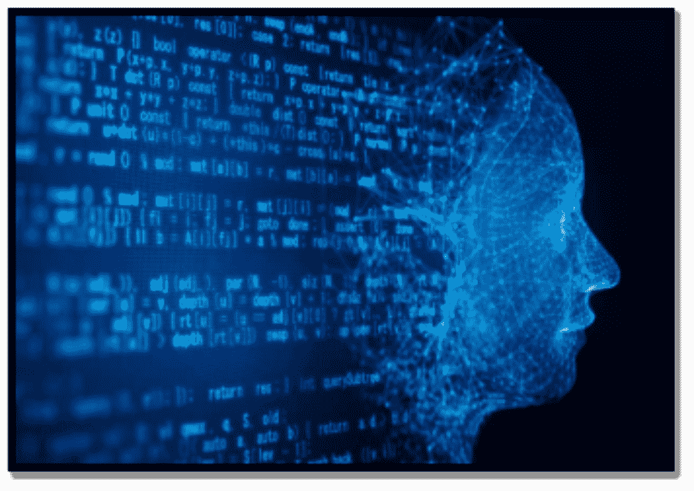

  生成式人工智能简介生成式人工智能是一种革命性技术，使算法个体能够开发以前依赖人类的模型，从而产生创造性解决方案，不受人类认知和经验引起的错误影响。人工智能中的这种新技术确定原始模型输入，以生成展示训练数据特征的真实世界产品。麻省理工技术评论指出，生成式人工智能是人工智能的一个潜在方向。生成式人工智能通过对所有数据集进行自主学习，提供更高质量的结果。因此，与特定项目相关的挑战减少了，机器学习算法被训练以避免偏见，并允许机器人理解抽象概念。高质量的外国咨询公司高德纳提到了生成式人工智能在 2022 年重要趋势列表中，并强调企业可以以两种方式使用这种创新技术：与企业合作以增强当前的创新工作和降低：开发自动化以帮助人类更好地执行创造性任务。例如，游戏设计师可以利用生成式人工智能创建突出他们喜好和不喜欢的地牢，比如“有点像这个”或“不太像那个”。作为业务流程的重要组成部分：生成式人工智能可以在很少人类参与的情况下产生无数创意作品。只需设置上下文，结果就会独立生成。生成式人工智能是利用机器学习模型根据训练集创建新输出的人工智能的一部分。换句话说，生成式人工智能使算法能够像人类一样开发事物，而不是人工智能系统的标准分析性质。这些输出范围从深度伪造到 AI 聊天机器人，文本到图像和文本到视频的创作，音乐，绘画等等。由于近年来硬件的改进和新的机器学习方法，生成式人工智能的输出也变得如此出色，甚至更好。本文简要介绍了生成式人工智能的基础和应用，以及它们如何影响您的个人生活和业务。人类擅长分析事物。但机器更强大。设备可以分析一组数据并找到适用于许多用例的模式，无论是欺诈还是垃圾邮件检测，预测交付的预计到达时间，还是预测 TikTok 将展示什么等等；它们越来越擅长执行这些任务。这就是所谓的“分析人工智能”（Analytical AI）或传统人工智能。但人类不仅擅长分析事物，我们还擅长创造。我们可以写诗，设计产品，开发游戏和编写代码。直到最近，机器无法在创造性工作方面与人类竞争——它们局限于分析和机械性认知劳动。然而，设备机器正在改进，可以创造感性和美丽的事物。这个新类别是“生成式人工智能”，它指的是制造新事物而不是评估已经存在的事物。生成式人工智能不仅变得更快更便宜，而且在某些情况下，它甚至可以比人类创造出更好的东西。需要原创人类工作的每个行业都面临着重塑，从社交媒体到游戏，从广告到建筑，从编码到图形设计，从产品设计到法律，从营销到销售。这些行业中的一些功能可能完全被生成式人工智能取代，而其他部门更有可能在人机协作带来更频繁的创造循环的影响下蓬勃发展，但范围广泛。因此，生成式人工智能应该在许多终端市场释放更好、更快和更便宜的创造力。我们梦想生成式人工智能将把创作和知识工作的边际成本降低到零，创造极高的劳动生产率、经济价值和相应的巨大市场价值。生成式人工智能的领域——知识工作和创造性工作——涉及数十亿工作者。生成式人工智能可以使这些工作者至少提高 10%的效率和创新能力：他们将比以前更快、更高效、更有能力。因此，生成式人工智能有潜力创造数十亿美元的经济价值。
