# 1

开始使用 ChatGPT 提示

在本章中，您将设置好使用 ChatGPT 并学习给出提示的基本要点。我建议您首先设置一个免费的研究预览账户，这样您就可以体验 ChatGPT 而无需付费。然后，您可以开始给 ChatGPT 提供提示并评估其返回的响应。

假设您喜欢所看到的内容，您可以从免费账户升级到付费账户，这样您就可以访问 ChatGPT 的全部功能。

无论您选择付费账户还是继续使用免费预览账户，您都可以选择设置以控制账户的运作方式。付费账户有一些额外的设置，我们也会在本章中介绍。

在本章结束时，我们将看看如何在其他计算机和 iPhone、iPad 或 Android 设备上设置 ChatGPT。  ## 设置���个免费的研究预览账户

如果您想在开始付费之前测试 ChatGPT，请设置一个免费账户。免费账户使您能够使用足够的 ChatGPT 功能来有效评估它。您无法访问最新和最先进的功能，当服务繁忙时，ChatGPT 的响应速度可能会较慢，因为它会优先考虑付费客户。

设置账户只需几分钟，所以没有任何不利之处。您需要提供一个电子邮件地址，OpenAI 将其用作您的账户 ID，以及一个电话号码，OpenAI 将用于验证。

要设置您的研究预览账户，请打开一个网页浏览器访问[chat.openai.com](http://chat.openai.com)，点击“注册”按钮以显示创建您的账户屏幕（参见图 1-1），然后按照提示操作。以下是关键步骤：

1.  要验证您的电子邮件地址，OpenAI 会发送一封电子邮件给您，您可能需要从垃圾邮件文件夹中检索该邮件；点击“验证电子邮件地址”按钮进行验证。

1.  在“告诉我们关于您”的屏幕上，输入您的名字、姓氏和生日（以验证您是否已年满使用 ChatGPT 的年龄），然后点击另一个“继续”按钮。

1.  在验证您的电话号码屏幕上，从下拉列表中选择您的国家，输入您的电话号码，然后点击“发送验证码”按钮。当您的手机收到验证码时，在计算机上输入它。

完成注册后，请验证您的电子邮件地址，然后您就可以登录您的账户了。

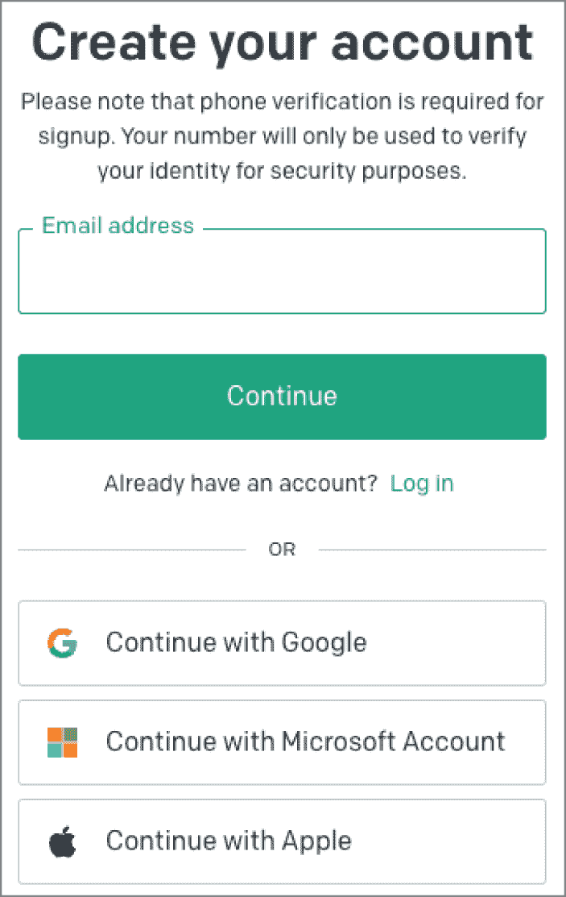

**图 1-1 在创建您的账户屏幕上，输入您的电子邮件地址并点击“继续”按钮。**  ## 体验 ChatGPT

一旦您设置好了研究预览账户，您就可以开始体验 ChatGPT 了。

### 登录并了解 ChatGPT 界面

使用您全新的凭据登录，您将看到一个类似于图 1-2 所示的界面。界面的各个部分都很简单：

+   **侧边栏。** 此窗格出现在窗口左侧，让您访问您的聊天和您的账户。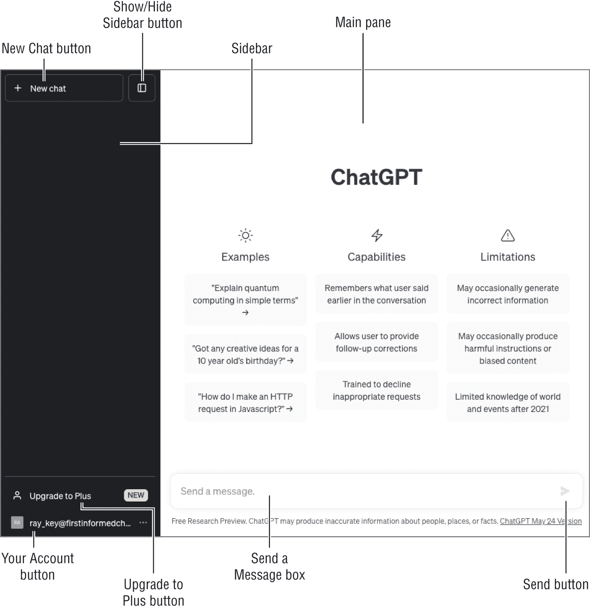

    **图 1-2 ChatGPT 界面干净简洁，易于导航。**

+   **新建聊天按钮。** 点击此按钮开始新的聊天。每个聊天都显示为侧边栏中的按钮，您可以通过点击相应按钮在不同聊天之间导航。

+   **显示/隐藏侧边栏按钮。** 当侧边栏显示时，点击此按钮隐藏侧边栏；当侧边栏隐藏时，再次点击按钮显示侧边栏。如果您在一个小窗口中工作，隐藏侧边栏会为活动聊天提供更多空间。如果您在一个大窗口中工作，您可能只想保持侧边栏显示，以便轻松在不同聊天之间导航。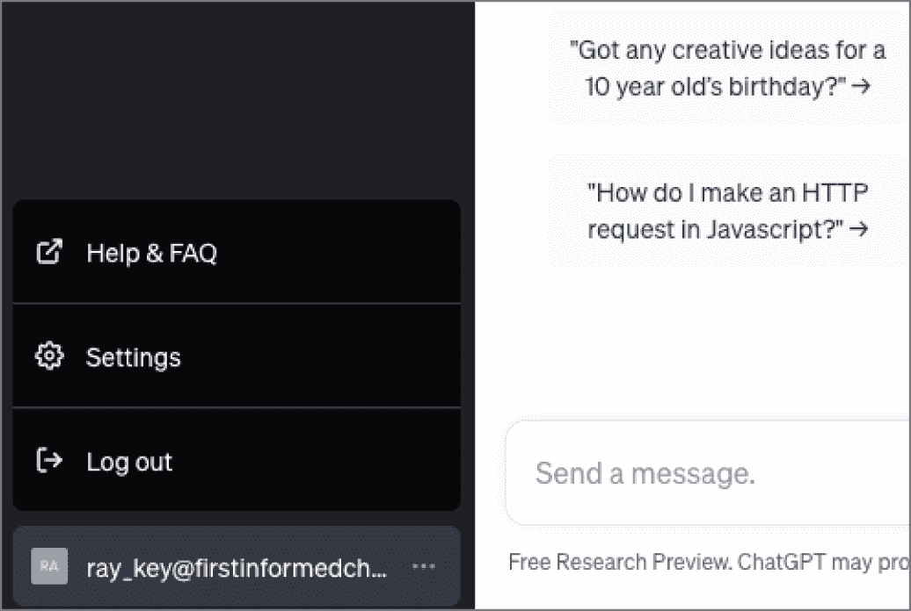

    **图 1-3 点击“您的账户”按钮以显示控制菜单。**

+   **主窗格。** 此区域显示您的活动聊天。

+   **发送消息框。** 在此框中，您输入或粘贴要传递给 ChatGPT 的提示或信息。然后按 Enter 键或点击发送按钮。

+   **发送按钮。** 点击此按钮将发送“发送消息”框中的内容给 ChatGPT。

+   **升级到 Plus 按钮。** 点击此按钮开始从免费研究预览账户升级到付费 Plus 账户的过程。

+   **您的账户按钮。** 此按钮显示您账户的电子邮件地址。点击此按钮以显示图 1-3 中显示的控制菜单，该菜单让您访问 ChatGPT 的帮助和常见问题解答部分，让您访问设置屏幕，并让您退出登录。### 提示

点击“发送消息”框并输入您要传达给 ChatGPT 的内容。以下是一个快速示例。本书以粗体显示提示，斜体显示任何您需要提供的占位文本，例如，在提示**一个*职位*做什么？**中，您将用“宝石匠”、“煤气锅炉工”、“车辆制造商”或其他内容替换*职位*。本书以斜体显示 ChatGPT 的响应，就像示例的第二段一样。

+    **用 30 个词解释什么是抵押贷款。**

+    *抵押贷款是银行或贷款人提供的贷款，帮助个人或企业购买房产，房产作为抵押物，直到贷款完全偿还*。

图 1-4 显示了在给出提示后 ChatGPT 窗口的外观。正如您���看到的，出现了几个新元素，让您可以采取进一步的行动：

+   **聊天按钮。** ChatGPT 在侧边栏顶部添加了一个聊天按钮，并根据您的提示和响应分配了一个默认名称。在示例中，ChatGPT 将聊天命名为抵押贷款解释。您可以通过点击重命名按钮来重新命名聊天。

+   **今天部分。** ChatGPT 通过时间段（今天、昨天、前 7 天等）在侧边栏中列出的聊天列表。

+   **重命名按钮。** 要重命名聊天，请点击此按钮，输入新名称，然后点击对号按钮或按 Enter 键。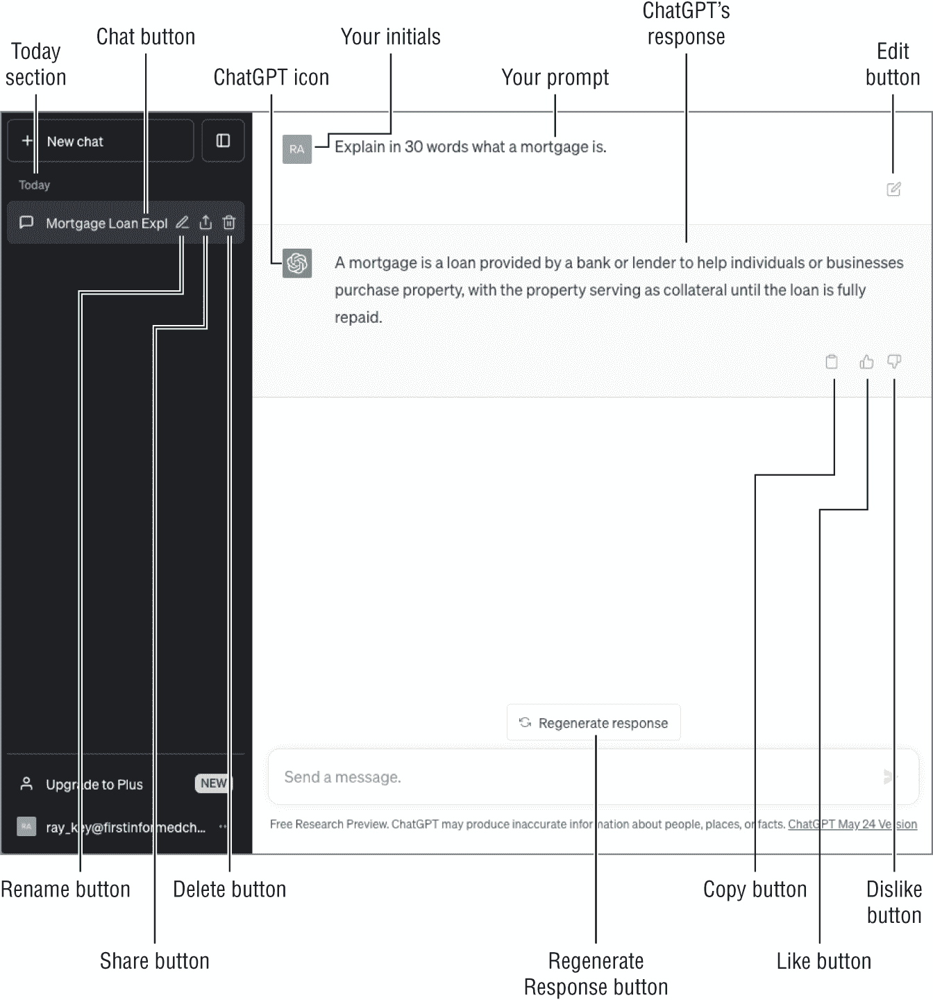

    **图 1-4 当 ChatGPT 响应提示时，您可以执行其他几项操作。**

+   **分享按钮。** 点击此按钮开始分享聊天的过程。有关更多信息，请参见本章后面的“分享聊天链接”部分。

+   **删除按钮。** 要删除聊天，请点击此按钮，然后点击其右侧的对号按钮。

+   **您的缩写。** 此图标显示您的缩写或用户名的前两个字母，清楚地表明提示是您的输入。

+   **您的提示。** 您输入的提示显示在此处。

+   **编辑按钮。** 点击此按钮编辑您的提示。稍后将详细介绍。

+   **ChatGPT 图标。** 此图标显示在每个 ChatGPT 响应的左侧。

+   **ChatGPT 的响应。** ChatGPT 的响应显示在此处。如果响应足够长以延伸到窗口底部之外，请向下滚动以查看更多。或者，点击“向下滚动”按钮，即位于窗口右下角的带有向下箭头的圆圈。

+   **重新生成响应按钮。** 点击此按钮让 ChatGPT 再次尝试响应。如果 ChatGPT 的响应基本准确，但您希望以不同方式表达，可以这样做。ChatGPT 重新生成响应后，会出现“上一个 (<)”按钮和“下一个 (>)”按钮。点击这些按钮可在不同响应之间导航。

+   **复制按钮。** 点击此按钮将 ChatGPT 的响应复制到剪贴板，以便您可以将其粘贴到其他地方。

+   **喜欢按钮。** 点击此按钮告诉 ChatGPT 您赞同此响应。

+   **不喜欢按钮。** 点击此按钮告诉 ChatGPT 您不喜欢这个响应。

如果 ChatGPT 的响应不符合您的期望，您可以编辑提示，输入更多信息以完善提示，或者简单地重新提示，如下所述。### 编辑提示，添加信息或重新提示

要编辑提示，请点击“编辑”按钮。ChatGPT 打开提示以进行编辑（参见图 1-5），您可以进行必要的更改。完成后，点击“保存并提交”按钮。ChatGPT 更新其响应。

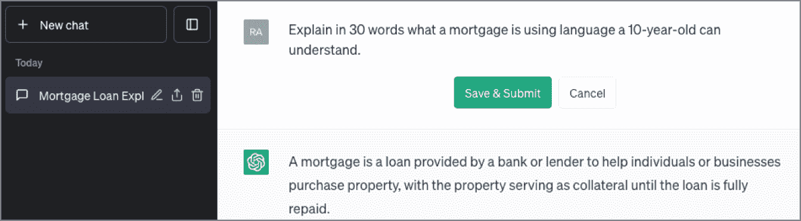

**图 1-5 点击“编辑”按钮后，输入更改到您的提示，然后点击“保存并提交”按钮。**

如果您想保留提示不变但输入更多信息，请在“发送消息”框中输入额外信息，然后按 Enter 键或点击发送按钮。以下是一个示例：

+    **请重新用 60 个字并举例重写您的回答。**

ChatGPT 记住了您活跃聊天的内容，因此您可以进一步发展提示，而无需完全重述。当您从一个聊天切换到另一个聊天时，ChatGPT 会加载活跃聊天的内容，以便您可以继续聊天。

或者，您可以简单地输入另一个提示，重新表述您的请求（可能并提供更多细节）或开始另一个话题。  ### 分享聊天链接

如果您想与某人分享聊天，请按照以下步骤操作：

1.  通过单击侧边栏中的按钮使聊天活跃。

1.  单击侧边栏中聊天按钮上的共享按钮以打开共享链接到聊天对话框（参见图 1-6）。

1.  确保聊天名称准确描述了聊天内容。如果不是，请单击编辑按钮（铅笔图标）并编辑名称，或输入更好的名称。

1.  如果您想在共享信息中包含您的电子邮件地址，请单击省略号（…）按钮，然后单击打开的菜单中的“分享您的姓名”项目。ChatGPT 会在聊天名称后添加您的电子邮件地址。（要删除它，请��次单击省略号按钮，然后单击菜单中的“匿名分享”项目。）

1.  单击“复制链接”按钮。ChatGPT 将链接的 URL 复制到剪贴板。

1.  将 URL 粘贴到您喜欢的分享方式中，比如即时消息、电子邮件或 Zoom 或 Slack 聊天中。

收件人单击共享的链接以在浏览器窗口中打开聊天。然后他们可以单击“继续此对话”按钮继续聊天。

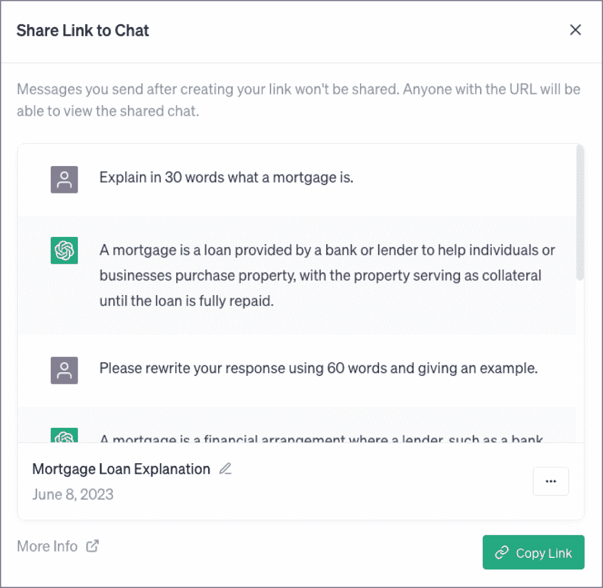

**图 1-6 单击共享链接到聊天对话框中的“复制链接”按钮以分享聊天链接。**  ## 制作有效提示

制作让 ChatGPT 返回您想要的结果的提示更像是一门艺术而不是一门科学，您将为自己的需求开发出自己的技巧。本书提供的示例提示将引导您朝着正确的方向发展。

好消息是，ChatGPT 的自然语言处理（NLP）效果很好，因此您不必使用固定的措辞或按特定顺序排列元素。通常，ChatGPT 可以理解您的意思；当它无法理解时，问题立即显而易见。例如，如果您的提示难以理解，ChatGPT 会要求您澄清：

+    **为什么产业从未再次关注蓝色？**

+    *抱歉，我不确定我是否理解这个问题。您能否提供更多背景信息或澄清“为什么产业从未再次关注蓝色”的含义？*

每当 ChatGPT 对提示的回应不符合您的期望时，您可以完全重新表述提示，或添加说明以使您的意思更清晰。任何一种方法都有效，所以使用您喜欢的那种。

话虽如此，你能够清晰和具体地表达你的提示，你可能会得到更好的结果。如果你能在一开始清楚地表达你想要的内容，请这样做。  ## 评估 ChatGPT 的输出

当 ChatGPT 返回对你的提示的回复时，请仔细阅读。ChatGPT 非常擅长生成读起来流畅、看起来准确和权威的文本，但实际上并非如此。因此，在将 ChatGPT 的输出用于任何严肃目的之前，你必须评估其准确性。

你可能熟悉“信任，但要验证”的建议，这是一句俄罗斯谚语的翻译，由罗纳德·里根总统在与苏联进行核裁军谈判时推广。这是一个很好的建议，但在使用 ChatGPT 时，你需要将你的怀疑提升到下一个水平：怀疑，并验证。

如果你了解你向 ChatGPT 提问的主题，你可能可以通过阅读内容来验证信息。但很可能你经常会询问一些你不是专家的问题，这就是为什么你向 ChatGPT 询问信息而不是从记忆中回忆出来。对于这些主题，通过使用你喜欢的搜索引擎或（老派的！）向了解该主题领域的人询问来验证信息。  ## 注册付费 ChatGPT 账户

如果你打算认真使用 ChatGPT，你可能应该注册一个付费账户。截至本文撰写时，付费计划称为 ChatGPT Plus，每月费用为$20。

ChatGPT Plus 账户有几个优势：

+   **你可以访问完整的功能范围。** 付费账户使你可以访问 ChatGPT 的全部功能范围，包括高级自然语言处理功能，帮助 ChatGPT 更准确地理解你的查询，更多的内存以提高性能（特别是在复杂查询时），以及增加的计算资源以提高性能和准确性。

+   **你可以运行更多查询并获得更详细的回复。** 如果你一直受限于免费账户的限制，升级到 ChatGPT Plus 账户将使你能够运行更多查询并获得更详细的回复。

+   **你可以自定义 ChatGPT 界面和功能。** ChatGPT Plus 账户使你可以更多地自定义 ChatGPT，但只是稍微多一点。有关更多信息，请参见本章后面的“自定义您的 ChatGPT 账户”部分。

+   **你可以获得优先支持。** ChatGPT 为付费账户提供优先支持。这意味着当你需要帮助时，你应该能够更快地获得帮助，并且帮助应该更加个性化。

+   **你可以享受不同的许可和使用权。** ChatGPT Plus 账户带来不同的许可和使用权。特别是，你可能可以将 ChatGPT 用于商业目的，并且你可能可以将 ChatGPT 整合到你自己的产品或服务中。

### 升级到 ChatGPT Plus 账户

要升级到 ChatGPT Plus，请按照以下步骤：

1.  像往常一样登录您的免费 ChatGPT 账户。

1.  点击左侧边栏底部的“升级至 Plus”按钮以显示“您的计划”对话框（见图 1-7）。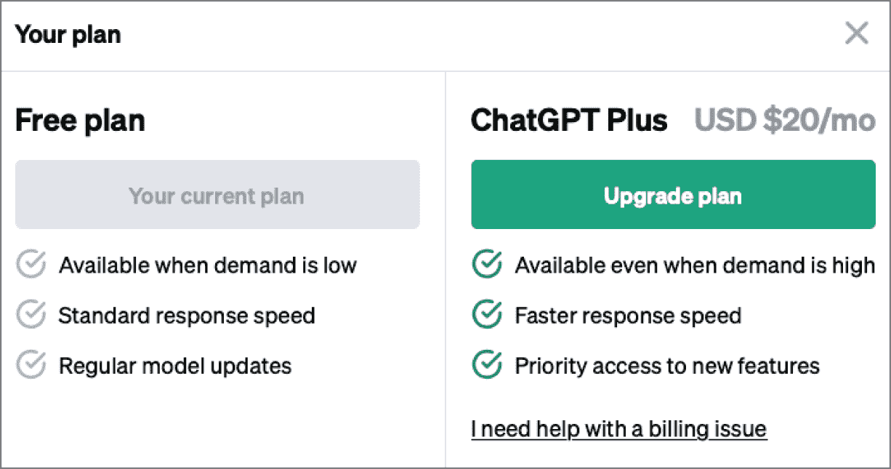

    **图 1-7 在“您的计划”对话框中，点击“升级计划”按钮。**

1.  点击“升级计划”按钮以显示付款屏幕。

1.  在“付款方式”区域，填写您的卡信息和账单地址。

1.  如果您希望通过使用 Link 服务更快地进行未来付款，请选择“安全保存我的信息以进行一键结账”复选框。如果您像我一样可以很快花钱而不需要 Link 服务，非常感谢，那么请保持此复选框未选中。

1.  如果您为您的业务支付 ChatGPT 费用，请选择“我作为企业购买”复选框，然后填写弹出的任何额外字段。

1.  选择“您将每月支付上述金额，直到您取消”复选框。您必须选择此复选框才能启用“订阅”按钮。

1.  点击“订阅”按钮。

1.  在“收到付款！”屏幕上，点击“继续”按钮。

**图 1-8 如果 OpenAI 给您提供尝试新功能的机会，请决定是否尝试。**

此时，您可能会看到一个屏幕提供新功能，例如图 1-8 中的屏幕给我提供尝试最新模型 GPT-4 的机会。做出您的选择并点击适当的按钮。毫无疑问，我点击了“尝试 GPT-4”按钮，而不是“以后再说”按钮。

升级到 ChatGPT Plus 账户后，您会注意到一些变化。查看图 1-9。

+   屏幕顶部出现两个选项卡，可让您在 GPT-3.5 和 GPT-4 之间切换。

+   ChatGPT Plus 徽标出现在输出区域的背景中。

+   最新版本的限制信息可能会出现在“发送消息”框上方。例如，在图中，显示告诉您，GPT-4 每三小时有 25 条消息的限制。

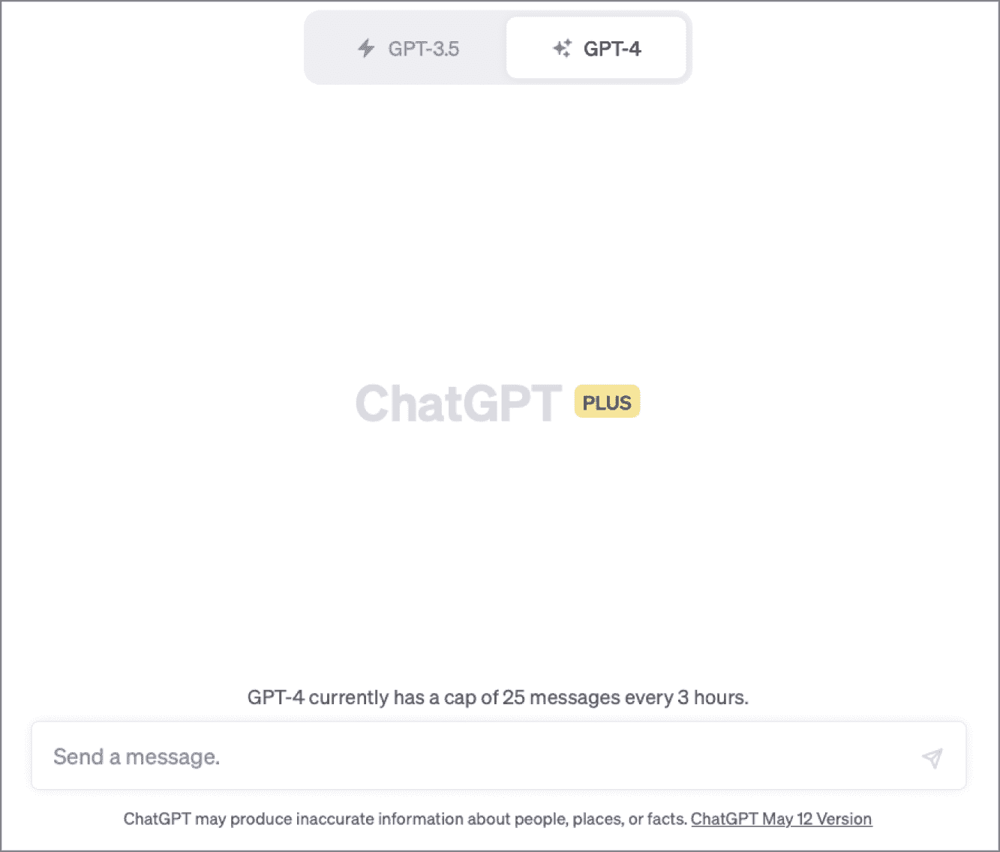

**图 1-9 如果您选择启用新功能，则顶部的选项卡按钮可让您在它们之间切换。**  ### 在 ChatGPT 模型之间切换

选择更高级的选项卡（例如示例中的 GPT-4 选项卡），点击选项卡按钮以显示一个弹出菜单（见图 1-10），其中包含您可以点击的按钮，以在 ChatGPT 的各种模型之间切换。点击您想要使用的按钮，将其选中（并从以前选中的任何其他按钮上移除选中标记）。截至目前，ChatGPT 提供这三个模型：

+   **默认。** 以默认配置运行 ChatGPT，无需浏览或插件；我称之为默认模型

+   **使用 Bing 浏览。** 通过微软的 Bing 搜索引擎进行浏览；我称之为 Web 浏览模型

+   **插件。** 允许您使用 ChatGPT 插件，第三方功能添加功能；我称之为插件模型

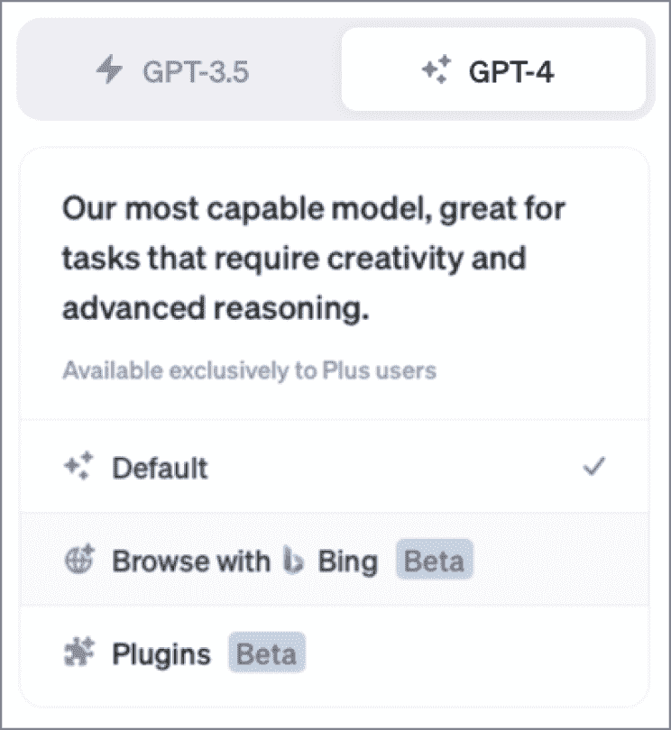

**图 1-10 使用弹出菜单配置 ChatGPT 活动模型。每个模型都有一个独特的图标，就像您在这里看到的那样。**

选项卡按钮上的图标会更改以指示当前模式：默认模型为一个大星星和两个小星星，Web 浏览模型为一个小星星的地球图标，插件模型为一个小星星的拼图块图标。

一旦您切换到 Web 浏览模型，读数将出现在 ChatGPT 图标右侧，显示其响应过程，向您显示 ChatGPT 正在浏览网络。当 ChatGPT 完成浏览时，下拉列表将替换读数。您可以打开此下拉列表以查看 ChatGPT 在 Web 上执行的操作（参见图 1-11）。

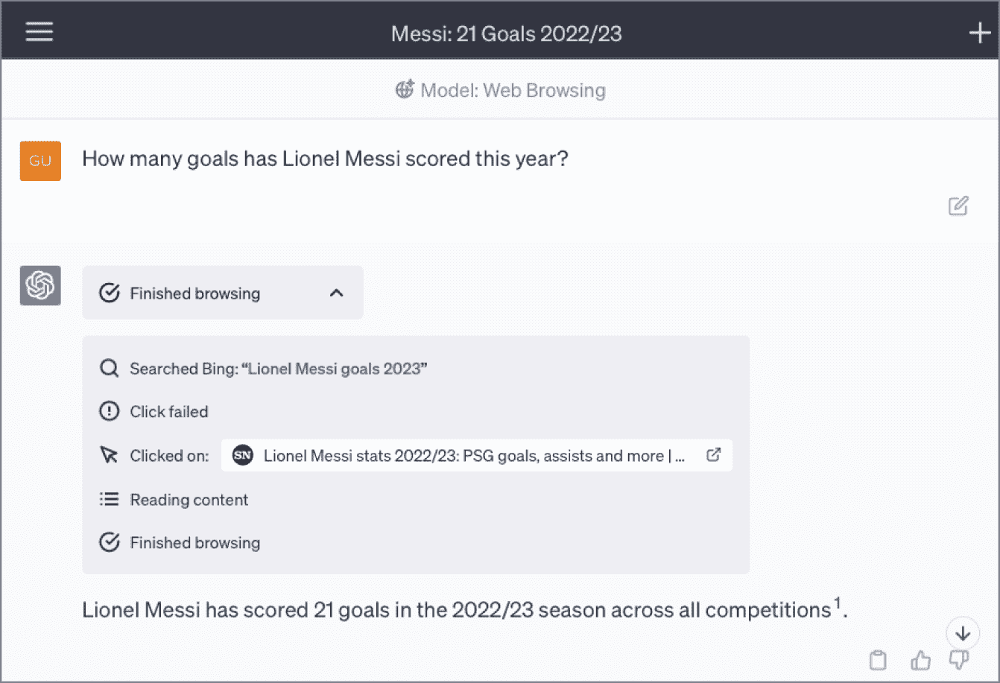

**图 1-11 在 Web 浏览模型中，打开下拉列表以查看 ChatGPT 响应您提示时在 Web 上执行的操作。**

当您切换到插件模型时，ChatGPT 会在选项卡按钮下方显示一个下拉列表，显示您已启用的插件。起初，下拉列表将显示“未启用插件”。单击下拉列表的箭头以显示可用插件，然后单击您想要的插件。如果尚未安装插件，请单击插件商店按钮以显示关于插件对话框，然后单击“确定”按钮以显示插件商店对话框（参见图 1-12）。在这里，您可以浏览或搜索插件。单击“安装”按钮以安装您想要添加的每个插件。

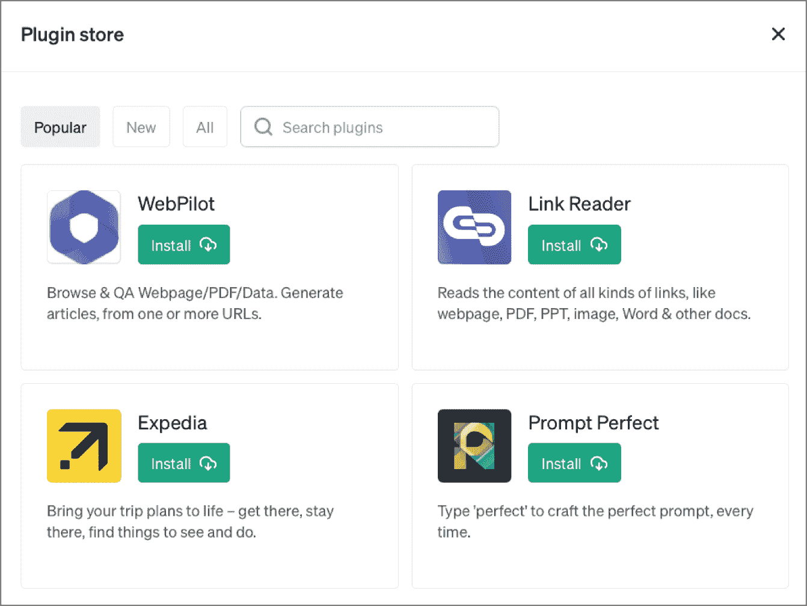

**图 1-12 插件商店对话框可让您浏览或搜索插件并安装它们。**

一旦您添加了插件，读数显示图标指示哪些插件已加载。单击下拉列表的箭头以显示插件列表（参见图 1-13）。然后，您可以选择或清除其复选框以加载或卸载插件。  ## 自定义您的 ChatGPT 帐户

无论您是拥有免费 ChatGPT 帐户还是付费帐户，您都可以进行一些自定义。 ChatGPT Plus 帐户比免费帐户提供了一些更多的选项。

要自定义您的帐户，请单击左侧窗格底部的带有您帐户名称的按钮。在弹出的菜单中，单击设置以显示设置对话框。首先出现常规选项卡（见图 1-14）；您可以通过单击左侧的选项卡导航到其他选项卡。截至本文撰写时，常规选项卡和数据控制选项卡对于免费帐户和付费帐户都可见，但 Beta 功能选项卡仅对付费帐户可见。

**图 1-13 在插件模式下，您可以从下拉列表中加载和卸载插件。**

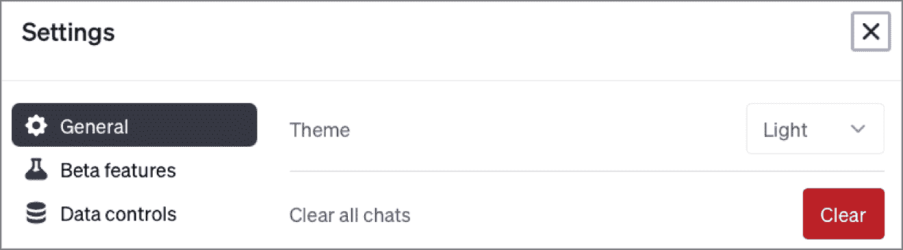

**图 1-14 设置对话框框的常规选项卡使您可以选择主题和清除所有聊天。**

### 在常规选项卡中选择设置

常规选项卡使您可以执行两个操作：

+   **选择主题。** 点击主题下拉列表，然后选择明亮、黑暗或系统。明亮是本书显示的主题；在光线不足的情况下，黑暗可能会更容易看见；而系统则使用您计算机的明亮或黑暗主题设置。

+   **清除您的聊天记录。** 单击清除按钮。ChatGPT 将不带确认地清除聊天记录。

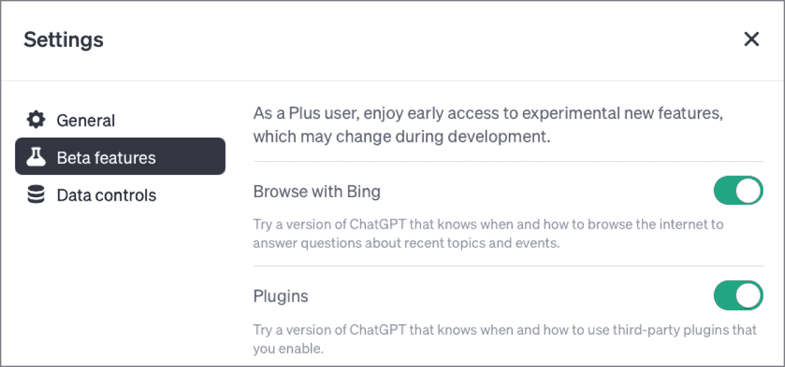

**图 1-15 Beta 功能选项卡使您可以打开或关闭当前的测试功能。** ### 在 Beta 功能选项卡中选择设置

Beta 功能选项卡使 ChatGPT Plus 用户可以启用和禁用测试（预发布）功能。图 1-15 显示了当前 Beta 功能选项卡的情况，它可以让您（也就是我）通过设置其开关来启用或禁用 Bing 浏览功能和插件功能。 ### 在数据控制选项卡中选择设置

数据控制选项卡（见图 1-16）包含最重要的设置：

+   **聊天记录和训练。** 将此开关设置为开启（绿色），如果您想要将新的聊天保存到您的聊天记录中。通常这很有帮助，特别是当您不再需要它们时，您可以删除单个聊天。

+   **共享链接。** 单击管理按钮以显示共享链接对话框，该对话框使您可以查看您的共享链接，呼叫它们的聊天，并删除这些链接。

+   **导出数据。** 单击此按钮，如果您想要将所有 ChatGPT 数据导出到一个文件中，您可以通过 OpenAI 发送到您的电子邮件的链接下载。

+   **删除帐户。** 单击此按钮开始删除您的 ChatGPT 帐户的过程。

+   **启用双因素身份验证。** 单击此按钮开始设置双因素身份验证，以保护您的 ChatGPT 帐户免受入侵。

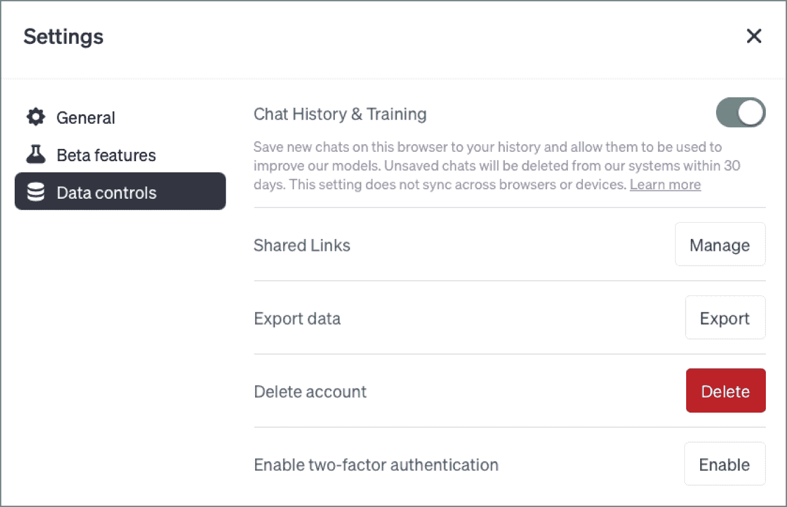

**图 1-16 数据控制面板可让您配置聊天记录和训练、共享链接、数据导出以及双因素认证。您还可以删除 ChatGPT 账户。**  ## 在您的设备上设置 ChatGPT

创建 ChatGPT 账户后，您可以通过在任何设备上打开浏览器并输入您的凭据来访问 ChatGPT。如果您使用多台计算机，例如笔记本电脑和台式电脑，您可能希望在每台计算机上保存您的凭据，以便您可以在不必为每个会话重新输入它们的情况下启动 ChatGPT。 

您也可以在手机或平板电脑上使用浏览器，但 OpenAI 提供了适用于 iOS、iPadOS 和 Android 的 ChatGPT 应用。该应用在小屏幕上更易于使用，因此您可能会选择使用它。

### 在您的 iPhone 或 iPad 上安装 ChatGPT 应用

要在您的 iPhone 或 iPad 上安装 ChatGPT 应用，请按照以下步骤操作：

1.  显示主屏幕。在具有 Face ID 的 iPhone 或 iPad 上，向上滑动以显示应用切换器，然后点击屏幕底部。在具有 Touch ID 的 iPhone 或 iPad 上，按下主页按钮。

1.  点击 App Store 图标打开 App Store 应用。

1.  点击屏幕底部标签栏右端的搜索按钮，显示搜索屏幕。

1.  在搜索框中点击并输入**openai chatgpt**。会显示一系列结果。

1.  点击“openai chatgpt official”结果。会显示一屏看似匹配的应用（见图 1-17 中的左侧屏幕）。

1.  点击 OpenAI 的 ChatGPT 应用，显示其屏幕（在图 1-17 中显示在右侧）。

1.  确认开发者信息显示为 OpenAI。

1.  点击获取按钮，然后在打开的 App Store 对话框中确认安装。例如，您可能需要双击 iPhone 的侧面按钮。

1.  安装完成后，在 App Store 应用中点击 ChatGPT 屏幕上的打开按钮启动应用。如果您已经离开了 App Store 应用，请在 iPhone 的主屏幕上点击 ChatGPT 图标。

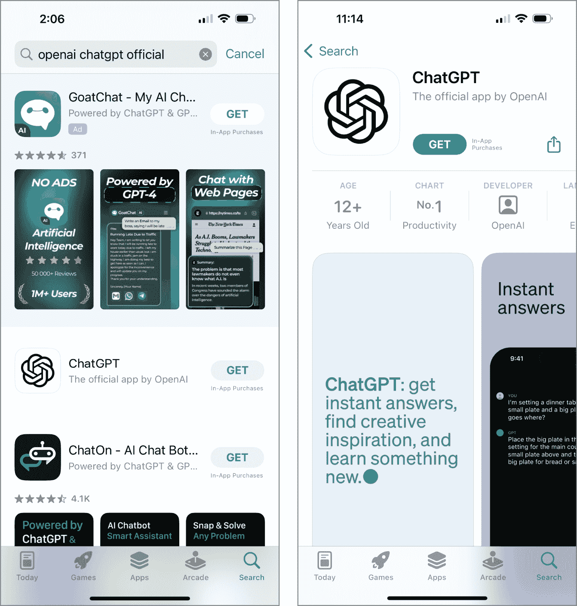

**图 1-17 确保您选择 OpenAI 的 ChatGPT 应用而不是第三方应用。在应用的屏幕上（右侧），点击获取按钮开始安装。**

跳转到本章后面的“登录到您的 ChatGPT 账户”部分。  ### 在您的 Android 设备上安装 ChatGPT 应用

要在您的 Android 手机或平板电脑上安装 ChatGPT，请按照以下步骤操作：

1.  通过从屏幕底部向上滑动，然后点击主屏幕，显示主屏幕。

1.  如果 Play 商店图标直接出现在主屏幕上，请在那里点击。否则，向上滑动主屏幕以显示应用抽屉，然后点击 Play 商店图标。Play 商店应用程序将打开。

1.  在搜索框中点击并输入**openai chatgpt**。将显示一系列结果。

1.  点击“openai chatgpt official”结果以显示匹配应用程��的列表。

1.  点击 OpenAI 的 ChatGPT 应用以显示其屏幕。

1.  仔细检查开发者信息是否显示 OpenAI。

1.  点击安装按钮。

1.  安装完成后，点击 App Store 应用中 ChatGPT 屏幕上的打开按钮来启动应用。如果您已经离开 App Store 应用，请返回主屏幕，打开应用抽屉，然后点击 ChatGPT 图标。### 登录到您的 ChatGPT 帐户

第一次运行 ChatGPT 应用程序时，它会引导您完成登录到您的 ChatGPT 帐户的步骤。按照以下步骤：

1.  在左侧显示的闪屏屏幕上，点击登录按钮。您的设备将在默认浏览器中显示欢迎回来屏幕，如右侧所示图 1-18。

1.  点击电子邮件地址框，输入您的电子邮件地址。

    **图 1-18 点击闪屏屏幕上的登录按钮（左侧）以使用您现有的 ChatGPT 帐户登录。在欢迎回来屏幕上，输入您的电子邮件地址并点击继续按钮。**

1.  点击继续按钮。输入密码屏幕将显示。

1.  输入您的密码。

1.  点击继续按钮。欢迎来到 ChatGPT 屏幕将显示，如图 1-19 左侧所示。

1.  阅读信息和警告，然后点击继续按钮。

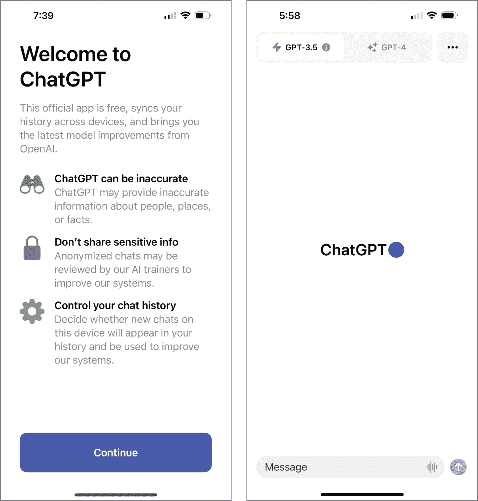

**图 1-19 在 ChatGPT 欢迎屏幕（左侧）上阅读信息并点击继续按钮。当 ChatGPT 屏幕（右侧）出现时，您可以开始使用了。**

ChatGPT 屏幕出现，您可以开始使用 ChatGPT。但首先，您可能想花一两分钟来配置 ChatGPT，接下来将解释。### 在您的设备上配置 ChatGPT

要在您的设备上配置 ChatGPT，请点击菜单按钮（省略号），然后点击弹出菜单中的设置。设置屏幕将显示，如图 1-20 左侧所示。

**图 1-20 您可以在设置屏幕（左侧）上配置 ChatGPT 的几个设置。点击数据控制按钮以显示数据控制屏幕（右侧）。**

设置屏幕包含四个部分：账户、聊天、语音和关于。以下是您可以在其中执行的操作：

+   **账户部分。** 电子邮件按钮显示与您的 ChatGPT 账户关联的电子邮件地址。订阅按钮显示您的订阅类型，如 ChatGPT Plus。数据控制按钮显示数据控制屏幕（在图 1-20 中显示）。在这里，您可以启用或禁用聊天历史记录和训练，清除聊天历史记录，导出数据或删除您的账户。

+   **聊天部分。** 将触觉反馈开关设置为打开或关闭，以控制 ChatGPT 是否提供触觉（振动）反馈。

+   **语音部分。** 在主语言弹出菜单中，要么保留默认设置“自动检测”选中，要么选择您偏好的语言，如英语。

+   **关于部分。** 该部分提供按钮，用于访问帮助中心、使用条款、隐私政策和许可信息。在许可按钮下方（图中未显示），您还可以看到 ChatGPT 应用程序的版本。

在设置屏幕的最底部，在您在图中看到的内容之下，是“登出”按钮，您可以点击以退出您的账户。您可能更喜欢保持登录状态，以便快速访问 ChatGPT。### 在您的设备上使用 ChatGPT

如果您曾在 Web 浏览器中使用过 ChatGPT，您将立即熟悉 ChatGPT 应用程序。以下是您需要掌握的三个关键操作：

+   **开始新聊天。** 点击屏幕右上角的省略号按钮以显示菜单，然后点击新聊天项目。

+   **选择 GPT 版本。** 点击屏幕顶部的相应选项卡按钮。

+   **在不同聊天之间导航。** 点击省略号按钮以显示菜单，然后点击历史项目以显示历史窗格。该窗格默认占据屏幕下半部分，但您可以通过拖动其标题栏向上拖动来扩展它。浏览或搜索以找到要激活的聊天，然后点击其按钮。
