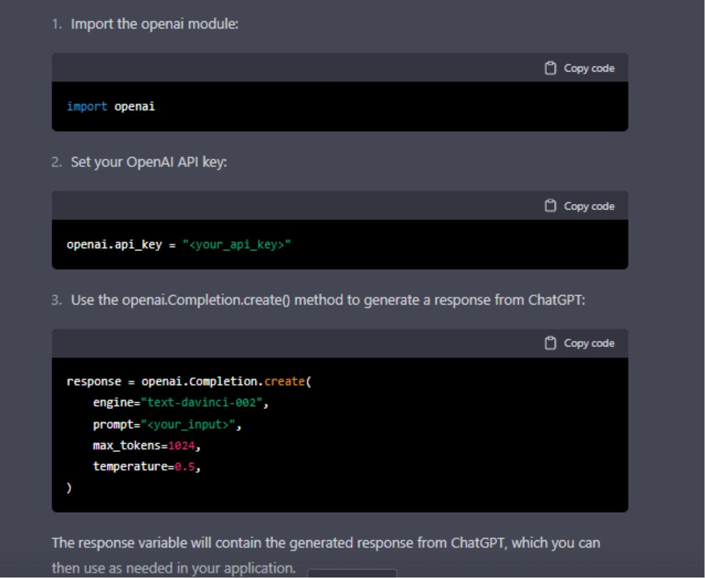

# ChatGPT 未来学习手册

> 原文：[Learn ChatGPT: The Future of Learning](https://annas-archive.org/md5/a0ce6b46eb8479df8e96caa41b815a08)
> 
> 译者：[飞龙](https://github.com/wizardforcel)
> 
> 协议：[CC BY-NC-SA 4.0](https://creativecommons.org/licenses/by-nc-sa/4.0/)

“学习 ChatGPT”是任何对人工智能在教育中的作用感兴趣的人必读的书。这本开创性的书探讨了 ChatGPT 的潜力，这是一个强大的人工智能平台，可以彻底改变我们学习和获取信息的方式。

从个性化辅导和专家建议到实时反馈和支持，ChatGPT 提供了一系列工具和资源，帮助学生和专业人士实现他们的目标。

无论您是学生、教师还是教育政策制定者，“学习 ChatGPT”都提供了有关如何利用人工智能的力量来增强和丰富学习体验的宝贵见解和实用建议。不要错过这本关于教育未来的开创性探索。

> 版权

保留所有权利。未经出版商事先书面许可，不得以任何形式或任何方式，包括复印、录制或其他电子或机械方法，复制、分发或传输本出版物的任何部分，除了在批判性评论和某些其他非商业使用中包含的简短引用。

版权所有 © 2022 A.A. KABIR

> 评论请求

亲爱的读者，

如果您从本书中学到了任何有用的东西，我们将非常感激您能抽出一点时间写一篇评论。您的评论将帮助其他读者访问这本书，并从中受益。

要撰写评论，只需转到书的页面，寻找“撰写评论”按钮。如果您遇到任何困难，请随时联系我们寻求帮助。

感谢您的时间和帮助本书触达其他读者。我们期待阅读您的评论。

致以最诚挚的问候，

A.A. KABIR

（realaakabir@yahoo.com）

> 介绍

欢迎来到 ChatGPT 的世界，这是由 OpenAI 训练的强大语言模型，可用于各种任务。本书将作为 ChatGPT 的介绍，包括其功能和用途。您将学习如何与 ChatGPT 互动，以及如何利用其独特的能力来改善工作流程并完成各种任务。无论您是学生、专业人士、油管博主还是希望提高语言能力的人，ChatGPT 都是一个宝贵的工具，可以帮助您实现目标。

> 第一部分

ChatGPT 介绍

本部分全面介绍了 ChatGPT，包括它是什么以及它是如何工作的，讨论了它的历史和发展，并解释了与它互动的基础知识。

**第一章：ChatGPT 是什么以及它是如何工作的？**介绍了 ChatGPT 并解释了它的工作原理。

**第二章：ChatGPT 的历史和发展**讨论了 ChatGPT 的历史和发展。

**第三章：与 ChatGPT 互动的基础**介绍了与 ChatGPT 互动的基础知识。

> 第一章

ChatGPT 是什么以及它是如何工作的？

**ChatGPT 及其能力介绍**

ChatGPT 是由 OpenAI 团队开发的大型语言模型。它基于 GPT-3 模型，旨在对各种格式的输入生成类似人类的回应。

ChatGPT 的一个关键能力是它能够理解和回应对话背景下的输入。利用先进的自然语言处理算法和机器学习技术，ChatGPT 能够理解输入背后的含义和意图，并生成适当和自然的回应。

ChatGPT 的另一个重要能力是它能够处理各种输入格式。除了能够理解和回应文本输入外，ChatGPT 还能够理解和回应语音输入，使其成为各种应用中的多功能工具。

总的来说，ChatGPT 是一个高度先进和有能力的语言模型，非常适合在对话环境中生成类似人类的回应。它理解和回应输入的能力，以及处理各种输入格式的能力，使其成为需要自然语言处理的应用程序的有价值的工具。

**ChatGPT 如何使用自然语言处理和机器学习**

ChatGPT 使用自然语言处理和机器学习来理解和回应对话环境中的输入。在其核心，ChatGPT 是一个在大规模文本数据集上训练的大型语言模型。这种训练使得模型能够理解语言的结构和含义，并生成合适和自然的回应。

当 ChatGPT 接收到输入时，它使用自然语言处理算法来分析文本并提取其背后的含义和意图。这使得模型能够理解输入的上下文，并生成相关和合适的回应。

除了自然语言处理，ChatGPT 还使用机器学习算法来随着时间的推移改善其性能。随着模型接收更多的输入并生成更多的回应，它能够从错误中学习，并提高理解和回应输入的能力，以一种自然和类似人类的方式。

ChatGPT 是自然语言处理和机器学习的强大组合，使其能够理解和回应对话环境中的输入。这些技术使 ChatGPT 能够生成合适和自然的回应，使其成为需要自然语言处理的应用程序的有价值的工具。

**ChatGPT 与其他语言模型和人工智能助手的不同之处**

ChatGPT 与其他语言模型和人工智能助手在几个关键方面有所不同。最显著的区别之一是模型的大小。ChatGPT 是一个在大规模文本数据集上训练的大型语言模型，这使得它能够以无与伦比的能力生成类似人类的回应。相比之下，其他语言模型和人工智能助手通常在较小的数据集上训练，并且无法以相同流畅和自然的水平生成回应。

ChatGPT 与其他语言模型和人工智能助手的另一个重要区别是它能够处理的输入类型。ChatGPT 旨在理解和回应各种对话输入，包括文本和语音。相比之下，其他语言模型和人工智能助手在处理输入的能力上通常更有限，可能只能处理单一格式（例如仅文本）。

ChatGPT 非常适合在对话环境中生成类似人类的回应。其庞大的大小和多功能的输入能力使其与其他语言模型和人工智能助手有所不同，并使其成为需要自然语言处理的应用程序的有价值的工具。

> 第二章

ChatGPT 的历史和其发展

**ChatGPT 的起源和其随时间的发展**

ChatGPT 的起源可以追溯到 OpenAI 团队开发的 GPT-3，这是一个在大规模文本数据集上训练的大型语言模型，旨在以多种格式生成类似人类的回应。

OpenAI 团队认识到 GPT-3 在对话环境中的潜力，并开始致力于调整该模型以用于聊天机器人和其他应用程序。这项工作最终导致了 ChatGPT 的创建，这是 GPT-3 的一个专门版本，经过优化以生成对话回应。

ChatGPT 的发展涉及了 OpenAI 的一支研究人员和工程师团队，他们共同努力调整模型并开发新技术，以改善其性能。在 ChatGPT 的开发过程中引入的一些关键创新包括自然语言处理和机器学习算法的进步，使模型能够更好地理解和回应对话环境中的输入。

如今，ChatGPT 被广泛认为是目前最先进和功能强大的对话人工智能系统之一，并且仍然由 OpenAI 团队进行开发和改进。

**ChatGPT 创造背后的团队和研究人员**

ChatGPT 的发展涉及了 OpenAI 的一支研究人员和工程师团队，他们共同努力创建和完善这个模型。团队包括各个领域的专家，包括自然语言处理、机器学习和人工智能。

参与 ChatGPT 开发的一些关键人物包括 OpenAI 的研究人员 Ilya Sutskever、Ian Goodfellow 和 Alex Graves，他们是 GPT-3 模型的先驱之一。参与 ChatGPT 开发的其他知名贡献者包括研究人员 Jean-Baptiste Cordonnier，他致力于自然语言处理算法，使 ChatGPT 能够理解和回应对话环境中的输入。

ChatGPT 的发展是一个协作努力，涉及到一个多样化的研究人员和工程师团队，他们共同努力创建和完善这个模型。他们的努力导致了今天可用的最先进和功能强大的对话人工智能系统之一的诞生。

**ChatGPT 对人工智能和自然语言处理领域的影响**

自发布以来，ChatGPT 对人工智能和自然语言处理领域产生了重大影响。作为一个高度先进的语言模型，ChatGPT 推动了当前技术所能实现的边界，并展示了人工智能系统在各种对话环境中理解和生成类人回应的潜力。

ChatGPT 的一个关键影响是推动了自然语言处理技术的进步。ChatGPT 的发展涉及到新算法和模型的创建和完善，使系统能够更好地理解和回应对话环境中的输入。这些创新有助于改进其他自然语言处理系统的性能，并为涉及语言处理的人工智能应用开辟了新的可能性。

ChatGPT 的另一个影响是增加了对对话人工智能的发展的关注。ChatGPT 的成功帮助突显了人工智能系统参与自然、类人对话的潜力，并推动了新工具和技术的开发，以构建更好的聊天机器人和其他对话人工智能系统。

ChatGPT 对人工智能和自然语言处理领域做出了重大贡献，其发展持续推动着这些领域的创新和进步。

> 第三章

与 ChatGPT 互动的基础

**设置和访问 ChatGPT**

要设置和访问 ChatGPT，您需要在 OpenAI 拥有一个账户。在浏览器中输入 OpenAI 网址[`chat.openai.com`](https://chat.openai.com)，然后点击“注册”按钮。输入您的电子邮件地址，然后创建一个密码。完成后，您可以继续验证您的电子邮件。您的账户已创建。

一旦您拥有了一个账户，您可以使用此链接访问聊天框[`chat.openai.com/chat`](https://chat.openai.com/chat)，然后您就可以开始使用了，或者您可以通过 OpenAI API 访问 ChatGPT。

要设置您的 OpenAI 帐户，您需要创建一个 API 密钥并安装 OpenAI Python 库。完成后，您将能够访问 ChatGPT 并使用它来生成对输入的响应。

要访问 ChatGPT，您需要使用 OpenAI API 将您的输入发送到模型并接收生成的响应。您可以通过向 OpenAI API 发出 HTTP POST 请求并在请求正文中提供您的输入来实现这一点。然后，API 将在 HTTP 响应中返回生成的响应。

一旦设置了您的 OpenAI 帐户并安装了 OpenAI Python 库，您可以按照以下步骤访问 ChatGPT：

1. **导入 openai 模块**：

复制代码粘贴代码到您的终端

*import openai*

2. **设置您的 OpenAI API 密钥**：

复制代码粘贴代码到您的终端

*openai.api_key = “<your_api_key>”*

3. **使用 openai.Completion.create()方法从 ChatGPT 生成响应**：

复制代码粘贴代码到您的终端

*response = openai.Completion.create(*

*engine="text-davinci-002",*

*prompt="<your_input>",*

*max_tokens=1024,*

*temperature=0.5,*

*)*

响应变量将包含从 ChatGPT 生成的响应，您可以根据需要在您的应用程序中使用。

设置和访问 ChatGPT 相对简单，可以使用 OpenAI API 和 OpenAI Python 库完成。一旦设置了您的帐户并安装了必要的库，您可以在各种对话环境中使用 ChatGPT 生成对输入的响应。

**与 ChatGPT 通信的基础知识**

与 ChatGPT 通信涉及向模型发送输入并接收生成的响应。您提供给 ChatGPT 的输入可以是文本或语音形式，模型将生成适当且自然的响应。

与 ChatGPT 通信，您需要使用 OpenAI API 将您的输入发送到模型并接收生成的响应。您可以通过向 OpenAI API 发出 HTTP POST 请求并在请求正文中提供您的输入来实现这一点。然后，API 将在 HTTP 响应中返回生成的响应。

向 ChatGPT 发送输入时，重要的是为输入提供上下文，以便模型生成相关和适当的响应。这可以通过提供一个提示或问题来设置对话的舞台，或者提供关于您想讨论的主题的背景信息来实现。

一旦您将您的输入发送到 ChatGPT，模型将生成一个响应并通过 OpenAI API 将其返回给您。响应将以文本形式生成，并使用自然语言处理算法生成，使模型能够理解输入背后的含义和意图。

与 ChatGPT 通信涉及向模型发送输入并通过 OpenAI API 接收生成的响应。通过为输入提供上下文和背景信息，您可以帮助 ChatGPT 生成更相关和适当的响应。

**您可以与 ChatGPT 一起使用的常见命令和操作**

有许多常见的命令和操作可以与 ChatGPT 一起使用。其中一些示例包括：

要求 ChatGPT 提供信息或回答问题：您可以通过在输入中提供提示或问题来要求 ChatGPT 提供信息或回答问题。例如，您可以问 ChatGPT“法国的首都是什么？”或“你能告诉我更多关于埃菲尔铁塔的历史吗？”

请求 ChatGPT 生成文本：您可以通过提供提示或主题让 ChatGPT 生成文本。例如，您可以要求 ChatGPT“写一个关于一个神奇世界的短篇故事”或“描述一个时间旅行者生活中的典型一天”。

与 ChatGPT 进行对话：您可以通过提供输入并允许模型生成响应来与 ChatGPT 进行对话。例如，您可以问 ChatGPT“您认为当前的人工智能发展状况如何？”，然后通过回应生成的响应来继续对话。

您可以使用 ChatGPT 执行许多常见的命令和操作，包括请求信息、请求文本生成和进行对话。这些操作使您能够充分利用 ChatGPT 的功能，并使用模型以自然和类似人类的方式理解和回应输入。

> 第 2 节

使用 ChatGPT 的高级技术

本节涵盖了与使用 ChatGPT 相关的高级主题，包括定制、技巧和诸如语言翻译和问题回答等高级功能。这些章节为有经验的用户提供了宝贵的信息，帮助他们充分利用这一工具。

**第四章 如何为您的特定需求定制 ChatGPT：** 解释了如何为特定需求定制 ChatGPT。

**第五章 为充分利用 ChatGPT 提供的技巧和窍门：** 提供了充分利用 ChatGPT 的技巧和窍门。

**第六章：ChatGPT 的高级功能，包括语言翻译和问题回答：** 讨论了 ChatGPT 的高级功能，如语言翻译和问题回答。

> 第四章

如何为您的特定需求定制 ChatGPT

**为实现您独特的目标和任务而个性化 ChatGPT**

ChatGPT 的一个关键优势是它能够为您独特的目标和任务进行个性化。通过提供相关信息和训练数据，您可以定制 ChatGPT 以更好地理解和回应您的特定需求。

个性化 ChatGPT 的一种方式是为模型提供与您的目标和任务相关的额外训练数据。例如，如果您正在为客户服务应用使用 ChatGPT，您可以为模型提供一组常见的客户服务问题和答案数据集，以帮助它更好地理解和回答客户的询问。

个性化 ChatGPT 的另一种方式是为模型提供与您的目标和任务相关的上下文和背景信息。这可以帮助模型生成更相关和适当的响应，并提高其在特定应用中的性能。

为了更好地理解和回应您的特定需求，个性化 ChatGPT 可以帮助模型。通过为模型提供相关的训练数据和上下文信息，您可以定制 ChatGPT 以更好地满足您的特定目标和任务。

**与其他工具和应用程序一起使用 ChatGPT**

ChatGPT 可以与其他工具和应用程序一起使用，提供各种功能和功能。由于 ChatGPT 是通过 OpenAI API 访问的，它可以与各种其他系统和工具集成，使您能够在各种情境中使用其自然语言处理和生成功能。

将 ChatGPT 与其他工具和应用程序集成的一种常见方式是将其与聊天机器人或对话式人工智能系统集成。通过使用 ChatGPT 生成对用户输入的响应，您可以创建一个能够与用户进行自然和类似人类对话的聊天机器人。这对于客户服务等应用非常有用，用户期望能够以自然和类似人类的方式与聊天机器人进行对话。

将 ChatGPT 与其他工具和应用程序集成的另一种方式是将其与信息提取和摘要系统集成。通过使用 ChatGPT 生成大量文本的摘要，您可以创建能够自动从文档和其他来源中提取和总结关键信息的系统。这对于新闻聚合、文档摘要和数据分析等应用非常有用。

总的来说，ChatGPT 可以与各种其他工具和应用程序一起使用，使您能够在各种上下文中利用其自然语言处理和生成能力。通过将 ChatGPT 与其他系统和工具集成，您可以创建功能强大且多功能的应用程序，能够在各种对话上下文中理解和生成类似人类的响应。

> 第五章

使用 ChatGPT 的技巧和窍门

**使用 ChatGPT 时要避免的常见陷阱**

在使用 ChatGPT 时有几个常见的陷阱要避免。其中一些最重要的包括：

1. **提供不足的上下文或背景信息**：ChatGPT 是一个大型语言模型，经过训练，能够理解和响应各种上下文中的输入。然而，除非提供足够的上下文和背景信息，否则它无法生成相关和适当的响应。因此，重要的是为 ChatGPT 提供足够的信息，以理解您输入的含义和意图。

2. **输入过多导致模型超载**：ChatGPT 是一个庞大而复杂的模型，一次只能处理一定量的输入。如果您给模型输入过多内容，它可能无法生成响应，或者响应可能是不完整或不正确的。为了避免这种情况，重要的是限制您提供给 ChatGPT 的输入量，并将长或复杂的输入分解成更小、更易处理的部分。

3. **在不恰当的上下文或任务中使用模型**：ChatGPT 是一个强大的工具，但它并不是能解决所有问题的灵丹妙药。像任何其他人工智能系统一样，ChatGPT 也有其局限性，并不总是适合在某些上下文或任务中使用该模型。例如，ChatGPT 可能不适合生成对高度技术或专业化输入的响应，或者不适合需要高水平创造力或独创性的任务。为了避免不当使用模型，重要的是了解其能力和局限性，并仅在可能有效的上下文中使用它。

总的来说，在使用 ChatGPT 时有几个常见的陷阱要避免。通过了解这些陷阱并采取措施避免它们，您可以确保有效和高效地使用该模型，并充分利用其自然语言处理和生成能力。

**获得 ChatGPT 最佳结果的策略**

有几种策略可以帮助您从 ChatGPT 获得最佳结果。其中一些最有效的策略包括：

提供上下文和背景信息：如上所述，ChatGPT 是一个大型语言模型，经过训练，能够理解和响应各种上下文中的输入。为了从模型获得最佳结果，重要的是为其提供足够的上下文和背景信息，以理解您输入的含义和意图。这可以包括提供提示或问题来开启对话，或提供关于您想讨论的主题的背景信息。

限制您提供的输入量：ChatGPT 是一个庞大而复杂的模型，一次只能处理一定量的输入。为了从模型获得最佳结果，重要的是限制您提供的输入量，并将长或复杂的输入分解成更小、更易处理的部分。这将有助于模型生成更准确和相关的响应，并提高其整体性能。

使用适当的温度设置：ChatGPT 包括一个温度设置，允许您控制模型响应中的创造力和独创性水平。高温度设置将产生更具创意和多样性的响应，而低温度设置将产生更可预测和一致的响应。为了从模型中获得最佳结果，选择适当的温度设置对于您的具体目标和任务非常重要。

为您的具体目标和任务微调模型：如上所述，通过提供额外的训练数据和上下文信息，ChatGPT 可以根据您的具体目标和任务进行个性化。通过微调模型以更好地理解您的具体需求，您可以改善其性能，并从 ChatGPT 获得更好的结果。

**优化您对 ChatGPT 的使用的高级技术**

有几种高级技术可以用来优化您对 ChatGPT 的使用。其中一些最有效的技术包括：

为您的具体目标和任务微调模型：如上所述，通过提供额外的训练数据和上下文信息，ChatGPT 可以根据您的具体目标和任务进行个性化。通过微调模型以更好地理解您的具体需求，您可以改善其性能，并从 ChatGPT 获得更好的结果。

使用适当的温度设置：ChatGPT 包括一个温度设置，允许您控制模型响应中的创造力和独创性水平。高温度设置将产生更具创意和多样性的响应，而低温度设置将产生更可预测和一致的响应。为了从模型中获得最佳结果，选择适当的温度设置对于您的具体目标和任务非常重要。

使用提示和问题为对话提供上下文和结构：在使用 ChatGPT 进行对话时，为模型提供足够的上下文和结构以生成相关和适当的响应非常重要。一个有效的方法是使用提示和问题来为对话设定舞台并引导对话的流程。例如，您可以问 ChatGPT“您对当前人工智能的现状有何看法？”然后通过回应生成的响应继续对话。

测试和评估模型的性能：为了优化您对 ChatGPT 的使用，定期测试和评估模型的性能非常重要。这可以帮助您识别模型表现不佳的领域，并采取措施改善其性能。例如，您可以测试模型对各种输入的响应，并将其与人工生成的响应进行比较，以评估模型的性能。

总的来说，有几种高级技术可以用来优化您对 ChatGPT 的使用。通过微调模型，使用适当的温度设置，提供提示和问题，并定期测试和评估模型的性能，您可以从 ChatGPT 获得最佳结果，并确保它满足您的具体目标和任务。

> 第六章

ChatGPT 的高级功能，包括语言翻译和问题回答

**ChatGPT 如何帮助您进行语言翻译**

ChatGPT 并非专门设计用于语言翻译，但它仍然可以用于此目的。因为 ChatGPT 是一个在广泛的文本数据上训练的大型语言模型，它可以理解并生成多种语言的响应。

要使用 ChatGPT 进行语言翻译，您可以提供一个语言的输入，它将生成相同语言的回应。然后您可以将回应用作输入的翻译。例如，如果您提供 ChatGPT 法语输入，它将生成法语回应，您可以用作输入的翻译。

使用 ChatGPT 进行语言翻译的一个优势是，它可以提供比传统机器翻译系统更自然和类似人类的翻译。因为 ChatGPT 在大量文本数据上进行了训练，它可以生成比其他机器翻译系统更流畅和自然的回答。

总的来说，ChatGPT 可以用于语言翻译，尽管它并非专门为此目的而设计。通过提供一个语言的输入，您可以使用 ChatGPT 生成相同语言的回应，作为输入的翻译。这可以提供比传统机器翻译系统更自然和类似人类的翻译。

**使用 ChatGPT 回答复杂问题并提供信息**

ChatGPT 的一个关键能力是回答复杂问题并提供信息。因为 ChatGPT 是一个在广泛的文本数据上训练的大型语言模型，它可以理解并回应各种问题和信息请求。

使用 ChatGPT 来回答复杂问题并提供信息，您可以向模型提供一个提示或问题，为对话设定舞台。例如，您可以问 ChatGPT“法国的首都是哪里？”或者“你能告诉我更多关于埃菲尔铁塔的历史吗？”然后模型将生成一个自然且类似人类的方式提供所需信息的回答。

使用 ChatGPT 回答复杂问题并提供信息的一个优势是，它可以提供比传统信息检索系统更自然和类似人类的回应。因为 ChatGPT 在大量文本数据上进行了训练，它可以生成比其他信息检索系统更流畅和自然的回答。

总的来说，ChatGPT 非常适合回答复杂问题并提供信息。通过提供一个提示或问题，您可以使用 ChatGPT 生成一个自然且类似人类的方式提供所需信息的回答。这对于客户服务等应用非常有用，用户期望能够以自然且类似人类的方式与聊天机器人进行对话。

**ChatGPT 自然语言处理能力的高级应用**

ChatGPT 的自然语言处理能力有许多高级应用。一些最有趣和创新的应用包括：

生成文本：ChatGPT 的一个关键能力是在各种风格和格式中生成文本。通过提供一个提示或主题，您可以使用 ChatGPT 生成合适且自然的文本。这对于内容生成等应用非常有用，其中您需要快速准确地生成大量文本。

进行对话：ChatGPT 的另一个关键能力是以自然且类似人类的方式进行对话。通过提供输入并允许其生成回应，您可以创建一个能够以自然且类似人类的方式与用户进行对话的聊天机器人或对话人工智能系统。这对于客户服务等应用非常有用，用户期望能够以自然且类似人类的方式与聊天机器人进行对话。

提取和总结信息：ChatGPT 的自然语言处理能力也可以用于从大量文本中提取和总结信息。通过向模型提供大量文本数据集，您可以使用 ChatGPT 自动提取和总结文本中的关键信息。这对于新闻聚合、文档摘要和数据分析等应用非常有用。

ChatGPT 的自然语言处理能力有许多高级应用。通过利用模型生成文本、进行对话以及提取和总结信息的能力，您可以创建强大而创新的应用程序，能够在各种对话环境中理解和生成类似人类的响应。

> 第 3 节

ChatGPT 的应用

本节涵盖了 ChatGPT 在各种环境中的实际应用，包括研究、工作场所和个人使用。这些章节为希望将 ChatGPT 纳入日常生活的读者提供了宝贵的信息。

第七章：使用 ChatGPT 进行研究和语言学习讨论了使用 ChatGPT 进行研究和语言学习。

第八章：工作中的 ChatGPT：流程优化和提高生产力：涵盖了在工作中使用 ChatGPT 来优化流程和提高生产力。

第九章：个人使用的 ChatGPT：管理日程表和提高沟通技巧：专注于使用 ChatGPT 进行个人使用，包括管理日程表和提高沟通技巧。

> 第七章

使用 ChatGPT 进行研究和语言学习

ChatGPT 如何协助研究项目和学术工作

ChatGPT 可以用于协助研究项目和学术工作。因为 ChatGPT 是一个经过广泛文本数据训练的大型语言模型，它可以理解并回应各种问题和信息请求。这对于需要访问大量信息或数据的研究项目非常有用。

要使用 ChatGPT 进行研究项目和学术工作，您可以向模型提供一个提示或问题，为对话设定舞台。例如，您可以问 ChatGPT“法国的首都是什么？”或“你能告诉我更多关于埃菲尔铁塔的历史吗？”然后模型将生成以自然和类似人类的方式提供所需信息的响应。

使用 ChatGPT 进行研究项目和学术工作的一个优势是，它可以提供比传统信息检索系统更自然和类似人类的响应。因为 ChatGPT 经过大量文本数据的训练，它可以生成比其他信息检索系统更流畅和自然的响应。

总的来说，ChatGPT 可以用于协助研究项目和学术工作。通过向模型提供提示或问题，您可以使用 ChatGPT 以自然和类似人类的方式生成提供所需信息的响应。这可以帮助您快速轻松地访问大量信息和数据，用于您的研究项目和学术工作。

使用 ChatGPT 作为语言学习工具的最佳实践

在使用 ChatGPT 作为语言学习工具时，您可以遵循一些最重要的最佳实践。其中一些最重要的实践包括：

提供模型广泛的输入：ChatGPT 经过大量文本数据的训练，可以生成多种语言的响应。为了将模型作为语言学习工具使用，重要的是要向其提供您正在学习的语言的广泛输入。这将帮助模型更好地理解语言的细微差别和复杂性，并生成更准确和自然的响应。

使用适当的温度设置：ChatGPT 包括一个温度设置，允许你控制模型响应中的创造力和独创性水平。高温度设置会导致更具创造性和多样性的响应，而低温度设置会导致更可预测和一致的响应。为了将 ChatGPT 作为语言学习工具使用，重要的是为你的具体目标和任务选择适当的温度设置。例如，高温度设置可能更适合练习对话和流利度，而低温度设置可能更适合练习语法和词汇。

提供上下文和背景信息：如上所述，ChatGPT 是一个大型语言模型，经过训练，可以理解和回应各种不同背景下的输入。为了将该模型最好地作为语言学习工具使用，重要的是提供足够的上下文和背景信息，以便理解输入背后的含义和意图。这可以包括提供提示或问题来为对话设定舞台，或提供关于你想讨论的主题的背景信息。

定期测试和评估你的进展：要有效地使用 ChatGPT 作为语言学习工具，定期测试和评估你的进展是很重要的。

这可以帮助你确定你遇到困难的领域，并采取措施提高你的语言技能和熟练程度。

有几种方法可以在使用 ChatGPT 作为语言学习工具时测试和评估你的进展。一些最有效的方法包括：

使用模型生成对各种输入的响应：通过向模型提供你正在学习的语言的各种输入，你可以测试和评估你理解和生成该语言响应的能力。例如，你可以提供一个提示或问题，然后评估生成的响应是否准确和合适。

比较模型的响应和人类生成的响应：在使用 ChatGPT 作为语言学习工具时，测试和评估你的进展的另一种方法是比较模型的响应和人类生成的响应。这可以帮助你看到模型生成自然和类人的响应的能力如何，以及确定模型的响应在流利性或准确性方面与人类生成的响应相比有何不足。

随时间跟踪你的进展：为了充分利用 ChatGPT 作为语言学习工具，重要的是随时间跟踪你的进展。这可以帮助你看到你的语言技能和熟练程度的提高，并确定需要集中努力的领域，以便继续取得进展。

总的来说，当使用 ChatGPT 作为语言学习工具时，定期测试和评估你的进展是学习过程的重要组成部分。通过使用模型生成响应，比较模型的响应和人类生成的响应，并随时间跟踪你的进展，你可以确保自己在取得进展并实现语言学习目标。

> 第八章

工作场所中的 ChatGPT：优化流程和提高生产力

**企业和组织如何利用 ChatGPT 改进其工作流程**

企业和组织可以利用 ChatGPT 改进其工作流程的几种方式。该模型的一些最有效用途包括：

提供客户服务：ChatGPT 参与自然和类人对话的能力对于提供客户服务非常有用。通过向模型提供客户的输入，你可以使用 ChatGPT 生成准确和合适的响应。这可以帮助你快速高效地处理大量客户查询，并提供高质量的客户服务。

生成内容：ChatGPT 在各种风格和格式中生成文本的能力对生成内容非常有用。通过为模型提供提示或主题，您可以使用 ChatGPT 生成合适且自然的文本。这对于内容营销等应用非常有用，其中您需要快速准确地生成大量内容。

提取和总结信息：ChatGPT 的自然语言处理能力也可以用于从大量文本中提取和总结信息。通过向模型提供大量文本数据集，您可以使用 ChatGPT 自动提取和总结文本中的关键信息。这对于新闻聚合、文档摘要和数据分析等应用非常有用。

总的来说，ChatGPT 可以在各种方式上对企业和组织有所帮助。通过利用模型参与对话、生成文本以及提取和总结信息的能力，您可以使用 ChatGPT 来改善工作流程并实现业务目标。

**不同行业中 ChatGPT 的应用示例**

在不同行业中有许多 ChatGPT 的应用示例。该模型的一些最有趣和创新的用途包括：

1. **医疗保健**：ChatGPT 理解和回应复杂问题和信息请求的能力对医疗保健应用非常有用。例如，ChatGPT 可以用于向患者提供有关其健康状况、治疗和药物的信息，或回答医疗保健提供者关于复杂医学主题的问题。

2. **教育**：ChatGPT 参与自然且类似人类的对话的能力对教育应用非常有用。例如，ChatGPT 可以用于为学生提供个性化的辅导和指导，或与学生进行对话，帮助他们练习语言技能。

3. **零售**：ChatGPT 在各种风格和格式中生成文本的能力对零售应用非常有用。例如，ChatGPT 可以用于生成产品描述、客户评论和其他类型的内容，以支持零售业务的销售和营销工作。

总之，在不同行业中有许多 ChatGPT 的应用示例。该模型理解和回答复杂问题、参与对话和生成文本的能力使其非常适合在医疗保健、教育、零售等许多其他行业的各种应用中使用。

**将 ChatGPT 整合到工作场所的最佳实践**

在将 ChatGPT 整合到工作场所时，有几个最佳实践可以遵循。其中一些最重要的包括：

确定具体目标和任务：在工作场所开始使用 ChatGPT 之前，重要的是要确定您希望使用该模型实现的具体目标和任务。这将帮助您确定最适当的使用模型的方式，并确保您充分利用了这项技术。

为模型提供足够的上下文和背景信息：如上所述，ChatGPT 是一个大型语言模型，经过训练，可以理解和回应各种上下文中的输入。为了从模型中获得最佳结果，重要的是为其提供足够的上下文和背景信息，以理解输入背后的含义和意图。这可以包括提供提示或问题来为对话设定舞台，或提供有关您想讨论的主题的背景信息。

使用适当的温度设置：ChatGPT 包括一个温度设置，允许您控制模型响应中的创造力和原创性水平。高温度设置会导致更有创意和多样化的响应，而低温度设置会导致更可预测和一致的响应。为了从模型中获得最佳结果，重要的是为您的具体目标和任务选择适当的温度设置。

定期测试和评估您的进展：在工作场所有效使用 ChatGPT，定期测试和评估您的进展是很重要的。这可以帮助您确定您遇到困难的领域，并采取措施改善您对技术的使用。

通过遵循这些最佳实践，您可以确保在工作场所充分利用 ChatGPT。通过确定具体的目标和任务，提供足够的上下文和背景信息，使用适当的温度设置，并定期测试和评估您的进展，您可以确保有效地使用技术并实现您期望的结果。

> 第九章

ChatGPT 用于个人使用：管理您的日程安排和提高您的沟通技巧

**ChatGPT 如何帮助您管理日程安排和任务**

ChatGPT 帮助您管理日程安排和任务的关键方式之一是为您提供提醒和警报。通过向模型提供您的日程安排和任务列表，您可以使用 ChatGPT 生成提醒和警报，帮助您保持在轨道上并保持组织。

例如，您可以要求 ChatGPT 提醒您明天安排的重要会议，或在开始执行特定任务的时间提醒您。然后，模型将生成一个适当且自然的提醒或警报，帮助您保持在轨道上并在一天中保持组织。

ChatGPT 帮助您管理日程安排和任务的另一种方式是在您需要时为您提供信息和帮助。例如，您可以要求 ChatGPT 为您提供有关特定任务或项目的信息，或者帮助您规划您的一天或一周。然后，模型将生成一个提供您所需信息或帮助的响应，以一种自然和类似人类的方式。

ChatGPT 可以是帮助您管理日程安排和任务的有用工具。通过提供提醒和警报，并在您需要时提供信息和帮助，ChatGPT 可以帮助您在一天中保持在轨道上并保持组织。

**使用 ChatGPT 来提高您的沟通技巧**

ChatGPT 帮助您提高沟通技巧的关键方式之一是为您提供个性化的反馈和指导。通过提供输入并允许模型生成响应，您可以使用 ChatGPT 来练习您的沟通技巧，并获得关于您表现的反馈和指导。

例如，您可以通过与模型进行对话来练习您的对话技巧。当您说话时，模型将生成适当且自然的响应，您可以使用这些响应来评估自己的表现并确定改进的领域。例如，您可能会注意到自己使用复杂或不清晰的语言，或者您没有有效地传达自己的想法。通过从 ChatGPT 接收反馈和指导，您可以确定这些改进的领域并采取措施改进您的沟通技巧。

ChatGPT 可以帮助您提高沟通技巧的另一种方式是为您提供有关特定沟通主题的信息和指导。例如，您可以要求 ChatGPT 为您提供有关如何有效与特定受众沟通的信息，或者为您提供改善演讲技巧的提示和策略。然后，该模型将以自然和人类化的方式生成为您提供所需信息和指导的响应。

总的来说，ChatGPT 可以成为帮助您提高沟通技巧的有用工具。通过为您提供个性化的反馈和指导，以及为您提供有关特定沟通主题的信息和指导，ChatGPT 可以帮助您确定改进的领域，并采取措施改善您的沟通技巧。

在你的个人生活中使用 ChatGPT 的最佳实践

在您的个人生活中使用 ChatGPT 时，有几种最佳实践可以遵循。其中一些最重要的包括：

确定具体的目标和任务：在您的个人生活中开始使用 ChatGPT 之前，重要的是确定您想要使用该模型实现的具体目标和任务。这将帮助您确定最适当的使用模型的方式，并确保您充分利用该技术。

为模型提供足够的上下文和背景信息：如上所述，ChatGPT 是一个大型语言模型，经过训练，可以理解和响应各种上下文中的输入。为了从模型中获得最佳结果，重要的是为其提供足够的上下文和背景信息，以理解您输入背后的含义和意图。这可以包括提供提示或问题来为对话设定舞台，或提供关于您想讨论的主题的背景信息。

使用适当的温度设置：ChatGPT 包括一个温度设置，允许您控制模型响应中的创造力和原创性水平。高温度设置会导致更有创意和多样化的响应，而低温度设置会导致更可预测和一致的响应。为了从模型中获得最佳结果，重要的是为您的具体目标和任务选择适当的温度设置。

定期测试和评估您的进展：在个人生活中有效使用 ChatGPT，定期测试和评估您的进展非常重要。这可以帮助您确定您遇到困难的领域，并采取措施改善您对技术的使用。

通过遵循这些最佳实践，您可以确保在个人生活中充分利用 ChatGPT。通过确定具体的目标和任务，为模型提供足够的上下文和背景信息，使用适当的温度设置。

> 审查请求

亲爱的读者，

如果您从本书中学到了任何有用的东西，我们将非常感激您能抽出一点时间撰写评论。您的评论将帮助其他读者访问本书，并从中受益。

要撰写评论，只需转到书的页面，寻找“撰写评论”按钮。如果您遇到任何困难，请随时联系我们寻求帮助。

感谢您的时间和帮助本书触达其他读者。我们期待阅读您的评论。

最好的问候，

A.A. KABIR

（realaakabir@yahoo.com）
