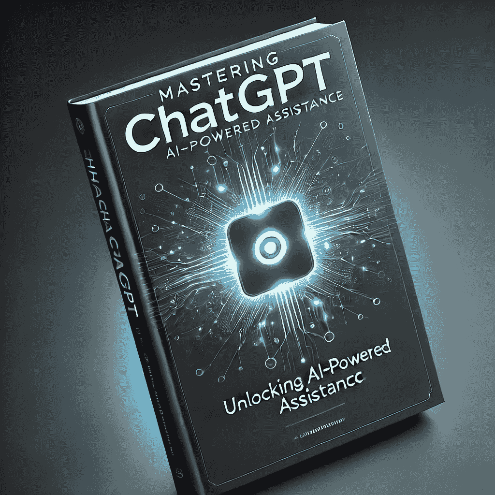

# 精通 ChatGPT：解锁 AI 辅助

> 原文：[Mastering ChatGPT: Unlocking AI-Powered Assistance](https://annas-archive.gl/md5/5c9c8733bc8f397a6c3d51f8eb24516e)
> 
> 译者：[飞龙](https://github.com/wizardforcel)
> 
> 协议：[CC BY-NC-SA 4.0](https://creativecommons.org/licenses/by-nc-sa/4.0/)

如何有效使用 ChatGPT 的全面指南

人工智能（AI）已成为我们日常生活的重要组成部分，重塑了我们的工作、学习和创造方式。在这个领域中，最令人兴奋的工具之一是 ChatGPT，这是由 OpenAI 开发的由 AI 驱动的对话助手。ChatGPT

可以简化复杂任务，帮助你写作、生成想法，甚至解决技术问题。

这本书是您逐步解锁 ChatGPT 全部潜力的指南，教您如何有效地、负责任地、创造性地使用它。无论您是学生、专业人士还是爱好者，这本书都将帮助您掌握 ChatGPT

并充分利用其功能。

什么是 ChatGPT？

ChatGPT 是由 OpenAI 的 GPT 模型驱动的最先进的对话 AI。它被设计成理解自然语言并生成有意义的回应。本质上，它就像拥有一个可以与你几乎任何话题聊天的虚拟助手。

● 来源：建立在 OpenAI 的 GPT

（生成预训练转换器）框架。

● 功能：回答问题、生成文本、解释概念和解决问题。

● 局限性：它可能缺乏实时知识或误解模糊的提示。

要开始使用 ChatGPT，请按照以下步骤操作：

1. 访问 ChatGPT：访问 OpenAI 的网站或下载移动应用程序。

2. 创建账户：使用你的电子邮件、Google 或 Microsoft 账户注册。

3. 选择计划：提供免费和订阅计划，提供不同级别的访问和响应速度。

一旦设置好，你就可以开始聊天了！

如何提出有效的问题

从 ChatGPT 中获得最佳效果的关键在于你如何构建你的问题。

● 具体化：避免模糊的请求。

不要说“告诉我关于历史”，而是尝试，

“解释美国独立战争的原因。”

● 提供背景：添加背景细节以获得更清晰的回应。

● 提出后续问题：如果初始回应不完整，细化您的查询。

ChatGPT 用于学习 ChatGPT 可以充当你的虚拟导师，帮助你高效学习。

● 摘要：请求书籍、文章或概念的摘要。

● 解释：请求对主题的简单或详细解释。

● 练习题：按需生成测验或学习材料。

示例：

“用简单的话解释勾股定理。”

ChatGPT 用于写作：无论你是写论文、故事还是专业邮件，ChatGPT 都是一个多功能的工具。

● 思维风暴：为话题、人物或情节线生成想法。

● 起草：快速撰写论文、报告或创意内容。

● 编辑：请求 ChatGPT 改进或重述你的草稿。

小贴士：始终校对 AI 生成的文本以确保准确性和语气。

ChatGPT 用于工作

专业人士可以利用 ChatGPT 简化任务：

● 邮件辅助：起草礼貌和专业的邮件。

● 报告与演示：生成结构化的提纲和幻灯片。

● 生产工具：使用 ChatGPT 进行日程安排、会议记录和工作流程优化。

ChatGPT 为开发者

ChatGPT 来改进他们的

生产力：

● 代码生成：请求特定任务的代码片段。

● 调试：识别和修复代码中的错误。

● 学习：理解编程概念或探索新的语言。

示例：

“编写一个 Python 函数来计算一个数字的阶乘。”

创意应用

用 ChatGPT 释放您的创造力：

● 诗歌和歌词：生成韵律、诗篇和歌曲。

● 故事和剧本：开发角色、情节转折或对话。

● 艺术灵感：为项目、手工艺品或设计获得灵感。

实际日常用途 ChatGPT 可以简化日常生活：

● 活动策划：组织婚礼、生日或假日。

● 推荐服务：根据您的偏好找到书籍、电影或餐厅。

● 解释概念：为儿童或初学者分解复杂主题。

道德和负责任的使用

负责任地使用 ChatGPT 确保良好的体验：

● 避免错误信息：核实事实和来源。

● 防止有害使用：不要将 ChatGPT 用于恶意目的。

● 理解偏见：AI 可以反映其训练数据中存在的偏见。

故障排除技巧有时，ChatGPT 可能无法按预期运行。以下是解决问题的方法：

● 重新表述您的查询：澄清或简化您的请求。

● 分解问题：一次问一个问题。

● 调整期望：记住 ChatGPT 并不完美。

高级功能和

插件

高级用户可以探索 ChatGPT 的全部潜力：

● API 集成：使用 OpenAI 的 API 构建自定义应用程序。

● 第三方工具：连接 ChatGPT

使用像 Notion 或 Slack 这样的应用程序。

● 定制指令：通过特定设置调整 ChatGPT 的行为。

探索 ChatGPT

替代方案

虽然 ChatGPT 功能强大，但其他 AI 工具可能更适合您的需求：

● 竞争对手：谷歌的 Bard，Anthropic 的 Claude。

● 专用工具：用于图形设计、视频编辑等的 AI。

选择与您的目标相符的工具。

用户故事

下面是人们如何使用 ChatGPT 的例子：

● 学生：“我使用 ChatGPT 来总结课堂笔记。”

● 专业人士：“ChatGPT 几分钟内就能起草我的周报。”

● 创意人士：“它帮助我发展小说的想法。”

常见挑战

即使有它的优点，ChatGPT 也有其局限性：

● 模糊性：误解不清晰的提示。

● 复杂性：在高度技术性或细微的话题上遇到困难。

● 过时知识：可能不包括最新的信息。

人工智能和 ChatGPT 的未来

人工智能的演变正在塑造行业：

● 趋势：在教育、医疗保健和客户服务中的集成。

● 未来目标：提高准确性、减少偏见和增强创造力。

● 机会：了解如何通过关注 AI 趋势来受益。

最终技巧和窍门用这些专业技巧掌握 ChatGPT：

● 尝试：测试不同的方法，看看什么有效。

● 保存输出：保留有用的响应以供将来参考。

● 保持信息更新：关注 OpenAI 的更新和新功能。

结论与行动呼吁

ChatGPT 是一个开创性的工具，它赋予用户学习、创造和解决问题的能力。通过掌握其使用方法，您可以解锁无限的可能性。探索、实验，拥抱 AI 辅助功能的未来。

准备开始了吗？让 ChatGPT 成为您创新和效率的终极合作伙伴。

# 文档大纲

+   掌握 ChatGPT：解锁 AI 辅助功能

    +   ChatGPT 有效使用指南

        +   什么是 ChatGPT？

        +   如何提出有效的问题

        +   ChatGPT 用于学习

        +   ChatGPT 用于写作

        +   ChatGPT 用于工作

        +   ChatGPT 用于编码

        +   创意应用

        +   实用日常用途

        +   道德和负责任的使用

        +   故障排除技巧

        +   高级功能和插件

        +   探索 ChatGPT 替代方案

        +   用户故事

        +   常见挑战

        +   AI 和 ChatGPT 的未来

        +   最终技巧和窍门

        +   结论与行动呼吁
