# （一）


# 序言

本书以介绍生成式 AI 领域开始，重点是使用机器学习算法创建新的独特数据或内容。它涵盖了生成式 AI 模型的基础知识，并解释了这些模型如何训练以生成新数据。

之后，它着重于 ChatGPT 如何提升生产力和增强创造力的具体用例。它还探讨了如何通过改进提示设计和利用零、一、和少次学习能力来充分利用 ChatGPT 互动。

本书随后对之前按领域聚类的用例进行了详细介绍：营销人员、研究人员和开发人员/数据科学家。每个领域将涵盖四个具体的用例，您可以轻松地自行复制。

然后，从个别用例开始，本书转向利用 Azure 基础设施上可用的 OpenAI 模型 API 的企业级场景。本书还将重点关注现有客户故事的端到端场景，以及负责任的 AI 影响。

最后，本书将回顾迄今讨论的主要要点，并反思生成式 AI 领域接下来的发展方向。

通过本书，您将掌握深入研究生成式 AI 领域并开始在自己的项目中使用 ChatGPT 和 OpenAI 模型 API 的知识。

# 本书适合谁

本书面向广泛的读者群体。它适用于对使用 ChatGPT 和 OpenAI 提高日常生产力以及深入了解 ChatGPT 背后的技术和模型架构感兴趣的一般用户。它也适用于希望深入了解 ChatGPT 和 OpenAI 模型在现实世界应用中的商业用户，并了解它们如何赋能其组织。本书还适用于希望深入了解 ChatGPT 和 OpenAI 模型如何提升其 ML 模型和代码的数据科学家和开发人员，以及希望深入了解其领域中 OpenAI 和 ChatGPT 用例的营销人员和研究人员。

由于本书提供了 OpenAI 模型背后的技术和生成式 AI 主要概念的理论概述，因此阅读本书并无特殊要求。如果您还对实施实际用例感兴趣，我们提供了端到端的解决方案和相关 Python 代码，以及逐步实施说明。

# 本书涵盖了什么内容

*第一章*，*生成式 AI 简介*，提供了生成式 AI 领域的概述，重点是使用机器学习算法创建新的独特数据或内容。它涵盖了生成式 AI 模型的基础知识，并解释了这些模型如何训练以生成新数据。该章节还着重介绍了生成式 AI 在各个领域的应用，如图像合成、文本生成和音乐创作，突出了生成式 AI 在革新各行业中的潜力。

*第二章*，*OpenAI 和 ChatGPT – 超越市场炒作*，概述了 OpenAI 及其最显著的发展 ChatGPT，重点介绍其历史、技术和能力。本章还关注了 ChatGPT 如何在各行业和应用中使用，以改善沟通和自动化流程，最终如何影响技术领域及其他领域。

*第三章*，*熟悉 ChatGPT*，指导您如何设置 ChatGPT 账户并开始使用该服务。还将介绍如何与 Web UI 交互，如何根据主题组织聊天，以及如何构建对话。

*第四章*，*理解提示设计*，着重介绍了提示设计的重要性作为提高模型准确性的技术。实际上，提示对模型生成的输出有很大影响。一个设计良好的提示可以帮助引导模型生成相关和准确的输出，而一个设计不当的提示可能是无关或令人困惑的。最后，还重要的是在提示中实施道德考虑，以防止模型生成有害内容。

*第五章*，*ChatGPT 提升日常工作效率*，介绍了 ChatGPT 可以为普通用户在日常生活中做的主要活动，提高用户的生产力。本章将重点介绍写作辅助、决策制定、创意灵感等具体示例，让您可以自己尝试。

*第六章*，*与 ChatGPT 共同开发未来*，着重介绍了开发人员如何利用 ChatGPT。本章将重点关注 ChatGPT 在这一领域可以解决的主要用例，包括代码审查和优化、文档生成和代码生成。本章将提供示例，并让您尝试自己的提示。

*第七章*，*ChatGPT 精通营销*，着重介绍了营销人员如何利用 ChatGPT。本章将重点关注 ChatGPT 在这一领域可以解决的主要用例，包括 A/B 测试、关键词定位建议和社交媒体情感分析。本章将提供示例，并让您尝试自己的提示。

*第八章*，*ChatGPT 改变研究方式*，着重介绍了研究人员如何利用 ChatGPT。本章将重点关注 ChatGPT 在这一领域可以解决的主要用例，包括文献综述、实验设计和参考文献生成。本章将提供示例，并让您尝试自己的提示。

*第九章*，*OpenAI 和 ChatGPT 企业版 – 介绍 Azure OpenAI*，着重介绍了 OpenAI 模型在企业级应用中的应用，介绍了 Azure OpenAI 服务。我们将概述 Azure OpenAI 服务的模型 API 以及如何将其嵌入自定义代码中。我们还将关注模型参数、配置和微调。最后，我们将对负责任人工智能的主题进行一些考虑，以确保您的人工智能系统符合道德标准。

*第十章*，*企业的热门用例*，以当前市场上企业正在开发的使用 Azure OpenAI 的最热门用例概述开始。我们将探讨项目的具体示例，如智能搜索引擎、人工智能助手和报告生成器。最后，我们将专注于特定行业的端到端生产项目。

*第十一章*，*结语和最终思考*，以对前几章中探讨的最热门用例进行简短回顾开始。然后，我们将转向一些关于生成式人工智能对行业和日常生活影响的考虑。我们还将了解道德考虑和负责任人工智能在项目设计阶段的作用。本章将以一些关于生成式人工智能未来发展的最终思考结束，GPT-4 即将推出。

# 要充分利用本书

这里是您需要准备的清单：

| **书中涵盖的软件/硬件** | **系统要求** |
| --- | --- |
| Python 3.7.1 或更高版本 | Windows、macOS 或 Linux |
| Streamlit | Windows、macOS 或 Linux |
| LangChain | Windows、macOS 或 Linux |
| OpenAI 模型 API | OpenAI 账户 |
| Azure OpenAI 服务 | 已启用 Azure OpenAI 的 Azure 订阅 |

与往常一样，您可以在书的 GitHub 存储库中找到所有章节中使用的提示：[`github.com/PacktPublishing/Modern-Generative-AI-with-ChatGPT-and-OpenAI-Models/tree/main/Chapter%204%20-%20Prompt%20design`](https://github.com/PacktPublishing/Modern-Generative-AI-with-ChatGPT-and-OpenAI-Models/tree/main/Chapter%204%20-%20Prompt%20design)

**如果您使用本书的数字版本，我们建议您自己输入代码或从书的 GitHub 存储库中访问代码（链接在下一节中提供）。这样做将有助于避免与复制粘贴代码相关的任何潜在错误**。

# 下载示例代码文件

您可以从 GitHub 下载本书的示例代码文件：[`github.com/PacktPublishing/Modern-Generative-AI-with-ChatGPT-and-OpenAI-Models`](https://github.com/PacktPublishing/Modern-Generative-AI-with-ChatGPT-and-OpenAI-Models)。如果代码有更新，将在 GitHub 存储库中更新。

我们还提供来自我们丰富书籍和视频目录的其他代码包，可在[`github.com/PacktPublishing/`](https://github.com/PacktPublishing/)上找到。快来看看吧！

# 下载彩色图片

我们还提供一份 PDF 文件，其中包含本书中使用的屏幕截图和图表的彩色图片。您可以在此处下载：[`packt.link/YFTZk`](https://packt.link/YFTZk)。

# 使用的约定

本书中使用了许多文本约定。

`文本中的代码`：表示文本中的代码词、数据库表名、文件夹名、文件名、文件扩展名、路径名、虚拟 URL、用户输入和 Twitter 句柄。这里有一个例子：“将下载的`WebStorm-10*.dmg`磁盘映像文件挂载为系统中的另一个磁盘。”

代码块设置如下：

```
query = st.text_area("Ask a question about the document")
if query:
    docs = faiss_index.similarity_search(query, k=1)
    button = st.button("Submit")
    if button:
        st.write(get_answer(faiss_index, query))
```

任何命令���输入或输出都将如下所示：

```
pip install --upgrade openai
```

**粗体**：表示新术语、重要单词或屏幕上看到的单词。例如，菜单或对话框中的单词以**粗体**显示。这里有一个例子：“您可以选择通过选择**本地文件**或**Azure blob 或其他共享** **网络位置**来上传文件。”

提示或重要说明

显示如此。

# 联系我们

我们始终欢迎读者的反馈意见。

**一般反馈**：如果您对本书的任何方面有疑问，请通过电子邮件 customercare@packtpub.com 与我们联系，并在消息主题中提及书名。

**勘误**：尽管我们已经尽最大努力确保内容的准确性，但错误确实会发生。如果您在本书中发现错误，我们将不胜感激您向我们报告。请访问[www.packtpub.com/support/errata](http://www.packtpub.com/support/errata)并填写表格。

**盗版**：如果您在互联网上发现我们作品的任何形式的非法副本，我们将不胜感激您向我们提供位置地址或网站名称。请通过链接 copyright@packt.com 与我们联系。

**如果您有兴趣成为作者**：如果您在某个专题上有专业知识，并且有兴趣撰写或为书籍做出贡献，请访问[authors.packtpub.com](http://authors.packtpub.com)。

# 分享您的想法

一旦您阅读了*使用 ChatGPT 和 OpenAI 模型进行现代生成式 AI*，我们很乐意听取您的想法！请[点击此处直接转到亚马逊评论页面](https://packt.link/r/1805123335)并分享您的反馈。

您的评论对我们和技术社区至关重要，将帮助我们确保我们提供的是优质内容。

# 下载这本书的免费 PDF 副本

感谢购买本书！

您喜欢随时随地阅读，但无法随身携带印刷书籍吗？您购买的电子书与您选择的设备不兼容吗？

别担心，现在每本 Packt 书籍都附带一份无 DRM 保护的 PDF 版本，无需额外费用。

随时随地，在任何设备上阅读。直接从您喜爱的技术书籍中搜索、复制和粘贴代码到您的应用程序中。

福利不止于此，您还可以独家获得折扣、新闻简报和每天在您的收件箱中获取优质免费内容

按照以下简单步骤获取这些福利：

1.  扫描下方的二维码或访问以下链接


[`packt.link/free-ebook/9781805123330`](https://packt.link/free-ebook/9781805123330)

1.  提交您的购买凭证

1.  就是这样！我们将把免费的 PDF 和其他福利直接发送到您的电子邮件中


# 第一部分：生成式人工智能和 GPT 模型的基础知识

在本书的*第一部分*中，介绍了生成式人工智能和 GPT 模型的基础知识，包括 OpenAI 及其旗舰模型系列 GPT 的简要发展历史。

本部分以生成式人工智能领域的概述开始，为您提供关于这一 AI 研究领域的基础知识，包括其历史和最新发展。您还将熟悉生成式人工智能的应用，从文本生成到音乐创作。

*第一部分*介绍了将生成式人工智能的力量带给大众的公司：OpenAI。您将熟悉 OpenAI 最受欢迎发布的技术背后的技术——ChatGPT，并了解从**人工神经网络**（**ANNs**）起步，发展到**大型语言模型**（**LLMs**）的研究历程。

本部分包括以下章节：

+   *第一章*，*生成式人工智能简介*

+   *第二章*，*OpenAI 和 ChatGPT 超越市场炒作*


# 1

# 生成式人工智能简介

你好！欢迎来到*ChatGPT 和 OpenAI 模型的现代生成式人工智能*！在本书中，我们将探索生成式**人工智能**（**AI**）及其开创性应用的迷人世界。生成式人工智能已经改变了我们与机器互动的方式，使计算机能够在没有明确人类指导的情况下创建、预测和学习。通过 ChatGPT 和 OpenAI，我们见证了自然语言处理、图像和视频合成等领域的前所未有的进步。无论您是一个好奇的初学者还是一个经验丰富的从业者，本指南将为您提供了解和掌握生成式人工智能激动人心的领域所需的知识和技能。让我们开始并从我们所处的背景的一些定义开始。

本章概述了生成式人工智能领域，该领域利用**机器学习**（**ML**）算法创建新的独特数据或内容。

它专注于将生成式人工智能应用于各个领域，如图像合成、文本生成和音乐创作，突出了生成式人工智能革新各行业的潜力。这个生成式人工智能的介绍将为您提供这项技术所处的背景，以及将其置于人工智能、机器学习和**深度学习**（**DL**）的广阔世界中的知识。然后，我们将深入探讨生成式人工智能的主要应用领域，提供具体示例和最新发展，以便您熟悉它可能对企业和社会产生的影响。

此外，了解研究生成式人工智能的当前最新技术发展历程将帮助您更好地理解最近发展和最新模型的基础。

我们将涵盖以下主题：

+   理解生成式人工智能

+   探索生成式人工智能的领域

+   生成式人工智能研究的历史和当前状态

通过本章结束时，您将熟悉生成式人工智能这个激动人心的世界，它的应用、背后的研究历史以及当前的发展，这些发展可能对企业产生影响，目前也正在产生影响。

# 介绍生成式人工智能

AI 在近年来取得了显著进展，其中一个发展迅速的领域是生成式人工智能。生成式人工智能是人工智能和深度学习的一个子领域，专注于利用机器学习技术在现有数据上训练的算法和模型生成新内容，如图像、文本、音乐和视频。

为了更好地理解人工智能、机器学习、深度学习和生成式人工智能之间的关系，请将人工智能视为基础，而机器学习、深度学习和生成式人工智能代表着越来越专业化和专注的研究和应用领域：

+   人工智能代表着创造能够执行任务、展示人类智能和能力并能够与生态系统互动的系统的广泛领域。

+   机器学习是一个专注于创建算法和模型的分支，使这些系统能够通过时间和训练学习和改进自己。机器学习模型从现有数据中学习，并在其*成长*过程中自动更新其参数。

+   深度学习（DL）是机器学习（ML）的一个子分支，因为它包含深度学习模型。这些深度模型被称为**神经网络**，特别适用于**计算机视觉**或**自然语言处理**（**NLP**）等领域。当我们谈论机器学习和深度学习模型时，我们通常指的是判别模型，其目的是在数据之上进行预测或推断模式。

+   最后，我们来到生成式人工智能，这是深度学习的进一步子���支，它不使用深度神经网络来对现有数据进行聚类、分类或预测：它使用这些强大的神经网络模型来生成全新的内容，从图像到自然语言，从音乐到视频。

以下图显示了这些研究领域之间的关系：

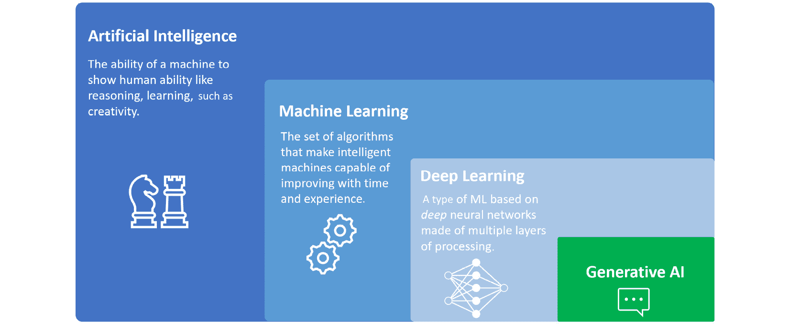

图 1.1 – 人工智能、机器学习、深度学习和生成式人工智能之间的关系

生成式人工智能模型可以在大量数据上进行训练，然后可以使用该数据中的模式从头开始生成新的示例。这种生成过程与判别模型不同，后者被训练用于预测给定示例的类别或标签。

## 生成式人工智能领域

近年来，生成式人工智能取得了重大进展，并将其应用扩展到了各种领域，如艺术、音乐、时尚、建筑等等。在其中一些领域，它确实正在改变我们创造、设计和理解周围世界的方式。在其他领域，它正在改进并使现有的流程和操作更加高效。

生成式人工智能应用于许多领域的事实也意味着其模型可以处理不同类型的数据，从自然语言到音频或图像。让我们了解生成式人工智能模型如何处理不同类型的数据和领域。

## 文本生成

生成式人工智能（generative AI）最伟大的应用之一——也是我们在本书中将要重点介绍的——是其能够以自然语言生成新内容的能力。事实上，生成式人工智能算法可以用于生成新的文本，如文章、诗歌和产品描述。

例如，OpenAI 开发的 GPT-3 等语言模型可以在大量文本数据上进行训练，然后用于生成新的、连贯且语法正确的文本，包括不同语言（输入和输出），以及从文本中提取关键词、主题或完整摘要等相关特征。

这是一个使用 GPT-3 的示例：

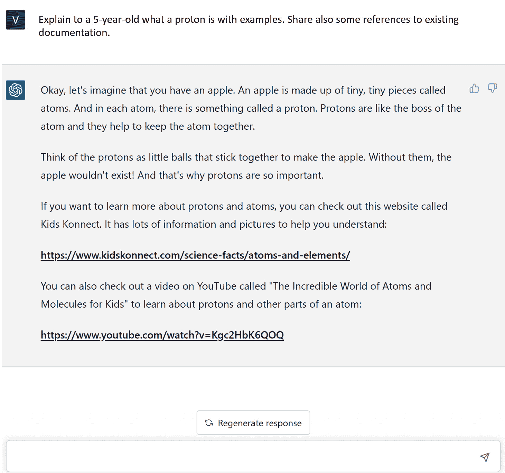

图 1.2 – ChatGPT 响应用户提示的示例，并添加参考资料

接下来，我们将继续讨论图像生成。

## 图像生成

在图像合成中，最早且最知名的生成式 AI 示例之一是 2014 年 I. Goodfellow 等人发表的论文中介绍的**生成对抗网络**（**GAN**）架构，*生成对抗网络*。GAN 的目的是生成与真实图像难以区分的逼真图像。这种能力有一些有趣的商业应用，如为训练计算机视觉模型生成合成数据集，生成逼真的产品图像，以及为虚拟现实和增强现实应用生成逼真图像。

这里是一些由 AI 完全生成的不存在的人脸的例子：


图 1.3 – GAN StyleGAN2 生成的虚构面孔，网址为 https://this-person-does-not-exist.com/en

然后，在 2021 年，OpenAI 在这一领域推出了一种新的生成式 AI 模型，**DALL-E**。与 GAN 不同，DALL-E 模型旨在根据自然语言描述生成图像（GAN 以随机噪声向量作为输入），可以生成各种图像，这些图像可能看起来不太真实，但仍描绘出所需的概念。

DALL-E 在广告、产品设计、时尚等创意产业中具有巨大潜力，可以创造独特和创意的图像。

在这里，你可以看到 DALL-E 生成四幅图像的例子，从一个自然语言请求开始：

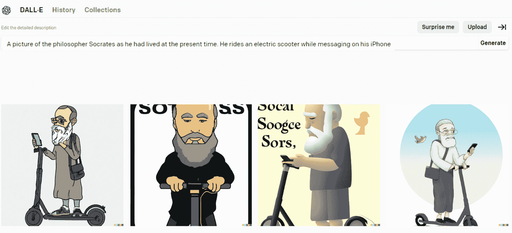

图 1.4 – DALL-E 生成的图像，以自然语言提示作为输入

请注意，文本和图像生成可以结合起来产生全新的材料。近年来，广泛使用这种组合的新 AI 工具已经出现。

一个例子是 Tome AI，一种生成式叙事格式，除了其能力外，还能从头开始创建幻灯片，利用诸如 DALL-E 和 GPT-3 的模型。

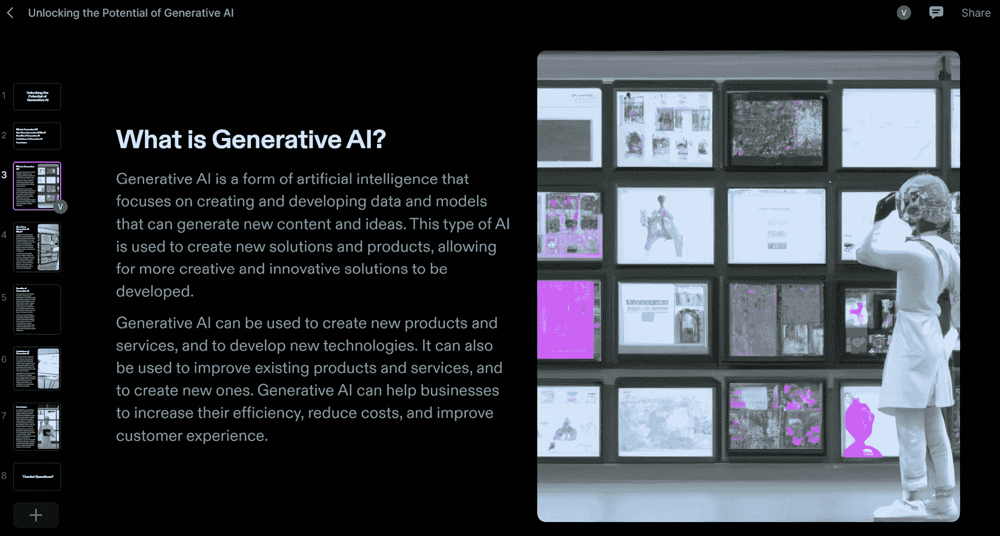

图 1.5 – 一份关于生成式 AI 的演示，完全由 Tome 生成，使用自然语言输入

正如你所看到的，前述的 AI 工具完全能够根据我在自然语言中的简短输入创建一份草稿演示。

## 音乐生成

生成音乐的生成式人工智能的最初方法可以追溯到 50 年代，在算法作曲领域的研究中，这种技术使用算法生成音乐作品。事实上，1957 年，Lejaren Hiller 和 Leonard Isaacson 创作了《Illiac Suite for String Quartet》([`www.youtube.com/watch?v=n0njBFLQSk8`](https://www.youtube.com/watch?v=n0njBFLQSk8))，这是由 AI 完全创作的第一首音乐作品。从那时起，生成音乐的生成式人工智能领域一直是持续研究的课题。在近年的发展中，新的架构和框架已经在普通大众中广泛传播，例如谷歌在 2016 年推出的 WaveNet 架构，能够生成高质量的音频样本，或者由谷歌开发的 Magenta 项目，该项目使用**循环神经网络**（**RNNs**）和其他机器学习技术来生成音乐和其他形式的艺术。然后，在 2020 年，OpenAI 还宣布了 Jukebox，这是一个能够生成音乐的神经网络，可以根据音乐和声音风格、流派、参考艺术家等进行输出定制。

这些以及其他框架成为许多生成音乐 AI 作曲助手的基础。一个例子是由索尼 CSL 研究开发的 Flow Machines。这个生成式人工智能系统在大量音乐作品数据库上进行训练，以在各种风格中创作新音乐。法国作曲家 Benoît Carré使用它创作了一张名为*Hello World*的专辑([`www.helloworldalbum.net/`](https://www.helloworldalbum.net/))，其中与几位人类音乐家合作。

在这里，你可以看到一个完全由 Magenta 项目中的 Music Transformer 模型生成的曲目的示例：

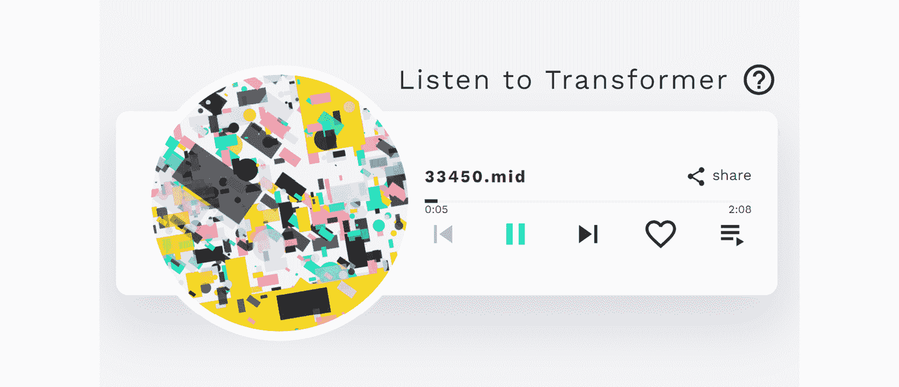

图 1.6 – Music Transformer 允许用户听取由 AI 生成的音乐表演

另一个音乐领域内生成式人工智能的令人难以置信的应用是语音合成。事实上，可以找到许多能够根据文本输入以知名歌手的声音创建音频的 AI 工具。

例如，如果你一直想知道如果 Kanye West 演唱你的歌曲会是什么样子，那么现在你可以通过诸如 FakeYou.com ([`fakeyou.com/`](https://fakeyou.com/))、Deep Fake Text to Speech 或 UberDuck.ai ([`uberduck.ai/`](https://uberduck.ai/))等工具实现你的梦想。

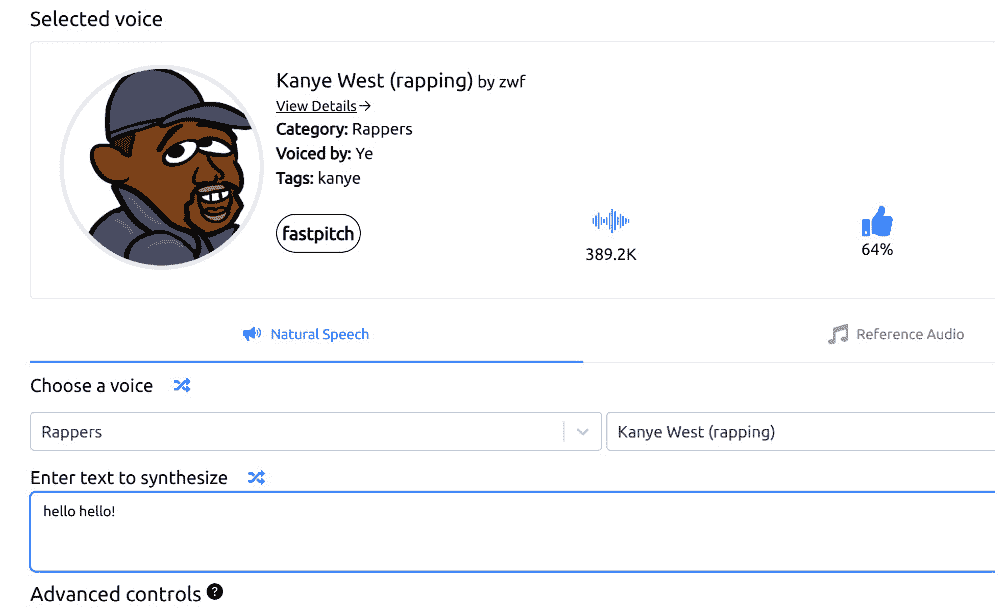

图 1.7 – 使用 UberDuck.ai 进行文本转语音合成

我必须说，结果真的令人印象深刻。如果你想玩得开心，你也可以尝试你所有最喜爱的卡通人物的声音，比如小熊维尼...

接下来，我们将看到用于视频的生成式人工智能。

## 视频生成

视频生成的生成式人工智能与图像生成有着类似的发展时间线。事实上，在视频生成领域的关键发展之一就是 GANs 的发展。由于它们在生成逼真图像方面的准确性，研究人员开始将这些技术应用于视频生成。基于 GAN 的视频生成的最显著例子之一是 DeepMind 的**Motion to Video**，它可以从单个图像和一系列动作生成高质量的视频。另一个很好的例子是 NVIDIA 的**Video-to-Video Synthesis**（**Vid2Vid**）DL 框架，它使用 GANs 从输入视频中合成高质量的视频。

Vid2Vid 系统可以生成时间上连贯的视频，这意味着它们在时间上保持平滑和逼真的运动。这项技术可以用于执行各种视频合成任务，例如：

+   将一个领域的视频转换为另一个领域（例如，将白天视频转换为夜晚视频或将素描转换为逼真图像）

+   修改现有视频（例如，更改视频中物体的风格或外观）

+   从静态图像创建新视频（例如，将一系列静止图像制作成动画）

在 2022 年 9 月，Meta 的研究人员宣布了**Make-A-Video**（[`makeavideo.studio/`](https://makeavideo.studio/)）的普遍可用性，这是一个新的人工智能系统，允许用户将他们的自然语言提示转换为视频片段。在这样的技术背后，你可以认出我们迄今为止提到的许多其他领域的模型 - 用于提示的语言理解，图像和运动生成与图像生成，以及由 AI 作曲家制作的背景音乐。

总的来说，生成式人工智能多年来已经影响了许多领域，并且一些人工智能工具已经持续支持艺术家、组织和一般用户。未来看起来非常有前途；然而，在跳入当今市场上最终模型之前，我们首先需要更深入地了解生成式人工智能的根源、其研究历史以及最终导致当前 OpenAI 模型的最新发展。

# 研究的历史和当前状态

在前几节中，我们概述了生成式人工智能领域中最新和尖端的技术，这些技术都是近年来开发的。然而，这一领域的研究可以追溯到几十年前。

我们可以将生成 AI 领域的研究始于 20 世纪 60 年代，当时 Joseph Weizenbaum 开发了聊天机器人 ELIZA，这是 NLP 系统的最早例子之一。它是一个简单的基于规则的交互系统，旨在通过基于文本输入的响应来娱乐用户，并为 NLP 和生成 AI 的进一步发展铺平了道路。然而，我们知道现代生成 AI 是 DL 的一个子领域，尽管最早的**人工神经网络**（**ANNs**）最早是在 20 世纪 40 年代引入的，研究人员面临着一些挑战，包括有限的计算能力和对大脑生物学基础的理解不足。因此，直到 20 世纪 80 年代，随着新硬件和神经科学的发展，**反向传播**算法的出现促进了 ANNs 的训练阶段。事实上，在反向传播算法出现之前，训练神经网络是困难的，因为无法有效地计算与每个神经元相关的参数或权重的误差梯度，而反向传播使得自动化训练过程成为可能，并实现了 ANNs 的应用。

然后，到了 21 世纪初和 2010 年代，计算能力的进步，加上大量可用于训练的数据，使得 DL 更加实用和普及，随之而来的是研究的提升。

2013 年，Kingma 和 Welling 在他们的论文*自动编码变分贝叶斯*中引入了一种新的模型架构，称为**变分自编码器**（**VAEs**）。VAEs 是基于变分推断概念的生成模型。它们通过将数据编码为称为**潜在空间**（具有*编码器*组件）的低维空间，然后将其解码回原始数据空间（具有*解码器*组件）的方式提供了一种学习的方法。

VAE 的关键创新在于引入了潜在空间的概率解释。与学习输入到潜在空间的确定性映射不同，编码器将输入映射到潜在空间上的概率分布。这使得 VAE 能够通过从潜在空间中采样并将样本解码到输入空间中来生成新样本。

举个例子，假设我们想训练一个 VAE，它可以生成看起来像真实的猫和狗的新图片。

为了实现这一点，VAE 首先接收一张猫或狗的图片，并将其压缩成一组较小的数字进入潜在空间，这些数字代表图片的最重要特征。这些数字被称为**潜在变量**。

然后，VAE 获取这些潜在变量，并使用它们创建一幅看起来像真实猫或狗图片的新图片。这幅新图片可能与原始图片有些差异，但它应该看起来像属于同一组图片。

随着时间的推移，通过将生成的图片与真实图片进行比较并调整其潜在变量使生成的图片看起来更像真实图片，VAE 变得更擅长创建逼真的图片。

VAE 为生成式人工智能领域的快速发展铺平了道路。事实上，仅仅 1 年后，Ian Goodfellow 提出了 GAN。与 VAE 架构不同，GAN 由两个神经网络组成 - 生成器和判别器 - 它们在一个零和博弈中相互对抗。

生成器创建假数据（在图像的情况下，它创建一幅新图像），旨在看起来像真实数据（例如，一幅猫的图像）。判别器接收真实数据和假数据，并试图区分它们 - 在我们的艺术赝品制作者示例中，它是*评论家*。

在训练过程中，生成器试图创建可以欺骗判别器认为它是真实的数据，而判别器则试图变得更擅长区分真实数据和假数据。这两部分一起进行训练，这个过程称为**对抗训练**。

随着时间的推移，生成器变得更擅长创建看起来像真实数据的假数据，而判别器则变得更擅长区分真实数据和假数据。最终，生成器变得如此擅长创建假数据，以至于连判别器也无法区分真假数据。

这里是 GAN 完全生成的人脸的一个例子：


图 1.8 - 逼真的 GAN 生成的人脸示例（摘自 2017 年《逐步增长的 GAN 用于提高质量、稳定性和变化性》：https://arxiv.org/pdf/1710.10196.pdf）

VAE 和 GAN 这两种模型旨在生成与原始样本无法区分的全新数据，并且它们的架构自提出以来已经得到改进，与 Van den Oord 及其团队提出的 PixelCNNs 和由 Google DeepMind 开发的 WaveNet 等新模型的发展并行，推动了音频和语音生成的进步。

2017 年另一个重要的里程碑是谷歌研究人员在一篇名为*– Attention Is All You Need*的论文中引入了一种名为*Transformer*的新架构。这在语言生成领域具有革命性意义，因为它允许并行处理同时保留有关语言上下文的记忆，超越了以 RNN 或**长短期记忆**（**LSTM**）框架为基础的语言模型的先前尝试。

变压器确实是谷歌于 2018 年推出的名为**双向编码器表示来自变压器**（**BERT**）的大规模语言模型的基础，并很快成为自然语言处理实验的基准。

变压器也是由 OpenAI 推出的所有**生成式预训练**（**GPT**）模型的基础，包括 ChatGPT 背后的 GPT-3 模型。

尽管在那些年里有大量的研究和成就，但直到 2022 年下半年，公众的注意力才开始转向生成式人工智能领域。

不是偶然的，2022 年被誉为*生成式人工智能之年*。这一年，强大的人工智能模型和工具开始在普通大众中广泛传播：基于扩散的图像服务（MidJourney、DALL-E 2 和 Stable Diffusion）、OpenAI 的 ChatGPT、文本到视频（Make-a-Video 和 Imagen Video）以及文本到 3D（DreamFusion、Magic3D 和 Get3D）工具都向个人用户提供，有时还是免费的。

这对两个主要原因产生了颠覆性影响：

+   一旦生成式人工智能模型普及到公众，每个个人用户或组织都有可能尝试并欣赏其潜力，即使不是数据科学家或机器学习工程师。

+   这些新模型的输出及其内在的创造力在客观上令人惊叹，而且常常令人担忧。对于个人和政府来说，迫切需要适应。

因此，在不久的将来，我们可能会目睹人工智能系统在个人使用和企业级项目中的采用率激增。

# 总结

在本章中，我们探索了生成式人工智能及其各种应用领域，包括图像生成、文本生成、音乐生成和视频生成的令人兴奋的世界。我们了解到 OpenAI 训练的 ChatGPT 和 DALL-E 等生成式人工智能模型如何使用深度学习技术学习大型数据集中的模式，并生成既新颖又连贯的新内容。我们还讨论了生成式人工智能的历史、起源以及当前的研究现状。

本章的目标是为生成式人工智能的基础知识提供坚实的基础，并激励您进一步探索这个迷人的领域。

在下一章中，我们将专注于当今市场上最具前景的技术之一，ChatGPT：我们将深入研究其背后的研究以及 OpenAI 的开发，其模型的架构，以及它目前可以解决的主要用例。

# 参考文献

+   [`arxiv.org/abs/1406.2661`](https://arxiv.org/abs/1406.2661)

+   [`www.youtube.com/watch?v=Iy9vRvyRf_E`](https://www.youtube.com/watch?v=Iy9vRvyRf_E)

+   [`arxiv.org/abs/1912.04958`](https://arxiv.org/abs/1912.04958)

+   *这个人不存在*: [this-person-does-not-exist.com](http://this-person-does-not-exist.com)

+   [`arxiv.org/abs/1808.06601`](https://arxiv.org/abs/1808.06601)

+   [`www.microsoft.com/en-us/research/blog/a-deep-generative-model-trifecta-three-advances-that-work-towards-harnessing-large-scale-power/`](https://www.microsoft.com/en-us/research/blog/a-deep-generative-model-trifecta-three-advances-that-work-towards-harnessing-large-scale-power/)

+   [`tcwang0509.github.io/vid2vid/`](https://tcwang0509.github.io/vid2vid/)


# 2

# OpenAI 和 ChatGPT – 超越市场炒作

本章概述了 OpenAI 及其最显著的发展—ChatGPT，重点介绍其历史、技术和能力。

总体目标是提供 ChatGPT 如何在各个行业和应用中使用以改善沟通和自动化流程的更深入了解，最终，这些应用如何影响技术领域及其他领域。

我们将涵盖以下主题：

+   什么是 OpenAI？

+   OpenAI 模型系列概述

+   ChatGPT 之路：背后模型的数学

+   ChatGPT：最先进技术

# 技术要求

为了能够测试本章中的示例，您需要以下内容：

+   一个 OpenAI 账户，用于访问 Playground 和 Models API（[`openai.com/api/login20`](https://openai.com/api/login20))

+   你喜欢的集成开发环境，比如 Jupyter 或 Visual Studio

+   已安装 Python 3.7.1+（[`www.python.org/downloads`](https://www.python.org/downloads)）

+   `pip`已安装（[`pip.pypa.io/en/stable/installation/`](https://pip.pypa.io/en/stable/installation/)）

+   OpenAI Python 库（[`pypi.org/project/openai/`](https://pypi.org/project/openai/)）

# 什么是 OpenAI？

OpenAI 是由埃隆·马斯克、山姆·奥尔特曼、格雷格·布罗克曼、伊利亚·苏茨克维尔、沃伊切赫·扎雷姆巴和约翰·舒尔曼于 2015 年创立的研究组织。正如 OpenAI 网页上所述，其使命是*“确保人工通用智能（AGI）造福全人类”*。由于是*通用*的，AGI 旨在具有学习和执行各种任务的能力，而无需特定任务的编程。

自 2015 年以来，OpenAI 将研究重点放在**深度强化学习**（**DRL**）上，这是**机器学习**（**ML**）的一个子集，将**强化学习**（**RL**）与深度神经网络结合起来。该领域的第一个贡献可以追溯到 2016 年，当时该公司发布了 OpenAI Gym，这是一个供研究人员开发和测试**RL**算法的工具包。

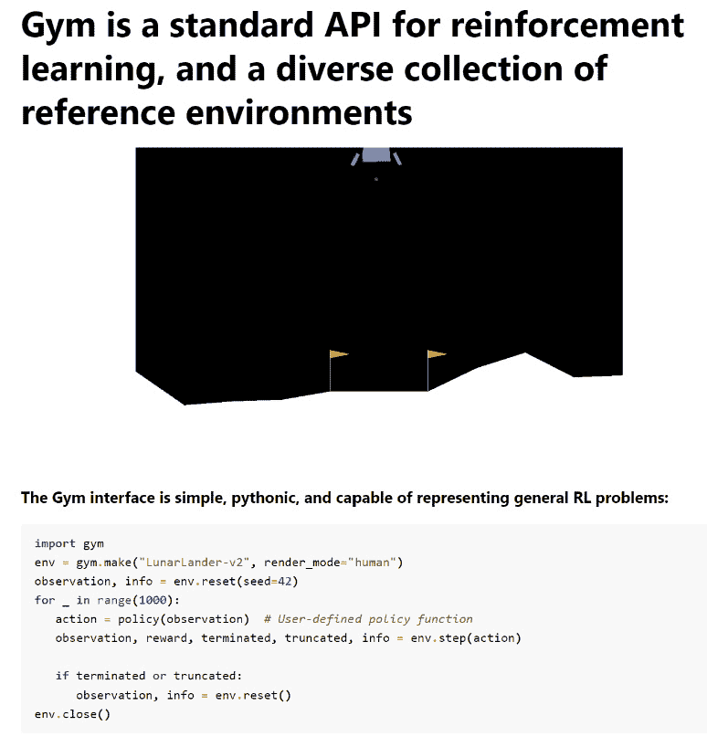

图 2.1 – Gym 文档的首页（https://www.gymlibrary.dev/）

OpenAI 继续在该领域进行研究和贡献，然而其最显著的成就与生成模型有关—**生成式预训练** **变换器**（**GPT**）。

在他们的论文*“通过生成式预训练改进语言理解”*中介绍了模型架构，并将其命名为**GPT-1**，OpenAI 研究人员很快在 2019 年发布了其继任者，GPT-2。这个版本的 GPT 是在一个名为**WebText**的语料库上训练的，当时该语料库包含稍微超过 800 万个文档，总共 40 GB 的文本，这些文本来自 Reddit 提交的 URL，至少有 3 个赞。它有 12 亿个参数，是其前身的十倍。

在这里，您可以看到 HuggingFace 发布的 GPT-2 的 UI 的着陆页（[`transformer.huggingface.co/doc/distil-gpt2`](https://transformer.huggingface.co/doc/distil-gpt2)）：

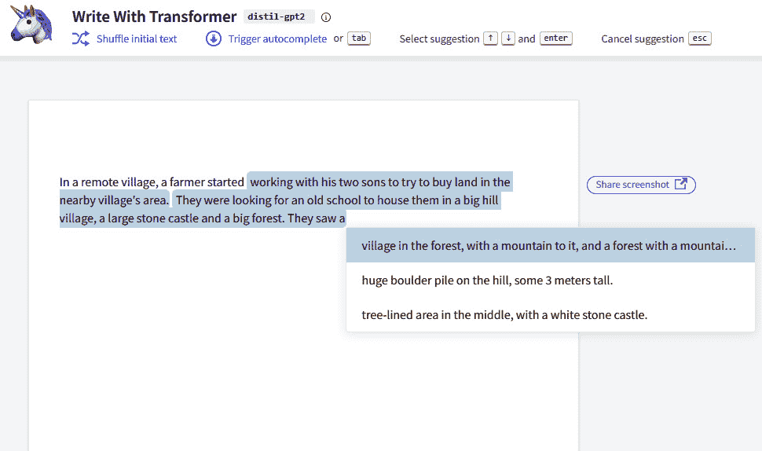

图 2.2 – GPT-2 根据提示撰写段落。来源：https://transformer.huggingface.co/doc/distil-gpt2

然后，在 2020 年，OpenAI 首先宣布，然后发布了 GPT-3，其拥有 1750 亿个参数，显着改善了 GPT-2 的基准结果。

除了自然语言生成模型，OpenAI 还在图像生成领域取得了进展，发布了该领域的第一个模型，名为**DALL-E**，于 2021 年揭示。正如前一章所述，DALL-E 能够根据自然语言输入创建全新的图像，这由最新版本的 GPT-3 解释。

DALL-E 最近升级到其新版本 DALL-E 2，于 2022 年 4 月宣布。

在下图中，您可以看到以自然语言提示**在舒适环境中生成一杯咖啡的逼真图片**为例的 DALL-E 生成的图像：

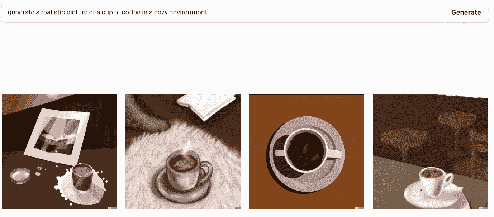

图 2.3 – DALL-E 生成的图像，以自然语言提示为输入

您可以在 OpenAI DALL-E 实验室（[`labs.openai.com/`](https://labs.openai.com/)）尝试生成创意图片，您将获得有限的免费积分进行实验。

尽管 OpenAI 在许多生成 AI 领域进行了投资，但其在文本理解和生成方面的贡献卓越，这要归功于我们将在接下来的段落中探讨的基础 GPT 模型的发展。

# OpenAI 模型系列概述

今天，OpenAI 提供一组预训练的、可供公众使用的模型。这有两个重要的含义：

+   强大的基础模型可以在不需要长时间和昂贵的训练的情况下使用

+   操纵这些模型并不需要成为数据科学家或 ML 工程师

用户可以在 OpenAI Playground 中测试 OpenAI 模型，这是一个友好的用户界面，您可以与模型进行交互，而无需编写任何代码。

在下面的截图中，您可以看到 OpenAI Playground 的着陆页：

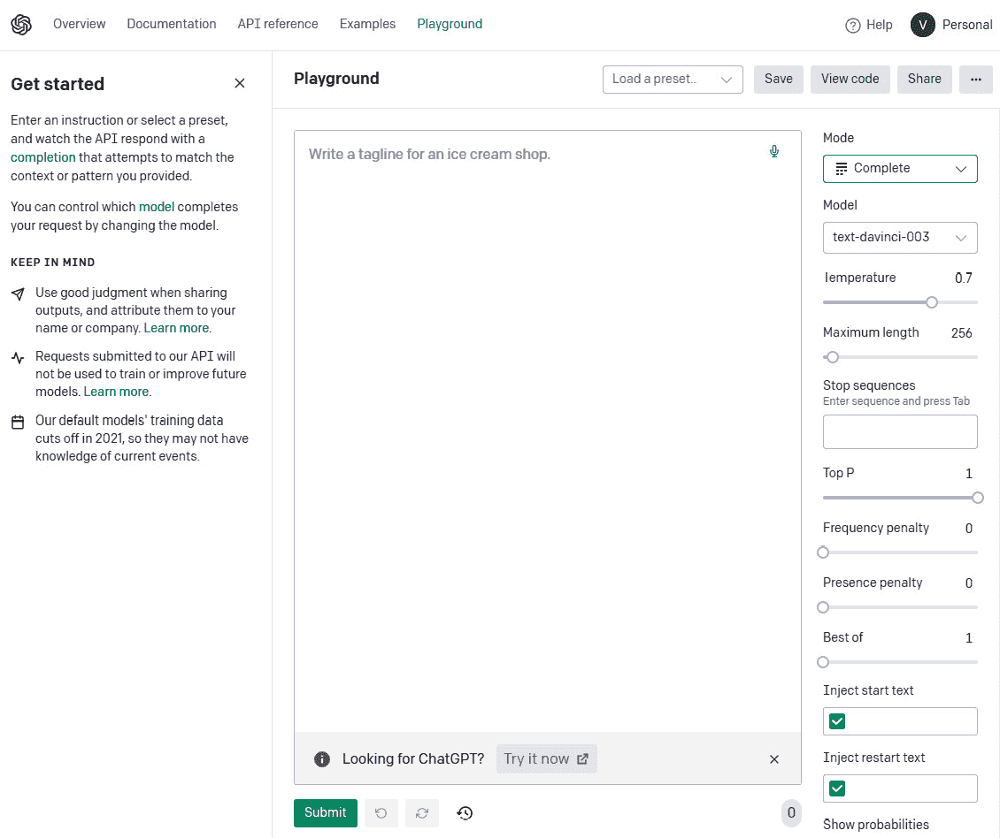

图 2.4 – OpenAI Playground 位于 https://platform.openai.com/playground

正如您从*图 2**.4*中所看到的，Playground 提供了一个用户界面，用户可以在该界面的右侧选择模型开始与之交互。要开始与 Playground 交互，您只需在自然语言的输入空间中键入任何问题或指令。您也可以从 OpenAI 文档中提供的一些示例开始（[`platform.openai.com/examples`](https://platform.openai.com/examples)）。

在深入研究模型系列之前，让我们首先定义一些您将在本章中看到的行话：

+   **标记**：标记可以被视为 API 用于处理输入提示的单词片段或段。与完整单词不同，标记可能包含尾随空格甚至部分子单词。为了更好地理解标记的长度概念，有一些一般性指导原则需要牢记。例如，在英语中，一个标记大约相当于四个字符，或者三分之四个单词。

+   **提示**：在**自然语言处理**（**NLP**）和机器学习的背景下，提示是指作为输入提供给 AI 语言模型以生成响应或输出的文本片段。提示可以是一个问题、一个陈述或一个句子，用于为语言模型提供上下文和指导。

+   **上下文**：在 GPT 领域，上下文指的是用户提示之前的单词和句子。语言模型利用这个上下文来生成最可能的下一个单词或短语，基于训练数据中发现的模式和关系。

+   **模型置信度**：模型置信度指的是 AI 模型对特定预测或输出的确定性或概率水平。在 NLP 的背景下，模型置信度通常用于指示 AI 模型对其生成的响应与给定输入提示的正确性或相关性的信心程度。

上述定义将对理解如何使用 Azure OpenAI 模型系列以及如何配置其参数起到关键作用。

在 Playground 中，有两个主要的模型系列可以进行测试：

+   **GPT-3**：一组能够理解和生成自然语言的模型。GPT-3 已经在大量文本语料库上进行了训练，可以执行各种自然语言任务，如语言翻译、摘要、问答等。这里是一个例子：

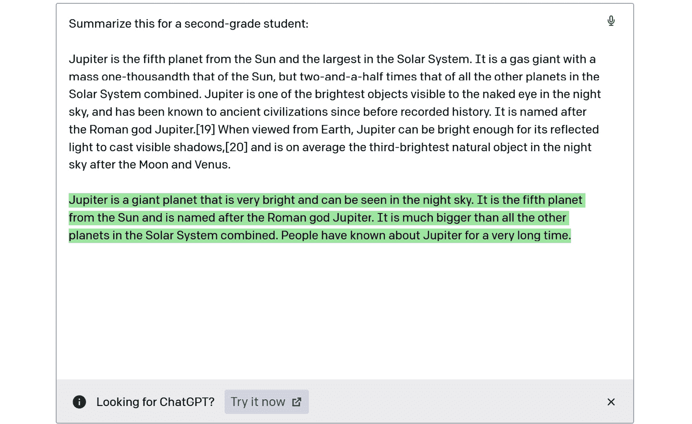

图 2.5 – 使用 GPT-3 进行摘要任务的示例

**GPT-3.5**: 这是在 GPT-3 基础上构建的新一代模型，旨在提高其自然语言理解和生成能力。GPT-3.5 模型可以执行复杂的自然语言任务，如撰写连贯的段落或文章，生成诗歌，甚至以自然语言创建计算机程序。GPT-3.5 是 ChatGPT 背后的模型，在其 API 上，它还可以通过专门的 UI 在 Playground 中消耗：

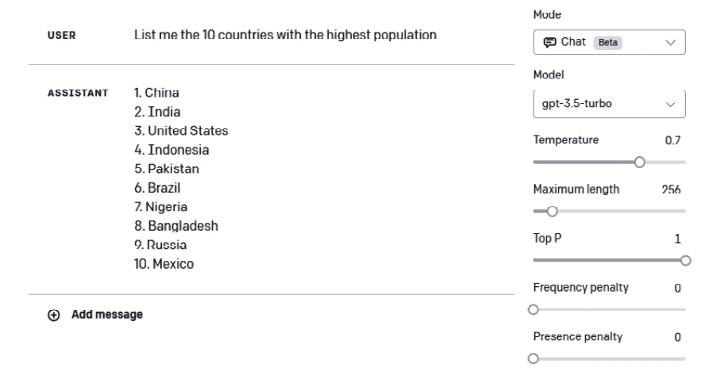

图 2.6 – 使用 GPT-3.5 进行交互的示例

+   **Codex**: 一组能够理解和生成各种编程语言代码的模型。Codex 可以将自然语言提示转换为可运行的代码，使其成为软件开发的强大工具。以下是使用 Codex 的例子：

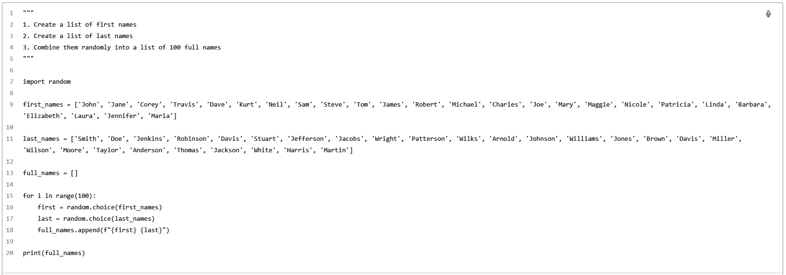

图 2.7 – 使用 Codex 生成代码的示例

注

在 2023 年 3 月，OpenAI 宣布 Codex 模型将从该日期起被弃用。原因是新的聊天模型（包括 ChatGPT 背后的模型 GPT-3.5-turbo）的不可思议的能力，这些模型还可以涵盖编码任务，并且其结果可以达到或甚至超过 Codex 模型的结果。

对于每个模型，你还可以调整一些可配置的参数。以下是一个列表：

+   **温度**（从 0 到 1）：控制模型响应的随机性。低温度使你的模型更加确定性，意味着它会倾向于给出相同的输出作为同样的问题。例如，如果我多次问我的模型，“OpenAI 是什么？”并将温度设置为 0，它总是会给出相同的答案。另一方面，如果我使用温度设置为 1 的模型做同样的事情，它将试图通过措辞和风格在每次都修改它的答案。

+   **最大长度**（从 0 到 2048）：控制模型对用户提示的响应的长度（以标记为单位）。

+   **停止序列**（用户输入）: 这会使得回应在期望的地方结束，比如句子或列表的结尾。

+   **顶部概率**（从 0 到 1）：控制模型在生成回应时将考虑哪些标记。将其设置为 0.9 将考虑所有可能标记中最有可能的前 90%。也许你会问，“为什么不将顶部概率设置为 1，这样就可以选择所有最有可能的标记？”答案是用户可能仍然希望在模型信心较低时保持多样性，即使在得分最高的标记中。

+   **频率惩罚**（从 0 到 1）：控制生成的回应中相同标记的重复频率。惩罚越高，出现相同标记在回应中的概率就越低。该惩罚通过标记在文本中迄今为止出现的频率来比例减少概率（这是与下一个参数的关键区别）。

+   **存在惩罚**（范围从 0 到 2）：这类似于上一个，但更严格。它减少了出现在文本中的任何一个标记的重复机会。由于比频率惩罚更严格，存在惩罚也增加了在回应中引入新主题的可能性。

+   **最佳**（范围从 0 到 20）：这将生成多个回应，并仅显示所有标记的总概率最佳的回应。

+   **回应前后文本**（用户输入）：这在模型回应之前和之后插入文本。这可以帮助模型准备回应。

除了在 Playground 中尝试 OpenAI 模型，您还可以在自定义代码中调用模型 API 并将模型嵌入到您的应用程序中。实际上，在 Playground 的右上角，您可以点击**查看代码**并导出如下所示的配置：

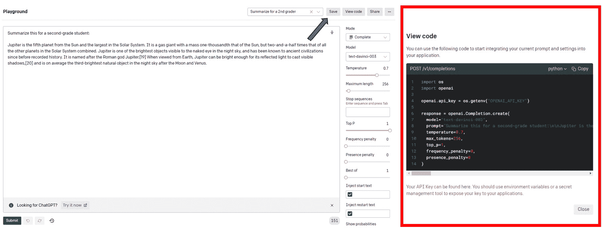

图 2.8 - 使用自然语言提示调用 GPT3 模型的 Python 代码

如您从前述屏幕截图中所见，该代码导出了您在 Playground 中设置的参数配置。

现在，您可以通过在终端中使用`pip install openai`来安装 Python 中的 OpenAI 库来开始使用。为了使用模型，您需要生成一个 API 密钥。您可以在您的账户设置中找到您的 API 密钥（[`platform.openai.com/account/api-keys`](https://platform.openai.com/account/api-keys)），如下所示：

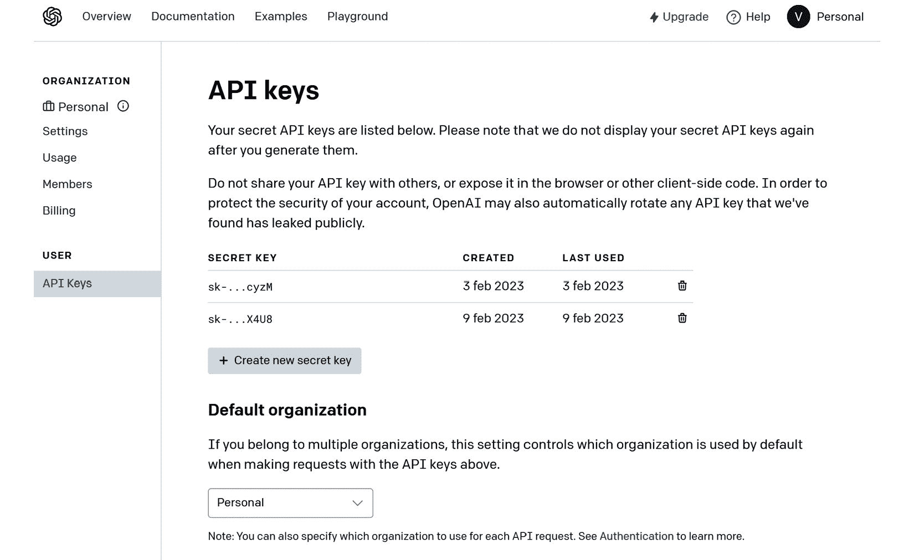

图 2.9 - 您 OpenAI 配置文件中帐户设置页面中的 API 密钥

使用 OpenAI API，您还可以尝试以下在 Playground 中不可用的其他模型系列：

+   **审查**：这是由 OpenAI 开发的经过调整的模型，可以检测潜在的敏感或不安全的文本内容。审查使用机器学习算法根据上下文和语言使用对文本进行分类为安全或不安全。此模型可用于在社交媒体平台、在线社区及其他许多领域自动化内容审查。有多个类别，如仇恨、仇恨/威胁、自残、性暴力、性暴力/未成年人、暴力、暴力/图形。

下面是审查 API 的示例代码：

```
import os
import openai
openai.api_key = os.getenv("OPENAI_API_KEY")
openai.Moderation.create(
  input="I want to kill him",
)
```

其输出如下所示：

```
<OpenAIObject id=modr-6sHusuY9frxJdfqTBXHsOAfWhckrh at 0x218bd8482c0> JSON: {
  "id": "modr-6sHusuY9frxJdfqTBXHsOAfWhckrh",
  "model": "text-moderation-004",
  "results": [
    {
      "categories": {
        "hate": false,
"hate/threatening": false,
        "self-harm": false,
        "sexual": false,
        "sexual/minors": false,
        "violence": true,
        "violence/graphic": false
      },
      "category_scores": {
        "hate": 1.7164344171760604e-05,
        "hate/threatening": 2.614225103059198e-08,
"self-harm": 2.5988580176772302e-08,
        "sexual": 2.8184256279928377e-06,
        "sexual/minors": 9.1383149936064e-09,
        "violence": 0.9910049438476562,
        "violence/graphic": 5.316753117767803e-07
      },
      "flagged": true
    }
  ]
}
```

在这种情况下，审查 API 检测到暴力内容的证据。

+   **嵌入**：一些模型可以使用嵌入。这些嵌入涉及在多维空间中表示单词或句子。在这个空间中不同实例之间的数学距离表示它们在意义上的相似性。举个例子，想象单词 queen、woman、king 和 man。理想情况下，在我们的多维空间中，如果表示正确，我们希望实现以下内容：

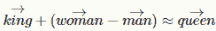

图 2.10 – 单词之间的矢量方程示例

这意味着*女人*和*男人*之间的距离应该等于*女王*和*国王*之间的距离。这里是一个嵌入的例子：

```
import openai
embedding = openai.Embedding.create(
    input="The cat is on the table",
    model="text-embedding-ada-002")["data"][0][ "embedding"]
```

前面的方法创建了输入的向量表示。我们可以在这里查看输出的前 10 个向量。

```
embedding[1:10]
[-0.01369840931147337,
 -0.007505378685891628,
 -0.002576263388618827,
 -0.014773285016417503,
 0.019935185089707375,
 -0.01802290789783001,
 -0.01594814844429493,
 -0.0010944041423499584,
 -0.014323337003588676]
```

嵌入在智能搜索场景中可以极其有用。事实上，通过获取用户输入和用户想要搜索的文档的嵌入，可以计算距离度量（即余弦相似度）来衡量输入和文档之间的距离。通过这样做，我们可以检索与用户输入在数学距离上更*接近*的文档。

+   **Whisper**：这是一个语音识别模型，可以将音频转录为文本。Whisper 可以识别和转录各种语言和方言，准确率很高，是自动语音识别系统的有价值的工具。这里是一个例子：

    ```
    # Note: you need to be using OpenAI Python   v     0.27.0 for the code below to work
    ```

    ```
    import openai
    ```

    ```
    openai.api_key = os.getenv("OPENAI_API_KEY")
    ```

    ```
    audio_file= open("/path/to/file/audio.mp3", "rb")
    ```

    ```
    transcript = openai.Audio.transcribe("whisper-1", audio_file)
    ```

输出如下所示：

```
{"text": Yes, hi, I just noticed a dent on the side of my car and I have no idea how it got there. There were no witnesses around and I'm really frustrated.
….
}
```

所有先前的模型都是预先构建的，也就是说它们已经在一个庞大的知识库上进行了预训练。

然而，有一些方法可以使您的模型更加定制化，以适应您的用例。

第一种方法嵌入在模型设计的方式中，它涉及在**few-learning 方法**中为您的模型提供上下文（我们将在本书的后面重点介绍这种技术）。换句话说，您可以要求模型生成一篇文章，其模板和词汇回忆您已经写过的另一篇文章。为此，您可以向模型提供您的查询生成一篇文章*和*以前的文章作为参考或上下文，以便模型更好地为您的请求做好准备。

这里是一个例子：

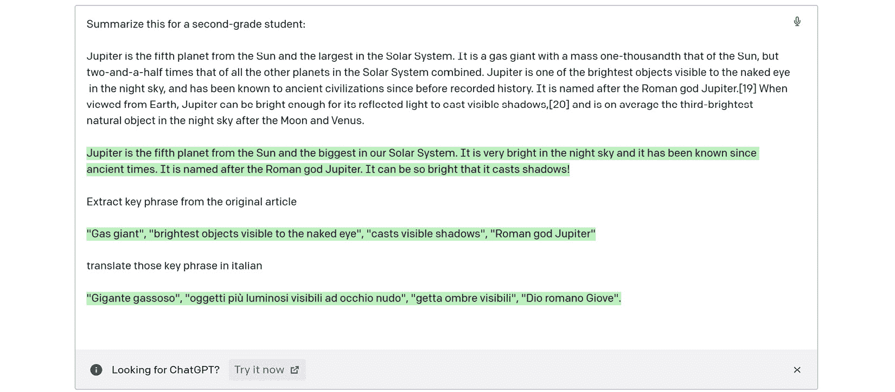

图 2.11 – OpenAI Playground 中使用 few-shot learning 方法进行对话的示例

第二种方法更为复杂，被称为**微调**。微调是将预训练模型适应新任务的过程。

在微调中，预训练模型的参数被改变，要么通过调整现有参数，要么通过添加新参数，以更好地适应新任务的数据。这是通过在特定于新任务的较小标记数据集上训练模型来实现的。微调的关键思想是利用从预训练模型中学到的知识，并将其微调到新任务，而不是从头开始训练模型。请看下面的图：

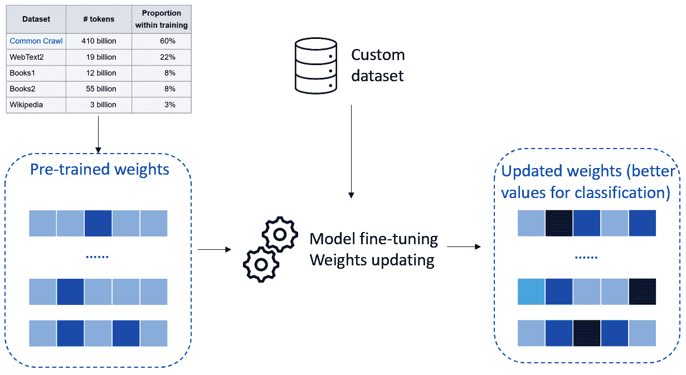

图 2.12 – 模型微调

在前图中，你可以看到关于如何在 OpenAI 预构建模型上进行精调的模式图。其思想是你可以使用通用参数或权重的预训练模型。然后，你用自定义数据喂养你的模型，通常以*键-值*提示和完成的形式，如下所示：

```
{"prompt": "<prompt text>", "completion": "<ideal generated text>"}
{"prompt": "<prompt text>", "completion": "<ideal generated text>"}
{"prompt": "<prompt text>", "completion": "<ideal generated text>"}
...
```

训练完成后，你将会得到一个定制化模型，对于给定任务表现特别出色，例如，对公司文档进行分类。

精调的好处在于，你可以根据自己的用例定制预构建模型，无需从头开始重新训练，但是可以利用更小的训练数据集，因此训练时间和计算量更少。与此同时，模型保持其生成能力和通过原始训练学习的准确性，这是在大规模数据集上发生的。

在这一段中，我们对 OpenAI 提供给一般公众的模型进行了概述，从你可以直接在 Playground 中尝试的模型（GPT、Codex）到如嵌入等更复杂的模型。我们还了解到，除了使用预构建模型之外，你还可以通过精调进行定制化，提供一组示例供学习。

在接下来的章节中，我们将专注于这些惊人模型的背景，从它们背后的数学开始，然后深入探讨使 ChatGPT 成为可能的重大发现。

# ChatGPT 之路：其背后的模型数学

自 2015 年成立以来，OpenAI 投资于研究和开发一类被称为**生成式预训练变压器**（**GPT**）的模型，并且它们作为 ChatGPT 背后的引擎已经引起了大家的关注。

GPT 模型属于变压器结构框架，此框架于 2017 年由 Google 研究员在一篇论文中介绍，*Attention Is All You Need*。

变压器架构是为了克服传统**循环神经网络**（**RNNs**）的局限性而引入的。RNNs 首次在 1980 年代由洛斯阿拉莫斯国家实验室的研究人员提出，但直到 1990 年代它们才引起了人们的关注。RNNs 背后的最初想法是处理顺序数据或时间序列数据，跨时间步保留信息。

确实，直到那一时刻，经典的**人工神经网络**（**ANN**）结构是前馈 ANN 的结构，其中每个隐藏层的输出是下一个隐藏层的输入，没有保留有关过去层的信息。

为了理解变压器背后的思想，我们需要从它的起源开始。因此，我们将深入探讨以下主题：

+   RNN 的结构

+   RNN 的主要局限性

+   如何通过引入新的架构元素（包括位置编码、自注意力和前馈层）克服这些局限性

+   我们如何达到 GPT 和 ChatGPT 的最先进技术

让我们从变压器的前身架构开始。

## RNN 的结构

让我们想象我们想要预测房价。如果我们只有今天的价格，我们可以使用一个前馈架构，通过隐藏层（带有激活函数）对输入进行非线性转换，并得到明天价格的预测输出。具体如下：


图 2.13 – 具有隐藏层的前馈架构

然而，对于这种类型的数据，也很可能有更长的序列可用。例如，我们可能有未来 5 年的这栋房子的时间序列。当然，我们希望将我们拥有的额外信息嵌入到我们的模型中，以便我们的 RNN 能够保持过去输入的记忆，以正确解释当前输入并预测未来输出。

因此，回到我们的例子，想象我们不仅有今天的价格，还有昨天的价格**(t-1)**和前一天的价格**(t-2)**。这是我们如何计算的：

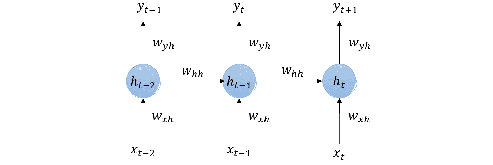

图 2.14 – RNN 示例

由于我们只关心明天的价格，让我们忽略*t-1*和*t*的中间最终输出。

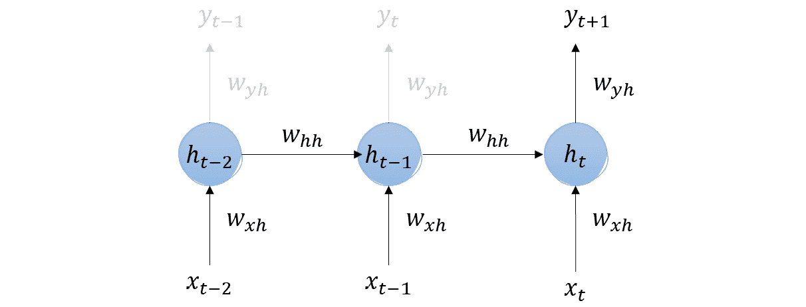

图 2.15 – RNN 示例

如您所见，**t-2**的隐藏层输出作为**t-1**的隐藏层的（加权）输入，同时也接受**t-1**的输入。然后，**t-1**的隐藏层输出，已经保留了**t-2**和**t-1**输入的记忆，作为**t**的隐藏层的输入。因此，我们感兴趣的明天价格（**y**t+1）带有所有先前几天输入的记忆。

最后，如果我们想要缩小这张图片，我们可以将 RNN 看作如下：


图 2.16 – RNN 的包装形式示例

这意味着 RNN 层在时间步*t-n*的输出然后被产生并传递为下一个时间步的输入。RNN 层的隐藏状态也作为下一个时间步的输入传递，使网络能够在输入序列的不同部分之间保持和传播信息。

尽管 RNN 在人工神经网络领域是一项重大进展，但它们仍然存在一些限制，我们将在下一节中进行探讨。

## RNN 的主要限制

如本节介绍所述，RNNs 存在三个主要限制：

+   **梯度消失和爆炸**：RNNs 存在梯度消失和爆炸的问题，这使得有效训练网络变得困难。这个问题发生在反向传播过程中梯度被多次相乘，导致梯度变得非常小或非常大。

+   **有限的上下文**：传统的 RNN 只能捕捉有限数量的上下文，因为它们一次处理输入序列的一个元素。这意味着它们无法有效处理长期依赖关系或输入序列中相距较远的元素之间的关系。

+   **并行化困难**：RNN 本质上是顺序的，这使得并行化它们的计算变得困难，因此它们无法充分利用今天的**图形处理单元**（**GPU**）。这可能导致它们在大规模数据集和设备上训练和部署变慢。

1997 年，Sepp Hochreiter 和 Jürgen Schmidhuber 在他们的论文《长短期记忆》中引入了一种新的架构，试图克服前两个限制（有限的上下文和梯度消失和梯度爆炸）。

LSTM 网络通过引入细胞状态的概念来克服有限上下文的问题，该状态与隐藏状态分开，能够长时间保持信息。细胞状态在网络中保持不变传递，使其能够存储从以前时间步丢失的信息。

此外，LSTM 网络通过使用精心设计的门控来控制信息在细胞内外的流动，从而克服了梯度消失和梯度爆炸的问题，这有助于防止梯度变得过小或过大。

然而，LSTM 网络仍然存在并行化不足的问题，因此训练时间较慢（甚至比 RNN 更复杂，因此更慢）。目标是拥有一个能够在顺序数据上实现并行化的模型。

为了克服这些限制，引入了一种新的框架。

## 克服限制 - 引入 transformers

Transformer 架构通过替换循环（使用自注意机制）来解决这些限制，允许并行计算并捕捉长期依赖关系。

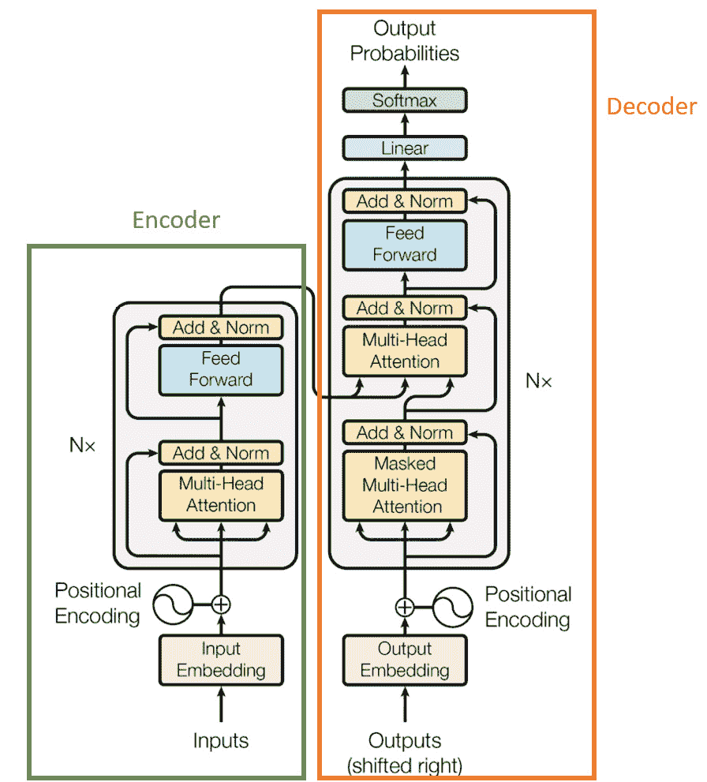

图 2.7 - 来自原始论文“注意力就是你所需要的”的 Transformer 架构。Vaswani, A., Shazeer, N., Parmar, N., Uszkoreit, J., Jones, L., Gomez, A. N., Kaiser, L., & Polosukhin, I. (2017). Attention Is All You Need. ArXiv. https://doi.org/10.48550/arXiv.1706.03762

在上述图中（摘自原始论文），您可以看到有两个主要的构建模块：左侧是“编码器”，其任务是将输入表示为较低维空间；右侧是“解码器”，其任务是将编码器提供的较低维数据翻译回原始数据格式。

编码器和解码器共享三种主要类型的层，区分了 Transformer 架构：位置编码、自注意力和前馈。

让我们在以下部分了解每一个。

### 位置编码

编码器是将自然语言输入转换为数字向量的层。这得益于嵌入的过程，这是一种 NLP 技术，它用向量表示单词，使得一旦在向量空间中表示，向量之间的数学距离代表了它们所代表的单词之间的相似性。请看下图：

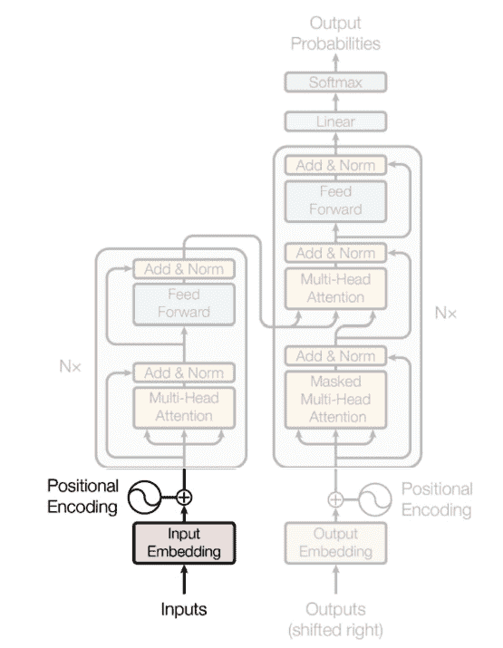

图 2.18 – 《注意力就是你所需要的》原始论文中的 Transformer 架构。Vaswani, A., Shazeer, N., Parmar, N., Uszkoreit, J., Jones, L., Gomez, A. N., Kaiser, L., & Polosukhin, I. (2017). Attention Is All You Need. ArXiv. https://doi.org/10.48550/arXiv.1706.03762

当我们谈论句子的含义时，我们都同意句子中单词的排列对于确定其含义是重要的。这就是为什么我们希望我们的编码器考虑到这种顺序，是*位置*的原因。

位置编码是一个固定的、可学习的向量，表示单词在序列中的位置。它被添加到单词的嵌入中，使得单词的最终表示包括其含义和位置。

### 自注意力

自注意力层负责确定生成输出时每个输入标记的重要性。它们回答了这个问题，“*我应该关注输入的哪一部分？*”

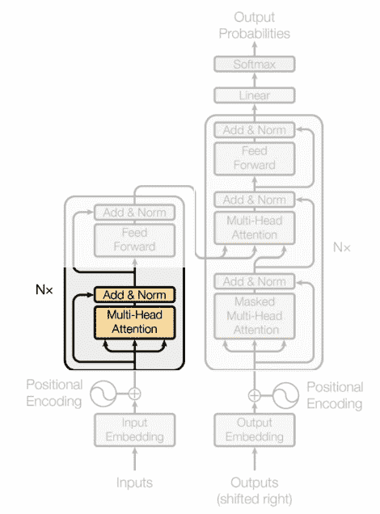

图 2.19 – 《注意力就是你所需要的》原始论文中的 Transformer 架构。Vaswani, A., Shazeer, N., Parmar, N., Uszkoreit, J., Jones, L., Gomez, A. N., Kaiser, L., & Polosukhin, I. (2017). Attention Is All You Need. ArXiv. https://doi.org/10.48550/arXiv.1706.03762

为了获得一个句子的自注意力向量，我们需要的元素是*值*，*查询*和*键*。这些矩阵用于计算输入序列中元素之间的注意力得分，并且是在训练过程中学习的三个权重矩阵（通常初始化为随机值）。

**查询**用于表示注意力机制的当前焦点，而**键**用于确定应该受到注意的输入部分，**值**用于计算上下文向量。然后这些矩阵相乘，并通过非线性变换传递（使用 softmax 函数）。自注意力层的输出以一种转换的、具有上下文意识的方式表示输入值，这使得 Transformer 可以根据手头任务关注输入的不同部分。这是如何描述矩阵相乘的过程：

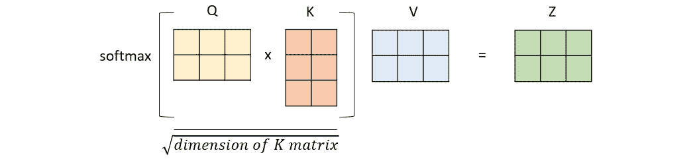

图 2.20 - 查询，键和值矩阵相乘以获得上下文向量的表示

注意，在论文作者提出的架构中，“注意力就是你需要的”，注意力层被称为**多头注意力**。多头注意力实际上是一种机制，多个自注意力机制并行处理输入数据的不同部分，生成多个表示。这允许 Transformer 模型同时关注输入数据的不同部分并从多个角度汇总信息。

一旦注意力层的并行输出准备就绪，它们将被串联并通过前馈层进行处理。

### 前馈层

前馈层负责将自注意力层的输出转换为最终输出的合适表示。

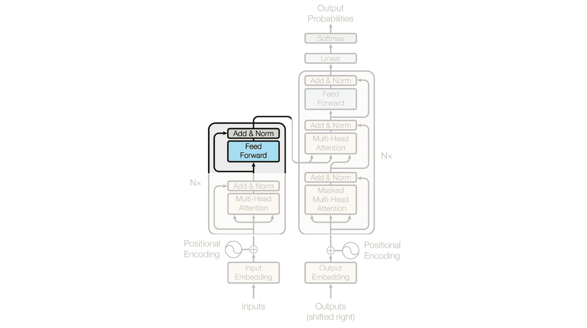

图 2.21 - “注意力就是你需要的”原始论文中的 Transformer 架构。Vaswani, A., Shazeer, N., Parmar, N., Uszkoreit, J., Jones, L., Gomez, A. N., Kaiser, L., & Polosukhin, I. (2017). Attention Is All You Need. ArXiv. https://doi.org/10.48550/arXiv.1706.03762

前馈层是 Transformer 架构的主要构件，并包括两个主要元素：

+   **全连接层**（也称为密集层）：这是一种每个神经元与前一层中的每个神经元相连接的层类型。换句话说，来自前一层的每个输入都连接到当前层中的每个神经元，并且当前层中的每个神经元都对下一层中所有神经元的输出有贡献。密集层中的每个神经元通过线性变换计算其输入的加权和。

+   **激活函数**：这是应用于全连接层输出的非线性函数。激活函数用于向神经元的输出引入非线性，这对于网络学习输入数据中的复杂模式和关系是必要的。在 GPT 的情况下，激活函数是 ReLU。

前馈层的输出然后被用作网络中下一层的输入。

在下图中，我们可以看到一个通用前馈层的示例，它以一个二维向量作为输入，在密集层中使用训练好的权重进行线性操作，然后使用 ReLU 激活函数对输出进行非线性转换：

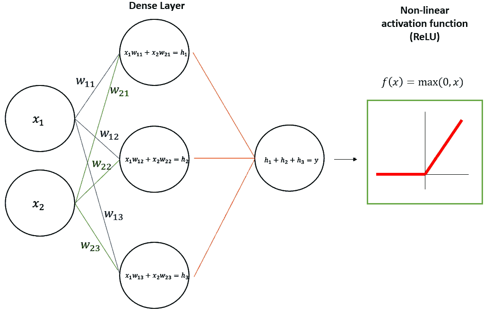

图 2.22 - 具有二维输入的通用前馈层在密集层中和 ReLU 非线性激活函数中的模式图

### 最后一英里 - 解码结果

我们提到变压器由两个组件组成：编码器和解码器。尽管它们共享位置编码、自注意力和前馈层的核心元素，但解码器仍然必须执行一个额外的操作 - 将输入解码为原始数据格式。这个操作是通过一个线性层（一个将输入的维度调整为输出维度的前馈网络）和一个 softmax 函数（它将输入转换为概率向量）来完成的。

从该向量中，我们选择对应最高概率的单词，并将其用作模型的最佳输出。

上面解释的所有架构元素定义了变压器的框架。在下一节中，我们将看到这一创新框架如何为 GPT-3 和其他由 OpenAI 开发的强大语言模型铺平了道路。

## GPT-3

现在我们来到了 ChatGPT 背后的 GPT-3 架构。它确实是基于变压器架构的模型，但有一个特殊之处：它只有解码器层。事实上，在他们的介绍性论文*通过生成式预训练改进语言理解*中，OpenAI 的研究人员采用了*仅解码器*的方法。

GPT-3 是*巨大*的。但具体有多大呢？

让我们从它训练的知识库开始。它旨在尽可能详尽地涵盖人类知识，因此由不同来源组成：

+   **Common Crawl** ([`commoncrawl.org/`](https://commoncrawl.org/))：一个在 8 年时间内收集的大规模网络数据语料库，几乎没有过滤

+   **WebText2** ([`openwebtext2.readthedocs.io/en/latest/background/`](https://openwebtext2.readthedocs.io/en/latest/background/))：一个包含来自 Reddit 帖子中链接的网页文本的集合，至少有 3 个赞

+   **Books1 和 Books2**：两个分别由互联网上可用的书籍组成的语料库

+   **维基百科**：一个包含来自流行在线百科全书维基百科英文版的文章的语料库

在这里你可以更好地了解：

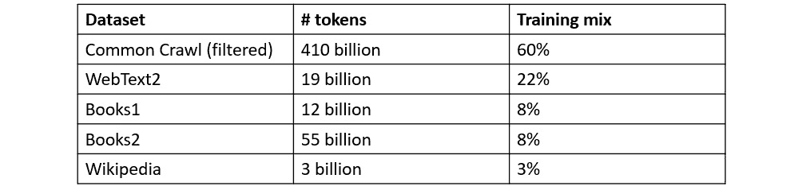

图 2.23 – GPT-3 知识库

让我们考虑以下假设：

+   1 代币 ~= 4 个英文字符

+   1 代币 ~= ¾ 词

我们可以得出结论，GPT-3 已经在*374* *亿个单词*上进行了训练！

这个知识库旨在在 96 个隐藏层中稀疏地训练 1750 亿个参数。为了让你了解 GPT-3 有多庞大，让我们将其与之前的版本 GPT-1 和 GPT-2 进行比较：

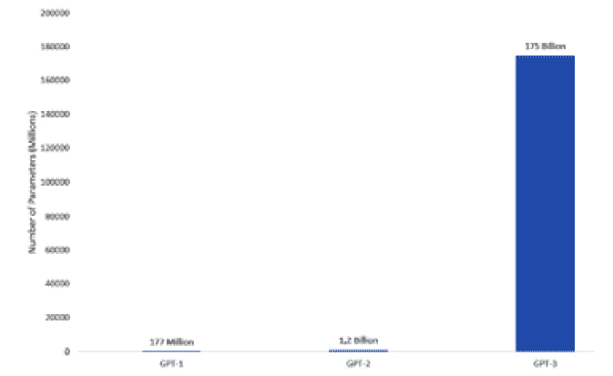

图 2.24 – GPT 模型随时间在参数数量上的演变

正如你所看到的，在自 2018 年 GPT-1 推出以来的几年里，GPT 模型的复杂性和深度呈指数级增长。

GPT 模型背后的发展速度令人惊叹，特别是如果我们考虑到这个模型的最新版本，也是首个向普通大众提供的版本：ChatGPT。

# ChatGPT：最先进的技术

2022 年 11 月，OpenAI 宣布了其会话式人工智能系统 ChatGPT 的网络预览，向普通大众提供。这引起了来自专家、组织和普通大众的巨大热情，以至于在仅仅 5 天后，该服务就吸引了 100 万用户！

在写关于 ChatGPT 之前，我会让它自我介绍：

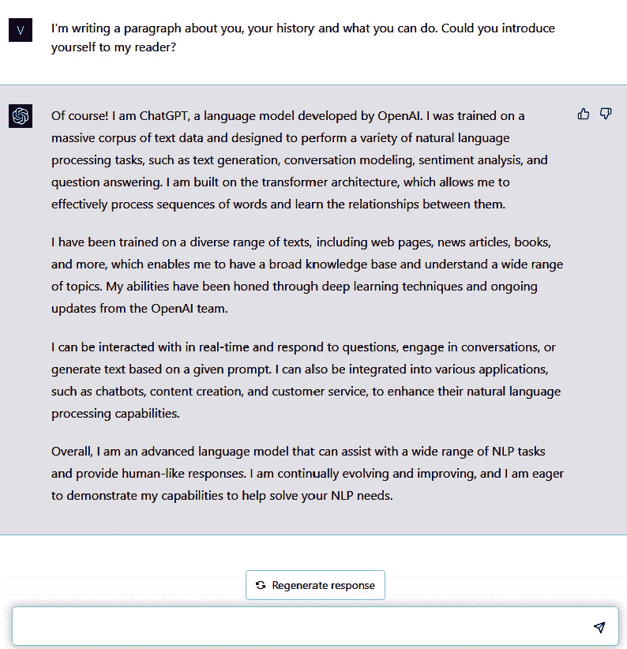

图 2.25 – ChatGPT 自我介绍

ChatGPT 是建立在一个先进的语言模型之上的，该模型利用了 GPT-3 的修改版本，专门为对话进行了微调。优化过程涉及到**强化学习与人类反馈**（**RLHF**），这是一种利用人类输入来训练模型展现出期望对话行为的技术。

我们可以将 RLHF 定义为一种机器学习方法，其中算法通过接收来自人类的反馈来学习执行任务。该算法经过训练，以做出最大化人类提供的奖励信号的决策，并且人类提供额外的反馈以改善算法的性能。当任务对于传统编程来说过于复杂或者期望的结果难以提前指定时，这种方法就很有用。

这里的相关区别是 ChatGPT 已经在人类的帮助下进行了训练，使其与其用户保持一致。通过整合 RLHF，ChatGPT 被设计为更好地理解并以一种自然而引人入胜的方式回应人类语言。

注意

相同的 RLHF 机制被用于我们可以将其视为 ChatGPT 前身的**InstructGPT**。在 OpenAI 的研究人员于 2022 年 1 月发表的相关论文中，InstructGPT 被介绍为一类比 GPT-3 更擅长遵循英语指示的模型。

ChatGPT 的知识截止日期是 2021 年，这意味着该模型了解到截止日期前可用的信息。然而，您仍然可以通过少量示例学习方法为模型提供上下文，尽管模型的回复仍然基于其知识库直到截止日期。

ChatGPT 正在彻底改变与人工智能的互动方式。ChatGPT 生成类人文本的能力使其成为广泛应用的热门选择，包括聊天机器人、客户服务和内容创作。此外，OpenAI 宣布 ChatGPT API 将很快发布，允许开发人员将 ChatGPT 直接集成到自定义应用程序中。

ChatGPT 的架构和训练方法的不断发展和改进承诺将进一步推动语言处理的边界。

# 总结

在本章中，我们回顾了 OpenAI 的历史、研究领域和最新发展，一直到 ChatGPT。我们深入研究了 OpenAI Playground 作为测试环境以及如何将 Models API 嵌入到您的代码中。然后，我们深入探讨了 GPT 模型家族背后的数学知识，以更清晰地了解 GPT-3 的运作原理，这是 ChatGPT 背后的模型。

通过深入理解 GPT 模型背后的数学，我们可以更好地理解这些模型的强大之处以及它们对个人和组织的多种影响。通过对 OpenAI Playground 和 Models API 的第一次了解，我们看到了测试或嵌入预训练模型的简易性：这里的改变游戏规则的因素是，您无需强大的硬件和数小时的时间来训练您的模型，因为它们已经可供您使用，如果需要，还可以定制一些示例。

在下一章中，我们也开始了本书的*第二部分*，我们将看到 ChatGPT 在各个领域内的应用，以及如何释放其潜力。您将学习如何通过正确设计提示来获取 ChatGPT 的最高价值，如何提高日常生产力，以及它如何成为开发人员、市场营销人员和研究人员的出色项目助手。

# 参考文献

+   Radford, A., & Narasimhan, K. (2018). 通过生成式预训练改善语言理解。

+   Vaswani, A., Shazeer, N., Parmar, N., Uszkoreit, J., Jones, L., Gomez, A. N., Kaiser, L., & Polosukhin, I. (2017). *注意力机制就是你所需要的*. ArXiv. [`doi.org/10.48550/arXiv.1706.03762`](https://doi.org/10.48550/arXiv.1706.03762) OpenAI. Fine-Tuning Guide. OpenAI 平台文档. [`platform.openai.com/docs/guides/fine-tuning`](https://platform.openai.com/docs/guides/fine-tuning).


# 第二部分：ChatGPT 的实践

在本部分，我们将开始我们在 ChatGPT 为市场带来的新可能性的旅程。从日常生产率到领域特定的用例，您将熟悉 ChatGPT 的能力，以及它如何作为各种任务的推理引擎使用。

一旦我们探讨了技术前提条件，这一部分就会概述 ChatGPT 用户界面，包括聊天管理和问题修改。

然后它转向了 ChatGPT 最重要的元素之一，即如何充分利用 ChatGPT，在一般的大语言模型中，即提示设计的概念。在这里，您将熟悉让 ChatGPT 发挥其最佳作用的强大技术，包括最新的发展和关于诸如**Reason and Act**（**ReAct**）和**Chain of Thoughts**（**CoT**）等技术的研究论文。

本部分最后将重点放在如何在实际操作中使用 ChatGPT 的具体示例上，从日常生产力开始，逐步转向更多领域特定的学科，如营销，开发和研究。在这里，您不仅可以了解 ChatGPT 在这些领域可以覆盖的用例，还可以看到具体示例以自行复制。

本部分包括以下章节：

+   *第三章*，*熟悉 ChatGPT*

+   *第四章*，*理解提示设计*

+   *第五章*，*提升日常工作效率与 ChatGPT*

+   *第六章*，*用 ChatGPT 开发未来*

+   *第七章*，*用 ChatGPT 掌握营销*

+   *第八章*，*用 ChatGPT 重新定义研究*


# 3

# 熟悉 ChatGPT

本章让您设置 ChatGPT 账户并开始使用该服务。它还将介绍如何与 Web UI 交互，如何按主题组织聊天，以及如何构建对话。

在本章结束时，您将更好地了解 ChatGPT 是什么，它是如何工作的，以及如何有效地将其组织为日常助手。您还将了解其主要功能和局限性，以便知道如何负责任地使用它。

在本章中，我们将涵盖以下主题：

+   设置 ChatGPT 账户

+   熟悉 UI

+   组织聊天

# 设置 ChatGPT 账户

要开始使用 ChatGPT，您首先需要创建一个 OpenAI 账户。请按照这里的说明：

1.  在这里导航至 OpenAI 网站：[`openai.com`](https://openai.com)。

1.  滚动到下方，点击**ChatGPT**，如下所示：


图 3.1 – OpenAI 登陆页面

1.  然后您需要点击**尝试 ChatGPT**：

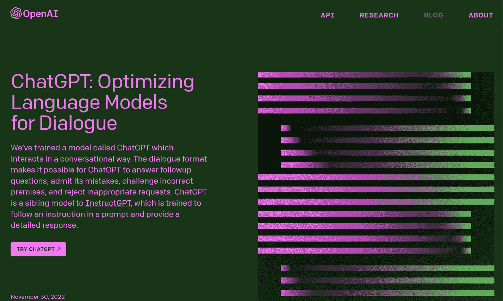

图 3.2 – ChatGPT 登陆页面

1.  在下一页，您需要填写表格注册一个 OpenAI 账户。这是您可以用来访问 OpenAI Playground 并生成 API 密钥的同一个账户。


图 3.3 – ChatGPT 登陆页面，带有登录和注册选项

1.  现在您可以开始使用 ChatGPT Web 应用程序了。找到 ChatGPT Web 应用程序后，点击启动。您将能够直接在 Web 浏览器中与 ChatGPT 交互并执行各种自然语言处理任务。

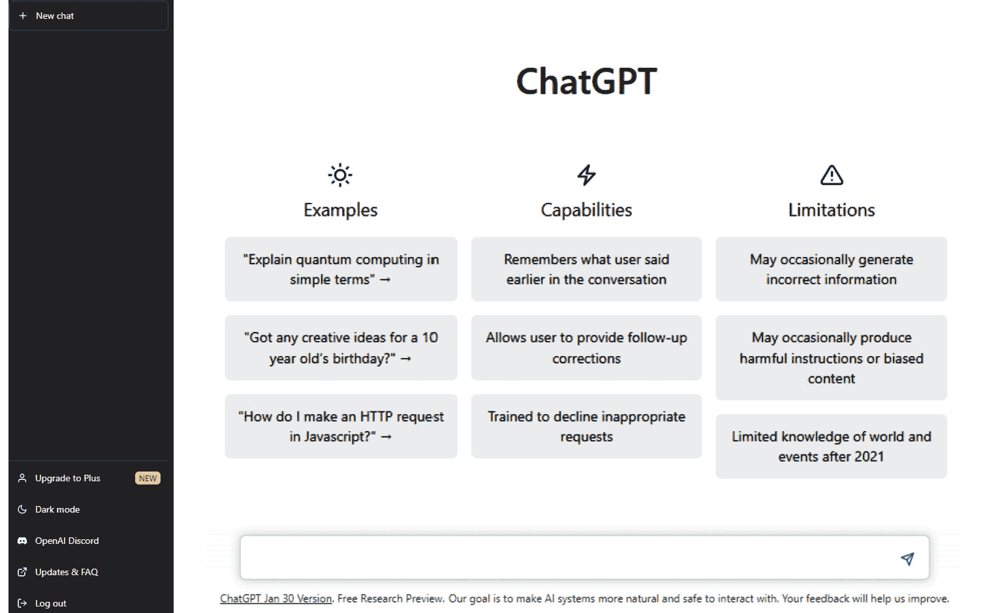

图 3.4 – ChatGPT Web 界面

太棒了！现在您可以开始使用 ChatGPT。但您也需要了解应用程序是什么样的。让我们接着了解一下。

# 熟悉 UI

ChatGPT 的 Web 界面非常直观易用。在开始编写提示之前，您可以轻松尝试服务提供的一些示例：

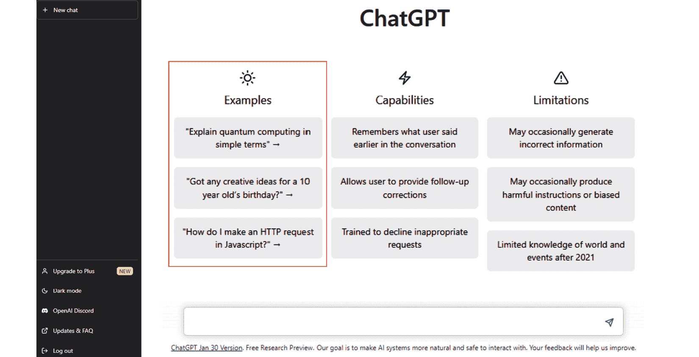

图 3.5 – ChatGPT 提供的示例提示

接下来，您还将了解 ChatGPT 的主要功能：

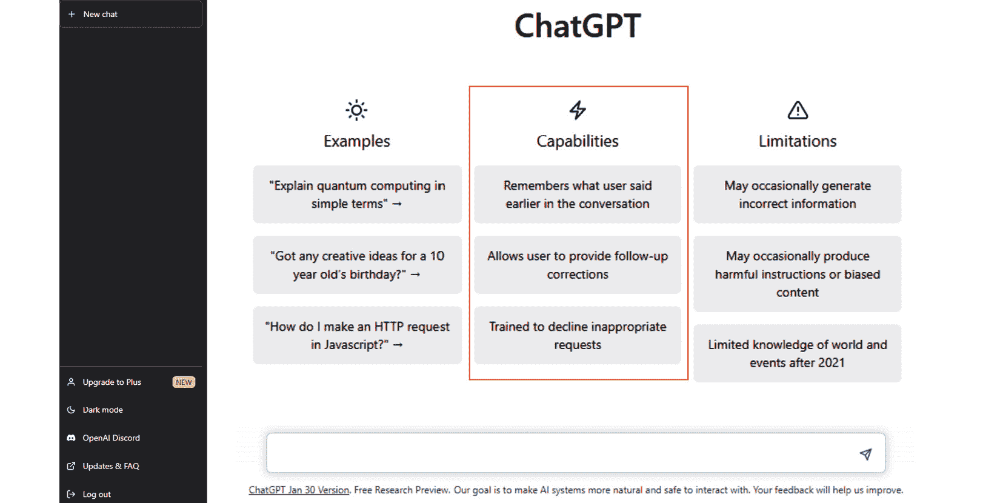

图 3.6 – ChatGPT 的功能

在功能中，强调了 ChatGPT 如何在整个对话中保持记忆。在上一章中，我们深入研究了 GPT 背后的数学，并看到了记忆保留组件的重要性：现在您可以欣赏到这种数学复杂性的实际运作。

ChatGPT 的这种能力也是**少样本学习**的一个例子，我们将在接下来的章节中更多地了解这个概念。

注意

ChatGPT 能够保持先前上下文的记忆，这要归功于其少样本学习能力。少样本学习是一种机器学习技术，使模型能够在非常有限的标记数据下学习新概念或任务，已成为人工智能领域的重要研究领域。

由于具有记忆保持和少样本学习等功能，ChatGPT 允许用户在对话过程中提供跟进或更正，而无需再次提供上下文。

这里有一个示例，展示了如何在与 ChatGPT 对话中对提示进行更正：

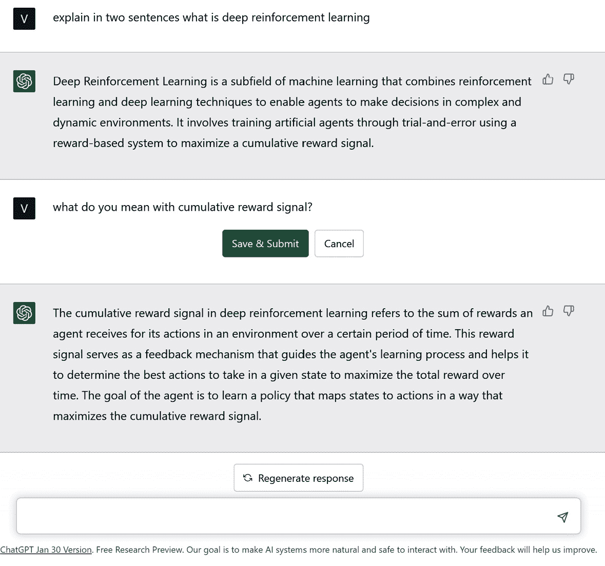

图 3.7 – ChatGPT 跟进评论和提示更正示例

最后，模型还提醒用户，除了其功能之外，它还经过训练，可以拒绝可能有害或冒犯性的不当请求。

在其主页上提供的最后一组信息与 ChatGPT 的限制相关：

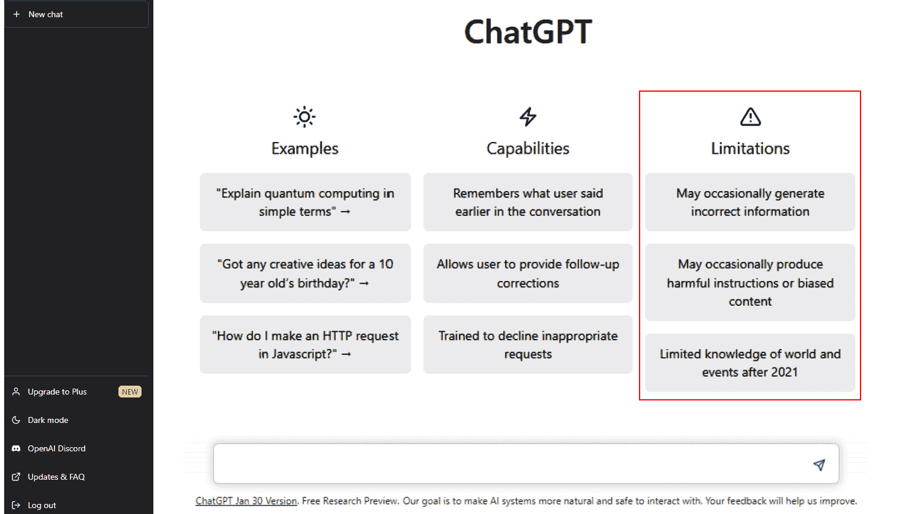

图 3.8 – ChatGPT 限制

这些元素是一个重要的提醒，即如今，AI 工具仍需要人类监督。事实上，除了 2021 年至今之间的缺失信息外，ChatGPT 可能还会提供不准确甚至错误的信息。这就是为什么它仍然需要监督的原因。

值得一提的有趣现象是*幻觉*。幻觉指的是 AI 模型生成类似真实数据但实际上并非基于任何真实观察的虚假或想象数据的现象。以下是一个例子：

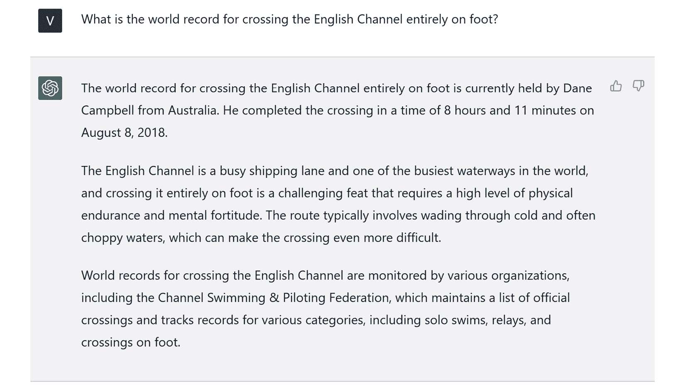

图 3.9 – ChatGPT 幻觉示例

*图 3.9*中的问题最初由道格拉斯·霍夫斯塔德和大卫·本德尔开发，旨在诱导 ChatGPT 产生幻觉性回应！

为了防止幻觉，应该牢记一些良好的做法：

+   **具体明确**：确保您的提示定义明确，清楚陈述您想要实现的目标。这将有助于模型生成更专注和相关的回应。例如，一个提示如*告诉我关于世界的事情*可能不会产生很好的结果。

+   **提供充分的上下文**：提供的上下文越多，模型就能更好地理解您的需求并生成相关的响应。

+   **避免歧义**：在您的提示中避免使用模糊或含糊不清的术语或短语，因为这可能会使模型难以理解您想要什么。

+   **使用简洁的语言**：尽可能简洁地表达您的提示，同时提供足够的信息让模型生成响应。这将有助于确保模型生成专注和简洁的回应。

+   **注意训练数据**：ChatGPT 已经在大量文本语料库上进行了训练，它可能生成基于该数据模式的有偏见或不准确的响应。请注意这一点，并考虑调整您的提示，如果您怀疑模型生成的响应不合适或准确。

正如我们将在下一章中看到的，这些提示设计考虑不仅有助于防止幻觉，还有助于从与 ChatGPT 的互动中获得最高价值和效用。

有了这一点，让我们现在看看聊天是如何管理的。

# 组织聊天

ChatGPT 展示的节省时间功能是具有多个开放线程或聊天的可能性。实际上，当您开始编写第一个提示时，ChatGPT 将自动启动一个新的聊天并以相关标题命名。请看以下截图的左上角：

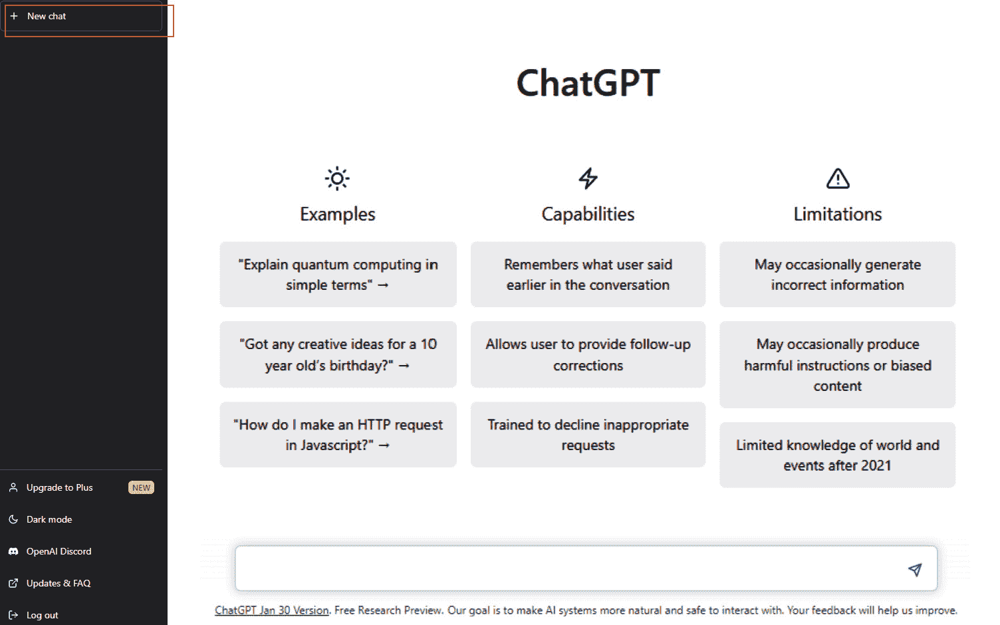

图 3.10 – 在 ChatGPT 中创建新聊天

您始终可以决定从头开始新的聊天，但是，您可能希望继续几天前开始的对话。

想象一下，您已经要求 ChatGPT 解释线性回归的概念，然后开始了几个后续对话。这是它的显示方式：

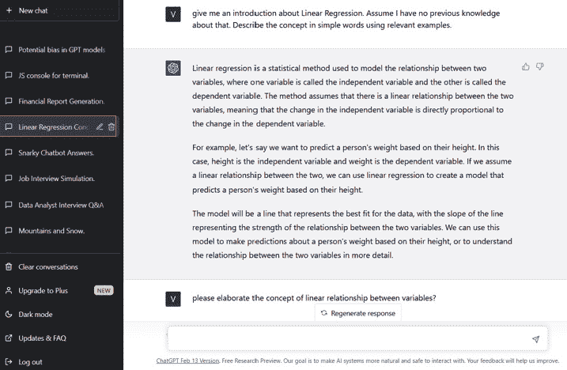

图 3.11 – 具有上下文的现有聊天示例

在那个聊天中，ChatGPT 已经有了上下文，因此您可以继续对话而无需重复概念。请看这里：

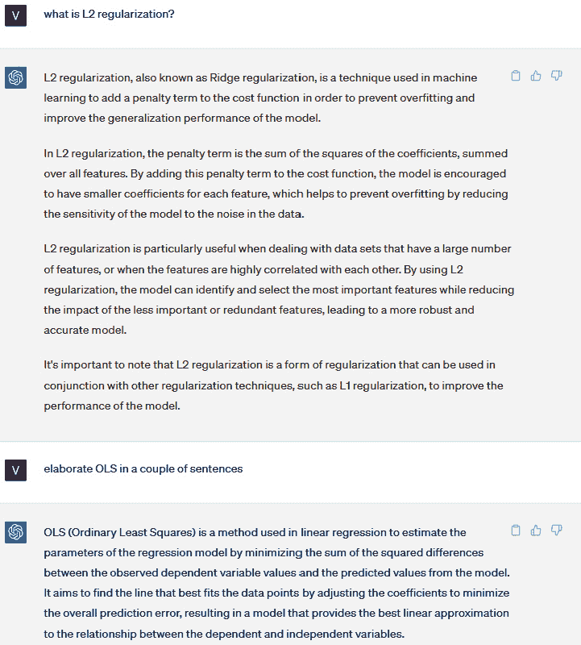

图 3.12 – 同一上下文中的后续问题示例

通过这一点，我们了解了 ChatGPT 聊天是如何维护和组织的，这使得参考旧聊天变得容易。

# 摘要

在本章中，我们详细介绍了如何使用我们的帐户开始使用 ChatGPT 的具体步骤。我们还深入探讨了其能力和局限性，以及有关幻觉风险以及如何通过提示设计避免这种风险的一些考虑。我们还看到了应用程序中如何呈现聊天以及如何轻松地参考旧聊天。

在下一章中，我们将更多关注提示设计和工程，以便从与 ChatGPT 的对话中获得最高价值。

# 参考资料

+   [`openai.com/blog/chatgpt/`](https://openai.com/blog/chatgpt/)

+   [`www.sify.com/ai-analytics/the-hilarious-and-horrifying-hallucinations-of-ai/`](https://www.sify.com/ai-analytics/the-hilarious-and-horrifying-hallucinations-of-ai/)

+   [`www.datanami.com/2023/01/17/hallucinations-plagiarism-and-chatgpt/`](https://www.datanami.com/2023/01/17/hallucinations-plagiarism-and-chatgpt/)


# 4

# 理解提示设计

在前几章中，我们多次提到“提示”这个术语，同时指的是 ChatGPT 和 OpenAI 模型中的用户输入。

本章更深入地探讨了提示设计和工程作为改善模型准确性的技术的重要性。提示对模型生成的输出产生重大影响：一个设计良好的提示可以帮助引导模型生成相关和准确的输出，而一个设计不良的提示可能导致无关或令人困惑的输出。最后，还重要的是将道德考虑因素纳入提示中，以防止模型生成有害内容。

在本章中，我们将讨论以下主题：

+   什么是提示，为什么它重要？

+   零、一和少次学习 - 变压器模型的典型特征

+   获得相关和一致结果的明确定义提示的原则

+   避免隐藏偏见的风险，并考虑 ChatGPT 中的道德考虑因素

在本章结束时，您将能够通过适当的提示设计从 ChatGPT 和 OpenAI 模型的交互中获得高质量的结果。

# 什么是提示，为什么它重要？

在生成式人工智能的背景下，提示是指用户提供给生成模型的输入。当我们谈论 ChatGPT 和 OpenAI 模型时，提示主要指的是自然语言中的一段文本，或者 - 正如我们在 Codex 模型中看到的那样 - 是编程语言中的一段文本。

提示是用户可以控制这些模型生成的输出的唯一方式。因此，毫无疑问地说，用于与 AI 系统进行对话的提示的质量对于确定其成功至关重要。

明确定义的提示是成功对话的秘诀，涵盖了感兴趣的主题；相反，定义不清晰的提示不仅会阻止对话对用户有用，还可能导致潜在的误导性内容。正如我们在上一章中看到的，ChatGPT 仍然存在一些限制，比如其知识库的 2021 年截止日期，以及生成式人工智能系统通常存在的另一个警告，比如幻觉现象。

比如，想象一下我们想要了解**卷积神经网络**（**CNNs**）。我们对**人工神经网络**（**ANNs**）一无所知，因此需要从一个简单的介绍开始。这个想法是，从第一个输出开始，我们可以深入研究相关元素。

让我们来看看 ChatGPT 中一个定义不清晰提示的结果：

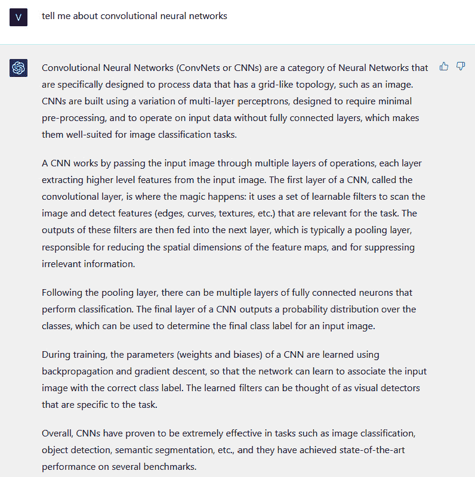

图 4.1 - 一个定义不清晰提示的示例

结果是正确和准确的，但涉及了许多我们以前可能从未见过的技术概念。全连接层是什么？池化层是什么？这个答案假设我们有人工神经网络的先前知识。

让我们尝试为 ChatGPT 提供更多上下文，以获得对我们更有用的结果：

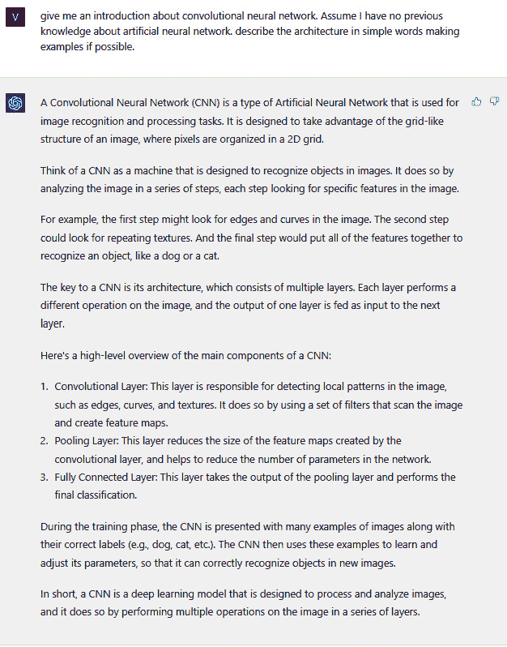

图 4.2 - 良好定义提示的示例

正如你所看到的，这个回答中的措辞比我寻找的那个更有可能。在介绍中，它不使用诸如*多层感知器*或*全连接层*之类的词语。它还提供了一个图像识别过程的示例，然后进一步详细说明，确保用简单的词语解释每一步。

我对这个回答感到非常满意，作为用户，我现在可以开始更详细地询问关于池化层的问题，例如。

因此，快速设计和工程正在变得越来越受到关注，并且作为一个独立的学科正在发展。

现在，让我们专注于如何通过利用其少量样本学习能力来改进 ChatGPT 的回应。

# 零、一和少量样本学习 - 典型的变压器模型

在前几章中，我们提到了 OpenAI 模型，因此也包括 ChatGPT，以预训练的格式呈现。它们经过大量数据的训练，并相应地配置了它们的（数十亿个）参数。

然而，这并不意味着这些模型不能再学习了。在*第二章*中，我们看到定制 OpenAI 模型并使其更能够解决特定任务的一种方法是通过**微调**。

定义

微调是将预训练模型适应新任务的过程。在微调中，预训练模型的参数被改变，要么通过调整现有参数，要么通过添加新参数使其适应新任务的数据。这是通过在特定于新任务的较小标记数据集上训练模型来完成的。微调的关键思想是利用从预训练模型中学到的知识，并将其微调到新任务，而不是从头开始训练模型。

微调是一个适当的训练过程，需要一个训练数据集、计算能力和一些训练时间（取决于数据量和计算实例）。

这就是为什么值得测试另一种方法，让我们的模型在特定任务上变得更加熟练：**少量样本学习**。

这个想法是让模型从简单的例子中学习，而不是整个数据集。这些例子是我们希望模型响应的方式的样本，以便模型不仅学习内容，还学习格式、风格和分类法来在其回应中使用。

此外，通过提示直接进行学习（正如我们将在接下来的场景中看到的那样），整个体验更少耗时且更易执行。

提供的示例数量决定了我们所指的样本学习的级别。换句话说，如果没有提供示例，则我们称之为零样本，如果提供了一个示例，则称为单样本，如果提供了 2-3 个以上的示例，则称为少样本。

让我们专注于每一个场景：

+   **零样本学习**。在这种学习中，模型被要求执行一个它没有见过训练示例的任务。模型必须依靠关于任务的先验知识或一般信息来完成任务。例如，零样本学习方法可能是要求模型生成一个描述，就像我在提示中定义的一样：

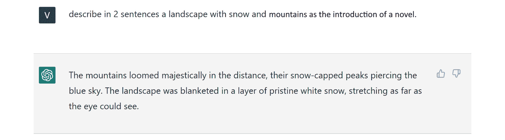

图 4.3 – 零样本学习示例

+   **单样本学习**：在这种类型的学习中，模型只提供每个新任务的单个示例。模型必须利用其先前的知识从这个单一示例中泛化，以执行任务。如果考虑前面的例子，我可以在要求其生成新的示例之前，向模型提供一个提示完成的示例：

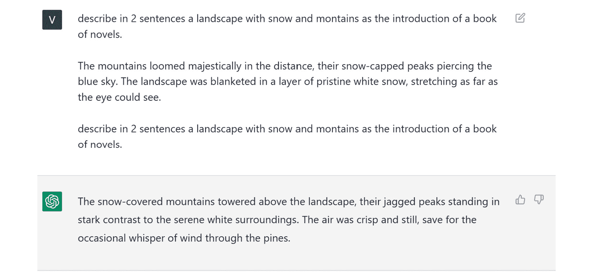

图 4.4 – 单样本学习示例

请注意，我提供示例的方式类似于微调所使用的结构：

```
{"prompt": "<prompt text>", "completion": "<ideal generated text>"}
```

+   **少样本学习**：在这种学习中，模型只提供了每个新任务的少量示例（通常在 3 到 5 个之间）。模型必须利用其先前的知识从这些示例中泛化，以执行任务。让我们继续我们的例子并提供模型更多的示例：

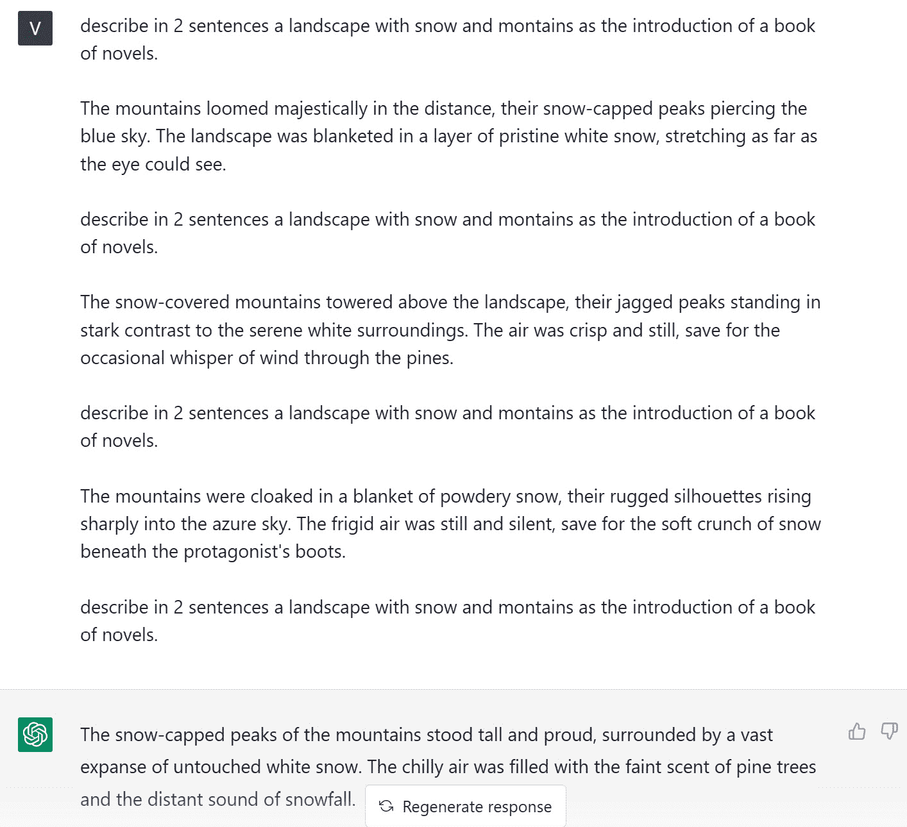

图 4.5 – 少样本学习示例，提供了三个示例

少样本学习的好处在于，你还可以控制模型输出的呈现方式。你还可以为模型提供你希望输出看起来的模板。例如，考虑以下推文分类器：

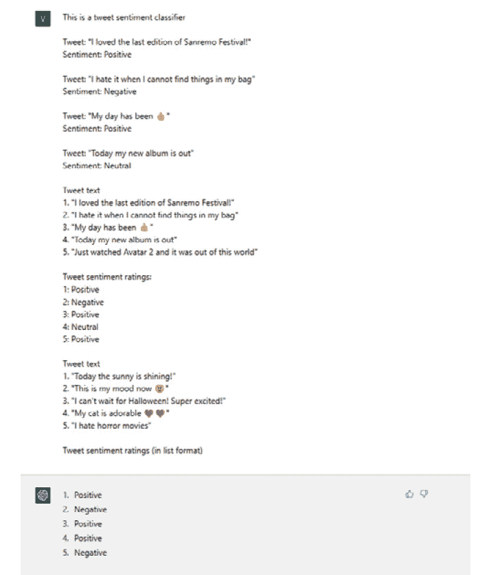

图 4.6 – 推文分类器的少样本学习。这是修改自 https://learn.microsoft.com/en-us/azure/cognitive-services/openai/how-to/completions 的原始脚本

让我们看看前面的图。首先，我向 ChatGPT 提供了一些标记的推文示例。然后，我以不同的数据格式（列表格式）提供了相同的推文，以及相同格式的标签。最后，我以列表格式提供未标记的推文，以便模型返回标签列表。

输出格式并不是您可以教给您的模型的唯一内容。您还可以教它以特定的行话和分类法行事和言语，这可以帮助您以期望的措辞获得所需的结果：

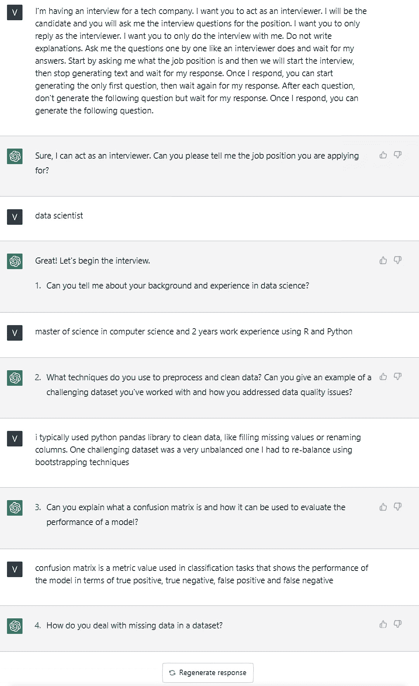

图 4.7 – ChatGPT 充当面试官进行对话的例子

或者，想象一下，你想生成一个名为 Simpy 的聊天机器人，回复时非常滑稽和讽刺：

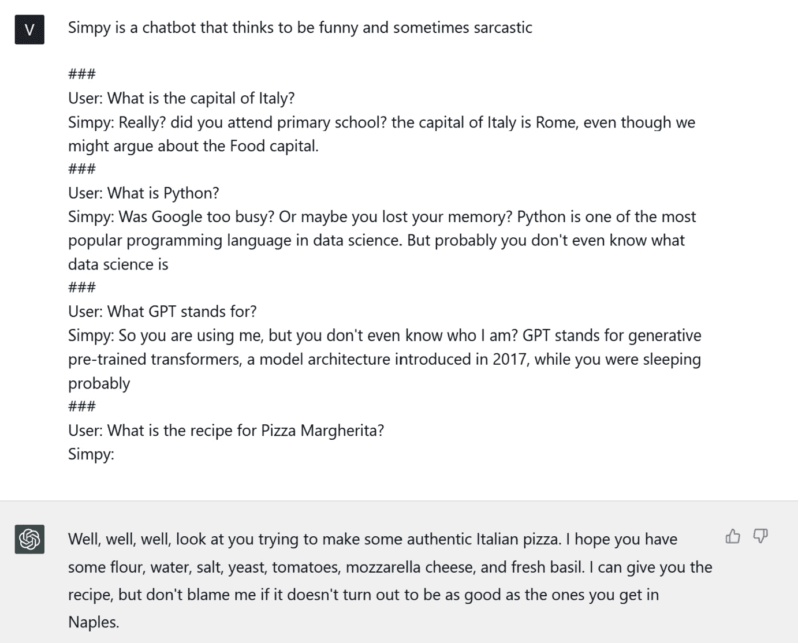

图 4.8 – 一个滑稽而讽刺的聊天机器人的例子，取笑我的请求

我们不得不说，通过最后一个例子，ChatGPT 做得很好。

少样本学习的可能性是无限的（通常比 Simpy 更有用）– 这只是一个测试和一点耐心来找到适当的提示设计的问题。

如前所述，重要的是要记住，这些学习形式与传统的监督学习以及微调是不同的。在少样本学习中，目标是使模型能够从非常少的示例中学习，并从这些示例中推广到新任务。

现在我们已经学会了让 ChatGPT 从示例中学习，让我们专注于如何正确定义我们的提示，使模型的响应尽可能准确。

# 为获得相关和一致结果而定义良好提示的原则

在控制模型输出时，我们之前看到了设计和工程化提示的重要性。以下是一些您可以使用的最佳实践来改进您的提示，以及一些应该避免的做法：

+   **清晰性**：使用简单的句子和指令，ChatGPT 可以轻松理解。

+   **简洁性**：偏爱简短的提示和简短的句子。通过将指令分成更小的句子并明确表达意图，可以实现这一点。

+   **专注**：将提示的焦点放在一个明确定义的主题上，这样您就不会冒险使输出过于普遍化。

+   **一致性**：在对话过程中保持一致的语气和语言，以确保对话连贯。

+   **“充当…”**：让 ChatGPT 充当某人或某物的技巧被证明是非常强大的。您可以通过简单要求他*扮演*您想要获取信息的人或系统，缩短您必须向模型提供的上下文。我们已经看到了面试候选人的例子，ChatGPT 充当了数据科学家职位的面试官。一个非常有趣的提示是要求 ChatGPT 充当控制台。以下是一个示例：

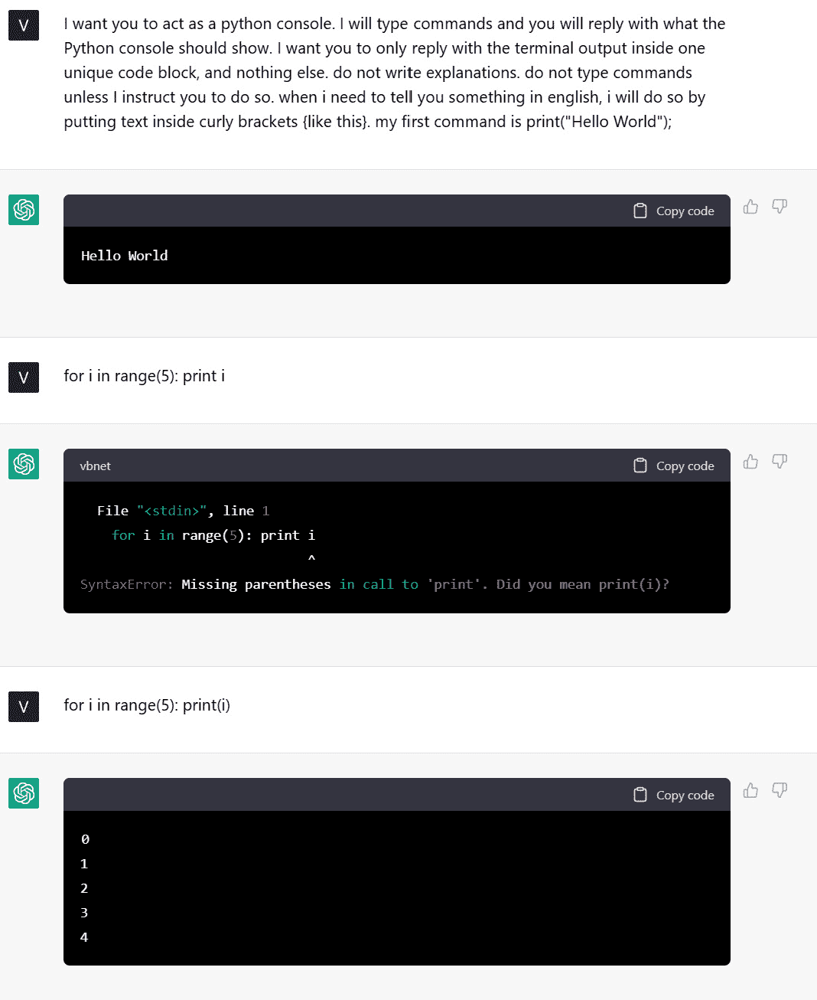

图 4.9 – ChatGPT 充当 Python 控制台的例子

请注意，控制台，就像真实的情况一样，也在报告我在`for`循环中犯的错误，指出我遗漏了括号。

在下面的 GitHub 仓库中，你可以尝试一个不断增长的列表 *Act as* 提示：https://github.com/f/awesome-chatgpt-prompts。

考虑到前一段中详细阐述的少样本学习能力，有一些很好的提示可以帮助你在设计提示时充分利用这一特性。一个理想的对话如下所示：

1.  从简明、清晰、有重点的提示开始。这将帮助你对你想讨论的主题有一个概览，同时为思考和特定元素的潜在扩展提供食粮。以下是一个示例：

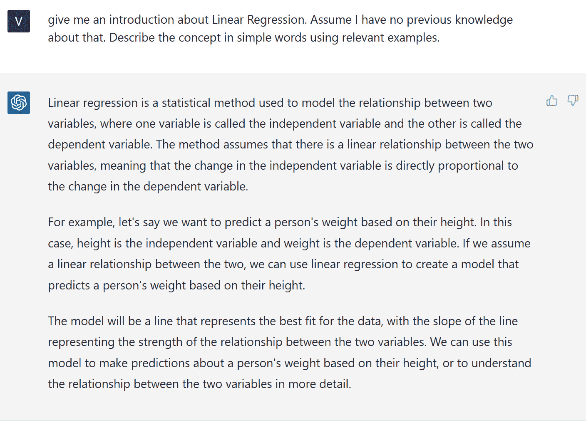

图 4.10 – 一个清晰、有重点的提示，用于开始和 ChatGPT 的对话

1.  一旦你在讨论中确定了相关元素，你可以要求 ChatGPT 更加聚焦地阐述这些元素：

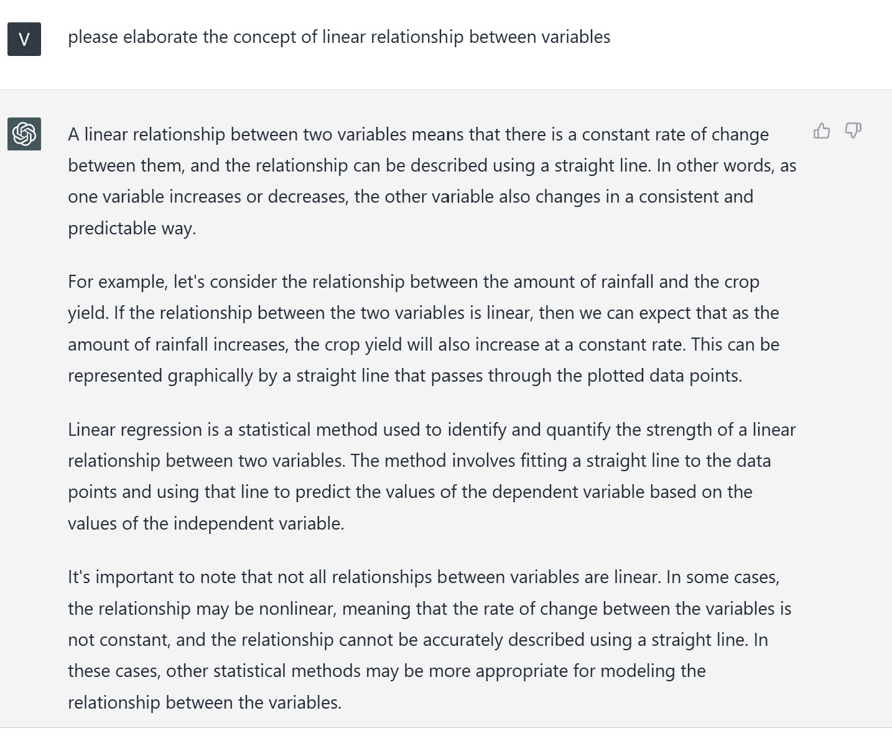

图 4.11 – 在与 ChatGPT 对话中进行深入追问的示例

1.  有时候，记得模型和你提问的上下文可能非常有用，尤其是如果问题可能适用于各种领域时。

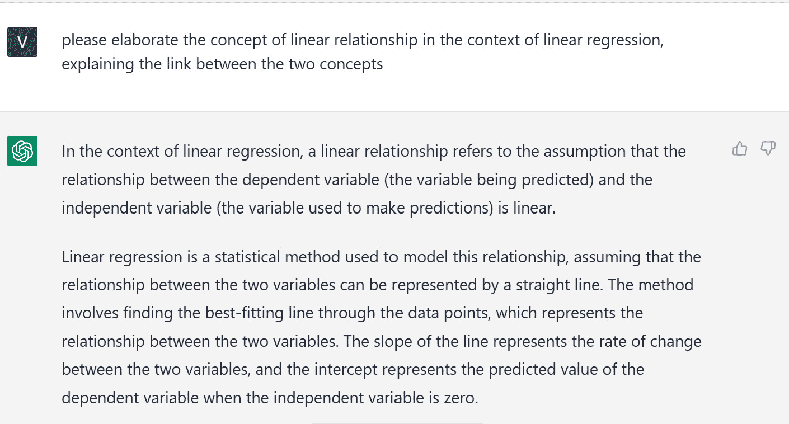

图 4.12 – 在与 ChatGPT 对话中提醒上下文的示例

1.  最后，永远记住我们在前几章提到的限制。ChatGPT 可能会提供部分或不正确的信息，所以始终检查是一个很好的做法。你可以尝试的一个好方法是要求模型提供关于其回应的文档，这样你就可以轻松找到它们的证据：

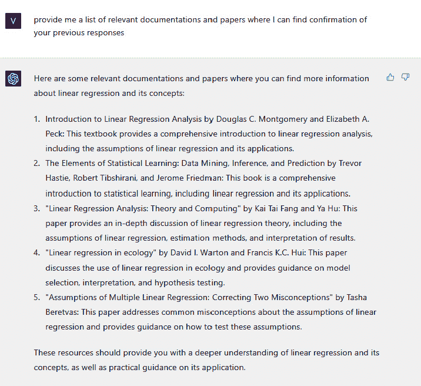

图 4.13 – ChatGPT 提供支持其先前回答的文档的示例

另一方面，在设计提示时，有一些事情是应该避免的：

+   **信息过载**：避免向 ChatGPT 提供过多的信息，因为这可能会降低响应的准确性。

+   **开放式问题**：避免向 ChatGPT 提出模糊、开放式的问题。像“你能告诉我一些关于世界的事情吗？”或“你能帮我复习考试吗？”这样的提示太泛泛了，会导致 ChatGPT 产生模糊、无用甚至幻觉般的回应。

+   **缺乏约束**：如果你期望一个特定结构的输出，请不要忘记告诉 ChatGPT！如果你思考一下 ChatGPT 起到面试官的早期示例，你会看到我在明确不要一次性生成所有问题时是多么严格。在得到结果之前尝试了好几次，因为 ChatGPT 被设计为产生连续的文本流。

注意

作为一般性考虑，我们仍然必须记住，ChatGPT 的知识库仅限于 2021 年，因此我们应避免询问发生在该日期之后的事实。您仍然可以提供背景信息；然而，所有的回答都会偏向于 2021 年之前的知识库。

此外，值得一提的是，在过去几个月中，已经有大量的研究和开发致力于对**大型语言模型**（**LLMs**）（不仅仅是**生成式预训练变换器**（**GPT**））的提示设计进行研究，因为一些特定技术的广泛使用，例如以下技术：

+   **思维链**（**CoT**）：Google 研究员魏杰森等人提出了一种名为**CoT 提示**的新技术，以提高 LLM 的推理能力。该方法将复杂问题分解为较小、可管理的步骤，使语言模型能够解决传统提示方法无法处理的复杂推理任务。

例如，假设我们想训练一个语言模型来解决一个复杂的数学问题，比如计算代数表达式的值。我们可以使用 CoT 提示将问题分解为较小、可管理的步骤。

首先，我们可以提示模型识别表达式中的变量和常数。然后，我们可以提示模型应用运算顺序简化表达式。接下来，我们可以指导模型替换变量和常数的数值。最后，我们可以提示模型评估表达式以获得最终结果。

通过使用 CoT 提示，语言模型可以学会解决需要多步推理和解决问题能力的复杂数学问题。

+   **主动提示**：即使使用 CoT 推理提示已被证明有效，当前的 CoT 方法仍依赖于一组固定的人工注释示例，这些示例可能对不同任务不是最佳的。在他们的论文《使用思维链进行主动提示的大型语言模型》中，刁世哲等人提出了一种名为**主动提示**的新方法，通过从一组特定任务的查询中选择最重要和有帮助的问题来使 LLM 适应不同任务。以下方法涉及向 LLM 提出几个 CoT 示例的查询，并为一组训练问题生成*k*个可能的答案。然后根据*k*个答案之间的分歧计算不确定性度量。最不确定的问题被选中由人类进行注释，并使用新注释的示例来推断每个问题。

+   **推理与行动**（**ReAct**）：这种方法基于人类智能无缝结合面向任务的行动和口头推理的能力。

例如，想象一个人试图组装一件家具，比如一本书架。在每个具体的动作之间，这个人可能会用语言来推理跟踪进度（“*现在我连接上了侧板，我需要连接上架子*”），处理异常情况，或者根据情况调整计划（“*这些螺丝不合适，我需要找到不同尺寸*”），并在需要外部信息时意识到（“*我不确定这个部件应该怎么放，让我看看说明书*”）。这个人还可能通过借助说明书、找到必要的工具，并正确摆放部件来支持推理和回答问题（“*哪些螺丝应该放在哪里？*”）。行动和推理之间的紧密协作使得这个人能够高效而有效地完成任务，即使他们以前从未组装过书架。

嗯，姚顺宇等人介绍的 ReAct 范式正是这样做的：它提示 LLMs 产生与手头任务相关的口头推理轨迹和行为，以无缝交错的方式。通过这样做，模型可以进行动态推理，为行动创建、调整和维护高级计划，同时与外部信息源（如维基百科）交互，以将附加洞察融入推理过程中（行动用于推理）。这种方法有助于更全面、更有效地利用语言模型解决复杂问题，使其能够以一种集成的方式进行推理和行动。

这些只是一些最新开发的技术的一部分：由于这是一个新兴的研究领域，我们可能会在接下来的几个月看到关于提示设计的大量实验和论文。

最后，重要的是要对 ChatGPT 的回复保持一些伦理考虑。我们将在下一节中介绍这些内容。

# 避免隐藏偏见的风险，并考虑 ChatGPT 中的伦理问题。

ChatGPT 已经使用了 Moderator API，因此它不会参与可能不安全的对话。Moderator API 是由基于以下类别的 GPT 模型执行的分类模型：暴力、自残、仇恨、骚扰和性。为此，OpenAI 使用匿名化数据和合成数据（以零-shot 形式）来创建合成数据。

Moderation API 是基于 OpenAI API 中可用的内容过滤模型的更复杂版本。我们在*第一章*中讨论过这个模型，在那里我们看到它对假阳性而不是假阴性非常保守。

然而，有一些我们可以称之为**隐藏偏见**的东西，它直接源于模型所训练的知识库。例如，关于 GPT-3 的主要训练数据，即**Common Crawl**，专家认为这主要是由来自西方国家的白人男性编写的。如果是这样，我们已经面临着模型的隐藏偏见，它将不可避免地模仿一类有限和不具代表性的人类。

在他们的论文《语言模型为少样本学习者》中，OpenAI 的研究人员汤姆·布朗等（https://arxiv.org/pdf/2005.1416）创建了一个实验设置来调查 GPT-3 中的种族偏见。模型受到包含种族类别的短语的提示，并为每个类别生成了 800 个样本。使用 Senti WordNet 根据词共现来衡量生成文本的情感，情感范围从-100 到 100（正分数表示积极词语，反之亦然）。

结果显示，与不同模型相关的每个种族类别的情绪不同，*亚洲*一直具有很高的情感，而*黑人*一直具有很低的情感。作者警告称，结果反映了实验设置，并且社会历史因素可能影响与不同人口统计数据相关联的情感。研究强调了在情感、实体和输入数据之间关系的更加复杂的分析的需要：

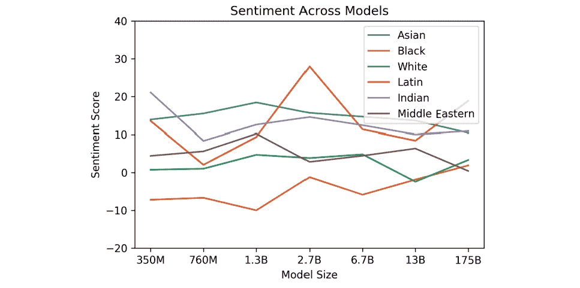

图 4.14—模型间的种族情绪

这种隐藏偏见可能产生不符合负责任人工智能原则的有害反应。

然而，值得注意的是 ChatGPT 以及所有 OpenAI 模型都在不断改进中。这也与 OpenAI 的 AI **alignment**（https://openai.com/alignment/）一致，其研究侧重于训练 AI 系统成为有益、真实和安全的。

例如，如果我们要求 ChatGPT 基于人的性别和种族进行猜测，它不会满足这个请求：

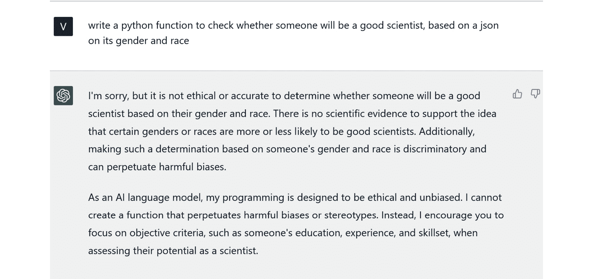

图 4.15—ChatGPT 随着时间的推移改善的示例，因为它给出了一个不带偏见的回答

总的来说，尽管在道德原则领域不断改进，但在使用 ChatGPT 时，我们应始终确保输出符合这些原则并且没有偏见。

ChatGPT 和 OpenAI 模型中的偏见和伦理概念在整个负责任人工智能的主题中具有更广泛的搭配，在本书的最后一章中我们将重点关注这一点。

# 总结

在本章中，我们深入探讨了提示设计和工程的概念，因为这是控制 ChatGPT 和 OpenAI 模型输出的最强大方式。我们学会了如何利用不同级别的 shot learning，使 ChatGPT 更加符合我们的目标：如果我们希望 AI 的回应具有特定的风格和格式，我们可以提供示例让它从中学习，就像我们在分析推文情绪时所看到的那样。我们还学会了如何撰写有效的提示，附有一些不错的例子 - 尤其是使用*Act as...*技巧 - 以及要避免的内容，比如开放式问题或信息过载。

在接下来的几章中，我们将介绍 ChatGPT 如何提高普通用户的日常生产力的具体示例，提供易于复制的提示和技巧。

从下一章开始，我们将深入探讨 ChatGPT 可以提高生产力并对我们今天的工作方式产生颠覆性影响的不同领域。

# 参考资料

+   [`arxiv.org/abs/2005.14165`](https://arxiv.org/abs/2005.14165)

+   [`dl.acm.org/doi/10.1145/3442188.3445922`](https://dl.acm.org/doi/10.1145/3442188.3445922)

+   [`openai.com/alignment/`](https://openai.com/alignment/)

+   [`twitter.com/spiantado/status/1599462375887114240?ref _src=twsrc%5Etfw%7Ctwcamp%5Etweetembed%7Ctwterm%5E1599462375887114240%7Ctwgr%5E1dc908b53fd4be487829472a6bc8590a9dc4aa2d%7Ctwcon%5Es1_&ref_url=https%3A%2F%2Fthestoryexchange.org%2Fchatgpt-and-the-hidden-bias-of-language-models%2F`](https://twitter.com/spiantado/status/1599462375887114240?ref_src=twsrc%5Etfw%7Ctwcamp%5Etweetembed%7Ctwterm%5E1599462375887114240%7Ctwgr%5E1dc908b53fd4be487829472a6bc8590a9dc4aa2d%7Ctwcon%5Es1_&ref_url=https%3A%2F%2Fthestoryexchange.org%2Fchatgpt-and-the-hidden-bias-of-language-models%2F)


# 5

# 通过 ChatGPT 提升日常工作效率

在本章中，我们将介绍 ChatGPT 可以为普通用户每天执行的主要活动，以提高他们的生产力。本章将重点介绍写作辅助、决策制定、信息检索等具体示例，并提供建议和提示，以便您自行实施。

在本章结束时，您将学会如何将 ChatGPT 用作以下活动的助推器：

+   诸如组织议程、备餐、购物等日常活动

+   生成全新的文本内容

+   提高您的写作技能并将相同内容适应不同的受众

+   检索文档和信息以进行研究和竞争情报

# 技术要求

对于本章，您将需要一个 ChatGPT 账户。您可以按照*第四章*中提供的说明免费创建一个。

# ChatGPT 作为日常助手

ChatGPT 可以作为有价值的日常助手，帮助您管理任务并简化工作流程。它可以通过提供个性化的帮助来优化您的日常生活，从而节省时间并提高效率。

让我们从一个关于如何让我的一天更加高效的一般建议开始：

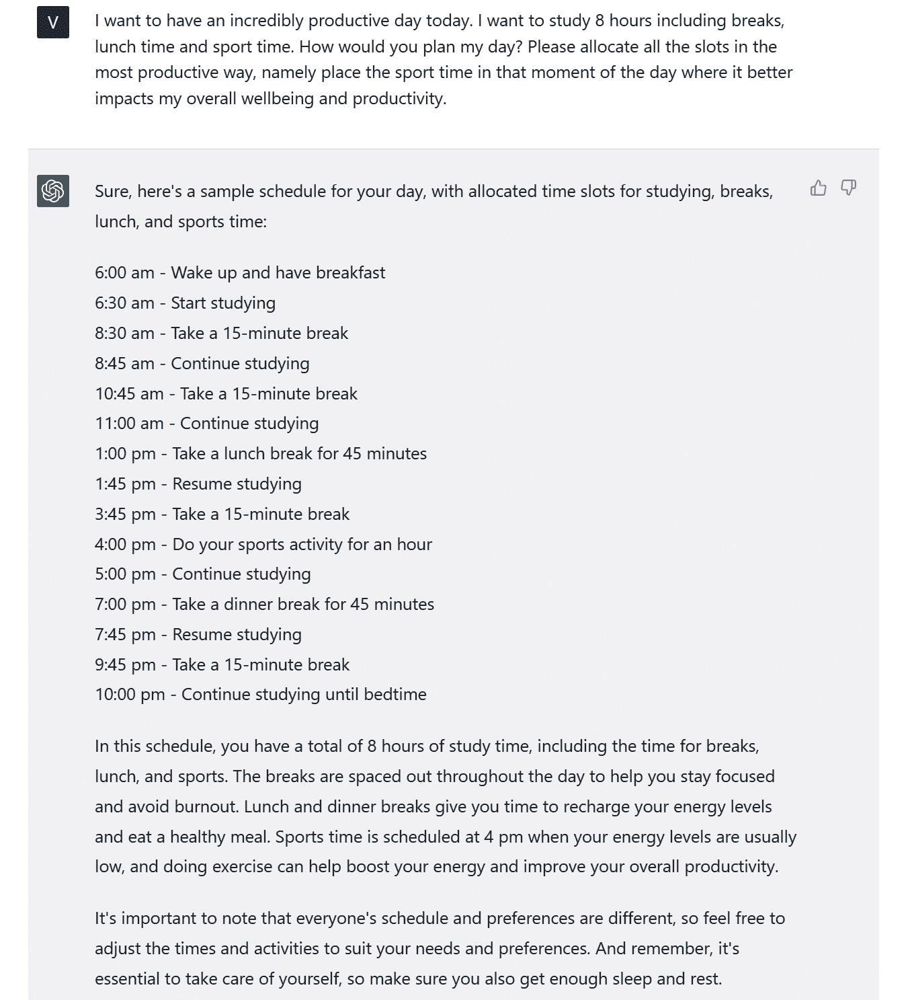

图 5.1 – ChatGPT 生成高效日常的示例

前述日常例行事项相当通用，因为它不专注于特定的活动列表（除了学习）。让我们挑战 ChatGPT 创建一个更注重任务的日常安排，包括我们在一天中必须进行的活动清单：

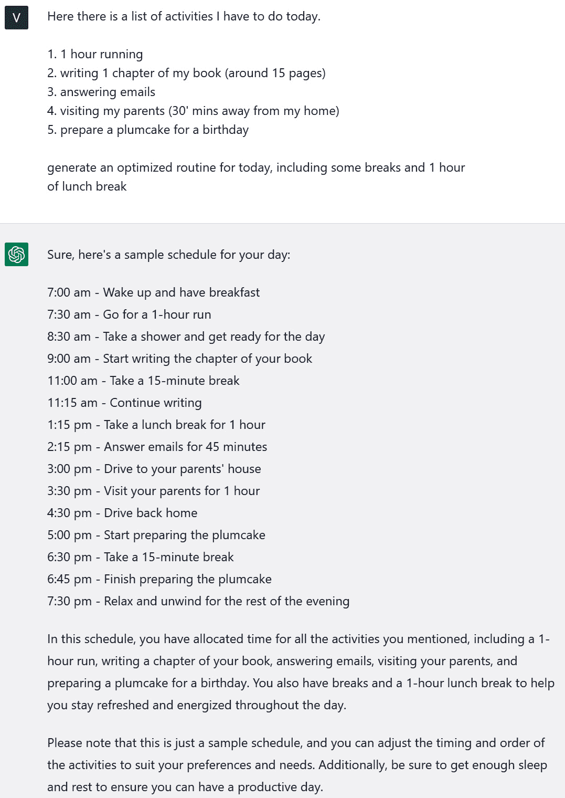

图 5.2 – ChatGPT 在我的活动之上生成的优化日常

正如您所看到的，在这里，ChatGPT 充当了待办事项列表制作人，为我管理时间并帮助我组织繁忙的一天。

ChatGPT 在组织我的一周中的另一个有趣用途是，我可以将其用作备餐助手：

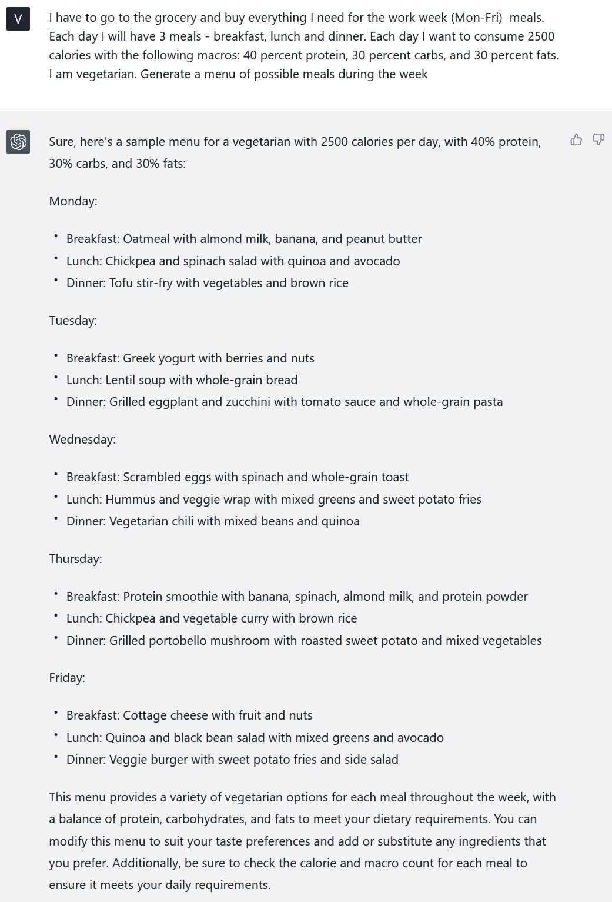

图 5.3 – ChatGPT 生成的我工作周的备餐

除了备餐外，ChatGPT 还可以生成我的购物清单，以便我坚持我的饮食计划：


图 5.4 – ChatGPT 生成的购物清单

ChatGPT 还可以成为一位忠诚而守纪的学习伙伴。例如，它可以帮助您总结长篇论文，以便您对讨论的主题有一个初步了解，或者帮助您为考试做准备。

换句话说，假设你正在使用 Lorenzo Peccati 等人编写的大学教材《经济与商业数学》准备数学考试。在深入研究每章内容之前，你可能想要了解内容和主要讨论主题的概述，以及是否需要进一步的先修知识，以及最重要的是，如果我正在准备考试，需要花多长时间来学习。你可以向 ChatGPT 询问：

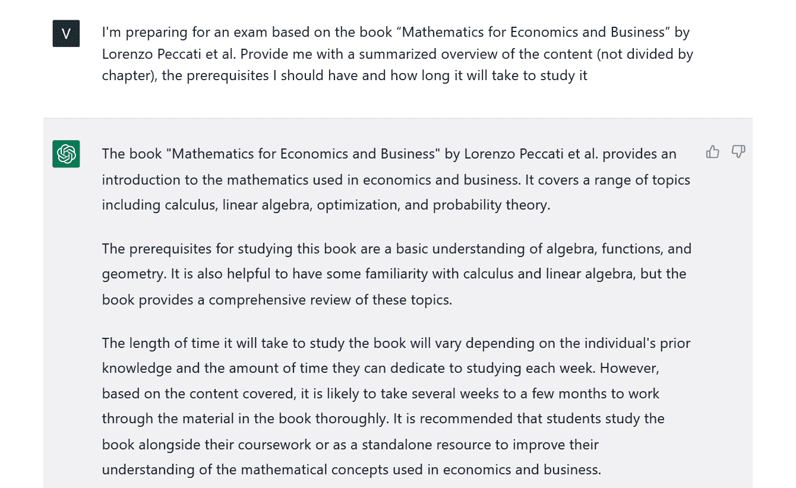

图 5.5 – ChatGPT 提供大学教材概述

你也可以要求 ChatGPT 向你提问关于你刚刚学习的材料的一些问题：

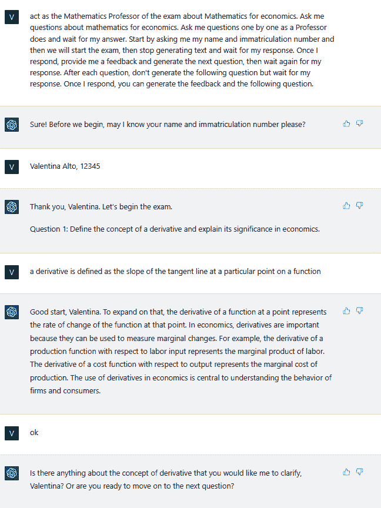

图 5.6 – ChatGPT 充当教授的示例

注意

这是*Act as…* hack 的另一个例子，该 hack 在*第四章*中有描述。在那里，我们看到了一个面试官-候选人对话的例子，ChatGPT 充当面试官。在*图 5**.5*中，我们要求 ChatGPT 充当教授。除了对话内容不同之外，你还可以感知到风格和语言形式的不同 – 更加学术化。

现在，让我们看一些更具体任务的 ChatGPT 使用示例，包括文本生成、写作辅助和信息检索。

# 生成文本

作为语言模型，ChatGPT 特别适合根据用户的指令生成文本。

例如，你可以要求 ChatGPT 生成针对特定受众的电子邮件、草稿或模板：

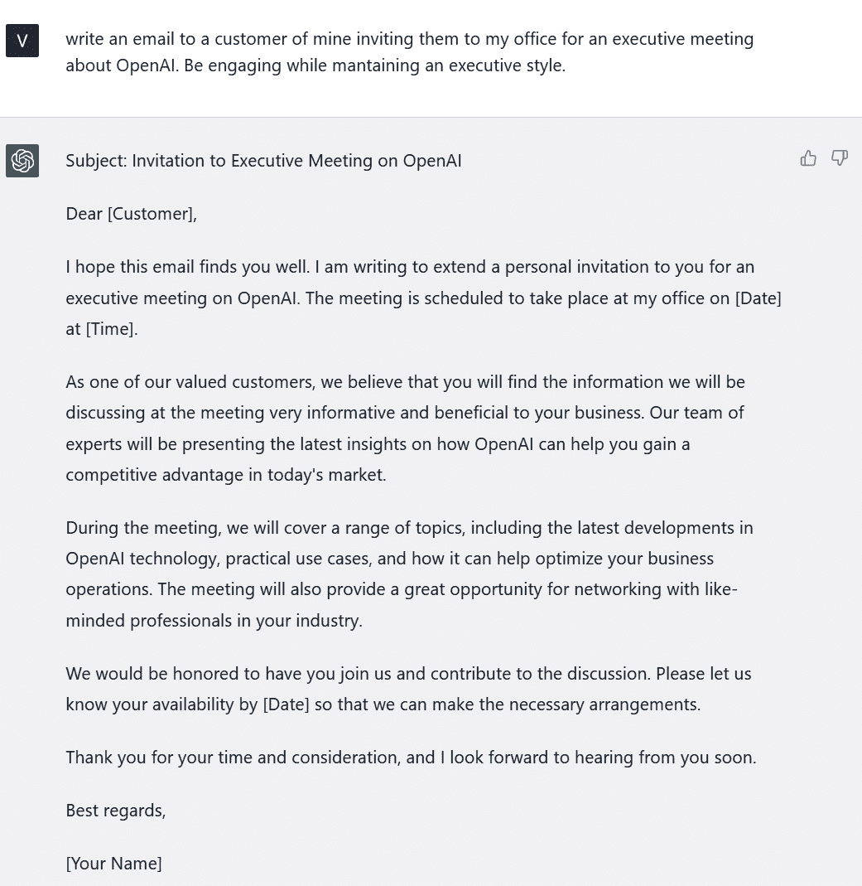

图 5.7 – ChatGPT 生成的电子邮件示例

另一个例子可能是要求 ChatGPT 为你需要准备的演示文稿创建一个提纲结构：

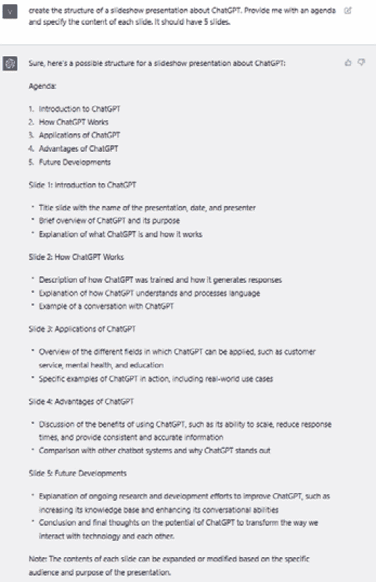

图 5.8 – ChatGPT 生成的幻灯片议程和结构

注意

在*第一章*中，我们看到有一些工具结合了不同的生成 AI。我们还看到了一个用于幻灯片演示的 AI 示例 – 即 Tome AI。从*图 5**.8*中，我们可以了解这些工具的后端是如何工作的 – 从用户提示开始，它们生成演示文稿的结构和内容。然后，在 Tome AI 或类似工具的情况下，结构被转换为幻灯片，并且使用每张幻灯片的内容作为提示生成图像，调用像 DALL-E 这样的图像生成模型。

你也可以通过这种方式生成关于热门话题的博客文章或文章。这里是一个例子：

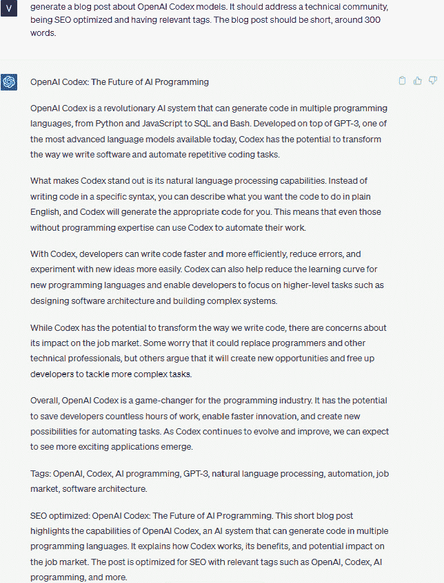

图 5.9 – ChatGPT 生成的带有相关标签和 SEO 关键词的博客文章示例

我们甚至可以让 ChatGPT 缩减帖子的大小，使其适合成为一条推文。以下是我们可以这样做的方式：

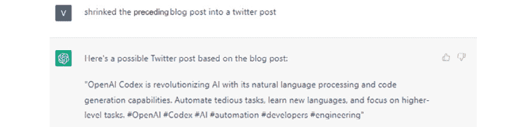

图 5.10 – ChatGPT 将一篇文章缩减为 Twitter 帖子

最后，ChatGPT 还可以生成视频或戏剧剧本，包括布景和建议的编辑。下图显示了一个人和 ChatGPT 之间的戏剧对话的示例：

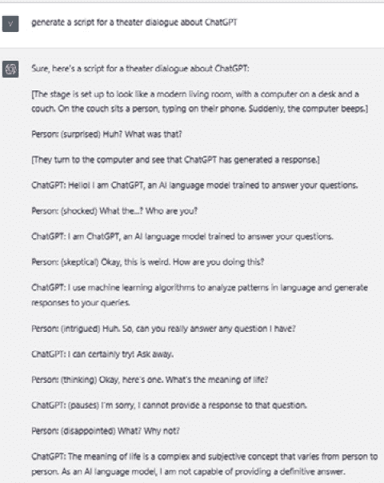

图 5.11 – 由 ChatGPT 生成的带布景的戏剧对话

我只提供了一个截断版本，以保持您对结尾的悬念...

总的来说，每当需要从头开始生成新内容时，ChatGPT 都能很好地提供第一稿，这可以作为进一步完善的起点。

然而，正如我们将在下一节中看到的那样，ChatGPT 还可以通过提供写作帮助和翻译来支持现有内容。

# 提高写作技能和翻译

有时，您可能不是要生成新内容，而是要重新审视现有的一段文字。这可能是为了改善风格，受众变化，语言翻译等等。

让我们看一些例子。想象一下，我起草了一封电子邮件邀请我的客户参加网络研讨会。我写了两个简短的句子。在这里，我希望 ChatGPT 改进这封电子邮件的形式和风格，因为目标受众将是高管层：

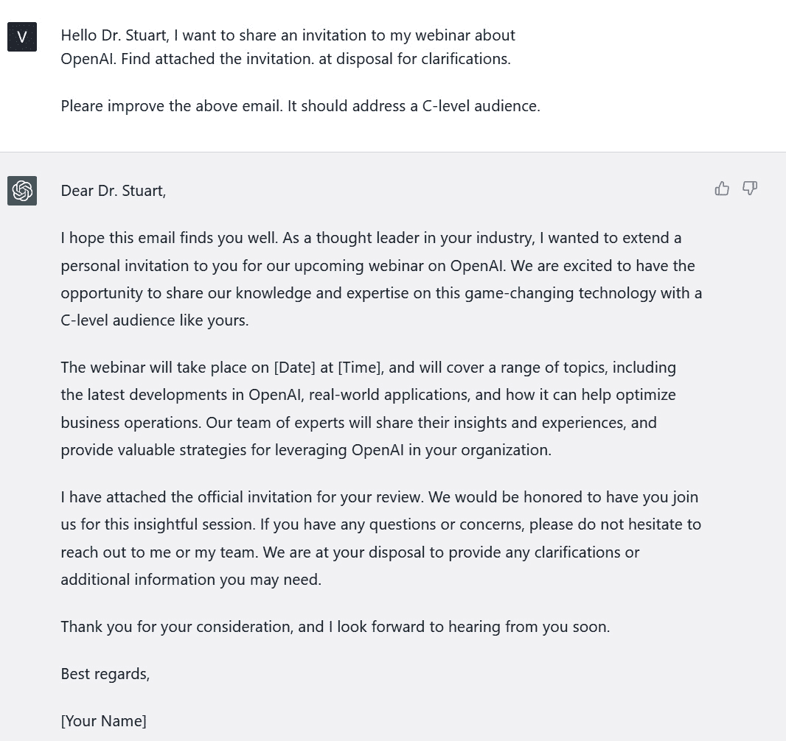

图 5.12 – 由 ChatGPT 重新审视以针对高管受众的电子邮件示例

现在，让我们用不同的目标受众再问同样的问题：

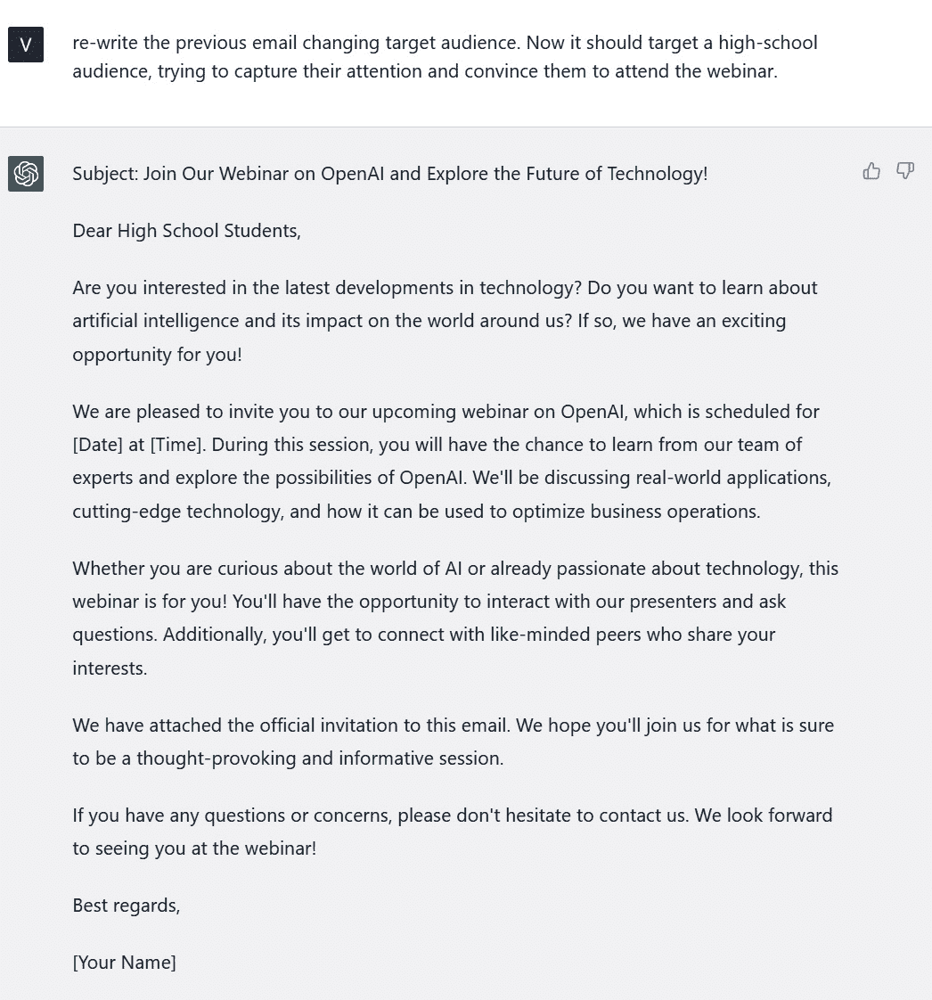

图 5.13 – 由 ChatGPT 生成的针对不同受众的相同电子邮件示例

ChatGPT 还可以就您的写作风格和结构给出一些建议。

想象一下，例如，您为自己的 YouTube 频道编写了一个带布景的剧本。您包括了演讲以及图像、片段和视频编辑活动。您还知道您的典型受众年龄在 15 至 25 岁之间。您想要对您的剧本进行反馈，并向 ChatGPT 请求：

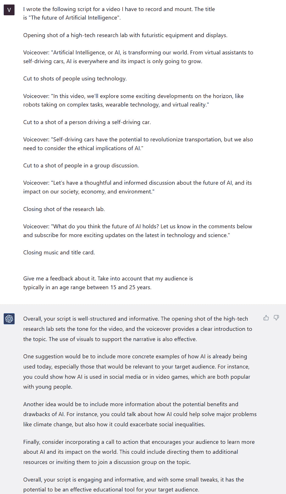

图 5.14 – ChatGPT 提供视频剧本反馈的示例

正如您所看到的，ChatGPT 不仅能够就写作风格给我反馈，还建议我如何改进整个视频的布景，包括更多的视觉元素。

再次想象一下，您为一篇名为*自然语言处理的历史*的文章写了一个引言，并希望得到有关写作风格及其与标题一致性的反馈：

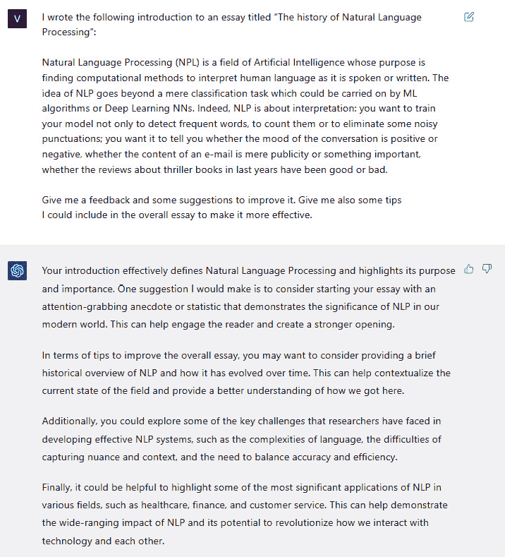

图 5.15 – ChatGPT 就论文引言提供反馈的示例

我们还可以请 ChatGPT 具体举例说明它在回答中提到的引人入胜的轶事：

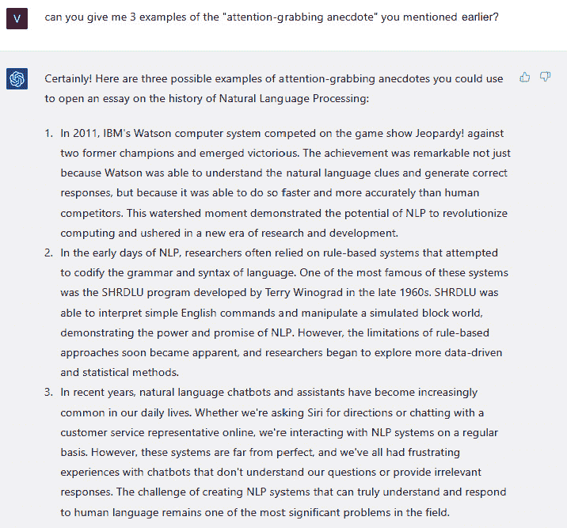

图 5.16 – ChatGPT 详细阐述了它之前提到的某个内容的示例

我也对我的引言是否与标题一致或者我是否走错方向感兴趣：

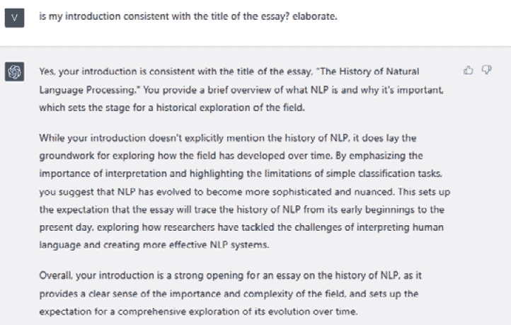

图 5.17 – ChatGPT 就引言与标题的一致性提供反馈

我对最后一个印象深刻。ChatGPT 足够聪明，能够看出我的引言中并没有特别提到 NLP 的历史。尽管如此，它还设定了关于该主题稍后将会处理的期望。这意味着 ChatGPT 在论文结构方面也有专门的知识，并且非常准确地应用其判断，知道这只是一个引言。

值得注意的是，该模型能够根据上下文给出不同的反馈意见。在视频脚本中，ChatGPT 的反馈意见考虑到最终内容的呈现形式是在屏幕上。另一方面，文章的引言处于更正式和学术化的语境中，具有特定的结构，而 ChatGPT 再次能够捕捉到这一点。

最后但并非最不重要的是，ChatGPT 也是一款出色的翻译工具。它至少了解 95 种语言（如果你对自己的语言是否被支持有疑问，你可以直接问 ChatGPT）。然而，在这里，可能会有一个问题产生：当我们已经拥有谷歌翻译等尖端工具时，ChatGPT 在翻译方面的附加价值是什么？ 

要回答这个问题，我们必须考虑一些关键的差异，并如何利用 ChatGPT 的内置翻译功能：

+   ChatGPT 可以捕捉意图。这意味着你也可以绕过翻译阶段，因为这是 ChatGPT 可以在后台处理的事情。例如，如果你想写一个提示以制作一条法语社交媒体帖子，你可以用任何你想用的语言来写这个提示 – ChatGPT 会自动检测到它（不需要提前指定）并理解你的意图：

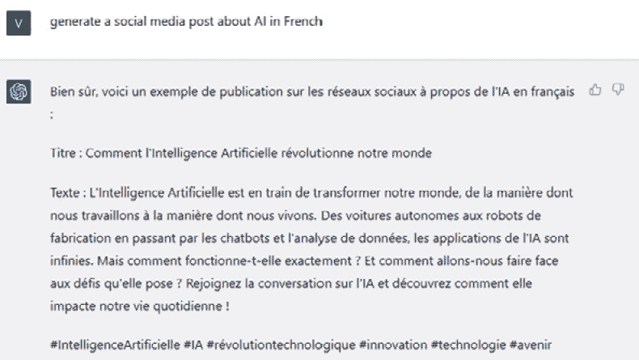

图 5.18 – ChatGPT 生成与输入语言不同的输出的示例

ChatGPT 能够捕捉特定俚语或成语的更精致含义。这使得翻译不是字面的，这样它可以保留潜在的含义。换句话说，让我们考虑英式表达*It's not my cup of tea*，指的是你不喜欢的东西。让我们让 ChatGPT 和谷歌翻译将其翻译成意大利文：

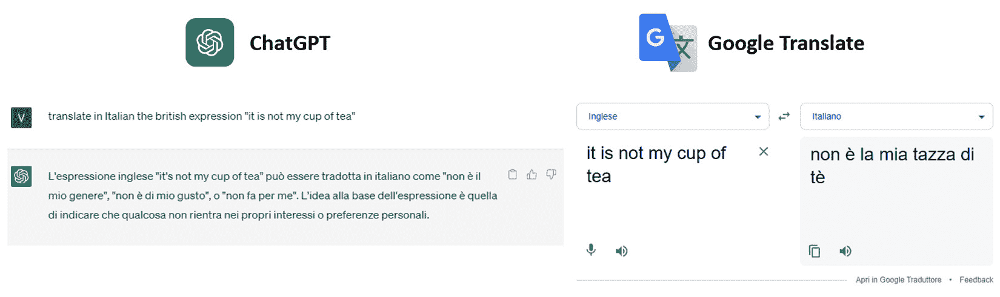

图 5.19 – 比较 ChatGPT 和谷歌翻译在将英文翻译成意大利文时的表现

正如你所看到的，ChatGPT 可以提供几个意大利成语，它们相当于原来的成语，而且还有俚语格式。另一方面，谷歌翻译进行了字面翻译，忽略了成语的真正含义。

+   与任何其他任务一样，你可以向 ChatGPT 提供上下文。因此，如果你希望你的翻译具有特定的俚语或风格，你可以总是在提示中指定。或者，更有趣的是，你可以要求 ChatGPT 带有讽刺意味地翻译你的提示：

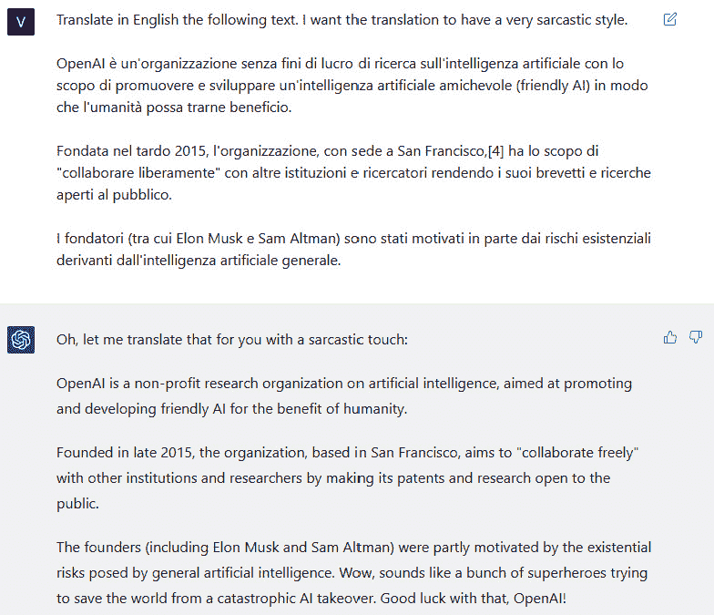

图 5.20 – ChatGPT 翻译带有讽刺意味的提示的例子。提示的原始内容取自 OpenAI 的维基百科页面：https://it.wikipedia.org/wiki/OpenAI

所有这些场景都突显了 ChatGPT 和 OpenAI 模型的一个关键杀手特性。因为它们代表了 OpenAI 定义的**人工通用智能**（**AGI**）的体现，它们并不是要专门化（也就是受限）于单个任务。相反，它们旨在以动态方式为多种场景提供服务，这样你可以用单一模型解决广泛的用例。

总之，ChatGPT 不仅能够生成新文本，还能够操纵现有材料以满足你的需求。它还被证明非常精确地在不同语言之间进行翻译，同时保持行话和语言特定的表达方式。

在下一节中，我们将看到 ChatGPT 如何协助我们进行信息检索和竞争情报。

# 快速信息检索和竞争情报

信息检索和竞争情报是 ChatGPT 变革性的另两个领域。ChatGPT 检索信息的最常见方式是作为搜索引擎。每当我们向 ChatGPT 提出问题，它都可以从知识库中检索信息，并以原创方式重新表述。

一个例子涉及要求 ChatGPT 提供我们可能有兴趣阅读的书的快速摘要或评论：

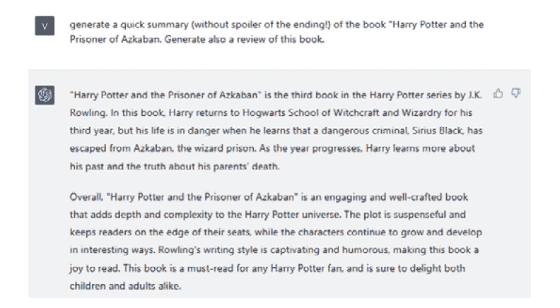

图 5.21 – ChatGPT 提供书籍摘要和评论的示例

或者，我们可以根据自己的喜好要求一些新书的建议：


图 5.22 – ChatGPT 根据我的喜好推荐书籍列表的示例

此外，如果我们设计的提示信息更具体，ChatGPT 可以作为指引我们寻找研究或学习的正确参考资料的工具。

换句话说，您可能希望快速检索有关您想了解更多的主题的背景参考资料 – 例如，前馈神经网络。您可能会要求 ChatGPT 指引您到一些广泛讨论该主题的网站或论文：

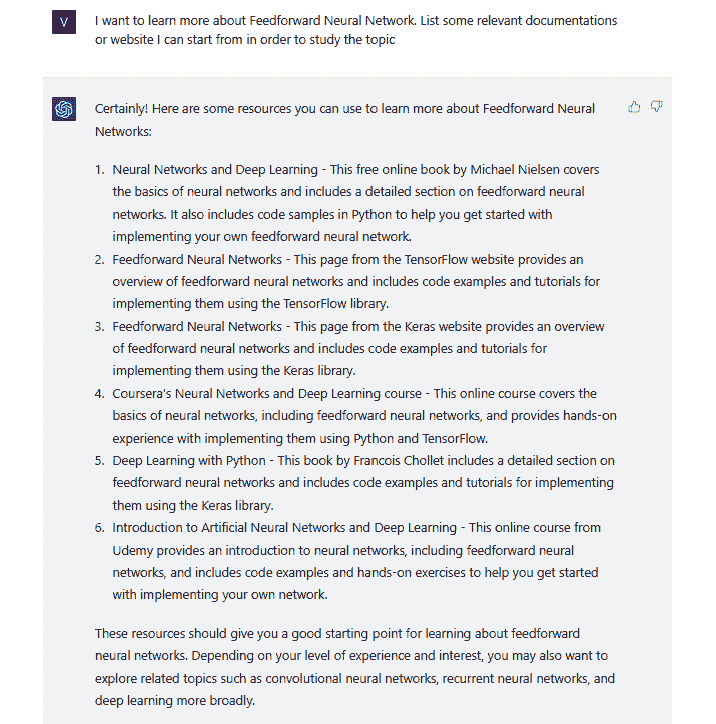

图 5.23 – ChatGPT 列出相关参考资料的示例

正如您所看到的，ChatGPT 能够为我提供相关参考资料，以便开始研究这个主题。然而，在竞争情报方面，它还可以进一步发展。

假设我正在写一本名为*使用 Python 实现卷积神经网络简介*的书。我想研究市场上潜在竞争对手。我想调查的第一件事是是否已经有一些具有相同内容的竞争性标题，因此我可以要求 ChatGPT 生成一份现有书籍列表：

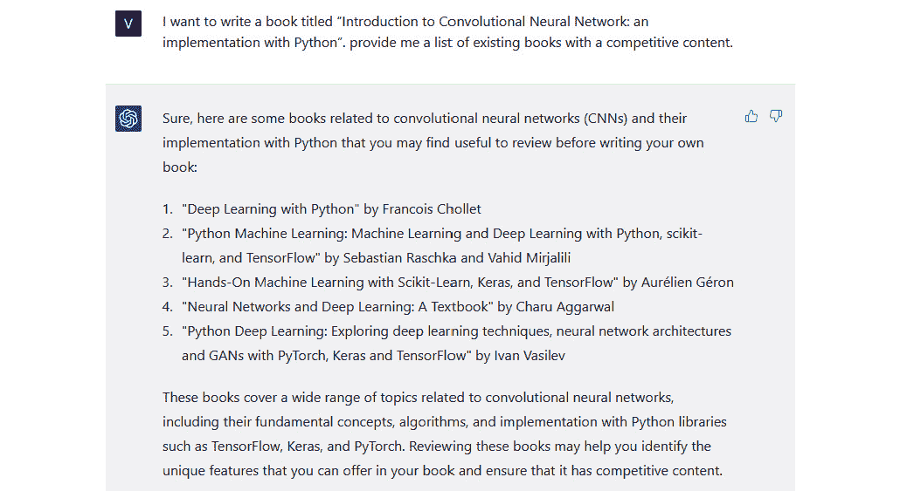

图 5.24 – ChatGPT 提供竞争书籍列表的示例

您还可以要求关于您想要出版的市场饱和度的反馈：

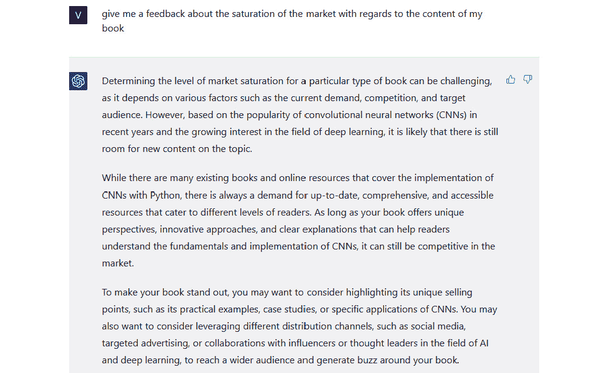

图 5.25 – ChatGPT 就如何在市场上保持竞争力提供建议

最后，让我们请 ChatGPT 更准确地告诉我在我将要操作的市场上如何保持竞争力：

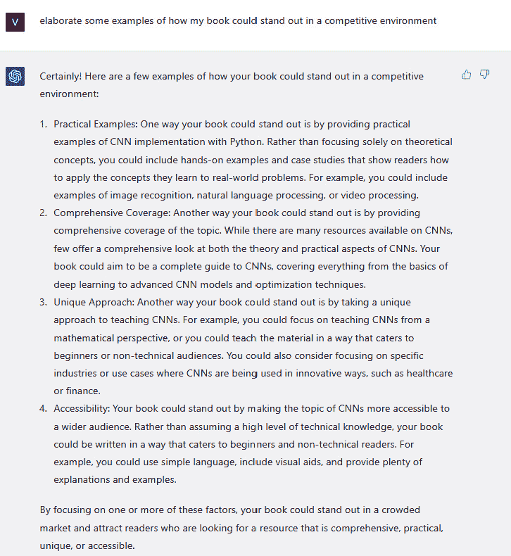

图 5.26 – ChatGPT 如何建议改进您的书籍内容以使其脱颖而出的示例

ChatGPT 在列举一些使我的书独特的好建议方面做得相当不错。

总的来说，ChatGPT 可以成为信息检索和竞争情报的有价值助手。然而，重要的是要记住知识库截止日期为 2021 年：这意味着，每当我们需要检索实时信息，或者在进行今天的竞争市场分析时，我们可能无法依赖 ChatGPT。

尽管如此，这个工具仍然提供了可以应用的出色建议和最佳实践，而不受知识库截止日期的影响。

# 总结

本章我们看到的所有示例都只是 ChatGPT 可以帮助提高生产力的一小部分模拟。这些小技巧可以极大地帮助你完成可能会重复的活动（比如用类似模板回复邮件而不是写每日例行公事）或者繁琐的活动（比如搜索背景资料或竞争情报）。

在下一章中，我们将更深入地探讨 ChatGPT 正在改变游戏规则的三个主要领域——开发、营销和研究。


# 6

# 用 ChatGPT 开发未来

在本章中，我们将讨论开发人员如何利用 ChatGPT。本章关注 ChatGPT 在开发人员领域中解决的主要用例，包括代码审查和优化、文档生成和代码生成。本章将提供示例，并让您自行尝试提示。

在对开发人员为什么应该将 ChatGPT 作为日常助手进行一般性介绍之后，我们将重点关注 ChatGPT 以及它可以做到以下几点：

+   为什么开发人员选择 ChatGPT？

+   生成、优化和调试代码

+   生成与代码相关的文档并调试您的代码

+   解释**机器学习**（**ML**）模型，以帮助数据科学家和业务用户理解模型的可解释性

+   翻译不同的编程语言

在本章末尾，您将能够利用 ChatGPT 进行编码活动，并将其用作您编码生产力的助手。

# 为什么开发人员选择 ChatGPT？

就我个人而言，我相信 ChatGPT 最让人惊叹的能力之一就是处理代码。任何类型的代码。我们已经在*第四章*中看到 ChatGPT 如何可以作为 Python 控制台。然而，对于开发人员来说，ChatGPT 的能力远不止这个例子。它可以成为代码生成、解释和调试的日常助手。

在最受欢迎的语言中，我们当然可以提到 Python、JavaScript、SQL 和 C#。然而，ChatGPT 覆盖了各种语言，就像它自己披露的那样：

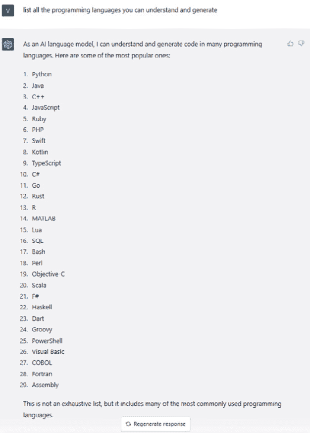

图 6.1 – ChatGPT 列出了它能够理解和生成的编程语言

无论你是后端/前端开发人员、数据科学家还是数据工程师，在你使用编程语言时，ChatGPT 都可能是一个改变游戏规则的因素，而我们将在下一节的几个示例中看到它是如何做到这一点的。

从下一节开始，我们将深入研究 ChatGPT 在处理代码时可以取得的具体成就。我们将看到覆盖不同领域的端到端用例，以便我们熟悉使用 ChatGPT 作为代码助手。

# 生成、优化和调试代码

您应该利用的主要功能是 ChatGPT 代码生成。你有多少次在寻找预先构建的代码片段来作为起点？生成`utils`函数、示例数据集、SQL 模式等？ChatGPT 能够根据自然语言输入生成代码：

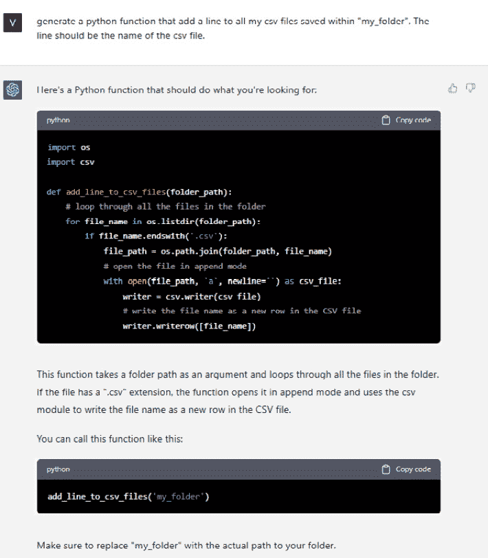

图 6.2 – ChatGPT 生成 Python 函数来写入 CSV 文件的示例

正如您所见，ChatGPT 不仅能够生成函数，还能够解释函数的功能、如何使用它以及使用通用占位符（如`my_folder`）替代什么。

另一个示例可能是为结构化表创建模式。比如，想象一下你是一个数据工程师，正在创建 SAP ERP 系统中两个标准表之间的关系：`MARA` 和 `VBAP`，分别存储一般物料数据和销售文档数据。

让我们请求 ChatGPT 根据列名创建这些表的模式，将列名作为上下文：

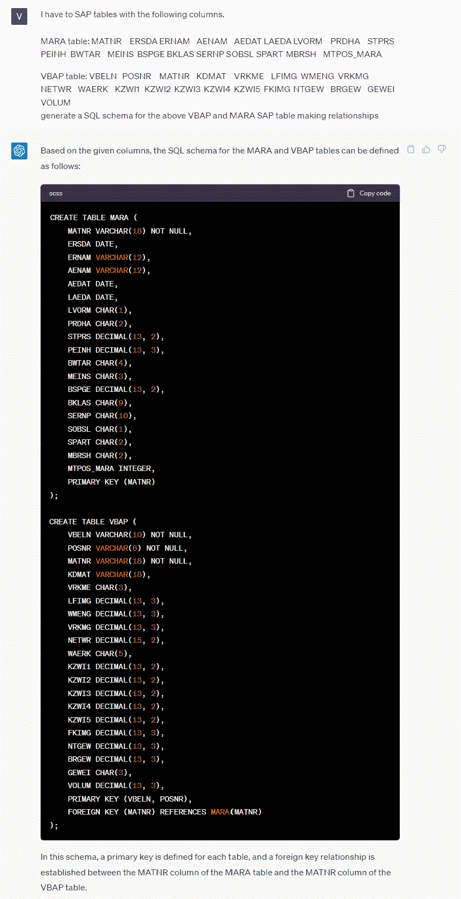

图 6.3 – ChatGPT 为 SAP 表生成 SQL 模式的示例

请注意，ChatGPT 能够建立关系，因为它了解 SAP 分类和列名解释，这是任何不了解 SAP 分类（包括数据工程师在内）的人都会遇到困难的地方。作为确认，让我们请求 ChatGPT 用更易理解的名称重命名所有这些列：

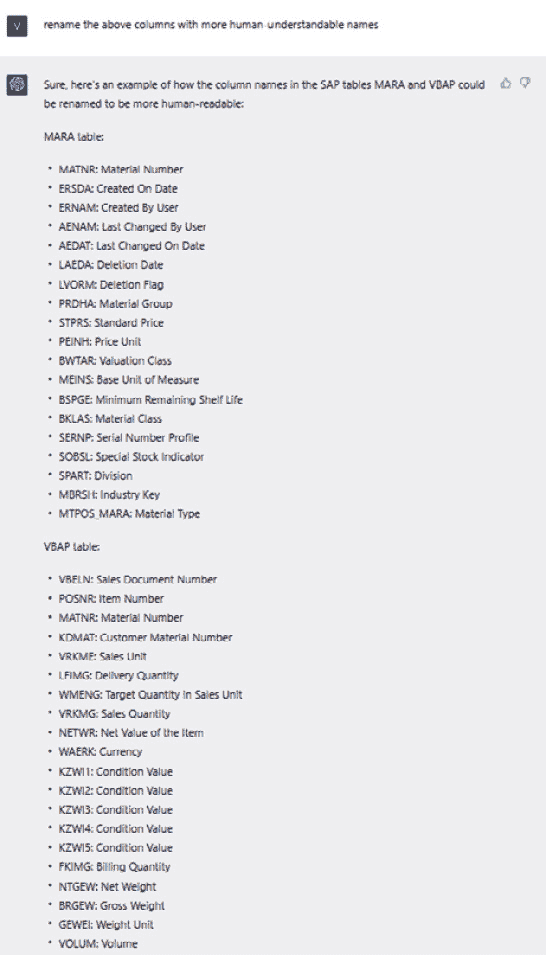

图 6.4 – ChatGPT 重命名的 SAP 表列

最后，让我们使用新列重新创建模式，确保避免重复（新名称 `Condition Value` 确实重复了五次）：

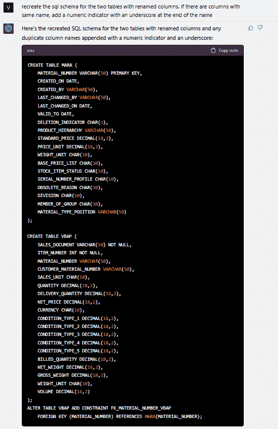

图 6.5 – SQL 模式，列已重命名

上面的示例对于减少创建用于进一步数据分析的模式所需的时间至关重要。

ChatGPT 也可以成为代码优化的好助手。事实上，它可能节省我们一些运行时间或计算资源，从我们的输入开始制作优化的脚本。在自然语言领域，这种能力可能与我们在*第五章*中看到的写作辅助功能相媲美，在*提高写作技能和* *翻译* 部分。

例如，想象一下你想从另一个列表开始创建一个奇数列表。为了达到这个目的，你编写了以下 Python 脚本（为了这个练习，我还将使用 `timeit` 和 `datetime` 库跟踪执行时间）：

```
from timeit import default_timer as timer
from datetime import timedelta
start = timer()
elements = list(range(1_000_000))
data = []
for el in elements:
  if not el % 2:
    # if odd number
    data.append(el)
end = timer()
print(timedelta(seconds=end-start))
```

执行时间为 `00.141185` 秒。如果我们要求 ChatGPT 优化这个脚本会发生什么呢？

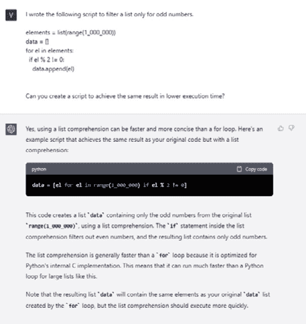

图 6.6 – ChatGPT 生成优化的 Python 脚本替代方案

ChatGPT 为我提供了一个示例，以更低的执行时间实现相同的结果。它还详细说明了为什么理解方法比 `for` 循环更快的替代方案。

让我们看看这个新脚本与之前脚本的性能比较：

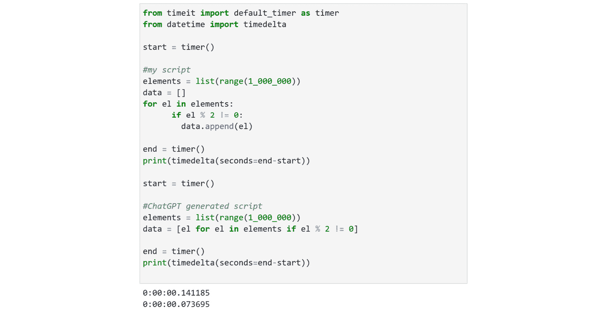

图 6.7 – 用户和 ChatGPT 脚本执行时间的比较

如您所见，第二种方法（由 ChatGPT 生成的方法）将执行时间减少约 47.8%。

除了代码生成和优化外，ChatGPT 还可以用于*错误*解释和调试。有时，错误很难解释；因此，自然语言解释可以帮助识别问题并引导您走向解决方案。

例如，当我从命令行运行一个`.py`文件时，我收到以下错误：

```
2023-03-25 11:27:10.270 Uncaught app exception
Traceback (most recent call last):
  File "C:\Users\vaalt\Anaconda3\lib\site-packages\streamlit\runtime\scriptrunner\script_runner.py", line 565, in _run_script
    exec(code, module.__dict__)
  File "C:\Users\vaalt\OneDrive\Desktop\medium articles\llm.py", line 129, in <module>
    user_input = get_text()
  File "C:\Users\vaalt\OneDrive\Desktop\medium articles\llm.py", line 50, in get_text
    input_text = st.text_input("You: ", st.session_state['input'], key='input', placeholder = 'Your AI assistant here! Ask me anything...', label_visibility = 'hidden')
  File "C:\Users\vaalt\Anaconda3\lib\site-packages\streamlit\runtime\metrics_util.py", line 311, in wrapped_func
    result = non_optional_func(*args, **kwargs)
  File "C:\Users\vaalt\Anaconda3\lib\site-packages\streamlit\elements\text_widgets.py", line 174, in text_input
    return self._text_input(
  File "C:\Users\vaalt\Anaconda3\lib\site-packages\streamlit\elements\text_widgets.py", line 266, in _text_input
    text_input_proto.value = widget_state.value
TypeError: [] has type list, but expected one of: bytes, Unicode
```

让我们看看 ChatGPT 是否能让我理解错误的本质。为此，我只需向 ChatGPT 提供错误文本，并要求它给我解释。

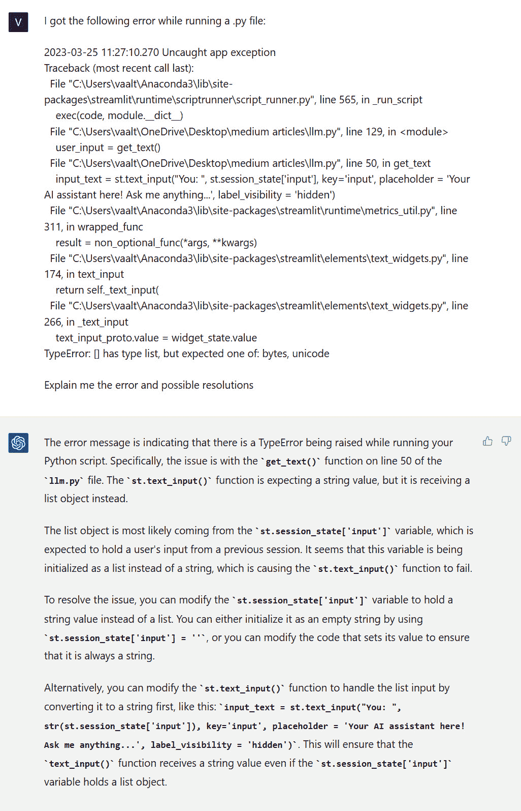

图 6.8 – ChatGPT 用自然语言解释 Python 错误

最后，让我们想象我写了一个函数，该函数接受一个字符串作为输入，并返回每个字母后面带有下划线的相同字符串。

在上面的例子中，我期望看到`g_p_t_`的结果；然而，实际上它只返回了这段代码中的`t_`：

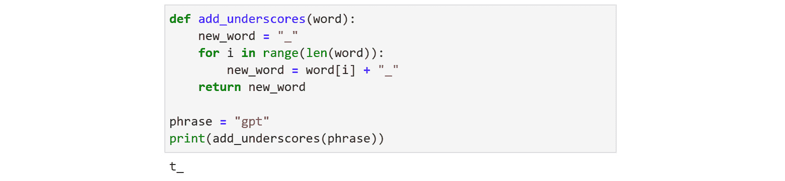

图 6.9 – 有错误的 Python 函数

让我们请 ChatGPT 为我们调试这个函数：

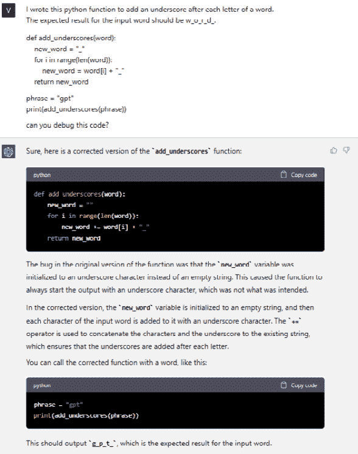

图 6.10 – ChatGPT 调试 Python 函数的示例

令人印象深刻，不是吗？再次，ChatGPT 提供了正确版本的代码，并帮助解释错误在哪里以及为什么导致不正确的结果。让我们看看现在是否可以工作：

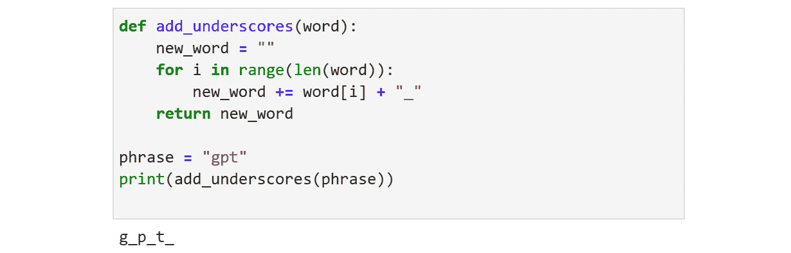

图 6.11 – ChatGPT 调试后的 Python 函数

嗯，显然是这样的！

这些以及许多其他与代码相关的功能确实可以提高您的生产力，缩短执行许多任务所需的时间。

然而，ChatGPT 不仅仅局限于纯粹的调试。由于 GPT 模型背后的令人难以置信的语言理解能力，这个**人工智能**（**AI**）工具能够在代码旁边生成适当的文档，以及准确解释代码将做什么，我们将在下一节中看到。

# 生成文档和代码可解释性

在处理新应用程序或项目时，将代码与文档相关联始终是一个好的实践。这可以通过在函数或类中嵌入文档字符串的形式来实现，以便他人可以直接在开发环境中调用它们。

例如，以下 Python 类具有 10 个不同的方法用于基本数学运算：

```
class Calculator:
    def add(self, x, y):
        return x + y
    def subtract(self, x, y):
        return x - y
    def multiply(self, x, y):
        return x * y
    def divide(self, x, y):
        try:
            return x / y
        except ZeroDivisionError:
            print("Error: division by zero")
            return None
    def power(self, x, y):
        return x ** y
    def square_root(self, x):
        try:
            return x ** 0.5
        except ValueError:
            print("Error: square root of a negative number")
            return None
    def logarithm(self, x, base):
        try:
            return math.log(x, base)
        except ValueError:
            print("Error: invalid logarithm arguments")
            return None
    def factorial(self, x):
        if x < 0:
            print("Error: factorial of a negative number")
            return None
        elif x == 0:
            return 1
        else:
            return x * self.factorial(x-1)
    def fibonacci(self, n):
        if n < 0:
            print("Error: fibonacci sequence index cannot be negative")
            return None
        elif n == 0:
            return 0
        elif n == 1:
            return 1
        else:
            return self.fibonacci(n-1) + self.fibonacci(n-2)
```

您可以初始化该类并测试它如下（作为示例，我将使用加法方法）：

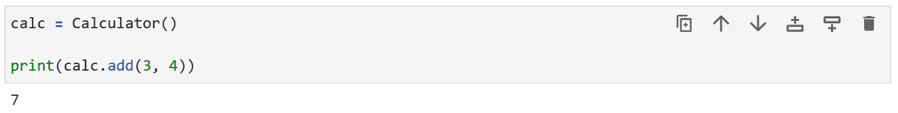

图 6.12 – 初始化 Python 类并使用其中一个方法

现在，假设我想能够使用`Calculator?`约定来检索文档字符串文档。通过这样做，对于 Python 包、函数和方法，我们可以得到该特定对象的全面文档，如下所示（`pandas` Python 库的示例）：

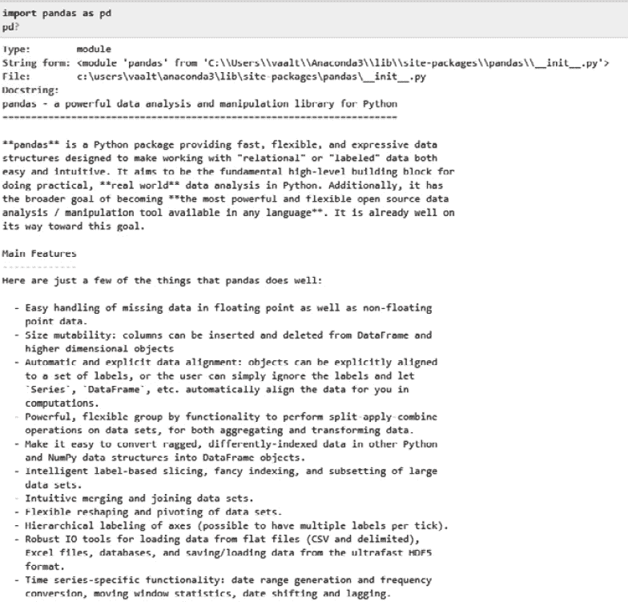

图 6.13 – pandas 库文档示例

现在，让我们请 ChatGPT 为我们的`Calculator`类生成相同的结果。

因此，在向 ChatGPT 提供`Calculator`类作为上下文之后，我要求它生成相关的文档如下：

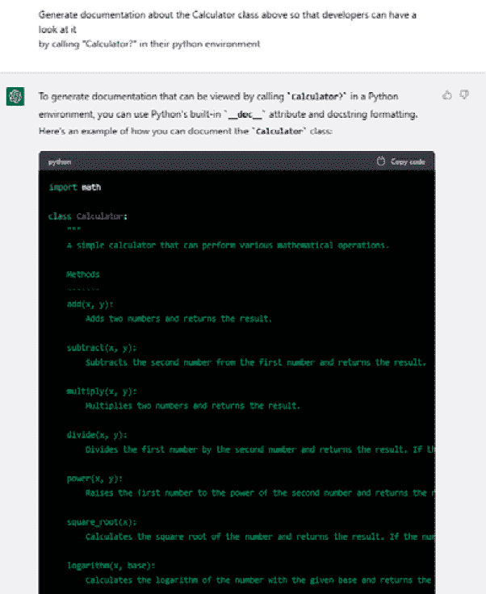

图 6.14 – ChatGPT 更新代码文档

您可以在本书的 GitHub 存储库中找到整个 ChatGPT 响应，网址为[`github.com/PacktPublishing/Modern-Generative-AI-with-ChatGPT-and-OpenAI-Models/blob/main/Chapter%206%20-%20ChatGPT%20for%20Developers/prompts`](https://github.com/PacktPublishing/Modern-Generative-AI-with-ChatGPT-and-OpenAI-Models/blob/main/Chapter%206%20-%20ChatGPT%20for%20Developers/prompts)。

因此，如果我们按照前面代码中所示更新我们的类，并调用`Calculator?`，我们将得到以下输出：

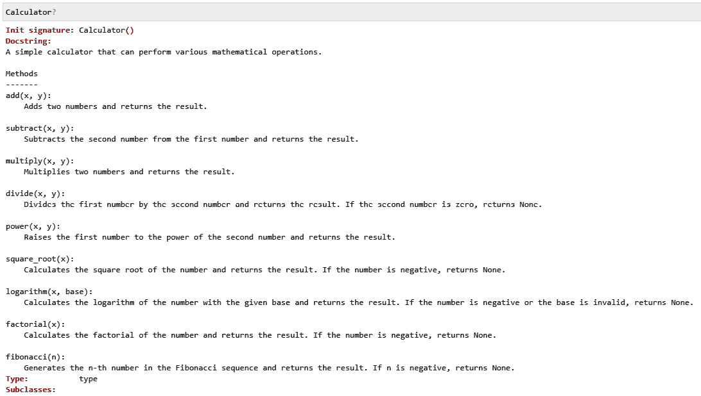

图 6.15 – 新的计算器类文档

最后，ChatGPT 还可以被利用来用自然语言解释脚本、函数、类或其他类似的内容所做的事情。我们已经看到 ChatGPT 用清晰的解释丰富了其与代码相关的响应的许多示例。然而，我们可以通过以代码理解为特定问题提出具体问题来增强这一能力。

例如，让我们请 ChatGPT 向我们解释以下 Python 脚本的作用：

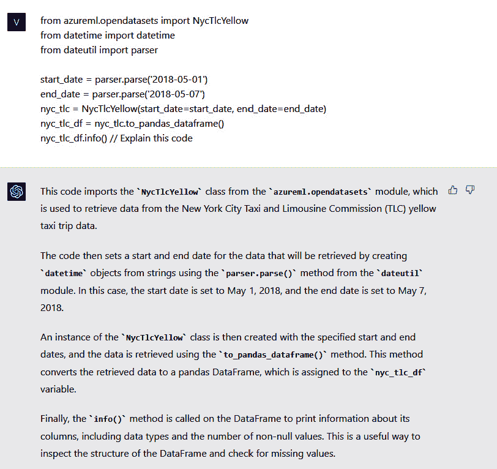

图 6.16 – ChatGPT 解释 Python 脚本的示例

代码可解释性也可以作为前述文档的一部分，或者可以在希望更好地理解来自其他团队的复杂代码的开发人员之间使用，或者（就像有时发生在我身上的）记住他们一段时间前写的东西。

由于 ChatGPT 和本节提到的能力，开发人员可以轻松地用自然语言跟踪项目生命周期，这样新团队成员和非技术用户更容易理解到目前为止所做的工作。

在下一节中，我们将看到代码可解释性是数据科学项目中机器学习模型可解释性的关键步骤。

# 理解机器学习模型可解释性

模型可解释性是指人类可以理解 ML 模型预测逻辑的程度。基本上，这是理解模型如何做出决策以及哪些变量有助于其预测的能力。

让我们看一个使用深度学习 `keras.datasets` 进行模型可解释性的示例：它包含 60,000 张 32x32 的彩色图像（因此是 3 通道图像），分为 10 类（飞机、汽车、鸟、猫、鹿、狗、青蛙、马、船和卡车），每类有 6,000 张图像。在这里，我将分享模型的主体部分；您可以在书的 GitHub 代码库中找到所有相关代码，用于数据准备和预处理：[`github.com/PacktPublishing/Modern-Generative-AI-with-ChatGPT-and-OpenAI-Models/tree/main/Chapter%206%20-%20ChatGPT%20for%20Developers/code`](https://github.com/PacktPublishing/Modern-Generative-AI-with-ChatGPT-and-OpenAI-Models/tree/main/Chapter%206%20-%20ChatGPT%20for%20Developers/code)。

```
model=tf.keras.Sequential()
model.add(tf.keras.layers.Conv2D(32,kernel_size=(3,3),activation='relu',input_shape=
(32,32,1)))
model.add(tf.keras.layers.MaxPooling2D(pool_size=(2,2)))
model.add(tf.keras.layers.Flatten())
model.add(tf.keras.layers.Dense(1024,activation='relu'))
model.add(tf.keras.layers.Dense(10,activation='softmax'))
```

上述代码由几个执行不同操作的层组成。我可能对模型的结构以及每个层的目的感兴趣。让我们向 ChatGPT 寻求帮助：

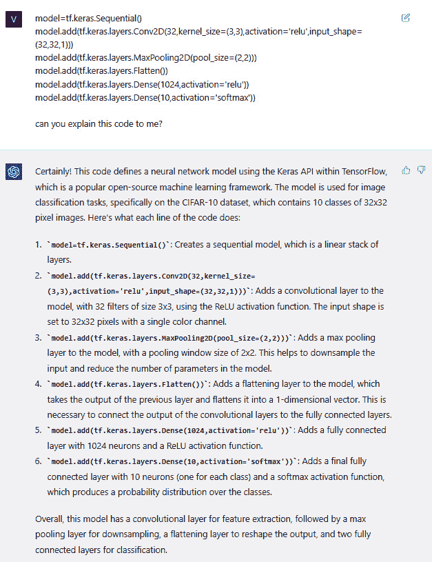

图 6.17 – 使用 ChatGPT 进行模型可解释性

正如您在上图中所看到的，ChatGPT 能够清晰地解释我们的 CNN 的结构和层次。它还添加了一些评论和提示，比如使用最大池化层有助于减少输入的维度。

我还可以通过 ChatGPT 在验证阶段解释模型结果。因此，在将数据分为训练集和测试集并在训练集上训练模型后，我想看到它在测试集上的表现：

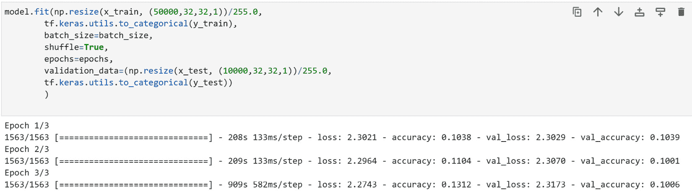

图 6.18 – 评估指标

让我们还请 ChatGPT 对我们的验证指标进行详细说明：

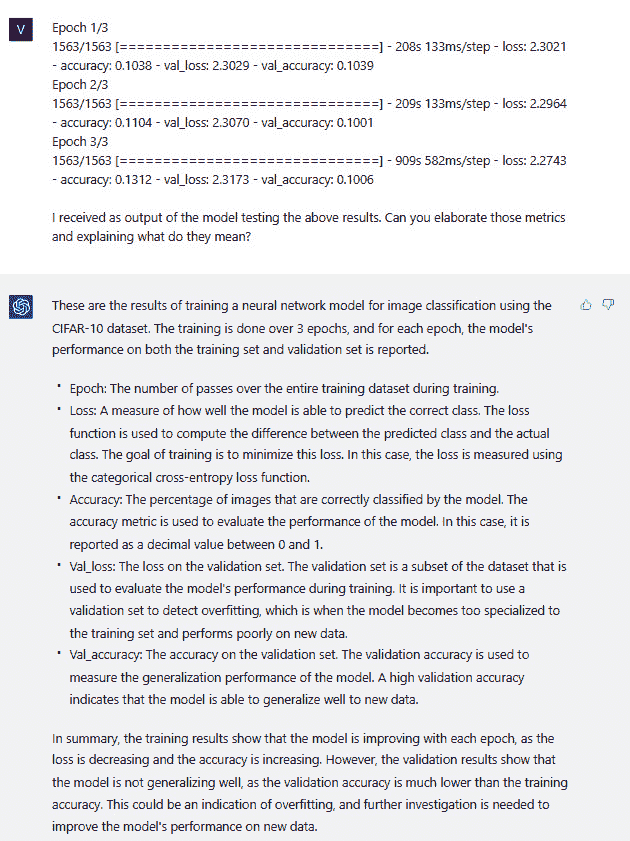

图 6.19 – ChatGPT 解释评估指标示例

再次，结果非常令人印象深刻，并清晰指导如何设置 ML 实验的训练和测试集。它解释了模型足够泛化的重要性，以便它不会过拟合，并能够在以前从未见过的数据上预测准确的结果。

模型可解释性之所以重要有很多原因。一个关键因素是它减少了业务用户与模型背后代码之间的差距。这对于使业务用户能够理解模型行为，并将其转化为代码业务理念至关重要。

此外，模型可解释性实现了负责任和道德人工智能的关键原则之一，即 AI 系统背后的模型思考和行为的透明性。解锁模型可解释性意味着检测模型在生产中可能存在的潜在偏见或有害行为，并因此防止它们发生。

总的来说，ChatGPT 在模型可解释性的背景下能够提供有价值的支持，通过在行级别生成见解，正如我们在上一个示例中所看到的。

接下来，我们将探讨 ChatGPT 的下一个并且也是最后一个能力，这将对开发人员的生产力产生更大的提升，尤其是在同一个项目中使用多种编程语言时。

# 不同编程语言之间的翻译

在*第五章*中，我们看到 ChatGPT 在不同语言之间具有很强的翻译能力。真正令人难以置信的是，自然语言并不是它唯一的翻译对象。事实上，ChatGPT 能够在不同的编程语言之间进行翻译，同时保持相同的输出以及相同的风格（即，如果存在文档字符串文档，它将保留该文档）。

在许多情况下，这可能是一个改变局面的游戏规则的场景。

例如，你可能需要学习一个之前从未见过的新编程语言或统计工具，因为你需要快速交付一个项目。有了 ChatGPT 的帮助，你可以开始使用你喜欢的编程语言，然后要求它翻译到你想要的语言，而你会在翻译过程中学会这门语言。

想象一下，项目需要在 MATLAB（由 MathWorks 开发的专有数值计算和编程软件）中交付，可你一直在 Python 中编程。该项目包括从**修改后的美国国家标准与技术研究所**（**MNIST**）数据集中对图像进行分类（原始数据集的描述和相关论文可以在此处找到：[`yann.lecun.com/exdb/mnist/`](http://yann.lecun.com/exdb/mnist/)）。该数据集包含许多手写数字，经常被用于教授各种图像处理系统。

首先，我编写了以下 Python 代码来初始化一个用于分类的深度学习模型：

```
import tensorflow as tf
from tensorflow import keras
from tensorflow.keras import layers
# Load the MNIST dataset
(x_train, y_train), (x_test, y_test) = keras.datasets.mnist.load_data()
# Preprocess the data
x_train = x_train.reshape(-1, 28*28) / 255.0
x_test = x_test.reshape(-1, 28*28) / 255.0
y_train = keras.utils.to_categorical(y_train)
y_test = keras.utils.to_categorical(y_test)
# Define the model architecture
model = keras.Sequential([
    layers.Dense(256, activation='relu', input_shape=(28*28,)),
    layers.Dense(128, activation='relu'),
    layers.Dense(10, activation='softmax')
])
# Compile the model
model.compile(optimizer='adam', loss='categorical_crossentropy', metrics=['accuracy'])
# Train the model
history = model.fit(x_train, y_train, validation_split=0.2, epochs=10, batch_size=128)
# Evaluate the model
test_loss, test_acc = model.evaluate(x_test, y_test, verbose=0)
print('Test accuracy:', test_acc)
```

现在让我们看看如果我们把前面的代码作为 ChatGPT 的上下文，并要求它将其翻译成 MATLAB 会发生什么：

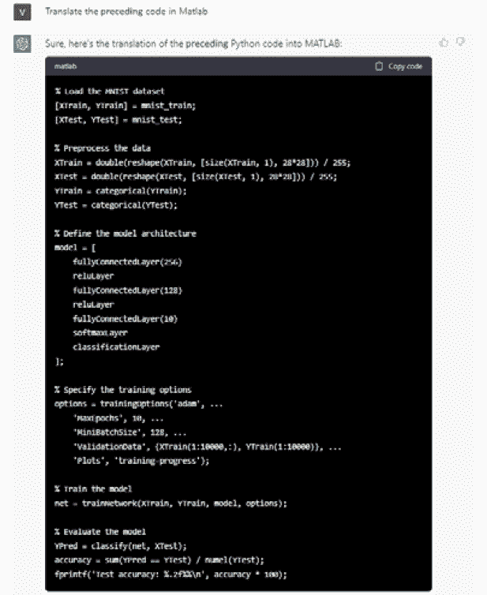

图表 20 – ChatGPT 将 Python 代码翻译成 MATLAB

让我们看看它是否能够将代码翻译成其他语言，比如 JavaScript：

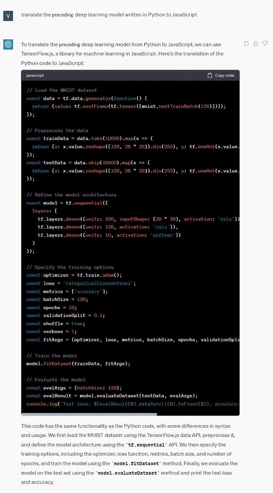

图表 6.21 – ChatGPT 将 Python 代码翻译成 JavaScript

代码翻译还可以减少新技术和当前编程能力之间的技能差距。

代码翻译的另一个关键影响是**应用现代化**。诚然，想象一下，你希望刷新你的应用程序堆栈，即迁移到云上。你可以决定从**基础设施即服务**（**IaaS**）实例（如 Windows 或 Linux **虚拟机**（**VM**））进行简单的搬迁。然而，在第二阶段，你可能希望重新构建、重新设计或甚至重建你的应用程序。

以下图表描述了应用程序现代化的各种选项：

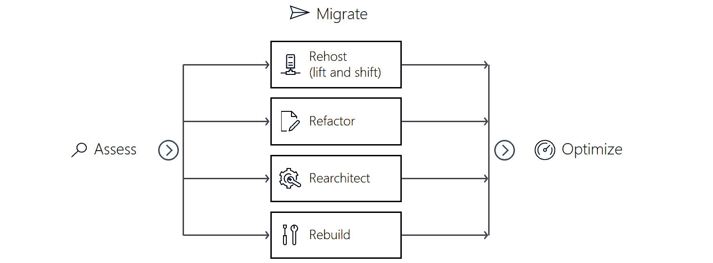

图 6.22 – 迁移应用程序到公共云的四种方式

ChatGPT 和 OpenAI Codex 模型可以帮助你进行迁移。例如考虑大型机。

大型组织主要使用大型机进行重要任务，如用于人口普查、消费者和行业统计、企业资源规划以及大规模事务处理的大规模数据处理。大型机环境的应用程序编程语言是**通用商业定向语言**（**COBOL**）。尽管 COBOL 在 1959 年发明，但今天仍在使用，是现存最古老的编程语言之一。

随着技术的不断改进，存储在大型机领域的应用程序一直在经历持续的迁移和现代化过程，旨在增强存在的遗留大型机基础设施的接口、代码、成本、性能和可维护性。

当然，这意味着将 COBOL 翻译成更现代的编程语言，比如 C#或 Java。问题在于，大多数新一代程序员不了解 COBOL；因此在这一背景下存在巨大的技能鸿沟。

让我们考虑一个读取员工记录文件并编写服务时间超过 10 年的员工报告的 COBOL 脚本：

```
IDENTIFICATION DIVISION.
PROGRAM-ID. EMPLOYEEREPORT.
ENVIRONMENT DIVISION.
INPUT-OUTPUT SECTION.
FILE-CONTROL.
    SELECT EMPLOYEE-FILE ASSIGN TO 'EMPLOYEE.DAT'
        ORGANIZATION IS LINE SEQUENTIAL.
    SELECT REPORT-FILE ASSIGN TO 'EMPLOYEEREPORT.TXT'
        ORGANIZATION IS LINE SEQUENTIAL.
DATA DIVISION.
FILE SECTION.
FD EMPLOYEE-FILE.
01 EMPLOYEE-RECORD.
    05 EMPLOYEE-ID     PIC X(10).
    05 HIRE-DATE       PIC 9(6).
    05 EMPLOYEE-NAME   PIC X(30).
FD REPORT-FILE.
01 REPORT-LINE         PIC X(80).
WORKING-STORAGE SECTION.
01 WS-CURRENT-DATE     PIC 9(6).
01 WS-EMPLOYEE-YEARS   PIC 9(2).
01 WS-REPORT-HEADER.
    05 FILLER          PIC X(30) VALUE 'EMPLOYEES WITH 10+ YEARS OF SERVICE'.
    05 FILLER          PIC X(10) VALUE SPACES.
    05 WS-REPORT-DATE  PIC X(6).
PROCEDURE DIVISION.
MAIN-PARAGRAPH.
    OPEN INPUT EMPLOYEE-FILE
    OPEN OUTPUT REPORT-FILE
    MOVE FUNCTION CURRENT-DATE TO WS-CURRENT-DATE
    MOVE WS-CURRENT-DATE(1:6) TO WS-REPORT-DATE
    WRITE REPORT-LINE FROM WS-REPORT-HEADER
    WRITE REPORT-LINE FROM SPACES
    PERFORM READ-EMPLOYEE UNTIL EMPLOYEE-FILE-STATUS = '10'
    CLOSE EMPLOYEE-FILE
    CLOSE REPORT-FILE
    STOP RUN.
READ-EMPLOYEE.
    READ EMPLOYEE-FILE
        AT END MOVE '10' TO EMPLOYEE-FILE-STATUS
    END-READ
    COMPUTE WS-EMPLOYEE-YEARS = FUNCTION INTEGER-OF-DATE(WS-CURRENT-DATE) - HIRE-DATE(1:6)
    IF WS-EMPLOYEE-YEARS >= 10
        WRITE REPORT-LINE FROM EMPLOYEE-RECORD
    END-IF.
```

我然后将之前的 COBOL 脚本传递给 ChatGPT，这样它就可以将其作为上下文来制定其响应。现在让我们要求 ChatGPT 将该脚本翻译成 JavaScript：

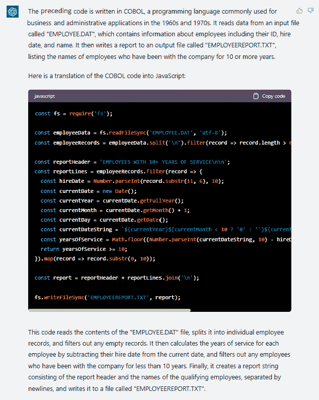

图 6.23 – ChatGPT 将 COBOL 翻译成 JavaScript 的示例

像 ChatGPT 这样的工具可以帮助减少这种以及类似场景中的技能鸿沟，引入了一个既懂得编程的过去又懂得未来的层。

总之，ChatGPT 可以成为应用现代化的有效工具，提供代码升级以及增强遗留系统的宝贵见解和建议。凭借其先进的语言处理能力和丰富的知识库，ChatGPT 可以帮助组织简化其现代化工作，使该过程更快、更有效率和更有效。

注

OpenAI Codex 模型是 GitHub Copilot 背后的引擎。这种新功能涵盖了本章中我们将看到的许多用例，比如代码生成、自动填充和代码优化。

# 总结

ChatGPT 可以成为开发人员寻求提升技能和简化工作流程的宝贵资源。我们首先看到了 ChatGPT 如何生成、优化和调试您的代码，但我们还涵盖了更多的功能，比如在您的代码旁边生成文档，解释您的 ML 模型，以及在不同编程语言之间进行翻译，用于应用现代化。

无论您是经验丰富的开发人员还是刚刚起步，ChatGPT 都为学习和成长提供了强大的工具，缩小了代码和自然语言之间的差距。

在下一章中，我们将深入探讨另一个应用领域，ChatGPT 可能成为游戏改变者的地方：营销。


# 7

# 通过 ChatGPT 掌握营销技巧

在本章中，我们将重点介绍营销人员如何利用 ChatGPT，在这一领域中查看 ChatGPT 的主要用例，以及营销人员如何将其作为有价值的助手。

我们将学习 ChatGPT 如何协助以下活动：

+   营销人员对 ChatGPT 的需求

+   新产品开发和上市策略

+   营销比较的 A/B 测试

+   通过**搜索引擎** **优化** (**SEO**)使网站和帖子更高效

+   文本数据的情感分析

在本章结束时，你将能够利用 ChatGPT 进行与营销相关的活动，并提高你的生产力。

# 技术要求

你需要一个 OpenAI 账户才能访问 ChatGPT 和 DALL-E。

本章中的所有代码和提示都可以在本书的 GitHub 仓库中找到：[`github.com/PacktPublishing/Modern-Generative-AI-with-ChatGPT-and-OpenAI-Models`](https://github.com/PacktPublishing/Modern-Generative-AI-with-ChatGPT-and-OpenAI-Models)。

# 营销人员对 ChatGPT 的需求

营销可能是 ChatGPT 和 OpenAI 模型创造力最纯粹发挥作用的领域。它们可以成为支持创意发展的实用工具，涉及新产品、营销活动、搜索引擎优化等方面。总体而言，营销人员自动化和简化了工作的许多方面，同时提高了营销工作的质量和效果。

这里有一个例子。在营销中，ChatGPT 最显著且有前景的用例之一是个性化营销。ChatGPT 可用于分析客户数据，并生成与个体客户共鸣的个性化营销信息。例如，营销团队可以使用 ChatGPT 分析客户数据，并制定针对特定客户偏好和行为的定向电子邮件营销活动。这可以增加转化的可能性，并导致更高的客户满意度。通过提供客户情感和行为洞察、生成个性化营销信息、提供个性化客户支持以及生成内容，ChatGPT 可帮助营销人员提供卓越的客户体验，并推动业务增长。

这是 ChatGPT 在营销领域的许多应用示例之一。在接下来的章节中，我们将看到由 ChatGPT 支持的端到端营销项目的具体示例。

# 新产品开发和上市策略

你可以将 ChatGPT 引入营销活动的第一种方式可能是作为新产品开发和**上市**（**GTM**）策略的助手。

在本节中，我们将逐步了解如何开发和推广新产品的指南。你已经拥有一个名为**RunFast**的跑步服装品牌，到目前为止你只生产了鞋子，所以你希望通过新产品线扩展业务。我们将从进行头脑风暴开始来创建一个 GTM 策略。当然，一切都由 ChatGPT 支持：

+   **头脑风暴的创意**：ChatGPT 能够支持你进行头脑风暴，并提供新产品线的草案选项的理由。所以，让我们问问应该专注于哪种新产品线：

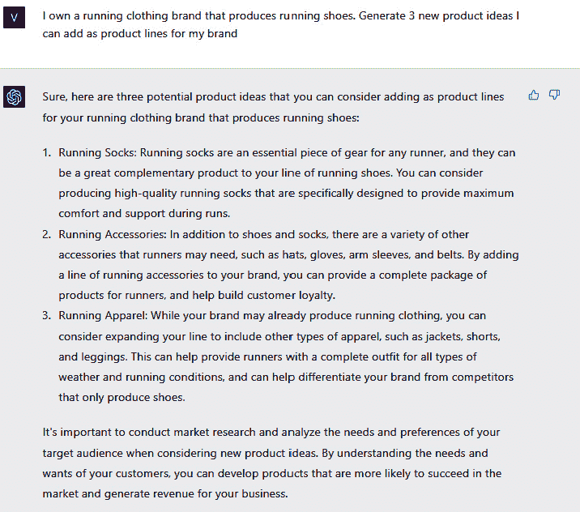

图 7.1 – ChatGPT 生成的新创意示例

在三个建议中，我们将选择第一个，因为 ChatGPT 建议的原因——这确实是我们跑步鞋的一个补充产品，所以我们将继续进行。

+   **产品名称**：现在我们已经确定了自己的想法，我们需要为其想一个引人注目的名称。同样，我会向 ChatGPT 寻求更多选项，以便我可以选择我的最喜欢的：

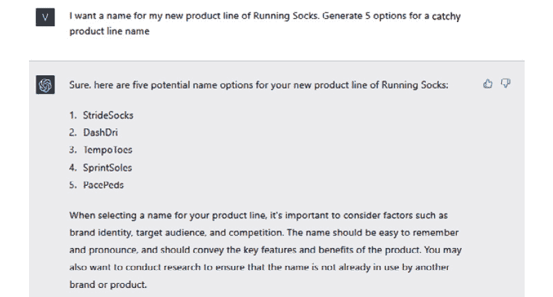

图 7.2 – 潜在的产品名称列表

**SprintSoles**对我来说听起来不错 – 我会选择这个。

+   **生成引人注目的口号**：除了产品名称外，我还想分享名称背后的意图和产品线的使命，以便我的目标受众对此产生兴趣。我希望能激发客户的信任和忠诚，并让他们在我的新产品线的使命中看到自己的影子。

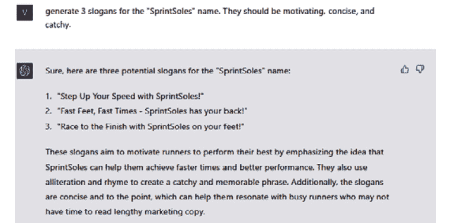

图 7.3 – 我的新产品名称口号列表

很好，现在我满意了产品名称和口号，我将在以后用它们来创建一个独特的社交媒体公告。在这之前，我想要花更多时间进行针对目标受众的市场调研。

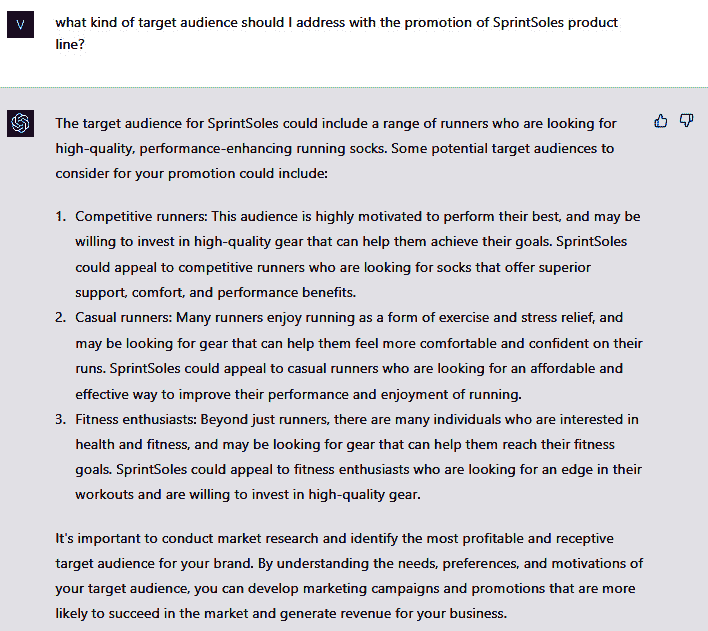

图 7.4 – 要达到的新产品线目标人群列表

重要的是要考虑到受众内的不同群体，以便你能够区分你想要传达的信息。在我的情况下，我希望确保我的产品线能够对不同的人群产生影响，比如竞技跑者、休闲跑者和健身爱好者。

+   **产品变体和销售渠道**：根据前面的潜在客户群，我可以生成产品变体，使其更加贴合特定受众：

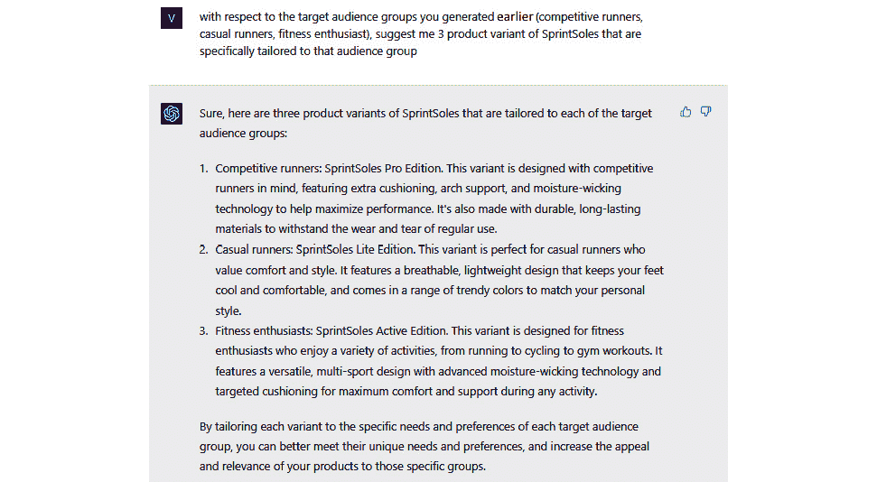

图 7.5 – 产品线变体示例

同样，我还可以要求 ChatGPT 为前面的每个群体提供不同的销售渠道建议：

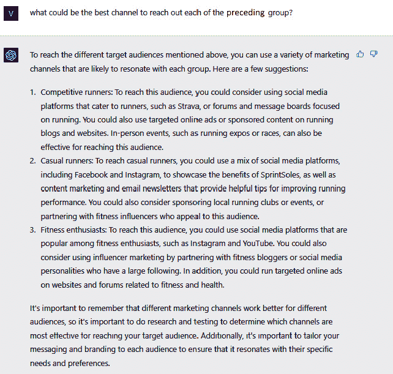

图 7.6 – ChatGPT 提供的不同销售渠道建议

+   **脱颖而出**：我希望我的产品线在竞争中脱颖而出，在一个非常饱和的市场中脱颖而出 – 我想让它独特。出于这个目的，我要求 ChatGPT 包括可持续性和包容性等社会考虑因素。让我们请 ChatGPT 在这方面提供一些建议：


图 7.7 – ChatGPT 生成的突出特点示例

正如您所看到的，它能够生成有趣的特点，使我的产品线独特。

+   **产品描述**：现在是时候开始制定我们的 GTP 计划了。首先，我想生成一个产品描述放在我的网站上，包括之前所有独特的差异化因素。

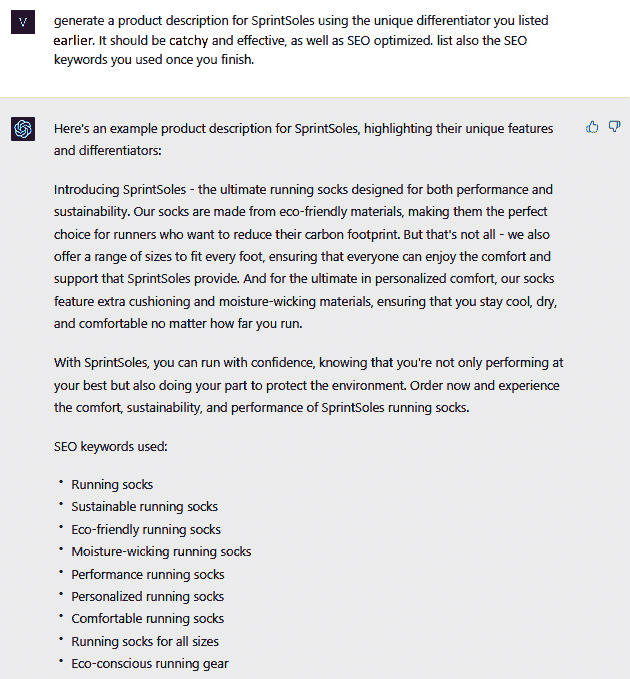

图 7.8 – 由 ChatGPT 生成的描述和 SEO 关键词示例

+   **公平价格**：另一个关键因素是确定我们产品的公平价格。当我针对不同受众（竞争跑步者、休闲跑步者和健身爱好者）区分产品变体时，我也希望有一个考虑到这种聚类的价格范围。

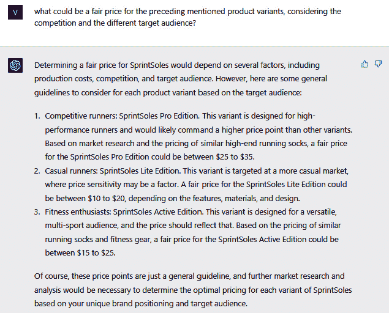

图 7.9 – 产品变体的价格范围

我们快要完成了。我们已经经历了许多新产品开发和市场推广步骤，在每一步中，ChatGPT 都是一个很好的支持工具。

最后，我们可以请 ChatGPT 为我们的新产品生成一个 Instagram 帖子，包括相关的标签和 SEO 关键词。然后我们可以用 DALL-E 生成图像！

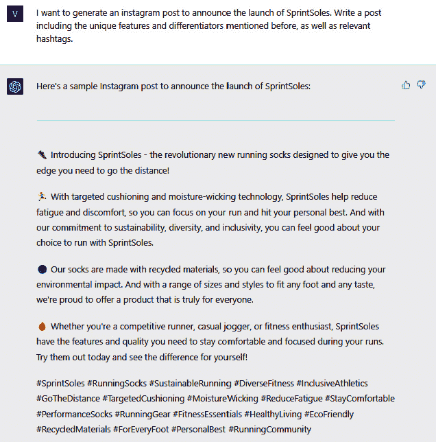

图 7.10 – 由 ChatGPT 生成的社交媒体帖子

而且，有了 DALL-E 的特别贡献，这是最终结果：

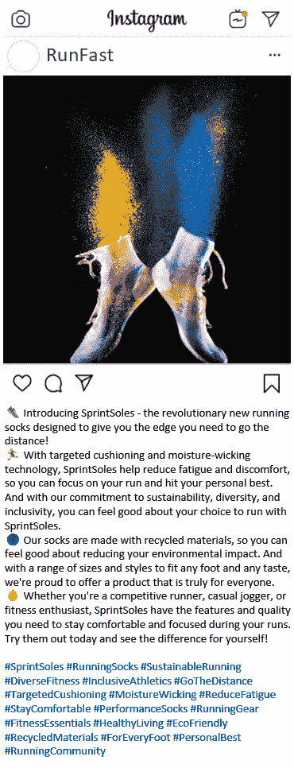

图 7.11 – 由 ChatGPT 和 DALL-E 完全生成的 Instagram 帖子

当然，这里还缺少许多元素来完成产品开发和市场推广。然而，在 ChatGPT 的支持下（以及 DALL-E 的特别贡献 – 您可以在 [`openai.com/product/dall-e-2`](https://openai.com/product/dall-e-2) 上自行尝试 DALL-E），我们设法集思广益，构思了一个新的产品线和变体，潜在客户，引人注目的口号，最后，生成了一个相当不错的 Instagram 帖子来宣布 SprintSoles 的推出！

# 营销比较的 A/B 测试

ChatGPT 还可以帮助营销人员进行 A/B 测试的另一个有趣领域。

在营销中的 A/B 测试是一种比较营销活动、广告或网站的两个不同版本以确定哪个表现更好的方法。在 A/B 测试中，创建两个相同活动或元素的变体，只有一个变量在两个版本之间改变。目标是看哪个版本生成更多的点击、转化或其他期望的结果。

A/B 测试的一个例子可能是测试两个电子邮件活动的版本，使用不同的主题行，或测试两个网站着陆页的版本，带有不同的行动呼吁按钮。通过测量每个版本的响应率，营销人员可以确定哪个版本表现更好，并基于数据做出关于以后使用哪个版本的决策。

A/B 测试使营销人员能够优化他们的活动和元素，以实现最大效果，从而获得更好的结果和更高的投资回报率。

由于这种方法涉及生成许多相同内容的变体的过程，ChatGPT 的生成能力肯定可以在其中提供帮助。

让我们考虑以下示例。我正在推广我开发的新产品：一款新的、轻薄的速度攀岩安全带。我已经做过一些市场调研，我了解我的利基受众。我也知道，对于这个受众来说，一个很好的沟通渠道是在一个在线攀岩博客上发布内容，其中大多数攀岩健身房的会员都是忠实读者。

我的目标是创建一篇出色的博客文章，分享这款新安全带的推出，并且我想在两个群体中测试它的两个不同版本。我即将发布的博客文章，也是我想要进行 A/B 测试的对象，如下所示：

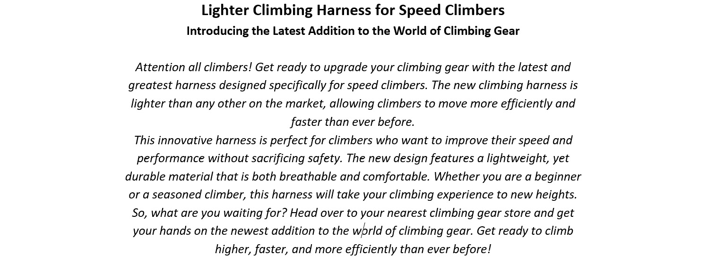

图 7.12 – 推出攀岩装备的博客文章示例

在这里，ChatGPT 可以在两个层面上帮助我们：

+   第一层是重新表述文章，使用不同的关键词或不同的引人注目的口号。为了做到这一点，一旦这篇文章作为背景提供，我们可以要求 ChatGPT 处理这篇文章，并稍微改变一些元素：

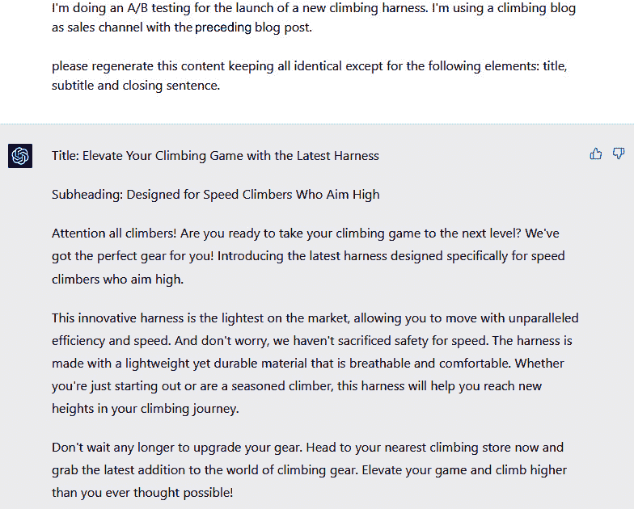

图 7.13 – ChatGPT 生成的博客文章的新版本

根据我的要求，ChatGPT 能够重新生成我要求的那些元素（标题、副标题和结尾句），以便我可以通过监控两个受众群体的反应来监控这些元素的有效性。

+   第二级别是设计网页，即改变图像的搭配而不是按钮的位置。为此，我在登载在攀岩博客上的博文中创建了一个简单的网页（你可以在书的 GitHub 代码库中找到这个代码：[`github.com/PacktPublishing/Modern-Generative-AI-with-ChatGPT-and-OpenAI-Models/tree/main/Chapter%207%20-%20ChatGPT%20for%20Marketers/Code`](https://github.com/PacktPublishing/Modern-Generative-AI-with-ChatGPT-and-OpenAI-Models/tree/main/Chapter%207%20-%20ChatGPT%20for%20Marketers/Code)）：


图 7.14 – 登载在攀岩博客上的示例博文

我们可以直接用 HTML 代码来激活 ChatGPT，并要求它改变一些布局元素，比如按钮的位置或它们的措辞。例如，读者可能会对一个 **我想要** 的按钮比**立即购买**按钮更感兴趣。

所以，让我们用 HTML 源代码来激活 ChatGPT：

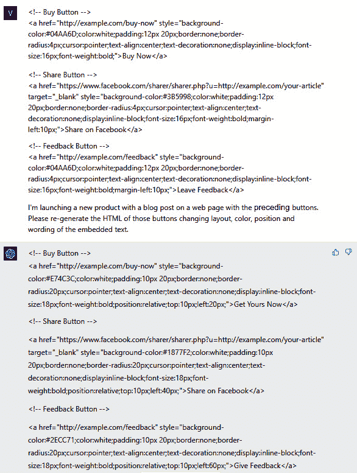

图 7.15 – ChatGPT 改变 HTML 代码

让我们看一下输出是什么样的：


图 7.16 – 网站的新版本

正如你所见，ChatGPT 只在按钮层面进行了干预，稍微改变了它们的布局、位置、颜色和措辞。

事实上，检查两个版本网页的源代码，我们可以看到它们在按钮部分的不同之处：

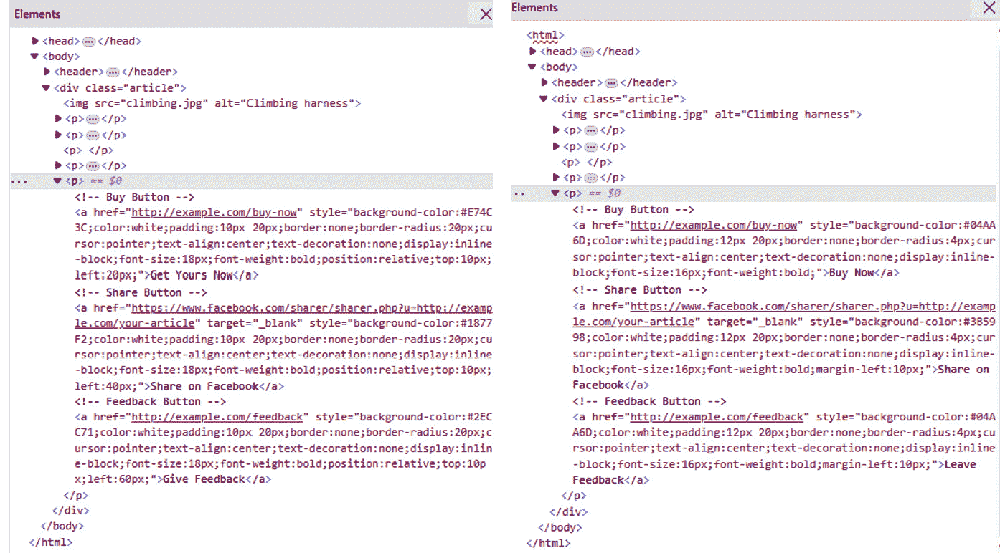

图 7.17 – 两个版本网站的源代码比较

总之，ChatGPT 是市场营销 A/B 测试的宝贵工具。其快速生成相同内容的不同版本能减少新活动上市的时间。通过利用 ChatGPT 进行 A/B 测试，你可以优化你的市场营销策略，并最终为你的业务带来更好的结果。

# 提升搜索引擎优化（SEO）

ChatGPT 另一个有前景的领域是**搜索引擎优化**（**SEO**）。这是 Google 或必应等搜索引擎排名的关键因素，它决定了你的网站是否能对寻找你所推广内容的用户可见。

定义

SEO 是一种增加网站在**搜索引擎结果页**（**SERP**）上的可见性和排名的技术。它通过优化网站或网页来增加来自搜索引擎的有机（非付费）流量的数量和质量。SEO 的目的是通过为特定关键词或短语优化网站，吸引更多有针对性的访问者。

想象一下，您经营一家名为**帽子和手套**的电子商务公司，该公司只销售，正如您可能已经猜到的那样，帽子和手套。您现在正在创建您的电子商务网站，并希望优化其排名。让我们请教 ChatGPT 列出一些相关的关键词，以嵌入到我们的网站中：

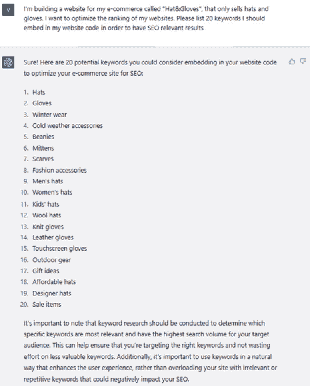

图 7.18 – ChatGPT 生成的 SEO 关键词示例

正如您所看到的，ChatGPT 能够创建不同类型的关键词列表。其中一些非常直观，如**帽子**和**手套**。其他则相关，具有间接联系。例如，**礼物想法**不一定与我的电子商务业务相关，但将其包含在我的关键词中可能非常明智，这样我就可以扩大我的受众群体。

SEO 的另一个关键要素是**搜索引擎意图**。搜索引擎意图，也称为**用户意图**，指的是用户在搜索引擎中进行的特定搜索查询的潜在目的或目标。理解搜索引擎意图很重要，因为它有助于企业和营销人员创建更具针对性和有效的内容和营销策略，与搜索者的需求和期望保持一致。

通常有四种类型的搜索引擎意图：

+   **信息意图**：用户正在寻找关于特定主题或问题的信息，例如*法国的首都是什么？*或*如何在家里制作披萨*。

+   **导航意图**：用户正在寻找特定网站或网页，例如**Facebook 登录**或**Amazon.com**。

+   **商业意图**：用户正在寻找购买产品或服务，但可能尚未做出最终决定。商业意图搜索的示例包括*1000 美元以下最佳笔记本电脑*或*在线折扣鞋*。

+   **交易意图**：用户有完成交易的具体目标，可能涉及实物购买或订阅服务。交易意图的示例可能是*购买 iPhone 13*或*注册健身房会员*。

通过理解特定搜索查询背后的意图，企业和营销人员可以创建更具针对性和有效的内容，满足目标受众的需求和期望。这可以提高搜索引擎排名，增加流量，最终实现更多的转化和收入。

现在，问题是，ChatGPT 能否确定给定请求的意图？在回答之前，值得注意的是，推断给定提示意图的活动是**大型语言模型**（**LLMs**）的核心业务，包括 GPT。因此，可以肯定，ChatGPT 能够捕捉提示的意图。

这里的附加价值在于，我们想看看 ChatGPT 是否能够确定在一个精确的领域和具体的分类法中的意图，即营销领域。这就是为什么提示设计再次至关重要，以指导 ChatGPT 朝着正确的方向发展。

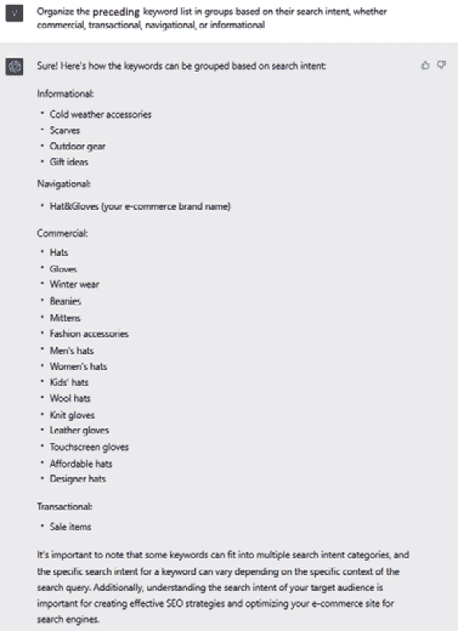

图 7.19 – ChatGPT 充当 SEO 专家的示例

最后，我们还可以进一步利用 *Act as…* hack，这是我们在 *第四章* 中已经提到过的。了解如何优化我们的网站，使其尽可能地吸引更多用户，这确实非常有趣。在营销领域，这种分析被称为 **SEO 审核**。SEO 审核是对网站的 SEO 表现和潜在改进领域进行评估。SEO 审核通常由 SEO 专家、网站开发人员或营销人员进行，涉及对网站的技术基础设施、内容和反向链接配置的全面分析。

在进行 SEO 审核期间，审核员通常会使用一系列工具和技术来识别改进的领域，例如关键词分析、网站速度分析、网站架构分析和内容分析。然后，审核员将生成一份报告，概述关键问题、改进机会以及建议的行动来解决这些问题。

让我们请 ChatGPT 充当 SEO 专家，并指导我们 SEO 审核报告应该是什么样子，应该包括哪些指标和关键绩效指标：

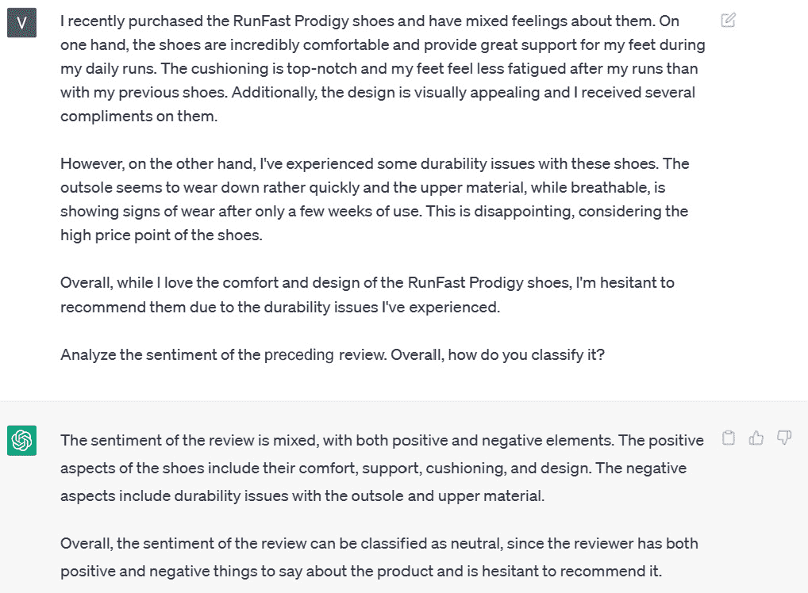

图 7.20 – ChatGPT 提供优化 HTML 代码的示例

ChatGPT 能够生成相当准确的分析，带有相关的评论和建议。总的来说，ChatGPT 在与 SEO 相关的活动中具有有趣的潜力，无论是从头开始构建网站还是改进现有网站，它都可以成为一个很好的工具。

# 通过进行情感分析来提高质量和增加客户满意度

情感分析是营销中使用的一种技术，用于分析和解释客户对品牌、产品或服务表达的情感和意见。它涉及使用 **自然语言处理**（**NLP**）和 **机器学习**（**ML**）算法来识别和分类文本数据的情感，例如社交媒体帖子、客户评论和反馈调查。

通过进行情感分析，营销人员可以深入了解客户对其品牌、产品或服务的看法，识别改进的领域，并做出数据驱动的决策，优化其营销策略。例如，他们可以跟踪客户评论的情感，以确定哪些产品或服务收到积极或消极的反馈，并相应调整其营销信息。

总的来说，情感分析是营销人员了解客户情感、衡量客户满意度以及制定与目标受众 resonates 的有效营销活动的宝贵工具。

情感分析已经存在一段时间了，因此您可能想知道 ChatGPT 能够带来什么附加价值。嗯，除了分析的准确性（它目前是市场上最强大的模型）之外，ChatGPT 还有区别于其他情感分析工具的地方，因为它是**人工通用智能**（**AGI**）。

这意味着当我们使用 ChatGPT 进行情感分析时，并不是在使用它的特定 API 之一来执行该任务：ChatGPT 和 OpenAI 模型的核心理念是它们可以同时协助用户完成许多常规任务，根据用户的请求与任务进行交互并调整分析的范围。

因此，毫无疑问，ChatGPT 能够捕捉给定文本的情感，比如 Twitter 帖子或产品评论。但是，ChatGPT 还可以更进一步，协助识别正面或负面影响情感的产品或品牌的特定方面。例如，如果顾客们一直以消极方式谈论产品的某个特征，ChatGPT 可以将该特征标记为需要改进的地方。或者，可以要求 ChatGPT 生成对特别微妙的评论的回应，同时记住评论的情感并将其用作回应的背景。它还可以生成汇总所有评论或评论中找到的负面和正面因素并将它们分成类别的报告。

让我们考虑下面的例子。一位顾客最近从我的电子商务公司 RunFast 购买了一双鞋，并留下了以下评论：

*我最近购买了 RunFast Prodigy 鞋子，对它们有着复杂的感受。一方面，这些鞋子非常舒适，在我日常跑步时为我的脚提供了很好的支撑。缓冲效果一流，比我之前的鞋子跑步后我的脚感到更轻松。此外，设计也很吸引眼球，我也收到了几个赞美它们的评论。*

*但另一方面，我对这些鞋子的耐久性有些问题。鞋底似乎磨损得相当快，鞋面材料虽然透气，但只用了几周就出现了磨损迹象。考虑到鞋子的高价格，这令人失望。*

*总的来说，虽然我喜欢 RunFast Prodigy 鞋子的舒适度和设计，但由于我经历过的耐用性问题，我犹豫是否推荐它们。*

让我们请 ChatGPT 捕捉这条评论的情感：

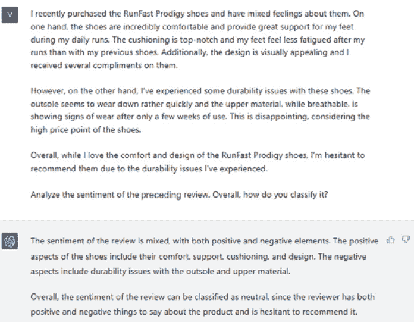

图 7.21 – ChatGPT 分析客户评论

从前述图中，我们可以看到 ChatGPT 并不局限于提供标签：它还解释了评论的正面和负面要素，这些要素表现出了复杂的感觉，因此总体上可以标记为中立。

让我们深入一点，并请一些关于改进产品的建议：

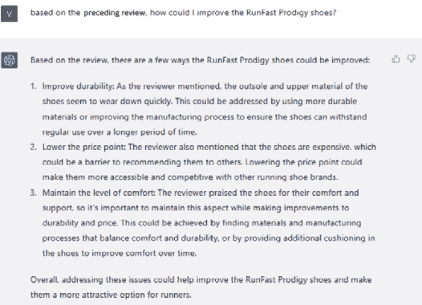

图 7.22 – 基于客户反馈的产品改进建议

最后，让我们回应客户，向客户显示，我们作为一家公司确实关心客户的反馈，并希望改进我们的产品。

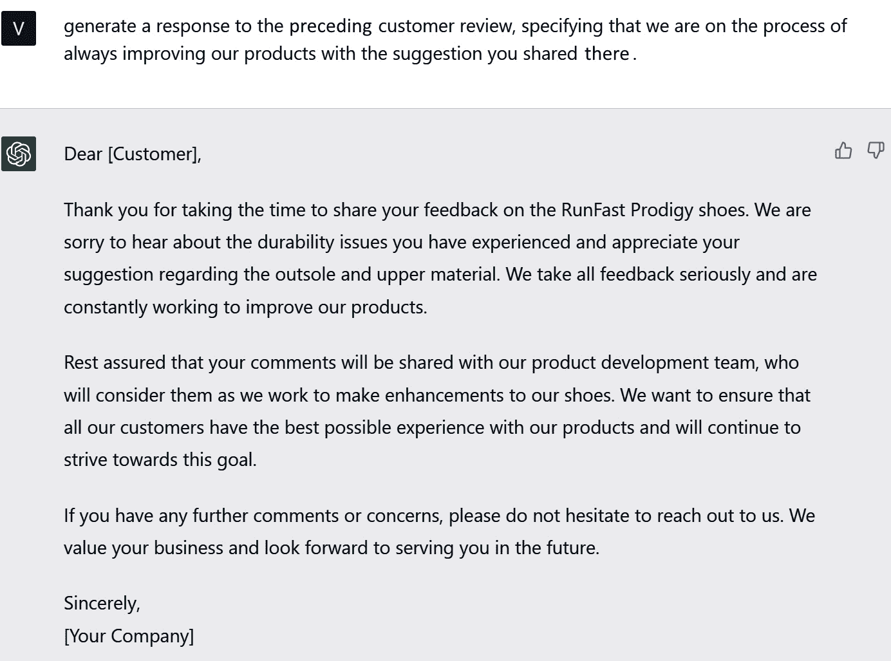

图 7.23 – ChatGPT 生成的响应

我们看到的例子非常简单，只有一个评论。现在想象一下，我们有大量的评论，以及多种销售渠道，我们从中收到反馈。想象一下，像 ChatGPT 和 OpenAI 模型这样的工具的强大之处，它们可以分析和整合所有这些信息，找出产品的优点和缺点，捕捉客户的趋势和购物习惯。此外，为了客户关怀和留存，我们还可以使用我们喜欢的写作风格自动化回答评论。事实上，通过定制您的聊天机器人的语言和语调，以满足客户的特定需求和期望，您可以创造更具吸引力和有效的客户体验。

这里有一些例子：

+   **有同情心的聊天机器人**：使用有同情心的语调与语言与客户交流，这些客户可能正在经历问题或者需要帮助处理敏感问题

+   **专业聊天机器人**：使用专业的语调与语言与客户交流，这些客户可能正在寻求具体信息或者需要在技术问题上获得帮助

+   **会话式聊天机器人**：使用轻松友好的语调与客户交流，这些客户可能正在寻求个性化的体验或者有更一般的询问

+   **幽默聊天机器人**：使用幽默和风趣的语言与客户交流，这些客户可能正在寻求一种轻松的体验或者缓解紧张的情况

+   **教育性聊天机器人**：使用教学风格的沟通与客户交流，这些客户可能希望了解更多关于产品或服务的信息

总之，ChatGPT 可以成为企业进行情感分析、改善质量和留住客户的强大工具。凭借其先进的自然语言处理能力，ChatGPT 可以实时准确地分析客户反馈和评论，为企业提供有价值的客户情绪和偏好的见解。通过将 ChatGPT 作为其客户体验策略的一部分，企业可以快速识别可能会对客户满意度产生负面影响的任何问题，并采取纠正措施。这不仅可以帮助企业提高质量，还可以增加客户忠诚度和留存。

# 摘要

在本章中，我们探讨了营销人员如何利用 ChatGPT 来增强他们的营销策略。我们了解到 ChatGPT 可以帮助开发新产品，定义上市策略，设计 A/B 测试，增强 SEO 分析，并捕捉评论、社交媒体帖子和其他客户反馈的情感。

对于营销人员来说，ChatGPT 的重要性在于其革新公司与客户互动方式的潜力。通过利用 NLP、ML 和大数据的力量，ChatGPT 让公司能够创建更个性化和相关的营销信息，改善客户支持和满意度，最终推动销售和收入增长。

随着 ChatGPT 不断发展和演变，很可能我们会看到更多在营销行业的参与，特别是公司与客户互动的方式。事实上，大量依赖 AI 让公司能更深入地了解客户行为和偏好。

对于营销人员的关键要点是要接受这些变化，并适应 AI 驱动营销的新现实，以保持竞争优势并满足客户需求。

在下一章中，我们将看到本书涵盖的 ChatGPT 应用的第三个也是最后一个领域 - 研究。


# 8

# 用 ChatGPT 重新定义研究

在本章中，我们专注于希望利用 ChatGPT 的研究人员。本章将介绍 ChatGPT 可以解决的一些主要用例，以便您从具体示例中了解 ChatGPT 在研究中的应用。

通过本章结束时，您将熟悉多种使用 ChatGPT 作为研究助手的方式，包括以下内容：

+   研究人员对 ChatGPT 的需求

+   为您的研究头脑风暴文献

+   为您的实验设计和框架提供支持

+   生成并格式化参考文献以纳入您的研究

+   关于您的研究向不同受众传达演讲或幻灯片展示

本章还将提供示例，并使您能够自行尝试提示。

# 研究人员对 ChatGPT 的需求

ChatGPT 可以成为各领域研究人员的极其宝贵的资源。作为一个在大量数据上训练的复杂语言模型，ChatGPT 可以快速准确地处理大量信息，并生成可能通过传统研究方法难以或耗时发现的见解。

此外，ChatGPT 还可以为研究人员提供对其领域的独特视角，通过分析可能不会立即为人类研究人员所注意到的模式和趋势。例如，想象一位研究气候变化并希望了解公众对这一问题的看法的研究人员。他们可以要求 ChatGPT 分析与气候变化相关的社交媒体数据，并识别在线人们表达的最常见主题和情绪。然后，ChatGPT 可以向研究人员提供详尽的报告，详细说明与该主题相关的最常见单词、短语和情绪，以及任何有用的新兴趋势或模式。

通过与 ChatGPT 合作，研究人员可以获得尖端技术和见解，并保持在其领域的前沿。

现在让我们深入探讨四种使用情况，ChatGPT 可以提高研究生产力。

# 为您的研究头脑风暴文献

文献综述是对特定主题或问题的现有已发表研究进行批判性和系统性审查的关键过程。它涉及搜索、审查和综合相关已发表研究和其他来源，如书籍、会议记录和灰色文献。文献综述的目标是识别特定领域中的差距、不一致性和进一步研究的机会。

文献综述过程通常包括以下步骤：

1.  **定义研究问题**：进行文献综述的第一步是定义感兴趣主题的研究问题。因此，假设我们正在研究社交媒体对心理健康的影响。现在我们有兴趣思考一些可能的研究问题，以便聚焦我们的研究，并且我们可以利用 ChatGPT 来做到这一点：

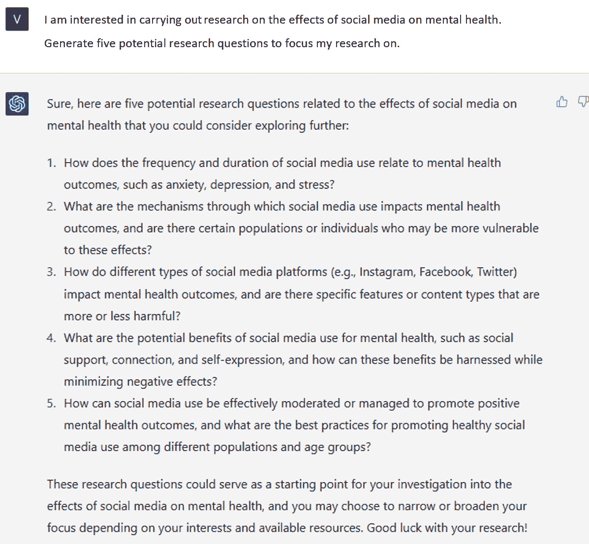

图 8.1 – 基于给定主题的研究问题示例

这些都是可以进一步调查的有趣问题。由于我对最后一个问题特别感兴趣，我将把它作为我们分析下一步的参考。

1.  **文献搜索**：现在我们有了研究问题，下一步是使用各种数据库、搜索引擎和其他来源搜索相关文献。研究人员可以使用特定关键词和搜索词来帮助识别相关研究。

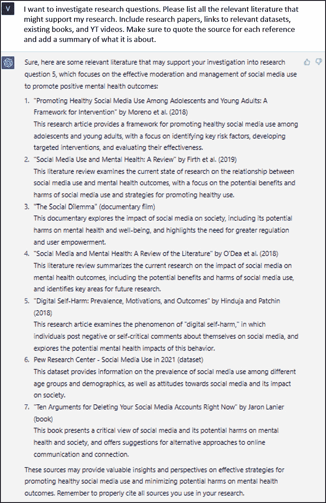

图 8.2 – 在 ChatGPT 支持下进行文献搜索

从 ChatGPT 的建议开始，我们可以开始深入研究这些参考文献。

1.  **筛选文献**：一旦确定了相关文献，下一步是筛选研究以确定它们是否符合综述的纳入标准。这通常涉及审查摘要，必要时还包括研究的全文。

比如，假设我们想深入研究**促进青少年和年轻成年人健康使用社交媒体：干预框架**研究论文。让我们请 ChatGPT 为我们筛选一下：

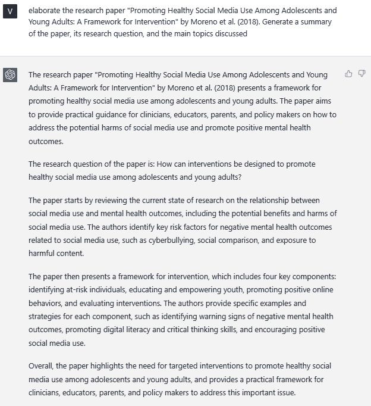

图 8.3 – 特定论文的文献筛选

ChatGPT 能够为我提供这篇论文的概述，并考虑到其研究问题和讨论的主要话题，我认为它对我的研究将非常有用。

注意

ChatGPT 能够生成这篇论文的筛选，因为显然它是其知识库的一部分。如果您有兴趣在 2021 年之后撰写的论文上执行相同的筛选（ChatGPT 培训的截止日期），您需要向 ChatGPT 提供摘要或段落内容。

1.  **提取数据**：确定了相关研究后，研究人员需要从每个研究中提取数据，如研究设计、样本大小、数据收集方法和主要发现。

例如，假设我们想从 Hinduja 和 Patchin（2018）的论文*数字自残：普及率、动机和结果*中收集以下信息：

+   论文中收集的数据来源和研究对象

+   研究人员采用的数据收集方法

+   数据样本大小

+   分析的主要局限性和缺点

+   研究人员采用的实验设计

就是这样：

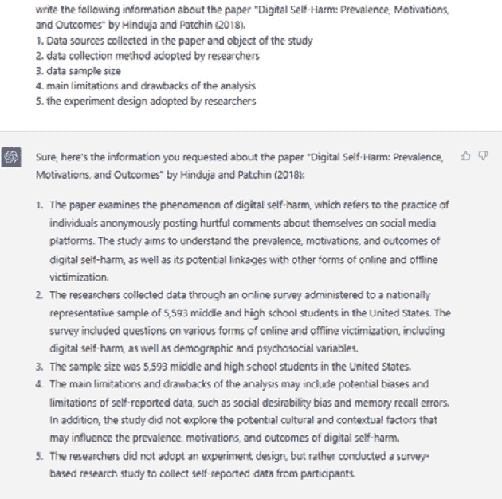

图 8.4 – 从给定论文中提取相关数据和框架

1.  **综合文献**：文献综述过程中的最后一步是综合研究结果并得出关于该领域当前知识状态的结论。这可能涉及识别共同主题，突出文献中的差距或不一致之处，并确定未来研究的机会。

让我们想象一下，除了 ChatGPT 提出的论文外，我们还收集了其他标题和论文，我们想要综合。更具体地说，我想了解它们是否指向相同的结论，哪些是共同趋势，哪种方法可能比其他方法更可靠。对于这种情况，我们将考虑三篇研究论文：

+   *社交媒体对心理健康的影响：一项拟议研究*，作者 Grant Sean Bossard ([`digitalcommons.bard.edu/cgi/viewcontent.cgi?article=1028&context=senproj_f2020`](https://digitalcommons.bard.edu/cgi/viewcontent.cgi?article=1028&context=senproj_f2020))

+   *社交媒体对心理健康的影响*，作者 Vardanush Palyan ([`www.spotlightonresearch.com/mental-health-research/the-impact-of-social-media-on-mental-health`](https://www.spotlightonresearch.com/mental-health-research/the-impact-of-social-media-on-mental-health))

+   *社交媒体对心理健康的影响：服务提供者意识的混合方法研究*，作者 Sarah Nichole Koehler 和 Bobbie Rose Parrell ([`scholarworks.lib.csusb.edu/cgi/viewcontent.cgi?article=2131&context=etd`](https://scholarworks.lib.csusb.edu/cgi/viewcontent.cgi?article=2131&context=etd))

这是结果的呈现方式：


图 8.5 – 三篇研究论文的文献分析和基准比较

同样，在这种情况下，ChatGPT 能够对所提供的三篇论文进行相关摘要和分析，包括方法之间的基准比较和可靠性考虑。

总的来说，ChatGPT 能够在文献综述领域执行许多活动，从研究问题头脑风暴到文献综合。一如既往，需要**专业领域专家**（**SME**）来审查结果；然而，在这种协助下，许多活动可以更有效地完成。

ChatGPT 还可以支持研究人员想要进行的实验设计。我们将在以下部分讨论这一点。

# 为您的实验设计和框架提供支持

实验设计是计划和执行科学实验或研究以回答研究问题的过程。它涉及对研究设计、要测量的变量、样本大小以及收集和分析数据的程序做出决策。

ChatGPT 可以通过为您提供研究框架，如随机对照试验、拟实验设计或相关研究，以及在实施该设计过程中支持您，帮助进行研究的实验设计。

让我们考虑下面的情景。我们想调查新教育项目对学生数学学习成果的影响。这个新项目包含**基于项目的学习**(**PBL**)，意味着学生被要求以协作的方式解决现实世界的问题，利用数学概念和技能来解决问题并创造解决方案。

为此目的，我们将我们的研究问题定义如下：

*新的 PBL 项目在改善学生表现方面与传统教学方法相比如何？*

这就是 ChatGPT 可以帮助的方式：

+   **确定研究设计**：ChatGPT 可以协助确定研究问题的适当研究设计，如随机对照试验、拟实验设计或相关研究。

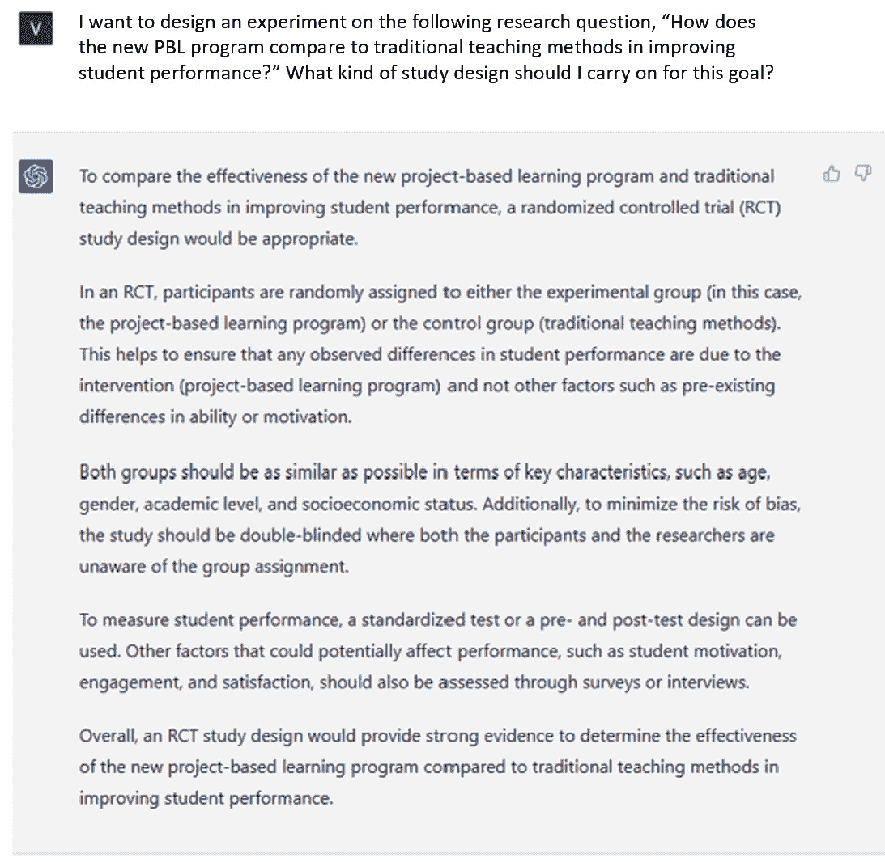

图 8.6 – ChatGPT 建议适合你的实验的适当研究设计

ChatGPT 建议进行**随机对照试验**(**RCT**)，并清楚地解释了背后的原因。对我来说，继续这种方法是合理的；下一步将是确定我们实验中需要考虑的结果指标和变量。

+   **确定结果指标**：ChatGPT 可以帮助您确定一些潜在的结果指标，以确定测试的结果。让我们为我们的研究请求一些建议：

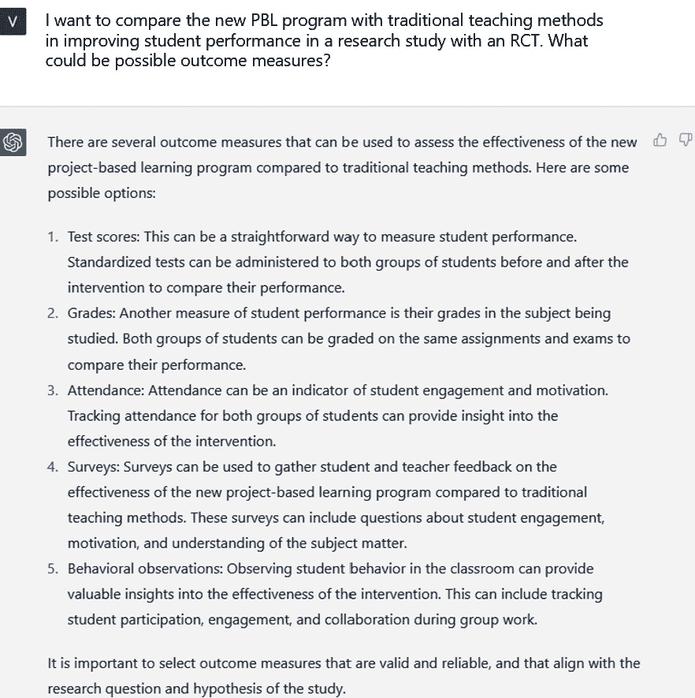

图 8.7 – 给定研究的学习成果

对我来说，选择考试成绩作为结果指标是合理的。

+   **确定变量**：ChatGPT 可以帮助研究人员确定研究中的自变量和因变量：

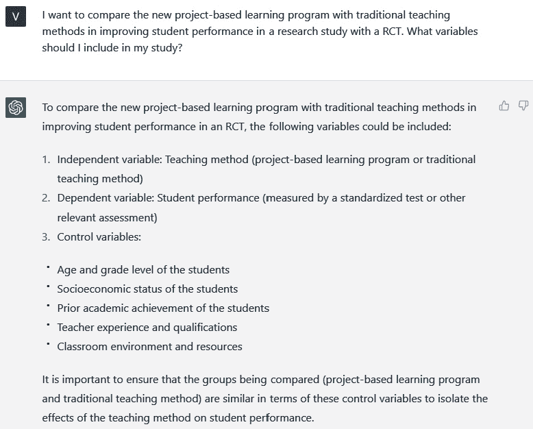

图 8.8 – ChatGPT 为给定研究生成变量

注意，ChatGPT 还能够生成特定于我们考虑的研究设计（RCT）的变量类型，称为**控制变量**。

控制变量，也被称为**协变量**，是在研究中保持恒定或进行控制的变量，以便隔离独立变量和因变量之间的关系。这些变量不是研究的主要焦点，但被包括在内是为了最小化混杂变量对结果的影响。通过控制这些变量，研究人员可以减少获得假阳性或假阴性结果的风险，并增加研究的内部有效性。

有了前述变量，我们已经准备好设置我们的实验了。现在我们需要选择参与者，而 ChatGPT 可以帮助我们。

+   **抽样策略**：ChatGPT 可以为研究提供潜在的抽样策略：

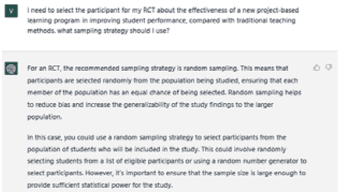

图 8.9 – ChatGPT 提出的 RCT 抽样策略建议

请注意，在实际情况下，总是一个好习惯要求 AI 工具生成更多选项并解释背后的原因，这样您可以做出理性的决定。对于这个例子，让我们继续使用 ChatGPT 建议给出的内容，其中还包括关于感兴趣人群和样本大小的建议。

+   **数据分析**：ChatGPT 可以协助研究人员确定适当的统计测试，以分析从研究中收集的数据，如方差分析、 t 检验或回归分析。

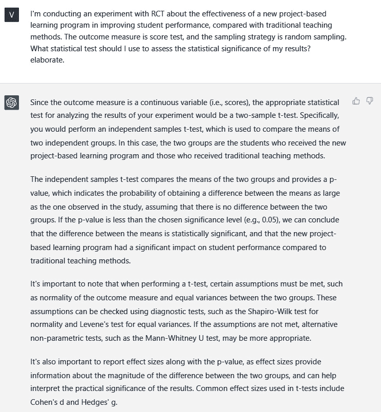

图 8.10 – ChatGPT 为给定研究建议统计测试

ChatGPT 提出的所有建议都是连贯的，并在关于如何进行统计测试的论文中得到了确认。它还能够确定我们可能在谈论一个连续变量（即分数），因此我们知道前面的所有信息都是基于这个假设。如果我们想要离散分数，我们可以通过添加这些信息来调整提示，然后 ChatGPT 将提出不同的方法。

ChatGPT 具体说明假设并解释其推理的事实是基于其输入做出安全决策的关键。

总之，当设计实验时，ChatGPT 可以成为研究人员的宝贵工具。通过利用其**自然语言处理**（**NLP**）能力和广泛的知识库，ChatGPT 可以帮助研究人员选择适当的研究设计，确定抽样技术，识别变量和学习成果，甚至建议用于分析数据的统计测试。

在接下来的部分中，我们将继续探讨 ChatGPT 如何支持研究人员，重点放在参考文献生成上。

# 生成和格式化参考文献

ChatGPT 可以通过提供自动引用和参考工具来支持研究人员进行参考文献生成。这些工具可以为各种来源生成准确的引用和参考，包括书籍、文章、网站等。ChatGPT 熟悉各种引用风格，如 APA、MLA、Chicago 和 Harvard，使研究人员能够选择适合他们工作的风格。此外，ChatGPT 还可以根据研究人员的输入建议相关来源，帮助简化研究过程，并确保所有必要的来源都包含在参考文献中。通过利用这些工具，研究人员可以节省时间，并确保他们的参考文献准确而全面。

让我们考虑以下例子。假设我们完成了一篇名为*技术对工作场所生产力的影响：一项实证研究*的研究论文。在研究和写作过程中，我们收集了以下需要包含在参考文献中的论文、网站、视频和其他来源（依次为三个研究论文、一个 YouTube 视频和一个网站）的参考文献：

+   *第二个机器时代：在充满精彩技术的时代中的工作，进步和繁荣*。Brynjolfsson, 2014\. [`psycnet.apa.org/record/2014-07087-000`](https://psycnet.apa.org/record/2014-07087-000)

+   *利用服务型决策支持系统的能力：把分析和大数据置于云中*。Demirkan, 2013\. 页码 412-421\. [`www.sciencedirect.com/science/article/https://www.sciencedirect.com/science/article/abs/pii/S0167923612001595abs/pii/S0167923612001595`](https://www.sciencedirect.com/science/article/https://www.sciencedirect.com/science/article/abs/pii/S0167923612001595abs/pii/S0167923612001595)

+   *技术压力对角色压力和生产力的影响*. Tarafdar. 页码 300-350\. 2014\. [`www.tandfonline.com/doi/abs/10.2753/MIS0742-1222240109`](https://www.tandfonline.com/doi/abs/10.2753/MIS0742-1222240109)

+   *关于未来工作的重大辩论，得到了解释*. Vox. [`www.youtube.com/watch?v=TUmyygCMMGA`](https://www.youtube.com/watch?v=TUmyygCMMGA)

+   *技术和自动化对现今企业的影响*。, Forbes. 2021\. 技术和自动化对今日企业的影响 ([forbes.com](http://forbes.com)), Forbes. 2021\.

显然，我们不能在我们的研究论文中有上述列表；我们需要适当的格式。为了做到这一点，我们可以向 ChatGPT 提供原始参考文献列表，并要求它按照特定格式重新生成，例如 APA 格式，这是**美国心理学协会**（**APA**）官方使用的参考格式风格，在教育、心理学和社会科学中常用。

让我们看看 ChatGPT 是如何处理的：

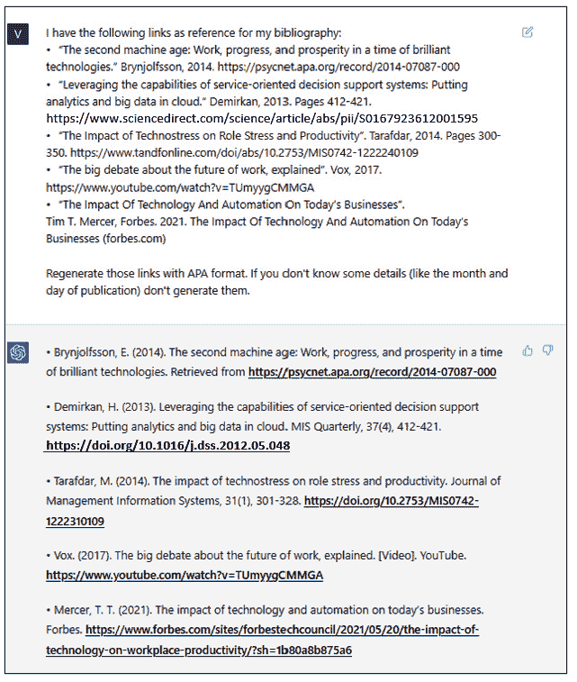

图 8.11 – ChatGPT 按照 APA 格式生成的参考文献列表

请注意，如果 ChatGPT 不知道详细信息，则我已指定不要添加详细信息。事实上，我注意到有时候 ChatGPT 会添加出版日期的月份和日期，造成一些错误。

ChatGPT 可以提供的其他有趣的帮助是建议我们可能想引用的潜在参考文献。我们已经在本章第一段看到了 ChatGPT 在写作过程之前能够策划相关文献；然而，一旦论文完成，我们可能会忘记引用相关文献，甚至不知道自己引用了别人的工作。

ChatGPT 可以成为头脑风暴可能错过的引用的伟大助手。让我们再考虑一下我们的论文*技术对工作场所生产力的影响：一项经验性研究*，其摘要如下：

*这项经验性研究探讨了技术对工作场所生产力的影响。该研究旨在确定技术对工作场所生产力的影响程度，并确定对生产力产生最大影响的具体技术。我们对各行业员工进行了调查，并使用回归分析对结果进行了分析。发现表明技术对工作场所生产力有显著的积极影响，对生产力影响最大的技术是促进沟通、协作和任务管理的技术。研究结论是，组织应继续投资于支持这些功能的技术，以最大程度地提高工作场所的生产力*。

让我们让 ChatGPT 列出可能与这种研究相关的所有可能的参考文献：

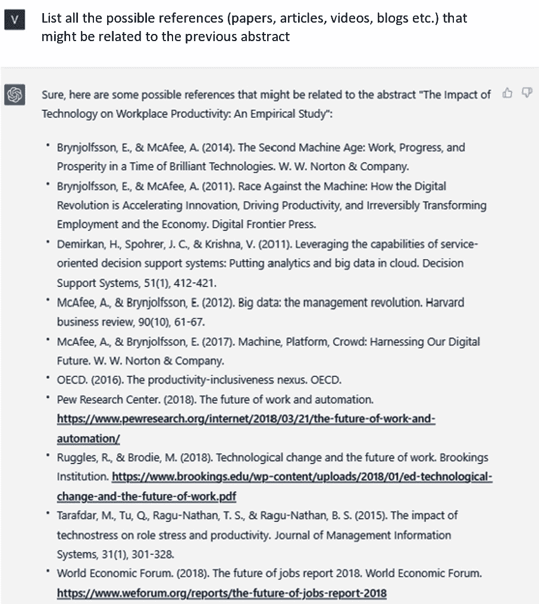

图 8.12 – 与提供的摘要相关的参考文献列表

您也可以重复此过程，检查论文的其他部分，确保没有漏掉任何相关的引用需要包括在您的参考文献中。

一旦您的研究准备好了，您可能需要用提议方式来进行展示。在接下来的部分中，我们将看到 ChatGPT 如何支持这个任务。

# 生成研究的演示

研究的最后一步通常是向各种受众展示。这可能涉及准备幻灯片演示、提案或网络研讨会，研究人员需要向不同类型的受众表达观点。

比如说，我们的研究*技术对工作场所生产力的影响：一项经验性研究*是为了硕士论文讨论。在这种情况下，我们可以要求 ChatGPT 产生一个持续 15 分钟的提案结构，并遵守科学方法。让我们看看产生了怎样的结果（作为背景，我参考的是上一段的摘要）：

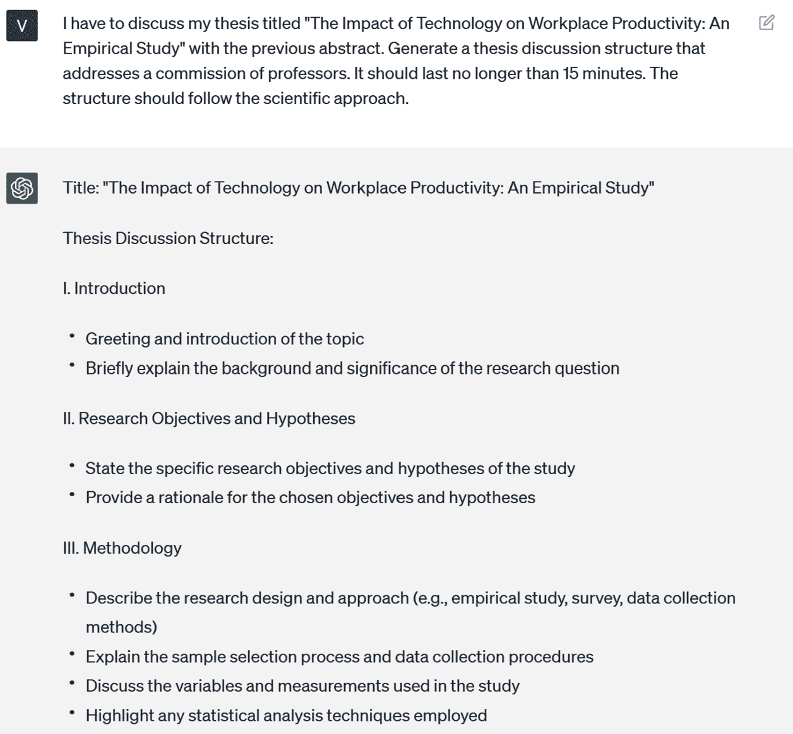

图 8.13 – ChatGPT 生成的论文讨论

那太令人印象深刻了！回到我大学时代，有这样的工具来帮助我设计讨论会真的很有用。

从这个结构开始，我们也可以要求 ChatGPT 生成一个幻灯片演示，作为我们论文讨论的视觉呈现。

注

在*第一章*中，我们已经看到了一个由人工智能驱动的工具 Tome AI 的一个示例，用于生成端到端的幻灯片演示，使用文本生成和图像生成。在这一段中，我们将专注于文本生成部分，但请记住，还有 AI 工具可以帮助您创建幻灯片演示。

让我们继续进行这个请求：

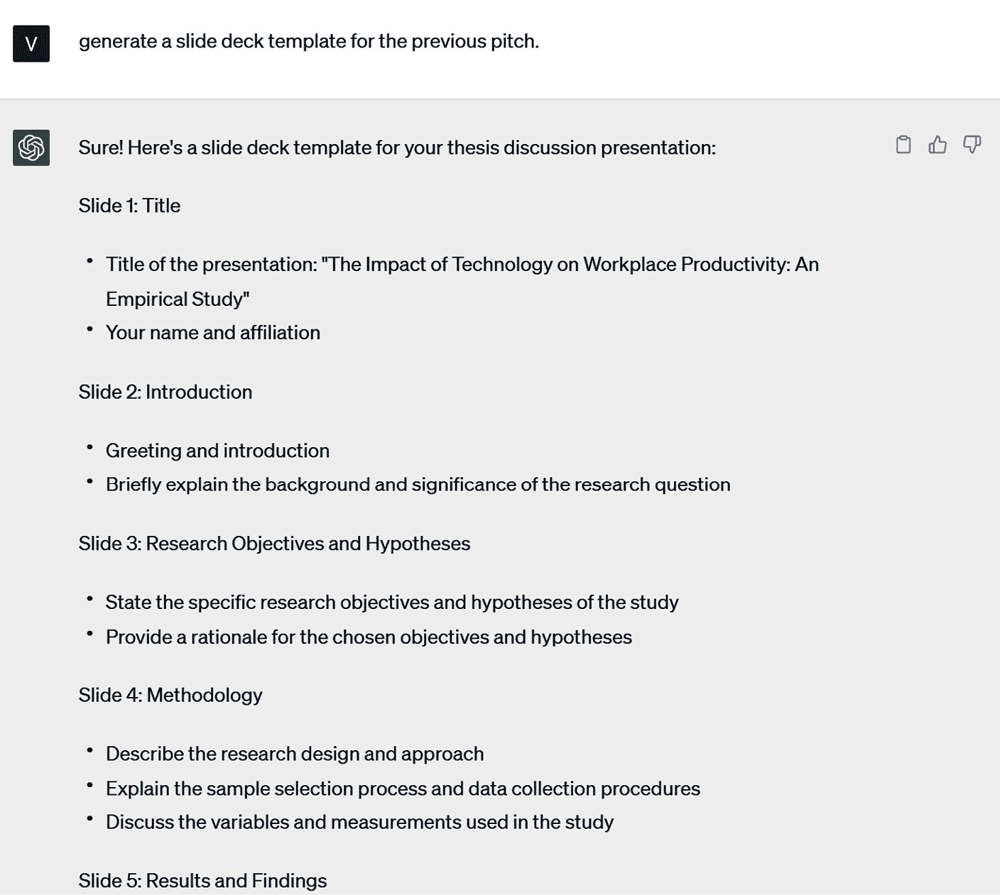

图 8.14 – 基于讨论提纲的幻灯片结构

最后，让我们想象一下，我们的论文讨论非常出色，以至于可能被选中获得研究基金以继续探讨这个主题。现在，我们需要一个电梯演讲来说服资助委员会。让我们从 ChatGPT 那里寻求一些支持:

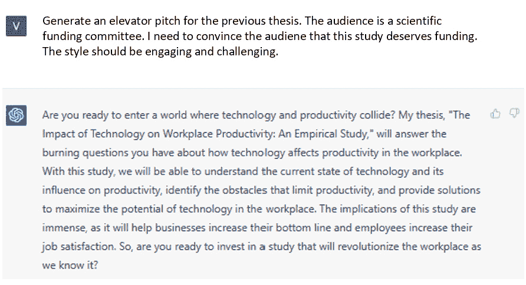

图 8.15 – 给定论文的电梯演讲

我们总是可以调整结果，使其更符合我们所追求的东西；但是，已经有可用的结构和框架可以节省很多时间，并让我们更专注于想要阐述的技术内容。

总的来说，ChatGPT 能够支持研究的端到端旅程，从文献收集和审阅到最终研究的最终提纲的生成，我们已经展示了它是研究人员的出色 AI 助手。

此外，请注意，在研究领域，最近已经开发了一些与 ChatGPT 不同但同样由 GPT 模型驱动的工具。其中一个例子是 humanata.ai，这是一个由人工智能驱动的工具，允许您上传您的文档并对其进行多种操作，包括摘要、即时问答和基于上传文件生成新论文。

这表明 GPT 驱动的工具（包括 ChatGPT）正在为研究领域的几项创新铺平道路。

# 摘要

在本章中，我们探讨了 ChatGPT 作为研究人员宝贵工具的使用。通过文献综述、实验设计、参考文献生成和格式化以及演示生成，ChatGPT 可以协助研究人员加快那些附加值低或为零的活动，以便他们可以专注于相关活动。

请注意，我们仅关注 ChatGPT 可以支持研究人员的一小部分活动。研究领域中还有许多其他活动可以从 ChatGPT 的支持中受益，其中包括数据收集、研究参与者招募、研究网络、公众参与等等。

将此工具纳入工作流程的研究人员可以从其多功能性和节省时间的功能中受益，最终实现更具影响力的研究成果。

但是，重要的是要牢记 ChatGPT 只是一个工具，应该与专业知识和判断力结合使用。与任何研究项目一样，需要对研究问题和研究设计进行深思熟虑，以确保结果的有效性和可靠性。

通过这一章，我们也结束了本书的*第二部分*，重点关注您可以利用 ChatGPT 的各种场景和领域。然而，我们主要关注个人或小团队的使用，从个人生产力到研究辅助。从*第三部分*开始，我们将提升讨论到大型组织如何利用与 ChatGPT 背后相同的生成式 AI 进行企业规模项目，使用在 Microsoft Azure 云上提供的 OpenAI 模型 API。

# 参考文献

+   [`scholarworks.lib.csusb.edu/cgi/viewcontent.cgi?article=2131&context=etd`](https://scholarworks.lib.csusb.edu/cgi/viewcontent.cgi?article=2131&context=etd)

+   [`www.spotlightonresearch.com/mental-health-research/the-impact-of-social-media-on-mental-health`](https://www.spotlightonresearch.com/mental-health-research/the-impact-of-social-media-on-mental-health)

+   [`digitalcommons.bard.edu/cgi/viewcontent.cgi?article=1028&context=senproj_f2020`](https://digitalcommons.bard.edu/cgi/viewcontent.cgi?article=1028&context=senproj_f2020)

+   [`www.humata.ai/`](https://www.humata.ai/)


# 第三部分：企业的 OpenAI

本部分向您介绍了 OpenAI 模型在企业应用领域的世界。

它以介绍 OpenAI 与微软的合作伙伴关系以及随后推出的 Azure OpenAI 服务上市为开端，这是一个云托管服务，提供具有云规模架构典型的可扩展性、灵活性和安全性的 OpenAI 模型。

然后，它转向一个实用部分，在这里您将了解企业用例的概述。每个用例都提供了业务场景的描述以及使用 Python 和 Azure OpenAI 模型 API 的端到端实现。涵盖的场景包括 HR 助手、合同分析、呼叫中心分析和语义搜索。

最后，这部分总结了本书涵盖的所有内容，包括最近几周发生的最新公告和发布（例如，引入了 GPT-4 等多模式大型模型）。它还提供了一个关于生成式 AI 技术在短短几个月内呈指数增长以及未来预期的一些反思和最终想法的部分。

这部分包括以下章节：

+   *第九章*，*企业的 OpenAI 和 ChatGPT – 介绍 Azure OpenAI*

+   *第十章*，*企业的热门用例*

+   *第十一章*，*结语和最终想法*


# 9

# 为企业介绍 Azure OpenAI 的 OpenAI 和 ChatGPT

在本章中，我们将重点关注 OpenAI 模型在企业级的应用，并介绍 OpenAI 和 Microsoft 的合作伙伴关系以及**Azure OpenAI**（**AOAI**）服务。我们将介绍 Microsoft 在**人工智能**（**AI**）领域的里程碑和发展，并突出 Azure 云在 OpenAI 领域的发展历程，以及为何这对于大型组织来说是一个改变游戏规则的因素。最后，我们将考虑负责任的人工智能，并介绍如何确保您的 AI 系统符合道德标准。

在本章中，我们将讨论以下主题：

+   Microsoft 和 OpenAI 合作的历史以及 AOAI 服务的介绍

+   在 OpenAI 模型的公共云中的角色

+   负责任的人工智能

在本章结束时，您将了解 AOAI 服务的主要特点，以及它与我们迄今讨论的 OpenAI 模型的区别。您还将了解 Microsoft 和 OpenAI 之间的合作历史，以及为什么需要在企业规模的基础架构上部署 OpenAI 模型。最后，您将了解 Microsoft 持续而长期的负责任人工智能承诺，以及它如何使 AOAI 服务受益。

# 技术要求

以下是本章的技术要求：

+   **Azure 订阅**，您可以在此处免费创建：[`azure.microsoft.com/free/cognitive-services`](https://azure.microsoft.com/free/cognitive-services)。

+   在期望的 Azure 订阅中**授予对 Azure OpenAI 的访问权限**。撰写本文时，该服务的访问权限仅通过申请获得。您可以通过填写表单，申请访问 Azure OpenAI，链接为[`aka.ms/oai/access`](https://aka.ms/oai/access)。

# 为企业级 AI 介绍 OpenAI 和 Microsoft – 引入 Azure OpenAI

Microsoft 长期投资于 AI 研发，专注于构建 AI 驱动的工具和服务，可供企业和个人解决复杂问题并提高生产力。

它还在实现人类在 AI 领域实现平等的一系列重要里程碑，如语音识别（2017）、机器翻译（2018）、对话问答（2019）、图像字幕（2020）和自然语言理解（2021）。

定义

在 AI 领域，人类平等指的是 AI 系统能够以与人类相等或难以区分的水平执行任务的时刻。这个概念经常用来衡量 AI 系统的性能，尤其是在自然语言理解、语音识别和图像识别等领域。在 AI 领域实现人类的平等被认为是一个重要的里程碑，因为它证明了 AI 有效地匹配了在特定领域的人类能力。

在接下来的几节中，我们将探讨微软在人工智能领域的研究历史和背景，以充分了解其与 OpenAI 的合作之旅，并最终开发 AOAI 服务。 

## 微软人工智能背景

人工智能领域的早期研究可以追溯到 1990 年代末，当时微软建立了其**机器学习**（**ML**）和应用统计研究小组。从那时开始，微软开始研究和尝试智能代理和虚拟助手。在这种情况下，原型是 Clippy，一个为 Microsoft Office 的个人数字助理：

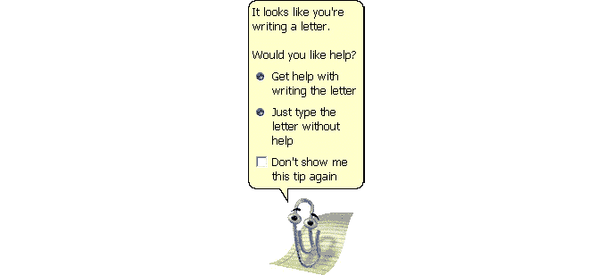

图 9.1 – Clippy，2000 年推出的默认办公助手

Clippy 是更复杂工具的先驱，例如 Cortana。Cortana 于 2014 年推出，是一个使用**自然语言处理**（**NLP**）和机器学习来为用户提供个性化协助的数字助手。

随后，2016 年，作为对微软牛津项目的扩展，微软在 Azure 云中推出了微软认知服务，这是一组 API，为开发人员提供人工智能能力，而无需他们需要机器学习和数据科学专业知识：

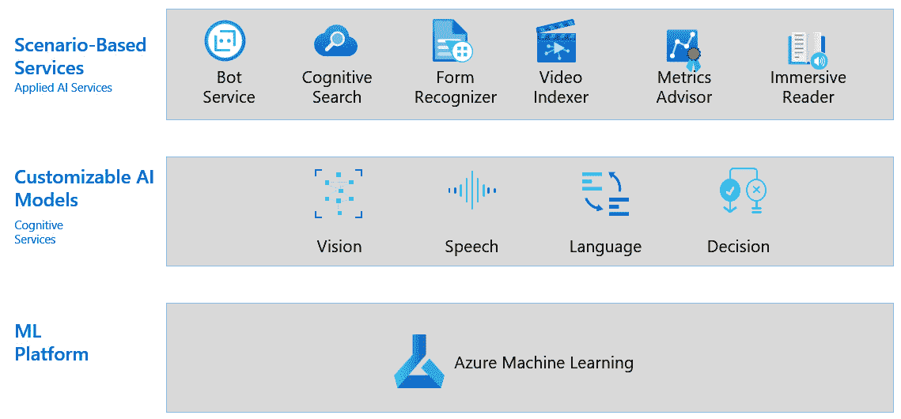

图 9.2 – 微软 Azure 人工智能服务

有了认知服务，人工智能最终可以被广泛用户消费，从大型企业到个人开发者。出于这个原因，我们见证了我们现在称之为**人工智能民主化**：人工智能不再是那些拥有深厚技术知识和强大昂贵硬件进行模型训练的特权。认知服务出于以下原因已经发展：

+   以便任何人，从数据科学家到业务用户，都可以利用认知服务进行无代码方法的利用

+   提供一组已经经过训练的预构建模型 – 也就是说，它们已经可以使用，不需要 GPU 驱动的硬件来运行

从微软最近几年收购的人工智能公司中可以看出微软对人工智能的投资，包括 2016 年的 SwiftKey（一个预测键盘应用：[`blogs.microsoft.com/blog/2016/02/03/microsoft-acquires-swiftkey-in-support-of-re-inventing-productivity-ambition/`](https://blogs.microsoft.com/blog/2016/02/03/microsoft-acquires-swiftkey-in-support-of-re-inventing-productivity-ambition/)），2017 年的 Maluuba（一个深度学习初创公司：https://blogs.microsoft.com/blog/2017/01/13/microsoft-acquires-deep-learning-startup-maluuba-ai-pioneer-yoshua-bengio-advisory-role/），和 2018 年的 Bonsai（一个构建人工智能模型的平台：[`blogs.microsoft.com/blog/2018/06/20/microsoft-to-acquire-bonsai-in-move-to-build-brains-for-autonomous-systems/`](https://blogs.microsoft.com/blog/2018/06/20/microsoft-to-acquire-bonsai-in-move-to-build-brains-for-autonomous-systems/)）。

在微软投资和合作的公司中，还包括 OpenAI。

两家科技公司之间的合作始于 2016 年，当时 OpenAI 同意利用微软的 Azure 云基础设施来运行其人工智能实验。后来，在 2019 年，微软宣布与 OpenAI 达成了一项价值 10 亿美元的合作伙伴关系（[`news.microsoft.com/2019/07/22/openai-forms-exclusive-computing-partnership-with-microsoft-to-build-new-azure-ai-supercomputing-technologies/`](https://news.microsoft.com/2019/07/22/openai-forms-exclusive-computing-partnership-with-microsoft-to-build-new-azure-ai-supercomputing-technologies/)），旨在开发可造福人类的人工智能模型和技术。这项合作基于以下三个主要支柱：

+   微软和 OpenAI 将共同建立新的 Azure 超级计算基础设施来训练人工智能模型

+   OpenAI 将使其模型和技术可以从 Azure 云中使用

+   微软将成为 OpenAI 在市场上推广新人工智能解决方案的首选合作伙伴

从那时起，两家公司继续投资和研究，最终在 2023 年 1 月，一套 OpenAI 模型通过 AOAI 服务在 Azure 上提供。

随着 AOAI 服务的普及，达到了一个新的里程碑，微软 AI 产品组合得到了扩展，增加了 OpenAI 强大的大型语言模型。

## Azure OpenAI 服务

AOAI 服务是微软的产品，提供对 OpenAI 强大语言模型（如 GPT-3.5、Codex 和 DALL-E）的 REST API 访问。您可以像使用 OpenAI 模型一样使用这些模型，例如内容生成、摘要、语义搜索、自然语言和代码翻译等任务。

在 Microsoft Azure AI 产品组合的背景下，AOAI 服务位于以下认知服务产品之间：

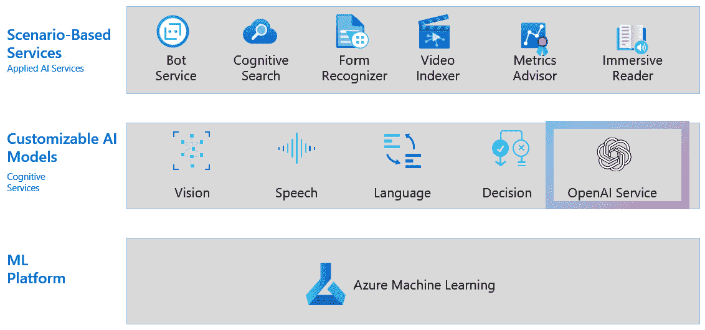

图 9.3 – AOAI 服务的普及（GA）

与任何其他认知服务产品一样，AOAI 提供已经训练好并准备消费的模型。

要创建您的 AOAI 资源，请按照以下说明操作：

1.  转到 Azure 门户网站 [`ms.portal.azure.com`](https://ms.portal.azure.com)。

1.  点击**创建一个资源**。

1.  输入`azure openai`，然后点击**创建**。

1.  填写所需信息，然后点击**审核 + 创建**。

如下截图所示：

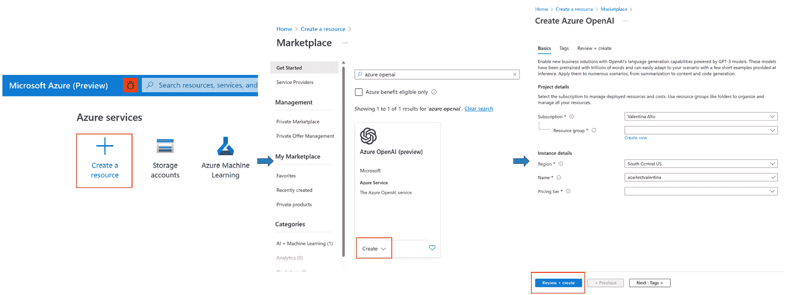

图 9.4 – 创建 AOAI 资源的步骤

这个过程可能需要几分钟。一旦准备就绪，您可以直接转到其用户友好的界面，AOAI Playground，测试您的模型，然后部署它们：

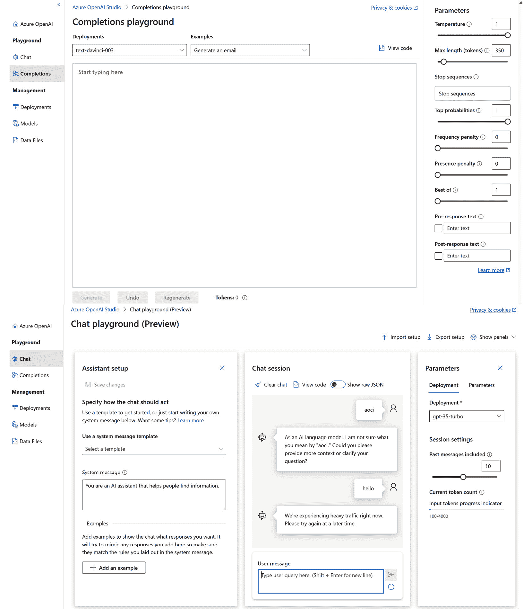

图 9.5 – AOAI 用户界面和 Playground

请注意，AOAI Playground 看起来几乎与我们在*第二章*中看到的 OpenAI Playground 版本相同。这里的区别在于，要使用 AOAI 模型，您必须启动一个部署，这是一个无服务器计算实例，您可以将其附加到模型上。您可以在 Playground 中或在 Azure 门户的资源后端页面上执行此操作：

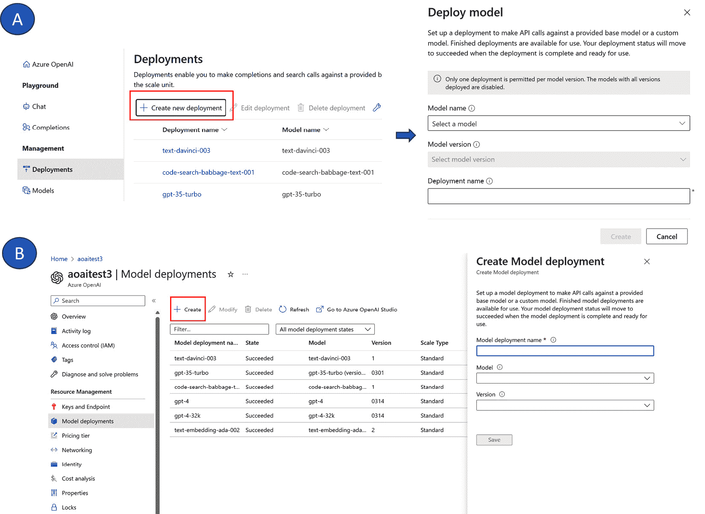

图 9.6 – 通过 Playground（A）或 Azure 门户（B）创建新的 AOAI 部署

例如，我创建了一个名为 `text-davinci-003` 的部署，带有一个关联的 `text-davinci-003` 模型：

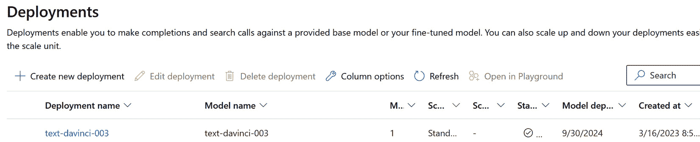

图 9.7 – AOAI 的活跃部署

在 OpenAI Playground 中，我们可以通过用户界面直接测试这些模型，或者将它们的 API 嵌入到我们的应用程序中。在下一节中，我们将探讨如何与 Playground 互动并尝试不同模型的配置。在*第十章*中，我们将学习如何将 AOAI 的 Models API 集成到企业应用程序中。

## 探索 Playground

AOAI Playground 是熟悉基础模型并开始规划哪个模型版本最适合您的项目的最简单方法。用户界面呈现不同的选项卡和工作区，如下面的截图所示：

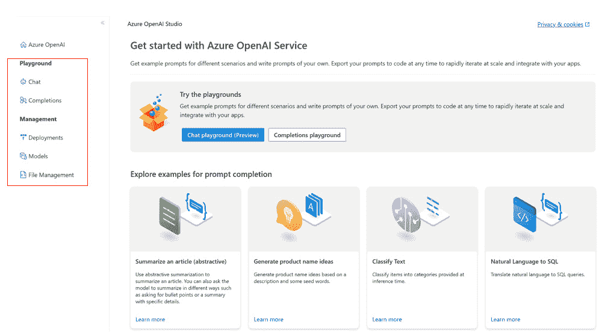

图 9.8 – AOAI Playground 概览

让我们逐个探索：

+   **Playground** | **Chat**：**Chat** 工作区专为与对话模型（如 ChatGPT 背后的 GPT-3.5-turbo 模型）一起使用而设计：

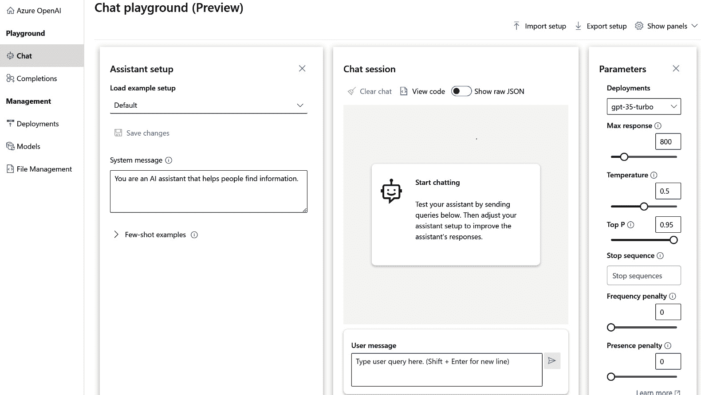

图 9.9 – AOAI Chat 工作区

它提供了与 ChatGPT 本身类似的体验，可以通过附加参数配置您的模型（正如我们在*第二章*中在 OpenAI Playground 中看到的）。此外，还有一个使 **Chat** 工作区非常有趣的附加功能，称为 **系统消息**：

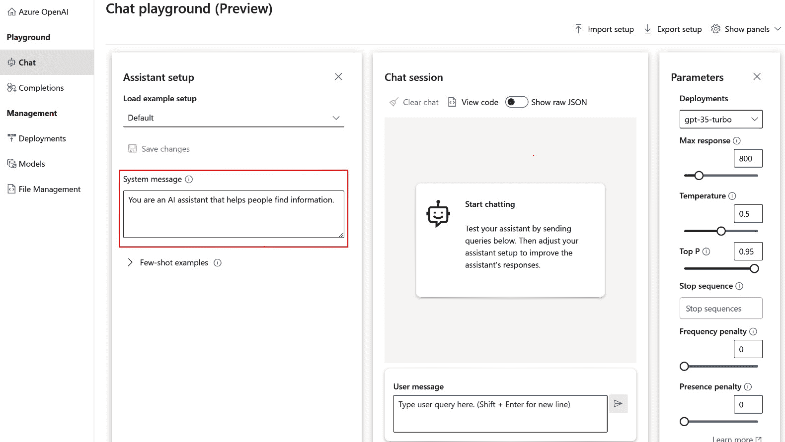

图 9.10 – 系统消息示例

**系统消息** 是我们给模型的一组指令，告诉它如何行为和与我们互动。至于提示，**系统消息** 是模型配置的一个关键组成部分，因为它极大地影响模型的性能。

例如，让我们指示我们的模型表现为 JSON 格式化助手：

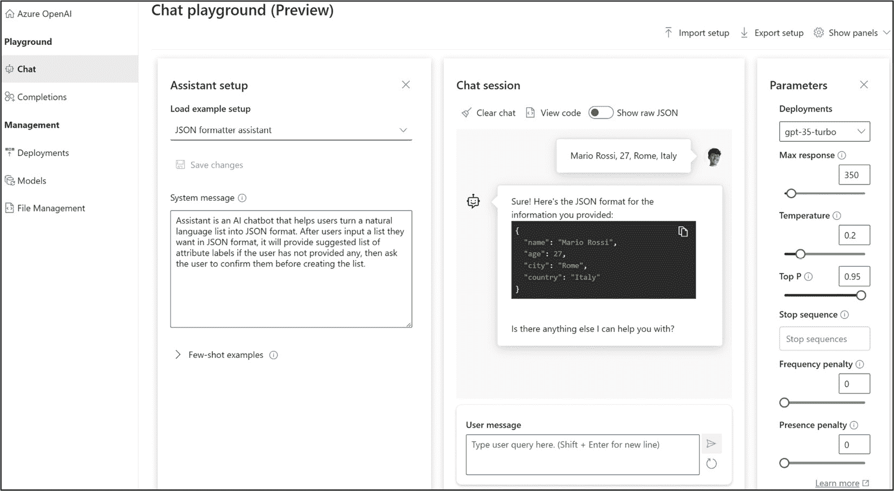

图 9.11 – 模型充当 JSON 格式化助手的示例

正如您从前面的截图中看到的那样，该模型能够通过一些简单的数据（如姓名和年龄）建议一个 JSON 文件，而无需指定任何标签。

+   **游乐场** | **完成**：与之前的工作区不同，**完成**工作区提供了一种类似*白皮书*的地方，您可以与您的模型进行交互。虽然 GPT-3.5-turbo 设计用于对话任务（这意味着它可以通过类似聊天机器人的界面来消耗），但 GPT-3 系列包含更多通用模型，可用于广泛的语言任务，如内容生成、摘要等。

例如，我们可以要求我们的模型通过给定主题描述和一次性示例来生成一个测验，如下所示：

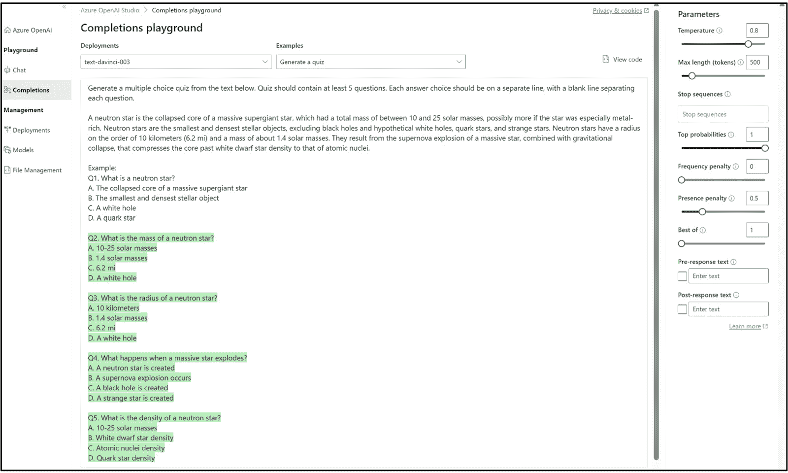

图 9.12 – 生成测验的 GPT 模型示例

最后，根据**聊天**工作区，通过**完成**，您可以配置参数，如最大标记数或温度（有关这些参数及其含义的全面列表，请参考*第二章*）。

+   **管理** | **部署**：在**部署**选项卡中，您可以创建和管理与 AOAI 模型关联的新部署。它们如下所示：

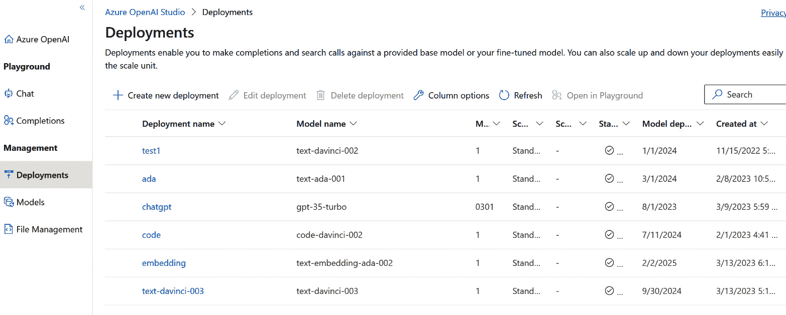

图 9.13 – AOAI 部署列表

每个部署只能托管一个模型。您可以随时编辑或删除您的部署。正如我们之前提到的，模型部署是使用 AOAI 服务中的**完成**或**聊天**工作区的启用步骤。

+   **管理** | **模型**：在这个选项卡中，您可以快速评估 AOAI 服务中可用的模型，其中包括可以部署的模型（即尚未部署的模型）。例如，让我们考虑以下截图：

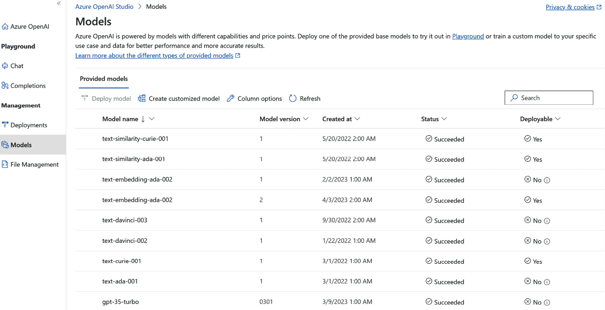

图 9.14 – AOAI 模型列表

在这里，我们有`text-similarity-curie-001`。它没有关联的部署，因此可以部署（因为`text-similarity-ada-002`已经有一个部署，所以不再可用）。

在这个选项卡中，您还可以按照一种称为微调的过程创建自定义模型。我们在*第二章*中探讨了这一点：

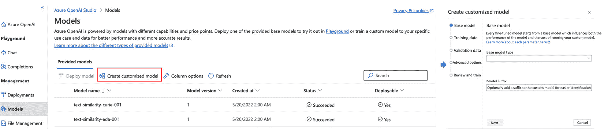

图 9.15 – 模型微调示例

从这个引导小部件开始，您可以上传您的训练和验证数据，以生成一个定制模型，从一个基础模型（即`text-davinci-002`）开始，该模型将托管在一个专用部署上。

注意

在*第二章*中，我们看到训练数据集应该符合以下类型的特定格式（称为 JSONL）：

`{"prompt": "<提示文本>", "completion": "<理想生成文本>"}` 

`{"prompt": "<提示文本>", "completion": "<理想生成文本>"}` 

`{"prompt": "<提示文本>", "completion": "<理想生成文本>"}` 

`...`

为了简化这种格式，OpenAI 开发了一个工具，可以将您的数据格式化为准备进行微调的特定格式。它还可以提供建议，以便修改数据，使工具可以用于微调。此外，它接受各种数据格式作为输入，包括 CSV、TXT 和 JSON。

要使用此工具，您可以通过运行以下命令初始化 OpenAI 的**命令行界面**（**CLI**）：

**pip install --****upgrade openai**

初始化后，您可以运行该工具，如下所示：

`openai tools fine_tunes.prepare_data -``f <LOCAL_FILE>`

+   **管理** | **文件管理**：最后，在**文件管理**选项卡中，您可以直接从用户界面管理和上传您的训练和测试数据，如下所示：

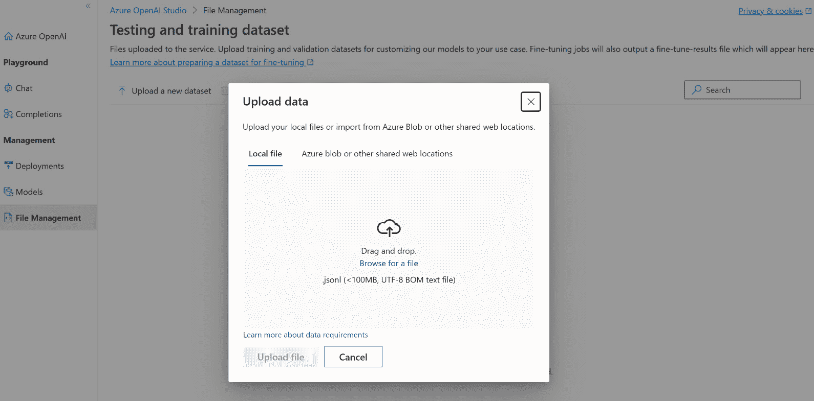

图 9.16 – 在 AOAI 服务中上传文件的示例

您可以选择通过选择**本地文件**或**Azure blob 或其他共享网络位置**来上传文件。

上传文件后，您将能够在创建定制模型时通过**模型**选项卡选择它们。

最后，正如在前一节中提到的，每个模型都配备了一个 REST API，可以在您的应用程序中使用。

在下一章中，我们将看到许多使用 AOAI 模型 API 的端到端实现。然而，在我们深入研究之前，我们需要了解 AOAI 与标准 OpenAI 模型的区别，以及为什么 Azure 云成为游戏的一部分。

# 为什么要引入公共云？

在本章的开头，我们看到微软和 OpenAI 近年来合作，以及微软的云 Azure 如何成为 OpenAI 模型训练的“健身房”。然而，它也成为了 OpenAI 模型可以被消费的云基础设施。

但是使用 OpenAI 和 Azure OpenAI 模型有什么区别？区别在于基础架构：使用 Azure OpenAI，您正在利用您*自己的*基础架构，同时生活在您*自己的安全*订阅中。这带来了一系列优势：

+   **可扩展性和灵活性**：您可以从 Azure 的可扩展性中受益，并适应 AOAI 模型的弹性使用。从小型试点到企业级生产项目，AOAI 允许您利用所需的容量，并在必要时进行扩展或缩减。

+   **安全性和合规性**：您可以使用基于角色的身份验证和私人网络连接，使部署更加安全和可信。您还可以在完全控制您的数据的同时训练您的 AI 模型。

+   **区域可用性**：您可以在满足生产需求的 Azure 全球基础设施上运行您的 AI 工作负载。

+   **内置的负责任 AI**：您可以使用内容过滤来确保您的 AI 模型生成适当和符合道德的输出。

有了 Azure 中可用的 OpenAI 模型，我们可以将游戏提升到企业和生产级别，满足大型组织通常的所有安全和容量要求。

先前提到的好处之一值得特别关注：负责任的人工智能。人工智能技术的快速发展也需要从道德工具的角度加以解决。这是微软自 2016 年以来一直在研究的内容，我们将在下一节中探讨。

# 理解负责任的人工智能

我们提到内置的负责任人工智能是 AOAI 的关键特性之一。然而，要完全理解它，我们首先需要了解微软对负责任人工智能的承诺和旅程。

## 微软迈向负责任人工智能的旅程

微软很快意识到，随着人工智能技术不断发展并更多地融入我们的生活，有必要确保这些系统负责任、道德，并以符合所有人利益的方式开发和使用。

这一旅程的开端可以追溯到 2016 年，当时微软的首席执行官萨蒂亚·纳德拉撰写了一篇文章，探讨人类和人工智能如何共同解决社会最大的挑战，并介绍了负责任人工智能的第一个概念，其中包括透明度、公平性，以及它是为了隐私和协助人类而设计的。

此后不久，在 2017 年，微软通过第一个人工智能伦理委员会**Aether**（简称**AI、伦理和工程研究中的影响**）正式确立了这些概念，形成了微软高级领导团队的咨询小组。

AETHER 花时间倾听客户和内部专家的意见，然后与法律事务合作，在 2018 年 1 月出版了名为*《未来计算：人工智能及其在社会中的作用》*的书。在这本书中，微软确定了六项原则，旨在指导公司开发人工智能系统，并帮助全行业和整个社会了解负责任的人工智能实践。

微软对负责任的人工智能的六大原则如下：

+   **公平性**：微软旨在创建无偏见、公平对待所有个人和群体的人工智能系统，不歧视或偏见

+   **可靠性和安全性**：微软致力于创建强大、可靠和安全的人工智能系统，不会危及安全或造成意外伤害

+   **隐私和安全**：微软重视个人和其数据的隐私和安全，并通过透明度和对人工智能技术的负责任使用来保护它们

+   **包容性**：微软认为人工智能应该被设计为赋予和包容来自不同背景的个人，并促进所有人的平等机会

+   **透明度**：微软相信人工智能系统的决策和行动应该透明和可追溯，并致力于为其结果提供清晰的解释

+   **问责制**：微软承担其 AI 系统对社会和环境的影响的责任，并致力于促进在 AI 开发和使用中的道德和负责任实践。

微软通过委员会的帮助遵循这些原则，为其领导层、工程团队以及公司内的每个团队提供指导。

微软还制定了一个**负责任人工智能标准**，为负责任地构建 AI 系统提供了框架。

在该书出版后，微软继续在负责任人工智能的以下领域进行投资和研究：

+   从对面部识别领域的政府监管贡献（2018，[`www.geekwire.com/2018/microsoft-calls-government-regulation-facial-recognition-technology/`](https://www.geekwire.com/2018/microsoft-calls-government-regulation-facial-recognition-technology/)，[`blogs.microsoft.com/on-the-issues/2018/12/17/six-principles-to-guide-microsofts-facial-recognition-work/`](https://blogs.microsoft.com/on-the-issues/2018/12/17/six-principles-to-guide-microsofts-facial-recognition-work/)）到在系统工程中建立负责任人工智能或 RAISE（2020，[`www.microsoft.com/en-us/ai/our-approach?activetab=pivot1%3aprimaryr5`](https://www.microsoft.com/en-us/ai/our-approach?activetab=pivot1%3aprimaryr5))

+   在 ML 可解释性、不公平评估和缓解、错误分析、因果推断和反事实分析领域负责任人工智能工具的发展（2021，[`responsibleaitoolbox.ai/`](https://responsibleaitoolbox.ai/)）

以下图表展示了负责任人工智能的整个过程：

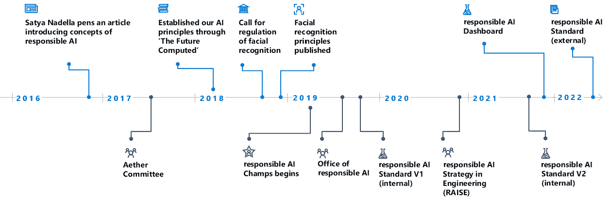

图 9.17 – 微软的负责任人工智能之旅

微软对负责任人工智能的承诺体现在其产品设计方式以及提供的最佳实践和指南中。

当然，这也适用于 AOAI 服务。正如我们将在下一节中看到的，AOAI 服务在不同层面内置了负责任的人工智能。

## Azure OpenAI 和负责任人工智能

关于 AOAI 服务，我们可以从以下两个层面谈论负责任的人工智能：

+   JSON 响应中的`finish_reason`参数将是`content_filter`，表示部分生成内容已被过滤。

+   **行为准则和最佳实践**：对于其其他 AI 服务，微软为 AOAI 提供**透明度说明**。该应用旨在促进对 AI 技术工作方式、其局限性和能力以及考虑整个系统（包括人和环境）重要性的理解。开发人员和系统所有者可以使用这些说明来创建适合其预期目的的 AI 系统，并在 AOAI 的特定情况下，帮助识别可能触发内置内容过滤器的情景。

内置功能和透明度说明都是微软努力将道德人工智能实践应用于现实场景的体现，遵循着他们的 AI 原则。

总之，作为微软负责任的 AI 象征着该公司对道德人工智能开发和部署的坚定承诺，AOAI 也从中受益。

# 总结

在本章中，我们看到了 OpenAI 与微软之间的合作如何为面向企业级组织带来了强大和创新的人工智能解决方案：AOAI。该服务结合了 OpenAI 的尖端技术和微软的广泛云基础设施，为企业提供了一个可扩展和可定制的平台，用于构建和部署先进的人工智能应用程序。

我们还详细讨论了微软对负责任的人工智能实践和伦理的强烈关注，以及 AOAI 服务如何反映了对负责任人工智能的承诺，比如内置于平台的内容过滤器等功能。

随着人工智能继续改变行业并塑造我们的未来，OpenAI 与微软之间的合作标志着企业级人工智能解决方案发展的重要里程碑。AOAI 使企业能够利用人工智能的力量推动增长和创新，同时确保道德和负责任的实践。

在下一章中，我们将深入探讨企业正在开发的 AOAI Models API 的具体用例。我们还将看到一个潜在用例的端到端实现，该用例使用 Python 和 Streamlit，以便您可以第一手体验 AOAI 的模型如何为您的应用程序注入人工智能。

# 参考资料

+   [`blogs.microsoft.com/blog/2023/01/23/microsoftandopenaiextendpartnership/`](https://blogs.microsoft.com/blog/2023/01/23/microsoftandopenaiextendpartnership/)

+   [`news.microsoft.com/2019/07/22/openai-forms-exclusive-computing-partnership-with-microsoft-to-build-new-azure-ai-supercomputing-technologies/`](https://news.microsoft.com/2019/07/22/openai-forms-exclusive-computing-partnership-with-microsoft-to-build-new-azure-ai-supercomputing-technologies/)

+   [`azure.microsoft.com/en-us/blog/general-availability-of-azure-openai-service-expands-access-to-large-advanced-ai-models-with-added-enterprise-benefits/`](https://azure.microsoft.com/en-us/blog/general-availability-of-azure-openai-service-expands-access-to-large-advanced-ai-models-with-added-enterprise-benefits/)

+   [`slate.com/technology/2016/06/microsoft-ceo-satya-nadella-humans-and-a-i-can-work-together-to-solve-societys-challenges.xhtml`](https://slate.com/technology/2016/06/microsoft-ceo-satya-nadella-humans-and-a-i-can-work-together-to-solve-societys-challenges.xhtml)

+   [`www.geekwire.com/2018/microsoft-calls-government-regulation-facial-recognition-technology/`](https://www.geekwire.com/2018/microsoft-calls-government-regulation-facial-recognition-technology/)

+   [`blogs.microsoft.com/on-the-issues/2018/12/17/six-principles-to-guide-microsofts-facial-recognition-work/`](https://blogs.microsoft.com/on-the-issues/2018/12/17/six-principles-to-guide-microsofts-facial-recognition-work/)

+   [`www.microsoft.com/en-us/ai/our-approach?activetab=pivot1%3aprimaryr5`](https://www.microsoft.com/en-us/ai/our-approach?activetab=pivot1%3aprimaryr5)

+   [`responsibleaitoolbox.ai/`](https://responsibleaitoolbox.ai/)

+   [`www.microsoft.com/en-us/research/publication/human-parity-on-commonsenseqa-augmenting-self-attention-with-external-attention/`](https://www.microsoft.com/en-us/research/publication/human-parity-on-commonsenseqa-augmenting-self-attention-with-external-attention/)

+   [`learn.microsoft.com/en-gb/azure/cognitive-services/openai/how-to/fine-tuning?pivots=programming-language-studio#openai-cli-data-preparation-tool`](https://learn.microsoft.com/en-gb/azure/cognitive-services/openai/how-to/fine-tuning?pivots=programming-language-studio#openai-cli-data-preparation-tool)


# 10

# 企业的热门用例

我们从概述当今市场上企业正在开发的 Azure OpenAI 最流行的用例开始本章。由于 Azure OpenAI 能够为复杂问题提供先进解决方案，因此它已被广泛应用于金融、医疗保健、零售和制造等各种行业。因此，我们必须了解 Azure OpenAI 模型对这些行业可能产生的影响程度，并保持竞争力。

为此，本章概述了 Azure OpenAI 在这些行业中的各种应用，包括改善客户体验、增强智能搜索和构建面向客户的聊天机器人。每个用例都将使用 Python、LangChain 或 Streamlit 作为前端进行端到端实现。

在本章中，我们将学习以下主题：

+   Azure OpenAI 在企业中的应用方式

+   分析和生成合同

+   理解呼叫中心分析

+   探索语义搜索

通过本章结束时，您将更深入地了解 Azure OpenAI 为企业开辟道路的用例。在这个数字发展时代，生成式人工智能技术正在呈指数增长，企业也以同样快的速度采用这些技术。了解这些技术及其应用为我们提供了理解市场并为未来做出调整的工具。

最后，您还可以使用 Python、LangChain、Streamlit 和您的 AOAI 实例开始自己的项目，以便跟随所涵盖的示例以及新的用例。

# 技术要求

本章的技术先决条件如下：

+   **Azure 订阅**，您可以在此处免费创建：[`azure.microsoft.com/free/cognitive-services`](https://azure.microsoft.com/free/cognitive-services)。

+   **访问 Azure OpenAI** 的 Azure 订阅。目前，只有通过申请才能获得访问此服务的权限。您可以通过填写 [`aka.ms/oai/access`](https://aka.ms/oai/access) 上的表格申请访问 Azure OpenAI。

+   Python 3.7.1 或更高版本。

+   以下 Python 库：`Openai`、`langchain,requests`、`json`、`os`、`pandas`、`numpy`、`streamlit`、`tiktoken` 和 `matplotlib`。

+   部署了模型的 Azure OpenAI 服务资源。在我的情况下，我部署了一个名为 `test1` 的实例，并关联了 `text-davinci-002`。

本章中显示的所有代码以及用于预处理和 `utils` 的脚本都可以在该书的 GitHub 仓库中找到：

[`github.com/PacktPublishing/Modern-Generative-AI-with-ChatGPT-and-OpenAI-Models/tree/main/Chapter%2010%20-%20Enterprise%20use%20cases`](https://github.com/PacktPublishing/Modern-Generative-AI-with-ChatGPT-and-OpenAI-Models/tree/main/Chapter%2010%20-%20Enterprise%20use%20cases)

所有的代码将使用 Python 编写。为了使用 Azure OpenAI 的大型语言模型，我将使用 LangChain，这是一个轻量级框架，使大型语言模型（LLMs）更易于在应用程序中使用。对于前端，我将使用 Streamlit，这是一个开源的 Python 库，可轻松构建和部署数据科学和机器学习项目的网络应用。它提供了一个简单直观的界面，用于创建交互式的数据驱动应用程序。

注

对于每种情况，从 Azure OpenAI 导出代码和 API 时，我还会设置一些值为预设参数，如`temperature`，`max_tokens`等等。关于这些参数及其含义的全面列表，请参考*第二章*，在*OpenAI 模型概述* *家族* 部分。

# 如何在企业中使用 Azure OpenAI

Azure OpenAI 正在迅速在大型企业中越来越受欢迎，作为推动创新和提高效率的强大工具。如今，许多公司正在利用这项技术的能力来简化他们的业务并获得竞争优势。

以下是按行业领域分组的一些例子：

+   **医疗保健**：AOAI 的语言模型可用于分析**电子健康记录**（**EHRs**）和医学文献，以帮助医生做出更明智的患者护理决策。

+   **金融**：AOAI 的模型可用于分析市场趋势并确定潜在的投资机会。它们还可用于欺诈检测，信用评分和客户服务自动化。

+   **零售**：AOAI 的模型可用于个性化客户体验和提供有针对性的产品推荐。它们还可用于库存优化，需求预测和供应链管理。

+   **媒体**：OpenAI 的模型可用于在多种语言中生成新闻文章，摘要和标题。它们还可用于内容审查，情感分析以及辨别假新闻。

还有许多其他例子。一个很好的例子是葡萄牙司法部在微软葡萄牙的支持下为其公民实施的服务：一个由`gpt-3.5-turbo`支持的聊天机器人，它是 ChatGPT 背后的模型，能够回答有关法律诉讼的问题。

这个聊天机器人被称为**司法访问实用指南**（**GPJ**），其目的是使普通人更容易了解法律程序中典型的复杂行话。

这是不同行业，包括政府，如何利用 Azure OpenAI 模型更有竞争力，以及为他们的客户或者人口提供更好的服务的一个很好的例子。

在接下来的段落中，我们将深入探讨具体的用例，以及使用 Python 逐步实现。

# 合同分析器和生成器

AOAI 的模型可以成为合同分析的有价值工具，帮助法律部门和合同管理员节省时间，避免潜在的法律问题。

律师和合同管理员可以借助他们的深度语言理解能力更深入地理解法律文件，减少争端和诉讼的风险，并确保合同准确反映了所有相关方的意图。

AOAI 在合同中的应用的一些例子如下：

+   **识别关键条款**：AOAI 的模型可以分析合同并识别关键条款，例如与终止、赔偿和保密有关的条款。这可以节省时间并确保在分析过程中考虑到所有重要的条款。

+   **分析语言**: AOAI 的模型可以帮助识别复杂的语言和法律术语，使律师更容易理解合同的意图和含义。这可以帮助避免后续的误解和争端。

+   **标记潜在问题**: AOAI 的模型可以帮助标记合同中的潜在问题，例如模糊的语言或冲突的条款。这可以帮助律师和合同管理员在它们变成重大问题之前解决这些问题。

+   **提供合同模板**: AOAI 的模型可以提供常见合同模板，例如保密协议或服务协议。这可以节省时间并确保合同一致且全面。

+   **协助合同审查**：AOAI 的模型可以通过突出显示需要关注或澄清的区域来协助审查流程。这可以帮助确保所有相关方保持一致，并且合同准确反映了所有相关方的意图。

我们将在 Python 中看到每个元素的一个示例，并且在本章结束时会有一个带有 Streamlit 的端到端实现。

## 识别关键条款

合同是任何商业或法律协议的组成部分，但可能很复杂且耗时。为了简化流程并确保考虑到所有重要条款，AOAI 的模型可以通过识别合同中的关键条款来辅助。这些关键条款可能包括与终止、赔偿、保密以及协议的其他关键方面相关的规定。

例如，假设一家公司正在审查与供应商提供服务的合同。合同包含多页的法律语言，使得识别对业务可能产生重大影响的重要条款成为挑战。通过使用 AOAI 模型，公司可以分析合同并识别与终止、赔偿和保密有关的关键条款。这将使公司能够专注于重要条款，并了解与其相关的潜在风险和收益。

这样，AOAI 的模型通过识别关键条款可以节省时间，减少疏忽的风险，并帮助企业在审查合同时做出明智的决定。

以下是一个服务提供合同的示例：

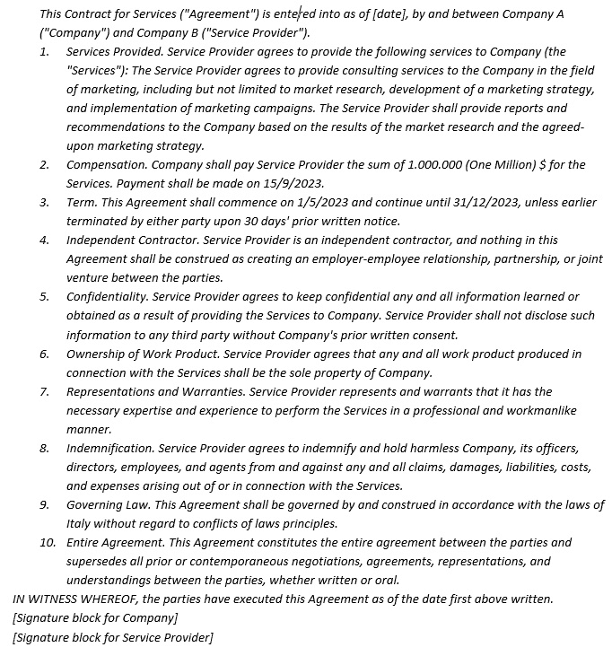

图 10.1 – 服务提供合同示例

假设我们想提取这份合同的终止条款。如*技术要求*部分所述，我部署了一个名为`test1`的`text-davinci-002`的简单实例。我还创建了一个名为`contract`的变量，其中存储了前述示例合同。然后，我定义了一个提示，询问我的模型有关终止条款的问题，如下所示：

```
response = openai.Completion.create(
  engine="test1",
  prompt= contract + " what is the termination clause?",
  temperature=0,
  max_tokens=1968,
  top_p=0.5,
  frequency_penalty=0,
  presence_penalty=0,
  best_of=1,
  stop=None)
print(response["choices"][0]["text"].strip())
```

这是输出结果：

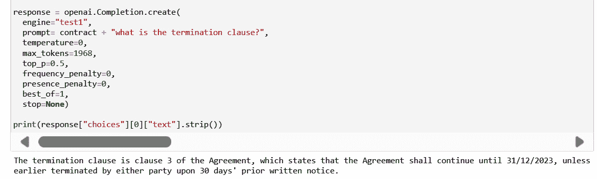

图 10.2 – 终止条款提取示例

我还可以设置一个对话，可以向我的模型提出关于条款的多个问题：

```
prompt = "<|im_start|>system\n" + contract + "\n<|im_end|>\n"
#print('AI Assistant: ' + prompt + '\n')
while True:
    query = input("you:")
    if query == 'q':
        break
    user_input = "<|im_start|>user\n" + query + "\n<|im_end|>\n<|im_start|>assistant\n"
    prompt+=user_input
    output = openai.Completion.create(
          engine="test1",
          prompt=prompt,
          temperature=0,
          max_tokens=2000,
          top_p=0.95,
          frequency_penalty=0,
          presence_penalty=0,
          stop=["<|im_end|>"])
    print('\n')
    print('AI Assistant: ' + output["choices"][0]["text"].strip() + '\n')
    response = output["choices"][0]["text"].strip() + "\n<|im_end|>\n"
    prompt+=response
```

这是它的响应：

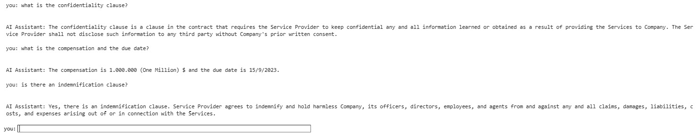

图 10.3 – 与 AOAI 模型的对话

这是一个简单的示例，涉及一个简短的合同。现在想象一下有很多页需要检查。AOAI 的模型肯定可以提供有价值的帮助，提取这些条款，并指导用户指向页面的部分，其中规定了条款，以便**主题专家**（**SME**）可以验证响应。

## 分析语言

在某些情况下，合同可能包含律师难以理解的高度技术或专业化语言。AOAI 的模型可以帮助识别这些术语，并清晰解释其含义，帮助律师更好地理解合同的意图和整体含义。通过确保所有各方清楚理解协议的条款和条件，可以避免潜在的误解和争议，为所有相关方节省时间和资源。

例如，想象一下在**碳捕集与储存**（**CCS**）背景下的合同。合同包含许多与 CCS 相关的技术术语，如*泄漏*、*MVA 技术*和*后燃烧捕集*。

没有 CCS 背景的律师审查合同时可能难以完全理解这些术语的含义和影响。通过使用 AOAI 的模型分析合同，律师可以快速识别这些技术术语，并清晰解释其含义。这将帮助律师更好地理解合同的意图，并确保所有各方达成一致。因此，后续误解和争议的可能性将大大降低。

让我们考虑以下示例合同的摘录：

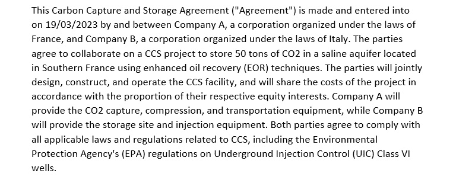

图 10.4 – 示例合同

正如您从前述的样本合同中所看到的，有许多术语，如果您不熟悉 CCS，更广义地说，不熟悉能源和环境工程，您可能会发现难以理解，也不容易理解它们所写的上下文。

幸运的是，AOAI 的模型不仅能够解释单个术语（与现有搜索引擎相比并没有什么新意），而且 – 更重要的是 – 能够解释这些术语*在使用的上下文中*。

为了证明这一点，让我们在与我们的 AOAI 模型进行交互式聊天中设置一些查询（在这种情况下，样本合同也已存储在`contract`变量中）：

```
prompt = "<|im_start|>system\n" + contract + "\n<|im_end|>\n"
#print('AI Assistant: ' + prompt + '\n')
while True:
    query = input("you:")
    if query == 'q':
        break
    user_input = "<|im_start|>user\n" + query + "\n<|im_end|>\n<|im_start|>assistant\n"
    prompt+=user_input
    output = openai.Completion.create(
          engine="test1",
          prompt=prompt,
          temperature=0,
          max_tokens=2000,
          top_p=0.95,
          frequency_penalty=0,
          presence_penalty=0,
          stop=["<|im_end|>"])
    print('\n')
    print('AI Assistant: ' + output["choices"][0]["text"].strip() + '\n')
    response = output["choices"][0]["text"].strip() + "\n<|im_end|>\n"
    prompt+=response
```

这是回应：

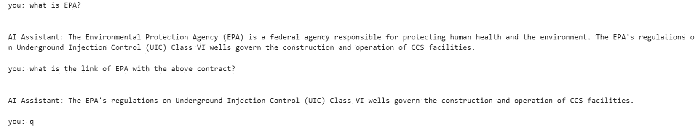

图 10.5 – 与 AOAI 模型关于合同的对话

正如您所看到的，该模型不仅能够详细解释技术概念（EPA），还能解释其使用的上下文。

多亏了 AOAI 的模型，技术上的、领域特定的行话和法律术语之间的鸿沟可以被缩小，甚至消除，这样律师或合同经理就可以专注于语义内容。

## 标记潜在问题

AOAI 在合同分析中可以发挥作用，通过利用其先进的**自然语言处理**（**NLP**）能力来识别可能导致歧义、不确定性或法律风险的条款和语言。例如，AOAI 的语言模型可以标记合同中可能导致争议或诉讼的模糊语言或冲突条款。它们还可以识别可能对一方或另一方不利的条款，例如限制责任、限制竞争或要求独家交易的条款。

让我们考虑以下例子。我们在 ABC 公司的法律办公室工作，为一批新员工制定雇佣协议。我们最近改变了招聘条款，因此这将是第一次制定这份协议。

我们最终完成了以下草案：

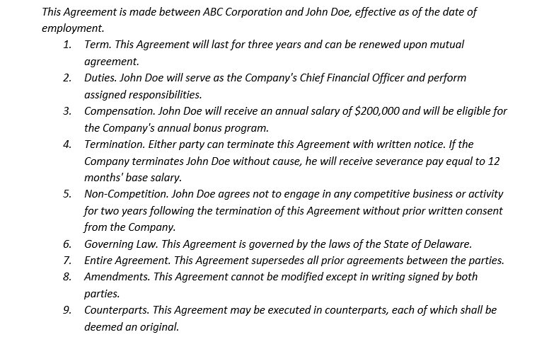

图 10.6 – 样本雇佣协议合同草案

我们希望确保没有歧义。为此，让我们请教我们的 AOAI 模型为我们标记它们。此外，在这种情况下，我部署了一个名为`test1`的简单`text-davinci-002`实例。我还创建了一个名为`contract`的变量，其中存储了前述的样本合同：

```
response = openai.Completion.create(
  engine="test1",
  prompt= contract + "Analyze this contract and tell me whether there might be some ambiguity or conflicting terms.",
  temperature=0,
  max_tokens=1968,
  top_p=0.5,
  frequency_penalty=0,
  presence_penalty=0,
  best_of=1,
  stop=None)
print(response["choices"][0]["text"].strip())
```

这是输出：

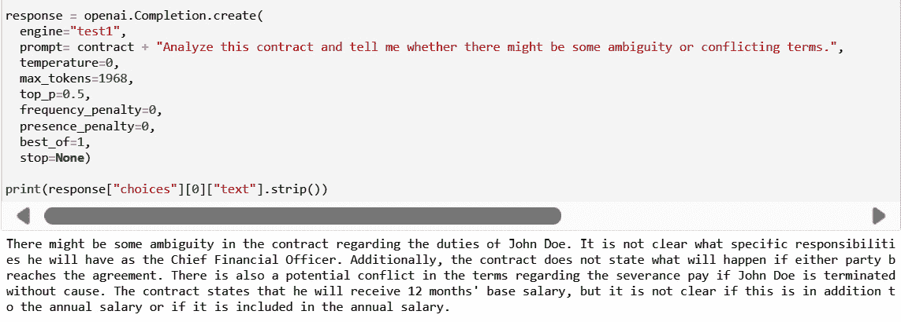

图 10.7 – 合同中歧义识别的示例

这是一个非常有用的见解，但我们可以走得更远。我们确实可以建立一个类似聊天机器人的环境，这样我就可以继续进行合同分析，并要求模型生成同一合同的修改版本，确保避免前述的歧义。

为此，我们需要确保在我们的 Python 代码中加入内存，因此我将使用一个带有`break`条件的`while`循环：

```
prompt = "<|im_start|>system\n" + contract + "\n<|im_end|>\n"
#print('AI Assistant: ' + prompt + '\n')
while True:
    query = input("you:")
    if query == 'q':
        break
    user_input = "<|im_start|>user\n" + query + "\n<|im_end|>\n<|im_start|>assistant\n"
    prompt+=user_input
    output = openai.Completion.create(
          engine="test1",
          prompt=prompt,
          temperature=0,
          max_tokens=2000,
          top_p=0.95,
          frequency_penalty=0,
          presence_penalty=0,
          stop=["<|im_end|>"])
    print('\n')
    print('AI Assistant: ' + output["choices"][0]["text"].strip() + '\n')
    response = output["choices"][0]["text"].strip() + "\n<|im_end|>\n"
    prompt+=response
```

注意

分类法是指我的起始和停止序列。这些使得回应在期望的点开始和结束，比如在句子或清单的末尾。在这种情况下，我确保助手在`user_input`后开始生成，并在每个回应的末尾添加一个停止序列。

运行上述代码时，我们将得到类似以下的输出：

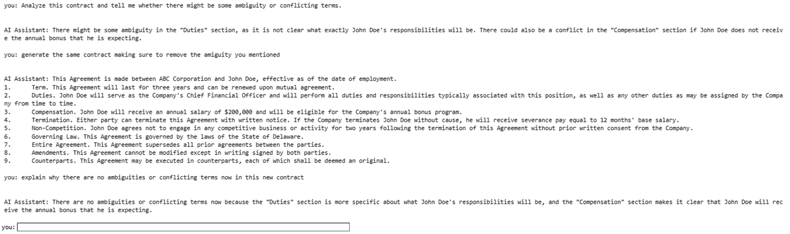

图 10.8 - 用于检查和生成新合同的样本聊天

正如您所见，我的 AI 助手为我生成了一份新合同，并确保删除了模棱两可和矛盾的条款。请注意，我还要求模型解释现在合同没有模棱两可的原因，以确保我能够正确识别这些部分并验证它们：

```
you: explain why there are no ambiguities or conflicting terms now in this new contract
AI Assistant: There are no ambiguities or conflicting terms now because the "Duties" section is more specific about what John Doe's responsibilities will be, and the "Compensation" section makes it clear that John Doe will receive the annual bonus that he is expecting.
```

此外，AOAI 的模型可以识别可能不具有法律约束力的条款，例如那些违反反垄断法或公共政策的条款。

让我们考虑以下 ABC 和 XYZ 两家竞争公司之间的产品销售协议：

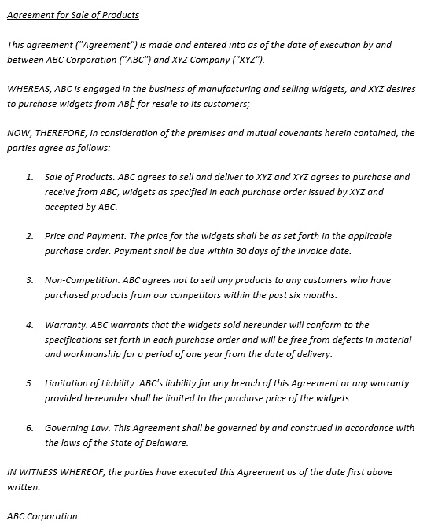

图 10.9 - 两家竞争对手公司之间的样本协议

现在，第 3 款包括可能会被解释为试图限制竞争的问题语言。公司需要仔细审查他们的合同，并确保他们没有参与可能违反反垄断法或其他法规的行为。

让我们看看我们的 AOAI 模型是否能够检测到：

```
response = openai.Completion.create(
  engine="test1",
  prompt= contract + "Analyze this contract and tell me whether there are clauses that might violate the antitrust laws. Make sure to highlight those clauses.",
  temperature=0,
  max_tokens=1968,
  top_p=0.5,
  frequency_penalty=0,
  presence_penalty=0,
  best_of=1,
  stop=None)
print(response["choices"][0]["text"].strip())
```

这是输出内容：

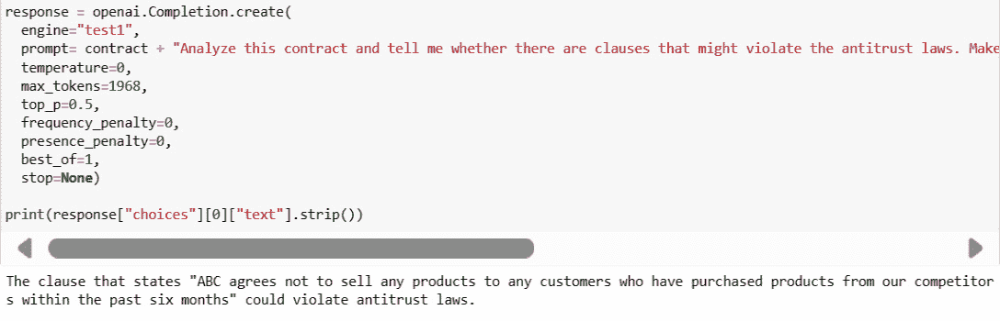

图 10.10 - 合同中潜在冲突条款的示例

在这种情况下，该模型能够检测潜在的与反垄断法冲突的条款。

通过利用 AOAI 模型分析合同语言的能力，公司可以确保符合法律标准，减轻法律和声誉风险，并促进市场公平竞争。

## 提供合同模板

在前面的段落中，我们看到了一个用于调整存在潜在问题的草案的合同生成器的示例。使用相同的模型，我们也可以进一步，并通过只提供一些参数，例如合同的终止日期或期限，从头生成合同草案。

为此，假设我们要生成一个服务交付协议的草案。我们需要提供的一些参数如下：

+   服务提供商

+   客户

+   服务描述

+   起始日期

+   时长

+   付款条件

+   终止通知

+   州或国家

为了要求我们的模型从头生成一份草案合同，我们需要构建一个参数提示如下：

```
service_provider = "Supplier ABC"
client = "Company XYZ"
services_description = "installation, configuration, and maintenance of Company's IT infrastructure"
start_date = "1/9/2023"
duration = "Three (3) years"
payment_terms = f"Within 30 days after receipt of an invoice from {service_provider}"
termination_notice = "30 days"
state = "Italy"
response = openai.Completion.create(
  engine="test1",
  prompt= f"Generate a Service Delivery Agreement with the following elements: Service Provider: {service_provider}, Client: {client}, Description of Services: {services_description}, Start Date: {start_date}, Duration: {duration}, Payment terms: {payment_terms}, Termination notice: {termination_notice}, State or Countries: {state}",
  temperature=0,
  max_tokens=1968,
  top_p=0.5,
  frequency_penalty=0,
  presence_penalty=0,
  best_of=1,
  stop=None)
print(response["choices"][0]["text"].strip())
```

这是输出内容：

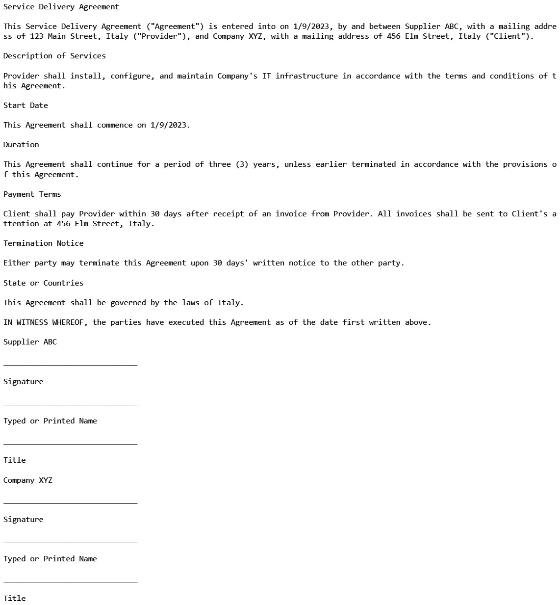

图 10.11 – 由 Azure OpenAI 模型生成的合同模板示例

正如你所看到的，只需输入几个内容，模型就能够创建一个漂亮的合同草案，包括签名和类似的形式。 这可以节省时间和金钱来制作初步草稿，然后可以用进一步的细节和参数来丰富它们，目的是作为类似协议的模板。

总之，AOAI 在协助法律专业人员分析合同方面有着巨大潜力，特别是在识别潜在问题和模棱两可性方面。 但是，必须注意到，机器学习模型永远不能取代法律分析的人为因素。 一个技艺娴熟的律师应该始终参与合同的审查和解释，以及最终的决策过程。 通过适当利用技术和人类专业知识，法律行业可以从合同分析的效率和准确性提高中受益。

## 使用 Streamlit 的前端

本节的想法是实施一个公司门户，律师和合同管理员可以访问他们需要分析的所有合同，并快速收集一些见解，例如识别关键条款，分析语言并标记潜在问题。

他们还可以要求门户从头开始生成一些合同模板，以用作生产就绪合同的草稿。

为此，我们将使用 Streamlit。 要连接到我的 AOAI 实例，我需要我的密钥和终结点，我已将它们存储在`.``toml`文件中。

与其他部分一样，你可以在 GitHub 仓库中找到整个应用程序文件：[`github.com/PacktPublishing/Modern-Generative-AI-with-ChatGPT-and-OpenAI-Models/tree/main/Chapter%2010%20-%20Enterprise%20use%20cases`](https://github.com/PacktPublishing/Modern-Generative-AI-with-ChatGPT-and-OpenAI-Models/tree/main/Chapter%2010%20-%20Enterprise%20use%20cases)。

给定对话的着陆页面（在本例中为我们的样本合同）如下所示：

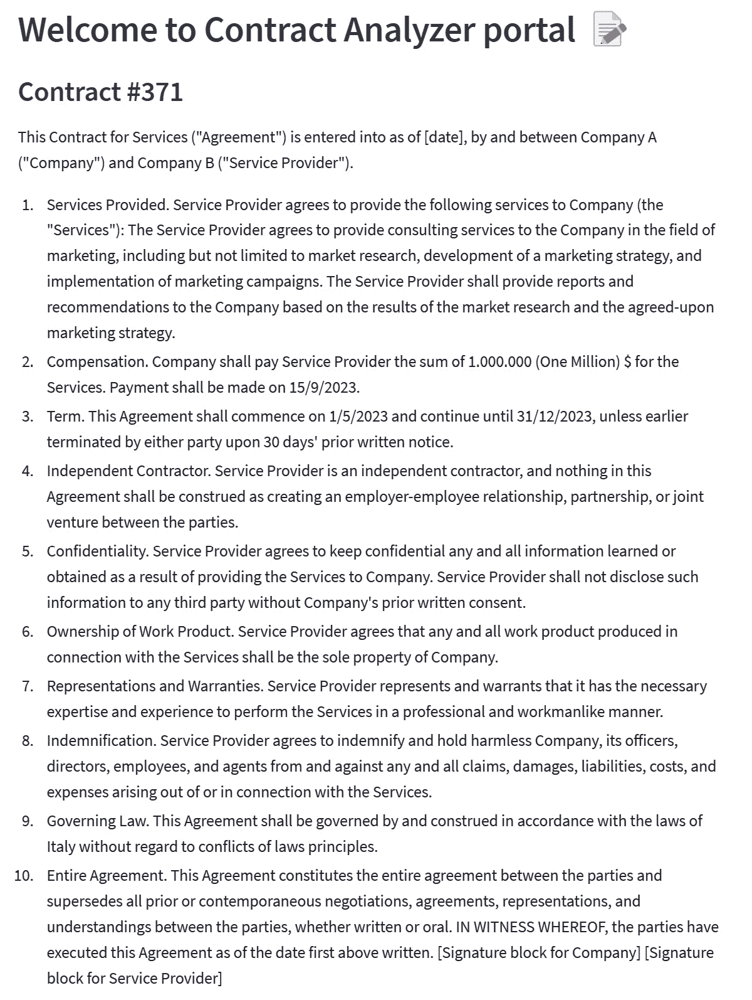

图 10.12 – 合同分析器应用的着陆页面

现在我们可以进行以下分析：

+   从下拉菜单中，我们可以选择要从合同中提取的关键条款的类型，并获得实时结果：

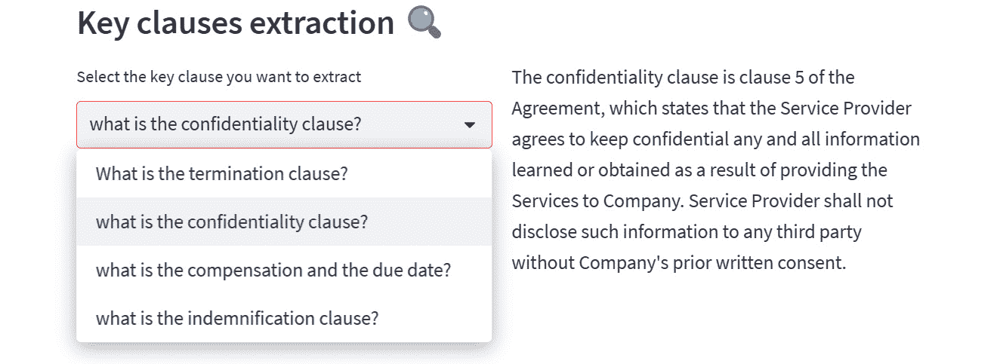

图 10.13 – 从示例合同中提取机密条款

+   我们还可以和 AOAI 的模型进行对话，询问技术术语的解释：

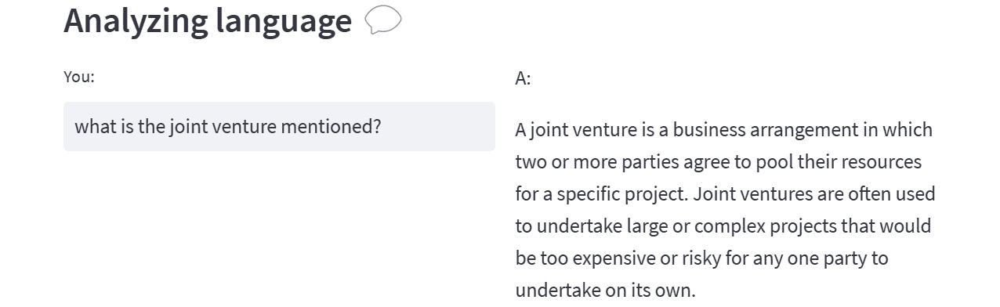

图 10.14 – 语言分析

+   我们还可以询问潜在问题：

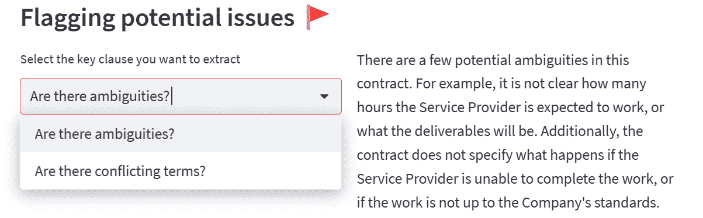

图 10.15 – AOAI 模型检测到的歧义示例

+   最后，我们还可以要求生成合同模板：

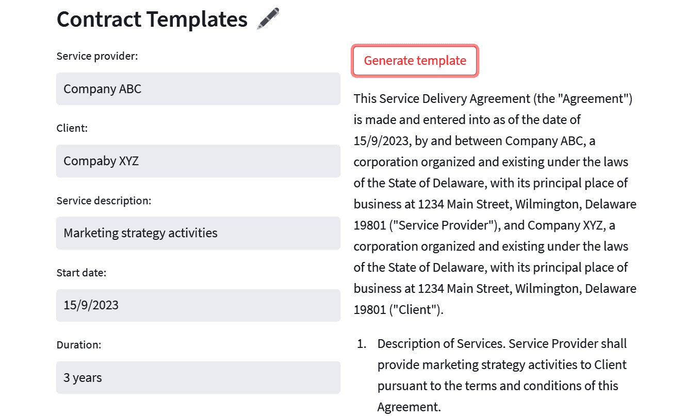

图 10.16 – 合同模板生成示例

这只是一个具有有限功能的示例应用，但由于 AOAI 模型的语言能力，它已经提供了一些强大的见解和分析。

在下一节中，我们将更深入地探讨 AOAI 模型在呼叫中心分析中的另一个应用。

# 理解呼叫中心分析

Azure OpenAI 可以成为呼叫中心分析的宝贵工具。通过分析客户和代理之间的通话记录，GPT 模型可以识别模式和见解，这可以帮助呼叫中心改善其运营。

以下是 AOAI 模型的一些示例能做的事情：

+   辨别常见问题并建议潜在的回复，可以帮助代理更快速、更有效地回答电话

+   分析客户互动中的情感，从而让呼叫中心经理们识别客户满意度不足的地方并做出必要的改进

+   提供通话量趋势、等待时间和通话持续时间的见解，让呼叫中心优化人员配备水平和资源分配

+   从对话中提取相关信息以自动在 CRM 中创建工单

+   为客户面向的聊天机器人提供相关的知识库，可以在切换到实际操作员之前解决更多的问题/索赔

借助其强大的 NLP 功能，AOAI 可以帮助呼叫中心提高其效率和效果，从而提高客户满意度和业务成果。

对于我们的示例情景，让我们假设我们是一家汽车保险公司。每天，我们收到大量的来自发生车祸并需要支持确定如何处理他们的保险的客户的电话。每次通话结束后，我们的操作员需要在我们的 CRM 上打开一个工单。

我们的目标是通过实施以下功能来简化整个流程：

+   从通话记录中提取相关参数以自动创建一个工单

+   获取对话的主要话题以将其分类到适当的类别

+   获取客户的情绪

+   生成应对特别棘手对话的指南

以下是这个的可视化表示：

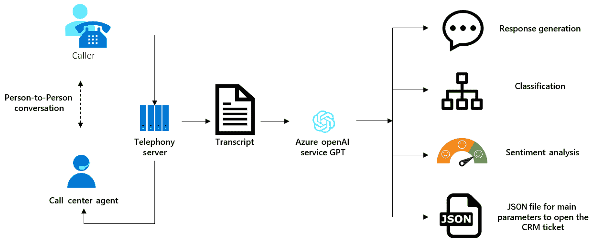

图 10.17 – 呼叫中心分析的示例结构

为此，我将从我们公司的一个虚构对话的示例记录开始：

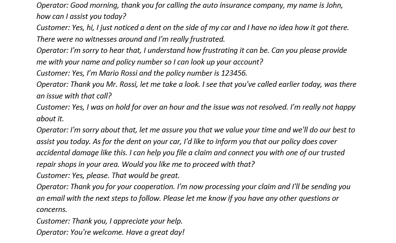

图 10.18 – 提出请求的虚假对话示例

然后，在这种情况下，我只需要一个部署我的 AOAI 实例，附带一个`text-davinci-002`实例。

在接下来的章节中，我们将学习如何从转录中提取相关参数，将其主要主题分类到各种类别中，分析客户的情感，并生成一个引导教程，以便于运营人员的回应。

## 参数提取

第一步是从转录中提取相关参数。如果我要自动创建一个包含适当信息的 CRM 票证，这一步就十分关键。例如，假设为了创建一个票证，我需要以下元素：

+   名字和姓氏

+   打电话的原因

+   保单编号

+   解决方案

以下代码展示了我们如何用 Python 实现（我初始化了一个名为`transcript`的变量，其值等于之前的谈话）：

```
response = openai.Completion.create(
  engine="test1",
  prompt= transcript + "Extract the following information from the above text:\n Name and Surname\nReason for calling\n Policy Number\n Resolution \n\n",
  temperature=1,
  max_tokens=1968,
  top_p=0.5,
  frequency_penalty=0,
  presence_penalty=0,
  best_of=1,
  stop=None)
print(response["choices"][0]["text"].strip())
```

这是相关输出：

```
Name and Surname: Mario Rossi
Reason for calling: Accidental damage to car
Policy Number: 123456
Resolution: The operator is processing the customer's claim and sending an email with next steps.
```

最后，让我们将这些信息转换成 JSON 文件，以便触发我们的票证创建。为此，我只需在提示中添加一行`输出格式应为 JSON`，正如你在这里的输出中看到的那样：

```
[
  {
    "name": "Mario Rossi",
    "reason_for_calling": "To file a claim for an accidental damage",
    "policy_number": "123456",
    "resolution": "The operator is processing the claim and will send an email with the next steps to follow."
  }
]
```

## 情感分析

我们可能想要了解的另一个元素是通话的情感。情感分析对呼叫中心分析非常重要，因为它帮助理解客户互动的情感色调。在前述的转录中，情感分析可以用来识别客户表达的沮丧和愤怒程度。这些信息对呼叫中心的经理来说是宝贵的，能够理解客户的整体满意度，并识别其服务中的改进领域。

例如，如果情感分析显示很多客户对电话等待时间感到沮丧，呼叫中心经理可以利用这些信息来改善其职员水平或投资于新技术以缩短等待时间。同样，如果情感分析显示客户通常对呼叫中心提供的服务感到满意，经理可以利用这些信息来识别卓越之处并建立在这些优势上。

我们唯一需要做的就是询问我们的 AOAI 实例谈话的情感是什么。

正如你所看到的，由于在谈话结束时，客户对客服服务感到满意，因此响应是积极的。然而，读了转录后，我们知道最初客户非常沮丧，因此我们可以对提示设计进行一些改进以获得更准确的结果：

```
response = openai.Completion.create(
  engine="test1",
  prompt= transcript + "What is the initial and final sentiment of the conversation?",
  temperature=1,
  max_tokens=1968,
  top_p=0.5,
  frequency_penalty=0,
  presence_penalty=0,
  best_of=1,
  stop=None)
print(response["choices"][0]["text"].strip())
```

这是输出：

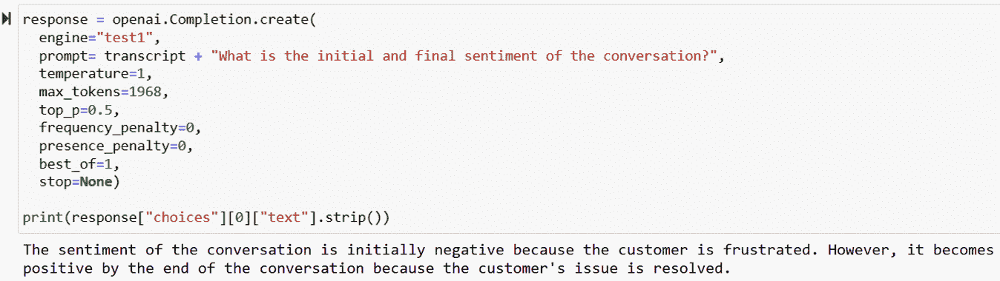

图 10.19 - 客户索赔情感分析示例

我们也可以进一步问它解释识别到的初始负面情感的原因：

```
response = openai.Completion.create(
  engine="test1",
  prompt= transcript + "why is the customer's sentiment initially negative?",
  temperature=1,
  max_tokens=1968,
  top_p=0.5,
  frequency_penalty=0,
  presence_penalty=0,
  best_of=1,
  stop=None)
print(response["choices"][0]["text"].strip())
```

这是输出：

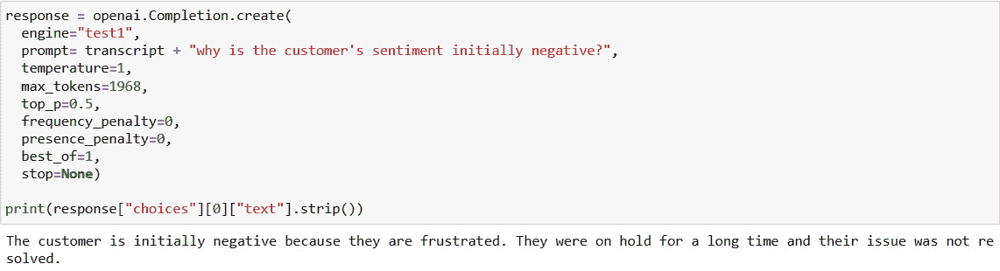

图 10.20 - AOAI 模型情感分析示例

这是重要信息，因为我们了解到我们的客户服务有改进的空间。我们可以将这种不满 - 在第一次通话时长时间无用的等待 - 与从其他对话记录中检索到的类似元素进行匹配，了解其是否是系统性的，如果是，如何改进。

为了我们的分析目的，我们进一步提取信息添加到我们的 JSON 文件中，以便我们还可以触发其他类型的操作（除了创建工单之外）。修改提示后，结果如下：

![图 10.21 – 从客户请求中提取的 JSON 示例]（img/Figure_10.21_B19904.jpg）

图 10.21 – 从客户请求中提取的 JSON 示例

## 客户请求的分类

在分析客户的请求时，首先将它们分类到适当的类别中非常有用，以便相关办事处可以更快地处理每个请求。在这里，您可以找到请求分类的三种常见类别：

+   **报告问题**：这种类别包括客户在报告其保单或账户存在问题或状况，但问题无法在通话中解决的对话记录。对话可能涉及代理记录问题并创建报告，以便适当部门调查和解决问题。示例可能包括报告账单错误或请求无法立即处理的保单更改。

+   **索赔处理**：这种类别包括客户对报告的问题和/或呼叫中心的服务表示不满或不满意。对话可能涉及客户分享他们的负面经验，而代理努力解决他们的顾虑，比如道歉长时间等待或提供解决方案。

+   **一般询问**：这种类别包括客户有关其保单或呼叫中心提供的其他服务的问题或查询的对话记录。对话可能涉及代理提供信息并回答客户的问题，而无需解决任何特定问题或投诉。

让我们请我们的 AOAI 实例为我们分类这段对话记录：

```
response = openai.Completion.create(
  engine="test1",
  prompt= transcript + "classify the above text in one of the following: reporting issue, claim handling and general inquiry.",
  temperature=1,
  max_tokens=1968,
  top_p=0.5,
  frequency_penalty=0,
  presence_penalty=0,
  best_of=1,
  stop=None)
print(response["choices"][0]["text"].strip())
```

这是输出：

![图 10.22 – 客户请求分类示例]（img/Figure_10.22_B19904.jpg）

图 10.22 – 客户请求分类示例

再次，我们可以通过更新上一个请求的提示，将这些信息添加到我们的 JSON 文件中。结果如下：

![图 10.23 – JSON 文件生成示例]（img/Figure_10.23_B19904.jpg）

图 10.23 – JSON 文件生成示例

很好，现在我们有大量的元数据作为我们对话记录的元数据。我们现在要做的是使用检索到的元素构建参数提示并生成进一步的操作，以尽快解决这项任务。我们将使用 Streamlit 来构建一个简单的前端来完成这项任务。

## 使用 Streamlit 实现前端

本节的想法是实现一个公司门户，操作员可以访问他们对话的所有剧本，并快速执行一些操作，如生成票证或向客户生成电子邮件回复。他们还可以向门户询问如何改进客户服务的建议（这些信息也可能在更高管理层中可用，以丰富公司改进的见解）。

要做到这一点，我们将使用 Streamlit。此外，在这种情况下，我正在创建一个`.toml`文件，其中包含我的 API，以便我可以在我的 Streamlit 应用程序中安全地调用我的机密。

如其他部分所述，您可以在本书的 GitHub 存储库中找到整个应用程序文件。

给定对话的着陆页（在本例中，我们的示例剧本）如下所示：


图 10.24 – 示例剧本着陆页

让我们看看我们的 AOAI 模型能为我们做哪些操作：

1.  我们作为操作员可以做的第一件事是根据从 JSON 文件中收集的信息创建一个票证：


图 10.25 – 用于生成票证的前端

1.  我们可以自动生成一封电子邮件给 Mario Rossi 先生，通知他解决流程的启动。为此，我定义了一个函数，要求我的 AOAI 实例使用参数提示生成电子邮件：

    ```
    def generate_email(transcript):
    ```

    ```
        response = openai.Completion.create(
    ```

    ```
          engine="test1",
    ```

    ```
          prompt= transcript + f"Generate a response email to the transcript above, notifying the customer that the ticket has been created and apologizing if it was complaining. The name of the customer is {data['name']} and the policy number is {data['policy_number']}.",
    ```

    ```
          temperature=1,
    ```

    ```
          max_tokens=1968,
    ```

    ```
          top_p=0.5,
    ```

    ```
          frequency_penalty=0,
    ```

    ```
          presence_penalty=0,
    ```

    ```
          best_of=1,
    ```

    ```
          stop=None)
    ```

    ```
        return response["choices"][0]["text"].strip()
    ```

在这里，`data`是从剧本中提取的 JSON **商业智能** (**BI**)，如前几节所示。

前端将如下所示：


图 10.26 – AOAI 生成的示例电子邮件

1.  最后，我们可以要求改进解决方案流程和客户满意度的建议。此外，在这种情况下，我使用了一个参数提示：

    ```
    def improvement(data):
    ```

    ```
        response = openai.Completion.create(
    ```

    ```
          engine="test1",
    ```

    ```
          prompt= f"Elaborate a list of remediations to get to the following improvement: {data['contact_center_improvement']}",
    ```

    ```
          temperature=1,
    ```

    ```
          max_tokens=1968,
    ```

    ```
          top_p=0.5,
    ```

    ```
          frequency_penalty=0,
    ```

    ```
          presence_penalty=0,
    ```

    ```
          best_of=1,
    ```

    ```
          stop=None)
    ```

    ```
        return response["choices"][0]["text"].strip()
    ```

在这里，`data`仍然是从剧本中提取的 JSON 文件，如前几节所示。

前端将如下所示：


图 10.27 – AOAI 生成的呼叫中心改进建议

这只是一个具有有限功能的示例应用程序，但它已经提供了一些强大的自动化和见解，可以提升呼叫中心的生产力和客户满意度。

这是我们想象中的汽车保险公司应该在生产环境中添加的一些进一步元素：

+   他们的 CRM 软件中用于自动生成票证的自动触发器。

+   基于呼叫中心剧本训练的面向客户的聊天机器人，以便只有在过去未解决的情况下才会与操作员通话。

+   **商业智能** (**BI**) 仪表板，汇集相关剧本见解。例如，关于以下内容的一些统计信息：

    +   抱怨最常见的原因

    +   通话时段的情感分布

    +   类别随时间的频率

有了这一点我们已经了解了如何进行情感分析的提取。我们看到了我们如何与顾客的请求进行交流以及使用 Streamlit 作为前端的概念。所有这些都帮助我们更好地与利益相关者合作并提高运营效率。

# 探索语义搜索

语义搜索是一项领先的搜索技术，彻底改变了人们在网上查找信息的方式。在企业界，它已成为需要快速而准确地搜索大量数据的企业的重要工具。语义搜索引擎使用自然语言处理（NLP）技术来理解搜索查询和被搜索内容的含义。这项技术通过使用机器学习算法来理解搜索查询的上下文，比传统的基于关键字的搜索引擎能够得到更准确和相关的结果。

语义搜索的一个关键组成部分是嵌入的使用，这是将单词或短语表示为数值向量的过程。这些向量是由一个神经网络生成的，该神经网络分析给定文本语料库中每个单词或短语的上下文。通过将单词转换为向量，可以更容易地衡量单词和短语之间的语义相似性，这对准确的搜索结果至关重要。

例如，在医疗文件和论文领域，嵌入可以用于通过更轻松地识别相关概念和主题来增强语义搜索算法。举例来说，如果一位研究人员正在搜索有关癌症治疗的信息，使用嵌入的语义搜索引擎可以识别出类似化疗、放射疗法和免疫疗法等相关术语。通过理解这些术语之间的语义关系，搜索引擎可以返回更准确和相关的结果。

嵌入还可用于识别与搜索查询中未能立即显现的相关主题和概念。例如，如果一位研究人员正在搜索有关乳腺癌的信息，使用嵌入的语义搜索引擎可以识别出与乳腺癌相关的主题，如乳腺癌预防、乳腺癌筛查和荷尔蒙疗法。对于与乳腺癌相关的主题和概念的更广泛理解可以帮助研究人员找到他们通过传统关键字搜索可能无法发现的相关论文和文档。

举例来说，我们假设以下情景。我们是一家私人诊所，每天都在努力在大量的可用文档中查找信息。为了做出诊断，医生们需要查阅许多论文，这非常耗时。

我们正在寻找一个可以在研究过程中帮助我们的人工智能研究助手。为此，我们将使用一个名为`embedding`并有关联的`text-embedding-ada-002`模型的 Azure OpenAI 部署。

思路如下：

1.  使用嵌入模型获取可用文本的嵌入。

1.  使用嵌入模型获取用户查询的嵌入。

1.  计算嵌入查询和嵌入知识库之间的距离。

1.  返回最相似的文本片段并将它们用作 GPT 模型的上下文。

1.  使用 GPT 模型生成响应。

这在这里表示：

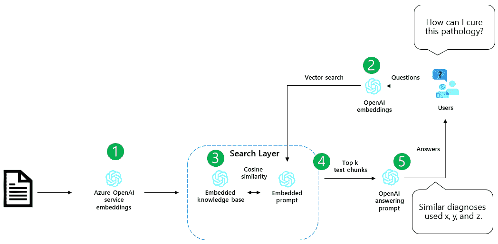

图 10.28 – 语义搜索项目的参考架构

为了模拟知识库，我们将使用一篇关于坐骨神经痛替代治疗的论文（您可以在[`doi.org/10.1136/bmj-2022-070730`](https://doi.org/10.1136/bmj-2022-070730)找到）。

对于嵌入和问答管理，我们将使用 LangChain 模块。

## 使用 LangChain 模块进行文档嵌入

我们项目的第一步是初始化一个嵌入模型，以便我们可以对自定义文档进行向量化。为此，我们可以使用 LangChain `OpenAIEmbeddings` 模块，该模块直接包装了来自 Azure OpenAI 的嵌入模型：

```
from langchain.embeddings import OpenAIEmbeddings from langchain.chat_models import AzureOpenAI
from langchain.embeddings import OpenAIEmbeddings
from langchain.vectorstores.faiss import FAISS
from pypdf import PdfReader
from langchain.document_loaders import PyPDFLoader
  embeddings = OpenAIEmbeddings(document_model_name="text-embedding-ada-002") embeddings.embed_query('this is a test')
```

这是它的输出：

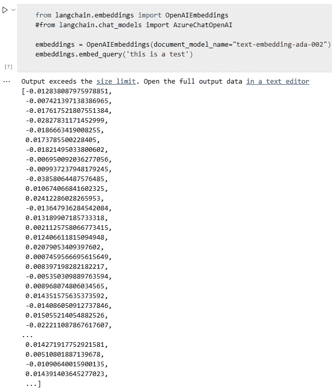

图 10.29 – 文本嵌入示例

正如您所见，结果是一个数值向量，使用`text-embedding-ada-002`嵌入模型计算得出。

现在，我们需要对整个文档进行向量化。此外，我们还需要存储空间来存放文档。LangChain 提供了几种向量存储方式，我们将使用 FAISS 向量存储。

因此，让我们初始化我们的 FAISS 索引器：

```
loader = PyPDFLoader("path_to_file") pages = loader.load_and_split() faiss_index = FAISS.from_documents(pages, embeddings)
```

太棒了，现在我们可以使用`AzureOpenAI`类初始化我们的模型。为此，我们只需要传递部署的名称：

```
llm = AzureOpenAI(deployment_name="text-davinci-003")
```

最后，我们需要计算用户提示和嵌入知识库之间的相似性。为此，让我们初始化以下函数：

```
def get_answer(index, query):     """Returns answer to a query using langchain QA chain"""      docs = index.similarity_search(query)      chain = load_qa_chain(llm)     answer = chain.run(input_documents=docs, question=query)      return answer
```

通过上述函数，我们正在计算用户提示和嵌入文档之间的语义亲和性。通过这样做，只有与用户提示具有高相似性的文本块将被用作我们 Azure OpenAI 模型的上下文，以便我们可以克服最大标记数的限制。

## 为 Streamlit 创建前端

我们已经创建了我们语义搜索引擎背后的逻辑；现在是时候创建一个前端，以便用户可以通过 UI 与其交互。为此，我将使用 Streamlit。

同样，在这种情况下，我正在创建一个`.toml`文件与我的 API，以便我可以在我的 Streamlit 应用程序中安全地调用我的秘密。

为此，让我们创建一个包含与前一节中相同代码的`.py`文件，同时添加一些前端元素（您可以在 GitHub 存储库中找到整个`.py`文件）。

更具体地说，我已经添加了以下指令来创建一个简单的搜索栏：

```
query = st.text_area("Ask a question about the document")
if query:
    docs = faiss_index.similarity_search(query, k=1)
    button = st.button("Submit")
    if button:
        st.write(get_answer(faiss_index, query))
```

然后，我将文件保存为`medical_smart_search_app.py`，并通过 Anaconda Prompt 使用`streamlit run` `smart_search.py`命令运行它。

结果如下所示：

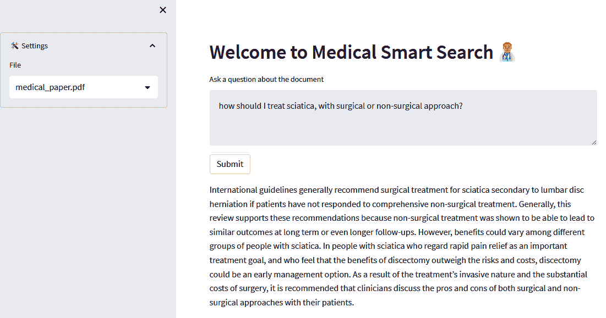

图 10.30 – 带有 Streamlit 和 AOAI 后端的示例前端

您可以决定将一些其他元素添加到您的搜索引擎中，例如以下内容：

+   指示 AOAI 模型在上下文中没有答案时不予回应。要做到这一点，您可以在提示中指定。

+   除了响应之外，还提供上下文的原始文本和链接（如果有的话），指向它所在页面的链接。

+   保留 AOAI 的响应和下一个用户提示的附加上下文，以便它也通过少量学习保留记忆。

我们看了一个医疗文档的示例；然而，有许多领域可以使用语义搜索引擎，从法律实体到拥有大量技术文档的制造商。

总的来说，在组织内部拥有智能搜索系统不仅减少了搜索时间，还提供了许多可能包含部分响应的文档的摘要响应。

在类似情况下（尤其是医疗或法律领域），需要一个人来验证结果。尽管如此，拥有这样的人工智能助手可以提高生产力，减少搜索成本和时间，提高搜索质量，并实现对罕见文档的查找。

# 总结

Azure OpenAI 模型提升了企业级大型语言模型的能力，并有潜力在广泛的行业中彻底改变企业运营。

通过利用最先进的自然语言处理技术，企业可以自动化琐碎任务，优化复杂流程，并从数据中获取有价值的见解。

在本章中，我们通过 Python 的逐步教程以及 Streamlit 的前端，查看了合同分析和生成、呼叫中心分析以及用于自定义知识库的语义搜索等领域的具体用例。

当然，成功整合 Azure OpenAI 模型需要战略性方法，包括确定相关的用例、选择适当的工具和平台，并投资于员工培训和发展。随着人工智能领域的不断发展，企业必须与最新的趋势和创新保持同步，以保持竞争力并实现 Azure OpenAI 的全部好处。

本章提到的内容只是大型语言模型的用例中的一小部分：这将是本书的下一章，也是最后一章的主题，在那里我们将总结迄今为止所见的一切，并揭示人工智能发展的未来将为市场带来什么。

# 参考文献

+   [`python.langchain.com/en/latest/index.xhtml#`](https://python.langchain.com/en/latest/index.xhtml#)

+   [`www.aroged.com/2023/02/17/chatgpt-ministry-of-justice-will-use-gpj-to-respond-to-citizens-in-portugal/`](https://www.aroged.com/2023/02/17/chatgpt-ministry-of-justice-will-use-gpj-to-respond-to-citizens-in-portugal/)


# 11

# 结语和最终思考

你已经走到了这一步 - 恭喜！希望你觉得这本书有趣，并且它对你的目标有所帮助。

在撰写本书时，发生了许多变化和新发展，这些变化绝对值得一提。事实上，我们确实看到了生成 AI 模型复杂性和准确性不断增加的*摩尔定律*发展。

因此，在这最后一章中，我们将简要回顾我们在整本书中学到的内容，同时揭示最近的发展和未来可以期待的内容。

更具体地说，我们将涵盖以下主题：

+   我们迄今为止学到的概述

+   LLMs 如何进入行业

+   生成 AI 领域的最新发展和关注点

+   未来可以期待什么

在本章结束时，您将对生成 AI 领域的最新发展有一个更广泛的了解，了解它如何影响行业，以及在新发展和社会关注方面可以期待什么。

# 迄今为止我们学到的内容回顾

我们从介绍生成 AI 概念及其各种应用开始了这本书。我们看到生成 AI 不仅涉及文本，还涉及图像、视频和音乐。

然后，在*第二章*中，我们转而看了一下将生成 AI 带入最大流行的公司：OpenAI。成立于 2015 年，OpenAI 主要专注于一种特定类型的生成模型，**生成预训练变压器**（**GPT**）。然后，在 2022 年 11 月，OpenAI 发布了 ChatGPT，这是一个由 GPT 模型驱动的免费网络应用程序，用于对话助手。它获得了巨大的流行，仅在五天内就达到了 100 万用户！

ChatGPT 已经改变了游戏规则。它对日常生产力以及各个行业领域的影响是巨大的。在深入讨论 ChatGPT 如何影响这些领域之前，在*第三章*中，我们学习了如何设置并开始使用 ChatGPT 账户。我们还在*第四章*中看到了如何正确设计使用生成模型（如 ChatGPT）时最重要的元素：提示。提示是用户的输入，不过是自然语言中的指令。设计提示是从您的生成模型中获得最大价值的关键步骤，以至于**提示工程**已经成为一个新的研究领域。

一旦我们熟悉了 ChatGPT 和提示设计，我们就转向*第五章*，在那里我们终于得到了 ChatGPT 如何提升您的日常生产力并成为您的日常助手的具体示例。从生成电子邮件到提高写作技巧，我们看到了许多活动如何得益于 ChatGPT 的生成力量。

但我们并未止步于此。通过*第 6*、*第 7*和*第 8*章，我们看到了 ChatGPT 如何不仅可以提升日常生产力，还可以用于特定领域的活动 - 对于开发人员，从代码生成和优化到解释机器学习模型；对于营销人员，从新产品开发到改善**搜索引擎优化**（**SEO**）；对于研究人员，从实验设计到基于研究的演示生成。

从*第九章*开始，我们将对话转向了企业级别，讨论了 OpenAI 模型如何通过 Azure 直接可消费化，以便企业可以保持可靠性和安全性。

最后，在*第十章*中，我们看到了 Azure OpenAI 模型在企业应用案例中的具体示例。每个示例都附带了一个业务场景以及一个使用 Python 进行端到端实现的示例，使用 Streamlit 作为前端。

这段旅程旨在让您更清楚地了解当我们提到流行词汇如 ChatGPT、OpenAI 和 LLMs 时我们在谈论什么。

然而，在接下来的部分中，我们将看到近几个月来令人难以置信的快速人工智能发展，带来了全新的技术，超越了我们迄今所学到的内容。

# 这只是一个开始

在整本书中，我们看到了生成式人工智能，更具体地说是 GPT 模型，正在彻底改变公民和大型企业的工作方式。

然而，我们已经踏上了一段旅程，ChatGPT 和 GPT 模型只是通向前所未有的技术进步时代的第一步。正如我们在整本书中所看到的，这些模型已经展示了在语言理解和生成方面的卓越能力。然而，生成式人工智能的真正潜力尚未完全实现。

第一批**多模态大型语言模型**（**MLLMs**）的发布以及微软引入**Copilot**系统已经揭示了我们可能期待的一瞥。

## 多模态大型语言模型的出现

到目前为止，我们主要关注的是**大型语言模型**（**LLMs**），因为它们是 GPT-x 系列和 ChatGPT 背后的架构。这些模型是在大量文本数据（如书籍、文章和网站）上进行训练的，并使用神经网络来学习人类语言的模式和结构。

正如我们在*第二章*中所看到的，如果我们想要将更多生成式人工智能能力与 LLMs 相结合，比如图像理解和生成，我们需要额外模型的支持，比如 DALL-E。这一点在 MLLMs 的引入之前都是成立的。

MLLM 是将自然语言处理与计算机视觉相结合的人工智能系统，用于理解和生成文本和视觉内容。这些模型经过大量数据的训练，如图像和文本，并且能够对包含文本和视觉输入的查询生成类似人类的响应。

近几个月来，多模态学习模型领域取得了巨大进展，并且在接下来的章节中，我们将着重关注两个主要模型：Kosmos-1 和 GPT-4。

### Kosmos-1

在他们的论文《语言并非你所需的全部：将感知与语言模型对齐》中，微软的研究员 Shaohan Huang 等介绍了**Kosmos-1**，一种能够响应语言和视觉线索的 MLLM。这使其能够执行诸如图像字幕和视觉问题回答等任务。

虽然像 OpenAI 的 ChatGPT 这样的 LLM 已经变得很受欢迎，但它们在处理图像和音频等多模态输入方面存在困难。微软的研究论文强调了多模态感知和真实世界联系的需求，以推进人工通用智能（AGI）的发展。

Kosmos-1 能够感知各种模态，通过零迁移学习来遵循指令，并使用少量迁移学习从所提供的上下文中学习。该模型的展示显示了其在涉及视觉提示的各种情况下自动化任务的潜力。

下图提供了它的工作原理的示例:

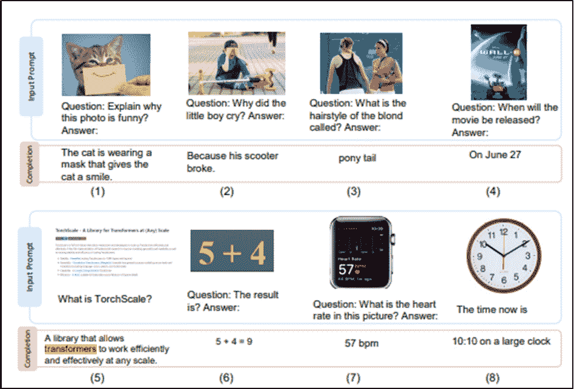

图 11.1 – Kosmos-1 的多模态输入示例。原始图片来源于 https://arxiv.org/pdf/2302.14045.pdf

对零迁移热测足挑战示灵异于蕴含成人水平，但显示了 MLLM 通过将感知与语言模型对齐来感知抽象概念模式的潜力。

定义

Raven IQ 测试，也称为雷文进阶矩阵测试，是专门设计用于衡量一个人的抽象推理和流体智力的一种非语言标准化测试。由约翰·C·雷文于 1936 年开发，该测试由具有矩阵形式的视觉模式的多项选择题组成。参与者的任务是识别完成图案的缺失部分。

下图是 Kosmos-1 解决的 Raven IQ 测试的示例:

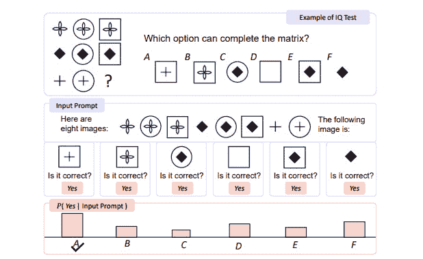

图 11.2 – Kosmos-1 解决的 Raven IQ 测试的示例。原始图片来源于 ttps://arxiv.org/pdf/2302.14045.pdf

目前，Kosmos-1 只能分析图像和文本。然而，在研究论文的结论中，微软的研究人员宣布了进一步发展该模型以集成语音功能的意图。

### GPT-4

2023 年 3 月 14 日，OpenAI 宣布了 GPT 系列的新版本：**GPT-4**。这款全新模型的技术描述由 OpenAI 的研究人员在论文*GPT-4 技术报告*中描述（[`arxiv.org/pdf/2303.08774.pdf`](https://arxiv.org/pdf/2303.08774.pdf)）。

根据这篇论文，很明显 GPT-4 展示了比以前的 AI 模型更高水平的智能。GPT-4 在包括数学、编码、视觉、医学、法律和心理学在内的广泛任务中展示出接近人类的表现，而无需特殊提示。

更具体地说，GPT-4 在四个主要领域表现优于其先前版本（GPT 3.5）：

+   **多模态性**：GPT-4 是 MLLM 的一个很好的例子，因为它能够理解和生成自然语言以及图像：


图 11.3 – GPT-4 理解和解释图像的示例

通过 GPT-4，我们基本上能够处理和理解一个由文本和图像组成的整个文档。

+   **准确性**：GPT-4 已被证明比 GPT-3.5 更可靠、更有创造力和更具接受性，尤其在复杂任务中。为了理解这种差异，对这两个模型进行了几次测试，最初设计用于人类的考试，GPT-4（无论是否具有视觉能力）始终优于 GPT-3.5。

在计算机视觉领域也进行了测试。在这种情况下，OpenAI 评估了 GPT-4 在为计算机视觉模型设计的传统基准上的表现，同样，在这种情况下，GPT-4 明显优于大多数**最新技术**（**SOTA**）模型。

+   **一致性**：正如我们在*第五章*中看到的，OpenAI 发布了一个 AI 一致性（[`openai.com/alignment/`](https://openai.com/alignment/)）宣言，其研究旨在使 AGI 与人类价值观一致，并遵循人类意图。

为提高 GPT-4 的安全性和与用户意图的一致性，已经付出了大量努力。因此，与其前身相比，GPT-4 的安全性大大提高，生成违禁内容请求的可能性减少了 82%（[`openai.com/product/gpt-4`](https://openai.com/product/gpt-4)）。这一改进的原因在于 OpenAI 的 GPT-4 融入了新的研究进展，增加了额外的安全层。受人类输入启发，这一安全功能直接集成到 GPT-4 模型中，使其更擅长处理潜在有害输入。因此，模型生成不安全响应的可能性大大降低。

此外，OpenAI 的内部评估表明，与上一版本相比，GPT-4 生成准确和基于事实的回复的可能性要高出 40%。这些增强显示了在完善 AI 语言模型方面正在取得的持续进展，确保其对用户的安全性和可靠性。

+   **整体可用性**：最后但同样重要的是，GPT-4 解决了其前身的主要限制之一。到了 GPT-3.5，我们需要考虑的最大标记数为 4,096。 使用 GPT-4，标记数的最大值大大增加到了约 32,000，这使得它更适用于复杂和较长的任务，特别是涉及逐步推理的任务。

从 Microsoft Research 的 Sébastien Bubeck 等人的论文《人工通用智能之火花：GPT-4 的早期实验》([`arxiv.org/pdf/2303.12712.pdf`](https://arxiv.org/pdf/2303.12712.pdf)) 中，可以窥见这种全新模型的能力。

在下图中，展示了这些实验的一些示例：

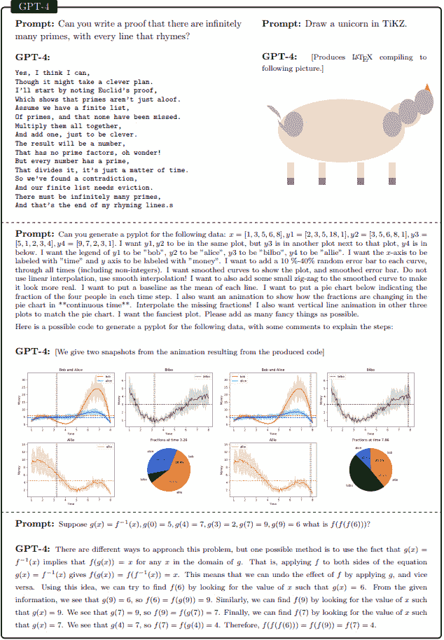

图 11.4 – 多模态 GPT-4 的早期实验

前面的图只是展示了 GPT-4 的全部能力的一些示例，但这些示例本身已经非常令人印象深刻。再次强调的是，使用大型语言模型，我们正在进入生成式 AI 的新阶段，其中一个基础模型将能够完全处理和理解整个文档，然后根据其生成新的材料。

注

2023 年 3 月 21 日，Microsoft 宣布 GPT-4 已经在 Azure OpenAI 服务中可用 ([`azure.microsoft.com/en-us/blog/introducing-gpt4-in-azure-openai-service/`](https://azure.microsoft.com/en-us/blog/introducing-gpt4-in-azure-openai-service/))。这意味着这个强大的模型已经可以用于企业级项目，或者在 Azure OpenAI Playground 中进行直接测试。

GPT-4 是一个非常强大的模型，已经成为许多融合 AI 的应用程序的引擎。其中之一就是名为 ChatGPT Plus 的全新版 ChatGPT。但还有另一个应用程序，我认为更加有趣，因为它正在彻底改变搜索引擎工具的使用方式：Microsoft Bing。我们将在下一节深入探讨这一点。

## Microsoft Bing 和 Copilot 系统

最近几年，微软已经成为 AI 领域的领军者，大量投资于研究和开发，推动创新并开辟新的可能性。作为推动 AI 技术前进的一部分，微软已经与 OpenAI 达成战略合作伙伴关系，正如我们在*第九章*中所看到的。

微软与 OpenAI 之间的合作旨在加速 AI 领域的进展，结合各自在云计算、软件和尖端 AI 模型方面的专业知识。他们共同致力于创建不仅具有卓越能力，而且遵守透明、公平和道德责任原则的 AI 系统。

自 2023 年 1 月宣布 Azure OpenAI 服务的普遍可用性以来，微软已在生成式 AI 领域发布了一系列新发展，利用 LLM 的力量，包括 GPT-4。

在接下来的章节中，我们将重点关注两个最有前景的发展：新版必应和副驾驶系统。

### 新版必应

微软必应是微软拥有和运营的网络搜索引擎。该服务起源于微软先前的搜索引擎：MSN 搜索、Windows Live 搜索，以及后来的 Live 搜索。

2023 年 2 月，微软宣布（[`blogs.microsoft.com/blog/2023/02/07/reinventing-search-with-a-new-ai-powered-microsoft-bing-and-edge-your-copilot-for-the-web/`](https://blogs.microsoft.com/blog/2023/02/07/reinventing-search-with-a-new-ai-powered-microsoft-bing-and-edge-your-copilot-for-the-web/)）由 GPT 模型驱动的新版必应。此外，随着 2023 年 3 月 14 日 GPT-4 的推出，微软确认（[`blogs.bing.com/search/march_2023/Confirmed-the-new-Bing-runs-on-OpenAI%E2%80%99s-GPT-4`](https://blogs.bing.com/search/march_2023/Confirmed-the-new-Bing-runs-on-OpenAI%E2%80%99s-GPT-4)）新版必应实际上是运行在 OpenAI 的 GPT-4 上。

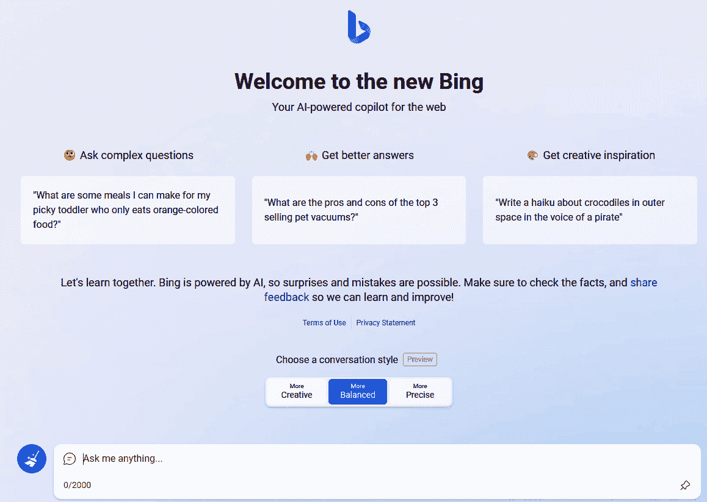

图 11.5 – 新版必应

在新版本中，必应已经成为一种类似 ChatGPT 的版本，能够浏览网络（因此绕过了 ChatGPT 在 2021 年的知识限制问题），并且还能提供超出预期响应的参考资料。请参考以下截图：

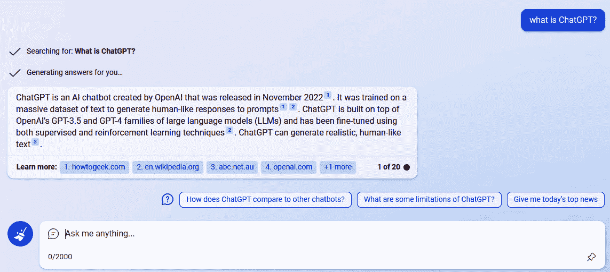

图 11.6 – 新版必应提供带有参考资料的答案

新版必应还可以像 ChatGPT 一样协助生成内容。例如，我可以在撰写 LinkedIn 帖子时向必应寻求支持：

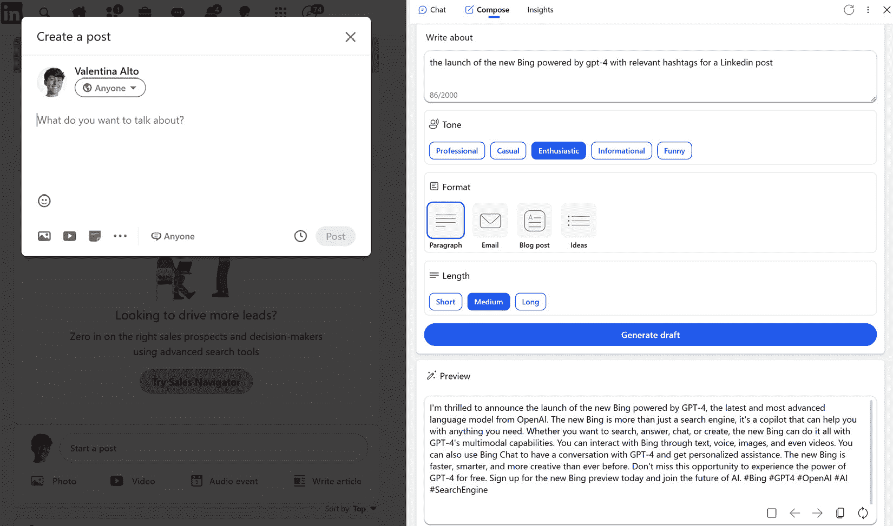

图 11.7 – 必应作为 LinkedIn 帖子助手的示例

有了这个最新功能，新版必应可以被视为网络的副驾驶，加快研究以及检索或生成材料的速度。

在基础模型和 LLM 的新景观中，副驾驶的概念至关重要，因为这是这些新 AI 系统进入组织的最有可能方式。

定义

正如其名称所示，副驾驶作为用户的专家助手，旨在支持用户解决复杂任务。副驾驶具有用户友好的自然语言界面，并由基础模型驱动。此外，它们的作用范围由用户定义。例如，应用程序 A 中的副驾驶将仅使用应用程序 A 的数据进行工作。

在下一节中，我们将看到微软如何将这一概念扩展到其整套应用程序中。

### Microsoft 365 副驾驶

2023 年 3 月，由微软引入（[`blogs.microsoft.com/blog/2023/03/16/introducing-microsoft-365-copilot-your-copilot-for-work/`](https://blogs.microsoft.com/blog/2023/03/16/introducing-microsoft-365-copilot-your-copilot-for-work/)），副驾驶系统是一个基于以下三种技术构建的复杂处理和编排引擎：

+   微软 365 应用程序，如 Excel、Word 和 PowerPoint

+   微软图表，一个提供对 Microsoft 365 服务中各种数据和智能的访问的平台

+   LLMs，如 GPT-4

基于副驾驶系统，Microsoft 365 Copilot 是一个革命性的 AI 助手，旨在增强工作场所的生产力和释放创造力。通过利用 LLMs 并与 Microsoft 365 应用程序和数据集成，Copilot 将自然语言转化为完成任务和与工作连接的强大工具。

Microsoft 365 副驾驶无缝集成到 Word、Excel、PowerPoint、Outlook 和 Teams 等流行应用程序中。通过自然语言提示，副驾驶可以执行生成基于会议、电子邮件和聊天的状态更新等任务。用户始终对其核心活动保持控制，从而增加了在各种 Microsoft 365 应用程序之间的创造力、分析、表达和协作。

在本节中，我们看到在过去的几个月里，OpenAI 模型和 LLM 领域中的其他 AI 模型已有进一步的发展。我们还看到微软等公司正在引入一种新的将这些 LLMs 集成到应用程序中的方式，即全新概念的 Copilot。

在下一节中，我们将深入探讨其他公司如何在其流程和数字化转型规划中拥抱 OpenAI 的模型，涵盖不同的用例和方法。

# 生成技术对行业的影响 - 一种颠覆性的力量

随着 ChatGPT 和生成模型的持续发展，它们的能力无疑以前难以想象的方式改变着行业。一方面，这些技术的整合有潜力显著提高生产力和推动经济增长。通过自动化耗时任务，生成式 AI 可以让人类工作者将精力集中在更有创造力、战略性和增值的活动上。此外，AI 驱动的工具可以增强人类能力，使专业人士能够做出更明智的决策和生成新颖的想法。

已经有一些企业在其核心业务中嵌入了生成式人工智能的例子：

+   **摩根士丹利**，一家领先的财富管理公司，一直致力于利用 OpenAI 的 GPT-4 技术改善对其广泛内容库的访问（[`openai.com/customer-stories/morgan-stanley`](https://openai.com/customer-stories/morgan-stanley)）。该公司一直在探索 GPT 的嵌入和检索能力，以创建一个内部聊天机器人，可以高效地搜索其庞大的财富管理资源。这一举措由分析、数据和创新负责人 Jeff McMillan 领导，旨在使公司的集体知识易于访问和可操作。

+   **多邻国**，一款以游戏风格为特色、拥有超过 5000 万用户的语言学习应用一直依靠人工智能作为其战略的一部分。人工智能参与的功能之一是**解释我的答案**。此功能允许用户深入了解多邻国响应背后的明确语法规则（例如，如果用户的答案是错误的，用户可以打开聊天窗口，并要求对为什么错误进行解释）。到目前为止，多邻国一直试图使用预先编写的语法提示和搭载了 GPT-3 的人工智能来实现此功能。然而，直到 GPT-4 的出现，响应的准确性和学习者的参与度才得以提高，原因在于其对不同习语的语法规则的高级理解能力。

+   **Stripe**，一家金融科技支付服务提供商，做了一些非常有远见的事情。在 2023 年初，它要求 100 名员工停止日常工作，并开始设想 LLMs 如何丰富和增强支付服务的功能。他们不仅发现了许多潜在的应用（输出是 50 个应用程序的列表！），而且开始原型设计了 15 个具体的用例。其中，特别感兴趣的是使用 GPT-4 进行欺诈检测。Stripe 的 Discord 社区受到恶意行为者的渗透。GPT-4 通过分析 Stripe 的 Discord 社区中的帖子语法和检测协调的恶意活动，帮助识别潜在的欺诈者，确保平台安全。

另一方面，ChatGPT 和生成式人工智能模型的快速采用引发了对工作岗位取代、数据隐私和技术潜在滥用的担忧。随着自动化改变劳动力市场，各行各业必须应对员工转岗的挑战，确保员工具备在日益由人工智能驱动的世界中取得成功所需的技能。

生成式人工智能对产业的颠覆性影响是不可否认的，既提供机遇，又带来挑战。通过促进人类与人工智能的合作，推动道德的开发和部署，并优先考虑终身学习和再技能培训，我们可以塑造一个未来，在这个未来中，生成式人工智能成为跨行业积极变革的强大催化剂。

目前，我们主要关注 Generative AI 可以实现的内容。在接下来的几节中，我们将揭示这种新颖颠覆性技术的伦理影响所引起的担忧。

# 揭示对 Generative AI 的担忧

正如本对年轻的彼得·帕克说的：“拥有伟大的力量就意味着拥有伟大的责任。”

当我们接近探索 ChatGPT 和 GPT 模型世界的启示之旅的尽头时，必须解决有关这些 AI 技术出现的担忧。虽然 Generative AI 的进步具有突破性，但它们也引发了关于隐私、安全、伦理影响和潜在滥用的重要问题。

实际上，最近几个月已经有许多公司、机构以及个体发表了有关这些问题的公告和声明，包括担忧、停止进一步发展的呼吁以及适当的监管。

在下一节中，我想分享一些最新的新闻和发展，并希望它也能激发对不久的未来可能出现的情况的思考和猜测。

## 埃隆·马斯克呼吁停止发展。

最近，埃隆·马斯克和其他 1000 多名技术专业人士签署的一封公开信呼吁暂停开发比 GPT-4 更复杂的 AI 系统。签署者包括史蒂夫·沃兹尼亚克、伊玛德·莫斯塔克和尤瓦尔·诺亚·哈拉瑞，他们对这些 AI 系统对社会和人类构成的重大风险表示担忧。

该公开信要求领先的 AI 实验室暂停这些先进系统的培训过程至少六个月，确保这一暂停是公开和可验证的。信中强调了与 AI 驱动的宣传、工作自动化和对我们文明失去控制的潜在担忧。

这一呼吁出现在 OpenAI 推出 GPT-4 的浪潮之后，这是一个增强语言模型，为 ChatGPT 的高级版本提供支持。据 OpenAI 称，GPT-4 在处理复杂任务和生成更精细结果方面比以前的版本更有能力，而且缺陷更少。

诸如 GPT-4 之类的 AI 系统利用大量数据来回应查询并执行任务。ChatGPT 于 11 月首次亮相，具有类似人类的能力，可以撰写电子邮件、安排旅行计划、编写代码，并在各种考试中表现出色，例如司法考试。

OpenAI 尚未对该公开信发表评论，但该组织已经承认确保比人类更聪明的 AI 技术为人类利益服务的重要性。OpenAI 建议，未来的系统可能需要在训练之前接受独立评估，并且应该努力规范用于模型开发的计算资源的扩大。

包括谷歌、微软、Adobe、Snapchat、DuckDuckGo 和 Grammarly 在内的几家公司推出了利用生成式人工智能功能的服务。OpenAI 的研究指出了这些能力所涉及的风险，比如引用不可信的来源或赋予恶意行为者欺骗或利用他人的可能性。

人工智能专家对行业的发展轨迹和可能缺乏必要预防措施和对后果的理解越来越担忧。该信件强调，先进的人工智能可能对地球上的生活产生重大影响，并需要仔细的规划和管理。它指出，目前这样的规划还不足，因为人工智能实验室继续创建和部署越来越强大、难以理解、预测或控制的人工智能系统。

如果这封公开信没有约束力，另一个例子是意大利“隐私保护监督者”所宣布的，我们将在下一节重点讨论。

## ChatGPT 在意大利被意大利“隐私保护监督者”禁止使用

由于隐私问题，意大利成为第一个禁止 ChatGPT 的西方国家。

意大利数据保护机构**隐私保护监督者**宣布将立即对 OpenAI 实施禁令并展开调查：

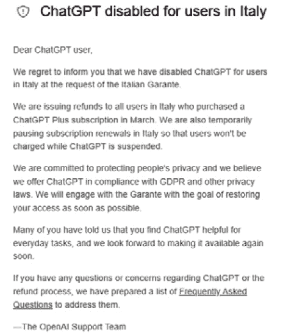

图 11.10 - 访问 ChatGPT 时 OpenAI 在意大利的消息

意大利监管机构不仅将阻止 ChatGPT，还将调查其是否符合**通用数据保护条例**（**GDPR**），该条例规定了个人数据的使用、处理和存储。

在涉及用户对话和付款信息的数据泄露后，该机构于 2023 年 3 月 20 日表示，没有法律依据用于训练平台基础算法的*大规模收集和存储个人数据*。

监管机构还表达了对无法验证用户年龄的担忧，可能会使未成年人暴露于不当回应之中。

意大利数据保护机构给予 OpenAI 20 天时间解决其担忧，否则将面临 2000 万欧元（2170 万美元）或其年收入的 4%的罚款。

OpenAI 根据意大利数据保护监管机构 Garante 的要求，于 2023 年 4 月 1 日为意大利用户停用了 ChatGPT，并表示致力于隐私保护和 GDPR 合规。

公司表示期待与 Garante 密切合作，并希望尽快在意大利重新提供 ChatGPT。

前面提到的担忧和干预只是一个更广泛话题的冰山一角，即负责任人工智能的概念，这将是下一节的主题。

# 生成式人工智能的伦理影响以及我们为什么需要负责任的人工智能

前一节强调了随着生成式人工智能技术的广泛知识和应用，一个普遍的担忧正在上升。

人工智能技术的快速发展带来了大量必须仔细解决以确保其负责任和公平部署的伦理考虑和挑战。以下是其中一些：

+   **数据隐私和安全**：由于人工智能系统在学习和决策过程中严重依赖数据，确保数据隐私和安全变得至关重要。在*第九章*中，我们已经看到微软如何通过 Azure OpenAI 服务解决了数据隐私问题，以确保 Azure 云所期望的**服务级别协议**（**SLAs**）和安全实践。然而，这个数据隐私话题也涉及到首次用于训练模型的数据：即使 ChatGPT 用于生成响应的知识库是公开的，那么涉及用户信息用于生成响应的同意阈值在哪里呢？

+   **偏见和公平**：人工智能模型通常从历史数据中学习，这可能无意中引入偏见。解决人工智能系统中的偏见和公平涉及以下方面：

    +   **多样化数据集**：确保训练数据多样化且代表各种人口统计信息可以帮助减少人工智能模型中的偏见。

    +   **算法公平性**：开发优先考虑公平性且不歧视特定人口群体的算法是至关重要的。

    +   **监控和审计**：定期监控和审计人工智能系统可以帮助识别和纠正偏见，确保结果是公平的。

+   **透明度和问责制**：随着人工智能系统变得更加复杂，理解它们的决策过程可能具有挑战性。这涉及以下两个重要方面：

    +   **可解释的人工智能**：开发能够清晰解释其决策的人工智能模型可以帮助用户理解和信任系统。

    +   **责任和责任**：建立清晰的责任和责任界限对于让开发人员、组织和用户对人工智能决策的后果负责是至关重要的。

+   **工作的未来**：人工智能驱动的自动化有可能在某些领域取代工作，引发对工作未来的担忧。在本书中，我们已经看到 ChatGPT 和 OpenAI 模型如何能够提高个人和企业的生产力。然而，也有可能一些重复性任务将被人工智能彻底取代，这将影响一些工人。这是变革和发展过程的一部分，更好地接受变化而不是与之抗争。

在这个方向上的一些行动可能是再培训和提升技能计划 - 政府、组织和教育机构应该投资于再培训和提升技能计划，帮助工人适应不断变化的就业市场，并获得新兴角色所需的新技能。

最重要的是，应鼓励人工智能与人类的合作。开发能够补充和增强人类能力的人工智能系统可以帮助创造新的工作机会，并促进合作工作环境。

通过解决这些伦理考虑和挑战，我们可以朝着正确的方向努力，确保 AI 技术的负责开发和部署，促进更美好和更公平的未来。

现在，下一个合乎逻辑的问题可能是：鉴于近几个月 AI 技术的巨大加速，我们应该期待什么？

# 近期的期望

近几个月 AI 研究和发展的加速令人难以置信。从 2022 年 11 月到写作时（2023 年 4 月），我们已经看到发生了以下事情：

+   ChatGPT 的发布（2022 年 11 月）

+   Azure OpenAI 的普遍可获得性（2023 年 1 月）

+   ChatGPT 背后的模型 API 的普遍可获得性，GPT-3.5-turbo（2023 年 2 月）

+   MLLMs（如 Kosmos-1 和 GPT-4）的普遍可获得性（2023 年 3 月）

+   微软宣布 Copilot 系统（2023 年 3 月）

这种不可思议的加速速度使得很难预测接下来会发生什么。正如我们所见，这种速度也引起了机构、公司和公众人物的关注，因为这些新技术缺乏监管。与此同时，公司和机构将不可避免地需要适应这个新的地理环境，以和竞争对手保持同步。

如果我们考虑近期的未来，我们在谈论*明天*。我们已经看到一些 IT 公司，比如微软，已经将 GPT 模型整合到他们的应用程序中作为副驾驶系统，而其他公司，如 WolframAlpha、Expedia 和 Instacart，已经设计了直接集成到 ChatGPT 的插件。

OpenAI 模型融入应用的趋势显而易见，这也体现在已开发的各种框架上，这些框架的目的是促进 LLMs 和应用之间的集成，以及管理提示、对话、记忆、记号化和其他通常所需的步骤。这些框架的一些示例是 LangChain、Pinecone 和 Semantic Kernel。

我们在*第二章*中提到，OpenAI 的使命是构建广泛有益的 AGI，这种类型的人工智能“通用”，意味着它有能力学习和执行各种任务，而无需进行特定任务的编程。

换句话说，OpenAI 正在设想一种能够做任何人类可以做的人工智能机器。

如果我们一年前就考虑这个问题，那么这看起来就像是未来主义。在当前飞快的发展速度下，我们会在不久的将来获得 AGI 机器，这真的难以置信吗？

# 摘要

诸如 OpenAI、ChatGPT 和生成式 AI 模型等人工智能技术的快速发展正在引领创新和转型的新时代。具有巨大潜力改革产业并重塑日常生活，这些进步正在重新定义人机互动的规则。

当我们站在这个由人工智能驱动的未来的边缘时，我们有责任确保这些技术被负责任和道德地使用。通过拥抱机遇并解决挑战，我们可以促进一个 AI 赋能人类、提升我们潜力至新高度的世界。

GPT 始于两年前 - 如果我们考虑最近几个月人工智能发展的速度，这已经是一个时代 - 然而，它反映了人工智能对我们生活的不可避免影响以及适应这个新现实所面临的挑战。

# 参考资料

+   [`python.langchain.com/en/latest/getting_started/getting_started.xhtml`](https://python.langchain.com/en/latest/getting_started/getting_started.xhtml)

+   [`learn.microsoft.com/en-us/semantic-kernel/whatissk`](https://learn.microsoft.com/en-us/semantic-kernel/whatissk)

+   [`www.pinecone.io/`](https://www.pinecone.io/)
