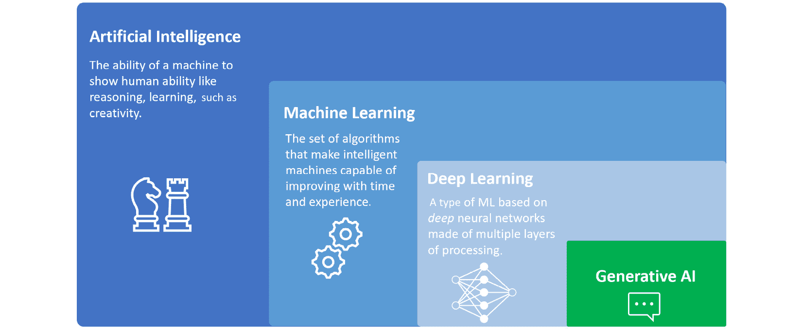
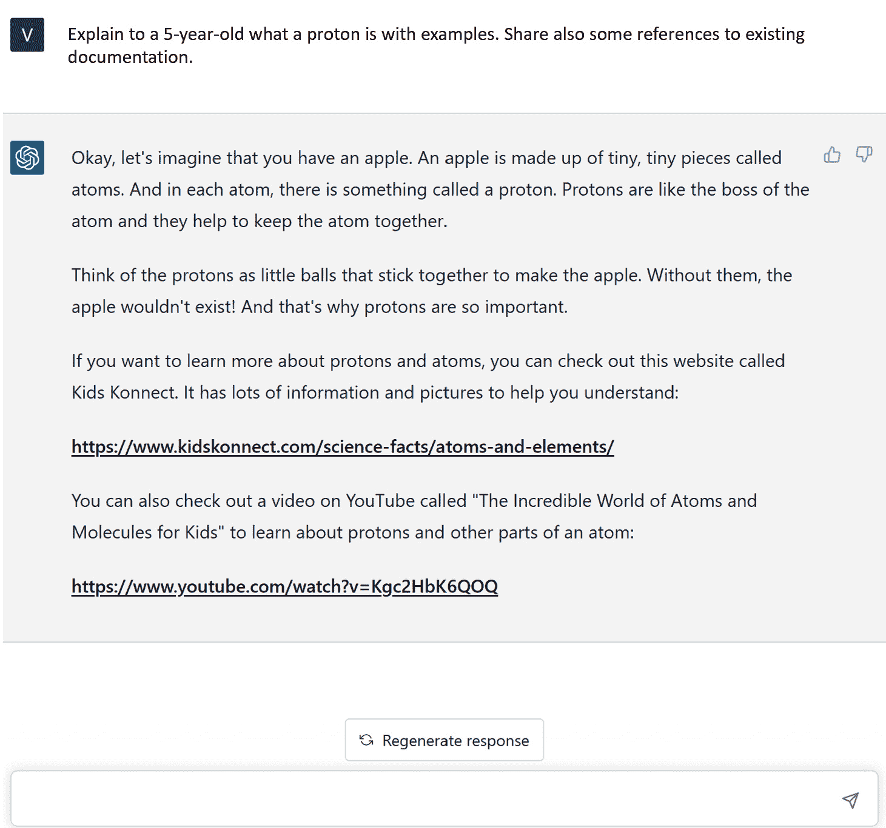
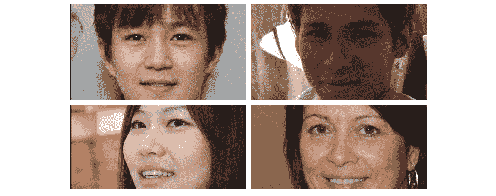
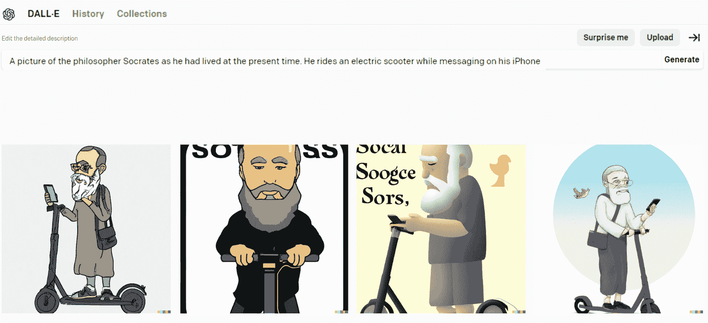
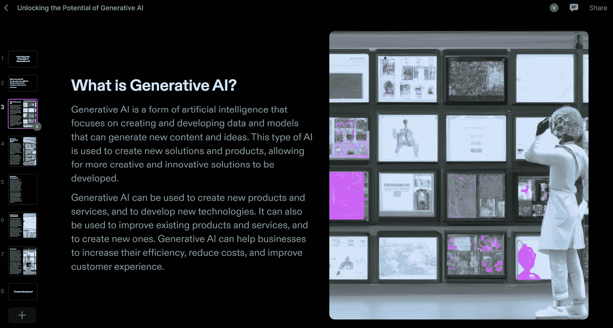
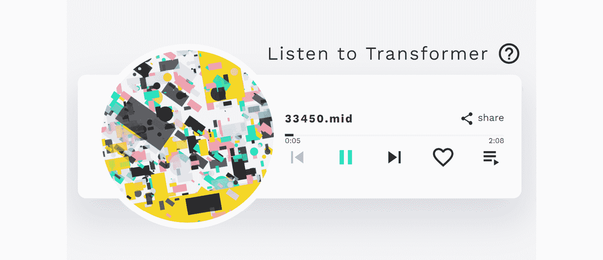
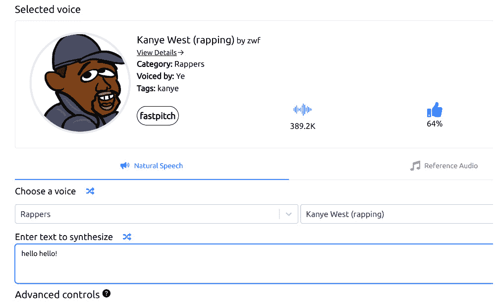
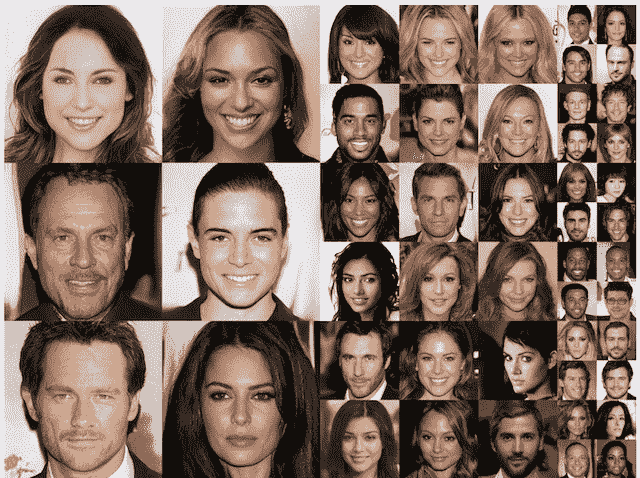

# 1

# 生成式人工智能简介

你好！欢迎来到*ChatGPT 和 OpenAI 模型的现代生成式人工智能*！在本书中，我们将探索生成式**人工智能**（**AI**）及其开创性应用的迷人世界。生成式人工智能已经改变了我们与机器互动的方式，使计算机能够在没有明确人类指导的情况下创建、预测和学习。通过 ChatGPT 和 OpenAI，我们见证了自然语言处理、图像和视频合成等领域的前所未有的进步。无论您是一个好奇的初学者还是一个经验丰富的从业者，本指南将为您提供了解和掌握生成式人工智能激动人心的领域所需的知识和技能。让我们开始并从我们所处的背景的一些定义开始。

本章概述了生成式人工智能领域，该领域利用**机器学习**（**ML**）算法创建新的独特数据或内容。

它专注于将生成式人工智能应用于各个领域，如图像合成、文本生成和音乐创作，突出了生成式人工智能革新各行业的潜力。这个生成式人工智能的介绍将为您提供这项技术所处的背景，以及将其置于人工智能、机器学习和**深度学习**（**DL**）的广阔世界中的知识。然后，我们将深入探讨生成式人工智能的主要应用领域，提供具体示例和最新发展，以便您熟悉它可能对企业和社会产生的影响。

此外，了解研究生成式人工智能的当前最新技术发展历程将帮助您更好地理解最近发展和最新模型的基础。

我们将涵盖以下主题：

+   理解生成式人工智能

+   探索生成式人工智能的领域

+   生成式人工智能研究的历史和当前状态

通过本章结束时，您将熟悉生成式人工智能这个激动人心的世界，它的应用、背后的研究历史以及当前的发展，这些发展可能对企业产生影响，目前也正在产生影响。

# 介绍生成式人工智能

AI 在近年来取得了显著进展，其中一个发展迅速的领域是生成式人工智能。生成式人工智能是人工智能和深度学习的一个子领域，专注于利用机器学习技术在现有数据上训练的算法和模型生成新内容，如图像、文本、音乐和视频。

为了更好地理解人工智能、机器学习、深度学习和生成式人工智能之间的关系，请将人工智能视为基础，而机器学习、深度学习和生成式人工智能代表着越来越专业化和专注的研究和应用领域：

+   人工智能代表着创造能够执行任务、展示人类智能和能力并能够与生态系统互动的系统的广泛领域。

+   机器学习是一个专注于创建算法和模型的分支，使这些系统能够通过时间和训练学习和改进自己。机器学习模型从现有数据中学习，并在其*成长*过程中自动更新其参数。

+   深度学习（DL）是机器学习（ML）的一个子分支，因为它包含深度学习模型。这些深度模型被称为**神经网络**，特别适用于**计算机视觉**或**自然语言处理**（**NLP**）等领域。当我们谈论机器学习和深度学习模型时，我们通常指的是判别模型，其目的是在数据之上进行预测或推断模式。

+   最后，我们来到生成式人工智能，这是深度学习的进一步子���支，它不使用深度神经网络来对现有数据进行聚类、分类或预测：它使用这些强大的神经网络模型来生成全新的内容，从图像到自然语言，从音乐到视频。

以下图显示了这些研究领域之间的关系：

图 1.1 – 人工智能、机器学习、深度学习和生成式人工智能之间的关系

生成式人工智能模型可以在大量数据上进行训练，然后可以使用该数据中的模式从头开始生成新的示例。这种生成过程与判别模型不同，后者被训练用于预测给定示例的类别或标签。

## 生成式人工智能领域

近年来，生成式人工智能取得了重大进展，并将其应用扩展到了各种领域，如艺术、音乐、时尚、建筑等等。在其中一些领域，它确实正在改变我们创造、设计和理解周围世界的方式。在其他领域，它正在改进并使现有的流程和操作更加高效。

生成式人工智能应用于许多领域的事实也意味着其模型可以处理不同类型的数据，从自然语言到音频或图像。让我们了解生成式人工智能模型如何处理不同类型的数据和领域。

## 文本生成

生成式人工智能（generative AI）最伟大的应用之一——也是我们在本书中将要重点介绍的——是其能够以自然语言生成新内容的能力。事实上，生成式人工智能算法可以用于生成新的文本，如文章、诗歌和产品描述。

例如，OpenAI 开发的 GPT-3 等语言模型可以在大量文本数据上进行训练，然后用于生成新的、连贯且语法正确的文本，包括不同语言（输入和输出），以及从文本中提取关键词、主题或完整摘要等相关特征。

这是一个使用 GPT-3 的示例：

图 1.2 – ChatGPT 响应用户提示的示例，并添加参考资料

接下来，我们将继续讨论图像生成。

## 图像生成

在图像合成中，最早且最知名的生成式 AI 示例之一是 2014 年 I. Goodfellow 等人发表的论文中介绍的**生成对抗网络**（**GAN**）架构，*生成对抗网络*。GAN 的目的是生成与真实图像难以区分的逼真图像。这种能力有一些有趣的商业应用，如为训练计算机视觉模型生成合成数据集，生成逼真的产品图像，以及为虚拟现实和增强现实应用生成逼真图像。

这里是一些由 AI 完全生成的不存在的人脸的例子：

图 1.3 – GAN StyleGAN2 生成的虚构面孔，网址为 https://this-person-does-not-exist.com/en

然后，在 2021 年，OpenAI 在这一领域推出了一种新的生成式 AI 模型，**DALL-E**。与 GAN 不同，DALL-E 模型旨在根据自然语言描述生成图像（GAN 以随机噪声向量作为输入），可以生成各种图像，这些图像可能看起来不太真实，但仍描绘出所需的概念。

DALL-E 在广告、产品设计、时尚等创意产业中具有巨大潜力，可以创造独特和创意的图像。

在这里，你可以看到 DALL-E 生成四幅图像的例子，从一个自然语言请求开始：

图 1.4 – DALL-E 生成的图像，以自然语言提示作为输入

请注意，文本和图像生成可以结合起来产生全新的材料。近年来，广泛使用这种组合的新 AI 工具已经出现。

一个例子是 Tome AI，一种生成式叙事格式，除了其能力外，还能从头开始创建幻灯片，利用诸如 DALL-E 和 GPT-3 的模型。

图 1.5 – 一份关于生成式 AI 的演示，完全由 Tome 生成，使用自然语言输入

正如你所看到的，前述的 AI 工具完全能够根据我在自然语言中的简短输入创建一份草稿演示。

## 音乐生成

生成音乐的生成式人工智能的最初方法可以追溯到 50 年代，在算法作曲领域的研究中，这种技术使用算法生成音乐作品。事实上，1957 年，Lejaren Hiller 和 Leonard Isaacson 创作了《Illiac Suite for String Quartet》([`www.youtube.com/watch?v=n0njBFLQSk8`](https://www.youtube.com/watch?v=n0njBFLQSk8))，这是由 AI 完全创作的第一首音乐作品。从那时起，生成音乐的生成式人工智能领域一直是持续研究的课题。在近年的发展中，新的架构和框架已经在普通大众中广泛传播，例如谷歌在 2016 年推出的 WaveNet 架构，能够生成高质量的音频样本，或者由谷歌开发的 Magenta 项目，该项目使用**循环神经网络**（**RNNs**）和其他机器学习技术来生成音乐和其他形式的艺术。然后，在 2020 年，OpenAI 还宣布了 Jukebox，这是一个能够生成音乐的神经网络，可以根据音乐和声音风格、流派、参考艺术家等进行输出定制。

这些以及其他框架成为许多生成音乐 AI 作曲助手的基础。一个例子是由索尼 CSL 研究开发的 Flow Machines。这个生成式人工智能系统在大量音乐作品数据库上进行训练，以在各种风格中创作新音乐。法国作曲家 Benoît Carré使用它创作了一张名为*Hello World*的专辑([`www.helloworldalbum.net/`](https://www.helloworldalbum.net/))，其中与几位人类音乐家合作。

在这里，你可以看到一个完全由 Magenta 项目中的 Music Transformer 模型生成的曲目的示例：

图 1.6 – Music Transformer 允许用户听取由 AI 生成的音乐表演

另一个音乐领域内生成式人工智能的令人难以置信的应用是语音合成。事实上，可以找到许多能够根据文本输入以知名歌手的声音创建音频的 AI 工具。

例如，如果你一直想知道如果 Kanye West 演唱你的歌曲会是什么样子，那么现在你可以通过诸如 FakeYou.com ([`fakeyou.com/`](https://fakeyou.com/))、Deep Fake Text to Speech 或 UberDuck.ai ([`uberduck.ai/`](https://uberduck.ai/))等工具实现你的梦想。

图 1.7 – 使用 UberDuck.ai 进行文本转语音合成

我必须说，结果真的令人印象深刻。如果你想玩得开心，你也可以尝试你所有最喜爱的卡通人物的声音，比如小熊维尼...

接下来，我们将看到用于视频的生成式人工智能。

## 视频生成

视频生成的生成式人工智能与图像生成有着类似的发展时间线。事实上，在视频生成领域的关键发展之一就是 GANs 的发展。由于它们在生成逼真图像方面的准确性，研究人员开始将这些技术应用于视频生成。基于 GAN 的视频生成的最显著例子之一是 DeepMind 的**Motion to Video**，它可以从单个图像和一系列动作生成高质量的视频。另一个很好的例子是 NVIDIA 的**Video-to-Video Synthesis**（**Vid2Vid**）DL 框架，它使用 GANs 从输入视频中合成高质量的视频。

Vid2Vid 系统可以生成时间上连贯的视频，这意味着它们在时间上保持平滑和逼真的运动。这项技术可以用于执行各种视频合成任务，例如：

+   将一个领域的视频转换为另一个领域（例如，将白天视频转换为夜晚视频或将素描转换为逼真图像）

+   修改现有视频（例如，更改视频中物体的风格或外观）

+   从静态图像创建新视频（例如，将一系列静止图像制作成动画）

在 2022 年 9 月，Meta 的研究人员宣布了**Make-A-Video**（[`makeavideo.studio/`](https://makeavideo.studio/)）的普遍可用性，这是一个新的人工智能系统，允许用户将他们的自然语言提示转换为视频片段。在这样的技术背后，你可以认出我们迄今为止提到的许多其他领域的模型 - 用于提示的语言理解，图像和运动生成与图像生成，以及由 AI 作曲家制作的背景音乐。

总的来说，生成式人工智能多年来已经影响了许多领域，并且一些人工智能工具已经持续支持艺术家、组织和一般用户。未来看起来非常有前途；然而，在跳入当今市场上最终模型之前，我们首先需要更深入地了解生成式人工智能的根源、其研究历史以及最终导致当前 OpenAI 模型的最新发展。

# 研究的历史和当前状态

在前几节中，我们概述了生成式人工智能领域中最新和尖端的技术，这些技术都是近年来开发的。然而，这一领域的研究可以追溯到几十年前。

我们可以将生成 AI 领域的研究始于 20 世纪 60 年代，当时 Joseph Weizenbaum 开发了聊天机器人 ELIZA，这是 NLP 系统的最早例子之一。它是一个简单的基于规则的交互系统，旨在通过基于文本输入的响应来娱乐用户，并为 NLP 和生成 AI 的进一步发展铺平了道路。然而，我们知道现代生成 AI 是 DL 的一个子领域，尽管最早的**人工神经网络**（**ANNs**）最早是在 20 世纪 40 年代引入的，研究人员面临着一些挑战，包括有限的计算能力和对大脑生物学基础的理解不足。因此，直到 20 世纪 80 年代，随着新硬件和神经科学的发展，**反向传播**算法的出现促进了 ANNs 的训练阶段。事实上，在反向传播算法出现之前，训练神经网络是困难的，因为无法有效地计算与每个神经元相关的参数或权重的误差梯度，而反向传播使得自动化训练过程成为可能，并实现了 ANNs 的应用。

然后，到了 21 世纪初和 2010 年代，计算能力的进步，加上大量可用于训练的数据，使得 DL 更加实用和普及，随之而来的是研究的提升。

2013 年，Kingma 和 Welling 在他们的论文*自动编码变分贝叶斯*中引入了一种新的模型架构，称为**变分自编码器**（**VAEs**）。VAEs 是基于变分推断概念的生成模型。它们通过将数据编码为称为**潜在空间**（具有*编码器*组件）的低维空间，然后将其解码回原始数据空间（具有*解码器*组件）的方式提供了一种学习的方法。

VAE 的关键创新在于引入了潜在空间的概率解释。与学习输入到潜在空间的确定性映射不同，编码器将输入映射到潜在空间上的概率分布。这使得 VAE 能够通过从潜在空间中采样并将样本解码到输入空间中来生成新样本。

举个例子，假设我们想训练一个 VAE，它可以生成看起来像真实的猫和狗的新图片。

为了实现这一点，VAE 首先接收一张猫或狗的图片，并将其压缩成一组较小的数字进入潜在空间，这些数字代表图片的最重要特征。这些数字被称为**潜在变量**。

然后，VAE 获取这些潜在变量，并使用它们创建一幅看起来像真实猫或狗图片的新图片。这幅新图片可能与原始图片有些差异，但它应该看起来像属于同一组图片。

随着时间的推移，通过将生成的图片与真实图片进行比较并调整其潜在变量使生成的图片看起来更像真实图片，VAE 变得更擅长创建逼真的图片。

VAE 为生成式人工智能领域的快速发展铺平了道路。事实上，仅仅 1 年后，Ian Goodfellow 提出了 GAN。与 VAE 架构不同，GAN 由两个神经网络组成 - 生成器和判别器 - 它们在一个零和博弈中相互对抗。

生成器创建假数据（在图像的情况下，它创建一幅新图像），旨在看起来像真实数据（例如，一幅猫的图像）。判别器接收真实数据和假数据，并试图区分它们 - 在我们的艺术赝品制作者示例中，它是*评论家*。

在训练过程中，生成器试图创建可以欺骗判别器认为它是真实的数据，而判别器则试图变得更擅长区分真实数据和假数据。这两部分一起进行训练，这个过程称为**对抗训练**。

随着时间的推移，生成器变得更擅长创建看起来像真实数据的假数据，而判别器则变得更擅长区分真实数据和假数据。最终，生成器变得如此擅长创建假数据，以至于连判别器也无法区分真假数据。

这里是 GAN 完全生成的人脸的一个例子：

图 1.8 - 逼真的 GAN 生成的人脸示例（摘自 2017 年《逐步增长的 GAN 用于提高质量、稳定性和变化性》：https://arxiv.org/pdf/1710.10196.pdf）

VAE 和 GAN 这两种模型旨在生成与原始样本无法区分的全新数据，并且它们的架构自提出以来已经得到改进，与 Van den Oord 及其团队提出的 PixelCNNs 和由 Google DeepMind 开发的 WaveNet 等新模型的发展并行，推动了音频和语音生成的进步。

2017 年另一个重要的里程碑是谷歌研究人员在一篇名为*– Attention Is All You Need*的论文中引入了一种名为*Transformer*的新架构。这在语言生成领域具有革命性意义，因为它允许并行处理同时保留有关语言上下文的记忆，超越了以 RNN 或**长短期记忆**（**LSTM**）框架为基础的语言模型的先前尝试。

变压器确实是谷歌于 2018 年推出的名为**双向编码器表示来自变压器**（**BERT**）的大规模语言模型的基础，并很快成为自然语言处理实验的基准。

变压器也是由 OpenAI 推出的所有**生成式预训练**（**GPT**）模型的基础，包括 ChatGPT 背后的 GPT-3 模型。

尽管在那些年里有大量的研究和成就，但直到 2022 年下半年，公众的注意力才开始转向生成式人工智能领域。

不是偶然的，2022 年被誉为*生成式人工智能之年*。这一年，强大的人工智能模型和工具开始在普通大众中广泛传播：基于扩散的图像服务（MidJourney、DALL-E 2 和 Stable Diffusion）、OpenAI 的 ChatGPT、文本到视频（Make-a-Video 和 Imagen Video）以及文本到 3D（DreamFusion、Magic3D 和 Get3D）工具都向个人用户提供，有时还是免费的。

这对两个主要原因产生了颠覆性影响：

+   一旦生成式人工智能模型普及到公众，每个个人用户或组织都有可能尝试并欣赏其潜力，即使不是数据科学家或机器学习工程师。

+   这些新模型的输出及其内在的创造力在客观上令人惊叹，而且常常令人担忧。对于个人和政府来说，迫切需要适应。

因此，在不久的将来，我们可能会目睹人工智能系统在个人使用和企业级项目中的采用率激增。

# 总结

在本章中，我们探索了生成式人工智能及其各种应用领域，包括图像生成、文本生成、音乐生成和视频生成的令人兴奋的世界。我们了解到 OpenAI 训练的 ChatGPT 和 DALL-E 等生成式人工智能模型如何使用深度学习技术学习大型数据集中的模式，并生成既新颖又连贯的新内容。我们还讨论了生成式人工智能的历史、起源以及当前的研究现状。

本章的目标是为生成式人工智能的基础知识提供坚实的基础，并激励您进一步探索这个迷人的领域。

在下一章中，我们将专注于当今市场上最具前景的技术之一，ChatGPT：我们将深入研究其背后的研究以及 OpenAI 的开发，其模型的架构，以及它目前可以解决的主要用例。

# 参考文献

+   [`arxiv.org/abs/1406.2661`](https://arxiv.org/abs/1406.2661)

+   [`www.youtube.com/watch?v=Iy9vRvyRf_E`](https://www.youtube.com/watch?v=Iy9vRvyRf_E)

+   [`arxiv.org/abs/1912.04958`](https://arxiv.org/abs/1912.04958)

+   *这个人不存在*: [this-person-does-not-exist.com](http://this-person-does-not-exist.com)

+   [`arxiv.org/abs/1808.06601`](https://arxiv.org/abs/1808.06601)

+   [`www.microsoft.com/en-us/research/blog/a-deep-generative-model-trifecta-three-advances-that-work-towards-harnessing-large-scale-power/`](https://www.microsoft.com/en-us/research/blog/a-deep-generative-model-trifecta-three-advances-that-work-towards-harnessing-large-scale-power/)

+   [`tcwang0509.github.io/vid2vid/`](https://tcwang0509.github.io/vid2vid/)
