# 2

# OpenAI 和 ChatGPT – 超越市场炒作

本章概述了 OpenAI 及其最显著的发展—ChatGPT，重点介绍其历史、技术和能力。

总体目标是提供 ChatGPT 如何在各个行业和应用中使用以改善沟通和自动化流程的更深入了解，最终，这些应用如何影响技术领域及其他领域。

我们将涵盖以下主题：

+   什么是 OpenAI？

+   OpenAI 模型系列概述

+   ChatGPT 之路：背后模型的数学

+   ChatGPT：最先进技术

# 技术要求

为了能够测试本章中的示例，您需要以下内容：

+   一个 OpenAI 账户，用于访问 Playground 和 Models API（[`openai.com/api/login20`](https://openai.com/api/login20))

+   你喜欢的集成开发环境，比如 Jupyter 或 Visual Studio

+   已安装 Python 3.7.1+（[`www.python.org/downloads`](https://www.python.org/downloads)）

+   `pip`已安装（[`pip.pypa.io/en/stable/installation/`](https://pip.pypa.io/en/stable/installation/)）

+   OpenAI Python 库（[`pypi.org/project/openai/`](https://pypi.org/project/openai/)）

# 什么是 OpenAI？

OpenAI 是由埃隆·马斯克、山姆·奥尔特曼、格雷格·布罗克曼、伊利亚·苏茨克维尔、沃伊切赫·扎雷姆巴和约翰·舒尔曼于 2015 年创立的研究组织。正如 OpenAI 网页上所述，其使命是*“确保人工通用智能（AGI）造福全人类”*。由于是*通用*的，AGI 旨在具有学习和执行各种任务的能力，而无需特定任务的编程。

自 2015 年以来，OpenAI 将研究重点放在**深度强化学习**（**DRL**）上，这是**机器学习**（**ML**）的一个子集，将**强化学习**（**RL**）与深度神经网络结合起来。该领域的第一个贡献可以追溯到 2016 年，当时该公司发布了 OpenAI Gym，这是一个供研究人员开发和测试**RL**算法的工具包。

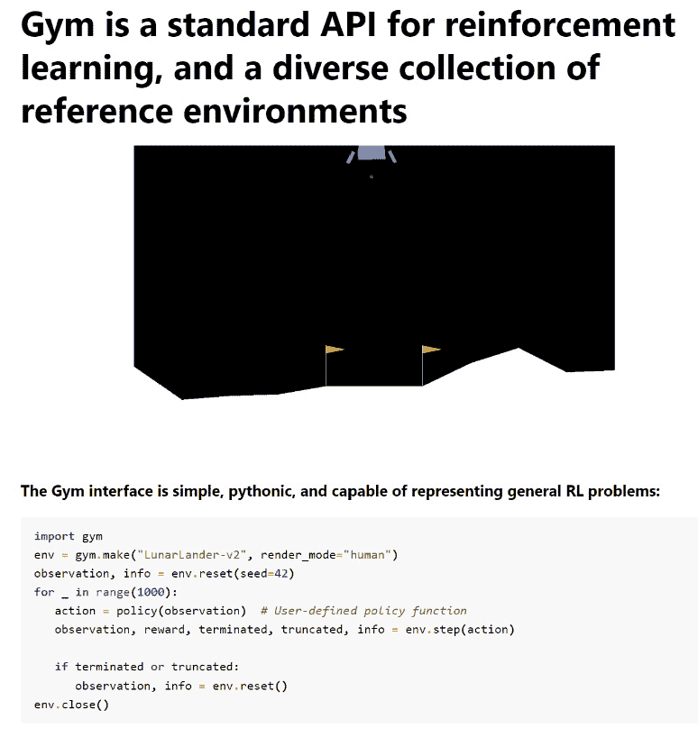

图 2.1 – Gym 文档的首页（https://www.gymlibrary.dev/）

OpenAI 继续在该领域进行研究和贡献，然而其最显著的成就与生成模型有关—**生成式预训练** **变换器**（**GPT**）。

在他们的论文*“通过生成式预训练改进语言理解”*中介绍了模型架构，并将其命名为**GPT-1**，OpenAI 研究人员很快在 2019 年发布了其继任者，GPT-2。这个版本的 GPT 是在一个名为**WebText**的语料库上训练的，当时该语料库包含稍微超过 800 万个文档，总共 40 GB 的文本，这些文本来自 Reddit 提交的 URL，至少有 3 个赞。它有 12 亿个参数，是其前身的十倍。

在这里，您可以看到 HuggingFace 发布的 GPT-2 的 UI 的着陆页（[`transformer.huggingface.co/doc/distil-gpt2`](https://transformer.huggingface.co/doc/distil-gpt2)）：

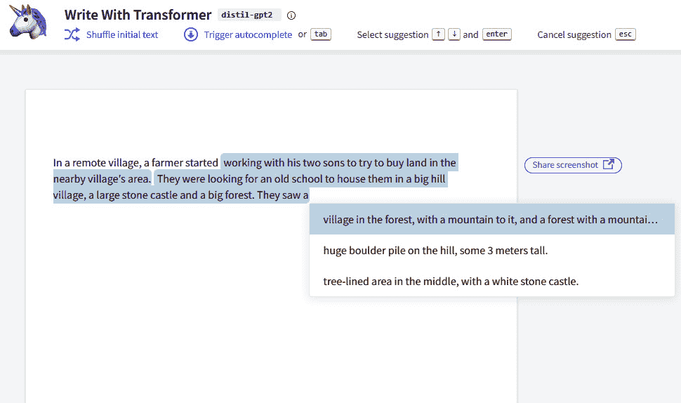

图 2.2 – GPT-2 根据提示撰写段落。来源：https://transformer.huggingface.co/doc/distil-gpt2

然后，在 2020 年，OpenAI 首先宣布，然后发布了 GPT-3，其拥有 1750 亿个参数，显着改善了 GPT-2 的基准结果。

除了自然语言生成模型，OpenAI 还在图像生成领域取得了进展，发布了该领域的第一个模型，名为**DALL-E**，于 2021 年揭示。正如前一章所述，DALL-E 能够根据自然语言输入创建全新的图像，这由最新版本的 GPT-3 解释。

DALL-E 最近升级到其新版本 DALL-E 2，于 2022 年 4 月宣布。

在下图中，您可以看到以自然语言提示**在舒适环境中生成一杯咖啡的逼真图片**为例的 DALL-E 生成的图像：


图 2.3 – DALL-E 生成的图像，以自然语言提示为输入

您可以在 OpenAI DALL-E 实验室（[`labs.openai.com/`](https://labs.openai.com/)）尝试生成创意图片，您将获得有限的免费积分进行实验。

尽管 OpenAI 在许多生成 AI 领域进行了投资，但其在文本理解和生成方面的贡献卓越，这要归功于我们将在接下来的段落中探讨的基础 GPT 模型的发展。

# OpenAI 模型系列概述

今天，OpenAI 提供一组预训练的、可供公众使用的模型。这有两个重要的含义：

+   强大的基础模型可以在不需要长时间和昂贵的训练的情况下使用

+   操纵这些模型并不需要成为数据科学家或 ML 工程师

用户可以在 OpenAI Playground 中测试 OpenAI 模型，这是一个友好的用户界面，您可以与模型进行交互，而无需编写任何代码。

在下面的截图中，您可以看到 OpenAI Playground 的着陆页：

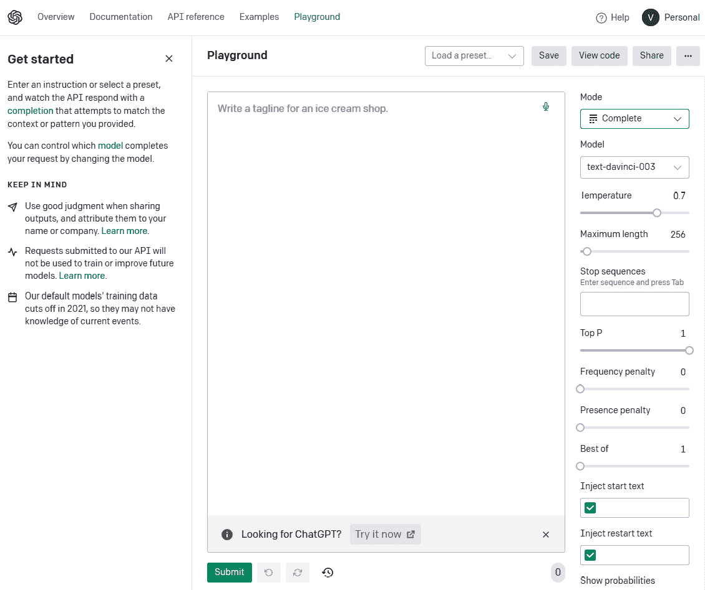

图 2.4 – OpenAI Playground 位于 https://platform.openai.com/playground

正如您从*图 2**.4*中所看到的，Playground 提供了一个用户界面，用户可以在该界面的右侧选择模型开始与之交互。要开始与 Playground 交互，您只需在自然语言的输入空间中键入任何问题或指令。您也可以从 OpenAI 文档中提供的一些示例开始（[`platform.openai.com/examples`](https://platform.openai.com/examples)）。

在深入研究模型系列之前，让我们首先定义一些您将在本章中看到的行话：

+   **标记**：标记可以被视为 API 用于处理输入提示的单词片段或段。与完整单词不同，标记可能包含尾随空格甚至部分子单词。为了更好地理解标记的长度概念，有一些一般性指导原则需要牢记。例如，在英语中，一个标记大约相当于四个字符，或者三分之四个单词。

+   **提示**：在**自然语言处理**（**NLP**）和机器学习的背景下，提示是指作为输入提供给 AI 语言模型以生成响应或输出的文本片段。提示可以是一个问题、一个陈述或一个句子，用于为语言模型提供上下文和指导。

+   **上下文**：在 GPT 领域，上下文指的是用户提示之前的单词和句子。语言模型利用这个上下文来生成最可能的下一个单词或短语，基于训练数据中发现的模式和关系。

+   **模型置信度**：模型置信度指的是 AI 模型对特定预测或输出的确定性或概率水平。在 NLP 的背景下，模型置信度通常用于指示 AI 模型对其生成的响应与给定输入提示的正确性或相关性的信心程度。

上述定义将对理解如何使用 Azure OpenAI 模型系列以及如何配置其参数起到关键作用。

在 Playground 中，有两个主要的模型系列可以进行测试：

+   **GPT-3**：一组能够理解和生成自然语言的模型。GPT-3 已经在大量文本语料库上进行了训练，可以执行各种自然语言任务，如语言翻译、摘要、问答等。这里是一个例子：


图 2.5 – 使用 GPT-3 进行摘要任务的示例

**GPT-3.5**: 这是在 GPT-3 基础上构建的新一代模型，旨在提高其自然语言理解和生成能力。GPT-3.5 模型可以执行复杂的自然语言任务，如撰写连贯的段落或文章，生成诗歌，甚至以自然语言创建计算机程序。GPT-3.5 是 ChatGPT 背后的模型，在其 API 上，它还可以通过专门的 UI 在 Playground 中消耗：

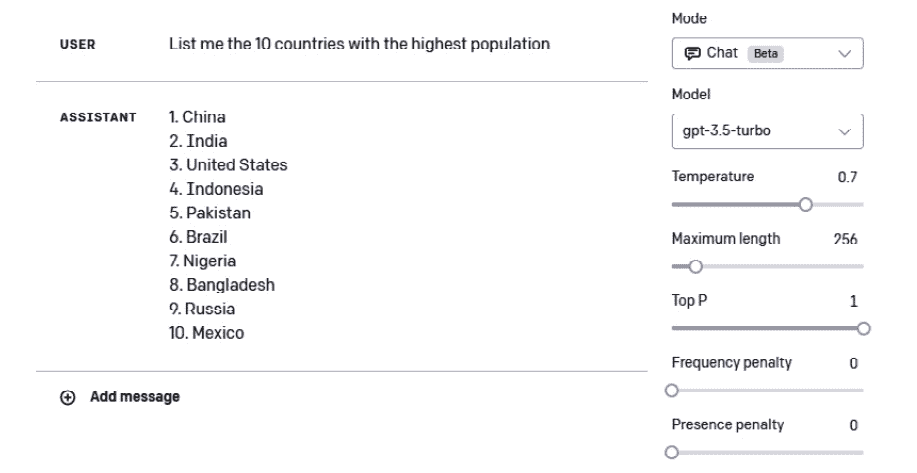

图 2.6 – 使用 GPT-3.5 进行交互的示例

+   **Codex**: 一组能够理解和生成各种编程语言代码的模型。Codex 可以将自然语言提示转换为可运行的代码，使其成为软件开发的强大工具。以下是使用 Codex 的例子：

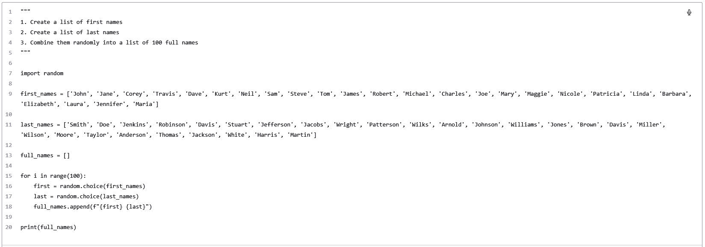

图 2.7 – 使用 Codex 生成代码的示例

注

在 2023 年 3 月，OpenAI 宣布 Codex 模型将从该日期起被弃用。原因是新的聊天模型（包括 ChatGPT 背后的模型 GPT-3.5-turbo）的不可思议的能力，这些模型还可以涵盖编码任务，并且其结果可以达到或甚至超过 Codex 模型的结果。

对于每个模型，你还可以调整一些可配置的参数。以下是一个列表：

+   **温度**（从 0 到 1）：控制模型响应的随机性。低温度使你的模型更加确定性，意味着它会倾向于给出相同的输出作为同样的问题。例如，如果我多次问我的模型，“OpenAI 是什么？”并将温度设置为 0，它总是会给出相同的答案。另一方面，如果我使用温度设置为 1 的模型做同样的事情，它将试图通过措辞和风格在每次都修改它的答案。

+   **最大长度**（从 0 到 2048）：控制模型对用户提示的响应的长度（以标记为单位）。

+   **停止序列**（用户输入）: 这会使得回应在期望的地方结束，比如句子或列表的结尾。

+   **顶部概率**（从 0 到 1）：控制模型在生成回应时将考虑哪些标记。将其设置为 0.9 将考虑所有可能标记中最有可能的前 90%。也许你会问，“为什么不将顶部概率设置为 1，这样就可以选择所有最有可能的标记？”答案是用户可能仍然希望在模型信心较低时保持多样性，即使在得分最高的标记中。

+   **频率惩罚**（从 0 到 1）：控制生成的回应中相同标记的重复频率。惩罚越高，出现相同标记在回应中的概率就越低。该惩罚通过标记在文本中迄今为止出现的频率来比例减少概率（这是与下一个参数的关键区别）。

+   **存在惩罚**（范围从 0 到 2）：这类似于上一个，但更严格。它减少了出现在文本中的任何一个标记的重复机会。由于比频率惩罚更严格，存在惩罚也增加了在回应中引入新主题的可能性。

+   **最佳**（范围从 0 到 20）：这将生成多个回应，并仅显示所有标记的总概率最佳的回应。

+   **回应前后文本**（用户输入）：这在模型回应之前和之后插入文本。这可以帮助模型准备回应。

除了在 Playground 中尝试 OpenAI 模型，您还可以在自定义代码中调用模型 API 并将模型嵌入到您的应用程序中。实际上，在 Playground 的右上角，您可以点击**查看代码**并导出如下所示的配置：

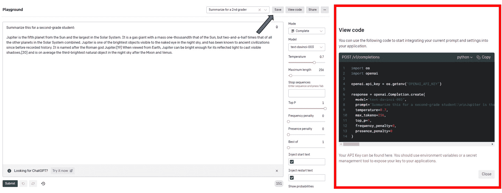

图 2.8 - 使用自然语言提示调用 GPT3 模型的 Python 代码

如您从前述屏幕截图中所见，该代码导出了您在 Playground 中设置的参数配置。

现在，您可以通过在终端中使用`pip install openai`来安装 Python 中的 OpenAI 库来开始使用。为了使用模型，您需要生成一个 API 密钥。您可以在您的账户设置中找到您的 API 密钥（[`platform.openai.com/account/api-keys`](https://platform.openai.com/account/api-keys)），如下所示：

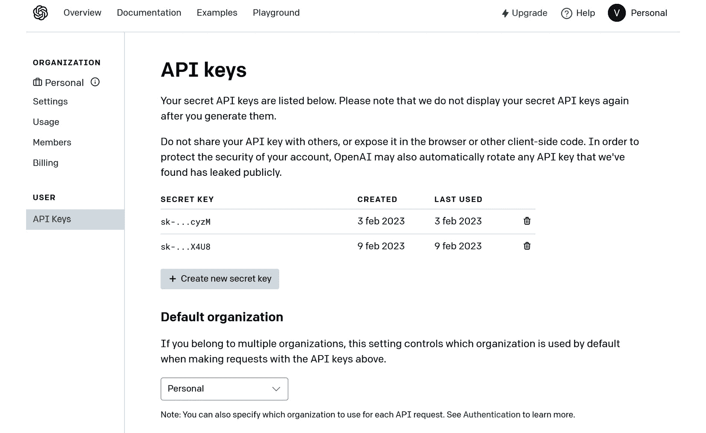

图 2.9 - 您 OpenAI 配置文件中帐户设置页面中的 API 密钥

使用 OpenAI API，您还可以尝试以下在 Playground 中不可用的其他模型系列：

+   **审查**：这是由 OpenAI 开发的经过调整的模型，可以检测潜在的敏感或不安全的文本内容。审查使用机器学习算法根据上下文和语言使用对文本进行分类为安全或不安全。此模型可用于在社交媒体平台、在线社区及其他许多领域自动化内容审查。有多个类别，如仇恨、仇恨/威胁、自残、性暴力、性暴力/未成年人、暴力、暴力/图形。

下面是审查 API 的示例代码：

```
import os
import openai
openai.api_key = os.getenv("OPENAI_API_KEY")
openai.Moderation.create(
  input="I want to kill him",
)
```

其输出如下所示：

```
<OpenAIObject id=modr-6sHusuY9frxJdfqTBXHsOAfWhckrh at 0x218bd8482c0> JSON: {
  "id": "modr-6sHusuY9frxJdfqTBXHsOAfWhckrh",
  "model": "text-moderation-004",
  "results": [
    {
      "categories": {
        "hate": false,
"hate/threatening": false,
        "self-harm": false,
        "sexual": false,
        "sexual/minors": false,
        "violence": true,
        "violence/graphic": false
      },
      "category_scores": {
        "hate": 1.7164344171760604e-05,
        "hate/threatening": 2.614225103059198e-08,
"self-harm": 2.5988580176772302e-08,
        "sexual": 2.8184256279928377e-06,
        "sexual/minors": 9.1383149936064e-09,
        "violence": 0.9910049438476562,
        "violence/graphic": 5.316753117767803e-07
      },
      "flagged": true
    }
  ]
}
```

在这种情况下，审查 API 检测到暴力内容的证据。

+   **嵌入**：一些模型可以使用嵌入。这些嵌入涉及在多维空间中表示单词或句子。在这个空间中不同实例之间的数学距离表示它们在意义上的相似性。举个例子，想象单词 queen、woman、king 和 man。理想情况下，在我们的多维空间中，如果表示正确，我们希望实现以下内容：

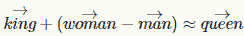

图 2.10 – 单词之间的矢量方程示例

这意味着*女人*和*男人*之间的距离应该等于*女王*和*国王*之间的距离。这里是一个嵌入的例子：

```
import openai
embedding = openai.Embedding.create(
    input="The cat is on the table",
    model="text-embedding-ada-002")["data"][0][ "embedding"]
```

前面的方法创建了输入的向量表示。我们可以在这里查看输出的前 10 个向量。

```
embedding[1:10]
[-0.01369840931147337,
 -0.007505378685891628,
 -0.002576263388618827,
 -0.014773285016417503,
 0.019935185089707375,
 -0.01802290789783001,
 -0.01594814844429493,
 -0.0010944041423499584,
 -0.014323337003588676]
```

嵌入在智能搜索场景中可以极其有用。事实上，通过获取用户输入和用户想要搜索的文档的嵌入，可以计算距离度量（即余弦相似度）来衡量输入和文档之间的距离。通过这样做，我们可以检索与用户输入在数学距离上更*接近*的文档。

+   **Whisper**：这是一个语音识别模型，可以将音频转录为文本。Whisper 可以识别和转录各种语言和方言，准确率很高，是自动语音识别系统的有价值的工具。这里是一个例子：

    ```
    # Note: you need to be using OpenAI Python   v     0.27.0 for the code below to work
    ```

    ```
    import openai
    ```

    ```
    openai.api_key = os.getenv("OPENAI_API_KEY")
    ```

    ```
    audio_file= open("/path/to/file/audio.mp3", "rb")
    ```

    ```
    transcript = openai.Audio.transcribe("whisper-1", audio_file)
    ```

输出如下所示：

```
{"text": Yes, hi, I just noticed a dent on the side of my car and I have no idea how it got there. There were no witnesses around and I'm really frustrated.
….
}
```

所有先前的模型都是预先构建的，也就是说它们已经在一个庞大的知识库上进行了预训练。

然而，有一些方法可以使您的模型更加定制化，以适应您的用例。

第一种方法嵌入在模型设计的方式中，它涉及在**few-learning 方法**中为您的模型提供上下文（我们将在本书的后面重点介绍这种技术）。换句话说，您可以要求模型生成一篇文章，其模板和词汇回忆您已经写过的另一篇文章。为此，您可以向模型提供您的查询生成一篇文章*和*以前的文章作为参考或上下文，以便模型更好地为您的请求做好准备。

这里是一个例子：


图 2.11 – OpenAI Playground 中使用 few-shot learning 方法进行对话的示例

第二种方法更为复杂，被称为**微调**。微调是将预训练模型适应新任务的过程。

在微调中，预训练模型的参数被改变，要么通过调整现有参数，要么通过添加新参数，以更好地适应新任务的数据。这是通过在特定于新任务的较小标记数据集上训练模型来实现的。微调的关键思想是利用从预训练模型中学到的知识，并将其微调到新任务，而不是从头开始训练模型。请看下面的图：

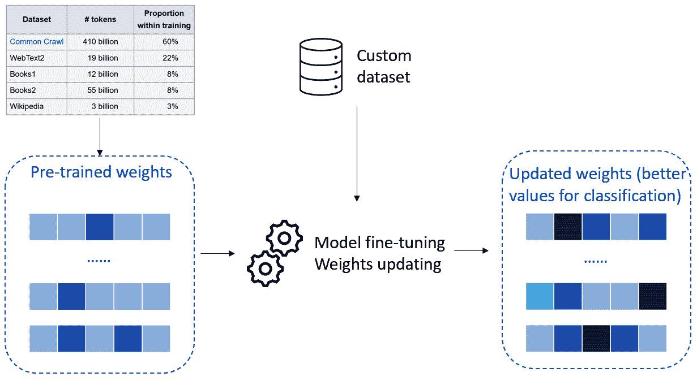

图 2.12 – 模型微调

在前图中，你可以看到关于如何在 OpenAI 预构建模型上进行精调的模式图。其思想是你可以使用通用参数或权重的预训练模型。然后，你用自定义数据喂养你的模型，通常以*键-值*提示和完成的形式，如下所示：

```
{"prompt": "<prompt text>", "completion": "<ideal generated text>"}
{"prompt": "<prompt text>", "completion": "<ideal generated text>"}
{"prompt": "<prompt text>", "completion": "<ideal generated text>"}
...
```

训练完成后，你将会得到一个定制化模型，对于给定任务表现特别出色，例如，对公司文档进行分类。

精调的好处在于，你可以根据自己的用例定制预构建模型，无需从头开始重新训练，但是可以利用更小的训练数据集，因此训练时间和计算量更少。与此同时，模型保持其生成能力和通过原始训练学习的准确性，这是在大规模数据集上发生的。

在这一段中，我们对 OpenAI 提供给一般公众的模型进行了概述，从你可以直接在 Playground 中尝试的模型（GPT、Codex）到如嵌入等更复杂的模型。我们还了解到，除了使用预构建模型之外，你还可以通过精调进行定制化，提供一组示例供学习。

在接下来的章节中，我们将专注于这些惊人模型的背景，从它们背后的数学开始，然后深入探讨使 ChatGPT 成为可能的重大发现。

# ChatGPT 之路：其背后的模型数学

自 2015 年成立以来，OpenAI 投资于研究和开发一类被称为**生成式预训练变压器**（**GPT**）的模型，并且它们作为 ChatGPT 背后的引擎已经引起了大家的关注。

GPT 模型属于变压器结构框架，此框架于 2017 年由 Google 研究员在一篇论文中介绍，*Attention Is All You Need*。

变压器架构是为了克服传统**循环神经网络**（**RNNs**）的局限性而引入的。RNNs 首次在 1980 年代由洛斯阿拉莫斯国家实验室的研究人员提出，但直到 1990 年代它们才引起了人们的关注。RNNs 背后的最初想法是处理顺序数据或时间序列数据，跨时间步保留信息。

确实，直到那一时刻，经典的**人工神经网络**（**ANN**）结构是前馈 ANN 的结构，其中每个隐藏层的输出是下一个隐藏层的输入，没有保留有关过去层的信息。

为了理解变压器背后的思想，我们需要从它的起源开始。因此，我们将深入探讨以下主题：

+   RNN 的结构

+   RNN 的主要局限性

+   如何通过引入新的架构元素（包括位置编码、自注意力和前馈层）克服这些局限性

+   我们如何达到 GPT 和 ChatGPT 的最先进技术

让我们从变压器的前身架构开始。

## RNN 的结构

让我们想象我们想要预测房价。如果我们只有今天的价格，我们可以使用一个前馈架构，通过隐藏层（带有激活函数）对输入进行非线性转换，并得到明天价格的预测输出。具体如下：

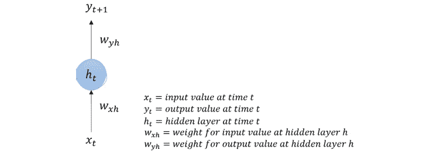

图 2.13 – 具有隐藏层的前馈架构

然而，对于这种类型的数据，也很可能有更长的序列可用。例如，我们可能有未来 5 年的这栋房子的时间序列。当然，我们希望将我们拥有的额外信息嵌入到我们的模型中，以便我们的 RNN 能够保持过去输入的记忆，以正确解释当前输入并预测未来输出。

因此，回到我们的例子，想象我们不仅有今天的价格，还有昨天的价格**(t-1)**和前一天的价格**(t-2)**。这是我们如何计算的：

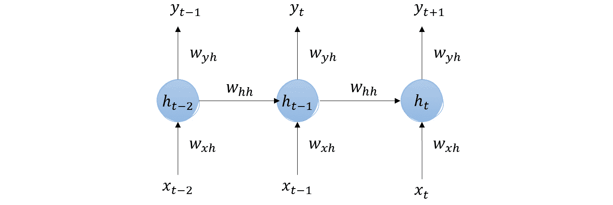

图 2.14 – RNN 示例

由于我们只关心明天的价格，让我们忽略*t-1*和*t*的中间最终输出。

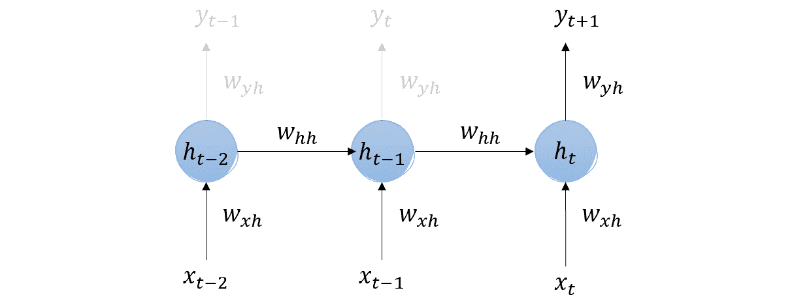

图 2.15 – RNN 示例

如您所见，**t-2**的隐藏层输出作为**t-1**的隐藏层的（加权）输入，同时也接受**t-1**的输入。然后，**t-1**的隐藏层输出，已经保留了**t-2**和**t-1**输入的记忆，作为**t**的隐藏层的输入。因此，我们感兴趣的明天价格（**y**t+1）带有所有先前几天输入的记忆。

最后，如果我们想要缩小这张图片，我们可以将 RNN 看作如下：


图 2.16 – RNN 的包装形式示例

这意味着 RNN 层在时间步*t-n*的输出然后被产生并传递为下一个时间步的输入。RNN 层的隐藏状态也作为下一个时间步的输入传递，使网络能够在输入序列的不同部分之间保持和传播信息。

尽管 RNN 在人工神经网络领域是一项重大进展，但它们仍然存在一些限制，我们将在下一节中进行探讨。

## RNN 的主要限制

如本节介绍所述，RNNs 存在三个主要限制：

+   **梯度消失和爆炸**：RNNs 存在梯度消失和爆炸的问题，这使得有效训练网络变得困难。这个问题发生在反向传播过程中梯度被多次相乘，导致梯度变得非常小或非常大。

+   **有限的上下文**：传统的 RNN 只能捕捉有限数量的上下文，因为它们一次处理输入序列的一个元素。这意味着它们无法有效处理长期依赖关系或输入序列中相距较远的元素之间的关系。

+   **并行化困难**：RNN 本质上是顺序的，这使得并行化它们的计算变得困难，因此它们无法充分利用今天的**图形处理单元**（**GPU**）。这可能导致它们在大规模数据集和设备上训练和部署变慢。

1997 年，Sepp Hochreiter 和 Jürgen Schmidhuber 在他们的论文《长短期记忆》中引入了一种新的架构，试图克服前两个限制（有限的上下文和梯度消失和梯度爆炸）。

LSTM 网络通过引入细胞状态的概念来克服有限上下文的问题，该状态与隐藏状态分开，能够长时间保持信息。细胞状态在网络中保持不变传递，使其能够存储从以前时间步丢失的信息。

此外，LSTM 网络通过使用精心设计的门控来控制信息在细胞内外的流动，从而克服了梯度消失和梯度爆炸的问题，这有助于防止梯度变得过小或过大。

然而，LSTM 网络仍然存在并行化不足的问题，因此训练时间较慢（甚至比 RNN 更复杂，因此更慢）。目标是拥有一个能够在顺序数据上实现并行化的模型。

为了克服这些限制，引入了一种新的框架。

## 克服限制 - 引入 transformers

Transformer 架构通过替换循环（使用自注意机制）来解决这些限制，允许并行计算并捕捉长期依赖关系。

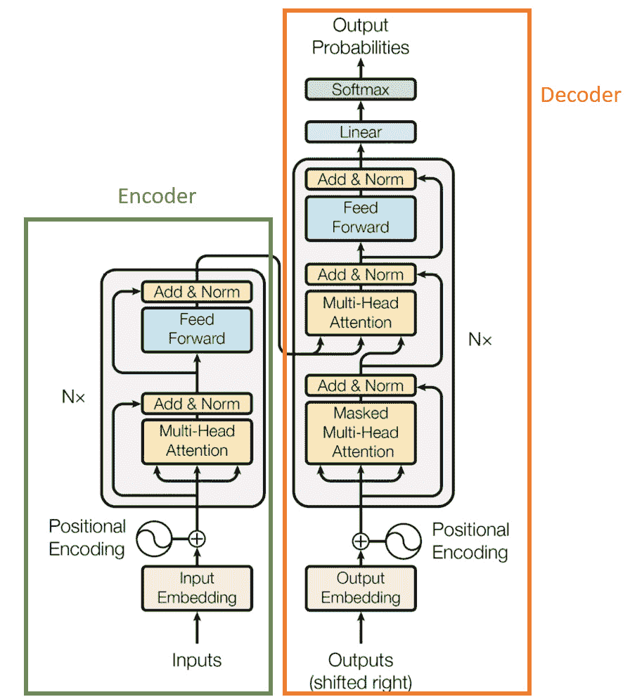

图 2.7 - 来自原始论文“注意力就是你所需要的”的 Transformer 架构。Vaswani, A., Shazeer, N., Parmar, N., Uszkoreit, J., Jones, L., Gomez, A. N., Kaiser, L., & Polosukhin, I. (2017). Attention Is All You Need. ArXiv. https://doi.org/10.48550/arXiv.1706.03762

在上述图中（摘自原始论文），您可以看到有两个主要的构建模块：左侧是“编码器”，其任务是将输入表示为较低维空间；右侧是“解码器”，其任务是将编码器提供的较低维数据翻译回原始数据格式。

编码器和解码器共享三种主要类型的层，区分了 Transformer 架构：位置编码、自注意力和前馈。

让我们在以下部分了解每一个。

### 位置编码

编码器是将自然语言输入转换为数字向量的层。这得益于嵌入的过程，这是一种 NLP 技术，它用向量表示单词，使得一旦在向量空间中表示，向量之间的数学距离代表了它们所代表的单词之间的相似性。请看下图：

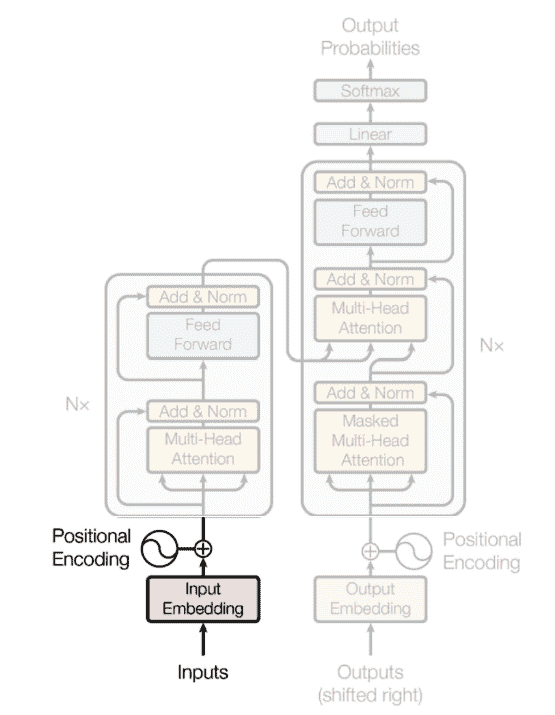

图 2.18 – 《注意力就是你所需要的》原始论文中的 Transformer 架构。Vaswani, A., Shazeer, N., Parmar, N., Uszkoreit, J., Jones, L., Gomez, A. N., Kaiser, L., & Polosukhin, I. (2017). Attention Is All You Need. ArXiv. https://doi.org/10.48550/arXiv.1706.03762

当我们谈论句子的含义时，我们都同意句子中单词的排列对于确定其含义是重要的。这就是为什么我们希望我们的编码器考虑到这种顺序，是*位置*的原因。

位置编码是一个固定的、可学习的向量，表示单词在序列中的位置。它被添加到单词的嵌入中，使得单词的最终表示包括其含义和位置。

### 自注意力

自注意力层负责确定生成输出时每个输入标记的重要性。它们回答了这个问题，“*我应该关注输入的哪一部分？*”

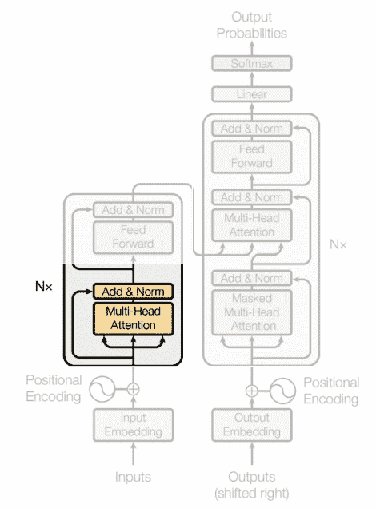

图 2.19 – 《注意力就是你所需要的》原始论文中的 Transformer 架构。Vaswani, A., Shazeer, N., Parmar, N., Uszkoreit, J., Jones, L., Gomez, A. N., Kaiser, L., & Polosukhin, I. (2017). Attention Is All You Need. ArXiv. https://doi.org/10.48550/arXiv.1706.03762

为了获得一个句子的自注意力向量，我们需要的元素是*值*，*查询*和*键*。这些矩阵用于计算输入序列中元素之间的注意力得分，并且是在训练过程中学习的三个权重矩阵（通常初始化为随机值）。

**查询**用于表示注意力机制的当前焦点，而**键**用于确定应该受到注意的输入部分，**值**用于计算上下文向量。然后这些矩阵相乘，并通过非线性变换传递（使用 softmax 函数）。自注意力层的输出以一种转换的、具有上下文意识的方式表示输入值，这使得 Transformer 可以根据手头任务关注输入的不同部分。这是如何描述矩阵相乘的过程：

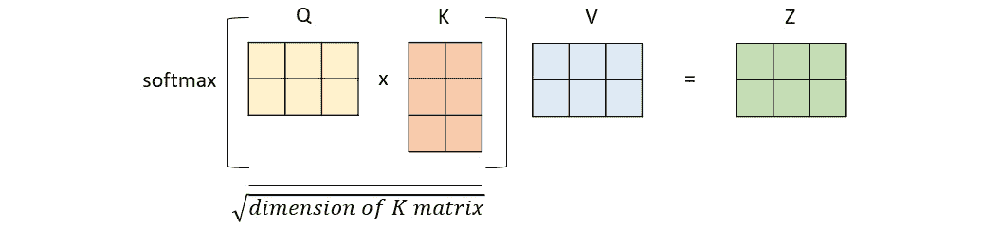

图 2.20 - 查询，键和值矩阵相乘以获得上下文向量的表示

注意，在论文作者提出的架构中，“注意力就是你需要的”，注意力层被称为**多头注意力**。多头注意力实际上是一种机制，多个自注意力机制并行处理输入数据的不同部分，生成多个表示。这允许 Transformer 模型同时关注输入数据的不同部分并从多个角度汇总信息。

一旦注意力层的并行输出准备就绪，它们将被串联并通过前馈层进行处理。

### 前馈层

前馈层负责将自注意力层的输出转换为最终输出的合适表示。

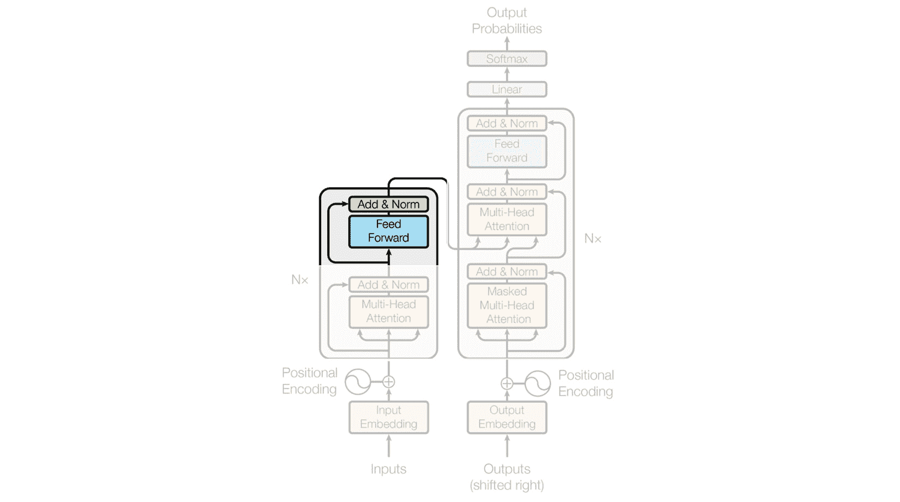

图 2.21 - “注意力就是你需要的”原始论文中的 Transformer 架构。Vaswani, A., Shazeer, N., Parmar, N., Uszkoreit, J., Jones, L., Gomez, A. N., Kaiser, L., & Polosukhin, I. (2017). Attention Is All You Need. ArXiv. https://doi.org/10.48550/arXiv.1706.03762

前馈层是 Transformer 架构的主要构件，并包括两个主要元素：

+   **全连接层**（也称为密集层）：这是一种每个神经元与前一层中的每个神经元相连接的层类型。换句话说，来自前一层的每个输入都连接到当前层中的每个神经元，并且当前层中的每个神经元都对下一层中所有神经元的输出有贡献。密集层中的每个神经元通过线性变换计算其输入的加权和。

+   **激活函数**：这是应用于全连接层输出的非线性函数。激活函数用于向神经元的输出引入非线性，这对于网络学习输入数据中的复杂模式和关系是必要的。在 GPT 的情况下，激活函数是 ReLU。

前馈层的输出然后被用作网络中下一层的输入。

在下图中，我们可以看到一个通用前馈层的示例，它以一个二维向量作为输入，在密集层中使用训练好的权重进行线性操作，然后使用 ReLU 激活函数对输出进行非线性转换：

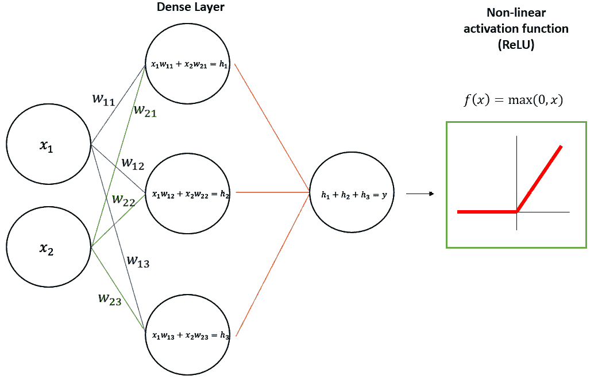

图 2.22 - 具有二维输入的通用前馈层在密集层中和 ReLU 非线性激活函数中的模式图

### 最后一英里 - 解码结果

我们提到变压器由两个组件组成：编码器和解码器。尽管它们共享位置编码、自注意力和前馈层的核心元素，但解码器仍然必须执行一个额外的操作 - 将输入解码为原始数据格式。这个操作是通过一个线性层（一个将输入的维度调整为输出维度的前馈网络）和一个 softmax 函数（它将输入转换为概率向量）来完成的。

从该向量中，我们选择对应最高概率的单词，并将其用作模型的最佳输出。

上面解释的所有架构元素定义了变压器的框架。在下一节中，我们将看到这一创新框架如何为 GPT-3 和其他由 OpenAI 开发的强大语言模型铺平了道路。

## GPT-3

现在我们来到了 ChatGPT 背后的 GPT-3 架构。它确实是基于变压器架构的模型，但有一个特殊之处：它只有解码器层。事实上，在他们的介绍性论文*通过生成式预训练改进语言理解*中，OpenAI 的研究人员采用了*仅解码器*的方法。

GPT-3 是*巨大*的。但具体有多大呢？

让我们从它训练的知识库开始。它旨在尽可能详尽地涵盖人类知识，因此由不同来源组成：

+   **Common Crawl** ([`commoncrawl.org/`](https://commoncrawl.org/))：一个在 8 年时间内收集的大规模网络数据语料库，几乎没有过滤

+   **WebText2** ([`openwebtext2.readthedocs.io/en/latest/background/`](https://openwebtext2.readthedocs.io/en/latest/background/))：一个包含来自 Reddit 帖子中链接的网页文本的集合，至少有 3 个赞

+   **Books1 和 Books2**：两个分别由互联网上可用的书籍组成的语料库

+   **维基百科**：一个包含来自流行在线百科全书维基百科英文版的文章的语料库

在这里你可以更好地了解：

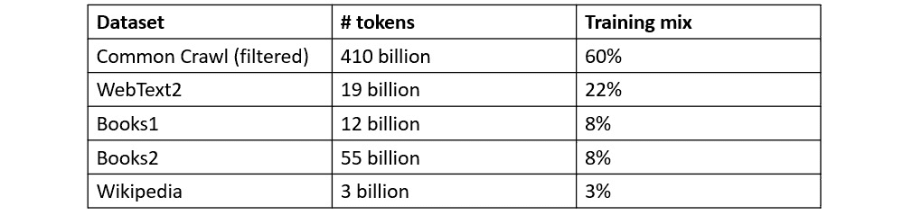

图 2.23 – GPT-3 知识库

让我们考虑以下假设：

+   1 代币 ~= 4 个英文字符

+   1 代币 ~= ¾ 词

我们可以得出结论，GPT-3 已经在*374* *亿个单词*上进行了训练！

这个知识库旨在在 96 个隐藏层中稀疏地训练 1750 亿个参数。为了让你了解 GPT-3 有多庞大，让我们将其与之前的版本 GPT-1 和 GPT-2 进行比较：

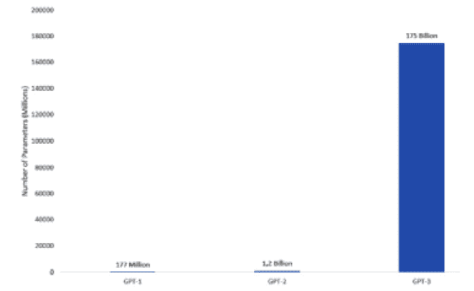

图 2.24 – GPT 模型随时间在参数数量上的演变

正如你所看到的，在自 2018 年 GPT-1 推出以来的几年里，GPT 模型的复杂性和深度呈指数级增长。

GPT 模型背后的发展速度令人惊叹，特别是如果我们考虑到这个模型的最新版本，也是首个向普通大众提供的版本：ChatGPT。

# ChatGPT：最先进的技术

2022 年 11 月，OpenAI 宣布了其会话式人工智能系统 ChatGPT 的网络预览，向普通大众提供。这引起了来自专家、组织和普通大众的巨大热情，以至于在仅仅 5 天后，该服务就吸引了 100 万用户！

在写关于 ChatGPT 之前，我会让它自我介绍：

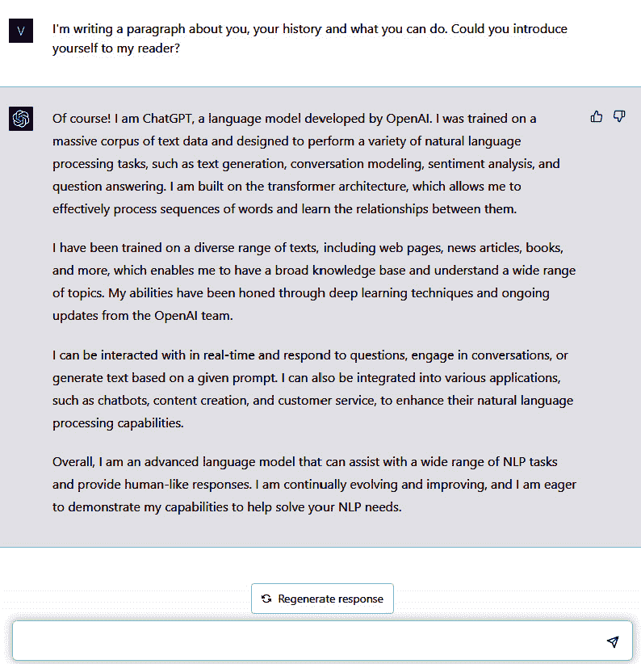

图 2.25 – ChatGPT 自我介绍

ChatGPT 是建立在一个先进的语言模型之上的，该模型利用了 GPT-3 的修改版本，专门为对话进行了微调。优化过程涉及到**强化学习与人类反馈**（**RLHF**），这是一种利用人类输入来训练模型展现出期望对话行为的技术。

我们可以将 RLHF 定义为一种机器学习方法，其中算法通过接收来自人类的反馈来学习执行任务。该算法经过训练，以做出最大化人类提供的奖励信号的决策，并且人类提供额外的反馈以改善算法的性能。当任务对于传统编程来说过于复杂或者期望的结果难以提前指定时，这种方法就很有用。

这里的相关区别是 ChatGPT 已经在人类的帮助下进行了训练，使其与其用户保持一致。通过整合 RLHF，ChatGPT 被设计为更好地理解并以一种自然而引人入胜的方式回应人类语言。

注意

相同的 RLHF 机制被用于我们可以将其视为 ChatGPT 前身的**InstructGPT**。在 OpenAI 的研究人员于 2022 年 1 月发表的相关论文中，InstructGPT 被介绍为一类比 GPT-3 更擅长遵循英语指示的模型。

ChatGPT 的知识截止日期是 2021 年，这意味着该模型了解到截止日期前可用的信息。然而，您仍然可以通过少量示例学习方法为模型提供上下文，尽管模型的回复仍然基于其知识库直到截止日期。

ChatGPT 正在彻底改变与人工智能的互动方式。ChatGPT 生成类人文本的能力使其成为广泛应用的热门选择，包括聊天机器人、客户服务和内容创作。此外，OpenAI 宣布 ChatGPT API 将很快发布，允许开发人员将 ChatGPT 直接集成到自定义应用程序中。

ChatGPT 的架构和训练方法的不断发展和改进承诺将进一步推动语言处理的边界。

# 总结

在本章中，我们回顾了 OpenAI 的历史、研究领域和最新发展，一直到 ChatGPT。我们深入研究了 OpenAI Playground 作为测试环境以及如何将 Models API 嵌入到您的代码中。然后，我们深入探讨了 GPT 模型家族背后的数学知识，以更清晰地了解 GPT-3 的运作原理，这是 ChatGPT 背后的模型。

通过深入理解 GPT 模型背后的数学，我们可以更好地理解这些模型的强大之处以及它们对个人和组织的多种影响。通过对 OpenAI Playground 和 Models API 的第一次了解，我们看到了测试或嵌入预训练模型的简易性：这里的改变游戏规则的因素是，您无需强大的硬件和数小时的时间来训练您的模型，因为它们已经可供您使用，如果需要，还可以定制一些示例。

在下一章中，我们也开始了本书的*第二部分*，我们将看到 ChatGPT 在各个领域内的应用，以及如何释放其潜力。您将学习如何通过正确设计提示来获取 ChatGPT 的最高价值，如何提高日常生产力，以及它如何成为开发人员、市场营销人员和研究人员的出色项目助手。

# 参考文献

+   Radford, A., & Narasimhan, K. (2018). 通过生成式预训练改善语言理解。

+   Vaswani, A., Shazeer, N., Parmar, N., Uszkoreit, J., Jones, L., Gomez, A. N., Kaiser, L., & Polosukhin, I. (2017). *注意力机制就是你所需要的*. ArXiv. [`doi.org/10.48550/arXiv.1706.03762`](https://doi.org/10.48550/arXiv.1706.03762) OpenAI. Fine-Tuning Guide. OpenAI 平台文档. [`platform.openai.com/docs/guides/fine-tuning`](https://platform.openai.com/docs/guides/fine-tuning).
