# 6

# 用 ChatGPT 开发未来

在本章中，我们将讨论开发人员如何利用 ChatGPT。本章关注 ChatGPT 在开发人员领域中解决的主要用例，包括代码审查和优化、文档生成和代码生成。本章将提供示例，并让您自行尝试提示。

在对开发人员为什么应该将 ChatGPT 作为日常助手进行一般性介绍之后，我们将重点关注 ChatGPT 以及它可以做到以下几点：

+   为什么开发人员选择 ChatGPT？

+   生成、优化和调试代码

+   生成与代码相关的文档并调试您的代码

+   解释**机器学习**（**ML**）模型，以帮助数据科学家和业务用户理解模型的可解释性

+   翻译不同的编程语言

在本章末尾，您将能够利用 ChatGPT 进行编码活动，并将其用作您编码生产力的助手。

# 为什么开发人员选择 ChatGPT？

就我个人而言，我相信 ChatGPT 最让人惊叹的能力之一就是处理代码。任何类型的代码。我们已经在*第四章*中看到 ChatGPT 如何可以作为 Python 控制台。然而，对于开发人员来说，ChatGPT 的能力远不止这个例子。它可以成为代码生成、解释和调试的日常助手。

在最受欢迎的语言中，我们当然可以提到 Python、JavaScript、SQL 和 C#。然而，ChatGPT 覆盖了各种语言，就像它自己披露的那样：

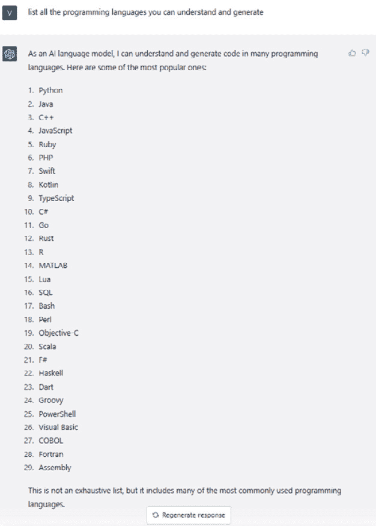

图 6.1 – ChatGPT 列出了它能够理解和生成的编程语言

无论你是后端/前端开发人员、数据科学家还是数据工程师，在你使用编程语言时，ChatGPT 都可能是一个改变游戏规则的因素，而我们将在下一节的几个示例中看到它是如何做到这一点的。

从下一节开始，我们将深入研究 ChatGPT 在处理代码时可以取得的具体成就。我们将看到覆盖不同领域的端到端用例，以便我们熟悉使用 ChatGPT 作为代码助手。

# 生成、优化和调试代码

您应该利用的主要功能是 ChatGPT 代码生成。你有多少次在寻找预先构建的代码片段来作为起点？生成`utils`函数、示例数据集、SQL 模式等？ChatGPT 能够根据自然语言输入生成代码：

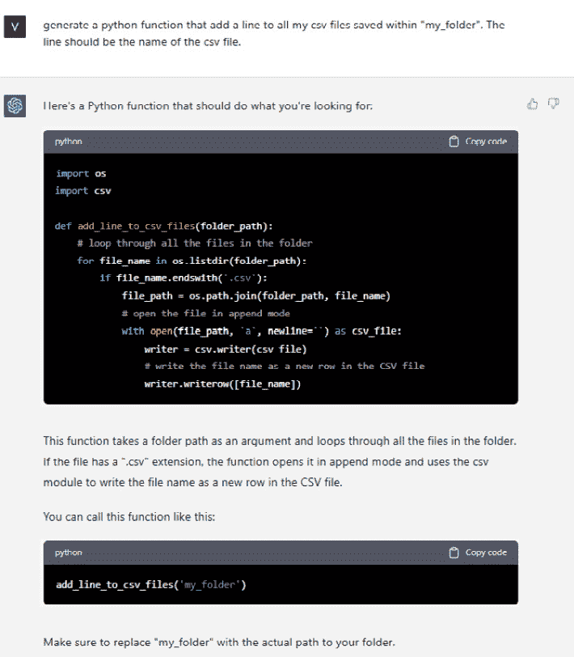

图 6.2 – ChatGPT 生成 Python 函数来写入 CSV 文件的示例

正如您所见，ChatGPT 不仅能够生成函数，还能够解释函数的功能、如何使用它以及使用通用占位符（如`my_folder`）替代什么。

另一个示例可能是为结构化表创建模式。比如，想象一下你是一个数据工程师，正在创建 SAP ERP 系统中两个标准表之间的关系：`MARA` 和 `VBAP`，分别存储一般物料数据和销售文档数据。

让我们请求 ChatGPT 根据列名创建这些表的模式，将列名作为上下文：

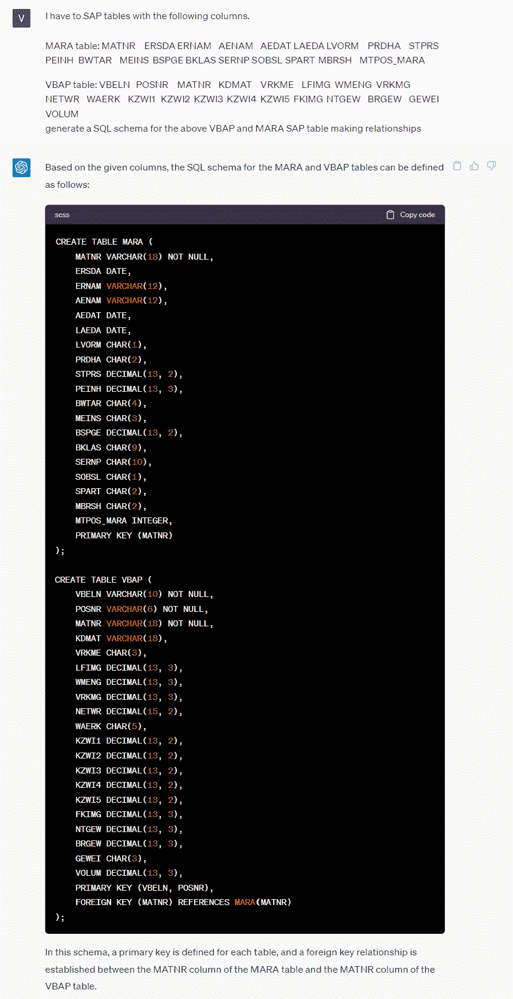

图 6.3 – ChatGPT 为 SAP 表生成 SQL 模式的示例

请注意，ChatGPT 能够建立关系，因为它了解 SAP 分类和列名解释，这是任何不了解 SAP 分类（包括数据工程师在内）的人都会遇到困难的地方。作为确认，让我们请求 ChatGPT 用更易理解的名称重命名所有这些列：

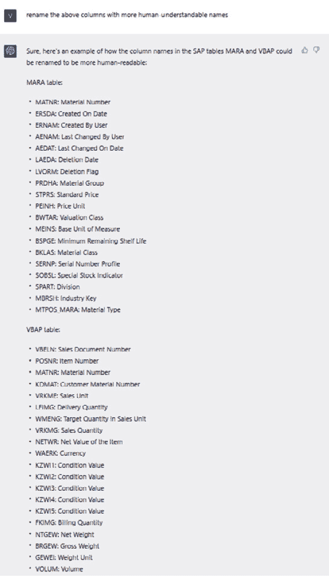

图 6.4 – ChatGPT 重命名的 SAP 表列

最后，让我们使用新列重新创建模式，确保避免重复（新名称 `Condition Value` 确实重复了五次）：

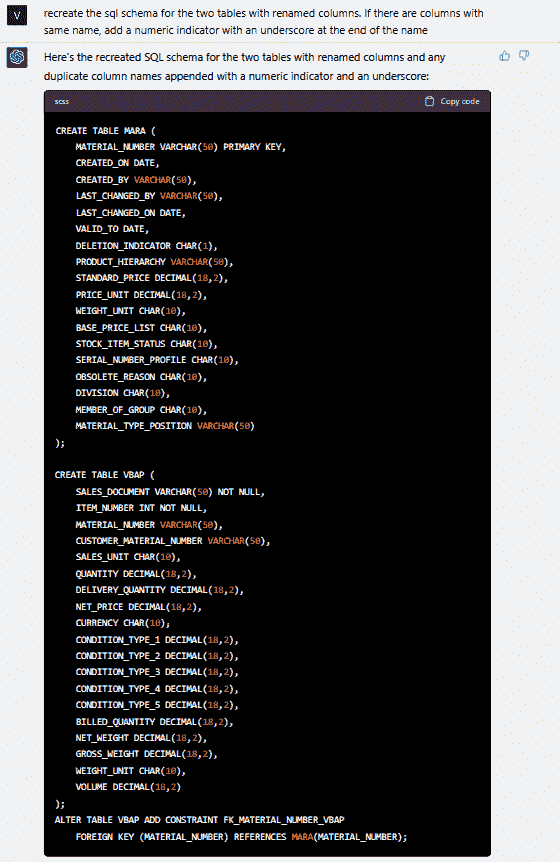

图 6.5 – SQL 模式，列已重命名

上面的示例对于减少创建用于进一步数据分析的模式所需的时间至关重要。

ChatGPT 也可以成为代码优化的好助手。事实上，它可能节省我们一些运行时间或计算资源，从我们的输入开始制作优化的脚本。在自然语言领域，这种能力可能与我们在*第五章*中看到的写作辅助功能相媲美，在*提高写作技能和* *翻译* 部分。

例如，想象一下你想从另一个列表开始创建一个奇数列表。为了达到这个目的，你编写了以下 Python 脚本（为了这个练习，我还将使用 `timeit` 和 `datetime` 库跟踪执行时间）：

```
from timeit import default_timer as timer
from datetime import timedelta
start = timer()
elements = list(range(1_000_000))
data = []
for el in elements:
  if not el % 2:
    # if odd number
    data.append(el)
end = timer()
print(timedelta(seconds=end-start))
```

执行时间为 `00.141185` 秒。如果我们要求 ChatGPT 优化这个脚本会发生什么呢？

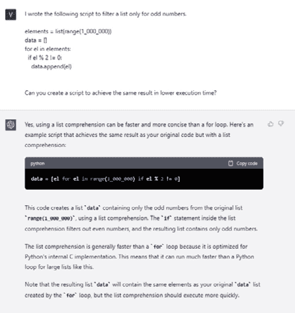

图 6.6 – ChatGPT 生成优化的 Python 脚本替代方案

ChatGPT 为我提供了一个示例，以更低的执行时间实现相同的结果。它还详细说明了为什么理解方法比 `for` 循环更快的替代方案。

让我们看看这个新脚本与之前脚本的性能比较：

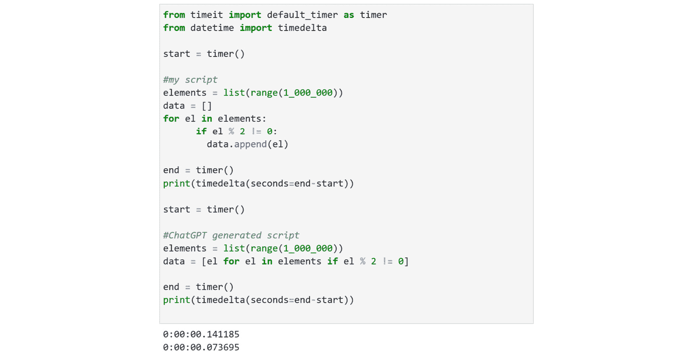

图 6.7 – 用户和 ChatGPT 脚本执行时间的比较

如您所见，第二种方法（由 ChatGPT 生成的方法）将执行时间减少约 47.8%。

除了代码生成和优化外，ChatGPT 还可以用于*错误*解释和调试。有时，错误很难解释；因此，自然语言解释可以帮助识别问题并引导您走向解决方案。

例如，当我从命令行运行一个`.py`文件时，我收到以下错误：

```
2023-03-25 11:27:10.270 Uncaught app exception
Traceback (most recent call last):
  File "C:\Users\vaalt\Anaconda3\lib\site-packages\streamlit\runtime\scriptrunner\script_runner.py", line 565, in _run_script
    exec(code, module.__dict__)
  File "C:\Users\vaalt\OneDrive\Desktop\medium articles\llm.py", line 129, in <module>
    user_input = get_text()
  File "C:\Users\vaalt\OneDrive\Desktop\medium articles\llm.py", line 50, in get_text
    input_text = st.text_input("You: ", st.session_state['input'], key='input', placeholder = 'Your AI assistant here! Ask me anything...', label_visibility = 'hidden')
  File "C:\Users\vaalt\Anaconda3\lib\site-packages\streamlit\runtime\metrics_util.py", line 311, in wrapped_func
    result = non_optional_func(*args, **kwargs)
  File "C:\Users\vaalt\Anaconda3\lib\site-packages\streamlit\elements\text_widgets.py", line 174, in text_input
    return self._text_input(
  File "C:\Users\vaalt\Anaconda3\lib\site-packages\streamlit\elements\text_widgets.py", line 266, in _text_input
    text_input_proto.value = widget_state.value
TypeError: [] has type list, but expected one of: bytes, Unicode
```

让我们看看 ChatGPT 是否能让我理解错误的本质。为此，我只需向 ChatGPT 提供错误文本，并要求它给我解释。

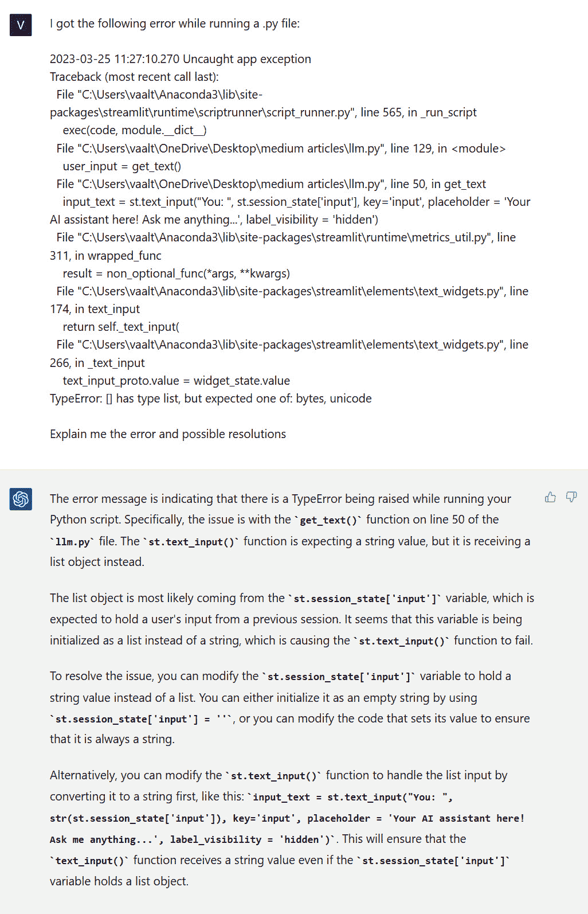

图 6.8 – ChatGPT 用自然语言解释 Python 错误

最后，让我们想象我写了一个函数，该函数接受一个字符串作为输入，并返回每个字母后面带有下划线的相同字符串。

在上面的例子中，我期望看到`g_p_t_`的结果；然而，实际上它只返回了这段代码中的`t_`：

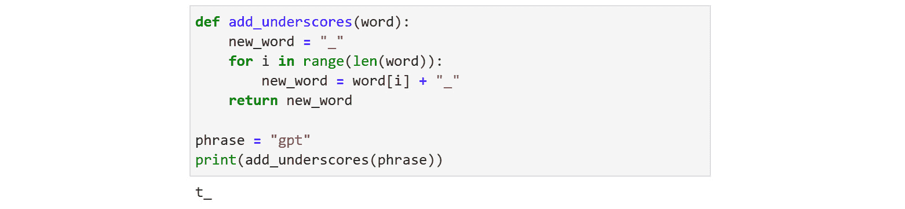

图 6.9 – 有错误的 Python 函数

让我们请 ChatGPT 为我们调试这个函数：

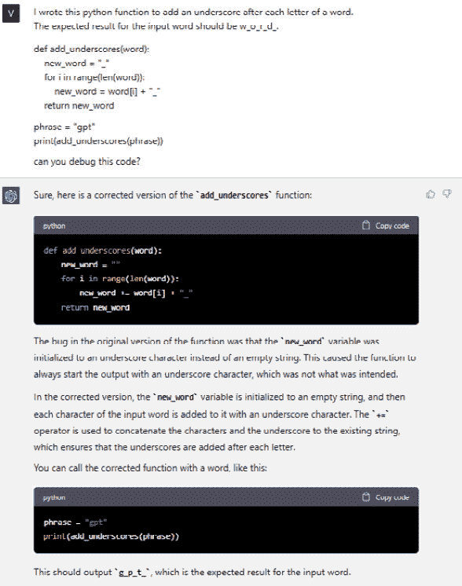

图 6.10 – ChatGPT 调试 Python 函数的示例

令人印象深刻，不是吗？再次，ChatGPT 提供了正确版本的代码，并帮助解释错误在哪里以及为什么导致不正确的结果。让我们看看现在是否可以工作：


图 6.11 – ChatGPT 调试后的 Python 函数

嗯，显然是这样的！

这些以及许多其他与代码相关的功能确实可以提高您的生产力，缩短执行许多任务所需的时间。

然而，ChatGPT 不仅仅局限于纯粹的调试。由于 GPT 模型背后的令人难以置信的语言理解能力，这个**人工智能**（**AI**）工具能够在代码旁边生成适当的文档，以及准确解释代码将做什么，我们将在下一节中看到。

# 生成文档和代码可解释性

在处理新应用程序或项目时，将代码与文档相关联始终是一个好的实践。这可以通过在函数或类中嵌入文档字符串的形式来实现，以便他人可以直接在开发环境中调用它们。

例如，以下 Python 类具有 10 个不同的方法用于基本数学运算：

```
class Calculator:
    def add(self, x, y):
        return x + y
    def subtract(self, x, y):
        return x - y
    def multiply(self, x, y):
        return x * y
    def divide(self, x, y):
        try:
            return x / y
        except ZeroDivisionError:
            print("Error: division by zero")
            return None
    def power(self, x, y):
        return x ** y
    def square_root(self, x):
        try:
            return x ** 0.5
        except ValueError:
            print("Error: square root of a negative number")
            return None
    def logarithm(self, x, base):
        try:
            return math.log(x, base)
        except ValueError:
            print("Error: invalid logarithm arguments")
            return None
    def factorial(self, x):
        if x < 0:
            print("Error: factorial of a negative number")
            return None
        elif x == 0:
            return 1
        else:
            return x * self.factorial(x-1)
    def fibonacci(self, n):
        if n < 0:
            print("Error: fibonacci sequence index cannot be negative")
            return None
        elif n == 0:
            return 0
        elif n == 1:
            return 1
        else:
            return self.fibonacci(n-1) + self.fibonacci(n-2)
```

您可以初始化该类并测试它如下（作为示例，我将使用加法方法）：

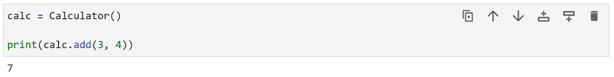

图 6.12 – 初始化 Python 类并使用其中一个方法

现在，假设我想能够使用`Calculator?`约定来检索文档字符串文档。通过这样做，对于 Python 包、函数和方法，我们可以得到该特定对象的全面文档，如下所示（`pandas` Python 库的示例）：

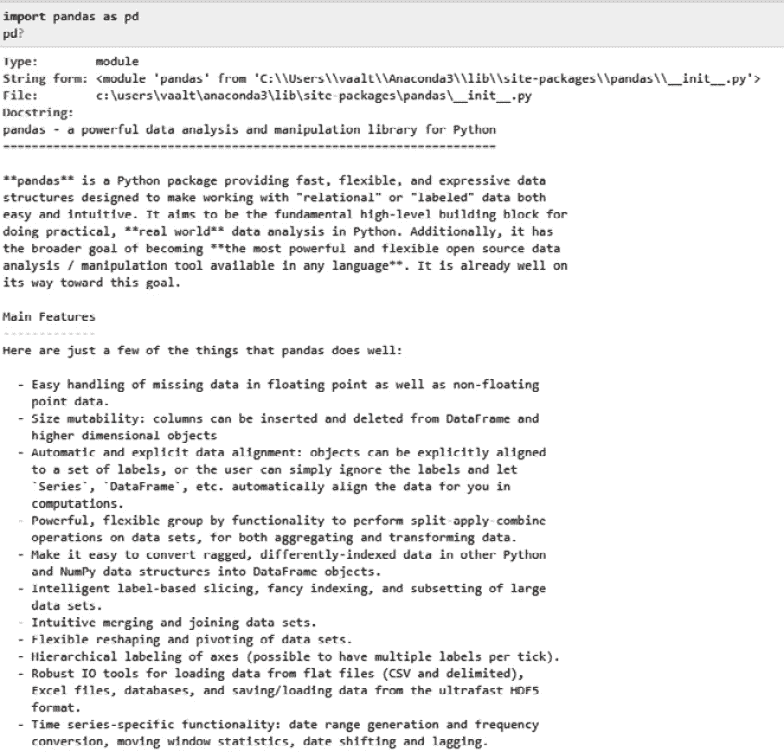

图 6.13 – pandas 库文档示例

现在，让我们请 ChatGPT 为我们的`Calculator`类生成相同的结果。

因此，在向 ChatGPT 提供`Calculator`类作为上下文之后，我要求它生成相关的文档如下：

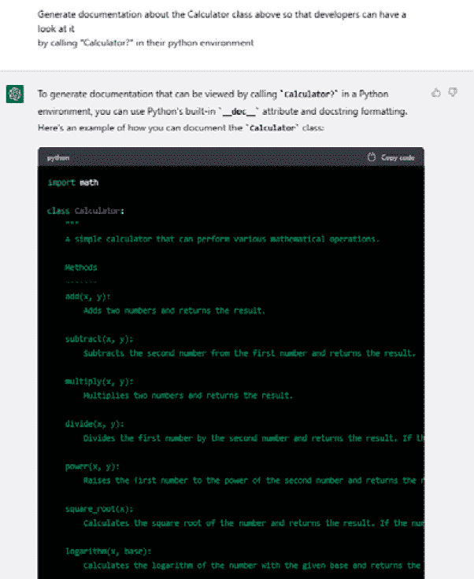

图 6.14 – ChatGPT 更新代码文档

您可以在本书的 GitHub 存储库中找到整个 ChatGPT 响应，网址为[`github.com/PacktPublishing/Modern-Generative-AI-with-ChatGPT-and-OpenAI-Models/blob/main/Chapter%206%20-%20ChatGPT%20for%20Developers/prompts`](https://github.com/PacktPublishing/Modern-Generative-AI-with-ChatGPT-and-OpenAI-Models/blob/main/Chapter%206%20-%20ChatGPT%20for%20Developers/prompts)。

因此，如果我们按照前面代码中所示更新我们的类，并调用`Calculator?`，我们将得到以下输出：

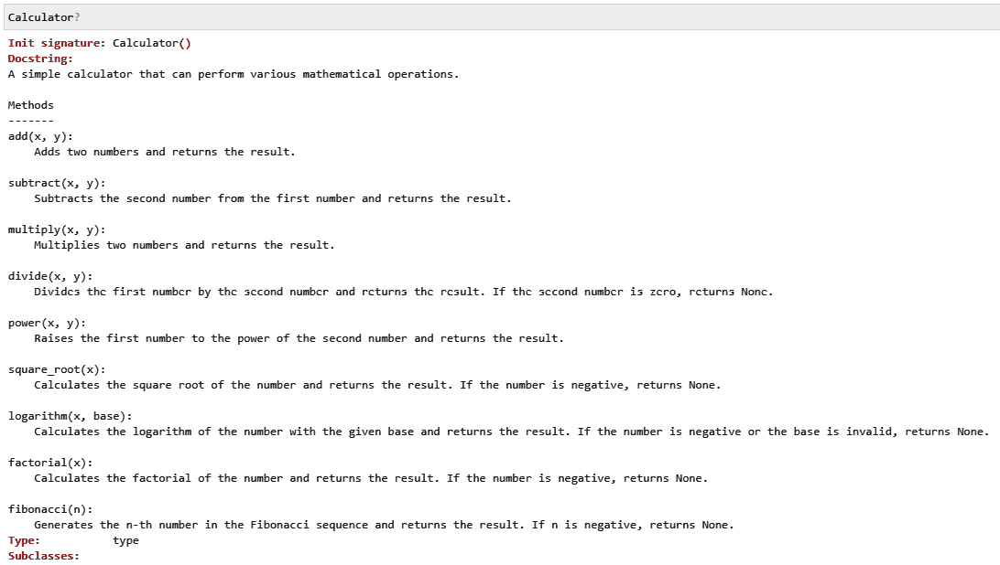

图 6.15 – 新的计算器类文档

最后，ChatGPT 还可以被利用来用自然语言解释脚本、函数、类或其他类似的内容所做的事情。我们已经看到 ChatGPT 用清晰的解释丰富了其与代码相关的响应的许多示例。然而，我们可以通过以代码理解为特定问题提出具体问题来增强这一能力。

例如，让我们请 ChatGPT 向我们解释以下 Python 脚本的作用：

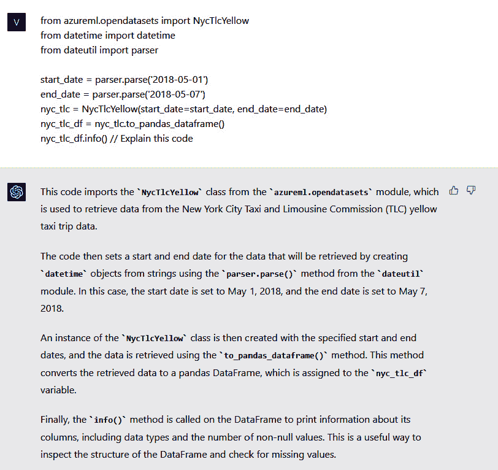

图 6.16 – ChatGPT 解释 Python 脚本的示例

代码可解释性也可以作为前述文档的一部分，或者可以在希望更好地理解来自其他团队的复杂代码的开发人员之间使用，或者（就像有时发生在我身上的）记住他们一段时间前写的东西。

由于 ChatGPT 和本节提到的能力，开发人员可以轻松地用自然语言跟踪项目生命周期，这样新团队成员和非技术用户更容易理解到目前为止所做的工作。

在下一节中，我们将看到代码可解释性是数据科学项目中机器学习模型可解释性的关键步骤。

# 理解机器学习模型可解释性

模型可解释性是指人类可以理解 ML 模型预测逻辑的程度。基本上，这是理解模型如何做出决策以及哪些变量有助于其预测的能力。

让我们看一个使用深度学习 `keras.datasets` 进行模型可解释性的示例：它包含 60,000 张 32x32 的彩色图像（因此是 3 通道图像），分为 10 类（飞机、汽车、鸟、猫、鹿、狗、青蛙、马、船和卡车），每类有 6,000 张图像。在这里，我将分享模型的主体部分；您可以在书的 GitHub 代码库中找到所有相关代码，用于数据准备和预处理：[`github.com/PacktPublishing/Modern-Generative-AI-with-ChatGPT-and-OpenAI-Models/tree/main/Chapter%206%20-%20ChatGPT%20for%20Developers/code`](https://github.com/PacktPublishing/Modern-Generative-AI-with-ChatGPT-and-OpenAI-Models/tree/main/Chapter%206%20-%20ChatGPT%20for%20Developers/code)。

```
model=tf.keras.Sequential()
model.add(tf.keras.layers.Conv2D(32,kernel_size=(3,3),activation='relu',input_shape=
(32,32,1)))
model.add(tf.keras.layers.MaxPooling2D(pool_size=(2,2)))
model.add(tf.keras.layers.Flatten())
model.add(tf.keras.layers.Dense(1024,activation='relu'))
model.add(tf.keras.layers.Dense(10,activation='softmax'))
```

上述代码由几个执行不同操作的层组成。我可能对模型的结构以及每个层的目的感兴趣。让我们向 ChatGPT 寻求帮助：

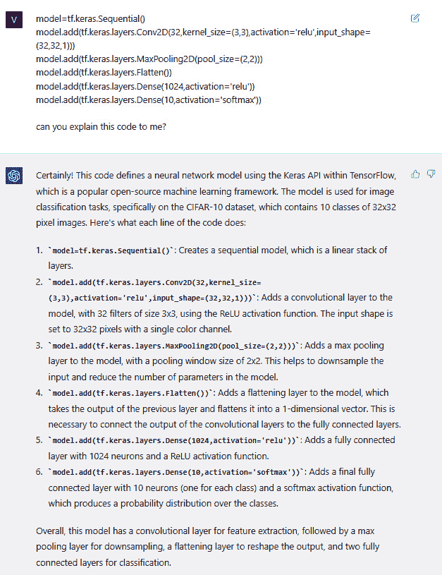

图 6.17 – 使用 ChatGPT 进行模型可解释性

正如您在上图中所看到的，ChatGPT 能够清晰地解释我们的 CNN 的结构和层次。它还添加了一些评论和提示，比如使用最大池化层有助于减少输入的维度。

我还可以通过 ChatGPT 在验证阶段解释模型结果。因此，在将数据分为训练集和测试集并在训练集上训练模型后，我想看到它在测试集上的表现：

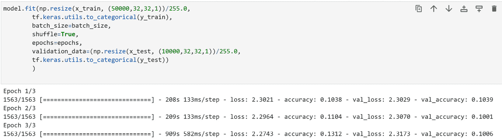

图 6.18 – 评估指标

让我们还请 ChatGPT 对我们的验证指标进行详细说明：

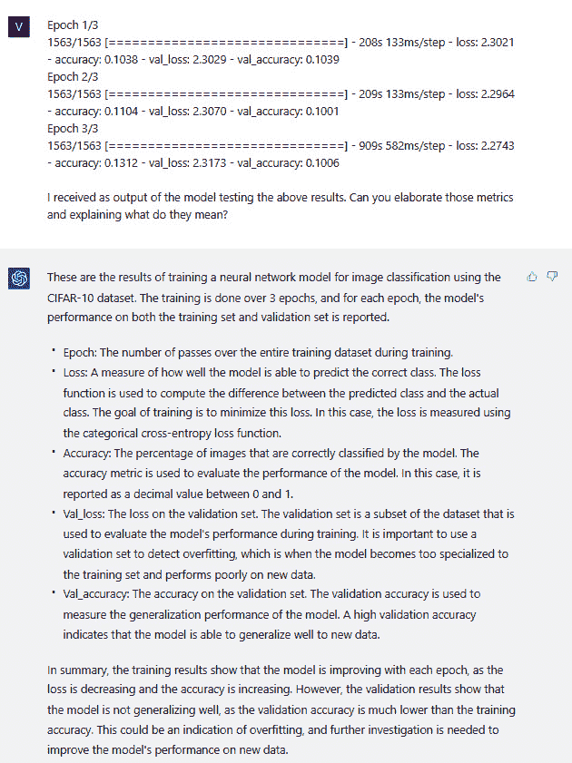

图 6.19 – ChatGPT 解释评估指标示例

再次，结果非常令人印象深刻，并清晰指导如何设置 ML 实验的训练和测试集。它解释了模型足够泛化的重要性，以便它不会过拟合，并能够在以前从未见过的数据上预测准确的结果。

模型可解释性之所以重要有很多原因。一个关键因素是它减少了业务用户与模型背后代码之间的差距。这对于使业务用户能够理解模型行为，并将其转化为代码业务理念至关重要。

此外，模型可解释性实现了负责任和道德人工智能的关键原则之一，即 AI 系统背后的模型思考和行为的透明性。解锁模型可解释性意味着检测模型在生产中可能存在的潜在偏见或有害行为，并因此防止它们发生。

总的来说，ChatGPT 在模型可解释性的背景下能够提供有价值的支持，通过在行级别生成见解，正如我们在上一个示例中所看到的。

接下来，我们将探讨 ChatGPT 的下一个并且也是最后一个能力，这将对开发人员的生产力产生更大的提升，尤其是在同一个项目中使用多种编程语言时。

# 不同编程语言之间的翻译

在*第五章*中，我们看到 ChatGPT 在不同语言之间具有很强的翻译能力。真正令人难以置信的是，自然语言并不是它唯一的翻译对象。事实上，ChatGPT 能够在不同的编程语言之间进行翻译，同时保持相同的输出以及相同的风格（即，如果存在文档字符串文档，它将保留该文档）。

在许多情况下，这可能是一个改变局面的游戏规则的场景。

例如，你可能需要学习一个之前从未见过的新编程语言或统计工具，因为你需要快速交付一个项目。有了 ChatGPT 的帮助，你可以开始使用你喜欢的编程语言，然后要求它翻译到你想要的语言，而你会在翻译过程中学会这门语言。

想象一下，项目需要在 MATLAB（由 MathWorks 开发的专有数值计算和编程软件）中交付，可你一直在 Python 中编程。该项目包括从**修改后的美国国家标准与技术研究所**（**MNIST**）数据集中对图像进行分类（原始数据集的描述和相关论文可以在此处找到：[`yann.lecun.com/exdb/mnist/`](http://yann.lecun.com/exdb/mnist/)）。该数据集包含许多手写数字，经常被用于教授各种图像处理系统。

首先，我编写了以下 Python 代码来初始化一个用于分类的深度学习模型：

```
import tensorflow as tf
from tensorflow import keras
from tensorflow.keras import layers
# Load the MNIST dataset
(x_train, y_train), (x_test, y_test) = keras.datasets.mnist.load_data()
# Preprocess the data
x_train = x_train.reshape(-1, 28*28) / 255.0
x_test = x_test.reshape(-1, 28*28) / 255.0
y_train = keras.utils.to_categorical(y_train)
y_test = keras.utils.to_categorical(y_test)
# Define the model architecture
model = keras.Sequential([
    layers.Dense(256, activation='relu', input_shape=(28*28,)),
    layers.Dense(128, activation='relu'),
    layers.Dense(10, activation='softmax')
])
# Compile the model
model.compile(optimizer='adam', loss='categorical_crossentropy', metrics=['accuracy'])
# Train the model
history = model.fit(x_train, y_train, validation_split=0.2, epochs=10, batch_size=128)
# Evaluate the model
test_loss, test_acc = model.evaluate(x_test, y_test, verbose=0)
print('Test accuracy:', test_acc)
```

现在让我们看看如果我们把前面的代码作为 ChatGPT 的上下文，并要求它将其翻译成 MATLAB 会发生什么：

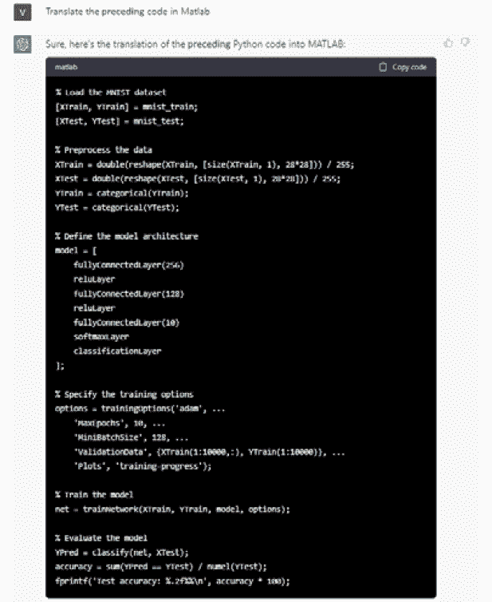

图表 20 – ChatGPT 将 Python 代码翻译成 MATLAB

让我们看看它是否能够将代码翻译成其他语言，比如 JavaScript：

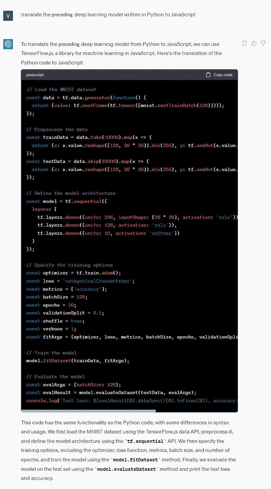

图表 6.21 – ChatGPT 将 Python 代码翻译成 JavaScript

代码翻译还可以减少新技术和当前编程能力之间的技能差距。

代码翻译的另一个关键影响是**应用现代化**。诚然，想象一下，你希望刷新你的应用程序堆栈，即迁移到云上。你可以决定从**基础设施即服务**（**IaaS**）实例（如 Windows 或 Linux **虚拟机**（**VM**））进行简单的搬迁。然而，在第二阶段，你可能希望重新构建、重新设计或甚至重建你的应用程序。

以下图表描述了应用程序现代化的各种选项：

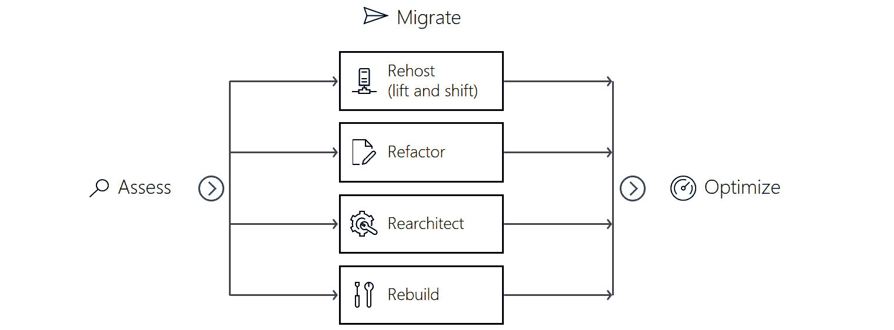

图 6.22 – 迁移应用程序到公共云的四种方式

ChatGPT 和 OpenAI Codex 模型可以帮助你进行迁移。例如考虑大型机。

大型组织主要使用大型机进行重要任务，如用于人口普查、消费者和行业统计、企业资源规划以及大规模事务处理的大规模数据处理。大型机环境的应用程序编程语言是**通用商业定向语言**（**COBOL**）。尽管 COBOL 在 1959 年发明，但今天仍在使用，是现存最古老的编程语言之一。

随着技术的不断改进，存储在大型机领域的应用程序一直在经历持续的迁移和现代化过程，旨在增强存在的遗留大型机基础设施的接口、代码、成本、性能和可维护性。

当然，这意味着将 COBOL 翻译成更现代的编程语言，比如 C#或 Java。问题在于，大多数新一代程序员不了解 COBOL；因此在这一背景下存在巨大的技能鸿沟。

让我们考虑一个读取员工记录文件并编写服务时间超过 10 年的员工报告的 COBOL 脚本：

```
IDENTIFICATION DIVISION.
PROGRAM-ID. EMPLOYEEREPORT.
ENVIRONMENT DIVISION.
INPUT-OUTPUT SECTION.
FILE-CONTROL.
    SELECT EMPLOYEE-FILE ASSIGN TO 'EMPLOYEE.DAT'
        ORGANIZATION IS LINE SEQUENTIAL.
    SELECT REPORT-FILE ASSIGN TO 'EMPLOYEEREPORT.TXT'
        ORGANIZATION IS LINE SEQUENTIAL.
DATA DIVISION.
FILE SECTION.
FD EMPLOYEE-FILE.
01 EMPLOYEE-RECORD.
    05 EMPLOYEE-ID     PIC X(10).
    05 HIRE-DATE       PIC 9(6).
    05 EMPLOYEE-NAME   PIC X(30).
FD REPORT-FILE.
01 REPORT-LINE         PIC X(80).
WORKING-STORAGE SECTION.
01 WS-CURRENT-DATE     PIC 9(6).
01 WS-EMPLOYEE-YEARS   PIC 9(2).
01 WS-REPORT-HEADER.
    05 FILLER          PIC X(30) VALUE 'EMPLOYEES WITH 10+ YEARS OF SERVICE'.
    05 FILLER          PIC X(10) VALUE SPACES.
    05 WS-REPORT-DATE  PIC X(6).
PROCEDURE DIVISION.
MAIN-PARAGRAPH.
    OPEN INPUT EMPLOYEE-FILE
    OPEN OUTPUT REPORT-FILE
    MOVE FUNCTION CURRENT-DATE TO WS-CURRENT-DATE
    MOVE WS-CURRENT-DATE(1:6) TO WS-REPORT-DATE
    WRITE REPORT-LINE FROM WS-REPORT-HEADER
    WRITE REPORT-LINE FROM SPACES
    PERFORM READ-EMPLOYEE UNTIL EMPLOYEE-FILE-STATUS = '10'
    CLOSE EMPLOYEE-FILE
    CLOSE REPORT-FILE
    STOP RUN.
READ-EMPLOYEE.
    READ EMPLOYEE-FILE
        AT END MOVE '10' TO EMPLOYEE-FILE-STATUS
    END-READ
    COMPUTE WS-EMPLOYEE-YEARS = FUNCTION INTEGER-OF-DATE(WS-CURRENT-DATE) - HIRE-DATE(1:6)
    IF WS-EMPLOYEE-YEARS >= 10
        WRITE REPORT-LINE FROM EMPLOYEE-RECORD
    END-IF.
```

我然后将之前的 COBOL 脚本传递给 ChatGPT，这样它就可以将其作为上下文来制定其响应。现在让我们要求 ChatGPT 将该脚本翻译成 JavaScript：

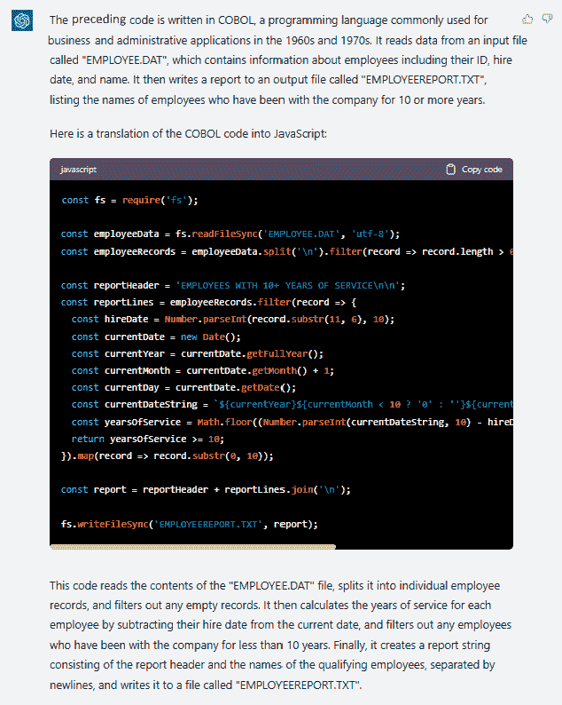

图 6.23 – ChatGPT 将 COBOL 翻译成 JavaScript 的示例

像 ChatGPT 这样的工具可以帮助减少这种以及类似场景中的技能鸿沟，引入了一个既懂得编程的过去又懂得未来的层。

总之，ChatGPT 可以成为应用现代化的有效工具，提供代码升级以及增强遗留系统的宝贵见解和建议。凭借其先进的语言处理能力和丰富的知识库，ChatGPT 可以帮助组织简化其现代化工作，使该过程更快、更有效率和更有效。

注

OpenAI Codex 模型是 GitHub Copilot 背后的引擎。这种新功能涵盖了本章中我们将看到的许多用例，比如代码生成、自动填充和代码优化。

# 总结

ChatGPT 可以成为开发人员寻求提升技能和简化工作流程的宝贵资源。我们首先看到了 ChatGPT 如何生成、优化和调试您的代码，但我们还涵盖了更多的功能，比如在您的代码旁边生成文档，解释您的 ML 模型，以及在不同编程语言之间进行翻译，用于应用现代化。

无论您是经验丰富的开发人员还是刚刚起步，ChatGPT 都为学习和成长提供了强大的工具，缩小了代码和自然语言之间的差距。

在下一章中，我们将深入探讨另一个应用领域，ChatGPT 可能成为游戏改变者的地方：营销。
