# 10

# 企业的热门用例

我们从概述当今市场上企业正在开发的 Azure OpenAI 最流行的用例开始本章。由于 Azure OpenAI 能够为复杂问题提供先进解决方案，因此它已被广泛应用于金融、医疗保健、零售和制造等各种行业。因此，我们必须了解 Azure OpenAI 模型对这些行业可能产生的影响程度，并保持竞争力。

为此，本章概述了 Azure OpenAI 在这些行业中的各种应用，包括改善客户体验、增强智能搜索和构建面向客户的聊天机器人。每个用例都将使用 Python、LangChain 或 Streamlit 作为前端进行端到端实现。

在本章中，我们将学习以下主题：

+   Azure OpenAI 在企业中的应用方式

+   分析和生成合同

+   理解呼叫中心分析

+   探索语义搜索

通过本章结束时，您将更深入地了解 Azure OpenAI 为企业开辟道路的用例。在这个数字发展时代，生成式人工智能技术正在呈指数增长，企业也以同样快的速度采用这些技术。了解这些技术及其应用为我们提供了理解市场并为未来做出调整的工具。

最后，您还可以使用 Python、LangChain、Streamlit 和您的 AOAI 实例开始自己的项目，以便跟随所涵盖的示例以及新的用例。

# 技术要求

本章的技术先决条件如下：

+   **Azure 订阅**，您可以在此处免费创建：[`azure.microsoft.com/free/cognitive-services`](https://azure.microsoft.com/free/cognitive-services)。

+   **访问 Azure OpenAI** 的 Azure 订阅。目前，只有通过申请才能获得访问此服务的权限。您可以通过填写 [`aka.ms/oai/access`](https://aka.ms/oai/access) 上的表格申请访问 Azure OpenAI。

+   Python 3.7.1 或更高版本。

+   以下 Python 库：`Openai`、`langchain,requests`、`json`、`os`、`pandas`、`numpy`、`streamlit`、`tiktoken` 和 `matplotlib`。

+   部署了模型的 Azure OpenAI 服务资源。在我的情况下，我部署了一个名为 `test1` 的实例，并关联了 `text-davinci-002`。

本章中显示的所有代码以及用于预处理和 `utils` 的脚本都可以在该书的 GitHub 仓库中找到：

[`github.com/PacktPublishing/Modern-Generative-AI-with-ChatGPT-and-OpenAI-Models/tree/main/Chapter%2010%20-%20Enterprise%20use%20cases`](https://github.com/PacktPublishing/Modern-Generative-AI-with-ChatGPT-and-OpenAI-Models/tree/main/Chapter%2010%20-%20Enterprise%20use%20cases)

所有的代码将使用 Python 编写。为了使用 Azure OpenAI 的大型语言模型，我将使用 LangChain，这是一个轻量级框架，使大型语言模型（LLMs）更易于在应用程序中使用。对于前端，我将使用 Streamlit，这是一个开源的 Python 库，可轻松构建和部署数据科学和机器学习项目的网络应用。它提供了一个简单直观的界面，用于创建交互式的数据驱动应用程序。

注

对于每种情况，从 Azure OpenAI 导出代码和 API 时，我还会设置一些值为预设参数，如`temperature`，`max_tokens`等等。关于这些参数及其含义的全面列表，请参考*第二章*，在*OpenAI 模型概述* *家族* 部分。

# 如何在企业中使用 Azure OpenAI

Azure OpenAI 正在迅速在大型企业中越来越受欢迎，作为推动创新和提高效率的强大工具。如今，许多公司正在利用这项技术的能力来简化他们的业务并获得竞争优势。

以下是按行业领域分组的一些例子：

+   **医疗保健**：AOAI 的语言模型可用于分析**电子健康记录**（**EHRs**）和医学文献，以帮助医生做出更明智的患者护理决策。

+   **金融**：AOAI 的模型可用于分析市场趋势并确定潜在的投资机会。它们还可用于欺诈检测，信用评分和客户服务自动化。

+   **零售**：AOAI 的模型可用于个性化客户体验和提供有针对性的产品推荐。它们还可用于库存优化，需求预测和供应链管理。

+   **媒体**：OpenAI 的模型可用于在多种语言中生成新闻文章，摘要和标题。它们还可用于内容审查，情感分析以及辨别假新闻。

还有许多其他例子。一个很好的例子是葡萄牙司法部在微软葡萄牙的支持下为其公民实施的服务：一个由`gpt-3.5-turbo`支持的聊天机器人，它是 ChatGPT 背后的模型，能够回答有关法律诉讼的问题。

这个聊天机器人被称为**司法访问实用指南**（**GPJ**），其目的是使普通人更容易了解法律程序中典型的复杂行话。

这是不同行业，包括政府，如何利用 Azure OpenAI 模型更有竞争力，以及为他们的客户或者人口提供更好的服务的一个很好的例子。

在接下来的段落中，我们将深入探讨具体的用例，以及使用 Python 逐步实现。

# 合同分析器和生成器

AOAI 的模型可以成为合同分析的有价值工具，帮助法律部门和合同管理员节省时间，避免潜在的法律问题。

律师和合同管理员可以借助他们的深度语言理解能力更深入地理解法律文件，减少争端和诉讼的风险，并确保合同准确反映了所有相关方的意图。

AOAI 在合同中的应用的一些例子如下：

+   **识别关键条款**：AOAI 的模型可以分析合同并识别关键条款，例如与终止、赔偿和保密有关的条款。这可以节省时间并确保在分析过程中考虑到所有重要的条款。

+   **分析语言**: AOAI 的模型可以帮助识别复杂的语言和法律术语，使律师更容易理解合同的意图和含义。这可以帮助避免后续的误解和争端。

+   **标记潜在问题**: AOAI 的模型可以帮助标记合同中的潜在问题，例如模糊的语言或冲突的条款。这可以帮助律师和合同管理员在它们变成重大问题之前解决这些问题。

+   **提供合同模板**: AOAI 的模型可以提供常见合同模板，例如保密协议或服务协议。这可以节省时间并确保合同一致且全面。

+   **协助合同审查**：AOAI 的模型可以通过突出显示需要关注或澄清的区域来协助审查流程。这可以帮助确保所有相关方保持一致，并且合同准确反映了所有相关方的意图。

我们将在 Python 中看到每个元素的一个示例，并且在本章结束时会有一个带有 Streamlit 的端到端实现。

## 识别关键条款

合同是任何商业或法律协议的组成部分，但可能很复杂且耗时。为了简化流程并确保考虑到所有重要条款，AOAI 的模型可以通过识别合同中的关键条款来辅助。这些关键条款可能包括与终止、赔偿、保密以及协议的其他关键方面相关的规定。

例如，假设一家公司正在审查与供应商提供服务的合同。合同包含多页的法律语言，使得识别对业务可能产生重大影响的重要条款成为挑战。通过使用 AOAI 模型，公司可以分析合同并识别与终止、赔偿和保密有关的关键条款。这将使公司能够专注于重要条款，并了解与其相关的潜在风险和收益。

这样，AOAI 的模型通过识别关键条款可以节省时间，减少疏忽的风险，并帮助企业在审查合同时做出明智的决定。

以下是一个服务提供合同的示例：


图 10.1 – 服务提供合同示例

假设我们想提取这份合同的终止条款。如*技术要求*部分所述，我部署了一个名为`test1`的`text-davinci-002`的简单实例。我还创建了一个名为`contract`的变量，其中存储了前述示例合同。然后，我定义了一个提示，询问我的模型有关终止条款的问题，如下所示：

```
response = openai.Completion.create(
  engine="test1",
  prompt= contract + " what is the termination clause?",
  temperature=0,
  max_tokens=1968,
  top_p=0.5,
  frequency_penalty=0,
  presence_penalty=0,
  best_of=1,
  stop=None)
print(response["choices"][0]["text"].strip())
```

这是输出结果：

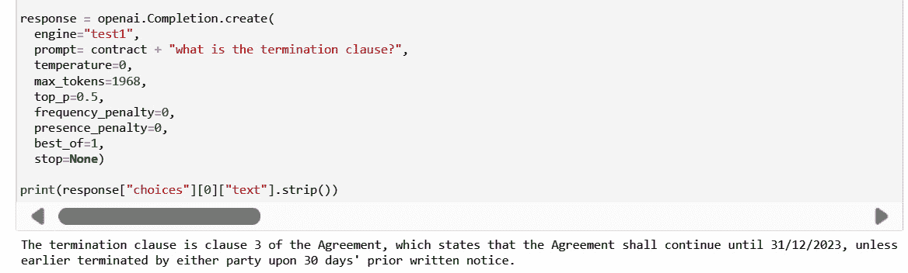

图 10.2 – 终止条款提取示例

我还可以设置一个对话，可以向我的模型提出关于条款的多个问题：

```
prompt = "<|im_start|>system\n" + contract + "\n<|im_end|>\n"
#print('AI Assistant: ' + prompt + '\n')
while True:
    query = input("you:")
    if query == 'q':
        break
    user_input = "<|im_start|>user\n" + query + "\n<|im_end|>\n<|im_start|>assistant\n"
    prompt+=user_input
    output = openai.Completion.create(
          engine="test1",
          prompt=prompt,
          temperature=0,
          max_tokens=2000,
          top_p=0.95,
          frequency_penalty=0,
          presence_penalty=0,
          stop=["<|im_end|>"])
    print('\n')
    print('AI Assistant: ' + output["choices"][0]["text"].strip() + '\n')
    response = output["choices"][0]["text"].strip() + "\n<|im_end|>\n"
    prompt+=response
```

这是它的响应：

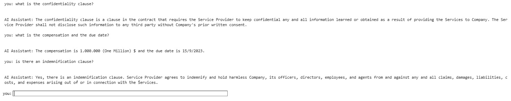

图 10.3 – 与 AOAI 模型的对话

这是一个简单的示例，涉及一个简短的合同。现在想象一下有很多页需要检查。AOAI 的模型肯定可以提供有价值的帮助，提取这些条款，并指导用户指向页面的部分，其中规定了条款，以便**主题专家**（**SME**）可以验证响应。

## 分析语言

在某些情况下，合同可能包含律师难以理解的高度技术或专业化语言。AOAI 的模型可以帮助识别这些术语，并清晰解释其含义，帮助律师更好地理解合同的意图和整体含义。通过确保所有各方清楚理解协议的条款和条件，可以避免潜在的误解和争议，为所有相关方节省时间和资源。

例如，想象一下在**碳捕集与储存**（**CCS**）背景下的合同。合同包含许多与 CCS 相关的技术术语，如*泄漏*、*MVA 技术*和*后燃烧捕集*。

没有 CCS 背景的律师审查合同时可能难以完全理解这些术语的含义和影响。通过使用 AOAI 的模型分析合同，律师可以快速识别这些技术术语，并清晰解释其含义。这将帮助律师更好地理解合同的意图，并确保所有各方达成一致。因此，后续误解和争议的可能性将大大降低。

让我们考虑以下示例合同的摘录：

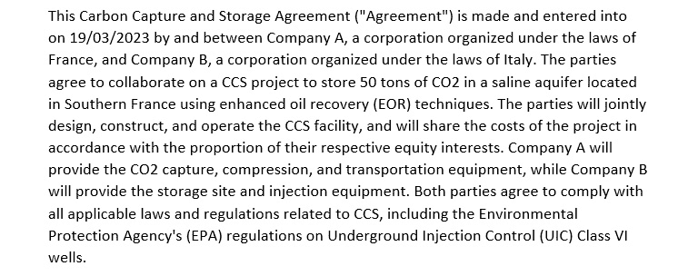

图 10.4 – 示例合同

正如您从前述的样本合同中所看到的，有许多术语，如果您不熟悉 CCS，更广义地说，不熟悉能源和环境工程，您可能会发现难以理解，也不容易理解它们所写的上下文。

幸运的是，AOAI 的模型不仅能够解释单个术语（与现有搜索引擎相比并没有什么新意），而且 – 更重要的是 – 能够解释这些术语*在使用的上下文中*。

为了证明这一点，让我们在与我们的 AOAI 模型进行交互式聊天中设置一些查询（在这种情况下，样本合同也已存储在`contract`变量中）：

```
prompt = "<|im_start|>system\n" + contract + "\n<|im_end|>\n"
#print('AI Assistant: ' + prompt + '\n')
while True:
    query = input("you:")
    if query == 'q':
        break
    user_input = "<|im_start|>user\n" + query + "\n<|im_end|>\n<|im_start|>assistant\n"
    prompt+=user_input
    output = openai.Completion.create(
          engine="test1",
          prompt=prompt,
          temperature=0,
          max_tokens=2000,
          top_p=0.95,
          frequency_penalty=0,
          presence_penalty=0,
          stop=["<|im_end|>"])
    print('\n')
    print('AI Assistant: ' + output["choices"][0]["text"].strip() + '\n')
    response = output["choices"][0]["text"].strip() + "\n<|im_end|>\n"
    prompt+=response
```

这是回应：


图 10.5 – 与 AOAI 模型关于合同的对话

正如您所看到的，该模型不仅能够详细解释技术概念（EPA），还能解释其使用的上下文。

多亏了 AOAI 的模型，技术上的、领域特定的行话和法律术语之间的鸿沟可以被缩小，甚至消除，这样律师或合同经理就可以专注于语义内容。

## 标记潜在问题

AOAI 在合同分析中可以发挥作用，通过利用其先进的**自然语言处理**（**NLP**）能力来识别可能导致歧义、不确定性或法律风险的条款和语言。例如，AOAI 的语言模型可以标记合同中可能导致争议或诉讼的模糊语言或冲突条款。它们还可以识别可能对一方或另一方不利的条款，例如限制责任、限制竞争或要求独家交易的条款。

让我们考虑以下例子。我们在 ABC 公司的法律办公室工作，为一批新员工制定雇佣协议。我们最近改变了招聘条款，因此这将是第一次制定这份协议。

我们最终完成了以下草案：

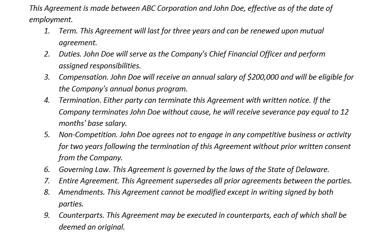

图 10.6 – 样本雇佣协议合同草案

我们希望确保没有歧义。为此，让我们请教我们的 AOAI 模型为我们标记它们。此外，在这种情况下，我部署了一个名为`test1`的简单`text-davinci-002`实例。我还创建了一个名为`contract`的变量，其中存储了前述的样本合同：

```
response = openai.Completion.create(
  engine="test1",
  prompt= contract + "Analyze this contract and tell me whether there might be some ambiguity or conflicting terms.",
  temperature=0,
  max_tokens=1968,
  top_p=0.5,
  frequency_penalty=0,
  presence_penalty=0,
  best_of=1,
  stop=None)
print(response["choices"][0]["text"].strip())
```

这是输出：

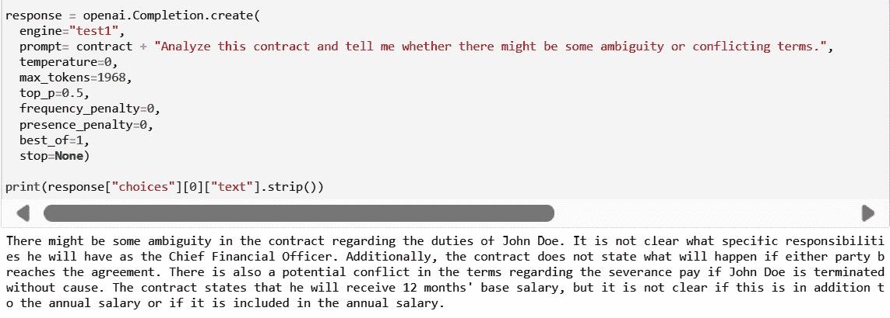

图 10.7 – 合同中歧义识别的示例

这是一个非常有用的见解，但我们可以走得更远。我们确实可以建立一个类似聊天机器人的环境，这样我就可以继续进行合同分析，并要求模型生成同一合同的修改版本，确保避免前述的歧义。

为此，我们需要确保在我们的 Python 代码中加入内存，因此我将使用一个带有`break`条件的`while`循环：

```
prompt = "<|im_start|>system\n" + contract + "\n<|im_end|>\n"
#print('AI Assistant: ' + prompt + '\n')
while True:
    query = input("you:")
    if query == 'q':
        break
    user_input = "<|im_start|>user\n" + query + "\n<|im_end|>\n<|im_start|>assistant\n"
    prompt+=user_input
    output = openai.Completion.create(
          engine="test1",
          prompt=prompt,
          temperature=0,
          max_tokens=2000,
          top_p=0.95,
          frequency_penalty=0,
          presence_penalty=0,
          stop=["<|im_end|>"])
    print('\n')
    print('AI Assistant: ' + output["choices"][0]["text"].strip() + '\n')
    response = output["choices"][0]["text"].strip() + "\n<|im_end|>\n"
    prompt+=response
```

注意

分类法是指我的起始和停止序列。这些使得回应在期望的点开始和结束，比如在句子或清单的末尾。在这种情况下，我确保助手在`user_input`后开始生成，并在每个回应的末尾添加一个停止序列。

运行上述代码时，我们将得到类似以下的输出：


图 10.8 - 用于检查和生成新合同的样本聊天

正如您所见，我的 AI 助手为我生成了一份新合同，并确保删除了模棱两可和矛盾的条款。请注意，我还要求模型解释现在合同没有模棱两可的原因，以确保我能够正确识别这些部分并验证它们：

```
you: explain why there are no ambiguities or conflicting terms now in this new contract
AI Assistant: There are no ambiguities or conflicting terms now because the "Duties" section is more specific about what John Doe's responsibilities will be, and the "Compensation" section makes it clear that John Doe will receive the annual bonus that he is expecting.
```

此外，AOAI 的模型可以识别可能不具有法律约束力的条款，例如那些违反反垄断法或公共政策的条款。

让我们考虑以下 ABC 和 XYZ 两家竞争公司之间的产品销售协议：

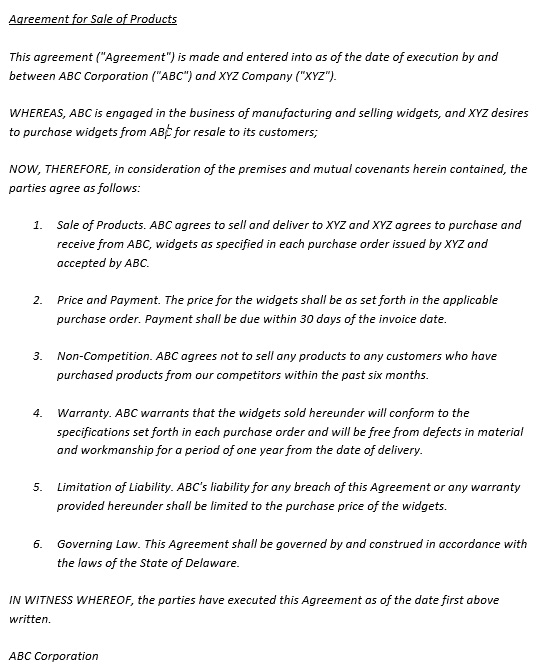

图 10.9 - 两家竞争对手公司之间的样本协议

现在，第 3 款包括可能会被解释为试图限制竞争的问题语言。公司需要仔细审查他们的合同，并确保他们没有参与可能违反反垄断法或其他法规的行为。

让我们看看我们的 AOAI 模型是否能够检测到：

```
response = openai.Completion.create(
  engine="test1",
  prompt= contract + "Analyze this contract and tell me whether there are clauses that might violate the antitrust laws. Make sure to highlight those clauses.",
  temperature=0,
  max_tokens=1968,
  top_p=0.5,
  frequency_penalty=0,
  presence_penalty=0,
  best_of=1,
  stop=None)
print(response["choices"][0]["text"].strip())
```

这是输出内容：

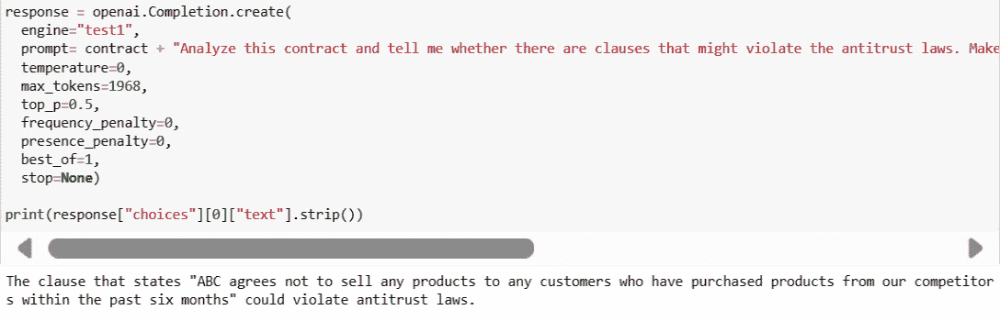

图 10.10 - 合同中潜在冲突条款的示例

在这种情况下，该模型能够检测潜在的与反垄断法冲突的条款。

通过利用 AOAI 模型分析合同语言的能力，公司可以确保符合法律标准，减轻法律和声誉风险，并促进市场公平竞争。

## 提供合同模板

在前面的段落中，我们看到了一个用于调整存在潜在问题的草案的合同生成器的示例。使用相同的模型，我们也可以进一步，并通过只提供一些参数，例如合同的终止日期或期限，从头生成合同草案。

为此，假设我们要生成一个服务交付协议的草案。我们需要提供的一些参数如下：

+   服务提供商

+   客户

+   服务描述

+   起始日期

+   时长

+   付款条件

+   终止通知

+   州或国家

为了要求我们的模型从头生成一份草案合同，我们需要构建一个参数提示如下：

```
service_provider = "Supplier ABC"
client = "Company XYZ"
services_description = "installation, configuration, and maintenance of Company's IT infrastructure"
start_date = "1/9/2023"
duration = "Three (3) years"
payment_terms = f"Within 30 days after receipt of an invoice from {service_provider}"
termination_notice = "30 days"
state = "Italy"
response = openai.Completion.create(
  engine="test1",
  prompt= f"Generate a Service Delivery Agreement with the following elements: Service Provider: {service_provider}, Client: {client}, Description of Services: {services_description}, Start Date: {start_date}, Duration: {duration}, Payment terms: {payment_terms}, Termination notice: {termination_notice}, State or Countries: {state}",
  temperature=0,
  max_tokens=1968,
  top_p=0.5,
  frequency_penalty=0,
  presence_penalty=0,
  best_of=1,
  stop=None)
print(response["choices"][0]["text"].strip())
```

这是输出内容：

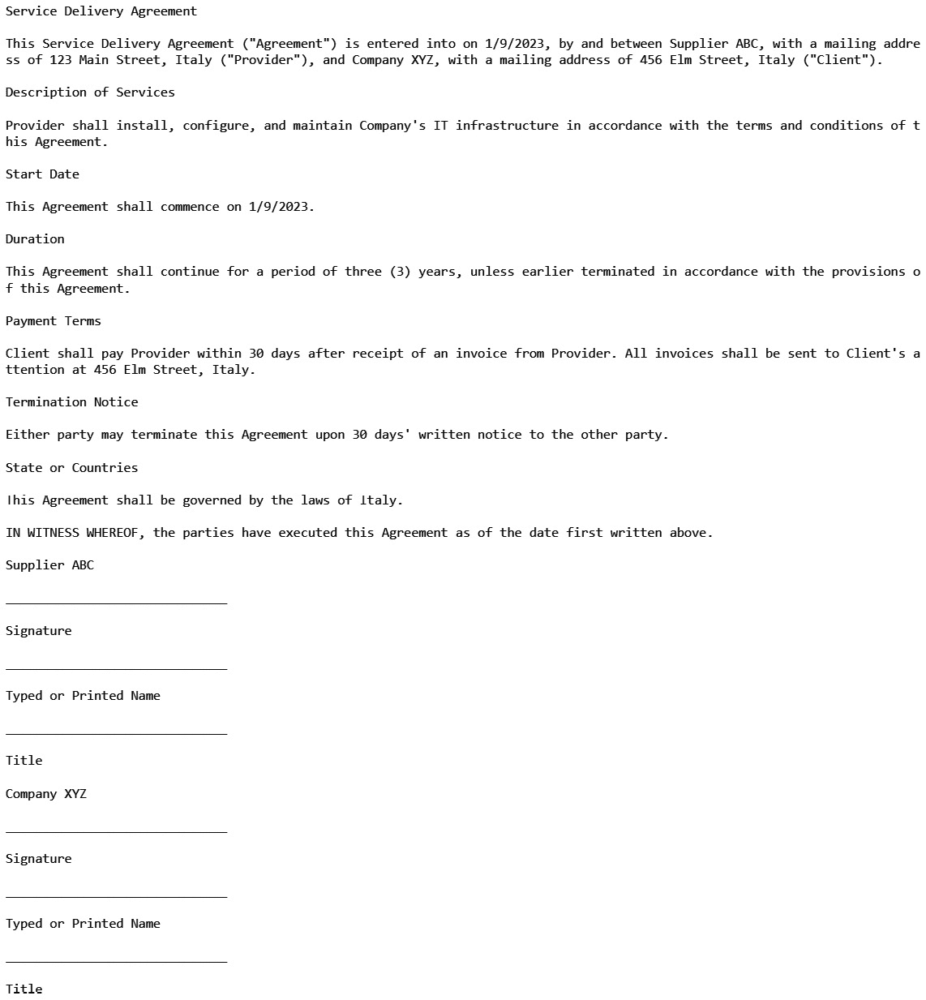

图 10.11 – 由 Azure OpenAI 模型生成的合同模板示例

正如你所看到的，只需输入几个内容，模型就能够创建一个漂亮的合同草案，包括签名和类似的形式。 这可以节省时间和金钱来制作初步草稿，然后可以用进一步的细节和参数来丰富它们，目的是作为类似协议的模板。

总之，AOAI 在协助法律专业人员分析合同方面有着巨大潜力，特别是在识别潜在问题和模棱两可性方面。 但是，必须注意到，机器学习模型永远不能取代法律分析的人为因素。 一个技艺娴熟的律师应该始终参与合同的审查和解释，以及最终的决策过程。 通过适当利用技术和人类专业知识，法律行业可以从合同分析的效率和准确性提高中受益。

## 使用 Streamlit 的前端

本节的想法是实施一个公司门户，律师和合同管理员可以访问他们需要分析的所有合同，并快速收集一些见解，例如识别关键条款，分析语言并标记潜在问题。

他们还可以要求门户从头开始生成一些合同模板，以用作生产就绪合同的草稿。

为此，我们将使用 Streamlit。 要连接到我的 AOAI 实例，我需要我的密钥和终结点，我已将它们存储在`.``toml`文件中。

与其他部分一样，你可以在 GitHub 仓库中找到整个应用程序文件：[`github.com/PacktPublishing/Modern-Generative-AI-with-ChatGPT-and-OpenAI-Models/tree/main/Chapter%2010%20-%20Enterprise%20use%20cases`](https://github.com/PacktPublishing/Modern-Generative-AI-with-ChatGPT-and-OpenAI-Models/tree/main/Chapter%2010%20-%20Enterprise%20use%20cases)。

给定对话的着陆页面（在本例中为我们的样本合同）如下所示：

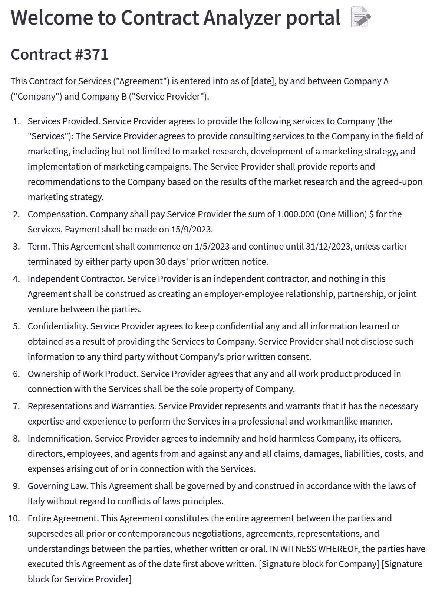

图 10.12 – 合同分析器应用的着陆页面

现在我们可以进行以下分析：

+   从下拉菜单中，我们可以选择要从合同中提取的关键条款的类型，并获得实时结果：

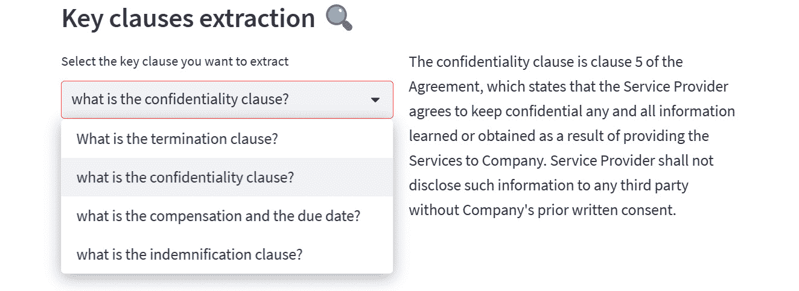

图 10.13 – 从示例合同中提取机密条款

+   我们还可以和 AOAI 的模型进行对话，询问技术术语的解释：

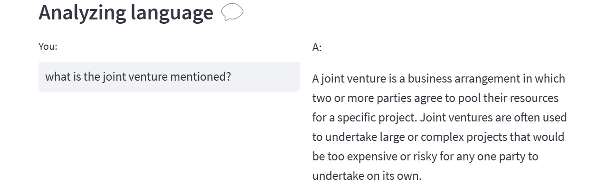

图 10.14 – 语言分析

+   我们还可以询问潜在问题：

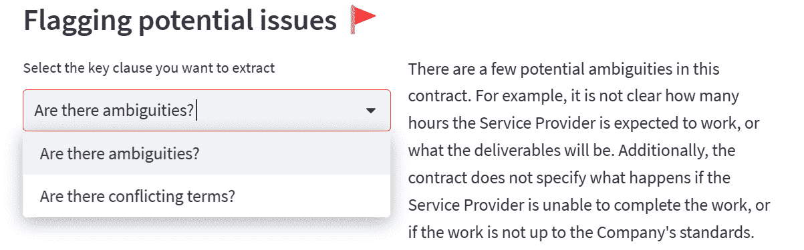

图 10.15 – AOAI 模型检测到的歧义示例

+   最后，我们还可以要求生成合同模板：

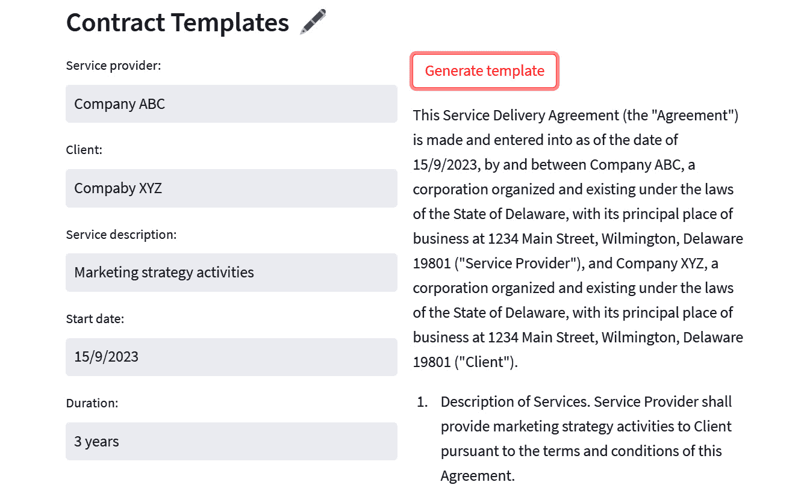

图 10.16 – 合同模板生成示例

这只是一个具有有限功能的示例应用，但由于 AOAI 模型的语言能力，它已经提供了一些强大的见解和分析。

在下一节中，我们将更深入地探讨 AOAI 模型在呼叫中心分析中的另一个应用。

# 理解呼叫中心分析

Azure OpenAI 可以成为呼叫中心分析的宝贵工具。通过分析客户和代理之间的通话记录，GPT 模型可以识别模式和见解，这可以帮助呼叫中心改善其运营。

以下是 AOAI 模型的一些示例能做的事情：

+   辨别常见问题并建议潜在的回复，可以帮助代理更快速、更有效地回答电话

+   分析客户互动中的情感，从而让呼叫中心经理们识别客户满意度不足的地方并做出必要的改进

+   提供通话量趋势、等待时间和通话持续时间的见解，让呼叫中心优化人员配备水平和资源分配

+   从对话中提取相关信息以自动在 CRM 中创建工单

+   为客户面向的聊天机器人提供相关的知识库，可以在切换到实际操作员之前解决更多的问题/索赔

借助其强大的 NLP 功能，AOAI 可以帮助呼叫中心提高其效率和效果，从而提高客户满意度和业务成果。

对于我们的示例情景，让我们假设我们是一家汽车保险公司。每天，我们收到大量的来自发生车祸并需要支持确定如何处理他们的保险的客户的电话。每次通话结束后，我们的操作员需要在我们的 CRM 上打开一个工单。

我们的目标是通过实施以下功能来简化整个流程：

+   从通话记录中提取相关参数以自动创建一个工单

+   获取对话的主要话题以将其分类到适当的类别

+   获取客户的情绪

+   生成应对特别棘手对话的指南

以下是这个的可视化表示：


图 10.17 – 呼叫中心分析的示例结构

为此，我将从我们公司的一个虚构对话的示例记录开始：

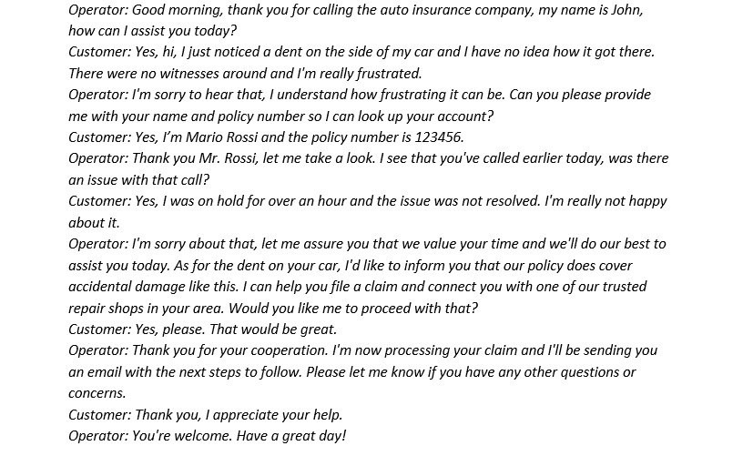

图 10.18 – 提出请求的虚假对话示例

然后，在这种情况下，我只需要一个部署我的 AOAI 实例，附带一个`text-davinci-002`实例。

在接下来的章节中，我们将学习如何从转录中提取相关参数，将其主要主题分类到各种类别中，分析客户的情感，并生成一个引导教程，以便于运营人员的回应。

## 参数提取

第一步是从转录中提取相关参数。如果我要自动创建一个包含适当信息的 CRM 票证，这一步就十分关键。例如，假设为了创建一个票证，我需要以下元素：

+   名字和姓氏

+   打电话的原因

+   保单编号

+   解决方案

以下代码展示了我们如何用 Python 实现（我初始化了一个名为`transcript`的变量，其值等于之前的谈话）：

```
response = openai.Completion.create(
  engine="test1",
  prompt= transcript + "Extract the following information from the above text:\n Name and Surname\nReason for calling\n Policy Number\n Resolution \n\n",
  temperature=1,
  max_tokens=1968,
  top_p=0.5,
  frequency_penalty=0,
  presence_penalty=0,
  best_of=1,
  stop=None)
print(response["choices"][0]["text"].strip())
```

这是相关输出：

```
Name and Surname: Mario Rossi
Reason for calling: Accidental damage to car
Policy Number: 123456
Resolution: The operator is processing the customer's claim and sending an email with next steps.
```

最后，让我们将这些信息转换成 JSON 文件，以便触发我们的票证创建。为此，我只需在提示中添加一行`输出格式应为 JSON`，正如你在这里的输出中看到的那样：

```
[
  {
    "name": "Mario Rossi",
    "reason_for_calling": "To file a claim for an accidental damage",
    "policy_number": "123456",
    "resolution": "The operator is processing the claim and will send an email with the next steps to follow."
  }
]
```

## 情感分析

我们可能想要了解的另一个元素是通话的情感。情感分析对呼叫中心分析非常重要，因为它帮助理解客户互动的情感色调。在前述的转录中，情感分析可以用来识别客户表达的沮丧和愤怒程度。这些信息对呼叫中心的经理来说是宝贵的，能够理解客户的整体满意度，并识别其服务中的改进领域。

例如，如果情感分析显示很多客户对电话等待时间感到沮丧，呼叫中心经理可以利用这些信息来改善其职员水平或投资于新技术以缩短等待时间。同样，如果情感分析显示客户通常对呼叫中心提供的服务感到满意，经理可以利用这些信息来识别卓越之处并建立在这些优势上。

我们唯一需要做的就是询问我们的 AOAI 实例谈话的情感是什么。

正如你所看到的，由于在谈话结束时，客户对客服服务感到满意，因此响应是积极的。然而，读了转录后，我们知道最初客户非常沮丧，因此我们可以对提示设计进行一些改进以获得更准确的结果：

```
response = openai.Completion.create(
  engine="test1",
  prompt= transcript + "What is the initial and final sentiment of the conversation?",
  temperature=1,
  max_tokens=1968,
  top_p=0.5,
  frequency_penalty=0,
  presence_penalty=0,
  best_of=1,
  stop=None)
print(response["choices"][0]["text"].strip())
```

这是输出：

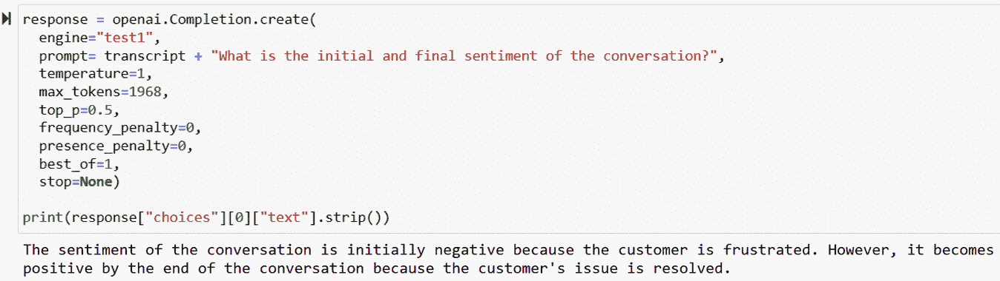

图 10.19 - 客户索赔情感分析示例

我们也可以进一步问它解释识别到的初始负面情感的原因：

```
response = openai.Completion.create(
  engine="test1",
  prompt= transcript + "why is the customer's sentiment initially negative?",
  temperature=1,
  max_tokens=1968,
  top_p=0.5,
  frequency_penalty=0,
  presence_penalty=0,
  best_of=1,
  stop=None)
print(response["choices"][0]["text"].strip())
```

这是输出：

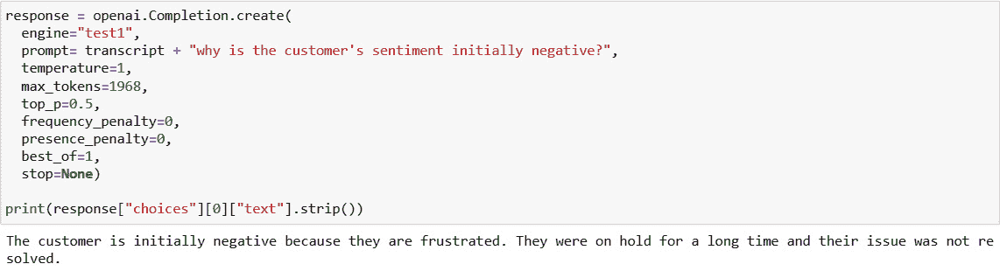

图 10.20 - AOAI 模型情感分析示例

这是重要信息，因为我们了解到我们的客户服务有改进的空间。我们可以将这种不满 - 在第一次通话时长时间无用的等待 - 与从其他对话记录中检索到的类似元素进行匹配，了解其是否是系统性的，如果是，如何改进。

为了我们的分析目的，我们进一步提取信息添加到我们的 JSON 文件中，以便我们还可以触发其他类型的操作（除了创建工单之外）。修改提示后，结果如下：

![图 10.21 – 从客户请求中提取的 JSON 示例]（img/Figure_10.21_B19904.jpg）

图 10.21 – 从客户请求中提取的 JSON 示例

## 客户请求的分类

在分析客户的请求时，首先将它们分类到适当的类别中非常有用，以便相关办事处可以更快地处理每个请求。在这里，您可以找到请求分类的三种常见类别：

+   **报告问题**：这种类别包括客户在报告其保单或账户存在问题或状况，但问题无法在通话中解决的对话记录。对话可能涉及代理记录问题并创建报告，以便适当部门调查和解决问题。示例可能包括报告账单错误或请求无法立即处理的保单更改。

+   **索赔处理**：这种类别包括客户对报告的问题和/或呼叫中心的服务表示不满或不满意。对话可能涉及客户分享他们的负面经验，而代理努力解决他们的顾虑，比如道歉长时间等待或提供解决方案。

+   **一般询问**：这种类别包括客户有关其保单或呼叫中心提供的其他服务的问题或查询的对话记录。对话可能涉及代理提供信息并回答客户的问题，而无需解决任何特定问题或投诉。

让我们请我们的 AOAI 实例为我们分类这段对话记录：

```
response = openai.Completion.create(
  engine="test1",
  prompt= transcript + "classify the above text in one of the following: reporting issue, claim handling and general inquiry.",
  temperature=1,
  max_tokens=1968,
  top_p=0.5,
  frequency_penalty=0,
  presence_penalty=0,
  best_of=1,
  stop=None)
print(response["choices"][0]["text"].strip())
```

这是输出：

![图 10.22 – 客户请求分类示例]（img/Figure_10.22_B19904.jpg）

图 10.22 – 客户请求分类示例

再次，我们可以通过更新上一个请求的提示，将这些信息添加到我们的 JSON 文件中。结果如下：

![图 10.23 – JSON 文件生成示例]（img/Figure_10.23_B19904.jpg）

图 10.23 – JSON 文件生成示例

很好，现在我们有大量的元数据作为我们对话记录的元数据。我们现在要做的是使用检索到的元素构建参数提示并生成进一步的操作，以尽快解决这项任务。我们将使用 Streamlit 来构建一个简单的前端来完成这项任务。

## 使用 Streamlit 实现前端

本节的想法是实现一个公司门户，操作员可以访问他们对话的所有剧本，并快速执行一些操作，如生成票证或向客户生成电子邮件回复。他们还可以向门户询问如何改进客户服务的建议（这些信息也可能在更高管理层中可用，以丰富公司改进的见解）。

要做到这一点，我们将使用 Streamlit。此外，在这种情况下，我正在创建一个`.toml`文件，其中包含我的 API，以便我可以在我的 Streamlit 应用程序中安全地调用我的机密。

如其他部分所述，您可以在本书的 GitHub 存储库中找到整个应用程序文件。

给定对话的着陆页（在本例中，我们的示例剧本）如下所示：

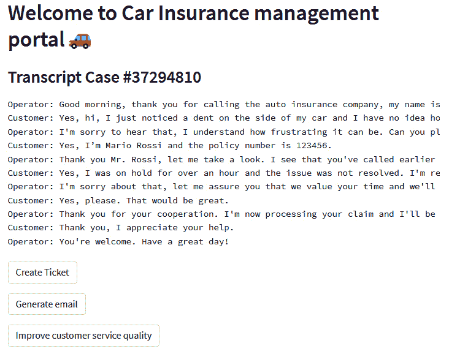

图 10.24 – 示例剧本着陆页

让我们看看我们的 AOAI 模型能为我们做哪些操作：

1.  我们作为操作员可以做的第一件事是根据从 JSON 文件中收集的信息创建一个票证：


图 10.25 – 用于生成票证的前端

1.  我们可以自动生成一封电子邮件给 Mario Rossi 先生，通知他解决流程的启动。为此，我定义了一个函数，要求我的 AOAI 实例使用参数提示生成电子邮件：

    ```
    def generate_email(transcript):
    ```

    ```
        response = openai.Completion.create(
    ```

    ```
          engine="test1",
    ```

    ```
          prompt= transcript + f"Generate a response email to the transcript above, notifying the customer that the ticket has been created and apologizing if it was complaining. The name of the customer is {data['name']} and the policy number is {data['policy_number']}.",
    ```

    ```
          temperature=1,
    ```

    ```
          max_tokens=1968,
    ```

    ```
          top_p=0.5,
    ```

    ```
          frequency_penalty=0,
    ```

    ```
          presence_penalty=0,
    ```

    ```
          best_of=1,
    ```

    ```
          stop=None)
    ```

    ```
        return response["choices"][0]["text"].strip()
    ```

在这里，`data`是从剧本中提取的 JSON **商业智能** (**BI**)，如前几节所示。

前端将如下所示：

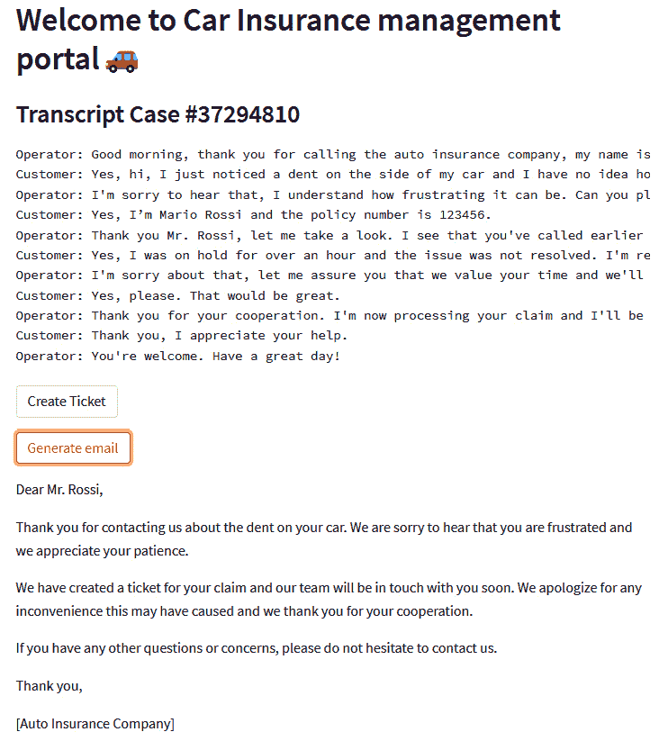

图 10.26 – AOAI 生成的示例电子邮件

1.  最后，我们可以要求改进解决方案流程和客户满意度的建议。此外，在这种情况下，我使用了一个参数提示：

    ```
    def improvement(data):
    ```

    ```
        response = openai.Completion.create(
    ```

    ```
          engine="test1",
    ```

    ```
          prompt= f"Elaborate a list of remediations to get to the following improvement: {data['contact_center_improvement']}",
    ```

    ```
          temperature=1,
    ```

    ```
          max_tokens=1968,
    ```

    ```
          top_p=0.5,
    ```

    ```
          frequency_penalty=0,
    ```

    ```
          presence_penalty=0,
    ```

    ```
          best_of=1,
    ```

    ```
          stop=None)
    ```

    ```
        return response["choices"][0]["text"].strip()
    ```

在这里，`data`仍然是从剧本中提取的 JSON 文件，如前几节所示。

前端将如下所示：

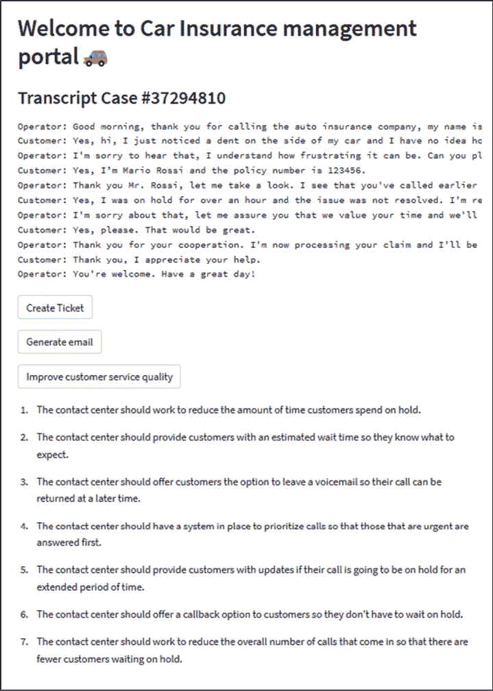

图 10.27 – AOAI 生成的呼叫中心改进建议

这只是一个具有有限功能的示例应用程序，但它已经提供了一些强大的自动化和见解，可以提升呼叫中心的生产力和客户满意度。

这是我们想象中的汽车保险公司应该在生产环境中添加的一些进一步元素：

+   他们的 CRM 软件中用于自动生成票证的自动触发器。

+   基于呼叫中心剧本训练的面向客户的聊天机器人，以便只有在过去未解决的情况下才会与操作员通话。

+   **商业智能** (**BI**) 仪表板，汇集相关剧本见解。例如，关于以下内容的一些统计信息：

    +   抱怨最常见的原因

    +   通话时段的情感分布

    +   类别随时间的频率

有了这一点我们已经了解了如何进行情感分析的提取。我们看到了我们如何与顾客的请求进行交流以及使用 Streamlit 作为前端的概念。所有这些都帮助我们更好地与利益相关者合作并提高运营效率。

# 探索语义搜索

语义搜索是一项领先的搜索技术，彻底改变了人们在网上查找信息的方式。在企业界，它已成为需要快速而准确地搜索大量数据的企业的重要工具。语义搜索引擎使用自然语言处理（NLP）技术来理解搜索查询和被搜索内容的含义。这项技术通过使用机器学习算法来理解搜索查询的上下文，比传统的基于关键字的搜索引擎能够得到更准确和相关的结果。

语义搜索的一个关键组成部分是嵌入的使用，这是将单词或短语表示为数值向量的过程。这些向量是由一个神经网络生成的，该神经网络分析给定文本语料库中每个单词或短语的上下文。通过将单词转换为向量，可以更容易地衡量单词和短语之间的语义相似性，这对准确的搜索结果至关重要。

例如，在医疗文件和论文领域，嵌入可以用于通过更轻松地识别相关概念和主题来增强语义搜索算法。举例来说，如果一位研究人员正在搜索有关癌症治疗的信息，使用嵌入的语义搜索引擎可以识别出类似化疗、放射疗法和免疫疗法等相关术语。通过理解这些术语之间的语义关系，搜索引擎可以返回更准确和相关的结果。

嵌入还可用于识别与搜索查询中未能立即显现的相关主题和概念。例如，如果一位研究人员正在搜索有关乳腺癌的信息，使用嵌入的语义搜索引擎可以识别出与乳腺癌相关的主题，如乳腺癌预防、乳腺癌筛查和荷尔蒙疗法。对于与乳腺癌相关的主题和概念的更广泛理解可以帮助研究人员找到他们通过传统关键字搜索可能无法发现的相关论文和文档。

举例来说，我们假设以下情景。我们是一家私人诊所，每天都在努力在大量的可用文档中查找信息。为了做出诊断，医生们需要查阅许多论文，这非常耗时。

我们正在寻找一个可以在研究过程中帮助我们的人工智能研究助手。为此，我们将使用一个名为`embedding`并有关联的`text-embedding-ada-002`模型的 Azure OpenAI 部署。

思路如下：

1.  使用嵌入模型获取可用文本的嵌入。

1.  使用嵌入模型获取用户查询的嵌入。

1.  计算嵌入查询和嵌入知识库之间的距离。

1.  返回最相似的文本片段并将它们用作 GPT 模型的上下文。

1.  使用 GPT 模型生成响应。

这在这里表示：

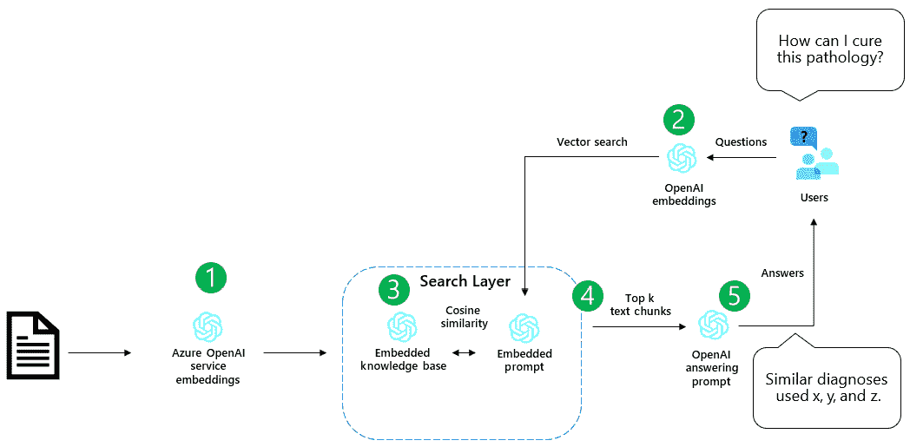

图 10.28 – 语义搜索项目的参考架构

为了模拟知识库，我们将使用一篇关于坐骨神经痛替代治疗的论文（您可以在[`doi.org/10.1136/bmj-2022-070730`](https://doi.org/10.1136/bmj-2022-070730)找到）。

对于嵌入和问答管理，我们将使用 LangChain 模块。

## 使用 LangChain 模块进行文档嵌入

我们项目的第一步是初始化一个嵌入模型，以便我们可以对自定义文档进行向量化。为此，我们可以使用 LangChain `OpenAIEmbeddings` 模块，该模块直接包装了来自 Azure OpenAI 的嵌入模型：

```
from langchain.embeddings import OpenAIEmbeddings from langchain.chat_models import AzureOpenAI
from langchain.embeddings import OpenAIEmbeddings
from langchain.vectorstores.faiss import FAISS
from pypdf import PdfReader
from langchain.document_loaders import PyPDFLoader
  embeddings = OpenAIEmbeddings(document_model_name="text-embedding-ada-002") embeddings.embed_query('this is a test')
```

这是它的输出：

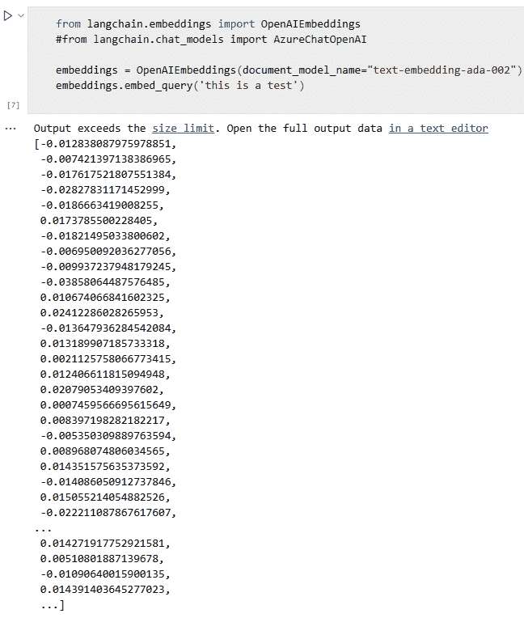

图 10.29 – 文本嵌入示例

正如您所见，结果是一个数值向量，使用`text-embedding-ada-002`嵌入模型计算得出。

现在，我们需要对整个文档进行向量化。此外，我们还需要存储空间来存放文档。LangChain 提供了几种向量存储方式，我们将使用 FAISS 向量存储。

因此，让我们初始化我们的 FAISS 索引器：

```
loader = PyPDFLoader("path_to_file") pages = loader.load_and_split() faiss_index = FAISS.from_documents(pages, embeddings)
```

太棒了，现在我们可以使用`AzureOpenAI`类初始化我们的模型。为此，我们只需要传递部署的名称：

```
llm = AzureOpenAI(deployment_name="text-davinci-003")
```

最后，我们需要计算用户提示和嵌入知识库之间的相似性。为此，让我们初始化以下函数：

```
def get_answer(index, query):     """Returns answer to a query using langchain QA chain"""      docs = index.similarity_search(query)      chain = load_qa_chain(llm)     answer = chain.run(input_documents=docs, question=query)      return answer
```

通过上述函数，我们正在计算用户提示和嵌入文档之间的语义亲和性。通过这样做，只有与用户提示具有高相似性的文本块将被用作我们 Azure OpenAI 模型的上下文，以便我们可以克服最大标记数的限制。

## 为 Streamlit 创建前端

我们已经创建了我们语义搜索引擎背后的逻辑；现在是时候创建一个前端，以便用户可以通过 UI 与其交互。为此，我将使用 Streamlit。

同样，在这种情况下，我正在创建一个`.toml`文件与我的 API，以便我可以在我的 Streamlit 应用程序中安全地调用我的秘密。

为此，让我们创建一个包含与前一节中相同代码的`.py`文件，同时添加一些前端元素（您可以在 GitHub 存储库中找到整个`.py`文件）。

更具体地说，我已经添加了以下指令来创建一个简单的搜索栏：

```
query = st.text_area("Ask a question about the document")
if query:
    docs = faiss_index.similarity_search(query, k=1)
    button = st.button("Submit")
    if button:
        st.write(get_answer(faiss_index, query))
```

然后，我将文件保存为`medical_smart_search_app.py`，并通过 Anaconda Prompt 使用`streamlit run` `smart_search.py`命令运行它。

结果如下所示：

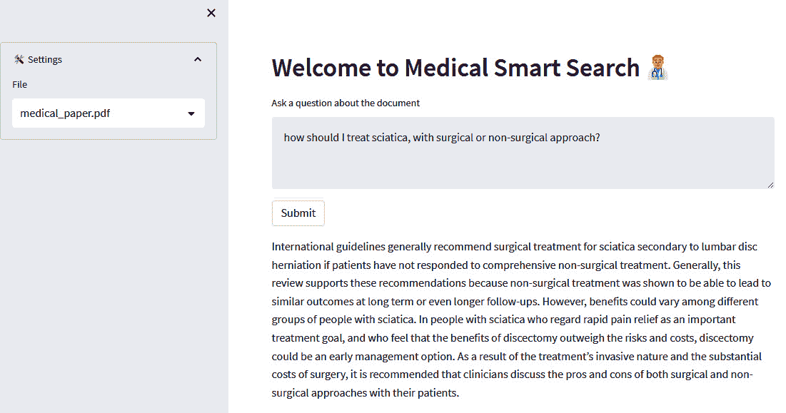

图 10.30 – 带有 Streamlit 和 AOAI 后端的示例前端

您可以决定将一些其他元素添加到您的搜索引擎中，例如以下内容：

+   指示 AOAI 模型在上下文中没有答案时不予回应。要做到这一点，您可以在提示中指定。

+   除了响应之外，还提供上下文的原始文本和链接（如果有的话），指向它所在页面的链接。

+   保留 AOAI 的响应和下一个用户提示的附加上下文，以便它也通过少量学习保留记忆。

我们看了一个医疗文档的示例；然而，有许多领域可以使用语义搜索引擎，从法律实体到拥有大量技术文档的制造商。

总的来说，在组织内部拥有智能搜索系统不仅减少了搜索时间，还提供了许多可能包含部分响应的文档的摘要响应。

在类似情况下（尤其是医疗或法律领域），需要一个人来验证结果。尽管如此，拥有这样的人工智能助手可以提高生产力，减少搜索成本和时间，提高搜索质量，并实现对罕见文档的查找。

# 总结

Azure OpenAI 模型提升了企业级大型语言模型的能力，并有潜力在广泛的行业中彻底改变企业运营。

通过利用最先进的自然语言处理技术，企业可以自动化琐碎任务，优化复杂流程，并从数据中获取有价值的见解。

在本章中，我们通过 Python 的逐步教程以及 Streamlit 的前端，查看了合同分析和生成、呼叫中心分析以及用于自定义知识库的语义搜索等领域的具体用例。

当然，成功整合 Azure OpenAI 模型需要战略性方法，包括确定相关的用例、选择适当的工具和平台，并投资于员工培训和发展。随着人工智能领域的不断发展，企业必须与最新的趋势和创新保持同步，以保持竞争力并实现 Azure OpenAI 的全部好处。

本章提到的内容只是大型语言模型的用例中的一小部分：这将是本书的下一章，也是最后一章的主题，在那里我们将总结迄今为止所见的一切，并揭示人工智能发展的未来将为市场带来什么。

# 参考文献

+   [`python.langchain.com/en/latest/index.xhtml#`](https://python.langchain.com/en/latest/index.xhtml#)

+   [`www.aroged.com/2023/02/17/chatgpt-ministry-of-justice-will-use-gpj-to-respond-to-citizens-in-portugal/`](https://www.aroged.com/2023/02/17/chatgpt-ministry-of-justice-will-use-gpj-to-respond-to-citizens-in-portugal/)
