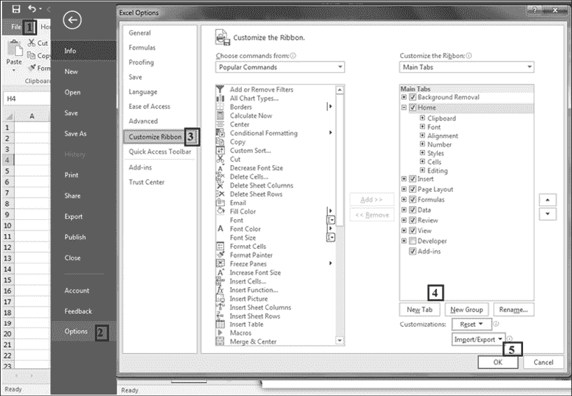
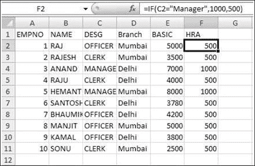
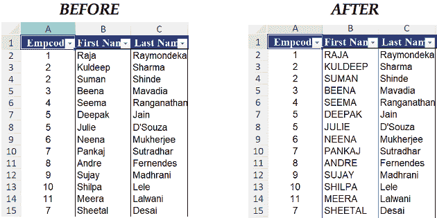
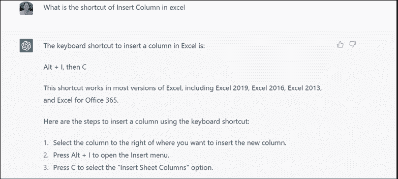

# （一）

# 前言

欢迎阅读我的书！在这本全面指南中，我们将探索 Excel、Visual Basic for Applications（VBA）和 ChatGPT 这三大强大工具的结合。这些工具结合了数据分析、自动化和对话式人工智能的力量，让您在信息处理和决策领域更具实力。

在这些页面中，您将获得实用知识，实际示例和逐步说明，以掌握 Excel 的数据操作能力，解锁 VBA 的自动化和定制潜力，并深入 ChatGPT 的自然语言交互世界。

无论您是初学者想要了解基础知识，还是经验丰富的用户希望提升技能，本书都将成为您在这些领域脱颖而出的路线图。它将引导您了解 Excel 的基础知识，介绍您 VBA 编程的世界，并向您展示如何将 ChatGPT 集成到您的应用程序中，进行动态和智能对话。

在本书结束时，您将具备知识和信心，可以利用 Excel、VBA 和 ChatGPT 的综合功能来简化工作流程，自动化重复任务，并进行智能数据驱动对话。

加入我，一起踏上这激动人心的旅程，探索 Excel、VBA 和 ChatGPT 的无限可能性。让我们释放您的潜力，革新您对数据处理和分析的方法。以下是各章节的简要概述。

第一章：Excel 2021 概述 – 提供 Microsoft Excel 2021 的概述。它介绍了新的简洁界面，并探索了 Excel 窗口的不同组件。本章强调了在线保存和共享文件的能力，以及自定义功能区和更改默认设置的选项。它还涵盖了格式化表格，使用粘贴特殊预览功能，并利用闪填进行高效数据输入。此外，本章还涉及 Excel 的即时数据分析能力。

第二章：单元格引用和区域 – 专注于单元格引用和命名区域。它解释了使用不同类型引用的重要性，并介绍了 Excel 中可用的各种单元格引用类型。本章还涵盖了命名区域的概念，允许用户为特定单元格范围分配名称以便更容易引用。本章以练习结束，以巩固所学概念。

第三章：使用公式和函数 – 专注于使用公式和函数。它首先解释了工作表中公式的用途，并介绍了数组公式的概念。该章涵盖了 Excel 中可用的各种函数，包括 IF 函数及其变体，如嵌套 IF、带 AND 的 IF、带 OR 的 IF 和带 NOT 的 IF。它还涵盖了像 VLOOKUP 和 HLOOKUP 这样的查找函数，并提供了使 VLOOKUP 动态化的见解。该章以 INDEX 和 INDEX-MATCH 函数的用法结束。通过练习，读者可以练习并巩固他们对 Excel 中公式和函数的理解。

第四章：数据验证 – 探讨了数据验证的主题。它首先解释了设置数据验证规则以确保数据的准确性和完整性的重要性。该章涵盖了各种数据验证方法，包括设置数据输入的标准、创建自定义验证规则以及使用预定义验证选项。通过练习，读者有机会练习实施数据验证技术。

第五章：保护 – 讲解了保护。它解释了如何使用密码保护工作表、保护工作簿、保护工作表的特定部分以及为文件设置密码保护。通过按照本章的说明操作，用户可以为其 Excel 文件应用各种级别的保护，以增强安全性。

第六章：数据库排序 – 专注于数据库排序。它涵盖了不同的排序方法，包括简单排序、多级排序和自定义排序。排序使用户可以按照期望的顺序组织数据，从而更容易地分析和处理大量信息。通过理解本章中解释的技术，用户可以根据特定标准高效地对其数据进行排序。

第七章：数据库过滤 – 讲解了数据库过滤的主题。它解释了如何使用自动筛选功能根据特定条件（如数字、文本或日期）筛选数据。该章还介绍了高级筛选的概念，允许用户使用更复杂的条件对列表进行筛选。此外，它探讨了筛选唯一记录的技巧。通过应用本章所学的知识，用户可以有效地从他们的数据库中筛选和提取相关数据，以满足其特定需求。

第八章：小计和数据合并 – 重点介绍小计和数据合并。解释了如何使用小计功能以单个级别或嵌套格式显示小计值。这使用户能够有效地汇总和分析数据。本章还涵盖了数据合并，即将来自多个源的数据合并到单个工作表中。通过掌握这些技巧，用户可以轻松组织和分析数据，使其更易管理和有意义。

第九章：数据透视表 – 深入研究了数据透视表，这是一种用于数据分析的多功能工具。涵盖了创建和检查数据透视表，包括使用推荐的数据透视表进行快速生成。本章演示了数据透视表报告中的格式设置选项以及字段百分比的计算。还探讨了创建顶部/底部报告、分组项目和使用数据透视表数据生成图表等高级功能。其他主题包括使用切片器和时间线进行过滤，以及使用 Power View 和 Power Pivot 进行增强的数据分析和建模能力。

第十章：条件格式设置 – 包括基于单元格值和公式的条件格式设置，以及图标集。探讨了使用具有多个条件的公式和跨不同工作表应用条件公式等高级技术。

第十一章：假设分析 – 介绍了 Excel 中的假设分析工具，包括目标搜索、数据表以及创建假设场景。还涵盖了从另一个工作表合并场景和保护场景以确保数据完整性的内容。

第十二章：多工作表、工作簿和应用程序操作 – 探讨了在 Excel 中处理多个工作表、工作簿和应用程序的操作。涵盖了在不同工作表和软件之间创建链接、促进工作组协作、合并工作簿和跟踪更改。还讨论了创建超链接以便在工作簿内进行轻松导航的方法。

第十三章：图表操作 – 专注于在 Excel 中操作图表。涵盖了使用图表工具创建图表，包括标题和数值，并格式化以增强外观。本章还探讨了使用图表模板进行一致的图表设计，并提供了有效使用图表的建议。此外，介绍了嵌入单元格中的小图表——迷你图，并解释了如何自定义它们的外观和样式。本章以练习巩固所学概念。

第十四章：在 VBA 中创建和记录宏 – 探讨了 Excel 中宏的概念，即自动化重复任务的一系列指令。它涵盖了创建宏的过程，从记录一系列操作开始，定义宏的名称和描述。本章还介绍了相对引用宏的概念，适应不同的单元格引用。它解释了如何停止录制，并以点击按钮或按其分配的名称运行宏的说明结束。总体而言，本章全面概述了宏及其在 Excel 中的应用。

第十五章：为宏分配按钮 – 专注于在 Excel 中创建菜单或按钮以增强用户交互和简化工作流程。它涵盖了修改现有菜单或按钮的过程，以及直接在 Excel 工作表上创建自定义按钮。本章还提供了有关编辑记录的宏以完善其功能和外观的指导。通过实际练习，读者可以获得创建和定制菜单和按钮以满足其特定需求的实践经验。

第十六章：VBA 中的函数和子程序 – 介绍了 Excel 的 VBA 编程中函数和子程序的概念。它解释了两者之间的区别，并指导读者在使用 Visual Basic Editor 编写模块内的代码。本章还涵盖了控制程序执行流程的分支技术。

第十七章：VBA 中的条件语句 – 专注于 Excel 的 VBA 中的条件编程。它探讨了使用 Select Case 语句和 If...End If 语句根据不同条件控制程序流的用法。本章提供了创建具有高效和有效条件逻辑的商业级代码的示例和指导。

第十八章：VBA 中的变量和数据类型 – 介绍了 Excel 的 VBA 编程中变量和常量的概念。它涵盖了声明变量和常量、理解数据类型以及它们在 VBA 代码中的使用等主题。本章还探讨了用于显示消息和接收用户输入的消息框和输入框功能。此外，它提供了有关选择和激活单元格、行和列以及在 VBA 中处理工作表的指导。

第十九章：VBA 中的循环结构 – 专注于 Excel 的 VBA 编程中循环的概念。它解释了在 VBA 代码中使用循环重复操作的用法。本章涵盖了 Do...Loop 和 For...Next 循环语句，展示了它们的语法以及如何在不同场景中应用它们。此外，它还讨论了自动执行的宏，这些宏在特定事件发生时自动运行。本章提供了有关使用循环结构创建高效和动态 VBA 代码的宝贵见解。

第二十章：VBA 中的数组和集合 – 介绍了 Excel 的 VBA 编程中的数组和集合的概念。该章解释了数组是什么以及如何声明和使用它们来存储相同数据类型的多个值。它涵盖了数组索引、访问数组元素和处理动态数组等主题。该章还探讨了集合，这是可以存储不同数据类型的多个值的对象。它提供了关于声明和利用动态数组以及根据需要调整大小的见解。

第二十一章：VBA 中的调试和错误处理 – 专注于管理错误和排除 VBA 中的宏。它涵盖了错误处理技术和调试 VBA 代码以高效识别和解决错误的方法。

第二十二章：VBS 中的用户表单和用户输入 – 介绍了用户表单的概念，允许在 Excel 中创建交互式界面。它解释了如何设计用户表单，添加按钮和文本框等控件，并通过事件处理处理用户输入。

第二十三章：高级 VBA 技术和最佳实践 – 提供了关于高级 VBA 编程技术和推荐实践的见解。它包括用于初始化控件值、使用选项按钮、创建自定义菜单的代码片段，并强调遵循高效 VBA 编程最佳实践的重要性。

第二十四章：使用 VBA 构建自定义加载项 – 探讨了使用 VBA 在 Excel 中创建自定义加载项的过程。它介绍了如何使用密码保护加载项，并解释了使用加载项扩展 Excel 功能和简化工作流程的好处。

第二十五章：在 Excel 中使用 ChatGPT – 提供了将 ChatGPT 与 Excel 集成的最佳实践，特别关注使用 ChatGPT 增强 Excel 中的任务和沟通。它涵盖了使用 ChatGPT 进行有效内容生成、电子邮件撰写和数据分析。该章节强调了在将 ChatGPT 与 Excel 集成时的数据隐私和安全性，并提供了有效集成和工作流管理的建议。

# 彩色图片

请点击链接下载

***书中的彩色图片***：

[`rebrand.ly/9ev8v6o`](https://rebrand.ly/9ev8v6o)

我们有来自丰富书籍和视频目录的代码捆绑包，可在[**https://github.com/bpbpublications**](https://github.com/bpbpublications)找到。快去看看吧！

要访问使用的 Excel 数据文件，请访问**[`rebrand.ly/phafx8h`](https://rebrand.ly/phafx8h)**

勘误

我们为在 BPB 出版社的工作感到无比自豪，并遵循最佳实践，以确保我们的内容准确无误，为我们的订阅者提供沉浸式阅读体验。我们的读者是我们的镜子，我们利用他们的反馈来反思和改进可能在出版过程中出现的人为错误。为了让我们保持质量，并帮助我们接触到由于任何意外错误而遇到困难的读者，请写信给我们：

**errata@bpbonline.com**

感谢您对 BPB 出版社家族的支持、建议和反馈。

**加入我们书籍的 Discord 空间**

加入书籍的 Discord Workspace，获取最新更新、优惠、全球科技动态、新发布和与作者的交流：

**[`discord.bpbonline.com`](https://discord.bpbonline.com)**

# 目录

1.  1. Excel 2021 概述

    1.  介绍

    1.  结构

    1.  目标

    1.  Excel 窗口的组成部分

    1.  幕后视图

    1.  在线保存和共享文件

    1.  与 Excel 交互

    1.  使用默认设置

    1.  表格格式化

        1.  粘贴特殊预览

        1.  闪填充

    1.  快速数据分析

    1.  数据挖掘

    1.  TAT 节省技巧

    1.  结论

    1.  练习

        1.  答案

1.  2. 单元格引用和范围

    1.  介绍

    1.  结构

    1.  目标

    1.  使用不同类型的引用

    1.  单元格引用类型

        1.  相对单元格引用

        1.  绝对单元格引用

        1.  混合单元格引用

    1.  命名区域

        1.  创建命名区域

        1.  编辑命名区域

        1.  删除命名区域

    1.  结论

    1.  练习

1.  3. 使用公式和函数

    1.  介绍

    1.  结构

    1.  目标

    1.  在工作表中使用公式

        1.  数组公式

    1.  使用函数

        1.  IF 函数

        1.  嵌套 IF

        1.  带有 AND 的 IF

        1.  带有 OR 的 IF

        1.  带有 NOT 的 IF

    1.  查找函数

        1.  V Lookup

        1.  H-lookup

            1.  带有 0 范围的 Vlookup 示例（False）：

            1.  带有非零范围的 Vlookup 示例（True）

    1.  使 V-Lookup 动态化

        1.  在 Vlookup 中使用 Column 函数

        1.  在 V-Lookup 中使用 Match 函数

    1.  索引

        1.  Index-Match

    1.  结论

    1.  练习

1.  4. 数据验证

    1.  介绍

    1.  结构

    1.  目标

    1.  追踪前导

    1.  追踪从属项

    1.  设置数据验证规则

    1.  数据验证方法

        1.  创建列表

    1.  结论

    1.  练习

1.  5. 保护

    1.  介绍

    1.  结构

    1.  目标

    1.  员工信息系统

    1.  使用密码保护工作表

    1.  保护工作簿

    1.  保护工作表的一部分

    1.  保护文件的密码

    1.  结论

    1.  练习

1.  6. 对数据库进行排序

    1.  介绍

    1.  结构

    1.  目标

    1.  排序的定义

        1.  简单排序

        1.  多级排序

        1.  自定义排序

    1.  结论

    1.  Exercise

1.  7. 对数据库进行筛选

    1.  介绍

    1.  结构

    1.  目标

    1.  筛选器

        1.  自动筛选

        1.  数字、文本或日期筛选

        1.  使用高级筛选筛选列表

    1.  筛选唯一记录

    1.  结论

    1.  练习

1.  8. 小计和数据合并

    1.  介绍

    1.  结���

    1.  目标

    1.  小计

        1.  在单个级别显示小计

        1.  显示嵌套小计

    1.  合并数据

        1.  合并数据示例

    1.  结论

    1.  练习

1.  9. 数据透视表

    1.  介绍

    1.  结构

    1.  目标

    1.  检查数据透视表

    1.  推荐的数据透视表

    1.  创建数据透视表

    1.  Grand Total 的百分比

        1.  在数据透视表中对项目进行分组

        1.  日期分组

        1.  按月报告

    1.  使用数据透视数据创建图表

        1.  每周报告

        1.  数字分组（创建分段）

    1.  切片器

    1.  时间线

    1.  Power View

    1.  Power Pivot

    1.  数据模型的好处

    1.  使用 Power Pivot 创建数据透视表

    1.  结论

    1.  练习

1.  10. 条件格式设置

    1.  介绍

    1.  结构

    1.  目标

    1.  条件格式设置

        1.  使用单元格值进行条件格式设置（基于列的条件格式设置）

        1.  使用公式进行条件格式设置（基于记录的条件格式设置）

    1.  图标集

    1.  具有多个条件的公式

    1.  结论

    1.  练习

1.  11. 假设分析

    1.  介绍

    1.  结构

    1.  目标

    1.  目标搜索

    1.  使用“求解目标值”命令

    1.  使用数据表投影数字

        1.  单变量数据表

        1.  双变量数据表

    1.  假设情景

    1.  创建场景

        1.  创建情景摘要报告

        1.  删除场景

        1.  显示场景

    1.  从另一个工作表合并场景

        1.  保护情景

    1.  结论

    1.  练习

1.  12. 使用多个工作表、工作簿和应用程序

    1.  介绍

    1.  结构

    1.  目标

    1.  不同工作表之间的链接

    1.  创建不同软件之间的链接

    1.  审计功能

        1.  依赖和先例单元格

    1.  工作组协作

        1.  共享工作簿

        1.  合并工作簿

        1.  跟踪更改

    1.  创建超链接

        1.  创建到不同文件的链接

    1.  结论

    1.  练习

1.  13. 处理图表

    1.  介绍

    1.  结构

    1.  目标

    1.  使用图表工具创建图表

    1.  图表设计

        1.  使用图表工具添加标题和值

    1.  格式化图表

        1.  我的数据图表

        1.  图表模板

        1.  图表筛选选项

        1.  瀑布图

    1.  建议

    1.  微缩图

        1.  创建微缩图

        1.  自定义微缩图

            1.  更改微缩图的样式

    1.  结论

    1.  练习

1.  14. 在 VBA 中创建和记录宏

    1.  介绍

    1.  结构

    1.  目标

    1.  VBA 简介

        1.  VBA 的用途

    1.  宏介绍

    1.  创建宏

        1.  在功能区添加开发人员选项卡

    1.  记录宏

    1.  定义宏

        1.  宏存储

        1.  宏快捷键

        1.  宏描述

    1.  停止录制

    1.  相对参照宏

        1.  情景 1

    1.  运行您的宏

    1.  按名称运行宏

        1.  情景 2

        1.  情景 3

    1.  结论

    1.  练习

1.  15. 将��钮分配给宏

    1.  介绍

    1.  结构

    1.  目标

    1.  在快速访问工具栏上创建按钮

    1.  修改菜单或按钮

        1.  场景 4

    1.  在 Excel 工作表上创建按钮

        1.  场景 5

    1.  编辑记录的宏

        1.  场景 6

        1.  场景 7

        1.  场景 8

    1.  练习 1

    1.  练习 2

    1.  结论

    1.  练习

1.  16. VBA 中的函数和子例程

    1.  介绍

    1.  结构

    1.  目标

    1.  编写过程

    1.  Visual Basic 编辑器

        1.  项目资源管理器键盘快捷键

    1.  插入模块

    1.  在模块内编写代码

    1.  子过程

        1.  宏

    1.  函数过程

        1.  编写函数的语法

        1.  场景 9

    1.  分支过程

        1.  场景 10

        1.  场景 11

        1.  场景 12

        1.  场景 13

            1.  OR 运算符

        1.  场景 14

            1.  AND 运算符

    1.  结论

    1.  练习

1.  17. VBA 中的条件语句

    1.  介绍

    1.  结构

    1.  目标

    1.  If…End If

    1.  示例

    1.  选择 Case

        1.  示例

    1.  选择 Case Vs. If … End If

    1.  结论

    1.  练习

1.  18. VBA 中的变量和数据类型

    1.  介绍

    1.  结构

    1.  目标

    1.  变量和常量

        1.  变量

        1.  常量

    1.  声明变量和常量

    1.  变量和常量的数据类型

        1.  使用 option explicit 语句

    1.  消息框和输入框

    1.  选择和激活单元格

    1.  选择和激活行和列

    1.  操作工作表

    1.  使用 WorkBook

    1.  使用应用程序对象

        1.  场景 15

        1.  场景 16

    1.  结论

    1.  练习

1.  19. VBA 中的循环结构

    1.  介绍

    1.  结构

    1.  目标

    1.  使用循环（重复动作）

        1.  选择要使用的循环

    1.  使用 Do…Loop 语句

        1.  在条件为真时重复语句

        1.  在进入循环之前检查条件

        1.  在循环至少运行一次后检查条件

        1.  场景 17

    1.  使用 For…Next 语句

        1.  场景 18

    1.  使用 For Each… Next 语句

        1.  场景 19

        1.  场景 20

        1.  场景 21

        1.  场景 22

        1.  场景 23

        1.  场景 24

    1.  自动执行的宏

        1.  练习 3

        1.  练习 4

        1.  场景 25

        1.  场景 26

            1.  解决方案 26

        1.  场景 27

            1.  解决方案

    1.  结论

    1.  练习

1.  20. VBA 中的数组和集合

    1.  介绍

    1.  结构

    1.  目标

    1.  数组

    1.  声明数组

    1.  使用数组

    1.  数组索引

    1.  声明动态数组

    1.  调整动态数组大小

        1.  数组示例

    1.  结论

    1.  练习

1.  21. VBA 中的调试和错误处理

    1.  介绍

    1.  结构

    1.  目标

    1.  错误

    1.  错误处理

        1.  场景 28

            1.  解决方案

    1.  错误编号

        1.  场景 29

    1.  调试宏

    1.  结论

    1.  练习

1.  22. VBS 中的用户表单和用户输入

    1.  介绍

    1.  结构

    1.  目标

    1.  用户表单

    1.  创���用户表单

    1.  添加其他控件

    1.  处理控件的事件

        1.  场景 30

            1.  解决方案

    1.  结论

    1.  练习

1.  23. VBA 的高级技术和最佳实践

    1.  介绍

    1.  结构

    1.  目标

    1.  给控件赋初始值的代码

    1.  选项按钮的代码

    1.  插入按钮的代码

    1.  显示用户表单的代码

    1.  加载项

        1.  场景 31

            1.  解决方案

    1.  更改大小写表单的代码

    1.  通过代码创建菜单

    1.  结论

    1.  练习

1.  24. 使用 VBA 构建自定义插件

    1.  介绍

    1.  结构

    1.  目标

    1.  用密码保护您的插件

    1.  使用插件

    1.  结论

    1.  练习

1.  25. 在 Excel 中使用 ChatGPT

    1.  介绍

    1.  结构

    1.  目标

    1.  在 Excel 中使用 ChatGPT

    1.  结论

    1.  练习

1.  索引

# 第一章 Excel 2021 概述

介绍

Excel 2021 是 Microsoft Excel 的基于订阅的版本，是 Microsoft 365 生产力工具套件的一部分。这是 Excel 的基于云的版本，为用户提供访问最新功能和更新的权限。以下是 Excel 2021 一些关键功能的概述：

+   协作编辑：Excel 2021 允许多个用户同时编辑电子表格，使团队更容易共同完成项目。

+   云存储：Excel 2021 文件存储在云端，这意味着可以通过互联网连接从任何地方访问。

+   Power Query：Excel 2021 包括 Power Query，这是一个工具，允许用户连接到并从各种来源导入数据。

+   动态数组：使用动态数组，用户可以对一系列数值进行计算，并在单个单元格中返回多个结果。

+   人工智能：Excel 2021 包含了基于人工智能的功能，可以分析数据并提供见解，比如 Ideas 功能，可以建议图表、图形和其他可视化内容。

+   新的图表类型：Excel 2021 包括新的图表类型，如漏斗图和地图图表，允许用户以新颖有趣的方式显示数据。

+   改进的数据分析：Excel 2021 包括新的数据分析工具，如数据类型功能，允许用户将原始数据转换为可用于计算和分析的结构化数据。

MS Excel 是一种电子表格软件，用于记录数据，支持绘制图表和分析输入的数据。这是一个功能强大的工具，具有许多功能，支持您制定预算，或创建销售发票，维护培训日志。您可以存储产品或服务询问的详细信息，它在业务中有许多其他应用。

与上一个版本一样，这个版本在窗口顶部有一组称为功能区的菜单，所有 Excel 命令都在其中。Excel 文档称为工作簿，每个工作簿分为一组行和列，这个表格结构的交叉点称为单元格。数据输入到单元格中，所有对电子表格的操作都应用于单元格。MS Excel 具有一组工具，可以进行格式化、分析并创建图表。

结构

在本章中，我们将讨论以下主题：

+   Excel 窗口的组件

+   后台视图

+   在线保存和共享文件

+   与 Excel 互动

+   使用默认设置工作

+   表格格式化

    +   粘贴特殊预览

    +   闪填

+   快速数据分析

+   数据挖掘

+   TAT 节省技术

目标

在学习本章后，读者应该能够理解 MS Excel 的新布局，了解如何更改 MS Excel 的默认设置，了解 Excel 工具的一般情况，并识别不同类型的引用，以及命名范围。

Excel 窗口的组成部分

图 1.1 展示了 Excel 窗口：

图 1.1：Excel 欢迎窗口

当您通过点击其快捷方式打开 Excel 时，会出现一个称为欢迎页面的独特着陆页。这个欢迎页面为您提供各种示例电子表格，如电影列表、个人预算、趋势分析等。最重要的是，它提供了空白工作表选项，通过这个选项，我们可以打开一个空白的电子表格，并根据我们的需求输入数据。Excel 的欢迎窗口显示在图 1.1 中。

这个窗口还有一个在线模板搜索文本框。通过使用这个功能，你可以与在线办公模板库同步。

当您双击空白窗口选项时，会打开一个空白的电子表格，如图 1.2 所示：

图 1.2：Excel 2016 窗口的各种组件

后台视图

在后台视图中，您可以管理与文档及其相关数据。在这里，您可以创建、保存、发送、检查文档中的隐藏元数据或个人信息。文件选项卡取代了早期版本 MS Office 中使用的 MS Office 按钮和文件菜单。图 1.3 展示了后台视图中的各种选项：

图 1.3：后台视图中的选项

现在让我们来看看后台视图中的各种选项：

+   快速访问工具栏：它位于窗口左上角。它包含用于保存当前工作簿、撤销和重做操作的命令。这个工具栏可以通过添加常用命令的按钮进行自定义。这个工具栏是可移动的，可以移动到功能区下方。

+   功能区：它被组织成各种选项卡，每个选项卡都会激活一个功能区。每个选项卡被分成一组命令，称为与组名相关的命令和选项。

+   画廊：它可能显示在功能区内，但更常见的是一组命令或功能的下拉式菜单。它们使用图标或其他图形来展示命令的结果，而不是命令本身。图 1.4 展示了画廊选项：

图 1.4：画廊选项

在线保存和共享文件

即使您没有 MS Office 365 或其任何版本，您仍然可以免费在线访问和查看您的重要内容。参考图 1.5：

图 1.5：后台视图中的共享选项

与 Excel 互动

任何用户都可以与 Excel 工作表进行交互的方式有很多种。这些包括键入、使用鼠标选择命令、进行选择、点击按钮和其他选项：

+   使用选项卡：它是菜单和工具的主要容器。当您选择一个选项卡时，它会显示包含工具（按钮和列表）的选项卡组。其中一些工具会展开显示简单列表、画廊，如图 1.3 所示。

+   使用画廊：这是一个交互式选项列表，显示在点击命令下的选项。例如，字体画廊显示可用字体的列表。一些画廊使用实时预览，当您将指针移动到画廊上的选项时，每个选项都会预览。例如，如果您在工作表中选择文本并显示字体画廊，则将指针移动到画廊中的每个字体上，屏幕上显示的选定文本将以该字体显示。参考图 1.4。

+   使用工具：当您将鼠标指针悬停在任何工具上时，会显示有关工具的小描述，称为超级工具提示。它提供有关工具的简短描述，您可以了解工具的具体功能。

提示：按下 Alt+F4 键可查看与选项栏内相关的快捷键。

使用默认设置

Excel 允许您自定义各种方面、行为和与其交互的方式。您可以更改 Excel 的默认设置，例如字体、迭代次数、文件位置以及启动 Excel 时打开的文件。要选择选项对话框，您需要点击“文件”选项卡按钮，然后选择“选项”，如图 1.6 所示：

图 1.6：MS Excel 的选项窗口

各种选项如下：

+   个性化选项：您可以使用个性化选项更改工作簿设置，如更改字体的类型和大小，工作簿中的工作表数量，还可以激活用于宏的开发人员选项卡。

+   保存选项：它允许您更改文件的默认位置、文件格式和文件的自动恢复设置。

+   自定义选项卡：在 Excel 中，您可以创建自定义选项卡、组，重命名或更改内置选项卡和组的顺序。在自定义选项卡列表中，自定义选项卡和组的名称后面有“自定义”一词，但在选项卡中不显示“自定义”。

+   添加自定义选项卡和自定义组：这里有一组步骤，可以向选项卡和组中添加自定义选项卡和自定义组。命令只能添加到自定义组中。

要添加自定义选项卡，请按照以下步骤进行：

1.  点击“文件”选项卡。

1.  点击“帮助”下的“选项”按钮。

1.  点击“自定义选项卡”。

1.  点击“新建选项卡”。

1.  ���查看并保存您的自定义设置，请点击“确定”。

参考图 1.7：

图 1.7：自定义自定义选项卡和自定义组的步骤

表格格式

Excel 提供了各种预定义的表格样式，我们可以使用这些样式快速格式化表格。这是 Excel 给出的预定义格式，因此我们不必更改表格的样式或字体。

你可以通过以下步骤格式化表格：

1.  选择范围。

1.  在功能区上选择“开始”。

1.  选择样式组。

1.  选择“格式表格”。此选项以下拉列表的形式打开各种格式样式，通过单击任何样式，您可以将其应用于您的数据。

粘贴特殊预览

Excel 提供了带有实时预览功能的粘贴选项，使您在重复使用内容时节省时间。此选项帮助您查看各种可用的粘贴选项的预览，例如保留源列宽度、无边框或保留源格式。实时预览使您可以在实际粘贴到工作表之前直观地确定粘贴内容的外观。当将指针移动到粘贴选项上以预览结果时，您将看到一个包含根据您正在重复使用的内容最佳适应内容的项目的菜单。屏幕提示提供额外信息，帮助您做出正确的决定。

闪填充

这是一个令人兴奋的新功能，承诺节省时间。举个例子：如果您在列 A 中写入名字，列 B 中写入姓氏，要将两个名字连接在列 C 中，Excel 具有自动填充整个列的功能，如 图 1.8 (a) 所示。再举一个例子，假设我们在列 A 中有包含全名的电子邮件地址。您可以开始在新列中输入名字，Excel 将自动填充整个列，如 图 1.8 (b) 所示。

图 1.8：闪填充

快速数据分析

快速分析是 Excel 中新增的一个工具，它使您可以通过单击访问数据分析功能，如公式、条件格式、火花线、表格、图表和数据透视表。您只需选择一些数据，右键单击，即可查看各种快速分析选项。

举个例子：有一个按部门工资排列的数据，需要以适当的格式呈现。你需要在这里进行快速分析。参考 图 1.9：

图 1.9：快速数据分析工具

数据挖掘

高级 Excel 具有几个可用于数据挖掘的功能，即从大型数据集中发现模式和见解的过程。以下是 Excel 中一些关键的数据挖掘功能：

+   数据透视表：数据透视表允许您快速轻松地总结和分析大型数据集。您可以使用数据透视表创建交互式报告，识别趋势，并发现数据中的模式。图 1.10 显示了数据透视表图标：

    

    图 1.10：数据透视表

+   条件格式设置：条件格式设置允许您根据特定标准突出显示特定数据。这对于识别异常值、发现趋势和识别数据中的模式非常有用。图 1.11 显示了条件格式设置的图标：

    

    图 1.11：条件格式设置

+   数据验证：数据验证允许您为电子表格中的数据输入设置规则。这有助于确保数据的完整性和准确性，这对于有效的数据挖掘非常重要。图 1.12 显示了数据验证的图标：

    

    图 1.12：数据验证

+   假设分析：假设分析允许您探索不同情景及其潜在结果。这对于预测、风险分析和决策制定非常有用。图 1.13 显示了假设分析的图标：

    

    图 1.13：假设分析

+   求解器：求解器是 Excel 的一个附加组件，允许您优化复杂模型并解决问题。它可用于优化问题、线性规划等。参考图 1.14：

    

    图 1.14：求解器

+   Power Query：Power Query 是一个数据转换和清洗工具，可用于从多个来源提取、转换和加载数据。它可以帮助自动化数据清理任务并准备数据进行分析。参考图 1.15：

    

    图 1.15：Power Query

+   文本分列：文本分列功能允许您根据分隔符或模式将列中的数据拆分为多个列。这对于清理和重组数据非常有用。图 1.16 显示了文本分列的图标

    

    图 1.16：文本分列

通过在 Excel 中使用这些数据挖掘功能，您可以快速轻松地发现数据中的模式和见解，这有助于您做出更好的决策并实现业务目标。

TAT 节省技术

Excel 中的 TAT（交付时间）节省技术可以指的是旨在加快处理 Excel 电子表格过程并减少执行某些任务所需时间的不同方法。以下是一些可以帮助改善 Excel 中 TAT 的技术：

+   使用键盘快捷键：键盘快捷键可以显著提高您在 Excel 中的速度。例如，您可以按 Ctrl+C 复制，按 Ctrl+V 粘贴，或使用 F2 键编辑单元格。

+   使用公式和函数：Excel 提供了广泛的内置公式和函数，可以自动化许多任务并节省时间。例如，一些常用函数包括 SUM、AVERAGE、COUNT、IF 和 VLOOKUP。公式栏可以在图 1.17 中看到：

    

    图 1.17：Excel 中的公式

+   使用数据验证：数据验证是 Excel 中的一个强大功能，允许您控制可以输入单元格的数据类型。这可以通过减少纠正错误的需求来帮助防止错误并节省时间。此选项可以在以下图 1.18 中看到：

    

    图 1.18：数据验证

+   使用条件格式化：条件格式化允许您突出显示符合特定条件的单元格，从而更容易分析数据并识别趋势。这可以通过减少手动搜索特定数值或模式的需求来节省时间。此选项可在图 1.19 中看到：

    

    图 1.19：条件格式化

+   使用数据透视表：数据透视表是总结和分析大型数据集的强大工具。它们可以帮助您快速识别数据中的趋势和模式，并使创建报告和图表变得更加容易。参考图 1.20：

    

    图 1.20：数据透视表

+   使用 Excel 模板：Excel 模板可以通过提供预先设计的带有内置公式、格式和布局的电子表格来节省时间。这可以通过消除从头开始创建电子表格的需求来节省时间。参考图 1.21：

    

    图 1.21：Excel 模板

+   使用自动填充功能：Excel 中的自动填充功能可以通过自动填充所选单元格范围内的一系列数值或公式来节省时间。要使用自动填充功能，请选择具有所需数值或公式的单元格，然后将填充手柄拖动到要显示数值或公式的单元格范围上。参考图 1.22：

    

    图 1.22：自动填充功能

+   使用 Excel 的排序和筛选功能：Excel 的排序和筛选功能可以通过快速组织和分析数据来节省时间。要对数据进行排序，请选择要按其排序的列，然后单击“升序排序”或“降序排序”按钮。要筛选数据，请单击“筛选”按钮，并选择要用于筛选数据的条件，如图 1.23 所示：

    

    图 1.23：Excel 中的排序和筛选

通过使用这些技术，您可以在处理 Excel 电子表格时节省时间并提高生产力。

结论

总之，Excel 2021 是一个强大的工具，提供了各种用于数据管理、分析和协作的功能。凭借其用户友好的界面、自定义选项和数据分析功能，Excel 2021 赋予用户高效工作、获取见解和做出明智决策的能力。它是一个增强生产力的多功能工具，对于处理数据的个人和企业至关重要。

练习

1.  Excel 的条件格式化功能的目的是什么？

    1.  执行复杂计算

    1.  分析数据趋势

    1.  基于特定条件格式化单元格

    1.  从其他软件导入和导出数据

1.  Excel 中哪个函数允许您找到单元格范围中的最高值？

    1.  最大值

    1.  总和

    1.  平均值

    1.  计数

答案

1.  c

1.  一个

加入我们书籍的 Discord 空间

加入书籍的 Discord 工作区，获取最新更新、优惠、全球科技动态、新发布内容以及与作者的交流：

**[`discord.bpbonline.com`](https://discord.bpbonline.com)**

# 第二章 单元格引用和范围

介绍

在本章中，我们将探讨电子表格应用程序中单元格引用和范围的基本概念，使我们能够有效地操作和分析数据。通过了解单元格引用和范围的工作原理，我们可以简化任务，进行计算，并在电子表格工作中保持一致性。

结构

在本章中，我们将讨论以下主题：

+   使用不同类型的引用

+   单元格引用类型

+   命名范围

目标

学习完本章后，读者将了解单元格引用的含义和用法，以及了解范围名称的用法。读者还将能够识别各种单元格引用类型。

使用不同类型的引用

当我们将一个单元格的引用从一个单元格复制到另一个单元格时，它会自动更新。考虑一个例子：我们在单元格 C1 中有一个引用 A1，然后将其复制到 D1。这将自动更新为 B1。有时，我们需要保持部分使用的单元格引用不变。这可以通过使用不同类型的单元格引用来实现。

单元格引用类型

有三种类型的单元格引用：

+   相对单元格引用

+   绝对单元格引用

+   混合单元格引用

参考以下图 2.1：

图 2.1：单元格引用类型

相对单元格引用

这是 Excel 中的默认单元格引用。在这种引用中，当您将相对单元格引用复制并粘贴到一个单元格中时，该单元格会根据从中复制的单元格所做的更改而自动更新。例如，假设您想要计算 HRA，即基本工资的 50%。为此，您需要在 HRA 列的第一个单元格中键入公式=H2*50%，如图 2.2 所示：

图 2.2：在 HRA 列的第一个单元格中键入公式=H2*50%

要找到所有员工的 HRA，将鼠标左键放在 HRA 列中第一个单元格边框的右下角上，并向下拖动直到最后一条记录，如图 2.3 所示：

图 2.3：拖动公式

提示：选择要填充的单元格，按下 Ctrl + D 来填充范围，或者双击填充手柄。

绝对单元格引用

如果您想要冻结单元格引用，但又不希望在复制公式时更改单元格引用，您必须使用绝对单元格引用。要使单元格引用绝对，需要在列名前和引用的行号前放置一个美元符号（$）。

假设您想要找到 1000、2000、3000 和 4000 的 10%，如图 2.4 所示：

图 2.4：计算 1000、2000、3000 和 4000 的 10%

如果你按照前面的图示进行编写，当复制到右侧时，公式会自动变为 C1*B2，D1*C2 等。然而，这并不是正确的计算。我们需要冻结单元格引用 A2，使其在每次复制公式时保持不变。在这里，A2 需要更改为 $A$2 才能达到所需的输出，如图 2.5 所示：

图 2.5：将 A2 写成 $A$2

所需结果可在图 2.6 中看到：

图 2.6：使用绝对单元格引用制作的公式结果

提示：首先选择从 B2 到 F2 的单元格，然后按 Ctrl + R。这将把 B2 中的公式复制到 C2、D2、E2 和 F2 中。

混合单元格引用

有时候你可能只想冻结单元格引用中的行或列。在下面的图 2.7 中，我们需要计算 1000、2000、3000、4000 等的 10%、20%、30%、40% 和 50%：

图 2.7：计算 1000、2000、3000、4000、5000 的 10%、20%、30%、40% 和 50%

如果你向右拖动公式，它会变成 C2*B3，D2*C3 等。一旦向下拖动，它会变成 B3*A4，B4*A5 等。然而，这些不是正确的公式。参考图 2.8：

图 2.8：引用单元格中的错误公式

如果我们仔细观察图 2.8，我们可以看到，如果我们需要得到正确的答案，我们需要冻结 B2 的行号（因为它对所有向右和向下的公式都是相同的）和 A3 的列名（因为它对所有向右和向下的公式都是相同的）。复制后，结果公式将如图 2.9 所示：

图 2.9：结果公式

答案如图 2.10 所示。这种引用中，行或列号被冻结的称为混合单元格引用。

图 2.10：结果值

提示：将光标保持在单元格引用附近，按下 F4 键可以在不同的单元格引用之间切换。

命名区域

当你编写公式/函数时，你需要选择一系列单元格。当范围很大时，这可能会耗费时间。在这里，Excel 提供了一种给范围命名的方法。例如，我们可以在 Sum(H2:H101) 的位置写 Sum(Basic)。然而，为了做到这一点，我们首先需要将范围 H2:H10 命名为 Basic。现在，让我们看看如何给范围命名。

创建命名区域

要命名一个区域，我们可以使用以下其中一种方法：

1.  选择范围（例如，H2:H101）并在名称框中输入名称（例如，Sal），如图 2.11 所示：

    

    图 2.11：创建命名区域

1.  如果您想要使用一个单元格中的值来命名单元格，可以选择范围以及名称。在公式选项卡中单击“从选定创建”，并选择其中一个选项。

1.  单击确定。

1.  您也可以通过在公式选项卡中单击“定义名称”来创建一个命名范围。

1.  在名称框中写入范围的名称。然后单击“引用”框，并选择要命名的范围。

1.  单击确定。

1.  现在，您可以在工作簿中的任何地方使用给定的名称而不是范围。参考图 2.12：

    

    图 2.12：使用命名范围而不是单元格引用

编辑命名范围

有时，重命名或编辑命名范围变得至关重要。可以通过以下步骤完成：

1.  在公式选项卡中，单击名称管理器。

1.  打开一个名称管理器对话框，如图 2.13 所示：

    

    图 2.13：名称管理器对话框

1.  选择要编辑的命名范围，然后单击“编辑”按钮以编辑命名范围。

1.  出现一个编辑名称对话框，如图 2.14 所示：

    

    图 2.14：编辑名称对话框

1.  现在，输入一个新名称或重新定义范围名称。

删除命名范围

要删除一个范围，请执行以下步骤：

1.  从名称管理器列表中选择范围。

1.  单击删除。

1.  现在，命名范围将被删除。

提示：按 Ctrl + F3 键可打开名称管理器对话框。

结论

总之，掌握单元格引用和范围使用户能够有效地操作数据并简化电子表格应用程序中的操作，从而提高处理大型数据集的效率和准确性。

练习

1.  在表 2.1 中匹配正确的相对、绝对和混合引用：

    | A$1 | 相对引用 |
    | --- | --- |
    | $A$1 | 绝对引用 |
    | $A1 | 混合引用 |

    表 2.1：匹配正确的选项

1.  在 Excel 培训文件夹中，打开名为 Advanced Excel Assignment.xlsx 的文件。现在，打开“混合单元格表”并计算不同地区每种产品的百分比销售额，这样当您复制东部销售的单元格公式并粘贴到每个地区列中时，它会自动计算该地区的销售额。

加入我们书籍的 Discord 空间

加入本书的 Discord Workspace，获取最新更新、优惠、全球技术动态、新发布内容以及与作者的交流：

**[`discord.bpbonline.com`](https://discord.bpbonline.com)**

# 第三章使用公式和函数

介绍

在本章中，我们将探讨在 Microsoft Excel 中使用公式和函数的方法。公式是对值进行计算的方程式，而函数是预定义的简化复杂任务的公式。我们将涵盖诸如在工作表中使用公式、数组公式、使用函数、IF 函数及其变体以及查找函数等主题。

结构

在本章中，我们将讨论以下主题：

+   在工作表中使用公式

+   使用函数

+   查找函数

+   使 V-Lookup 动态

+   索引

目标

在学习本章之后，读者将能够理解公式和函数的用法，识别不同类型的函数，并了解 IF 和其他逻辑函数的工作原理。

在工作表中使用公式

公式是对值进行计算的方程式。公式以等号(=)开头。它至少包含两个操作数和一个操作。例如，以下公式将 2 乘以 3，然后将 5 加到结果中。

=5+2*3

公式中的操作数可以是函数、引用或常数。运算符可以是任何算术或逻辑运算符。

注意：在 Excel 中，当涉及多个运算符时，遵循 BODMAS 规则来解决公式。

数组公式

在图 3.1 中，有五种产品，我们知道其数量和价格。我们需要找到总销售额，这是将所有产品的数量和价格相乘相加的结果。在正常情况下，我们将分别计算每种产品的金额，然后将它们相加以获得答案。但是，为了简化事情，我们也可以使用数组公式。选择 B8 并写入=sum(A2:A6*B2:B6)，然后按 Ctrl + Shift + Enter 组合键填充公式{=sum(A1:A3*B1:B3)}到所选单元格中，如图 3.2 所示。这将计算单元格 B8 中所有产品的数量*价格。

注意：公式周围的大括号({})表示它应用于数组。

图 3.1 展示了五种产品的数量和价格：

图 3.1：五种产品的数量和价格

图 3.2 展示了所有产品的数量*价格：

图 3.2：所有产品的数量*价格

使用函数

对一系列单元格中的每个值进行计算可能会很复杂且耗时。例如，如果您有一个包含 20 个单元格的范围，一个将这些值相加的公式将会非常长。Excel 函数简化了复杂的任务。

函数是执行特定计算或其他操作的预定义公式，对数字或文本字符串进行操作并返回一个值。您可以指定函数执行计算的值。函数的语法以函数名称开头，后跟一个开括号，由逗号分隔的函数参数和一个闭括号。 

如果函数开始一个公式，请在函数名称前键入等号（=）。当您创建包含函数的公式时，公式面板将为您提供帮助，如下所示图 3.3：

图 3.3：插入函数

注意：从空单元格开始，您可以单击公式栏附近的 fx 符号以查看 Excel 中所有可用的函数。

函数的语法是：

| =函数名称（参数 1，参数 2，…） |
| --- |

示例：

| =SUM(A10, B5:B10, 50, 37) |
| --- |

没有必要记住所有可用的函数以及每个函数所需的参数。相反，您可以使用用于求和的 sigma 符号（∑），或单击下拉菜单以获取更多函数，如 Max、Min 等。Excel 会提示您所需和可选的参数。

注意：您可以使用 Alt + =组合键在工作表上获取求和函数。

IF 函数

在第二章中，单元格引用和范围，我们已经学习了诸如 HRA 和 DA 之类的收入头的计算。我们看到的公式对整个数据库都是相同的。根据某些条件，我们需要决定应用的公式。例如，奖励可能根据部门计算。这就是条件函数如“IF”出现的地方。

IF 函数可用于评估条件。根据条件，无论是真还是假，IF 函数都会返回值。IF 函数的语法是：

| If(logical_test, [Value_if_true], [Value_if_false]) |
| --- |

第一个参数是函数需要评估的条件。第二个参数是条件为真时返回的值，第三个参数是条件为假时返回的值。第二和第三个参数是可选的。

示例：

假设您想根据员工的职位计算 HRA。如果职位是经理，那么 HRA 是 1000，否则是 500。那么函数代码将如下所示：

| =if(C2="经理", 1000, 500) |
| --- |

参考图 3.4：

图 3.4：IF 函数

如图 3.4 所示，上述函数计算经理的 HRA 为 1000，其他人为 500。

嵌套 IF

当第二个 IF 函数放置在第一个顺序内以测试附加条件时，将使用嵌套 IF 函数。

嵌套 IF 函数的语法是：

| If(logical_test, [Value_if_true], If(logical_test, [Value_if_true], [Value_if_false])) |
| --- |

示例：

您可以使用嵌套的 IF 函数来评估复杂的条件。例如，如果工资<5000，则税率为 5%。如果工资在 5000 到 1000 之间，则为 10%，否则为 15%。由于我们已经给工资列命名为 sal，因此可以使用 sal 代替 h2 =if (sal<5000, salary*.05, if (sal<10000, salary*.10, sal*.15))。参考图 3.5：

图 3.5：使用嵌套 IF 函数

假设您想要为名称为平均分数的数字分配字母等级，如下所示的表 3.1：

| 如果平均分数为 | 返回 |
| --- | --- |
| 大于 89 | A |
| 从 80 到 89 | B |
| 从 70 到 79 | C |
| 从 60 到 69 | D |
| 少于 60 | F |

表 3.1：分配字母等级

您可以使用以下嵌套的 IF 函数：

| IF（AverageScore>89，“A”，IF（AverageScore>79，“B”，IF（AverageScore>69，“C”，IF（AverageScore>59，“D”，“F”））） |
| --- |

注意：您可以在单个公式中嵌套最多 64 个级别的 IF 函数。

带有 AND 的 IF

在 Excel 中，OR 是一个逻辑函数，如果任何一个参数返回 false，则返回 false。

语法：

| AND（逻辑 1，逻辑 2...） |
| --- |

���果存在这样的情况，即我们有两个条件，其联合真值将决定 IF 函数的输出，则可以使用 AND 与 IF。

语法：

| 如果（和（条件 1，条件 2….），真，假） |
| --- |

示例：

如果我们需要给在“销售”部门工作且在“北部”地区的每个人提供基本工资的 10%作为激励，我们将使用以下公式：

=IF (AND (Department=”sales”, Region=”north”), 10%*基本工资, 0)

带有 OR 的 IF

OR 是 Excel 中的逻辑函数，如果任何一个参数返回 false，则返回 False。

语法：

| OR（逻辑 1，逻辑 2...） |
| --- |

如果存在这样的情况，即我们有两个条件，其中任何一个条件为假，则 IF 应返回假参数中的值，我们可以在 IF 中使用 OR。

使用 OR 与 IF 的语法

| 如果（OR（条件 1，条件 2….），真，假） |
| --- |

示例：

如果员工在销售、市场营销或人力资源部门，则 HRA 为基本工资的 50%。否则，它是基本工资的 30%。

如果（或（Department=”Mktg”，Department =”Sales”，Department=”Hrd”），基本工资*.5，基本工资*.3）

带有 NOT 的 IF

这是一个用于否定参数的逻辑函数。

语法：

| NOT（逻辑） |
| --- |

如果我们有一个条件，当不满足时，我们需要应用公式，我们可以使用 NOT 与 IF。

使用 NOT 与 IF 的语法

| 如果（NOT（条件），真，假） |
| --- |

示例：

如果我们需要给除了在“市场营销”部门工作的人之外的所有人提供激励，我们可以使用以下公式：

IF（NOT（Department=”MT”），10%*工资，0）

注意：最多可以传递 255 个条件给 AND/OR 函数，而 NOT 函数只能传递一个条件。

我们还可以在 IF 内部使用多个 NOT。

示例：

如果你需要给每个人提供激励，但不包括销售和行政部门的人员，你可以使用以下函数：

如果（并且（不是（部门=”销售”），不是（部门=”行政”）），10%*工资，0）

查找函数

有时，我们需要根据查找值在数据库中搜索数值。例如，给定员工 ID，我们如何从其他表或其他文件中查找激励值？在这种情况下，根据源数据库，我们可以使用以下查找函数之一：

+   V-lookup（如果数据库是垂直的）。参考图 3.6：

    

    图 3.6：V-lookup

+   H-lookup（如果数据库是水平的）：参考图 3.7：

    

    图 3.7：H-lookup

V Lookup

如果我们需要根据一个共同字段从其他文件或表中获取列的值，可以使用 V-lookup。V-lookup 是一个函数，它在给定数据库（表格数组）的最左列中搜索一个值（查找值），并返回你指定列中相同行的值。

语法：

| VLOOKUP (lookup_value, table_array, col_index_num, range_lookup) |
| --- |

您可以通过使用内置函数参数对话框来编写此函数。单击公式选项卡，在查找和引用类别中搜索 vlookup。您将获得一个函数参数对话框，如图 3.8 所示：

图 3.8：V-lookup 函数参数

这里可以选择的不同数值如下：

+   Lookup_value：要在表格的第一列中找到的值。这是你要查找的值。Lookup_value 可以是一个值，一个引用或一个文本字符串。

+   Table_array：查找数据的信息表。这是源数据库。使用范围引用或范围名称。

+   Col_index_num：从中返回匹配值的 table_array 中的列号。

+   Range_lookup：逻辑值，指定是否要让 VLOOKUP 找到精确匹配还是近似匹配。如果 Range Lookup 设置为 FALSE 或 0，VLOOKUP 将找到精确匹配。如果找不到精确匹配，将返回错误值#N/A。如果设置为 TRUE 或非零，它会找到小于查找值的最近值。

H-lookup

H-lookup 函数在表格的最顶行中搜索数值，然后返回你指定行中相同列的数值。

语法：

| HLOOKUP (lookup_value, table_array, row_index_num, range_lookup) |
| --- |

H-lookup 与 V-lookup 的工作方式相同。但在这种情况下，我们需要指定行索引号，而不是列索引号。

注意：你也可以通过以下方式获取函数参数框。输入 =VLOOPUP（或=HLOOKUP（视情况而定）并按 Ctrl + A。

带有范围 0（False）的 Vlookup 示例：

假设您想根据激励表在工资表中添加激励，激励表的范围在激励工作表中为 A1:B12。按照以下步骤操作：

1.  选择要放置结果的单元格。

1.  点击插入函数。从查找和引用类别中选择 Vlookup()函数。

1.  查找值：选择 A2 [员工代码]

1.  表数组：选择激励表并从$A$1:$B$12 中选择范围[即，员工代码和激励列]

1.  列索引：输入 2 [列 2 是激励表中的激励列]

1.  范围查找：输入 False [我们正在从表中搜索查找值的精确匹配]

要消除#NA（不可用错误），您可以使用 Iferror 函数。iferror 的语法如下：

| = iferror (vlookup….,"") |
| --- |

带有非零范围的 Vlookup 示例（True）

假设您想根据工资分级添加激励。在这种情况下，您可以使用带有 True 范围的 Vlookup，而不是 IF 条件。在这种情况下，我们将创建一个表，如表 3.2。在表数组中，选择此表，并在范围查找字段中，输入“True”而不是“False”。

| 0 | 2% |
| --- | --- |
| 5000 | 5% |
| 10000 | 10% |
| 15000 | 15% |

表 3.2：示例表

注意：在这种情况下，表将按照第一列升序排序。

示例：

在高级 Excel 作业文件中，emp_inf 表，我们需要根据员工 ID 检索员工信息。为此，我们可以使用 vlookup，如下所示图 3.9：

图 3.9：带有非零范围的 Vlookup 示例

要查找其他详细信息，您可以使用相同的公式，并相应更改列索引号。

使 V-Lookup 动态化

当我们有一个动态数据库，其中新列经常添加到数据库中时，当前列的位置也可能会改变。然而，Vlookup 的列索引号不会随着数据库的增长而自动更新。这就是我们需要使 VLookup 动态化的地方，以便获取列索引号。为此，我们可以使用以下函数之一动态检索列索引号：

+   列

+   匹配

在 Vlookup 中使用列函数

要使 Vlookup 动态化，我们可以使用列标题作为指示器，动态地选择所需值存在的特定列的索引号。在 vlookup 中使用列函数的语法是：

| = vlookup (lookup_value, table_array, COLUMN (reference), Range_lookup) |
| --- |

在这里，列函数的参考参数将包含原始数据库中列标题的单元格引用。

示例:

在上述 vlookup 示例中，如果我们需要动态查找列索引号，我们可以使用列函数，如下所示图 3.10：

图 3.10：在 Vlookup 中使用列函数

B1 是“工资”工作表中“名字”列的列标题的引用。

在 V-Lookup 中使用 Match 函数

正如我们在前面的案例中看到的，我们需要访问原始数据库或至少知道列的当前位置。然而，这些信息并不总是为我们所拥有。因此，在这里，我们需要使用一个可以通过名称仅检索列标题位置的函数。

Match 函数也是一样。Match 函数返回范围内字符串的位置。

match 函数的语法如下：

| 匹配（查找值，查找数组，[匹配类型]） |
| --- |

可选择的各种选项是：

+   查找值：我们正在查找的字符串。它可以是一个字符串，例如“工资”，或存储字符串的单元格引用。

+   查找数组：我们需要知道查找值位置的范围。

+   匹配类型：这是一个可选参数，用于指定我们需要的匹配类型 0：精确匹配，1：小于，-1：大于。

示例：

如果我们需要找出“salary”字符串在工资表第一行中的位置，我们会写，

| =match("salary", salary!$1:$1, 0) |
| --- |

我们可以使用 match 函数而不是列索引号来动态获取列索引号。

在 vlookup 中使用 match 函数的语法是：

| =vlookup(lookup_value, table_array, match(label,源数据库的第一行标签,0), Range_lookup) |
| --- |

示例：

在 emp_inf 示例中，如果我们需要使用列标题使 vlookup 更加动态，我们可以使用 match 与 vlookup，如图 3.11 所示。在这里，match 查找工资数据库标题中每个字段的标签，并动态返回列的位置：

图 3.11：vlookup 中的 match 函数

索引

有时，我们需要根据其行号和列号在数据库中查找数据。索引函数帮助我们做到这一点。

索引函数的语法如下：

| 索引（数组，行号，[列号]） |
| --- |

正如您所看到的，您可以使用索引函数的两种方式。第一种语法用于在单个数据库中查找数据，第二种语法用于涉及多个数据库时使用。

示例：

假设我们需要在数据库的第 3 行和第 4 列的交叉点找到数据。在这种情况下，我们可以使用以下函数：

| =index(database, 3, 4) |
| --- |

索引-匹配

正如我们之前学过的，vlookup 是根据数据库第一列的值来查找数据。然而，如果我们有一个数据库，其中我们的查找值在中间，我们需要向左搜索，我们必须将列移动到最左上角，然后再使用 vlookup。当与 match 一起使用时，索引函数帮助我们搜索数据，即使查找值不在最左列上。

index-match 的语法如下：

| INDEX (数组, [MATCH (查找值, 查找数组, [匹配类型])], [Match (查找值, 查找数组, [匹配类型])]) |
| --- |

在这里，您可以使用匹配函数来获取行号或列号或两者都使用。

例子：

假设，从以下图 3.12 中给出的数据中，我们需要找到总销售额，给定年份和季度。然后我们可以使用以下函数：

| =INDEX (数据库, MATCH (qtr 3, 列标题, 0), MATCH (year, 年份列, 0)) |
| --- |

图 3.12：Index-match 函数

在以下图 3.13 中，empcode 是第三列。如果我们需要根据 empcode 找出 DA 或工资，通常会复制并粘贴列到左侧并使用 vlookup。相反，我们可以使用如图 3.13 中所示的 index match：

图 3.13：通过使用 Index match 根据 empcode 找出 DA 或工资

结论

总之，在 Microsoft Excel 中使用公式和函数对于进行计算、数据分析和自动化任务至关重要。公式允许用户结合数值、单元格引用和运算符进行数学计算，而函数提供了常见任务的预定义公式。通过有效利用公式和函数，用户可以节省时间，减少错误，并在 Excel 中进行复杂的数据分析。理解和掌握这些工具对于任何在 Excel 中处理数据和电子表格的人都至关重要。

练习

1.  从高级 Excel 作业工作簿中复制工资工作表。计算以下激励方案：

    1.  激励 1：所有在“销售”部门工作的人员将获得其工资的 10%作为激励，其他人将获得 0

    1.  激励 2：所有在“销售”或“营销”部门工作的人员将获得其工资的 5%作为激励，其他人将获得 2%。

1.  使用 V-lookup 列计算 Q.1 c 中的激励方案。

1.  在工资列之后制作一个“汇报经理”列，并根据员工编号将经理的员工代码部署给员工，如下所示使用 V-Lookup。

加入我们书籍的 Discord 空间

加入书籍的 Discord Workspace，获取最新更新、优惠、全球技术动态、新发布和与作者的交流：

**[`discord.bpbonline.com`](https://discord.bpbonline.com)**

# 第四章数据验证

介绍

有时，我们希望阻止用户在单元格中输入非文本值。换句话说，您可以说您希望限制用户在单元格中输入某种类型的值。数据验证为您完成此工作。

数据验证是一个过程，可以防止用户为单个单元格或单元格范围输入无效数据。借助数据验证，您可以将数据输入限制为特定数据类型，如整数、分数（小数）或文本。您还可以设置有效输入的限制。

结构

在本章中，我们将讨论以下主题：

+   跟踪先行

+   跟踪从属项

+   设置数据验证规则

+   数据验证方法

目标

学习完本章后，学生将能够描述如何限制任何单元格或任何工作表中的数据输入，以及识别各种数据验证技术。

跟踪先行

跟踪先行和跟踪从属是 Excel 中的两个功能，允许您可视化和理解电子表格中单元格之间的关系。以下是每个功能的简要概述：

跟踪先行：跟踪先行允许您查看所选单元格引用的哪些单元格。这对于了解数据如何在电子表格中流动以及识别任何潜在错误或问题非常有用。要使用跟踪先行，选择要跟踪的单元格，然后单击功能区中“公式审计”部分的“跟踪先行”按钮。Excel 将绘制指向所选单元格引用的单元格的箭头。

假设您有一个电子表格，根据销售的单位数量和每单位价格计算公司的总收入。总收入的公式只是销售单位数量和每单位价格的乘积。在此示例中，单元格 C2 包含总收入的公式，即“=A2*B2”。单元格 A2 包含销售单位数量，单元格 B2 包含每单位价格。

参考以下图示：

图 4.1：跟踪先行示例

要使用跟踪先行查看单元格 C2 引用的哪些单元格：

1.  选择单元格 C2，如下所示：

    

    图 4.2：为总收入应用公式

1.  单击功能区中“公式审计”部分的“跟踪先行”按钮，如下所示：

    

    图 4.3：公式选项卡

Excel 将绘制指向单元格 A2 和 B2 的箭头，表示它们是单元格 C2 中公式引用的单元格，如下所示：

图 4.4：跟踪先行

这显示了单元格 C2 中的公式依赖于单元格 A2 和 B2 中的值。如果更改这些单元格中的任何一个的值，单元格 C2 中的值也会相应更改。

使用**Trace Precedents**帮助您了解数据如何在电子表格中流动，并识别公式中的任何潜在错误或问题。

Trace Dependents

**Trace Dependents**允许您查看依赖于所选单元格的单元格。这对于了解更改特定单元格将对电子表格的其他部分产生的影响非常有用。要使用**Trace Dependents**，请选择要跟踪的单元格，然后单击功能区的公式审计部分中的**Trace Dependents**按钮。Excel 将绘制指向依赖于所选单元格的单元格的箭头。

**Trace Precedents**和**Trace Dependents**都可以帮助您了解电子表格的结构，并排除可能出现的任何错误或问题。通过使用这些功能，您可以更轻松地浏览和分析复杂的电子表格，并根据您的数据做出更明智的决策。

这是如何使用**Trace Dependents**的示例：

假设您有一个电子表格，根据本金、利率和期限计算贷款的月付款。月付款的公式基于存储在单元格 A1、A2 和 A3 中的本金、利率和期限。单元格 A4 包含使用 PMT 函数计算的月付款的公式。

要使用**Trace Dependents**查看依赖于单元格 A4 的单元格：

1.  选择单元格 A4。

1.  在功能区的公式审计部分单击**Trace Dependents**按钮。

1.  Excel 将绘制指向依赖于单元格 A4 的任何单元格的箭头。

1.  在此示例中，单元格 B4、C4 和 D4 依赖于单元格 A4，因为它们包含月付款的分解，包括用于本金、利息和任何额外费用或收费的部分。

参考以下图：

图 4.5：**Trace Dependents**

通过使用**Trace Dependents**，您可以看到更改单元格 A4 的值会影响哪些单元格。例如，如果您增加利率或更改贷款期限，您可以使用**Trace Dependents**查看这将如何影响月付款及其分解。

使用**Trace Dependents**可以帮助您了解电子表格的结构，并根据您的数据做出更明智的决策。

设置数据验证规则

以下是创建数据验证规则集的步骤：

1.  选择要创建验证规则的单元格。

1.  在“数据”选项卡中，“数据工具”组中，单击“数据验证”以打开“数据验证”对话框（如图 4.1 所示）。

1.  激活“设置”选项卡。

1.  从“允许”列表中选择数据验证选项。

1.  从“数据”列表中选择您想要的运算符。

1.  然后完成剩余的条目。

1.  如果需要，在输入消息选项卡中输入输入消息。

1.  如果需要，在错误警报选项卡中输入错误消息。

1.  点击确定以设置验证规则。

1.  关闭对话框。

参考以下图：

图 4.6：数据验证

数据验证方法

现在让我们看看一种数据验证方法，即创建列表。

创建列表

列表是一种有效的数据验证形式，用户可以从内置到单元格中的下拉列表中选择选项（图 4.7）。数据源可以由用户手动编写，也可以从同一工作表中选择。

下面是创建列表的步骤：

1.  选择空白单元格

1.  选择数据选项卡

1.  从数据工具组中选择数据验证

1.  选择列表

1.  在来源中，选择具有值的单元格，或者使用逗号键入数据

参考以下图：

图 4.7：创建列表

注意：如果来源于不同工作表，则为所有值创建一个命名范围，并在数据验证的来源字段中使用该名称。

允许数字在限制内：

1.  在允许框中，点击整数或小数。

1.  在数据框中，选择您想要的限制类型。例如，要设置上限和下限，请选择介于。

1.  输入最小值、最大值或特定值以允许。

允许在一定时间范围内的日期或时间：

1.  在允许框中，选择日期或时间。

1.  在数据框中，选择您想要的限制类型。例如，要允许某一天之后的日期，请选择大于。

1.  输入开始、结束或特定的日期或时间以允许。

允许指定长度的文本：

1.  在允许框中，点击文本长度。

1.  在数据框中，点击您想要的限制类型。例如，要允许最多一定数量的字符，请单击小于或等于。

1.  输入文本的最小、最大或特定长度。

根据另一个单元格的内容计算允许的内容：

1.  在允许框中，选择您想要的数据类型。

1.  在数据框中，选择您想要的运算符（用于条件）。

1.  在数据框下面的框中，点击要用于指定允许内容的单元格。

例如，要仅在结果不超过预算时允许帐户条目，请单击允许，选择小于或等于数据，并在最大框中单击包含预算金额的单元格。

使用公式计算允许的内容：

1.  在允许框中，点击自定义。

1.  在公式框中，输入一个计算逻辑值的公式（对于有效条目为 TRUE，对于无效条目为 FALSE）。例如，要只在部门为销售且地区为西部时提供奖励，您可以使用以下自定义公式 =and(d2=”销售”,e2=”西部”)。

若要在单元格被点击时显示可选输入消息，请点击输入消息选项卡，并勾选“单元格被选中时显示输入消息”复选框，并填写消息的标题和文本。

指定 excel 在输入无效数据时的响应方式：

1.  单击错误警报选项卡，并确保勾选“在输入无效数据后显示错误警报”复选框。

1.  为 Style 框选择以下选项之一：

    +   要显示一个不会阻止输入无效数据的信息消息，请选择 Information。

    +   要显示一个不会阻止输入无效数据的警告消息，请选择 Warning。

    +   为防止输入无效数据，请选择 Stop。

1.  填写消息的标题和文本（最多 225 个字符）。

如果您未输入标题或文本，则标题默认为 MS Excel，消息默认为您输入的值无效。用户已限制可以输入到此单元格的值。

结论

在本章中，我们学习了 Microsoft Excel 中的数据验证。数据验证允许我们限制可以输入单元格的数据类型，确保数据的准确性和一致性。我们探讨了两种数据验证方法：Trace Precedents 和 Trace Dependents。这些功能帮助我们了解单元格之间的关系，并识别公式中的潜在错误。

我们还讨论了如何使用数据验证对话框设置数据验证规则。这使我们能够为允许的数据定义特定标准，例如整数、小数、日期、时间或指定长度的文本。我们甚至可以创建自定义公式，根据其他单元格的内容计算允许的数据。

此外，我们研究了创建数据验证列表的方法，用户可以从下拉列表中选择选项。这有助于保持数据一致性并简化数据输入。

练习

1.  打开 Advance Excel 作业簿。在名为 Validation 的工作表中，进行以下数据验证。

    1.  不允许在 emp_code 中出现重复。

    1.  只允许在 emp name 中输入文本。

    1.  年龄应该只是数字数据。

    1.  工资应在 5000 到 50000 之间。

    1.  加入日期应早于当前日期。

1.  在 emp_inf 工作表中，在单元格 B3 中创建所有员工代码的下拉列表。

加入我们书籍的 Discord 空间

加入书籍的 Discord Workspace，获取最新更新、优惠、全球技术动态、新发布和与作者的交流：

**[`discord.bpbonline.com`](https://discord.bpbonline.com)**

# 第五章保护

介绍

在当今数字时代，保护敏感信息和确保数据完整性至关重要。Microsoft Excel 提供了一系列功能，可保护您的工作表和工作簿，防止未经授权的更改，并保持数据的机密性。在本章中，我们将探讨 Excel 中的各种保护方法，让您控制访问并保护宝贵信息的完整性。

结构

在本章中，我们将讨论以下主题：

+   员工信息系统

+   使用密码保护工作表

+   保护工作簿

+   保护工作表的一部分

+   文件密码保护

+   案例研究

目标

在学习本章之后，读者将能够了解如何防止未经授权对工作表进行更改，并学会使用密码保护工作簿。

员工信息系统

在 emp_inf 示例中，如图 5.1 所示，如果我们希望将工作表用作公共模板，我们需要防止未经授权访问 Vlookup 公式。我们只希望将数据输入限制在单元格 B3 中。为此，我们可以使用保护功能。

图 5.1：员工信息系统。

在 Excel 中，有 3 个保护级别，如图 5.2 所示：

图 5.2：保护级别

使用密码保护工作表

现在让我们看一下以下步骤来对工作表进行密码保护：

1.  激活“审阅”功能组。

1.  在“更改”功能组中，点击“保护工作表”以打开“保护工作表”对话框。

1.  选择您想要的选项。

1.  输入密码。

1.  点击确定。

1.  出现“确认密码”对话框。

1.  在“重新输入密码以继续”框中，输入相同的密码以确认。

1.  点击确定以关闭密码确认框和对话框。

保护工作簿

工作簿级别的保护可以通过两种方式实现，如图 5.3 所示：

+   保护工作簿结构，防止像工作表被移动、删除、插入、隐藏、取消隐藏或重命名工作表等更改。

+   保护工作簿窗口，确保工作簿的窗口在每次打开时都是相同的大小和位置。

    

    图 5.3：保护工作簿

执行以下步骤来保护工作簿：

1.  激活“审阅”功能组。

1.  在“更改”功能组中，点击“保护工作簿”。

1.  在出现的“保护工作簿”对话框中，根据需要选择结构或窗口中的一个或两个选项。

1.  为防止他人移除工作簿保护，您可以设置密码。

1.  在“保护工作簿”对话框中指定选项后，点击确定。参考以下图 5.4：

    

    图 5.4：保护结构和窗口

保护工作表的一部分

当您保护整个工作表时，默认情况下工作表中的所有单元格都被锁定。这意味着用户无法更改工作表中的任何单元格。要允许用户仅更改特定单元格，您必须在保护工作表之前手动解锁单元格。这将允许用户仅在未锁定的单元格中更改数据。您可以在保护工作表之前隐藏公式，以便在激活工作表级别保护后用户看不到公式。

要仅对工作表的部分进行密码保护，请执行以下步骤：

1.  选择要允许用户修改的单元格范围。

1.  右键单击并选择“格式单元格”以打开“格式单元格”对话框。

1.  激活“保护”选项卡。

1.  清除“锁定”复选框。

1.  点击“确定”。

只有在希望隐藏公式或直接进行第 11 步时才需按照第 6 至 10 步进行：

1.  选择要隐藏用户不可见的带有公式的单元格范围。

1.  右键单击并选择“格式单元格”以打开“格式单元格”对话框。

1.  激活“保护”选项卡。

1.  勾选隐藏复选框以及锁定复选框。

1.  点击“确定”。

从第 11 步开始保护工作表的密码：

1.  激活“审阅”功能区选项卡。

1.  在“更改”功能组中，点击“保护工作表”以打开“保护工作表”对话框，

1.  输入密码。

1.  点击“确定”。

1.  出现“确认密码”对话框。

1.  在“重新输入密码以继续”框中，输入相同的密码。

1.  点击“确定”以关闭密码确认框和对话框。

使用密码保护文件

您可能希望使用密码保存文件，以便任何用户在查看或修改文件之前都会被要求输入密码。要做到这一点，请按照以下步骤操作：

1.  点击“文件”按钮。

1.  选择“另存为”。

1.  在“另存为”对话框中，点击“工具”。

1.  然后点击“常规选项”，如图 5.5 所示。

    

    图 5.5：使用密码保护文件

1.  设置打开或修改密码，视情况而定。

1.  保存文件。

注意：要将 Excel 表格用作模板，请使用 .xlt 扩展名保存文件。

结论

总之，在 Microsoft Excel 中进行数据保护对于确保工作表和工作簿的安全性和完整性至关重要。通过利用诸如对工作表、工作簿和文件进行密码保护等功能，您可以限制未经授权的访问，并防止对数据进行未经授权的更改。此外，保护工作表的特定部分允许您控制用户可以修改哪些单元格，并保持数据的一致性。

练习

在名为“练习作业产品-发票”的文件中打开练习文件夹。通过执行以下步骤准备发票模板：

1.  在 M/s 中创建包含所有客户名称的下拉列表。

1.  地址应根据“客户”工作表中的客户名称查找。

1.  产品列将包含在“产品”工作表中列出的所有产品的列表。

1.  费率应根据相邻产品列表中选择的产品进行查找。

1.  第一个“序号”将由供应商填写，其余内容仅在从产品列表中选择产品时才会出现，如下图所示：

    

    图 5.6：产品发票

1.  金额将按照数量*费率计算。

1.  总金额是所有金额的总和。增值税是总金额的 14%。

1.  如果总金额大于 15000，则折扣应按照总金额的 10%计算。

1.  净金额应按照总金额+增值税-折扣计算。

1.  将文件保存为模板。

注意：模板中不应该有明显的错误。

加入我们书籍的 Discord 空间。

加入该书的 Discord Workspace，获取最新更新、优惠、全球科技动态、新发布内容以及与作者的交流：

**[`discord.bpbonline.com`](https://discord.bpbonline.com)**

# 第六章 数据库排序

介绍

数据库中的数据排序是根据诸如字母或数字值等标准按特定顺序排列项目的过程。它能够轻松组织、比较和分析数据，从而实现高效的数据管理和明智的决策。本章探讨了不同的排序技术，包括简单排序、多级排序和自定义排序，为您提供了有效地排列和分析数据库中数据的知识。

结构

在本章中，我们将讨论以下主题：

+   排序的定义

    +   简单排序

    +   多级排序

    +   自定义排序

目标

在学习完本章后，读者应该能够定义排序，并识别各种排序技术。

定义

排序是任何一种有序排列项目的过程，即按照某种标准将项目按顺序排列。例如，按照递增或递减顺序对数据进行排序。

简单排序

要对列执行简单排序，请按照以下步骤进行：

1.  选择要排序的列中的任意单元格。

1.  激活“数据”功能区。

1.  在“排序和筛选”组中，单击“升序排序”或“降序排序”按钮。如图 6.1 所示，这将对整个数据库进行排序：

    

    图 6.1：简单排序

多级排序

有时，您可能希望按多个列对数据进行排序。例如，您希望按区域和部门对员工信息进行排序。这可以通过多级排序来实现。

要根据两个或更多列对列表进行排序：

1.  选择列表中的任意单元格。

1.  激活“数据”功能区。

1.  在“排序和筛选”功能区中，单击“排序”以打开“排序”对话框。

1.  从“排序依据”列表中，选择您想要按照哪一列的列标题对列表进行排序，选择排序顺序。

1.  所有记录将首先根据您选择的列和排序顺序进行排序。

1.  从“然后按”列表中，选择您想要排序的下一列。

1.  如有必要，通过单击“添加级别”来添加更多“然后按”字段。

1.  当所有“然后按”字段都填写完毕后，单击“确定”，如图 6.2 所示：

    

    图 6.2：多级排序

注意：在单击“确定”按钮之前，请确保至少选择一个“然后按”字段。

自定义排序

在自定义排序中，列表将按照您指定的顺序对数据进行排序。考虑一个例子，当我们按区域对数据进行排序时，它会按照升序或降序排序，但我们希望按照自定义顺序对数据进行排序。

例如，东、西、北和南。为此，我们需要执行自定义排序，如以下步骤所述：

1.  选择列表中的任意单元格。

1.  激活“数据”选项卡。

1.  在“排序和筛选”组中，单击“排序”以打开“排序”对话框。

1.  从“排序方式”列表中，选择要按其排序列表的列标题。

1.  从排序顺序中，选择“自定义列表”。

1.  它将打开“自定义列表”对话框。

1.  输入您希望排序的顺序。

1.  点击“添加”按钮将列表添加到自定义排序中。

1.  点击“确定”。

结论

总之，在数据库中对数据进行排序对于组织信息和促进高效分析至关重要。通过应用各种排序技术，如简单排序、多级排序和自定义排序，我们可以根据特定标准排列数据，并提高数据库的可用性和功能性。排序使我们能够更有效地导航和比较数据，从而获得更好的见解和明智的决策。

练习

参考以下表 6.1 并回答以下问题：

| 产品 | 地区 | 销售代表 | 销售收入 | 销售数量 |
| --- | --- | --- | --- | --- |
| 产品 A | 北部 | 约翰 | $10,000 | 50 |
| 产品 B | 南部 | 丽莎 | $8,500 | 45 |
| 产品 C | 西部 | 马克 | $12,500 | 65 |
| 产品 D | 东部 | 萨拉 | $9,200 | 48 |
| 产品 A | 西部 | 约翰 | $11,800 | 60 |
| 产品 B | 北部 | 丽莎 | $9,700 | 52 |
| 产品 C | 东部 | 马克 | $10,300 | 55 |
| 产品 D | 南部 | 萨拉 | $8,900 | 47 |
| 产品 A | 南部 | 约翰 | $9,500 | 51 |
| 产品 B | 东部 | 丽莎 | $11,200 | 58 |
| 产品 C | 北部 | 马克 | $10,900 | 57 |
| 产品 D | 西部 | 萨拉 | $12,700 | 66 |

表 6.1：数据库表

1.  根据销售收入列，按销售数据库中的销售收入列降序排序。

1.  通过首先按产品类别按字母顺序排序，然后按销售数量按降序排序，在销售数据库上执行多级排序。

1.  通过为产品名称创建自定义列表并基于该列表进行排序，定制销售数据库的排序方式。

1.  根据库存列中的库存数量升序对库存数据库进行排序。

1.  通过首先按产品类别按字母顺序排序，然后按重新订购级别按升序排序，在库存数据库上执行多级排序。

加入我们书籍的 Discord 空间

加入书籍的 Discord 工作区，获取最新更新、优惠、全球技术动态、新发布和与作者的交流：

**[`discord.bpbonline.com`](https://discord.bpbonline.com)**

# 第七章 数据库筛选

介绍

在本章中，我们将探讨在 Excel 中对数据库进行筛选的主题。筛选允许我们仅显示符合特定标准的信息行，使得分析和处理大型数据集变得更加容易。我们将了解不同类型的筛选器，包括自动筛选功能，数字、文本和日期筛选器，以及 Excel 的高级筛选功能。此外，我们将发现如何筛选列表中的唯一记录。通过本章的学习，读者将清楚地了解如何有效地在 Excel 中使用筛选器根据特定标准提取和操作数据。

结构

在本章中，我们将讨论以下主题：

+   筛选器

    +   自动筛选

    +   数字、文本或日期筛选器

    +   使用高级筛选筛选列表

+   筛选唯一记录

目标

在学习本章后，读者将能够了解各种类型的筛选器，并学会如何在他们的工作表中使用它们。

筛选器

有时，您需要仅显示符合特定标准的信息行。为了帮助您做到这一点，您可以使用筛选器。让我们更多地讨论筛选器。

自动筛选

对于常用标准，Excel 提供了自动筛选功能。以下是它的工作原理：

1.  选择列表中的任何单元格。

1.  激活“数据”选项卡。

1.  在“排序和筛选”组中，单击“筛选”以显示每个列标题旁边的自动筛选箭头。

1.  从您想要筛选的列的列表中选择。

1.  选择标准。

1.  点击确定，如图 7.1 所示：

    

    图 7.1：筛选器

要清除筛选并显示整个列表，请再次单击筛选。您可以使用 Excel 的高级筛选功能根据更复杂的标准筛选列表。例如���您可以显示所有那些薪水在 7000 到 12000 之间的员工的记录。

Excel 提供了两种指定复杂筛选条件的工具：

+   数字、文本或日期筛选器

+   高级筛选

数字、文本或日期筛选器

一旦向数据添加筛选器，每个字段都会根据该列中的数据类型获得数字、文本或日期筛选器选项。这些可以用于字段特定的筛选，如文本字段的“以...开头”，“包含”，数字字段的“大于”，“小于”，“介于”，日期字段的“之前”，“之后”。每个筛选字段都有一个自定义筛选选项，您可以在其中指定除已提供的选项之外的公式或选项。参考图 7.2：

图 7.2：数字筛选器

参考以下图 7.3：

图 7.3：文本筛选器

参考以下图 7.4：

图 7.4：日期筛选器

从要创建条件的列的下拉列表中，选择文本筛选器、日期筛选器或数字筛选器，单击自定义以显示自定义自动筛选对话框。

1.  在包含条件标签的单元格下方输入比较标准。您可以在同一行中使用“AND”条件，也可以在不同行中使用“OR”条件。例如，图 7.5 中给出的条件可用于仅显示北部或南部地区的人员记录。

    

    图 7.5：条件范围

1.  激活数据选项卡。

1.  在“排序和筛选”组中，单击“高级”以打开高级筛选对话框（如图 7.6 所示）。

    

    图 7.6：高级筛选

1.  在“列表范围”框中，选择要筛选的单元格范围。单元格范围必须包括相关的列标题。

使用高级筛选筛选列表

如果您希望筛选数据，以便仅显示销售和行政部门员工的记录，这些员工来自北部和南部地区，工资在 7000-12000 或 15000-20000 之间，自动筛选将无法实现目的。这是因为在自动筛选中无法对另一个数字筛选应用另一个数字筛选。然而，上述查询要求我们在工资字段上执行相同操作。因此，为了解决此查询，我们可能需要使用高级筛选。

在使用高级筛选时，我们需要有一个条件范围和一个列表范围。列表范围是您的数据库。

1.  要创建条件范围，我们需要复制数据库的列标题。

1.  在“条件范围”框中，选择包含您的条件的单元格范围，然后单击“确定”。

注意：在设计条件范围时，最好将整个数据库的列标题复制并粘贴为条件范围的标题。

为了更好地可见性，将条件范围和列表范围放在不同的行上。高级筛选命令会在原地筛选您的列表，就像自动筛选一样，但它不会为列显示下拉列表。相反，您必须选择列表范围，即您的数据，在工作表上的条件范围中输入条件，并选择条件范围，在输出范围中输入要显示输出的单元格地址。这是可选的。

筛选唯一记录

高级筛选也可用于在不同位置筛选列表中的唯一值。虽然 Excel 的删除重复功能可以帮助创建唯一值列表，但如果需要在不同位置复制粘贴唯一值，则需要这样做。为了避免这种情况，请按照以下步骤使用高级筛选选项：

1.  选择要筛选的列或单击范围或列表中的单元格。

1.  在“数据”选项卡上，单击“筛选”。

1.  单击“高级筛选”。

1.  执行以下操作之一：

    +   要在原地筛选范围或列表，类似于使用自动筛选，请单击“在原地筛选列表”。

    +   要将筛选结果复制到另一个位置，请单击“复制到另一个位置”。然后，在“复制到”框中，输入单元格引用。

    +   要选择单元格，请单击“折叠对话框”以暂时隐藏对话框。在工作表上选择单元格，然后按“展开对话框”。

    +   仅选择“唯一记录”复选框。

注意：高级筛选，复制选项会在同一工作表上复制，如果要将筛选数据复制到不同的工作表，请在要放置数据的工作表上选择高级筛选命令。

结论

在 Excel 中对数据库进行筛选允许我们根据我们定义的标准提取特定信息。在本章中，我们学习了 AutoFilter、数字/文本/日期筛选和高级筛选。我们还探讨了筛选唯一记录的方法。通过掌握这些技巧，我们可以高效地分析数据并做出明智的决策。在下一章中，我们将深入探讨 Excel 中数据排序的强大功能。

练习

1.  打开名为 Filter 的工作表。使用 AutoFilter 根据以下标准查找记录：

    1.  来自北方或南方的人员

    1.  在销售或行政部门工作的人员

    1.  在销售或行政部门工作的人员，北方或南方，薪水在 7000 至 12000 之间

    1.  在销售或行政部门工作的人员，北方或南方，薪水在 7000 至 12000 之间或在 15000 至 20000 之间

加入我们书籍的 Discord 空间

加入书籍的 Discord Workspace，获取最新更新、优惠、全球科技动态、新发布和作者讲座：

**[`discord.bpbonline.com`](https://discord.bpbonline.com)**

# 第八章小计和数据合并

介绍

有时，我们需要在报告末尾计算小计，然后是总计。通常，我们通过使用 SUM 函数在每个组的末尾添加一行来执行此操作。尽管这不是做小计的错误方式，但手动干预的数量最大化了错误的可能性。

Excel 提供了一种有效的方法来使用子总计功能完成这项工作。该章节将以数据合并结束。

结构

在本章中，我们将讨论以下主题：

+   子总计

+   合并数据

目标

在学习本章后，读者将能够定义小计，学习如何使用小计创建数据的单层和多层摘要，以及识别各种类型的函数。

子总计

我们有 Excel 的子总计功能，可以帮助我们自动计算列表中的小计和总计值。

根据我们所拥有的报告类型，我们需要执行以下两种工作：

+   单层子总计

+   多层子总计

显示单层子总计

在对数据进行子总计之前，我们首先需要根据需要进行小计的字段对列表进行排序。假设我们想要在列表中按地区计算小计，同时还需要根据地区列对数据进行排序。要找到子总计，请按照以下步骤操作：

1.  从数据选项卡 | 大纲组中单击子总计命令。

1.  出现一个子总计对话框，如图 8.1 所示：

    

    图 8.1：子总计

1.  从“在每次更改时”列表框中选择所需的列。

1.  从“使用函数”列表框中选择要对数据执行的函数。

1.  从“添加小计到：”字段中选择要执行小计的列。

单击“确定”按钮后，Excel 会为所选列中相同项目组插入一个小计行。子总计对话框中还有一些其他选项，如图 8.1 所示。具体解释如下：

+   选择摘要函数：第一次为列表使用子总计命令时，Excel 会根据您在“添加小计到”框中选择的列中的数据类型建议一个摘要函数。通过在子总计对话框中的“使用函数”框中选择不同的摘要函数，如平均值，选择不同的计算。

+   选择要总结的值：第一次使用子总计命令时，“添加小计到”框显示最右列的标签。您可以保留所选的标签，也可以选择列表中任何其他列的标签。下次使用子总计命令时，Excel 会显示您上次选择的最后一列的标签。

+   显示详细数据上方的小计行：如果希望小计行显示在其相关详细数据的上方，并且总计行显示在列表顶部，请清除“数据下方摘要”复选框。

显示嵌套小计

有时，您需要对数据执行多层小计。例如，您需要按区域和部门对数据进行分组。在这种情况下，请按照以下步骤操作：

1.  首先，如前所述，您需要按区域和部门对数据进行排序。

1.  从数据选项卡 | 大纲组中点击“小计”命令。

1.  从“在每次更改时”列表框中选择“区域”列。

1.  从“使用函数”列表框中选择要对数据执行的函数。

1.  从“添加小计到”字段中选择要执行小计的列。

1.  单击“确定”按钮，执行第一层小计。

1.  再次选择“小计”命令，并从“在每次更改时”列表框中选择“部门”列。

1.  从“使用函数”列表框中选择要对数据执行的函数。

1.  从“添加小计到”字段中选择要执行小计的列。

1.  在单击“确定”按钮之前，清除“替换当前小计”的复选框，如图 8.2 所示。

    

    图 8.2：用于嵌套小计的子总对话框

注意：如果您只想复制摘要详细信息，请选择摘要所在的大纲。选择所需的列，按下 Alt 键（选择仅可见单元格），然后复制并粘贴。

合并数据

在 Excel 中合并数据可以将来自多个范围或工作表的数据合并为单个摘要报告。以下是在 Excel 中合并数据的逐步指南：

1.  打开一个新的工作表，您想要合并数据的地方，如图 8.3 所示：

    

    图 8.3：打开一个新的工作表

1.  选择要放置合并数据的单元格，如图 8.4 所示：

    

    图 8.4：选择单元格

1.  单击顶部菜单栏中的“数据”选项卡，然后单击“数据工具”组中的“合并”按钮，如图 8.5 所示：

    

    图 8.5：合并选项

1.  在合并对话框中，选择要用于合并的函数，例如 SUM、AVERAGE、COUNT 等，如图 8.6 所示：

    

    图 8.6：合并对话框

1.  通过单击“引用”字段旁边的“折叠对话框”按钮并选择要合并的单元格来选择要合并的单元格范围。参考图 8.7：

    

    图 8.7：选择要合并的单元格

1.  如果您想 consolide 来自多个工作表的数据，请单击“所有引用”字段中的“添加”按钮，然后选择要 consolide 的附加工作表和单元格范围。参考 图 8.8：

    

    图 8.8：从多个工作表 consolide 数据

1.  对于要包含在 consolide 中的任何其他工作表，请重复上一步骤。

1.  确保如果您不想在 consolide 中包括这些项目，则取消选中“顶部行”和“左列”复选框，如 图 8.9 所示：

    

    图 8.9：标签使用复选框

1.  单击“确定”以 consolide 数据，如 图 8.10 所示：

    

    图 8.10：单击“确定”

在您 consolide 数据之后，结果将显示在您在第二步中选择的单元格中。您还可以使用 consolide 功能创建数据透视表，这可以提供有关数据的更详细摘要。

consolide 数据示例

假设您有三个工作表，每个工作表包含不同地区（东部、西部和南部）的销售数据。每个工作表具有相同的格式，包括产品、销售代表和销售金额列，如 图 8.11 所示：

图 8.11：示例工作表

要将这些工作表中的数据 consolide 到单个摘要报告中，请按照给定的步骤进行：

1.  打开一个新的工作表，您想在其中 consolide 数据，就像我们在 图 8.3 中所做的那样。

1.  选择要放置 consolide 数据的单元格，例如，如 图 8.12 所示的单元格 A1：

    

    图 8.12：选择一个单元格

1.  单击顶部菜单栏中的“数据”选项卡，然后单击“数据工具”组中的“consolide”按钮，就像 图 8.5 中所示的那样。

1.  在 consolide 对话框中，选择要用于 consolide 的函数（例如，SUM、AVERAGE、COUNT 等），就像 图 8.6 中所做的那样。

1.  通过单击“引用”字段旁边的“折叠对话框”按钮选择要 consolide 的单元格范围，然后在东工作表上选择要 consolide 的单元格，例如 A1:C10，如 图 8.13 所示：

    

    图 8.13：选择要 consolide 的单元格

1.  如果您想 consolide 来自多个工作表的数据，请单击“所有引用”字段中的“添加”按钮，然后选择要 consolide 的附加工作表和单元格范围（例如，在西工作表上选择范围，然后在南工作表上选择范围），如 图 8.14 所示：

    

    图 8.14：从多个工作表 consolide 数据

1.  确保如果您不想在 consolide 中包括这些项目，则取消选中“顶部行”和“左列”复选框，如 图 8.9 所示。

1.  点击“确定”以合并数据，如图 8.10 所示。

最终合并的数据可以在以下图 8.15 中看到：

图 8.15: 最终合并的数据

结论

总之，本章介绍了 Excel 中小计和数据合并的概念。小计允许在列表中自动计算小计和总计值，使数据分析更加高效。小计功能可用于根据选择的列和函数创建单层和多层数据摘要。

数据合并使得可以将来自多个范围或工作表的数据合并为单个摘要报告。合并功能提供各种合并函数，并允许选择特定单元格或范围进行合并。当处理来自不同来源或工作表的数据时，此功能尤其有用。

通过掌握小计和数据合并，用户可以简化其数据分析过程，并生成准确和全面的报告，减少手动干预。

练习

任务 1: 为合并打开一个新工作表。

任务 2: 计算每个区域的小计，并使用小计功能显示它们。

区域：东部

| 产品 | 销售代表 | 销售金额 |
| --- | --- | --- |
| A | John | $500 |
| B | Amy | $700 |
| C | John | $400 |

表 8.1: 东部区域详情

区域：西部

| 产品 | 销售代表 | 销售金额 |
| --- | --- | --- |
| A | Sarah | $600 |
| B | Sarah | $900 |
| C | Jack | $350 |

表 8.2: 西部区域详情

区域：南部

| 产品 | 销售代表 | 销售金额 |
| --- | --- | --- |
| A | Emma | $800 |
| B | Emma | $600 |
| C | David | $450 |

表 8.3: 南区详情

任务 3: 使用合并功能将三个区域的数据合并为单个摘要报告。

任务 4: 回答以下问题：

1.  每个区域的总销售额是多少？

1.  三个区域的总销售额是多少？

加入我们书籍的 Discord 空间

加入书籍的 Discord 工作区，获取最新更新、优惠、全球技术动态、新发布和与作者的交流：

**[`discord.bpbonline.com`](https://discord.bpbonline.com)**

# 第九章数据透视表

介绍

数据透视表是一种基于交互式工作表的表格，可以快速汇总大量数据，使用您选择的格式和计算方法。它被称为数据透视表，因为您可以围绕核心数据区域旋转其行和列标题，以便为您提供源数据的不同视图。随着源数据的变化，您可以更新数据透视表。它驻留在工作表上，因此，您可以使用标准公式将数据透视表集成到更大的工作表模型中。您可以使用数据透视表分析 Excel 工作簿中的数据，或者来自外部数据库，如 MS Access 或 SQL Server。

结构

在本章中，我们将讨论以下主题：

+   检查数据透视表

+   推荐的数据透视表

+   创建数据透视表

+   总计的百分比

+   使用数据透视数据创建图表

+   切片器

+   时间轴

+   Power View

+   Power Pivot

+   数据模型的好处

+   使用 Power Pivot 创建数据透视表

目标

学习本章后，读者将能够创建数据透视表，使用数据透视表制作不同的报告，以及使用数据透视表的高级功能。

检查数据透视表

数据透视表所基于的数据称为源数据。每列代表一个字段或信息类别，您可以将其分配给数据透视表的不同部分，以确定数据的排列方式。您可以添加四种类型的字段，这些字段在以下表 9.1 中进一步解释：

| 字段 | 描述 |
| --- | --- |
| 报告筛选器 | 在数据透视表中筛选汇总数据。如果在报告筛选器中选择一个项目，则数据透视表的视图仅变化以显示与该项目相关的汇总数据。例如，如果区域是一个报告筛选器，您可以显示北部、西部或所有区域的简短数据。 |
| 行标签 | 行显示字段中的项目作为标签。例如，行标签季度字段包含值，这意味着表格显示每个季度的一行。 |
| 列标签 | 列标签是产品字段的值，这意味着表格显示每个产品的列，在显示项目为列标签的字段中。 |
| Σ 值 | 包含汇总数据。这些字段通常包含数值数据，例如销售和库存，在数据出现的区域称为数据区域。 |

表 9.1：数据透视表中的字段类型

参考以下图 9.1：

图 9.1：数据透视表的字段

选择数据范围中包含每列顶部行的标题的任何单元格。在“表格”组中，点击“数据透视表”按钮，或点击“数据透视表”列表并选择“数据透视表”。在“表/范围”框中，选择包含数据的范围以在数据透视表中使用。选择数据透视表的位置。你可以将数据透视表放在新工作表或现有工作表中。点击“确定”创建数据透视表。

你可以向数据透视表添加字段以指定要显示的数据。源数据的字段显示在“数据透视表字段列表”任务窗格中。要添加字段，将相关字段从“数据透视表字段列表”顶部拖动到底部的四个区域之一。你可以向一个区域添加多个字段，并且不需要将所有字段都添加到表中。

要显示数据，使用“行标签”列表中的数据和“数值”中的数字：

1.  激活“插入”选项卡，打开“创建数据透视表”对话框。

1.  只需添加字段标题，你需要将至少一个字段放在“数值”区域。

字段就位后，你可以通过在筛选列、筛选行或筛选列表中从报告中选择信息来过滤出现在表中的信息。例如，你可以显示所有数据值或限制数据透视表仅总结其中的一部分。

推荐的数据透视表

检查数据透视表的推荐。为此，选择数据库并点击“插入”选项卡。点击推荐的数据透视表选项，如下所示图 9.2：

图 9.2: 推荐的数据透视表

或者，简单地选择数据以制作数据透视表。点击右下角的按钮，选择表选项以创建数据透视表报告。

创建数据透视表

要开始我们的分析，我们将使用提供的销售数据创建一个数据透视表。按照之前提到的步骤设置一个包括 REP、CUSTNAME、PRODUCT、DATE、QTY、CP、S.P. 和 NET 等必要字段的数据透视表。我们将使用这些字段从不同角度分析销售数据。

按照给定的步骤：

1.  选择包括标题在内的整个数据范围。你可以通过点击并拖动鼠标跨越数据或使用键盘快捷键（例如，Ctrl+A）来完成这个操作。参考图 9.3：

    

    图 9.3: 销售数据

1.  在 Excel 中，转到“插入”选项卡，然后点击“数据透视表”按钮，如图 9.4 所示：

    

    图 9.4: 插入数据透视表

1.  会出现一个“创建数据透视表”对话框。确保你选择的数据范围正确，并选择要放置数据透视表的位置（例如，新工作表或现有工作表）。参考图 9.5。

1.  点击“确定”创建数据透视表。

    

    图 9.5: 表/范围

1.  透视表字段列表将显示在屏幕右侧。此列表包含您的销售数据的列标题。参考图 9.6:

    

    图 9.6: 按客户分组的数量

1.  从字段列表中将所需字段拖放到透视表的不同区域。

1.  将“CUSTNAME”字段拖动到“行”区域，按客户名称对数据进行分组。

1.  将“QTY”字段拖动到“值”区域以计算总销售数量。参考图 9.7:

    

    图 9.7: 值字段设置

1.  您可以通过单击“值”区域中字段名称旁边的下拉箭头并选择不同的计算（例如，平均值、计数）来更改汇总函数。参考图 9.8:

    

    图 9.8: 总和和平均值

总计的百分比

要查找总计的百分比，请按照以下步骤操作：

1.  右键单击透视表中“Qty”列中的任何值。

1.  从上下文菜单中选择“值字段设置”或“值设置”。

1.  在弹出的对话框中，选择“总计百分比”或“总计的百分比”选项（确切的措辞可能因您的电子表格软件而异）。

1.  点击“确定”以应用计算。

1.  现在，透视表将显示每个客户或分组的总计百分比在“Qty”列中。

参考图 9.9:

图 9.9: 总计百分比

在透视表中对项目进行分组

如果您想要根据当前年份或年度季度准备报告，则可以在透视表中使用分组选项。按照以下步骤操作：

1.  选择数据范围中的任何单元格。

1.  激活“选项”选项卡。

1.  单击“分组字段”。

1.  在“按”框中，单击一个或多个时间段以进行分组。

日期分组

要对日期进行分组，请按照以下步骤操作：

1.  假设您已经创建了一个带有日期字段的透视表，并将其放置在“行”或“列”区域中，请继续下一步。

1.  右键单击透视表中日期列中的任何日期值。

1.  在弹出的上下文菜单中，选择“分组”或“分组字段”（具体措辞可能因您的电子表格软件而异）。

1.  在分组对话框中，选择“月份”选项。

1.  点击“确定”以应用分组。

1.  现在，透视表将按月份对日期列进行分组，每个月份在透视表中显示为单独的项目。

参考图 9.10:

图 9.10: 日期分组

按月份报告

月份报告可以在以下图 9.11 中查看：

图 9.11: 按月份

使用数据透视表创建图表

您可以使用数据透视图表来图形化显示数据。单个数据透视图表提供相同数据的不同视图。创建数据透视图表时，数据透视表的行字段变为类别，列字段变为系列。

要创建一个数据透视图表，选择数据透视表内的任何单元格，然后在“选项”选项卡上的“工具”组中点击“图表”。选择图表的选项，然后点击“确定”。您也可以通过在源数据中选择一个单元格，并在“插入”选项卡的“表格”组中的“数据透视图表”列表中选择“数据透视图表”来同时创建新的数据透视图表和数据透视图表。参考图 9.12：

图 9.12：按月份图表

要按月份和年份对数据透视表中的日期列进行分组：

1.  右键单击数据透视表中日期列中的任何日期值，然后选择“组”。

1.  在分组对话框中，选择“月份”选项，并同时选择“年份”选项。最后，点击“确定”应用分组。

参考图 9.13：

图 9.13：按年度月份分组

要在数据透视表中按年份和季度对日期列进行分组，请按照以下步骤进行：

1.  右键单击数据透视表中日期列中的任何日期值，然后选择“组”。

1.  在分组对话框中，选择“季度”选项，并同时选择“年份”选项。最后，点击“确定”应用分组。（这里 Qtr1 指一月、二月、三月）

参考图 9.14：

图 9.14：按年度季度分组

周报表

如果您在日期字段上进行了分组，可以按周对项目进行分组。在“按”框中点击“天”，并确保“天”是唯一选择的时间段。然后在“天数”框中点击 7。

参考图 9.15：

图 9.15：按天分组

现在，数据透视表将按天分组显示数据，使您可以查看按日汇总的周报表，如图 9.16 所示：

图 9.16：周报表

数字分组（创建区间）

对于数字的分组，请按照以下步骤进行：

1.  右键单击数据透视表中“净值”列中的任何值。

1.  从上下文菜单中选择“组”或“组字段”选项。参考图 9.17：

    

    图 9.17：按数字分组

1.  在分组对话框中，指定您的分组区间的起始值。例如，如果您想从 0 开始，就在“从”字段中输入 0。

1.  在“按”字段中，输入您想要使用的区间大小。在这种情况下，输入 1000。

1.  点击“确定”应用分组。

数据透视表现在将显示“净值”列，其值分组为 1000 的区间。这种分组方式使您可以根据定义的区间分析“数量”值。

切片器

切片器是易于使用的过滤组件，包含一组按钮，使您可以快速过滤数据透视表报告中的数据，无需打开下拉列表以查找要过滤的项目。当您使用常规数据透视表报告筛选器来筛选多个项目时，筛选器指示仅筛选了多个项目，并且您必须打开下拉列表以查找筛选详细信息。然而，切片器清楚地标记了应用的筛选器，并提供详细信息，以便您可��轻松理解在过滤的数据透视表报告中显示的数据。参考 图 9.18：

图 9.18：按天分组

按照以下步骤进行：

1.  选择数据透视表中的任何单元格。

1.  转到 Excel 标签中的数据透视表分析或分析选项卡。

1.  定位筛选组，然后点击“插入切片器”按钮。

1.  在“插入切片器”对话框中，选中“客户名称”旁边的复选框以选择它。参考 图 9.19：

    

    图 9.19 切片器

1.  点击“确定”按钮以插入切片器。参考 图 9.20：

    

    图 9.20：按客户名称切片器

1.  将一个切片器添加到您的工作表中。您可以根据需要调整大小和重新定位。

1.  使用切片器通过选择要包含或排除的特定“客户名称”值来筛选数据透视表中的数据。

时间轴

现在，您可以使用数据透视表时间轴而不是玩弄筛选器来显示日期。它是一个可以添加到您的数据透视表中的框，让您可以按时间筛选，并放大您想要的时间段。点击“分析” | “插入时间轴”来调用它。参考 图 9.21：

图 9.21：时间轴

图 9.22 显示了日期时间轴：

图 9.22：日期时间轴

Power View

Power View 加载项允许您以视觉上引人注目的方式定义工作表的摘要，特别强调您需要的变量。通过一个单独的选项卡，您可以选择最适合您的方式查看数据。在定义相关的 Power 字段之后，Power View 从所选工作表中提取信息，以便根据指定的查看筛选器给出完整的概述。

此外，您可以选择新的主题、背景、透明度、图片和其他内容，自由插入、修改、排列和分析关系，有效地。按照以下步骤进行：

1.  选择数据。

1.  点击“插入”选项卡。

1.  点击“Power View”选项。

1.  您可以看到带有数据字段的图像 Power View 外观。

利用右侧的筛选按钮，可以根据所有列字段的帮助，按照自己的意愿筛选数据。

您可以利用字段列表查看各种计算，如总和、最小值、最大值、平均值等。此外，通过使用薪资参数，您可以根据所选范围检查和查看数据。这是 Power View 选项的整体外观。

Power Pivot

Power Pivot 是一个插件，我们可以在 Excel 中进行强大的数据分析。该插件内置于 Excel 中，但未启用。要启用 Power Pivot，请按照以下步骤操作：

1.  转到“文件”选项卡。

1.  点击“选项” | “加载项”。

1.  在“管理”框中，点击“COM 加载项”。

1.  前往 COM 加载项中的 MS Office Power Pivot 进行检查。

这是一种用户友好的方式，使用您已经熟悉的 Excel 功能进行数据分析，例如 Office Fluent 用户界面、数据透视表和数据透视图以及切片器。通过 Power Pivot，我们可以快速整合来自各种来源的大量数据，快速进行信息分析，并轻松共享见解。

数据模型的优势

在 Excel 和 Power Point 中，您可以创建一个数据模型，这是一个具有关系的表格集合。在 Excel 工作簿中看到的数据模型与在 Power Pivot 窗口中看到的数据模型类似。您导入到 Excel 中的任何数据都可以在 Power Point 中使用，反之亦然。

数据模型是反映业务运营和流程之间 RE-L 世界关系的表格及其关系的集合；例如，产品与库存和销售之间的关系。

按照给定的步骤进行操作：

1.  将数据转换为表格。

1.  将 Excel 表格导入 Power Pivot。

    1.  表字段列表可以在数据透视表中有多个表。

    1.  我们可以基于一个共同字段在表格之间建立关系，这样您就不需要使用查找。

    1.  Power View 是由数据模型启用的。

使用 Power Pivot 创建数据透视表

我们有四个不同工作表中的四个数据：城市详情、客户、订单和订单详情，需要创建一个按城市划分的报告，关于总销售数量。因此，我们需要按照给定的步骤进行操作：

1.  选择数据

    1.  转到主页选项卡。

    1.  选择样式组。

    1.  格式化为表格。

    1.  点击“设计”选项卡。

    1.  在“属性”组中，为表格命名。

1.  选择 Power Pivot 选项卡。

    1.  转到“表格”组。

    1.  添加到数据模型。所有表格都将添加到数据模型中。

1.  定义关系。

    1.  转到 Power Pivot 视图中的主页选项卡。

    1.  从“查看”选项卡中选择“图表”视图。

    1.  然后拖放共同字段以创建两个表格之间的链接。

1.  在“查看”选项卡中选择“数据”视图。

1.  点击主页选项卡上的数据透视表。

1.  创建数据透视表。

1.  从表格（活动和全部）中选择字段。具有黑色边框的表格表示它们与其他表格链接。

1.  从城市详情中选择城市名称，从订单详情中选择数量��

结论

总的来说，关于数据透视表的章节提供了对 Excel 中这一强大工具进行数据分析和报告的全面理解。数据透视表允许用户快速高效地总结和分析大量数据，提供不同的视角和洞察数据。

该章节涵盖了各种主题，包括检查数据透视表、推荐的数据透视表选项、格式化数据透视表报告、使用数据透视数据创建图表、利用切片器和时间线进行数据过滤，以及探索高级功能如 Power View 和 Power Pivot。

通过按照章节中提供的逐步说明和示例，读者可以学习如何创建数据透视表，根据其分析需求自定义它们，并利用高级功能来增强其数据分析和报告能力。

总体而言，数据透视表提供了一种灵活动态的探索和展示数据的方式，使用户能够根据总结的信息获得有价值的见解，并基于此做出明智的决策。通过掌握数据透视表，用户可以高效地分析数据，发现趋势，并有效地传达他们的发现。

练习

1.  打开包含销售数据的 Excel 电子表格。

1.  创建一个数据透视表来计算每个产品类别的总销售收入。

1.  格式化数据透视表，使其视觉上吸引人且易于阅读。

1.  创建一个数据透视图表来表示各产品类别的销售收入。

1.  创建另一个数据透视表来确定销售收入最高的地区。

1.  创建一个数据透视图表来可视化各地区的销售收入。

1.  创建一个数据透视表来分析每月销售收入。

1.  使用条件格式设置来突出显示任何重大变化或趋势。

1.  创建一个数据透视表来计算每个产品类别的平均销售收入。

加入我们书籍的 Discord 空间

加入书籍的 Discord 工作空间，获取最新更新、优惠、全球科技动态、新发布和与作者的交流会话：

**[`discord.bpbonline.com`](https://discord.bpbonline.com)**

# 第十章条件格式设置

介绍

Excel 中的条件格式设置允许我们根据特定条件将格式设置规则应用于单元格或范围。它帮助我们突出重要信息，可视化数据趋势，并使我们的工作表更具视觉吸引力。在本章中，我们将探讨不同类型的条件格式设置，例如基于单元格值或公式的格式设置，使用图标集，以及使用数据库案例研究将条件格式设置应用于现实场景。通过本章结束时，您将对如何有效使用条件格式设置来增强 Excel 中的数据分析有扎实的理解。

结构

在本章中，我们将讨论以下主题：

+   条件格式设置

    +   使用单元格值进行条件格式设置（基于列的条件格式设置）

    +   使用公式进行条件格式设置（基于记录的条件格式设置）

+   图标集

+   具有多个条件的公式

目标

学习完本章后，读者将能够定义条件格式设置并识别应用条件格式设置的方法。他们还将学习如何应用具有多个条件的公式。

条件格式设置

当数据需要根据特定条件进行格式化时，我们可以使用条件格式设置。通过使用数据条、颜色刻度或图标集，可以轻松突出显示单元格或单元格范围，强调异常值，并通过可视化数据来可视化数据。条件格式设置会根据条件（或标准）更改单元格范围的外观。如果条件为真，则根据该条件格式化单元格范围。如果条件为假，则不会格式化单元格范围。参考图 10.1：

图 10.1：条件格式设置

您可以根据需要选择以下任何一种格式：

+   通过使用双色刻度格式化所有单元格。

+   通过使用三色刻度格式化所有单元格。

+   通过使用数据条格式化所有单元格。

+   通过图标集格式化所有单元格。

+   仅格式化包含文本、数字或日期/时间值的单元格。

+   仅格式化前几名或末尾几名的值。

+   仅格式化高于或��于平均值的值。

+   仅格式化唯一或重复值。

+   比较表列以确定要格式化的单元格。

+   使用公式确定要格式化的单元格。

+   清除条件格式。

例如，您可以将所有销售额超过 75,000 的数字标记为绿色。条件格式设置可以基于单元格值或公式应用。

注意：在应用条件格式设置之前选择的区域决定了格式将应用到工作表的区域。

使用单元格值进行条件格式设置（基于列的条件格式设置）

要根据单元格值应用底纹，可以按照以下步骤进行操作：

1.  选择要应用条件着色的单元格。

1.  激活工作表功能区。

1.  在样式组中，点击条件格式化。

1.  从出现的画廊中选择突出显示单元格规则。

1.  从菜单中选择单元格中值的条件或选择更多规则。

1.  指定条件和单元格着色。

1.  点击确定应用格式。

使用公式进行条件格式化（基于记录的条件格式化）

要基于公式应用条件格式化，请按照以下步骤操作：

1.  选择要应用格式的单元格。

1.  在样式功能区组中，点击条件格式化。

1.  从菜单中选择条件格式规则图例，打开格式规则图例对话框。

1.  点击新建规则，打开添加格式规则对话框。

1.  在“选择规则类型”框中，选择使用公式确定要格式化的单元格。

1.  在“当此公式为真时格式值”框中，输入一个评估为真或假的值的公式。

1.  点击格式，打开格式单元格对话框，如图 10.2 所示。

1.  在“单元格格式”对话框中，指定满足条件的单元格应该显示的格式，然后点击确定。

1.  点击确定关闭添加格式规则对话框。

1.  点击确定关闭格式规则图例对话框并应用格式。

注意：如果需要将格式应用于整个数据库，在应用条件格式之前选择带有或不带有标题的数据库。但是，公式应该应用于选择中的第一行。

示例：

图 10.2 描述了如果选择与列标题一起的记录，突出显示销售部门所有人员的公式。

要突出显示薪水最高的人员的记录，如果我们选择了不带标题的数据库，则需要使用以下公式：

| =$h2=max($H$2:$H$101) |
| --- |

参考以下图 10.2：

图 10.2：新格式规则

图标集

在 Excel 中，您可以访问更多的图标集，包括三角形、星星和方框。您还可以混合和匹配来自不同图标集的图标，并更容易地隐藏图标。例如，您可以选择仅显示高利润值的图标，并省略中间和较低值的图标。

具有多个条件的公式

如果我们只想突出显示东部地区的销售部门，我们可以按照以下步骤更改公式：

1.  选择不带标题的范围。

1.  点击主页选项卡。

1.  选择条件格式化。

1.  点击新建规则。

1.  输入公式 =AND($D2="销售部门",$E2="东部地区")

1.  选择所需的格式。

1.  点击确定应用并关闭。

根据不同工作表的单元格引用应用条件公式

假设我们想要通过使用另一个工作表的单元格引用来突出显示记录。在这种情况下，请按照以下步骤操作：

1.  选择整个数据而不包括标题。

1.  点击主页选项卡 | 条件格式 | 管理规则。

1.  点击新规则。

1.  将规则类型选择为使用公式确定要格式化的单元格。

1.  在编辑规则描述中，键入公式：=$D2=’cross sheet’!$B$

1.  选择所需的格式。

1.  点击确定以应用并关闭对话框。

结论

总的来说，Excel 中的条件格式化是一个有价值的功能，它允许我们根据特定条件应用格式。它帮助我们突出重要数据，可视化趋势，并增强我们工作表的呈现。通过掌握条件格式化技巧，我们可以使我们的数据更具视觉吸引力，并获得有价值的见解。

练习

打开来自练习文件夹中的 Excel_Basic 的发票工作表，并按照以下步骤获取结果：

1.  使用 Vlookup 获取客户类型和费率。

1.  创建 6 份发票工作表的副本并解决其他问题。

1.  对记录进行排序[零售商，直销/批发商。

1.  筛选 6 月份销售价格在 3000-5000 之间的记录。

1.  为零售商和批发商数量在 100-150 和 250-500 之间的记录进行筛选。

1.  根据类型和客户智能总计记录的小计数量和总金额。

1.  创建一个按月份/客户智能总计数量/总金额和金额百分比的摘要报告。

1.  突出显示名称为“直销”的客户类型的行。

加入我们书籍的 Discord 空间

加入书籍的 Discord 工作区，获取最新更新、优惠、世界各地的技术动态、新发布和与作者的会话：

**[`discord.bpbonline.com`](https://discord.bpbonline.com)**

# 第十一章假设分析

介绍

在许多情况下，您可能需要在一个或多个公式中使用几组不同的值，以探索各种结果。在这种情况下，手动干预可能会增加，导致错误。假设分析工具可以在这种情况下帮助您。Excel 中有 3 种假设分析工具，分别是：

+   目标搜索

+   数据表

+   情景管理器

结构

在本章中，我们将讨论以下主题：

+   目标搜索

+   使用数据表预测数字

+   单变量数据表

+   双变量数据表

+   假设情景

+   创建情景

+   从另一个工作表合并情景

目标

在学习本章后，读者将能够理解目标搜索，定义数据表并学习情景管理器。

目标搜索

假设您已经创建了一个基于公式计算 PMT 的公式。您想知道需要多少个月才能完成分期付款，前提是您每月支付 x 金额。对于这种反向分析，您可以使用目标搜索实用程序。这种类型的分析涉及更改工作表中的值，并观察这些更改如何影响公式的结果。您可以使用目标搜索来解决具有一个变量的问题。

Excel 中的目标搜索功能帮助我们计算电子表格输入的值，使得给定公式的值与您指定的目标匹配。目标搜索可以节省您进行耗时的试验和错误分析。

使用目标搜索命令

要找到解决公式的特定值，请按照以下步骤：

1.  选择包含公式的单元格。

1.  激活“数据”选项卡。

1.  在“数据工具”组中，点击“假设分析”，选择“目标搜索”以打开目标搜索对话框。

1.  在“设置单元格”框中，指定包含您想要解决的公式的单元格。

1.  在“至值”字段中，输入您想要的��果。

1.  在“更改单元格”字段中，指定包含您想要调整的值的单元格。

1.  点击确定。

例如，一个人借款 10 万卢比，分 36 个月，每月 EMI [PMT]为 3250。如果他每月支付 5000 卢比，他将在多少个月内完成付款？

参考表 11.1：

|  | A | B |
| --- | --- | --- |
| 1 | 贷款金额 | 100000 |
| 2 | 利率 | 10.50% |
| 3 | 每月付款 | 36 |
| 4 | PMT [EMI] | ($3,250.24) |
|  |  | PMT(B5/12,B6,B4) |

表 11.1：问题的数据

参考图 11.1：

图 11.1：目标搜索

使用数据表预测数字

数据表是一个范围，当一个或多个公式中的某些值发生变化时，显示结果。您想要在公式中输入的不同值也包括在数据表中。数据表可以使用单个变量或两个变量。

单变量数据表

用于观察一个或多个公式中单个变量变化的影响。

示例：

当我们改变利率时，函数中的月付款 PMT(b5/12, 36, 100000) 会受到影响。在此函数中，A5 被称为输入单元格，各种输入值从数据表中替换。参见 图 11.2：

图 11.2：单变量数据表示例

要创建一个单变量数据表，请按照以下步骤进行：

1.  在行或列中输入值。

1.  如果将输入值列出在列中，请在第一个输入值的上方行与输入值右侧列的交汇单元格中输入公式，如 图 11.2 所示。如果将输入值列出在行中，请在第一值左侧列与输入值行的交汇单元格中输入公式，正好在输入值行下方。

1.  选择包含输入值和公式的范围。

1.  在“数据”选项卡上，“数据工具”组中，单击“假设分析”，然后选择“数据表”以打开“表格”对话框。

1.  如果输入值在列中，请在“列输入单元格”框中指定输入单元格。如果输入值在行中，请使用“行输入单元格”框。

1.  单击“确定”。

双变量数据表

您可以使用双变量数据表来查看一个或多个公式中两个变量变化的影响，如 图 11.3 所示。例如，您可以看到更改贷款金额和付款次数如何影响每月付款。

要创建双变量数据表，请按照以下步骤进行：

1.  输入包含两个输入单元格的公式。

1.  在同一列中，在公式下方输入第一个输入值列表。在同一行中，公式右边，输入第二个输入值列表。

1.  选择包含输入值和公式的范围。

1.  在“数据工具”组中，单击“假设分析”，然后选择“数据表”以打开“表格”对话框。

1.  在“行输入单元格”框中，指定行输入单元格。

1.  在“列输入单元格”框中，指定列输入单元格。

1.  单击“确定”。

假设场景

场景是有时被称为“假设分析工具”的一套命令的一部分。场景是一组值，Excel 中保存并且也可以自动替换在您的工作表中。要预测工作表模型的结果，您可以使用场景。您可以在工作表上创建并保存不同的值组，然后切换到任何这些新场景以查看不同的结果。您可以为每个场景定义多达 32 个可变单元格。

使用场景管理器可以：

+   创建具有多组可变单元格的多个场景。

+   查看工作表上每个场景的结果。

+   创建所有输入值和结果的摘要报告。

+   将一组场景合并成单个场景模型。

+   保护场景免受修改并隐藏场景。

+   使用自动场景历史跟踪修改。

创建场景

假设您需要在下面的示例中并排分析企业在最佳、最差和当前情况下的净收入。您可以使用场景管理器以摘要格式实现所需的结果。

您可以使用“场景管理器”对话框创建场景。按照以下步骤执行相同操作：

1.  激活“数据”选项卡。

1.  在“数据工具”组中的“假设分析”列表中，选择“场景管理器”以打开“场景管理器”对话框。

1.  单击“添加”按钮以打开“添加场景”对话框。

1.  在“场景名称”框中，指定场景的名称。

1.  在“更改单元格”框中，指定包含要更改的值的单元格。（例��，选择当前场景范围的范围）。

1.  单击“确定”以打开“场景值”对话框。

1.  在“场景值”对话框中，指定更改单元格的值。

1.  单击“确定”创建场景。

如果要创建其他场景，请再次单击“添加”，然后重复该过程。完成创建场景后，单击“确定”。

示例：

在下面的示例中，如果我们需要了解一系列贷款金额、利率和还款期数的 PMT，我们可以使用场景，如图 11.3 所示。

在第一次更改中，贷款金额为 1,50,000，利率为 10.6%，期数为 24。在第二次更改中，贷款金额为 2,00,000；利率为 11%，还款期数为 48。

参考以下图 11.3：

图 11.3：场景管理器

创建场景摘要报告

要创建场景摘要报告，请按照以下步骤操作：

1.  单击“摘要场景管理器”对话框。

1.  在“结果单元格”框中，输入引用单元格的引用，这些单元格的值由场景更改（如上例中的净收入）。用逗号分隔多个引用，如图 11.4 所示。

删除场景

要删除场景，请按照以下步骤操作：

1.  激活“数据”选项卡。

1.  在“数据工具”组中的“假设分析”列表中，选择“场景管理器”以打开“场景管理器”对话框。

1.  单击要删除的场景名称。

1.  单击删除。

参考以下图 11.4：

图 11.4：场景摘要

显示场景

当您显示场景时，您会更改保存为该场景一部分的单元格的值。按照以下步骤显示场景：

1.  激活“数据”选项卡。

1.  在“数据工具”组中的“假设分析”列表中，选择“场景管理器”以打开“场景管理器”对话框。

1.  单击要显示的场景名称。

1.  单击“显示”。

注意：双击“场景”框中显示的场景名称与选择名称并选择“显示值”是相同的。

从另一个工作表合并场景

当所有工作表上的“假设”模型都相同时，合并场景很容易。源工作表上的所有变化单元格必须引用活动工作表上对应的变化单元格。Excel 将源工作表上的所有场景复制到活动工作表。要从另一个工作表合并场景，请按照以下步骤操作：

1.  打开包含你想要合并场景的所有工作簿。

1.  切换到你想要合并场景的工作表。

1.  激活“数据”选项卡。

1.  在“数据工具”组中的“假设分析”列表中，选择“场景管理器”以打开“场景管理器”对话框。

1.  点击“合并”。

1.  在“工作簿”框中，单击工作簿名称。

1.  在“工作表”框中，单击包含你想要合并的场景的工作表的名称。

1.  点击“确定”。

1.  如果你想要从更多工作表合并场景，请重复此过程。

保护场景

添加场景和编辑场景对话框包含两个保护选项：

+   防止更改

+   隐藏

如果你选择“防止更改”，然后激活工作表保护，你定义的场景将无法编辑。然而，这并不妨碍你直接在工作表上查看变化单元格的值（除非单元格本身被锁定）。相反，当选择“防止更改”复选框时，场景本身将受到保护，无法修改。

此外，选择“隐藏”复选框会从定义的场景列表中移除一个场景名称，防止其显示。一旦在“添加场景”或“编辑场景”对话框中选择了保护选项，你必须激活工作表保护。要做到这一点，请使用“工具”菜单上的保护命令，然后选择“保护工作表”。

注意：激活工作表保护时，仍然可以添加场景。但是，除非清除“防止更改”复选框，否则无法编辑或删除它们。

结论

总之，Excel 中的“假设分析”工具，包括目标搜索、数据表和场景管理器，提供了宝贵的见解，并通过探索不同场景和分析变量对公式的影响来帮助做出明智的决策。这些工具对于财务规划、预算编制和预测至关重要，让用户节省时间，减少错误，并获得更好的决策见解。

练习

你在一家财务规划公司工作，正在分析不同贷款选项对月供的影响。你有以下信息：

贷款金额：$100,000

利率：5.5%

贷款期限：20 年

使用数据工具组中的“假设分析”，执行以下任务：

任务 1：目标搜索

计算给定贷款金额、利率和贷款期限的月供（EMI）。

使用目标搜索功能找出如果每月付款增加到$800，则需要多少个月才能偿清贷款。

任务 2：数据表

创建一个一变量数据表，分析改变利率（4%，5%，6%）对给定贷款金额和期限的月付款的影响。

创建一个双变量数据表，分析改变贷款金额（$80,000，$100,000，$120,000）和贷款期限（15 年，20 年，25 年）对月付款的影响。

任务 3：场景管理器

创建一个名为“最佳情况”的场景，贷款金额为$80,000，利率为 4%，贷款期限为 15 年。

创建一个名为“最坏情况”的场景，贷款金额为$120,000，利率为 6%，贷款期限为 25 年。

生成一个场景摘要报告，显示每个场景的月付款金额。

加入我们书籍的 Discord 空间

加入该书的 Discord 工作区，获取最新更新、优惠、全球科技动态、新发布和与作者的交流：

**[`discord.bpbonline.com`](https://discord.bpbonline.com)**

# 第十二章使用多个工作表、工作簿和应用程序

介绍

与多个工作表、工作簿和应用程序一起工作对于有效管理和分析数据至关重要。本章探讨了建立不同工作表之间链接、创建不同软件之间链接、利用审计功能跟踪错误、在工作组中协作以及创建超链接以实现无缝导航的各种技术。通过掌握这些技能，您将能够提高处理复杂数据场景的生产力和效率。

结构

在本章中，我们将讨论以下主题：

+   不同工作表之间的链接

+   创建不同软件之间的链接

+   审计功能

+   工作组协作

+   创建超链接

目标

学习完本章后，读者将能够识别处理多个工作表的各种方法，识别处理多个工作簿和应用程序的各种方法。

不同工作表之间的链接

如果不同工作表中有按月份排列的数据，我们需要在不同工作表中有年度数据，如图 12.1 所示，我们可以使用工作表间引用：

图 12.1: 按月份排列的数据

要使用来自不同工作表的单元格引用，您可以使用以下语法：

Sheetname!引用

图 12.2 显示了在不同工作表中找到单元格求和的示例：

图 12.2: 求和

然而，如果其他工作表中的产品名称不相同或不按相同顺序排列，这种方法将不会证明有用。在这些情况下，您可以使用 Excel 的合并功能，如图 12.3 所示：

图 12.3: 合并功能

要从不同工作表合并数据，请按照以下步骤操作：

1.  转到数据选项卡。

1.  选择合并。将打开合并对话框，如图 12.4 所示：

    

    图 12.4: 合并对话框

1.  从函数下拉框中选择要应用于数据的函数。

1.  单击浏览并选择第一组数据。

1.  单击添加。

1.  重复第二步和第三步以获取所有数据。

1.  如果要选择行和列标题，请单击顶部行和左侧列复选框。

1.  选择创建到源数据的链接，如果您希望在源数据更改时获得更新的数据。

参考以下图 12.5

图 12.5: 结果数据

创建不同软件之间的链接

让我们假设我们需要从 Excel 表格中复制某些数据到 Word 文档中。如果进行普通的复制粘贴，那么粘贴到 Word 文档中的内容是静态的，即使 Excel 工作表中的数据发生变化，它们也不会更新。现在让我们看看如何创建一个链接，使得数据即使在 Word 文档中也会更新。按照以下步骤操作：

1.  从 Excel 工作表中复制内容。

1.  在 Word 文档中粘贴时，从剪贴板组中点击“开始”选项卡。

1.  选择“编辑-特殊粘贴”。

1.  在“特殊粘贴”对话框中，选择“粘贴链接”选项，然后选择 MS Office Word 对象文档。

1.  点击确定。

1.  现在每当 Excel 工作表中的数据发生变化时，这些变化将自动反映在 Word 文档中。

审计功能

你可以使用 Excel 的审计功能来跟踪工作表中的错误。你还可以跟踪工作表上单元格和公式之间的关系。你可能想要确定公式值所依赖的单元格。Excel 提供了“跟踪前导”和“跟踪从属”命令来指出这些单元格。

从属和前导单元格

前导单元格向特定单元格提供数据。从属单元格依赖于另一个单元格的值。当你在“公式”选项卡上的“公式审计”功能区组中点击“跟踪前导”和“跟踪从属”按钮时，Excel 会绘制箭头显示前导和从属单元格。

团队协作

共享工作簿使得一个工作组的多个成员能够协作处理相同的数据集。例如，几个销售经理可以在同一个工作簿中输入各自地区的销售数据，从而无需手动收集和整合数据。

共享工作簿

要共享工作簿，请按照以下步骤操作：

1.  打开你想要共享的工作簿。

1.  激活审阅功能区选项卡。

1.  在更改功能区组中，点击“共享工作簿”以打开“共享工作簿”对话框。

1.  激活编辑选项卡。

1.  勾选允许多个用户同时进行更改，然后点击确定。

1.  将工作簿保存在其他用户可以访问的位置。

你可以通过使用“共享工作簿”对话框的“高级”选项卡来控制工作簿的共享方式。例如，在更新更改下，你可以选择在文件保存时查看其他用户每次保存工作簿时的更改。你还可以设置更改将自动显示的间隔。

合并工作簿

你可能需要在无法同时访问同一文件的用户之间共享工作簿。在这种情况下，你可以分发共享工作簿的副本，允许用户对其副本进行更改，然后将这些副本合并为单个工作簿。要共享一个打算稍后合并的工作簿，请按照以下步骤操作：

1.  打开“共享工作簿”对话框，激活“编辑”���项卡，并勾选允许多个用户同时进行更改。

1.  在“高级”选项卡下的“跟踪更改”中，选择 保留更改历史。在框中，输入您希望允许用户在工作簿中进行更改的天数。

1.  点击确定。

1.  复制工作簿并将其分发给每个用户。

用户对其工作簿副本进行更改后，您可以使用以下步骤将这些副本合并为单个工作簿：

1.  选择 文件，Excel 选项 打开 Excel 选项对话框。

1.  选择 自定义，并将 比较和合并工作簿 添加到快速访问工具栏。

1.  在快速访问工具栏上，选择 比较和合并工作簿 打开 选择要合并到当前工作簿的文件 对话框。

1.  选择包含您想要合并更改的工作簿副本。

1.  点击确定。

跟踪更改

您可以通过使用“跟踪更改”功能来分析用户对工作簿所做的更改。这将告诉您谁做出了更改，何时做出了更改，原始值和更改后的值，而无需手动比较两个工作簿。如果您的工作簿未共享，Excel 在您打开“跟踪更改”功能时会自动将工作簿共享。要突出显示更改，请按照以下步骤操作：

1.  激活审阅功能区。

1.  在“更改”功能区，点击 跟踪更改 并选择 高亮显示更改 打开 高亮显示更改 对话框。

1.  如果工作簿未共享，请勾选编辑时跟踪更改。如果工作簿已共享，默认情况下将会被选中。

1.  指定您希望如何跟踪更改：

    1.  如果想要根据更改时间查看更改，例如在特定日期之后，请勾选何时，然后从列表中选择必要的设置。

    1.  如果想要查看特定用户所做的更改，请勾选谁，然后从列表中选择所有人或除了我之外的所有人。

    1.  如果想要查看对特定单元格范围所做的更改，请勾选何处，然后输入范围。

1.  点击确定。

要查看工作簿更改并接受或拒绝它们，请按照以下步骤操作：

1.  打开包含跟踪更改的工作簿。

1.  激活审阅功能区。

1.  在“更改”功能区，点击 跟踪更改 并选择 接受/拒绝更改。

1.  将提示保存工作簿。点击确定保存工作簿。

1.  出现“选择要接受或拒绝的更改”对话框。

1.  如果想要根据更改时间查看更改，请勾选何时，然后选择一个时间段。

1.  点击确定打开 接受或拒绝更改 对话框。

1.  同时，包含更改值的单元格将被突出显示。此对话框显示有关每个更改的信息，包括进行更改的人员姓名、更改日期和时间，以及如果接受或拒绝建议更改将发生的其他更改。您可以向下滚动查看其余内容。

1.  点击接受以接受更改，或点击拒绝以恢复原始值。

1.  下一个具有更改值的单元格将被突出显示。

创建超链接

要在同一工作簿内创建超链接，请按照以下步骤操作。

1.  要链接特定单元格，首先为单元格命名。

1.  选择单元格，点击公式选项卡。

1.  选择定义名称。

1.  定义名称对话框将出现。

1.  在定义对话框中，键入单元格的名称并点击添加。

1.  点击关闭。

1.  现在点击要创建超链接的单元格。

1.  点击插入-超链接或按 Ctrl+K。

1.  插入超链接框将出现。

1.  点击此文档中的位置选项。

1.  点击定义名称选项。工作簿的定义名称将显示。

1.  选择在前一步中创建的定义名称。

1.  点击确定。

1.  链接已创建。

创建到不同文件的链接

要创建到不同文件的链接，请按照以下步骤操作：

1.  要链接特定单元格，首先为单元格定义名称。

1.  选择单元格，点击公式选项卡。

1.  选择定义名称。定义名称对话框将出现。

1.  在定义对话框中，为单元格命名。

1.  点击添加，然后点击关闭。

1.  现在点击要创建超链接的单元格，然后点击插入-超链接或按 Ctrl+K。

1.  插入超链接框将出现。

1.  点击现有文件或网页选项。

1.  浏览到您保存要链接到的文件的文件夹。

1.  点击列表中出现的文件。

1.  文件路径将显示在其下的地址框中。

1.  点击确定。

您也可以使用此方法链接到网页。要执行此操作，请在地址框中输入网页的 URL。要链接到 Excel 工作簿中的特定单元格，在上述过程的第六步中，在地址框的文件路径末尾提及工作表名称和单元格引用，格式如下：

文件路径#工作表名称!命名范围

例如，使用 c:\test.xlsx#salary!A1 来引用位于 c 驱动器中 test.xlsx 文件中 Salary 工作表的 A1 单元格。

您还可以在创建超链接或超链接到电子邮件地址时使用超链接对话框中的选项创建新文档。

结���

与多个工作表、工作簿和应用程序一起工作需要对可用功能和技术有扎实的理解。本章为您提供了有关在工作表之间建立链接、在不同软件之间创建链接、利用审计功能、在工作组中协作以及创建超链接的宝贵见解。通过在日常工作中应用这些概念，您可以简化数据管理流程并改善与他人的协作。通过实践，您将能够熟练地处理多个数据源，并最大限度地发挥工作表、工作簿和应用程序的潜力。

练习

1.  打开一个 Excel 工作簿，并创建三个名为“销售”、“支出”和“汇总”的工作表。

1.  在“销售”工作表中，输入不同产品的月度销售数据。

1.  在“支出”工作表中，输入各种类别的月度支出数据。

1.  使用工作表间引用来计算“汇总”工作表中的总销售额和总支出。

1.  使用 Excel 的合并功能将“销售”和“支出”工作表中的数据合并到单独的工作表中。

1.  在 Excel 工作表和 Word 文档之间创建链接。将 Excel 工作表中的汇总数据复制并粘贴到 Word 文档中作为链接对象。

1.  使用 Excel 的审计功能来追踪一个工作表中特定公式的前导和依赖项。

1.  与同事共享工作簿并允许同时编辑。

1.  将多个副本的工作簿中的更改合并回单个工作簿。

1.  跟踪不同用户在工作簿中所做的更改，并审查和接受/拒绝这些更改。

加入我们书籍的 Discord 空间

加入书籍的 Discord 工作空间，获取最新更新、优惠、全球科技动态、新发布和与作者的会话：

**[`discord.bpbonline.com`](https://discord.bpbonline.com)**

# 第十三章使用图表

介绍

在本章中，我们将探讨在 Excel 中使用图表的主题。图表是一种强大的工具，可用于将数据可视化并以有意义的方式呈现。通过创建图表，您可以快速分析趋势、比较数据并有效地传达信息。本章将指导您使用图表工具创建图表、了解不同的图表设计、格式化图表以及利用 Excel 提供的推荐。我们还将介绍火花线，这是一种紧凑的图表，可以嵌入单元格中，提供数据趋势的快照。

结构

在本章中，我们将讨论以下主题：

+   使用图表工具创建图表

+   图表设计

+   格式化图表

+   推荐

+   火花线

目标

在学习本章之后，读者将能够使用图表工具创建图表，识别不同类型的图表并格式化图表。

使用图表工具创建图表

图表可以更有效地呈现数据。例如，分析数据趋势需要时间，但如果以图形方式表示，就会变得容易。有许多类型的图表，如柱状图、折线图、饼图、条形图、区域图和散点图。要创建图表，请按照以下步骤进行：

1.  选择数据。

1.  转到插入选项卡

1.  从图表组中选择要创建的图表，如图例 13.1 所示。

1.  我们可以选择任何类型的柱状图或单击“所有图表类型”|“插入图表”。将显示对话框。

1.  选择所需的图表。

1.  单击确定。

1.  该图表将在同一工作表上创建，Excel 还将在该对话框中推荐一些图表。

参考以下图例 13.1：

图例 13.1: 图表

图表设计

Excel 为每种图表类型提供了不同的图表设计，我们可以从设计选项卡中进行选择。可以在以下图例 13.2 中看到设计画廊的示例：

图例 13.2: 图表设计

使用图表工具添加标题和值

Excel 为我们提供了一些内置布局。这些可以从图表工具的设计选项卡中选择。我们还可以创建一些自定义布局，并根据需要设置轴标题、图表标题、图例、数据标签和数据表位置。

要执行此操作，请按照以下步骤：

1.  使用设计选项卡。在图表布局组中单击“添加图表元素”选项。

1.  添加图表元素。

1.  在“添加图表元素”选项下，用户可以使用许多选项来格式化图表，例如添加次轴、为轴命名、为图表命名、数据标签等等。

参考以下图例 13.3：

图例 13.3: 图表的关联选项

格式化图表

Excel 提供了一种更改默认设计模板中各部分默认颜色的方法。

要这样做，请使用“图表工具”选项卡下的“格式”上下文选项卡。它将为您提供各种选项，以更改轮廓颜色、形状对齐和定位图表。

���的数据的图表

根据您的需求，您可以选择不同类型的图表来代表您的数据。

表 13.1 展示了各种数据类型以及可以有效表示它们的图表：

| 图表类型 | 所代表的数据 |
| --- | --- |
| 柱状图 | 代表一段时间内数据的变化。 |
| 条形图 | 代表数值比较。 |
| 折线图 | 代表均匀间隔的值 |
| 散点图 | 显示和比较数值，如统计、科学和工程数据。 |
| 饼图 | 代表给定值中不同值的关联。 |
| 圆环图 | 代表部分与整体的关系 |
| 气泡图 | 代表金融数据 |
| 面积图 | 代表两组数据之间的最佳组合 |
| 雷达图 | 当您想查看与一个项目相关的几个不同因素时使用 |

表 13.1：图表类型

图表模板

有时，在创建图表后，我们决定在将来也使用相同的设计。每次手动执行可能会很困难。Excel 提供了一种方法，可以将图表保存为模板。执行以下步骤保存图表为模板：

1.  创建图表后，在图表上右键单击并选择“另存为模板”选项。

1.  出现“另存为”对话框。在这里，保存您的图表。

如果将来想要使用此模板，请执行以下步骤：

1.  右键单击新创建的图表。

1.  出现上下文菜单。单击“更改图表类型”。

1.  在“插入图表”对话框中，单击“模板”。在这里，您可以看到所有保存的模板。

1.  现在，选择要应用于当前图表的所需模板。

图表筛选选项

另一个令人印象深刻的功能是图表筛选选项，它在插入图表时列出所有变量（系列）和类别，以便进行交互查看。过去过滤图表信息非常困难。如果您想按照自己的要求查看信息，请使用“图表筛选”按钮。

瀑布图

要在 Excel 中创建瀑布图，您可以按照以下步骤进行：

1.  选择包含类别和数值数据的表格。

1.  转到 Excel 功能区中的“插入”选项卡。

1.  在“图表”部分，单击“瀑布图”类型。

1.  选择所需的瀑布图子类型（例如，“瀑布”或“堆积瀑布”）。

1.  Excel 将根据图 13.4 中提供的选定数据生成瀑布图：

    

    图 13.4：用于图表的数据

图表可以在以下图 13.5 中看到：

图 13.5：瀑布图

结果瀑布图将显示每个类别作为一个条形图，正值由上升超过起始点的条形表示，负值显示为下降到起始点以下的条形。累积总数由每个条形的长度和位置表示。

推荐

插入选项卡中拥有从推荐的数据透视表到推荐的图表的新功能。Excel 提供了建议，以在最短时间内实现最大效果。为了获得最佳结果，请使用 Excel 的建议。

要使用推荐，请执行以下步骤：

1.  选择要创建图表的数据。

1.  点击插入选项卡

1.  选择推荐的图表选项。您将看到各种图表类型。

1.  选择其中任何一个。

迷你图

迷你图是可以放入单元格中的小图表。迷你图帮助用户在数据旁边查看摘要趋势。它占用很少的空间。特别适用于仪表板或其他需要以易于理解的视觉格式显示业务快照而不添加大量细节的地方。例如，以下图 13.6 和图 13.7 展示了迷你图如何让您一目了然地看到每个部门在五月份的表现：

图 13.6：迷你图示例 1

参考图 13.7：

图 13.7：迷你图示例 2

创建迷你图

要创建迷你图，按照以下步骤进行：

1.  选择要插入一个或多个迷你图的空单元格或一组空单元格。

1.  在插入选项卡上，在迷你图组中，点击您想要创建的迷你图类型：线条、柱状图或盈亏图。

1.  在数据框中，输入包含您想要基于的数据的单元格范围。

1.  选择一个或多个迷你图后，迷你图工具将出现并显示设计选项卡。

1.  在设计选项卡上，您可以从迷你图、类型、显示/隐藏、样式组中选择一个或多个命令。

1.  使用这些命令来创建新的迷你图，更改其类型，格式化它，显示或隐藏线迷你图上的数据点，或在迷你图组中格式化垂直轴。

自定义迷你图

创建迷你图后，Excel 提供了所有控制选项来自定义迷你图，如高、低、首个、最后一个或任何负值。您还可以将迷你图类型更改为其他类型，如线条、柱状图或盈亏图。您还可以从库中选择样式或设置单独的格式选项，设置垂直轴上的选项，并控制空值或零值的显示方式。

更改迷你图的样式

在选择包含数据的单元格时，使用 Design 选项卡上的样式库，执行以下步骤来更改走势图的样式：

1.  选择单个走势图或走势图组。

1.  要应用预定义的样式，请在 Design 选项卡上。

1.  在样式组中，单击一个样式或单击框的右下角的箭头以查看其他样式。

1.  为走势图选择特定的格式。

结论

图表是 Excel 中用于以视觉和易于理解的格式呈现数据的重要工具。通过掌握本章讨论的技术，您将能够有效地创建、自定义和格式化图表。无论您需要分析趋势、比较数据还是向他人传达信息，图表都可以极大地增强数据呈现的清晰度和影响力。

练习

1.  从您自己的电子表格中选择一组数据或创建一个示例数据集。

1.  使用所选数据创建一个柱状图。

1.  通过添加标题、图例和数据标签来自定义图表。

1.  将不同的图表设计应用于创建的图表并观察变化。

1.  通过更改颜色、轮廓和其他格式选项来格式化图表。

1.  将图表保存为模板以供将来使用。

1.  使用 Excel 中的推荐功能来探索数据集的不同图表选项。

1.  在单元格中创建一个小型走势图以表示数据子集中的趋势。

1.  通过更改其类型、样式和格式选项来自定义走势图。

1.  与他人分享您的图表和走势图，展示您的数据分析和可视化技能。

加入我们书籍的 Discord 空间

加入书籍的 Discord Workspace 以获取最新更新、优惠、全球科技动态、新发布和与作者的交流：

**[`discord.bpbonline.com`](https://discord.bpbonline.com)**

# 第十四章在 VBA 中创建和记录宏

简介

在本章中，我们探索了 VBA 宏的世界及其在 Microsoft Excel 中自动化重复任务中的作用。VBA 代表 Visual Basic for Applications，是嵌入在 Excel 中的强大编程语言。宏是一系列命令，允许我们自动化操作并简化工作流程。无论您是初学者还是有经验，本章都提供了创建和记录宏的全面指南。您将学习 VBA 的基础知识，宏的好处，以及如何通过编写代码或记录操作来创建宏。准备好通过 VBA 宏的力量提高在 Excel 中的生产力和效率。

结构

在本章中，我们将讨论以下主题：

+   VBA 简介

+   宏简介

+   创建宏

+   记录宏

+   定义宏

+   停止录制

+   相对引用宏

+   运行您的宏

+   按名称运行宏

目标

通过本章，我们的目标是介绍 VBA 和宏，解释创建和记录宏的过程，定义宏及其属性，演示如何运行宏，并提供创建宏以自动化 Excel 任务的实际示例。

VBA 简介

VBA 代表 Visual Basic for Applications。它是包含在所有 Microsoft Office 应用程序中的编程语言，如 Excel、Word、PowerPoint 等。它也是 Excel 宏所编写的语言。VBA 是 Microsoft Visual Basic 的一个子集。

VBA 的用途

VBA 的一些用途如下：

+   驱动整个应用程序。

+   将多个操作组合为一个宏。

+   编写您自己的函数。

宏简介

宏是按逻辑顺序编写的一系列命令，以自动化任何重复任务。它存储在 Microsoft Visual Basic 模块中。它可以分配给“加载项”选项卡或“快速访问工具栏”上的按钮。

一些制作宏的示例包括：

+   在按下按钮时自动向任何电子表格添加标准公司页眉。

+   将来自总账系统的文本文件格式化为更易用的格式。

+   从工作簿内打印出特定的工作表，而不是逐个工作表打印。

创建宏

创建宏有两种方法：

+   编写：使用 VBA 语言为宏中的操作编写代码。

+   记录：使用宏记录器在 Excel 中记录您的操作。Excel 具有宏记录器，可以记录操作并为宏编写代码。

创建宏的最佳方法是按照以下步骤进行：

1.  确定用户想要宏实现的确切问题和最终结果。

1.  计划宏的步骤以成功获得最终结果。

1.  创建宏时可以选择录制、编写或两者结合。

注意：记录您在 Excel 中执行的操作，否则请写下来。

在功能区添加开发者选项卡

要在功能区上添加开发者选项卡，请按照以下步骤进行：

1.  单击“文件”按钮。

1.  点击“选项…”按钮。

1.  在“自定义功能区”选项卡上，选择在功能区中显示“开发者”选项卡，如图 14.1 所示：

    

    图 14.1：在功能区添加开发者选项卡

录制宏

要录制宏，请按照以下步骤进行：

1.  单击“开发者”选项卡。

1.  在“代码”组中，单击“录制宏”按钮，如图 14.2 所示：

    

    图 14.2：录制宏

定义宏

要定义宏，请按照以下步骤进行：

图 14.3：定义宏

在为宏分配名称时，请遵循以下规则：

+   宏名称可以由字母和数字组成。

+   宏名称不应以数字开头。

+   宏名称不应包含除下划线(_)之外的任何特殊符号。

+   最多可有 255 个字符。

+   不要使用既是宏名称又是单元格引用的名称。

宏存储

不同的宏存储方式如下：

+   个人宏工作簿：录制将在当前工作簿上执行，而宏将存储在名为 Personal.xls 的文件中。这是一个隐藏文件（位于 XLSTART 文件夹内），每当 Excel 应用程序打开时都会打开。

+   此工作簿：录制将在当前工作簿上执行，而宏将存储在当前文件中。

+   新工作簿：录制将在当前工作簿上执行，而宏将存储在新文件中。

注意：只有打开存储宏的文件才能使用宏。如果希望在使用 Excel 时始终可用宏，请选择“个人宏工作簿”选项。

宏快捷键

您可以使用 Ctrl+字母（小写字母）或 Ctrl+Shift+字母（大写字母）的组合键，其中字母是键盘上的任何字母键。您使用的快捷键字母不能是数字或特殊字符，如 @ 或 #。快捷键将在包含宏的工作簿打开时覆盖任何等效的默认 Microsoft Excel 快捷键。

宏描述

描述用于写入有关宏的详细信息，例如此宏的目的等。这有助于后续维护。

停止录制

要停止录制宏，请按照以下步骤进行：

1.  执行宏需要执行的操作。

1.  停止录制，可以通过在开发者选项卡的“代码”组中单击“停止录制”按钮或在底部状态栏上单击停止录制来实现。

参考以下图 14.4：

图 14.4：停止录制宏

相对引用宏

如果您希望宏相对于活动单元格的位置运行，请使用相对单元引用进行记录。在开发者选项卡上，单击使用相对引用，以便选择它。Excel 将继续使用相对引用记录宏，直到您退出 Excel 或再次单击使用相对引用，以便取消选择。

参考图 14.5：

图 14.5：停止录制宏

注意：使用相对引用按钮是一个切换按钮。请注意，开始录制之前，请检查是否已选择。

场景 1

创建一个宏，自动将公司名称以特定格式添加到任何电子表格的第一行。

为此，请参考 Training File1.xls 并按照给定步骤进行：

1.  开始录制。

1.  给名称为 Company_name。

1.  将快捷键设置为 Ctrl + Shift + C。

1.  执行以下步骤：

    1.  选择第一个单元格（因为名称应该出现在第一行）。

    1.  输入你公司的名称。

    1.  应用格式：字体大小 20，加粗，蓝色字体，白色背景。

    1.  选择 A1 到 H1 单元格。

    1.  点击合并工具。

1.  停止录制：

    1.  转到工具菜单，然后宏 | 停止录制。

参考以下图 14.6：

图 14.6：场景 1

运行你的宏

宏可以通过

+   快捷键（在定义宏时分配的）

+   名称

+   快速访问工具栏上的按钮

+   工作表上的按钮

按名称运行宏

要按名称运行您的宏，请按照给定步骤进行：

1.  转到开发者选项卡。

1.  选择宏，（快照 1）

1.  选择要运行的宏，（快照 2）

1.  点击运行按钮。

参考以下图 14.7：

图 14.7：按名称运行宏

场景 2

创建一个宏来显示一个产品表，其中包含表头，产品名称，数量，价格，总计和净额。表必须始终从第二行第一列开始显示。Excel 不应接受任何负值作为价格和数量。此宏将始终从第二行第一列（A1 引用）产生结果。

执行以下步骤（参考 Training File1.xls）：

1.  开始录制（命名为 Product_Table，快捷键 Ctrl + Shift + P）

1.  选择单元格 A2（表必须始终从第二行第一列开始显示）。

1.  根据图 14.8 创建一个表：

1.  编写总计和净额的公式。

1.  格式化它。

1.  对数量和价格单元格进行验证（限制负值）。

1.  停止录制。

参考以下图 14.8：

图 14.8：场景 2

场景 3

创建一个宏来显示相同的产品表（场景 2），但这次它应该出现在用户想要的任何地方（使用相对引用）。此宏取决于用户的选择。

执行以下步骤：

1.  开始录制（命名为 Product_Table_Relative 并设置快捷键）。

1.  在停止录制工具栏上打开相对引用按钮。

1.  根据图 14.9 从当前单元格创建表格。

    注意：从表格中的任何位置开始输入；在创建相对引用宏时不要不必要地点击表格。

1.  编写总和和净总额的公式。

1.  格式化它。

1.  对数量和价格单元格进行验证（限制负值）。

1.  关闭相对引用按钮。

1.  停止录制。

参考以下图 14.9：

图 14.9：场景 3

结论

总结一下，本章介绍了 VBA 宏的基础知识以及它们在 Excel 中自动化任务中的重要性。通过创建和记录宏，用户可以简化重复操作并提高生产效率。无论是通过手动编码还是录制功能，宏都为定制和优化 Excel 功能提供了强大的工具。通过利用宏，用户可以节省时间，减少错误，并提高效率。

练习

1.  创建一个名为“CalculateAverage”的宏，用于计算 Excel 中一系列数字的平均值。

1.  创建一个名为“FormatData”的宏，将特定格式应用于 Excel 中一系列单元格。

1.  创建一个名为“GenerateReport”的宏，用于自动化在 Excel 中生成报告的过程。

加入我们书籍的 Discord 空间

加入书籍的 Discord 工作区，获取最新更新、优惠、全球技术动态、新发布和与作者的交流：

**[`discord.bpbonline.com`](https://discord.bpbonline.com)**

# 第十五章将按钮分配给宏

介绍

在本章中，我们将探讨在 Excel 中将按钮分配给宏的过程。通过在快速访问工具栏和 Excel 工作表上创建按钮，我们可以自动化任务，提高效率并简化��杂操作。加入我们，深入探索 Excel 自动化的世界，并发现按钮-宏集成的力量。

结构

在本章中，我们将讨论以下主题：

+   在快速访问工具栏上创建按钮

+   修改菜单或按钮

+   在 Excel 工作表上创建按钮

+   编辑记录的宏

目标

通过本章结束时，读者将了解如何在快速访问工具栏上创建按钮以快速访问宏，并学习如何修改菜单或按钮以自定义其外观和功能。读者还将能够探索在 Excel 工作表上直接创建用于特定任务的按钮的过程，并熟练地编辑记录的宏以增强自动化并根据特定要求进行定制。

在快速访问工具栏上创建按钮

要在快速访问工具栏上创建按钮，请按照以下步骤操作：

1.  点击 Office 按钮。

1.  点击 Excel 选项。

1.  转到自定义选项卡。

1.  在“从下拉框中选择命令”下，选择宏。

1.  将您的宏添加到自定义快速访问工具栏。

参考以下图 15.1：

图 15.1：在快速访问工具栏上创建按钮

修改菜单或按钮

每当您想要创建新按钮，编辑现有按钮或从快速访问工具栏中删除任何按钮时，请按照以下步骤操作：

1.  点击修改…按钮。

1.  选择您喜欢的图标。

1.  提及显示名称。

1.  点击确定。

参考以下图 15.2：

图 15.2：修改菜单或按钮

场景 4

创建一个宏，该宏将提取按区域划分的薪水总和（使用“薪水工作表”）。单击“小计”按钮后，应在新工作表上添加按区域划分的小计，如下所示图 15.3：

图 15.3：场景 4

要解决此场景，请按照以下步骤操作：

1.  开始录制（命名为 Subtotal_Macro）

1.  选择薪水表（源数据）

1.  选择 A1 单元格（数据库从 A1 开始）

1.  按照图 15.4 中显示的方式对区域进行排序：

    

    图 15.4：场景 4 解决方案

    注意：排序必须按照小计的要求进行。错误的排序将导致错误的小计。

1.  按照图 15.5 中显示的方式对区域进行小计，并按照给定的步骤操作：

    1.  在数据选项卡上，转到大纲组。

    1.  点击小计按钮。

    1.  也选择区域。

    1.  选择求和函数（根据要求可以选择其他函数）

    1.  选择“工资”字段。

    1.  点击“确定”。

    参考图 15.5：

    

    图 15.5：场景 4 解决方案

1.  点击大纲的第二级（只显示小计）

1.  选择数据。

1.  按下 Alt + ;（分号）键组合以从选择中选择可见单元格。

1.  复制所选内容（Ctrl + C）。

1.  插入新工作表（Shift + F11）。

1.  粘贴复制的数据（Ctrl + V）。

1.  转到工资表（源数据）。

1.  删除小计，使用以下步骤：

    1.  转到“数据”选项卡。点击“小计”。

    1.  点击“RemoveAll”按钮。

1.  激活上一个工作表（Ctrl + PageUp）。

1.  停止录制

参考以下图 15.6：

图 15.6：场景 4 解决方案

在 Excel 工作表上创建按钮

在 Excel 工作表上创建一个按钮，请按照以下步骤进行：

1.  激活工资表。

1.  转到“控件”组。

1.  选择按钮（表单控件），如图 15.7（b）所示

1.  分配小计宏，如图 15.7（c）所示。

1.  更改标题（右键单击并编辑文本），如图 15.7（d）所示。

参考以下图 15.7：

图 15.7：在 Excel 工作表上创建按钮

场景 5

创建一个宏，将从不同部门和区域提取记录。用户将输入所需的部门和区域，然后点击筛选按钮，如图 15.8 所示：

图 15.8：场景 5

注意：上述宏将自动化高级筛选的工作。

按照以下步骤进行：

1.  激活工资表。

1.  为高级筛选创建条件范围。

1.  开始录制。

1.  给予名称“Filter_Macro”。

1.  存储在本工作簿中。

1.  点击数据库的标题（单元格 A5）。

1.  进行高级筛选。

    1.  点击“数据”选项卡。

    1.  点击“高级”。

    参考图 15.9：

    

    图 15.9：场景 5 解决方案

1.  提供列表范围，即数据库范围，如图 15.10 所示。

1.  提供条件范围。

1.  点击“确定”。

1.  停止录制。

1.  从“开发人员”选项卡 | “控件”组创建一个按钮。

1.  将筛选宏分配给此按钮。

参考图 15.10：

图 15.10：场景 5 解决方案

编辑记录的宏

有时记录的宏可能无法完全自动化。然后你需要编辑你记录的宏。或者，你可能想在记录的宏中添加一些操作，然后你可以编辑你的宏。

例如，在场景 5 中，不要在 Excel 中更改条件，而是让你的宏询问区域和部门。用户将输入然后点击“确定”。然后，宏将执行筛选。

要编辑你记录的宏，请按照以下步骤进行：

1.  转到“工具”。

1.  点击“宏”。

1.  打开 Visual Basic 编辑器。

1.  打开你的宏的代码窗口。

场景 6

打开场景 5 并修改代码以执行以下操作。用户应该获得一个 InputBox 来输入所需的部门和地区，然后单击筛选按钮。参考图 15.11：

图 15.11：场景 6

要编辑您录制的宏，请执行以下步骤：

1.  转到工具。

1.  选择宏。

1.  选择 Filter_Macro。

1.  点击编辑，如图 15.12 所示。

1.  打开您的宏的代码窗口。

参考图 15.12：

图 15.12：场景 6 解决方案

参考 Training File3.xls。

1.  宏定义以关键字 Sub 开头，并以 End Sub 结束。

1.  Inputbox 是一个用于从最终用户获取输入的函数。

1.  范围是一个类。

注意：我们将稍后详细讨论编写过程。

参考图 15.13：

图 15.13：场景 6 解决方案

场景 7

创建一个宏来从 txt 文件（sales.txt）导入数据并设计一个数据透视表，显示按产品和月份总销售额。此宏将自动化从 txt 文件导入数据并创建一个数据透视表报告（参考 Training File4.xls）：

| 数字销售总和 |  |
| --- | --- |
| 产品 | 月份 | 总数 |
| 光盘 | 一月 二月 | 100000 |
|  | 三月 | 7500012000 |
| 光盘总数 | 187000 |
| 显��器 一月 二月 |  | 1500020000 |
| 显示器总数 | 35000 |
| 闪存 | 一月 | 75000 |
|  | 三月 | 73000 |
| 闪存总数 | 148000 |
| 总计 | 370000 |

表 15.1：示例数据

要解决这种情况，请按照以下步骤操作：

1.  开始录制（命名为 import_txt）

1.  点击数据菜单。

1.  选择导入外部数据 | 导入数据。

1.  选择 sales.txt。

1.  选择数据类型为分隔符，如图 15.14 所示（1）。

1.  点击下一步

1.  选择分隔符（逗号），如图 15.14 所示（2）。

1.  点击下一步。

    

    图 15.14：场景 7 解决方案

1.  选择每个数据的类型，如图 15.15 所示。

1.  点击完成。

1.  选择现有工作表选项，如图 15.15 所示。

1.  点击确定。

1.  现在使用导入的数据创建一个数据透视表，并将其放在新工作表中。

1.  停止录制。

    

    图 15.15：场景 7 解决方案

场景 8

参考 Training File4.xls：

场景-8

| 目的 | 原始代码 | 修���后的代码 |
| --- | --- | --- |
| 用于文件选择 | ActiveSheet.QueryTables.Ad d(Connection:=”TEXT;c:\vb a\sales.txt”,Destination:=Ran ge(“A1”)) | ActiveSheet.QueryTables.Add(C onnection:=”TEXT;” & Application.GetOpenFilename, Destination:=Range(“A1”)) |
| 对于可变长度数据 | ActiveWorkbook.PivotCache s.Add(SourceType:=xlDatab ase, SourceData:= “Sheet31!R1C1:R7C3”).CreatePivotTable | ActiveWorkbook.PivotCaches.A dd(SourceType:=xlDatabase, SourceData:=Range(“a1”).CurrentRegion.A ddress).CreatePivotTable |

练习 1

创建一个宏（Report_title），它将在现有工作簿的单元格地址单元格内容中添加一个新工作表，并包含以下详细信息。

A2：您的公司名称

A3：标题为“每日报告”

A4：今天的日期

A6：序号

B6：产品

C6：销售数量

按照给定的步骤解决问题：

1.  点击“工具” | “宏”。

1.  选择记录新宏。

1.  将宏的名称命名为“报告标题”。

1.  分配快捷键。

1.  选择存储位置。

1.  在描述框中添加详细信息。

1.  点击“确定”。

1.  添加一个空白工作表（Shift+F11 或插入菜单 | 工作表）

1.  点击 A2 并输入你公司的名称。

1.  点击 A3，输入标题为“每日报告”。

1.  点击 A4，输入“=today()”。

1.  从 A6 到 C6 输入“序号”、“产品”和“销售数量”

1.  停止录制。

练习 2

创建一个宏，添加签名，即您的姓名和职务在数据末尾。

注意：假设工作表的格式是练习 1。

这个宏总是在当前工作表之前添加一个工作表。修改该宏，使其在当前工作表之后添加新工作表。

按照给定的步骤解决问题：

1.  点击“工具” | “宏”。

1.  选择记录新宏。

1.  将宏的名称命名为“汇总”。

1.  分配一个快捷键。

1.  选择存储宏的位置。

1.  在描述框中添加详细信息。

1.  点击“确定”。

1.  点击单元格 A6。

1.  使用 Ctrl + ↓到达数据末尾。

1.  点击“相对引用”。

1.  现在向下移动 3 行，输入你的姓名和职务。

1.  关闭相对引用。

1.  停止录制。

1.  修改语句“Sheets.add”为“sheets.add after:=activesheet”。

结论

在本章中，我们讨论了在 Excel 中为宏分配按钮的主题。我们学习了如何在快速访问工具栏上创建按钮，并通过修改菜单或按钮来自定义它们。此外，我们探讨了直接在 Excel 工作表上创建按钮的过程。我们还讨论了编辑记录的宏以增强其功能的过程。

练习

1.  创建一个宏，提取按地区汇总的工资总和，并将其添加到新工作表中。

1.  创建一个宏，根据部门和地区筛选记录。

1.  从文本文件导入数据并创建数据透视表报告。

1.  修改现有宏中的文件选择和变量长度数据的代码。

1.  练习创建一个宏，在工作表中添加每日报告标题。

1.  练习创建一个宏，在数据末尾添加签名。

加入我们书籍的 Discord 空间

加入书籍的 Discord Workspace，获取最新更新、优惠、全球技术动态、新发布和作者会话：

**[`discord.bpbonline.com`](https://discord.bpbonline.com)**

# 第十六章 VBA 中的函数和子例程

介绍

本章将介绍 Excel VBA 编程中函数和子例程的概念。它解释了两者之间的区别，然后深入探讨在模块中使用 Visual Basic Editor 编写代码。本章还涵盖了用于控制过程内代码执行流程的分支技术。

结构

在本章中，我们将讨论以下主题：

+   编写过程

+   Visual Basic Editor

+   插入模块

+   在模块内编写代码

+   子过程

+   函数过程

+   分支过程

目标

学习完本章后，读者将能够编写过程并了解 Visual Basic Editor，以便插入模块、编写代码等。读者还将了解子过程、函数过程以及分支过程。

编写过程

您可以为记录的每个操作编写代码。所有过程都写在一个模块内。

要编写代码，您需要打开 Visual Basic Editor。打开 Visual Basic Editor 的快捷键是 Alt + F11。

模块是一组过程。有两种类型的过程：

+   子过程：子过程用于自动化 Excel 操作。子过程是在 Sub 和 End Sub 块之间封装的代码单元。没有任何参数的子过程是一个宏。

+   函数过程：函数用于自动化任何复杂计算。函数过程在 Function 和 End Function 块之间封装。

子过程和函数过程之间的区别在下表表 16.1 中有所探讨：

| 子过程 | 函数过程 |
| --- | --- |
| 它不能返回值 | 它可以返回值 |
| 它可以在 Excel 对象上执行操作 | 它不能在 Excel 对象上执行操作 |

表 16.1：过程之间的区别

这里有一些你可以记住的要点：

+   两种过程可能有或没有参数。

+   没有参数的子过程是一个宏。

+   所有宏都是过程，但并非所有过程都是宏。

Visual Basic Editor

下图图 16.1 显示了 Visual Basic Editor 中的代码窗口：

图 16.1：Visual Basic Editor 中的代码窗口

Visual Basic Editor 中代码窗口的不同部分如下：

+   项目资源管理器：它显示了项目（Excel 工作簿）的分层列表以及每个项目包含和引用的所有项目。

+   属性窗口：它列出了所选对象的设计时属性及其当前设置。您可以在设计时更改这些属性。当选择多个控件时，属性窗口包含所有所选控件共有的属性列表。

+   代码窗口：使用代码窗口编写、显示和编辑 Visual Basic 代码。您可以打开与模块数量相同的代码窗口，以便轻松查看不同形式或模块中的代码，并在它们之间复制和粘贴。

图 16.2 更详细地探讨了项目资源管理器：

+   查看代码：显示代码窗口，以便您编写和编辑与所选项目相关的代码。

+   查看对象：显示所选项目的对象窗口，一个现有文档或用户表单。

+   切换文件夹：隐藏和显示对象文件夹，同时仍显示其中包含的各个项目。

+   列表窗口：列出所有加载的项目及每个项目中包含的项目。

属性是任何对象的特征。属性窗口显示了所选对象的属性，如图 16.2 所示：

图 16.2：项目资源管理器和属性窗口

现在让我们来看看代码窗口的不同部分（参考图 16.3）：

+   对象框：显示当前项目中对象的列表。

+   过程窗口：包含当前模块的所有过程或所选对象的事件。

+   过程视图：一次只显示一个过程。

+   完整模块视图：显示当前模块中的所有过程。

参考以下图 16.3：

图 16.3：代码窗口

项目资源管理器键盘快捷键

现在让我们来看看各种键盘快捷键：

+   回车 + Æ：打开列表中的所选文件，或展开和折叠列表以显示其子条目。

+   SHIFT+ENTERÆ：打开所选文件的代码窗口。

+   F7 + Æ：打开所选文件的代码窗口。

+   SHIFT+F10 Æ：查看快捷菜单。

+   HOME + Æ：选择列表中的第一个文件。

+   END + Æ：选择列表中的最后一个文件。

+   右箭头 + Æ：展开列表，然后每次按下时选择列表中的子条目。

+   左箭头 + Æ：选择列表中的子条目，然后每次按下时���上移动列表，直到子条目列表折叠为文件夹。

+   上箭头 + Æ：逐个向上移动列表中的条目。

+   下箭头 + Æ：逐个向下移动列表中的条目。

插入模块

要插入模块，请按照给定步骤进行：

1.  选择要存储过程的书籍，如图 16.4（1）所示。

1.  选择“插入”菜单，然后选择“模块”，如图 16.4（2）所示。

1.  已添加 Module1。你可以通过属性窗口更改名称，如图 16.4（3）所示。

参考图 16.4：

图 16.4：插入模块

在模块内编写代码

要在模块内编写代码，请按照以下步骤进行：

1.  双击要在其中编写过程代码的模块，如下所示的图 16.5（a）。

1.  编写您的过程代码，如下所示的图 16.5（b）。

参考以下图 16.5：

图 16.5：在模块内编写代码

子过程

子过程是一系列由 Sub 和 End Sub 语句包围的 Visual Basic 语句，执行操作但不返回值。

子过程可以接受参数，如常量、变量或由调用过程传递的表达式。

如果一个子过程没有参数，子语句必须包含一对空括号

宏

宏如下所示：

| Sub HelloWorld()MsgBOx "Hello World"End Sub |
| --- |

图 16.6 包含一个宏：

图 16.6：宏

函数过程

函数过程是一系列由 Function 和 End Function 语句包围的 Visual Basic 语句。

函数过程类似于子过程，但函数还可以返回一个值。函数过程可以接受由调用过程传递给它的参数。

如果一个函数过程没有参数，其函数语句必须包含一对空括号。函数通过在过程的一个或多个语句中为其名称赋值来返回一个值。

例如，

| Function Celsius (fDegrees)Celsius = (fDegrees - 32) * 5 / 9End Function |
| --- |

参考以下图 16.7：

图 16.7：用户定义函数

编写函数的语法

| Function name_of_function( argument1 , argument2 , …)processing the arguments name_of_function= ResultEnd Function |
| --- |

注意：参数是您希望从最终用户那里获得以计算结果的输入。

两个过程可能有或没有参数：

通过值传递 Æ：如果通过值传递参数，则被调用过程仅接收从调用过程传递的变量的副本。如果被调用过程���改值，则更改仅影响副本而不影响调用过程中的变量。

通过引用传递 Æ：如果在调用过程时通过引用传递参数，则过程可以访问内存中的实际变量。因此，过程可以更改变量的值。默认情况下，参数是通过引用传递的。

场景 9

编写一个函数来计算利润，其中利润是销售价格和成本价格的差额。利润函数需要两个参数，即成本价格和销售价格。

参考 Training File5.xls

| Function Profit(CP, SP)Profit = SP - CPEnd Function |
| --- |

分支过程

如果你想根据条件的值运行一段代码块，可以使用以下决策结构。

+   ¾ 如果...那么...Endif

+   ¾ 如果...那么...否则...Endif

+   ¾ 如果...那么...否则如果...那么...否则...Endif

+   ¾ 选择 Case …End Select

使用 如果...那么...Endif

单个条件并运行单个语句或一组语句。

使用 如果...那么...否则...Endif

单个条件，但根据条件的结果运行两个不同的语句或语句块。

使用 If...Then...Elseif…Then…Else…Endif 或 Select Case…End

选择多个条件并运行多个语句块中的一个。

场景 10

编写一个函数来检查人是否有资格投票。为了检查资格，Vote 函数需要年龄作为参数。

参考培训文件 5.xls

| 函数 Vote(Age)If Age >= 18 ThenVote = "有资格"ElseVote = "不符合资格"EndIfEnd Function |
| --- |

场景 11

编写一个函数根据基本工资找到员工的等级（使用 If Elseif）：

等级工资

D <8000

C 8000 – 15000

B 15000 – 25000

A >=25000

参考培训文件 5.xls

| 函数 Grade (salary)If salary<8000 ThenGrade = "D"ElseIf salary<15000 ThenGrade = "C"ElseIf salary<25000 ThenGrade = "B"ElseGrade ="A"End IfEnd Function |
| --- |

场景 12

编写一个函数根据等级找到奖金（使用 Select Case）

等级奖金

A 25000

B 20000

C 15000

D 10000

参考培训文件 5.xls

| 函数 bonus(grade)Select Case gradeCase "a", "A"bonus = 25000Case "b", "B"bonus = 20000Case "c", "C"bonus = 15000Case Elsebonus = 10000End SelectEnd Function |
| --- |

场景 13

编写一个函数来根据地区计算津贴。如果地区是东部或西部，则津贴为 5%，否则为 10%。使用 OR 运算符来检查多个条件。

OR 运算符

OR 运算符用于对两个表达式执行逻辑合取。如果任一表达式结果为真，则结果为真。

| 函数 CalcDa(Region, sal)If Region = "east" Or Region = "west" ThenCalcDa = sal * 0.05ElseCalcDa = sal * 0.1EndIfEnd Function |
| --- |

场景 14

编写一个函数来根据地区计算津贴。如果地区是东部且工资>10000，则为 5%，否则为 10%。

使用 AND 运算符来检查多个条件。

AND 运算符

用于对两个表达式执行逻辑合取。AND 如果所有表达式结果为真，则结果为真。

| 函数 CalcDa(Region, sal)If Region = "east" And sal > 10000 ThenCalcDa = sal * 0.05ElseCalcDa = sal * 0.1EndIf |
| --- |

结论

函数和子程序是 VBA 中强大的工具，帮助您自动化任务并在 Excel 中执行计算。通过了解如何编写过程，使用 Visual Basic Editor，并应用分支技术，您可以增强您的 VBA 编程技能，并创建更高效和动态的 Excel 应用程序。

练习

1.  编写一个函数来计算矩形的面积，给定其长度和宽度。

1.  创建一个子程序来根据特定条件格式化一系列单元格，例如突出显示值高于某个阈值的单元格。

1.  开发一个将华氏温度转换为摄氏温度的函数。

1.  编写一个子程序，将数据列按升序排序。

1.  创建一个函数来计算给定数字的阶乘。

加入我们书籍的 Discord 空间

加入书籍的 Discord 工作区，获取最新更新、优惠、全球科技动态、新发布内容以及与作者的交流：

**[`discord.bpbonline.com`](https://discord.bpbonline.com)**

# 第十七章 VBA 中的条件语句

介绍

在 Visual Basic for Applications（VBA）中，条件语句用于根据特定条件在代码中做出决策。它们允许您根据逻辑表达式的结果执行不同的代码块。在本章中，我们将重点介绍 VBA 中两种常用的条件语句：选择情况和如果…那么结束如果。

结构

在本章中，我们将讨论以下主题：

+   如果…那么结束如果

+   选择情况

+   选择情况 Vs. 如果…那么结束如果

目标

通过本章的学习，读者将了解 VBA 中选择情况和如果…那么结束如果语句之间的区别，并学会在不同场景中正确使用它们。

如果…那么结束如果

在 VBA 中，“如果…那么结束如果”语句用于评估条件并在条件为真时执行一段代码块。它还可以与“否则如果”和“否则”子句结合使用以处理多个条件。以下是“如果…那么结束如果”语句的基本语法示例：

| 如果 条件 1 那么' 如果条件 1 为真，则执行的代码块否则如果 条件 2 那么' 如果条件 2 为真且条件 1 为假，则执行的代码块否则' 如果前面的条件都不为真，则执行的代码块结束如果 |
| --- |

上述示例中的“条件”和“条件 2”是布尔表达式，其结果为真或假。

需要注意的是，“如果…那么结束如果”语句可以嵌套在其他控制结构中，如循环中，并且可以与其他语句和关键字结合使用，以在您的 VBA 代码中创建更复杂的逻辑。

示例

如果分数等于或大于 90，则显示“等级：A”。如果在 80 到 89 之间，则显示“等级：B”，依此类推。如果分数不符合任何指定条件，则显示“等级：F”。

| 子 评分评估()如分数为整数' 提示用户输入分数分数 = 输入框("输入分数：")' 评估分数并提供相应等级如果 分数 >= 90 则消息框 "等级：A"否则如果 分数 >= 80 则消息框 "等级：B"否则如果 分数 >= 70 则消息框 "等级：C"否则如果 分数 >= 60 则消息框 "等级：D"否则消息框 "等级：F"结束 如果结束 子 |
| --- |

选择情况

VBA 中的选择情况语句提供了一种简洁和结构化的方式来处理多个条件，并根据单个表达式的值执行不同的代码块。以下是其语法和用法的全面解释：

| 选择情况 表达式情况 值 1' 如果表达式匹配值 1，则执行的代码情况 值 2' 如果表达式匹配值 2，则执行的代码情况 其他' 如果表达式与任何先前情况都不匹配，则执行的代码结束选择 |
| --- |

示例

在这个示例中，程序提示用户输入一个水果名称。然后，Select Case 语句评估输入并根据所选水果显示相应的消息。如果水果是“苹果”，它会显示有关其健康选择的消息。如果是“香蕉”，它会提到其钾含量。如果是“橙子”或“柑橘”，它会突出柑橘的好处。对于任何其他输入，它会显示一个通用消息。

| Sub FruitSelection()Dim fruit As String' 提示用户输入一个水果名称 fruit = InputBox("请输入一个水果名称：")' 评估水果名称并显示相应的消息 Select Case fruitCase "apple"MsgBox "你选择了一个苹果。这是一个健康的选择！"Case "banana"MsgBox "你选择了一个香蕉。它是钾的良好来源。"Case "orange", "mandarin"MsgBox "你选择了一个橙子或柑橘。享受柑橘的好处！"Case ElseMsgBox "这是一个有趣的选择！"End SelectEnd Sub |
| --- |

Select Case Vs. If … End If

当将一个表达式与几个不同的值进行比较时，使用 Select Case 语句作为 If...Then...Else 语句中 ElseIf 的替代方法。

虽然 If...Then...Else 语句可以为每个 ElseIf 语句评估不同的表达式，但 Select Case 语句仅在控制结构的顶部评估一次表达式。

结论

在本章中，我们探讨了 VBA 中 Select Case 和 If...End If 语句之间的区别。我们了解到，当您有多个条件要评估针对单个表达式时，Select Case 是一个有用的替代方案。它简化了您的代码并提高了可读性。然而，当您有不同且无关的条件要考虑时，If...End If 语句更合适。

练习

1.  编写一个 VBA 程序，询问用户输入一周中的一天（从 1 到 7 的数字），并显示相应的星期几名称。使用 Select Case 和 If...End If 语句来实现该程序。

1.  编写一个 VBA 程序，询问用户输入一个数字，并确定它是正数、负数还是零。使用 Select Case 和 If...End If 语句来实现该程序。

加入我们书籍的 Discord 空间

加入本书的 Discord 工作空间，了解最新更新、优惠、世界各地的技术动态、新发布和作者的会议：

**[`discord.bpbonline.com`](https://discord.bpbonline.com)**

# 第十八章 VBA 中的变量和数据类型

介绍

在本章中，我们将探讨 VBA（Visual Basic for Applications）中变量和数据类型的基础知识。变量是编程中的基本元素，它们在程序执行过程中存储和操作数据，而数据类型定义了变量中存储的数据的性质。理解变量和数据类型对于编写高效和有效的 VBA 代码至关重要。我们将涵盖声明变量和常量、指定数据类型、使用消息框和输入框、选择单元格、行和列以及与工作表、工作簿和应用程序对象一起工作等主题。

结构

在本章中，我们将涵盖以下主题：

+   变量和常量

+   声明变量和常量

+   变量和常量的数据类型

+   消息框和输入框

+   选择和激活单元格

+   选择和激活行和列

+   与工作表一起工作

+   与工作簿一起工作

+   与应用程序对象一起工作

目标

通过本章结束时，读者将能够理解 VBA 中变量和常量的概念，并学会如何声明它们，熟悉 VBA 中可用的不同数据类型及其各自的范围，并探索消息框和输入框用于用户交互的用法。此外，读者还将学习在 Excel 中选择和激活单元格、行和列的技巧，并了解在 VBA 中使用工作表、工作簿和应用程序对象的知识。

变量和常量

现在让我们学习关于变量和常量。

变量

变量的特点如下：

+   变量是一个命名的存储位置，其中包含在程序执行过程中可以修改的数据。

+   每个变量都有一个名称，用于在其范围内唯一标识它。

+   可以指定或不指定数据类型。

+   变量名称：

    +   必须以字母字符开头，

    +   在相同范围内必须是唯一的，

    +   不能超过 255 个字符，并且

    +   包含嵌入的句点或类型声明字符。

常量

在程序执行过程中保持恒定值的命名项目。常量可以是字符串或数字文字。

声明变量和常量

声明变量的语法是：

DIM name_of_variable AS type_of_variable

例如

Dim strName As String

Dim intX As Integer

Dim intX，intYAs Integer

声明常量的语法是：

Const name_of_variable AS type_of_variable = constant value

例如

Const conAge As Integer = 34

在声明变量时，使用 Dim 语句，而对于常量使用 Const 语句。

声明语句可以放置在过程中以创建过程级变量。或者它可以放置在模块的顶部，在声明部分中，以创建模块级变量。

变量和常量的数据类型

表 18.1 显示了数据类型的各种范围：

| 数据类型 | 范围 |
| --- | --- |
| 字节 | 0 到 255。 |
| 整型 | -32,768 到 32,767。 |
| 长整型 | -2,147,483,648 到 2,147,483,647。 |
| 单精度 | -3.402823E38 到 -1.401298E-45（负值）。 |
| -1.401298E-45 到 3.402823E38（正值）。 |
| 双精度 | -1.7200369313486231E308 到-4.94065645841247E-324（负值）。4.94065645841247E-324 到 1.7200369313486231E308（正值）。 |
| 货币 | -922,337,203,685,477.5808 到 922,337,203,685,477.5807。 |
| 字符串 | 零到大约两十亿个字符。 |
| 变体 | 日期值：公元 100 年 1 月 1 日到公元 9999 年 12 月 31 日。 |
| 数值：与双精度浮点数相同的范围。 |
| 字符串值：与字符串相同的范围。 |
| 也可以包含错误或空值。 |
| 布尔 | 真或假。 |
| 日期 | 公元 100 年 1 月 1 日到公元 9999 年 12 月 31 日。 |
| 对象 | 任何对象引用。 |

表 18.1：数据类型

使用 Option Explicit 语句

使用 Option Explicit 强制声明变量。它必须出现在任何过程之前的模块中。如果不使用，未声明的变量将是 Variant 类型。

消息框和输入框

Msgbox 函数在对话框中显示消息，等待用户点击按钮，然后返回一个整数，指示用户点击了哪个按钮。

InputBox 函数在对话框中显示提示，等待用户输入文本或点击按钮，然后返回一个包含文本框内容的字符串。

例如：

| 子过程问候()消息框 "你好 " & InputBOx("你叫什么名字？")结束子过程 |
| --- |

选择和激活单元格

当你使用 Microsoft Excel 时，通常会选择一个单元格或多个单元格，然后执行操作，比如格式化单元格或在其中输入值。

参考表 18.2，编写各种操作的代码：

| 要做这个 | 写下这段代码 |
| --- | --- |
| 选择单元格 A1 | Range("A1").select 或 Cells(1,1).select |
| 选择范围 A1:B5 | Range("A1:b5").select |
| 选择范围 A1:A5 和 C2:C10 | Range("A1:A5 , C2:C10").select |
| 选择当前单元格 | Activecell.select |
| 从当前单元格到 b6 选择范围 | Range(Activecell , "b6").select |
| 选择活动单元格的当前区域 | Activecell.currentregion.select |
| 从活动单元格按 Ctrl + Shift+ 下箭头 | Range(ActivecellActivecell.End(X lDown)).select |
| 从单元格 A2 按 Ctrl + Shift + 下箭头 | Range("A2" , Activecell.End(XlDown)).select |

表 18.2：各种操作的代码

选择和激活行和列

有时您需要选择特定的行和列，然后执行操作。

要做这个，请写下面表 18.3 中显示的代码：

| 要做这个 | 写这个代码 |
| --- | --- |
| 选择一行 | Rows("2:2").select |
| 选择从第 2 行到第 5 行 | Rows("2:5").select |
| 从活动单元格选择 3 行 | Activecell.entirerow.Range("1:3"). select |
| 选择一列 | Columns("A:A").select |
| 选择从 B 到 E 的列 | Columns("B:E").select |
| 从活动单元格选择 3 列 | Activecell.entirecolumn.Range("A:C").select |
| 选择当前行 | Activecell.entirerow.select |
| 选择当前列 | Activecell.entirecolumn.select |

表 18.3：各种操作的代码

与工作表一起工作

许多时候，您需要选择特定的工作表，或插入新工作表，重命名工作表等。请参考表 18.4：

| 要做这个 | 写这个代码 |
| --- | --- |
| 通过索引号选择任何工作表 | Sheets(2).selectWorksheets(2).select |
| 通过名称选择任何工作表 | Sheets("Sheet1").selectWorksheets("Sheet1").select |
| 重命名工作表 | Sheets("Sheet1").name="新名称" |
| 新名称 | Worksheets("Sheet1").name=Activesheet.name |
| 删除工作表 | Sheets("Sheet1").deleteWorksheets("Sheet1").deleteActivesheet.delete |
| 插入工作表 | Sheets.add before:= sheets("Sheet1")Worksheets.add before:=sheets("Sheet1") |

表 18.4：各种操作的代码

与工作簿一起工作

有时您需要处理不同的工作簿。请参考表 18.5：

| 要做这个 | 写这个代码 |
| --- | --- |
| 打开一个工作簿 | Workbooks.open filename:="带路径的文件名" |
| 打开包含自动宏的工作簿 | Workbooks.openfilename:="Activeworkbook.runautomacros" |
| 关闭工作簿 | Workbooks(2).close |
| 添加新工作簿 | Workbooks.add |

表 18.5：各种操作的代码

与应用程序对象一起工作

有时为了忽略不同的 Excel 消息，您需要使用应用程序对象，如下所示的表 18.6：

| 要做这个 | 写这个代码 |
| --- | --- |
| 关闭消息显示 | Application.DisplayAlert = False |
| 停止屏幕闪烁 | Application.ScreenUpdating = False |
| 停止复制/剪切模式 | Application.CutCopyMode = False |
| 计算 | Application.Calculate |

表 18.6：各种操作的代码

场景 15

创建一个宏，应接受人员的姓名和城市，并将其存储在 Excel 工作表的单元格 A1 和 B1 中。如果用户输入 Mumbai 作为城市，则字体颜色必须为红色。使用 InputBox 函数从用户那里获取输入。使用 MsgBox 函数显示结果。

| Sub Accept_Details()Dim e_Name , e_City As StringName = InputBox("输入您的姓名")City = InputBox("输入您的城市")MsgBox "您的姓名是 " & Name & "，城市是 " & CityCells(1, 1).Value = e_Name Cells(1, 2).Value = e_CityIf Cells(1, 2).Value = "mumbai" ThenCells(1, 2).Font.ColorIndex = 3ElseCells(1, 2).Font.ColorIndex = 0EndIfEnd Sub |
| --- |

场景 16

创建一个名为 Data_Entry 的宏。接受一个人的员工编号、姓名、入职日期和工资。将这些值插入“数据库”工作表中。每条新记录必须存储在最后一条记录之后。

| Sub Data_Entry()Dim EmpCode As integer, Next_Row as integerDim EmpName As StringDim doj As DateDim Salary As CurrencyEmpCode = InputBox("Enter Employee Code")EmpName = InputBox("Enter Employee Name")doj = InputBox("enter Date of Joining mm/dd/yy")Salary = InputBox("Enter Salary of Employee")Range("a65536").selectSelection.end(xlup).select Next_Row= activecell.row+1Cells(Next_Row, 1).Value = EmpCode Cells(Next_Row, 2).Value = EmpNameCells(Next_Row, 3).Value = Format(doj, "MMM DD YYYY")Cells(Next_Row, 4).Value = SalaryEnd Sub |
| --- |

结论

总之，本章全面介绍了 VBA 中的变量和数据类型。它涵盖了变量和常量的声明，解释了不同数据类型及其范围，演示了消息框和输入框的使用，并探讨了在 Excel 中选择和操作单元格、行和列的技巧。本章还涉及与工作表、工作簿和应用程序对象的工作。通过理解这些基础知识，读者可以编写高效且有效的 VBA 代码。

练习

1.  编写一个 VBA 宏，提示用户使用输入框输入他们的姓名、年龄和喜欢的颜色。该宏应将这些值分别存储在活动工作表的单元格 A1、B1 和 C1 中。此外，如果用户的年龄大于或等于 18 岁，则相应单元格的字体颜色应设置为他们喜欢的颜色。通过运行宏并输入不同的值来测试宏。

加入我们书籍的 Discord 空间

加入本书的 Discord 工作区，获取最新更新、优惠、全球科技动态、新发布和与作者的交流：

**[`discord.bpbonline.com`](https://discord.bpbonline.com)**

# 第十九章 VBA 中的循环结构

介绍

在本章中，我们将深入探讨 Visual Basic for Applications（VBA）中的循环结构主题。循环是强大的工具，可以使代码重复执行，提高效率并自动化任务。本章探讨了不同类型的循环，如 Do...Loop、For...Next 和 For Each...Next 循环，以及基于特定事件运行的自动执行的宏。

结构

在本章中，我们将讨论以下主题：

+   使用循环（重复动作）

+   使用 Do…Loop 语句

+   使用 For…Next 语句

+   使用 For Each…Next 语句

+   自动执行的宏

目标

通过本章结束时，读者将学习 VBA 中的循环结构，如 Do...Loop、For...Next 和 For Each...Next，以及实际示例的实现。

使用循环（重复动作）

循环允许您重复运行一组语句。一些循环重复语句直到条件为 False；其他循环重复语句直到条件为 True。还有一些循环重复语句特定次数或对集合中的每个对象重复。

选择要使用的循环

有各种循环可以使用，例如：

+   Do…Loop：在条件为 True 时循环。

+   For…Next：使用计数器运行指定次数的语句。

+   For Each…Next：为集合中的每个对象重复一组语句。

使用 Do…Loop 语句

您可以使用 Do...Loop 语句无限次运行一组语句。这些语句在条件为 True 时重复，或者直到条件变为 True。

语法：

Do [{While | Until} 条件]

[语句]

[退出 Do]

[语句]

循环

在条件为真时重复语句

在 Do...Loop 语句中，有两种使用 While 关键字检查条件的方式¾您可以在进入循环之前检查条件，或者¾您可以在循环至少运行一次后检查条件。

在进入循环之前检查条件

在进入循环之前检查条件的语法是：

DO WHILE (条件)

要重复的代码

循环

在循环至少运行一次后检查条件

在循环至少运行一次后检查条件的语法是：

DO

要重复的代码

LOOP WHILE (条件)

场景 17

编写一个接受和验证用户名的代码。不应允许空名称。参考培训文件 5.xls：

参考图 19.1：

图 19.1：场景 17

| Sub validate_name()Dim name As Stringname = InputBox("输入您的姓名")Do While Trim(name) = ""MsgBox "姓名不能为空"name = InputBox("输入您的姓名")LoopEnd Sub |
| --- |

注意：Trim 函数会删除单词开头和结尾的空格。

使用 For…Next 语句

+   您可以使用 For...Next 语句重复执行一组语句特定次数。

+   For 循环使用一个计数器变量，其值在每次循环内部重复时增加或减少。

语法：

对于计数变量=初始值到最终值 STEP 步长值

要重复的代码

下一个

注意：数据类型越小，更新所需的时间越短。

场景 18

创建一个名为 fill_series 的宏，以显示从 1 到 10 的数字（从单元格 A1 开始）。

Sub fill_series()

声明 fill_val 为整数

Range("A1").Select

对于 fill_val = 1 到 10

ActiveCell.Value = fill_val

ActiveCell.Offset(1, 0).Select Next

End Sub

Offset 函数()用于指向或引用对象的上、下、左或右。

语法：

OFFSET(行，列)

示例

1.  Activecell.Offset(1,0).select：这将选择 Activecell 下面 1 行，右边 0 列的单元格，

1.  Activecell.Offset(0,1).select：这将选择 Activecell 右边 0 行，1 列的单元格，

1.  Activecell.Offset(-1,0).select：这将选择 Activecell 上面 1 行，右边 0 列的单元格，

1.  Activecell.Offset(0,-1).select：这将选择 Activecell 下面 0 行，左边 1 列的单元格。

使用 ForEach…Next 语句

For Each...Next 语句为集合中的每个对象或数组中的元素重复执行一组语句。

Visual Basic 每次循环运行时都会自动设置一个变量。

可以在循环中的任何位置放置任意数量的 Exit For 语句作为退出的替代方式。

语法：

对于每个元素在组中

[语句]

[退出 For]

[语句]

下一个[element]

必需：用于迭代集合或数组元素的变量。对于集合，元素只能是 Variant 变量、通用对象变量或任何特定对象变量。对于数组，元素只能是 Variant 变量。

组：必需。对象集合或数组的名称

语句

可选。在组中的每个项目上执行的一个或多个语句。

场景 19

创建一个名为 UPPER_CASE 的宏，将数据转换为大写字母。使用 Ucase()函数将大小写转换为大写字母

参考以下图 19.2：

图 19.2：场景 19

| Sub UPPER_CASE()Dim wscell As RangeFor Each wscell In Selectionwscell.Value = UCase(wscell.Value)NextEnd Sub |
| --- |

场景 20

创建一个名为 lower_case 的宏，将数据转换为小写字母。使用 lcase()函数将大小写转换为小写字母

参考图 19.3：

图 19.3：场景 20

| Sub lower_case()Dim wscell As RangeFor Each wscell In Selectionwscell.Value = LCase(wscell.Value)NextEnd Sub |
| --- |

场景 21

创建一个名为 Proper_case 的宏，将数据转换为标题大小写字母。使用 WorksheetFunction 对象在 VBA 中使用 Excel 中的任何函数。

参考图 19.4：

图 19.4：场景 21

| Sub Proper_Case()Dim wscell As RangeFor Each wscell In Selectionwscell.Value = Application.WorksheetFunction.Proper(wscell.Value) NextEnd Sub |
| --- |

场景 22

打开场景 22 并进行修改。在记录宏后，您应该询问用户是否继续，并根据用户的响应运行。如果用户点击确定，则应继续数据输入。如果用户点击取消，则显示“谢谢”并结束宏。参考图 19.5：

图 19.5：场景 22

| Sub Data_Entry1()Dim EmpCode As Integer, next_row As IntegerDim EmpName As StringDim doj As DateDim Salary As CurrencyWorksheets("database").SelectRange("a65536").SelectSelection.End(xlUp).Selectnext_row = ActiveCell.Row + 1DoEmpCode = InputBox("输入员工编号")EmpName = InputBox("输入员工姓名")doj = InputBox("输入入职日期 mm/dd/yy")Salary = InputBox("输入员工工资")Cells(next_row , 1).Value = EmpCodeCells(next_row , 2).Value = EmpNameCells(next_row , 3).Value = Format(doj, "MMM DD YYYY")Cells(next_row , 4).Value = Salarynext_row =next_row + 1Loop While (MsgBox("是否继续？", vbOKCancel) = vbOK)MsgBox "谢谢"End Sub |
| --- |

场景 23

创建一个宏，将为每个员工计算以下内容

+   住房津贴（工资的 75%）

+   DA（工资的 60%）

+   总计（工资+住房津贴+DA）

参考图 19.6：

图 19.6：场景 23

解决这个问题可能有两种方法

参考培训文件 6.xls

1.  通过宏，您可以将公式放入单元格中：

    | Sub Gross_Salary()‘用户将选择范围 H2:H101 单元格作为范围。对于选择中的每个 wscellwscell.Offset(0, 1).Value = "=rc[-1]*75%"wscell.Offset(0, 2).Value = "=rc[-2]*60%"wscell.Offset(0, 3).Value = "=sum(rc[-1]:rc[-3])"NextEnd Sub |
    | --- |

1.  在您的宏中计算并仅将结果放入单元格中：

    | Sub Gross_Salary()用户将选择范围 H2:H101 Dim wscell As RangeFor Each wscell In Selectionwscell.Offset(0, 1).Value= wscell.Value * .75wscell.Offset(0, 2).Value = wscell.Value * 60%wscell.Offset(0, 3).Value = wscell.value + wscell.Offset(0, 1).Value + wscell.Offset(0, 2).ValueNextEnd Sub |
    | --- |

场景 24

创建一个宏来显示当前工作簿中工作表名称的列表。参考图 19.7：

图 19.7：场景 24

| Sub list_sheets()„ 声明一个工作表对象变量 Dim sht As WorksheetFor Each sht In WorksheetsActiveCell.Value = sht.nameActiveCell.Offset(1, 0).SelectNextEnd Sub |
| --- |

自动执行的宏

语法是：

| fydyr |
| --- |

参考以下表 19.1：

| 到 | 使用 |
| --- | --- |
| 在工作簿打开时运行宏 | Sub auto_open()End Sub |
| 在工作簿关闭时运行宏 | Sub auto_close()End Sub |

表 19.1：自动执行的宏

练习 3

编写一个名为“Search_sheet”的函数来检查任何工作表是否存在。

| Function Search_sheet(newSht)Dim sht As WorksheetFor Each sht In WorksheetsIf UCase(sht.name) = UCase(newSht) ThenSearch_sheet = "工作表(" & newSht & ") 存在"Exit FunctionEnd IfNextSearch_sheet = "工作表(" & newSht & ") 不存在"End Function |
| --- |

练习 4

编写一个宏，为每位员工增加 2000 的工资。

场景 25

创建一个宏，使用数据透视表生成按区域和部门工资总和以及员工数量的总计。修改代码，使每次都在当前数据上生成数据透视表。

参考培训文件 6.xls

| Sub Pivot_Summary()Range("A2").SelectActiveWorkbook.PivotCaches.Add(SourceType:=xlDatabase, SourceData:= _ Range("a2").CurrentRegion).CreatePivotTable TableDestination:="", TableName:= _ "PivotTable2", DefaultVersion:=xlPivotTableVersion10ActiveSheet.PivotTableWizard TableDestination:=ActiveSheet.Cells(3, 1)ActiveSheet.Cells(3, 1).SelectActiveSheet.PivotTables("PivotTable2").AddFields RowFields:=Array("Region", _ "Dept", "Data")With ActiveSheet.PivotTables("PivotTable2").PivotFields("salary").Orientation = xlDataField.Position = 1End WithWith ActiveSheet.PivotTables("PivotTable2").PivotFields("Empcode").Orientation = xlDataField.Caption = "Count of Empcode".Function = xlCountEnd WithRange("C3").SelectWith ActiveSheet.PivotTables("PivotTable2").DataPivotField.Orientation = xlColumnField.Position = 1End WithEnd Sub |
| --- |

场景 26

编写一段代码，如果“master”工作表中存在，则从“daily”工作表中删除重复记录。

（使用嵌套循环）

解决方案 26

参考培训文件 7.xls

| Sub duplicates()Dim wscell As Range, tcell As RangeWorksheets("master").SelectRange("a2").SelectRange(ActiveCell, ActiveCell.End(xlDown)).SelectFor Each wscell In SelectionWorksheets("daily").SelectRange("a2").SelectRange(ActiveCell, ActiveCell.End(xlDown)).SelectFor Each tcell In SelectionIf tcell.Value = wscell.Value Thentcell.EntireRow.Delete End IfNextNextActiveCell.SelectEnd Sub |
| --- |

可以使用查找命令编写相同的代码如下

| Sub duplicates_With_find()Worksheets("master").SelectRangec("a2").SelectRange(ActiveCell, ActiveCell.End(xlDown)).SelectFor Each tcell In SelectionWorksheets("daily").SelectSet c = Cells.Find(What:=tcell.Value)If Not c Is Nothing Then Rows(c.Row).DeleteEnd IfNextEnd Sub |
| --- |

场景 27

创建一个名为 Merging_Sheets 的宏，将所有工作表的数据复制到一个工作表中

你的宏应该生成一个按区域销售数量总计和员工代码总计的数据透视表。

解决方案

| Sub Merging_Sheets()'Scenario27'在末尾添加一个工作表，并将其命名为 consolidate 并创建标题 Worksheets.Add After:=Worksheets(Worksheets.Count)ActiveSheet.Name = "consolidate"ActiveSheet.Range("a1").SelectRange("a1").Value = "Product"Range("b1").Value = "Sales"将每个工作表的数据复制到 consolidate 工作表 For Index = 1 To Worksheets.Count - 1Worksheets(Index).SelectRange("a2").SelectRange(Selection, Selection.End(xlDown)).SelectRange(Selection, Selection.End(xlToRight)).SelectSelection.CopyWorksheets("consolidate").SelectCells(Range("a65536").End(xlUp).Row + 1, 1).SelectActiveSheet.PasteNext,生成一个关于合并数据的数据透视表 Sheets("consolidate").SelectRange("A1").SelectApplication.CutCopyMode = FalseActiveWorkbook.PivotCaches.Add(SourceType:=xlDatabase, SourceData:= _Range("a1").CurrentRegion).CreatePivotTable TableDestination:="", TableName _:="PivotTable1", DefaultVersion:=xlPivotTableVersion10ActiveSheet.PivotTableWizard TableDestination:=ActiveSheet.Cells(3, 1) ActiveSheet.Cells(3, 1).SelectActiveSheet.PivotTables("PivotTable1").AddFields RowFields:="Product"ActiveSheet.PivotTables("PivotTable1").PivotFields("Sales").Orientation = _ xlDataFieldEnd Sub |
| --- |

结论

精通循环结构对于有效的 VBA 编程至关重要。通过利用循环，您可以自动化重复任务，处理大量数据，并提高 VBA 程序的整体效率。本章全面介绍了循环及其在 VBA 中的应用，为您提供了编写简洁而强大的代码的技能，节省时间和精力。

练习

1.  编写一个名为“PrintNumbers”的 VBA 宏，将数字从 1 打印到 100 在即时窗口中。

1.  创建一个名为“CalculateSum”的 VBA 宏，用于计算从 1 到 10 的数字的总和，并在消息框中显示结果。

1.  编写一个名为“EvenNumbers”的 VBA 宏，在即时窗口中打印从 1 到 20 的所有偶数。

1.  创建一个名为“Factorial”的 VBA 宏，用于计算给定数字的阶乘。该宏应提示用户输入一个数字，然后在消息框中显示阶乘结果。

1.  编写一个名为“ReverseString”的 VBA 宏，提示用户输入一个字符串，然后在即时窗口中打印字符串的反转。

1.  创建一个名为“TableOfSquares”的 VBA 宏，生成从 1 到 10 的平方表。该宏应在新工作表中的不同列中显示数字及其平方。

1.  编写一个���为“CountCharacters”的 VBA 宏，计算给定字符串中的字符数。该宏应提示用户输入一个字符串，然后在消息框中显示计数。

加入我们书籍的 Discord 空间

加入书籍的 Discord Workspace，获取最新更新、优惠、全球科技动态、新发布和与作者的交流：

**[`discord.bpbonline.com`](https://discord.bpbonline.com)**

# 第二十章 VBA 中的数组和集合

介绍

数组和集合是 VBA 编程中的基本组件，可以有效地存储和操作多个值。在本章中，我们将探讨它们的概念，学习如何声明和使用它们，了解数组索引和动态数组，并研究它们在 VBA 中应用的实际示例。

结构

在本章中，我们将讨论以下主题：

+   数组

+   声明数组

+   使用数组

+   数组索引

+   声明动态数组

+   调整动态数组的大小

目标

在本章结束时，读者将学习在 VBA 编程中使用数组和集合，学习如何声明、调整大小和高效使用数组，并探讨集合相对于数组在高级数据操作任务中的优势。

数组

数组是具有相同内在数据类型的一组按顺序索引的元素。数组的每个元素都有一个唯一的标识索引号。

对数组的一个元素进行更改不会影响其他元素。

不同类型的数组如下：

+   指定大小的数组是固定大小的数组。

+   在程序运行时可以更改大小的数组是动态数组。

+   单维数组：只有行

+   多维数组：带有行和列

声明数组

数组的声明方式与其他变量相同。

语法：

Dim name_Of_array(Size) As Data_Type

示例

单维数组：声明一个可以存储整数项目的大小为 10 行的单维数组变量。

Dim Myarray(10) As Integer

多维数组（最多 60 维）：声明一个可以存储 15 个整数项目的 3 行 5 列的多维数组变量。

Dim Myarray(3 , 5) As Integer

使用数组

使用数组可以通过以下示例解释：为了存储每个月每天的日常开支，您可以声明一个具有 31 个元素的数组变量，而不是声明 31 个变量。

数组中的每个元素包含一个值。

| Sub Single_array()Dim curExpense(31) As CurrencyDim intI As IntegerFor intI = 0 to 31curExpense(intI) = 20NextEnd Sub |
| --- |

注意：在上面的示例中，数组索引将从 0 开始

数组索引

所有数组索引都从零开始。数组是从 0 还是 1 开始索引取决于 Option Base 语句的设置。

如果未指定 Option Base 1，则所有数组索引都从零开始。

示例

| 选项基础 1Sub Single_array()Dim curExpense(31) As CurrencyDim intI As IntegerFor intI = 1 to 31curExpense(intI) = 20NextEnd Sub |
| --- |

注意：在上面的示例中，数组索引将从 1 开始。

声明动态数组

通过声明动态数组，您可以在代码运行时调整数组的大小。

使用 Dim 语句声明一个数组，括号留空。

语法：

Dim Name_Of_Array() As Data_Type

调整动态数组大小

使用 ReDim 语句在过程内隐式声明一个数组。

在使用 ReDim 语句时，小心不要拼错数组的名称。

数组示例

| Option Base 1 ' 初始化数组索引 1Sub Searchdata()Dim mycell_array() As String ' 声明动态数组 Dim a, i As Longi = 1Sheets(1).Selecta = Range("a65536").End(xlUp).Row - 1ReDim mycell_array(a) ' 重新声明数组大小 Range("a2", Range("a2").End(xlDown)).SelectFor Each mycell In Selection mycell_array(i) = mycelli = i + 1NextSheets("database").SelectRange("a2", Range("a2").End(xlDown)).Selecti = 1For i = 1 To aFor Each mycell In SelectionIf mycell_array(i) = mycell Thenmycell.EntireRow.Delete 'mycell.Offset(0, 1).Value = "found"End IfNextEnd Sub |
| --- |

结论

数组和集合是 VBA 编程中强大的工具，有助于管理数据集并增强代码效率。掌握这些概念，可以优化 VBA 代码，提高可读性，并有效处理复杂的数据结构。将数组和集合纳入编程技能范围，将扩展您的能力，使您能够处理更广泛的 VBA 项目。

练习

1.  声明一个动态数组，用于存储 5 名员工的日常开支。

1.  使用循环输入每位员工在指定天数内的开支。

1.  计算每位员工的总开支并显示结果。

1.  确定总开支最高的员工，并打印其姓名和相应金额。

1.  计算整个团队每天的平均开支并显示结果。

加入我们书籍的 Discord 空间

加入书籍的 Discord Workspace，获取最新更新、优惠、全球科技动态、新发布和与作者的交流：

**[`discord.bpbonline.com`](https://discord.bpbonline.com)**

# 第二十一章 VBA 中的调试和错误处理

介绍

在本章中，我们将探讨在 Visual Basic for Applications（VBA）中调试和错误处理的重要概念。调试是识别和解决 VBA 代码中的运行时错误和逻辑错误的过程。错误处理涉及实施策略来处理和管理在代码执行过程中发生的错误。通过理解这些概念并利用适当的技术，我们可以创建更健壮和可靠的 VBA 宏。

结构

在本章中，我们将讨论以下主题：

+   错误

+   错误处理

+   错误编号

+   调试宏

目标

通过本章，读者将了解有关错误、错误处理和错误编号的内容，这些内容与调试一起在 VBA 中至关重要。

错误

如果语句失败，将生成一个错误。有三种类型的错误：

+   逻辑：当宏没有给出预期结果时。这些错误可以通过改变逻辑和试错方法来处理

+   技术：当运行时出现任何语句失败时。使用 On Error 语句来处理这些错误。

+   语法：这些包括拼写错误的关键字、括号不匹配以及各种其他错误。Excel 会标记您的语法错误，直到它们被纠正之前，您无法执行您的代码。

错误处理

处理错误有三种方式：

+   每当遇到错误时，将控制转移到特定的标签或代码行。

    +   On Error GoTo line / label On Error

+   立即继续执行导致运行时错误的语句后面的语句。

    +   On Error Resume Next

+   禁用当前过程中的任何已启用的错误处理程序。

    +   On Error GoTo 0

注意：错误处理例程不是一个子过程或函数过程。它是由一行标签或行号标记的代码部分。如果不使用 On Error 语句，任何发生的运行时错误都是致命的；也就是说，会显示错误消息并停止执行。

场景 28

打开场景 22。如果数据库工作表不存在，将会生成一个错误。修改代码以处理此错误，也就是说，你的程序应该在数据库工作表不存在时添加一个新的工作表。

注意：使用 On Error GoTo line / label

解决方案

| Sub Error_handling1()On Error GoTo err_handlerDim EmpCode As Integer, next_row As IntegerDim EmpName As StringDim doj As DateDim Salary As CurrencyWorksheets("database").SelectRange("a65536").SelectSelection.End(xlUp).Selectnext_row = ActiveCell.Row + 1DoEmpCode = InputBox("输入员工代码")EmpName = InputBox("输入员工姓名")doj = InputBox("输入入职日期 mm/dd/yy")Salary = InputBox("输入员工薪水")Cells(next_row , 1).Value = EmpCodeCells(next_row , 2).Value = EmpNameCells(next_row , 3).Value = Format(doj, "MMM DD YYYY")Cells(next_row , 4).Value = Salarynext_row =next_row + 1Loop While (MsgBox("是否继续?", vbOKCancel) = vbOK)MsgBox "谢谢"Exit Suberr_handler: Worksheets.AddActiveSheet.name ="database"Range("a1").Value = "员工代码"Range("b1").Value = "员工姓名"Range("c1").Value = "入职日期"Range("d1").Value = "薪水"Resume NextEnd Sub |
| --- |

错误编号

每个运行时错误都有一个编号。如果您知道编号，可以通过编号捕获错误。例如，请参考以下表 21.1：

| 错误编号 | 描述 |
| --- | --- |
| 61 | 磁盘已满 |
| 4 | 应用程序定义或对象定义错误 |
| 7 | 内存不足 |
| 9 | 下标超出范围 |

表 21.1: 错误编号及其相应描述

尝试以下代码以查看特定错误编号的错误

| Sub Show_Error():Dim ErrorNumber   For ErrorNumber = 61 To 64 ' 循环值为 61 – 64。       Msgbox Error(ErrorNumber)   Next ErrorNumberEnd Sub |
| --- |

场景 29

打开场景 28。如果留空输入框，您的宏将生成一个错误。按照以下方式修改代码（使用 On error resume next）

| Sub Error_handling2()Dim EmpCode As Integer, next_row As IntegerDim EmpName As StringDim doj As DateDim Salary As Currency' 如果有任何错误，应继续下一行 On Error resume NextWorksheets("database").SelectRange("a65536").SelectSelection.End(xlUp).Select next_row= ActiveCell.Row + 1DoEmpCode = InputBox("输入员工代码")EmpName = InputBox("输入员工姓名")doj = InputBox("输入入职日期 mm/dd/yy")Salary = InputBox("输入员工薪水")Cells(next_row , 1).Value = EmpCode Cells(next_row , 2).Value = EmpNameCells(next_row , 3).Value = Format(doj, "MMM DD YYYY")Cells(next_row , 4).Value = Salary next_row =next_row + 1Loop While (MsgBox("是否继续?", vbOKCancel) = vbOK) MsgBox "谢谢"End Sub |
| --- |

调试宏

调试是找到和纠正运行时错误和逻辑错误的过程。按 F8 逐行执行代码。

调试工具栏可在以下图 21.1 中看到：

图 21.1: 调试工具栏

这里是各种工具栏按钮：

+   设计模式：打开或关闭设计模式。

+   运行子程序/用户窗体或运行宏：如果光标在过程中，则运行当前过程，如果当前活动的是用户窗体，则运行用户窗体，如果既不是代码窗口也不是用户窗体，则运行宏。

+   中断：在程序运行时停止执行并切换到中断模式。

+   重置：清除执行堆栈和模块级变量，并重置项目。

+   切换断点：在当前行设置或移除断点。

+   逐步执行：逐条执行代码。

+   逐步跳过：在代码窗口中逐个过程或语句执行代码。

+   跳出：执行当前执行点所在过程的剩余行。

+   本地窗口：显示本地窗口。

+   立即窗口：显示立即窗口。

+   观察窗口：显示观察窗口。

+   快速监视：显示当前选定表达式的当前值的快速监视对话框。

+   调用堆栈：显示调用对话框，列出当前活动的过程调用（应用程序中已启动但尚未完成的过程）。

这里有一些提示，将帮助您将错误最小化：

+   使用 Option Explicit：这将强制您为每个使用的变量定义数据类型。这将避免常见的拼写变量名错误。

+   使用缩进格式化您的代码：如果您有几个嵌套的 For...Next 循环，例如，一致的缩进将使跟踪它们变得更加容易。

+   谨慎使用 On Error Resume Next：此语句导致 Excel 忽略任何错误并继续。在某些情况下，使用此语句将导致 Excel 忽略不应被忽略的错误。您可能会有错误而自己都没有意识到。

+   使用注释：养成写注释的习惯，这样当您重新访问您的代码时，您可以理解逻辑。添加一些描述您逻辑的注释可以节省您大量的时间。

+   保持你的子程序和函数简单：将代码编写成较小的模块，每个模块都有一个明确定义的目的。

+   使用宏录制器识别属性和方法：如果您不记得属性或方法的名称或语法，录制一个宏并查看录制的代码。

+   考虑采用不同的方法：如果您在使特定例程正常工作方面遇到困难，您可能希望放弃这个想法，尝试完全不同的方法。在大多数情况下，Excel 提供了几种实现相同目标的替代方法。

+   使用调试工具栏

结论

调试和错误处理是 VBA 开发人员必备的技能。通过有效地管理错误和调试我们的代码，我们可以创建更健壮和无错误的宏。应用最佳实践，如适当的代码格式化、注释和使用可用的调试工具，将帮助我们高效地预防和解决错误。

练习

1.  打开一个新的 Excel 工作簿并导航到 Visual Basic 编辑器（VBE）。

1.  在 VBE 中，插入一个新模块来编写 VBA 代码。

1.  创建一个名为“CalculateStatistics”的子例程，不带任何参数。

1.  声明用于存储输入值和计算统计数据的必要变量。

1.  使用高级错误处理技术（如“On Error GoTo”、“On Error Resume Next”和“Err.Raise”）实现错误处理。

1.  提示用户使用“Application.InputBox”方法从工作表输入一系列数字。

1.  使用“WorksheetFunction”对象在所选范围上执行以下计算：

    1.  计算数字的总和。

    1.  计算数字的平均值。

    1.  计算范围内的最大值。

    1.  计算范围内的最小值。

1.  在单独的消息框中显示计算出的统计数据。

1.  包括全面的错误处理，以处理诸如无效输入、空选择、范围内的非数字值或除零错误等情况。

1.  通过使用不同的输入执行宏来测试它，并验证它有效地处理错误并提供准确的结果。

加入我们书籍的 Discord 空间

加入书籍的 Discord Workspace，获取最新更新、优惠、全球技术动态、新发布和与作者的会话：

**[`discord.bpbonline.com`](https://discord.bpbonline.com)**

# 第二十二章 VBS 中的用户表单和用户输入

介绍

用户表单和用户输入是在 Visual Basic Scripting（VBS）中创建交互式和用户友好应用程序的重要方面。用户表单允许开发人员设计直观的界面，并捕获用户输入以实现各种目的。通过利用诸如标签、文本框、按钮等控件，VBS 开发人员可以创建动态、响应迅速的表单，从而增强整体用户体验。

在本章中，我们将探讨在 VBS 中创建用户表单的过程，包括设计表单布局、添加控件和处理事件。我们还将讨论如何将用户输入整合到您的脚本中，使您的应用程序能够响应用户操作并执行相关任务。

结构

在本章中，我们将介绍以下主题：

+   用户表单

+   创建用户表单

+   添加其他控件

+   处理控件的事件

目标

本章结束时，读者将了解用户表单以及如何创建它们，添加其他控件以及处理控件的事件。了解 VBS 中的用户表单和用户输入将使您能够构建满足用户特定需求的交互式和功能性应用程序。

用户表单

用户表单用于创建自定义对话框。参考以下图 22.1：

图 22.1：用户表单

创建用户表单

要创建用户表单，请按照以下步骤操作：

1.  点击插入菜单

1.  选择 UserForm，如图 22.2（a）所示。

1.  这将在您的工作簿中添加一个对象 UserForm1，如图 22.2（b）所示。

1.  使用属性窗口更改表单的名称、行为和外观。例如，要更改表单上的标题，设置 Caption 属性，如图 22.2（c）所示

参考图 22.2：

图 22.2：创建用户表单

添加其他控件

要添加其他控件，请按照以下步骤操作：

1.  点击工具栏中的工具箱，如图 22.3（a）所示。

1.  将控件拖放到表单上，如图 22.3（b）所示。

1.  从属性窗口更改属性，如名称、字体等，如图 22.3（c）所示

参考图 22.3：

图 22.3：添加其他控件

处理控件的事件

要处理控件的事件，请按照以下步骤操作：

1.  打开表单的代码窗口。

1.  选择表单控件。

1.  从项目资源管理器窗口中点击查看代码工具，如图 22.4（a）所示。

1.  从图 22.4（b）中选择您在表单中放置的控件。

1.  选择您控件的事件，如图 22.4（c）所示。

1.  按照 图 22.4（d）中所示编写事件代码。

图 22.4：处理控件事件

场景 30

创建一个用户表单，用于接受参与者的信息以报名培训。该表单应包含“插入”和“取消”命令按钮。单击“插入”按钮时，表单中输入的信息必须进入 Excel。单击“取消”按钮时，表单应关闭。

解决方案

按照给定的步骤：

1.  插入一个用户表单。

1.  从属性窗口更改名称和标题。

1.  表单的名称应为 USR_enrol。

1.  标题应为培训报名表。

1.  设计如 图 22.5 所示的表单：

图 22.5：场景 30 解决方案

在这里，

+   标签：显示描述性文本。

+   文本框：文本框是用户输入信息最常用的控件。

+   ListBox：显示值列表并允许选择一个或多个。

+   ComboBox：结合了 ListBox 和 TextBox 的功能。用户可以像使用 TextBox 一样输入新值，或者像使用 ListBox 一样选择现有值。

+   框架：创建一个功能性和视觉控制组。

+   属性：属性（��性或变量）。

+   方法：对象将执行的操作与属性。

参考以下 表 22.1：

| 控件 | 名称 | 属性 | 值 |
| --- | --- | --- | --- |
| 标签 | LBL_ 标题 | 标题 | Ritu Arora 学院。 |
| 标签 | LBL_name | 标题 | 姓名 |
| 标签 | LBL_address | 标题 | 地址 |
| 标签 | LBL_contactno | 标题 | 联系电话 |
| 标签 | LBL_ 电子邮件 | 标题 | 电子邮件地址 |
| 标签 | LBL_ 主题 | 标题 | 主题 |
| 文本框 | TXT_name |  |  |
| 文本框 | TXT_address |  |  |
| 文本框 | TXT_contactno |  |  |
| 文本框 | TXT_email |  |  |
| 文本框 | TXT_companyname | 文本 | 输入您的公司名称 |
| 框架 | FRM_ 详细信息 | 标题 | 其他详细信息 |
| 组合框 | CBO_subject | 标题 |  |
| 选项按钮 | OPT_company | 标题 | 公司 |
| 选项按钮 | OPT_Personal | 标题 | 个人 |
| 命令按钮 | CMD_insert | 标题 | 插入 |
| 命令按钮 | CMD_cancel | 标题 | 取消 |

表 22.1：员工用户表单

结论

总之，用户表单和用户输入是 Visual Basic Scripting（VBS）的基本组成部分，允许开发人员创建交互式和用户友好的应用程序。通过利用用户表单，开发人员可以设计直观的界面，捕获用户输入，并增强整体用户体验。整合用户表单并有效管理用户输入可以极大地提高 VBS 应用程序的功能性和可用性。

练习

1.  创建一个名为“RegistrationForm”的用户表单，用于捕获活动注册的用户信息。该表单应包括以下控件：

    1.  标签：“姓名：”，“电子邮件：”，“电话：”，“活动：”，“付款方式：”

    1.  文本框：用户输入他们的姓名、电子邮件和电话号码。

    1.  组合框：包含用户可选择的事件列表。

    1.  选项按钮：用户选择他们偏好的付款方式（例如，“信用卡”，“PayPal”，“现金”）。

    1.  命令按钮：“提交”和“清除”。

你的任务是设计具有适当控件的用户表单，设置它们的属性，并处理提交和清除按钮的事件。

加入我们书籍的 Discord 空间

加入书籍的 Discord 工作区，获取最新更新、优惠、全球科技动态、新发布和与作者的交流：

**[`discord.bpbonline.com`](https://discord.bpbonline.com)**

# 第二十三章高级 VBA 技术和最佳实践

介绍

在本章中，我们深入探讨了高级 VBA 技术和最佳实践，以增强 Excel 应用程序的功能和效率。我们探讨了初始化控件值、使用选项按钮、创建自定义按钮和用户表单、利用 Add-ins、实现大小写转换 Add-In 以及通过代码创建菜单等主题。通过掌握这些高级技术，读者将更深入地了解 VBA 编程，并能够构建更强大和用户友好的 Excel 应用程序。

结构

在本章中，我们将讨论以下主题：

+   给控件初始值的代码

+   选项按钮的代码

+   插入按钮的代码

+   显示用户表单的代码

+   Add-ins

+   更改大小写表单的代码

+   通过代码创建菜单

目标

通过本章结束，读者将学习到关于高级 VBA 技术和最佳实践以增强其 Excel 应用程序的知识。

给控件初始值的代码

要给控件初始值，按照以下步骤进行：

1.  从项目资源管理器中选择查看代码表单。

1.  选择 UserForm 对象。

1.  选择初始化事件。

参考以下图 23.1：

图 23.1：给控件初始值

代码如下：

| 私有子过程 UserForm_Initialize()TXT_name.Value = ""TXT_address.Value = ""TXT_contact_no.Value = ""TXT_company_name.Value = ""CBO_subject.AddItem "MS Excel"CBO_subject.AddItem "VBA with Excel"CBO_subject.AddItem "MS Word"CBO_subject.AddItem "MS Powerpoint"CBO_subject.AddItem "MS Office"CBO_subject.AddItem "MS Access"CBO_subject.AddItem "MS Project" OPT_company.Value = TrueEnd Sub |
| --- |

选项按钮的代码

要应用选项按钮，请按照以下步骤进行：

1.  双击 OPT_company

    私有子过程 OPT_company_Click()

    '当用户选择此选项时，txt_companyname 文本框将可见。

    TXT_companyname.Visible = True

    结束子程序

1.  双击 OPT_personal

    私有子过程 OPT_personal_Click()

    '当用户选择此选项时，txt_companyname 文本框将不可见

    TXT_companyname.Visible = False

    结束子程序

参考以下图 23.2：

图 23.2：添加选项按钮

插入按钮的代码

参考以下图 23.3：

图 23.3：添加插入按钮

双击插入按钮

| Private Sub CMD_insert_Click()' 代码查找下一个空单元格 ActiveWorkbook.Sheets("Training Enrollment").ActivateRange("a1").SelectDoIf IsEmpty(ActiveCell) = False ThenActiveCell.Offset(1, 0).SelectEnd IfLoop Until IsEmpty(ActiveCell) = True' 代码将表单中的值放入 ExcelActiveCell.Value = TXT_name.ValueActiveCell.Offset(0, 1).Value = TXT_address.ValueActiveCell.Offset(0, 2).Value = TXT_contactno.ValueActiveCell.Offset(0, 3).Value = TXT_email.ValueActiveCell.Offset(0, 4).Value = CBO_subject.Value 如果 OPT_personal.Value = True ThenActiveCell.Offset(0, 5).Value = "个人" ElseActiveCell.Offset(0, 5).Value =  TXT_companyname.ValueEnd IfTXT_name.Value = ""TXT_address.Value = ""TXT_contact_no.Value = ""TXT_email.Value = ""TXT_companyname.Value = "输入您的公司名称"TXT_companyname.Visible = False CBO_subject.Value = ""OPT_company.Value = TrueEnd Sub |
| --- |

在插入值后清除表单，请按照以下步骤操作：

1.  双击取消按钮。

1.  然后编写以下代码：

    Private Sub CMD_cancel_Click() 卸载 me

    End Sub

显示用户表单的代码

要从 Excel 运行用户表单，插入一个模块并编写一个宏：

| Sub Enrol_form()USR_enrol.ShowEnd Sub |
| --- |

插件

插件是单独的实用程序。它们为软件提供一些额外的功能。插件的扩展名是.XLAM。在 Excel 中，我们有一些现成的插件，如求解器、分析工具包、条件求和向导等。

场景 31

创建一个插件，根据用户选择的选项将大小写转换为大写/小写/首字母大写。

解决方案

按照给定的步骤操作：

1.  设计一个插件表单，如图 23.4 所示：

    

    图 23.4：设计插件表单

1.  打开一个新的 Excel 工作簿。

1.  打开 Visual Basic 编辑器。

1.  插入一个用户表单，并将其命名为 Changecase。

1.  给标题改变大小写。

1.  在表单上拖动对象。

1.  设计如下所示的表 23.1：

    | 对象 | 名称 | 属性 | 值 |
    | --- | --- | --- | --- |
    | 引用编辑 | Refselect |  |  |
    | 选项按钮 | Optupper | 标题 | 大写 |
    | 选项按钮 | Optlower | 标题 | 小写 |
    | 选项按钮 | Optproper | 标题 | 首字母大写 |
    | 命令按钮 | Cmdexit | 标题 | 退出 |

    表 23.1：选项按钮

1.  打开 Changecase 表单的代码窗口

1.  为不同的控件编写代码

更改大小写表单的代码

双击 OPTupper 控件。

| Private Sub OPTupper_Click()'当用户选择此选项时，将转换为大写 Dim rng As Range, wscell As RangeSet rng = Range(refselect)For Each wscell In rngwscell.Value = UCase(wscell.Value)NextEnd Sub |
| --- |

参考以下图 23.5：

图 23.5：小写

现在，双击 OPTlower 控件。

| Private Sub optlower_Click()'当用户选择此选项时，将转换为大写 Dim rng As Range, wscell As RangeSet rng = Range(refselect)For Each wscell In rngwscell.Value = LCase(wscell.Value)NextEnd Sub |
| --- |

参考以下图 23.6：

图 23.6：ProperCase

双击 opt_upper 控件并编写以下代码

| Private Sub optproper_Click()'当用户选择此选项时，将转换为大写 Dim rng As Range, wscell As RangeSet rng = Range(refselect)For Each wscell In rngwscell.Value = Application.WorksheetFunction.Proper(wscell.Value)NextEnd Sub |
| --- |

双击 cmdexit 控件

| Private Sub cmdExit_Click()EndEnd Sub |
| --- |

插入一个模块并编写一个宏来显示 Changecase 表单

| Sub show()Changecase.showEnd Sub |
| --- |

通过代码创建菜��

参考以下代码：

| Sub auto_open()'此代码将在现有菜单栏中创建一个新菜单，其中将有一个菜单项，即 Changecase Add-InsDim newmenu As CommandBarPopupDim menuitem As CommandBarButtonSet newmenu = CommandBars(1).Controls.Add(Type:=msoControlPopup, before:=CommandBars(1).Controls("help").Index)newmenu.Caption = "E&xtras"'当选择 Changecase 菜单项时，应显示 changecase 表单 Set menuitem = newmenu.Controls.Add(Type:=msoControlButton) menuitem.Caption = "&Change Case" menuitem.OnAction = "show"End SubSub auto_close()'当从 Excel 中移除加载项时，将删除菜单 CommandBars(1).Controls("extras").DeleteEnd Sub |
| --- |

在这里，

+   Auto_Open(): 这是在打开工作簿时触发的第一个事件。

+   Auto_Close(): 这是在打开工作簿时触发的最后一个事件。

结论

在本章中，我们探讨了可以显著改进 Excel 应用程序功能和用户体验的高级 VBA 技术和最佳实践。从初始化控件值到处理选项按钮，创建自定义按钮和用户表单，利用加载项，并通过代码创建菜单，我们涵盖了广泛的主题。通过应用这些技术并遵循概述的最佳实践，读者可以创建更强大、高效和用户友好的 Excel 应用程序。掌握这些高级技术后，读者将能够将他们的 VBA 技能提升到更高水平。

练习

让我们考虑一个基于示例的练习，结合了本章讨论的几种高级 VBA 技术。

场景：您正在 Excel 中开发一个项目管理工具。该工具允许用户输入项目细节，跟踪进度并生成报告。您的任务是通过实现以下功能来增强该工具：

1.  添加一个名为“TaskForm”的用户表单，允许用户输入任务细节，包括任务名称、分配人员、开始日期、结束日期和状态（例如，“未开始”，“进行中”，“已完成”）。

1.  在 TaskForm 中实现验证检查，确保所有必填字段都填写完整，并且结束日期不早于开始日期。如果任何验证失败，显示适当的错误消息。

1.  在 TaskForm 上创建一个自定义的“插入”按钮，将输入的任务详情添加到指定的工作表，如“ProjectTasks”。确保每个新任务都插入到新行，并在成功插入后清空输入字段。

1.  使用 VBA 代码实现一个菜单系统。在 Excel 菜单栏中创建一个名为“项目管理”的新菜单项。在“项目管理”菜单下，添加选项以打开 TaskForm，显示所有任务列表，并生成一个汇总报告。

1.  开发一个汇总报告功能，计算并显示任务总数、每个状态类别中的任务数以及已完成任务的百分比。汇总报告应显示在名为“TaskSummary”的新工作表中。

1.  实现一个名为“TaskUtilities”的插件，提供额外的任务管理功能，如按名称或日期对任务进行排序，按状态筛选任务，并生成专门的报告。通过在不同的工作簿中使用该插件来测试它，并验证其功能。

1.  在整个项目中应用最佳的代码组织、错误处理和优化实践，以确保清晰高效的 VBA 代码。

加入我们书籍的 Discord 空间

加入书籍的 Discord 工作区，获取最新更新、优惠、全球科技动态、新发布和与作者的交流：

**[`discord.bpbonline.com`](https://discord.bpbonline.com)**

# 第二十四章 使用 VBA 构建自定义插件

介绍

在本章中，我们将探讨在 Excel 中使用 Visual Basic for Applications（VBA）构建自定义插件的过程。插件是可以集成到 Excel 中以增强其功能并简化工作流程的附加功能或工具。我们将涵盖诸如使用密码保护插件和有效使用插件等主题。

结构

在本章中，我们将讨论以下主题：

+   使用密码保护您的插件

+   使用插件

目标

在本章结束时，读者将学会如何使用密码保护他们的插件以确保安全性，以及如何有效利用插件来增强 Excel 的功能。

使用密码保护您的插件

要使用密码保护您的插件，请按照以下步骤操作：

1.  折叠项目的所有对象（插入表单和模块以用于插件的 Excel 文件）。

1.  右键单击该项目。

1.  选择 VBA 项目属性。

1.  选择“保护”选项卡。

1.  选择“锁定以查看”。

1.  设置密码。

1.  点击“确定”。

参考图 24.1：

图 24.1：添加密码

1.  一旦您准备好添加插件的表单和模块，切换到 Excel 环境。

1.  将当前文件保存为插件类型（.xlam 扩展名），如图 24.2 所示：

    

    图 24.2：保存当前文件

使用插件

要使用插件，请按照以下步骤操作：

1.  点击“Office”按钮。

1.  点击“Excel 选项”。

1.  选择“插件”。

1.  点击“前往…”按钮，如图 24.3 所示：

    

    图 24.3：选择插件

1.  浏览以找到您的插件，如图 24.4 所示：

    

    图 24.4：定位您的插件

结论

总之，使用 VBA 构建自定义插件使用户能够扩展 Excel 的功能并简化其工作流程。通过密码保护插件可以确保其安全性。有效利用插件可以提高生产力，使用户能够在 Excel 中访问额外的功能和工具。

练习

1.  打开 Microsoft Excel 并创建一个新的工作簿。

1.  创建一个简单的 VBA 宏，用特定字体、字体大小和背景颜色格式化所选单元格。

1.  将 VBA 宏保存为具有.xlam 扩展名的插件。

1.  使用密码保护插件以确保其安全性。

1.  通过在 Excel 中安装并使用插件来格式化不同工作表中的单元格来测试插件。

加入我们书籍的 Discord 空间

加入本书的 Discord Workspace，获取最新更新、优惠、全球技术动态、新发布和与作者的交流：

**[`discord.bpbonline.com`](https://discord.bpbonline.com)**

# 第二十五章 ChatGPT 与 Excel

介绍

在本章中，我们将探讨如何将 ChatGPT 与 Excel 集成。Excel 是一个强大的数据组织和分析工具，而 ChatGPT 是一个可以在各种 Excel 相关任务中提供帮助的 AI 语言模型。通过结合这些工具，您可以利用两者的功能来增强您的 Excel 体验。

结构

在本章中，我们将讨论以下主题：

+   使用 ChatGPT 与 Excel

目标

通过本章结束时，读者将学会如何将 ChatGPT 与 Excel 集成，以实现各种目的，进一步发挥 Excel 的功能，并提高在数据分析、公式故障排除和格式设置等任务中的效率。

使用 ChatGPT 与 Excel

Excel 是一个强大的组织和分析数据的工具，另一方面，ChatGPT 是一个可以在包括 Excel 在内的各个领域提供帮助的 AI 语言模型。以下是您可以一起使用 Excel 和 ChatGPT 的一些方式：

+   请求 Excel 函数和公式的帮助：您可以向 ChatGPT 请求帮助解决您遇到困难的特定 Excel 函数或公式。只需描述问题或提供示例，ChatGPT 可以提供解决方案或提供逐步指南，如图 25.1 所示：

    

    图 25.1：向 ChatGPT 请求 Excel 函数和公式的帮助

+   获取使用 Excel 的技巧和窍门：ChatGPT 可以为更有效地使用 Excel 提供技巧和窍门。例如，您可以要求快捷方式、格式设置技巧或自动化任务的方法，如图 25.2 所示：

    

    图 25.2：向 ChatGPT 询问如何使用 Excel 的技巧和窍门

+   从数据分析中获取见解：Excel 可用于分析数据并生成见解，如图 25.3 所示。ChatGPT 可以帮助您解释分析结果或建议新的查看数据的方式，如图 25.4 所示：

    

    图 25.3：Excel 上的数据

转到 ChatGPT，在聊天中写下如何分析这些数据。回应如图 25.4 所示：

图 25.4：ChatGPT 如何分析这些数据

+   在 Excel 电子表格上进行协作：您可以使用 ChatGPT 与他人在 Excel 电子表格上进行协作。例如，您可以要求 ChatGPT 建议对电子表格进行更改或改进，或者就数据的特定方面提供反馈。图 25.5 展示了一个带有数据的电子表格：

    

    图 25.5：带有数据的电子表格

请求 ChatGPT 对图 25.5 中显示的数据透视表提供反馈，生成以下回应：

图 25.6：ChatGPT 的回应

+   对于在 Excel 中编码：您可以使用 ChatGPT 生成任何代码；例如，使用 VBA 在 Excel 中将数字转换为单词。

要在 Excel 中使用 VBA 将单词转换为卢比数字，您可以创建一个自定义函数，该函数使用 Microsoft Speech 对象库将文本转换为语音，然后从所说的文本中提取数字。以下是您可以执行此操作的示例：

1.  打开一个新的 Excel 工作簿，按 Alt + F11 打开 VBA 编辑器。

1.  在编辑器中，转到插入 | 模块，创建一个新模块。

1.  在新模块中，复制并粘贴图 25.7 中显示的代码：

    

    图 25.7：要复制到新模块的代码

1.  保存模块并返回到您的 Excel 工作表。

1.  在您想要将单词转换为卢比数字的单元格中，输入以下公式：

    =WordsToNumbers(“仅两千五百卢比五十派仅”)

1.  按 Enter 键计算结果。

1.  此公式将单词“仅两千五百卢比五十派仅”转换为数字 2500.50。您可以将示例文本替换为您要转换的实际文本。

总的来说，Excel 和 ChatGPT 的结合可以帮助您更高效、更有效地处理数据，并为您的工作提供新的见解和视角。假设您有一张包含公司销售数据的电子表格。您想要计算每个月的总销售额，并创建一个图表来可视化数据。为此，您需要按照以下步骤操作：

1.  首先，您可以使用 Excel 创建一个新列，并使用 MONTH 函数从销售数据中提取日期的月份。

1.  然后，您可以使用 SUMIFS 函数计算每个月的总销售额。您需要为函数指定条件，以便对每个月的销售数据进行求和。

1.  一旦您有了总数，您可以创建一个图表来可视化数据。选择您的数据，转到插入选项卡，并选择您想要创建的图表类型。

1.  如果您不确定要使用哪种图表类型或如何格式化图表，可以向 ChatGPT 寻求建议。例如，您可以询问“用于按月可视化销售数据的最佳图表类型是什么？”或“如何使我的图表更具视觉吸引力？”

1.  ChatGPT 可以根据最佳实践和设计原则提供建议。如果您不确定如何使用 Excel 中的特定功能或设置，也可以向 ChatGPT 询问。参考图 25.8 作为示例：

    

    图 25.8：向 ChatGPT 寻求有关 Excel 中特定功能或设置的帮助

总的来说，使用 Excel 和 ChatGPT 一起可以帮助您更高效、更有效地处理数据，并为您的工作提供新的见解和视角。

结论

总之，将 ChatGPT 与 Excel 集成为用户提供了有价值的帮助和指导。通过利用 Excel 函数和公式的强大功能，再加上 ChatGPT 的能力，用户可以提高在数据分析、公式故障排除和格式设置等任务中的效率。ChatGPT 还可以提供有关更有效使用 Excel 的技巧、窍门和见解。此外，与 ChatGPT 合作在电子表格上进行协作并从 ChatGPT 获取反馈，可以增强使用 Excel 的整体体验。通过结合这些工具，用户可以优化其数据管理和分析工作流程，从而提高生产力和做出更好的决策。

练习

1.  打开 Microsoft Excel 并创建一个新工作簿。

1.  在工作表中输入以下示例销售数据

    | 日期 | 销售额 |
    | --- | --- |
    | 01-01-2023 | $500 |
    | 05-01-2023 | $300 |
    | 10-02-2023 | $750 |
    | 15-02-2023 | $600 |
    | 03-03-2023 | $900 |
    | 07-03-2023 | $400 |

表 25.1：示例销售数据

创建一个执行以下任务的 VBA 宏：

1.  计算每个月的总销售额。

1.  确定销售额最高的月份。

1.  在消息框中显示计算出的总额和销售额最高的月份。

加入我们书籍的 Discord 空间

加入该书的 Discord 工作区，获取最新更新、优惠、全球科技动态、新发布内容以及与作者的交流：

**[`discord.bpbonline.com`](https://discord.bpbonline.com)**

