# 第一章 Excel 2021 概述

介绍

Excel 2021 是 Microsoft Excel 的基于订阅的版本，是 Microsoft 365 生产力工具套件的一部分。这是 Excel 的基于云的版本，为用户提供访问最新功能和更新的权限。以下是 Excel 2021 一些关键功能的概述：

+   协作编辑：Excel 2021 允许多个用户同时编辑电子表格，使团队更容易共同完成项目。

+   云存储：Excel 2021 文件存储在云端，这意味着可以通过互联网连接从任何地方访问。

+   Power Query：Excel 2021 包括 Power Query，这是一个工具，允许用户连接到并从各种来源导入数据。

+   动态数组：使用动态数组，用户可以对一系列数值进行计算，并在单个单元格中返回多个结果。

+   人工智能：Excel 2021 包含了基于人工智能的功能，可以分析数据并提供见解，比如 Ideas 功能，可以建议图表、图形和其他可视化内容。

+   新的图表类型：Excel 2021 包括新的图表类型，如漏斗图和地图图表，允许用户以新颖有趣的方式显示数据。

+   改进的数据分析：Excel 2021 包括新的数据分析工具，如数据类型功能，允许用户将原始数据转换为可用于计算和分析的结构化数据。

MS Excel 是一种电子表格软件，用于记录数据，支持绘制图表和分析输入的数据。这是一个功能强大的工具，具有许多功能，支持您制定预算，或创建销售发票，维护培训日志。您可以存储产品或服务询问的详细信息，它在业务中有许多其他应用。

与上一个版本一样，这个版本在窗口顶部有一组称为功能区的菜单，所有 Excel 命令都在其中。Excel 文档称为工作簿，每个工作簿分为一组行和列，这个表格结构的交叉点称为单元格。数据输入到单元格中，所有对电子表格的操作都应用于单元格。MS Excel 具有一组工具，可以进行格式化、分析并创建图表。

结构

在本章中，我们将讨论以下主题：

+   Excel 窗口的组件

+   后台视图

+   在线保存和共享文件

+   与 Excel 互动

+   使用默认设置工作

+   表格格式化

    +   粘贴特殊预览

    +   闪填

+   快速数据分析

+   数据挖掘

+   TAT 节省技术

目标

在学习本章后，读者应该能够理解 MS Excel 的新布局，了解如何更改 MS Excel 的默认设置，了解 Excel 工具的一般情况，并识别不同类型的引用，以及命名范围。

Excel 窗口的组成部分

图 1.1 展示了 Excel 窗口：

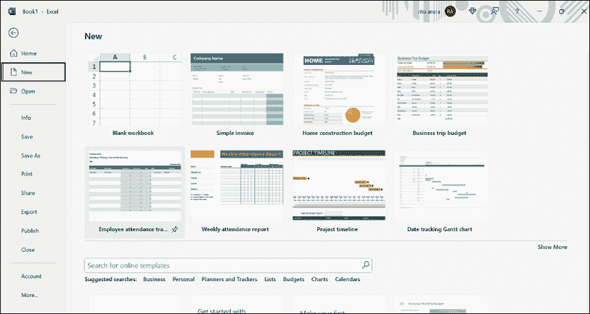

图 1.1：Excel 欢迎窗口

当您通过点击其快捷方式打开 Excel 时，会出现一个称为欢迎页面的独特着陆页。这个欢迎页面为您提供各种示例电子表格，如电影列表、个人预算、趋势分析等。最重要的是，它提供了空白工作表选项，通过这个选项，我们可以打开一个空白的电子表格，并根据我们的需求输入数据。Excel 的欢迎窗口显示在图 1.1 中。

这个窗口还有一个在线模板搜索文本框。通过使用这个功能，你可以与在线办公模板库同步。

当您双击空白窗口选项时，会打开一个空白的电子表格，如图 1.2 所示：

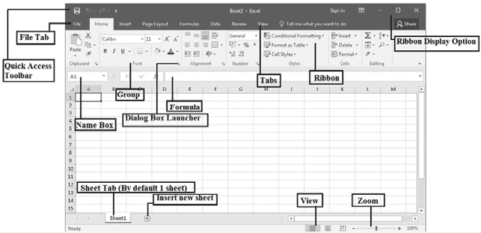

图 1.2：Excel 2016 窗口的各种组件

后台视图

在后台视图中，您可以管理与文档及其相关数据。在这里，您可以创建、保存、发送、检查文档中的隐藏元数据或个人信息。文件选项卡取代了早期版本 MS Office 中使用的 MS Office 按钮和文件菜单。图 1.3 展示了后台视图中的各种选项：

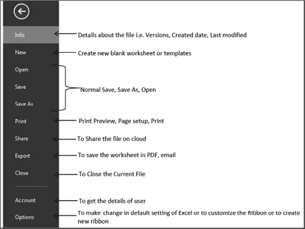

图 1.3：后台视图中的选项

现在让我们来看看后台视图中的各种选项：

+   快速访问工具栏：它位于窗口左上角。它包含用于保存当前工作簿、撤销和重做操作的命令。这个工具栏可以通过添加常用命令的按钮进行自定义。这个工具栏是可移动的，可以移动到功能区下方。

+   功能区：它被组织成各种选项卡，每个选项卡都会激活一个功能区。每个选项卡被分成一组命令，称为与组名相关的命令和选项。

+   画廊：它可能显示在功能区内，但更常见的是一组命令或功能的下拉式菜单。它们使用图标或其他图形来展示命令的结果，而不是命令本身。图 1.4 展示了画廊选项：

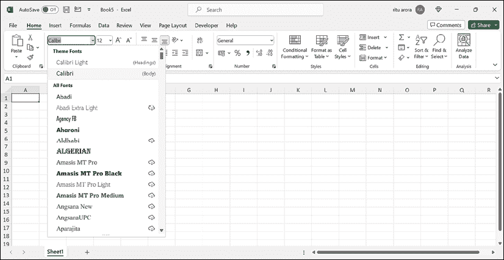

图 1.4：画廊选项

在线保存和共享文件

即使您没有 MS Office 365 或其任何版本，您仍然可以免费在线访问和查看您的重要内容。参考图 1.5：

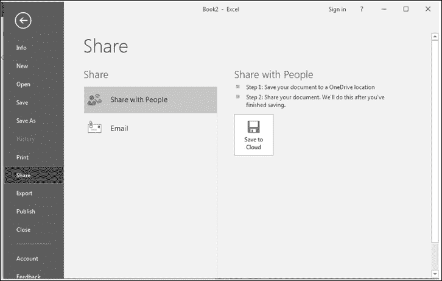

图 1.5：后台视图中的共享选项

与 Excel 互动

任何用户都可以与 Excel 工作表进行交互的方式有很多种。这些包括键入、使用鼠标选择命令、进行选择、点击按钮和其他选项：

+   使用选项卡：它是菜单和工具的主要容器。当您选择一个选项卡时，它会显示包含工具（按钮和列表）的选项卡组。其中一些工具会展开显示简单列表、画廊，如图 1.3 所示。

+   使用画廊：这是一个交互式选项列表，显示在点击命令下的选项。例如，字体画廊显示可用字体的列表。一些画廊使用实时预览，当您将指针移动到画廊上的选项时，每个选项都会预览。例如，如果您在工作表中选择文本并显示字体画廊，则将指针移动到画廊中的每个字体上，屏幕上显示的选定文本将以该字体显示。参考图 1.4。

+   使用工具：当您将鼠标指针悬停在任何工具上时，会显示有关工具的小描述，称为超级工具提示。它提供有关工具的简短描述，您可以了解工具的具体功能。

提示：按下 Alt+F4 键可查看与选项栏内相关的快捷键。

使用默认设置

Excel 允许您自定义各种方面、行为和与其交互的方式。您可以更改 Excel 的默认设置，例如字体、迭代次数、文件位置以及启动 Excel 时打开的文件。要选择选项对话框，您需要点击“文件”选项卡按钮，然后选择“选项”，如图 1.6 所示：

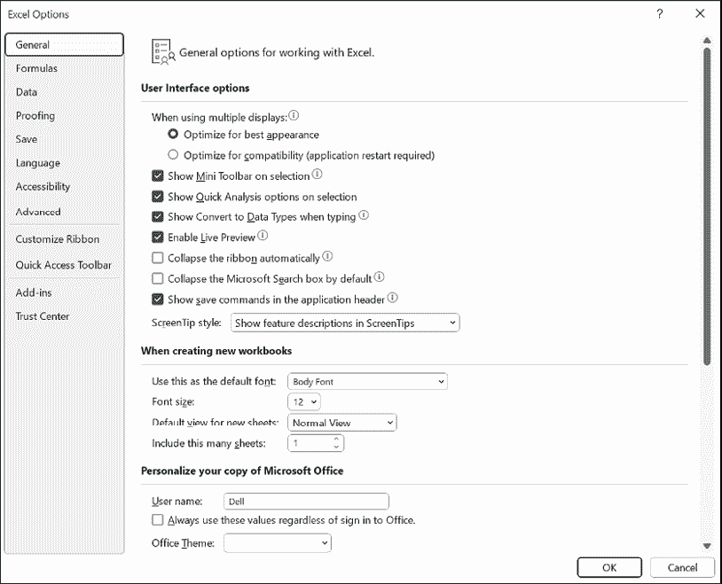

图 1.6：MS Excel 的选项窗口

各种选项如下：

+   个性化选项：您可以使用个性化选项更改工作簿设置，如更改字体的类型和大小，工作簿中的工作表数量，还可以激活用于宏的开发人员选项卡。

+   保存选项：它允许您更改文件的默认位置、文件格式和文件的自动恢复设置。

+   自定义选项卡：在 Excel 中，您可以创建自定义选项卡、组，重命名或更改内置选项卡和组的顺序。在自定义选项卡列表中，自定义选项卡和组的名称后面有“自定义”一词，但在选项卡中不显示“自定义”。

+   添加自定义选项卡和自定义组：这里有一组步骤，可以向选项卡和组中添加自定义选项卡和自定义组。命令只能添加到自定义组中。

要添加自定义选项卡，请按照以下步骤进行：

1.  点击“文件”选项卡。

1.  点击“帮助”下的“选项”按钮。

1.  点击“自定义选项卡”。

1.  点击“新建选项卡”。

1.  ���查看并保存您的自定义设置，请点击“确定”。

参考图 1.7：

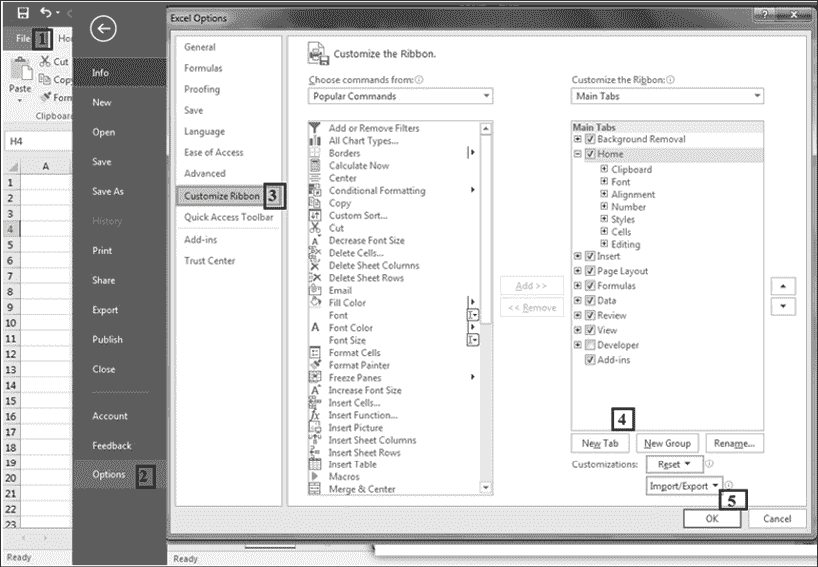

图 1.7：自定义自定义选项卡和自定义组的步骤

表格格式

Excel 提供了各种预定义的表格样式，我们可以使用这些样式快速格式化表格。这是 Excel 给出的预定义格式，因此我们不必更改表格的样式或字体。

你可以通过以下步骤格式化表格：

1.  选择范围。

1.  在功能区上选择“开始”。

1.  选择样式组。

1.  选择“格式表格”。此选项以下拉列表的形式打开各种格式样式，通过单击任何样式，您可以将其应用于您的数据。

粘贴特殊预览

Excel 提供了带有实时预览功能的粘贴选项，使您在重复使用内容时节省时间。此选项帮助您查看各种可用的粘贴选项的预览，例如保留源列宽度、无边框或保留源格式。实时预览使您可以在实际粘贴到工作表之前直观地确定粘贴内容的外观。当将指针移动到粘贴选项上以预览结果时，您将看到一个包含根据您正在重复使用的内容最佳适应内容的项目的菜单。屏幕提示提供额外信息，帮助您做出正确的决定。

闪填充

这是一个令人兴奋的新功能，承诺节省时间。举个例子：如果您在列 A 中写入名字，列 B 中写入姓氏，要将两个名字连接在列 C 中，Excel 具有自动填充整个列的功能，如 图 1.8 (a) 所示。再举一个例子，假设我们在列 A 中有包含全名的电子邮件地址。您可以开始在新列中输入名字，Excel 将自动填充整个列，如 图 1.8 (b) 所示。

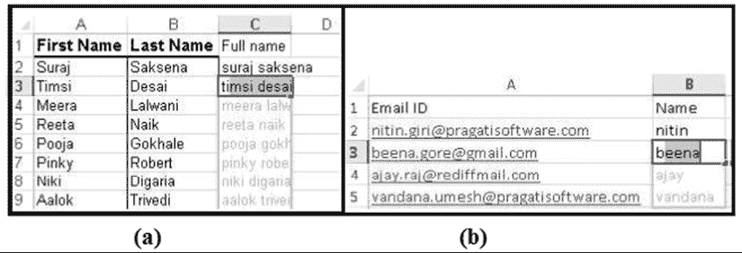

图 1.8：闪填充

快速数据分析

快速分析是 Excel 中新增的一个工具，它使您可以通过单击访问数据分析功能，如公式、条件格式、火花线、表格、图表和数据透视表。您只需选择一些数据，右键单击，即可查看各种快速分析选项。

举个例子：有一个按部门工资排列的数据，需要以适当的格式呈现。你需要在这里进行快速分析。参考 图 1.9：

图 1.9：快速数据分析工具

数据挖掘

高级 Excel 具有几个可用于数据挖掘的功能，即从大型数据集中发现模式和见解的过程。以下是 Excel 中一些关键的数据挖掘功能：

+   数据透视表：数据透视表允许您快速轻松地总结和分析大型数据集。您可以使用数据透视表创建交互式报告，识别趋势，并发现数据中的模式。图 1.10 显示了数据透视表图标：

    

    图 1.10：数据透视表

+   条件格式设置：条件格式设置允许您根据特定标准突出显示特定数据。这对于识别异常值、发现趋势和识别数据中的模式非常有用。图 1.11 显示了条件格式设置的图标：

    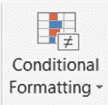

    图 1.11：条件格式设置

+   数据验证：数据验证允许您为电子表格中的数据输入设置规则。这有助于确保数据的完整性和准确性，这对于有效的数据挖掘非常重要。图 1.12 显示了数据验证的图标：

    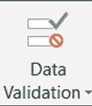

    图 1.12：数据验证

+   假设分析：假设分析允许您探索不同情景及其潜在结果。这对于预测、风险分析和决策制定非常有用。图 1.13 显示了假设分析的图标：

    

    图 1.13：假设分析

+   求解器：求解器是 Excel 的一个附加组件，允许您优化复杂模型并解决问题。它可用于优化问题、线性规划等。参考图 1.14：

    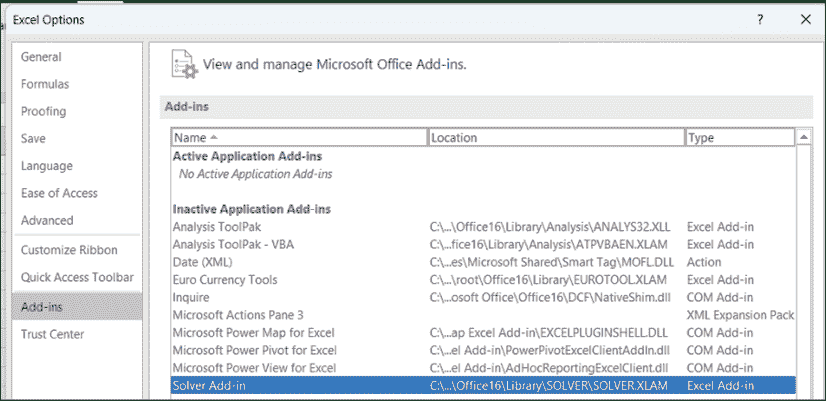

    图 1.14：求解器

+   Power Query：Power Query 是一个数据转换和清洗工具，可用于从多个来源提取、转换和加载数据。它可以帮助自动化数据清理任务并准备数据进行分析。参考图 1.15：

    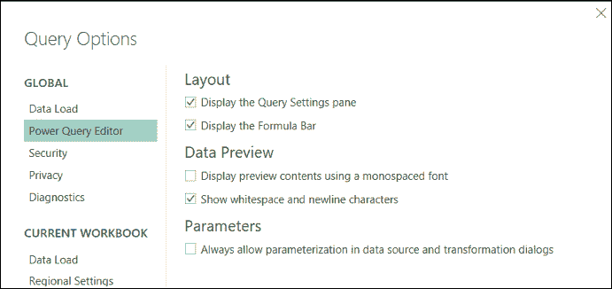

    图 1.15：Power Query

+   文本分列：文本分列功能允许您根据分隔符或模式将列中的数据拆分为多个列。这对于清理和重组数据非常有用。图 1.16 显示了文本分列的图标

    

    图 1.16：文本分列

通过在 Excel 中使用这些数据挖掘功能，您可以快速轻松地发现数据中的模式和见解，这有助于您做出更好的决策并实现业务目标。

TAT 节省技术

Excel 中的 TAT（交付时间）节省技术可以指的是旨在加快处理 Excel 电子表格过程并减少执行某些任务所需时间的不同方法。以下是一些可以帮助改善 Excel 中 TAT 的技术：

+   使用键盘快捷键：键盘快捷键可以显著提高您在 Excel 中的速度。例如，您可以按 Ctrl+C 复制，按 Ctrl+V 粘贴，或使用 F2 键编辑单元格。

+   使用公式和函数：Excel 提供了广泛的内置公式和函数，可以自动化许多任务并节省时间。例如，一些常用函数包括 SUM、AVERAGE、COUNT、IF 和 VLOOKUP。公式栏可以在图 1.17 中看到：

    

    图 1.17：Excel 中的公式

+   使用数据验证：数据验证是 Excel 中的一个强大功能，允许您控制可以输入单元格的数据类型。这可以通过减少纠正错误的需求来帮助防止错误并节省时间。此选项可以在以下图 1.18 中看到：

    

    图 1.18：数据验证

+   使用条件格式化：条件格式化允许您突出显示符合特定条件的单元格，从而更容易分析数据并识别趋势。这可以通过减少手动搜索特定数值或模式的需求来节省时间。此选项可在图 1.19 中看到：

    

    图 1.19：条件格式化

+   使用数据透视表：数据透视表是总结和分析大型数据集的强大工具。它们可以帮助您快速识别数据中的趋势和模式，并使创建报告和图表变得更加容易。参考图 1.20：

    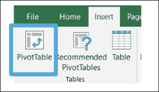

    图 1.20：数据透视表

+   使用 Excel 模板：Excel 模板可以通过提供预先设计的带有内置公式、格式和布局的电子表格来节省时间。这可以通过消除从头开始创建电子表格的需求来节省时间。参考图 1.21：

    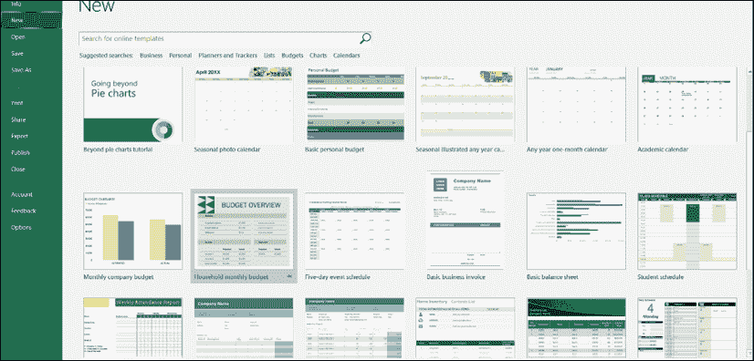

    图 1.21：Excel 模板

+   使用自动填充功能：Excel 中的自动填充功能可以通过自动填充所选单元格范围内的一系列数值或公式来节省时间。要使用自动填充功能，请选择具有所需数值或公式的单元格，然后将填充手柄拖动到要显示数值或公式的单元格范围上。参考图 1.22：

    

    图 1.22：自动填充功能

+   使用 Excel 的排序和筛选功能：Excel 的排序和筛选功能可以通过快速组织和分析数据来节省时间。要对数据进行排序，请选择要按其排序的列，然后单击“升序排序”或“降序排序”按钮。要筛选数据，请单击“筛选”按钮，并选择要用于筛选数据的条件，如图 1.23 所示：

    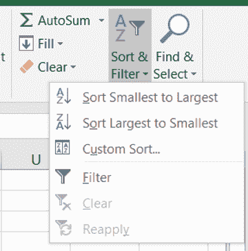

    图 1.23：Excel 中的排序和筛选

通过使用这些技术，您可以在处理 Excel 电子表格时节省时间并提高生产力。

结论

总之，Excel 2021 是一个强大的工具，提供了各种用于数据管理、分析和协作的功能。凭借其用户友好的界面、自定义选项和数据分析功能，Excel 2021 赋予用户高效工作、获取见解和做出明智决策的能力。它是一个增强生产力的多功能工具，对于处理数据的个人和企业至关重要。

练习

1.  Excel 的条件格式化功能的目的是什么？

    1.  执行复杂计算

    1.  分析数据趋势

    1.  基于特定条件格式化单元格

    1.  从其他软件导入和导出数据

1.  Excel 中哪个函数允许您找到单元格范围中的最高值？

    1.  最大值

    1.  总和

    1.  平均值

    1.  计数

答案

1.  c

1.  一个

加入我们书籍的 Discord 空间

加入书籍的 Discord 工作区，获取最新更新、优惠、全球科技动态、新发布内容以及与作者的交流：

**[`discord.bpbonline.com`](https://discord.bpbonline.com)**

