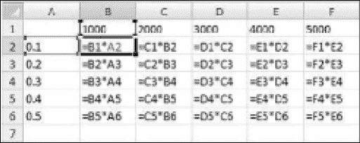
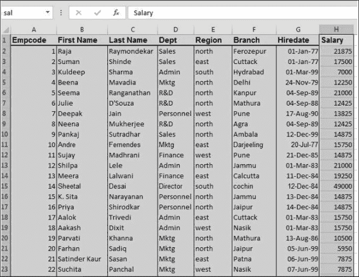
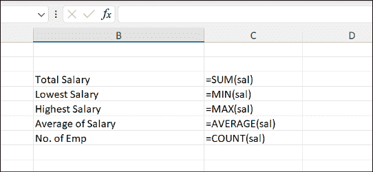
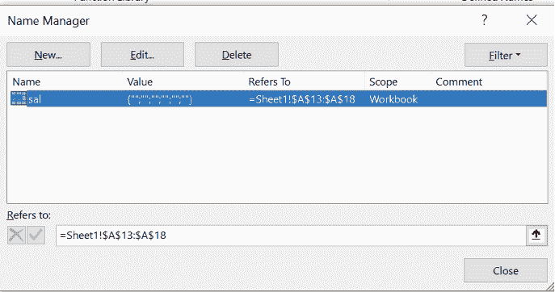
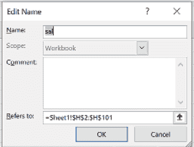

# 第二章 单元格引用和范围

介绍

在本章中，我们将探讨电子表格应用程序中单元格引用和范围的基本概念，使我们能够有效地操作和分析数据。通过了解单元格引用和范围的工作原理，我们可以简化任务，进行计算，并在电子表格工作中保持一致性。

结构

在本章中，我们将讨论以下主题：

+   使用不同类型的引用

+   单元格引用类型

+   命名范围

目标

学习完本章后，读者将了解单元格引用的含义和用法，以及了解范围名称的用法。读者还将能够识别各种单元格引用类型。

使用不同类型的引用

当我们将一个单元格的引用从一个单元格复制到另一个单元格时，它会自动更新。考虑一个例子：我们在单元格 C1 中有一个引用 A1，然后将其复制到 D1。这将自动更新为 B1。有时，我们需要保持部分使用的单元格引用不变。这可以通过使用不同类型的单元格引用来实现。

单元格引用类型

有三种类型的单元格引用：

+   相对单元格引用

+   绝对单元格引用

+   混合单元格引用

参考以下图 2.1：

图 2.1：单元格引用类型

相对单元格引用

这是 Excel 中的默认单元格引用。在这种引用中，当您将相对单元格引用复制并粘贴到一个单元格中时，该单元格会根据从中复制的单元格所做的更改而自动更新。例如，假设您想要计算 HRA，即基本工资的 50%。为此，您需要在 HRA 列的第一个单元格中键入公式=H2*50%，如图 2.2 所示：

图 2.2：在 HRA 列的第一个单元格中键入公式=H2*50%

要找到所有员工的 HRA，将鼠标左键放在 HRA 列中第一个单元格边框的右下角上，并向下拖动直到最后一条记录，如图 2.3 所示：

图 2.3：拖动公式

提示：选择要填充的单元格，按下 Ctrl + D 来填充范围，或者双击填充手柄。

绝对单元格引用

如果您想要冻结单元格引用，但又不希望在复制公式时更改单元格引用，您必须使用绝对单元格引用。要使单元格引用绝对，需要在列名前和引用的行号前放置一个美元符号（$）。

假设您想要找到 1000、2000、3000 和 4000 的 10%，如图 2.4 所示：

图 2.4：计算 1000、2000、3000 和 4000 的 10%

如果你按照前面的图示进行编写，当复制到右侧时，公式会自动变为 C1*B2，D1*C2 等。然而，这并不是正确的计算。我们需要冻结单元格引用 A2，使其在每次复制公式时保持不变。在这里，A2 需要更改为 $A$2 才能达到所需的输出，如图 2.5 所示：

图 2.5：将 A2 写成 $A$2

所需结果可在图 2.6 中看到：

图 2.6：使用绝对单元格引用制作的公式结果

提示：首先选择从 B2 到 F2 的单元格，然后按 Ctrl + R。这将把 B2 中的公式复制到 C2、D2、E2 和 F2 中。

混合单元格引用

有时候你可能只想冻结单元格引用中的行或列。在下面的图 2.7 中，我们需要计算 1000、2000、3000、4000 等的 10%、20%、30%、40% 和 50%：

图 2.7：计算 1000、2000、3000、4000、5000 的 10%、20%、30%、40% 和 50%

如果你向右拖动公式，它会变成 C2*B3，D2*C3 等。一旦向下拖动，它会变成 B3*A4，B4*A5 等。然而，这些不是正确的公式。参考图 2.8：

图 2.8：引用单元格中的错误公式

如果我们仔细观察图 2.8，我们可以看到，如果我们需要得到正确的答案，我们需要冻结 B2 的行号（因为它对所有向右和向下的公式都是相同的）和 A3 的列名（因为它对所有向右和向下的公式都是相同的）。复制后，结果公式将如图 2.9 所示：

图 2.9：结果公式

答案如图 2.10 所示。这种引用中，行或列号被冻结的称为混合单元格引用。

图 2.10：结果值

提示：将光标保持在单元格引用附近，按下 F4 键可以在不同的单元格引用之间切换。

命名区域

当你编写公式/函数时，你需要选择一系列单元格。当范围很大时，这可能会耗费时间。在这里，Excel 提供了一种给范围命名的方法。例如，我们可以在 Sum(H2:H101) 的位置写 Sum(Basic)。然而，为了做到这一点，我们首先需要将范围 H2:H10 命名为 Basic。现在，让我们看看如何给范围命名。

创建命名区域

要命名一个区域，我们可以使用以下其中一种方法：

1.  选择范围（例如，H2:H101）并在名称框中输入名称（例如，Sal），如图 2.11 所示：

    

    图 2.11：创建命名区域

1.  如果您想要使用一个单元格中的值来命名单元格，可以选择范围以及名称。在公式选项卡中单击“从选定创建”，并选择其中一个选项。

1.  单击确定。

1.  您也可以通过在公式选项卡中单击“定义名称”来创建一个命名范围。

1.  在名称框中写入范围的名称。然后单击“引用”框，并选择要命名的范围。

1.  单击确定。

1.  现在，您可以在工作簿中的任何地方使用给定的名称而不是范围。参考图 2.12：

    

    图 2.12：使用命名范围而不是单元格引用

编辑命名范围

有时，重命名或编辑命名范围变得至关重要。可以通过以下步骤完成：

1.  在公式选项卡中，单击名称管理器。

1.  打开一个名称管理器对话框，如图 2.13 所示：

    

    图 2.13：名称管理器对话框

1.  选择要编辑的命名范围，然后单击“编辑”按钮以编辑命名范围。

1.  出现一个编辑名称对话框，如图 2.14 所示：

    

    图 2.14：编辑名称对话框

1.  现在，输入一个新名称或重新定义范围名称。

删除命名范围

要删除一个范围，请执行以下步骤：

1.  从名称管理器列表中选择范围。

1.  单击删除。

1.  现在，命名范围将被删除。

提示：按 Ctrl + F3 键可打开名称管理器对话框。

结论

总之，掌握单元格引用和范围使用户能够有效地操作数据并简化电子表格应用程序中的操作，从而提高处理大型数据集的效率和准确性。

练习

1.  在表 2.1 中匹配正确的相对、绝对和混合引用：

    | A$1 | 相对引用 |
    | --- | --- |
    | $A$1 | 绝对引用 |
    | $A1 | 混合引用 |

    表 2.1：匹配正确的选项

1.  在 Excel 培训文件夹中，打开名为 Advanced Excel Assignment.xlsx 的文件。现在，打开“混合单元格表”并计算不同地区每种产品的百分比销售额，这样当您复制东部销售的单元格公式并粘贴到每个地区列中时，它会自动计算该地区的销售额。

加入我们书籍的 Discord 空间

加入本书的 Discord Workspace，获取最新更新、优惠、全球技术动态、新发布内容以及与作者的交流：

**[`discord.bpbonline.com`](https://discord.bpbonline.com)**

