# 第三章使用公式和函数

介绍

在本章中，我们将探讨在 Microsoft Excel 中使用公式和函数的方法。公式是对值进行计算的方程式，而函数是预定义的简化复杂任务的公式。我们将涵盖诸如在工作表中使用公式、数组公式、使用函数、IF 函数及其变体以及查找函数等主题。

结构

在本章中，我们将讨论以下主题：

+   在工作表中使用公式

+   使用函数

+   查找函数

+   使 V-Lookup 动态

+   索引

目标

在学习本章之后，读者将能够理解公式和函数的用法，识别不同类型的函数，并了解 IF 和其他逻辑函数的工作原理。

在工作表中使用公式

公式是对值进行计算的方程式。公式以等号(=)开头。它至少包含两个操作数和一个操作。例如，以下公式将 2 乘以 3，然后将 5 加到结果中。

=5+2*3

公式中的操作数可以是函数、引用或常数。运算符可以是任何算术或逻辑运算符。

注意：在 Excel 中，当涉及多个运算符时，遵循 BODMAS 规则来解决公式。

数组公式

在图 3.1 中，有五种产品，我们知道其数量和价格。我们需要找到总销售额，这是将所有产品的数量和价格相乘相加的结果。在正常情况下，我们将分别计算每种产品的金额，然后将它们相加以获得答案。但是，为了简化事情，我们也可以使用数组公式。选择 B8 并写入=sum(A2:A6*B2:B6)，然后按 Ctrl + Shift + Enter 组合键填充公式{=sum(A1:A3*B1:B3)}到所选单元格中，如图 3.2 所示。这将计算单元格 B8 中所有产品的数量*价格。

注意：公式周围的大括号({})表示它应用于数组。

图 3.1 展示了五种产品的数量和价格：

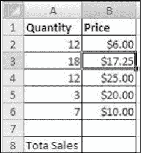

图 3.1：五种产品的数量和价格

图 3.2 展示了所有产品的数量*价格：

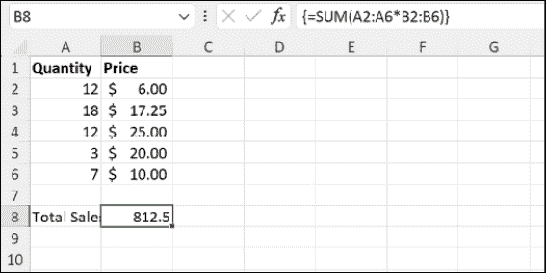

图 3.2：所有产品的数量*价格

使用函数

对一系列单元格中的每个值进行计算可能会很复杂且耗时。例如，如果您有一个包含 20 个单元格的范围，一个将这些值相加的公式将会非常长。Excel 函数简化了复杂的任务。

函数是执行特定计算或其他操作的预定义公式，对数字或文本字符串进行操作并返回一个值。您可以指定函数执行计算的值。函数的语法以函数名称开头，后跟一个开括号，由逗号分隔的函数参数和一个闭括号。 

如果函数开始一个公式，请在函数名称前键入等号（=）。当您创建包含函数的公式时，公式面板将为您提供帮助，如下所示图 3.3：

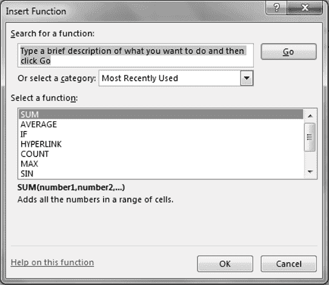

图 3.3：插入函数

注意：从空单元格开始，您可以单击公式栏附近的 fx 符号以查看 Excel 中所有可用的函数。

函数的语法是：

| =函数名称（参数 1，参数 2，…） |
| --- |

示例：

| =SUM(A10, B5:B10, 50, 37) |
| --- |

没有必要记住所有可用的函数以及每个函数所需的参数。相反，您可以使用用于求和的 sigma 符号（∑），或单击下拉菜单以获取更多函数，如 Max、Min 等。Excel 会提示您所需和可选的参数。

注意：您可以使用 Alt + =组合键在工作表上获取求和函数。

IF 函数

在第二章中，单元格引用和范围，我们已经学习了诸如 HRA 和 DA 之类的收入头的计算。我们看到的公式对整个数据库都是相同的。根据某些条件，我们需要决定应用的公式。例如，奖励可能根据部门计算。这就是条件函数如“IF”出现的地方。

IF 函数可用于评估条件。根据条件，无论是真还是假，IF 函数都会返回值。IF 函数的语法是：

| If(logical_test, [Value_if_true], [Value_if_false]) |
| --- |

第一个参数是函数需要评估的条件。第二个参数是条件为真时返回的值，第三个参数是条件为假时返回的值。第二和第三个参数是可选的。

示例：

假设您想根据员工的职位计算 HRA。如果职位是经理，那么 HRA 是 1000，否则是 500。那么函数代码将如下所示：

| =if(C2="经理", 1000, 500) |
| --- |

参考图 3.4：

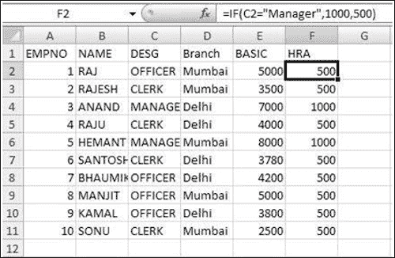

图 3.4：IF 函数

如图 3.4 所示，上述函数计算经理的 HRA 为 1000，其他人为 500。

嵌套 IF

当第二个 IF 函数放置在第一个顺序内以测试附加条件时，将使用嵌套 IF 函数。

嵌套 IF 函数的语法是：

| If(logical_test, [Value_if_true], If(logical_test, [Value_if_true], [Value_if_false])) |
| --- |

示例：

您可以使用嵌套的 IF 函数来评估复杂的条件。例如，如果工资<5000，则税率为 5%。如果工资在 5000 到 1000 之间，则为 10%，否则为 15%。由于我们已经给工资列命名为 sal，因此可以使用 sal 代替 h2 =if (sal<5000, salary*.05, if (sal<10000, salary*.10, sal*.15))。参考图 3.5：

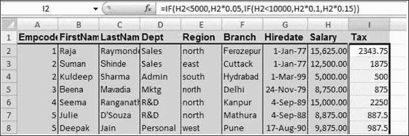

图 3.5：使用嵌套 IF 函数

假设您想要为名称为平均分数的数字分配字母等级，如下所示的表 3.1：

| 如果平均分数为 | 返回 |
| --- | --- |
| 大于 89 | A |
| 从 80 到 89 | B |
| 从 70 到 79 | C |
| 从 60 到 69 | D |
| 少于 60 | F |

表 3.1：分配字母等级

您可以使用以下嵌套的 IF 函数：

| IF（AverageScore>89，“A”，IF（AverageScore>79，“B”，IF（AverageScore>69，“C”，IF（AverageScore>59，“D”，“F”））） |
| --- |

注意：您可以在单个公式中嵌套最多 64 个级别的 IF 函数。

带有 AND 的 IF

在 Excel 中，OR 是一个逻辑函数，如果任何一个参数返回 false，则返回 false。

语法：

| AND（逻辑 1，逻辑 2...） |
| --- |

���果存在这样的情况，即我们有两个条件，其联合真值将决定 IF 函数的输出，则可以使用 AND 与 IF。

语法：

| 如果（和（条件 1，条件 2….），真，假） |
| --- |

示例：

如果我们需要给在“销售”部门工作且在“北部”地区的每个人提供基本工资的 10%作为激励，我们将使用以下公式：

=IF (AND (Department=”sales”, Region=”north”), 10%*基本工资, 0)

带有 OR 的 IF

OR 是 Excel 中的逻辑函数，如果任何一个参数返回 false，则返回 False。

语法：

| OR（逻辑 1，逻辑 2...） |
| --- |

如果存在这样的情况，即我们有两个条件，其中任何一个条件为假，则 IF 应返回假参数中的值，我们可以在 IF 中使用 OR。

使用 OR 与 IF 的语法

| 如果（OR（条件 1，条件 2….），真，假） |
| --- |

示例：

如果员工在销售、市场营销或人力资源部门，则 HRA 为基本工资的 50%。否则，它是基本工资的 30%。

如果（或（Department=”Mktg”，Department =”Sales”，Department=”Hrd”），基本工资*.5，基本工资*.3）

带有 NOT 的 IF

这是一个用于否定参数的逻辑函数。

语法：

| NOT（逻辑） |
| --- |

如果我们有一个条件，当不满足时，我们需要应用公式，我们可以使用 NOT 与 IF。

使用 NOT 与 IF 的语法

| 如果（NOT（条件），真，假） |
| --- |

示例：

如果我们需要给除了在“市场营销”部门工作的人之外的所有人提供激励，我们可以使用以下公式：

IF（NOT（Department=”MT”），10%*工资，0）

注意：最多可以传递 255 个条件给 AND/OR 函数，而 NOT 函数只能传递一个条件。

我们还可以在 IF 内部使用多个 NOT。

示例：

如果你需要给每个人提供激励，但不包括销售和行政部门的人员，你可以使用以下函数：

如果（并且（不是（部门=”销售”），不是（部门=”行政”）），10%*工资，0）

查找函数

有时，我们需要根据查找值在数据库中搜索数值。例如，给定员工 ID，我们如何从其他表或其他文件中查找激励值？在这种情况下，根据源数据库，我们可以使用以下查找函数之一：

+   V-lookup（如果数据库是垂直的）。参考图 3.6：

    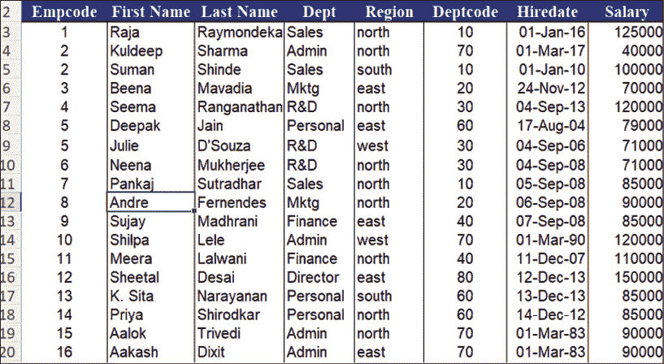

    图 3.6：V-lookup

+   H-lookup（如果数据库是水平的）：参考图 3.7：

    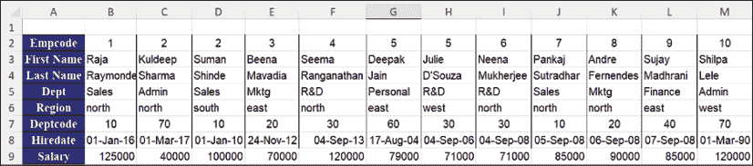

    图 3.7：H-lookup

V Lookup

如果我们需要根据一个共同字段从其他文件或表中获取列的值，可以使用 V-lookup。V-lookup 是一个函数，它在给定数据库（表格数组）的最左列中搜索一个值（查找值），并返回你指定列中相同行的值。

语法：

| VLOOKUP (lookup_value, table_array, col_index_num, range_lookup) |
| --- |

您可以通过使用内置函数参数对话框来编写此函数。单击公式选项卡，在查找和引用类别中搜索 vlookup。您将获得一个函数参数对话框，如图 3.8 所示：

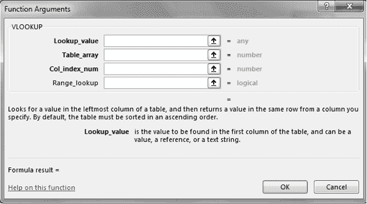

图 3.8：V-lookup 函数参数

这里可以选择的不同数值如下：

+   Lookup_value：要在表格的第一列中找到的值。这是你要查找的值。Lookup_value 可以是一个值，一个引用或一个文本字符串。

+   Table_array：查找数据的信息表。这是源数据库。使用范围引用或范围名称。

+   Col_index_num：从中返回匹配值的 table_array 中的列号。

+   Range_lookup：逻辑值，指定是否要让 VLOOKUP 找到精确匹配还是近似匹配。如果 Range Lookup 设置为 FALSE 或 0，VLOOKUP 将找到精确匹配。如果找不到精确匹配，将返回错误值#N/A。如果设置为 TRUE 或非零，它会找到小于查找值的最近值。

H-lookup

H-lookup 函数在表格的最顶行中搜索数值，然后返回你指定行中相同列的数值。

语法：

| HLOOKUP (lookup_value, table_array, row_index_num, range_lookup) |
| --- |

H-lookup 与 V-lookup 的工作方式相同。但在这种情况下，我们需要指定行索引号，而不是列索引号。

注意：你也可以通过以下方式获取函数参数框。输入 =VLOOPUP（或=HLOOKUP（视情况而定）并按 Ctrl + A。

带有范围 0（False）的 Vlookup 示例：

假设您想根据激励表在工资表中添加激励，激励表的范围在激励工作表中为 A1:B12。按照以下步骤操作：

1.  选择要放置结果的单元格。

1.  点击插入函数。从查找和引用类别中选择 Vlookup()函数。

1.  查找值：选择 A2 [员工代码]

1.  表数组：选择激励表并从$A$1:$B$12 中选择范围[即，员工代码和激励列]

1.  列索引：输入 2 [列 2 是激励表中的激励列]

1.  范围查找：输入 False [我们正在从表中搜索查找值的精确匹配]

要消除#NA（不可用错误），您可以使用 Iferror 函数。iferror 的语法如下：

| = iferror (vlookup….,"") |
| --- |

带有非零范围的 Vlookup 示例（True）

假设您想根据工资分级添加激励。在这种情况下，您可以使用带有 True 范围的 Vlookup，而不是 IF 条件。在这种情况下，我们将创建一个表，如表 3.2。在表数组中，选择此表，并在范围查找字段中，输入“True”而不是“False”。

| 0 | 2% |
| --- | --- |
| 5000 | 5% |
| 10000 | 10% |
| 15000 | 15% |

表 3.2：示例表

注意：在这种情况下，表将按照第一列升序排序。

示例：

在高级 Excel 作业文件中，emp_inf 表，我们需要根据员工 ID 检索员工信息。为此，我们可以使用 vlookup，如下所示图 3.9：

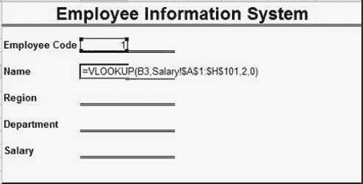

图 3.9：带有非零范围的 Vlookup 示例

要查找其他详细信息，您可以使用相同的公式，并相应更改列索引号。

使 V-Lookup 动态化

当我们有一个动态数据库，其中新列经常添加到数据库中时，当前列的位置也可能会改变。然而，Vlookup 的列索引号不会随着数据库的增长而自动更新。这就是我们需要使 VLookup 动态化的地方，以便获取列索引号。为此，我们可以使用以下函数之一动态检索列索引号：

+   列

+   匹配

在 Vlookup 中使用列函数

要使 Vlookup 动态化，我们可以使用列标题作为指示器，动态地选择所需值存在的特定列的索引号。在 vlookup 中使用列函数的语法是：

| = vlookup (lookup_value, table_array, COLUMN (reference), Range_lookup) |
| --- |

在这里，列函数的参考参数将包含原始数据库中列标题的单元格引用。

示例:

在上述 vlookup 示例中，如果我们需要动态查找列索引号，我们可以使用列函数，如下所示图 3.10：

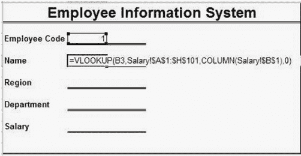

图 3.10：在 Vlookup 中使用列函数

B1 是“工资”工作表中“名字”列的列标题的引用。

在 V-Lookup 中使用 Match 函数

正如我们在前面的案例中看到的，我们需要访问原始数据库或至少知道列的当前位置。然而，这些信息并不总是为我们所拥有。因此，在这里，我们需要使用一个可以通过名称仅检索列标题位置的函数。

Match 函数也是一样。Match 函数返回范围内字符串的位置。

match 函数的语法如下：

| 匹配（查找值，查找数组，[匹配类型]） |
| --- |

可选择的各种选项是：

+   查找值：我们正在查找的字符串。它可以是一个字符串，例如“工资”，或存储字符串的单元格引用。

+   查找数组：我们需要知道查找值位置的范围。

+   匹配类型：这是一个可选参数，用于指定我们需要的匹配类型 0：精确匹配，1：小于，-1：大于。

示例：

如果我们需要找出“salary”字符串在工资表第一行中的位置，我们会写，

| =match("salary", salary!$1:$1, 0) |
| --- |

我们可以使用 match 函数而不是列索引号来动态获取列索引号。

在 vlookup 中使用 match 函数的语法是：

| =vlookup(lookup_value, table_array, match(label,源数据库的第一行标签,0), Range_lookup) |
| --- |

示例：

在 emp_inf 示例中，如果我们需要使用列标题使 vlookup 更加动态，我们可以使用 match 与 vlookup，如图 3.11 所示。在这里，match 查找工资数据库标题中每个字段的标签，并动态返回列的位置：

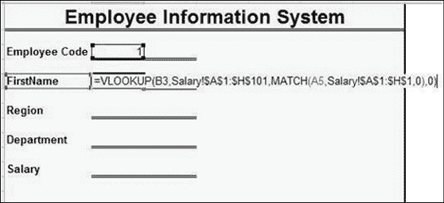

图 3.11：vlookup 中的 match 函数

索引

有时，我们需要根据其行号和列号在数据库中查找数据。索引函数帮助我们做到这一点。

索引函数的语法如下：

| 索引（数组，行号，[列号]） |
| --- |

正如您所看到的，您可以使用索引函数的两种方式。第一种语法用于在单个数据库中查找数据，第二种语法用于涉及多个数据库时使用。

示例：

假设我们需要在数据库的第 3 行和第 4 列的交叉点找到数据。在这种情况下，我们可以使用以下函数：

| =index(database, 3, 4) |
| --- |

索引-匹配

正如我们之前学过的，vlookup 是根据数据库第一列的值来查找数据。然而，如果我们有一个数据库，其中我们的查找值在中间，我们需要向左搜索，我们必须将列移动到最左上角，然后再使用 vlookup。当与 match 一起使用时，索引函数帮助我们搜索数据，即使查找值不在最左列上。

index-match 的语法如下：

| INDEX (数组, [MATCH (查找值, 查找数组, [匹配类型])], [Match (查找值, 查找数组, [匹配类型])]) |
| --- |

在这里，您可以使用匹配函数来获取行号或列号或两者都使用。

例子：

假设，从以下图 3.12 中给出的数据中，我们需要找到总销售额，给定年份和季度。然后我们可以使用以下函数：

| =INDEX (数据库, MATCH (qtr 3, 列标题, 0), MATCH (year, 年份列, 0)) |
| --- |

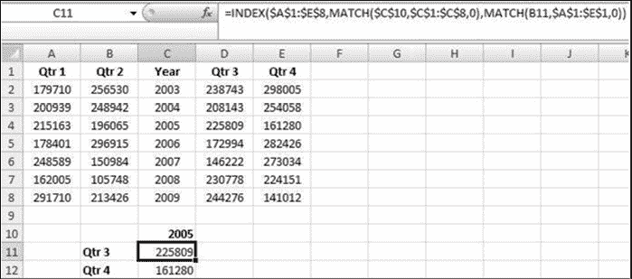

图 3.12：Index-match 函数

在以下图 3.13 中，empcode 是第三列。如果我们需要根据 empcode 找出 DA 或工资，通常会复制并粘贴列到左侧并使用 vlookup。相反，我们可以使用如图 3.13 中所示的 index match：

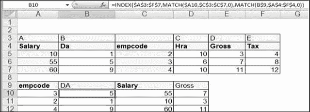

图 3.13：通过使用 Index match 根据 empcode 找出 DA 或工资

结论

总之，在 Microsoft Excel 中使用公式和函数对于进行计算、数据分析和自动化任务至关重要。公式允许用户结合数值、单元格引用和运算符进行数学计算，而函数提供了常见任务的预定义公式。通过有效利用公式和函数，用户可以节省时间，减少错误，并在 Excel 中进行复杂的数据分析。理解和掌握这些工具对于任何在 Excel 中处理数据和电子表格的人都至关重要。

练习

1.  从高级 Excel 作业工作簿中复制工资工作表。计算以下激励方案：

    1.  激励 1：所有在“销售”部门工作的人员将获得其工资的 10%作为激励，其他人将获得 0

    1.  激励 2：所有在“销售”或“营销”部门工作的人员将获得其工资的 5%作为激励，其他人将获得 2%。

1.  使用 V-lookup 列计算 Q.1 c 中的激励方案。

1.  在工资列之后制作一个“汇报经理”列，并根据员工编号将经理的员工代码部署给员工，如下所示使用 V-Lookup。

加入我们书籍的 Discord 空间

加入书籍的 Discord Workspace，获取最新更新、优惠、全球技术动态、新发布和与作者的交流：

**[`discord.bpbonline.com`](https://discord.bpbonline.com)**

