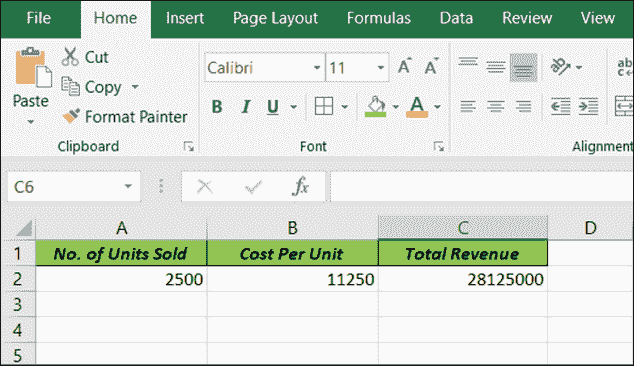
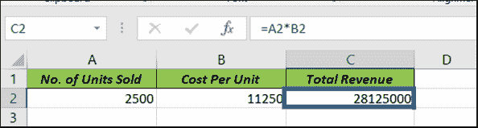
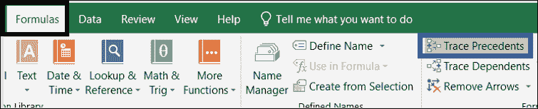
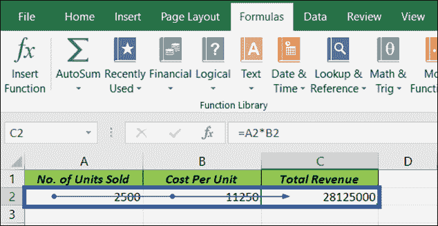
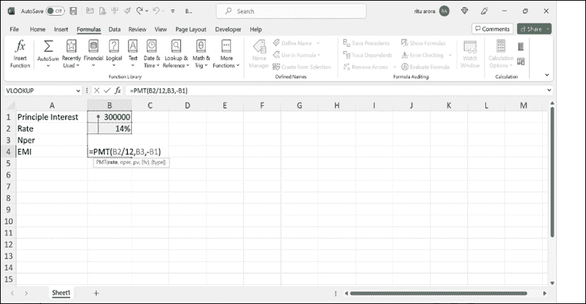
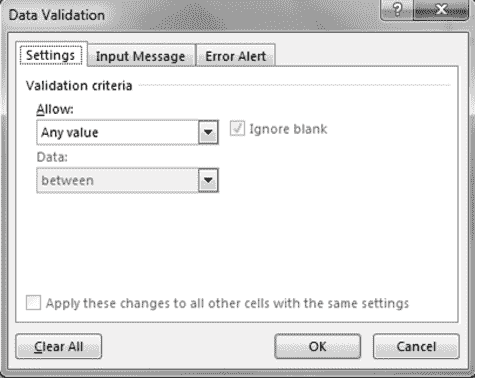
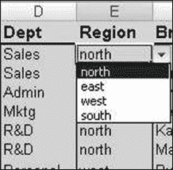

# 第四章数据验证

介绍

有时，我们希望阻止用户在单元格中输入非文本值。换句话说，您可以说您希望限制用户在单元格中输入某种类型的值。数据验证为您完成此工作。

数据验证是一个过程，可以防止用户为单个单元格或单元格范围输入无效数据。借助数据验证，您可以将数据输入限制为特定数据类型，如整数、分数（小数）或文本。您还可以设置有效输入的限制。

结构

在本章中，我们将讨论以下主题：

+   跟踪先行

+   跟踪从属项

+   设置数据验证规则

+   数据验证方法

目标

学习完本章后，学生将能够描述如何限制任何单元格或任何工作表中的数据输入，以及识别各种数据验证技术。

跟踪先行

跟踪先行和跟踪从属是 Excel 中的两个功能，允许您可视化和理解电子表格中单元格之间的关系。以下是每个功能的简要概述：

跟踪先行：跟踪先行允许您查看所选单元格引用的哪些单元格。这对于了解数据如何在电子表格中流动以及识别任何潜在错误或问题非常有用。要使用跟踪先行，选择要跟踪的单元格，然后单击功能区中“公式审计”部分的“跟踪先行”按钮。Excel 将绘制指向所选单元格引用的单元格的箭头。

假设您有一个电子表格，根据销售的单位数量和每单位价格计算公司的总收入。总收入的公式只是销售单位数量和每单位价格的乘积。在此示例中，单元格 C2 包含总收入的公式，即“=A2*B2”。单元格 A2 包含销售单位数量，单元格 B2 包含每单位价格。

参考以下图示：

图 4.1：跟踪先行示例

要使用跟踪先行查看单元格 C2 引用的哪些单元格：

1.  选择单元格 C2，如下所示：

    

    图 4.2：为总收入应用公式

1.  单击功能区中“公式审计”部分的“跟踪先行”按钮，如下所示：

    

    图 4.3：公式选项卡

Excel 将绘制指向单元格 A2 和 B2 的箭头，表示它们是单元格 C2 中公式引用的单元格，如下所示：

图 4.4：跟踪先行

这显示了单元格 C2 中的公式依赖于单元格 A2 和 B2 中的值。如果更改这些单元格中的任何一个的值，单元格 C2 中的值也会相应更改。

使用**Trace Precedents**帮助您了解数据如何在电子表格中流动，并识别公式中的任何潜在错误或问题。

Trace Dependents

**Trace Dependents**允许您查看依赖于所选单元格的单元格。这对于了解更改特定单元格将对电子表格的其他部分产生的影响非常有用。要使用**Trace Dependents**，请选择要跟踪的单元格，然后单击功能区的公式审计部分中的**Trace Dependents**按钮。Excel 将绘制指向依赖于所选单元格的单元格的箭头。

**Trace Precedents**和**Trace Dependents**都可以帮助您了解电子表格的结构，并排除可能出现的任何错误或问题。通过使用这些功能，您可以更轻松地浏览和分析复杂的电子表格，并根据您的数据做出更明智的决策。

这是如何使用**Trace Dependents**的示例：

假设您有一个电子表格，根据本金、利率和期限计算贷款的月付款。月付款的公式基于存储在单元格 A1、A2 和 A3 中的本金、利率和期限。单元格 A4 包含使用 PMT 函数计算的月付款的公式。

要使用**Trace Dependents**查看依赖于单元格 A4 的单元格：

1.  选择单元格 A4。

1.  在功能区的公式审计部分单击**Trace Dependents**按钮。

1.  Excel 将绘制指向依赖于单元格 A4 的任何单元格的箭头。

1.  在此示例中，单元格 B4、C4 和 D4 依赖于单元格 A4，因为它们包含月付款的分解，包括用于本金、利息和任何额外费用或收费的部分。

参考以下图：

图 4.5：**Trace Dependents**

通过使用**Trace Dependents**，您可以看到更改单元格 A4 的值会影响哪些单元格。例如，如果您增加利率或更改贷款期限，您可以使用**Trace Dependents**查看这将如何影响月付款及其分解。

使用**Trace Dependents**可以帮助您了解电子表格的结构，并根据您的数据做出更明智的决策。

设置数据验证规则

以下是创建数据验证规则集的步骤：

1.  选择要创建验证规则的单元格。

1.  在“数据”选项卡中，“数据工具”组中，单击“数据验证”以打开“数据验证”对话框（如图 4.1 所示）。

1.  激活“设置”选项卡。

1.  从“允许”列表中选择数据验证选项。

1.  从“数据”列表中选择您想要的运算符。

1.  然后完成剩余的条目。

1.  如果需要，在输入消息选项卡中输入输入消息。

1.  如果需要，在错误警报选项卡中输入错误消息。

1.  点击确定以设置验证规则。

1.  关闭对话框。

参考以下图：

图 4.6：数据验证

数据验证方法

现在让我们看看一种数据验证方法，即创建列表。

创建列表

列表是一种有效的数据验证形式，用户可以从内置到单元格中的下拉列表中选择选项（图 4.7）。数据源可以由用户手动编写，也可以从同一工作表中选择。

下面是创建列表的步骤：

1.  选择空白单元格

1.  选择数据选项卡

1.  从数据工具组中选择数据验证

1.  选择列表

1.  在来源中，选择具有值的单元格，或者使用逗号键入数据

参考以下图：

图 4.7：创建列表

注意：如果来源于不同工作表，则为所有值创建一个命名范围，并在数据验证的来源字段中使用该名称。

允许数字在限制内：

1.  在允许框中，点击整数或小数。

1.  在数据框中，选择您想要的限制类型。例如，要设置上限和下限，请选择介于。

1.  输入最小值、最大值或特定值以允许。

允许在一定时间范围内的日期或时间：

1.  在允许框中，选择日期或时间。

1.  在数据框中，选择您想要的限制类型。例如，要允许某一天之后的日期，请选择大于。

1.  输入开始、结束或特定的日期或时间以允许。

允许指定长度的文本：

1.  在允许框中，点击文本长度。

1.  在数据框中，点击您想要的限制类型。例如，要允许最多一定数量的字符，请单击小于或等于。

1.  输入文本的最小、最大或特定长度。

根据另一个单元格的内容计算允许的内容：

1.  在允许框中，选择您想要的数据类型。

1.  在数据框中，选择您想要的运算符（用于条件）。

1.  在数据框下面的框中，点击要用于指定允许内容的单元格。

例如，要仅在结果不超过预算时允许帐户条目，请单击允许，选择小于或等于数据，并在最大框中单击包含预算金额的单元格。

使用公式计算允许的内容：

1.  在允许框中，点击自定义。

1.  在公式框中，输入一个计算逻辑值的公式（对于有效条目为 TRUE，对于无效条目为 FALSE）。例如，要只在部门为销售且地区为西部时提供奖励，您可以使用以下自定义公式 =and(d2=”销售”,e2=”西部”)。

若要在单元格被点击时显示可选输入消息，请点击输入消息选项卡，并勾选“单元格被选中时显示输入消息”复选框，并填写消息的标题和文本。

指定 excel 在输入无效数据时的响应方式：

1.  单击错误警报选项卡，并确保勾选“在输入无效数据后显示错误警报”复选框。

1.  为 Style 框选择以下选项之一：

    +   要显示一个不会阻止输入无效数据的信息消息，请选择 Information。

    +   要显示一个不会阻止输入无效数据的警告消息，请选择 Warning。

    +   为防止输入无效数据，请选择 Stop。

1.  填写消息的标题和文本（最多 225 个字符）。

如果您未输入标题或文本，则标题默认为 MS Excel，消息默认为您输入的值无效。用户已限制可以输入到此单元格的值。

结论

在本章中，我们学习了 Microsoft Excel 中的数据验证。数据验证允许我们限制可以输入单元格的数据类型，确保数据的准确性和一致性。我们探讨了两种数据验证方法：Trace Precedents 和 Trace Dependents。这些功能帮助我们了解单元格之间的关系，并识别公式中的潜在错误。

我们还讨论了如何使用数据验证对话框设置数据验证规则。这使我们能够为允许的数据定义特定标准，例如整数、小数、日期、时间或指定长度的文本。我们甚至可以创建自定义公式，根据其他单元格的内容计算允许的数据。

此外，我们研究了创建数据验证列表的方法，用户可以从下拉列表中选择选项。这有助于保持数据一致性并简化数据输入。

练习

1.  打开 Advance Excel 作业簿。在名为 Validation 的工作表中，进行以下数据验证。

    1.  不允许在 emp_code 中出现重复。

    1.  只允许在 emp name 中输入文本。

    1.  年龄应该只是数字数据。

    1.  工资应在 5000 到 50000 之间。

    1.  加入日期应早于当前日期。

1.  在 emp_inf 工作表中，在单元格 B3 中创建所有员工代码的下拉列表。

加入我们书籍的 Discord 空间

加入书籍的 Discord Workspace，获取最新更新、优惠、全球技术动态、新发布和与作者的交流：

**[`discord.bpbonline.com`](https://discord.bpbonline.com)**

