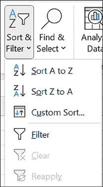
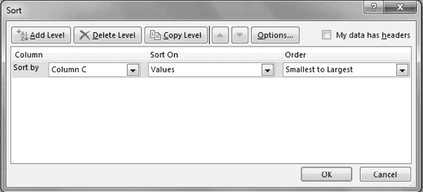

# 第六章 数据库排序

介绍

数据库中的数据排序是根据诸如字母或数字值等标准按特定顺序排列项目的过程。它能够轻松组织、比较和分析数据，从而实现高效的数据管理和明智的决策。本章探讨了不同的排序技术，包括简单排序、多级排序和自定义排序，为您提供了有效地排列和分析数据库中数据的知识。

结构

在本章中，我们将讨论以下主题：

+   排序的定义

    +   简单排序

    +   多级排序

    +   自定义排序

目标

在学习完本章后，读者应该能够定义排序，并识别各种排序技术。

定义

排序是任何一种有序排列项目的过程，即按照某种标准将项目按顺序排列。例如，按照递增或递减顺序对数据进行排序。

简单排序

要对列执行简单排序，请按照以下步骤进行：

1.  选择要排序的列中的任意单元格。

1.  激活“数据”功能区。

1.  在“排序和筛选”组中，单击“升序排序”或“降序排序”按钮。如图 6.1 所示，这将对整个数据库进行排序：

    

    图 6.1：简单排序

多级排序

有时，您可能希望按多个列对数据进行排序。例如，您希望按区域和部门对员工信息进行排序。这可以通过多级排序来实现。

要根据两个或更多列对列表进行排序：

1.  选择列表中的任意单元格。

1.  激活“数据”功能区。

1.  在“排序和筛选”功能区中，单击“排序”以打开“排序”对话框。

1.  从“排序依据”列表中，选择您想要按照哪一列的列标题对列表进行排序，选择排序顺序。

1.  所有记录将首先根据您选择的列和排序顺序进行排序。

1.  从“然后按”列表中，选择您想要排序的下一列。

1.  如有必要，通过单击“添加级别”来添加更多“然后按”字段。

1.  当所有“然后按”字段都填写完毕后，单击“确定”，如图 6.2 所示：

    

    图 6.2：多级排序

注意：在单击“确定”按钮之前，请确保至少选择一个“然后按”字段。

自定义排序

在自定义排序中，列表将按照您指定的顺序对数据进行排序。考虑一个例子，当我们按区域对数据进行排序时，它会按照升序或降序排序，但我们希望按照自定义顺序对数据进行排序。

例如，东、西、北和南。为此，我们需要执行自定义排序，如以下步骤所述：

1.  选择列表中的任意单元格。

1.  激活“数据”选项卡。

1.  在“排序和筛选”组中，单击“排序”以打开“排序”对话框。

1.  从“排序方式”列表中，选择要按其排序列表的列标题。

1.  从排序顺序中，选择“自定义列表”。

1.  它将打开“自定义列表”对话框。

1.  输入您希望排序的顺序。

1.  点击“添加”按钮将列表添加到自定义排序中。

1.  点击“确定”。

结论

总之，在数据库中对数据进行排序对于组织信息和促进高效分析至关重要。通过应用各种排序技术，如简单排序、多级排序和自定义排序，我们可以根据特定标准排列数据，并提高数据库的可用性和功能性。排序使我们能够更有效地导航和比较数据，从而获得更好的见解和明智的决策。

练习

参考以下表 6.1 并回答以下问题：

| 产品 | 地区 | 销售代表 | 销售收入 | 销售数量 |
| --- | --- | --- | --- | --- |
| 产品 A | 北部 | 约翰 | $10,000 | 50 |
| 产品 B | 南部 | 丽莎 | $8,500 | 45 |
| 产品 C | 西部 | 马克 | $12,500 | 65 |
| 产品 D | 东部 | 萨拉 | $9,200 | 48 |
| 产品 A | 西部 | 约翰 | $11,800 | 60 |
| 产品 B | 北部 | 丽莎 | $9,700 | 52 |
| 产品 C | 东部 | 马克 | $10,300 | 55 |
| 产品 D | 南部 | 萨拉 | $8,900 | 47 |
| 产品 A | 南部 | 约翰 | $9,500 | 51 |
| 产品 B | 东部 | 丽莎 | $11,200 | 58 |
| 产品 C | 北部 | 马克 | $10,900 | 57 |
| 产品 D | 西部 | 萨拉 | $12,700 | 66 |

表 6.1：数据库表

1.  根据销售收入列，按销售数据库中的销售收入列降序排序。

1.  通过首先按产品类别按字母顺序排序，然后按销售数量按降序排序，在销售数据库上执行多级排序。

1.  通过为产品名称创建自定义列表并基于该列表进行排序，定制销售数据库的排序方式。

1.  根据库存列中的库存数量升序对库存数据库进行排序。

1.  通过首先按产品类别按字母顺序排序，然后按重新订购级别按升序排序，在库存数据库上执行多级排序。

加入我们书籍的 Discord 空间

加入书籍的 Discord 工作区，获取最新更新、优惠、全球技术动态、新发布和与作者的交流：

**[`discord.bpbonline.com`](https://discord.bpbonline.com)**

