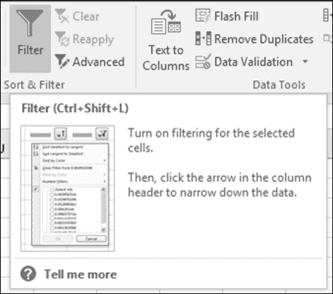
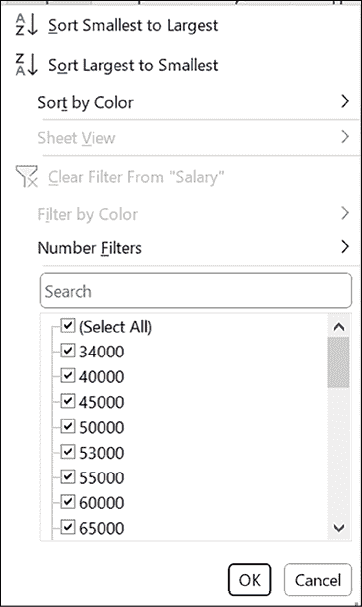
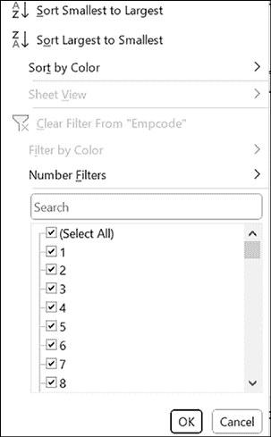
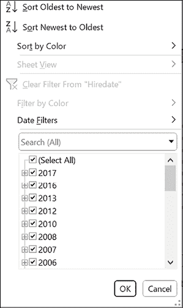
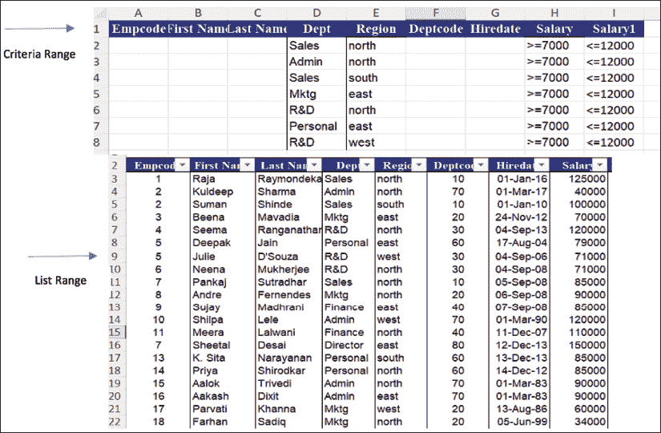
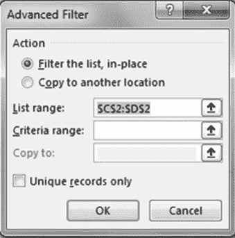

# 第七章 数据库筛选

介绍

在本章中，我们将探讨在 Excel 中对数据库进行筛选的主题。筛选允许我们仅显示符合特定标准的信息行，使得分析和处理大型数据集变得更加容易。我们将了解不同类型的筛选器，包括自动筛选功能，数字、文本和日期筛选器，以及 Excel 的高级筛选功能。此外，我们将发现如何筛选列表中的唯一记录。通过本章的学习，读者将清楚地了解如何有效地在 Excel 中使用筛选器根据特定标准提取和操作数据。

结构

在本章中，我们将讨论以下主题：

+   筛选器

    +   自动筛选

    +   数字、文本或日期筛选器

    +   使用高级筛选筛选列表

+   筛选唯一记录

目标

在学习本章后，读者将能够了解各种类型的筛选器，并学会如何在他们的工作表中使用它们。

筛选器

有时，您需要仅显示符合特定标准的信息行。为了帮助您做到这一点，您可以使用筛选器。让我们更多地讨论筛选器。

自动筛选

对于常用标准，Excel 提供了自动筛选功能。以下是它的工作原理：

1.  选择列表中的任何单元格。

1.  激活“数据”选项卡。

1.  在“排序和筛选”组中，单击“筛选”以显示每个列标题旁边的自动筛选箭头。

1.  从您想要筛选的列的列表中选择。

1.  选择标准。

1.  点击确定，如图 7.1 所示：

    

    图 7.1：筛选器

要清除筛选并显示整个列表，请再次单击筛选。您可以使用 Excel 的高级筛选功能根据更复杂的标准筛选列表。例如���您可以显示所有那些薪水在 7000 到 12000 之间的员工的记录。

Excel 提供了两种指定复杂筛选条件的工具：

+   数字、文本或日期筛选器

+   高级筛选

数字、文本或日期筛选器

一旦向数据添加筛选器，每个字段都会根据该列中的数据类型获得数字、文本或日期筛选器选项。这些可以用于字段特定的筛选，如文本字段的“以...开头”，“包含”，数字字段的“大于”，“小于”，“介于”，日期字段的“之前”，“之后”。每个筛选字段都有一个自定义筛选选项，您可以在其中指定除已提供的选项之外的公式或选项。参考图 7.2：

图 7.2：数字筛选器

参考以下图 7.3：

图 7.3：文本筛选器

参考以下图 7.4：

图 7.4：日期筛选器

从要创建条件的列的下拉列表中，选择文本筛选器、日期筛选器或数字筛选器，单击自定义以显示自定义自动筛选对话框。

1.  在包含条件标签的单元格下方输入比较标准。您可以在同一行中使用“AND”条件，也可以在不同行中使用“OR”条件。例如，图 7.5 中给出的条件可用于仅显示北部或南部地区的人员记录。

    

    图 7.5：条件范围

1.  激活数据选项卡。

1.  在“排序和筛选”组中，单击“高级”以打开高级筛选对话框（如图 7.6 所示）。

    

    图 7.6：高级筛选

1.  在“列表范围”框中，选择要筛选的单元格范围。单元格范围必须包括相关的列标题。

使用高级筛选筛选列表

如果您希望筛选数据，以便仅显示销售和行政部门员工的记录，这些员工来自北部和南部地区，工资在 7000-12000 或 15000-20000 之间，自动筛选将无法实现目的。这是因为在自动筛选中无法对另一个数字筛选应用另一个数字筛选。然而，上述查询要求我们在工资字段上执行相同操作。因此，为了解决此查询，我们可能需要使用高级筛选。

在使用高级筛选时，我们需要有一个条件范围和一个列表范围。列表范围是您的数据库。

1.  要创建条件范围，我们需要复制数据库的列标题。

1.  在“条件范围”框中，选择包含您的条件的单元格范围，然后单击“确定”。

注意：在设计条件范围时，最好将整个数据库的列标题复制并粘贴为条件范围的标题。

为了更好地可见性，将条件范围和列表范围放在不同的行上。高级筛选命令会在原地筛选您的列表，就像自动筛选一样，但它不会为列显示下拉列表。相反，您必须选择列表范围，即您的数据，在工作表上的条件范围中输入条件，并选择条件范围，在输出范围中输入要显示输出的单元格地址。这是可选的。

筛选唯一记录

高级筛选也可用于在不同位置筛选列表中的唯一值。虽然 Excel 的删除重复功能可以帮助创建唯一值列表，但如果需要在不同位置复制粘贴唯一值，则需要这样做。为了避免这种情况，请按照以下步骤使用高级筛选选项：

1.  选择要筛选的列或单击范围或列表中的单元格。

1.  在“数据”选项卡上，单击“筛选”。

1.  单击“高级筛选”。

1.  执行以下操作之一：

    +   要在原地筛选范围或列表，类似于使用自动筛选，请单击“在原地筛选列表”。

    +   要将筛选结果复制到另一个位置，请单击“复制到另一个位置”。然后，在“复制到”框中，输入单元格引用。

    +   要选择单元格，请单击“折叠对话框”以暂时隐藏对话框。在工作表上选择单元格，然后按“展开对话框”。

    +   仅选择“唯一记录”复选框。

注意：高级筛选，复制选项会在同一工作表上复制，如果要将筛选数据复制到不同的工作表，请在要放置数据的工作表上选择高级筛选命令。

结论

在 Excel 中对数据库进行筛选允许我们根据我们定义的标准提取特定信息。在本章中，我们学习了 AutoFilter、数字/文本/日期筛选和高级筛选。我们还探讨了筛选唯一记录的方法。通过掌握这些技巧，我们可以高效地分析数据并做出明智的决策。在下一章中，我们将深入探讨 Excel 中数据排序的强大功能。

练习

1.  打开名为 Filter 的工作表。使用 AutoFilter 根据以下标准查找记录：

    1.  来自北方或南方的人员

    1.  在销售或行政部门工作的人员

    1.  在销售或行政部门工作的人员，北方或南方，薪水在 7000 至 12000 之间

    1.  在销售或行政部门工作的人员，北方或南方，薪水在 7000 至 12000 之间或在 15000 至 20000 之间

加入我们书籍的 Discord 空间

加入书籍的 Discord Workspace，获取最新更新、优惠、全球科技动态、新发布和作者讲座：

**[`discord.bpbonline.com`](https://discord.bpbonline.com)**

