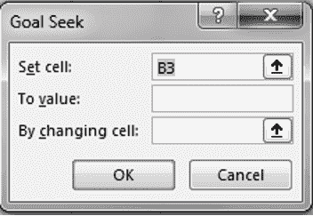
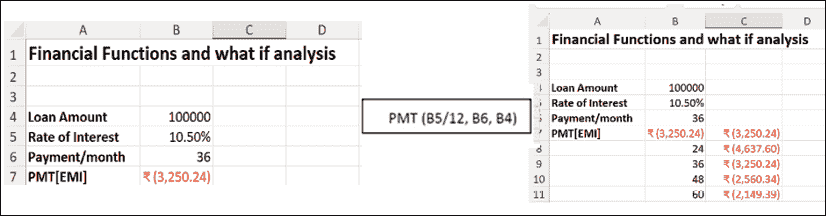
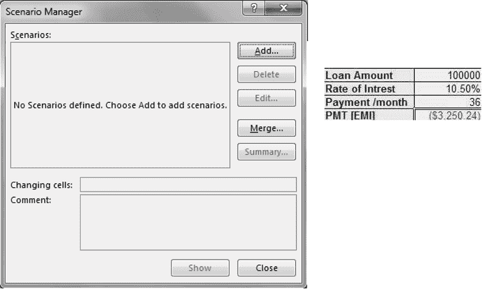
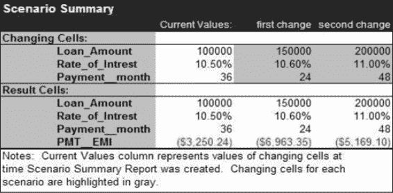

# 第十一章假设分析

介绍

在许多情况下，您可能需要在一个或多个公式中使用几组不同的值，以探索各种结果。在这种情况下，手动干预可能会增加，导致错误。假设分析工具可以在这种情况下帮助您。Excel 中有 3 种假设分析工具，分别是：

+   目标搜索

+   数据表

+   情景管理器

结构

在本章中，我们将讨论以下主题：

+   目标搜索

+   使用数据表预测数字

+   单变量数据表

+   双变量数据表

+   假设情景

+   创建情景

+   从另一个工作表合并情景

目标

在学习本章后，读者将能够理解目标搜索，定义数据表并学习情景管理器。

目标搜索

假设您已经创建了一个基于公式计算 PMT 的公式。您想知道需要多少个月才能完成分期付款，前提是您每月支付 x 金额。对于这种反向分析，您可以使用目标搜索实用程序。这种类型的分析涉及更改工作表中的值，并观察这些更改如何影响公式的结果。您可以使用目标搜索来解决具有一个变量的问题。

Excel 中的目标搜索功能帮助我们计算电子表格输入的值，使得给定公式的值与您指定的目标匹配。目标搜索可以节省您进行耗时的试验和错误分析。

使用目标搜索命令

要找到解决公式的特定值，请按照以下步骤：

1.  选择包含公式的单元格。

1.  激活“数据”选项卡。

1.  在“数据工具”组中，点击“假设分析”，选择“目标搜索”以打开目标搜索对话框。

1.  在“设置单元格”框中，指定包含您想要解决的公式的单元格。

1.  在“至值”字段中，输入您想要的��果。

1.  在“更改单元格”字段中，指定包含您想要调整的值的单元格。

1.  点击确定。

例如，一个人借款 10 万卢比，分 36 个月，每月 EMI [PMT]为 3250。如果他每月支付 5000 卢比，他将在多少个月内完成付款？

参考表 11.1：

|  | A | B |
| --- | --- | --- |
| 1 | 贷款金额 | 100000 |
| 2 | 利率 | 10.50% |
| 3 | 每月付款 | 36 |
| 4 | PMT [EMI] | ($3,250.24) |
|  |  | PMT(B5/12,B6,B4) |

表 11.1：问题的数据

参考图 11.1：

图 11.1：目标搜索

使用数据表预测数字

数据表是一个范围，当一个或多个公式中的某些值发生变化时，显示结果。您想要在公式中输入的不同值也包括在数据表中。数据表可以使用单个变量或两个变量。

单变量数据表

用于观察一个或多个公式中单个变量变化的影响。

示例：

当我们改变利率时，函数中的月付款 PMT(b5/12, 36, 100000) 会受到影响。在此函数中，A5 被称为输入单元格，各种输入值从数据表中替换。参见 图 11.2：

图 11.2：单变量数据表示例

要创建一个单变量数据表，请按照以下步骤进行：

1.  在行或列中输入值。

1.  如果将输入值列出在列中，请在第一个输入值的上方行与输入值右侧列的交汇单元格中输入公式，如 图 11.2 所示。如果将输入值列出在行中，请在第一值左侧列与输入值行的交汇单元格中输入公式，正好在输入值行下方。

1.  选择包含输入值和公式的范围。

1.  在“数据”选项卡上，“数据工具”组中，单击“假设分析”，然后选择“数据表”以打开“表格”对话框。

1.  如果输入值在列中，请在“列输入单元格”框中指定输入单元格。如果输入值在行中，请使用“行输入单元格”框。

1.  单击“确定”。

双变量数据表

您可以使用双变量数据表来查看一个或多个公式中两个变量变化的影响，如 图 11.3 所示。例如，您可以看到更改贷款金额和付款次数如何影响每月付款。

要创建双变量数据表，请按照以下步骤进行：

1.  输入包含两个输入单元格的公式。

1.  在同一列中，在公式下方输入第一个输入值列表。在同一行中，公式右边，输入第二个输入值列表。

1.  选择包含输入值和公式的范围。

1.  在“数据工具”组中，单击“假设分析”，然后选择“数据表”以打开“表格”对话框。

1.  在“行输入单元格”框中，指定行输入单元格。

1.  在“列输入单元格”框中，指定列输入单元格。

1.  单击“确定”。

假设场景

场景是有时被称为“假设分析工具”的一套命令的一部分。场景是一组值，Excel 中保存并且也可以自动替换在您的工作表中。要预测工作表模型的结果，您可以使用场景。您可以在工作表上创建并保存不同的值组，然后切换到任何这些新场景以查看不同的结果。您可以为每个场景定义多达 32 个可变单元格。

使用场景管理器可以：

+   创建具有多组可变单元格的多个场景。

+   查看工作表上每个场景的结果。

+   创建所有输入值和结果的摘要报告。

+   将一组场景合并成单个场景模型。

+   保护场景免受修改并隐藏场景。

+   使用自动场景历史跟踪修改。

创建场景

假设您需要在下面的示例中并排分析企业在最佳、最差和当前情况下的净收入。您可以使用场景管理器以摘要格式实现所需的结果。

您可以使用“场景管理器”对话框创建场景。按照以下步骤执行相同操作：

1.  激活“数据”选项卡。

1.  在“数据工具”组中的“假设分析”列表中，选择“场景管理器”以打开“场景管理器”对话框。

1.  单击“添加”按钮以打开“添加场景”对话框。

1.  在“场景名称”框中，指定场景的名称。

1.  在“更改单元格”框中，指定包含要更改的值的单元格。（例��，选择当前场景范围的范围）。

1.  单击“确定”以打开“场景值”对话框。

1.  在“场景值”对话框中，指定更改单元格的值。

1.  单击“确定”创建场景。

如果要创建其他场景，请再次单击“添加”，然后重复该过程。完成创建场景后，单击“确定”。

示例：

在下面的示例中，如果我们需要了解一系列贷款金额、利率和还款期数的 PMT，我们可以使用场景，如图 11.3 所示。

在第一次更改中，贷款金额为 1,50,000，利率为 10.6%，期数为 24。在第二次更改中，贷款金额为 2,00,000；利率为 11%，还款期数为 48。

参考以下图 11.3：

图 11.3：场景管理器

创建场景摘要报告

要创建场景摘要报告，请按照以下步骤操作：

1.  单击“摘要场景管理器”对话框。

1.  在“结果单元格”框中，输入引用单元格的引用，这些单元格的值由场景更改（如上例中的净收入）。用逗号分隔多个引用，如图 11.4 所示。

删除场景

要删除场景，请按照以下步骤操作：

1.  激活“数据”选项卡。

1.  在“数据工具”组中的“假设分析”列表中，选择“场景管理器”以打开“场景管理器”对话框。

1.  单击要删除的场景名称。

1.  单击删除。

参考以下图 11.4：

图 11.4：场景摘要

显示场景

当您显示场景时，您会更改保存为该场景一部分的单元格的值。按照以下步骤显示场景：

1.  激活“数据”选项卡。

1.  在“数据工具”组中的“假设分析”列表中，选择“场景管理器”以打开“场景管理器”对话框。

1.  单击要显示的场景名称。

1.  单击“显示”。

注意：双击“场景”框中显示的场景名称与选择名称并选择“显示值”是相同的。

从另一个工作表合并场景

当所有工作表上的“假设”模型都相同时，合并场景很容易。源工作表上的所有变化单元格必须引用活动工作表上对应的变化单元格。Excel 将源工作表上的所有场景复制到活动工作表。要从另一个工作表合并场景，请按照以下步骤操作：

1.  打开包含你想要合并场景的所有工作簿。

1.  切换到你想要合并场景的工作表。

1.  激活“数据”选项卡。

1.  在“数据工具”组中的“假设分析”列表中，选择“场景管理器”以打开“场景管理器”对话框。

1.  点击“合并”。

1.  在“工作簿”框中，单击工作簿名称。

1.  在“工作表”框中，单击包含你想要合并的场景的工作表的名称。

1.  点击“确定”。

1.  如果你想要从更多工作表合并场景，请重复此过程。

保护场景

添加场景和编辑场景对话框包含两个保护选项：

+   防止更改

+   隐藏

如果你选择“防止更改”，然后激活工作表保护，你定义的场景将无法编辑。然而，这并不妨碍你直接在工作表上查看变化单元格的值（除非单元格本身被锁定）。相反，当选择“防止更改”复选框时，场景本身将受到保护，无法修改。

此外，选择“隐藏”复选框会从定义的场景列表中移除一个场景名称，防止其显示。一旦在“添加场景”或“编辑场景”对话框中选择了保护选项，你必须激活工作表保护。要做到这一点，请使用“工具”菜单上的保护命令，然后选择“保护工作表”。

注意：激活工作表保护时，仍然可以添加场景。但是，除非清除“防止更改”复选框，否则无法编辑或删除它们。

结论

总之，Excel 中的“假设分析”工具，包括目标搜索、数据表和场景管理器，提供了宝贵的见解，并通过探索不同场景和分析变量对公式的影响来帮助做出明智的决策。这些工具对于财务规划、预算编制和预测至关重要，让用户节省时间，减少错误，并获得更好的决策见解。

练习

你在一家财务规划公司工作，正在分析不同贷款选项对月供的影响。你有以下信息：

贷款金额：$100,000

利率：5.5%

贷款期限：20 年

使用数据工具组中的“假设分析”，执行以下任务：

任务 1：目标搜索

计算给定贷款金额、利率和贷款期限的月供（EMI）。

使用目标搜索功能找出如果每月付款增加到$800，则需要多少个月才能偿清贷款。

任务 2：数据表

创建一个一变量数据表，分析改变利率（4%，5%，6%）对给定贷款金额和期限的月付款的影响。

创建一个双变量数据表，分析改变贷款金额（$80,000，$100,000，$120,000）和贷款期限（15 年，20 年，25 年）对月付款的影响。

任务 3：场景管理器

创建一个名为“最佳情况”的场景，贷款金额为$80,000，利率为 4%，贷款期限为 15 年。

创建一个名为“最坏情况”的场景，贷款金额为$120,000，利率为 6%，贷款期限为 25 年。

生成一个场景摘要报告，显示每个场景的月付款金额。

加入我们书籍的 Discord 空间

加入该书的 Discord 工作区，获取最新更新、优惠、全球科技动态、新发布和与作者的交流：

**[`discord.bpbonline.com`](https://discord.bpbonline.com)**

