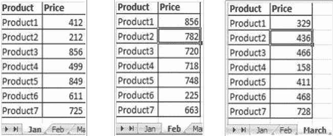
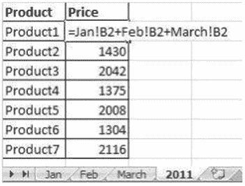
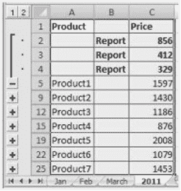

# 第十二章使用多个工作表、工作簿和应用程序

介绍

与多个工作表、工作簿和应用程序一起工作对于有效管理和分析数据至关重要。本章探讨了建立不同工作表之间链接、创建不同软件之间链接、利用审计功能跟踪错误、在工作组中协作以及创建超链接以实现无缝导航的各种技术。通过掌握这些技能，您将能够提高处理复杂数据场景的生产力和效率。

结构

在本章中，我们将讨论以下主题：

+   不同工作表之间的链接

+   创建不同软件之间的链接

+   审计功能

+   工作组协作

+   创建超链接

目标

学习完本章后，读者将能够识别处理多个工作表的各种方法，识别处理多个工作簿和应用程序的各种方法。

不同工作表之间的链接

如果不同工作表中有按月份排列的数据，我们需要在不同工作表中有年度数据，如图 12.1 所示，我们可以使用工作表间引用：

图 12.1: 按月份排列的数据

要使用来自不同工作表的单元格引用，您可以使用以下语法：

Sheetname!引用

图 12.2 显示了在不同工作表中找到单元格求和的示例：

图 12.2: 求和

然而，如果其他工作表中的产品名称不相同或不按相同顺序排列，这种方法将不会证明有用。在这些情况下，您可以使用 Excel 的合并功能，如图 12.3 所示：

图 12.3: 合并功能

要从不同工作表合并数据，请按照以下步骤操作：

1.  转到数据选项卡。

1.  选择合并。将打开合并对话框，如图 12.4 所示：

    

    图 12.4: 合并对话框

1.  从函数下拉框中选择要应用于数据的函数。

1.  单击浏览并选择第一组数据。

1.  单击添加。

1.  重复第二步和第三步以获取所有数据。

1.  如果要选择行和列标题，请单击顶部行和左侧列复选框。

1.  选择创建到源数据的链接，如果您希望在源数据更改时获得更新的数据。

参考以下图 12.5

图 12.5: 结果数据

创建不同软件之间的链接

让我们假设我们需要从 Excel 表格中复制某些数据到 Word 文档中。如果进行普通的复制粘贴，那么粘贴到 Word 文档中的内容是静态的，即使 Excel 工作表中的数据发生变化，它们也不会更新。现在让我们看看如何创建一个链接，使得数据即使在 Word 文档中也会更新。按照以下步骤操作：

1.  从 Excel 工作表中复制内容。

1.  在 Word 文档中粘贴时，从剪贴板组中点击“开始”选项卡。

1.  选择“编辑-特殊粘贴”。

1.  在“特殊粘贴”对话框中，选择“粘贴链接”选项，然后选择 MS Office Word 对象文档。

1.  点击确定。

1.  现在每当 Excel 工作表中的数据发生变化时，这些变化将自动反映在 Word 文档中。

审计功能

你可以使用 Excel 的审计功能来跟踪工作表中的错误。你还可以跟踪工作表上单元格和公式之间的关系。你可能想要确定公式值所依赖的单元格。Excel 提供了“跟踪前导”和“跟踪从属”命令来指出这些单元格。

从属和前导单元格

前导单元格向特定单元格提供数据。从属单元格依赖于另一个单元格的值。当你在“公式”选项卡上的“公式审计”功能区组中点击“跟踪前导”和“跟踪从属”按钮时，Excel 会绘制箭头显示前导和从属单元格。

团队协作

共享工作簿使得一个工作组的多个成员能够协作处理相同的数据集。例如，几个销售经理可以在同一个工作簿中输入各自地区的销售数据，从而无需手动收集和整合数据。

共享工作簿

要共享工作簿，请按照以下步骤操作：

1.  打开你想要共享的工作簿。

1.  激活审阅功能区选项卡。

1.  在更改功能区组中，点击“共享工作簿”以打开“共享工作簿”对话框。

1.  激活编辑选项卡。

1.  勾选允许多个用户同时进行更改，然后点击确定。

1.  将工作簿保存在其他用户可以访问的位置。

你可以通过使用“共享工作簿”对话框的“高级”选项卡来控制工作簿的共享方式。例如，在更新更改下，你可以选择在文件保存时查看其他用户每次保存工作簿时的更改。你还可以设置更改将自动显示的间隔。

合并工作簿

你可能需要在无法同时访问同一文件的用户之间共享工作簿。在这种情况下，你可以分发共享工作簿的副本，允许用户对其副本进行更改，然后将这些副本合并为单个工作簿。要共享一个打算稍后合并的工作簿，请按照以下步骤操作：

1.  打开“共享工作簿”对话框，激活“编辑”���项卡，并勾选允许多个用户同时进行更改。

1.  在“高级”选项卡下的“跟踪更改”中，选择 保留更改历史。在框中，输入您希望允许用户在工作簿中进行更改的天数。

1.  点击确定。

1.  复制工作簿并将其分发给每个用户。

用户对其工作簿副本进行更改后，您可以使用以下步骤将这些副本合并为单个工作簿：

1.  选择 文件，Excel 选项 打开 Excel 选项对话框。

1.  选择 自定义，并将 比较和合并工作簿 添加到快速访问工具栏。

1.  在快速访问工具栏上，选择 比较和合并工作簿 打开 选择要合并到当前工作簿的文件 对话框。

1.  选择包含您想要合并更改的工作簿副本。

1.  点击确定。

跟踪更改

您可以通过使用“跟踪更改”功能来分析用户对工作簿所做的更改。这将告诉您谁做出了更改，何时做出了更改，原始值和更改后的值，而无需手动比较两个工作簿。如果您的工作簿未共享，Excel 在您打开“跟踪更改”功能时会自动将工作簿共享。要突出显示更改，请按照以下步骤操作：

1.  激活审阅功能区。

1.  在“更改”功能区，点击 跟踪更改 并选择 高亮显示更改 打开 高亮显示更改 对话框。

1.  如果工作簿未共享，请勾选编辑时跟踪更改。如果工作簿已共享，默认情况下将会被选中。

1.  指定您希望如何跟踪更改：

    1.  如果想要根据更改时间查看更改，例如在特定日期之后，请勾选何时，然后从列表中选择必要的设置。

    1.  如果想要查看特定用户所做的更改，请勾选谁，然后从列表中选择所有人或除了我之外的所有人。

    1.  如果想要查看对特定单元格范围所做的更改，请勾选何处，然后输入范围。

1.  点击确定。

要查看工作簿更改并接受或拒绝它们，请按照以下步骤操作：

1.  打开包含跟踪更改的工作簿。

1.  激活审阅功能区。

1.  在“更改”功能区，点击 跟踪更改 并选择 接受/拒绝更改。

1.  将提示保存工作簿。点击确定保存工作簿。

1.  出现“选择要接受或拒绝的更改”对话框。

1.  如果想要根据更改时间查看更改，请勾选何时，然后选择一个时间段。

1.  点击确定打开 接受或拒绝更改 对话框。

1.  同时，包含更改值的单元格将被突出显示。此对话框显示有关每个更改的信息，包括进行更改的人员姓名、更改日期和时间，以及如果接受或拒绝建议更改将发生的其他更改。您可以向下滚动查看其余内容。

1.  点击接受以接受更改，或点击拒绝以恢复原始值。

1.  下一个具有更改值的单元格将被突出显示。

创建超链接

要在同一工作簿内创建超链接，请按照以下步骤操作。

1.  要链接特定单元格，首先为单元格命名。

1.  选择单元格，点击公式选项卡。

1.  选择定义名称。

1.  定义名称对话框将出现。

1.  在定义对话框中，键入单元格的名称并点击添加。

1.  点击关闭。

1.  现在点击要创建超链接的单元格。

1.  点击插入-超链接或按 Ctrl+K。

1.  插入超链接框将出现。

1.  点击此文档中的位置选项。

1.  点击定义名称选项。工作簿的定义名称将显示。

1.  选择在前一步中创建的定义名称。

1.  点击确定。

1.  链接已创建。

创建到不同文件的链接

要创建到不同文件的链接，请按照以下步骤操作：

1.  要链接特定单元格，首先为单元格定义名称。

1.  选择单元格，点击公式选项卡。

1.  选择定义名称。定义名称对话框将出现。

1.  在定义对话框中，为单元格命名。

1.  点击添加，然后点击关闭。

1.  现在点击要创建超链接的单元格，然后点击插入-超链接或按 Ctrl+K。

1.  插入超链接框将出现。

1.  点击现有文件或网页选项。

1.  浏览到您保存要链接到的文件的文件夹。

1.  点击列表中出现的文件。

1.  文件路径将显示在其下的地址框中。

1.  点击确定。

您也可以使用此方法链接到网页。要执行此操作，请在地址框中输入网页的 URL。要链接到 Excel 工作簿中的特定单元格，在上述过程的第六步中，在地址框的文件路径末尾提及工作表名称和单元格引用，格式如下：

文件路径#工作表名称!命名范围

例如，使用 c:\test.xlsx#salary!A1 来引用位于 c 驱动器中 test.xlsx 文件中 Salary 工作表的 A1 单元格。

您还可以在创建超链接或超链接到电子邮件地址时使用超链接对话框中的选项创建新文档。

结���

与多个工作表、工作簿和应用程序一起工作需要对可用功能和技术有扎实的理解。本章为您提供了有关在工作表之间建立链接、在不同软件之间创建链接、利用审计功能、在工作组中协作以及创建超链接的宝贵见解。通过在日常工作中应用这些概念，您可以简化数据管理流程并改善与他人的协作。通过实践，您将能够熟练地处理多个数据源，并最大限度地发挥工作表、工作簿和应用程序的潜力。

练习

1.  打开一个 Excel 工作簿，并创建三个名为“销售”、“支出”和“汇总”的工作表。

1.  在“销售”工作表中，输入不同产品的月度销售数据。

1.  在“支出”工作表中，输入各种类别的月度支出数据。

1.  使用工作表间引用来计算“汇总”工作表中的总销售额和总支出。

1.  使用 Excel 的合并功能将“销售”和“支出”工作表中的数据合并到单独的工作表中。

1.  在 Excel 工作表和 Word 文档之间创建链接。将 Excel 工作表中的汇总数据复制并粘贴到 Word 文档中作为链接对象。

1.  使用 Excel 的审计功能来追踪一个工作表中特定公式的前导和依赖项。

1.  与同事共享工作簿并允许同时编辑。

1.  将多个副本的工作簿中的更改合并回单个工作簿。

1.  跟踪不同用户在工作簿中所做的更改，并审查和接受/拒绝这些更改。

加入我们书籍的 Discord 空间

加入书籍的 Discord 工作空间，获取最新更新、优惠、全球科技动态、新发布和与作者的会话：

**[`discord.bpbonline.com`](https://discord.bpbonline.com)**

