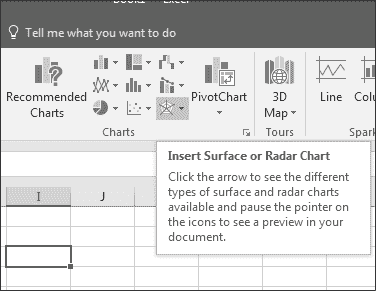
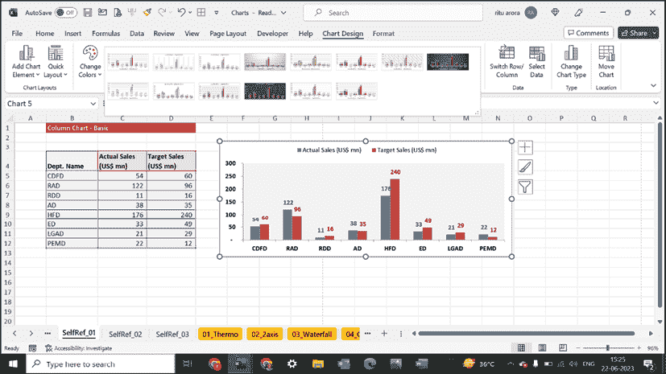
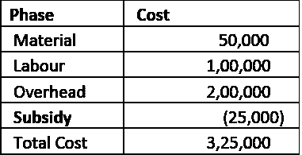
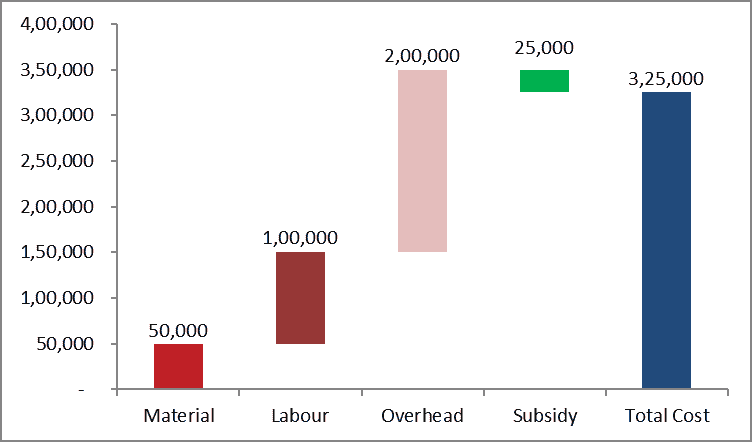
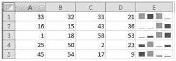

# 第十三章使用图表

介绍

在本章中，我们将探讨在 Excel 中使用图表的主题。图表是一种强大的工具，可用于将数据可视化并以有意义的方式呈现。通过创建图表，您可以快速分析趋势、比较数据并有效地传达信息。本章将指导您使用图表工具创建图表、了解不同的图表设计、格式化图表以及利用 Excel 提供的推荐。我们还将介绍火花线，这是一种紧凑的图表，可以嵌入单元格中，提供数据趋势的快照。

结构

在本章中，我们将讨论以下主题：

+   使用图表工具创建图表

+   图表设计

+   格式化图表

+   推荐

+   火花线

目标

在学习本章之后，读者将能够使用图表工具创建图表，识别不同类型的图表并格式化图表。

使用图表工具创建图表

图表可以更有效地呈现数据。例如，分析数据趋势需要时间，但如果以图形方式表示，就会变得容易。有许多类型的图表，如柱状图、折线图、饼图、条形图、区域图和散点图。要创建图表，请按照以下步骤进行：

1.  选择数据。

1.  转到插入选项卡

1.  从图表组中选择要创建的图表，如图例 13.1 所示。

1.  我们可以选择任何类型的柱状图或单击“所有图表类型”|“插入图表”。将显示对话框。

1.  选择所需的图表。

1.  单击确定。

1.  该图表将在同一工作表上创建，Excel 还将在该对话框中推荐一些图表。

参考以下图例 13.1：

图例 13.1: 图表

图表设计

Excel 为每种图表类型提供了不同的图表设计，我们可以从设计选项卡中进行选择。可以在以下图例 13.2 中看到设计画廊的示例：

图例 13.2: 图表设计

使用图表工具添加标题和值

Excel 为我们提供了一些内置布局。这些可以从图表工具的设计选项卡中选择。我们还可以创建一些自定义布局，并根据需要设置轴标题、图表标题、图例、数据标签和数据表位置。

要执行此操作，请按照以下步骤：

1.  使用设计选项卡。在图表布局组中单击“添加图表元素”选项。

1.  添加图表元素。

1.  在“添加图表元素”选项下，用户可以使用许多选项来格式化图表，例如添加次轴、为轴命名、为图表命名、数据标签等等。

参考以下图例 13.3：

图例 13.3: 图表的关联选项

格式化图表

Excel 提供了一种更改默认设计模板中各部分默认颜色的方法。

要这样做，请使用“图表工具”选项卡下的“格式”上下文选项卡。它将为您提供各种选项，以更改轮廓颜色、形状对齐和定位图表。

���的数据的图表

根据您的需求，您可以选择不同类型的图表来代表您的数据。

表 13.1 展示了各种数据类型以及可以有效表示它们的图表：

| 图表类型 | 所代表的数据 |
| --- | --- |
| 柱状图 | 代表一段时间内数据的变化。 |
| 条形图 | 代表数值比较。 |
| 折线图 | 代表均匀间隔的值 |
| 散点图 | 显示和比较数值，如统计、科学和工程数据。 |
| 饼图 | 代表给定值中不同值的关联。 |
| 圆环图 | 代表部分与整体的关系 |
| 气泡图 | 代表金融数据 |
| 面积图 | 代表两组数据之间的最佳组合 |
| 雷达图 | 当您想查看与一个项目相关的几个不同因素时使用 |

表 13.1：图表类型

图表模板

有时，在创建图表后，我们决定在将来也使用相同的设计。每次手动执行可能会很困难。Excel 提供了一种方法，可以将图表保存为模板。执行以下步骤保存图表为模板：

1.  创建图表后，在图表上右键单击并选择“另存为模板”选项。

1.  出现“另存为”对话框。在这里，保存您的图表。

如果将来想要使用此模板，请执行以下步骤：

1.  右键单击新创建的图表。

1.  出现上下文菜单。单击“更改图表类型”。

1.  在“插入图表”对话框中，单击“模板”。在这里，您可以看到所有保存的模板。

1.  现在，选择要应用于当前图表的所需模板。

图表筛选选项

另一个令人印象深刻的功能是图表筛选选项，它在插入图表时列出所有变量（系列）和类别，以便进行交互查看。过去过滤图表信息非常困难。如果您想按照自己的要求查看信息，请使用“图表筛选”按钮。

瀑布图

要在 Excel 中创建瀑布图，您可以按照以下步骤进行：

1.  选择包含类别和数值数据的表格。

1.  转到 Excel 功能区中的“插入”选项卡。

1.  在“图表”部分，单击“瀑布图”类型。

1.  选择所需的瀑布图子类型（例如，“瀑布”或“堆积瀑布”）。

1.  Excel 将根据图 13.4 中提供的选定数据生成瀑布图：

    

    图 13.4：用于图表的数据

图表可以在以下图 13.5 中看到：

图 13.5：瀑布图

结果瀑布图将显示每个类别作为一个条形图，正值由上升超过起始点的条形表示，负值显示为下降到起始点以下的条形。累积总数由每个条形的长度和位置表示。

推荐

插入选项卡中拥有从推荐的数据透视表到推荐的图表的新功能。Excel 提供了建议，以在最短时间内实现最大效果。为了获得最佳结果，请使用 Excel 的建议。

要使用推荐，请执行以下步骤：

1.  选择要创建图表的数据。

1.  点击插入选项卡

1.  选择推荐的图表选项。您将看到各种图表类型。

1.  选择其中任何一个。

迷你图

迷你图是可以放入单元格中的小图表。迷你图帮助用户在数据旁边查看摘要趋势。它占用很少的空间。特别适用于仪表板或其他需要以易于理解的视觉格式显示业务快照而不添加大量细节的地方。例如，以下图 13.6 和图 13.7 展示了迷你图如何让您一目了然地看到每个部门在五月份的表现：

图 13.6：迷你图示例 1

参考图 13.7：

图 13.7：迷你图示例 2

创建迷你图

要创建迷你图，按照以下步骤进行：

1.  选择要插入一个或多个迷你图的空单元格或一组空单元格。

1.  在插入选项卡上，在迷你图组中，点击您想要创建的迷你图类型：线条、柱状图或盈亏图。

1.  在数据框中，输入包含您想要基于的数据的单元格范围。

1.  选择一个或多个迷你图后，迷你图工具将出现并显示设计选项卡。

1.  在设计选项卡上，您可以从迷你图、类型、显示/隐藏、样式组中选择一个或多个命令。

1.  使用这些命令来创建新的迷你图，更改其类型，格式化它，显示或隐藏线迷你图上的数据点，或在迷你图组中格式化垂直轴。

自定义迷你图

创建迷你图后，Excel 提供了所有控制选项来自定义迷你图，如高、低、首个、最后一个或任何负值。您还可以将迷你图类型更改为其他类型，如线条、柱状图或盈亏图。您还可以从库中选择样式或设置单独的格式选项，设置垂直轴上的选项，并控制空值或零值的显示方式。

更改迷你图的样式

在选择包含数据的单元格时，使用 Design 选项卡上的样式库，执行以下步骤来更改走势图的样式：

1.  选择单个走势图或走势图组。

1.  要应用预定义的样式，请在 Design 选项卡上。

1.  在样式组中，单击一个样式或单击框的右下角的箭头以查看其他样式。

1.  为走势图选择特定的格式。

结论

图表是 Excel 中用于以视觉和易于理解的格式呈现数据的重要工具。通过掌握本章讨论的技术，您将能够有效地创建、自定义和格式化图表。无论您需要分析趋势、比较数据还是向他人传达信息，图表都可以极大地增强数据呈现的清晰度和影响力。

练习

1.  从您自己的电子表格中选择一组数据或创建一个示例数据集。

1.  使用所选数据创建一个柱状图。

1.  通过添加标题、图例和数据标签来自定义图表。

1.  将不同的图表设计应用于创建的图表并观察变化。

1.  通过更改颜色、轮廓和其他格式选项来格式化图表。

1.  将图表保存为模板以供将来使用。

1.  使用 Excel 中的推荐功能来探索数据集的不同图表选项。

1.  在单元格中创建一个小型走势图以表示数据子集中的趋势。

1.  通过更改其类型、样式和格式选项来自定义走势图。

1.  与他人分享您的图表和走势图，展示您的数据分析和可视化技能。

加入我们书籍的 Discord 空间

加入书籍的 Discord Workspace 以获取最新更新、优惠、全球科技动态、新发布和与作者的交流：

**[`discord.bpbonline.com`](https://discord.bpbonline.com)**

